# VHash と timestamp forwarding — 論文ストーリー 2026-09-29 版

> **この版の地位。** 出典メモ (`source-memo-2026-09-29.md`) を受け取った当日の凍結スナップショット。
> **実装・計測・文献確認・正しさの証拠はいずれもゼロ**であり、書いてあるのは構想の図解と作業の地図だけである。
> 図はすべて値を含まない模式図 (Mermaid と文字の図) で、図に出てくる timestamp は記号 (t1 < t2 < …) である。
> この版で確かめた事実は §8 の 2 件 (ソースと検査器の走査) だけで、ほかはメモの主張の整理である。

---

## 0. 一目でわかる全体像

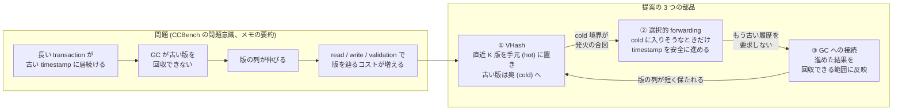

**読み方。** 左が解きたい問題の因果、右が提案の 3 部品である。部品は独立ではなく、①の hot / cold の境界が
②の発火条件になり、②で進めた結果を③で回収に結びつける、という循環を狙う。

**この図から読み取ってはならないこと。** 循環が実際に回るか (H4・H5) は未検証である。③は ②が成功しても
自動では起きない (§5)。また、読み取り後に止まっている transaction には②が発火しない (§6)。

中心の一文 (メモ §32):

> **古い version を速く探すだけでなく、古い version を探さずに済む timestamp へ transaction を動かす。
> さらに、その移動を古い履歴の回収につなげる。**

### 0.1 検証の段取りの全体

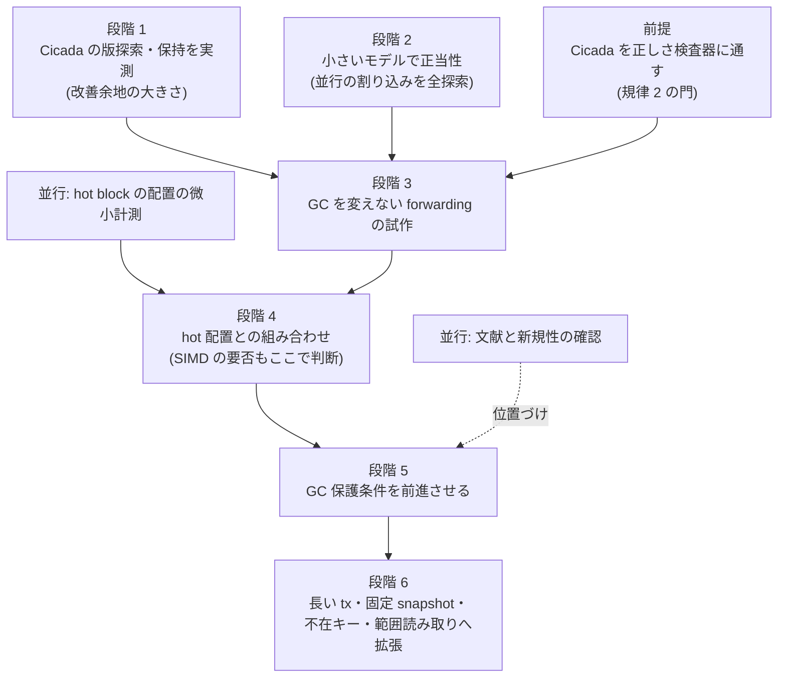

**読み方。** メモ §29 の段階 1〜6 に、この版で見つけた前提 (Cicada の正しさ検査、§8) と、並行に進められる
2 本を足した。段階 3 以降の性能値は、前提の検査を通るまで「未検証の診断値」としてしか扱えない (絶対規律 2)。

---

## 1. 問題: GC を速めても、長い transaction が版を抱え続ける

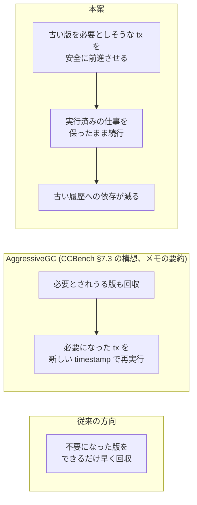

**読み方。** 3 つとも「古い版が性能を削る」ことへの答えだが、どこを変えるかが違う。従来は GC 側を速める。
AggressiveGC は版を先に捨て、困った transaction をやり直させる。本案は transaction 側を動かし、
**GC ができる状態を早く作る** (メモ §2)。やり直しを避ける点が AggressiveGC との違いになる。

**この図から読み取ってはならないこと。** CCBench 論文 §7 (図 12〜14、RapidGC の頭打ち) の内容はメモの要約であり、
この版ではまだ原典で読み直していない。論文の本文で使う前に、文献の wave が原典の節・図番号と照合する。

---

## 2. VHash: 直近の少数版を手元に置く

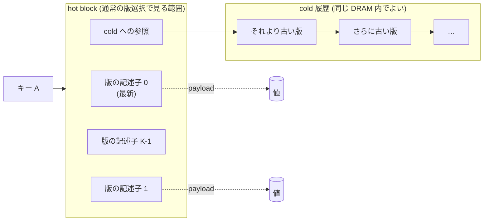

記述子の候補 (メモ §5.1): 版の識別子・書き込み timestamp・状態 (PENDING / COMMITTED / ABORTED)・
値への参照・検証に要る情報。

**設計上の分かれ道 (まだ決めていない):**

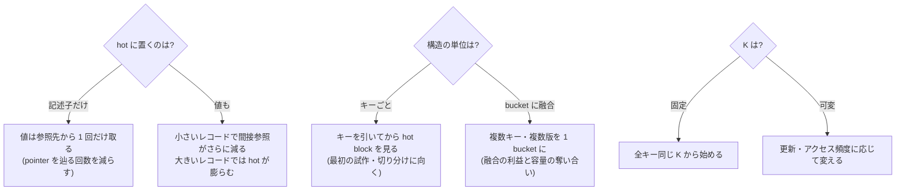

**読み方。** 「3 版を hot に置く」という言い方は、記述子だけか値もか、キー単位か bucket 単位かを決めないと
仕様にならない (メモ §5.2・§6)。**K はシステム全体の保持版数の上限ではなく、hot の容量である。**
K = 3 に特別な保証は無く、実験で決める (メモ §28.3)。

### 2.1 版選択をまとめて比べる (SIMD は必須ではない)

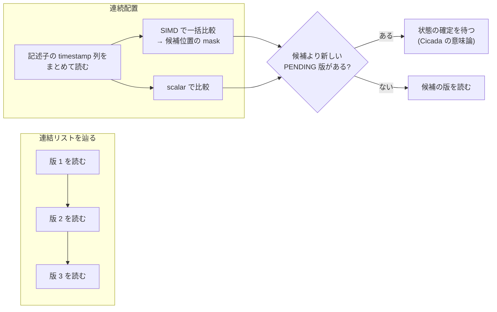

**読み方。** 狙いは比較命令の数ではなく、**候補を見つけるまでに別々の場所を順に読む回数**を減らすことである。
比べるべきは「連結リスト」「連続配置 + scalar」「連続配置 + SIMD」の 3 つで、連続配置の利益と SIMD の利益を
混ぜない (メモ §7.4)。SIMD の結果で COMMITTED だけを拾うと、候補より新しい PENDING 版を無視することになり
Cicada の版選択と一致しない (メモ §7.3)。

---

## 3. 選択的 forwarding: cold に入りそうなときだけ timestamp を進める

### 3.1 読み取りの判断

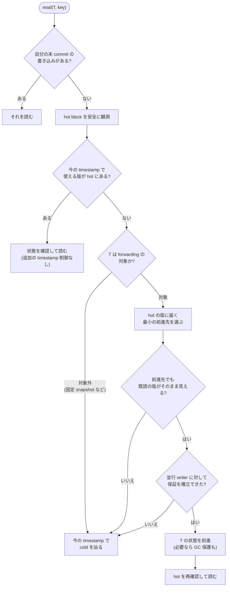

**読み方。** hot で当たる普通の読み取りには何も足さず、**高くつきそうな読み取りだけ**を対象にする (メモ §12.2)。
前進に失敗したら今の timestamp のまま cold を辿る。図の「安全に観測」「保証を確立」「GC 保護」の 3 か所が、
研究で具体化と証明が要る部分である (メモ §19)。

**この図から読み取ってはならないこと。** 失敗時に元の timestamp へ戻れるのは、GC へ新しい保護下限を公開する前だけ
である (§5.2)。前進先を選んだ後に hot block が書き換わることもあり、選んだ記述子をそのまま使い続けてよい保証は無い。

### 3.2 3 つの方針の違い (記号の例)

T の今の timestamp を t3 とし、既読の版 A が t1 から t6 の手前まで見えているとする。キー B の版は
新しい順に B@t8, B@t7, B@t5 が hot、B@t4, B@t2 が cold にある (t1 < t2 < … < t8)。

```text
時刻  →   t1    t2    t3    t4    t5    t6    t7    t8
既読 A    [===========================)                  A の見える区間 [t1, t6)
B の版          B@t2        B@t4  B@t5        B@t7  B@t8
                └── cold ──┘      └──────── hot ─────────┘
T の現在              ^t3

固定          : t3 のまま → B@t2 を読む          → cold を辿る
必ず最新      : t8 へ進む → B@t8 を読む          → A が見えない (t8 は [t1, t6) の外)
選択的        : t5 へ進む → B@t5 を読む          → A も見える (t5 は [t1, t6) の中)、cold を避けられる
```

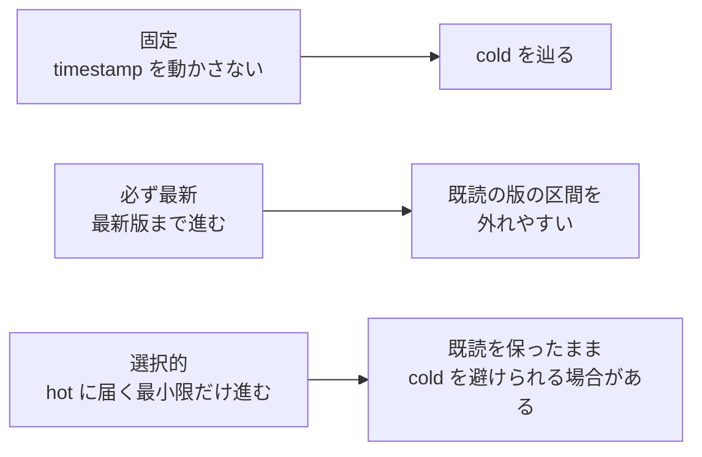

**読み方。** 選択的 forwarding は「最新版まで進む」必要がない。hot のうち**最新ではない版** (B@t5) を選べることが、
旧版の値を取り出せる MVCC に固有の自由度である (メモ §11.3・§12.1)。single-version の TicToc も
timestamp の履歴で既読値を救えるので、「上書きされた既読値を救える」こと自体は新規性にならない (メモ §11.2・§22.1)。

**この図から読み取ってはならないこと。** 最小限の前進は最適性が証明された方針ではなく、比べるための出発点である
(メモ §12.3)。前進先は read の下限だけでなく、書き込み側の制約と timestamp の一意性も満たさなければならない (メモ §10)。

### 3.3 可視区間で書くと

版 v が見える区間を I(v) = [b(v), e(v)) と書くと、既読の版の集合 R_T が同時に見えうる区間は

- 下限 L_T = max b(v)、上限 U_T = min e(v) (v ∈ R_T)
- 共通の timestamp が存在する条件は L_T < U_T

である (メモ §9)。これは **read 集合の整合性の条件であって、更新 transaction 全体の commit 条件ではない。**

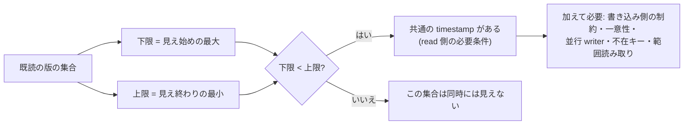

---

## 4. 並行 writer との競合: 確認してから rts を書くだけでは足りない

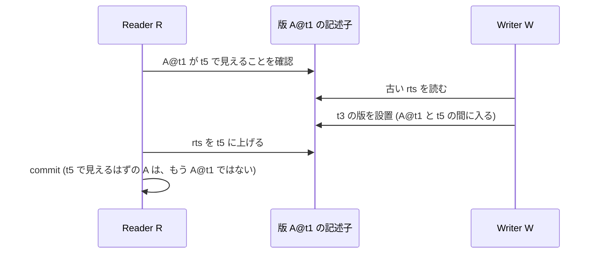

**読み方。** 確認と通知の間に writer が割り込むと、確認した「見える」が崩れる (メモ §13.1)。
reader が「この timestamp で読む」と writer に知らせる処理と、writer が「保証済みの読み取りを壊さない」ことを
確かめる処理が**両方向で**噛み合うプロトコルが要る (メモ §13.2)。

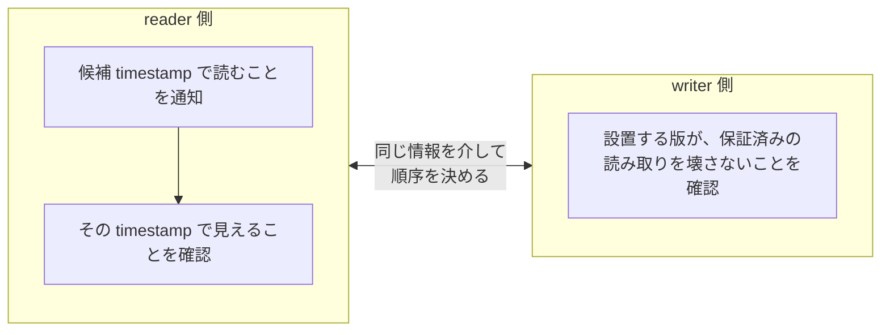

**この図から読み取ってはならないこと。**

- **rts は版の見える区間の終わり (end_ts) ではない。** 「rts が候補以上だから見えることの確認を省ける」は
  一般には成り立たない (メモ §13.3)。
- 「同じ記述子を CAS すれば解決」は直観であって完成したプロトコルではない。**CAS を使うことと lock-free であることは別**
  (メモ §13.4)。
- 観測した「次の版の timestamp」は、途中に別の版が設置されると縮みうる。「今見えている終わり」と
  「これ以上縮まないと保証された終わり」を区別する (メモ §14.1)。

---

## 5. GC への接続: 進めただけでは回収は進まない

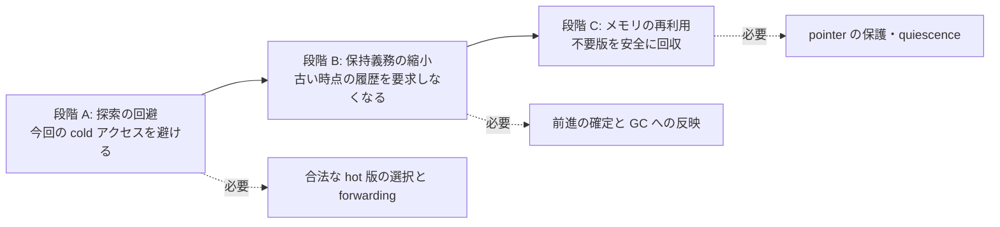

**読み方。** A だけでも速くなる可能性はあるが、B と C まで実現しなければ「GC を改善した」とは言えない (メモ §15.1)。

### 5.1 公開の順序

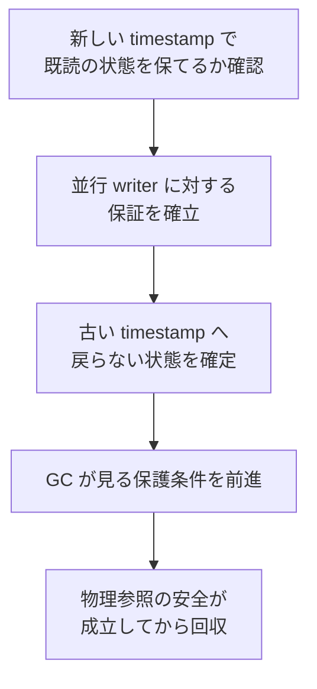

**読み方。** 自分の timestamp 変数を進めても、GC 側が古い値を保護条件として持っていれば回収範囲は変わらない。
逆に正当性を確定する前に保護を外すと、まだ要る版が消える (メモ §15.2)。

### 5.2 戻れる段階と戻れない段階

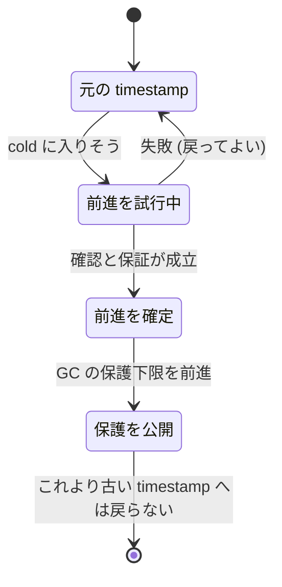

**この図から読み取ってはならないこと。**

- 古い書き込み timestamp を持つ版がすべて回収できるわけではない。前進先でもまだ見えている古い版 (前の例の A) は要る (メモ §15.3)。
- 自分が前進しても、別の transaction が古い timestamp を要求していれば全体の回収境界は動かない。
  **forwarding の成功回数は GC 改善の指標にならない** — 回収境界の前進量と回収可能になった量を測る (メモ §15.4)。
- 目標は free の回数を減らすことではなく、**同時に生きている古い版の量** (≈ 発生速度 × 保持時間) を減らすこと (メモ §15.5)。

---

## 6. この仕組みだけでは解けないケース

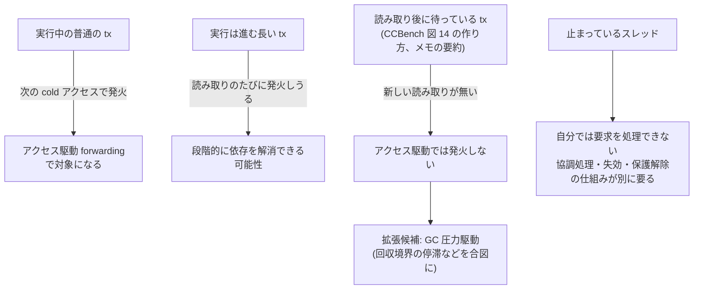

**読み方。** CCBench の長い transaction の再現方法 (読み取りの後に待つ) では、アクセス駆動の forwarding は
**一度も発火しない**。これは本案の重要な限界であり、評価でも「アクセス駆動が効かなかった」と
「forwarding が無効だった」を区別する (メモ §16・§26.2)。
**1 行目の問題を解いたことを、4 行目まで解いたように書かない。**

### 6.1 前進してよい transaction と、してはいけない transaction

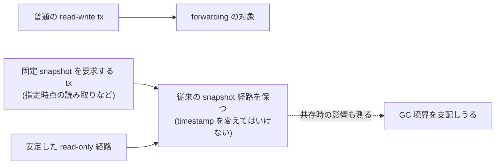

**読み方。** 「MVCC の機能を保つ」は、旧版の取得・serializability・固定 snapshot の意味の 3 つを別々に書く (メモ §17.1)。
read-only の安価な経路に forwarding のための記録を足すと逆効果になりうる (メモ §17.2)。実時間の順序
(先に終わった tx より後に始めた tx の並べ方) を保証に含めるかも、比較相手と揃える (メモ §17.3)。

---

## 7. 実装で分けておく状態

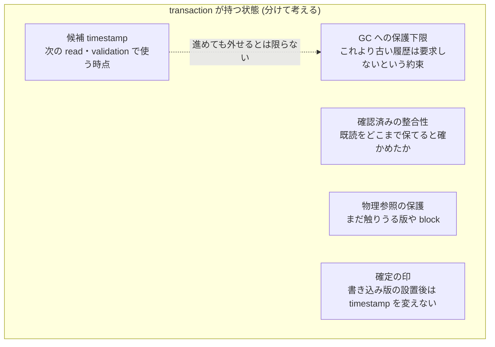

**読み方。** 1 つの `ts` だけで持つと、探索の都合と GC の都合が混ざる。**候補を進めたことと、GC 保護を外せることは別**
である (メモ §18)。最初の実装では、共有構造へ PENDING の書き込み版を置く前にだけ forwarding を許す。

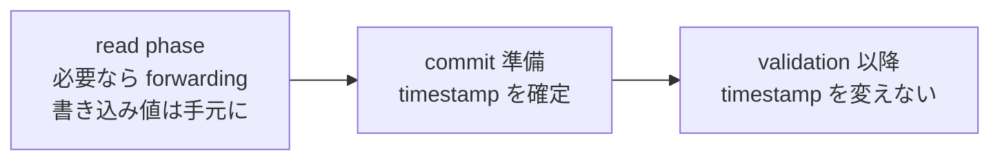

**まだ決めていない実装の論点 (メモ §20):** hot の更新方法 (並べ替え・ring buffer・block の差し替え)、
timestamp 順と設置順のずれ、K に PENDING 版を数えるか、複数 word の記述子を一貫して読む方法、
slot 再利用の取り違え (ABA)、不在キー・削除・範囲読み取り、hot から cold への移し替えの費用。

---

## 8. 状態: 何が確かめられていて、何がまだか

この節の状態語は 4 つだけ使う: **構想のみ** (メモの主張のみ)・**設計中** (仕様や模型を書いている)・
**実測あり** (一次資料に計測や検査の記録がある)・**検証済み** (正しさ検査または証明を通った)。

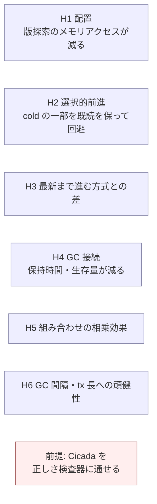

| 項目 | 状態 | 根拠 |
|---|---|---|
| H1〜H6 (メモ §24) | **構想のみ** | 出典メモの主張だけ。計測・模型・文献確認は無い |
| 前提: Cicada の正しさ検査 | **未整備** (事実) | 2026-09-29 に、CCBench の Silo のソースには `#if TRACE` の検査用トレースがあり、`cc/cicada/` の全ファイルには `TRACE` の文字列が 1 つも無いことを同じ grep で確かめた。izanagi の検査器 (`orchestrator/verifier/`) にも `cicada` の文字列が無い |
| 過去の Cicada 対応の計画 | 未着手のまま | `docs/phase3.md` のクロスプロトコル対応の Group C (Cicada の MVCC 版管理の feasibility 調査) は未着手と記録されている。一次資料は `output/insights/2026-08-20_tictoc-cicada-cross-protocol-task-definition.md` |

**なぜ前提が重要か。** 絶対規律 2 により、正しさ検査器が anomaly を検出した variant は即失格であり、検査を通していない
variant の性能値は採否の根拠にできない。forwarding は timestamp を動かす変更なので、**serializability を壊す方向の
誤りが最も入りやすい機構**である。検査器が Cicada を扱えるようになるまで、試作の性能値は「未検証の診断値」である。

### 8.1 仮説と実験と作業の対応

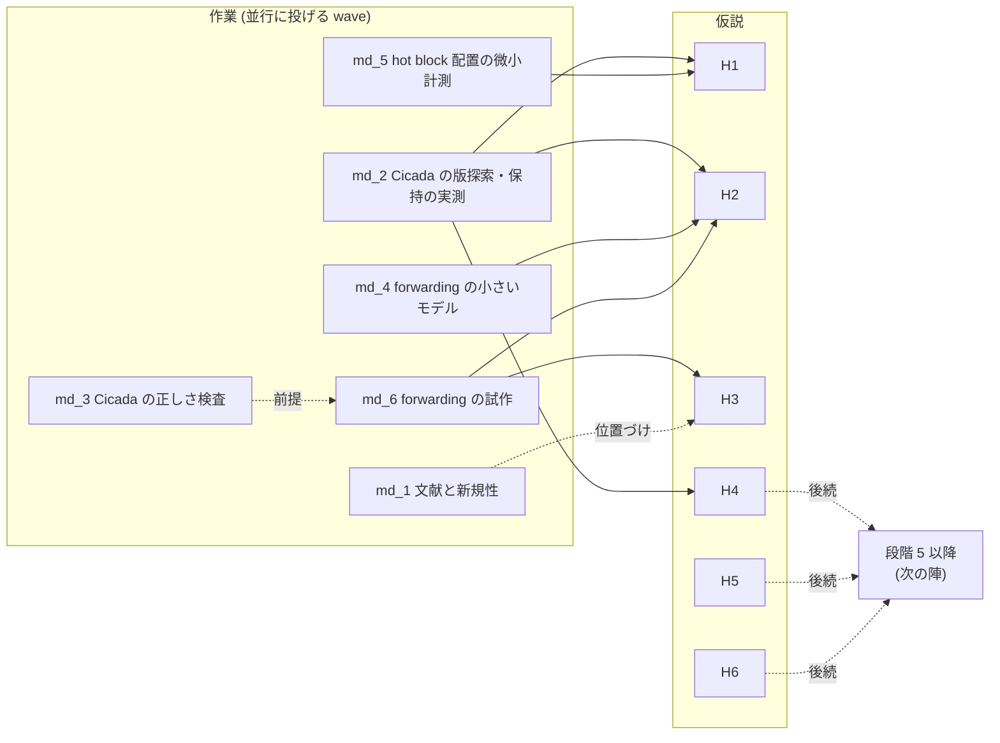

**読み方。** md_1〜md_6 は 2026-09-29 に並行投入用に用意した wave の投げ文の番号である (投げ文の本体は repo の外に置いた)。
H4〜H6 を直接確かめる作業は、段階 3 の試作と正しさ検査が揃った後の陣になる。

---

## 9. 評価の組み立て (メモ §25 の構成を図にしたもの)

```mermaid
flowchart TB
  A["A 基準 Cicada<br/>(最適化と GC 設定を調整済み)"]
  B["B hot 配置だけ"]
  C["C forwarding だけ<br/>(論理的な K 版の境界で発火)"]
  D["D hot 配置 + cold 境界での forwarding"]
  E["E D + GC 保護条件の前進"]
  F["F cold に入ったら abort して新しい timestamp で再実行"]
  G["G 最新を読み timestamp を後で決める単純な拡張"]
  A --> B & C
  B --> D
  C --> D
  D --> E
  A --> F
  A --> G
  F -.比べる.-> D
  G -.比べる.-> D
```

| 比較 | 何が分かるか |
|---|---|
| A と B | データ配置だけの効果 (H1) |
| A と C | forwarding だけの効果 (H2) |
| B・C と D | 組み合わせの効果 (H5) |
| D と E | 実際の保持・回収への効果 (H4) |
| F と D | 実行済みの仕事を保つ価値 |
| G と D | 最新ではない hot 版を選べる価値 (H3) |

**読み方。** 狙いは「Cicada より速い」だけでなく「何を変えたから速いか」を言えることである (メモ §25.2)。
C には物理的な hot が無いので、「先頭から K 版より奥を辿る必要があるとき」という論理的な発火条件を置かないと
比較の条件が変わる。キーの引き方 (Masstree から hash へ等) を変えるなら、版管理だけを変えた比較と分ける (メモ §25.1)。

### 9.1 効かないはずの条件も入れる

```mermaid
flowchart LR
  bad1["ほぼ全部 hot で当たる"] --> small["効果が小さい・逆効果になりうる"]
  bad2["read 集合が非常に大きい"] --> small
  bad3["既読のキーが頻繁に更新され<br/>前進の余地が無い"] --> small
  bad4["固定 snapshot の reader が<br/>GC 境界を支配する"] --> small
  bad5["値が小さく hot の記述子が相対的に大きい"] --> small
```

**読み方。** 効かない条件を隠さず示すことで適用範囲をはっきりさせる (メモ §26.3)。

### 9.2 測るもの

```mermaid
mindmap
  root((測るもの))
    最終性能
      throughput
      完了までの latency
      再実行込みの処理時間
      長い tx の完了率
    探索
      read で調べた版数
      write と validation で調べた版数
      hot の当たり率
      cold のアクセス率と辿った長さ
    forwarding
      試行と成功の回数
      前進幅
      追加の検証時間
      共有書き込み
      前進後の abort 率
      失敗の理由の内訳
    GC とメモリ
      版の保持時間
      生きている版の数と bytes
      回収境界の遅れ
      論理的に回収可能だが残っている bytes
      allocator の予約と使用量
```

### 9.3 論文の主要な図の候補 (値のある図は未作成)

| 図の候補 | 何を何と比べるか | 状態 |
|---|---|---|
| GC 間隔と throughput | 調整済み Cicada と D・E。Cicada の最良設定に対する性能、または同じ性能に要るメモリ | 図の候補 (未作成) |
| 長い tx の長さとメモリ | アクセス駆動だけの構成と、GC 圧力駆動を含む構成 | 図の候補 (未作成) |
| K と性能・メモリ | K → hot の当たり率 → forwarding 回数 → throughput → 総メモリ | 図の候補 (未作成) |
| 省いた仕事と足した仕事 | 避けた cold 探索・再実行の時間と、足した検証・同期の時間 | 図の候補 (未作成) |

---

## 10. 過大主張チェックリスト (メモ §30 から)

執筆の段で消し込み式に使ってよい。

```mermaid
flowchart LR
  x1["最新版だけ読めば 1 版でよい"] -->|誤| y1["旧版を新たに取り出す能力を残す"]
  x2["single-version なら上書き後は必ず abort"] -->|誤| y2["timestamp の履歴で救える場合がある (TicToc)"]
  x3["read の最大 wts で commit timestamp が決まる"] -->|誤| y3["read の下限でしかない"]
  x4["rts は見える区間の終わり"] -->|誤| y4["役割が違う"]
  x5["COMMITTED との SIMD AND で Cicada の版選択になる"] -->|誤| y5["PENDING 版の扱いが要る"]
  x6["CAS を使えば lock-free"] -->|誤| y6["進行保証は別に示す"]
  x7["timestamp を進めれば GC が進む"] -->|誤| y7["保護の公開と物理参照の保護まで要る"]
  x8["3 版残せば常に十分"] -->|誤| y8["K は hot の容量、cold 履歴は残る"]
  x9["cold 契機だけで長い tx の GC 問題が解ける"] -->|誤| y9["読み取り後に待つ tx には発火しない"]
  x10["Cicada に勝てば MVCC 全体の最高性能"] -->|誤| y10["対象範囲と近い代替方式を確かめてから"]
```

- [ ] 「GC を改善した」と書くときは、回収境界の前進量と生存量の減少を一次資料で示している
- [ ] 「serializable」と書くときは、正しさ検査器 (または証明) を通った記録を指している
- [ ] 性能値は trace を除いたビルドで測り、比較相手も同じビルド条件で測っている (絶対規律 1)
- [ ] TicToc・AggressiveGC・Cicada の記述を原典の節で確かめている
- [ ] 「協調設計」という標語だけを新規性にしていない (メモ §23.4)
- [ ] 1 回の走りの前後比較ではなく、同時刻の対照を置いている

---

## 11. この版の図の数と作り方

- 本文の Mermaid 図: 24 枚。文字の図 (記号の時間軸): 1 枚。画像の埋め込み (`![`): 0 枚 (論文図はまだ無い)。
- 図はすべて値を含まない模式図である。値を持つ図は、計測の wave が生成器と provenance を伴って一次資料の側に作る。
- §0・§1〜§9 のすべての節が図から始まる。図の無い節は無い (§10 のチェックリストも図を先に置いた)。
