# VHash と timestamp forwarding — 論文ストーリー 2026-09-29b 版 (同日 2 版目)

> **この版の地位。** 2026-09-29 版 (出典メモを受け取った直後の構想の図解) の後に着地した一次資料 9 本と評価計画の草稿から、
> 起点 local main `035fc11fa` (2026-09-29 14 時台 JST) 時点の正典全体を入力にして全面再導出した凍結スナップショット。
> 2026-09-29 版の差分改訂ではない (README の凍結契約)。
>
> - **入力:** `output/insights/2026-09-29/` の `vhash-related-work` (md_1、worklog エントリ 1908)・`vhash-cicada-verifier` (md_3、1910)・
>   `vhash-forwarding-model` (md_4、1914)・`vhash-cicada-version-measure` (md_2、1916)・`vhash-hot-block-microbench` (md_5、1919)・
>   `vhash-cicada-rts-check` (md_8、1920)・`vhash-forwarding-prototype` (md_6、1924)・`vhash-novelty-repositioning` (md_9、1925)・
>   `vhash-gc-connection-model` (md_10、1929) の 9 本、評価計画の草稿 `docs/vhash-evaluation-preregistration-draft.md` (md_12、1922、**未発効**)、
>   決定 D2279・D2280・D2282・D2285〜D2288・D2290。
> - **未着地 (この版は中身を書かない):** md_11 (比較相手 Cicada の較正)、md_13 (forwarding の直列化可能性の一般の論証)、
>   md_14 (試作を GC の回収境界へつなぐ実測、構成 E)、md_15 (read-only tx と深い版探索・GC の遅れ)、md_16 (止まった thread の代行前進)。
>   起点の時点で並行 wave として走っており、一次資料は main に無い。
> - **性能値の地位:** Cicada の上で forwarding を入れた性能値は、正しさ検査の上限が indeterminate なので**すべて「未検証の診断値」**である (§8)。
>   計器入りの build で測った値 (md_2) は性能値ではない。微小計測 (md_5) は Cicada とは別の 1 キーの実験である。
> - 図は、一次資料にある値の図 (生成器と provenance 付き) を相対 path で埋め込み、値の無い模式図は Mermaid で描いた。**Mermaid 図には数値と判定を書いていない。**

---

## 0. 一目でわかる全体像

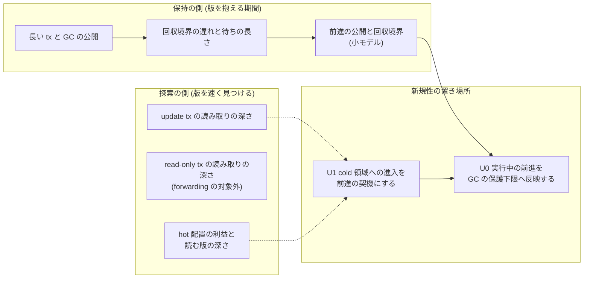

**読み方。** 箱は論証に使う観測の項目で、観測の結果は下の箇条に書く。2026-09-29 版は「古い版を速く探す (VHash) + 探さずに済む時刻へ動く (forwarding) + それを回収につなぐ (GC 接続)」の 3 部品を
同じ重さで並べていた。一次資料が揃った結果、**論文の重心は「探索を速くする」から「版を抱える期間を縮める」の側へ寄る**、というのがこの版の読みである。

- 探索の側: stock Cicada の update tx の読み取りは、この計測の範囲ではほぼ先頭の版で終わった (md_2、§2)。深い版探索の大半は read-only tx
  (固定 snapshot) から来ており、これは forwarding の対象外である。hot 配置そのものの利益は微小計測で見えたが (md_5)、Cicada に入れた前進の
  throughput の差は検出できなかった (md_6、未検証の診断値)。
- 保持の側: 長い tx は GC の公開そのものを止め、回収境界の年齢は待ちの長さに応じて伸びた (md_2)。小モデルでは、前進を確定してから公開すると
  回収境界が進み、読み取りの後に待つ tx にも tx 自身の安全点で前進を届けられた (md_10)。
- 新規性: 「前向きに進んで最新でない版を選ぶ」(U2) は既知へ移り、主張は U1 (cold 契機) と U0 (前進を保護下限へ反映する機構と、その確定・公開の順序)
  に置き直された (md_9、§10)。U0 は保持の側、U1 は探索の側の入口にある。

**この図から読み取ってはならないこと。**

- 「保持期間が縮んだ」ことは**実物ではまだ測っていない**。md_2 は余地 (長い tx が境界を止めること) を測り、md_10 はモデルの中の時刻と版の数を数えただけである。
  試作を GC につなぐ実測 (md_14) は未着地である。
- 「探索の高速化は効かない」とも言っていない。微小計測では連続配置の利益が出ており (md_5)、hot 配置 (構成 B) を Cicada に入れた計測はまだ無い。
- 矢印は論証のつながりであり、因果の強さや効果の大きさは表さない。

### 0.1 重心が動いた根拠になる 2 枚


**読み方 (md_2 の図 1)。** 上段 = update tx の読み取りのうち hot 容量 K より奥へ行った割合、中段 = read-only tx の同じ割合、下段 = 深い update read のうち
既読を保って前進できる候補があった割合 (観測時点の楽観値)。上段は K=1 でも小さく、中段は大きい。**言えること:** update tx の深い探索は少なく、
深い探索は read-only 側にある。**言えないこと:** 計器入り build・48 worker・100 万件・3 秒・YCSB の観測であり、性能や forwarding の成功率ではない。


**読み方 (md_2 の図 3)。** 上から、回収境界の年齢・公開の間隔・回収時の年齢 (生成基準と上書き基準)・鎖に接続された論理的な版の数を、GC 間隔ごとに並べた。
色が長い tx の型。**言えること:** 長い tx があると境界の年齢と公開間隔が伸びる向きである。**言えないこと:** 境界年齢と回収時年齢は timestamp 空間の値 (clock boost を含む)、公開間隔は実時間で、いずれも bucket の上界 (2 倍刻み) で表している。
論理生存版数はメモリの bytes ではない。

### 0.2 検証の段取りの現在地

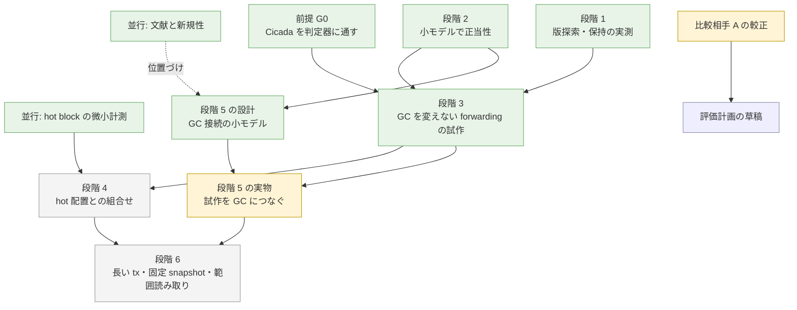

**読み方。** 緑 = 一次資料が main に着地した段、黄 = 並行 wave が走っていて一次資料が未着地の段 (md_11・md_14)、青 = 草稿がある (未発効)、
灰 = 手を付けていない段。段の名前は出典メモ §29 の段階 1〜6 と 2026-09-29 版 §0.1 の図に合わせた。
**この図から読み取ってはならないこと:** 緑は「その段の問いに答えが出た」ではなく「一次資料がある」の意味である。どの段の結論も範囲つきである (§8)。

中心の一文 (出典メモ §32、この版で言い直した形):

> **古い version を速く探すだけでなく、古い version を探さずに済む timestamp へ transaction を動かす。
> さらに、その移動を確定してから GC の保護下限へ公開し、古い履歴を抱える期間の短縮につなげる。**

---

## 1. 問題: GC を速めても、長い transaction が版を抱え続ける

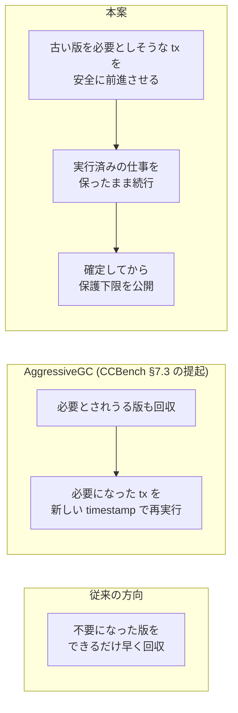

**読み方。** 3 つとも「古い版が性能を削る」ことへの答えだが、どこを変えるかが違う。本案は transaction 側を動かし、GC ができる状態を早く作る。

**2026-09-29 版からの到達。** 2026-09-29 版はこの節の CCBench 論文 §7 の内容を「メモの要約」としていた。md_1 が原典で照合し、
メモの 5 主張 (§7 が version lifetime と性能を分析、図 12〜13 の Cicada の追加コストは版の列の探索に帰属、図 14 は長い tx があると RapidGC が頭打ち、
§7.3 が AggressiveGC を提起、長い tx は read phase 末尾の人工遅延で作る) はすべて原典と一致した (md_1 §2)。
**AggressiveGC は提起であって実装・評価は無い。** 長い tx が GC を止める問題は CIDR 2021 の DAF も「効かない」と自認している (md_1 §5)。


**stock Cicada で測った「版を抱える」様子 (md_2 §0・§6.2、計器入り build、3 反復の平均):**

| 条件 (workload A = 読み 50%・skew 0、gc_inter_us = 10) | 回収境界の年齢 p50 の bucket | MinRts の公開回数 (3 秒あたり) | 論理生存版数 |
|---|---|---|---|
| 長い tx なし | 32 µs | 14176 | 1.03e6 |
| worker 1 が read phase 末で 1 ms 待つ | 2048 µs | 2035 | 1.03e6 |
| 同 10 ms 待つ | 32768 µs | 290 | 1.41e6 |

- 10 ms 待機の公開回数 290 は、長い tx の試行回数 292 とほぼ一致した。待機中の worker は GC flag を上げないので、全 worker の flag を待つ leader は公開できない (md_2 §0 項 4)。
- read-only tx の commit も GC flag を上げない。read-only 試行が約 59% の workload B は、長い tx が無くても gc_inter_us = 10 の境界年齢 p50 が 2048 µs の bucket だった (md_2 §0 項 6)。
- 1000 操作の長い update tx はほぼ commit できない (A の gc_inter_us = 10・1000 では約 3,000 試行すべて abort、B は全 GC 間隔で commit 0。md_2 §0 項 5)。
- CCBench 論文 §7.2 の「GC 間隔が遅延と同程度で頭打ち」と**整合する向き**の観測であり、原典の数値の再現ではない (md_2 §0 項 4)。

**言えないこと。** 値はすべて計器入りの build で、throughput は性能値ではない。境界年齢は timestamp 空間の値 (clock boost を含む) である。
Cicada の正しさについては何も言わない (md_2 §1)。

---

## 2. VHash: 直近の少数版を手元に置く

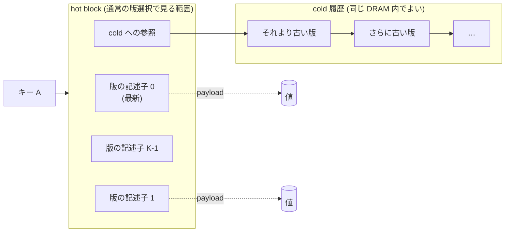

**読み方。** K は hot の容量であってシステム全体の保持版数の上限ではない。K = 3 に特別な保証は無い (出典メモ §28.3)。構造は 2026-09-29 版 §2 と同じで、
この版で変わったのは**それを測った事実が 2 種類できた**ことである: Cicada の中で「どれだけ奥まで辿っているか」(md_2) と、Cicada の外で「連続に置くと何が速いか」(md_5)。

### 2.1 Cicada の中: 奥まで辿るのは誰か (md_2)


**読み方 (md_2 の図 2)。** site ごとの、stock の走査が `next` を辿った回数と、選んだ版の位置の分布。**言えないこと:** 9 以上は bucket 幅が広がるので、
「16」の段差は bucket 幅によるもので分布の山ではない (md_2 §8)。

| 観測 (md_2 §0・§6.1、3 反復の平均) | workload A (読み 50%・skew 0) | workload B (読み 95%・skew 0.9) |
|---|---|---|
| update read のうち位置 ≥ 1 (最新版より奥) | 約 1e-5 | 約 0.9〜1.4% |
| update read のうち位置 ≥ 4 / ≥ 8 | — | 約 1e-5〜5e-5 / 約 2e-6〜5e-6 |
| K=1 で hot 内に収まる update read | 99.98% 以上 | 約 98.6% 以上 (K=2 で 99.8% 以上) |
| read-only read のうち位置 ≥ 1 / ≥ 8 | gc_inter_us = 100000 で約 50% が位置 ≥ 1 | 24〜48% / 10〜28% |

**H1 への含意 (md_2 §10)。** update tx の版探索は YCSB のこの範囲ではほぼ先頭で終わるので、update tx に対する hot 配置の効果の上限は小さい。
効きうるのは read-only (固定 snapshot) の深い探索の側である。read-only tx は forwarding の対象外なので、**hot 配置 (H1) と forwarding (H2) が効きうる相手は
この計測では別の tx だった。** read-only 比率と snapshot の古さを軸にした次の実験は md_15 が走っている (未着地)。

### 2.2 Cicada の外: 連続に置くと何が速いか (md_5)


**読み方。** 1 キー分の版選択を、トランザクション処理から切り離して 1 thread・固定 core・依存連鎖の latency で測った (md_5 §1)。
版選択の意味は Cicada の read 経路に合わせ、計時の前に参照実装と全件照合してから測る (md_5 §2)。


**読み方 (md_5 の fig-k・fig-depth)。** fig-k は K ごとの最新版 (深さ 0) と cold の深さ K+2 を、L2 内と LLC 外で並べる。fig-depth は K=8 で目的の版の深さを
0 から 12 まで動かし、深さ 8 が hot と cold の境界である。区間は 8 反復の percentile bootstrap 95% で、反復変動の記述であって母集団の保証ではない (md_5 §4)。

| 観測 (md_5 §0、中央値) | 値 |
|---|---|
| LLC 外の最新版選択、連続配置 scalar ÷ 散在 linked | 0.55〜0.84 倍 (K=1: 113 ns 対 204 ns、K=16: 149 ns 対 176 ns)。L2 内でも 0.73〜0.87 倍 |
| K=8・LLC 外で深さ 0→7 | 散在 linked 187→1,269 ns、局所 linked 201→679 ns、連続配置 scalar 144〜152 ns でほぼ一定 (深さ 7 で散在 linked の 0.12 倍) |
| hot を越えた深さ 8 以降 (連続配置 scalar) | 296→576→827 ns と cold の node 数に応じて増える |
| cold の深さ K+2 | 連続配置は K によらず 535〜579 ns、散在 linked は K=1 の 654 ns から K=16 の 2,944 ns (K=16 で 0.20 倍) |

**H1 への含意。** 「少数版の記述子を局所化すると版探索のメモリアクセスが減る」は、**この射程 (1 キー・1 thread・依存連鎖の latency) で支持された** (md_5 §0 項 1)。
利益は深い版で大きく、最新版では K が大きいほど縮む。§2.1 と合わせると、深い版を読むのは主に read-only tx である。

### 2.3 版選択をまとめて比べる — SIMD の利益は見えなかった

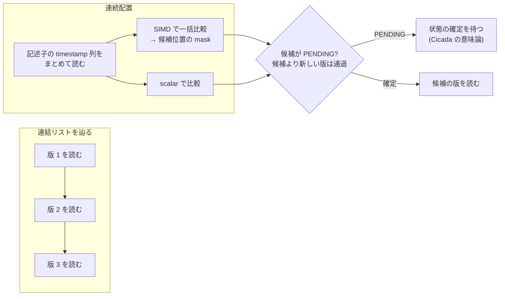

**読み方。** 連続配置の利益と SIMD の利益を混ぜずに比べる (出典メモ §7.4)。2026-09-29 版の同じ図の判定の枝「候補より新しい PENDING 版がある?」は、
md_5 が CCBench の Cicada の read 経路で確かめた意味に合わせて描き直した: wts が対象 timestamp より新しい版は状態に関係なく通過し、wts ≤ ts の最初の版が
PENDING なら確定を待つ (md_5 §2)。

**結果 (md_5 §0 項 4)。** AVX2 は L2 内の最新版で scalar より遅く (15〜19 ns 対 8〜10 ns)、LLC 外では K=1 だけ速く (94 対 113 ns)、K=2〜4 は ±3% 以内、
K≥8 では 244〜253 ns 対 143〜149 ns と遅かった。K≥8 で遅くなる機序は特定していない。**利益は配置 (連続であること) から来ており、この AVX2 実装の SIMD からは来ていない。**

### 2.4 書き込みの費用と、決めていない設計


**読み方 (md_5 の fig-write)。** hot block が cache 内にある条件での 1 回の新版挿入の費用。ring buffer は 37〜76 ns/挿入で K にほぼ依存せず、block 差し替えは
K×値の大きさに比例して最も高い (inline 256 B で 113→1,624 ns、K=16 で linked 先頭挿入の 44 倍)。**言えないこと:** cache の外にある hot block への書き込み・
並行 reader への公開・旧 block の回収の費用と、ring の読み側 (回転した順序) の費用は測っていない (md_5 §6)。

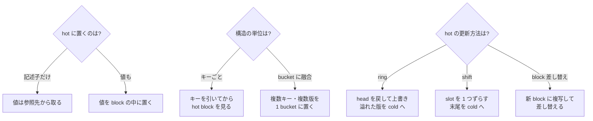

**読み方。** 2026-09-29 版の分かれ道の図に、md_5 が測った書き込み方式の分かれ道を足した (各方式の費用は上の fig-write と §2.4 の説明)。
値を記述子と一緒に置けば小さいレコードで間接参照が減る見込みだが、hot が膨らむ (出典メモ §5.2)。実際、値を inline に置く案は、K=8 で block が大きくなり最新版の読みで散在 linked より遅くなった
(md_5 §5.3)。キー単位は最初の試作・切り分けに向き、bucket への融合は融合の利益と容量の奪い合いを比べることになる (出典メモ §5.3)。どれも**まだ決めていない**。記述子を複数 word で一貫して読む方法 (出典メモ §20.4) は未解決のままで、md_5 は単一 thread の計測である。

---

## 3. 選択的 forwarding: cold に入りそうなときだけ timestamp を進める

### 3.1 試作した読み取りの判断 (md_6)

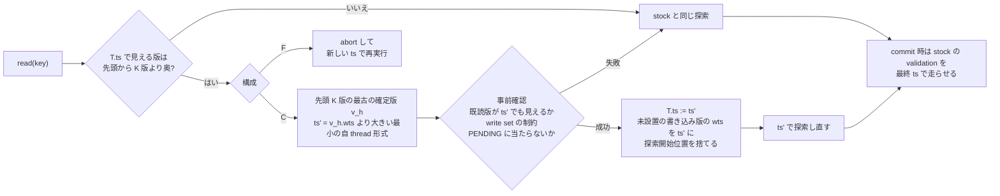

**読み方。** md_6 の試作 (`patches/cicada-forwarding-variant.patch`、D2287) の流れである。物理的な hot は作らず、「先頭から K 版より奥を辿る必要がある」
read を発火条件にした (論理 K 境界)。前進は read 相だけで行い、最終保証は stock の validation を最終 ts で走らせることに置く。GC の保護は旧 ts のまま据え置く。
F は同じ発火条件で abort して再実行する対照である。

**2026-09-29 版の §3.1 の図との違い。** 2026-09-29 版は「rts を書いて確認してから前進」(出典メモ §19 の概念経路) を描いていた。試作は**前進前の確認で rts を書かない**
(早期判定であり最終保証ではない)。最終保証の順序 (rts を上げてから既読の一致を確かめる) は stock の validation がそのまま担う (md_6 §2)。


**読み方 (md_6 の図)。** 行 = workload、列 = (1) C の成功率と試行数、(2) 試行の内訳と試行前の除外、(3) stock 比の throughput (3 rep の点と小標本 95% CI)、
(4) 長い thread の commit と F の abort。**図の長い thread の commit に stock 系列は無い** (stock を含む値は md_6 §5.3 の表)。計数は各セル 1 rep (単回)。
**すべて未検証の診断値である。**

| 観測 (md_6 §1・§5、48 thread・100 万件・zipf 0.9、K=3) | 値 |
|---|---|
| 通常の YCSB で C の発火 / 試行 / 成功率 (1 秒の計数 run) | 発火 3,489〜6,167 回・試行 1,131〜2,069 回、試行の 73〜75% が成功 (表では 0.73〜0.75) |
| 1,000 操作の長い thread を含む型 | 試行の約 18% が成功。失敗の大半は既読の版が前進先で見えない (既読不一致) |
| 読み取り後に待つ型 | 待機中は read が無いので構造上発火しない (待機前の read で数回だけ試行) |
| throughput の stock 比 (3 rep の中央値) | C は 0.952〜1.032 (K=1・3・8 の全 11 条件)。F は K=1 を除く 10 条件で 0.952〜1.021、K=1 では 0.661 (K=1 では発火が桁違いに増えた、md_6 §5.4)。3 rep の 95% CI は K=1 の F を除き全条件で 1 をまたぐ |
| 長い tx の完了 | 操作数型は stock・C・F とも 3 秒間に commit 0、待機型は 3 rep 合計 407〜928 で腕の間に一貫した差が無い |

**H2 への含意。** 発火と成功は起きる (H2 の「cold の一部を既読を保って回避」は、この試作で起きた)。**しかし、この試作 (GC 不変・論理 K 境界) では、
forwarding の費用対効果の利得はまだ見えていない** (md_6 §1 項 3)。md_2 の楽観的候補率 (§8.2) と同じく、成功しやすいのは深い update read が少ない通常の YCSB で、
長い tx の既読集合では成功率が落ちる。

### 3.2 3 つの方針の違い (記号の例)

T の今の timestamp を t3 とし、既読の版 A が t1 から t6 の手前まで見えているとする。キー B の版は
新しい順に B@t8, B@t7, B@t5 が hot、B@t4, B@t2 が cold にある (t1 < t2 < … < t8)。

```text
時刻  →   t1    t2    t3    t4    t5    t6    t7    t8
既読 A    [===========================)                  A の見える区間 [t1, t6)
B の版          B@t2        B@t4  B@t5        B@t7  B@t8
                └── cold ──┘      └──────── hot ─────────┘
T の現在              ^t3

固定          : t3 のまま → B@t2 を読む          → cold を辿る
必ず最新      : t8 へ進む → B@t8 を読む          → A が見えない (t8 は [t1, t6) の外)
選択的        : t5 へ進む → B@t5 を読む          → A も見える (t5 は [t1, t6) の中)、cold を避けられる
```

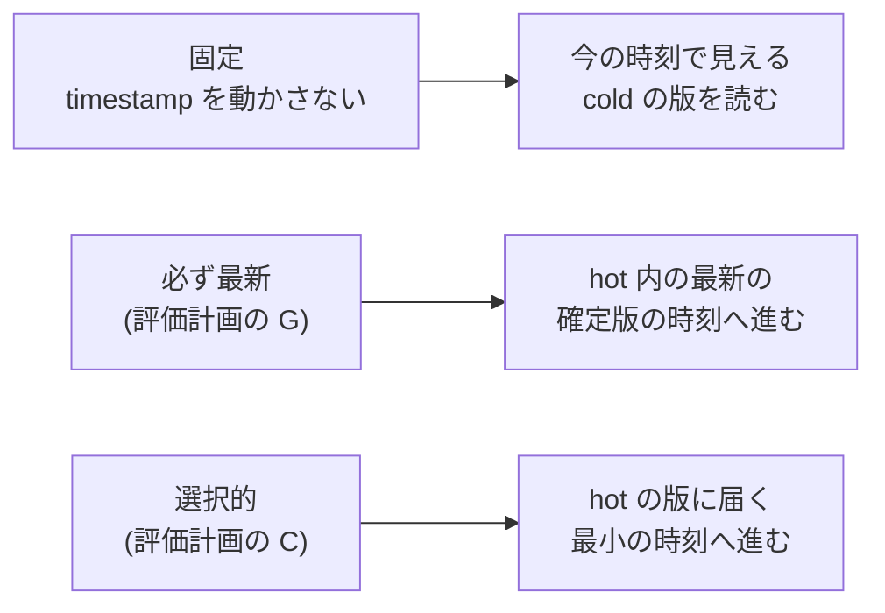

**読み方。** 例は 2026-09-29 版 §3.2 と同じ。上の記号の例では、必ず最新は既読 A の見える区間を外れ、選択的は A を保ったまま cold を避ける。どちらも例の上での帰結であり、一般の性質ではない。この版で変わったのは位置づけである: **「最新でない hot 版を選べる」こと自体は新規性にならない**。
既読と両立する最も新しい版を選び区間を縮める方式 (SI-STM、2006) と、実行中に読み取り timestamp を後へ進めて既読を確かめる方式 (CockroachDB の read refresh、2020) が
既にある (md_9 §5)。残る差は「何を基準に選ぶか」(版の物理位置・最小の前進) で、これは U1 に属する (§10)。

**この図から読み取ってはならないこと。** 最小限の前進は最適性が証明された方針ではない。md_6 の長い tx では、最小の前進でも既読不一致で失敗が多かった。
「既読の可視区間の共通部分に収まる最大」へ進む案や、1 tx あたり 1 回に制限する案を比べる余地がある (md_6 §8 項 1)。
評価計画の草稿は、最新の確定版へ進む G を「発火したときだけ先頭 K 版の中の wts 最大の確定版へ進む」と定義し、K=1 では C と G が同じ規則になることを A/A 対照に使う (草稿 §3.2)。

### 3.3 可視区間で書くと

版 v が見える区間を I(v) = [b(v), e(v)) と書くと、既読の版の集合 R_T が同時に見えうる区間は

- 下限 L_T = max b(v)、上限 U_T = min e(v) (v ∈ R_T)
- 共通の timestamp が存在する条件は L_T < U_T

である (出典メモ §9)。これは **read 集合の整合性の条件であって、更新 transaction 全体の commit 条件ではない。**
同じ形のモデルは Hekaton (2011) が可視区間 Begin / End として実装に使っており (md_1 §8.1 K3)、関連研究節では Hekaton を出典に示す。

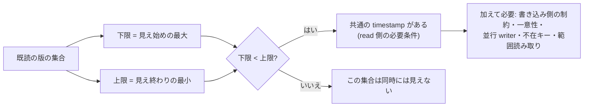

---

## 4. 並行 writer との競合: 順序の規則を小モデルで確かめた

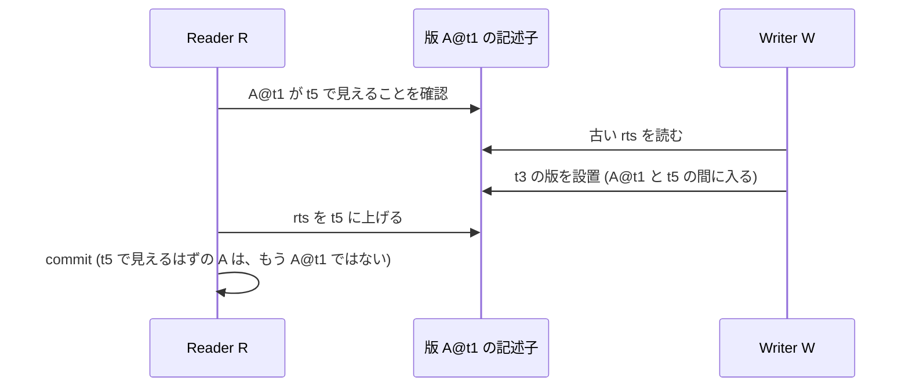

**読み方。** 確認と rts の更新の間に writer が割り込むと、確認した「見える」が崩れる (出典メモ §13.1)。2026-09-29 版ではこれは「構想」だったが、
md_4 が小モデルの全探索で**実際に閉路になる割り込み**として確かめた (§4.2 の表の U1v・U1f+O1)。

### 4.1 小モデルが検査したもの (md_4)

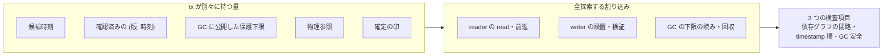

**読み方。** 出典メモ §18 の 5 状態を tx の別々の量として持ち、固定した場面の初期状態から、定義した原子 step の全 interleaving を探索した (md_4 §2・§3、D2282)。
判定は依存グラフの閉路 (直列化可能性)、timestamp 順との不一致 (補助。**これ単独は直列化可能性の反例ではない**)、GC 安全の 3 つ。
**範囲:** キー 2、tx 2〜3 (+ GC 1 thread)、操作 1〜3、K は 1 (1 場面だけ 2)、逐次一貫のメモリ (md_4 §6)。反例なしは一般の証明ではない。

### 4.2 規則と、その規則を 1 つ崩したときの反例

| 規則 (md_4 §7.3) | 崩した危ない版 | 結果 (固定場面の範囲) |
|---|---|---|
| R9' 書き込み側の直前版の rts 検査は PENDING を越えて最初の確定版まで | v0 (出典メモ §4 を模した直前版 1 つの検査) | 閉路の反例、30 step (場面 S8) |
| R9 の順序: 既読版の rts を上げてから可視を確認 (commit 時の検証) | U1v | 閉路の反例、26 step |
| R9 の可視確認を他 tx の rts だけで省かない | U2 | 閉路の反例、33 step |
| R5 の順序と観測し直し (forwarding の確認) | U1f・U6 | O1 (確認済み区間で commit 時の検証を省く選択肢) なしでは未検出。O1 と組むと閉路の反例、39 step |
| R6 → R7: 確定してから GC へ公開 | U3a | GC 違反、3 step |
| 物理参照は参照の終わりまで保持 | U3b | GC 違反、18 step |
| R10 後続の確定版で回収 (`wts < 下限` で一律に回収しない) | U4 | GC 違反、2 step |
| R1 PENDING を飛ばさず待つ | U5 | 未検出 (commit 時の検証が遮る) |

- 仕様 v1 (v0 + R9') は 10 場面すべてで反例なし、v1 + O1 も反例なし (md_4 §5.1)。
- **R5 の確認規則が直列化可能性に効くのは O1 を入れたとき**である。O1 なしでは commit 時の検証が近道の結果をやり直す (md_4 §5.3)。
  md_6 の試作は O1 を採らないので、試作の最終保証は stock の validation の順序 (R9) に依る (md_6 §2)。
- 検査器が弱くないことは、危ない版 (8 種のうち 5 種が単独、2 種が O1 と組んで反例) と検査器自身への変異 11 種 (10 KILLED、1 は到達状態で等価) で確かめた (md_4 §8)。

### 4.3 比較相手 Cicada に v0 の穴は無い (md_8)

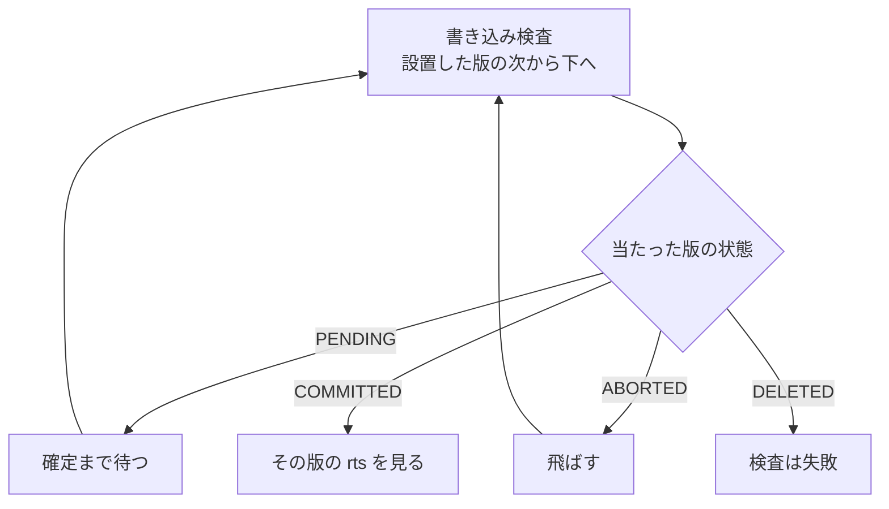

**読み方。** CCBench の Cicada (gitlink `68106660`) の最終書き込み検査を静的に読んだ流れ (md_8 §2)。v0 のように「PENDING の直前版 1 つの rts を見て通す」経路は無く、
PENDING の確定を待つ手順が v0 の穴を塞ぐ。原論文 (Cicada §3.2 の探索規則、§3.4 (b) の「現在の可視版」、付録 A の定義 1) も同じ規則と読める。
**v0 の規則は md_4 のモデルが独自に決めたもの**で、Cicada の欠陥ではない (md_8 §0・§3)。

同じ小モデルに Cicada の待ちの 2 規則を入れた構成 (vC) では、場面 S8 の「窓」(W が PENDING に待たされ、下の確定版の rts が W の時刻を超えている状態) 336 個から到達した
3,660 状態のうち、T と W が両方 commit する状態は 0、到達した 12 終端はすべて T か W の一方が abort していた (md_8 §4.3)。**実 Cicada の実行での再現・非再現は行っていない**
(発火条件が不成立のため)。C++ の記憶模型の上での相互見落とし (store-buffer 形) は未検証の論点として残る (md_8 §5)。

**この節から読み取ってはならないこと。** 「前進の手順は正しい」とは言えない。モデルの反例なしは固定場面の範囲に限る。一般の形の論証は md_13 が走っている (未着地)。

---

## 5. GC への接続: 確定してから公開し、公開した floor より古い時刻へ戻らない

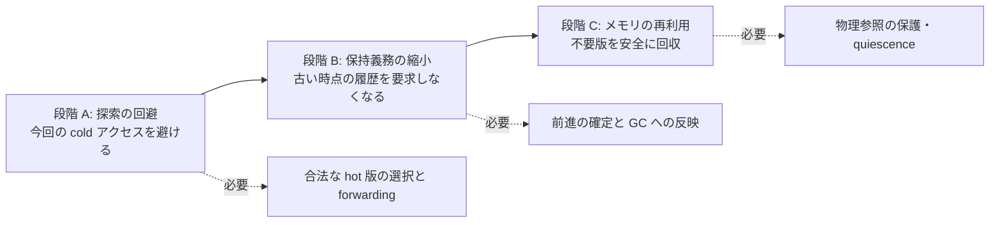

**読み方。** A だけでも速くなる可能性はあるが、B と C まで実現しなければ「GC を改善した」とは言えない (出典メモ §15.1)。
md_6 の試作は GC の保護を旧 ts のまま据え置いたので、**段階 A だけ**の試作である。段階 B の手順は md_10 がモデルで設計し、実物への接続 (md_14) は未着地である。

### 5.1 公開の順序と、読み取りの後に待つ tx への届け方 (md_10)


**読み方。** 2026-09-29 版 §6 は「読み取り後に待っている tx には、アクセス駆動の forwarding は発火しない」を限界として置いた。md_10 は、GC が待機中の tx に要求の印を立て、
**tx 自身が待機の安全点で**前進する形 (SP) を小モデルに足した (D2290)。他の thread が代わりに確かめる形 (HP) はモデル化していない (§6)。
待機中ならいつでも発火できる過大近似なので、安全性の結論は「待機中にだけ発火し、前進先を候補集合から選ぶ」どの方策にも及ぶ。任意の整数時刻を選ぶ方策、
待機以外で発火する方策、途中で入場する tx には及ばない (md_10 §2)。

| 規則 (md_10 §8) | 崩した危ない版 | 結果 (固定 6 場面の範囲) |
|---|---|---|
| 確定してから公開する | UG1 (確認の前に公開) | GC 違反、4 場面で 5〜31 step |
| 確定で保護下限を外さない | UG2 (確定時に floor を無限大) | GC 違反、2 場面で 10・21 step |
| 圧力による前進でも可視を確かめる | UG3 | O1 なしでは反例なし、O1 と組むと閉路 38 step |
| 公開の後は、公開した floor より古い時刻へ戻らない | UF1 (公開の後に開始時刻へ戻る) | GC 違反、2 場面で 22・47 step |
| 確定で既読版の物理参照を外さない | UG2r | 反例なし (モデルの抽象の中。物理参照を早く外してよいという証明ではない) |

健全版 24 構成 (6 場面 × {前進なし・SP・SP + 取消し・SP + O1}) はすべて反例なしだった (md_10 §5.1)。md_4 の 63 構成の結果は 1 行も変わらなかった (md_10 §10)。

### 5.2 戻れる段階と戻れない段階 (2026-09-29 版の図を md_10 で改めた)

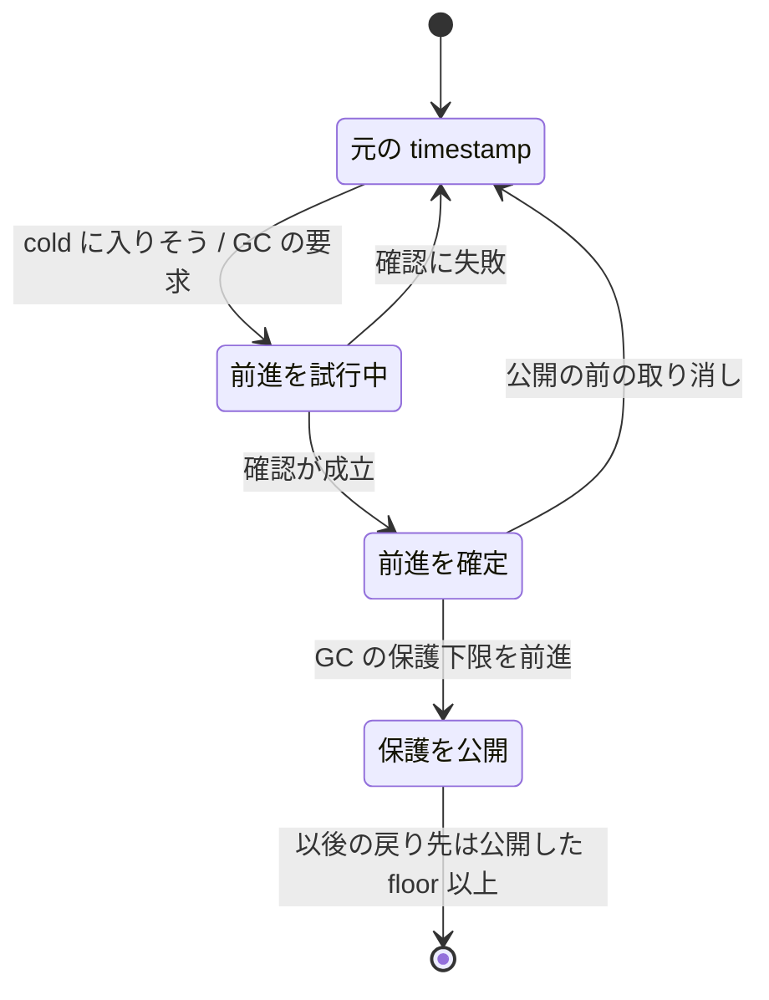

**読み方。** md_4 は「確定の後は戻らない」(R8) を検査のない設計選択として置いていた。md_10 の探索では、**戻れない境界は確定ではなく公開にあった**:
確定の後・公開の前に取り消して試行前の時刻へ戻る構成は 6 場面で反例なし、公開の後に開始時刻へ戻る構成は GC 違反 (md_10 §5.5、D2290 項 2)。
2026-09-29 版 §3.1 の「失敗時に元の timestamp へ戻れるのは、GC へ新しい保護下限を公開する前だけ」はこの結果と合っていた。

### 5.3 効果はモデルの中でだけ数えた

| 場面 (md_10 §6) | 前進なしの回収境界 / 回収できる版 | 公開による帰属できる差 (対照 → 公開直後) |
|---|---|---|
| G1 読み取りの後に待つ tx 1 本 | 45 / 0 | 境界 +16・版 +2 (45, 0 → 61, 2) |
| G2 待つ tx 2 本 | 45 / 0 | 境界 +17・版 +1 (45, 0 → 62, 1)。**T だけが公開すると境界は U の floor 35 のまま** |
| G4 前進後にも読む tx | 45 / 0 | 境界 +36・版 +2 (45, 0 → 81, 2) |

- 数え方は「公開直後の状態」と「そこからその tx の floor だけを戻した対照状態」の差で、他の tx の進行を混ぜない (md_10 §6、D2290 項 4)。
- G1 で T が読んだ A20 は後続が無いので回収されない。**前進後もまだ見える古い版は回収しない** (出典メモ §15.3)。
- **値はモデルの時刻と版の数であり、実システムの保持時間・メモリ量・throughput を表さない** (md_10 §6)。
- 図の候補 (この版では作っていない): 場面 G1〜G6 ごとの「前進なし」と「公開後」の回収境界と回収できる版の数を並べる棒図。生成器は md_10 の `raw/` から作る (Codex が書く実装面)。

**この節から読み取ってはならないこと。**

- 自分が前進しても、別の tx が古い時刻を持っていれば全体の境界は動かない (G2)。**forwarding の成功回数は GC 改善の指標にならない** (出典メモ §15.4)。
- 目標は free の回数ではなく、**同時に生きている古い版の量** (≈ 発生速度 × 保持時間) を減らすこと (出典メモ §15.5)。これを測るには実装と計測が要り、md_14 が走っている (未着地)。

---

## 6. この仕組みだけでは解けないケース

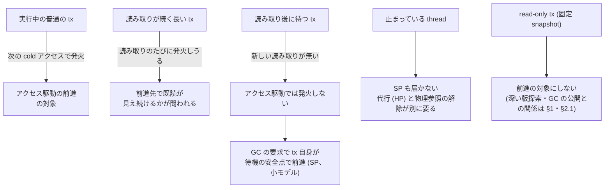

**読み方。** 2026-09-29 版 §6 の図を一次資料で更新した。

- 読み取りが続く長い tx: md_6 の操作数型では試行の約 18% しか成功せず、長い thread 4 本では smoke で約 1% だった。失敗の大半は既読不一致 (md_6 §5.1)。
- 読み取り後に待つ tx: 実物の試作では待機中の試行は構造上 0 だった (md_6 §5.1)。SP はモデルの中でこの tx に前進を届けた (md_10、§5.1)。**実物で SP はまだ作っていない。**
- 止まっている thread: SP は再開しないと前進しない。HP (他の thread が代わりに確かめる) が論理境界を進めうるが、物理参照の解除 (段階 C) は別の仕組みが要る (md_10 §3)。
  HP を採るときの必要条件 (世代つき CAS が確定だけでなく公開までを覆う、snapshot の後に tx が読み取りを足せない) は静的な検討だけで、探索していない。md_16 が走っている (未着地)。
- read-only tx: md_2 の計測では深い探索の大半と、GC の公開の遅れの一因がここにあった (§1・§2.1)。前進の対象にしない (出典メモ §17)。md_15 が走っている (未着地)。

**1 行目の問題を解いたことを、4・5 行目まで解いたように書かない。**

### 6.1 前進してよい transaction と、してはいけない transaction

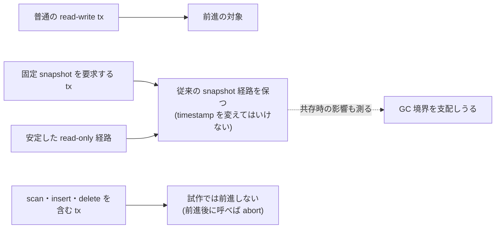

**読み方。** 2026-09-29 版の図に、試作が前進を許さない tx (scan・特殊操作、md_6 §2) を足した。「MVCC の機能を保つ」は、旧版の取得・serializability・固定 snapshot の意味の 3 つを別々に書く (出典メモ §17.1)。

---

## 7. 実装で分けておく状態

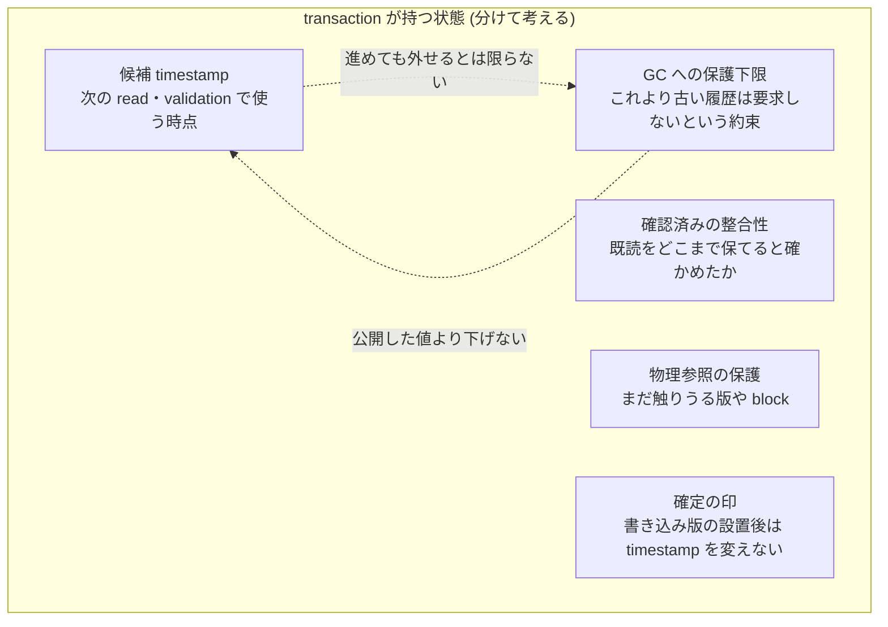

**読み方。** 1 つの `ts` だけで持つと、探索の都合と GC の都合が混ざる (出典メモ §18)。md_4 と md_10 はこの 5 つを別々の量としてモデルに持ち、
「公開した floor = gc_floor で、下げる遷移を作らない」ことを規則にした (D2290 項 2)。

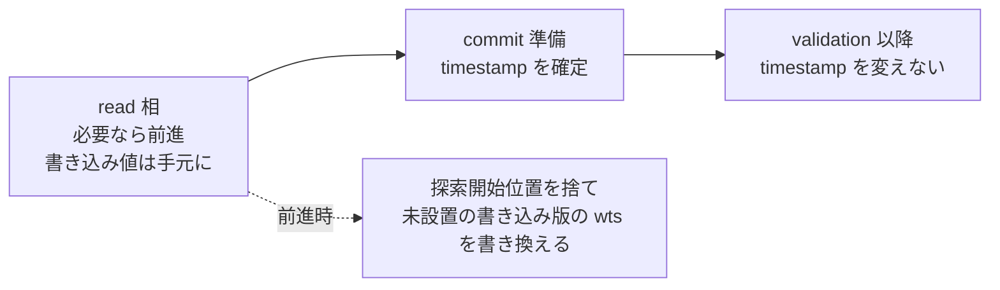

**読み方。** md_6 の試作が実装で必要だったこと: 前進の時に read / write set の探索開始位置 (`later_ver_`) をすべて捨てること (残すと検証が古い位置から辿って版を見落とす)、
未設置の書き込み版の wts を新しい時刻へ書き換えること (D2287 の理由)。

**まだ決めていない実装の論点 (出典メモ §20):** hot の更新方法 (§2.4)、timestamp 順と設置順のずれ、K に PENDING 版を数えるか (試作とモデルは数える)、
複数 word の記述子を一貫して読む方法、slot 再利用の取り違え (ABA)、不在キー・削除・範囲読み取り、hot から cold への移し替えの費用。
加えて md_6 がコード読みで見つけた疑い: stock の timestamp 生成は abort 後の clock boost の戻り方で、次の ts が前の ts と同じ値になりうる (未実測、md_6 §2)。

---

## 8. 状態: 何が確かめられていて、何がまだか

```mermaid
flowchart LR
  H1["H1 配置"]:::meas
  H2["H2 選択的前進"]:::meas
  H3["H3 最新まで進む方式との差"]:::design
  H4["H4 GC 接続"]:::design
  H5["H5 組み合わせ"]:::idea
  H6["H6 頑健性"]:::idea
  G0["前提 G0<br/>Cicada を判定器に通す"]:::meas
  U0["U0 前進を保護下限へ"]:::notfound
  U1["U1 cold 契機"]:::notfound
  U2["U2 前向きに非最新版"]:::known
  U3["U3 1 つの構造"]:::unsettled
  classDef idea fill:#f4f4f4,stroke:#999
  classDef design fill:#eef,stroke:#88a
  classDef meas fill:#e8f4e8,stroke:#6a6
  classDef known fill:#fee,stroke:#a66
  classDef notfound fill:#fff4d6,stroke:#b90
  classDef unsettled fill:#f4f4f4,stroke:#999,stroke-dasharray: 3 3
```

この節の状態語は次だけを使う。

- 仮説の状態: **構想のみ** (メモの主張のみ)・**設計中** (仕様・模型・評価計画を書いている)・**実測あり** (一次資料に計測・探索・検査の記録がある)・
  **検証済み** (certified な正しさ検査、または一般の証明を通った)。**この版で「検証済み」に届いた項目は無い。**
- 新規性の状態: **既知** (原典で確認)・**見当たらず (範囲つき)** (事前登録した検索と読んだ原典の範囲では見当たらなかった)・**未確定**。

**凡例。** 灰 = 構想のみ、青 = 設計中、緑 = 実測あり、赤 = 既知、黄 = 見当たらず (範囲つき)、灰の破線 = 未確定。色は下の表の状態語と一致させた。

### 8.1 仮説と前提

| 項目 | 2026-09-29 版 | この版 | 根拠と限定 |
|---|---|---|---|
| H1 配置 | 構想のみ | **実測あり** | 微小計測で、1 キー・1 thread・依存連鎖の latency の射程で支持 (md_5 §0 項 1)。Cicada の中では update read の深い探索は少なく、深い探索は read-only 側 (md_2 §0 項 1・2)。**hot 配置を Cicada に入れた計測 (構成 B) は無い** |
| H2 選択的前進 | 構想のみ | **実測あり** | 小モデルで規則と反例 (md_4)、stock の観測時点の楽観的候補率 (md_2)、試作で発火と成功 (md_6)。throughput の差は検出できず (md_6)。**性能値は未検証の診断値** |
| H3 最新まで進む方式との差 | 構想のみ | **設計中** | 評価計画の草稿が G_ℓ・G_h を定義し、K=1 を A/A 対照にした (草稿 §3.2、D2286)。G の実装・計測は無い |
| H4 GC 接続 | 構想のみ | **設計中** | 手順は小モデルで設計・全探索 (md_10、D2290)、余地は stock で実測 (md_2 §6.2)。**実物で保持が縮むかは未測定** (md_14 未着地) |
| H5 組み合わせ | 構想のみ | 構想のみ | 比較 (D 対 B かつ D 対 C) は草稿で定義したが、B・D は未実装 |
| H6 頑健性 | 構想のみ | 構想のみ | 比較は草稿で定義 (E 対 A の差の差)。E は未実装 |
| 前提 G0: Cicada の正しさ検査 | 未整備 (事実) | **実測あり (整備済み、上限 indeterminate)** | YCSB の point read / update で、stock 7 走行は巡回 0、壊した Cicada 3 本は巡回として検出し 20 件中 20 件を壊した経路に帰属、TRACE=0 は YCSB target の 3 TU で命令列が pin と一致 (md_3 §1、D2279)。**判定の上限は indeterminate で certified ではない**。scan の phantom・insert / delete・TPC-C・内部の版昇格は未対応 |
| forwarding 試作の正しさの門 | — | **実測あり (巡回 0、上限 indeterminate)** | trace の上に重ねた forwarding build の 10 走行で巡回 0、trace の commit 行数 = ベンチの commit 数、成功した forwarding は計 285 回 (md_6 §6)。長い tx の型は検査していない。**「serializable」と書かない** |
| 比較相手 Cicada の書き込み検査 | — | **実測あり (v0 の穴は無い)** | CCBench の実装と原論文の静的な読みと、待ちを入れた小モデル (md_8)。実 Cicada での再現走行はしていない |
| 比較相手 A の較正 | — | 未着地 | md_11 が走っている |

**なぜ G0 が重要か。** 絶対規律 2 により、正しさ検査器が anomaly を検出した variant は即失格であり、検査を通していない variant の性能値は採否の根拠にできない。
G0 は整備されたが、Cicada には Silo / MOCC の X / P / I に当たる証拠面が無いので、**巡回が無い履歴は indeterminate であって serializable の証明ではない** (md_3 §1 項 5)。
したがって forwarding を入れた Cicada の性能値は、この版でも「未検証の診断値」である。certified を要する門に Cicada を入れるには、Cicada 用の証拠面の設計と campaign 側の trace 供給が別に要る (md_3 §8)。

### 8.2 仮説の数値の要約 (すべて範囲つき)

| 仮説 | 最も強い数値 | 出所 | 地位 |
|---|---|---|---|
| H1 | LLC 外の最新版選択で連続配置 scalar が散在 linked の 0.55〜0.84 倍、K=8 の深さ 7 で 0.12 倍 | md_5 §0 | Cicada の外の微小計測 |
| H1 の上限 | update read の位置 ≥ 1 は workload B で約 0.9〜1.4%、read-only read は 24〜48% | md_2 §0 | 計器入り build の観測 |
| H2 の上限 | workload B で、位置 ≥ 1 の update read のうち先頭 1 版で前進候補があったのは 2〜5%、位置 ≥ 8 では 67〜86% (分母 129〜515 件) | md_2 §0 項 3 | 楽観側の値で、実装した forwarding の成功率ではない |
| H2 | 通常 YCSB で試行の 73〜75% が成功、長い tx の型で約 18% | md_6 §1 | 未検証の診断値 |
| H2 の費用対効果 | C の throughput の stock 比 0.952〜1.032、95% CI は K=1 の F を除き全条件で 1 をまたぐ (K=1 の F は 0.661) | md_6 §5.2 | 未検証の診断値。C と stock の差は検出できなかった |
| H4 の余地 | 10 ms 待つ長い tx で境界年齢 p50 が 32 µs → 32768 µs の bucket、論理生存版数 +37% | md_2 §0 項 4 | 計器入り build の観測 |
| H4 の手順 | 待つ tx 1 本の場面で公開により境界 +16・回収できる版 +2 | md_10 §6 | モデルの中の数 |

### 8.3 仮説と実験と作業の対応

```mermaid
flowchart LR
  subgraph L["着地した作業"]
    w1["md_1・md_9 文献と新規性"]
    w2["md_2 版探索・保持の実測"]
    w3["md_3 Cicada の正しさ検査"]
    w4["md_4 forwarding の小モデル"]
    w5["md_5 hot block の微小計測"]
    w6["md_6 forwarding の試作"]
    w8["md_8 Cicada の書き込み検査"]
    w10["md_10 GC 接続の小モデル"]
    w12["md_12 評価計画の草稿"]
  end
  subgraph P["未着地の作業"]
    p11["md_11 比較相手の較正"]
    p13["md_13 一般の論証"]
    p14["md_14 試作を GC につなぐ"]
    p15["md_15 read-only と GC"]
    p16["md_16 代行の前進"]
  end
  subgraph H["仮説"]
    h1["H1"]
    h2["H2"]
    h3["H3"]
    h4["H4"]
    h56["H5・H6"]
  end
  w2 --> h1
  w5 --> h1
  w2 --> h2
  w4 --> h2
  w6 --> h2
  w2 --> h4
  w10 --> h4
  w12 --> h3
  w12 --> h56
  w3 -.前提.-> w6
  w8 -.前提.-> w4
  p14 --> h4
  p13 --> h2
  p15 --> h1
  p16 --> h4
  p11 -.前提.-> w12
```

**読み方。** md_N は 2026-09-29 に並行投入用に用意した wave の投げ文の番号で、投げ文の本体は repo の外にある。矢印は「その作業の一次資料がその仮説の根拠になる / なる予定」を表す。
未着地の作業の結果は、この版には入っていない。

---

## 9. 評価の組み立て (評価計画の草稿、未発効)

```mermaid
flowchart TB
  A["A 調整済み Cicada"]
  B["B = A + hot 配置"]
  C["C = A + 論理 K 境界で最小の前進"]
  Fl["F_ℓ = A + 論理 K 境界で abort・再実行"]
  Gl["G_ℓ = A + 論理 K 境界で最新の確定版へ前進"]
  D["D = B + hot の外れで最小の前進"]
  Fh["F_h = B + hot の外れで abort・再実行"]
  Gh["G_h = B + hot の外れで hot 内の最新の確定版へ前進"]
  E["E = D + 前進を GC の保護条件へ反映"]
  EP["E+P = E + GC 圧力を契機に前進を試す"]
  A --> B & C & Fl & Gl
  B --> D & Fh & Gh
  C -.同じ発火条件.-> D
  D --> E --> EP
```

**この節の地位。** `docs/vhash-evaluation-preregistration-draft.md` (md_12、D2286) は**事前登録の草稿であり発効していない**。発効は、比較相手 A の較正 (md_11) などの前提が揃い、
段ごとの node 時間をユーザーへ示して確認を得た後に、別の wave が日付付きの決定で行う (草稿 §0)。この節は草稿の構造を図にしたもので、判定の規則の正本は草稿である。

**読み方 (構成を 3 つの因子で書く)。** 矢印は「左に 1 つの変更を足したものが右」。**2026-09-29 版 §9 の図からの変更:** 2026-09-29 版は F と G を A から直接伸ばして D と比べていたが、それでは配置と行動の 2 因子が同時に違う。
草稿は F と G を論理 K 境界の上 (F_ℓ・G_ℓ、C と比べる) と hot の上 (F_h・G_h、D と比べる) の 2 通りに定義し、主比較を「発火条件が同じで行動だけが違う組」にした (草稿 §3.4、D2286 項 2)。
md_6 の試作の C と F は、そのまま C と F_ℓ に当たる。

### 9.1 主比較

| 比較 (草稿 §5.2) | 何が分かるか | 必要な構成の状態 (この版の起点) |
|---|---|---|
| B 対 A | 配置の効果 (H1)。主指標は commit あたりの LLC load miss | B 未実装 |
| C 対 A | 前進による cold 探索の回避 (H2a) | C は試作あり (md_6) |
| C 対 F_ℓ | 実行済みの仕事を保つ価値 (H2b) | C・F_ℓ とも試作あり (md_6) |
| C 対 G_ℓ | 最新ではない hot 版を選ぶ価値 (H3)。K=1 は A/A 対照 | G_ℓ 未実装 |
| E 対 D | 保持・回収への効果 (H4)。回収境界の遅れと生存 bytes の両方 | D・E 未実装 (E の手順は md_10 のモデル) |
| D 対 B かつ D 対 C | 組み合わせが両方の単独構成を上回るか (H5)。「相乗効果」の語は交互作用の副次判定が通ったときだけ | B・D 未実装 |
| E 対 A の差の差 | GC 間隔・tx 長への頑健性 (H6)。方式全体の比較 | E 未実装 |

### 9.2 段の流れと正しさの門

```mermaid
flowchart TB
  pre["S0 前提<br/>(較正・指標の floor・門の走行)"] --> s1x["S1 探索<br/>(K の掃引、判定に使わない)"]
  s1x --> s1c["S1 確認<br/>(H1・H2・H3)"]
  pre --> s1c
  s1c --> s2["S2 確認<br/>(H5・hot 上の F と G)"]
  s2 --> s3["S3 確認<br/>(H4・H6・限界)"]
  gate["正しさの門<br/>(各構成・各 workload 型)"] -.通ったものだけ.-> s1c
  gate -.-> s2
  gate -.-> s3
```

```mermaid
flowchart TB
  v["構成の patch"] --> tb["instr patch の上に重ねた<br/>trace 付きビルド"]
  tb --> run["門の cell を走らせる"]
  run --> judge["izanagi の判定器"]
  judge -->|"巡回あり"| out["巡回が出た構成の扱い<br/>(本文)"]
  judge -->|"巡回なし"| ind["巡回が出なかった構成の扱い<br/>(本文と §8 の G0)"]
  ind --> perf["trace も計器も外したビルドで<br/>性能を測る"]
  pos["新しい経路ごとの<br/>壊した variant"] --> tb2["同じ門"] --> power["その経路の<br/>検出の確認"]
  power -.前提.-> perf
```

**読み方。** 探索段で選んだ自由度 (K など) は確認段の新しい走行だけで判定する。各構成 × workload 型に門の cell を置き、巡回が出たら構成ごと即失格にし、その構成の性能値を主張に使わない。
巡回が出なかった構成も判定の上限は indeterminate で、certified には届かない (§8 の G0)。
前進・hot・GC 公開の**新しい経路ごと**に壊した variant の検出を、その構成の性能値を主張に使う前提にする (草稿 §7.3)。md_3 の壊し patch 3 本は既存の経路の検出力しか示していない。
**GC 安全は判定器の対象外**で、E の GC 安全は md_10 のモデルと実装側の別の検査で示す (草稿 §7.5)。

### 9.3 統計と計算時間 (草稿の設計値と試算)

- 1 cell = 比べる全構成を巡回順に交互に測る round を 14 取り、2 つの node へ 7 round ずつ同時に投入する。時間帯の block 分けはしない (ユーザー裁定 2026-09-26)。
- 対の対数比の中央値と、順序統計量の区間 (14 個の 2 番目と 13 番目) を使う。独立に同じ連続分布に従うとき被覆は 0.99817 で、主要な判定 20 個の Bonferroni (1 個あたり 0.0025) に足りる (草稿 §8.2・§8.4)。
- 閾値は throughput で δ_T = ln(1 + max(0.030, f_T)) (f_T は md_11 が測る Cicada の between-run の floor)、他の指標 M では指標と cell の組ごとに δ = ln(1 + max(0.030, f_M,c)) (f_M,c は S0 で A を測って決める。無い組の述語は「欠測」)。0.030 は D19 の下限 (草稿 §8.3)。
- **計算時間は試算であって上下限ではない:** 1 走行 5 秒・build 60 秒の仮定で合計 12.76 node 時間、30 秒・180 秒の仮定で 52.47 node 時間。どちらの仮定でも S1 探索・S1 確認・S3 は単独で 2 node 時間を超えるので、
  md_11 の実測単価で計算し直したうえで段ごとにユーザーの確認を取る (草稿 §10、D2212 項 4)。

### 9.4 効かないはずの条件と、読み取りの後に待つ tx の扱い

```mermaid
flowchart TB
  wops["W-ops<br/>(読み取りが続く長い tx)"] -->|"次の読み取りで cold に当たる"| acc["アクセス駆動の前進<br/>(D・E) が発火しうる"]
  wwait["W-wait<br/>(読み取りの後に待つ)"] -->|"待ちの間は読み取りが無い"| none["アクセス駆動の前進は<br/>発火しない"]
  none --> ep["GC 圧力駆動 (E+P)<br/>だけが発火しうる"]
  wsnap["W-snap<br/>(固定 snapshot の reader)"] --> keep["前進の対象にしない"]
  bad1["W-ro (版の列が伸びない)"] --> small["効かないはずの条件"]
  bad2["W-contend (既読が頻繁に更新)"] --> small
```

**読み方。** 長い tx を前進の契機が違う 3 型に分けて測り、W-wait では待ちの区間の試行回数が 0 であることを計器で確かめる。**「W-wait で E に効果が無かった」を「前進が無効だった」と書かない** (草稿 §9)。
長い tx の生成器 (W-ops・W-wait・W-snap) は評価計画の前提 P5 で、**stock CCBench の生成器はそのまま使えない**: `batch_*` flag は YCSB の操作数を変えず、
`WORKER1_INSERT_DELAY_RPHASE=1` は compile error 3 件で build できなかった (md_2 §3)。md_2 と md_6 はそれぞれ patch 内に専用の長い tx の型を足して測った。

### 9.5 測るもの

```mermaid
mindmap
  root((測るもの))
    最終性能
      throughput
      完了までの latency
      再実行込みの処理時間
      長い tx の完了率
    探索
      read で調べた版数
      write と validation で調べた版数
      hot の当たり率
      cold のアクセス率と辿った長さ
    forwarding
      試行と成功の回数
      前進幅
      追加の検証時間
      共有書き込み
      前進後の abort 率
      失敗の理由の内訳
    GC とメモリ
      回収境界の遅れ
      公開の間隔
      生きている版の数と bytes
      論理的に回収可能だが残っている bytes
      allocator の予約と使用量
```

**読み方。** 2026-09-29 版 §9.2 の図に、md_2 が実際に取った「公開の間隔」を足した。md_2 は探索と GC の枝、md_6 は forwarding の枝 (試行・成功・失敗理由・前進幅) を既に計器で取っている。

### 9.6 論文の主要な図の候補

| 図の候補 | 何を何と比べるか | この版の起点での状態 |
|---|---|---|
| 版探索のメモリアクセス | B 対 A の commit あたり LLC miss、深さ別 | Cicada の外の微小計測の図がある (md_5 fig-k・fig-depth)。Cicada の中の図は B 未実装で無い |
| 奥まで辿るのは誰か | update / read-only 別の位置の分布、K の反実仮想 | **ある** (md_2 k_candidates・search_length、計器入り build) |
| 長い tx と回収境界 | 長い tx の型・GC 間隔ごとの境界年齢・公開間隔・生存版数 | **ある** (md_2 gc_lifetime、stock のみ)。E との比較は無い |
| 省いた仕事と足した仕事 | 避けた cold 探索・再実行の時間と、足した検証・同期の時間 | 一部ある (md_6 forwarding-overview の成否と内訳、未検証の診断値)。時間の内訳は無い |
| K と性能・メモリ | K → hot の当たり率 → 前進の回数 → throughput → 総メモリ | 図の候補 (未作成)。md_6 の K=1・3・8 は many_ops・GC 100 だけ |
| GC 間隔と throughput | 調整済み Cicada の最良設定と E | 図の候補 (未作成)。md_11・E が要る |
| モデルの中の回収境界 | 場面ごとの前進なし対公開後 | 図の候補 (未作成、§5.3) |

---

## 10. 新規性の置き直し: U2 は既知、主張は U1 と U0 へ

```mermaid
flowchart LR
  subgraph TRIG["tx の位置が後へ動く契機"]
    c1["衝突の検出"]
    c3["時計の不確かさ"]
    c2["commit 時に位置を決める"]
    c4["read ごと"]
    c5["cold 領域への進入<br/>(アクセスコスト)"]
  end
  subgraph DEST["行き先の選び方"]
    d1["その時点の最新 /<br/>押し上げられた時刻"]
    d2["既読と両立する<br/>最も新しい版"]
    d3["hot に届く最小限<br/>(最新でなくてよい)"]
  end
  subgraph GCL["回収境界への反映"]
    g0["反映しない"]
    g1["確定してから<br/>保護下限を公開"]
  end
  c1 -->|"Lomet 2012 / CockroachDB"| d1
  c3 -->|"CockroachDB"| d1
  c2 -->|"Hekaton 2011 / TicToc"| d1
  c4 -->|"Sundial"| d1
  c4 -->|"SI-STM"| d2
  d1 --> g0
  d2 --> g0
  c5 -.->|"本案 U1"| d3
  d3 -.->|"本案 U0"| g1
```

**読み方。** md_9 §0 の図の構造を写した。実線は原典の読んだ節で確かめた既存方式の「契機 → 行き先 → 回収境界への反映」、破線は本案が足そうとしている経路である。
**図は機構の向きだけを表し、破線の経路を持つ既存方式が世界に無いことは表さない。** Hekaton 2011 と TicToc は読み取り時刻を実行中に動かさず、commit 時に位置を決めて既読を検証する方式である (前進ではない)。

### 10.1 本案 4 点の行き先

| 出典メモ §23 の本案 | md_1 (2026-09-29 04 時台) | md_9 (同 11 時台) | 論文での扱い |
|---|---|---|---|
| (1) cold へ入ることを timestamp 制御の入力にする = **U1** | 未確定 (逆向きは既知: vDriver・LeanStore は時刻から配置を決める) | **見当たらず (範囲つき)**: OpenAlex (題名 + 要旨、2026-09-29 09:51〜10:20 JST 取得)・arXiv (all、同 09:49〜09:50 JST 取得)・DBLP (題名、Last-Modified 2026-09-28 20:23:37 GMT の全件書き出し) を事前登録した式 N06〜N08 で調べた範囲と読んだ原典の範囲では見当たらなかった (**本文を確認できていない OCC-TI 1997 などの本文未取得 5 本を除く**) | 主張する (範囲を同じ文に書く) |
| (2) 既読を保って hot な非最新版を選び、その版が読める時刻へ進む = **U2** | 未確定 (旧版を読ませて区間を合わせるのは Lomet 2012 で既知) | **既知**: SI-STM (2006) が登録した検出条件を満たす。CockroachDB (2020) も実行中の前進と既読の再確認を持つ | 新規性として書かない。残る差 (選ぶ基準が物理位置) は U1 に属する |
| (3) 前進を回収境界へ反映して保持義務を縮める = **U0** | 未確定 (最も差がはっきりしている候補) | **機構は見当たらず (範囲つき)**: 同じ 3 索引・同じ cutoff で式 N01〜N05 を調べた範囲と読んだ原典の範囲では見当たらなかった (本文未取得の 5 本を除く)。**目的と GC 規則は既知** (新しい側へ寄せて古い版を早く捨てる動機 = SI-STM、実行中の tx の時刻の最小で回収境界を決める規則 = Hekaton 2013・Cicada) | 主張するのは「実行中の前進を保護下限へ反映する機構と、その確定・公開の順序」だけ |
| (4) 1 つの構造で版選択・前進判断・validation を安くする = **U3** | 未確定 (部分要素はそれぞれ既知) | 未確定 (U1 に従属) | U1 と組にしてだけ書ける |
| 標語「tx と物理構造の協調」 | 既知 (CIDR 2021) | — | 新規性にしない |

- 成熟度は索引別の RW2 であって RW3 ではない (陽性対照 1 件が出なかった、DBLP は書き出しの手元照合、registration preflight をしていない、判定は要旨の範囲。md_9 §4.5)。
- 本文を取得できなかった 5 本 (vWeaver 2021・Diva 2022・Bayer ほか 1982・Boksenbaum ほか 1987・OCC-TI 1997) は範囲の外で、図書館経由の取り寄せはユーザーの手番である (md_9 §6)。
- **U0 の効果の書き方:** 前進で下がるのは「一部の旧版の保護義務」までで、前進先で見える既読版・他の tx の古い時刻・物理参照が残る限り回収は進まない (md_9 §7)。

### 10.2 主張文の候補 (md_9 §7)

```mermaid
flowchart TB
  a["案 A (本命)<br/>U1 と U0 の組合せ"] --> ev["補強する材料<br/>各要素を切り分ける比較 (§9)"]
  b["案 B (従)<br/>U0 の単独形"] --> m10["補強する材料<br/>確定と公開の順序の規則 (§4・§5)"]
  c["案 C (従)<br/>U1 の単独形"] --> vh["補強する材料<br/>hot の判定を安くする構造 (§2)"]
```

**読み方。** 各案の弱点 (md_9 §7): 案 A は組合せが中心なので各要素の効果を切り分ける評価が無いと「足し合わせ」と読まれる。案 B は規則も動機も既知なので、確定と公開の順序 (公開を早めると GC 違反になる反例) を貢献として具体的に示す必要がある。案 C は向きを逆にしただけと読まれうるので、hot / cold の判定を安くする構造と一緒に示す。図の右側はそれぞれの弱点を補う材料の置き場所である。
3 案の本文と書ける条件は md_9 §7 が正本で、この版には写さない (範囲・式 ID・cutoff を落とさずに写すと長く、写し間違いの危険がある)。
どの案も「索引名・検索式 ID・cutoff」を同じ文に置き、無限定の「初めて」「先行研究が無い」を使わない。

**使ってはならない言い方 (md_9 §7):** 「旧版を選べる」「前向きに進んで最新でない版を読む」「新しい側へ寄せて古い版を早く捨てる」を新規性として書く。
「初めて」「先行研究が無い」。索引名・式 ID・cutoff を落とした「見当たらなかった」。「読み取り後に待つ tx の保持を縮める」「古い版の保持を打ち切る」
(アクセス駆動の本案では待つ tx の保持は縮まない。md_10 の SP はモデルの中の設計で、md_9 の主張文の範囲には入っていない)。

### 10.3 関連研究節の骨格

```mermaid
flowchart LR
  a["(a) timestamp を後から決める<br/>TicToc・Sundial・MaaT・Lomet 2012"]
  b["(b) 衝突で順序を動かす<br/>Shirakami・Rebirth-Retire・MV3C・Morty"]
  c["(c) 版の配置<br/>Cicada・HyPer・vDriver・LeanStore・Freitag 2022"]
  d["(d) GC と長い tx<br/>Steam・HANA・CIDR 2021・AggressiveGC・PostgreSQL・Oracle"]
  e["(e) 実行中に前進して既読を保つ<br/>CockroachDB・SI-STM"]
  ours["本案"]
  a --- ours
  b --- ours
  c --- ours
  d --- ours
  e --- ours
```

**読み方。** md_1 §12 の 4 系に、md_9 §8 が (e) を足した。Hekaton 2011 は (e) に入れない (読み取り時刻は begin 固定で、commit 時に end で検証する系)。
比較対照の候補として、衝突時に read refresh で前進する方式 (CockroachDB 型) は本案のアクセス駆動の前進の自然な対照になる (md_9 §8)。

---

## 11. 2026-09-29 版からの到達差

```mermaid
flowchart LR
  subgraph before["2026-09-29 版の時点"]
    b1["仮説 H1〜H6 の状態"]
    b2["Cicada の正しさ検査"]
    b3["文献の主張の出所"]
    b4["新規性の候補"]
    b5["評価の構成"]
  end
  subgraph after["この版"]
    a1["仮説の状態 (§8)"]
    a2["Cicada の正しさ検査 (§8)"]
    a3["原典との照合 (§12)"]
    a4["新規性の置き場所 (§10)"]
    a5["評価の構成 (§9)"]
  end
  b1 --> a1
  b2 --> a2
  b3 --> a3
  b4 --> a4
  b5 --> a5
```

**読み方。** 左が 2026-09-29 版 (起点 `51f896352`) の項目、右がこの版 (起点 `035fc11fa`) でその項目を扱う節。変化の中身は下の表に書く: 仮説はすべて構想のみ → H1・H2 は実測あり・H3・H4 は設計中、Cicada の正しさ検査は未整備 → 判定器に通せる (上限 indeterminate)、文献はメモの要約だけ → 原典と照合、新規性の候補はメモ §23 の 4 点 → U1・U0 に置き直し U2 は既知、評価は A から F・G を伸ばす構成 → 1 因子ずつの比較 (草稿、未発効)。状態語は §8 の定義による。照合した原典は md_1 の 23 本と md_9 の 6 本の計 29 本と公式文書 3 件 (md_9 §7 の「読んだ原典」)。

| 項目 | 2026-09-29 版 | この版 | 型 |
|---|---|---|---|
| 論文の重心 | VHash・forwarding・GC 接続を同じ重さで並べる | 版を抱える期間の短縮 (U0) の側へ寄る、という読み (§0) | 新しい読み |
| 検証の段取り | 段階 1〜6 と前提 G0 はすべて未着手 | G0・段階 1〜3・段階 5 の設計に一次資料 (§0.2) | 後続の着地 |
| §3.1 の読み取りの判断 | 概念の経路 (rts を書いて確認) | 試作の経路 (前進前は rts を書かない早期判定、最終保証は stock の validation) | 後続の着地 |
| §5.2 戻れる段階 | 図の上で「保護を公開」の後は戻らない | 同じ結論を md_10 が探索で確かめ、md_4 の「確定の後は戻らない」(R8) より緩いと分かった | 後続の着地 |
| §6 読み取り後に待つ tx | 拡張候補として GC 圧力駆動 | モデルの中では SP で届いた。実物は未 | 後続の着地 |
| §8 G0 | 未整備 (事実) | 整備済み、上限 indeterminate | 後続の着地 |
| §9 評価の組み立て | F と G を A から伸ばして D と比べる | 1 因子だけ違う組 (草稿、未発効) | 後続の着地 |
| §2.1 SIMD の判定の枝 | 「候補より新しい PENDING 版がある?」 | 「wts ≤ ts の最初の版が PENDING なら待つ、ts より新しい版は通過」(md_5 が Cicada の read 経路で確かめた意味) | 表現の精密化 |

2026-09-29 版の記述は、起点 `51f896352` の時点の正典に照らしてはいずれも正しかった: md_1 (commit `b61c180fe`、04:17 JST) と md_3 (commit `34e0240d2`、06:55 JST) は
2026-09-29 版の導入 commit `03f1bbc9f` (03:03 JST) より後の着地である。上の表の「後続の着地」はすべて、執筆時点の誤りではなく後から古くなった型である。

---

## 12. 出典メモの主張を原典・実物で確かめた結果

```mermaid
flowchart TB
  memo["出典メモの主張"] --> lit["文献の要約<br/>(md_1・md_9)"]
  memo --> cc["Cicada と CCBench の実装の前提<br/>(md_8・md_2)"]
  memo --> nov["新規性の候補<br/>(md_1・md_9)"]
  lit --> m1["原典と照合"]
  cc --> m2["ソースと原論文で照合"]
  nov --> m3["近い先行と書き分け"]
```

**読み方。** 出典メモは構想の記録であって一次資料ではない (README)。この版までに 3 つの経路で照合した。一致したものと、食い違った・補う必要があったものを分けて表にする。

| メモの主張 | 照合の結果 | 出所 |
|---|---|---|
| CCBench §7 の 5 主張 (§2・§16.1) | **一致** (節・図番号のずれも無い) | md_1 §2 |
| Cicada の前提 8 項目 (§4 の表と下の段落。PENDING を飛ばさず待つことを含む) | **一致** | md_1 §3、md_8 §3 |
| TicToc の timestamp history による既読値の救済 (§11.2・§22.1) | 一致。**ただし著者自身が「測れるほどの効果なし」と報告している** (TicToc §6.4) ので、論文ではそれを併記する | md_1 §4 |
| CIDR 2021 の協調設計の位置づけ (§23.4) | **一致**。同論文 §7 が長い tx に効かないと自認している | md_1 §5 |
| 可視区間のモデル (§9) | 同形のモデルを Hekaton 2011 が実装に使っている。メモは新規性にしていないので矛盾は無いが、出典に示す | md_1 §9 |
| 「旧版を選べる」ことを TicToc との差にする議論 (§22・§23.2) | **食い違い**: TicToc に対しては成立するが、Lomet 2012 (旧版を読ませて区間を合わせる) に対しては成立しない | md_1 §9 |
| 版選択と timestamp 選択を同時に扱う (§23.2、U2) | **食い違い**: 既知 (SI-STM 2006、CockroachDB 2020) | md_9 §5 |
| 前進を履歴の保持義務の縮小へ接続する (§23.3、U0) | 目的 (新しい側へ寄せて古い版を早く捨てる) は既知 (SI-STM)。機構は調べた範囲で見当たらず | md_9 §5 |
| 比較相手の Cicada (§4) | 補う必要: 「原論文の Cicada」と「CCBench の Cicada (validation の不備を修正済み、CCBench §3.3)」は同じでない | md_1 §2 |
| 長い tx の作り方 (§16.1、CCBench 図 14 = read phase 末尾の人工遅延) | 原典とは一致。ただし stock CCBench の `WORKER1_INSERT_DELAY_RPHASE=1` は compile error で build できず、`batch_*` flag は YCSB の操作数を変えない (原典ではなく実装の状態) | md_2 §3 |
| md_4 の v0 の穴 (直前版 1 つの rts で書き込み検査を打ち切る) の出所 | メモの規則ではない。メモは validation の順序を要約し PENDING を待つことも書いている。v0 はモデルが独自に決めた規則 | md_8 §3 |

**この表から読み取ってはならないこと。** 「一致」は照合した主張についての一致であり、メモの他の記述 (未照合の設計上の主張) を裏づけない。
Bayer ほか 1982 の著者の 1 人は Johannes Heigert である (DBLP の書き出しで確認)。md_9 は、並行 wave の依頼文に "Heller" とあったことを記録している (出典メモの記述ではない、md_9 §6)。

---

## 13. 過大主張チェックリスト (出典メモ §30 と一次資料から)

```mermaid
flowchart LR
  x1["最新版だけ読めば 1 版でよい"] --> y1["旧版を取り出す能力 (§3.2)"]
  x2["single-version なら上書き後は必ず abort"] --> y2["TicToc の timestamp history (§12)"]
  x3["rts は見える区間の終わり"] --> y3["rts と見える区間の終わりの区別 (§4)"]
  x4["COMMITTED との SIMD AND で Cicada の版選択になる"] --> y4["PENDING 版の扱い (§2.3)"]
  x5["CAS を使えば lock-free"] --> y5["進行保証 (§4.1)"]
  x6["timestamp を進めれば GC が進む"] --> y6["確定・公開・物理参照 (§5)"]
  x7["3 版残せば常に十分"] --> y7["K と cold 履歴 (§2)"]
  x8["cold 契機だけで長い tx の GC 問題が解ける"] --> y8["読み取り後に待つ tx (§6)"]
  x9["最新でない版を選べることが新しい"] --> y9["新規性の置き場所 (§10)"]
  x10["判定器で巡回が無かったので serializable"] --> y10["判定の上限 (§8 の G0)"]
  x11["SIMD で版選択が速くなる"] --> y11["連続配置と SIMD の分離 (§2.3)"]
  x12["forwarding の成功回数が多いほど GC が進む"] --> y12["回収境界の前進量 (§5.3)"]
```

**読み方。** 左は書いてはならない言い方、右はその代わりに扱う事柄と節である。正しい書き方の要点: 旧版を新たに取り出す能力は残す (x1)、single-version でも timestamp の履歴で救える場合がある (x2、TicToc)、rts と見える区間の終わりは役割が違う (x3)、PENDING 版の扱いが要る (x4)、CAS と進行保証は別に示す (x5)、確定してから公開し物理参照の保護まで要る (x6)、K は hot の容量で cold 履歴は残る (x7)、読み取り後に待つ tx にはアクセス駆動の前進は発火しない (x8)。x9〜x12 の根拠: x9 は SI-STM と Lomet 2012 が既に持つ (§10)、x10 は判定の上限が indeterminate (§8)、x11 は利益が配置から来て AVX2 からは来なかった (§2.3)、x12 は他の tx の古い時刻で境界が止まる (§5.3 の G2)。2026-09-29 版の 10 項目のうち 8 項目を残し、一次資料で新たに分かった 4 項目 (x9〜x12) を足した。2026-09-29 版の「read の最大 wts で commit timestamp が決まる」
「Cicada に勝てば MVCC 全体の最高性能」の 2 項目は下の箇条へ移した (図の数を保つために図は 12 項目にした)。

- [ ] 「GC を改善した」と書くときは、実物で回収境界の前進量と生存量の減少を一次資料で示している (この版の起点ではモデルの中の数だけ)
- [ ] 「serializable」と書くときは、certified な正しさ検査または一般の証明を指している (この版の起点では該当なし。巡回なしは indeterminate)
- [ ] 性能値は trace も計器も外したビルドで測り、比較相手も同じ条件で測っている (絶対規律 1)。計器入り build の値 (md_2) を性能値に使っていない
- [ ] 新規性の文は索引名・検索式 ID・cutoff を同じ文に置き、U1 には「OCC-TI 1997 を除く」を添えている
- [ ] 「協調設計」という標語だけを新規性にしていない (出典メモ §23.4)
- [ ] 1 回の走りの前後比較ではなく、同時刻の対照を置いている
- [ ] 「read の最大 wts で commit timestamp が決まる」と書いていない (read の下限でしかない)
- [ ] 「Cicada に勝てば MVCC 全体の最高性能」と書いていない (対象範囲と近い代替方式を確かめてから)
- [ ] 比較相手が「原論文の Cicada」か「CCBench の Cicada」かを書いている
- [ ] 小モデルの「反例なし」を、固定した場面の初期状態からの全 interleaving に限って書いている

---

## 14. この版の図の数と作り方

- 本文の Mermaid 図: 33 枚。文字の図 (記号の時間軸): 1 枚。画像の埋め込み (`![`): 8 か所 (異なる図 7 枚。md_2 の gc_lifetime は §0.1 と §1 の 2 か所)。
  2026-09-29 版 (Mermaid 24・文字の図 1・画像 0) より減らしていない。
- 値を持つ図は、一次資料の側に生成器と provenance がある図だけを相対 path で埋め込んだ: md_2 の 3 枚 (`tools/plotting/plot_vhash_cicada_vlife.py`)、
  md_5 の 3 枚 (`tools/plotting/plot_vhash_hot_block.py`)、md_6 の 1 枚 (同 dir の `make_figures.py`)。本系列の `figures/` は作っていない (論文図への昇格はしていない)。
- 図の候補として残したもの (この版では作っていない): §5.3 のモデルの中の回収境界、§9.6 の「K と性能・メモリ」「GC 間隔と throughput」。
- §0〜§13 のすべての節が図から始まる。図の無い節は無い。
