# VHash と timestamp forwarding — 論文ストーリー 2026-09-30 版 (3 版目)

> **この版の地位。** 2026-09-29b 版 (2 版目) の後に着地した一次資料 15 本と、評価計画の草稿 v1・第 40 回 /rulings (D2305) を入れて、
> 起点 local main `4f412c67b` (2026-09-30 05:17 JST の fold、worklog エントリ 1970 まで) の正典全体から全面再導出した凍結スナップショット。
> 2026-09-29b 版の差分改訂ではない (README の凍結契約)。
>
> - **新しく入った入力 (前版の起点より後の着地):** `output/insights/2026-09-29/` の `vhash-cicada-baseline-tuning` (md_11、エントリ 1930)・
>   `vhash-forwarding-proof` (md_13、1935)・`vhash-cicada-verifier-ext` (md_17、1940)・`vhash-gc-connection-prototype` (md_14、1945)・
>   `vhash-readonly-share` (md_15、1946)・`vhash-helper-forwarding-model` (md_16、1949)・`cicada-certified-evidence-design` (md_24、1951)・
>   `vhash-cicada-best-config-verify` (md_20、1953)・`vhash-motivation-evidence` (md_27、1954)・`ccbench-cicada-bugfix` (md_19、1961)・
>   `vhash-cicada-gc-records-fix` (1963)・`vhash-hot-block-cicada` (md_23、1964)・`vhash-forwarding-target-policy` (md_21、1968)・
>   `vhash-readonly-gc-publish` (md_22、1970)、評価計画の草稿 v1 `docs/vhash-evaluation-preregistration-draft.md` (md_25、1952、**未発効**)、
>   決定 D2291〜D2302・D2305 (第 40 回 /rulings)・D2308・D2310・D2311・D2315・D2317。
> - **前版から引き継いだ入力:** md_1・md_2・md_3・md_4・md_5・md_6・md_8・md_9・md_10 の一次資料と D2279〜D2290。これらも読み直して導出した。
> - **未着地 (この版は中身を書かない):** md_18 (区間 GC)、md_26 (構成 E の一般の論証)、md_28 (偏り 0.99 付近)、md_29 (勝てる負荷の広い探索)、
>   md_31 (abort が決まった tx を早く abort させる方策、T-2930)、md_32 (比較相手 Cicada に残る不具合 2 件)。起点の時点で並行 wave として走っているか未投入で、一次資料は main に無い。
> - **性能値の地位:** Cicada に対する性能値は、判定器に通した variant (結果はすべて「巡回 0、判定の上限は indeterminate」) のものも含めて、
>   **すべて「未検証の診断値」**である (§4.5)。計器入りの build で測った値 (回収境界の遅れ・生存版数・公開回数など) は性能値ではない。
> - **正しさの地位:** Cicada の記録を certified へ近づける案は、ユーザー裁定で**中間案 M に決まった** (D2305 項 4、2026-09-30 1 時台)。**M の実装は起点で未着地**で、
>   M の照合を満たした性能値はまだ 1 件も無い (§4.5)。
> - 図は、一次資料にある値の図 (生成器と provenance 付き) を相対 path で埋め込み、値の無い模式図は Mermaid で描いた。**Mermaid 図には数値・判定語・件数を書いていない** (状態は色で表し、凡例を本文に書いた)。

---

## 0. 一目でわかる全体像

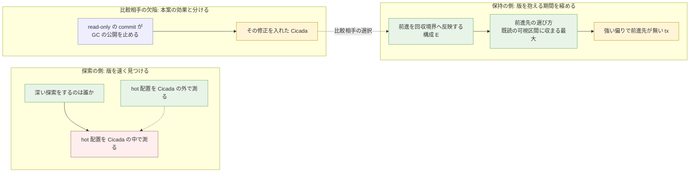

**凡例。** 緑 = 一次資料が効果を観測した項目、赤 = 一次資料が「この実装では上がらなかった」と書いた項目、黄 = 択一・未解決が残る項目、青 = 比較相手の欠陥。
色は一次資料の結論の向きを示すだけで、確認段の判定 (評価計画の「支持 / 不支持」) ではない。確認段はまだ 1 つも走っていない (§10)。

**読み方。** 前版は「論文の重心は探索を速くする側から版を抱える期間を縮める側へ寄る」と読んだ。3 版目の起点では、その読みを支える実物の測定がそろった。

- **探索の側 (H1)。** hot 配置 (直近 K 版の写しを手元に置く構成 B) を Cicada に入れた最初の測定 (md_23) は、read-only 95% の負荷でも同時刻の stock 比が
  12 組の中央値で 0.980〜1.011 に留まり、更新中心の負荷 (ro 0%・rr5・rr50) では遅くなった。評価計画の草稿 v1 §5.5 の探索段の語では、ro 95% の 12 組すべてが「予備的に不支持 (差なし)」、
  ro 0%・rr5・rr50 の全組と ro 50% の一部が「予備的に不支持 (悪化)」である (md_23 §1・§5.1)。Cicada の外の微小計測 (md_5) では連続配置の利益が出ていたので、
  **H1 は「Cicada の外では支持、Cicada の中ではこの実装では支持されなかった」** という形になった (§2)。
- **保持の側 (U0)。** 前進を回収境界へつなぐ構成 E (md_14) は、偏りの無い負荷 (skew 0) で回収境界の遅れを E-hb (flag だけ) 比 −54% にした。
  前進先を「既読の可視区間に収まる最大の時刻」(E-max) にすると、中程度の偏り (skew 0.6) でも遅れが 19.5 → 10.0 ms に縮んだ (md_21 §1)。
  強い偏り (skew 0.9) では E-max でも −1.0 ms に留まり、E-max の要求の約 75% が `no_room` (前進先が無い) だった。`no_room` には一度成功した後の要求も入り、成功後と成功前の内訳は数えていない (§5.5)。
- **比較相手の欠陥。** stock Cicada では read-only の commit が GC の flag を立てないので、read-only だけを続ける worker が 1 本いると回収境界の公開が止まる (md_22)。
  これは本案とは別の実装上の欠陥で、修正すると公開は戻る。**論文では修正の効果と本案の効果を分けて書く** (§6)。比較相手に修正を入れるかは T-2933 でユーザー判断待ちである。
- **正しさ。** 通したものはすべて「巡回 0、上限 indeterminate」。一般の論証 (md_13) は小モデル仕様 v1 についての定理で、実装には届かない (§4)。

**この図から読み取ってはならないこと。**

- 「hot 配置は効かない」「H1 は棄却された」とは書かない。md_23 は 1 つの設計点 (key ごとの seqlock で写しを保つ) を、YCSB の point read / update・K = 1〜8・n = 6 round・A/A 腕なしで測った探索段の結果である (§2.4)。
- 「GC を改善した」とは書かない。回収境界の遅れと論理生存版数は計器入りの build の診断値で、throughput の差は検出できていない。論理生存版数は物理メモリの bytes ではない (§5.4)。
- 矢印は論証のつながりであり、因果の強さや効果の大きさは表さない。

### 0.1 芯を支える 3 枚


**読み方 (md_21 の target-policy-gc)。** 上段 = 回収境界の遅れの平均 (ms)、下段 = 論理生存版数の平均 (百万)。横軸の目盛は「待機 ms / skew / GC 間隔 µs」、色 = 腕
(E-hb = 安全点で flag だけ立てる、E-now = 今の時刻へ前進、E-max = 既読の可視区間に収まる最大へ前進、E-max-once = 1 tx で目標計算を 1 回)。小さい点が各 rep、菱形が rep 中央値、
縦線は n = 3 の小標本 95% CI (負域へ伸びる例がある)。**言えること:** 待機 10 ms の長い tx があるとき、skew 0 と 0.6 では E-max が遅れと生存版数を縮め、skew 0.9 ではどの腕もほぼ同じ。
**言えないこと:** 計器入り build・3 秒・3 rep の値で、性能値でも「有意」でもない。遅れは timestamp 空間の ms (clock boost を含み、実時間ではない)。


**読み方 (md_23 の fig-k)。** 横軸 = cell (ro 指定率 × GC 間隔、と通常 YCSB の rr5・rr50・rr95)、縦軸 = 同じ round の stock に対する比、菱形 = 6 round の中央値、点 = 全 round、
縦線 = 最小〜最大、破線 1.0 = stock。**言えること:** ro 95% の 3 cell と ro 50%・GC 100 ms は 1.0 付近、rr95 は 0.927〜0.978、ro 0%・rr5・rr50 の更新中心の cell は大きく下回る (ro 50% は GC 間隔と K で 0.35〜1.00 と幅がある)。
**言えないこと:** 性能用 build (trace も計器も無し) の同時刻比較だが、判定の上限は indeterminate で、perf job が 2 node に分かれ node 差と K の効果を分けていない (md_23 §4)。


**読み方 (md_14 の gc-connection)。** 行 = 長い tx の 4 条件 (待機 1 ms / 10 ms × skew 0.9 / 0)、列 = (a) 回収境界の遅れの平均 (ms)、(b) 論理生存版数の平均 (百万)、
(c) 版の保持時間の平均 (ms)、(d) E の前進の成功率 (%)。横軸 = GC 間隔 (µs)、色 = 腕 (stock・C・E-hb・E)。**言えること:** skew 0 では E が遅れ・生存版数・保持時間を縮め、
skew 0.9 では「今」への前進がほぼ失敗して E と E-hb が重なる。**言えないこと:** 表題の "diagnostic values" のとおり計器入り build の値で、E の前進先は「今」(md_21 の E-now に当たる)。

### 0.2 検証の段取りの現在地

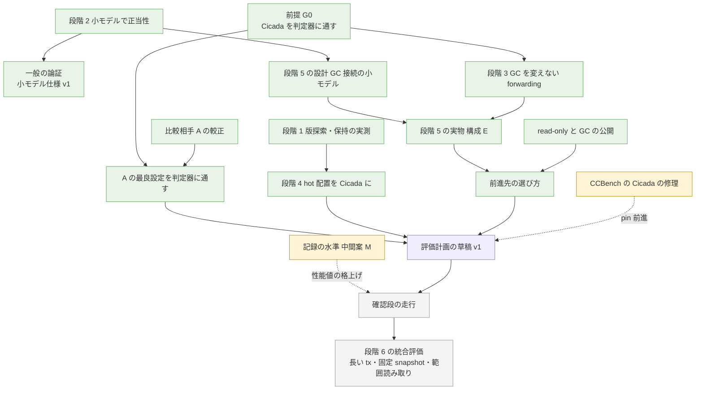

**凡例。** 緑 = 一次資料が main に着地した段、黄 = 裁定・修理は済んだが実装・push が残る段 (M の実装は AI の手番、CCBench の push は人間の手番)、青 = 草稿がある (未発効)、
灰 = 統合した評価に手を付けていない段 (段階 6 の個別の調査 — 長い tx は md_14・md_21、固定 snapshot の read-only は md_15・md_22 — は着地しているが、範囲読み取りを含めた統合の評価は未着手)。段の名前は出典メモ §29 の段階 1〜6 と前版 §0.2 に合わせた。
**この図から読み取ってはならないこと:** 緑は「その段の問いに答えが出た」ではなく「一次資料がある」の意味である。どの段の結論も範囲つきで、
確認段 (評価計画の「支持 / 不支持」を出す段) は 1 つも走っていない。

### 0.3 題名と主張の重心 — 択一 (決めるのはユーザー)

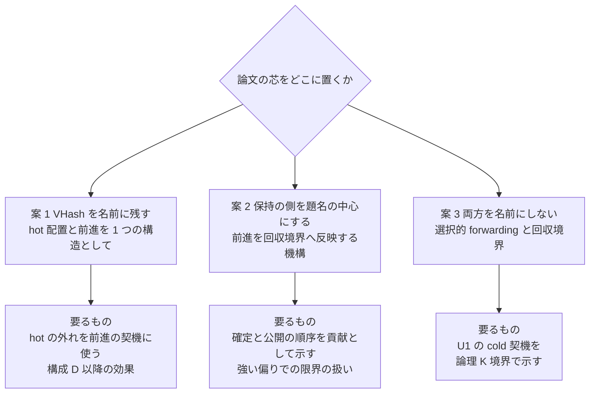

**読み方。** 3 版目の起点で、H1 (hot 配置で探索を速くする) は Cicada の中の単独構成では上がらず (§2)、U0 (前進を回収境界へ反映) は偏りが中程度までなら実物で効いた (§5)。
仮称 VHash は hot 配置の名前なので、題名と主張の重心が揺らいでいる。**どの一次資料も題名の択一を書いていない** (md_1・md_9・md_27 と前版・README を「題名」「重心」「名前に」などで検索した範囲、F の抽出)。以下は親の整理であり、決めるのはユーザーである。

| 案 | 中身 | 支える一次資料 | 弱点 (一次資料が書く弱点を含む) |
|---|---|---|---|
| 案 1: VHash を残す | 新規性の案 A (U1 + U0 の組合せ、md_9 §7) を芯にし、hot 配置は「前進の契機を安く判定する構造」(U3) として置く | md_9 §7 案 A、md_23 §1 項 8 (「構成 D 以降の価値は hot 単独の読みの速さではなく別の効果で示す必要がある」) | 構成 D (hot の外れで前進) は未実装。hot 単独の利得は Cicada の中で出ていないので、組合せの効果を切り分ける評価が無いと「足し合わせ」と読まれる (md_9 §7) |
| 案 2: 保持の側を中心に | 新規性の案 B (U0 単独) を芯にし、確定と公開の順序・前進先の選び方・安全点を貢献にする | md_14 §1、md_21 §1、md_10 (公開を早めると GC 違反の反例)、md_13 | 規則も動機も既知で「前進を公開すれば境界が上がる」は自明と読まれうる (md_9 §7)。強い偏りで効かない (md_21)。動機の数値 (長い read-write tx の大きさ) が外部資料に無い (md_27 §8、T-2916) |
| 案 3: 両方を名前にしない | U1 (cold への進入を前進の契機にする) を論理 K 境界で示し、U0 を続ける | md_9 §7 案 C、md_6・md_21 (C は論理 K 境界で発火) | 案 C は「向きを逆にしただけ」と読まれうるので、判定を安くする構造と一緒に示す必要がある (md_9 §7)。その構造が VHash である |

**親の推奨 (provisional、ユーザーの択一):** 案 2 を芯にし、U1 は前進の契機として同じ論文に残す。理由は、実物で効果が観測されたのが U0 の側だけで (§5)、
案 1 は構成 D の実装と測定が済むまで芯にできないからである。ただし案 2 の弱点 (動機の数値の穴、強い偏りの限界) は評価で自分で示す必要がある (§12)。

---

## 1. 問題と動機: 長い transaction が回収境界を止める

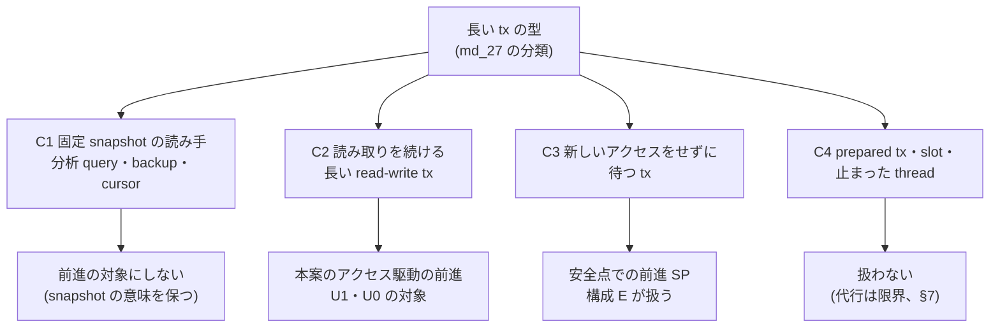

**読み方。** md_27 (動機づけの根拠集め) は長い tx を 4 型に分けた。**この分類は md_27 が置いたもので、出典自身の分類ではない** (md_27 §4)。
本案が縮めたいのは C2 と C3 の分で、C1 と C4 は扱わない。前版 §1 は動機を md_2 と CCBench 論文 §7 だけで示していたが、md_27 が外部の根拠を足した。

**集めた根拠 (md_27 §1.1・§6):** 公式文書・技術資料 38 頁 (R1: PostgreSQL・MySQL・AWS Aurora の 17 頁、R2: Oracle・SQL Server・MongoDB・CockroachDB・TiDB・Spanner・YugabyteDB の 21 頁) と
論文・資料 10 本 (R3) の計 48 件。worklog エントリ 1954 の見出しの「公式文書 48 件」は論文 10 本を含む数え方である。

**論文 §1 に使える文 (md_27 §5.1 の M1〜M6 の要点):**

- M1: 最古の実行中 tx が回収境界を決める tx 型の GC (PostgreSQL・MySQL InnoDB・SQL Server・TiDB 6.1.0 以降・Aurora) では、長い tx が回収を止める。
  時間型 (Oracle・Spanner・YugabyteDB・CockroachDB) は通常の読み取りでは止まらず、代わりに長い読み取りが失敗する — と同じ段落で書く。
- M2: 回収が止まると容量・性能・可用性が悪化する。**数値はすべて C1 (固定 snapshot の読み手) の実験の値だと明記する。**
- M3: 問題は実運用で起きている。ただし頻度の根拠は HANA の 1 システムの統計 (408,664 query 中 6 cursor が 1 時間超) だけである。
- M4: 読んだ 10 製品系と HANA の範囲では、既存の対処は「長い側を終わらせる」「待ち上限で強制前進」「snapshot の失効」「書き込み側を遅らせる」のどれかで、何かを諦める。
  md_27 §3 末尾の逐語: 「読んだ文書の範囲では、どの製品の対処も『長い tx を生かし続ける』と『その tx から見えうる版を回収する』を両立させていない。」
- M5: 途中版の剪定 (区間 GC・EPO) は列を縮めるが、長い snapshot から見える版は残す。
- M6: 本案は C2 の長い tx を abort せず前進させ、その前進を保護下限へ反映する。

**使えない文:** 「長い tx は頻繁に起きる」。「本案は C1 の数値の分だけ速くなる」。md_27 §0 項 4 の逐語: 「研究側の版・GC の症状の数値 (§4.1 の表) はすべて C1 (固定 snapshot の読み手) の実験である。
今回読んだ研究の範囲 (§1 の R3 の 10 本) では、長い側が read-write の tx である実験は 1 本も無かった。… 3 の数値を『本案が縮める痛み』として引いてはならない。」
**C2 の大きさの数値は外部資料に無い** — 評価実験で自分で示す必要があり、T-2916 に登録されている (md_27 §8)。


**読み方 (md_2 の図 3)。** 上から回収境界の年齢・公開の間隔・回収時の年齢・論理的な生存版数を、GC 間隔ごとに並べた。色が長い tx の型。
**言えること:** 読み取りの後に待つ長い tx (C3) があると、境界の年齢と公開間隔が伸びる向きである (md_2 §0 項 4: 10 ms 待機で境界年齢 p50 が 32 µs → 32768 µs の bucket、論理生存版数 1.03e6 → 1.41e6)。
**言えないこと:** 計器入り build の観測で性能値ではない。境界年齢は timestamp 空間の値 (clock boost を含む) の 2 倍刻みの bucket 上界で、公開間隔は実時間である。
C3 は本案のアクセス駆動の前進では発火しない型なので、この図は §5 の安全点 (SP) の動機であって、U1 の動機ではない (md_27 §4.2)。

**前版から変わったこと。** 前版 §1 は「read-only の commit も GC flag を上げない。read-only 試行が約 59% の workload B は、長い tx が無くても境界年齢 p50 が 2048 µs の bucket だった」と並べた。
md_15 はこの並べ方を「skew・読み比・ro 比率を同時に変えた比較で、ro の寄与の根拠にならない」と整理した (md_15 §6.1)。機序 (ro の commit が flag を上げない) そのものは md_22 が介入で確かめた (§6)。

---

## 2. VHash: 直近の少数版を手元に置く — Cicada の外では速く、Cicada の中では上がらなかった

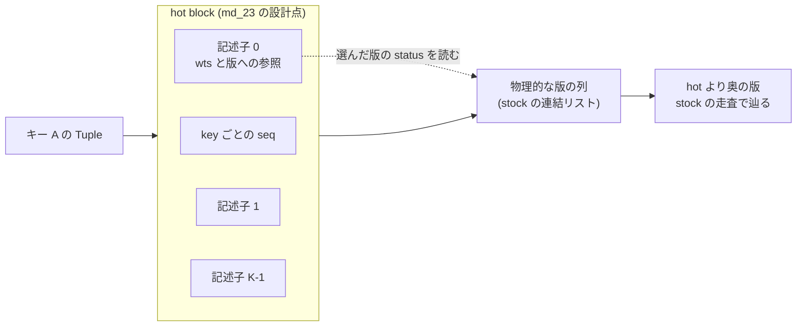

**読み方。** md_23 が Cicada に入れた hot block は、key ごとに「物理的な版の列の先頭 min(K, 長さ) 件の写し」を `{wts, Version*}` の記述子として持ち、key ごとの seqlock で一貫した読みを保つ (D2311)。
ABORTED と PENDING の版も写し、status は写さず選んだ版の `status_` を読む。値は hot に置かない (md_5 で K=8 の inline 値は最新版の読みで散在 linked より遅かった)。
K はコンパイル時の値 (1, 2, 4, 8)。**これは設計空間の 1 点である** (md_23 §11)。前版 §2.4 が「決めていない」とした更新方法・一貫した読みの方法は、この 1 点では決めて測ったが、他の方式 (hot を遅れて更新する等) は未測・未論証のまま残る。

### 2.1 深い版探索をするのは誰か (md_2・md_15)


**読み方 (md_2 の図 1)。** 上段 = update tx の読み取りのうち hot 容量 K より奥へ行った割合、中段 = read-only tx の同じ割合、下段 = 深い update read のうち既読を保って前進できる候補があった割合
(観測時点の楽観値、分母 30 未満は白抜き)。**言えること:** update tx の深い探索は少なく (workload B で位置 ≥ 1 が約 0.9〜1.4%)、read-only read は 24〜48% が位置 ≥ 1 である (md_2 §0)。
**言えないこと:** 計器入り build・48 worker・100 万件・3 秒・YCSB の観測で、性能や forwarding の成功率ではない。


**読み方 (md_15 の図 1)。** read-only read が位置 ≥ 1 へ行く割合と、深い read に占める read-only の割合を、ro 指定率・長い tx の型・GC 間隔ごとに並べた (下段が md_11 の最良設定)。
**言えること (md_15 §0 項 1):** ro 指定率 25% 以上の全条件で、位置 ≥ 1 の read の 87〜100% が read-only 由来、位置 ≥ 4 が観測された条件では 99.4〜100%。
update tx の read が位置 ≥ 1 へ行くのは全条件で 0.00003〜5.8%。**言えないこと:** 計器入り build の観測で、割合は深い read の**総量**が小さい条件 (skew 0) も含む。


**読み方 (md_2 の図 2)。** site ごとの、stock の走査が `next` を辿った回数と、選んだ版の位置の分布。9 以上は bucket 幅が広がるので、「16」の段差は bucket 幅によるもので分布の山ではない (md_2 §8)。

**H1 への含意。** hot 配置の効果の上限は read-only (固定 snapshot) の深い探索の側にある (md_2 §10)。md_23 はこれを受けて、ro 比率と GC 間隔 (snapshot の古さの代わり) を軸にした。

### 2.2 Cicada の外: 連続に置くと何が速いか (md_5)


**読み方 (md_5 の fig-k・fig-depth)。** 1 キー分の版選択を、トランザクション処理から切り離して 1 thread・固定 core・依存連鎖の latency で測った。fig-k は K ごとの最新版と cold の深さ K+2、
fig-depth は K=8 で目的の版の深さを 0 から 12 まで動かした (深さ 8 が hot と cold の境界)。区間は 8 反復の percentile bootstrap 95% で、反復変動の記述である (md_5 §4)。

| 観測 (md_5 §0、中央値) | 値 |
|---|---|
| LLC 外の最新版選択、連続配置 scalar ÷ 散在 linked | 0.55〜0.84 倍 (K=1: 113 ns 対 204 ns、K=16: 149 ns 対 176 ns)。L2 内でも 0.73〜0.87 倍 |
| K=8・LLC 外で深さ 0→7 | 散在 linked 187→1,269 ns、局所 linked 201→679 ns、連続配置 scalar 144〜152 ns でほぼ一定 (深さ 7 で散在 linked の 0.12 倍) |
| hot を越えた深さ 8 以降 (連続配置 scalar) | 296→576→827 ns |

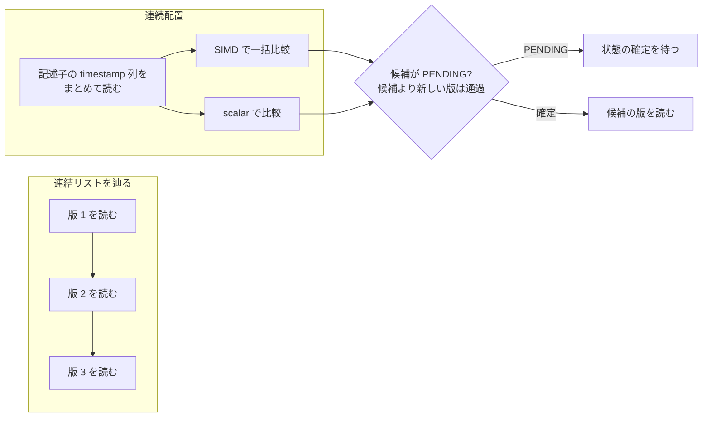

**読み方。** 連続配置の利益と SIMD の利益を分けて比べた (出典メモ §7.4)。AVX2 は L2 内の最新版で scalar より遅く (15〜19 ns 対 8〜10 ns)、LLC 外では K=1 だけ速く、
K≥8 では 244〜253 ns 対 143〜149 ns と遅かった (md_5 §0 項 4)。**利益は配置 (連続であること) から来ており、この AVX2 実装の SIMD からは来ていない。**
**射程:** Cicada への組み込み・並行更新・many-core・独立多キーの throughput は測っていない (md_5 §1)。単位は 1 thread の latency (ns) で、§2.3 の 48 thread の throughput とは直接比べられない。

### 2.3 Cicada の中: 構成 B の同時刻比較 (md_23)


**読み方 (md_23 の fig-ro)。** 横軸 = ro 指定率 (0・50・95%)、線 = K × GC 間隔、縦軸 = 同じ round の stock 比。ro 比率を上げると 1.0 に近づくが、1.0 を明確に上回る線は無い。
**言えないこと:** 横軸は「指定率」(実現 ro commit 割合は ro 95% で 0.950)。ro 比率で update 数・版生成・abort も変わるので、**ro 比率の因果効果を示す図ではない** (md_23 §5)。

| cell (md_23 §5、K/stock の 6 round 中央値) | K=1 | K=2 | K=4 | K=8 |
|---|---|---|---|---|
| ro95・GC 10 µs | 0.985 | 0.980 | 0.987 | 0.989 |
| ro95・GC 1 ms | 0.982 | 0.984 | 0.994 | 0.997 |
| ro95・GC 100 ms | 1.000 | 0.999 | 1.006 | 1.011 |
| rr95 | 0.978 | 0.978 | 0.957 | 0.927 |
| rr5 | 0.686 | 0.795 | 0.553 | 0.537 |
| rr50 | 0.229 | 0.262 | 0.231 | 0.229 |
| ro0・GC 10 µs | 0.227 | 0.257 | 0.231 | 0.227 |
| ro50・GC 10 µs | 0.631 | 0.935 | 0.355 | 0.347 |

**条件 (md_23 §3.1・§4):** Pegasus の 48 core ノード、48 thread、100 万 tuple、zipf 0.9、max_ope 10、3 秒。build は pin C + inert patch、性能用 build (trace も計器も無し)、
md_11 の観測最良設定 (BACK_OFF=0・INLINE_VERSION_OPT=1・INLINE_VERSION_PROMOTION=0・REUSE_VERSION=1・WRITE_LATEST_ONLY=0)。12 cell × 5 腕を 1 job 内で round ごとに回し、
3 job × 2 round = 6 round。**比は同じ job・同じ round・同じ cell の K/stock である。** 表は 12 cell のうち 8 cell で、全 cell は md_23 §5 の表。

**評価計画の草稿 v1 §5.5 の語 (md_23 §5.1、探索段の予備的な語):**

| 比較 | 語 | 組 |
|---|---|---|
| B_K 対 A | 予備的に不支持 (差なし) | ro 95% の 3 GC × 4 K の 12 組、ro 50%・GC 100 ms の 4 組、ro 50%・GC 1 ms の K=1・2、ro 50%・GC 10 µs の K=2、rr95 の K=1・2・4 |
| B_K 対 A | 予備的に不支持 (悪化) | ro 0% の 12 組、rr5・rr50 の 8 組、ro 50% の一部 |
| B_K 対 A | 判定不能 | rr95 の K=8 の 1 組 (対数比の最小が −ln 1.10 を僅かに下回り、全 round が同じ語にそろわない) |
| 主 cell c23 (ro 95%・GC 100 µs) | 欠測 | 測っていない |
| 用量 (R95−R0 の差の差) | 判定不能 | A/A 腕が無いので支持の語を出せない。差の差が大きいのは R0 側で B が大きく遅いためで、R95 側で速いためではない |
| K* | K* = 1 | 全 K が最良の K=4 と同点 (\|ln 比\| ≤ ln 1.10) なので最小の K。K=1 が最良という意味ではない |

**この判定の地位。** §5.5 は md_23 の結果より前 (2026-09-29 22:59) に main に置かれたが、md_23 の計測はそれを知る前 (22:45) に設計したので、A/A 腕も主 cell c23 も無い。
親が §5.5 を読んだのは結果を見た後で、規則は変えずに全点へ機械的に当てた (md_23 §5.1)。n = 6 で「これは検定ではない」。**この設計では A/A 腕が無いので、仮に H1 が効いても「予備的に支持」の語は出なかった。**
「差なし」は「探索の 6 対で対数比がすべて ±ln(1.10) 以内だった」の意味で、「効果は 10% 未満」とは書かない (草稿 §5.5.0)。

**正しさ (md_23 §3):** 3 つの trace cell × 5 腕の 15 走すべてで巡回 0、integrity の数値項目 0、判定 indeterminate。壊し 2 本 (B1: hot で 1 つ古い確定版を返す、B2: 選んだ PENDING 版を待たずに飛ばす) は
どちらも巡回として検出され、壊した読みに帰属した。**B2 は結果前に「validation に止められて commit 0、検出 0」と予測したが外れた** (機序は未特定、T-2927)。

### 2.4 なぜ上がらなかったか、どこが残るか

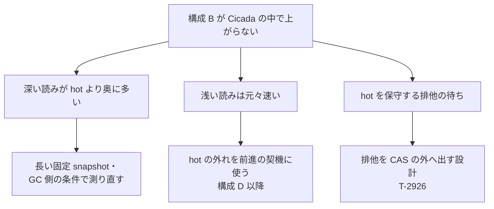

**読み方。** md_23 §1 項 8 が挙げた 3 点 (a)(b)(c) と、それぞれに対して一次資料が挙げた残りの範囲 (md_23 §11・§12) を並べた。
**3 点は計器の数からの説明であり、利得が小さいことの因果の内訳ではない** (md_23 §1 項 4)。

- (a) GC 100 ms・ro 95% で、stock の第 1 段が飛ばした版数は 0 版 56%・1〜3 版 14%・4〜15 版 9%・16 版以上 21%。K=8 でも hot の外へ出た読みが 2,335 万回あった (md_23 §6、計器入りの別 build・1 走)。
- (b) GC 10 µs・ro 95% では 0 版が 82% で、飛ばす版がそもそも少ない。
- (c) 更新中心の cell で、1 update commit あたりの書き区間の**待ち**が約 9.8 万〜11.8 万サイクル、**保持**が約 2,800〜3,800 サイクル (md_23 §6)。stock は挿入を lock なしの CAS だけで行う。


**読み方 (md_23 の fig-write)。** 上段 = 更新中心 4 cell の stock 比、下段 = ro 0%・GC 10 µs の計器 build での hot の書き区間の**保持**サイクル / update commit。
**図の限界: 下段は保持だけで、主因の「待ち」を描いていない** (待ちは md_23 §6 の表で読む。T-2927 (4) が図の修正を持つ)。

**「H1 は Cicada の中では支持されなかった」と書くときの限定 (md_23 §11 と評価計画 §5.5):**

| 軸 | 限定 |
|---|---|
| 負荷 | YCSB の point read / update だけ。TPC-C・scan・insert / delete は未測 |
| K | 1, 2, 4, 8 |
| 設計 | 1 つの設計点 (key ごとの seqlock で写しを保つ、挿入の CAS を書き区間の中で行う) |
| 判定 | 探索段の予備的な語 (n = 6、A/A 腕なし、主 cell 欠測)。確認段は走っていない |
| 指標 | throughput だけ。前版まで H1 の主指標だった「commit あたりの LLC load miss」は perf が計算ノードで使えず未測 (草稿 v1 は H1 の主指標を throughput に替えた。md_23 の冒頭は旧主指標を書いており食い違う) |
| snapshot の古さ | 計器が飽和して分解できず、GC 間隔で代用した (md_23 §6) |

### 2.5 書き込みの費用: 設計次第で大きく変わる


**読み方 (md_5 の fig-write)。** hot block が cache 内にある条件での 1 回の新版挿入の費用。ring buffer は 37〜76 ns/挿入で K にほぼ依存せず、block 差し替えは inline 256 B で 113→1,624 ns と最も高い。
**言えないこと:** cache の外にある hot block への書き込み・並行 reader への公開・旧 block の回収の費用は測っていない (md_5 §6)。md_23 の書き区間の待ち (§2.4 (c)) は、
md_5 が測らなかった「並行する書き手の間の排他」の費用であり、md_5 の単一 thread の数とは別物である。

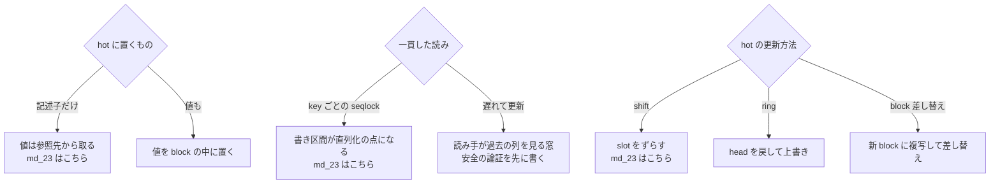

**読み方。** md_23 が選んだ枝 (「md_23 はこちら」) と、選ばなかった枝。遅れて更新する案は D2311 で「更新中心の費用を下げる本命の候補だが、本 wave では論証を書いていないので採らず」とされ、
T-2926 (書き込み側の排他を CAS の外へ出す設計を 1 つ試す) に回った。

---

## 3. 選択的 forwarding: cold に入りそうなときだけ timestamp を進める (構成 C)

### 3.1 試作した読み取りの判断 (md_6)

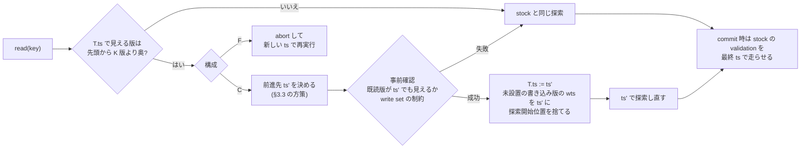

**読み方。** md_6 の試作 (`patches/cicada-forwarding-variant.patch`、D2287) の流れ。物理的な hot は作らず、「先頭から K 版より奥を辿る必要がある」read を発火条件にした (論理 K 境界)。
前進は read 相だけで行い、最終保証は stock の validation を最終 ts で走らせることに置く。GC の保護は旧 ts のまま据え置く (段階 A だけ、§5.1)。
F は同じ発火条件で abort して再実行する対照である。前進前の確認で rts は書かない (早期判定であって最終保証ではない)。


**読み方 (md_6 の図)。** 行 = workload、列 = (1) C の成功率と試行数、(2) 試行の内訳と試行前の除外、(3) stock 比の throughput (3 rep の点と小標本 95% CI)、(4) 長い thread の commit と F の abort。
図の長い thread の commit に stock 系列は無い (stock を含む値は md_6 §5.3 の表)。計数は各セル 1 rep。**この図の土台は CMake 既定の Cicada で、md_11 の最良設定ではない** (§3.4)。

| 観測 (md_6 §1・§5、48 thread・100 万件・zipf 0.9・K=3、CMake 既定の Cicada) | 値 |
|---|---|
| 通常の YCSB で C の発火 / 試行 / 成功率 | 発火 3,489〜6,167 回・試行 1,131〜2,069 回、成功率 0.73〜0.75 |
| 1,000 操作の長い thread を含む型 | 成功率 0.18〜0.19。失敗の大半は既読の版が前進先で見えない (既読不一致) |
| 読み取り後に待つ型 | 待機中は read が無いので構造上発火しない |
| throughput の stock 比 (3 rep の中央値) | C は 0.952〜1.032。F は K=1 を除き 0.952〜1.021、K=1 では 0.661。95% CI は K=1 の F を除き全条件で 1 をまたぐ |

md_6 の総括 (§1 項 3): 「この試作 (GC 不変・論理 K 版の cold 境界) では、forwarding の費用対効果の利得はまだ見えていない。」

### 3.2 3 つの方針の違い (記号の例)

T の今の timestamp を t3 とし、既読の版 A が t1 から t6 の手前まで見えているとする。キー B の版は
新しい順に B@t8, B@t7, B@t5 が hot、B@t4, B@t2 が cold にある (t1 < t2 < … < t8)。

```text
時刻  →   t1    t2    t3    t4    t5    t6    t7    t8
既読 A    [===========================)                  A の見える区間 [t1, t6)
B の版          B@t2        B@t4  B@t5        B@t7  B@t8
                └── cold ──┘      └──────── hot ─────────┘
T の現在              ^t3

固定          : t3 のまま → B@t2 を読む          → cold を辿る
今へ前進      : t8 へ進む → B@t8 を読む          → A が見えない (t8 は [t1, t6) の外)
最小の前進    : t5 へ進む → B@t5 を読む          → A も見える (t5 は [t1, t6) の中)、cold を避けられる
区間内の最大  : t6 の手前へ進む → B@t5 を読む    → A も見え、時刻はより新しい
```

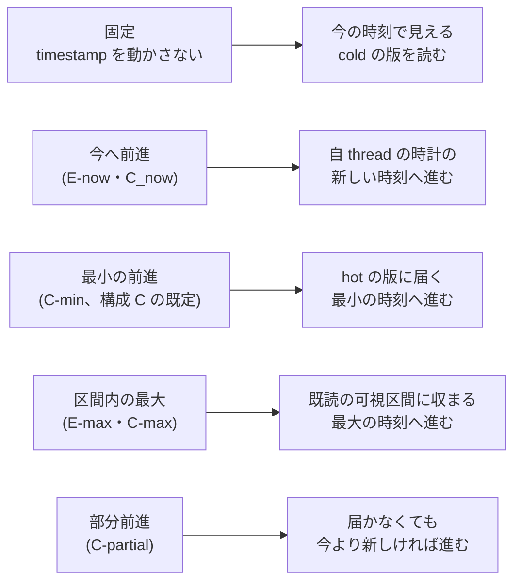

**読み方。** md_21 が比べた前進先の方策 (D2315) を、前版の記号の例に並べた。例の上の帰結であって一般の性質ではない。
**「最新でない hot 版を選べる」こと自体は新規性にならない** — SI-STM (2006) と CockroachDB の read refresh (2020) が既に持つ (md_9 §5、§11)。

### 3.3 構成 C の前進先: 最大にしても既読不一致は減らず、部分前進だけが成功率を上げた (md_21)


**読み方 (md_21 の target-policy-c-reasons)。** C 腕の失敗理由ごとの回数 / 発火 (%)。C-min と C-max は既読不一致が 90% 前後 (skew 0.6)、C-partial は既読不一致が 30% 台に下がる代わりに書き込み制約が 30〜43% に増える。


**読み方 (md_21 の target-policy-many-ops)。** 上 = 長い thread の成功 / 発火、中 = 通常 thread の成功 / 発火、下 = 長い tx の完了率 (stock・C の各方策・F)。

| many_ops・GC 10 µs (md_21 §4.4、rep 中央値) | C-min | C-max | C-partial | 長い tx の完了率 (stock / C-min / C-partial / F) |
|---|---|---|---|---|
| skew 0.6、長い thread の成功 / 発火 | 0.050 | 0.048 | 0.320 | 0.00008 / 0.00022 / 0.00018 / 0.00002 |
| skew 0.9、長い thread の成功 / 発火 | 0.009 | 0.012 | 0.048 | 0 / 0 / 0.00002 / 0 |

**言えること (md_21 §1 項 4):** C-max は C-min と同じ成功集合を持ち (段 1 の仮説 P3 と合う)、C-partial だけが長い thread の成功率を上げた。
**言えないこと:** 長い tx の完了率はどの腕でも 0.0003 以下で、**成功率の向上は完了に結び付いていない**。「C-partial が長い tx を救う」とは書かない。
D2315 は、C の既定を最小の前進のまま置き、C-max は採らず、C-partial は完了率が上がらない限り既定にしない別腕とした。

### 3.4 最良設定の上の throughput: C は差が見えず、F は強い偏りで大きく落ちた (md_21)


**読み方 (md_21 の target-policy-throughput)。** 計器なし build、3 rep の中央値の stock 比。資料自身が「差は判定しない (記述値)」と書く。

| cell (md_21 §4.5、md_11 の最良設定の上) | C-min | C-partial | F |
|---|---|---|---|
| many_ops・skew 0.6・GC 10 µs | 0.988 | 0.985 | 0.981 |
| many_ops・skew 0.9・GC 10 µs | 1.017 | 0.688 | 0.212 |
| many_ops・skew 0.9・GC 1 ms | 1.008 | 0.996 | 0.380 |
| normal・skew 0.9・GC 10 µs | 1.033 | 1.024 | 0.301 |
| normal・skew 0.9・GC 1 ms | 1.043 | 1.024 | 0.493 |

- C-min は全体で stock 比 0.97〜1.04。**実行コードが同じ腕の間でも 0.97〜1.04 揺れる**ので、この幅の内側と読む (md_21 §4.5)。
- F は skew 0.9 で 0.21〜0.49、skew 0.6 で 0.98〜1.00。原因を資料は「BACK_OFF=0 で abort 後すぐ再実行するから」と推定している (未検証)。
- C-partial の many_ops・skew 0.9・GC 10 µs の 0.688 は、rep の値が 0.26〜1.0 に散っている。
- **前版の md_6 の表の「C / F と stock の差は検出できない」は、最良設定の上では F について成り立たない** (md_21 §1 項 5)。md_6 の土台は CMake 既定の Cicada で、rr50 で最良より約 4.5 倍遅い (md_11 §10)。
  この測り直しで T-2903 を閉じる扱いになった。

### 3.5 可視区間で書くと

版 v が見える区間を I(v) = [b(v), e(v)) と書くと、既読の版の集合 R_T が同時に見えうる区間は、下限 L_T = max b(v)、上限 U_T = min e(v) (v ∈ R_T)、
共通の timestamp が存在する条件は L_T < U_T である (出典メモ §9)。md_21 の E-max・C-max の「区間内の最大」は、この U_T の手前 (既読版ごとに直上の非 aborted 版の wts の最小の下) を目標にする (md_21 §2)。
**これは read 集合の整合性の条件であって、更新 transaction 全体の commit 条件ではない。** 同じ形のモデルは Hekaton (2011) が可視区間 Begin / End として実装に使っている (md_1 §8.1)。

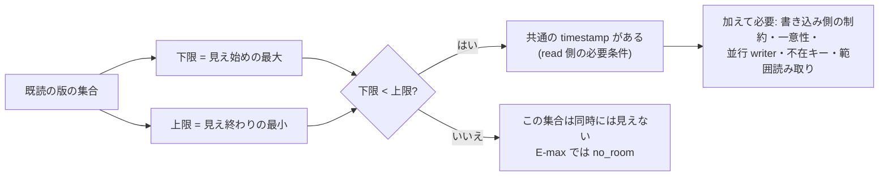

**読み方。** 上限が自分の旧時刻や公開済みの時刻以下なら前進先が無い。md_21 はこれを `no_room` と数えた (§5.7)。

---

## 4. 正しさ: 何が言えて、何が言えないか

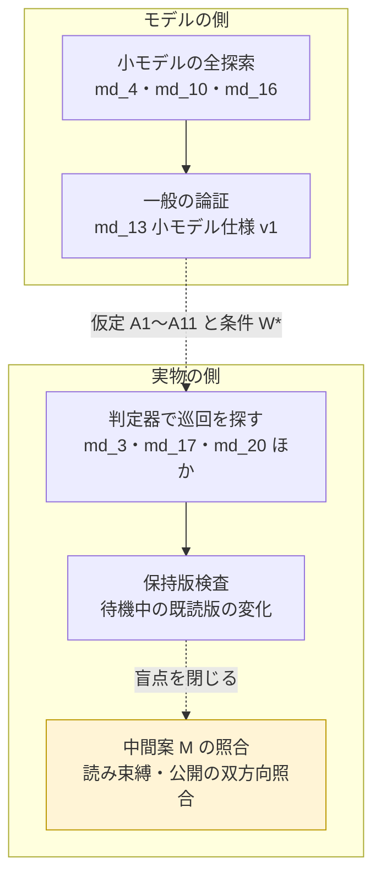

**読み方。** 左はモデルについての主張、右は実物の実行についての主張で、**左の結論は右へ自動では移らない**。黄 = 裁定済みで未実装 (中間案 M、§4.5)。

### 4.1 小モデルが検査したもの (md_4)

| 規則 (md_4 §7.3) | 崩した危ない版 | 結果 (固定場面の範囲) |
|---|---|---|
| R9' 書き込み側の直前版の rts 検査は PENDING を越えて最初の確定版まで | v0 (出典メモ §4 を模した直前版 1 つの検査) | 閉路の反例、30 step (場面 S8) |
| R9 の順序: 既読版の rts を上げてから可視を確認 | U1v | 閉路の反例、26 step |
| R9 の可視確認を他 tx の rts だけで省かない | U2 | 閉路の反例、33 step |
| R5 の順序と観測し直し (forwarding の確認) | U1f・U6 | O1 なしでは未検出。O1 と組むと閉路の反例、39 step |
| R6 → R7: 確定してから GC へ公開 | U3a | GC 違反、3 step |
| 物理参照は参照の終わりまで保持 | U3b | GC 違反、18 step |
| R10 後続の確定版で回収 | U4 | GC 違反、2 step |
| R1 PENDING を飛ばさず待つ | U5 | 未検出 (commit 時の検証が遮る) |

- 仕様 v1 (v0 + R9') は 10 場面すべてで反例なし、v1 + O1 も反例なし。検査器自身への変異 11 種で 10 KILLED、1 は等価変異 (md_4 §8)。
- **範囲:** キー 2、tx 2〜3 (+ GC 1 thread)、操作 1〜3、K は 1 (1 場面だけ 2)、逐次一貫のメモリ (md_4 §6)。**反例なしは固定場面の初期状態からの全 interleaving に限る。**
- v0 は md_4 が独自に決めた規則で、Cicada の欠陥ではない (md_8、§4.3)。

### 4.2 一般の論証: 小モデル仕様 v1 についての定理 (md_13)

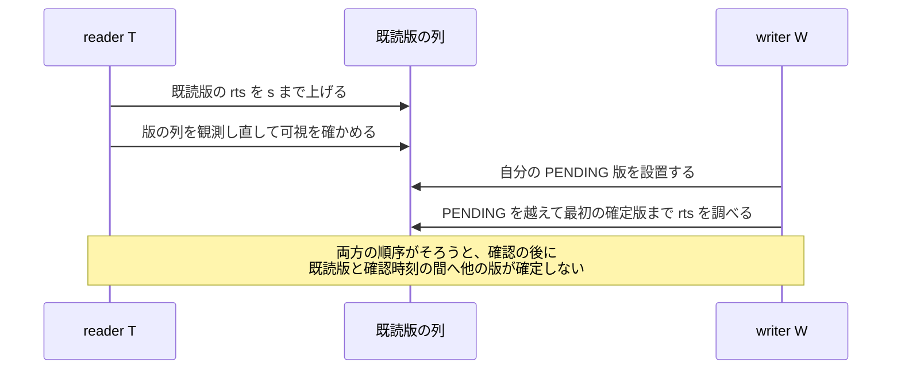

**読み方。** md_13 の論証の芯 (§2・§3) である 2 つの順序。reader は rts を上げてから観測し直し (R5・R9)、writer は設置してから PENDING を越えて最初の確定版まで検査する (R9')。

**論文に書ける一文 (md_13 §0 の趣旨):** 固定キー集合への point read / update だけ、逐次一貫なメモリと md_4 の原子性の下で、md_4 仕様 v1 (R9' を含む) に従う txn について、
commit 時の検証を通って確定した txn の依存グラフ (ww / wr / rw) は閉路を持たず、確定時刻の順がそのまま直列化の順になる。ただし仮定 A1〜A11 を前提とする。

| 書ける | 書けない |
|---|---|
| 上の定理 (仮定 A1〜A11 を同じ文か表に置く) | 「Cicada + forwarding は serializable」 |
| 2 つの順序が要ること | 「実装の GC 接続 (md_10 の G4〜G7) が安全」 — A9 (GC が検査対象の版を回収しない) は仮定で、モデルでは観察だけ |
| Cicada 型の「PENDING を待つ」書き込み検査は、条件 W* (待機解除後に status を観測し直す等) を置いた補題 2′ で同じ結論 | 「CCBench の Cicada は W* を満たす」 — 未確認 (T-2906) |
| 発火の契機・前進先の選び方に依らない (系 5、A2 だけを使う) | 系 5 を GC 接続全体へ広げる |

**この論証の地位。** 前版の状態語で言えば「一般の証明」に当たるが、**対象は小モデル仕様 v1 で、実装にも md_6 の試作にも届かない** (D2292 項 3・4)。
A2 (時刻の一意性) には、stock の時刻生成が abort 後に同じ値を返しうるという疑い (md_6 §2、コード読みのみで未実測) が残る。途中で入場する txn は範囲外 (A10、T-2907)。

### 4.3 比較相手 Cicada の書き込み検査に v0 の穴は無い (md_8)

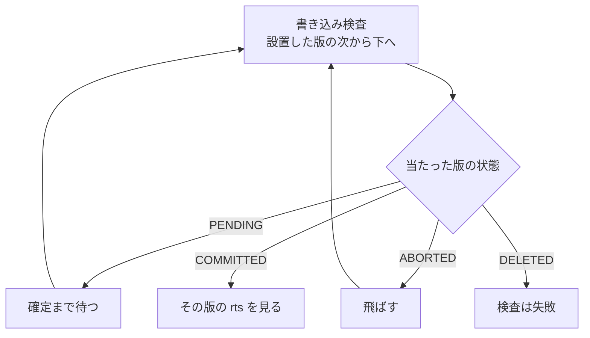

**読み方。** CCBench の Cicada (gitlink `68106660`) の最終書き込み検査を静的に読んだ流れ (md_8 §2)。v0 のように「PENDING の直前版 1 つの rts を見て通す」経路は無い。
待ちの 2 規則を入れた小モデル (vC) では、固定場面 S8 の窓から到達した終端はすべて T か W の一方が abort していた (md_8 §4.3)。
**実 Cicada での再現走行はしていない**。C++ の記憶模型の上での相互見落とし (store-buffer 形) は未検証 (md_8 §5)。

### 4.4 実物の判定器: 範囲は広がったが、上限は indeterminate のまま

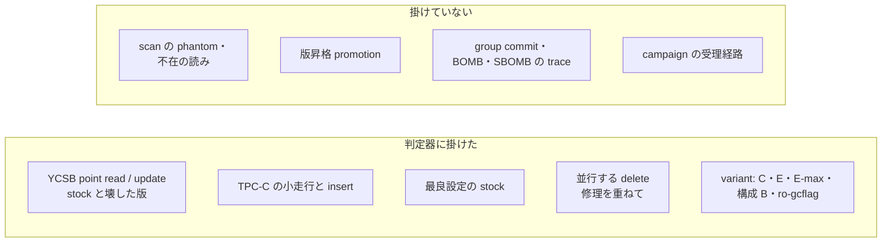

**読み方。** 左が一次資料で判定器に掛けたもの、右が掛けていないもの。判定器は Cicada に対して「巡回があれば non-serializable、無ければ indeterminate」しか返さない。
Silo / MOCC の X / P / I に当たる証拠面が Cicada に無いからである (md_3 §1 項 5)。

| 何を | 結果 | 出所 |
|---|---|---|
| stock の YCSB point read / update | 7 走行すべて巡回 0。壊した Cicada 3 本は巡回として検出、代表 witness 20 件中 20 件を壊した経路に帰属 (1 回目の本走は帰属 0 件で、事象の全件出力で再走した後の値) | md_3 §1・§4 |
| stock の TPC-C 小走行 | 5 走行すべて巡回 0。insert を壊した版は生産者の無い版を読む orphan read 1,144,962 件として検出・帰属 | md_17 §1 |
| 並行する delete (TPC-C の全 mix) | stock は `gc_records()` の ERR で異常終了する (4 thread で md_17 は 11 回中 11 回、trace なしでも 5 回中 5 回)。修理 2 本 (`fix-cicada-gc-records*.patch`) を重ねると完走し、trace 3 本で巡回 0 | md_17 §5、gc-records-fix §4 |
| 最良設定 (BACK_OFF=0・OPT=1・PROMOTION=0 ほか) の stock | 32 run (異なる条件は 30、走行 1 秒) で巡回 0。inline slot の版を選択時・登録時・commit 時の 3 点で比べ、35 run すべて食い違い 0 | md_20 §1・§3、D2302 |
| C・E・E-max・構成 B・ro-gcflag の各 variant | すべて巡回 0 (md_6 10 走行、md_14 10 run、md_21 6 cell、md_23 15 走、md_22 24 走) | 各資料 §5 前後 |
| promotion 有効の 8 genome (OPT=1 ∧ PROMOTION=1) | 修理 G の上の診断変種で YCSB に巡回 (4 件・327 件)、TPC-C で `std::bad_alloc`。原因未特定で 8 genome とも比較・探索から除外 | md_19 §5、D2308 項 4、T-2922 |

**注意。** md_20 の検査は走行 1 秒で、md_11 の主比較条件 (3 秒・trace なし) そのものではない。inline slot の取り違えを狙った正例は無い (md_20 §7)。
並行する delete の判定は修理 2 本を重ねた warehouse 1 の F cell だけで、pin C 単独の stock では完走しない。

### 4.5 保持版検査が見つけた盲点と、記録の水準 (md_14・md_24・D2305 項 4)

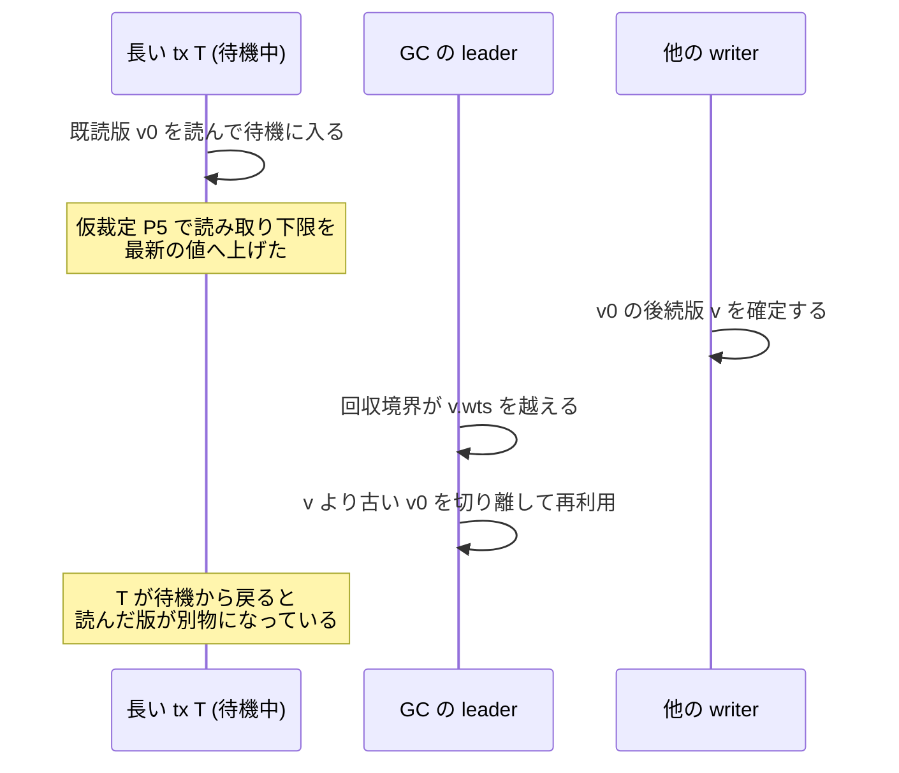

**読み方。** md_14 の段 4 の仮裁定 P5 (安全点で ThreadRtsArray を最新の MinWts−1 へ上げる) で実際に起きたこと (md_14 §3.3)。
stock Cicada は「tx 開始時の下限を tx の間変えない」ことで既読版を物理的に守っており、それを崩すと待機中に既読版が回収・再利用された。
保持版検査 (待機の開始で既読版の pointer・wts・status を控え、終わりに照合) で E-hb 3,938 件中 159 件、E 3,882 件中 174 件が変わっていた。
修正 (前進に成功したときだけ、確定の後に t′−1 を公開) の後は、全計測・全検査で 0 件になった。**0 は「待機中に既読版の wts・status が変わらなかった」までで、物理参照の安全の証明ではない。**
**判定器にはこの誤りが見えない** (今の計装は読んだ時点の wts を控えるだけ、md_24 §1 項 3)。

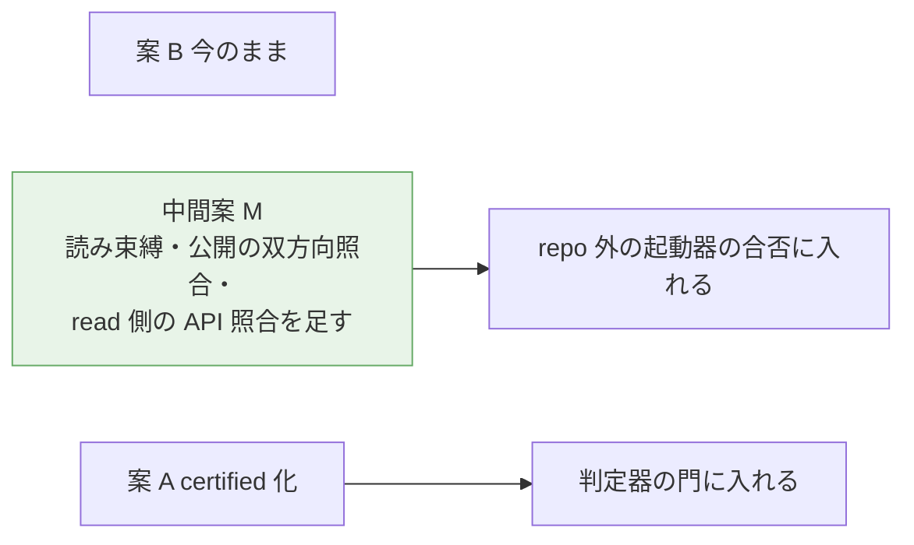

**読み方。** md_24 が並べた 3 案 (D2300)。緑 = ユーザー裁定で採った案 (D2305 項 4、2026-09-30 1 時台に「推奨通りで」)。各案の性能値の扱いは図に書かず、ここに書く: 案 B では未検証の診断値のまま、中間案 M では下の (2) の条件で照合の中身を明記した測定値、案 A は Cicada を門に通す campaign の登録時に着手する。
**D2305 項 4 の中身:** (1) 中間案 M — 既存の out-of-tree 計装に B (読み束縛)・U (公開の双方向照合)・read 側の API 照合を足し、repo 外の起動器の合否に入れる。判定器の production と campaign は変えない。
(2) M の証拠 (巡回 0 と B・U・read 側 API 照合の違反 0) を満たした variant の性能値は、**論文では照合の中身を明記した測定値として扱ってよい**。izanagi 内部では certified と呼ばない。
実装と壊しの発火確認の前は格上げしない。(3) 案 A は Cicada を門に通す campaign を登録するときに着手する。

**起点での状態 (状態語は T-2874 と patches/・全 branch の commit 題名で反証を試みた、B の抽出):** **M の実装は未着地**で、T-2874 は「M の実装 wave (AI)」のまま残る。したがって M の照合を満たした性能値は起点で 1 件も無く、
構成 C・E・B の性能値は「未検証の診断値」のままである。

**M と比較相手の設定の食い違い (新しく見つかった限定)。** md_24 が M の対象にした範囲は YCSB point read / update・`REUSE_VERSION=1`・`INLINE_VERSION_OPT=0`・`group_commit=0` である (md_24 §3.5)。
ところが比較相手 A の観測最良設定と、md_14・md_21・md_23 の実測は `INLINE_VERSION_OPT=1` の上にある (md_11 §6)。**M を実装しても、そのままでは最良設定の上の性能値を「M の照合を満たした」と書けない可能性がある。**
M の実装 wave が OPT=1 まで対象を広げるか、M の対象の設定で測り直すかを決める必要がある (§12)。

**どの案でも書けない文 (md_24 §7):** 「Cicada 実装 (forwarding + GC 接続) は一般に serializable を保つ」。主張は「観測した読みについての 1SR」に限り、終状態と、Cicada が自分の版選択規則どおりに読んだことは主張しない。

---

## 5. GC への接続 (U0): 前進を回収境界へ反映すると、偏りが中程度までなら実物で回収が早まった

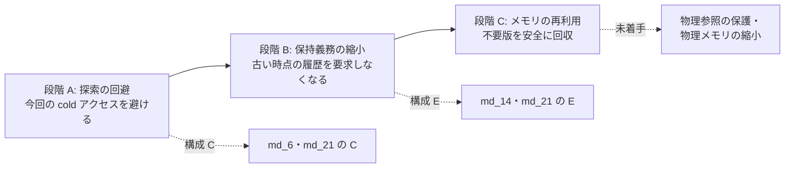

**読み方。** B と C まで実現しなければ「GC を改善した」とは言えない (出典メモ §15.1)。前版の起点では段階 A だけが実物にあり、段階 B はモデルの中だった。
3 版目の起点では、**段階 B を実物で測った一次資料が 2 本ある** (md_14・md_21)。段階 C (物理メモリの縮小) は測っていない — 論理生存版数は減ったが、`REUSE_VERSION=1` の pool は縮まない (md_14 §7)。

### 5.1 公開の手順 SP (md_10、モデル)


**読み方。** md_10 は、GC が待機中の tx に要求の印を立て、tx 自身が待機の安全点で前進する形 (SP) を小モデルに足した (D2290)。

| 規則 (md_10 §8) | 崩した危ない版 | 結果 (固定 6 場面の範囲) |
|---|---|---|
| 確定してから公開する | UG1 (確認の前に公開) | GC 違反、4 場面で 5〜31 step |
| 確定で保護下限を外さない | UG2 (確定時に floor を無限大) | GC 違反、2 場面で 10・21 step |
| 圧力による前進でも可視を確かめる | UG3 | O1 なしでは反例なし、O1 と組むと閉路 38 step |
| 公開の後は、公開した floor より古い時刻へ戻らない | UF1 | GC 違反、2 場面で 22・47 step |
| 確定で既読版の物理参照を外さない | UG2r | 反例なし (モデルの抽象の中。物理参照を早く外してよいという証明ではない) |

健全版 24 構成はすべて反例なし (md_10 §5.1)。待機中ならいつでも発火できる過大近似なので、結論は「待機中にだけ発火し、前進先を候補集合から選ぶ」方策に及ぶ。
任意の整数時刻を選ぶ方策、待機以外で発火する方策、途中で入場する tx には及ばない (md_10 §2)。**md_14・md_21 の「今」への前進 (E-now) はモデルの結論の外にある** (md_14 §5)。

### 5.2 戻れる段階と戻れない段階

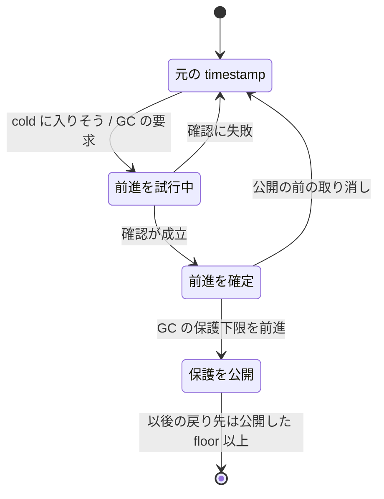

**読み方。** md_10 の探索では、**戻れない境界は確定ではなく公開にあった** (md_10 §5.5、D2290 項 2)。md_14 の C++ 実装では、失敗した前進は下限を変えず、成功したときだけ確定の後の別 step で公開する (D2295)。

### 5.3 実物: 構成 E を Cicada に入れた (md_14)

```mermaid
flowchart LR
  stock["stock<br/>安全点なし"] --> Ehb["E-hb<br/>待機の安全点で<br/>GC flag だけ立てる"]
  Ehb --> E["E<br/>安全点で前進を試し<br/>成功したときだけ公開"]
  C["C<br/>アクセス駆動の前進だけ"]
```

**読み方。** md_14 の 4 腕 (§2)。**主比較は E 対 E-hb** — 前進と公開だけが違う組で、1 因子の比較になる。E 対 stock は待機の刻み方と flag の両方を含むので、E の効果として書かない (md_14 §4.4)。
条件は md_11 の観測最良設定、48 thread、100 万件、rratio 50、max_ope 10、3 秒、長い thread 4 本 (読み取りの後に待つ型)。GC 指標は計器入り build の 3 rep、throughput は計器なし build の 3 rep。6 job を 6 台で同時刻に投げた (md_14 §4.1)。

| 待機 10 ms (md_14 §4.2、rep 中央値) | 回収境界の遅れ ms (stock / E-hb / E) | 論理生存版数 千 (stock / E-hb / E) | 版の保持時間 ms (stock / E-hb / E) | E の前進 成功 / 試行 |
|---|---|---|---|---|
| skew 0・GC 10 µs | 18.6 / 19.3 / **8.9** | 1,299 / 1,311 / 1,164 | 17.3 / 18.2 / 9.6 | 15,653 / 34,092 |
| skew 0・GC 1 ms | 18.9 / 19.5 / 11.2 | 1,304 / 1,316 / 1,199 | 17.6 / 18.3 / 11.8 | 3,589 / 7,500 |
| skew 0.9・GC 10 µs | 24.3 / 20.5 / 20.1 | 1,370 / 1,316 / 1,310 | 23.2 / 18.9 / 18.5 | 38 / 23,366 |

- **言えること (md_14 §1 項 1):** skew 0・待機 10 ms・GC 10 µs で、E 対 E-hb は遅れの平均 8.9 ms 対 19.3 ms (−54%)、論理生存版数の平均 116.4 万 対 131.1 万 (−14.7 万)、版の保持時間の平均 9.6 ms 対 18.2 ms (−47%)。
  3 rep の値は重ならない。待機 1 ms でも遅れ −41%・保持時間 −53%。
- **「今」への前進は強い偏りでほぼ失敗する (md_14 §1 項 2):** skew 0.9 では E の前進の成功は試行の 0.05〜0.27% (失敗の 88〜96% が既読不一致)。このとき E と E-hb は同じになる。
  md_14 §1 項 2 の逐語: 「md_6 の zipf 0.9 の条件だけで試していたら、U0 の効果は見えなかった。」
- **flag だけでも公開は戻るが、境界は長い tx に止められたまま (md_14 §1 項 3):** skew 0.9・待機 10 ms で公開は 3 秒あたり約 290 回から約 5,700 回へ戻り、遅れ −3.5 ms・生存版数 −4.7 万と小さく効く。
- **throughput の差は検出できなかった (md_14 §4.5):** 計器なし build の stock 比は wait 型で 0.96〜1.06、E が発火しない型でも 0.91〜1.05 ばらつく。


**読み方 (md_14 の gc-connection-mechanism)。** 同じ条件の rep 0 の等間隔標本を時系列で重ねた (起動直後を避けた 200 ms の窓)。stock と E-hb は待機ごとに遅れが 11〜20 ms まで伸びるのこぎり形で、
flag だけでは形が変わらない。E は前進が成り立つ待機で 0〜9 ms に留まり、前進に失敗した待機だけ 20 ms 近くまで伸びる。**rep 0 の 1 例の描写で、統計ではない。**

### 5.4 前進先を「既読の可視区間に収まる最大」にすると、中程度の偏りでも効いた (md_21)


**読み方 (md_21 の target-policy-success)。** 縦軸 = 成功 / 要求 (%)。要求 = 待機の安全点で GC 間隔が経過し自分の GC flag が 0 だった回数。E-hb は前進を試さないので系列が無い。
**E-max の要求には「一度成功した後、上端が動かないので `no_room` になる要求」も入るので、この比は「tx の何割が前進できたか」ではない** (md_21 §4.3)。成功率は選び方の比較の指標で、GC 改善の指標ではない。

| 待機 10 ms・GC 10 µs (md_21 §4.2、rep 中央値) | 遅れ ms (E-hb / E-now / E-max) | 論理生存版数 千 (E-hb / E-now / E-max) | 保持時間の中央値の bin 上限 ms (E-hb / E-now / E-max) | MinRts を決めた thread が長い tx だった割合 (E-hb / E-now / E-max) |
|---|---|---|---|---|
| skew 0 | 19.51 / 9.64 / **5.96** | 1,323 / 1,171 / 1,113 | 16.4 / 8.2 / 4.1 | 0.95 / 0.24 / 0.01 |
| skew 0.6 | 19.47 / 17.40 / **10.02** | 1,330 / 1,295 / 1,195 | 16.4 / 16.4 / 8.2 | 0.88 / 0.62 / 0.13 |
| skew 0.9 | 20.38 / 20.44 / 19.35 | 1,314 / 1,317 / 1,295 | 16.4 / 16.4 / 16.4 | 0.99 / 1.00 / 0.94 |

- **言えること (md_21 §1 項 1・2):** skew 0.6 で E-max の遅れは E-hb 比 −9.5 ms (19.5 → 10.0 ms)、論理生存版数 −13.4 万版、保持時間の中央値 16.4 → 8.2 ms。E-now は同じ条件で 17.4 ms とほぼ効かない。
  skew 0 では 19.5 (E-hb) → 9.6 (E-now) → 6.0 ms (E-max)。
- −9.5 ms は md_21 §4.2 の「rep ごとの差の中央値」で、表の中央値どうしの差 (19.47 − 10.02) とは別の集計である。
- 保持時間は 2 のべきの bin の上限で表しており、16.4 → 8.2 ms は「中央値が 1 bin 下がった」と読む (md_21 §4.2)。
- **正しさ (md_21 §5):** 最良 genome の trace build で E-max・C-max・C-partial の 6 cell すべて巡回 0、保持版の変化 0。検査専用の壊し (既読不一致を無視して前進する E-now) は、
  保持版検査が待機中の既読版の変化 1,484・1,649 件を検出したが、**判定器の巡回は 0** だった。回収の危険は判定器の対象外である。
- E-max の安全は E-now と同じく条件 W* (§4.2) に依り、上端の走査の物理的な安全は静的な論証だけである (md_21 §2・§7)。

### 5.5 強い偏りでは要求の多くが `no_room` になる (成功後と成功前の内訳は未計数)


**読み方 (md_21 の target-policy-reasons)。** 失敗理由ごとの panel。E-now の失敗はほぼすべて既読不一致、E-max は既読不一致 0 で `no_room` と書き込み制約、E-max-once は 2 回目以降の要求が `once skipped`。

```mermaid
flowchart TB
  req["E-max の要求"] --> nr{"前進先があるか"}
  nr -->|ある| ok["確認・確定・公開"]
  nr -->|無い no_room| why{"なぜ無いか"}
  why --> a["一度成功した後で<br/>上端が動かない"]
  why --> b["既読のどれかが自分の時刻より<br/>下で上書き済み<br/>validation での abort が決まっている"]
  b --> next["安全点で早く abort させて<br/>境界を解放する方策<br/>T-2930"]
```

**読み方。** md_21 §4.3 の整理。skew 0.9 では E-max でも遅れ −1.0 ms (20.4 → 19.4 ms、§1) に留まり、E-max の要求の約 75% が `no_room` だった (条件別には 40〜78%、§4.3)。
`no_room` は (a) 一度成功した後の要求と (b) 成功前から上端が旧時刻以下の tx の混合で、**計数は分けていない**。E-max-once (目標計算は 1 回だけ) で (a) が消え、待機 10 ms・skew 0.9 でも `no_room` が 3〜7% に下がるので、
この条件の大半は (a) と推定している (未検証)。待機 1 ms・GC 1 ms では E-max-once でも 72% で、(b) が多い。**前進先の選び方では (b) の tx を救えない。**
(b) の tx を安全点で早く abort させて回収境界を解放する方策は T-2930 で、並行 wave (md_31) が扱っている (未着地)。

**U0 の書き方 (md_21 §8 と md_9 §7 から):** 「前進を回収境界へ反映すると、待機型の長い tx が偏りの無い〜中程度の偏りの負荷で回収境界を止める時間が縮んだ (計器入り build の診断値)。
強い偏りでは要求の多くが前進先を持たず (`no_room`、成功後と成功前の内訳は未計数)、効果は小さい。」 — **成功回数・成功率を GC 改善の指標にしない。** 下がるのは「一部の旧版の保護義務」までで、
前進先で見える既読版・他の tx の古い時刻・物理参照が残る限り回収は進まない (md_9 §7)。

### 5.6 モデルの中の数 (md_10)

| 場面 (md_10 §6) | 前進なしの回収境界 / 回収できる版 | 公開による帰属できる差 |
|---|---|---|
| G1 読み取りの後に待つ tx 1 本 | 45 / 0 | 境界 +16・版 +2 |
| G2 待つ tx 2 本 | 45 / 0 | 境界 +17・版 +1。**T だけが公開すると境界は U の floor 35 のまま** |
| G4 前進後にも読む tx | 45 / 0 | 境界 +36・版 +2 |

**値はモデルの時刻と版の数であり、実システムの保持時間・メモリ量・throughput を表さない** (md_10 §6)。実物の対応は §5.3・§5.4 の遅れと生存版数である。
G2 の「他の tx の古い時刻が残れば全体の境界は動かない」は、md_21 の skew 0.9 で MinRts を決めた thread が長い tx だった割合が E-max でも 0.94 に留まったことと同じ向きである (親の読み。モデルと実物の対応は検査していない)。

---

## 6. read-only と GC の公開: 比較相手の欠陥と、本案の効果を分ける

### 6.1 短い read-only は、競合の強い設定では境界の遅れの主因ではない (md_15)


**読み方 (md_15 の図 2)。** 条件別の回収境界の年齢・公開回数・read-only の snapshot 年齢。境界年齢は timestamp 空間の値 (clock boost を含む)、分位点は 2 倍刻みの bucket の上界である。

- **md_15 §0 項 2:** 既定の Cicada・skew 0.9 で ro 指定率を 0 → 95% に変えても、境界年齢の平均は 1.5〜1.9 ms (GC 10 µs)・2.3〜2.7 ms (GC 1 ms)・122 ms (GC 100 ms) のままだった。
  ro の総差は −0.3〜+0.2 ms で、符号もそろわず誤差棒の内側である。10 ms の長い update tx (ro 0%) は +14〜24 ms (既定) を足した。
- **md_15 §0 項 3:** 長い read-only tx が 1 本あると (wait10msR)、45 走すべて (15 条件 × 3) で 3 秒間の公開が 0 回だった。機序 (read-only の commit が `mainte()` を通らず GC flag を立てない) と**整合する**が、md_15 は flag だけを変える介入走をしていない。


**読み方 (md_15 の図 3)。** ro の総差・長い update の総差・交互作用と、非対応差の 95% t 区間。**条件間の総差であって、「ro のせい」の因果の内訳ではない** (D2296)。
ro を上げると update 数・版生成・abort も同時に変わる。

### 6.2 stock Cicada の欠陥: read-only の commit が GC の公開を止める (md_22)

```mermaid
sequenceDiagram
  participant L as GC の leader
  participant U as update を続ける worker
  participant R as read-only だけを続ける worker
  U->>U: commit の後始末で GC flag を立てる
  R->>R: read-only の commit は後始末を通らない
  L->>L: 全 worker の flag がそろうのを待つ
  Note over L,R: R の flag が立たないので<br/>回収境界を公開できない
```

**読み方。** md_22 §2 の機序。Cicada は GC flag を全 worker が立てたときだけ leader が MinRts / MinWts を公開する。read-only の commit は `mainte()` を通らないので flag を立てない。
read-only だけを続ける worker が 1 本いると公開が止まる。**これは snapshot の意味と無関係な実装上の欠陥で、read-only の commit で `mainte()` を通すだけで直る** (md_22 §13)。
修正 variant は `patches/cicada-ro-gcflag-variant.patch` (macro `IZANAGI_CICADA_RO_GCFLAG`、既定 0、D2317)。


**読み方 (md_22 の publication_boundary)。** 12 条件で stock と variant の公開回数と境界年齢を対数軸に並べた。小点が 6 反復、印が平均と 95% CI。stock が公開 0 回の条件は軸の下の帯に「0 (6/6)」と書いてある。

| 条件 (md_22 §6、6 反復平均、3 秒) | 公開回数 stock → variant | 境界年齢 µs stock → variant |
|---|---|---|
| 長い ro あり (6 条件) | 36 走すべて 0 → 289.7〜299 | 未定義 → 12,504〜14,272 |
| 長い ro なし・ro 95% (S / T) | 4,978 → 139,567 / 7,314 → 145,150 | 810 → 36 / 527 → 32 |
| 長い ro なし・ro 0% (S / T) | 15,205 → 14,628 / 26,004 → 25,541 | 354 → 366 / 191 → 195 |

S = skew 0 の既定 genome、T = md_11 の最良 genome (skew 0.9)。

### 6.3 修正の効果と本案の効果を分けて書く

```mermaid
flowchart TB
  total["長い read-only がいるときの<br/>回収境界の遅れ"]
  total --> a["(a) 公開の停止・遅れ<br/>flag が立たない"]
  total --> b["(b) 長い read-only の rts が<br/>境界を押さえる分"]
  a --> fa["比較相手の実装欠陥の修正<br/>ro-gcflag で直る"]
  b --> fb1["snapshot を前へ動かせる read-only<br/>本案の前進が狙える余地"]
  b --> fb2["固定 snapshot を要求する read-only<br/>縮められない"]
```

**読み方。** md_22 §6〜§8 と md_15 §11 の構図。(a) は比較相手の欠陥の修正で、本案 (hot 配置・forwarding・構成 E) の効果ではない。
(b) は修正後も残り、variant でも境界年齢が 12.5〜14.3 ms (長い read-only の長さ 10 ms 程度) 残る (md_22 §8)。保持時間そのものは測っていない。

- **md_22 §13 の逐語:** 「VHash の GC 側の主張を測る比較相手は、この修正を入れた Cicada にすべき」。入れない stock に勝っても、公開停止という別の欠陥に勝っただけになる。
- **安全の論点 (md_22 §0・§3):** 小モデル (5 構成 × 6 腕、上限 200 万状態で全 30 腕が完走) では、版を守るのは tx の間変えない rts slot で、flag の時機ではない。
  tx の途中で slot を動かす変更は回収に届く (bad-raise-slot は最短 49 step で違反) — md_14 の P5 の誤り (§4.5) と同じ構造であり、本案の GC 接続の設計制約になる。
- **正しさ (md_22 §4):** variant を trace build に載せた 24 走すべてで巡回 0、判定の上限は indeterminate、integrity の数値項目 0、txn 数 = commit 数。
  md_22 は「最良 genome (INLINE_VERSION_OPT=1) の trace が inline 版を漏れなく記録するかは md_20 待ち」と書いた。md_20 (§4.4) は stock の最良設定で inline slot の版を 3 点で比べ食い違い 0 だったが、
  ro-gcflag variant の経路での同じ照合は取っていない。


**読み方 (md_22 の throughput)。** 同じ job・同じノードで stock と variant を交互に走らせた 6 対 × 12 条件の比。長い read-only ありの 36 対は 1.560〜16.831、なしの 36 対は 0.964〜1.073。
既定 genome の ro 95% だけは 6 対すべて variant が遅く、平均 −1.1% (read-only の commit ごとの費用と整合) (md_22 §7)。
**言えないこと:** 3 秒の値である。stock で公開が止まると版が溜まり続けるので、長い read-only 条件の stock の throughput は走行時間に依存し、長いほど悪化すると見込まれるが測っていない (md_22 §11)。
長い read-only は合成の型 (worker 1 の全手続きを read-only にし commit 前に 10 ms 待つ) で、少数・断続的なら効果の大きさが変わる。

### 6.4 比較相手に修正を入れるか — T-2933 の択一 (ユーザー判断待ち)

| 択 | 中身 | 次に要るもの | 論文の書き方 |
|---|---|---|---|
| 入れる | 主比較の相手を「Cicada + 実装欠陥の修正」にする。md_22 §13 が勧める | 3 秒より長い走行 (例 30 秒) で stock・variant の throughput 比と版の蓄積の走行時間依存を測る (T-2933 の定義、md_22 §11 が未測と明記) | 相手を「修正を入れた Cicada」と明記し、修正の中身を 1 文で書く |
| 入れない | stock のまま比べる | 比較の注記に「stock は read-only だけを続ける worker 1 本で公開が止まる」と必ず書く | 本案の効果に (a) が混ざる。md_22 §13 は「別の欠陥に勝っただけ」と警告する |
| 両方並べる | 主比較の相手は修正入り、stock を修正の効果を分ける対照として並べる | 「入れる」と同じ 30 秒の測定。長い read-only を含む cell で 3 腕 (stock・修正入り・本案) を同時刻に置く | 表を 2 段に分け、(a) 修正の効果と (b) 本案の効果を別の行にする |

**親の推奨 (provisional):** 「両方並べる」。主比較の相手は md_22 §13 のとおり修正を入れた Cicada にし、stock は修正の効果を分けて見せる対照として同じ round に置く。
(a) と (b) を別の行で書けるので、md_30 の指示「修正の効果と本案の効果を分けて書く」をそのまま満たす。**決めるのはユーザーである** (T-2933)。
どの択でも、この欠陥を CCBench 上流へ提案するかは人間の判断である (D16 / D18)。


**読み方 (md_15 の図 4)。** 見積り (a) = 位置 ≥ 1 の read-only read のうち、先頭 1 版に既読と矛盾しない確定版がある割合 (楽観的な適格率)、見積り (b) = 公開間隔のうち read-only が flag を上げない分の割合 (観測走の時刻分割)。
**言えないこと:** どちらも機会量であって、実装後の効果でも上限でもない (md_15 §7、D2296)。(b) は既定・skew 0.9 で 0.2〜8.7%、skew 0 で 21〜76%、調整済みで 12〜77% (GC 10 µs、ro 50〜95%) — 更新が速い設定に限った観測走の分割で、
介入後の短縮量ではない。介入で確かめたのは md_22 である。

---

## 7. この仕組みだけでは解けないケース (限界)

```mermaid
flowchart TB
  t1["実行中の普通の tx"] -->|"次の cold アクセスで発火"| ok1["アクセス駆動の前進<br/>構成 C"]
  t2["読み取りが続く長い tx"] -->|"読み取りのたびに発火しうる"| ok2["前進先で既読が<br/>見え続けるかが問われる"]
  t3["読み取り後に待つ tx"] -->|"新しい読み取りが無い"| sp["待機の安全点で前進<br/>構成 E"]
  sp --> nr["強い偏りでは<br/>前進先が無い tx が残る"]
  t4["止まっている thread"] --> hp["代行による前進 HP<br/>論文の対象外"]
  t5["read-only tx (固定 snapshot)"] --> nf["前進の対象にしない<br/>修正で直るのは公開の停止だけ"]
```

**読み方。** 前版 §6 の図を一次資料で更新した。1 行目の問題を解いたことを、4・5 行目まで解いたように書かない。

- **読み取りが続く長い tx:** 構成 C の前進は起きるが、長い tx の完了率はどの前進先でも 0.0003 以下で、完了には結び付いていない (md_21 §4.4、§3.3)。
- **読み取り後に待つ tx:** アクセス駆動の前進は構造上発火しない (md_6 §5.1)。構成 E は待機の安全点で前進を届け、偏りが中程度までなら回収境界を縮めた (§5)。
  強い偏りでは要求の多くが `no_room` で効果は小さい。その一部は既読が上書きされて前進先を持たない tx だが、内訳は数えていない (md_21 §4.3、T-2930)。
- **止まっている thread:** 下の §7.1。
- **read-only tx:** 前進の対象にしない (出典メモ §17)。比較相手の欠陥 (公開の停止) は修正で直るが、長い read-only の rts が境界を押さえる分は、snapshot を前へ動かせない限り残る (§6.3)。
- **範囲読み取り・insert・delete を含む tx:** 試作では前進しない (前進の後に呼べば abort、md_6 §2)。一般の論証もこれらを範囲外に置く (md_13 §8)。

### 7.1 止まった thread への代行による前進 (md_16、D2298)

```mermaid
flowchart LR
  stop["sleep・preempt で<br/>止まった tx"] --> hp["別の thread が<br/>代わりに確かめて前進"]
  hp --> m["小モデルで分かった必要条件"]
  hp --> gap["Cicada の GC は<br/>全 thread の静止を待つ"]
  gap --> nogo["代行しても回収は進まない<br/>代理の静止宣言は未検証"]
  m --> keep["再審するときの規則として<br/>一次資料に残す"]
```

**読み方。** md_16 は、止まった tx を別の thread が前進・失効させる形 (HP) を小モデルに足し、6 場面 90 構成を全探索した。健全版 30 構成は違反なし、危ない版 9 種のうち 7 種が単独で反例を出した (md_16 §5・§11)。
そのうえで **HP は論文の対象 (C++ 試作・評価・本文の主張) に入れず、限界として書く** と決めた (D2298)。

**論文の限界の節に置く文 (md_16 §7.3 の文案、逐語):**

> 本研究の前進は、待機中の transaction が安全点で GC からの要求を確かめられることを前提とする (評価に用いる CCBench の長い transaction は busy-wait で待つため、この前提を満たす)。sleep や preempt で完全に止まった thread の代わりに別の thread が前進させる設計 (代行による前進) は、小さなモデルの全探索で、descriptor の世代つき CAS が確定と公開を覆うこと、再開時に時刻を読み直すこと、代行する thread 自身が読み取り版を保護すること、失効させる場合は再開時に失効を確かめる前に読み取り値へ触れないことが必要だと分かった。ただし、止まった thread の静止を他の thread が代わりに宣言してよい条件は未検証であり、Cicada のように全 thread の静止を待って回収境界を更新する GC では、代行による前進は回収を進めない。代行による前進の実装と評価は今後の課題とする。

**併記すること (T-2913):** SP を CCBench 自身の長い tx で評価するには、CCBench の待機ループ (`clock_delay`、rdtscp と `_mm_pause` の busy-wait) に要求の確認を入れた安全点が要る。
現行のループは要求を確かめない (md_16 §7.1)。md_14・md_21 の構成 E は、md_6 の試作が足した長い tx の型 (`CICADA_LONGTX` の読み取り後に待つ型) の待機を 100 µs に刻んで安全点を置いたもので、
CCBench 自身の「読み取り後に待つ型」(W5) ではない。W5 は修理 G を含む pin への前進の後に測る予定である (T-2923)。

**付録に置くか — この版の判断: 置かない。** 限界の節に上の文案だけを置き、必要条件の表 (md_16 §8) は一次資料に残して、再審の条件 (md_16 §7.4) が成り立ったときに持ち込む。
理由: (1) HP には C++ 試作も評価も無く、付録に置くとモデルの結果が論文の主張の一部に読まれる。(2) Cicada の GC は全 thread の静止を待つので、HP の前進は回収を進めず、評価の図に対応する量が無い。
(3) 本文の U0 は待機中に要求を確かめられる tx (SP) に限る (D2298) ので、付録の HP は本文のどの図・表とも対応しない。md_16 の段 3 では判断役が「付録に設計候補として置く」案を推し、D2298 はその判断をこの版に委ねていた。**この判断は版の判断で、次の版がユーザーの指示や再審の条件の成立で改めてよい。**

**再審の条件 (md_16 §7.4):** 評価の workload に本当に走らない停止 (sleep・preempt・I/O 待ち) を含む長い tx を入れる必要が出たとき / 止まった thread の GC flag を代わりに立ててよい条件を Cicada の実際の順序で検査できたとき /
SP の C++ 試作で、要求確認を入れた待機でも回収境界が止まる場面が残ると実測したとき。

### 7.2 前進してよい transaction と、してはいけない transaction

```mermaid
flowchart LR
  rw["普通の read-write tx"] --> f["前進の対象"]
  fs["固定 snapshot を要求する tx"] --> nf["従来の snapshot 経路を保つ<br/>(timestamp を変えてはいけない)"]
  ro["安定した read-only 経路"] --> nf
  sp["scan・insert・delete を<br/>含む tx"] --> nf2["試作では前進しない<br/>(前進後に呼べば abort)"]
  nf -.GC 境界を支配しうる.-> gcb["§6.3 の (b)"]
```

**読み方。** 「MVCC の機能を保つ」は、旧版の取得・serializability・固定 snapshot の意味の 3 つを別々に書く (出典メモ §17.1)。固定 snapshot の read-only が境界を押さえる分 (§6.3 の (b)) は、本案では縮めない。

---

## 8. 比較相手 Cicada: 較正・最良設定の正しさ・CCBench の修理と pin

### 8.1 較正: 既定の Cicada は最良から大きく離れていた (md_11)


**読み方 (md_11 の図 (b))。** 4 段 = workload (rr5・rr50・rr95・100 操作型)、横軸 = GC 間隔 (10〜10,000 µs、対数)、縦軸 = throughput の rep 中央値 (Mtps)、系列 = 選抜した 2 点と既定 (control)。
**言えること:** rr5・rr50・rr95 では最良の 2 系列が GC 10〜100 µs でほぼ平坦で 10,000 µs で落ち、既定は低い位置で平坦 (md_11 §6)。100 操作型は別で、観測最良 (B0 O0 P0 R0 W0) は GC 1000 µs で最大になる。**言えないこと:** 正しさ未検証の診断値で、誤差棒は無い (rep 中央値だけ)。rr 系 3 本の GC 10 と 100 の順位は決めきれない (差 0.5〜1%)。


**読み方 (md_11 の図 (a))。** 4 段 = workload、横軸 = genome の列挙順 (build できない 8 点は描かない)、棒 = throughput の rep 中央値、折れ線 = 同じ job の既定に対する比 (右軸)。

| workload (md_11 §6、48 thread・100 万件・skew 0.9・3 秒、pin C の stock) | 観測最良 (B=BACK_OFF O=INLINE_VERSION_OPT P=PROMOTION R=REUSE_VERSION W=WRITE_LATEST_ONLY) | GC | 既定比 |
|---|---|---|---|
| rr5 | B0 O1 P0 R1 W0 | 100 µs | 2.154 |
| rr50 | B0 O1 P0 R1 W0 | 100 µs | 4.536 |
| rr95 | B0 O1 P0 R1 W0 | 10 µs | 3.413 |
| 100 操作型 (rr95・max_ope 100) | B0 O0 P0 R0 W0 | 1000 µs | 1.383 |

- 最大の要因は BACK_OFF=0 (md_11 §1 項 4)。abort 率も上がる (rr50 で 0.141 → 0.425)。
- job 間の session 中央値の CV は 0.43〜0.81% (5 session)。**これは D145 の意味の between-run floor ではない** (時間窓が約 1 時間の 1 つ、D2291)。評価計画の閾値 f_T は未実在で、T-2915 が道を決める。
- 測れたのは正準 24 点のうち 16 点 (OPT=1 ∧ PROMOTION=1 の 8 点は pin C で compile できない)。rr50 以外は GC=10 で選んだ上位 2 点の中の最良で、「観測最良」である (md_11 §6・§9)。
- **md_6 の土台 (CMake 既定の Cicada) は rr50 で最良より約 4.5 倍遅い** (md_11 §10)。md_14・md_21・md_22・md_23 は最良設定を土台にした。

### 8.2 最良設定の正しさ (md_20、D2302)

- 32 run (異なる条件は 30、tuple 200 の thread 4・48 と tuple 100 万の thread 48、走行 1 秒) で巡回 0、integrity の数値項目 0、判定の上限は indeterminate (md_20 §1)。
- `INLINE_VERSION_OPT=1` の inline slot は GC の返却後に再利用されるので、md_3 の照合 (登録時と commit 時) だけでは「選んだ後・登録前の再利用」を見逃しうる。
  repo 外の使い捨て診断 patch で選択時・登録時・commit 時の 3 点を比べ、35 run (stock 32 + 正例 3) すべて食い違い 0 だった (md_20 §3)。
- 既存の壊し (`broken-cicada-skip-read-recheck.patch`) を重ねた正例 3 本はすべて巡回として検出され、壊した経路に帰属した。
- **限界 (md_20 §7):** md_11 の主比較条件そのもの (3 秒・trace なし) は未検査。inline slot の取り違えを狙った正例は無い。論文に書ける文は「この範囲で巡回なし (indeterminate、certified ではない)」。

### 8.3 CCBench の修理と pin: pin は C のまま、修理は push 待ち

```mermaid
flowchart LR
  C["C<br/>izanagi の現行 pin"]:::pin --> C2["C2'"] --> F["F<br/>整形と #line"]:::gh
  F --> G["G<br/>Cicada の build 不具合の修理"]:::local
  F --> R1["gc_records の修理"]:::local --> R2["scan の key の修理"]:::local
  F --> S["Silo の取引内の値の修理"]:::local
  F --> M["MOCC の validation の修理"]:::local
  classDef pin fill:#eef,stroke:#88a
  classDef gh fill:#e8f4e8,stroke:#6a6
  classDef local fill:#fff4d6,stroke:#b90
```

**凡例。** 青 = izanagi の現行 pin、緑 = GitHub にあり CI (build・format) が緑と記録されたもの (D2305 項 6)、黄 = CCBench の local branch にだけあり push 待ち (人間の手番)。

- **pin は起点でも C (`68106660`)** のまま (gitlink と `CURRENT_PIN` で確認、A の抽出)。VHash の測定と検査はすべて pin C の上に patch を重ねて行った。
- **G** (`izanagi-cicada-build-fix`、D2308): OPT=1 ∧ PROMOTION=1 の compile 不能と、読み取り後に待つ分岐の compile 不能と、ADD_ANALYSIS=1 の計器 build を直した。24 genome と W5 が build できる。
  上流 CI 2 本は CI image で**手元通過** (GitHub Actions は未確認)。push は T-2921 (人間の手番)。
- **gc_records の修理 2 本** (`izanagi-cicada-gc-records-fix`、D2310): TPC-C の Delivery を含む並行走行で stock が落ちる欠陥を直した。pin C のうちは `patches/fix-cicada-gc-records*.patch` として重ねる。push は T-2924 (人間の手番)。
- **push の後に開くこと:** GitHub の CI の確認 → pin 前進 wave。pin 前進の前に、D297 検査器が Cicada の `transaction.cc` を未知 macro の条件指令で拒否する件の扱いを決める必要がある (md_19 §6)。
  上流への PR は、pin に入り CI が緑のものから 1 修正 1 PR で、作成と merge は人間 (D2305 項 10、急がない)。

### 8.4 比較相手の主張につく限定

| 限定 | 中身 | 出所 |
|---|---|---|
| 探索できた空間 | pin C で build できる 16 点。G で 24 点が build 可能になったが、promotion 有効の 8 点は判定器が巡回を検出し TPC-C で異常終了したので比較・探索から除外 (原因未特定、T-2922)。「Cicada の最適化空間を全探索した」とは書かない | md_11 §1、D2308 項 4 |
| use-after-free | stock の `abort()` が INSERT した tuple を delete した直後に `writeSetClean()` が同じ tuple へ書く。insert を含む tx が abort すれば起きる。未修正 (T-2925、md_32 が扱う予定で未着地)。YCSB の point read / update (insert 無し) の最良設定の測定に及ぶかは測っていない | ccbench-cicada-bugfix、gc-records-fix §6 |
| gc_records の修理の範囲 | OPT=0 の設定でだけ確かめた。**最良設定 (OPT=1) では未確認** | gc-records-fix §6 |
| read-only の公開の停止 | §6 の欠陥。比較相手に修正を入れるかは T-2933 | md_22 |
| 比較相手の呼び方 | 「原論文の Cicada」ではなく「CCBench の Cicada (pin C) を md_11 の観測最良設定で」と書く | md_1 §2、md_11 |

---

## 9. 状態: 何が確かめられていて、何がまだか

```mermaid
flowchart LR
  H1["H1 配置"]:::meas
  H2["H2 選択的前進"]:::meas
  H3["H3 今へ進む方式との差"]:::design
  H4["H4 GC 接続"]:::meas
  H5["H5 組み合わせ"]:::idea
  H6["H6 頑健性"]:::idea
  U0["U0 前進を保護下限へ"]:::notfound
  U1["U1 cold 契機"]:::notfound
  U2["U2 前向きに非最新版"]:::known
  U3["U3 1 つの構造"]:::unsettled
  G0["前提 Cicada の正しさ"]:::meas
  BA["前提 比較相手"]:::meas
  CC["前提 CCBench の修理と pin"]:::wait
  classDef idea fill:#f4f4f4,stroke:#999
  classDef design fill:#eef,stroke:#88a
  classDef meas fill:#e8f4e8,stroke:#6a6
  classDef known fill:#fee,stroke:#a66
  classDef notfound fill:#fff4d6,stroke:#b90
  classDef unsettled fill:#f4f4f4,stroke:#999,stroke-dasharray: 3 3
  classDef wait fill:#fff,stroke:#b90,stroke-dasharray: 3 3
```

この節の状態語は次だけを使う (前版と同じ定義)。

- 仮説の状態: **構想のみ**・**設計中** (仕様・模型・評価計画を書いている)・**実測あり** (一次資料に計測・探索・検査の記録がある)・
  **検証済み** (certified な正しさ検査、または一般の証明を通った)。**この版で「検証済み」に届いた項目は無い** (md_13 の一般の証明は小モデル仕様 v1 についてで、仮説の実装側には届かない)。
- 新規性の状態: **既知**・**見当たらず (範囲つき)**・**未確定**。
- 前提の状態: **整備済み (範囲つき)**・**裁定済み・未実装**・**人間の手番**。

**凡例。** 灰 = 構想のみ、青 = 設計中、緑 = 実測あり / 整備済み、赤 = 既知、黄 = 見当たらず (範囲つき)、灰の破線 = 未確定、黄の破線 = 人間の手番が残る。
「実測あり」は結論の向きを含まない — H1 は実測ありで、Cicada の中の向きは上がらなかった側である (§2)。

### 9.1 仮説と新規性

| 項目 | 前版 (2026-09-29b) | この版 | 根拠と限定 |
|---|---|---|---|
| H1 配置 | 実測あり (Cicada の外の微小計測だけ) | **実測あり (Cicada の外では支持、Cicada の中では単独で上がらず)** | md_5 §0 は 1 キー・1 thread の latency で支持。md_23 は構成 B を Cicada に入れ、草稿 §5.5 の探索段の語で ro 95% の 12 組が予備的に不支持 (差なし)、ro 0%・rr5・rr50 の全組と ro 50% の一部が予備的に不支持 (悪化)、ro 50% の残りと rr95 の K=1・2・4 は差なし、rr95 の K=8 は判定不能。1 設計点・YCSB だけ・A/A 腕なし (§2) |
| H2 選択的前進 | 実測あり | **実測あり** | 小モデルで規則と反例 (md_4)、一般の論証 (md_13、モデル v1)、試作で発火と成功 (md_6)。最良設定の上でも C の throughput の差は見えず、F は skew 0.9 で 0.21〜0.49 倍 (md_21 §4.5)。長い tx の完了には結び付かない (§3) |
| H3 今へ進む方式との差 | 設計中 | **設計中** | 草稿 v1 は H3 を C 対 C_now にした (D2301)。構成 C の側で「今へ前進」は測っていない。E の側の E-now 対 E-max は H4 の方策の比較に当たる (§5.4) |
| H4 GC 接続 | 設計中 (実物は未測定) | **実測あり** | 構成 E (md_14) と前進先 E-max (md_21) を実物で測った。skew 0 と 0.6 で回収境界の遅れと論理生存版数が縮み、skew 0.9 では小さい。計器入り build の診断値、throughput の差は検出できず (§5) |
| H5 組み合わせ | 構想のみ | 構想のみ | B は実装・測定されたが D は未実装。草稿 v1 は H5 を主要な族から外し S3 追補へ回した |
| H6 頑健性 | 構想のみ | 構想のみ | 草稿 v1 は H6 を主要な族から外し S3 追補へ回した |
| U0 前進を保護下限へ反映 | 見当たらず (範囲つき) | **見当たらず (範囲つき)** + 実物の効果の記録あり | 新規性の範囲は md_9 §4 のまま (OpenAlex・arXiv・DBLP を事前登録した式 N01〜N05 で調べた範囲、本文未取得の 5 本を除く)。目的と GC 規則は既知 (§11) |
| U1 cold 契機 | 見当たらず (範囲つき) | **見当たらず (範囲つき、OCC-TI 1997 を除く)** | 式 N06〜N08。前版から変化なし |
| U2 前向きに非最新版 | 既知 | **既知** | SI-STM (2006)、CockroachDB (2020) |
| U3 1 つの構造 | 未確定 | **未確定** | U1 に従属。hot 単独の読みの利得が Cicada の中で出なかったので、U3 を示すには構成 D 以降の効果が要る (md_23 §1 項 8) |

### 9.2 前提

| 前提 | 前版 | この版 | 根拠と限定 |
|---|---|---|---|
| G0: Cicada の正しさ検査 | 整備済み (YCSB の point read / update、上限 indeterminate) | **整備済み (範囲が広がった、上限 indeterminate)** | TPC-C の小走行と insert (md_17)、最良設定 (md_20)、並行する delete は修理 2 本を重ねて (gc-records-fix)。scan の phantom・版昇格・group commit は未対応 (§4.4) |
| Cicada の記録の水準 | — (証拠面の設計が別に要る) | **裁定済み・未実装 (中間案 M)** | D2305 項 4。M の実装は AI の手番 (T-2874)。M の対象 (OPT=0) と最良設定 (OPT=1) の食い違いが残る (§4.5) |
| 比較相手 A の較正 | 未着地 | **整備済み (観測最良、診断値)** | md_11。between-run floor は未実在 (T-2915) |
| 比較相手 A の正しさ | — | **整備済み (巡回なし、上限 indeterminate)** | md_20。1 秒の走行で、主比較条件そのものではない |
| 比較相手の欠陥 (read-only の公開停止) | — | **実測あり、比較相手に入れるかはユーザー判断待ち** | md_22、T-2933 (§6.4) |
| CCBench の修理と pin | — | **人間の手番 (push)、pin は C のまま** | G (T-2921)・gc_records 修理 (T-2924) は local branch で手元の CI 通過。push → CI → pin 前進 (§8.3) |
| 評価計画 | 草稿 v0 (未発効) | **草稿 v1 (未発効)** | D2301。発効は T-2893、§5.5 の読みの適用は T-2914 が未了 (§10) |

### 9.3 数値の要約 (すべて範囲つき)

| 仮説 | 最も強い数値 | 出所 | 地位 |
|---|---|---|---|
| H1 (外) | LLC 外の最新版選択で連続配置 scalar が散在 linked の 0.55〜0.84 倍、K=8 の深さ 7 で 0.12 倍 | md_5 §0 | Cicada の外の微小計測 |
| H1 (中) | ro 95% の K/stock 比 12 組の中央値 0.980〜1.011、rr50 と ro 0% (GC 10 µs・1 ms) は 0.23〜0.27 倍 | md_23 §1・§5 | 性能用 build の同時刻比較、未検証の診断値 |
| H1 の上限 | ro 指定率 25% 以上で位置 ≥ 1 の read の 87〜100% が read-only 由来 | md_15 §0 | 計器入り build の観測 |
| H2 | 通常 YCSB で試行の 73〜75% が成功 (CMake 既定の Cicada) | md_6 §5.1 | 未検証の診断値 |
| H2 の費用対効果 | 最良設定の上で C-min の stock 比 0.97〜1.04、F は skew 0.9 で 0.21〜0.49 | md_21 §4.5 | 記述値、差は判定しない |
| H4 | skew 0・待機 10 ms で E 対 E-hb の遅れ 8.9 対 19.3 ms (−54%)、保持時間 −47% | md_14 §1 | 計器入り build の診断値 |
| H4 (前進先) | skew 0.6・待機 10 ms で E-max の遅れ 19.5 → 10.0 ms、E-now は 17.4 ms | md_21 §1 | 計器入り build の診断値 |
| H4 の限界 | skew 0.9 で E-max でも −1.0 ms、要求の約 75% が `no_room` | md_21 §1・§4.3 | 計器入り build の診断値 |
| 比較相手の欠陥 | 長い read-only ありで公開 36 走すべて 0 → variant で 289.7〜299 回、throughput 比 1.56〜16.83 | md_22 §0・§6・§7 | 公開は計器入り、throughput は計器なし。3 秒の値 |

### 9.4 仮説と作業の対応

```mermaid
flowchart LR
  subgraph L["着地した作業"]
    w1["md_1・md_9・md_27 文献と動機"]
    w2["md_2・md_15 探索と保持の実測"]
    w3["md_3・md_17・md_20 判定器"]
    w4["md_4・md_13 小モデルと論証"]
    w5["md_5・md_23 hot 配置"]
    w6["md_6・md_21 forwarding と前進先"]
    w10["md_10・md_14 GC 接続"]
    w16["md_16 代行"]
    w22["md_22 read-only の公開"]
    w24["md_24 記録の水準"]
    w25["md_12・md_25 評価計画"]
  end
  subgraph P["未着地の作業"]
    p18["md_18 区間 GC"]
    p26["md_26 構成 E の論証"]
    p28["md_28 偏りを強めた測定"]
    p29["md_29 勝てる負荷の探索"]
    p31["md_31 早い abort"]
    p32["md_32 残る不具合"]
  end
  subgraph H["仮説"]
    h1["H1"]
    h2["H2"]
    h4["H4"]
    h3["H3・H5・H6"]
  end
  w2 --> h1
  w5 --> h1
  w4 --> h2
  w6 --> h2
  w10 --> h4
  w6 --> h4
  w22 -.比較相手.-> h4
  w16 -.限界.-> h4
  w25 --> h3
  w3 -.前提.-> w6
  w24 -.前提.-> w3
  p26 -.-> h4
  p31 -.-> h4
  p28 -.-> h2
  p18 -.-> h4
  p29 -.-> h1
  p32 -.前提.-> w3
```

**読み方。** md_N は 2026-09-29 に並行投入用に用意した wave の投げ文の番号で、投げ文の本体は repo の外にある。実線 = 一次資料がその仮説の根拠になる、点線 = 前提・比較相手・限界として効く、または未着地の作業が効く予定。
未着地の作業の結果は、この版には入っていない (投げ文の題名から主題を置いただけ)。

---

## 10. 評価の組み立て (評価計画の草稿 v1、未発効)

```mermaid
flowchart TB
  A["A md_11 の観測最良の Cicada"]
  B["B = A + hot 配置"]
  C["C = A + 論理 K 境界で最小の前進"]
  Cp["C_p = C + 前進先の方策 p"]
  Cn["C_now = 今の時刻へ前進"]
  Fl["F_ℓ = A + 論理 K 境界で abort・再実行"]
  Ehb["E_hb = C_p + 安全点で flag だけ"]
  Esp["E_sp = C_p + 安全点で前進を試し<br/>成功したときだけ公開"]
  D["D = B + hot の外れで前進"]
  E["E = D + GC への反映"]
  A --> B & C & Fl
  C --> Cp & Cn
  Cp --> Ehb --> Esp
  B --> D --> E
  classDef later fill:#f4f4f4,stroke:#999,stroke-dasharray: 3 3
  class D,E later
```

**この節の地位。** `docs/vhash-evaluation-preregistration-draft.md` は**事前登録の草稿 v1 であり発効していない** (D2301、登録版の文字列 `vhash-evaluation-v1-draft`)。
発効は、草稿 §11 の前提が揃い、1 タスクごとの node 時間をユーザーへ示して確認を得た後に、別の wave が日付付きの決定で行う (T-2893)。判定の規則の正本は草稿で、この節は構造を図にしたものである。
**読み方。** 矢印は「左に 1 つの変更を足したものが右」。破線 = S3 追補まで主要な族に入れない構成。前版 §9 の v0 の図から、G_ℓ・F_h・G_h・E+P を外し、C_p・C_now・E_hb・E_sp を足した。

### 10.1 主比較 (確認段、主要な族 m = 19)

| 仮説 | 処置 対 対照 | cell | 主指標 | 族に入る数 |
|---|---|---|---|---|
| H1 配置 | B_K* 対 A | R50・R95・Y50 | throughput (性能用 build) | 3 |
| H1 用量 | R95 と R0 の差の差 | R95−R0 | 同上。差の差だけでは書かない | 1 |
| H2a 回避 | C 対 A | Y5・Y50・Y95 | commit あたりの深い探索回数 (計数用)。A と C に同じ計器を入れる手段が起草時に無く欠測の見込み | 3 |
| H2b 仕事を保つ価値 | C 対 F_ℓ | Y5・Y50・Y95 | throughput | 3 |
| H3 | C 対 C_now | Y5・Y50・Y95 | throughput | 3 |
| H4 GC 接続 | E_sp(p*) 対 E_hb(p*) | 読み取り後に待つ型の 4 cell | 回収境界の遅れ**かつ**生存版数 (計数用)。前進の成功回数で判定しない | 4 |
| H4 方策 | E_sp(p*) 対 E_sp(a) | 待機 10 ms・1 ms の skew 0.9 | 遅れ | 2 |
| H5・H6 | — | — | 族に入れず S3 追補で登録 | — |

- Bonferroni、水準 0.05/19。1 cell = 同じ job・同じ node で全構成を 1 回ずつ回す round を 14 取り、2 job × 7 round を 2 node へ同時に投げる。区間は 14 個の対数比の 2 番目と 13 番目 (草稿 §8)。
- 「Cicada の最良設定に対して」と headline に書けるのは、A の GC 10 µs と 100 µs の両方に対して処置が「改善」か「同等」のときだけ (草稿 §5.2)。
- 長い tx を含む cell では、throughput が改善でも長い tx の commit 数が悪化なら改善を主張しない。

### 10.2 判定語は 2 層: 探索段は「予備的に…」だけ

```mermaid
flowchart TB
  subgraph X["探索段 (md_21・md_23 の読み方)"]
    x1["門で失格か"] --> x2["比較相手の正しさは"] --> x3["欠測か"] --> x4["同じ round の A/A 腕"] --> x5["予備的な語を出す"]
  end
  subgraph Y["確認段 (新しい round だけで判定)"]
    y1["門で失格か"] --> y2["欠測か"] --> y3["A/A 腕・job 間の一致"] --> y4["確認段の語を出す"]
  end
  X -->|"K* と p* だけを持ち込む"| Y
```

**読み方。** 探索段は n が小さく補正もしないので「予備的に支持 / 予備的に不支持 (差なし・悪化) / 判定不能」だけを出す。**「予備的に支持」は同じ round に A/A 腕があるときだけ出る** (草稿 §5.5.0)。
探索段で選んだ K*・p* は、確認段の新しい round でだけ判定する。δ_ex = ln(1.10) は探索段の設計値で floor ではない。草稿自身が「md_14 の結果を知った後に選んだ」と注記している。

### 10.3 §5.5 (md_21・md_23 の結果の読み方) の当てはめの状態

| 資料 | §5.5 の語を当てたか | 起点での状態 |
|---|---|---|
| md_23 (構成 B) | **資料自身が当てた** (§2.3 の表)。ただし計測は §5.5 を知る前に設計し、A/A 腕も主 cell c23 も無い | K* = 1 (全 K が同点なので最小の K) |
| md_21 (前進先) | **当てていない** (資料に草稿への言及 0 件)。GC は 10 µs と 1 ms で、主 cell c21 (GC 100 µs) は測っていない。n = 3、A/A 腕なし | p* は未決。T-2914 が §5.5 をそのまま当てて p*・K* を決める作業で、未了 |

- 草稿 §0 は、md_21・md_23 の一次資料の着地後は §5.5 の述語・閾値・主 cell・選び方を改めないと約束している。着地の事実は §14 に記録するだけだが、**起点の §14 は「22:48 と 23:37 の時点で md_19・20・21・23 の dir は無かった」の 2 行だけで、着地を記録していない**。
- md_23 の冒頭は H1 の主指標を「commit あたり LLC miss」と書くが、草稿 v1 は throughput に替えている (食い違い、§2.4)。

### 10.4 前提 (草稿 §11) の起点での状態

| 前提 | 草稿の書く状態 (起草時、2026-09-29 22 時台) | 起点の一次資料 |
|---|---|---|
| P1 A と単価 | 済み (md_11) | 変化なし |
| P1′ A の最良設定の正しさの門 | 未着地 (md_20) | md_20 と D2302 が着地。充足と数えるかは発効 wave の判断 |
| P2 throughput の between-run floor f_T | 未実在 | 未充足 (T-2915) |
| P3 各構成の inert patch と門 | C・F_ℓ・E は実在、他は実装中 | md_21・md_23 の patch が着地。確認段用の門は未実施 |
| P4 新経路の壊し variant | 未確立 | md_23 の壊し 2 本は検出、md_21 の壊しは保持版検査が検出 (判定器は巡回 0) |
| P8 基盤の欠陥修正 | md_19 修正中 | md_19・gc-records-fix が着地、push と pin 前進は未了 (§8.3) |
| P10 §5.5 を当てて p*・K* を決める | 着地後 | 未了 (T-2914) |

草稿は充足した前提を自分で更新していない。充足と書く根拠は D2302・worklog であって草稿ではない。

### 10.5 計算時間 (草稿 §10 の試算)

- 参考単価は md_11・md_14 の Elapse ÷ 走行数で 4.6〜6.2 秒 / 走行、門は 24 秒 / 走行 (48 thread の判定器の所要は未測定、「参考単価、上限ではない」)。
- 段ごとの試算: S0 floor 0.87〜1.17 node 時間、S0 門 0.72、S1 確認 0.70〜0.94、S2 確認 0.68〜0.92、S3 (参考) 0.81〜1.09。**S0 を floor と門で 1 タスクにすると 1.6〜1.9 node 時間で、2 node 時間を超えうる** (草稿 §10.3)。
- 2 node 時間以上のタスクは投入前にユーザー確認を取る。本計画の計測に LLM は使わない。

### 10.6 論文の主要な図の候補と、起点で使える図

| 図の候補 (前版 §9.6・出典メモ §28) | 起点で一次資料にある図 | 足りないもの |
|---|---|---|
| 版探索のメモリアクセス (B 対 A) | md_5 fig-k・fig-depth (Cicada の外)、md_23 fig-k (Cicada の中の throughput) | commit あたりの LLC miss (perf が計算ノードで使えない) |
| 奥まで辿るのは誰か | md_2 k_candidates・search_length、md_15 depth_share | — |
| 長い tx と回収境界 | md_2 gc_lifetime、md_14 gc-connection・gc-connection-mechanism、md_21 target-policy-gc | 確認段の round |
| 前進先の選び方 | md_21 target-policy-success・reasons・c-reasons・many-ops | 草稿 §5.5 の語 (T-2914) |
| 省いた仕事と足した仕事 | md_6 forwarding-overview (成否と内訳) | 時間の内訳 |
| GC 間隔と throughput | md_11 vhash-cicada-j2 (最良設定と既定) | E との重ね合わせ |
| 比較相手の欠陥の修正 | md_22 publication_boundary・throughput | 30 秒の走行 (T-2933) |
| K と性能・メモリ | md_23 §7 のメモリ (sizeof・maxrss) は表だけ | 図 |
| モデルの中の回収境界 | 無し (md_10 は Mermaid だけ) | 生成器 (Codex が書く実装面) |

---

## 11. 新規性と関連研究: U2 は既知、主張は U1 と U0 (前版から変化なし)

```mermaid
flowchart LR
  subgraph TRIG["tx の位置が後へ動く契機"]
    c1["衝突の検出"]
    c3["時計の不確かさ"]
    c2["commit 時に位置を決める"]
    c4["read ごと"]
    c5["cold 領域への進入<br/>(アクセスコスト)"]
  end
  subgraph DEST["行き先の選び方"]
    d1["その時点の最新 /<br/>押し上げられた時刻"]
    d2["既読と両立する<br/>最も新しい版"]
    d3["hot に届く最小限<br/>(最新でなくてよい)"]
  end
  subgraph GCL["回収境界への反映"]
    g0["反映しない"]
    g1["確定してから<br/>保護下限を公開"]
  end
  c1 -->|"Lomet 2012 / CockroachDB"| d1
  c3 -->|"CockroachDB"| d1
  c2 -->|"Hekaton 2011 / TicToc"| d1
  c4 -->|"Sundial"| d1
  c4 -->|"SI-STM"| d2
  d1 --> g0
  d2 --> g0
  c5 -.->|"本案 U1"| d3
  d3 -.->|"本案 U0"| g1
```

**読み方。** md_9 §0 の図の構造 (前版 §10 と同じ)。実線は原典の読んだ節で確かめた既存方式、破線は本案が足そうとしている経路。
**図は機構の向きだけを表し、破線の経路を持つ既存方式が世界に無いことは表さない。** 3 版目の起点までに、新規性の検索をやり直した一次資料は無い (md_9 以後の文献調査は md_27 の動機づけだけ、F の抽出)。

**3 版目で変わったこと。** 新規性の状態は変わっていないが、**U0 の側に実物の効果の記録ができ** (md_14・md_21)、**U1・U3 の側では hot 単独の利得が Cicada の中で出なかった** (md_23)。
また md_21 の E-max は「既読の可視区間に収まる最大」へ進むので、行き先は図の d3 (hot に届く最小限) ではなく d2 (既読と両立する最も新しい版) に近い。**E-max を主な腕にした U0 は、U1 (cold 契機) とは切り離されている** — 構成 E の前進の契機は cold 領域への進入ではなく GC の要求である。
案 A (U1 + U0 の組合せ) の文は、この切り離しを踏まえて書き直す必要がある (§0.3、親の読み)。

| 本案 (出典メモ §23) | 状態 (md_9 §5.2) | 論文での扱い |
|---|---|---|
| U1: cold への進入を timestamp 制御の入力にする | **見当たらず (範囲つき)**: OpenAlex (題名 + 要旨、2026-09-29 09:51〜10:20 JST 取得)・arXiv (同 09:49〜09:50 JST)・DBLP (題名、Last-Modified 2026-09-28 20:23:37 GMT の全件書き出し) を事前登録した式 N06〜N08 で調べた範囲と読んだ原典の範囲。本文を確認できていない OCC-TI 1997 などの 5 本を除く | 主張する (範囲を同じ文に書く) |
| U2: 既読を保って hot な非最新版を選ぶ | **既知** (SI-STM 2006、CockroachDB 2020) | 新規性として書かない |
| U0: 前進を回収境界へ反映して保持義務を縮める | **機構は見当たらず (範囲つき)**: 同じ 3 索引を式 N01〜N05 で。**目的と GC 規則は既知** (SI-STM の動機、Hekaton 2013・Cicada の境界規則) | 主張するのは「実行中の前進を保護下限へ反映する機構と、その確定・公開の順序」だけ |
| U3: 1 つの構造で版選択・前進判断・validation を安くする | 未確定 (U1 に従属) | U1 と組にしてだけ書ける |

- 成熟度は索引別の RW2 であって RW3 ではない (陽性対照の Shirakami が arXiv に出なかった、DBLP は手元照合、判定は要旨の範囲。md_9 §4.5)。
- 本文未取得の 5 本 (vWeaver 2021・Diva 2022・Bayer ほか 1982・Boksenbaum ほか 1987・OCC-TI 1997) は範囲の外で、図書館経由の取り寄せは人間の手番である (T-2895、D2305 項 12 で 1・2・5 を優先)。

### 11.1 主張文の候補 (md_9 §7)

```mermaid
flowchart TB
  a["案 A (本命)<br/>U1 と U0 の組合せ"] --> ev["補強する材料<br/>各要素を切り分ける比較"]
  b["案 B (従)<br/>U0 の単独形"] --> m10["補強する材料<br/>確定と公開の順序の規則<br/>と実物の回収境界"]
  c["案 C (従)<br/>U1 の単独形"] --> vh["補強する材料<br/>hot の判定を安くする構造"]
```

**読み方。** 3 案の本文と書ける条件は md_9 §7 が正本で、この版には写さない (範囲・式 ID・cutoff を落とさずに写すと長く、写し間違いの危険がある)。
3 版目の起点で補強材料がそろったのは案 B の側である (§5 の実物の回収境界と、md_10 の「公開を早めると GC 違反」の反例)。案 A の「各要素を切り分ける比較」と案 C の「判定を安くする構造」は、Cicada の中ではまだ材料が無い (§2)。

**使ってはならない言い方 (md_9 §7):** 「旧版を選べる」「前向きに進んで最新でない版を読む」「新しい側へ寄せて古い版を早く捨てる」を新規性として書く。「初めて」「先行研究が無い」。
索引名・式 ID・cutoff を落とした「見当たらなかった」。「読み取り後に待つ tx の保持を縮める」をアクセス駆動の本案の効果として書く (構成 E の安全点の前進は md_9 の主張文の範囲の外で、書くなら E の測定の範囲を同じ文に置く)。

### 11.2 関連研究節の骨格

```mermaid
flowchart LR
  a["(a) timestamp を後から決める<br/>TicToc・Sundial・MaaT・Lomet 2012"]
  b["(b) 衝突で順序を動かす<br/>Shirakami・Rebirth-Retire・MV3C・Morty"]
  c["(c) 版の配置<br/>Cicada・HyPer・vDriver・LeanStore・Freitag 2022"]
  d["(d) GC と長い tx<br/>Steam・HANA・CIDR 2021・AggressiveGC・<br/>PostgreSQL・Oracle ほか製品文書"]
  e["(e) 実行中に前進して既読を保つ<br/>CockroachDB・SI-STM"]
  ours["本案"]
  a --- ours
  b --- ours
  c --- ours
  d --- ours
  e --- ours
```

**読み方。** md_1 §12 の 4 系に md_9 §8 が (e) を足した。(d) には md_27 が集めた製品の公式文書 (10 製品系) を加えられる — ただし数値のある研究側の根拠はすべて固定 snapshot の読み手 (C1) の実験である (§1)。
比較対照の候補: 衝突時に read refresh で前進する方式 (CockroachDB 型) はアクセス駆動の前進の自然な対照、cold に当たったら abort して再実行する方式 (md_9 §8) は、評価計画の F_ℓ に当たる (F_ℓ との対応は親の読み)。

---

## 12. 次の一手の地図

### 12.1 ユーザーの判断・人間の手番と、それぞれで開くもの

```mermaid
flowchart LR
  subgraph U["ユーザーの判断・人間の手番"]
    u1["比較相手に ro-gcflag を<br/>入れるか T-2933"]
    u2["題名と主張の重心 §0.3"]
    u3["CCBench の修理 branch の push<br/>T-2921・T-2924"]
    u4["評価計画の発効と<br/>段ごとの計算の確認 T-2893"]
    u5["本文未取得の文献の取り寄せ<br/>T-2895"]
  end
  subgraph O["開くもの"]
    o1["長い走行での stock と修理版の比較<br/>主比較の相手の確定"]
    o2["次の版の §0 と評価の優先<br/>構成 D か構成 E か"]
    o3["GitHub の CI 確認 → pin 前進<br/>→ W5 の測定・修理 patch の不要化"]
    o4["S0 の floor と門 → 確認段"]
    o5["U0・U1 の範囲文から<br/>除外の但し書きを外せるか"]
  end
  u1 --> o1
  u2 --> o2
  u3 --> o3
  u4 --> o4
  u5 --> o5
  o1 -.比較相手.-> o4
  o3 -.pin を全構成で 1 つに.-> o4
```

**読み方。** 左がユーザーの判断か人間の手番、右がそれで開く作業。点線は、開いた作業が評価計画の前提に効くことを表す。

| 判断・手番 | 選択肢 | 開くもの | 状態の根拠 |
|---|---|---|---|
| T-2933 比較相手に ro-gcflag 修正を入れるか | 入れる / 入れない / 両方並べる (親の推奨は「両方並べる」、§6.4) | 入れる・両方並べる: 3 秒より長い走行 (例 30 秒) で stock・variant の比と版の蓄積の走行時間依存を測る wave。見込みは 2 node 時間未満かは未試算 | worklog の T-2933、ユーザー裁定の記録なし |
| 題名と主張の重心 | 案 1 VHash を残す / 案 2 保持の側を中心に / 案 3 両方を名前にしない (親の推奨は案 2、§0.3) | 案 1 なら構成 D の実装と測定が先。案 2 なら T-2930 (早い abort) と T-2916 (長い read-write tx の大きさ) が先 | 一次資料に題名の択一の記述なし |
| T-2921・T-2924 CCBench の修理 branch の push (人間の手番) | push する (別名の新 branch、force 不要) | GitHub の CI 確認 → pin 前進 wave (D297 の Cicada の macro の扱いを先に決める) → W5 の測定 (T-2923)・`fix-cicada-gc-records*.patch` の不要化 → 1 修正 1 PR で上流へ (D2305 項 10、急がない) | D2305 項 6、worklog の T-2921・T-2924 |
| T-2893 評価計画の発効 | 前提がそろってから、段ごとの node 時間を示して確認 | S0 (floor と門) を 1 タスクにすると 1.6〜1.9 node 時間の試算で 2 を超えうる (草稿 §10.3)。確認段の走行 | D2301、草稿 §0・§10 |
| T-2895 本文未取得の 5 本 (人間の手番) | 1・2・5 を優先 (D2305 項 12) | U0・U1 の範囲文の「5 本を除く」を外せるかの確認 | D2305 項 12 |

**記録の水準 (certified 化) は判断待ちではない。** md_30 は「certified 化は md_24 の推奨がユーザー判断待ち」としていたが、起点の正典では D2305 項 4 で中間案 M が採られている (2026-09-30 1 時台)。
残るのは M の実装 (AI の手番、T-2874) と、案 A を Cicada を門に通す campaign の登録時に始めることである。M の実装 wave は、M の対象 (`INLINE_VERSION_OPT=0`) と比較相手の最良設定 (`INLINE_VERSION_OPT=1`) の食い違い (§4.5) を段 1 で扱う必要がある。

### 12.2 AI の手番と並走中の作業

```mermaid
flowchart TB
  subgraph run["未着地 (並走中か未投入、結果はこの版に無い)"]
    r26["md_26 構成 E の一般の論証"]
    r31["md_31 早い abort の方策"]
    r28["md_28 偏りを強めた測定"]
    r29["md_29 勝てる負荷の探索"]
    r18["md_18 区間 GC"]
    r32["md_32 比較相手に残る不具合"]
  end
  subgraph ai["AI の手番 (起票済み)"]
    a1["§5.5 を md_21 に当てて p* を決める"]
    a2["中間案 M の実装"]
    a3["hot の排他を CAS の外へ"]
    a4["長い read-write tx の大きさを測る"]
    a5["between-run floor の道"]
    a6["条件 W* を実装で照らす"]
  end
  a1 --> plan["評価計画の発効"]
  a2 --> perf["性能値の格上げ"]
  a5 --> plan
  r26 -.-> a6
  r31 -.-> a4
  r32 -.-> a2
```

| T | 中身 | 何が開くか |
|---|---|---|
| T-2914 | 草稿 v1 §5.5 をそのまま md_21・md_23 に当て、p*・K* を決める (P10) | 評価計画の発効の前提 |
| T-2874 | 中間案 M の実装 (repo 外の計装と起動器・壊し 2 本、見積り 0.22〜0.36 node 時間) | M の照合を満たした性能値 (照合の中身を明記した測定値) |
| T-2926 | hot の書き込み側の排他を CAS の外へ出す設計を 1 つ試す (遅れて更新してよい条件の論証を先に書く) | H1 の Cicada の中の再測定 |
| T-2927 | md_23 の残り (壊し B2 の機序、snapshot の遅れの計器、fig-write の待ちの描画など) | H1 の図の修正 |
| T-2930 | 安全点で abort が決まった tx を早く abort させる方策を E-max と比べる (md_31 が扱う) | 強い偏りの限界 (§5.5) の切り分け |
| T-2916 | 読み取りを続ける長い read-write tx が回収境界をどれだけ止めるかを測る (長い tx が完走する負荷の作り方から) | 論文 §1 の動機の穴 (§1) |
| T-2915 | Cicada の throughput の between-run floor (D145 の意味) を得る道 | 評価計画の閾値 f_T |
| T-2906・T-2907 | 論証の仮定 W* と A9 (途中入場) を Cicada 実装と試作で照らす | 「実装は論証の仮定を満たす」と書けるか |
| T-2922・T-2925 | promotion 有効 genome の巡回と異常終了、abort 時の use-after-free (md_32 が扱う) | 比較相手の探索空間と TPC-C・insert を含む比較 |
| T-2923 | W5 (CCBench 自身の読み取り後に待つ型) の測定 (pin 前進の後) | SP を CCBench の待機で評価する (§7.1) |

**読み方。** 未着地の作業 (起点の時点で並走中か未投入) は投げ文の題名から主題を置いただけで、この版は結果を書かない。md_29 (勝てる負荷の探索) は第 1 段 (伸びしろの上限のふるい分け) の投げ文である。

---

## 13. 2026-09-29b 版からの到達差

```mermaid
flowchart LR
  subgraph before["2026-09-29b 版の時点"]
    b1["論文の重心の読み"]
    b2["H1 の Cicada の中"]
    b3["H4 の実物"]
    b4["比較相手"]
    b5["正しさの記録の水準"]
    b6["read-only と GC"]
    b7["評価の構成"]
    b8["動機の根拠"]
  end
  subgraph after["この版"]
    a1["§0 と §0.3 の択一"]
    a2["§2 構成 B の実測"]
    a3["§5 構成 E と前進先"]
    a4["§8 較正・正しさ・修理"]
    a5["§4.5 中間案 M"]
    a6["§6 欠陥と修正の分け方"]
    a7["§10 草稿 v1"]
    a8["§1 製品文書と C1 の限定"]
  end
  b1 --> a1
  b2 --> a2
  b3 --> a3
  b4 --> a4
  b5 --> a5
  b6 --> a6
  b7 --> a7
  b8 --> a8
```

**読み方。** 左が前版 (起点 `035fc11fa`、2026-09-29 13:56 JST) の項目、右がこの版 (起点 `4f412c67b`) でその項目を扱う節。変化の中身は下の表に書く。

| 項目 | 2026-09-29b 版 | この版 | 型 |
|---|---|---|---|
| 論文の重心 | 探索の側から保持の側へ寄る、という読み | 保持の側に実物の効果の記録ができ、探索の側は Cicada の中で上がらなかった。題名と重心の択一を並べた (§0.3) | 後続の着地 |
| H1 | Cicada の外の微小計測だけ。「構成 B を Cicada に入れた計測は無い」 | 構成 B を Cicada に入れ、探索段の予備的な語で不支持 (差なし・悪化) (§2) | 後続の着地 |
| H4 | 手順はモデル、「実物で保持が縮むかは未測定」 | 構成 E と E-max を実物で測った (§5) | 後続の着地 |
| 前進先 | 「最大」や「1 tx 1 回」は比べる余地 | md_21 が比べた。E は E-max、C は最小のまま (D2315) | 後続の着地 |
| 比較相手 | 較正は未着地、f_T は md_11 が測る予定 | 観測最良設定と正しさ (巡回なし)。md_11 は floor を測らず、f_T は未実在 (§8) | 後続の着地 |
| md_6 の throughput | 「C / F と stock の差は検出できない」(CMake 既定の Cicada) | 最良設定の上では F が skew 0.9 で 0.21〜0.49 倍 (§3.4) | 後続の着地 |
| G0 | YCSB の point read / update だけ | TPC-C の小走行・insert・最良設定・修理を重ねた並行 delete まで (§4.4) | 後続の着地 |
| 正しさの記録の水準 | 「certified を要する門には Cicada 用の証拠面の設計が別に要る」 | 3 案を設計し (md_24)、ユーザー裁定で中間案 M (D2305 項 4)。実装は未着地 (§4.5) | 後続の着地 |
| 一般の論証 | md_13 は未着地 | 小モデル仕様 v1 についての定理 (§4.2) | 後続の着地 |
| read-only | 「GC の公開の遅れの一因」、md_15 は未着地 | 短い read-only は競合の強い設定で主因ではなく、長い read-only は公開を止める。原因は比較相手の欠陥で、修正と本案を分ける (§6) | 後続の着地 |
| 代行 (HP) | md_16 は未着地 | 論文の対象外、限界として書く (D2298)。付録には置かない (§7.1、この版の判断) | 後続の着地 |
| 評価計画 | 草稿 v0、m = 20、H3 は C 対 G_ℓ | 草稿 v1、m = 19、H3 は C 対 C_now、H4 は E_sp 対 E_hb、判定語は 2 層 (§10) | 後続の着地 |
| 動機 | md_2 と CCBench 論文 §7 だけ | 製品の公式文書と研究の根拠、症状の数値はすべて C1 という限定 (§1) | 後続の着地 |

**前版の執筆時点の誤り: 0 件 (0 件の証明ではない)。** 7 本の抽出はそれぞれ担当の主題で前版の記述を一次資料と突き合わせ、前版の起点 `035fc11fa` の時点で既に偽だった記述を見つけなかった。
上の表の「後続の着地」は、すべて前版の起点より後に着地した一次資料が古くした型である。前版の入力外の一次資料のうち最も早い md_11 の README の追加 commit `ff592a4ca` (2026-09-29 13:57:55) も、
前版の起点の祖先ではない (`git merge-base --is-ancestor` が偽、A の抽出)。
境界事例 1 件: 前版 §1 の「read-only の commit も GC flag を上げない。read-only 試行が約 59% の workload B は…境界年齢 p50 が 2048 µs の bucket」の並べ方は、md_15 §6.1 が「skew・読み比・ro 比率を同時に変えた比較で ro の寄与の根拠にならない」と整理した。
md_2 自身が同時に変えた比較だと書いており、前版も因果とは書いていないので、執筆時点の誤りには数えない (D の抽出の候補を親が判定)。

---

## 14. 出典メモの主張を原典・実物で確かめた結果 (3 版目で足したもの)

```mermaid
flowchart TB
  memo["出典メモの主張"] --> lit["文献の要約<br/>(md_1・md_9・md_27)"]
  memo --> cc["Cicada と CCBench の実装の前提<br/>(md_8・md_2・md_11・md_22)"]
  memo --> nov["新規性の候補<br/>(md_1・md_9)"]
  lit --> m1["原典と照合"]
  cc --> m2["ソース・原論文・実測で照合"]
  nov --> m3["近い先行と書き分け"]
```

**読み方。** 出典メモは構想の記録であって一次資料ではない (README)。前版 §12 の表 (CCBench 論文 §7 の 5 主張の一致、Cicada の前提 8 項目の一致、TicToc の救済は著者自身が効果なしと報告、
U2 は既知、長い tx の作り方は原典と一致するが stock CCBench では build できない、など) は変わらない。3 版目で足したのは次の 3 件である。

| メモの主張 | 照合の結果 | 出所 |
|---|---|---|
| 長い tx が GC を止める問題は実運用で起きている (動機) | 製品の公式文書で tx 型 GC の構造は確かめられたが、研究側の症状の数値はすべて固定 snapshot の読み手 (C1) の実験で、本案が縮める長い read-write tx の大きさの数値は読んだ範囲に無い | md_27 §0・§4 |
| 比較相手の Cicada (§4) は CCBench の実装で代表できる | 既定の設定は観測最良から 2.15〜4.54 倍遅く、最良設定を比較相手にする必要がある。read-only の commit が GC の公開を止める実装上の欠陥がある | md_11 §1、md_22 §0 |
| 長い tx の作り方 (read phase 末尾の人工遅延) | stock CCBench の `WORKER1_INSERT_DELAY_RPHASE` は修理 G で build できるようになった (pin は C のままで、測定は T-2923) | md_19 §1 |

---

## 15. 過大主張チェックリスト

```mermaid
flowchart LR
  subgraph T["論点"]
    t1["hot 配置の効果"]
    t2["GC への効果"]
    t3["正しさの地位"]
    t4["比較相手"]
    t5["動機の根拠"]
    t6["新規性と限界"]
  end
  t1 --> n1["§2・§2.4・§3.3"]
  t2 --> n2["§5・§5.4・§5.5"]
  t3 --> n3["§4.2・§4.4・§4.5"]
  t4 --> n4["§6・§8"]
  t5 --> n5["§1"]
  t6 --> n6["§7.1・§11"]
```

**読み方。** 過大主張が起きやすい 6 つの論点と、代わりに扱う節。具体的な「書いてはならない言い方」は下の表に置く (図の箱に判定文を書かない)。

| 論点 | 書いてはならない言い方 | 代わりに扱う事柄 (節) |
|---|---|---|
| hot 配置の効果 | 「hot 配置で Cicada が速くなった」「H1 は棄却された」 | 測定の範囲と、探索段の予備的な語の地位 (§2・§2.4) |
| hot 配置の効果 | 「部分前進が長い tx を救う」 | 長い tx の完了率 (§3.3) |
| GC への効果 | 「GC を改善した」 | 計器入りの値と物理メモリの区別 (§5) |
| GC への効果 | 「前進の成功が多いほど回収が進む」 | 成功率の意味 (§5.4) |
| GC への効果 | 「U0 は強い偏りでも効く」 | 強い偏りでの `no_room` (§5.5) |
| 正しさの地位 | 「判定器で巡回が無いので serializable」 | 判定の上限 (§4.4) |
| 正しさの地位 | 「一般の証明で Cicada が正しい」 | 定理の対象 (§4.2) |
| 正しさの地位 | 「certified な性能値」 | 記録の水準 (§4.5) |
| 比較相手 | 「stock の Cicada に勝った」 | 比較相手の設定と欠陥 (§6・§8) |
| 動機の根拠 | 「長い tx は頻繁に起きる」「製品の症状の数値の分だけ縮む」 | 頻度の根拠と数値の出所の型 (§1) |
| 新規性と限界 | 「代行で止まった thread も救える」 | 代行の扱い (§7.1) |
| 新規性と限界 | 「最新でない版を選べることが新しい」 | 新規性の置き場所 (§11) |

前版 §13 の図の 12 項目のうち 3 項目 (最新でない版を選べることが新しい・巡回なしで serializable・成功回数が多いほど GC が進む) はこの表に残し、残る 9 項目は下の最後の箇条へ移した。

- [ ] 「GC を改善した」と書くときは、実物で回収境界の前進量と生存量の減少を一次資料で示している。起点ではある (§5) が、計器入り build の診断値で、物理メモリの減少ではない
- [ ] 「serializable」と書くときは、certified な検査か一般の証明を指している。起点では該当なし (巡回なしは indeterminate、一般の証明はモデル v1)
- [ ] 性能値は trace も計器も外したビルドで測り、比較相手も同じ条件で測っている (絶対規律 1)。計器入り build の遅れ・生存版数を throughput の代わりにしていない
- [ ] 比較相手を「CCBench の Cicada (pin C) を md_11 の観測最良設定で」と書き、read-only の公開停止の修正を入れたか入れないかを書いている (T-2933)
- [ ] 新規性の文は索引名・検索式 ID・cutoff を同じ文に置き、U1 には「OCC-TI 1997 を除く」を添えている
- [ ] 1 回の走りの前後比較ではなく、同時刻の対照を置いている
- [ ] 探索段の語 (「予備的に…」) を確認段の「支持 / 不支持」と混ぜていない。「差なし」を「効果は 10% 未満」と書いていない
- [ ] 前版から引き継ぐ項目: 旧版を取り出す能力を残す、TicToc の timestamp history を併記する、rts と見える区間の終わりを区別する、PENDING 版の扱いを書く、CAS と進行保証を別に示す、K は hot の容量で cold 履歴は残る、
  「timestamp を進めれば GC が進む」と書かない (確定・公開・物理参照が要る)、「cold 契機だけで長い tx の GC 問題が解ける」と書かない (読み取り後に待つ tx)、SIMD の利益は配置から来て AVX2 からは来なかった、
  「read の最大 wts で commit timestamp が決まる」「Cicada に勝てば MVCC 全体の最高性能」と書かない (前版 §13)

---

## 16. この版の図の数と作り方

- 本文の Mermaid 図: 40 枚。文字の図 (記号の時間軸): 1 枚。画像の埋め込み (`![`): 26 か所 (異なる図 26 枚)。
  2026-09-29b 版 (Mermaid 33・文字の図 1・埋め込み 8 か所 / 異なる図 7 枚) より減らしていない。
- 値を持つ図は、一次資料の側に生成器と provenance がある図だけを相対 path で埋め込んだ: md_2 の 3 枚 (`tools/plotting/plot_vhash_cicada_vlife.py`)、md_5 の 3 枚 (`tools/plotting/plot_vhash_hot_block.py`)、
  md_6 の 1 枚 (同 dir の `make_figures.py`)、md_11 の 2 枚 (`tools/plotting/plot_vhash_cicada_tuning.py`)、md_14 の 2 枚 (同 dir の `make_figures.py`)、md_15 の 4 枚 (`tools/plotting/plot_vhash_readonly_share.py`)、
  md_21 の 6 枚 (同 dir の `make_figures.py`)、md_22 の 2 枚 (`tools/plotting/plot_vhash_ro_gc_publish.py`)、md_23 の 3 枚 (`tools/plotting/plot_vhash_cicada_hot_block.py`)。**この版は新しい値の図を作っていない。** 本系列の `figures/` も作っていない (論文図への昇格はしていない)。
- 図の候補として残したもの: モデルの中の回収境界 (md_10、生成器が無い)、K と性能・メモリ (md_23 §7 は表だけ)、GC 間隔と throughput に E を重ねた図 (§10.6)。
- §0〜§15 のすべての節が図から始まる。
