# VHash と timestamp forwarding — 論文ストーリー 2026-10-01 版 (4 版目)

> **この版の地位。** 2026-09-30 版 (3 版目) の後に着地した一次資料と決定を入れて、起点 local main `74029b18f` (2026-10-01 00:32 JST の fold、worklog エントリ 1998 まで) の正典全体から全面再導出した凍結スナップショット。
> 3 版目の差分改訂ではない (README の凍結契約)。
>
> - **新しく入った入力 (3 版目の起点 `4f412c67b` より後の着地):** `output/insights/2026-09-29/vhash-interval-gc` (md_18、エントリ 1982)、`output/insights/2026-09-30/` の
>   `vhash-gc-connection-proof` (md_26、1974)・`vhash-early-abort-policy` (md_31、1979)・`vhash-proof-assumptions-vs-impl` (md_36、1984)・`ccbench-cicada-promotion-uaf-fix` (md_32、1986)・
>   `vhash-workload-space` (md_29、md_28 を統合、1989)・`vhash-hot-block-cicada-v2` (md_37、1991)・`vhash-eval-s2-plan` (md_40、1992)・`cicada-between-run-floor` (md_35、1994)・
>   `vhash-ro-continuing-feasibility` (md_44、1995)・`cicada-certified-m` (md_33、1998)、
>   評価計画の草稿 `docs/vhash-evaluation-preregistration-draft.md` の §15 (md_34、1983) と §16・§11.1 (md_40)、
>   決定 D2318〜D2320・D2322〜D2327・D2329〜D2334・D2336。本文の初稿 (md_38、1985) と第 2 稿 (md_41、1993) も読んだが、**導出物なので数値・判定の出所にしていない** (章立てと過大主張の点検の手がかりにだけ使った)。
> - **前版から引き継いだ入力:** md_1〜md_6・md_8〜md_11・md_13〜md_17・md_19〜md_24・md_27 と gc-records-fix の一次資料、D2279〜D2317。
>   新しい入力が書き換えた節 (§2〜§8・§10) では引き継いだ一次資料の該当節を読み直した。新しい入力が触れない数値 (md_2・md_5・md_6 の表など) は、3 版目の導出を一次資料の節番号ごと引き継いでおり、この版で全件を読み直してはいない。
> - **未着地 (この版は中身を書かない):** md_39 (構成 E の書き込み検査の走査中の回収の再現と最小の修理)、md_42 (提案が Cicada に勝てる負荷の第 2 段: 機構を修正済みの最良 Cicada と同時刻対照で直接比べる、T-2962)、
>   md_43 (新規性と SOTA の洗い直し、計算なし)。起点の main に一次資料が無い。どれもこの版の完了条件にしていない。
> - **起点の後の着地:** md_42 は 2026-10-01 04:57 JST の commit `17c8e0e78` (エントリ 2002、決定 D2337)、md_43 は 10:03 JST の merge `1f66fb6dc` (エントリ 2005、決定 D2340) で main に入った。
>   この版はそれらの結論を本文に取り込まず、README の stale 注記が所在と要点を指す。
>   この wave は一度、md_42 を着地済みとして起点を進めた形で書いたが、依頼が md_42 を「未着地」と書くよう明示していたので、段 6 の独立レビュー 2 本の指摘を受けて起点を戻した (経緯は worklog と決定の記録)。
> - **性能値の地位:** Cicada に対する性能値は、すべて判定器で「巡回 0、上限 indeterminate」の構成の値で、certified ではない。中間案 M の照合 (§3.7) は実装されたが、照合を満たしたのは各条件 1 秒の検査 run であり、
>   主比較の条件 (tuple 100 万・3 秒) の性能値に M の地位を付ける作業はまだ無い。計器入りの build の値 (回収境界の遅れ・生存版数・公開回数など) は性能値ではない。
> - 図は、一次資料にある値の図 (生成器と provenance 付き) を相対 path で埋め込み、値の無い模式図は Mermaid で描いた。**Mermaid 図には数値・判定語・件数を書いていない** (状態は色で表し、凡例を本文に書いた)。

---

## 0. 一目でわかる全体像

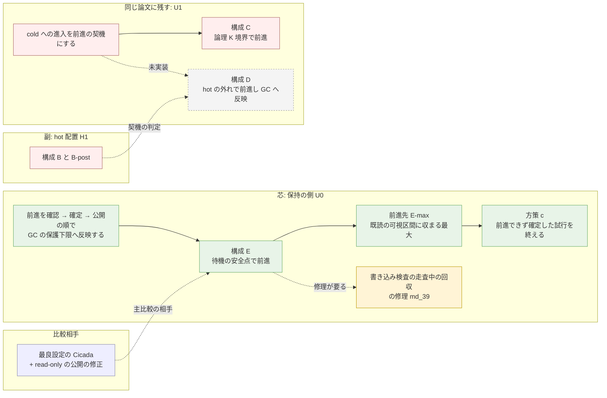
```mermaid
flowchart LR
  subgraph CORE["芯: 保持の側 U0"]
    u0["前進を確認 → 確定 → 公開の順で<br/>GC の保護下限へ反映する"]:::meas
    e["構成 E<br/>待機の安全点で前進"]:::meas
    emax["前進先 E-max<br/>既読の可視区間に収まる最大"]:::meas
    pc["方策 c<br/>前進できず確定した試行を終える"]:::meas
    fix["書き込み検査の走査中の回収<br/>の修理 md_39"]:::open
  end
  subgraph SUB["同じ論文に残す: U1"]
    u1["cold への進入を前進の契機にする"]:::neg
    cc["構成 C<br/>論理 K 境界で前進"]:::neg
    dd["構成 D<br/>hot の外れで前進し GC へ反映"]:::none
  end
  subgraph HOT["副: hot 配置 H1"]
    hb["構成 B と B-post"]:::neg
  end
  subgraph CMP["比較相手"]
    r["最良設定の Cicada<br/>+ read-only の公開の修正"]:::defect
  end
  u0 --> e --> emax --> pc
  e -.修理が要る.-> fix
  u1 --> cc
  u1 -.未実装.-> dd
  hb -.契機の判定.-> dd
  r -.主比較の相手.-> e
  classDef meas fill:#e8f4e8,stroke:#6a6
  classDef neg fill:#fee,stroke:#a66
  classDef open fill:#fff4d6,stroke:#b90
  classDef none fill:#f4f4f4,stroke:#999,stroke-dasharray: 3 3
  classDef defect fill:#eef,stroke:#88a
```

**凡例。** 緑 = 一次資料が効果 (回収境界の遅れ・生存版数の縮み) を観測した項目、赤 = 一次資料が「この実装では throughput が上がらなかった」と書いた項目、黄 = 修理が並走中で未着地、灰の破線 = 未実装、青 = 比較相手。
色は一次資料の結論の向きを示すだけで、評価計画の確認段の判定 (「支持 / 不支持」) ではない。**確認段はまだ 1 つも走っていない** (§10)。

**読み方。** 論文の芯は、ユーザー裁定で**保持の側 (U0) に決まった** (D2322 項 1、2026-09-30「推奨通りで」)。U0 は「実行中の tx の時刻を、既読がすべて見え続ける範囲で後へ進め (前進)、その前進を確かめてから確定し、確定した後にだけ GC に公開する保護下限 (floor) へ反映する」機構である。
cold への進入を前進の契機にする U1 は同じ論文に残すが、実物にあるのは論理 K 境界で発火する構成 C だけで、hot の外れを契機にして GC へ反映する構成 D は未実装である。この版はこの 2 つを分けて書く。

- **U0 で観測できたこと (計器入り build の診断値)。** 読み取りの後に 10 ms 待つ長い tx がいる YCSB で、前進を回収境界へつなぐ構成 E は、偏りの無い負荷で回収境界の遅れを E-hb (flag だけ立てる対照) 比 −54% にした (md_14)。
  前進先を E-max にすると zipf 0.6 でも 19.5 → 10.0 ms に縮んだ (md_21)。zipf 0.9 では E-max 単独の効果は小さいが、前進できず commit できないと確定した試行を安全点で終える方策 c を足すと、
  遅れが 19.64 → 15.19 ms (rep 中央値) に縮んだ (md_31 §5.1、D2320)。
- **U0 の安全について言えること。** 抽象仕様 E について論理的な GC 安全と直列化を紙の上で論証した (md_26、D2319)。ただしその仮定を Cicada の試作のコードで照らすと、書き込み検査の走査中に版が回収されうる箇所など 3 つの不成立があった (md_36、D2326)。
  最も重い (a) の修理 (md_39) は並走中で、**起点では未着地**である。中間案 M の照合は実装され、E-max を含む 18 run で違反 0 だった (md_33、D2336)。
- **U1 と hot 配置。** 構成 C の throughput は stock と差が見えず、hot 配置は書き込み側の費用を外した設計 B-post (md_37) でも読みの利得が出なかった。
- **方針との照合 (下の §0.2)。** ユーザー方針は「論文は、ある条件 C で新しい手法が C での最高水準より大きく速いものだけ」である。**起点で、この形の証拠は 1 つも無い。** 次の §0.2 で隠さずに書く。

**この図から読み取ってはならないこと。**

- 「GC を改善した」とは書かない。回収境界の遅れと論理生存版数は計器入り build の値で、物理メモリの bytes ではなく、throughput の差は検出できていない (§2.5)。
- 「構成 E の Cicada は GC 安全 / serializable」とは書かない。定理は抽象仕様についてで、試作は仮定を満たさない箇所がある (§3)。
- 矢印は論証のつながりで、因果の強さや効果の大きさは表さない。

### 0.1 芯を支える 3 枚


**読み方 (md_21 の target-policy-gc)。** 上段 = 回収境界の遅れの平均 (ms)、下段 = 論理生存版数の平均 (百万)。横軸の目盛は「待機 ms / skew / GC 間隔 µs」、色 = 腕
(E-hb = 安全点で flag だけ立てる、E-now = 今の時刻へ前進、E-max = 既読の可視区間に収まる最大へ前進、E-max-once = 1 tx で目標計算を 1 回)。小さい点が各 rep、菱形が rep 中央値、縦線は n = 3 の小標本 95% CI。
**言えること:** 待機 10 ms の長い tx があるとき、skew 0 と 0.6 では E-max が遅れと生存版数を縮め、skew 0.9 ではどの腕もほぼ同じ。
**言えないこと:** 計器入り build・3 秒・3 rep の値で、性能値でも「有意」でもない。遅れは timestamp 空間の ms (clock boost を含み、実時間ではない)。


**読み方 (md_31 の md31-early-abort-gc)。** 横軸 = skew (待機 10 ms・GC 10 µs の 4 job)、上段 = 回収境界の遅れの平均 (ms、leader が 10 µs ごとに取る等間隔標本)、下段 = 論理生存版数の平均 (千)。
色 = 腕 (E-hb・E-max・b = 前進せず早い abort だけ・c = E-max に早い abort を足す)。小さい点が各 rep、菱形が rep 中央値、縦線は小標本 95% CI (n = 3)。
**言えること:** E-max の効果は skew 0.6 で大きく 0.9 以上で消え、方策 c の上乗せは逆に 0.6 でほぼ 0、0.9・0.95 で大きい (§2.4)。**言えないこと:** 計器入り build・3 秒・3 rep の予備的な値で、評価計画の §5.5 の語はまだ当てていない。


**読み方 (md_14 の gc-connection-mechanism)。** 同じ条件の rep 0 の等間隔標本を時系列で重ねた (起動直後を避けた 200 ms の窓)。stock と E-hb は待機ごとに遅れが 11〜20 ms まで伸びるのこぎり形で、
flag だけでは形が変わらない。E は前進が成り立つ待機で 0〜9 ms に留まり、前進に失敗した待機だけ 20 ms 近くまで伸びる。**rep 0 の 1 例の描写で、統計ではない。**

### 0.2 方針「条件 C で最高水準より大きく速い」との照合 — 判定材料の md_42 は起点で稼働中

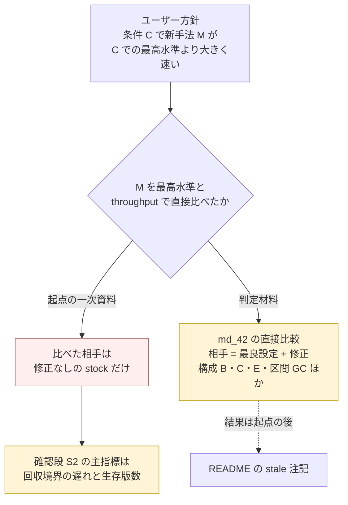
```mermaid
flowchart TB
  pol["ユーザー方針<br/>条件 C で新手法 M が<br/>C での最高水準より大きく速い"]
  pol --> q1{"M を最高水準と<br/>throughput で直接比べたか"}
  q1 -->|"起点の一次資料"| st["比べた相手は<br/>修正なしの stock だけ"]:::neg
  q1 -->|"判定材料"| m42["md_42 の直接比較<br/>相手 = 最良設定 + 修正<br/>構成 B・C・E・区間 GC ほか"]:::open
  m42 -.結果は起点の後.-> note["README の stale 注記"]
  st --> s2["確認段 S2 の主指標は<br/>回収境界の遅れと生存版数"]:::open
  classDef neg fill:#fee,stroke:#a66
  classDef open fill:#fff4d6,stroke:#b90
```

**凡例。** 赤 = 起点の一次資料にある throughput の比較の範囲、黄 = 起点で稼働中・未発効の項目。

**読み方。** この wave の依頼が引くユーザー方針 (2026-09-30) は「論文は、条件 C で新しい手法 M が C での最高水準 (SOTA) より大きく速いものだけにする」である。起点の正典にこの方針の記録は無く、出所は依頼の文である。
この方針に照らすと、起点の事実は次のとおりである。

| 問い | 起点の答え | 出所 |
|---|---|---|
| U0 (構成 E) は回収境界の遅れを縮めたか | 縮めた。待機型の長い tx で skew 0・0.6 は E-max、skew 0.9・0.95 は方策 c を足して (計器入り build の診断値、探索段) | md_14 §1、md_21 §1、md_31 §5.1 |
| U0 は throughput を上げたか | **差は検出できなかった。** 計器なし build の stock 比は待機型で 0.96〜1.06、E が発火しない型でも 0.91〜1.05 揺れる。方策 b・c も 0.97〜1.04 で E 系の揺れの内側 | md_14 §1 項 6、md_31 §1 項 7 |
| U1・hot 配置は throughput を上げたか | **差は見えない。** 構成 C (C-min) は最良設定の上で stock 比 0.97〜1.04 で、同じ腕の間の揺れの内側。hot 配置は B-post でも read-only 95% と rr95 で全比 0.939〜1.016 (24 組すべて「予備的に不支持 (差なし)」)、更新中心では K=1 で 0.938〜0.991 | md_21 §4.5、md_37 §1 |
| 本案を修正済みの最良 Cicada と throughput で比べたか | **比べていない。** 起点の一次資料の比較相手は、どれも修正なしの stock である | md_14・md_21・md_31・md_37 |
| 最高水準との直接比較は | **md_42 (T-2962) が起点で稼働中で、結果はこの版に無い。** T-2962 の定義: md_29 の候補 4 領域で、機構 (hot 配置 B・前進 C・GC 接続 E・区間 GC・read-only commit の公開) を md_11 の最良設定の Cicada と同時刻対照で直接比べる。比較相手は D2322 項 2 (修正入りが主、stock が対照) | worklog の T-2962、D2329 |
| 長い読み手の費用は | 修正入りでも長い read-only 1 本のとき公開時の境界年齢 12.5〜14.3 ms が残る。stock では batchR の 84 行すべてで公開 0 回、論理生存版数は層 S で record 数の 5.4〜14.5 倍 (stock の欠陥込み)。修正入り・最良 genome (md_22 の T、skew 0.9、3 秒・6 反復平均) では、長い read-only の有無で throughput が ro 0% で 3.54M → 2.72M、ro 50% で 5.73M → 2.82M、ro 95% で 13.11M → 8.03M tps だった。ただしこれは worker 1 の手続きも変わる条件間の差で、読み手の保持の費用そのものではない (md_22 §5・§7)。md_42 の負荷での直接比較は起点で未着地 | md_22 §5・§7・§8、md_29 §0 |
| その費用を攻める候補 | 読み続ける read-only tx を安定境界まで前進させる抽象仕様 RO-A は、紙の上で RA なしに直列化と論理的な GC 安全が成り立つ。ただし前進の幅は細い見込みで、試作の前に (md_42 の後に) 実装なしの診断を推す | md_44 §0、D2334 |

**この照合から言えること (親の読み、方針の当てはめ)。**

1. **方針が求める形 (C での SOTA より大きく速い) の証拠は、起点で 1 つも無い。** U0 の実測は回収境界の遅れ・生存版数という計器の値で、throughput の差は stock に対しても検出できていない。U1・hot 配置も stock と差が見えない。
   修正済みの最良 Cicada に対する比較は、どの構成にも無い。
2. **方針に照らした判定材料は md_42 で、起点で稼働中である。** T-2962 の定義では U0 (構成 E) も比較する機構に入っている。この版は md_42 の結論を書かない (起点の後の着地は README の stale 注記が指す)。
3. **U0 の確認段 S2 は、方針の問いに直接は答えない。** 評価計画の草稿 §16 の S2 は、H4 を E_sp(c) 対 E_hb(c) の回収境界の遅れ**かつ**生存版数で判定し、throughput は費用の併記に使う。
   「修正入りの Cicada に対して」を headline に書くために E_sp(c) 対 A_fix を族に入れるかは、発効の wave がユーザーに諮る論点として残っている (草稿 §16.10、推奨は入れる)。
4. **長い読み手の費用は read-only であることから来ており、今の U0 (構成 E は read-only を前進させない) の対象外である。** それを攻める RO-A は紙の上の論証だけで、試作へ進むかは md_42 の後に実装なしの診断で決める (D2334 項 4)。

**ユーザーの判断に返すもの (この版は決めない):** S2 の発効 (T-2893) と E_sp(c) 対 A_fix を族に入れるか、md_42 の結果を見た後の論文の構成。§12 にまとめた。

### 0.3 題名と主張の書き方 (D2322 項 1 の案 2)

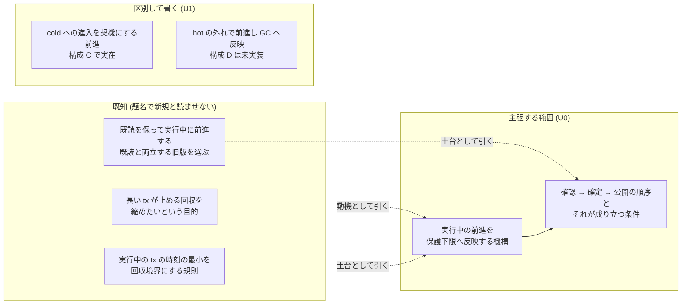
```mermaid
flowchart LR
  subgraph KNOWN["既知 (題名で新規と読ませない)"]
    k1["長い tx が止める回収を<br/>縮めたいという目的"]
    k2["実行中の tx の時刻の最小を<br/>回収境界にする規則"]
    k3["既読を保って実行中に前進する<br/>既読と両立する旧版を選ぶ"]
  end
  subgraph CLAIM["主張する範囲 (U0)"]
    c1["実行中の前進を<br/>保護下限へ反映する機構"]
    c2["確認 → 確定 → 公開の順序と<br/>それが成り立つ条件"]
  end
  subgraph SEP["区別して書く (U1)"]
    s1["cold への進入を契機にする前進<br/>構成 C で実在"]
    s2["hot の外れで前進し GC へ反映<br/>構成 D は未実装"]
  end
  k1 -.動機として引く.-> c1
  k2 -.土台として引く.-> c1
  k3 -.土台として引く.-> c2
  c1 --> c2
```

**読み方。** 左は先行研究と製品文書にある既知の事柄で、題名と貢献の文で新規と読ませない。中央が U0 として主張する範囲、右が同じ論文に残す U1 で、実在する構成 C と未実装の構成 D を分ける。

- **既知のもの (md_9 §5、md_27、md_18 §2):** 長い tx が回収を止める問題と、それを縮めたいという目的 (製品文書、SI-STM の動機)。実行中の tx の時刻の最小を回収境界にする規則 (Hekaton 2013、Cicada 2017)。
  実行中の前進と既読の再確認 (CockroachDB 2020)、既読と両立する旧版の選択 (SI-STM 2006)。区間による位置の調整 (Lomet ほか 2012)。境界の内側の途中版を掃除する区間 GC (Steam・HANA・vDriver)。
- **主張する範囲 (U0、md_9 §7 の案 B):** 実行中に既読を保ったまま後へ進めた tx の位置を、GC に公開する保護下限へ反映する機構 (前進の確定 → 保護下限の公開の順序を含む)。
  新規性は OpenAlex・arXiv・DBLP を事前登録した検索式 N01〜N05 で調べた範囲と読んだ原典の範囲で「見当たらず」(本文未取得の 5 本を除く) で、範囲を同じ文に置く (§11)。
- **題名の書き方の案 (親の案、決定ではない):** 「既読を保つ前進を確認・確定の後に保護下限へ公開する — MVCC の回収境界と実行中の timestamp 前進」。
  本文第 2 稿 (md_41) の題名「既読を保つ前進を回収境界へ反映する — 長い transaction が止める MVCC の版回収を縮める」は副題で既知の目的を掲げるので、副題を目的の句にせず機構の句にする案を並べた。どちらを使うかは本文の改版で決める。
  **題名から読み取ってはならないこと:** 回収を縮めるという目的、境界の規則、前進そのものが新しいということ。
- **U1 と構成 D の区別 (D2322 項 1):** U1 (cold への進入を前進の契機にする) は論理 K 境界で発火する構成 C として実在し、測った (§4)。hot の外れを契機に前進し GC へ反映する構成 D は未実装で、U1 を述べる文に構成 D の効果を含めない。
  構成 C は floor を公開しないので、単独では回収境界を動かさない。

### 0.4 評価の優先: T-2930 系・T-2916 を構成 D より先に

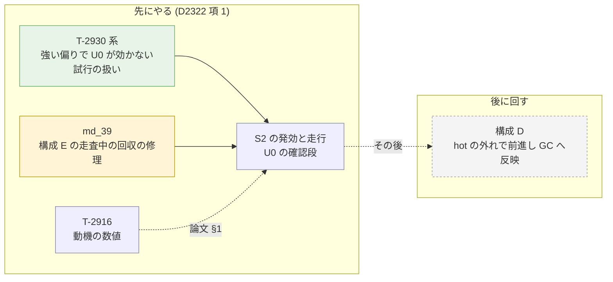
```mermaid
flowchart LR
  subgraph FIRST["先にやる (D2322 項 1)"]
    a1["T-2930 系<br/>強い偏りで U0 が効かない試行の扱い"]:::done
    a2["md_39<br/>構成 E の走査中の回収の修理"]:::open
    a3["S2 の発効と走行<br/>U0 の確認段"]:::wait
    a4["T-2916<br/>動機の数値"]:::wait
  end
  subgraph LATER["後に回す"]
    d1["構成 D<br/>hot の外れで前進し GC へ反映"]:::none
  end
  a1 --> a3
  a2 --> a3
  a4 -.論文 §1.-> a3
  a3 -.その後.-> d1
  classDef done fill:#e8f4e8,stroke:#6a6
  classDef open fill:#fff4d6,stroke:#b90
  classDef wait fill:#eef,stroke:#88a
  classDef none fill:#f4f4f4,stroke:#999,stroke-dasharray: 3 3
```

**凡例。** 緑 = 一次資料が着地した段、黄 = 並走中で未着地、青 = 起票済みで未着手 (S2 は計画だけがある)、灰の破線 = 未実装。

- **T-2930 系 (強い偏りの限界の扱い):** 方策 b・c を E-max と比べた md_31 が着地し (D2320)、方策 c を推す形に決まった。確認段 S2 は E_sp(c) 対 E_hb(c) と E_sp(c) 対 E_sp(a) を判定する (草稿 §15.7・§16)。方策 c を確認段の腕に入れるかは草稿に登録が無い。
- **md_39 (最重要の待ち):** md_36 が示した構成 E の書き込み検査の走査中の回収の穴を再現して最小の修理を入れる wave で、起点で未着地。草稿 §16.8 は S2 の発効に残る条件の 1 番目に置き、修理が「書き込み key を持つ tx に公開させない」型なら S2 をこの形では発効しないと結果の前に登録した (D2332 項 3)。
- **T-2916 (動機の数値):** 本案が縮める「読み取りを続ける長い read-write tx」と「読み終えて待つ tx」が回収境界をどれだけ止めるかの数値は、外部資料に無い (md_27 §8)。起点で未着手。
- **構成 D:** 未実装のまま後に回す。hot 単独の読みの利得は Cicada の中で出ておらず (md_23・md_37)、構成 D の部品 (hot の外れを安く判定する構造) を先に進める材料は起点で無い。最高水準との直接比較 (md_42) は起点で稼働中である。

---

## 1. 問題と動機: 長い transaction が回収境界を止める

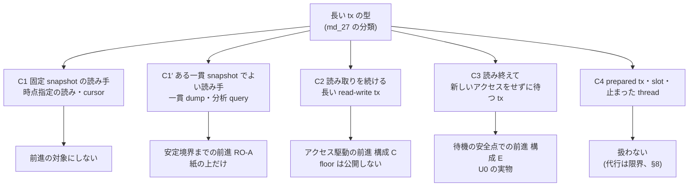
```mermaid
flowchart TB
  long["長い tx の型<br/>(md_27 の分類)"]
  long --> c1["C1 固定 snapshot の読み手<br/>時点指定の読み・cursor"]
  long --> c1b["C1′ ある一貫 snapshot でよい読み手<br/>一貫 dump・分析 query"]
  long --> c2["C2 読み取りを続ける<br/>長い read-write tx"]
  long --> c3["C3 読み終えて<br/>新しいアクセスをせずに待つ tx"]
  long --> c4["C4 prepared tx・slot・<br/>止まった thread"]
  c1 --> n1["前進の対象にしない"]
  c1b --> ro["安定境界までの前進 RO-A<br/>紙の上だけ"]
  c2 --> p1["アクセス駆動の前進 構成 C<br/>floor は公開しない"]
  c3 --> p2["待機の安全点での前進 構成 E<br/>U0 の実物"]
  c4 --> n2["扱わない<br/>(代行は限界、§8)"]
```

**読み方。** md_27 (動機づけの根拠集め) は長い tx を 4 型に分けた。**この分類は md_27 が置いたもので、出典自身の分類ではない** (md_27 §4)。
4 版目では、md_44 が read-only の読み手を「開始時点の状態が要る用途 (時点指定の読み)」と「ある一貫 snapshot でよい用途 (一貫 dump・分析 query)」に分けたことを C1 と C1′ の 2 つの箱で描いた (md_44 §1、md_15 §2.1 の 2 分類に対応)。
**C1′ の前進は紙の上の論証だけで、実装も計測も無い** (§7)。U0 の実物が扱うのは C3 だけである。

**集めた根拠 (md_27 §1.1・§6):** 公式文書・技術資料 38 頁 (PostgreSQL・MySQL・AWS Aurora の 17 頁と Oracle・SQL Server・MongoDB・CockroachDB・TiDB・Spanner・YugabyteDB の 21 頁) と論文・資料 10 本の計 48 件。

**論文 §1 に使える文 (md_27 §5.1 の M1〜M6 の要点):**

- M1: 最古の実行中 tx が回収境界を決める tx 型の GC (PostgreSQL・MySQL InnoDB・SQL Server・TiDB 6.1.0 以降・Aurora) では、長い tx が回収を止める。
  時間型 (Oracle・Spanner・YugabyteDB・CockroachDB) は通常の読み取りでは止まらず、代わりに長い読み取りが失敗する — と同じ段落で書く。
- M2: 回収が止まると容量・性能・可用性が悪化する。**数値はすべて C1 (固定 snapshot の読み手) の実験の値だと明記する。**
- M3: 問題は実運用で起きている。ただし頻度の根拠は HANA の 1 システムの統計 (408,664 query 中 6 cursor が 1 時間超) だけである。
- M4: 読んだ 10 製品系と HANA の範囲では、既存の対処は「長い側を終わらせる」「待ち上限で強制前進」「snapshot の失効」「書き込み側を遅らせる」のどれかで、何かを諦める。
- M5: 途中版の剪定 (区間 GC・EPO) は列を縮めるが、長い snapshot から見える版は残す。
- M6: 本案は長い tx を abort せず前進させ、その前進を保護下限へ反映する。

**使えない文:** 「長い tx は頻繁に起きる」。「本案は C1 の数値の分だけ速くなる」。**C2・C3 の大きさの数値は外部資料に無い** — 評価で自分で示す必要があり、T-2916 に登録されている (md_27 §8)。起点で未着手である。

**長い読み手が修正入りの比較相手に残す分。** 修正入りでも、長い read-only 1 本のとき公開時の境界年齢 12.5〜14.3 ms が残る (md_22 §8)。修正入り・最良 genome (md_22 の T、skew 0.9、3 秒・6 反復平均) では、長い read-only の有無で throughput が ro 0% で 3.54M → 2.72M、ro 50% で 5.73M → 2.82M、ro 95% で 13.11M → 8.03M tps だった。ただしこれは worker 1 の手続きも変わる条件間の差で、読み手の保持の費用そのものではない (md_22 §5・§7)。md_42 の負荷での直接比較は起点で未着地 (md_42 が稼働中)。
**長い読み手は read-only (C1 か C1′) で、今の U0 の実物 (C3 の構成 E) の対象外である。** T-2916 が求める C2・C3 の数値の代わりにはならない。


**読み方 (md_2 の図 3)。** 上から回収境界の年齢・公開の間隔・回収時の年齢・論理的な生存版数を、GC 間隔ごとに並べた。色が長い tx の型。
**言えること:** 読み取りの後に待つ長い tx (C3) があると、境界の年齢と公開間隔が伸びる向きである (md_2 §0 項 4: 10 ms 待機で境界年齢 p50 が 32 µs → 32768 µs の bucket、論理生存版数 1.03e6 → 1.41e6)。
**言えないこと:** 計器入り build の観測で性能値ではない。境界年齢は timestamp 空間の値 (clock boost を含む) の 2 倍刻みの bucket 上界で、公開間隔は実時間である。


**読み方 (md_29 の skew_depth)。** 偏りの格子 (層 S: skew 0.5〜0.99 × 読み比率 × 長い tx の有無と型) で、版探索の位置の分布を並べた。
**言えること (md_29 §0):** 1000 操作の read-only tx を 1 worker が続ける条件 (batchR) では、84 行すべてで stock の 3 秒間の MinRts の公開が 0 回で、論理生存版数は record 数の 5.4〜14.5 倍 (層 S) に溜まった。
長い tx が無ければ、最良設定の境界年齢 p50 は 128〜512 µs と小さい (層 S、GC 100 µs)。**言えないこと:** 計器入り build の観測量で、「上限」は機構が完全に働いた場合の機会の大きさであり、実装したときの効果ではない。
batchR の公開 0 回は stock Cicada の欠陥 (read-only の commit が GC flag を立てない、§6.1) 込みの値である。

---

## 2. U0: 前進を回収境界へ反映する — 実物の構成 E


```mermaid
flowchart LR
  subgraph T["tx T の側 (待機の安全点)"]
    t0["前進先 t′ を選ぶ<br/>E-max: 既読の可視区間に収まる最大"] --> t1["既読版すべての rts を<br/>t′ 以上へ上げる"]
    t1 --> t2["版の列を観測し直し<br/>既読版が t′ で見えるか確かめる"]
    t2 -->|全部見える| t3["確定: T の時刻 := t′"]
    t2 -->|どれかが見えない| tf["時刻も floor も変えない"]
    t3 --> t4["公開 (別の step):<br/>floor を確定時刻以下へ上げる"]
  end
  subgraph G["GC の側"]
    g1["境界 := 実行中の tx の<br/>floor の最小"] --> g2["後続の確定版が境界以下にある<br/>版だけを回収"]
  end
  t4 -.-> g1
```

**読み方。** 左が前進する tx の手順、右が GC の手順である。点線は「公開した floor を GC が境界の計算に使う」ことを表す。手順の正本は md_14 (確認・確定・公開の行、D2295) と md_21 (`CHOOSE_TARGET`、D2315) である。
**この図から読み取ってはならないこと:** 図は commit の手順を描いていない。commit の書き込み検査は stock のままで、公開した floor はその走査を守らない (§3.3 の (a))。右の「境界 := floor の最小」は抽象仕様の 1 step で、Cicada の leader は thread ごとに非原子的に読む (§3.3 の (b))。

### 2.1 段階 A・B・C: 回収境界を動かすのは段階 B から

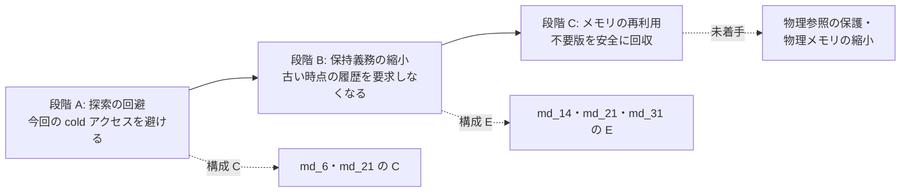
```mermaid
flowchart LR
  A["段階 A: 探索の回避<br/>今回の cold アクセスを避ける"] --> B["段階 B: 保持義務の縮小<br/>古い時点の履歴を要求しなくなる"] --> C["段階 C: メモリの再利用<br/>不要版を安全に回収"]
  A -.構成 C.-> na["md_6・md_21 の C"]
  B -.構成 E.-> nb["md_14・md_21・md_31 の E"]
  C -.未着手.-> nc["物理参照の保護・<br/>物理メモリの縮小"]
```

**読み方。** B と C まで実現しなければ「GC を改善した」とは言えない (出典メモ §15.1)。段階 B を実物で測った一次資料は 3 本 (md_14・md_21・md_31) ある。
段階 C (物理メモリの縮小) は測っていない — 論理生存版数は減ったが、`REUSE_VERSION=1` の pool は縮まない (md_14 §7)。

### 2.2 構成 E の 4 腕と主比較 (md_14)

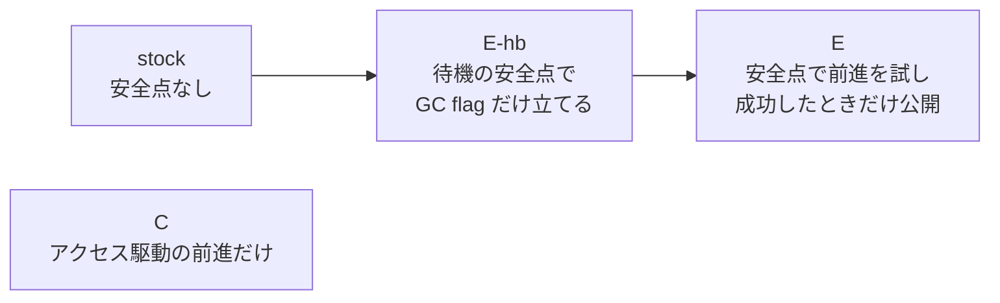
```mermaid
flowchart LR
  stock["stock<br/>安全点なし"] --> Ehb["E-hb<br/>待機の安全点で<br/>GC flag だけ立てる"]
  Ehb --> E["E<br/>安全点で前進を試し<br/>成功したときだけ公開"]
  C["C<br/>アクセス駆動の前進だけ"]
```

**読み方。** md_14 の 4 腕 (§2)。**主比較は E 対 E-hb** — 前進と公開だけが違う組で、1 因子の比較になる。E 対 stock は待機の刻み方と flag の両方を含むので、E の効果として書かない (md_14 §4.4)。
条件は md_11 の観測最良設定、48 thread、100 万件、rratio 50、max_ope 10、3 秒、長い thread 4 本 (10 read + 1 write の後に待機する型)。GC 指標は計器入り build の 3 rep、throughput は計器なし build の 3 rep。6 job を 6 台で同時刻に投げた (md_14 §4.1)。


**読み方 (md_14 の gc-connection)。** 行 = 長い tx の 4 条件 (待機 1 ms / 10 ms × skew 0.9 / 0)、列 = (a) 回収境界の遅れの平均 (ms)、(b) 論理生存版数の平均 (百万)、
(c) 版の保持時間の平均 (ms)、(d) E の前進の成功率 (%)。横軸 = GC 間隔 (µs)、色 = 腕。**言えること:** skew 0 では E が遅れ・生存版数・保持時間を縮め、
skew 0.9 では「今」への前進がほぼ失敗して E と E-hb が重なる。**言えないこと:** 計器入り build の値で、E の前進先は「今」(md_21 の E-now に当たる)。

| 待機 10 ms (md_14 §4.2、rep 中央値) | 回収境界の遅れ ms (stock / E-hb / E) | 論理生存版数 千 (stock / E-hb / E) | 版の保持時間 ms (stock / E-hb / E) | E の前進 成功 / 試行 |
|---|---|---|---|---|
| skew 0・GC 10 µs | 18.6 / 19.3 / **8.9** | 1,299 / 1,311 / 1,164 | 17.3 / 18.2 / 9.6 | 15,653 / 34,092 |
| skew 0・GC 1 ms | 18.9 / 19.5 / 11.2 | 1,304 / 1,316 / 1,199 | 17.6 / 18.3 / 11.8 | 3,589 / 7,500 |
| skew 0.9・GC 10 µs | 24.3 / 20.5 / 20.1 | 1,370 / 1,316 / 1,310 | 23.2 / 18.9 / 18.5 | 38 / 23,366 |

- **言えること (md_14 §1 項 1):** skew 0・待機 10 ms・GC 10 µs で、E 対 E-hb は遅れの平均 8.9 ms 対 19.3 ms (−54%)、論理生存版数の平均 116.4 万 対 131.1 万 (−14.7 万)、版の保持時間の平均 9.6 ms 対 18.2 ms (−47%)。
  3 rep の値は重ならない。待機 1 ms でも遅れ −41%・保持時間 −53%。
- **「今」への前進は強い偏りでほぼ失敗する (md_14 §1 項 2):** skew 0.9 では E の前進の成功は試行の 0.05〜0.27% (失敗の 88〜96% が既読不一致)。md_14 の逐語: 「md_6 の zipf 0.9 の条件だけで試していたら、U0 の効果は見えなかった。」
- **flag だけでも公開は戻るが、境界は長い tx に止められたまま (md_14 §1 項 3):** skew 0.9・待機 10 ms で公開は 3 秒あたり約 290 回から約 5,700 回へ戻り、遅れ −3.5 ms・生存版数 −4.7 万と小さく効く。

### 2.3 前進先 E-max: 中程度の偏りでも縮めた (md_21)


**読み方 (md_21 の target-policy-success)。** 縦軸 = 成功 / 要求 (%)。要求 = 待機の安全点で GC 間隔が経過し自分の GC flag が 0 だった回数。E-hb は前進を試さないので系列が無い。
**言えないこと:** E-max の要求には一度成功した後の再要求も入る (§2.4 の訂正のとおり、`no_room` の大半はそれである) ので、この比は「tx の何割が前進できたか」ではない。成功率は選び方の比較の指標で、GC 改善の指標ではない。

| 待機 10 ms・GC 10 µs (md_21 §4.2、rep 中央値) | 遅れ ms (E-hb / E-now / E-max) | 論理生存版数 千 (E-hb / E-now / E-max) | 保持時間の中央値の bin 上限 ms (E-hb / E-now / E-max) | MinRts を決めた thread が長い tx だった割合 (E-hb / E-now / E-max) |
|---|---|---|---|---|
| skew 0 | 19.51 / 9.64 / **5.96** | 1,323 / 1,171 / 1,113 | 16.4 / 8.2 / 4.1 | 0.95 / 0.24 / 0.01 |
| skew 0.6 | 19.47 / 17.40 / **10.02** | 1,330 / 1,295 / 1,195 | 16.4 / 16.4 / 8.2 | 0.88 / 0.62 / 0.13 |
| skew 0.9 | 20.38 / 20.44 / 19.35 | 1,314 / 1,317 / 1,295 | 16.4 / 16.4 / 16.4 | 0.99 / 1.00 / 0.94 |

- **言えること (md_21 §1 項 1・2):** skew 0.6 で E-max の遅れは E-hb 比 −9.5 ms (19.5 → 10.0 ms)、論理生存版数 −13.4 万版、保持時間の中央値 16.4 → 8.2 ms。E-now は同じ条件で 17.4 ms とほぼ効かない。
  −9.5 ms は md_21 §4.2 の「rep ごとの差の中央値」で、表の中央値どうしの差とは別の集計である。保持時間は 2 のべきの bin の上限なので、16.4 → 8.2 ms は「中央値が 1 bin 下がった」と読む。
- md_31 の同時刻の計測でも、skew 0.6 で E-hb 19.83 → E-max 9.31 ms と同じ向きが再現した (md_31 §5.1)。
- **評価計画の語 (md_34、D2325):** 草稿 v1 §5.5 を規則を変えずに当てると、確認段へ持ち込む前進先は p\* = c (= E-max) になった。ただし E-max 対 E-hb (P21-1) の判定語は全 cell で**「判定不能 (門未完了)」**である。
  対照の E-hb が md_21 の門 (target patch を重ねた門用 build) を通っていないためで、規則の順序では値より先にこの語が当たる。門が完了していたと仮定した参考の語でも、A/A 腕が無いので skew 0・0.6 の組は「判定不能 (A/A なし)」になり、「予備的に支持」はどの組にも出ない (草稿 §15.3、D2325 項 4)。
  **上の表の縮みは md_21 が観測した値として残すが、評価計画の語では支持を得ていない。**

### 2.4 強い偏り: `no_room` の読みの訂正と、方策 c (md_21・md_31)


**読み方 (md_21 の target-policy-reasons)。** 失敗理由ごとの panel。E-now の失敗はほぼすべて既読不一致、E-max は既読不一致 0 で `no_room` (前進先が無い) と書き込み制約、E-max-once は 2 回目以降の要求が `once skipped`。

- skew 0.9 では E-max でも遅れ −1.0 ms (20.4 → 19.4 ms) に留まり、E-max の要求の約 75% が `no_room` だった (条件別には 40〜78%) (md_21 §1 項 3・§4.3)。

**`no_room` の読みの訂正 (md_31 §3.3、D2320 項 3)。** 3 版目は md_21 §4.3 に従い、`no_room` を「(a) 一度成功した後で上端が動かない」と「(b) 既読のどれかが上書き済みで validation での abort が決まっている」の混合と書いた。
md_31 が `no_room` を前進の成功前 / 成功後に分けて数えると、skew 0.9 の方策 c の計数 rep で成功後が 2,465〜6,829 回、成功前が 944〜1,353 回で、**`no_room` の大半は前進に一度成功した後の再要求だった。**
また上端 U は pending の版も含むので、成功前の `no_room` でも pending が abort すれば validation は通りうる。**`no_room` は abort の確定ではなく、確定は判定 D (既読版より新しく自分の時刻より古い committed / deleted の版の witness) で言う。**

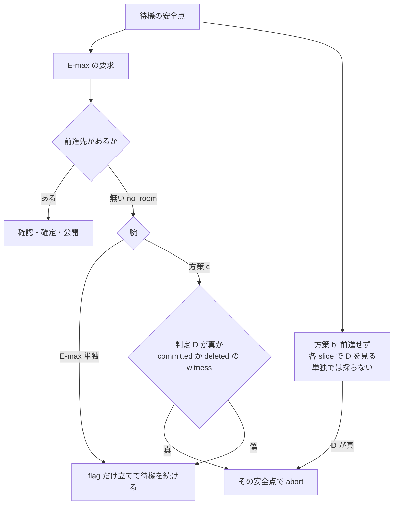
```mermaid
flowchart TB
  sp["待機の安全点"] --> req["E-max の要求"]
  sp --> bb["方策 b: 前進せず<br/>各 slice で D を見る<br/>単独では採らない"]
  bb -->|D が真| ab
  req --> nr{"前進先があるか"}
  nr -->|ある| ok["確認・確定・公開"]
  nr -->|無い no_room| arm{"腕"}
  arm -->|E-max 単独| keep["flag だけ立てて待機を続ける"]
  arm -->|方策 c| d{"判定 D が真か<br/>committed か deleted の witness"}
  d -->|真| ab["その安全点で abort"]
  d -->|偽| keep
```

**読み方。** md_31 §2・§3.3 の手順と D2320 項 2 の決定。方策 c は `no_room` を返した要求のたびに、前進の成功前か成功後かを問わず D を評価する。方策 b は E-max の要求とは独立に、待機 slice の安全点ごとに D を評価し (GC 間隔や GC flag の状態とは無関係、md_31 §2)、前進しないので、上書きされていない試行は待機の間ずっと下限を押さえる。
**図から読み取ってはならないこと:** 各分岐の割合は図に書いていない。D の健全性は小モデルの有限範囲でだけ確かめた (§3.4)。

| 待機 10 ms・GC 10 µs (md_31 §5.1、rep 中央値) | 遅れ ms: E-hb | E-max | b (早い abort だけ) | c (E-max + 早い abort) | 同じ rep 内の差の中央値: b − E-hb | c − E-max |
|---|---|---|---|---|---|---|
| skew 0.6 | 19.83 | 9.31 | 18.73 | 9.23 | −0.95 | −0.07 |
| skew 0.8 | 20.25 | 16.21 | 20.06 | 15.13 | −0.24 | −1.80 |
| skew 0.9 | 20.38 | 19.64 | 19.61 | 15.19 | −0.70 | −2.92 |
| skew 0.95 | 20.61 | 20.28 | 18.86 | 16.04 | −1.75 | −4.11 |

- **E-max と方策 c を別の行で読む。** E-max の効果 (E-hb との差) は skew 0.6 で大きく、0.9 以上でほぼ消える。方策 c の上乗せ (E-max との差) は逆に skew 0.6 でほぼ 0、0.9 で −2.9 ms、0.95 で −4.1 ms である。
  論理生存版数の差の中央値 (c − E-max) は skew 0.8 / 0.9 / 0.95 で −3.6 万 / −4.6 万 / −5.2 万版 (md_31 §5.1)。
- **早い abort だけ (方策 b) では縮まない。** b − E-hb は全 skew で 2 ms 未満。D の到達は十分ある (skew 0.9 で試行の 51%) ので、「D が真になって早く終えても境界が縮まない」型の結果である。
  md_31 の推定 (未検証): 回収境界は長い thread 4 本の下限の最小で決まり、上書きされていない試行は待機の間ずっと下限を押さえる。c は前進できる試行を前進させ、前進できず確定した試行を終えるので、両方の型の試行が境界から外れる。
- **方策 c は前進先の選び方ではない。** E-max を「改良した」とは書かず、前進できない試行の扱いを足した別の方策として書く (D2320 項 2)。主張の範囲は現行 genome (`INLINE_VERSION_PROMOTION=0`)、read-only でない tx、前進成功後の遷移は W* を仮定、小モデルの有限範囲 (D2320 項 4)。
- **評価計画の語はまだ当てていない。** 方策 c の値は探索段の予備的な観測である。

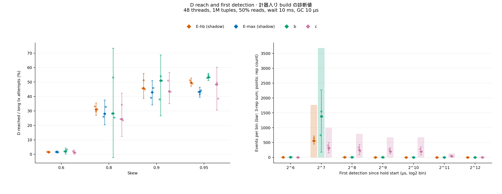

**読み方 (md_31 の md31-early-abort-doomed)。** 左 = D の到達率 (D が真になった試行 / 長い tx の試行、%) を skew ごとに。右 = skew 0.9 の待機開始から初回検出までの時間 (µs の log2 bin)。棒は 3 rep の合計、点は各 rep。
b の検出は最初の安全点の bin に集まり、c は E-max の要求に縛られて遅い (md_31 の図の読み方)。**言えないこと:** 計器入り build の計数で、D の真を成功前 / 成功後に分けていない。

**偏りを 0.99 まで上げたときの前進の余地 (md_29 §0 項 4、md_28 の問いを統合)。** 偏りを上げると深い update read は増えるが、深い read のうち前進の候補がある割合は下がった
(長い tx なし・rr 50・最良設定で、skew 0.5 の 0.79 から skew 0.99 の 0.017 へ)。積 h2 (候補数 / update read 全件) は 0.01 前後で頭打ちになり、全域の最大は 0.046 だった。**観測時点の機会量で、機構を実装したときの効果ではない。**

### 2.5 throughput: 差は検出できなかった


**読み方 (md_21 の target-policy-throughput)。** 計器なし build の 3 rep 中央値の stock 比。資料自身が「差は判定しない (記述値)」と書く。

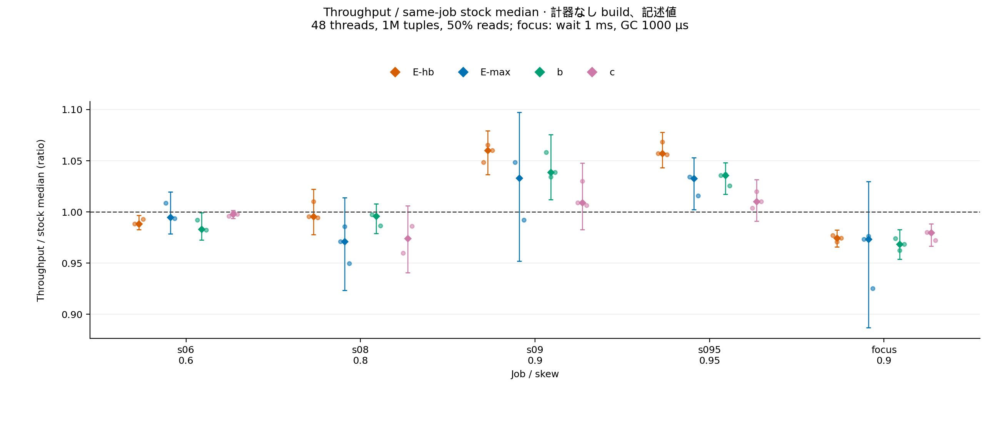

**読み方 (md_31 の md31-early-abort-throughput)。** 横軸 = job、縦軸 = throughput / 同じ job の stock の中央値。計器なし build の記述値で、資料自身が「差は判定しない」と書く (md_31 §5.4)。

- 構成 E: 計器なし build の stock 比は待機型で 0.96〜1.06、E が発火しない型でも 0.91〜1.05 ばらつくので、この幅の内側と読む (md_14 §1 項 6)。
- 方策 b・c: stock 比 0.97〜1.04 で、E 系の腕の揺れ (0.97〜1.06) と同じ範囲 (md_31 §1 項 7)。
- **比較相手はどれも修正なしの stock で、修正済みの最良 Cicada に対する U0 の throughput は測っていない** (§0.2)。
- **between-run の揺れ (md_35、§6.4):** 比較相手 A (md_11 の最良設定) の日内 6 時間窓の窓間 CV は主 GC で Y5 0.69%・Y50 1.05%・Y95 0.70% だった。これは関門を通った floor ではなく、評価計画の f_T には代入しない (D2333)。
  上の stock 比の揺れ (0.91〜1.06) は 3 秒 × 3 rep の腕間の比であり、窓間 CV と同じ量ではない。

**この版は throughput の改善を主張しない。** 評価計画は、長い tx を含む cell では throughput が「改善」でも長い tx の単位時間あたり commit 数が「悪化」なら改善を主張しないと決めている (草稿 v1 §5.2)。

### 2.6 長い tx の完了: 操作数型と待機型を分ける (md_21・md_31)


**読み方 (md_31 の md31-early-abort-long)。** 横軸 = skew。上段 = 長い tx の commit/秒、中段 = 試行/秒、下段 = 完了率 (commit / 試行)。早い abort の腕 (b・c) は試行/秒が増えるので、完了率は分母で下がる。
**言えないこと:** rep の揺れが大きく、腕の間の差は判定できない。

| 待機 10 ms・GC 10 µs (md_31 §5.3、計器なし build、rep 中央値) | 完了率 stock / E-hb / E-max / b / c |
|---|---|
| skew 0.6 | 0.719 / 0.720 / 0.755 / 0.718 / 0.741 |
| skew 0.8 | 0.250 / 0.347 / 0.375 / 0.360 / 0.419 |
| skew 0.9 | 0.125 / 0.126 / 0.172 / 0.057 / 0.067 |
| skew 0.95 | 0.057 / 0.056 / 0.099 / 0.019 / 0.033 |

- **3 版目の「長い tx の完了率はどの腕でも 0.0003 以下」は操作数型 (1,000 操作の many_ops) の値である。** 待機型の長い tx は stock でも完了する (md_31 §6)。2 つを混ぜて書かない。
- **rep の揺れが大きい。** skew 0.9 の完了率の rep の値は stock 0.125 / 0.216 / 0.070、E-max 0.134 / 0.176 / 0.172 で、同じ条件の別 job では stock 0.075・E-max 0.051 だった。「前進で完了率が上がった」とも「下がった」とも書かない (md_31 §5.3)。
- **何が待機型を落とすか。** skew 0.9 では長い tx の試行の約 43〜46% で、待機中に既読が committed の版に上書きされ、commit できないことが確定した (E-hb・E-max の shadow)。その検出の大半は待機開始から 128〜255 µs の bin に入る (md_31 §6)。
- **BACK_OFF の影響 (記述値)。** BACK_OFF=1 (他は最良設定) では stock の完了率の中央値が同じ job の BACK_OFF=0 より高い (0.188 対 0.075) が、throughput は約 0.29 倍に落ち、回収境界の遅れは 23.3 → 29.9 ms に伸びる。BACK_OFF=1 でも E-max は遅れを縮める (29.9 → 20.9 ms) (md_31 §6)。

### 2.7 モデルの中の数 (md_10)

| 場面 (md_10 §6) | 前進なしの回収境界 / 回収できる版 | 公開による帰属できる差 |
|---|---|---|
| G1 読み取りの後に待つ tx 1 本 | 45 / 0 | 境界 +16・版 +2 |
| G2 待つ tx 2 本 | 45 / 0 | 境界 +17・版 +1。**T だけが公開すると境界は U の floor 35 のまま** |
| G4 前進後にも読む tx | 45 / 0 | 境界 +36・版 +2 |

**値はモデルの時刻と版の数であり、実システムの保持時間・メモリ量・throughput を表さない** (md_10 §6)。G2 の「他の tx の古い時刻が残れば全体の境界は動かない」は、md_21 の skew 0.9 で MinRts を決めた thread が長い tx だった割合が E-max でも 0.94 に留まったことと同じ向きである (親の読み。モデルと実物の対応は検査していない)。
G4 (前進後にも読む tx) はモデルの refs が守る場面で、floor だけで守る Cicada 型の経路では条件 RA の外になる (§3.2)。

---

## 3. 正しさ: 何が言えて、何が言えないか

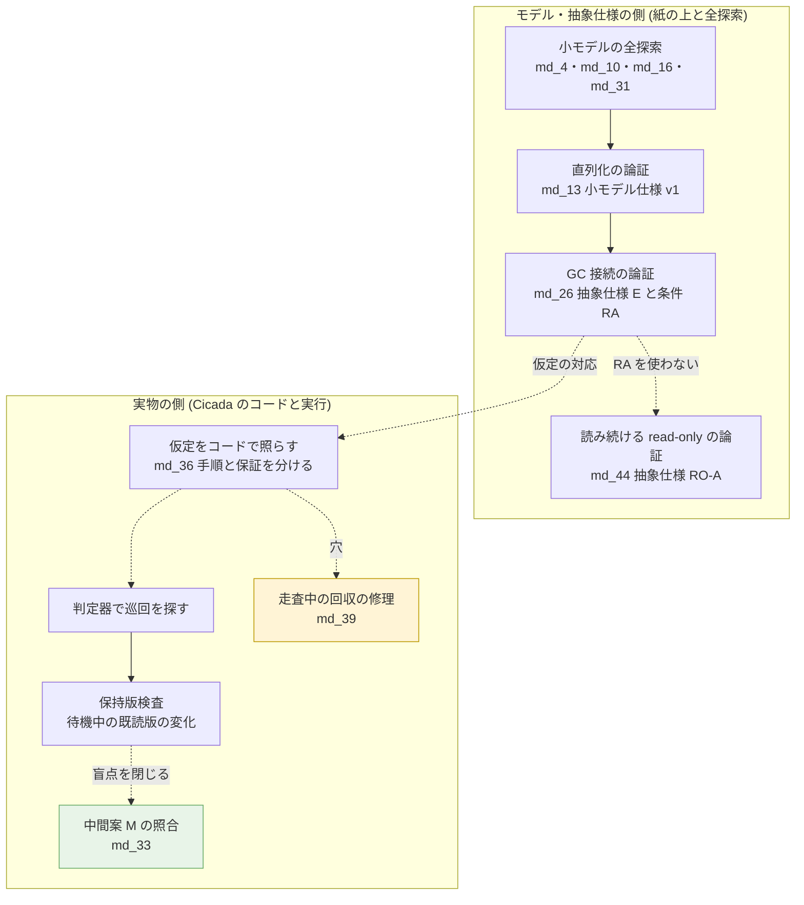
```mermaid
flowchart TB
  subgraph M["モデル・抽象仕様の側 (紙の上と全探索)"]
    m4["小モデルの全探索<br/>md_4・md_10・md_16・md_31"]
    m13["直列化の論証<br/>md_13 小モデル仕様 v1"]
    m26["GC 接続の論証<br/>md_26 抽象仕様 E と条件 RA"]
    m44["読み続ける read-only の論証<br/>md_44 抽象仕様 RO-A"]
  end
  subgraph I["実物の側 (Cicada のコードと実行)"]
    code["仮定をコードで照らす<br/>md_36 手順と保証を分ける"]
    v3["判定器で巡回を探す"]
    ret["保持版検査<br/>待機中の既読版の変化"]
    evm["中間案 M の照合<br/>md_33"]:::done
    fix["走査中の回収の修理<br/>md_39"]:::open
  end
  m4 --> m13 --> m26
  m26 -.仮定の対応.-> code
  code -.穴.-> fix
  code -.-> v3
  v3 --> ret
  ret -.盲点を閉じる.-> evm
  m26 -.RA を使わない.-> m44
  classDef done fill:#e8f4e8,stroke:#6a6
  classDef open fill:#fff4d6,stroke:#b90
```

**凡例。** 緑 = 4 版目の起点で実装が着地した照合、黄 = 並走中で未着地。

**読み方。** 左はモデル・抽象仕様についての主張、右は実物のコードと実行についての主張である。**左の結論は右へ自動では移らない。**
3 版目からの変化は 3 つある: (1) 構成 E について抽象仕様の論証 (md_26) が着地した、(2) その仮定を試作のコードで照らした md_36 が、試作は仮定を満たさない箇所があると示した、(3) 判定器の盲点を閉じる中間案 M (md_33) が実装された。

### 3.1 小さいモデルで分かったこと (md_4・md_10)

| 規則 | 崩した版 | 結果 (固定場面の範囲) | 出所 |
|---|---|---|---|
| 書き込み側の直前版の rts 検査は PENDING を越えて最初の確定版まで (R9′) | v0 (直前版 1 つだけを検査) | 閉路の反例、30 step | md_4 §7.3 |
| 既読版の rts を上げてから可視を確かめる (R9 の順序) | U1v | 閉路の反例、26 step | md_4 §7.3 |
| 確定してから GC へ公開する (R6 → R7) | U3a | GC 違反、3 step | md_4 §7.3 |
| 後続の確定版を根拠に回収する (R10) | U4 | GC 違反、2 step | md_4 §7.3 |
| 確定してから公開する (SP) | UG1 (確認の前に公開) | GC 違反、4 場面で 5〜31 step | md_10 §8 |
| 確定で保護下限を外さない | UG2 (確定時に floor を無限大) | GC 違反、2 場面で 10・21 step | md_10 §8 |
| 圧力による前進でも可視を確かめる | UG3 | O1 なしでは反例なし、O1 と組むと閉路 38 step | md_10 §8 |
| 公開の後は公開した floor より古い時刻へ戻らない | UF1 | GC 違反、2 場面で 22・47 step | md_10 §8 |

- 仕様 v1 (v0 + R9′) は 10 場面すべてで反例なし (md_4 §8)、SP の健全版 24 構成はすべて反例なし (md_10 §5.1)。**反例なしは固定場面の初期状態からの全 interleaving に限る。**
- 範囲: キー 2、tx 2〜3 (+ GC 1 thread)、操作 1〜3、K は 1 (1 場面だけ 2)、逐次一貫のメモリ (md_4 §6)。これらの模型には、境界の非原子的な読みと thread の floor の下降は入っていない (md_36 §7)。

### 3.2 GC 接続の論証 (md_26): 読み終えて待つ型について

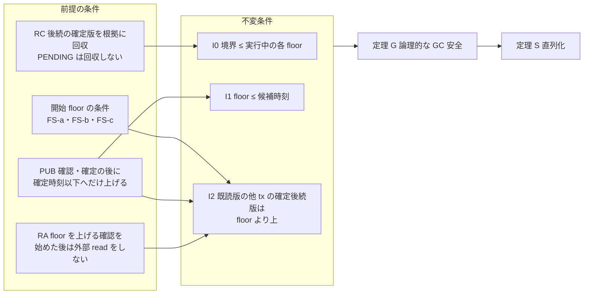
```mermaid
flowchart LR
  subgraph INV["不変条件"]
    i0["I0 境界 ≤ 実行中の各 floor"]
    i1["I1 floor ≤ 候補時刻"]
    i2["I2 既読版の他 tx の確定後続版は<br/>floor より上"]
  end
  subgraph COND["前提の条件"]
    fs["開始 floor の条件<br/>FS-a・FS-b・FS-c"]
    pub["PUB 確認・確定の後に<br/>確定時刻以下へだけ上げる"]
    ra["RA floor を上げる確認を<br/>始めた後は外部 read をしない"]
    rc["RC 後続の確定版を根拠に回収<br/>PENDING は回収しない"]
  end
  fs --> i2
  pub --> i1
  pub --> i2
  ra --> i2
  rc --> i0
  INV --> thG["定理 G 論理的な GC 安全"]
  thG --> thS["定理 S 直列化"]
```

**読み方。** md_26 (D2319) は、待機の安全点で tx 自身が確認 → 確定 → 別 step で公開する抽象仕様 E について、途中入場する tx と古い境界での回収も含めて次を示した。**主語は抽象仕様であり、Cicada 実装と物理的な非接触は主張しない** (md_26 §0)。

- **定理 G (論理的な GC 安全):** 回収された版は、回収の時点で実行中の tx にも、その後に始まる tx にも、読み・確認・commit の検証・書き込み検査・前進先の計算のどれでも「必要な版」として現れない。
- **定理 S (直列化):** 確定した tx の依存グラフは閉路を持たず、確定時刻の昇順が直列化の順を与える (md_13 の定理 4 の仮定 A9 を、定理 G から導いた補題 A で置き換えたもの)。
- 前進先 t′ については一意で現在の時刻より大きいことしか使わないので、E-max にも E-now にも同じく当てはまる (D2319 項 1)。

**条件 RA がこの論証の射程を決める。** md_26 は RA を崩すと floor だけでは既読版を守れない列を 2 つ紙の上で作った (探索はしていない)。列 X1 は「floor を上げた後に新しく読む」、列 X2 は「確認に成功してから公開するまでの間に新しく読む」で、
どちらも新しく読んだ版が確認に覆われず、並行する writer の確定版を根拠に回収されうる (md_26 §8)。**定理 G は、読み終えてから前進して公開する型 (C3) の抽象仕様には届き、読み続けながら floor を上げる型 (C2) には届かない。**
読み続ける read-only tx (C1′) を前進させる md_44 の抽象仕様 RO-A は、前進先を安定境界に限ることで RA を使わずに同じ結論を得る (§7.2)。

**Cicada で既読版を守る暗黙の不変条件との対応。** stock Cicada は「tx 開始時の下限を tx の間変えない」ことで既読版を物理的に守っている (md_14 §3.3)。md_26 はこれを FS-c (開始時に (I2) を成り立たせる) と PUB (floor を上げるのは確認に成功した時刻以下へだけ) の 2 つに分けて明示した (D2319 項 3)。§3.4 の P5 は PUB を破った実例である。

**前提の条件の Cicada での状態 (md_36 §2・§4、計測の設定の YCSB の read-write tx の経路に限る):**

| 条件 | 中身 | stock | 構成 E の試作 |
|---|---|---|---|
| FS-a | 登録時の floor ≤ 開始時刻 | 満たす (非 0・非 wrap の範囲) | 同じ |
| FS-b | 登録時の floor ≥ それまでに GC が読んだどの境界 (途中入場) | **導出上満たす** (thread の Wts・Rts がともに非減少なので、非原子的な集計でも古い値は新しい値以下) | **満たさない場合がある** (thread の floor が前進で上がり次の begin で下がる)。ただし前進しない thread 0 (leader) の floor が境界を上から抑えるので、既読版の回収に至る列は作れない |
| FS-c | 登録の後に他 tx が設置する版の wts はすべて開始 floor より大きい | 満たす | 同じ |
| PUB | 成功した確認・確定の後に確定時刻以下へだけ上げる | 前進なし | 満たす (`gc_advance` の成功時だけ公開) |
| RA | floor を上げる確認を始めた後は外部 read をしない | — | **計測した待機型の長い tx では満たす** (全 read と update の後に待機ループへ入り、ループの後は commit だけ)。安全点の API 自体は以後の read を禁じないので、API 一般では判定できない |
| RC | 後続の確定版を根拠に回収し、PENDING は回収しない | **一部だけ** (PENDING を除く検査はコードに無く、floor の条件から導けるだけ) | 同じく一部。thread の floor が下がりうる一般の E では古い読みで崩れうる |
| 境界の読み | GC は floor の最小を 1 step で読む | 満たさない (thread ごとに Wts と Rts を交互に読む非原子的な読み)。FS-b の導出で代わりにする | 満たさない。thread の floor の下降と合わせて §3.3 の (b) |

### 3.3 構成 E の試作が定理の外にある 3 箇所 (md_36、D2326 項 3) — (a) の修理は未着地

md_36 は、試作のコードの手順を抽象仕様の step に対応させたうえで、対応が崩れる箇所を 3 つ挙げた。**どれも紙の上の実行列で、実走・探索・判定器では観測していない。頻度も分からない** (md_36 §9)。

**(a) 書き込み検査の走査中に、止まる予定の版が回収されうる (W* × GC)。** 計測した長い tx (10 read + 1 update の後に待機し、待機中に前進して floor を t′ − 1 へ上げ、その後に commit する) の手順に、
update の key が既読キーと異なる場合にそのまま乗る (md_36 §0 項 1・§3.2)。

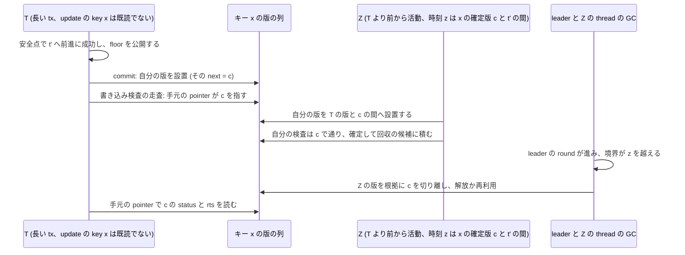
```mermaid
sequenceDiagram
  participant T as T (長い tx、update の key x は既読でない)
  participant L as キー x の版の列
  participant Z as Z (T より前から活動、時刻 z は x の確定版 c と t′ の間)
  participant G as leader と Z の thread の GC
  T->>T: 安全点で t′ へ前進に成功し、floor を公開する
  T->>L: commit: 自分の版を設置 (その next = c)
  T->>L: 書き込み検査の走査: 手元の pointer が c を指す
  Z->>L: 自分の版を T の版と c の間へ設置する
  Z->>L: 自分の検査は c で通り、確定して回収の候補に積む
  G->>G: leader の round が進み、境界が z を越える
  G->>L: Z の版を根拠に c を切り離し、解放か再利用
  T->>L: 手元の pointer で c の status と rts を読む
```

**読み方。** md_36 §3.2 の列を、時刻の値を記号にして描いた。stock と構成 C では T の floor が開始時の値のままなので、境界は T の floor を越えず、Z の版は回収の根拠にならない。
構成 E では T が floor を t′ − 1 へ上げているので、境界が z を越えうる。成り立つには、T が c を指してから c の rts を読むまでの間に leader の round が少なくとも 2 つ進む必要がある。
`REUSE_VERSION=1` では、切り離された版は別の書き込みに作り直され、T はその版を見て、他人の PENDING を待つ・rts 0 で通る・next の空 pointer を辿る、のどれにもなりうる (md_36 §3.2)。
md_26 の条件 RA は外部 read だけを縛り、commit の書き込み検査の走査は縛らないので、RA を満たす計測の workload でもこの列は残る (md_36 §3.3)。

**(b) 境界の読みと開始 floor の条件 FS-b。** 構成 E では、前進の成功で thread の floor が上がり、同じ thread の次の tx の begin が無条件に floor を書き直すので、thread の単位で floor が下がる。
leader の集計は非原子的なので、前の tx の高い floor を読んだまま新しい tx の低い floor を読まずに境界を公開しうる (md_36 §4.2)。試作では thread 0 が長い thread にならず前進しないので害の列は作れなかったが、
どの thread も前進しうる一般の構成 E では、既読版が回収される列 G1 が完成する (md_36 §4.4)。**thread 0 の抑えは試作の構成に偶然ある性質で、構成 E の規則ではない** (D2326 項 3)。

**(c) 時刻の重複 (A2)。** stock の時刻生成は同じ thread の続く 2 つの tx に同じ時刻を返しうる。前進しない begin は stock の生成器を使うので、C・E も同じである (md_36 §5)。

**修理と、その結果の待ち。** (a) を再現して最小の修理を入れる md_39 は**起点で未着地**である。md_36 §6 の直し方の候補のうち「書き込み key を持つ tx は floor を公開しない」を採ると、md_14・md_21・md_31 の長い tx (1 update を持つ) は前進の対象から外れ、
確認段 S2 の cell で E_sp と E_hb が同じ動きになりうる。評価計画はこの場合に S2 をこの形で発効しないことを結果の前に登録した (草稿 §16.2、D2332 項 3)。
**過去の計測値は当時の観測として残す** (規律 7、D2326 項 5)。弱まるのは「実装が定理 G・S の前提を満たした」「早すぎる回収は無かった」という解釈だけである。

**論文に書ける文 (D2326 項 2):** 「抽象仕様について定理が成り立つ」「stock の書き込み検査は W* の局所手順に対応する」「計測した待機型の tx では、構成 E は確認に成功した後にだけ公開し、公開の後に読まない」。
**書けない文:** 「実装・試作は論証の仮定を満たす」「構成 E の Cicada は GC 安全 / serializable」。

### 3.4 順序の各段が要る理由と、実物で起きた破れ

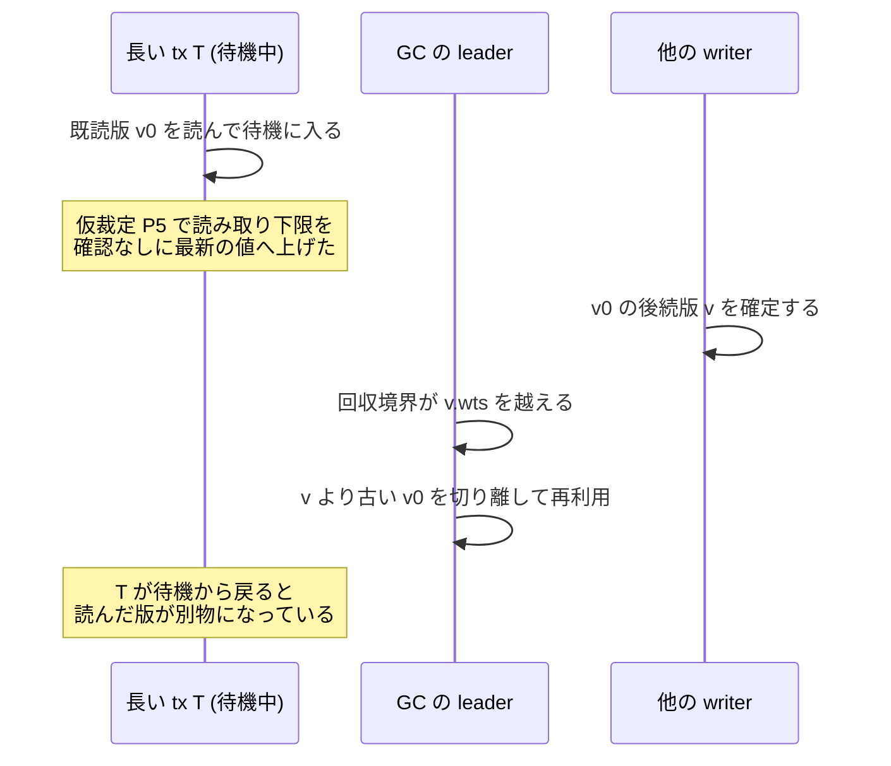
```mermaid
sequenceDiagram
  participant T as 長い tx T (待機中)
  participant G as GC の leader
  participant W as 他の writer
  T->>T: 既読版 v0 を読んで待機に入る
  Note over T: 仮裁定 P5 で読み取り下限を<br/>確認なしに最新の値へ上げた
  W->>W: v0 の後続版 v を確定する
  G->>G: 回収境界が v.wts を越える
  G->>G: v より古い v0 を切り離して再利用
  Note over T: T が待機から戻ると<br/>読んだ版が別物になっている
```

**読み方。** md_14 の試作の途中で、安全点で読み取り下限を最新の MinWts − 1 へ上げる仮裁定 P5 を入れたときに実際に起きたこと (md_14 §3.3)。
保持版検査 (待機の開始で既読版の pointer・wts・status を控え、終わりに照合) で E-hb 3,938 件中 159 件、E 3,882 件中 174 件が変わっていた。修正の後は全計測・全検査で 0 件になった。
**判定器にはこの誤りが見えない** — md_33 が同じ型の誤りを人為的に入れた版でも、判定器の結果は巡回 0 だった (§3.7)。

| 段・規則 | 証明のどこで使うか (md_26 §7) | 崩すと何が起きたか |
|---|---|---|
| rts を上げてから観測し直す | 補題 2 | UG3 + O1 で閉路の反例 38 step (md_10) |
| 確認が全部成功してから確定する | 公開する時刻に全既読版が見えている (補題 1) | E-now の壊し: 既読不一致を無視して前進させると、保持版の変化 1,484・1,649 件、判定器の巡回は 0 (md_21 §5) |
| 確定の後に、成功したときだけ公開する (PUB) | (I1)(I2) の保存 | UG1・U3a で GC 違反 (md_10・md_4) |
| floor を確認なしに上げない (PUB) | (I2) の「floor が上がった場合」が直前の確認に結び付く | **P5** (上の図、md_14)。md_33 の壊し B も同じ型 |
| 公開した floor より古い時刻へ戻らない | (I1) の取り消しの場合 | UF1 で GC 違反 (md_10) |
| floor を上げる確認を始めた後は読まない (RA) | 最後の確認が全既読版を覆う | 列 X1・X2 (紙の上、探索していない) |
| 後続の確定版を根拠に回収する (RC) | 補題 R | U4 で GC 違反 (md_4) |

**早い abort の判定 D の健全性 (md_31 §3.1、D2320)。** key ごとの物理的な版の列・GC の切り離しと再利用・前進・validation を持つ小モデルで、「D が真になった状態から到達する全状態で、その tx の validation の既読検査が成功しない」を調べた。
2 tx の全列挙 115 状態と 3 tx の予算内列挙 1,446 状態で違反なし、壊した判定 2 種 (pending を含める・既読版自身を含める) は validation 成功までの反例を出した。**有限の範囲での確認であって証明ではない。**
実機の shadow 照合 (「D が真だったのに commit」= 0) は、壊した判定が実機で到達しなかったので検出力を示せず、健全性の証拠に数えない (D2320 の却下理由)。

### 3.5 直列化の論証 (md_13) と、その仮定の実装での状態 (md_36)

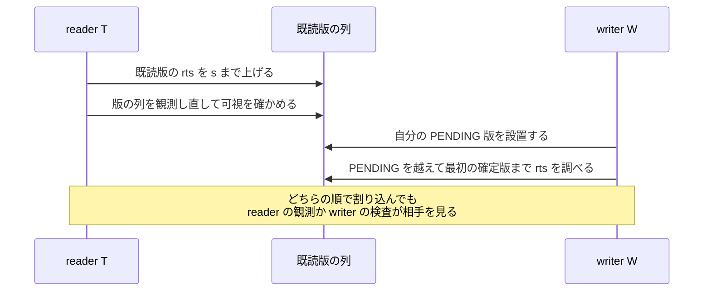
```mermaid
sequenceDiagram
  participant R as reader T
  participant V as 既読版の列
  participant W as writer W
  R->>V: 既読版の rts を s まで上げる
  R->>V: 版の列を観測し直して可視を確かめる
  W->>V: 自分の PENDING 版を設置する
  W->>V: PENDING を越えて最初の確定版まで rts を調べる
  Note over R,W: どちらの順で割り込んでも<br/>reader の観測か writer の検査が相手を見る
```

**読み方。** md_13 の論証の芯である 2 つの順序。**論文に書ける一文 (md_13 §0 の趣旨):** 固定キー集合への point read / update だけ、逐次一貫なメモリと md_4 の原子性の下で、md_4 仕様 v1 (R9′ を含む) に従う tx について、
commit 時の検証を通って確定した tx の依存グラフ (ww / wr / rw) は閉路を持たず、確定時刻の順がそのまま直列化の順になる。ただし仮定 A1〜A11 を前提とする。対象は小モデル仕様 v1 で、実装にも試作にも届かない (D2292)。

| 仮定 (md_36 §2) | 手順 (コードの順序・形) | 保証 (定理が使う性質) | 補足 |
|---|---|---|---|
| A1 逐次一貫、版の列の原子的な観測、R9′ の走査は 1 step | 満たさない | 満たさない | 実装向けの置換補題が要る (md_36 §8 の N4) |
| A2 異なる tx は同じ時刻を持たない | — | **満たさない** | 同じ thread の続く 2 つの tx が同じ時刻を持ちうる。確かめた経路では空振りの abort になり、閉路の完成列は作れていない (md_36 §5) |
| A5 確認は rts を上げてから観測し直す | stock の commit と構成 E は満たす。**構成 C の前進は満たさない** (rts を上げない) | 記憶順序と寿命は別 | 構成 C は commit で全既読を最終時刻で検証し直すので、md_13 の系 6 の範囲では結論に効かない |
| W* (設置の後に降順に走査、待機の後に status を読み直す) | **満たす** | **到達と寿命は満たさない** | 並行する GC の切り離しと再利用。構成 E では論理的にも崩れる (§3.3 の (a)) |
| A7 rts は max で更新され減らない | 満たす | 版の再利用をまたいでは満たさない | 再利用で同じアドレスの rts が 0 に戻る |
| A10 途中入場なし | 満たさない | — | md_26 が FS-a/b/c に置き換えた |
| 記憶順序 | — | **判定できない** | x86 では除かれる見込みだが、対象バイナリの命令列は確かめていない |

**論文に書ける文 (md_36 §0.1):** 「stock Cicada の書き込み検査は、条件 W* の局所手順に対応する。並行する回収の下での到達と参照の寿命は示していない。」**書けない文:** 「stock・C・E は論証の全仮定を満たす」。

### 3.6 実物の判定器: 範囲と結果 (上限は indeterminate のまま)

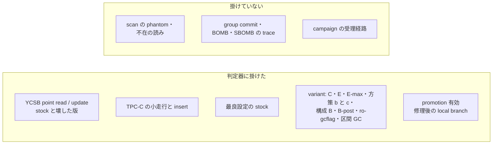
```mermaid
flowchart LR
  subgraph done["判定器に掛けた"]
    y["YCSB point read / update<br/>stock と壊した版"]
    t["TPC-C の小走行と insert"]
    bc["最良設定の stock"]
    vars["variant: C・E・E-max・方策 b と c・<br/>構成 B・B-post・ro-gcflag・区間 GC"]
    pr["promotion 有効<br/>修理後の local branch"]
  end
  subgraph not["掛けていない"]
    sc["scan の phantom・<br/>不在の読み"]
    gcm["group commit・<br/>BOMB・SBOMB の trace"]
    camp["campaign の受理経路"]
  end
```

**読み方。** 左が一次資料で判定器に掛けたもの、右が掛けていないもの。判定器は Cicada に対して「巡回があれば non-serializable、無ければ indeterminate」しか返さない (md_3 §1 項 5)。

| 何を | 結果 | 出所 |
|---|---|---|
| stock の YCSB point read / update | 7 走行すべて巡回 0。壊した Cicada 3 本は巡回として検出・帰属 | md_3 §1・§4 |
| stock の TPC-C 小走行と insert | 5 走行すべて巡回 0。insert を壊した版を orphan read として検出 | md_17 §1 |
| 比較相手の最良設定の stock | 32 run で巡回 0。inline slot の版を 3 点で比べ 35 run すべて食い違い 0 | md_20 §1・§3 |
| C・E・E-max・構成 B・ro-gcflag の各 variant | すべて巡回 0 (md_6 10 走行、md_14 10 run、md_21 6 cell、md_23 15 走、md_22 24 走) | 各資料の正しさの節 |
| 方策 b・c と shadow | 8 run すべて巡回 0、保持版の変化 0 | md_31 §7 |
| B-post (K=1・8) と B と stock | 5 腕 × 3 cell で巡回 0、2 つの build で 2 回ずつ同じ。壊し 4 本 (post 用 B1・B2、隣接確認を外した stale-gap、B2 の計器版) は 2 cell ずつ巡回として検出・帰属 | md_37 §4 |
| 区間 GC の試作 | 正常 3 腕の 30 走行で巡回 0。事前登録の壊し正例 (長い read-only tx の cell) は剪定 0 で発火せず不成立 | md_18 §5、D2324 |
| 修理後の CCBench の Cicada (promotion 有効の 8 genome) | YCSB 32 走行と TPC-C 16 走行で巡回 0。修理 1 だけを外した壊しは巡回 308 を検出 | md_32 §6・§7 |

**注意。** どれも小規模・短時間の走行で、主比較の条件そのもの (tuple 100 万・48 thread・3 秒) ではない。

### 3.7 中間案 M の照合が実装された (md_33、D2336)

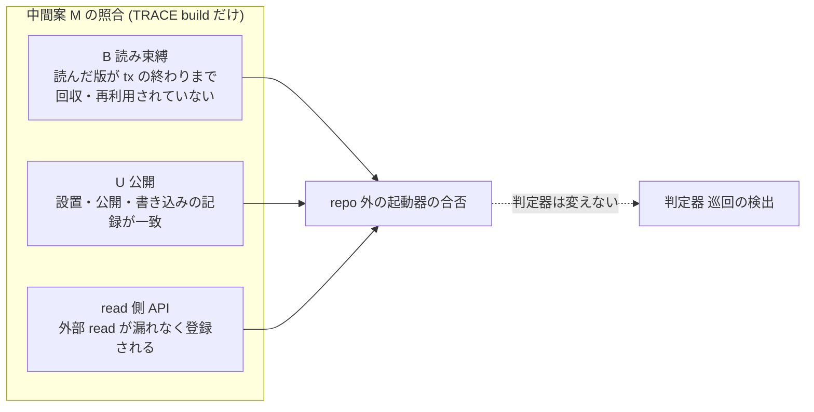
```mermaid
flowchart LR
  subgraph MCHK["中間案 M の照合 (TRACE build だけ)"]
    b["B 読み束縛<br/>読んだ版が tx の終わりまで<br/>回収・再利用されていない"]
    u["U 公開<br/>設置・公開・書き込みの記録が一致"]
    api["read 側 API<br/>外部 read が漏れなく登録される"]
  end
  b --> launch["repo 外の起動器の合否"]
  u --> launch
  api --> launch
  launch -.判定器は変えない.-> ver["判定器 巡回の検出"]
```

**読み方。** 中間案 M (D2305 項 4) は、既存の out-of-tree 計装の上に重ねる `patches/instr-cicada-trace-m.patch` が `#if TRACE` の内側だけに 3 つの照合を足し、合否を repo 外の起動器が決める形で実装された (md_33 §1・§3)。判定器・campaign・既存 patch は変えていない。

- **範囲: 最良設定 (`INLINE_VERSION_OPT=1`、promotion 0) を含めた** (D2336 項 1)。3 版目が「M の対象 (OPT=0) と比較相手の最良設定 (OPT=1) が食い違う」と書いた限定は、この判断で解けた。inline slot の返却・再取得も照合の事象に数え、最良設定の run で 5,648〜2,681,878 件起きた (既定設定では 0、md_33 §2)。
- **負例 (通るべき):** stock の既定設定と最良設定、E-max の全 18 run (異なる条件は 16) で、巡回 0・integrity の数値項目 0・C 行 = commit 数・M の違反 0 (md_33 §5)。
- **正例 (落ちるべき):** 人為的に入れた誤り 3 種を M が検出し、壊した tx に帰属した。既読版の早すぎる回収 (P5 型) は既定設定で `B_RETIRED` 3,273 件、最良設定で 3,715 件、公開の記録漏れは `U_MISSING_W` 1 件、読みの登録漏れは `API_EXTERNAL` 1 件。
  **3 本とも判定器の結果は巡回 0 の indeterminate で、判定器だけでは見えなかった** (md_33 §4)。
- **TRACE=0 の命令列は pin と一致した** (4 target × 2 genome と E-max の 2 組、md_33 §6)。

**論文に書ける文 (md_33 §7 の逐語の要点):** 「TRACE ビルドで、生存中の tx が読んだ版が、登録から tx 終了まで回収・再利用されていないこと、`cpv()` が公開した版・設置した版・記録した書き込みが一致すること、外部の読みが read set に漏れなく登録されることを全 tx で照合し、
stock の既定設定と最良設定、および forwarding と GC 接続の試作 (E-max) の 18 run で違反は 0 だった。これらの照合は、早すぎる回収・公開の記録漏れ・読みの登録漏れを人為的に入れた版で発火し、その 3 種はいずれも巡回の検査では見えなかった。」

**限定 (md_33 §7・§9):** 範囲は YCSB の point read / update、`REUSE_VERSION=1`、`group_commit=0`、promotion なし。検査は各条件 1 秒の run で、主比較の条件そのものではない。版を選んだ瞬間から登録までの窓で同じ object が同じ key の別の確定版として再利用された場合は、その版の読みとして記録される。
API 照合のうち発火を確かめたのは外部 read の登録漏れだけで、U の設置と公開の照合の発火も未確認である。**izanagi 内部では certified と呼ばない。**

**性能値の地位 (D2305 項 4 (2))。** M の照合を満たした設定の TRACE=0 build の測定値は「照合の中身を明記した測定値」として論文で扱ってよい。M の範囲の設定 (既定・最良の stock、E-max の検査 cell) はこの wave で照合を満たした (md_33 §7)。
**ただし起点で、主比較の性能値と M の照合を結び付けた記録は無い。** 構成 E の修理版 (md_39) と S2 の門 (§10) が M を重ねる予定で、草稿 §16.4 は M の違反も門の失格の条件にすると登録した。

---

## 4. U1: cold に入りそうなときだけ前進する (構成 C) — 実在するが、差は見えない

### 4.1 試作した読み取りの判断 (md_6)

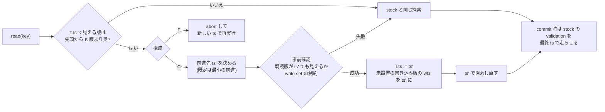
```mermaid
flowchart LR
  r["read(key)"] --> pos{"T.ts で見える版は<br/>先頭から K 版より奥?"}
  pos -- いいえ --> stock["stock と同じ探索"]
  pos -- はい --> pol{"構成"}
  pol -- F --> ab["abort して<br/>新しい ts で再実行"]
  pol -- C --> tgt["前進先 ts′ を決める<br/>(既定は最小の前進)"]
  tgt --> chk{"事前確認<br/>既読版が ts′ でも見えるか<br/>write set の制約"}
  chk -- 失敗 --> stock
  chk -- 成功 --> fwd["T.ts := ts′<br/>未設置の書き込み版の wts を ts′ に"]
  fwd --> reread["ts′ で探索し直す"]
  reread --> val["commit 時は stock の validation を<br/>最終 ts で走らせる"]
  stock --> val
```

**読み方。** md_6 の試作 (`patches/cicada-forwarding-variant.patch`、D2287) の流れ。物理的な hot は作らず、「先頭から K 版より奥を辿る必要がある」read を発火条件にした (論理 K 境界)。これが U1 (cold への進入を前進の契機にする) の実物である。
前進は read 相だけで行い、最終保証は stock の validation を最終 ts で走らせることに置く。**GC の保護は旧 ts のまま据え置く** — 構成 C は floor を公開しないので、単独では回収境界を動かさない (md_6 §2)。
前進は `!is_ronly_` の tx だけで、read-only の tx は前進しない (md_44 §2)。F は同じ発火条件で abort して再実行する対照である。


**読み方 (md_6 の図)。** 行 = workload、列 = (1) C の成功率と試行数、(2) 試行の内訳と試行前の除外、(3) stock 比の throughput、(4) 長い thread の commit と F の abort。
**この図の土台は CMake 既定の Cicada で、md_11 の最良設定ではない** (最良設定の上の値は §4.3)。計数は各セル 1 rep。

| 観測 (md_6 §1・§5、48 thread・100 万件・zipf 0.9・K=3、CMake 既定の Cicada) | 値 |
|---|---|
| 通常の YCSB で C の発火 / 試行 / 成功率 | 発火 3,489〜6,167 回・試行 1,131〜2,069 回、成功率 0.73〜0.75 |
| 1,000 操作の長い thread を含む型 | 成功率 0.18〜0.19。失敗の大半は既読の版が前進先で見えない (既読不一致) |
| 読み取り後に待つ型 | 待機中は read が無いので構造上発火しない |

### 4.2 前進先の方策: 構成 C は最小の前進のまま (md_21、D2315)

```text
時刻  →   t1    t2    t3    t4    t5    t6    t7    t8
既読 A    [===========================)                  A の見える区間 [t1, t6)
B の版          B@t2        B@t4  B@t5        B@t7  B@t8
                └── cold ──┘      └──────── hot ─────────┘
T の現在              ^t3

固定          : t3 のまま → B@t2 を読む          → cold を辿る
今へ前進      : t8 へ進む → B@t8 を読む          → A が見えない (t8 は [t1, t6) の外)
最小の前進    : t5 へ進む → B@t5 を読む          → A も見える (t5 は [t1, t6) の中)、cold を避けられる
区間内の最大  : t6 の手前へ進む → B@t5 を読む    → A も見え、時刻はより新しい
```

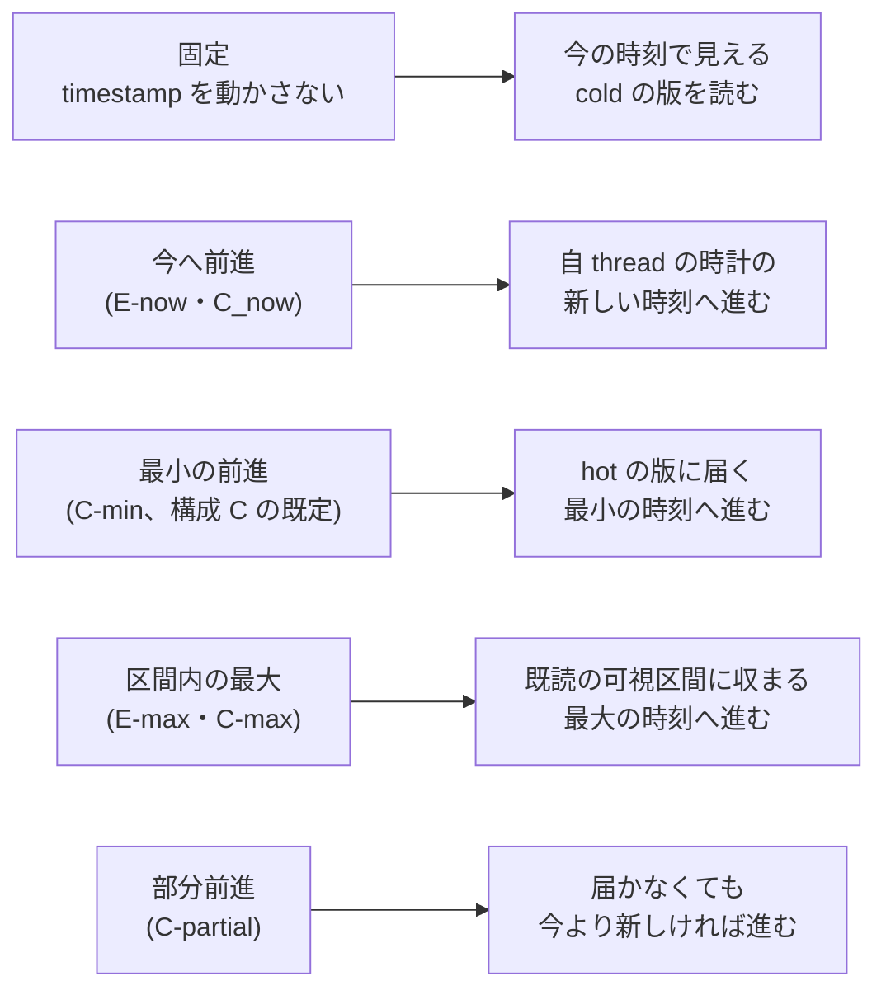
```mermaid
flowchart LR
  fixed["固定<br/>timestamp を動かさない"] --> r1["今の時刻で見える<br/>cold の版を読む"]
  now["今へ前進<br/>(E-now・C_now)"] --> r2["自 thread の時計の<br/>新しい時刻へ進む"]
  mn["最小の前進<br/>(C-min、構成 C の既定)"] --> r3["hot の版に届く<br/>最小の時刻へ進む"]
  mx["区間内の最大<br/>(E-max・C-max)"] --> r4["既読の可視区間に収まる<br/>最大の時刻へ進む"]
  pt["部分前進<br/>(C-partial)"] --> r5["届かなくても<br/>今より新しければ進む"]
```

**読み方。** md_21 が比べた前進先の方策 (D2315) を、記号の例に並べた。例の上の帰結であって一般の性質ではない。**「最新でない hot 版を選べる」こと自体は新規性にならない** — SI-STM (2006) と CockroachDB の read refresh (2020) が既に持つ (md_9 §5、§11)。
版 v が見える区間を I(v) = [b(v), e(v)) と書くと、既読の集合 R_T が同時に見えうる区間の上限は U_T = min e(v) で、E-max・C-max はこの手前を目標にする (md_21 §2)。**これは read 集合の整合性の条件であって、更新 tx 全体の commit 条件ではない。**

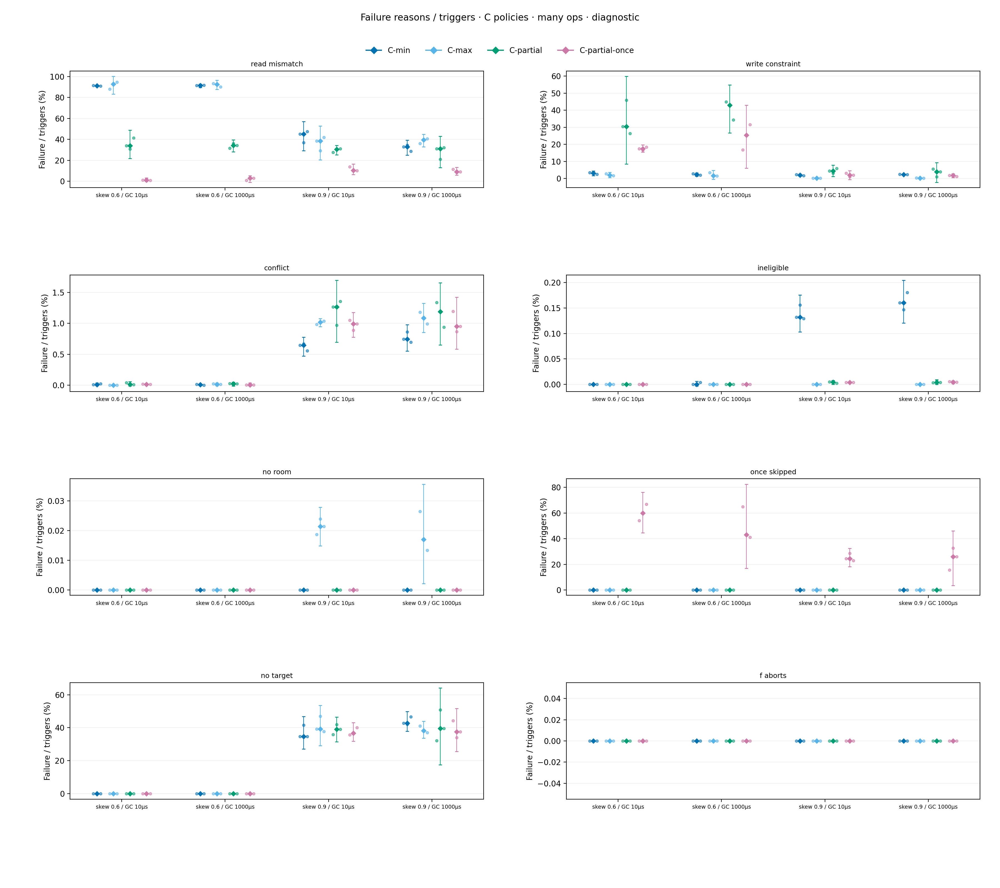

**読み方 (md_21 の target-policy-c-reasons)。** C 腕の失敗理由ごとの回数 / 発火 (%)。C-min と C-max は既読不一致が 90% 前後 (skew 0.6)、C-partial は既読不一致が 30% 台に下がる代わりに書き込み制約が 30〜43% に増える。


**読み方 (md_21 の target-policy-many-ops)。** 上 = 長い thread の成功 / 発火、中 = 通常 thread の成功 / 発火、下 = 長い tx の完了率 (stock・C の各方策・F)。

| many_ops・GC 10 µs (md_21 §4.4、rep 中央値) | 長い thread の成功 / 発火 (C-min / C-max / C-partial) | 長い tx の完了率 (stock / C-min / C-partial / F) |
|---|---|---|
| skew 0.6 | 0.050 / 0.048 / **0.320** | 0.00008 / 0.00022 / 0.00018 / 0.00002 |
| skew 0.9 | 0.009 / 0.012 / **0.048** | 0 / 0 / 0.00002 / 0 |

- C-max は C-min と同じ成功集合を持ち、C-partial だけが長い thread の成功率を上げた (md_21 §1 項 4)。
- **操作数型 (1,000 操作) の長い tx の完了率はどの腕でも 0.0003 以下で、成功率の向上は完了に結び付いていない。** 「C-partial が長い tx を救う」とは書かない。区間 GC の試作の計測でも、many_ops の長い tx は 3 秒あたり試行 1.7 万〜29 万回に対し commit 0〜1 回だった (md_18 §7)。
- D2315 は、C の既定を最小の前進のまま置き、C-max は採らず、C-partial は完了率が上がらない限り既定にしない別腕とした。

### 4.3 throughput: stock と差が見えない (md_21)

| cell (md_21 §4.5、md_11 の最良設定の上、3 rep の中央値の stock 比) | C-min | C-partial | F |
|---|---|---|---|
| many_ops・skew 0.6・GC 10 µs | 0.988 | 0.985 | 0.981 |
| many_ops・skew 0.9・GC 10 µs | 1.017 | 0.688 | 0.212 |
| many_ops・skew 0.9・GC 1 ms | 1.008 | 0.996 | 0.380 |
| normal・skew 0.9・GC 10 µs | 1.033 | 1.024 | 0.301 |
| normal・skew 0.9・GC 1 ms | 1.043 | 1.024 | 0.493 |

- C-min は全体で stock 比 0.97〜1.04。**実行コードが同じ腕の間でも 0.97〜1.04 揺れる**ので、この幅の内側と読む (md_21 §4.5)。
- F は skew 0.9 で 0.21〜0.49、skew 0.6 で 0.98〜1.00。原因を資料は「BACK_OFF=0 で abort 後すぐ再実行するから」と推定している (未検証)。

**この節から言えること。** U1 の実物 (構成 C) は、最良設定の上で stock と throughput の差が見えない。修正済みの最良 Cicada との直接比較は md_42 (起点で稼働中) が測っている。U1 を論文に残すなら (D2322 項 1)、その価値は throughput ではなく、構成 D (hot の外れで前進し GC へ反映) の契機として示す必要があるが、構成 D は未実装である。

---

## 5. hot 配置 (H1): 書き込み側の費用は外せたが、読みの利得は出ていない

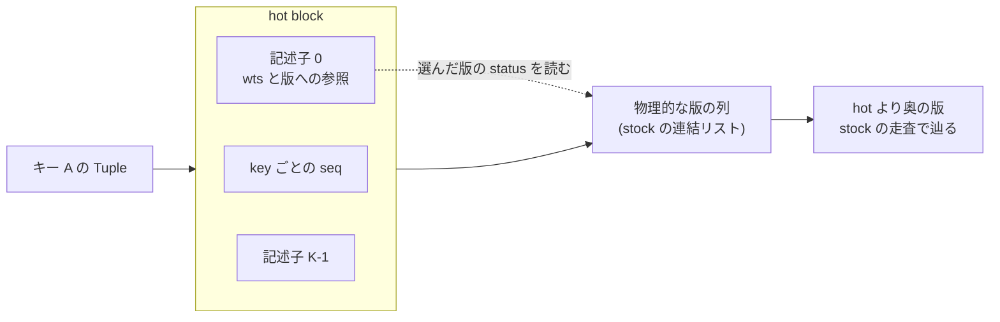
```mermaid
flowchart LR
  key["キー A の Tuple"] --> hot
  subgraph hot["hot block"]
    seq["key ごとの seq"]
    d0["記述子 0<br/>wts と版への参照"]
    dk["記述子 K-1"]
  end
  hot --> list["物理的な版の列<br/>(stock の連結リスト)"]
  d0 -.選んだ版の status を読む.-> list
  list --> cold["hot より奥の版<br/>stock の走査で辿る"]
```

**読み方。** key ごとに版の列の手がかり `{wts, Version*}` を K 件以下だけ連続に置く構造 (仮称 VHash の hot block)。md_23 はこれを「物理列の先頭 min(K, 長さ) 件の正確な写し」として key ごとの seqlock で保ち (D2311)、
md_37 は書き込み側の排他を挿入の CAS の外へ出す設計 B-post に替えた (D2331、§5.4)。**論文の芯ではない** (D2322 項 1)。

### 5.1 深い版探索をするのは誰か (md_2・md_15)

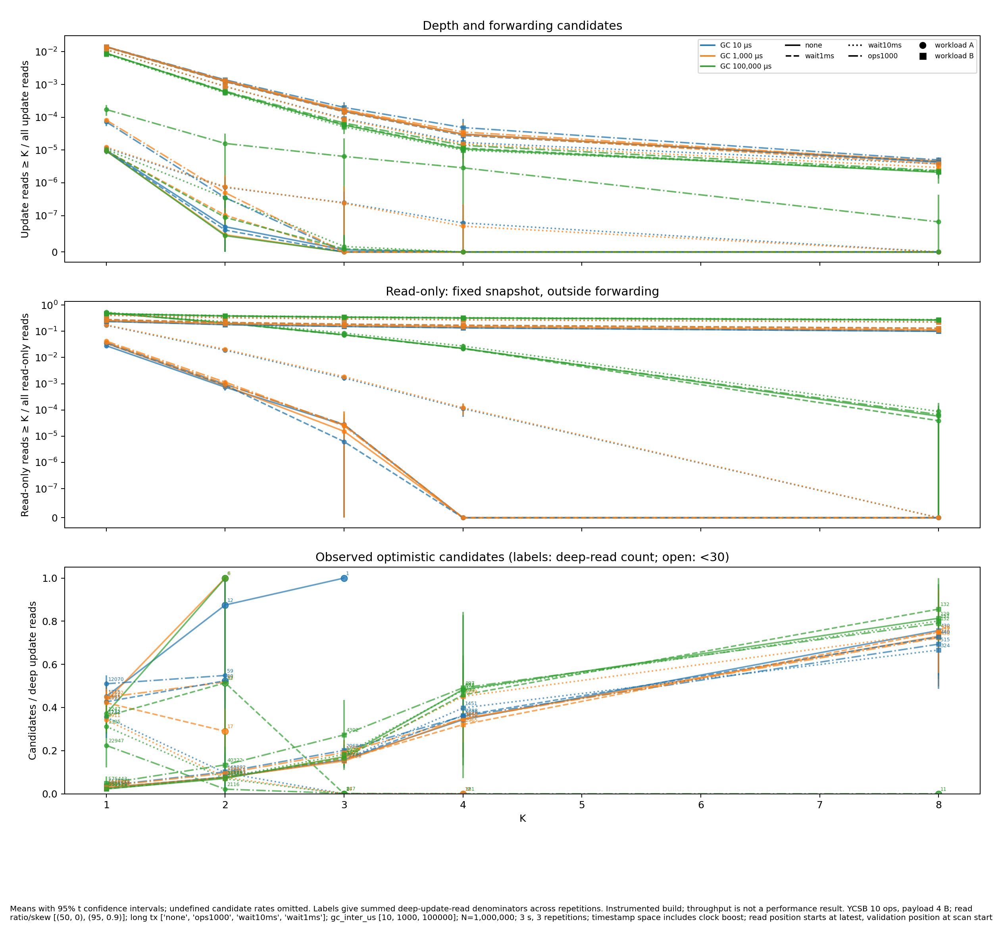

**読み方 (md_2 の図 1)。** 上段 = update tx の読み取りのうち hot 容量 K より奥へ行った割合、中段 = read-only tx の同じ割合、下段 = 深い update read のうち既読を保って前進できる候補があった割合 (観測時点の楽観値)。
**言えること:** update tx の深い探索は少なく (workload B で位置 ≥ 1 が約 0.9〜1.4%)、read-only read は 24〜48% が位置 ≥ 1 である (md_2 §0)。**言えないこと:** 計器入り build の観測で、性能や forwarding の成功率ではない。

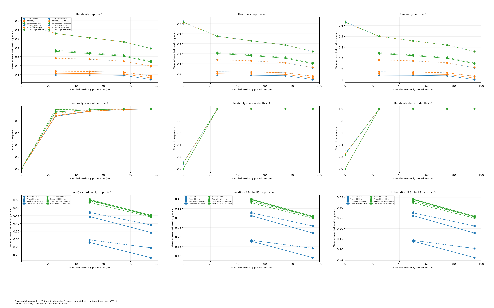

**読み方 (md_15 の図 1)。** read-only read が位置 ≥ 1 へ行く割合と、深い read に占める read-only の割合を、ro 指定率・長い tx の型・GC 間隔ごとに並べた。
**言えること (md_15 §0 項 1):** ro 指定率 25% 以上の全条件で、位置 ≥ 1 の read の 87〜100% が read-only 由来、位置 ≥ 4 が観測された条件では 99.4〜100%。**言えないこと:** 割合は深い read の総量が小さい条件 (skew 0) も含む。

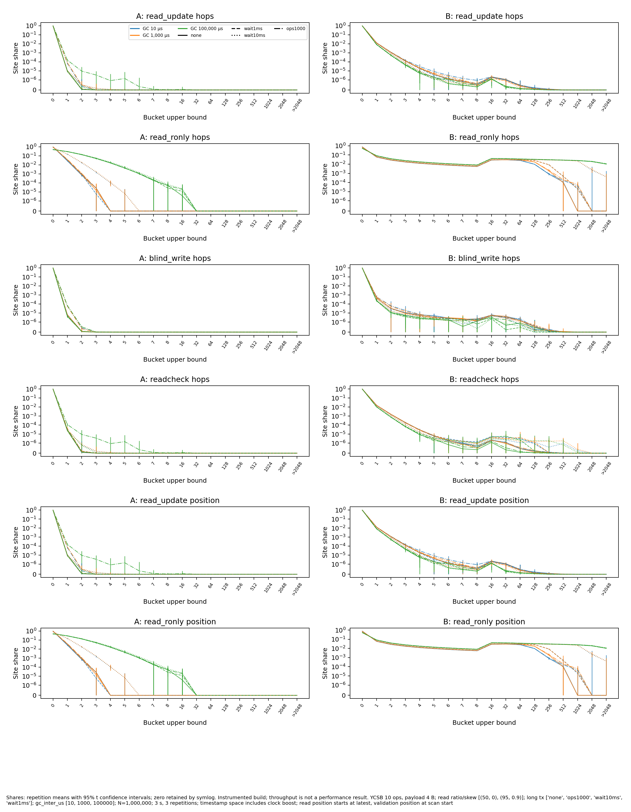

**読み方 (md_2 の図 2)。** site ごとの、stock の走査が `next` を辿った回数と、選んだ版の位置の分布。9 以上は bucket 幅が広がるので、「16」の段差は bucket 幅によるもので分布の山ではない (md_2 §8)。

**伸びしろの上限 (md_29 §0 項 3、計器入り build の機会量)。** 全 read の位置 ≥ 1 の割合 h1 は、長い read-only tx を 1 worker が続ける batchR で 0.51〜0.53、read-only 指定率 50・95% で 0.49〜0.52。
update read の位置 ≥ 1 の割合 u1 は、最良設定・長い tx なしで skew 0.99 のとき 0.10〜0.22。一方で位置 ≥ 8 はまれで、層 S の batchR 以外では最大 0.027 だった。**これは機会の大きさであって、hot 配置を実装したときの効果ではない。**


**読み方 (md_29 の axes_h1)。** 層 O (強さ 2 の直交表) で、因子の水準ごとに H1 の伸びしろの指標の中央値 (各水準 18 点) を並べた主効果の図。長い tx は batchR の側、read-only 指定率は 50・95% の側で h1 が大きい (default で h1 0.53 対 0.20、0.52 対 0.15、md_29 §3.3)。
**言えないこと:** 主効果は他因子について釣り合っているが、2 因子交互作用とは分離できない (md_29 §3.3)。計器入り build の観測量で、機構の効果ではない。

### 5.2 Cicada の外: 連続に置くと速い (md_5)

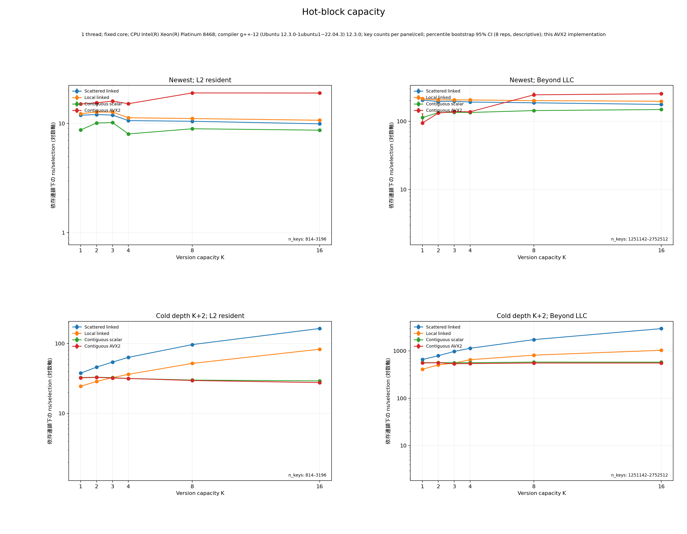


**読み方 (md_5 の fig-k・fig-depth)。** 1 キー分の版選択を、トランザクション処理から切り離して 1 thread・固定 core・依存連鎖の latency で測った。fig-k は K ごとの最新版と cold の深さ K+2、fig-depth は K=8 で目的の版の深さを 0 から 12 まで動かした (深さ 8 が hot と cold の境界)。

| 観測 (md_5 §0、中央値) | 値 |
|---|---|
| LLC 外の最新版選択、連続配置 scalar ÷ 散在 linked | 0.55〜0.84 倍 (K=1: 113 ns 対 204 ns、K=16: 149 ns 対 176 ns)。L2 内でも 0.73〜0.87 倍 |
| K=8・LLC 外で深さ 0→7 | 散在 linked 187→1,269 ns、連続配置 scalar 144〜152 ns でほぼ一定 (深さ 7 で散在 linked の 0.12 倍) |

**利益は配置 (連続であること) から来ており、この AVX2 実装の SIMD からは来ていない** (md_5 §0 項 4)。単位は 1 thread の latency で、48 thread の throughput とは直接比べられない。

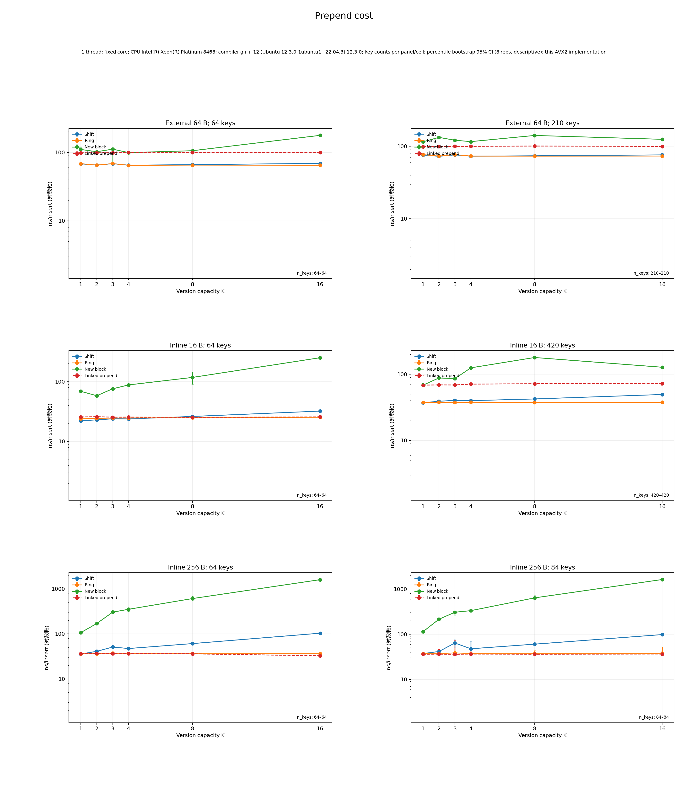

**読み方 (md_5 の fig-write)。** hot block が cache 内にある条件での 1 回の新版挿入の費用。ring buffer は 37〜76 ns/挿入で K にほぼ依存せず、block 差し替えは inline 256 B で 113→1,624 ns。並行する書き手の間の排他の費用は測っていない (md_5 §6)。

### 5.3 Cicada の中・最初の設計点 B: 書き込みで大きく遅れた (md_23)

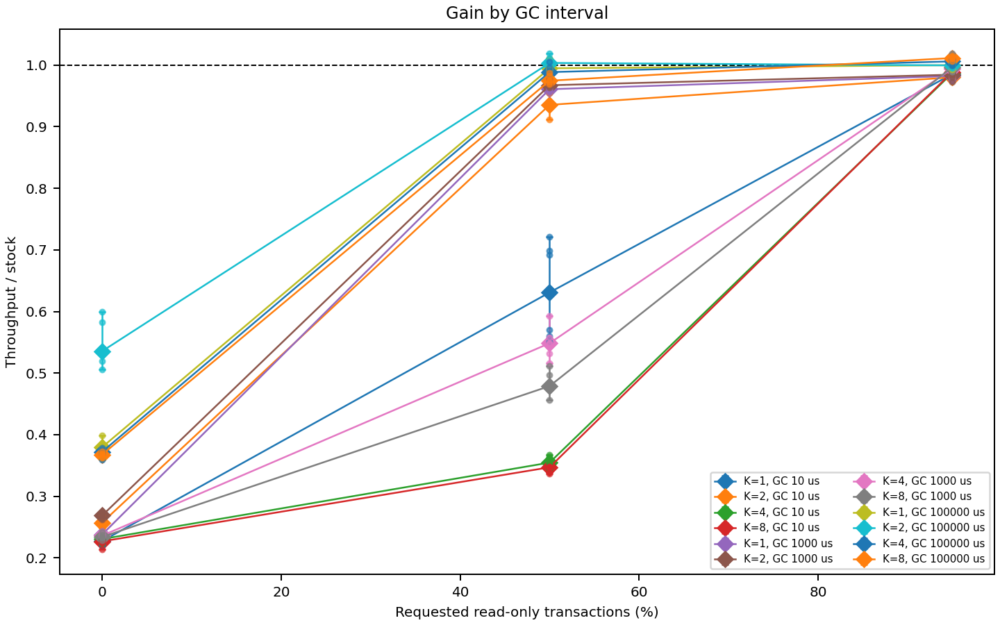

**読み方 (md_23 の fig-ro)。** 横軸 = ro 指定率 (0・50・95%)、線 = K × GC 間隔、縦軸 = 同じ round の stock 比。**ro 比率の因果効果を示す図ではない** (ro 比率で update 数・版生成・abort も変わる、md_23 §5)。

| cell (md_23 §5、K/stock の 6 round 中央値) | K=1 | K=2 | K=4 | K=8 |
|---|---|---|---|---|
| ro95・GC 10 µs | 0.985 | 0.980 | 0.987 | 0.989 |
| ro95・GC 100 ms | 1.000 | 0.999 | 1.006 | 1.011 |
| rr95 | 0.978 | 0.978 | 0.957 | 0.927 |
| rr50 | 0.229 | 0.262 | 0.231 | 0.229 |
| ro0・GC 10 µs | 0.227 | 0.257 | 0.231 | 0.227 |

- 評価計画の草稿 v1 §5.5 の語では、ro 95% の 12 組すべてが「予備的に不支持 (差なし)」、ro 0%・rr5・rr50 の全組と ro 50% の一部が「予備的に不支持 (悪化)」、rr95 の K=8 が「判定不能」、主 cell が「欠測」である。md_34 の独立の再計算も全 48 組で一致した (草稿 §15.4)。
  **A/A 腕が無いので、仮に効いていても「予備的に支持」の語は出なかった。** 「差なし」を「効果は 10% 未満」とは書かない。
- **K\* = 1** (D2325 項 2): 選択に使う cell (ro 95%・GC 10 µs) で全 K が最大の K=4 と同点だったので、規則により最小の K。K=1 が最良という意味ではない。
- 上がらなかった理由として md_23 が計器の数から挙げたのは (a) 深い読みが hot より奥に多い、(b) 浅い読みは元々速い、(c) hot を保守する key ごとの排他の**待ち**が 1 update commit あたり約 9.8 万〜11.8 万サイクル、の 3 点である (因果の内訳ではない、md_23 §1 項 4・§6)。

### 5.4 Cicada の中・設計点 B-post: 書き込み側の待ちは消えたが、読みの利得は出ていない (md_37)

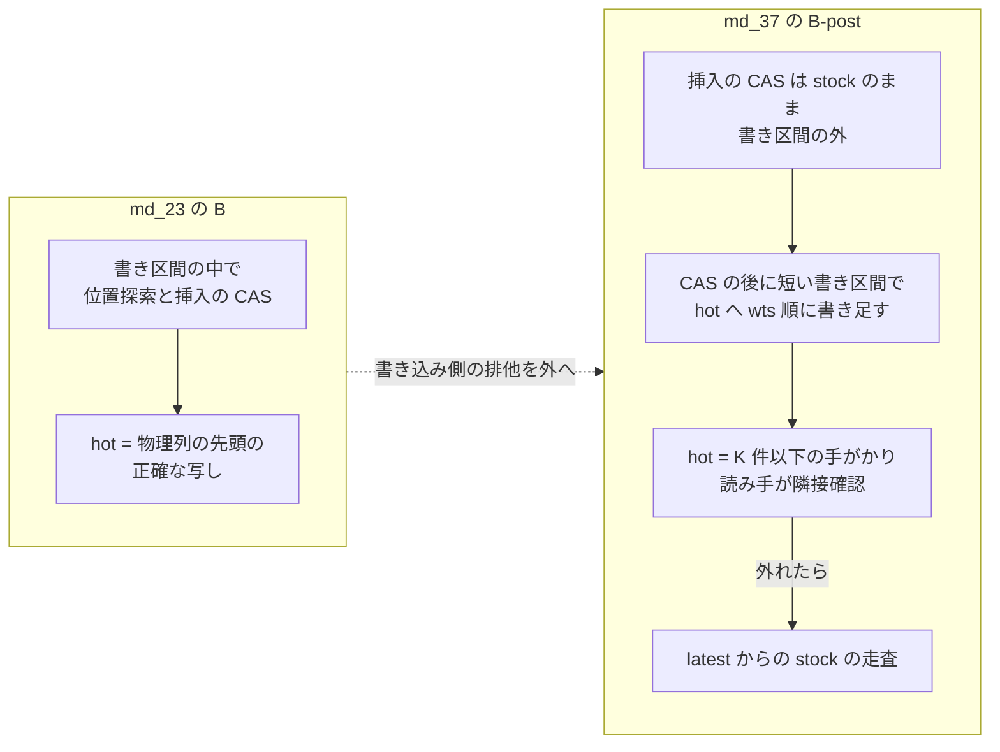
```mermaid
flowchart LR
  subgraph B["md_23 の B"]
    b1["書き区間の中で<br/>位置探索と挿入の CAS"] --> b2["hot = 物理列の先頭の<br/>正確な写し"]
  end
  subgraph P["md_37 の B-post"]
    p1["挿入の CAS は stock のまま<br/>書き区間の外"] --> p2["CAS の後に短い書き区間で<br/>hot へ wts 順に書き足す"]
    p2 --> p3["hot = K 件以下の手がかり<br/>読み手が隣接確認"]
    p3 -->|外れたら| p4["latest からの stock の走査"]
  end
  B -.書き込み側の排他を外へ.-> P
```

**読み方。** md_37 の設計 B-post (`patches/cicada-vhash-hot-block-post.patch`、md_23 の variant の上に重ねる overlay、新 macro なし、D2331)。hot の意味を「物理列の先頭の正確な写し」から「列の中の版を wts 降順に並べた K 件以下の手がかり」に弱め、
読み手は選んだ記述子 X について「直前の記述子の `next_` が X か (i = 0 なら `latest_` が X か)」を確かめ、成り立つときだけ X を採る (隣接確認)。**正しさは隣接確認と pointer の生存だけに依存させた** (md_37 §3、証明ではなく stock への帰着)。


**読み方 (md_37 の fig-k)。** 横軸が cell、縦軸が同じ round の比。菱形・丸 (青系) が md_23 の B、四角 (橙) が B-post K=1、三角 (赤) が B-post K=8。**同じ色の 2 本の線は「対 stock」(1.0 付近以下) と「対 B」(1 より大きい) の 2 つの比で、凡例では区別しにくい。** 数は下の表で読む。

| cell (md_37 §5.2、6 round の中央値 [最小, 最大]) | B-k1/stock | post-k1/stock | post-k8/stock | post-k1/B-k1 |
|---|---|---|---|---|
| ro0-gc10 | 0.227 | 0.938 [0.895, 1.046] | 0.664 | 4.177 |
| rr50 | 0.224 | 0.955 [0.912, 1.030] | 0.634 | 4.293 |
| rr5 | 0.694 | 0.991 [0.960, 1.046] | 0.873 | 1.435 |
| ro95-gc10 | 0.977 | 0.977 [0.946, 0.986] | 0.972 | 0.999 |
| ro95-gc100000 | 0.995 | 0.997 [0.997, 1.000] | 1.008 | 1.003 |
| rr95 | 0.979 | 0.979 [0.978, 1.000] | 0.958 | 1.004 |

- **書き込み側の排他の待ちは外れた。** 更新中心の cell の 1 update commit あたりの書き区間の待ちは、B が 109,405〜121,209 サイクル (md_37 §6 の表。同 §1 項 1 は 110,938〜121,209 と書くが、§6 の表の rr50・K=8 の行は 109,405)、B-post が K=1 で 543〜565、K=8 で 1,156〜1,248 サイクル (計器 build、1 走、md_37 §6)。
- **更新中心の cell の stock 比は、K=1 でほぼ stock まで戻った** (0.938〜0.991)。§5.5 の語では、B-post K=1 対 stock は更新中心の 6 cell のうち 5 cell で「予備的に不支持 (差なし)」、ro0-gc10 だけ「判定不能」(md_37 §1 項 2)。
- **K=8 は戻り切らない** (更新中心の 6 cell で 0.634〜0.873、6 cell すべて「予備的に不支持 (悪化)」)。Tuple が 384 byte (K=1 は 256) で書き足しの保持が K=1 の約 4.7 倍で、どちらが主因かは分けていない (md_37 §1 項 3)。
- **読み取り専用 95% の条件では、B も B-post も throughput を変えなかった** (ro 95% の 3 cell と rr95 で全 6 比の中央値 0.939〜1.016、24 組すべて「予備的に不支持 (差なし)」、md_37 §1 項 4)。
- **正しさ:** 5 腕 × 3 trace cell で巡回なし (上限 indeterminate)。隣接確認を外した壊し stale-gap は判定器に巡回として検出され、**隣接確認が遅れた hot の誤読を止めていることの正例**になった (md_37 §1 項 6)。


**読み方 (md_37 の fig-write)。** 上段は更新中心の 4 cell の比。下段は ro0-gc10 の計器 build での 1 update commit あたりの書き区間の**待ち** (紫) と**保持** (緑)。B-post の棒は B に比べて小さく線形軸ではほぼ見えない (数は上の箇条)。


**読み方 (md_37 の md23-fig-write)。** md_23 の集計から現行の作図で生成し直し、md_23 の図が描いていなかった**待ち**を下段に足した (T-2927 (4))。md_23 の dir の図は書き換えていない。

**md_37 の結論の要点 (md_37 §1 項 9):** 構成 B の書き込み側の費用は hot の保守そのものではなく「挿入の CAS を排他の中で行うこと」から来ていた。hot 配置は「書き込みを遅くしない形で置ける」ことまでは示せたが、「速くする」ことは示せていない。

### 5.5 修正済みの最良 Cicada との直接比較は起点で未着地

- md_29 は第 2 段の候補 (b) に「read-only 指定率 95%・thread 12」を選んだ。md_23 の read-only 95% は thread 48 で差なしだったので、thread 数を下げた条件で上限と実測の差を確かめる (md_29 §4)。
- 第 2 段 (md_42、T-2962) は、hot 配置 B を含む機構を修正済みの最良 Cicada と同時刻対照で比べる課題で、起点で稼働中である。この版はその結論を書かない。

**この節から言えること。** H1 は「Cicada の外では支持、Cicada の中では書き込み側の費用を外した設計でも読みの利得が出ていない」。
**書かないこと:** 「hot 配置は効かない」「H1 は棄却された」。測ったのは YCSB の point read / update・K = 1, 2, 4, 8 (B-post は 1, 8)・2 つの設計点で、判定は探索段の語 (A/A 腕なし、主 cell 欠測) である。評価計画の草稿 v1 の H1 の主指標は throughput である (草稿 §5.2)。md_37 §11 は「草稿 H1 の主指標 (commit 当たり LLC miss)」と書くが、これは草稿 v0 の主指標で、v1 で throughput に替わった。commit あたりの LLC miss は補助の指標として perf が計算ノードで使えず未測である。

---

## 6. 比較相手 Cicada: 修正入りを主、stock を対照として並べる

```mermaid
flowchart TB
  pin["CCBench の Cicada<br/>pin C"] --> best["md_11 の観測最良設定"]
  best --> stockA["A_stock<br/>修正なし (対照)"]
  best --> fixA["A_fix<br/>+ read-only の commit で GC flag を立てる修正<br/>(主比較の相手)"]
  fixA --> ours["本案の構成<br/>同じ土台に重ねる"]
  stockA -.修正の効果を分ける.-> rowa["行 (a) 修正の効果"]
  fixA -.本案の効果を分ける.-> rowb["行 (b) 本案の効果"]
  ours -.-> rowb
```

**読み方。** 比較相手の書き方はユーザー裁定で**「両方並べる」に決まった** (D2322 項 2)。主比較の相手は ro-gcflag 修正 (`patches/cicada-ro-gcflag-variant.patch`) を入れた最良設定の Cicada (評価計画の A_fix)、
修正なしの stock (A_stock) は修正の効果を分ける対照として同じ round に置き、(a) 修正の効果と (b) 本案の効果を別の行で書く。評価計画は E の土台も修正入りにした (D2332 項 2)。
**起点で、修正入りの土台の上で測った U0 の値は無い** (U0 の値はすべて修正なしの stock を土台にしている)。

### 6.1 stock の欠陥: read-only の commit が GC の公開を止める (md_22)

```mermaid
sequenceDiagram
  participant L as GC の leader
  participant U as update を続ける worker
  participant R as read-only だけを続ける worker
  U->>U: commit の後始末で GC flag を立てる
  R->>R: read-only の commit は後始末を通らない
  L->>L: 全 worker の flag がそろうのを待つ
  Note over L,R: R の flag が立たないので<br/>回収境界を公開できない
```

**読み方。** md_22 §2 の機序。read-only の commit は `mainte()` を通らないので flag を立てず、read-only だけを続ける worker が 1 本いると公開が止まる。**snapshot の意味と無関係な実装上の欠陥で、read-only の commit で `mainte()` を通すだけで直る** (md_22 §13、D2317)。


**読み方 (md_22 の publication_boundary)。** 12 条件で stock と variant の公開回数と境界年齢を対数軸に並べた。stock が公開 0 回の条件は軸の下の帯に「0 (6/6)」と書いてある。

| 条件 (md_22 §6、6 反復平均、3 秒) | 公開回数 stock → variant | 境界年齢 µs stock → variant |
|---|---|---|
| 長い ro あり (6 条件) | 36 走すべて 0 → 289.7〜299 | 未定義 → 12,504〜14,272 |
| 長い ro なし・ro 95% (S / T) | 4,978 → 139,567 / 7,314 → 145,150 | 810 → 36 / 527 → 32 |
| 長い ro なし・ro 0% (S / T) | 15,205 → 14,628 / 26,004 → 25,541 | 354 → 366 / 191 → 195 |


**読み方 (md_22 の throughput)。** 同じ job・同じノードで stock と variant を交互に走らせた 6 対 × 12 条件の比。長い read-only ありの 36 対は 1.560〜16.831、なしの 36 対は 0.964〜1.073 (3 秒の値)。

**3 秒より長い走行の比較は起点で未着地。** 3 版目が求めた 30 秒走行での stock と修正入りの比較 (T-2933 の定義) は、D2322 項 2 で見積りと計測が AI の手番になり、
長い読み手の負荷では md_42 (稼働中、T-2962) が修正入りと stock を並べて測っている。起点の値は md_22 の 3 秒の値だけである。

### 6.2 修正の効果と本案の効果を別の行で書く

```mermaid
flowchart TB
  total["長い read-only がいるときの<br/>回収境界の遅れ"]
  total --> a["要因 1: 公開の停止<br/>read-only の commit が flag を立てない"]
  total --> b["要因 2: 長い read-only の rts が<br/>境界を押さえる分"]
  a --> fa["比較相手の実装欠陥の修正<br/>本案の効果ではない"]
  b --> fb1["固定 snapshot の読み手<br/>本案でも縮めない"]
  b --> fb2["ある一貫 snapshot でよい読み手<br/>安定境界までの前進 RO-A の余地<br/>(紙の上だけ)"]
```

**読み方。** md_22 §6〜§8 の構図 (md_22 はこれを (a)・(b) と呼ぶが、D2322 項 2 の行 (a)・(b) と記号が重なるので、ここでは要因 1・2 と書く)。要因 1 は比較相手の欠陥の修正で、本案の効果ではない。
要因 2 は修正後も残り、variant でも境界年齢が 12.5〜14.3 ms (長い read-only の長さ 10 ms 程度) 残る (md_22 §8)。要因 2 のうち「ある一貫 snapshot でよい」読み手の分を縮める紙の上の案が md_44 の RO-A である (§7.2)。

| 行 | 比べる組 | 起点で手元にある値 |
|---|---|---|
| (a) 修正の効果 | 修正入り 対 stock (どちらも本案なし) | md_22: 長い read-only ありで公開 0 回 → 289〜299 回 / 3 秒、throughput 比 1.56〜16.83 (3 秒) |
| (b) 本案の効果 | 本案入り 対 本案なし (同じ比較相手の土台の上で) | U0 (構成 E): md_14・md_21・md_31 の E 対 E-hb、c 対 E-max は**修正なしの stock の土台**で、長い tx は read-write (待機型)。修正入りの土台では未測 (hot 配置・構成 C も同じ) |

- **batchR の伸びしろは stock の欠陥込みの観測である。** md_29 の候補 4 領域のうち 3 つが batchR を含み、batchR の 84 行すべてで stock の公開が 0 回だった (md_29 §0 項 1)。D2329 項 3 はこの点を「比較相手に修正を入れるかで第 2 段の H4 の相手が変わる」とし、D2322 項 2 が両方並べる形に決めた。
  その第 2 段 (md_42、T-2962) は起点で稼働中である。

### 6.3 較正と最良設定の正しさ (md_11・md_20)


**読み方 (md_11 の図 (b))。** 4 段 = workload (rr5・rr50・rr95・100 操作型)、横軸 = GC 間隔 (10〜10,000 µs、対数)、縦軸 = throughput の rep 中央値 (Mtps)、系列 = 選抜した 2 点と既定 (control)。
**言えないこと:** 正しさ未検証の診断値で、誤差棒は無い (rep 中央値だけ)。

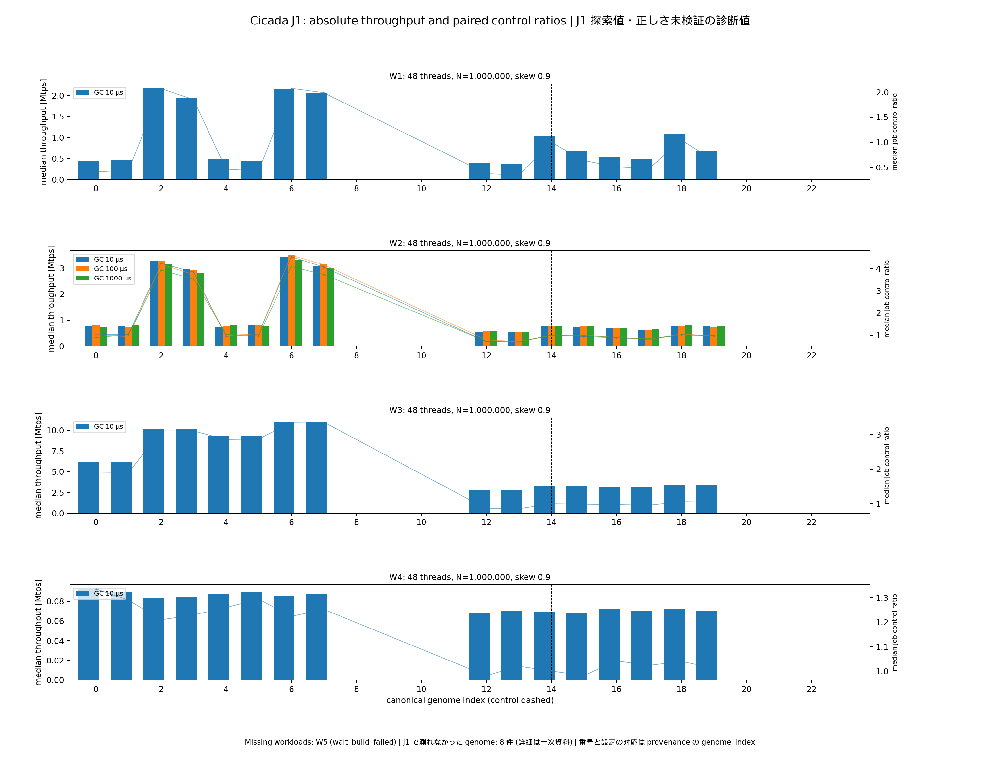

**読み方 (md_11 の図 (a))。** 4 段 = workload、横軸 = genome の列挙順 (build できない 8 点は描かない)、棒 = throughput の rep 中央値、折れ線 = 同じ job の既定に対する比 (右軸)。

| workload (md_11 §6、48 thread・100 万件・skew 0.9・3 秒、pin C の stock) | 観測最良 (B=BACK_OFF O=INLINE_VERSION_OPT P=PROMOTION R=REUSE_VERSION W=WRITE_LATEST_ONLY) | GC | 既定比 |
|---|---|---|---|
| rr5 | B0 O1 P0 R1 W0 | 100 µs | 2.154 |
| rr50 | B0 O1 P0 R1 W0 | 100 µs | 4.536 |
| rr95 | B0 O1 P0 R1 W0 | 10 µs | 3.413 |
| 100 操作型 (rr95・max_ope 100) | B0 O0 P0 R0 W0 | 1000 µs | 1.383 |

- 最大の要因は BACK_OFF=0 (md_11 §1 項 4)。測れたのは正準 24 点のうち 16 点で、選んだのは「観測最良」である (md_11 §6・§9)。
- **最良設定の正しさ (md_20、D2302):** 32 run (異なる条件は 30、走行 1 秒) で巡回 0、inline slot の版を選択時・登録時・commit 時の 3 点で比べ 35 run すべて食い違い 0。md_11 の主比較条件そのもの (3 秒・trace なし) は未検査。
- **長い tx が無ければ、最良設定の境界の遅れは小さい** (md_29 §0 項 2、層 S の境界年齢 p50 は最良 128〜512 µs、既定 512〜4,096 µs)。既定を相手にすると GC 側の伸びしろが既定の公開の遅さの分だけ大きく見えるので、既定設定の値を伸びしろの根拠にしない (D2329 項 2)。


**読み方 (md_29 の axes_h4_lag)。** 層 O (強さ 2 の直交表) で、因子の水準ごとに境界の遅れの指標 (H4-lag) の中央値を並べた主効果の図。公開が 0 回の点は右打ち切りで描かれている (md_29 §3.3 の図題)。
**言えないこと:** 主効果は 2 因子交互作用と分離できない。長い tx の因子の batchR の水準では境界年齢が「停止」で、その値は stock の欠陥込みである (§6.1)。

### 6.4 throughput の時間窓間のばらつき (md_35、D2333)

```mermaid
flowchart LR
  subgraph ROUTE["floor を得る道 (md_35 §2)"]
    r1["関門を通す<br/>CCBench と pin の変更が要る"]:::no
    r2["関門の対象外の別手続き<br/>診断 driver で複数の時間窓"]:::yes
    r3["D19 の下限だけを使う"]:::also
  end
  r2 --> val["Cicada A の時間窓間 CV<br/>日内の複数窓・診断経路"]
  val -.代入しない.-> ft["評価計画の f_T"]
  val -.根拠として併記.-> dt["δ_T は D19 の下限で計算"]
  r3 --> dt
  classDef yes fill:#e8f4e8,stroke:#6a6
  classDef no fill:#fee,stroke:#a66
  classDef also fill:#eef,stroke:#88a
```

**凡例。** 緑 = 採った道、赤 = 所有外として採らなかった道、青 = 採った道と併存する道。

**読み方。** 評価計画の草稿は throughput の差の閾値を δ_T = ln(1 + max(0.030, f_T)) とし、f_T に D145 の意味の between-run floor を置く。既存の floor 生成は D1373 の関門で Cicada を拒否する (D2291)。
md_35 は「関門の対象外の別手続き」を採り、md_11 の診断 driver を無改変で使って、比較相手 A (md_11 の最良設定) と control を日内 6 時間窓 (1 窓 = 1 投入束、窓の間は 60 分以上) × Y5・Y50・Y95 で測った (D2333 項 1)。

| 動作点 (md_35 §4.1) | 署名 | 窓間 CV | 窓中央値の最大/最小 − 1 |
|---|---|---|---|
| Y5 (rr5) | A・GC 100 µs (主) | **0.69%** | 1.89% |
| Y5 | A・GC 10 µs (A_alt) | 1.33% | **3.83%** |
| Y50 (rr50) | A・GC 100 µs (主) | **1.05%** | 2.69% |
| Y50 | A・GC 10 µs (A_alt) | 1.06% | 2.56% |
| Y95 (rr95) | A・GC 10 µs (主) | **0.70%** | 2.13% |
| Y95 | A・GC 100 µs (A_alt) | 0.80% | 2.28% |

- 予定 18 job (6 窓 × 3 動作点) はすべて検査に合格した。14 の異なる node に割り当たった (md_35 §4)。
- **名前は「Cicada A の時間窓間 session-median CV (日内 6 窓・診断経路)」で、floor artifact でも関門を通った floor でもない。** 評価計画の f_T には代入せず、δ_T は D19 の下限で計算して ln 1.03 とし、本値は「日内の窓間 CV はそれより小さかった (日を跨ぐ変動は未測定)」という根拠として併記する (D2333 項 2・3)。
- **δ_T を上げる向きも安全側ではない。** δ_T は「改善」「同等」「悪化」の判定語と A/A 判定・job 間の停止条件の 4 箇所で効き、上げると改善は出にくくなる一方で同等は通りやすく、悪化・A/A・停止条件では止まりにくくなる (D2333 項 4)。
- **測っていないもの:** 日を跨ぐ変動と cold boot、R・L-w・100 操作型の cell (md_35 §1 項 6)。Y の値を L-w へ移さない (D145 項 4)。評価計画 §8.3 の二択 (下限だけで発効するか、floor を待つか) はユーザーの判断として残る。

### 6.5 CCBench の修理と pin: 修理は 3 系統、pin は C のまま

```mermaid
flowchart LR
  C["C<br/>izanagi の現行 pin"]:::pin --> F["F<br/>整形と #line"]:::gh
  F --> G["G<br/>build 不具合の修理"]:::gh
  F --> R1["gc_records と scan の key の修理"]:::gh
  G --> MG["G と gc 修理の merge"]:::local
  R1 --> MG
  MG --> P["promotion・insert・abort の修理<br/>修理ごとに commit"]:::local
  classDef pin fill:#eef,stroke:#88a
  classDef gh fill:#e8f4e8,stroke:#6a6
  classDef local fill:#fff4d6,stroke:#b90
```

**凡例。** 青 = izanagi の現行 pin、緑 = GitHub にあり CI (build・format) が緑と記録されたもの、黄 = CCBench の local branch にだけあり push が人間の手番。

- **pin は起点でも C (`68106660`)** のまま。VHash の測定と検査はすべて pin C の上に patch を重ねて行った。
- **G と gc_records の修理 2 本は GitHub にあり CI が緑** (D2322 項 6 の収集時、D2330 の収集時の実測)。check-runs の実行は 2026-09-30 11:33 JST で、3 版目の起点 (同日 05:17 JST) より後である。
- **promotion・insert・abort の修理 (md_32、D2327):** local branch `izanagi-cicada-promotion-uaf-fix` (tip `16ad3eb8`)。原因は実測で帰属した:

| 欠陥 | 原因 (md_32 の帰属) | 本論文の計測への関わり |
|---|---|---|
| promotion 有効時の巡回 | 読み取り専用 tx の promotion。rts 基準で記録した later_ver_ から validation の再検査が下り、aborted の later_ver_ の手前に入った確定版を飛ばす。修理前の代表 witness 52 件の全部がこの経路 | 最良設定は promotion 無効で、この経路を通らない |
| promotion 後の書き込みの欠落 | promotion が積んだ書き込み要素に後続 update が素通りし body を捨てた (TPC-C の注文 insert 失敗が約 16〜22 倍) | 同上 |
| TPC-C の異常終了 (`std::bad_alloc`) | promotion ではなく `INLINE_VERSION_OPT=1` の insert の欠陥。promotion 無効の OPT=1 でも落ちる | 最良設定は OPT=1。pin が修理の branch を含むまで OPT=1 の TPC-C は使えない。本論文の負荷は YCSB の既存キーへの point read / update |
| abort 時の use-after-free | abort が INSERT の tuple を解放した後に後始末が同じ tuple に書く (ASan で検出) | insert を含む tx の abort の経路。本論文の負荷はこの経路を対象にしていない (通らないことを実行で確かめてはいない) |

- 修理後の branch では、promotion 有効の 8 genome が YCSB 32 走行と TPC-C 16 走行で巡回 0、TPC-C が完走、ASan の報告 0 (md_32 §0 項 6)。どの修理も validation・precheck・commit・install の判定式を変えないので受理集合を緩めない (D2327 の理由)。
- **push は人間の手番** (T-2959、D2330 項 3 で依頼)。pin 前進のときの D297 の扱いは、検査器に例外を足さず 3 条件 (C → F の D297 合格、F → 修正 tip の TRACE=0 差分が修正の hunk だけ、修正後の build での正しさの取り直し) で認め、Cicada は文脈 macro を検査器の既知一覧へ登録して判定できるようにする (D2322 項 4)。
- 評価計画は S2 を pin C のまま測るのを推奨する (D2332 項 6、修理の経路を S2 の負荷と genome は通らない見込み。到達は未確認で、発効の wave が確かめる)。

### 6.6 比較相手の主張につく限定

| 限定 | 中身 | 出所 |
|---|---|---|
| 探索できた空間 | pin C で build できる 16 点。promotion 有効の 8 点は原因が特定され local branch で修理されたが、pin C では使えず、較正の空間へ戻す再計測は別 item。「Cicada の最適化空間を全探索した」とは書かない | md_11 §1、md_32 §11・§12 |
| 比較相手の呼び方 | 「原論文の Cicada」ではなく「CCBench の Cicada (pin C) を md_11 の観測最良設定で、read-only の公開停止の修正を入れて」と書く | md_1 §2、md_11、D2322 項 2 |
| 修正入りの相手の正しさ | ro-gcflag の variant は md_22 の 24 走行で巡回 0。D2302 の最良設定の確認を修正入りの長時間走行へ無条件に転用しない | md_22 §4、D2322 項 2 |
| 区間 GC | この repo の試作は install の lock 待ちが大きく、Steam・HANA の実装費用を代表しない (md_18 自身の記述)。lock の無い区間 GC は未設計・未実装 | md_18 §7・§9 |

---

## 7. 長い読み手の費用と、それを攻める候補 (今の U0 の外)

```mermaid
flowchart TB
  lr["長い read-only の読み手が<br/>回収境界を押さえる"]
  lr --> c1["要因 1 公開の停止<br/>比較相手の欠陥"]
  lr --> c2["要因 2 読み手の snapshot が<br/>境界を押さえる"]
  c1 --> fix["ro-gcflag 修正で直る<br/>主比較の相手の土台"]:::done
  c2 --> igc["区間 GC<br/>見えない途中版を掃除"]:::open
  c2 --> roa["RO-A<br/>安定境界まで snapshot を進める"]:::paper
  c2 --> e["構成 E<br/>read-only は対象外"]:::none
  igc --> igcp["この repo の試作は lock 待ちで遅く<br/>SOTA を代表しない"]
  roa --> roap["紙の上で成立<br/>前進の幅は細い見込み"]
  classDef done fill:#e8f4e8,stroke:#6a6
  classDef open fill:#fff4d6,stroke:#b90
  classDef paper fill:#eef,stroke:#88a
  classDef none fill:#f4f4f4,stroke:#999,stroke-dasharray: 3 3
```

**凡例。** 緑 = 比較相手の土台に入った修正、黄 = 既知の方式で、この repo では公正な試作が無い、青 = 紙の上の論証だけ、灰の破線 = 対象外。

**読み方。** 長い read-only の読み手は、比較相手の欠陥 (要因 1) と、読み手の snapshot が境界を押さえる分 (要因 2) の両方で回収境界を止める。
この節は、要因 2 を攻める候補 2 つ (区間 GC と RO-A) の起点での状態を並べる。**どちらも今の U0 (構成 E) の外である。**

### 7.1 短い read-only と長い read-only (md_15・md_22)

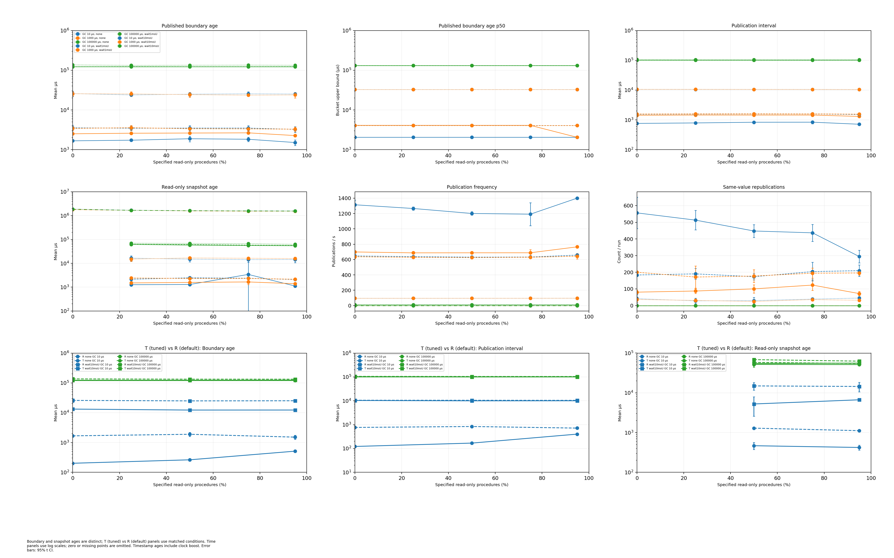

**読み方 (md_15 の図 2)。** 条件別の回収境界の年齢・公開回数・read-only の snapshot 年齢。境界年齢は timestamp 空間の値 (clock boost を含む)、分位点は 2 倍刻みの bucket の上界である。

- **短い read-only は、競合の強い設定では境界の遅れの主因ではない (md_15 §0 項 2):** 既定の Cicada・skew 0.9 で ro 指定率を 0 → 95% に変えても、境界年齢の平均は 1.5〜1.9 ms (GC 10 µs)・2.3〜2.7 ms (GC 1 ms)・122 ms (GC 100 ms) のままだった。
- **長い read-only が 1 本あると、stock は公開が止まる (md_15 §0 項 3、md_22):** 45 走すべてで 3 秒間の公開が 0 回。機序は §6.1 の欠陥である。

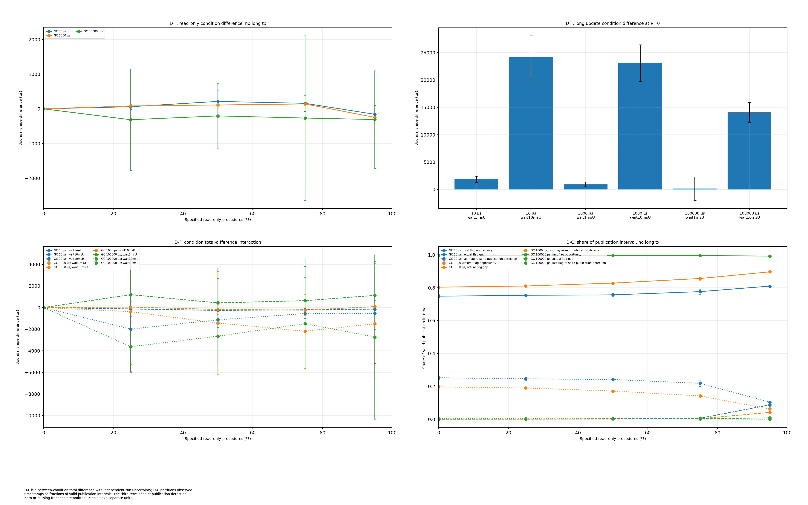

**読み方 (md_15 の図 3)。** ro の総差・長い update の総差・交互作用と、非対応差の 95% t 区間。**条件間の総差であって、「ro のせい」の因果の内訳ではない** (D2296)。

**修正後も残る分 (md_22 §8)。** 修正入りでも、長い read-only 1 本のとき公開時の境界年齢は 12.5〜14.3 ms 残る (長い read-only の長さ 10 ms 程度)。
修正入り・最良 genome (md_22 の T、skew 0.9、3 秒・6 反復平均) では、長い read-only の有無で throughput が ro 0% で 3.54M → 2.72M、ro 50% で 5.73M → 2.82M、ro 95% で 13.11M → 8.03M tps だった。ただしこれは worker 1 の手続きも変わる条件間の差で、読み手の保持の費用そのものではない (md_22 §5・§7)。md_42 の負荷での直接比較は起点で未着地 (md_42 が稼働中)。

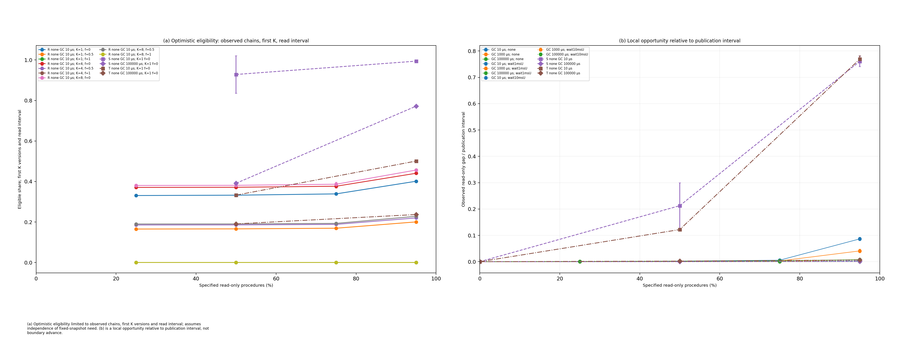

**読み方 (md_15 の図 4)。** 見積り (a) = 位置 ≥ 1 の read-only read のうち、先頭 1 版に既読と矛盾しない確定版がある割合 (楽観的な適格率)、見積り (b) = 公開間隔のうち read-only が flag を上げない分の割合。
**言えないこと:** どちらも機会量であって、実装後の効果でも上限でもない (md_15 §7、D2296)。

### 7.2 読み続ける read-only tx を前進させる抽象仕様 RO-A (md_44、D2334)

```mermaid
flowchart LR
  sp["安全点"] --> st["安定境界 σ を得る<br/>それ以下に新しい版が置かれない値"]
  st --> obs["各既読 v について<br/>v より上で σ 以下の最初の版を観測"]
  obs --> s["s := σ と、その版の wts の直前の小さい方"]
  s --> cmp{"s が今の snapshot より大きいか"}
  cmp -->|はい| mv["① snapshot を s へ移す"] --> fl["② floor を s 以下で公開"]
  cmp -->|いいえ| keep["snapshot も floor も変えない<br/>rts は書かない"]
```

**読み方。** md_44 §3 の抽象仕様 RO-A。読み続ける read-only tx (固定キーの point read だけ、昇格しない) が、安定境界 σ の snapshot で読み、全既読が σ 以下のどこまで見え続けるかを 1 回の観測で確かめ、その最大値 s へ snapshot を移してから floor を上げる。
前進の後も**全読みが 1 つの snapshot の版**であることを保つので、「ある一貫 snapshot でよい用途」(一貫 dump・分析 query) には使え、「開始時点の状態が要る用途」には使えない (md_44 §1)。

- **論証 (紙の上、md_44 §4):** 抽象仕様 RO-A について、直列化 (各 read-only tx を最後の snapshot の位置に置く、定理 S-RO) と論理的な GC 安全 (定理 G-RO) を示した。**md_26 の条件 RA を使わない。** 安定境界の条件 ST は、X1・X2 の書き手 (前進先より小さい時刻で、前進の時点でまだ活動中の書き手) をまさに除く (D2334 項 2)。
- **各条件を外すと何が起きるか (md_44 §7、紙の上の列):** 確認を外すと読みの skew の巡回 (C1)、前進先が安定でないと 3 tx の巡回と X1 型の回収 (C2)、floor を先に上げると D2317 が却下した形 (C3)、時計を進めずに持ち上げると他の read-only tx の安定境界の下に版が置かれる (C4)。モデルでも実走でも探索していない。
- **Cicada への対応 (コード読解、未確認を含む):** `MinWts − 1` を安定境界とする条件 K1〜K5 はコード読解で、未確認を含む。とくに長い read-only tx 自身が境界の集計を 3 通りに止めている (自分の ThreadWtsArray、立たない GCFlag、thread 0 なら leader の仕事) ので、`rts_ = MinWts − 1` の再実行だけでは前進しない (md_44 §6.2)。
- **効き目は細い見込み (md_44 §8):** 前進できる幅は「既読のどれかに次の確定版が来るまで」で頭打ちになる。md_29 の batchR (skew 0.99) の熱いキーの鎖の長さからの粗い目安は約 2.7 µs で、**仮定からの算術であって実測した間隔ではない**。区間 GC に対する上積みの上限は出せない。
- **推奨 (D2334 項 4):** 試作は今は作らず、md_42 の後に実装なしの診断 (md_44 §9 の D2: 既存の走から前進できた幅を後から数える、D3: 区間 GC が既に捨てられる版を除いて追加に要らなくなる版を数える) を先に行う。T-2966 として起票されている。起点で未着手である。

### 7.3 区間 GC: 既知の方式を比較のために試作した (md_18)

```mermaid
flowchart LR
  subgraph KNOWN["既知の区間 GC (md_18 §2)"]
    k1["最小形<br/>最古と 2 番目の境界の間を掃除<br/>vDriver"]
    k2["一般形<br/>どの保護点からも見えない途中版を掃除<br/>Steam・HANA・vDriver"]
  end
  subgraph PROTO["この repo の試作 (md_18)"]
    p1["書き込み時に剪定<br/>install は tuple lock の下"]
    p2["外すが走行中は再利用しない<br/>mode 1"]
  end
  k1 --> p1
  k2 --> p1
  p1 --> p2
```

**読み方。** 回収境界の内側にある不要な途中版を掃除する区間 GC は既知の方式で、「区間 GC を入れた Cicada」は比較相手として審査で問われるので、md_18 は Cicada に最小形と一般形を試作した (D2323)。


**読み方 (md_18 の interval-gc-a-throughput)。** cell ごとの throughput と stock 比。長い read-only tx の cell に `*` 印がある。**言えないこと:** 3 rep の小差は優劣未確定。この試作は書き込みを tuple lock の下で挿入するので、比は install の費用と剪定の効果の和である (md_18 §8)。

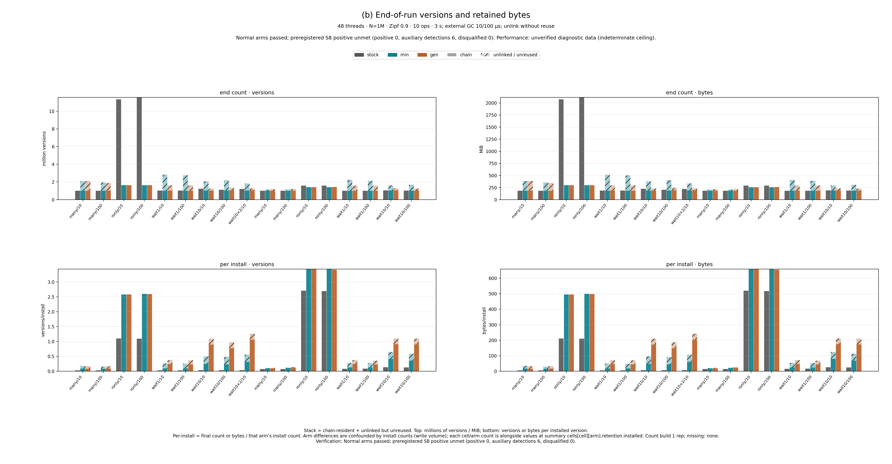

**読み方 (md_18 の interval-gc-b-retention)。** 版の保持。鎖上と未返却を分け、install 1 版あたりに正規化した panel も付けた (md_18 の図の説明)。**言えないこと:** 区間 GC の腕は install 数が stock の 1/1.3〜1/34 なので、鎖・hop の腕間差は書き込み量の差と交絡している (md_18 §1 項 5)。

- **試作は安全な物理再利用までは作れなかった。** 外した版を再利用する変種は修正の後も異常終了したので、計測したのは「版を鎖から外すが、走行中は再利用しない」変種である (D2323 項 4)。
- **この試作の遅さは install の経路の費用で、区間 GC 一般の費用ではない。** throughput は stock 比で最小形 0.062〜0.692・一般形 0.025〜0.684 で、install の lock 待ちが thread 時間の 8〜72% を占めた (md_18 §1 項 4・§6.3)。
- **長い read-only tx の cell では、md_18 の試作は何もしなかった** (stock の欠陥で境界が公開されず、剪定の足場が無かった、md_18 §6.4)。事前登録の壊し正例 (この cell) も発火 0 で不成立だった (D2324)。
- **書かないこと:** 「区間 GC は遅い」「区間 GC に勝った / 負けた」。lock の無い区間 GC (剪定と挿入の競合を CAS 前の印で閉じる案、md_18 §9 項 3) は未設計・未実装である。
  比較には、同じ install の経路で剪定しない対照を先に取る (md_18 §9 の 1)。

---

## 8. この仕組みだけでは解けないケース (限界)

```mermaid
flowchart TB
  t2["読み続ける長い read-write tx"] --> l2["構成 C の前進は起きるが完了に結び付かない<br/>回収境界へ反映する論証が無い"]
  t3["読み終えて待つ tx"] --> l3["強い偏りでは前進先が無い試行が残る<br/>方策 c で一部を補う"]
  t1["固定 snapshot の読み手"] --> l1["前進の対象にしない<br/>rts が押さえる分は残る"]
  t1b["ある一貫 snapshot でよい読み手"] --> l1b["RO-A は紙の上だけ<br/>前進の幅は細い見込み"]
  t4["止まった thread"] --> l4["代行による前進は<br/>対象外 (今後の課題)"]
  impl["Cicada の試作"] --> li["定理の仮定を満たさない箇所がある<br/>走査中の回収の修理は未着地"]
  base["比較相手"] --> lb["修理は local branch<br/>pin は C のまま"]
```

**読み方。** 型ごとの限界と、実装・比較相手の限界を 1 枚にした。1 行目の問題を解いたことを、他の行まで解いたように書かない。

- **読み続ける長い read-write tx (C2):** 構成 C の前進は起きるが、操作数型の長い tx の完了率はどの前進先でも 0.0003 以下で、完了に結び付いていない (md_21 §4.4)。前進を回収境界へ反映する論証は条件 RA の外にあり、floor 以外の保護 (refs・epoch など) とその物理的な寿命の論証が要る (md_26 §11)。
- **強い偏り (C3):** zipf 0.9 では E-max の要求の多くが `no_room` になり、E-max 単独の効果は小さい。方策 c は前進できず確定した試行を終えて遅れを縮めたが、上書きされていない試行が押さえる分は残る (§2.4)。
- **固定 snapshot の読み手 (C1):** 前進の対象にしない。修正入りの比較相手でも長い read-only の rts が境界を押さえる分は残る (§6.2・§7.1)。
- **ある一貫 snapshot でよい読み手 (C1′):** RO-A は紙の上の論証だけで、実装・計測は無い。効き目は細い見込み (§7.2)。
- **範囲読み取り・insert・delete を含む tx:** 試作では前進しない (前進の後に呼べば abort、md_6 §2)。一般の論証も範囲外に置く (md_13 §8、md_26 §11、md_44 §1)。

### 8.1 止まった thread への代行による前進 (md_16、D2298・D2318)

```mermaid
flowchart LR
  stop["sleep・preempt で<br/>止まった tx"] --> hp["別の thread が<br/>代わりに確かめて前進"]
  hp --> m["小モデルで分かった必要条件"]
  hp --> gap["Cicada の GC は<br/>全 thread の静止を待つ"]
  gap --> nogo["代行しても回収は進まない<br/>代理の静止宣言は未検証"]
  m --> keep["再審するときの規則として<br/>一次資料に残す"]
```

**読み方。** md_16 は、止まった tx を別の thread が前進・失効させる形 (HP) を小モデルに足し、6 場面 90 構成を全探索した。**HP は論文の対象に入れず、限界の節に文案を置き、付録には置かない** (D2298、D2318 項 1)。

**論文の限界の節に置く文 (md_16 §7.3 の文案、逐語):**

> 本研究の前進は、待機中の transaction が安全点で GC からの要求を確かめられることを前提とする (評価に用いる CCBench の長い transaction は busy-wait で待つため、この前提を満たす)。sleep や preempt で完全に止まった thread の代わりに別の thread が前進させる設計 (代行による前進) は、小さなモデルの全探索で、descriptor の世代つき CAS が確定と公開を覆うこと、再開時に時刻を読み直すこと、代行する thread 自身が読み取り版を保護すること、失効させる場合は再開時に失効を確かめる前に読み取り値へ触れないことが必要だと分かった。ただし、止まった thread の静止を他の thread が代わりに宣言してよい条件は未検証であり、Cicada のように全 thread の静止を待って回収境界を更新する GC では、代行による前進は回収を進めない。代行による前進の実装と評価は今後の課題とする。

**併記すること (D2318 項 1):** 安全点での前進を CCBench 自身の長い tx で評価するには、CCBench の待機ループ (`clock_delay`) に要求の確認を入れた安全点が要る。現行のループは要求を確かめない (md_16 §7.1)。
md_14・md_21・md_31 の構成 E は、md_6 の試作が足した長い tx の型 (`CICADA_LONGTX`) の待機を 100 µs に刻んで安全点を置いたもので、CCBench 自身の待つ型 (W5) ではない。W5 は pin 前進の後に測る予定である (T-2923)。

### 8.2 実装・比較相手・進行保証の限界

- **正しさの地位。** 論証はモデル仕様 v1 と抽象仕様 E・RO-A についてである。Cicada の試作は論証の仮定を満たさない箇所があり (§3.3)、(a) の修理 (md_39) は未着地である。判定の上限は indeterminate で、中間案 M の照合は検査 run について違反 0 (§3.7)。
- **進行保証。** 安全性だけを扱う。CAS は rts の CAS-max と版の設置に使うが、lock-free 性・進行保証・止まった thread の保護の解除は示していない (md_26 §11)。長い tx の完了率は観測値で、進行保証の代わりにならない。
- **GC の効果の地位。** 回収境界の遅れと論理生存版数は計器入り build の値で、物理メモリの bytes ではない。`REUSE_VERSION=1` の pool は縮まない (md_14 §7)。
- **比較相手。** 主比較の相手は修正入りの最良設定に決まった (D2322 項 2) が、U0 をその土台で測った値は無い。CCBench の修理は local branch にあり、pin は C のまま (§6.5)。区間 GC の SOTA との比較は独立の残課題 (§7.3)。
- **範囲。** 固定キーへの point read / update の YCSB だけ。md_36 の照合も YCSB の経路に限る (md_36 §1)。

---

## 9. 状態: 何が確かめられていて、何がまだか

```mermaid
flowchart LR
  H1["H1 配置"]:::meas
  H2["H2 選択的前進"]:::meas
  H3["H3 今へ進む方式との差"]:::design
  H4["H4 GC 接続"]:::meas
  H5["H5 組み合わせ"]:::idea
  H6["H6 頑健性"]:::idea
  U0["U0 前進を保護下限へ"]:::notfound
  U1["U1 cold 契機"]:::notfound
  U2["U2 前向きに非最新版"]:::known
  U3["U3 1 つの構造"]:::unsettled
  G0["前提 Cicada の正しさ"]:::meas
  BA["前提 比較相手"]:::meas
  CC["前提 CCBench の修理と pin"]:::wait
  classDef idea fill:#f4f4f4,stroke:#999
  classDef design fill:#eef,stroke:#88a
  classDef meas fill:#e8f4e8,stroke:#6a6
  classDef known fill:#fee,stroke:#a66
  classDef notfound fill:#fff4d6,stroke:#b90
  classDef unsettled fill:#f4f4f4,stroke:#999,stroke-dasharray: 3 3
  classDef wait fill:#fff,stroke:#b90,stroke-dasharray: 3 3
```

この節の状態語は次だけを使う (前版と同じ定義)。

- 仮説の状態: **構想のみ**・**設計中** (仕様・模型・評価計画を書いている)・**実測あり** (一次資料に計測・探索・検査の記録がある)・**検証済み** (certified な正しさ検査、または一般の証明を通った)。**この版で「検証済み」に届いた項目は無い** (md_13・md_26・md_44 の論証はモデル・抽象仕様についてで、実装側には届かない)。
- 新規性の状態: **既知**・**見当たらず (範囲つき)**・**未確定**。
- 前提の状態: **整備済み (範囲つき)**・**裁定済み・未実装**・**人間の手番**。

**凡例。** 灰 = 構想のみ、青 = 設計中、緑 = 実測あり / 整備済み、赤 = 既知、黄 = 見当たらず (範囲つき)、灰の破線 = 未確定、黄の破線 = 人間の手番が残る。
「実測あり」は結論の向きを含まない — H1 は実測ありで、Cicada の中の向きは上がらなかった側である。

### 9.1 仮説と新規性

| 項目 | 前版 (2026-09-30) | この版 | 根拠と限定 |
|---|---|---|---|
| H1 配置 | 実測あり (Cicada の外では支持、中では単独で上がらず) | **実測あり (Cicada の外では支持。中では書き込み側の費用を外した B-post でも読みの利得なし)** | md_5、md_23、md_37 (ro 95% と rr95 の 24 組すべて差なし)。修正済みの最良 Cicada との直接比較 (md_42) は起点で未着地 |
| H2 選択的前進 | 実測あり | **実測あり** | md_4・md_13・md_6・md_21。最良設定の上で C-min の stock 比 0.97〜1.04。長い tx の完了には結び付かない |
| H3 今へ進む方式との差 | 設計中 | **設計中** | 草稿 v1 の H3 は C 対 C_now。C_now は未実装で担い手なし (草稿 §11.1 の P3) |
| H4 GC 接続 | 実測あり | **実測あり** | md_14・md_21・md_31。抽象仕様の論証 (md_26) と、試作が仮定を満たさない箇所 (md_36)。修理 (md_39) は未着地。throughput の差は検出できず、修正済みの最良 Cicada との比較は無い |
| H5 組み合わせ | 構想のみ | 構想のみ | 構成 D は未実装。草稿 v1 は S3 追補へ回した |
| H6 頑健性 | 構想のみ | 構想のみ | 同上 |
| U0 前進を保護下限へ反映 | 見当たらず (範囲つき) + 実物の効果の記録あり | **見当たらず (範囲つき) + 実物の効果の記録あり (論文の芯、D2322 項 1)** | 新規性の範囲は md_9 §4 のまま。目的と GC 規則は既知。md_43 (新規性と SOTA の洗い直し) は未着地 |
| U1 cold 契機 | 見当たらず (範囲つき、OCC-TI 1997 を除く) | **見当たらず (範囲つき、OCC-TI 1997 を除く)** | 構成 C の throughput は差なし。構成 D は未実装 |
| U2 前向きに非最新版 | 既知 | **既知** | SI-STM (2006)、CockroachDB (2020) |
| U3 1 つの構造 | 未確定 | **未確定** | U1 に従属。hot 単独の利得が Cicada の中で出ず、構成 D は未実装 |

### 9.2 前提

| 前提 | 前版 | この版 | 根拠と限定 |
|---|---|---|---|
| G0: Cicada の正しさ検査 | 整備済み (範囲が広がった、上限 indeterminate) | **整備済み (範囲がさらに広がった、上限 indeterminate)** | 方策 b・c、B-post、区間 GC、promotion 有効の修理後。scan の phantom・group commit は未対応 |
| Cicada の記録の水準 | 裁定済み・未実装 (中間案 M) | **整備済み (中間案 M、範囲つき)** | md_33・D2336。最良設定を含む 18 run で違反 0、壊し 3 種を検出。主比較の性能値と結び付けた記録は無い |
| 比較相手 A の較正 | 整備済み (観測最良、診断値) | **整備済み (観測最良、診断値)** | md_11 |
| 比較相手の書き方 | ユーザー判断待ち (T-2933) | **裁定済み (両方並べる、D2322 項 2)** | 主比較は修正入り、stock は同じ round の対照 |
| throughput の揺れ | 未実在 (T-2915) | **日内 6 窓の窓間 CV (診断経路) あり、f_T には代入しない** | md_35・D2333。日を跨ぐ変動は未測定 |
| CCBench の修理と pin | 人間の手番 (push)、pin は C | **G と gc 修理は GitHub で CI 緑、promotion・insert・abort の修理は local branch で push 待ち (人間の手番)、pin は C** | D2322 項 6、D2330 項 3、md_32 |
| 評価計画 | 草稿 v1 (未発効) | **草稿 v1 (未発効)。§15 で p\* = c・K\* = 1、§16 で S2 を先に発効できる形** | D2325、D2332 |

### 9.3 数値の要約 (すべて範囲つき)

| 仮説 | 最も強い数値 | 出所 | 地位 |
|---|---|---|---|
| H4 | skew 0・待機 10 ms で E 対 E-hb の遅れ 8.9 対 19.3 ms (−54%)、保持時間 −47% | md_14 §1 | 計器入り build の診断値 |
| H4 (前進先) | skew 0.6・待機 10 ms で E-max の遅れ 19.5 → 10.0 ms | md_21 §1 | 計器入り build の診断値。§5.5 の語は「判定不能 (門未完了)」 |
| H4 (強い偏り) | skew 0.9 で方策 c が E-max から −2.92 ms (19.64 → 15.19 ms)、skew 0.95 で −4.11 ms | md_31 §5.1 | 計器入り build の診断値、§5.5 の語は未適用 |
| H4 の throughput | stock 比 0.96〜1.06 (待機型)、方策 b・c 0.97〜1.04 | md_14 §1、md_31 §1 | 差は検出できず。修正済みの最良 Cicada とは未比較 |
| H1 (外) | LLC 外の最新版選択で連続配置 scalar が散在 linked の 0.55〜0.84 倍 | md_5 §0 | Cicada の外の微小計測 |
| H1 (中) | B-post K=1 の更新中心の stock 比 0.938〜0.991、ro 95% と rr95 の全比 0.939〜1.016 | md_37 §1 | 性能用 build の同時刻比較、探索段 |
| 比較相手の欠陥 | 長い read-only ありで公開 36 走すべて 0 → variant で 289.7〜299 回、throughput 比 1.56〜16.83 (3 秒) | md_22 §0・§6・§7 | 公開は計器入り、throughput は計器なし |
| 比較相手の揺れ | A の主 GC の日内 6 窓の窓間 CV 0.69〜1.05% | md_35 §4.1 | 診断経路、関門を通っていない |

### 9.4 仮説と作業の対応

```mermaid
flowchart LR
  subgraph L["着地した作業"]
    w1["md_1・md_9・md_27 文献と動機"]
    w2["md_2・md_15・md_29 探索と保持の実測"]
    w3["md_3・md_17・md_20・md_33 判定器と記録"]
    w4["md_4・md_13・md_26・md_36 論証と照合"]
    w5["md_5・md_23・md_37 hot 配置"]
    w6["md_6・md_21 forwarding と前進先"]
    w10["md_10・md_14・md_31 GC 接続と早い abort"]
    w22["md_22 read-only の公開"]
    w44["md_44 読み続ける read-only"]
    w18["md_18 区間 GC"]
    w35["md_11・md_32・md_35 比較相手"]
    w40["md_25・md_34・md_40 評価計画"]
  end
  subgraph P["未着地の作業"]
    p39["md_39 走査中の回収の修理"]
    p42["md_42 最高水準との直接比較"]
    p43["md_43 新規性と SOTA の洗い直し"]
  end
  subgraph H["仮説"]
    h1["H1"]
    h2["H2"]
    h4["H4"]
    h3["H3・H5・H6"]
  end
  w2 --> h1
  w5 --> h1
  p42 -.-> h1
  p42 -.-> h2
  p42 -.-> h4
  w4 --> h2
  w6 --> h2
  w10 --> h4
  w4 --> h4
  w22 -.比較相手.-> h4
  w35 -.比較相手.-> h4
  w18 -.比較対照.-> h4
  w44 -.今の U0 の外.-> h4
  w40 --> h3
  w3 -.前提.-> w10
  p39 -.-> h4
  p43 -.-> h4
```

**読み方。** md_N は 2026-09-29 以降に並行投入用に用意した wave の投げ文の番号で、投げ文の本体は repo の外にある。実線 = 一次資料がその仮説の根拠になる、点線 = 前提・比較相手・比較対照として効く、または未着地の作業が効く予定。
未着地の作業の結果は、この版には入っていない (投げ文の題名から主題を置いただけ)。

---

## 10. 評価の組み立て (評価計画の草稿 v1、未発効)

```mermaid
flowchart TB
  A["A 最良設定<br/>(S1 の登録のまま)"]
  Af["A_fix = A + read-only の公開の修正<br/>(S2 の主の比較相手)"]
  As["A_stock = A (S2 の対照)"]
  B["B = A + hot 配置"]
  C["C = A + 論理 K 境界で最小の前進"]
  Cn["C_now = 今の時刻へ前進"]
  Fl["F_ℓ = A + 論理 K 境界で abort・再実行"]
  Ehb["E_hb(c) = 修正入りの土台 + 安全点で flag だけ"]
  Esp["E_sp(c) = 修理版 E + 前進先 c<br/>成功したときだけ公開"]
  Ea["E_sp(a) = 前進先 a (今)"]
  D["D = B + hot の外れで前進"]
  A --> B & C & Fl
  C --> Cn
  A --> Af
  Af --> Ehb --> Esp
  Ehb --> Ea
  B --> D
  As -.同じ round の対照.-> Af
  classDef later fill:#f4f4f4,stroke:#999,stroke-dasharray: 3 3
  class D later
```

**この節の地位。** `docs/vhash-evaluation-preregistration-draft.md` は**事前登録の草稿 v1 であり発効していない** (D2301)。発効は別の wave が日付付きの決定で行う (T-2893)。判定の規則の正本は草稿で、この節は構造を図にしたものである。
**読み方。** 矢印は「左に 1 つの変更を足したものが右」。破線の枠 = S3 追補まで主要な族に入れない構成。A_stock は A と同じ構成を S2 での対照として呼ぶ名前で、変更の矢印は付けていない (点線は同じ round に置く対照の関係)。3 版目の図から、S2 の比較相手を A_fix (主) と A_stock (対照) に分け、S2 の E の土台を修正入りにし、前進先を p\* = c に固定した (D2325・D2332)。**比較相手の分け方は S2 に限った改訂で、S1 の B・C・F は元の A のままである** (草稿 §16.9 項 1)。

### 10.1 主比較 (確認段、主要な族 m = 19) と、探索段から持ち込んだもの

| 仮説 | 処置 対 対照 | cell | 主指標 | 族に入る数 |
|---|---|---|---|---|
| H1 配置 | B_1 対 A | R50・R95・Y50 | throughput (性能用 build) | 3 |
| H1 用量 | R95 と R0 の差の差 | R95−R0 | 同上 | 1 |
| H2a 回避 | C 対 A | Y5・Y50・Y95 | commit あたりの深い探索回数 (計数用) | 3 |
| H2b 仕事を保つ価値 | C 対 F_ℓ | Y5・Y50・Y95 | throughput | 3 |
| H3 | C 対 C_now | Y5・Y50・Y95 | throughput | 3 |
| H4 GC 接続 | E_sp(c) 対 E_hb(c) | 読み終えて待つ型 L-w の 4 cell | 回収境界の遅れ**かつ**生存版数 (計数用)。前進の成功回数で判定しない | 4 |
| H4 方策 | E_sp(c) 対 E_sp(a) | 待機 10 ms・1 ms の skew 0.9 | 遅れ | 2 |

- **探索段の当てはめ (md_34、D2325):** p\* = c (E-max)、K\* = 1。「予備的に支持」はどの組にも出ない。md_21 の比較の多くは「判定不能 (門未完了)」である (§2.3)。結果を見た後の §5.5 の変更は無い。
- Bonferroni、水準 0.05/19。1 cell = 同じ job・同じ node で全構成を 1 回ずつ回す round を 14 取る (草稿 §8)。「Cicada の最良設定に対して」と headline に書けるのは、A の GC 10 µs と 100 µs の両方に対して処置が「改善」か「同等」のときだけ (草稿 §5.2)。

### 10.2 S2 を S1 より先に発効できる形にした (md_40、D2332)

```mermaid
flowchart LR
  s0m["S0-M<br/>GC 指標の揺れ f_M,c"] --> s2gate["S2 の門<br/>A_fix・A_stock・E_hb・E_sp の門用 build"]
  s2gate --> s2run["S2 本走<br/>H4 の判定"]
  md39["md_39 修理版 E"]:::open --> s0m
  md39 --> s2gate
  cond["修理の型の条件<br/>長い tx が下限を上げて公開した回数"]:::open --> s2gate
  user["ユーザーの確認<br/>node 時間・論点"]:::wait --> s0m
  s1["S1 (H1・H2・H3)"]:::none -.待たない.-> s2run
  classDef open fill:#fff4d6,stroke:#b90
  classDef wait fill:#eef,stroke:#88a
  classDef none fill:#f4f4f4,stroke:#999,stroke-dasharray: 3 3
```

**凡例。** 黄 = 未着地・未確認の条件、青 = ユーザーの確認、灰の破線 = S2 が待たないもの。

**読み方。** 論文の芯が U0 になったので、U0 を判定する確認段 S2 (H4) を、S1 を待たずに発効できる単位にした (D2332 項 1、草稿 §16)。
族は m = 19 のままで、S2 が判定しない 13 個は族に残り、門が未完了の組は「判定不能 (門未完了)」として m に数える。S2 の発効の後に足す判定は別の族として登録する。

- **比較相手 (D2332 項 2):** S2 の主の比較相手は A_fix、対照は A_stock で、同じ round に置く。E_hb・E_sp の土台も ro-gcflag 入りにし、md_39 の修理版 E を重ねる。
- **修理の型の条件 (D2332 項 3、md_39 の結果の前に登録):** 修理版 E_sp(c) の計数用 build の smoke で、S2 の 4 cell のどれかで「長い tx が安全点で読み取り下限を開始時の値より上げて公開した回数」が 0 なら、修理の規則を調べ、機構が働かないと分かれば S2 をこの形で発効せず、cell の組み直しをユーザーに諮る。
- **門 (D2332 項 4):** 計 30 走行。M を重ねたときは M の違反も失格の条件にする。D2332 の時点では S2 の genome (`INLINE_VERSION_OPT=1`) は M の範囲外で「md_33 が範囲を広げない限り M なしで進める」としていたが、md_33 は範囲を最良設定まで広げた (D2336 項 1)。S2 の門に M を重ねるかは発効の wave が確かめる (草稿 §16.8 項 6)。
- **f_T (§6.4):** 族の 6 判定は δ_M,c だけで決まる。f_T は H4 の費用の併記と族に入れない副次にだけ効き、推奨は D19 の下限 (草稿 §16.5)。
- **node 時間 (参考単価 5.8〜6.9 s / 走行):** S0-M 0.26〜0.31、S2 の門 0.37、S2 本走 1.13〜1.34 (700 走行)、計 1.76〜2.02 (D2332 項 7)。2 node 時間を超えうるので、投入前にユーザー確認を取る (または land 調整役と相談する)。

**発効に残る条件 (草稿 §16.8):** (1) md_39 の着地、(2) 修理の型の条件、(3) 重ねた build が条件 gate を通り TRACE=0 の命令列が一致すること、(4) 修理の hunk が S2 の build で到達しないことの確認、(5) f_T の 2 案のユーザーの択一、(6) M の範囲の確認、(7) ユーザーの確認 (node 時間・論点)、(8) 発効の決定。
**ユーザーに諮る論点 (草稿 §16.10):** 本案の効果 (E_sp(c) 対 A_fix) を族に入れるか (推奨は入れる、m = 23 で区間は変わらない)。方針「最高水準より大きく速い」(§0.2) に照らすと、この論点は「U0 を修正入りの Cicada と直接比べた結果を headline に書けるか」に当たる。

### 10.3 判定語は 2 層

```mermaid
flowchart TB
  subgraph X["探索段 (md_21・md_23・md_37 の読み方)"]
    x1["門で失格か"] --> x2["比較相手の正しさは"] --> x3["欠測か"] --> x4["同じ round の A/A 腕"] --> x5["予備的な語を出す"]
  end
  subgraph Y["確認段 (新しい round だけで判定)"]
    y1["門で失格か"] --> y2["欠測か"] --> y3["A/A 腕・job 間の一致"] --> y4["確認段の語を出す"]
  end
  X -->|"K* と p* だけを持ち込む"| Y
```

**読み方。** 探索段は n が小さく補正もしないので「予備的に支持 / 予備的に不支持 (差なし・悪化) / 判定不能」だけを出す。**「予備的に支持」は同じ round に A/A 腕があるときだけ出る** (草稿 §5.5.0)。


### 10.4 論文の主要な図の候補と、起点で使える図

| 図の候補 | 起点で一次資料にある図 | 足りないもの |
|---|---|---|
| 長い tx と回収境界 (U0 の芯) | md_14 gc-connection・gc-connection-mechanism、md_21 target-policy-gc、md_31 md31-early-abort-gc | 確認段の round、修正入りの土台の値 |
| 強い偏りの限界と方策 c | md_21 target-policy-reasons・success、md_31 md31-early-abort-doomed | — |
| 長い tx の完了 | md_21 target-policy-many-ops、md_31 md31-early-abort-long | — |
| throughput (費用の併記) | md_21 target-policy-throughput、md_31 md31-early-abort-throughput | 修正入りの比較相手との同時刻比較 |
| 最高水準との直接比較 | 無し (md_42 は起点で稼働中) | md_42 の結果 |
| 比較相手の欠陥の修正 | md_22 publication_boundary・throughput | 30 秒比較の図 |
| hot 配置 (負の結果) | md_5 fig-k・fig-depth、md_23 fig-ro、md_37 fig-k・fig-write | 確認段の round。補助の指標として commit あたりの LLC miss |
| 区間 GC との分担 | md_18 interval-gc-a-throughput・b-retention | lock の無い区間 GC |
| 負荷の空間 | md_29 skew_depth・axes_h1・axes_h4_lag | — |
| モデルの中の回収境界 | 無し (md_10 は Mermaid だけ) | 生成器 (実装面) |

---

## 11. 新規性と関連研究: U2 は既知、主張は U0 (と U1)

```mermaid
flowchart LR
  subgraph TRIG["tx の時刻が後へ動く契機"]
    c1["衝突の検出"]
    c3["時計の不確かさ"]
    c2["commit 時に位置を決める"]
    c4["read ごと"]
    c5["cold 領域への進入"]
    c6["GC の要求 (待機の安全点)"]
  end
  subgraph DEST["行き先"]
    d1["その時点の最新 /<br/>押し上げられた時刻"]
    d2["既読と両立する<br/>最も新しい版"]
    d3["hot に届く最小限"]
  end
  subgraph GCL["回収境界への反映"]
    g0["読んだ節に<br/>反映の規則が無い"]
    g1["確認・確定の後に<br/>保護下限を公開"]
  end
  c1 -->|"Lomet 2012 / CockroachDB"| d1
  c3 -->|"CockroachDB"| d1
  c2 -->|"Hekaton 2011 / TicToc"| d1
  c4 -->|"Sundial"| d1
  c4 -->|"SI-STM"| d2
  d1 --> g0
  d2 --> g0
  c5 -.->|"本案の構成 C (U1)"| d3
  c6 -.->|"本案の構成 E"| d2
  d2 -.->|"本案 (U0)"| g1
```

**読み方。** md_9 §0 の図の構造に、構成 E の契機 (GC の要求) を足した。実線は原典の読んだ節で確かめた既存方式、破線は本案の経路である。
構成 E の前進先 E-max は行き先「既読と両立する最も新しい版」に近い (既読と両立する時刻を選ぶこと自体は既知で、本案が足すのはその先の保護下限への公開である)。
**図から読み取ってはならないこと:** 破線の経路を持つ既存方式が世界に無いことは表さない。行き先の箱は共有しているが、SI-STM が保護下限への公開を持つとは読まない (md_9 の K20)。
**本案の実物の U0 は構成 E で得たもので、cold 契機 (U1) とは切り離されている** — 構成 E の契機は cold 領域への進入ではなく GC の要求である。

| 本案 (出典メモ §23) | 状態 (md_9 §5.2) | 論文での扱い |
|---|---|---|
| U0: 前進を回収境界へ反映して保持義務を縮める | **機構は見当たらず (範囲つき)**: OpenAlex (題名 + 要旨、2026-09-29 09:51〜10:20 JST 取得)・arXiv (同 09:49〜09:50 JST)・DBLP (Last-Modified 2026-09-28 20:23:37 GMT の全件書き出し) を事前登録した式 N01〜N05 で調べた範囲と読んだ原典の範囲。**目的と GC 規則は既知** | 芯 (D2322 項 1)。主張するのは「実行中の前進を保護下限へ反映する機構と、その確定・公開の順序」だけ |
| U1: cold への進入を timestamp 制御の入力にする | **見当たらず (範囲つき)**: 同じ 3 索引を式 N06〜N08 で。本文を確認できていない OCC-TI 1997 などの 5 本を除く | 同じ論文に残す。構成 D と区別する。範囲を同じ文に書く |
| U2: 既読を保って hot な非最新版を選ぶ | **既知** (SI-STM 2006、CockroachDB 2020) | 新規性として書かない |
| U3: 1 つの構造で版選択・前進判断・validation を安くする | 未確定 (U1 に従属) | U1 と組にしてだけ書ける |

- 成熟度は索引別の RW2 であって RW3 ではない (md_9 §4.5)。本文未取得の 5 本 (vWeaver 2021・Diva 2022・Bayer ほか 1982・Boksenbaum ほか 1987・OCC-TI 1997) は範囲の外で、取り寄せは人間の手番である (T-2895、1・2・5 を優先)。
- **新規性の検索をやり直した一次資料は、起点でもまだ無い。** md_43 (「条件 C × 手法 M × C での SOTA」を結果の前に決めて新規性を洗い直す、計算なし) は起点で未着地である。
- 区間 GC の新規性は既知 (§7.3)。方策 c (待機の安全点で commit できないと確定した tx を早く終える) の新規性一般は調べていない (md_31 §9) ので、新規性に数えない。
- AggressiveGC (CCBench 論文 §7.3、提案のみ) との違い: 回収を先に決めて tx を殺すか、tx が既に commit できないことを確かめてから境界を放すか。方策 c は commit できる tx を失わない (小モデルの範囲) 代わりに、上書きされていない長い tx が押さえる分は残す (md_31 §9、D2320 の却下理由)。

**関連研究の 5 系 (md_1 §12 の 4 系に md_9 §8 が (e) を足したもの):** (a) timestamp を後から決める系 (TicToc・Sundial・MaaT・Lomet 2012。TicToc の timestamp history は著者自身が §6.4 で効果が測れなかったと報告、md_1 §4)、
(b) 衝突で順序を動かす系 (Shirakami・Rebirth-Retire・MV3C・Morty)、(c) 版の配置の系 (Cicada・HyPer・vDriver・LeanStore・Freitag 2022)、
(d) GC と長い tx の系 (Steam・HANA・CIDR 2021・AggressiveGC と製品文書 md_27、区間 GC)、(e) 実行中に前進して既読を保つ系 (CockroachDB の read refresh、SI-STM / LSA)。

**使ってはならない言い方 (md_9 §7):** 「旧版を選べる」「前向きに進んで最新でない版を読む」「新しい側へ寄せて古い版を早く捨てる」を新規性として書く。「初めて」「先行研究が無い」。
索引名・式 ID・cutoff を落とした「見当たらなかった」。構成 E の安全点での前進を「読み取り後に待つ tx の保持を縮める」と書くときは、E の測定の範囲を同じ文に置く。

---

## 12. 次の一手の地図

### 12.1 ユーザーの判断・人間の手番と、それぞれで開くもの

```mermaid
flowchart LR
  subgraph U["ユーザーの判断・人間の手番"]
    u1["md_42 の結果を見て<br/>論文の構成を決める"]
    u3["T-2893 S2 の発効<br/>node 時間と論点の確認"]
    u4["T-2959 CCBench の修理 branch の push"]
    u5["T-2895 本文未取得の文献の取り寄せ"]
  end
  subgraph O["開くもの"]
    o1["hot 配置・構成 C・構成 E を<br/>論文のどこに置くか"]
    o3["S0-M と S2 の門 → S2 本走"]
    o4["pin 前進 → 修理 patch の不要化<br/>OPT=1 の TPC-C"]
    o5["U0・U1 の範囲文から<br/>除外の但し書きを外せるか"]
  end
  u1 --> o1
  u3 --> o3
  u4 --> o4
  u5 --> o5
  o1 -.方針の照合.-> o3
```

**読み方。** 左がユーザーの判断か人間の手番、右がそれで開く作業。

| 判断・手番 | 選択肢 | 開くもの | 状態の根拠 |
|---|---|---|---|
| md_42 (最高水準との直接比較) の結果を見た後の論文の構成 | md_42 の着地後に、方針「条件 C で最高水準より大きく速い」に照らして決める | 論文の hot 配置・構成 C・構成 E の置き場所 | 起点で md_42 は稼働中 (T-2962) |
| T-2893 評価計画の発効 (S2 先行) | 前提がそろってから、段ごとの node 時間 (計 1.76〜2.02) と §16.10 の論点を示して確認 | S0-M と S2 の門 → S2 本走 | D2332、草稿 §16.8 |
| §8.3 の f_T の二択 | D19 の下限だけで発効 / floor を待つ | δ_T の決め方 | D2333 項 3 |
| T-2959 CCBench の promotion・insert・abort の修理 branch の push (人間の手番) | push する (別名の新 branch、force 不要) | GitHub の CI 確認 → pin 前進 (D2322 項 4 の 3 条件) | D2330 項 3 |
| T-2895 本文未取得の 5 本 (人間の手番) | 1・2・5 を優先 | U0・U1 の範囲文の「5 本を除く」を外せるかの確認 | D2305 項 12 |

**題名と主張の重心、比較相手の書き方は判断待ちではない。** 3 版目が択一として並べた 2 つは、D2322 項 1 (案 2) と項 2 (両方並べる) で裁定された。

### 12.2 AI の手番と並走中の作業

```mermaid
flowchart TB
  subgraph run["未着地 (並走中、結果はこの版に無い)"]
    r39["md_39 構成 E の走査中の回収の修理"]
    r42["md_42 最高水準との直接比較"]
    r43["md_43 新規性と SOTA の洗い直し"]
  end
  subgraph ai["AI の手番 (起票済み)"]
    a1["T-2916 動機の数値"]
    a2["T-2966 RO-A の実装なしの診断"]
    a4["T-2927 壊し B2 の機序"]
    a5["T-2923 W5 の測定 (pin 前進の後)"]
    a6["T-2874 M の範囲の拡張と未確認の発火"]
  end
  r39 --> s2["S2 の発効"]
  r42 -.方針の照合.-> paper["論文の構成"]
  a2 -.md_42 の後.-> proto["試作へ進むか"]
```

| T | 中身 | 何が開くか |
|---|---|---|
| md_39 (並走中) | 構成 E の書き込み検査の走査中の回収を再現し、最小の修理を入れる | S2 の発効の最大の待ち (草稿 §16.8 項 1) |
| md_42 (並走中、T-2962) | md_29 の候補 4 領域で、機構を最良設定の Cicada と同時刻対照で直接比べる (比較相手は修正入りが主、stock が対照) | 方針に照らした判定の材料 (§0.2) |
| md_43 (並走中) | VHash の新しさがどこに残るかと公正な比較相手を、性能結果を見る前に決める (計算なし) | 新規性の範囲文の更新 |
| T-2916 | 読み取りを続ける長い read-write tx と読み終えて待つ tx が回収境界をどれだけ止めるかを測る | 論文 §1 の動機の穴。D2322 項 1 で構成 D より先 |
| T-2966 | md_44 の RO-A を試作へ進めるかを決める実装なしの診断 (D2・D3)。md_42 の後に行う (D2334 項 4) | 試作へ進むかの判断 |
| T-2927 | md_23 の残りのうち、壊し B2 が validation に止められなかった機序だけ (他 3 点は md_37 で済み) | H1 の正しさの説明 |
| T-2923 | W5 (CCBench 自身の読み取り後に待つ型) の測定 (pin 前進の後) | SP を CCBench の待機で評価する (§8.1) |
| T-2874 | 中間案 M は実装済み。残りは範囲の拡張と未確認の発火 (API の再読・過剰登録、U の設置と公開) | 主比較の性能値に M の地位を付ける |

---

## 13. 2026-09-30 版 (3 版目) からの到達差

```mermaid
flowchart LR
  subgraph before["3 版目の時点"]
    b1["題名と重心の択一"]
    b2["比較相手の択一"]
    b3["方針との照合"]
    b4["強い偏りの読み"]
    b5["構成 E の安全性"]
    b6["記録の水準"]
    b7["hot 配置"]
    b8["区間 GC と負荷の空間"]
    b9["比較相手の揺れと修理"]
    b10["評価計画"]
    b11["read-only の分類"]
  end
  subgraph after["この版"]
    a1["§0.3 案 2 で書く"]
    a2["§6 両方並べる"]
    a3["§0.2 方針との照合"]
    a4["§2.4 方策 c と no_room の訂正"]
    a5["§3.2・§3.3 論証と定理の外の箇所"]
    a6["§3.7 中間案 M の実装"]
    a7["§5.4・§5.5 B-post と直接比較"]
    a8["§7.3・§1 試作と md_29"]
    a9["§6.4・§6.5 窓間 CV と修理"]
    a10["§10.2 S2 先行"]
    a11["§1・§7.2 RO-A"]
  end
  b1 --> a1
  b2 --> a2
  b3 --> a3
  b4 --> a4
  b5 --> a5
  b6 --> a6
  b7 --> a7
  b8 --> a8
  b9 --> a9
  b10 --> a10
  b11 --> a11
```

**読み方。** 左が 3 版目 (起点 `4f412c67b`、2026-09-30 05:17 JST) の項目、右がこの版 (起点 `74029b18f`) でその項目を扱う節。変化の中身は下の表に書く。

| 項目 | 3 版目 | この版 | 型 |
|---|---|---|---|
| 論文の重心 | 3 案の択一 (親の推奨は案 2) | 案 2 で確定 (D2322 項 1)。U0 を芯にし、U1 は構成 D と区別する | 後続の着地 (裁定) |
| 比較相手 | T-2933 の 3 択 (親の推奨は両方並べる) | 両方並べる (D2322 項 2) | 後続の着地 (裁定) |
| 方針との照合 | 無し (ユーザー方針は 3 版目の後) | throughput の材料が無いことと、判定材料の md_42 が起点で稼働中であること (§0.2) | 後続の依頼 |
| `no_room` の読み | 「(b) は validation での abort が決まっている」(md_21 §4.3 の読み) | 大半は前進に一度成功した後の再要求で、abort の確定ではない。確定は判定 D (§2.4) | 後続の着地 (一次資料の訂正、md_31・D2320 項 3) |
| 強い偏りの方策 | T-2930 が並走中 | 方策 c が skew 0.9・0.95 で遅れを縮めた (§2.4) | 後続の着地 |
| 構成 E の論証 | md_26 は未着地 | 抽象仕様 E の定理 G・S と条件 RA (§3.2) | 後続の着地 |
| 試作と仮定 | 「CCBench の Cicada は W* を満たす」は未確認 (T-2906) | 手順と保証を分けて照らし、構成 E の試作が定理の外にある 3 箇所 (§3.3、D2326) | 後続の着地 |
| 記録の水準 | 中間案 M は裁定済み・未実装、M の対象 (OPT=0) と最良設定 (OPT=1) が食い違う | M を最良設定まで含めて実装し、18 run で違反 0、壊し 3 種を検出 (§3.7、D2336) | 後続の着地 |
| hot 配置 | 構成 B (md_23) だけ。T-2926 は起票済み | B-post で書き込み側の待ちは消えたが読みの利得なし (md_37) | 後続の着地 |
| 区間 GC | md_18 は未着地 | 試作は lock 待ちで遅く SOTA を代表しない (md_18、§7.3) | 後続の着地 |
| 負荷の空間 | md_28・md_29 は未着地 | 伸びしろの上限の地図と候補 4 領域 (md_29、D2329) | 後続の着地 |
| between-run floor | 未実在 (T-2915) | 日内 6 窓の窓間 CV (診断経路)、f_T には代入しない (md_35、D2333) | 後続の着地 |
| CCBench の修理 | G と gc 修理は push 待ち、promotion・UAF は原因未特定・未修正 | G と gc 修理は GitHub で CI 緑 (2026-09-30 11:33 JST の check-runs)、promotion・insert・abort は原因を帰属して local branch で修理 (md_32) | 後続の着地 |
| 評価計画 | p\* は未決、K\* = 1 は md_23 が選択済み、§5.5 の独立の当てはめ (P10、T-2914) は未了 | p\* = c、K\* = 1 を独立に再計算して一致 (§15)、S2 を先に発効できる形 (§16) | 後続の着地 |
| 長い tx の完了 | 操作数型の値だけ | 待機型は stock でも完了すると分けた (md_31 §6) | 後続の着地 |
| read-only の読み手 | 「前進の対象にしない」 | 「開始時点が要る」と「ある一貫 snapshot でよい」を分け、後者の前進 RO-A を紙の上で論証 (md_44) | 後続の着地 |

**3 版目の執筆時点の誤り: 親の点検では 0 件だったが、段 6 の独立レビューが参照の誤記を 1 件見つけた (全件を照合したのではないので、合計 1 件とも言えない)。** 3 版目 §3.5 の「md_21 はこれを `no_room` と数えた (§5.7)」の「§5.7」は、3 版目にも md_21 にも無い節である (正しくは 3 版目の §5.5、md_21 の定義は §2・計数は §4.3)。3 版目は凍結物なので直さず、この版の §2.4 は md_21 §4.3 を引いた。親の点検したもの: (1) 3 版目が「push 待ち (人間の手番)」と書いた CCBench の Cicada 修理 2 本は、GitHub の check-runs の実行が 2026-09-30 11:33 JST で、3 版目の起点 (同日 05:17 JST) より後だった (この版の起点で GitHub の公開 API を読んだ)。
(2) `no_room` の (b) を「abort が決まっている」とした記述は、3 版目の起点の正典 (md_21 §4.3) に沿っており、それを訂正したのは後に着地した md_31 である。**ただしこれは単なる情報の追加ではなく、一次資料の読みの訂正である。** 3 版目の該当箇所 (§5.5) をそのまま引かない。
(3) M の対象の食い違い・T-2933 の判断待ち・promotion の原因未特定は、いずれも起点の正典どおりで、後の着地が解いた。独立の点検 (段 6 のレビュー) の経過は §16 にある。

---

## 14. 出典メモの主張を原典・実物で確かめた結果

```mermaid
flowchart TB
  memo["出典メモの主張"] --> lit["文献の要約<br/>(md_1・md_9・md_27・md_18)"]
  memo --> cc["Cicada と CCBench の実装の前提<br/>(md_8・md_2・md_11・md_22・md_29・md_44)"]
  memo --> nov["新規性の候補<br/>(md_1・md_9)"]
  memo --> hot["hot 配置で探索を速くする<br/>(md_5・md_23・md_37)"]
  lit --> m1["原典と照合"]
  cc --> m2["ソース・原論文・実測で照合"]
  nov --> m3["近い先行と書き分け"]
  hot --> m4["Cicada の中で実測"]
```

**読み方。** 出典メモは構想の記録であって一次資料ではない (README)。2 版目・3 版目の照合の表 (CCBench 論文 §7 の 5 主張の一致、Cicada の前提 8 項目の一致、TicToc の救済は著者自身が効果なしと報告、U2 は既知、長い tx の作り方は stock CCBench では build できなかったが修理 G で build できるようになった、比較相手の既定設定は観測最良から 2.15〜4.54 倍遅い、など) は変わらない。4 版目で足したのは次の 3 件である。

| メモの主張 | 照合の結果 | 出所 |
|---|---|---|
| 直近の少数版を連続に置くと版探索が速くなる (VHash の hot block) | Cicada の外の微小計測では速い。Cicada の中では、書き込み側の排他を外した設計でも読みの利得が出なかった。修正済みの最良 Cicada との直接比較 (md_42) は起点で未着地 | md_5、md_37 §1 |
| 固定 snapshot・安定 read-only は、最初は従来の snapshot 経路を維持する (メモ §17.1・§17.2) | 「開始時点の状態が要る用途」には当てはまる。「ある一貫 snapshot でよい用途」では、安定境界まで snapshot を移す前進が紙の上で成り立つ (効き目は細い見込み、実装なし) | md_44 §1・§4・§8 |
| read-only tx が古い履歴を保護している間の GC の制約を「対象外だから測らない」で済ませず、共存時にどの効果が残るかを評価する (メモ §17.2) | 共存は stock と修正入りで測られた: stock では長い read-only 1 本で公開が止まり (md_22・md_29)、修正入りでも公開時の境界年齢 12.5〜14.3 ms が残る (md_22 §8)。修正入りの最良 genome では長い read-only の有無で throughput の条件間の差も観測された (md_22 §7)。md_42 の負荷での直接比較は起点で稼働中 | md_22 §6〜§8、md_29 §0 |

---

## 15. 過大主張チェックリスト

```mermaid
flowchart LR
  subgraph T["論点"]
    t0["方針との関係"]
    t1["hot 配置と構成 C の効果"]
    t2["GC への効果"]
    t3["正しさの地位"]
    t4["比較相手"]
    t5["動機の根拠"]
    t6["新規性と限界"]
  end
  t0 --> n0["§0.2"]
  t1 --> n1["§4・§5"]
  t2 --> n2["§2"]
  t3 --> n3["§3"]
  t4 --> n4["§6"]
  t5 --> n5["§1"]
  t6 --> n6["§7・§8・§11"]
```

**読み方。** 過大主張が起きやすい 7 つの論点と、代わりに扱う節。具体的な「書いてはならない言い方」は下の表に置く (図の箱に判定文を書かない)。

| 論点 | 書いてはならない言い方 | 代わりに扱う事柄 (節) |
|---|---|---|
| 方針との関係 | 「本案は Cicada の最高水準より速い」「VHash で Cicada に勝った」 | throughput の差は stock に対しても未検出、最高水準との直接比較 (md_42) は起点で未着地 (§0.2) |
| hot 配置と構成 C | 「hot 配置で Cicada が速くなった」「H1 は棄却された」 | 測定の範囲と探索段の語の地位 (§5) |
| hot 配置と構成 C | 「部分前進が長い tx を救う」 | 操作数型の完了率 (§4.2) |
| GC への効果 | 「GC を改善した」 | 計器入りの値と物理メモリの区別 (§2) |
| GC への効果 | 「前進の成功が多いほど回収が進む」「`no_room` の tx は abort が決まっている」 | 成功率の意味と `no_room` の訂正 (§2.3・§2.4) |
| GC への効果 | 「U0 は強い偏りでも効く」「方策 c で E-max が改良された」 | E-max と方策 c を別の行で書く (§2.4) |
| 正しさの地位 | 「判定器で巡回が無いので serializable」「M を満たしたので certified」 | 判定の上限と M の範囲 (§3.6・§3.7) |
| 正しさの地位 | 「一般の証明で Cicada が正しい」「試作は論証の仮定を満たす」 | 定理の対象と、試作が定理の外にある 3 箇所 (§3.2・§3.3) |
| 正しさの地位 | 「md_36 で試作が定理の外と分かったので md_14・md_21 の値は無効」 | 値は当時の観測として残し、弱まるのは解釈だけ (§3.3、規律 7) |
| 比較相手 | 「stock の Cicada に勝った」 | 修正入りを主、stock を対照、(a)・(b) を別の行 (§6) |
| 比較相手 | 「Cicada の between-run floor を取得した」「f_T が確定した」 | 診断経路の窓間 CV で、f_T には代入しない (§6.4) |
| 比較相手 | 「区間 GC は遅い」「区間 GC に勝った / 負けた」 | 試作の install の費用、SOTA は未比較 (§7.3) |
| 動機の根拠 | 「長い tx は頻繁に起きる」「製品の症状の数値の分だけ縮む」 | 頻度の根拠と数値の出所の型 (§1) |
| 新規性と限界 | 「代行で止まった thread も救える」「RO-A で長い読み手の問題を解いた」 | 代行の扱いと RO-A の地位 (§7.2・§8.1) |
| 新規性と限界 | 「最新でない版を選べることが新しい」「回収を縮める目的・境界の規則が新しい」 | 新規性の置き場所 (§0.3・§11) |

- [ ] 「GC を改善した」と書くときは、実物で回収境界の前進量と生存量の減少を一次資料で示している。起点ではある (§2) が、計器入り build の診断値で、物理メモリの減少ではない
- [ ] 「serializable」と書くときは、certified な検査か一般の証明を指している。起点では該当なし
- [ ] 性能値は trace も計器も外したビルドで測り、比較相手も同じ条件で測っている (絶対規律 1)。計器入り build の遅れ・生存版数を throughput の代わりにしていない
- [ ] 比較相手を「CCBench の Cicada (pin C) を md_11 の観測最良設定で、read-only の公開停止の修正を入れて」と書き、stock を同じ round の対照として並べている (D2322 項 2)
- [ ] 方針「C での SOTA より大きく速い」に照らした証拠の有無を、本文の冒頭か結論で隠さずに書いている (§0.2)
- [ ] 新規性の文は索引名・検索式 ID・cutoff を同じ文に置き、U1 には「OCC-TI 1997 を除く」を添えている。U1 を述べる文に構成 D の効果を含めていない
- [ ] 1 回の走りの前後比較ではなく、同時刻の対照を置いている
- [ ] 探索段の語 (「予備的に…」) を確認段の「支持 / 不支持」と混ぜていない
- [ ] 前版から引き継ぐ項目: 旧版を取り出す能力を残す、TicToc の timestamp history を併記する、rts と見える区間の終わりを区別する、PENDING 版の扱いを書く、CAS と進行保証を別に示す、K は hot の容量で cold 履歴は残る、
  「timestamp を進めれば GC が進む」と書かない (確定・公開・物理参照が要る)、「cold 契機だけで長い tx の GC 問題が解ける」と書かない、SIMD の利益は配置から来て AVX2 からは来なかった、
  「read の最大 wts で commit timestamp が決まる」「Cicada に勝てば MVCC 全体の最高性能」と書かない

---

## 16. この版の図の数と作り方

- 本文の Mermaid 図: 41 枚。文字の図 (記号の時間軸): 1 枚。画像の埋め込み (`![`): 36 か所 (異なる図 36 枚)。
  3 版目 (Mermaid 40・文字の図 1・埋め込み 26 か所 / 異なる図 26 枚) より減らしていない。
- 値を持つ図は、一次資料の側に生成器と provenance がある図だけを相対 path で埋め込んだ: md_2 の 3 枚 (`tools/plotting/plot_vhash_cicada_vlife.py`)、md_5 の 3 枚 (`tools/plotting/plot_vhash_hot_block.py`)、
  md_6 の 1 枚 (同 dir の `make_figures.py`)、md_11 の 2 枚 (`tools/plotting/plot_vhash_cicada_tuning.py`)、md_14 の 2 枚 (同 dir の `make_figures.py`)、md_15 の 4 枚 (`tools/plotting/plot_vhash_readonly_share.py`)、
  md_18 の 2 枚 (同 dir の `make_figures.py`)、md_21 の 6 枚 (同 dir の `make_figures.py`)、md_22 の 2 枚 (`tools/plotting/plot_vhash_ro_gc_publish.py`)、md_23 の 1 枚 (`tools/plotting/plot_vhash_cicada_hot_block.py`)、
  md_29 の 3 枚 (`tools/plotting/plot_vhash_workload_space.py`)、md_31 の 4 枚 (同 dir の `make_figures.py`)、md_37 の 3 枚 (`tools/plotting/plot_vhash_cicada_hot_block.py`)。
- **この版は新しい値の図を作っていない。** 本系列の `figures/` も作っていない (論文図への昇格はしていない)。埋め込んだ 36 か所の path が実在することは機械的に確かめた。
- 図の候補として残したもの: モデルの中の回収境界 (md_10、生成器が無い)、K と性能・メモリ (md_23 §7 は表だけ)、GC 間隔と throughput に E を重ねた図。
- §0〜§15 のすべての節が図から始まる (§0.4 の評価の優先と §10.2 の S2 も Mermaid から始めた)。
- **独立の点検 (段 6):** Codex の read-only レビュー 1 本 (事実照合と過大主張・依頼適合の 2 レンズ) が所見 9 件 (must-fix 7・should-fix 1・nit 1) を出した。
  事実の誤り 6 件 (H1 の主指標、B の待ちの下限、§10 の図の S1 と S2、方策 b の分岐、3 版目の K\* の記述、3 版目の執筆時点の参照の誤記)、節番号の誤記、Mermaid の判定語を直した。
  md_42 を着地済みとして扱った判断 (B1) には親が反論したが、焦点再レビューが反論の 3 点 (時点を限れば「未着地」は偽でない、判定材料であることの説明と結論の取り込みは別、第 3 稿の範囲の制限) を崩したので、
  レビューの推奨どおり起点を `74029b18f` に戻し、md_42・md_43 の結論は README の stale 注記へ移した。
  焦点再レビュー 2 巡目は、起点を戻すときに書きすぎた「修正入りの最良 Cicada で長い読み手の throughput の費用は未測」(md_22 §7 に観測がある) ほか 3 件を指摘し、直した後の 3 巡目で所見なしになった。
- **レビューが照合しなかった範囲:** raw からの再集計、画像の値、3 版目から引き継いだ数値の全件、出典メモとの逐語照合、§12 の T 番号の現況の全件。
