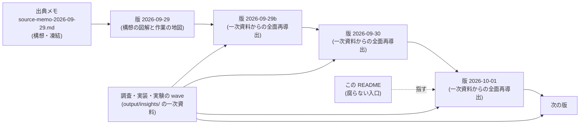
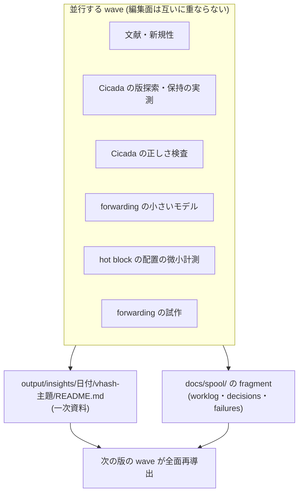

# docs/paper-story-vhash/ — VHash と timestamp forwarding の論文ストーリー

MVCC の版探索・履歴保持・GC を、**少数の版を手元に置くデータ構造 (仮称 VHash)** と
**cold な履歴へ入りそうなときだけ transaction の timestamp を安全に進める仕組み (選択的 forwarding)** の
組み合わせで減らす、という研究構想の論文ストーリー系列。主な比較相手は CCBench の Cicada である。

## この系列の位置づけ

- **`docs/paper-story/` (izanagi 本体の論文) とも `docs/paper-story-backoff/` とも別の論文である。**
  本体論文は「AI が CC を合成する」を主題にするが、本系列は人間が設計する MVCC の機構そのものを主題にする。
  系列を分ける契約は D1637 (1 系列 1 ディレクトリ、同じ凍結契約)、本系列を新設した判断は
  `docs/decisions.md` の本系列新設の決定 (2026-09-29) が持つ。
- **出発点はユーザーが 2026-09-29 に提供した研究メモ** (`source-memo-2026-09-29.md`)。外部の対話 AI との
  議論の要約であり、**構想の記録であって一次資料ではない。** メモが文献について書いている内容は、
  wave が原典で確かめるまで「メモがそう書いている」以上の地位を持たない。
- 各スナップショットは**特定時点の凍結物**である。書いた後は更新しない。新しい日付の版は、その日付時点の
  正典全体からの導出でなければならない (`docs/paper-story/README.md` と同じ契約)。
- **正典 (矛盾があればこちらが勝つ):** `docs/decisions.md`・`docs/worklog.md`・`output/insights/` の一次資料。
  本系列の版は導出物であり、数値・日付・判定の出所にしない。

## 版の履歴

| 日付 | ファイル | 時点 | headline |
|---|---|---|---|
| 2026-09-29 | `2026-09-29.md` | 出典メモの受領直後。実装・計測・文献確認・正しさの証拠はいずれもゼロ | **構想の図解と作業の地図。** 6 つの仮説はすべて「構想のみ」。前提となる Cicada の正しさ検査は未整備 (Cicada のソースに検査用トレースが無い) |
| 2026-09-29 (第 2 版) | `2026-09-29b.md` | 起点 local main `035fc11fa`。一次資料 9 本 (文献 2・Cicada の検査 2・実測 2・小モデル 2・試作 1) と評価計画の草稿 (未発効) が着地。比較相手の較正・一般の論証・試作の GC 接続などは未着地 | **論文の重心は「探索を速くする」から「版を抱える期間を縮める」の側へ寄る、という読み。** 新規性は U1 (cold 契機) と U0 (前進を保護下限へ反映する機構と確定・公開の順序) に置き直し、U2 は既知。H1・H2 は実測あり、H3・H4 は設計中、H5・H6 は構想のみ。Cicada の正しさ検査は整備済みだが上限は indeterminate で、forwarding の性能値は未検証の診断値 |
| 2026-09-30 | `2026-09-30.md` | 起点 local main `4f412c67b` (2026-09-30 05:17 JST の fold、worklog エントリ 1970 まで)。前版の後に一次資料 15 本 (較正・最良設定の正しさ・CCBench の修理 2 本・一般の論証・判定器の拡張・構成 E・read-only 2 本・代行・記録の水準の設計・動機・構成 B・前進先) と評価計画の草稿 v1 (未発効)・第 40 回 /rulings (D2305) が着地。md_18・md_26・md_28・md_29・md_31・md_32 は未着地。本文の Mermaid 40 図・埋め込み 26 図 (新しい値の図は作っていない) | **探索の側 (H1) は Cicada の中では探索段の予備的な語で支持されず (確認段は未実施)、保持の側 (U0) は偏りが中程度までなら実物で効いた (計器入り build の診断値)。** 構成 B は ro 95% でも同時刻の stock 比が 12 組の中央値で 0.980〜1.011 (予備的に不支持 (差なし)、主 cell と A/A 腕は無い)。構成 E は skew 0 で回収境界の遅れ −54%、前進先 E-max は skew 0.6 でも 19.5 → 10.0 ms、skew 0.9 では要求の多くが前進先を持たず (`no_room`) 効果は小さい。read-only が GC の公開を止めるのは比較相手 Cicada の実装欠陥で、修正の効果と本案の効果を分けて書く (比較相手に入れるかは T-2933 でユーザー判断待ち)。Cicada の記録は中間案 M にユーザー裁定済み (D2305 項 4) だが未実装で、性能値はすべて未検証の診断値・正しさは上限 indeterminate。題名と主張の重心の択一を並べた (決めるのはユーザー)。代行 (HP) は限界として書き付録に置かない。前版の執筆時点の誤りは 0 件 (0 件の証明ではない) |
| 2026-10-01 | `2026-10-01.md` | 起点 local main `63378acb8` (2026-10-01 08:45 JST の fold、worklog エントリ 2003 まで)。前版の後に一次資料 14 本 (区間 GC・構成 E の論証・早い abort・仮定と実装の照合・比較相手の欠陥 4 件の修理・負荷の空間・hot 配置 B-post・S2 の計画・時間窓間のばらつき・読み続ける read-only・中間案 M・最高水準との直接比較、と本文の初稿・第 2 稿) と評価計画の草稿 §15・§16、D2318〜D2337 の VHash 関連 (D2321・D2328・D2335 を除く) が着地。依頼は md_42 を稼働中としていたが、書き始める前に着地したので着地済みとして扱った。md_39・md_43 は未着地。本文の Mermaid 41 図・埋め込み 36 図 (新しい値の図は作っていない) | **芯は U0 (前進を確認 → 確定 → 公開の順で保護下限へ反映する) に確定し (D2322 項 1)、U1 は未実装の構成 D と分けて書いた。方針「条件 C で最高水準より大きく速い」の証拠は起点で 1 つも無い。** U0 は回収境界の遅れを縮めた (zipf 0・0.6 は E-max、0.9・0.95 は方策 c を足して、計器入り build の診断値) が、throughput の差は stock に対しても検出できず、修正済みの最良 Cicada とは比べていない (md_42 でも欠測)。今の VHash の腕 (hot v2・前進 C の最小前進) は修正済みの最良 Cicada を越えず (30 秒比較 0.93〜0.99)、D2337 が主論文の候補から外す推奨を出した (ユーザーの裁定は無い)。長い読み手の費用は大きく残る (R−LR / R 1.5〜2.0) が今の腕は触れない。構成 E の論証は抽象仕様について成り立つが、試作は仮定を満たさない箇所があり、その修理 (md_39) は未着地。中間案 M は実装され検査 run で違反 0。評価の優先は T-2930 系・md_39・S2・T-2916 を構成 D より先に置いた。前版の執筆時点の誤りは、親の点検では 0 件、段 6 の独立レビューで参照の誤記 1 件 (3 版目 §3.5 の存在しない「§5.7」)。全件の照合ではない |

**最新 = [`2026-10-01.md`](2026-10-01.md)。** 以後に確定したことは下の stale 注記を見る。

## 最新スナップショット以後に確定したこと (stale 注記)

wave が着地して最新版の記述が古くなったら、差分の版を足さずにこの節で一次資料の所在を指す。**矛盾があればここが指す一次資料が勝つ。**
次の版の wave はこれらを全面再導出の入力にする。本節は所在と要点を指すだけで、版の本文の代用ではない。

**現在この節に積んでいる項目は 1 件である。** 2026-10-01 版は 2026-10-01 08:45 JST の local main (`63378acb8`、worklog エントリ 2003 までの fold を含む) から導出している。

1. **md_43 (VHash の read-only 前進の新規性と、条件 × 手法 × SOTA) が着地した** — worklog エントリ 2005、決定 D2340、一次資料 `output/insights/2026-09-30/vhash-ro-novelty-sota/README.md` (2026-10-01 10:03 JST の merge `1f66fb6dc` で main へ)。
   2026-10-01 版は起点の時点に従い「md_43 は未着地」と書いている (§0・§9.4・§11・§12.2)。
   要点: 読み続ける read-only tx の前進 (主張 A。2026-10-01 版 §7.2 の RO-A の系) の比較相手は、読み手を固定したまま必要な版だけ残す精密 GC の系 (Steam の EPO と Wei ほか PPoPP 2023 の range-tracking 型) を
   ro-gcflag 修正入りの最良設定 Cicada に移したものとし、本案はその上に載せて測る。min 型 GC の Cicada との差を SOTA への勝ちと書かない。精密 GC より減らせる対象は特定できたが量は分からず、「SOTA より大きく速い」は仮説として扱う。
   A について索引に基づく不在の文は書かない (要裁定 20 件)。既読の版が前進先で見えるだけでは read-only tx の一貫性に足りない (不在を読んだキーへの挿入・範囲読み取り) (D2340 項 1〜5)。
   影響を受ける 2026-10-01 版の節: §0.2 (方針との照合と T-2970 の判断材料)、§7 (長い読み手を攻める候補と区間 GC の SOTA)、§11 (新規性)、§12 (次の一手)。**この項は U0 (構成 E) の比較相手を決めたものではない。**

2026-09-29 版に付いていた 2 件は 2026-09-29b 版が吸収した。2026-09-29b 版に対して積んでいた 1 件 (比較相手 Cicada の較正の着地、worklog エントリ 1930) は、
2026-09-30 版が本文へ取り込んだ (移管先は同版の §8.1・§9.2・§10.4)。2026-09-30 版に対しては、この節に項目を積まないまま後続の着地が続き、2026-10-01 版がそれらを全面再導出の入力にした (入力の一覧は同版の冒頭)。

**積んでいる項目の数は「最新版に誤りが有る」ことも「無い」ことも保証しない。** 次に正典が動いたら、その項目をここへ積む。着地の見込みがある作業の一覧は 2026-10-01 版の §12 にある
(起点で並走中の md_39 (構成 E の書き込み検査の走査中の回収の修理) と md_43 (新規性と SOTA の洗い直し) を含む)。
**項目が積まれること自体は、新しい日付の版を作る要求にはならない。**

## wave の成果物の置き場

本系列を前進させる wave は、**この README と版を編集しない。** 成果物は次に置き、次の版の wave がそれらを
一次資料として全面再導出する。複数の wave が並行しても、この README の同じ行を奪い合わないためである。

- **一次資料:** `output/insights/<日付>/vhash-<主題>/README.md` (測定・証明・文献確認の記録)。
- **台帳:** `docs/spool/` の fragment (`docs/spool/README.md` の形式)。
- **CCBench の改変:** D16 / D18 / D20 の分類に従う (合成 variant と診断計器は既定で元と挙動が一致する
  inert patch として `patches/` に置く)。submodule の gitlink は動かさない。
- **論文図:** まだ無い。値を持つ図を作る wave は `tools/plotting/FIGURE_CONVENTIONS.md` に従い、
  図を一次資料の側に置く。2026-09-29b 版は一次資料の側の値の図 7 枚、2026-09-30 版は 26 枚、2026-10-01 版は 36 枚 (いずれも生成器と provenance 付き) を相対 path で埋め込んだが、
  論文図への昇格はしていない。本系列に `figures/` を作るのは論文図へ昇格させる版の wave であり、
  そのとき `docs/paper-story/figures/README.md` と同じ凍結契約を敷く。

## 版を書くときの図の使い方

`docs/paper-story/README.md` の「版を書くときの図の使い方」節の 6 項目を本系列にもそのまま適用する
(ユーザー指示 2026-09-27: 文章が多いと精読が難しく、図のほうが見てわかりやすい)。要点だけ書く。

- §0 と主要な節は図から始め、文章は図の読み方と、図から読み取ってはならないことにする。
- 値を含まない模式図 (流れ・構造・状態) は Mermaid で描いてよい。**数値・判定・区間・有意性は Mermaid に書かない**
  — 値を持つ図は生成器と provenance を伴う図にする。
- 版を書き終えたら本文の図の数を数え、前版より減らさない。

## `docs/paper-story/` との関係

- **共有するもの:** 絶対規律 (観測者効果の分離、正しさゲートを緩めない、性能値と certified の区別、
  規律 7 の追記訂正)、CCBench の基盤、Pegasus の実行作法。
- **共有しないもの:** 数値と図。本体論文や backoff 系列の値を本系列へ引き写さない。
- 本体論文の入口 (`docs/paper-story/README.md`) は動かさない。

## 読み方

- 本論文の執筆・位置づけの検討・wave の分担を決めるときに読む。日常セッションのブートには不要 (D35)。
- 進行中の可変状態の正本は `docs/worklog.md` の末尾エントリであり、本 README には書かない。

## 運用ルール (check_docs.py との関係)

- 本ディレクトリの文書は追記型の凍結記録なので `tools/check_docs.py` の `LIVING_DOCS` (現況主張 lint) の
  対象外。`docs/paper-story/` と同じ扱いである。
- 他文書からは**ファイル名 (basename) で参照**する (行番号参照は禁止・節名参照にする)。
