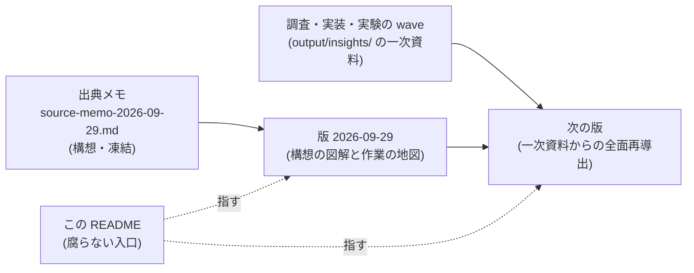
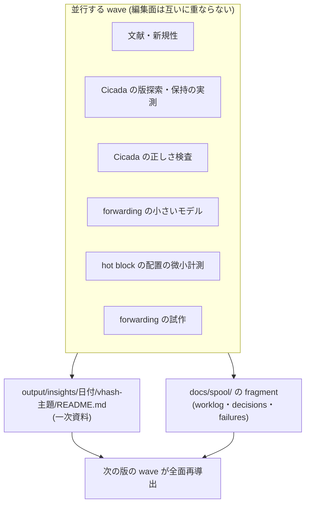

# docs/paper-story-vhash/ — VHash と timestamp forwarding の論文ストーリー

MVCC の版探索・履歴保持・GC を、**少数の版を手元に置くデータ構造 (仮称 VHash)** と
**cold な履歴へ入りそうなときだけ transaction の timestamp を安全に進める仕組み (選択的 forwarding)** の
組み合わせで減らす、という研究構想の論文ストーリー系列。主な比較相手は CCBench の Cicada である。

## この系列の位置づけ

- **`docs/paper-story/` (izanagi 本体の論文) とも `docs/paper-story-backoff/` とも別の論文である。**
  本体論文は「AI が CC を合成する」を主題にするが、本系列は人間が設計する MVCC の機構そのものを主題にする。
  系列を分ける契約は D1637 (1 系列 1 ディレクトリ、同じ凍結契約)、本系列を新設した判断は
  `docs/decisions.md` の本系列新設の決定 (2026-09-29) が持つ。
- **出発点はユーザーが 2026-09-29 に提供した研究メモ** (`source-memo-2026-09-29.md`)。外部の対話 AI との
  議論の要約であり、**構想の記録であって一次資料ではない。** メモが文献について書いている内容は、
  wave が原典で確かめるまで「メモがそう書いている」以上の地位を持たない。
- 各スナップショットは**特定時点の凍結物**である。書いた後は更新しない。新しい日付の版は、その日付時点の
  正典全体からの導出でなければならない (`docs/paper-story/README.md` と同じ契約)。
- **正典 (矛盾があればこちらが勝つ):** `docs/decisions.md`・`docs/worklog.md`・`output/insights/` の一次資料。
  本系列の版は導出物であり、数値・日付・判定の出所にしない。

## 版の履歴

| 日付 | ファイル | 時点 | headline |
|---|---|---|---|
| 2026-09-29 | `2026-09-29.md` | 出典メモの受領直後。実装・計測・文献確認・正しさの証拠はいずれもゼロ | **構想の図解と作業の地図。** 6 つの仮説はすべて「構想のみ」。前提となる Cicada の正しさ検査は未整備 (Cicada のソースに検査用トレースが無い) |

**最新 = [`2026-09-29.md`](2026-09-29.md)。** 以後に確定したことは下の stale 注記を見る。

## 最新スナップショット以後に確定したこと (stale 注記)

wave が着地して最新版の記述が古くなったら、差分の版を足さずにこの節で一次資料の所在を指す。**矛盾があればここが指す一次資料が勝つ。**
次の版の wave はこれらを全面再導出の入力にする。本節は所在と要点を指すだけで、版の本文の代用ではない。

1. **文献調査が着地した (2026-09-29、worklog エントリ 1908)。** 一次資料は
   `output/insights/2026-09-29/vhash-related-work/README.md` (§0 が要約、§8 が既知・未確定の分類)。
   最新版 §3.2・§10 が「新規性は hot 版の選択と GC への接続にある」と読める箇所について、同資料は
   「旧版を読ませつつ tx の timestamp 区間をその版に合わせて調整すること」を Lomet 2012 で既知と確認し、
   「言われていないと主張できるもの」を該当なしとしている。残件は [T-2873]。
2. **Cicada を正しさ検査器に掛けられるようになった (2026-09-29、worklog エントリ 1910)。** 一次資料は
   `output/insights/2026-09-29/vhash-cicada-verifier/README.md`。最新版 §8 の前提「Cicada の正しさ検査 = 未整備」は、
   YCSB の point read / update について整備済みに変わった (trace patch は D2279)。**判定の上限は indeterminate であって
   certified ではない** (巡回が無い履歴は「巡回なし」であり、serializable の証明ではない)。残件は [T-2874]。

## wave の成果物の置き場

本系列を前進させる wave は、**この README と版を編集しない。** 成果物は次に置き、次の版の wave がそれらを
一次資料として全面再導出する。複数の wave が並行しても、この README の同じ行を奪い合わないためである。

- **一次資料:** `output/insights/<日付>/vhash-<主題>/README.md` (測定・証明・文献確認の記録)。
- **台帳:** `docs/spool/` の fragment (`docs/spool/README.md` の形式)。
- **CCBench の改変:** D16 / D18 / D20 の分類に従う (合成 variant と診断計器は既定で元と挙動が一致する
  inert patch として `patches/` に置く)。submodule の gitlink は動かさない。
- **論文図:** まだ無い。値を持つ図を作る wave は `tools/plotting/FIGURE_CONVENTIONS.md` に従い、
  図を一次資料の側に置く。本系列に `figures/` を作るのは論文図へ昇格させる版の wave であり、
  そのとき `docs/paper-story/figures/README.md` と同じ凍結契約を敷く。

## 版を書くときの図の使い方

`docs/paper-story/README.md` の「版を書くときの図の使い方」節の 6 項目を本系列にもそのまま適用する
(ユーザー指示 2026-09-27: 文章が多いと精読が難しく、図のほうが見てわかりやすい)。要点だけ書く。

- §0 と主要な節は図から始め、文章は図の読み方と、図から読み取ってはならないことにする。
- 値を含まない模式図 (流れ・構造・状態) は Mermaid で描いてよい。**数値・判定・区間・有意性は Mermaid に書かない**
  — 値を持つ図は生成器と provenance を伴う図にする。
- 版を書き終えたら本文の図の数を数え、前版より減らさない。

## `docs/paper-story/` との関係

- **共有するもの:** 絶対規律 (観測者効果の分離、正しさゲートを緩めない、性能値と certified の区別、
  規律 7 の追記訂正)、CCBench の基盤、Pegasus の実行作法。
- **共有しないもの:** 数値と図。本体論文や backoff 系列の値を本系列へ引き写さない。
- 本体論文の入口 (`docs/paper-story/README.md`) は動かさない。

## 読み方

- 本論文の執筆・位置づけの検討・wave の分担を決めるときに読む。日常セッションのブートには不要 (D35)。
- 進行中の可変状態の正本は `docs/worklog.md` の末尾エントリであり、本 README には書かない。

## 運用ルール (check_docs.py との関係)

- 本ディレクトリの文書は追記型の凍結記録なので `tools/check_docs.py` の `LIVING_DOCS` (現況主張 lint) の
  対象外。`docs/paper-story/` と同じ扱いである。
- 他文書からは**ファイル名 (basename) で参照**する (行番号参照は禁止・節名参照にする)。
