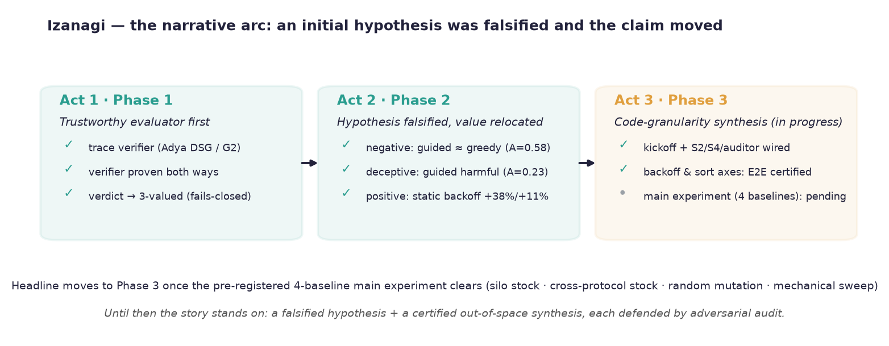

# Izanagi 論文ストーリー — 新スナップショット下書き (2026-07-10 / Phase 3 段5 完了時点)

> **この文書の位置づけ:** `docs/paper-story-2026-07-03.md`（Phase 3 着手前の凍結スナップショット）を土台に、Phase 3 の段 5 完了（sort 軸 iteration 1 が実 LLM で E2E certified）までの進捗を織り込んで**論文の下書きとして読みやすい形に再合成した新スナップショット**。旧文書は「凍結・更新しない」方針なので、これは差し替えではなく**新しい版**。
>
> **正典（矛盾があればこちらが勝つ）:** `docs/roadmap.md` §8（ポジショニング）・`docs/decisions.md`（設計判断 D-番号）・`docs/worklog.md`（時系列）・`docs/phase3.md` + `docs/phase3-main-experiment.md`（Phase 3 の完了定義と事前登録）。数値は成果物 JSON/MD（`output/campaigns/`, `output/env/`）から直接読み取って裏取りした。
>
> **注意（執筆時の節度）:** 本文書はまだ *下書き* であり、§7 の過大主張チェックリストは執筆フェーズで消し込む運用対象。headline 主張は Phase 3 主実験（後続段 6）成立まで留保が正しい。

---

## 0. 一目でわかる全体像

物語の骨格は **「当初仮説が反証され、主張が移動した過程」そのもの**。第 1 幕で信頼できる評価器を建て、第 2 幕で「賢い探索が速い」という当初仮説を反証し、価値が別の場所（探索空間の外への合成）にあることを発見した。第 3 幕はその発見をコード粒度の合成として実装している段で、機構は段 5 まで通り、主実験（headline 主張）はこれから。

---

## 1. 何のプロジェクトか（一言）

CCBench（10 プロトコル × 最適化フラグ群、YCSB 対応は 7: silo/tictoc/mocc/cicada/ermia/si/oze）を素材コーパスに、**AI がワークロード特化の並行性制御（CC）を自動合成するシステム**を作りながら、その過程自体を研究記録として残すプロジェクト。最終成果物は 3 点：

1. **新しい CC**（既存 CC + 引っ張ってきた／合成した最適化）
2. **なぜそれが速いかの説明**（機序まで言語化）
3. **試行錯誤の記録**（どれをやるとどうだったか）

3 番目（説明可能性）が差別化の核。先行の Polyjuice / CCaaLF は policy table という数値の塊を出すだけで「なぜこの CC が速いか」を言語で説明できない。Izanagi は試行ログから因果込みのレポートを生成し、各主張を WAL の run 値まで辿れる証拠連鎖（forensic binding）で裏づける。

---

## 2. ストーリー（3 幕構成）

### 第 1 幕（Phase 1）— 信頼できる評価器を先に建てる

- **trace verifier（Adya DSG / G2 検出）の検出力を二重に実証。** わざと壊した Silo（read validation 除去 patch）で 1,310 件の G2 赤、無改変の本物 si で 3,576 件の G2 赤、素の Silo は緑 → 「verifier は計装の副作用でなく正しさそのものを見ている」。逆側は P2-0 の 8 genome 全緑で「緑を取りこぼさない」も対で実証。
- **verify-the-verifier（敵対的検証）** が「不正な trace で赤を隠せる」false-green の穴を検出 → verdict の 3 値化（`indeterminate` 追加）で fails-closed に硬化。「pass/fail の verifier」から「integrity を主張の前提に置く verifier」への転換。
- **calibration の前提崩壊。** 「cache miss 率の飽和点を探す」当初前提が masstree の実測で崩壊（木深化で単調上昇、膝が出ない）→ 下限基準（working set ≥ L3×K）へ方法論を書き換え（D15）。

### 第 2 幕（Phase 2）— 当初仮説の反証と、価値の所在の発見

論文の心臓部。**対になる 2 つの結果**がある。

#### 否定的結果（P2-5, D21/D29）— 「賢い探索は自明空間では役に立たず、有害ですらある」

当初の絵「LLM 誘導探索は全探索より速く収束する — これが論文の図になる」は反証された。silo のフラグ空間は実質 `BACK_OFF=0` の 1 ビットで決まる自明空間で、「誘導が速い」図は評価器の優位を評価器の定義で論証する循環になると設計段階で判明。主成果を negative result + critic ablation に枠組み直した（ユーザー承認）。確定した数値（`p2-5-summary.json`、replay = 新規計測ゼロ）：

- **balanced:** LLM 誘導は機械的勾配（貪欲）と有意差なし（確率優越 A=0.581, tie 補正 z≈+0.98, p≈0.16）。
- **write-heavy（deceptive 構造: `BACK_OFF=1` が実 2 位）:** 誘導は貪欲より**有意に有害**（A=0.230、厳密 permutation p=2.52×10⁻⁴、全 50,268 構成を列挙した exact 検定。Holm ×6 でも p≈1.5×10⁻³ で有意）。誤収束 8/12 =「自信ある早期停止の負債」。
- これは reward hacking（最適化圧力が正しさを攻撃する）の**鏡像** — 評価器側の過信が deceptive 信号下で負債になることの定量実証。

**統計方法論の誠実性の実装:** `p2-5-summary.json` はトップレベルに `recalibration_2026_07_02`（p_lt 系統バイアスの発見→確率優越 a への再校正、D29）と `correction_2026_07_03`（過大表示された p 値の厳密 permutation での訂正）を残している。**「訂正の訂正まで成果物に機械可読で残る」= 誠実性の物理的実装。**

#### 肯定的結果（P2-4 backoff ケーススタディ, D18/D20）— 「価値は空間の外への合成にある」

critic の指標帰属（「適応 backoff は abort を潰せているが IPC 崩壊 = over-throttling」）が、フラグ空間の**外**の新軸「backoff 量の静的固定」の合成を駆動した。結果、certified serializable を保ったまま stock 最良を **write-heavy +38.3% / balanced +11.3%** 上回った（cross-run 再現・機序純度の分離まで敵対的検証済み）。

- stock の適応（Cicada 型 hill-climbing）が grid 刻み 100µs のせいで sweet spot 5–10µs に**物理的に到達不能**で ~560µs に駐車する（spin 87.3%）構造欠陥まで実測で特定。
- 機序は有用 IPC の分離（`BACKOFF_NOINLINE` 計器、観測者効果 +0.76% = floor 内で inert）により「abort 半減が有用 IPC 不変のまま効いた = 純 spin 希釈の除去」と閉じた。

**この対比が第 2 幕の結論を確定させる:** 「フラグ探索は自明で LLM の出る幕がない。価値は空間の外への合成にある」。否定的結果は薄い結果ではなく、「なぜコード合成（Phase 3）が要るか」を定量的に動機づける要石（keystone）。

### 第 3 幕（Phase 3、進行中）— コード粒度の合成

CCBench コードの `EVOLVE-BLOCK` 領域を LLM（coder）が diff で書き、フラグ空間の外に最適化 variant を合成する。P2-4 backoff がその予告編、P2-5 の negative result が動機づけ。**進捗（すべて正典 = worklog / phase3.md / decisions.md で裏取り）:**

- **kickoff（〜2026-07-05, D30/D33/D34）:** `EVOLVE-BLOCK` 機構 + coder.md + 純 timing variant 1 本が `Tier0→pipeline.evaluate→verify→bench→WAL` を 1 周。完了条件 2 項（identity 後方互換 / 合成枝の cache-miss 新規ビルド、verify aborts 41,868 > 0）とも WAL 機械判定 10/10 PASS。identity honest の一次防壁を preprocess 後ハッシュ（source_digest）に、観測者効果分離を diff-of-diffs（`assert_trace_diff_matches_head`）に置いた（方針 A）。
- **段 2〜3（2026-07-06, D36/D37/D38）:** S2 verify 構成確定（gate 3 点 all_pass）、S4 load_rejections consumer 実体化（赤 → 構造化 → critic が形状別に帰属、実走赤 2 本）、auditor.md を read-only で生成 + write_set 被覆 assert + in-class positive control。
- **段 4（2026-07-08〜09, D39）:** diff 検疫 + planner/coder autonomous 駆動基盤。実 LLM で iteration 1〜4 all certified/success、iteration 5 は budget-walltime（3600s）で入口停止（予算停止規定どおり）。
- **段 5（2026-07-09〜10, D40〜D43）:** sort-strategy 軸の起動。git worktree 隔離（C1 drift 解消）、D41 の必須条件 7 点（permutation 保存 assert・非 SWO comparator の UB 特定・auditor 機械 gate 化ほか）を機構実装。**sort 軸 iteration 1 が実 LLM で E2E 到達 = certified**（coder が 3 段辞書式 comparator を提案、auditor verdict=pass、verify[legacy] serializable / verify[s2] serializable / bench median 274,872 tps CV 0.76%）。
- **段 6（主実験、未着手）:** headline 比較 4 対照（silo stock 最良 / クロスプロトコル stock 最良 / ランダム変異 / 機械 sweep）+ LLM ablation。**Phase 3 の headline 主張はこの段の完了をもって初めて出せる。** 前提タスク（S1 移植 or stock 専用計測経路・protocol 別 calibration・リーク制御の系全体化 D45 など）が段 6 の gate。

---

## 3. 新規性の主張（強い順、実証状態つき）

1. **対象の空白**［ポジショニング］: single-node CC の serializability を対象にした AI 合成は先行なし。Jitskit（KV ストア）・IDS（分散 KV consistency）の系譜の **3 本目**（roadmap §8）。
2. **帰属駆動・コーパス駆動の合成**［b1 は実証済み・範囲限定］: ゼロから合成（FunSearch 型、正しさ崩壊）でも完全証明付き（IDS、CC には重すぎる）でもなく、実証済みコーパスを土台に leading indicators の機序帰属が空間外の新軸を開く（b1 = P2-4 で実証、b2 移植は拡張予約 D32）。Polyjuice/CCaaLF が事前定義アクション空間内の配合探索なのに対し、**アクション空間自体を LLM が拡張する**点が質的な差。
3. **説明可能性**［限定スコープで実証］: policy table しか出せない先行に対し、「なぜ速いか」を機序（有用 IPC 分離）まで言語化し、主張を WAL の run 値まで辿れる証拠連鎖で裏づける。
4. **否定的結果の定量化**［実証済み］: 「評価器の自信ある早期停止は deceptive 信号下で負債」+ オラクル天井（2−k/N）・winner-tied set による否定的結果の構造的枠組み化。
5. **AI 主導研究の運用方法論**［実運用の記録あり］: 全主張への多エージェント敵対的反証（p_lt 系統バイアス発見→確率優越への再校正 D29 / hooks over-claim の独立検出 D30）、noise floor の用途別二分（within-run 品質ゲート / between-run 採否 floor、D19）、fails-closed 化、信頼境界（規律 6）、Phase 完了監査（roadmap §3.7）、文書一貫性の機構（`tools/check_docs.py` lint・`docs/handoff/` = セッションの WAL）。

**副産物（単体でも書ける）:** CCBench 本体の潜在バグを網羅探索が露呈し 2 件を上流還元（WAL ftruncate XOR = PR #116 / ODR 違反 heap-overflow = PR #118）。「網羅的全探索は最適化探索であると同時にコーパスのバグ発見器」。oze の skew 病理（グラフベース eager 検査の密競合グラフ非スケールの実例）。「realizable trace の全 cycle は必ず G2」定理（`isolation-phenomena.md`）。

---

## 4. 論文の図（案）

現時点で **本物のデータで描ける図**は以下（本文書に埋め込み済み）。Phase 3 主実験が成立すれば headline 図はそちらへ移る。

| 図 | 内容 | データ出所 | 役割 |
|---|---|---|---|
| Fig 0（arc） | 3 幕構成 + Phase 3 現況 | 本文書（合成） | 全体像・イントロ |
| Fig 1（negative） | 探索コスト分布: 誘導 vs 貪欲 vs random/oracle、3 workload | `p2-5-summary.json` | 第 2 幕・否定的結果 |
| Fig 2（backoff） | 静的 backoff の +38% と機序（abort↓/spin↑/useful IPC 不変） | `backoff_profile_*.json` | 第 2 幕・肯定的結果 |
| （段 6 で追加予定） | headline 4 対照比較 | 未取得（段 6） | 第 3 幕・主張 |

---

## 5. 見落とされがちな素材（欠落検査の指摘）

執筆時に取りこぼしやすいと欠落検査が名指したもの（旧文書 §4 を継承。一次資料へのポインタ）：

- **`isolation-phenomena.md`** — G2 定理（cycle は必ず rw を含む）+「G1a/G1b は committed-only trace では観測不能」という trace 形式の観測限界。小さいが独立した理論的貢献の一次資料。
- **`ccbench-anatomy.md`** — 死にフラグの発見（`NO_WAIT_OF_TICTOC` 等 3 種は探索空間から除外）、Silo の trace 3 点が全て CC-native フィールド（規律 1 を最小侵襲で満たせた根拠）、全 protocol 探索空間見積 ≈258 バイナリ（Phase 3 空間拡大候補の定量的由来）。
- **`audit-2026-06-30.md`** — 監査方法論の規模定量（初回 10 次元 × 57 エージェント → confirmed 34 / partially 12 / refuted 1）。refuted の実例（g++ 3 版実走で source_digest バイト一致 = 誤検出を実測で棄却）は「敵対監査は誇張も削る」の一次証拠。
- **`.claude/agents/critic-experiment.md`** — P2-5 リーク制御の一次資料（最適解 literal の物理削除・`model: opus` / `tools: Bash` のみ）。論文の再現性記述に必須。
- **`p2-5-summary.json`** — `recalibration` / `correction` がトップレベルキー = 統計訂正の履歴が成果物に機械可読で残る実例。
- **`p2-2-summary.md` の read-heavy 行** — 自分の勝者主張にも floor を適用し「+0.5% は信用できる差でない」と書いた、選択的報告をしない規律の最小実例。
- **文書一貫性の機構 / ブートコンテキスト衛生（D35）** — 「計測対象システムに課している原理（ダイジェストを流す・正本一元化・WAL）をエージェント運用層へ再帰適用した」再帰構造。運用方法論（新規性 5）の一次素材。

---

## 6. Phase 3 主実験の事前登録（headline はここで決まる）

`docs/phase3-main-experiment.md` に事前登録済み。**主張（反証可能な形）:** *coder が合成した variant が、certified serializable を保ったまま、フラグ空間最適（P2-2 全探索 ground truth）を between-run noise floor 超で上回り、cross-run 再現と機序帰属が付く。かつその利得が非 LLM ベースラインでは到達できない。*

**headline 比較 4 対照:**
1. **silo stock 最良**（P2-2、同一 workload/skew/thread）
2. **クロスプロトコル stock 最良**（mocc/tictoc/cicada 等の同一 workload 最良）— 層1「workload→ベース CC 選定」を初めて実走
3. **ランダム EVOLVE-BLOCK 変異**（同一編集面・同一予算、Tier0 通過のみ算入）
4. **人間が軸を命名し LLM なしで回す機械 sweep**（利得が機械 sweep で再現できるなら LLM 不要という帰無仮説）

**失敗条件（何が出たら negative か、事前定義）:** (a) certified を破る→無価値、(b) 利得が floor 以下→「差なし」、(c) 機械 sweep/ランダム変異で同等再現→ LLM 固有価値なし、(d) silo 内では勝つがクロスプロトコル stock 最良に負ける→「ベース選定を誤っただけ」、(e) target workload で勝つが他 workload で floor 超退行→退行込みで全 workload 報告（選択的報告の禁止）。

**2026-07-10 の外部評価（D44）による強化:** 軸適格性（スカラー 1 個に還元できる backoff 等は headline 候補にしない、コード片合成軸 = sort 以降に限る）、失敗条件 (c) の同等性判定手続きの明文化、ベースライン 4 の二重役割分離（sweep-matched / sweep-ceiling）、リーク制御の系全体化（planner→coder 経路の遮断も headline 前提、D45 で Read 経路遮断済み）。

---

## 7. 過大主張チェックリスト（執筆時に消し込む）

欠落検査が「そのまま書くと自前の監査記録・限界記載と矛盾する」と特定した項目。解消条件を満たしたら `[x]` + 根拠を追記する。

- [ ] **「certified なまま +38%/+11%」の但し書き** — certified は検証 workload（tuple200/thread4/rmw=true）上で、性能 workload の trace は correctness-inert の機序論証に依る外挿だった。**解消条件: S2（certify を perf workload に揃える）の消化。** → *段 5 で S2 verify 2 本立てが pipeline 配線され sort 軸 iteration 1 が verify[s2] serializable（476,545 aborts）で通過。backoff ケーススタディ自体への遡及適用は段 6 の headline 再計測時。*
- [ ] **「verifier はツール権限で書き込み隔離」と書かない** — `audit-2026-06-30 §4` が「Bash を持つ以上 tool レベルの隔離は不成立」と裁定済み。正確な形 =「専用書き込みツールの除去 + prompt 規律による禁止 + verifier 入力側の性能数値隔離」。**恒久（表現規律）。**
- [ ] **hooks を「実装済みの機械防壁」と書かない** — 敵対検証で「テキスト検査に完全性を負わせる設計は原理的に破れる」を実証し、一次防壁（source_digest / 観測者効果二重検査）へ責務再配置（D30）。語れるのは「否定的結果込みの防壁設計事例」+「最小第二防壁」まで。**方針 A 配線済み・回帰テスト緑。**
- [ ] **「構造化 anomaly の自動還流」は設計であって実証は入口のみ** — S4 配線完了・「赤 → 構造化 → critic が形状別に方向を返す」まで実走（D37）。**「還流」(critic 出力が次 variant 生成に使われる) と「改善」は未実証** — 段 4〜6。**解消条件: 段 6 で還流 on/off ablation。**
- [ ] **「コーパス駆動」の実働範囲を明記** — 探索・合成が回ったのは silo 1 protocol + backoff 軸 + sort 軸のみ。trace-hook は silo/si 以外に未移植（S1）で他 protocol は verify 不能、クロスプロトコルは baseline 計測（7 protocol）止まり。**解消条件: S1 移植 + 空間拡大（cicada/oze）の実走。**
- [ ] **「統計的に裏打ちされた」の正確な形** — 有意性検定ではない。reps≈5 の Mann-Whitney は完全分離で常に p≈0.012 を返し無力。主防壁は between-run floor 丸め + floor〜1.5×floor 帯の cross-run 再現 + 証拠連鎖。**恒久（表現規律）。**
- [ ] **「AI が CC を合成し説明した、は新しい」の一般主張は Phase 3 主実験まで留保** — 現時点で実証済みなのは silo 1 protocol 内・backoff/sort 軸・contention 域限定・単一動作点（skew0.9/48thread/1m）。言えるのは「限定スコープでの最初の成立例」まで。**解消条件: Phase 3 主実験（4 対照 headline）の成立。**
- [ ] **中間 backoff / sort comparator 自体の単体新規性を主張しない** — contention management も write-set sort も既存蓄積。主張は「Izanagi 方法論のケーススタディ」+「Cicada 型適応の構造的 over-throttling の機序特定」まで。**恒久（表現規律）。**
- [ ] **sort 軸 iteration 1 を headline にしない** — 現状は「機構が実 LLM 入力で全経路 certified まで到達した実証」であって、性能主張ではない（対照なし・n=1・critic 未召喚）。段 6 の 4 対照設計に従った時点で初めて主張になる。**解消条件: 段 6。**

---

## 8. 一言でまとめると

**AI に CC を合成させたら、賢い探索は自明空間で役に立たず有害ですらなかった。価値は指標の機序帰属が探索空間の外に新軸を開くことにあり、それは正しさゲートを一度も緩めずに stock 超えを達成した。そしてこの結論自体が、全主張を敵対的検証にかける運用規律の産物である** —— という、否定的結果と肯定的結果が互いを支える構造。

Phase 3 は機構が段 5 まで通り（sort 軸が実 LLM で E2E certified）、主実験（headline 4 対照）が成立すれば headline はそちらに移る。本文書の実証群（第 1・2 幕）は、その動機づけと方法論の実績になる。
