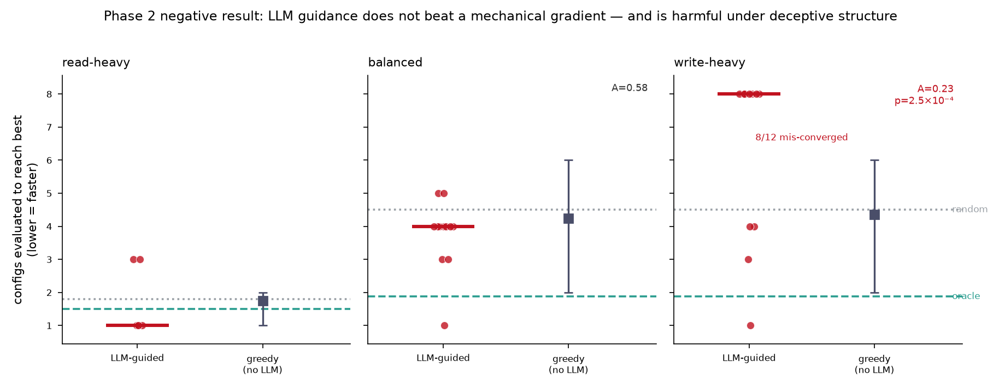

# Izanagi 論文ストーリー — 凍結スナップショット (2026-09-26 版 / 関数単位の軸が既知最良との小比較を経て段階 E へ裁定され、B-5 本走が投入後に中断して現行 cohort の 6 比較が判定不能になり、ccbench pin が C へ進み、TPC-C 段 1 の trace が pipeline に受理された後)

> **この文書の位置づけ:** `2026-09-23.md` (2026-09-23 版) の次の版である。旧版は「凍結・更新しない」方針なので
> 差し替えではない。前版との違いは 5 つにまとめられる。
> **第 1 に、関数単位の軸が既知最良と同じ job で比べられた。** 段階 D と同じ固定 16 点・8 job の構成に既知最良の参照 (静的 10 µs を元の適用方法で・`B0-L-W0`・stock) を
> 置いた小比較 (D2240) で、既知最良は全 8 job で静的 10 µs、IR 16 点の最良参照比は 0.836〜1.069、**3 点が同 job の静的 10 µs を 6〜7% 上回った** (5 rep の最小が同 job の
> 静的 10 µs の最大を上回った)。**探索的・1 回・再測なし・16 点から最大を選ぶ多重選択の補正なしで、B-1 (既知軸最良の超越) は不成立のまま**である。第 35 回 /rulings (D2243 項 1)
> は軸を段階 E へ進めると裁定し、この 3 点を論文で既知最良超えとして書く前に再測すると定めた — **段階 E は起点で未実装で、LLM が方策を生成した記録は無い。**
> **第 2 に、認可された実験が費用と LLM の週上限で止まった。** B-5 本走 (D2227 項 2) は block 1 stage 1 の 12 job (35.1 node 時間) を投入した後に中断し、LLM 親 4 本が
> 週上限 (429) で同時に止まったため、**現行 cohort の 6 比較すべてが report の規則のままでは判定不能 (欠測)** になった (entry 1866、F1050)。ユーザーは規模に異議を示し、
> 続行形は 4 択のユーザー裁定待ちである。探索の独立反復の試走 (D2245 で write-heavy だけ発効) も block 1 で 3 系列が欠測し、block 2・3 はユーザー指示で止めた (entry 1863)。
> **いずれも性能の結果ではない。**
> **第 3 に、基盤が 1 段進んだ。** ccbench pin が候補 C (`68106660`、mocc の X/P 計装) へ進み (D2236)、pipeline の trace 段が TPC-C 段 1 (57:43) の v3 trace を受理して実 trace 1 本を
> executor で certified にし (D2238)、silo と mocc の emitter を C の上に 1 系列で並べた結合候補が計算ノード 1 走の確認を通った (D2244。D297 の header 差分の受理方式は
> ユーザー裁定待ち)。比較 harness には MOCC が差し込まれ (D2248、MOCC の slot だけ campaign pin を C へ)、未知条件への転移の実行器と解析器が着地した (D2241)。
> **合成候補を TPC-C で認定・評価した記録も、MOCC で比較した記録も、転移の測定も無い。**
> **第 4 に、verifier の検出期待表が実走で埋まった。** silo の新規変異 15 行 (盲点として certified 6 を含む、D2239)、sort-nonswo (V07、盲点のまま)、mocc の 34 cell
> (期待した層で検出 20・盲点として certified 1・停止 3 ほか、D2246)。**検出力の網羅的な証明ではない。**
> **第 5 に、論文の周辺が整った。** 生成器のある 17 図を描き直して値の差 0・PNG の bytes 一致を確かめ (D2247、測定の再実行ではない)、主要 20 図の再実行計画を置き (entry 1848)、
> ADRS を位置づけの 1 文の `近傍` と判定した (entry 1849、1 文は逐語で残す)。
> **第 2 幕主軸の結論・S' の不成立・B-1 (既知軸最良の超越) の不成立は動いていない。採用構成 (静的 backoff) の性能の正式判定も前版から動いていない。**
>
> **正典 (矛盾があればこちらが勝つ):** `roadmap.md` のポジショニング節と「論文の目標と必須経路」節・`decisions.md`・
> `worklog.md`・`phase3.md` + `phase3-main-experiment.md`。数値・日付・判定は一次資料
> (`s_prime_final_report.md`、`output/insights/` の各記録と権威 bytes、`decisions.md` の D 本文、`failures.md`、
> 凍結された policy JSON と事前登録 blob、`docs/related-work/claim-survey/` の実行記録・裁定記録、
> `results/` 系列の統制稿が指す権威 bytes、`figures/` の provenance JSON と `figures/README.md`、
> `output/env/pegasus/calibration/registered/` の較正 record) から取った。
> **前版の記述は数値の出所にしていない。日本語草稿と ComSys 原稿も出所にしていない。**
>
> **この版で新規計測は一切していない。** その時点の正典からの導出だけで書いている (小比較の 8 job、B-5 本走の block 1 stage 1、試走の block 1 と検証の同時化の測定、
> 変異の実走、TPC-C の結合確認走、MOCC の較正と生死確認、転移の実行器の生死確認は、それぞれの wave が行った測定であり、この版はその記録を一次資料として引く)。
>
> **この版は差分改訂ではない。** `docs/paper-story/README.md` の運用契約と D1858 に従い、前版の全節を正典に照らして運び直した。冒頭・§0・§10 は差し替え、§1〜§9 は起点より後の
> 正典と食い違う状態語を直して新しい着地を足した。前版の文を運ぶときは時点語を機械的に付け替えた (「前版」→「2026-09-22 版」236 件、「この版」→「前版」109 件)。
> したがって**運んだ文の「前版」は 2026-09-23 版を指す。** 継続の主張 (「前版でもこの版でも」型 21 か所) は起点で真かを確かめてから延ばした (§10)。
> **導出の結果、前版が執筆時点で既に偽だった記述を 1 件見つけた (訂正 1 件、§1 の 1 か所。§10)。** 前版 §1 は機序仮説層 (v3) について「生まれた材料は 2 巡分の
> 非 certifying の二次 view」と書いたが、K2 4 巡目の還流 (材料レポート v3、`mechanism_hypotheses` 1 件、entry 1832) は前版の起点 `65fd1422f` (entry 1846 まで) に着地済みで、
> 前版自身の §8 B-9 は「3 巡分」と書いていた (版内の不一致)。この版の §1 は「3 巡分 (2・3・4 巡目)」と書く。前版の入口 README が積んでいた stale 注記 3 件 (第 33 回 /rulings D2235、ADRS の判定、
> pin の C への前進) は、いずれも前版の導出起点 `65fd1422f` (2026-09-23 15:06 JST) より後に着地した事実で、前版の記述は執筆時点では真であり「当時は真で、後続の前進が
> 古くした」型である。この版は 3 件を本文の該当節へ取り込み、README の注記から外す。
>
> **前版は自分の前版 (2026-09-22 版) を訂正した箇所を 0 件と判定し、2026-09-22 版・2026-09-21c 版・2026-09-21b 版・2026-09-21 版もそれぞれの前版について 0 件と判定した。
> 2026-09-20b 版が 2026-09-20 版を訂正した 1 件 (「非列挙」の定義の置き直しは未裁定、4 か所、2026-09-05 版以降の 5 版で執筆時点で偽)、2026-09-20 版が
> 2026-09-19 版を訂正した 1 件 (§3 項目 3 の見出し「仮説層は未実装」) と、2026-09-17 版が 2026-09-14 版を訂正した 3 か所 (層3 screening の対象範囲、
> official 初投入日 2026-09-09、D1341 未 land の誤認) は、この版でも正典で再確認し、そのまま維持する。** それらは各旧版自身の冒頭が持つ (README 契約)。
> **B-2 の `delta_min` について「受理集合を広げる向き」とは断定しない扱いも維持する** (D2049)。
>
> **いずれも凍結物である前版は書き換えていない。**
>
> **`docs/phase3.md` の「現行チェックポイント」は 2026-07-25 更新のままである。** この版でも
> 同節を現況の単独根拠にしていない。現況は worklog・decisions・`output/insights/`・
> `docs/related-work/claim-survey/`・`results/`・`figures/`・較正 record の一次資料と突き合わせた。
>
> **この版が取り込んだもの・取り込まなかったもの。** 導出の起点は local main `6d198ca8afddf9a1ecbc4ac421f163e080838751` (fold commit、
> 2026-09-26 17:17 JST。worklog entry 1867 までの fold を含む) である。前版の起点 `65fd1422f` (entry 1846) から entry 1847〜1867 の 21 エントリ
> (前版自身の着地 = entry 1853 を含む) と D2235〜D2248 の 14 決定が正典に加わった。新しい F 番号は F1047〜F1051 の 5 件で、うち F1047 (1 論文を読んだだけの近傍判定で
> 「最も近い」という世界順位を書いた)、F1049 (稿が狭く定義した certified を新しい事実に使った)、F1051 (「pin 前進は済み」を campaign pin まで含むと読んだ) は論文の書き方に
> 関わるので §7 に項を置いた。F1050 (B-5 本走の LLM 親の週上限) は B-5 の状態語に関わるので §8 に引いた。F1048 (等価変異の閉包) は開発運用の型である。
> **依頼が列挙した項目 (D2240、mocc 34 cell、MOCC 差し込み、17 図の描き直し、試走の中断と案 (b)、B-5 の判定不能と費用案、K2 4 巡、TPC-C 段 1) に加え、README の契約に従い
> 起点に着地済みの 1847〜1867 全体を反映した (段 1 の親の provisional 裁定 (P1)、§10)。**
> **導出対象はこの基準 HEAD に着地した正典に限る。稼働中で未着地の wave は導出対象に含めない** — 着地済みの裁定が定める未了条件 (関数単位の軸の段階 E、B-5 の続行形、
> 試走の続き、D297 の header 差分の受理方式、TPC-C を campaign で評価する配線と段 2、MOCC の疎通、転移の測定の発効、fig1 の生成器、R2) の説明は残すが、進行中の作業の
> 存在や内容は書かない。**例外として [T-2850] の案 (b) は、依頼が名指したので、採用がユーザー委任の親裁定として repo 外の job dir にだけ記録され正典には未記録であることまでを書く
> (段 1 (P2))。**
>
> **参照の書き方。** 他文書へはファイル名で参照し、行番号では参照しない。ただし
> `output/insights/` の記録は日付つきディレクトリの下に `README.md` を置く形が多く、
> ファイル名だけでは一意にならない。その場合に限り、ディレクトリ名を含めた形で書く。
> **D1941 (2026-09-10) が配置を定めた** — 新規資料は `output/insights/<日付>/<topic>.md` または
> 同日配下の topic ディレクトリへ置き、既存資料は bytes を変えずに日付別配置へ移して旧名索引を
> 残す。ただし固定 path を使う実験・凍結資料と、移動で壊れる既存リンクは旧位置を保つ。
> したがって**日付だけから形式を断定してはならない。** この版は新しく引く path を 1 件ずつ実在確認した。
> なお小比較の insight は `output/insights/2026-09-23/` の下にあるが、記録は 2026-09-26 の着地である (wave の起動日の dir)。
>
> **この版は、D2148 項 11 (一次資料から事実を再抽出する docs-only wave は段 6 の read-only 独立レビューを
> 残す) に従い、本文に対する読み取り専用の敵対レビューを通す。** 所見の裁定と fix 後の焦点再レビューは
> §10 に置く (草稿では予定形、凍結版では完了形 — 2026-09-20b 版 §10 の契約)。

---
## 0. 一目でわかる全体像

物語の骨格は前版と同じ。**第 1 幕と第 2 幕の科学的結論も動いていない。**
**中心命題 (縮小主張 S' の不成立) も動いていない。**
動いたのは第 3 幕の「あと何が要るか」の地図で、前版が「認可」「未投入」「設計」と書いた項目が、実行・中断・実装へ進んだ —
**関数単位の軸** (既知最良との小比較で 3 点が探索的に上回り、段階 E へ裁定)、**B-5 本走** (投入後に中断し、現行 cohort は判定不能、続行形は裁定待ち)、
**探索の独立反復の試走** (write-heavy だけで発効し、block 1 の後で中断)、**ccbench pin** (候補 C へ前進)、**TPC-C 段 1** (pipeline の受理と結合候補)、
**verifier の検出期待表** (silo・mocc の実走)、**比較基盤と転移** (MOCC の差し込み、実行器と解析器)、**再現パッケージ** (17 図の描き直しと再実行計画)。
**論文の性能主張 (B-1) と採用構成の正式判定は前版から動いていない。** 前版の起点より後の計算ノードの主な走行は、小比較の 8 job、B-5 本走の block 1 stage 1 の 12 job、
試走の block 1 の 6 job と検証の同時化の測定、変異の実走 (silo 15 行・V07・mocc 34 cell)、TPC-C の結合確認走 1 job、MOCC の較正 3 job と生死確認、転移の実行器の生死確認、
受入所要の対照 (受入 shard-0 の写しの隣接 3 対) と、各 wave の焦点走・変異・受入である。

- **第 1 幕 (Phase 1)** — 信頼できる評価器を先に建てた。完了。**この版で、評価器の検出期待表の実走 (silo の新規変異・sort-nonswo・mocc) が加わり、
  盲点として certified の行も記録された — 検出力の網羅的な証明ではない (§6)。**
- **第 2 幕 (Phase 2)** — 「賢い探索が速い」という当初仮説を反証し、価値が探索空間の外への
  合成にあることを発見した。完了。**論文の心臓部は今もここにある。** ただし、空間の外で見つけた静的 backoff は、backoff という機構としては
  Polyjuice (OSDI'21 §4.5) が学習の対象に含めていた (D2212 の理由欄) — 第 2 幕が言うのは「対象実装 (CCBench の Silo) のフラグ空間の外へ
  合成が到達した一事例」までで、機構の新しさではない。
- **第 3 幕 (Phase 3、進行中)** — コード粒度の合成。機構は深く進み、
  **合成軸が既知軸最良を超えるという主張 (B-1) は依然として不成立**である。関数単位の軸の小比較が 3 点で同 job の静的 10 µs を上回ったのは探索的な観測で、B-1 の判定を変えない。
  採用静的 backoff を現行環境の正式 protocol で測った判定は前版のとおり 3 走行 (A-2 `observed-positive` / A-6 `reject` /
  [T-1998] `accepted`) であり、A-1 の非認証 lane は 2 attempt (いずれも descriptive) のままである。
  B-8 は前版のとおり取得 (S-1 最終候補の正しさ検証で `pass`、限定 11 項)。K2 の同 job 対照 (pair と 4 巡目) は前版のとおり成立 (比は記述値)。

**前版から、正典の側で動いた事実は 11 点ある。**
(前版の記述で執筆時点から偽だったものは 1 件 — §1 の機序仮説層の材料を「2 巡分」と書いた箇所で、前版の起点に 4 巡目が着地済みだった。冒頭と §10。)

1. **第 33〜35 回 /rulings が着地した (2026-09-23〜26、D2235・D2237・D2243、entry 1847・1851・1860)。** D2235 は、人間が 2026-09-23 08:4x JST に GitHub へ push した
   TPC-C の ccbench branch `izanagi-tpcc-v3-trace` (C2 `a6f2c741`、親 C1 `56b5cb70`、基点 e9e477ca) をそのまま残し (pin 候補ではない)、C の上へ乗せ直した候補は別名の branch で
   人間の push 判断へ渡すと決め (項 1)、関数単位の軸は段階 E の前に既知最良との小比較を 1 回走らせると決めた (項 7)。D2237 は新しい裁定待ち 0 で人間手番を継続した。
   D2243 は関数単位の軸を段階 E へ進め (項 1、次項)、ComSys 原稿の著者・所属は今は渡されない (項 5「著者所属の情報をあなたに今与える意義はない」)、申込 10/16・送信 10/30 は
   人間手番のまま (項 6)。**いずれも裁定であり、push 以外の実施ではない。**
2. **関数単位の軸の既知最良との小比較 (2026-09-26、[T-2865]、entry 1856、D2240) と段階 E への裁定 (D2243 項 1)。** 段階 D と同じ固定 16 点・8 job (write-heavy、pin `e9e477ca` の branch。
   silo の source は C と同じ) に、stock・`B0-L-W0`・静的 10 µs (stock 木へ `patches/silo-backoff-fixed.patch` を当てる元の適用方法、実効 define を検査) を同じ job に置いた。
   既知最良は全 8 job で静的 10 µs (同 job 中央値 3,944〜4,011 千 txn/s、`B0-L-W0` 2,374〜2,533、stock 1,343〜1,378)。IR 16 点はすべて適格で最良参照比 0.836〜1.069、
   3% 線を越えたのは 3 点 (1.062〜1.069) で、いずれも 5 rep の最小が同 job の静的 10 µs の最大を上回り、段階 D (別 job) でも上位 3 点で throughput は 1% 以内で一致した。
   **報告カテゴリは「偵察 (preliminary)」で事前登録の構成ではなく、1 回・再測なし・多重選択の補正なし・3% 線は未較正。段階 D との一致は事前に定めた再現判定ではない。**
   D2243 項 1 は軸を段階 E (driver・role・firewall の機械化) へ進め、3 点の別 job 再測は段階 E の条件にせず、**論文 (ComSys 原稿を含む) でこの 3 点を既知最良を超えた点として書く前に行う**
   と定めた。点 ID・比は段階 E / F の coder・planner に渡さない (手順書 §3-D)。**段階 E は起点で未実装。**
3. **B-5 本走が投入後に中断し、現行 cohort は判定不能になった (2026-09-23〜26、[T-2797]、entry 1866、F1050)。** 本走の block 1 stage 1 (12 job) は 2026-09-23 21:53 JST に投入され
   (Elapse 計 126,426 s = 35.1 node 時間)、LLM 親 4 本が 23:50 JST に週上限 (429) で同時に止まり、series job が提案待ちの時間切れで系列を閉じた。report の規則のままで
   **6 比較 (3 workload × 2 baseline) すべてが判定不能 (欠測)**、write-heavy の random 2 系列は系列開始 stock の品質欠測で、その比較は再開しても判定不能。非 LLM の計算の 95.0 % が
   検証だった。ユーザーは規模に異議を示し (「図 1 枚に 680 node 時間はありえない」)、費用案 (LLM 待ちを node 外へ、取得済み trace の同時検査、系列数・workload の縮小) が
   **ユーザー裁定待ちの 4 択** (v1 を stage 1 で閉じて開示し v2 として登録し直す前提で A 251〜275 / B 189〜207 / C 86〜99 node 時間 / D 見送り) として提示された。
   **B-5 の発効 commit は main の祖先でない branch にあり、本走 wave は起点で未着地である。判定不能は report の規則の出力で、性能の結果ではない。**
4. **探索の独立反復の試走が write-heavy だけで発効し、block 1 の後で止まった (2026-09-23〜26、[T-2850]、D2245、entry 1863)。** D2245 は、ユーザーが 2026-09-23 に選んだ
   「write-heavy だけで試走」(S1-wh × 5 手法 × 3 系列 + block job 3 の 18 job、見積り 42.4〜60.6 node 時間、実装 `7ea9aa09d` に固定、CCBench は campaign の pin `511c9538`) を記録した。
   block 1 の 6 job (7.28 node 時間) で random・sweep・llm の 3 系列が欠測し (静定待ちの時間切れと LLM 親の週上限)、2026-09-26 にユーザー指示で block 2・3 の投入を止めた。
   評価 1 回の約 91 % が検証で、検証の trace 5 本を同じ node で同時に検査すると判定を全件一致させたまま検査の wall が 0.24〜0.26 倍になった。**正典の台帳は費用を削る案 (a)〜(c) を
   ユーザーの確認を要する択として残し、案 (b) (検証の同時化) の採用はユーザー委任の親裁定として repo 外の job dir にだけ記録されている (段 1 (P2))。試走の結果は無い。**
5. **ccbench pin が候補 C へ進んだ (2026-09-23、[T-2858]、entry 1850、D2236)。** gitlink `e9e477ca` → `68106660` (差分は `cc/mocc/transaction.cc` の +64 行)、`CURRENT_PIN` = `6810666`。
   現行 pin で mocc の X/P が evidence-present になり、verifier の正負対が追随した。**前進の範囲は D2150 項 1 の ①④⑦ で、比較 harness の campaign pin (`p3_s4_loop.PIN`) は
   511c9538 のまま (F1051)。探索・軸採用の解禁でも mocc の certified 系列でもなく、C-1 の性能比較は 0 件のまま。**
6. **TPC-C 段 1 が pipeline に配線され、結合候補が確認された (2026-09-23〜26、[T-2854]、entry 1852・1862、D2238・D2244)。** pipeline の `_run_trace` は、binary 名が `tpcc_` で
   57:43 の 4 flag が文字列で一致するときだけ trace を走らせて v3 を要求し、**実 TPC-C trace (silo、36,156 取引) を executor で certified にし、存在違反と末尾欠落の写しを reject** した。
   単位 11 は C → C1' → C3 → C2' の別名 local branch `izanagi-tpcc-v3-silo-mocc` (未 push) を作り、計算ノード 1 走で silo・mocc の TPC-C v3 と YCSB v2 の certified、TRACE=0 の同一性、
   変異 4 件を確かめた。**現行の D297 検査器は header 差分で C2' を拒否し、受理方式は 4 択のユーザー裁定待ち。production の build は YCSB だけで、campaign で TPC-C の候補を
   評価する配線は無く、現 pin の tpcc binary は v2 なので v3 要求で reject される。合成候補を TPC-C で認定・評価した記録・性能測定・段 2 は無い。**
7. **verifier の検出期待表が実走で埋まった (2026-09-23〜26、[T-2847]、entry 1854・1855・1864、D2239・D2246)。** silo の新規変異 14 本と trigger-misattr の 15 行 = 期待した層で検出 3・
   別の層 1・盲点として certified 6・未発生 2・対照の誤検出 0 (pin e9e477ca)。sort-nonswo (V07) は 17 要素で SIGSEGV (別の層)・16 要素で S で、verifier の判定は捕まえない。
   mocc の 34 cell (pin C) = 期待した層で検出 20・盲点として certified 1・未発生 2・発火未確認の S 2・停止 3・対照正常 6 (別の層・誤検出は 0)。**停止は deadlock の実証ではなく、
   盲点の行は verifier の欠陥の主張でもない (lock 順は直列化可能性の条件ではない等)。検出力の網羅的な証明ではない。**
8. **比較基盤に MOCC が差し込まれ、転移の実行器が着地した — いずれも比較・測定を含まない (2026-09-26、[T-2849] entry 1867 / D2248、[T-2851] entry 1857 / D2241)。** MOCC は pin C で
   較正 3 件 (records 1,000,000、silo と同値) を取り、比較 harness の protocol 引数で差し込まれ (MOCC の slot だけ campaign pin C)、計算ノードで stock と literal 候補 5 slot が
   certified で通った (疎通の生死確認)。転移の実行器と解析器は選定と発効を入力として受け、留保 cell は発効の記録なしに走らせない。錨の生死確認で検証が certified に届かない欠陥を
   見つけて直した。**留保 cell は 1 走もしておらず、測定は発効していない。**
9. **再現パッケージと図 (2026-09-23〜26、[T-2853]、entry 1848・1865、D2247)。** 主要 20 図の再実行計画 (R2 推奨 9 図、図 1 本で確認が要るのは fig10 の 3.40 node 時間ほか) を置き、
   生成器のある 17 図を計測機の外で描き直して **17 図とも値の差 0・PNG は bytes まで一致** (node 時間 0) を確かめた。標準評価経路の trace 保全口の inventory に R1 の入力一式を足した。
   **描き直しは生成器と保存入力からの再生成で、測定の再実行 (R2) ではない。着地した図は置き換えていない。**
10. **ADRS を位置づけの 1 文の `近傍` と判定し、ComSys 原稿を 2 度改訂した (2026-09-23〜26、[T-2864]、entry 1849・1859)。** 「LLM が」は満たし、「並行性制御を対象として」
    「アクション空間自体をコードで拡張」は一部だけ満たす — 反例ではないが条件の狭い読みに依存する。1 文は逐語で残し、軸 1 は `RW1` のまま。**「近傍」は非該当の断定ではなく、
    順位づけない (F1047)。** 原稿は 15 頁のままで、TPC-C の trace 1 本は原稿の certified の定義 (YCSB に限る) に合わせ「直列化可能と判定」と書いた (F1049)。**原稿はこの版の出所にしない。**
11. **運用側の着地 (論文の主張・状態語を変えない)。** 受入 shard-0 の写しの実装は事前登録の land 条件を満たさず land しない (entry 1858、D2242)、受入門番の数え方の統一 (entry 1861)。
    前版自身の着地は entry 1853。

**この 11 点のうち、論文の肯定的な headline 主張・新規性主張を増やしたものは 1 つも無い。** 増えたのは **探索的な観測** (関数単位の軸の小比較 — 再測前は既知最良超えと書かない)、
**実行と中断の記録** (B-5 本走・試走 — いずれも結果なし)、**基盤** (pin C、TPC-C 段 1 の pipeline 受理と結合候補、MOCC の差し込み、転移の実行器)、
**検出期待表の実測** (盲点の行を含む)、**再現の準備** (図の描き直し・再実行計画) である。
**「性能主張が届いた」「関数単位の合成が既知最良を超えた」とは書かない** — B-1 は S-1a で測って不成立のままで、小比較の 3 点は探索的・再測なしで、D2243 項 1 が再測を論文に書く前の条件にした。
**「B-5 の結果が出た」「LLM が random / sweep に勝った・負けた」とは書かない** — 現行 cohort は 6 比較すべて判定不能で、続行形は裁定待ち。
**「試走を取得した」「案 (b) が正典で採用された」とは書かない** — 試走は block 1 の後で止まり、案 (b) の採用は repo 外の親裁定だけにある。
**「TPC-C で CC を評価した」「TPC-C の合成候補を認定した」とは書かない** — pipeline が受理したのは段 1 の v3 trace (実 trace 1 本の certified と注入版の拒否) で、campaign の build 経路・
pin への v3 emitter・段 2・性能測定は無い。
**「MOCC で比較した」「転移を測った」とは書かない** — MOCC は疎通の生死確認、転移は実行器の着地だけ。
**「図を再現した (測り直した)」とは書かない** — 17 図は描き直し (再生成) で R2 ではない。
**「VLDB に投稿する / した」「ComSys で発表した」とは書かない** — 目標投稿は 2027-02-01 と裁定されたが、投稿・発表申込の記録は無い。
**「B-8 で合成候補の正しさが保証された」「A-1 の値がある」「K2 で改善した」「closure が閉じた」「B-10 を閉じた」とも書かない** — 前版と同じ限定が付く。

2026-09-20 版までに載せていた 3 幕構成の図 (`fig3_arc_status.png`) は Phase 3 段 5 時点の現況を描いており、この版の第 3 幕の記述とも
一致しない。後継図 fig3b は 2026-09-19 版の状態、fig3c (`figures/fig3c_arc_status_2026-09-21`) は 2026-09-21c 版の状態を描いた模式図である。
**2026-09-22 版・前版・この版は状態図を作っていない** — fig3c の副ラベルのうち A-4 と B-4 は 2026-09-22 版の起点で既に偽で、B-5 (「main run not authorized」) と B-6
(「pair rerun not submitted」) の副ラベルも前版の起点で偽になった (B-5 本走は D2227 項 2 で認可され、この版の起点では投入後に中断している。B-6 の pair は再投入されて成立)。
図は判定・認証・認可の根拠にならず、第 3 幕の現況の正本は本文である。fig3・fig3b・fig3c は凍結物のまま残る。

---
## 1. 何のプロジェクトか (一言)

CCBench を素材コーパスに、**AI がワークロード特化の並行性制御 (CC) を自動合成するシステム**を
作りながら、その過程自体を研究記録として残すプロジェクト。成果物は 3 点:

1. **certified な選択結果** — 証拠が支持すれば新しい variant、支持しなければ stock または
   「差なし」を正直に選ぶ。**新しい CC が必ず出てくる契約ではない。**
2. **なぜそれが速いかの説明** — 数値と判定と参照からなる事実層は自動生成できる。
   機序を言語化する層 (v3) は 2026-09-18 の K2 2 巡目で初めて適用され、1 巡分の agent 出力から
   `mechanism_hypotheses` 1 件を持つ材料レポートが生成されたが、それは非 certifying の二次 view であり
   (`certifying_input=false`、D2143)、機序の証拠ではない。2026-09-19 の 3 巡目でも同型である (`source_refs` 9、
   `certifying_input=false`)。2026-09-23 の 4 巡目 (entry 1832、材料レポート v3 の `mechanism_hypotheses` 1 件・`source_refs` 14、
   `certifying_input=false`) でも同型である。現時点の機序説明は
   アブレーションで分離できた範囲か、手作業のケーススタディに依る。
3. **試行錯誤の記録** — どれをやるとどうだったかを再現可能な台帳として残す。
   **provenance が存在することと、その真正性の強さは別である** (§2 (c) の 8c、D1829)。

**差別化の核は 2 番目 (説明可能性、軸 3) にある。ただしその核は、2026-09-04 のユーザー裁定
(D1598) により次の 3 点で書く。この裁定は 2026-09-19 版・2026-09-20 版・2026-09-20b 版・2026-09-21 版・ 2026-09-21b 版・ 2026-09-21c 版・2026-09-22 版・前版・この版のいずれの時点でも動いていない。**

> **(i) 対象がトランザクションの並行性制御であること。** 説明の対象は、abort・待機・競合検出の
> 判断構造を持つ CC 実装であって、性能 knob の設定ではない。
> **(ii) 対象実装の action vocabulary そのものを拡張すること。** LLM が生成するのは既存 knob 上の
> 条件付き方策ではなく、CC 実装の中の新しい動作 (backoff の量と発火条件、write set の施錠順序、
> abort 要因別の gate) であり、固定した原始操作語彙の中の配合探索ではない。
> **(iii) 正しさゲート (直列化可能性の検証) を毎反復回すこと。** safe variant loop は trace-enabled build
> と verifier を毎 iteration 実行し、正しさ検査を「最後にまとめて回すゲート」にしない (絶対規律 3)。
> **3 点はいずれも「実装と計測が動いている面」であって、すべての説明測定が certified な選択へ
> 束縛されたこと、3 点が一続きの科学的証拠鎖を成すことは未実証である** (§6)。

**説明の忠実性・proof chain・試行 provenance は、核ではなく補助として書く。** これらは
SysInsight が評価しておらず、先行研究として空いている面である。しかし「空いている」は
先行が触れていないというだけで、こちらが実証を積んでいる面ではない (D1598 の理由)。
空いている面を核に据えると、その実証を新たに立てる必要が生じる。**残る差別化 3 点は既に
実装と計測が動いている面であり、主経路の前進がそのまま核を強くする。**
一次資料: `docs/related-work/claim-survey/2026-09-03-sysinsight-adjudication.md` §4.2、D1598。

**「説明可能性が差別化の核」という短縮形は、2026-09-17 版・2026-09-19 版・2026-09-20 版・2026-09-20b 版・2026-09-21 版に続き 2026-09-21b 版でも 2026-09-21c 版でも 2026-09-22 版でも前版でもこの版でもそのままでは使わない。** SysInsight
(`2603.22708`、PVLDB 19(6) 2026) は DBMS のソースコードから LLM が機序説明を生成し、観測に
接地させる。**「LLM に DBMS のソースコードを読ませる」「コードから機序を取り出す」「観測に接地した
説明を作る」の 3 語は、もう核にできない。** ただし SysInsight の主題は 44 knob のチューニングであり、
説明は中間機構である。**軸 3 全体が埋まったのではない**。SysInsight の confidence が検証するのは
調整と性能改善の関連であって、直列化可能性でも LLM の因果説明の忠実性でもない。

先行研究の特徴づけは正典 (`docs/related-work/README.md`) に合わせて正確に書く必要がある。
同文書が言っているのは、**Polyjuice が「事前定義したアクション空間の中での最適配合探索」に
留まる**こと、**CCaaLF (v4 で NeurCC へ改名、SIGMOD 2026 採択) は CC を学習可能関数として
モデル化して関数近似へ一般化した**ことであり、Izanagi との質的な差は「**アクション空間自体を
LLM が拡張する**」点に置かれている。**「先行は policy table を出すだけで説明できない」という
一括りの書き方は正典から導けない。** SysInsight についても「CC のロジックには手が届かない」は
**介入面 (knob) についてしか成立しない** — spin-wait 同期経路の読解はあるが、それがトランザクションの
record-lock 待ちと同じ層かは一次資料から決まらず、競合検出・abort については「正の記述が無い」までである
(同裁定 §2.5 / §2.7)。

**この差の書き方には、落としてはいけない限定が 3 つある** (2026-08-27 に軸 1 の調査で確定した)。
`2404.13359` (Declarative Concurrent Data Structures) は、**AI を一切使わずに、
ワークロード特化の並行性制御を自動生成して汎用 DBMS に勝った**先行である
(同論文自身が勝因を "it specializes concurrency control to the target workload" と書く)。
**現行の主張は覆らないが、(1)「LLM が」、(2)「アクション空間自体を拡張する」、
(3)「トランザクションの並行性制御を対象とする」の 3 つはどれ 1 つ落とせない。**
落とした短縮形を書くと、この論文が直ちに反例になる。
同様に `2604.09318` (CIR+CVN) に対しては、**「空間の拡張であって、固定した原始操作語彙の中の
生成ではない」**という限定が要る。CIR+CVN は LLM に Cir とソースコードの両方を書かせるので
**生成はする** — 閉じているのは Cir の原始操作の語彙だけである。
**D1598 の 3 点のうち (i) と (ii) は、この 3 つの限定と同じ線上にある。**
一次資料: `docs/related-work/claim-survey/2026-08-27-axis1-adjudication-3.md`、
`docs/related-work/claim-survey/2026-08-26-cir-cvn-adjudication.md`。

**先行研究調査は、2026-09-17 版の時点では 2 軸とも止まっていた。2026-09-19 版で軸 1 は動き、そして限定付きで閉じた。2026-09-20 版では後継の
凍結記録が 1 本足されたが、状態語は変わらない。2026-09-20b 版でも 2026-09-21 版でも 2026-09-21b 版でも 2026-09-21c 版でも 2026-09-22 版でも前版でもこの版でも動いていない (第 24 回 D2172・第 25 回 D2174・第 26 回 D2186・第 27 回 D2194・第 28 回 D2200・第 29 回 D2206・第 30 回 D2211・第 31 回 D2219・第 32 回 D2227・第 33 回 D2235・第 34 回 D2237・第 35 回 D2243 に調査軸の項は無い。D2227 項 5 が起こした ADRS (`2510.06189`) の判定は前版の起点より後の 2026-09-23 に着地した ([T-2864]、entry 1849、`docs/related-work/claim-survey/2026-09-23-adrs-adjudication.md`) — 一次資料 1 本を読んで位置づけの 1 文の 3 条件ごとに判定した結論は `近傍` (「LLM が」は満たし、「並行性制御を対象として」と「アクション空間自体をコードで拡張」は一部だけ満たす。反例ではないが 1 文の条件の狭い読みに依存する) で、1 文は逐語で残り、**新しい検索ではないので軸 1 は `RW1` のまま**である。「近傍」は非該当の断定ではなく、ADRS を「最も近い」など順位づけて書かない (F1047))。** 軸 1 OpenAlex の
窓ごとの継続取得は 2026-09-08 に打ち切られていた (D1760) が、2026-09-17 のユーザーの直接指示で再開され (D2095)、5 窓目と
6 窓目が取得された。5 窓目で 12 日を隔てた独立 2 走目が 5 本とも不一致だったことを受け、D2120 項 14 (2026-09-17) が
独立 2 走目を止めて pass 1 の証拠だけを「限定付きの未検出」の材料とし、D2150 項 4 (2026-09-18) が 1 窓に収まらない
`Q6-SY2026` (106 頁、21,040 件) を未走のまま置いて軸 1 を「限定付き」で閉じた。**成熟度は `RW1` のまま**であり、材料は
77 leaf 分 (数える 61 + 数えない 16)、OpenAlex 78 leaf すべてに裁定が付き裁定待ち 0 である。2026-09-19 の [T-2035] が登録 78 leaf
(取得証拠あり 77・未走 1) を全列挙した後継の凍結記録 `docs/related-work/claim-survey/2026-09-19-axis1-search-execution.md` を
足し、2 本目論文の入口から参考材料として指した (取得の再実行・request の追加は無し、`RW1` 据え置き)。軸 3 の登録済み検索は
2026-09-10 の「走らせない」(D1931、`RW0`) のまま動いていない。**どちらも調査の完了ではなく、費用対効果を理由とする
限定付きの停止である。** したがって上記の限定と「先行なしとは書けない」という規律は**緩まない。** **ただし「恒久化した」
とも書かない** — 既存の凍結物・登録 seal・catalog は残り、将来走らせると決めたときは同じ登録から再開できる。近年 CC
手法の候補表 (`docs/related-work/cc-candidates-2026-09-17.md`、[T-2758]) は登録済み検索ではなく通常の文献調査として
作られたもので、追加対象の確定は 0 件、未確認を合否へ倒さない三値記録である。
**調査が止まったことを、優先権主張の解禁や、限定の省略の理由にしてはならない。**

Izanagi 側の説明可能性についても射程を限る必要がある。
**証拠連鎖が WAL の run 値まで閉じているのは、層3 の双射検査が対象とした campaign 群について
である。** 2026-09-14 版まではここに「bench-first screening campaign は対象外」と書いていた。**誤りだった** (2026-09-17 版の冒頭の訂正 1)。
screening campaign の射影は 2026-08-25 の [T-1291] で schema の 2 段の変更 (`screening` /
`screening_disabled` の排他 optional property と `settled` の boolean / null 化) により描画可能になっており、
2026-09-16 に名指し campaign `backoff-sweep-silo-read-heavy-sweep-6f169f90` の材料レポートが保存された。
**ただしその 1 件は歴史閲覧用途の非 certifying 材料であり (`admission_status` =
`historical-not-reclassified`、`certifying_input` = `false`、verifier epoch `E0`)、任意の screening
campaign について完全とも書かない。** 値の改変に対する深い一致検査は 2026-08-03 のユーザー裁定 (択 (b)) で
「本体側では実施しない」と決まっており、機序を言語化する仮説層 (v3) は実装済みで K2 2 巡目で初めて適用され 3 巡目でも同型に
適用され、2026-09-23 の 4 巡目 (entry 1832) でも同型に適用されたが、生まれた材料は 3 巡分 (2・3・4 巡目) の非 certifying の二次 view である (§2 (c)、§3、§8 の B-9)。「因果」と呼べるのはアブレーションで分離できた効果に限り、
それ以外は仮説と表示する、というのが正典の規定である。

**合成対象を Silo に限定する方針は、2026-09-17 の D2114 で解除された。** 2026-07-27 のユーザー裁定は phase3.md の改訂・
実装・論文の 3 面で Silo 固定として生きていたが、ユーザーの直接発話 (「今もスコープは silo ベースに固定されている？それ解除
した方が良いのでは？」「クロスプロトコル対応を可能にしておいた方が良い」) を起点に、合成対象を Silo に限定しない方針と
mocc 第 2 例の準備の着手が裁定された。**発話は pin 前進の再承認・A→B の厳密順序・C-1 の必須化までは含まず、狙う増分主張は
「指定した二つの CC 実装で合成・評価手順を実証した」に限る。** **方針が変わっても、事実は変わっていない** — 非 Silo
(mocc / tictoc / cicada) の性能比較は 0 件、認定較正は 2026-09-02 の genome 空間登録の後に出た mocc / tictoc の rr50・rr95
各 2 件 (within-run floor は D2083 で用途限定で文書登録) に、この版の起点までに pin C の上の mocc の rr5・rr50・rr95 各 1 件
(2026-09-26、[T-2849]、D2248、3 件とも accepted・records 1,000,000) が加わり、cicada は 0 件 (較正は物差しであって性能選定ではない)。mocc の
証明面計装 (X/P) は、前版の起点までは patch のままで現行 pin の source に無かったが、2026-09-23 に pin が候補 C へ進んで現行 pin の source に入った
([T-2858]、D2236、下)。比較 harness への MOCC の差し込み (D2248、MOCC の slot だけ campaign pin を C) は計算ノードで stock と literal 候補 5 slot が
certified になった疎通の生死確認であって、比較ではない。準備の側で進んだのは、mocc を変異探索面へ入れる前の auditor-live 相当の
機械実証 (設計 D2134、wave 1 D2147、**2026-09-20 版で wave 2 D2159** — 温度述語 template を `e9e477ca` へ接続し 30 check all_pass、
n=1 の auditor 判定で弁別。探索・正式な軸採用は未解禁)、pin 更新項の再承認材料 3 点 ([T-2756]) と候補 `e9e477ca` への前進の承認
(D2150 項 1) と **2026-09-21 版でのその実施** ([T-2304]、2026-09-20、D2184 — 基準 HEAD の gitlink は `e9e477ca`、`CURRENT_PIN` は `e9e477c`。
pin に入ったのは mocc の read / write trace hook であり、X/P 計装 (lock 被覆・permutation) は `patches/instr-mocc-lock-coverage.patch` の
ままで、素の pin の mocc は現行 verifier で `indeterminate` のまま。前進は certified 系列に要る X/P 計装の解決・探索と軸採用の解禁を
含まない。2026-09-23 に pin は候補 C `68106660` (mocc の X/P 計装、D2227 項 1 の承認) へ進んだが ([T-2858]、D2236、entry 1850。
`CURRENT_PIN` は `6810666`)、これも探索・軸採用の解禁でも mocc の certified 系列の成立でもなく、比較 harness の campaign pin
(`p3_s4_loop.PIN` = `511c9538`) はこの前進の範囲外だった (F1051))、TicToc の
between-run floor baseline の登録 (D2127、実測は開通させない)、stock mocc の G2 signal についての非 certifying の観測 4 件
(2026-09-19 版の 3 件 + **2026-09-20 版の軽量 witness 4 arm × 60 走 — on 0/60・0/60、off 1/60・1/60、discriminator 未発火**。§2 (c)) である。
**2026-09-20b 版で、そのうち 2 件 ([T-2779] の観測条件の分離、軽量 witness 4 arm) が単独 results 稿として凍結され、軽量 witness で G2 を得る追加実験は
費用対効果で見送られ (D2172 項 7、択は残し再訪条件を置く)、上流向け報告案が置かれた ([T-2791]、送信は人間手番 — 2026-09-21 版で第 26 回 D2186 項 7 が
「決めることではなく実行手番の確認」としてユーザーが本文を確認して送信すると再確認し、2026-09-21b 版の起点までに第 27 回 D2194 項 12 が実行手番の
継続を確認し、この版の起点までに第 33〜35 回 (D2235 項 4・D2237 項 3・D2243 項 7) も人間手番の継続とした。送信の完了は基準 HEAD の worklog・decisions に記録されていない)。観測数・根因未同定・
非 certifying は動いておらず、観測 4 件が取られた producer と pin の関係も不変である。**したがって**「10 プロトコルから選ぶシステム」という書き方は、現在のスコープを実際より広く見せる**点で
今も採れず、**「広げた」「選定が成立した」「mocc は第 2 成功例」とも書かない。**
**クロスプロトコル選定の成立方法そのものは 2026-08-11 のユーザー裁定で決着している**
(trace v2 化を単独 wave で先行、初手は mocc、stock 専用計測経路は偵察としても解禁しない。D1360)。
残っているのは裁定ではなく実装と実証である。

---

## 2. ストーリー (3 幕構成)

### 第 1 幕 (Phase 1) — 信頼できる評価器を先に建てる

正典で再確認した。科学的な内容は 2026-09-17 版から変化なし。**2026-09-19 版で変わったのは、identity 層 (要求した
構成が build されたことを言う側) に 2026-09-17 版が明示した上限のうち `#define` / `#undef` の範囲が [T-2731] で塞がれ、残る限界が
明記のまま現状維持になったことと、mocc について観測者効果の一次素材が 1 件増えたことである。2026-09-20 版で変わったのは、採用静的
backoff の候補 2 genome について現行 source での検証相 (独立 8 反復 × 3 workload の trace 検証、anomaly 0、D2160) が正しさ側の
追加検証として加わったことと、mocc の観測者効果の一次素材がもう 1 件 (軽量 witness の 4 arm) 増えたことである。どちらも
識別・保証の範囲を広げるものではない。2026-09-20b 版で変わったのは、verifier の容量改善 (D2181 — producer / versions を鍵単位の packed 配列に
して edge worker が配列だけを読む形にし、10 s trace が完走するようになった。判定は旧版と bytes まで同一で、検査の意味・正例負例は
不変) と、意味 witness の `#ifdef` 定義 / 未定義観測と非一意 directive の全箇所観測 (D2182、枝選択 18 → 21) である。どちらも識別・
保証の範囲を広げるものではなく、正しさ判定を 1 件も変えない。2026-09-21 版で変わったのは、意味 witness の複数 file 型 (`BACKOFF_REQUESTED_US` を
transaction.cc 2 + backoff.hh 2 の 4 箇所同時観測 + 箇所識別 marker で登録、D2189、枝選択 21 → 22・対応集合 22 → 23) と、ccbench pin の
前進 ([T-2304] — mocc の read / write trace hook が pin `e9e477ca` の source に入り、hook 証拠の述語は mocc について真を返すようになった。
ただし X/P 計装は patch のままで、識別・保証の範囲は広がっていない) である。どちらも正しさ判定を 1 件も変えない。2026-09-21b 版の起点までに、
識別・保証の範囲と正しさ判定を変える着地は無い (第 27 回 D2194 項 1 は B-8 の発効と本走の承認であり、verifier は D2181 改修版で固定のまま)。2026-09-21c 版で変わったのは、B-8 (S-1 の最終候補、案 A、独立 process 自己シード、extime 10 s) の発効・校正・本走が完了し、事前登録 v1 の 3 値判定 `pass` を得たことである ([T-2807]、D2202、entry 1791)。これは正しさの判定を 1 件足したが、既存の識別・保証の範囲を広げず、既存の正しさ判定を 1 件も変えない — D2160 の検証相 (案 B、extime 3 s) とは対象が異なり、両者を比較しない (§8 の B-8、規律 7)。verifier は D2181 改修版で固定のまま。** **2026-09-22 版で変わったのは、mocc の X/P 計装 (lock 被覆・permutation) を e9e477ca の子 commit として載せる準備が進んだことである — 計装をそのまま commit すると D297 (TRACE=0 前処理の identity 検査) が include 行の不一致で拒否したため、include 1 行の削除と型 2 箇所の変更で通す形に直し (D2207、entry 1802)、候補 commit C (`68106660…`、ccbench の local branch `izanagi-mocc-xp-instrumentation`、親は e9e477ca 1 本、未 push) を作って既存 driver の候補 mode で正例・負例を計算ノードで再走した (stock 2 走は certified、単一理由の負例 3 本は所定の X/P で indeterminate、D2218、entry 1818)。候補 C は未 push で gitlink・submodule HEAD は e9e477ca のままなので、識別・保証の範囲は広がらず、素の pin の mocc の正しさ判定 (`indeterminate`) も変えない。** **前版で変わったのは、verifier の受理集合に TPC-C 用の trace v3 が加わったことである** — C 行の token 数で v2 (7) と v3 (10) を分け、v3 は (表, key) を 1 object とし、新しい整数欄は正規の 10 進だけを受理し (違反は ParseError)、v2 (YCSB) の受理・拒否・判定・出力は変えない (D2224、entry 1828)。v3 の run は存在履歴を検査するまで一律に認定しない印を持っていたが、段 1 の存在契約 (その object の最初の committed write が I でなければ genesis から存在する。違反 = 初期不存在の object の genesis 読み・op=D の版の読み・存在する object への I・存在しない object への U / D・同じ取引・同じ版に異なる op) の検査が入り、印は撤去された (D2232、entry 1843)。**v2 の保証範囲は変わらず、v3 の保証は段 1 (点読み・点書き・insert) の silo の版付けに裏付けた契約に限り、段 2 (範囲読み・削除・再挿入) へは広げない。** 候補 C は、前版の起点では GitHub に公開済みで pin として承認された (D2227 項 1) が、gitlink は `e9e477ca` のままで、mocc の識別・保証の範囲は同じく広がっていない。 **この版で変わったのは 3 点である。** (1) 2026-09-23 に pin が C (`68106660`) へ進み ([T-2858]、D2236、entry 1850)、現行 pin の mocc の X/P が evidence-present になった — 同じ trace を mocc として検証すると clean・serializable・certified になるので、現行 pin の実 source を読む verifier の正負対は拒否側の被験を X/P 計装を持たない tictoc へ移して追随し、「証拠の無い経路」の負例は旧 pin の明示 checkout が被覆し続ける。verifier の判定条件は変わっておらず、探索・軸採用の解禁でも mocc の certified 系列の成立でもない。(2) pipeline の trace 検査段が TPC-C 段 1 の v3 trace を受理するようになった (単位 5、D2238、entry 1852) — binary 名が `tpcc_` で 57:43 の 4 flag が文字列で一致するときだけ trace を走らせ、verifier の後に v3 を要求する (v2 は既存 reason で reject)。実 TPC-C trace (silo B0、36,156 取引) は pipeline の executor で certified、存在違反 1 行の写しと末尾 frame 欠落の写しは reject された。v2 (YCSB) の受理・判定・digest は変わらない。(3) 検出期待表の変異を実走した ([T-2847]) — silo の新規変異と trigger-misattr の 15 行 (pin `e9e477ca`、D2239、entry 1854: 期待した層で検出 3・別の層 1・盲点として certified 6・未発生 2・対照の誤検出 0)、sort-nonswo V07 (entry 1855: 17 要素は SIGSEGV で別の層、16 要素は S、verifier は V07 を捕まえない)、mocc の 34 cell (pin C、D2246、entry 1864: 期待した層で検出 20・盲点として certified 1・未発生 2・発火未確認の S 2・停止 3・対照正常 6、別の層・誤検出 0)。**いずれも識別・保証の範囲を広げず、既存の正しさ判定を 1 件も変えない。** 検出表は各 cell 1 回の有限の走の観測で、停止は deadlock の実証ではなく、「盲点として certified」は変異が挙動を変えその取引が commit した履歴が certified になったという観測 (trace にも verifier にも現れない値・取引内の読み・TID 規則や、直列化可能性の条件ではない lock 順の変更を含む) であって verifier の欠陥の主張ではない。**検出力の網羅的な証明ではない。**

- **trace verifier (Adya DSG / G2 検出) の検出力を二重に実証。** わざと壊した Silo で 1,310 件の
  G2 赤、無改変の本物 si で 3,576 件の G2 赤 (si の旧形式 trace を受理していた当時の verifier の記録。現行の parser は si の旧形式 trace を
  parse error で拒否する、D2239 項 1)、素の Silo は緑。逆側は P2-0 の 8 genome 全緑で
  「緑を取りこぼさない」も対で実証した。
- **verify-the-verifier (敵対的検証)** が「不正な trace で赤を隠せる」false-green の穴を検出し、
  verdict の 3 値化 (`indeterminate` 追加) で fails-closed に硬化した。
- **calibration の前提崩壊。** 「cache miss 率の飽和点を探す」当初前提が masstree の実測で崩れ、
  下限基準 (working set が L3 の K 倍以上) へ方法論を書き換えた (D15)。
  **2026-09-17 版の注記: 2026-09-15 に選択規則へ「品質検査の取りこぼし率下限 (cache floor 0.50%) も満たす最小の
  レコード数を選ぶ」が足され (D2026)、write-heavy の採用点が 100 万から 200 万 records へ動いた**
  ([T-2515] の accepted 較正)。**既存の 100 万 records の測定を遡って不適格にするものではない**
  (絶対規律 7)。

**この文書で「certified」と書くときの意味 (重要)。** verifier が担保するのは
**YCSB の point read / write に限った、実際に観測できた trace 上の直列化可能性**である。
述語や phantom、公平性や starvation、観測されなかった実行までは保証しない (roadmap §3.1)。
**前版の起点では例外が 1 つ加わった** — TPC-C 段 1 (NewOrder / Payment) の silo trace v3 の `certified` は、(表, key) を object とする観測 trace 上の直列化可能性に、D2232 の段 1 の存在契約 (silo の版付けに裏付けたもの) の検査を加えた、公開 API での判定である。段 2 (範囲読み・述語・phantom・削除・再挿入) の保証を意味しない。前版の起点では pipeline の allowlist は YCSB だけだったが、**この版の起点では pipeline の trace 検査段も 57:43 の v3 trace を受理し、同じ実 trace 1 本が pipeline の executor で certified になった (D2238)。** ただし production の build は `ycsb_<protocol>.exe` だけを作り、campaign で TPC-C の候補を build・評価する配線は無く、現 pin の tpcc binary は v2 を出すので v3 の要求で reject される。**合成候補を TPC-C で認定・評価した記録は無く、TPC-C の性能測定も無い。**
「正しさゲートを一度も緩めなかった」という言い方も、**設定したゲートを通過し続けた**という
工程上の事実であって、一般的な正しさの証明ではない。

**2026-09-03 に、verifier の「緑」の意味が 1 段狭く定義された。** 整合性検査は
11 個のカウンタが 0 かだけを見ており、lock 被覆 (`X` 行) と permutation 保存 (`P` 行) の emitter は
Silo にしか無かった。**si と mocc は「検査を通った」のではなく「検査が無い」まま certified を
名乗れていた。** 証明面を持たない protocol が certified を名乗れない gate が入り、証明面の判定は
build の source snapshot へ束縛された。

**mocc 側の欠落は 2026-09-07 に埋まった ([T-2294])。** RWLOCK counter と CLL を真実源とする
`#if TRACE` の lock 被覆・permutation 計装が mocc に入り、保持検査 3 点と負例 3 本を伴って
計算ノードの実走で 14 check が all_pass した。**si は依然として証明面を持たない。**
**この計装の前後で取られた過去の mocc の緑は遡って強くならない** (絶対規律 7 の逆向き) —
2026-08-26 の G2 再現実験の分母側 37/42 は、計装が無い時点の緑である。
**2026-09-17 版の注記: 計装は submodule branch `izanagi-t1943-mocc-g2-readfrom-witness` にあり、当時の CCBench pin
`511c9538` の祖先ではない** (D2083 第 5 項)。**「mocc に計装が入った」を「現行 stock pin の mocc が証明面を
持つ」と読んではならない。** 当時の pin の checkout では `_protocol_source_has_trace_hook_evidence_only` が
mocc について偽を返し、D1373 の関門 (規律 2 の関門) が between-run floor の測定を build 前に拒否した。
**2026-09-21 版の注記 (pin 前進の後、2 つを分けて書く):** (1) D2083 第 5 項が言う「hook」= mocc の read / write trace hook (`trace.hh` の
include・`#if TRACE`・`izanagi_trace::` 呼出し = correctness trace v2) は、2026-09-21c 版の基準 HEAD の pin `e9e477ca` の source に**入っている**
([T-2304]、差分は `cc/mocc/transaction.cc` の 141 行追加のみ)。同述語は新 pin で mocc について真を返す (text-level の証拠であって hook の
意味論・測定の正しさを証明しない、と述語自身が書く。[T-2304] wave の source-facts test が反転)。D2083 第 5 項の between-run 再開の必要条件は
mocc について満たされたが、between-run floor の実測は基準 HEAD でも未実施で、関門を通る条件であって測定の成功や verifier の通過を
保証しない。(2) [T-2294] の X/P 計装 (lock 被覆 `X`・permutation 保存 `P` の emitter) は `patches/instr-mocc-lock-coverage.patch` (TRACE
専用) の**ままで pin の source に無い** (現物の grep で確認: pin の `transaction.cc` に `emit_lock_violation` は無く、patch 側にだけある)。
現行 verifier は mocc の X/P emitter の `evidence-present` を integrity clean の条件にするため、**素の pin の mocc の cycle 無し走は
`indeterminate` のままである** ([T-2774] 段 3 の実測が新 pin と同じ source について既に示していた)。pin 前進は certified 系列に要る X/P
計装の解決 ([T-2295]) を含まない (D2150 項 1 の射程、D2184)。
**この版の注記:** (2) は前版の起点までの事実である。2026-09-23 に pin が候補 C `68106660` へ進み ([T-2858]、D2236、entry 1850)、X/P 計装
(C の差分は `cc/mocc/transaction.cc` の +64 行) が現行 pin の source に入った。現行 pin で mocc の X/P は evidence-present になり、同じ trace を
mocc として検証すると clean・serializable・certified になる。**それでも探索・軸採用の解禁でも mocc の certified 系列の成立でもなく、C-1 の性能比較は
0 件のままである。** 旧 pin の checkout (e9e477ca・511c9538) では従来どおり X/P 無しで、観測 4 件と旧記録の producer・判定は遡って変わらない (規律 7)。
一次資料: `output/insights/2026-09-07/t2294-mocc-lock-instrumentation/README.md`、D1686 / D1687、D2083、
`output/insights/2026-09-20/t2304-pin-advance/README.md`、`output/insights/2026-09-23/t2858-mocc-xp-pin-advance/README.md`、D2236。
**2026-09-19 版の注記: 2026-09-18 の mocc 観測 3 件 (§2 (c)) のうち、[T-2779] と [T-2780] の全 arm と [T-2774] の後段 3 arm は
hook branch 先端 `e9e477ca` に `patches/instr-mocc-lock-coverage.patch` (D1686、TRACE 専用) を当てた producer で取られて
いる。[T-2774] の先頭 2 arm (`p058-plain` = [T-1892] の producer `058d0c4e`、`e9-plain-nowit` = 素の `e9e477ca`) は X/P 無し
である** — 現行 verifier は 2026-09-03 以降 mocc の X/P emitter の `evidence-present` を integrity clean の条件にするため、
X/P 無しの arm の cycle 無し走は `indeterminate` になる ([T-2774] 段 3 の実測)。**候補 `e9e477ca` への pin 前進は D2150 項 1 で承認され、
2026-09-21 版で実施された ([T-2304]) が、承認も実施も mocc の certified 系列に要る X/P 計装の解決を含まない。観測 4 件の producer と pin の関係
(pin + patch の合成 source) は当時のまま変わらない。**
**2026-09-20 版の注記: 軽量 witness の 4 arm (entry 1696) は pin `e9e477ca` + [X/P 計装 patch、測定 patch] の合成 source で TRACE=1 観測専用
として取られ、hook commit W (`5b02546f`、branch `izanagi-t1943-mocc-g2-witlight`、上流未公開) の TRACE=0 identity は OID checker 2 本で
`match` だが、合成 source の TRACE=0 binary identity は検査していない。mocc 機械実証 wave 2 (D2159) の計装 template 版
(`patches/instr-mocc-lock-coverage-temperature.patch`) は旧計装 patch の検査本文・guard・前後関係を byte 不変で保ち `#line` だけを
再生成する (旧計装 patch は 1 byte も変えない)。いずれも mocc の certified 昇格ではない。**

**この計装 wave は、絶対規律 1 (観測者効果の分離) についての一次素材も生んだ。**
TRACE=0 の性能 build は `#line` の導入によって preimage と `.text` の bytes まで一致したが、
**build directory 名の長さが違うだけで `__FILE__` 経由の `lea` が 158 行ずれる。**
「観測者効果ゼロ」は、path 長まで揃えて初めて bytes で言える。
もう 1 つ — **lock 被覆を意図的に壊した 4 thread の走行は、`X` 行に加えて本物の cycle を
3,754 本出し、verifier が non-serializable と判定した。** lock 被覆の破れは 1 thread では `X` でしか
見えず、多 thread で初めて直列性違反として現れる。**被覆検査が cycle 検出より早い段で歯を持つ**
ことの実例である。
**2026-09-17 版の注記: TRACE=0 検査の射程文言は 2026-09-16 に「必要条件の一つ」へ統一された ([T-1642])。**
効いたのは docstring ではなく成果物 JSON の 1 文であり、**TRACE=0 同一性の検査が完全証明になったのではない。**

**A-2 の走行はこの限定の実例として引ける。** 2026-09-17 版と同じく、次の 2 つを分ける。

- **旧 attempt `t2022-20260828c` (2026-08-28)。** 4 cell とも certified だが、driver が patch 無しの
  source root を渡していた。**その 4 cell の内訳は、stock 2 cell (`BACK_OFF=0`) が無 backoff の
  build、adopted 2 cell (`BACK_OFF=1`) が CCBench 内蔵の適応 backoff の build である**
  (correctness 側の executable identity は独立記録されていないので、これは source routing からの
  導出である)。**2026-09-17 版で、その条件記述を訂正した図 `fig7` が着地した** (§4)。
- **新 attempt `t2364-20260907b` (2026-09-07)。** 4 cell すべてが `source_binding_status=bound` で、
  stock は `src_token=stock`、adopted は非 `stock` である。**採用静的 backoff (fixed 10 µs /
  fixed 5 µs) の build について certified が取れている。** ただし correctness 側の argv は
  既存 pipeline では独立に記録されておらず、workload の束縛は campaign lock と pipeline constructor
  によるものである (D1257)。

`certified` が言うのは、**実際に build された bytes について**、観測した point-key trace が
verifier の射程で直列化可能だったことまでである。**要求した構成が build されたかは、
correctness の緑からは分からない** (F707)。**新 attempt でそれを言えるようにしたのは
correctness の緑ではなく、`src_token` の束縛のほうである。**

**2026-09-17 版は、その `src_token` の束縛に上限があることを実測で示した ([T-2630]、2026-09-16)。2026-09-19 版で、その上限は修正され、
残る限界が明記された ([T-2731]、D2108、2026-09-17)。** `source_digest` の identity は対象 3 file を include 除去のうえ
単独で前処理して digest するので、2026-09-17 版の時点では `#define` / `#undef` の効果 (別 file の header・本体へ漏れる効果) が
identity に乗らず、既存の変異 harness で事前登録 8 変異を計算ノードで実測すると 5 変異 (M3a / M3b / M4 / M4b / M6) で
`resolve()` が受理し、`src_token`・pre-image・receipt の variant ID が基準の木と byte 一致のまま実 TU が別のプログラムに
なった (F1016。M4 は compile 失敗、M4b は source 水準の意味差であり、5 変異を「実行時の別挙動」とは読まない)。
**D2104 項 2 (第 20 回 rulings、ユーザー裁定) が修正方式 (a) 「`_cpp_normalize` に `-dD` を足す」を選び、[T-2731] が
実装した。** 段 1 の前提実測で裁定文の前提「`-dD` は predefined を含まない」が g++ 11.4 / 12 で誤りと分かり (F1021)、
素の `-dD` だと template の追加供給で inert template ≠ stock になるため、**同じ argv の空入力出力を環境 prefix として
剥がす形に決めた (D2108)。既存の stock / template variant の pre-image は byte 一致 (実 submodule silo 8 genome、
旧版 / 新版 8/8) で、既存 identity は動いていない。受理集合は狭まる向きに変わる — `#if TRACE` 内の未使用 `#define` /
`#undef` も差分素材になるため、HEAD に無い指令を template が足すと `_trace_pair_diff` が拒否する (除外処理は足さない、
規律 2)。** recipe v2 の再実測では M3b / M6 / M4 / M4b が 4 node、M3a が
variant 側 2 node で別 identity、M0 は同 identity、MISMATCH 0。**「識別は完全になった」とは書かない** — D2120 項 7
(2026-09-17) が「include 行を除去する前処理のため、指令と include の相対位置を識別しないこと、`push_macro` /
`pop_macro` は scope 外の限界として明記し現状維持」と裁定した。到達範囲の限定 (coder の hole 編集は `HOLE_ESCAPE` が
拒否、cache binary は `tracked_diff_sha256` で区別、receipt・実 loop skip・実 workload への到達は未実測) も 2026-09-17 版のまま
である。**記録済み測定は無効化しない (規律 7)** — A-2 / A-6 の新 attempt は無変異の template patch で走っており
D1993 の取得済み判定は動かないが、その判定は修正前の identity 層の下で取られたもので、修正によって遡って強くなりも
しない。**「無変異だから安全」を identity の一致から循環して導かない。** §8 の exact claim に限定 (v) として、修正後の
範囲で書く。
一次資料: `output/insights/2026-09-16/t2630-scan-boundary-reach/README.md`、
`output/insights/2026-09-17/t2731-cpp-normalize-dd/README.md`、worklog entry 1580 / 1605、F1016 / F1021、
D2104 項 2、D2108、D2120 項 7。

**2026-09-20 版で、採用静的 backoff の候補 2 genome について、現行 source の下で独立 8 反復 × 3 workload の trace 検証 (検証相) が
走った ([T-1998] v1 の target = A-2 rr50 採用値の fixed 5 µs と、A-2 rr5 採用値の fixed 10 µs。2026-09-19〜20、D2160)。** trace-enabled
build (規律 1 の分離) で校正 ({3, 6, 10} s のうち verifier wall ≤ 600 s の最大値) が両候補とも extime 3 s に確定し、本走 24 枠 + 校正で
完走した 6 verdict = 30 verify / 候補がすべて `serializable`・certified・anomaly 0 で、runner は両候補に `pass` を返した。校正 10 s の
未完走 2 件 / 候補 (balanced は SIGKILL、write-heavy は hard timeout) は verdict を持たず開示のみである。**これは S-1 事前登録 (iv 付属)
の充足ではなく、ユーザー裁定で対象を採用候補へ変え同節の規則を準用した追加検証である。** 操作的事実であって 1−εⁿ の確率主張ではなく
(数値 seed・乱数列の独立性は記録できない)、性能値を含まず、**A-2 / A-6 / [T-1998] の certified 記録を昇格も降格もしない (規律 7)** —
当時の判定は当時の identity 層と条件の下のものとして残る。identity は現行 patch (改訂 `91a5bfca3` 後) の source digest に束縛され
(fixed-5 `678b7203…` = T-1998 v1 と bytes 一致、fixed-10 `16c29935…`)、A-2 attempt の `src_token` とは改訂分だけ異なる (改訂の差分は
生値 ≥ 3000 の復号分岐だけで 5 / 10 µs が選ぶ分岐は不変。A-2 当時の source で建て直す案は採らない)。18 job の binary は node ごとの
別 build で「同一 binary で 24 反復した」とは書けない。単独稿は `results/2026-09-20-verify-phase-adopted-backoff.md` (限定 9 件)、
一次資料は `output/insights/2026-09-20/verify-phase-adopted-backoff/README.md`。**B-8 (種を変えた長時間実行による最終候補の検証) の
取得とは書かない** — この検証相 (案 B) は B-8 の対象ではない。B-8 は対象の異なる本走 (S-1 の最終候補、案 A) で 2026-09-21c 版の起点までに取得された (§8 の B-8)。**2026-09-20b 版で、校正確定値の記録先は決定台帳 (D2160)・insight・results 稿の日付付き記録で足りると正式に決まり
(D2172 項 8)、S-1 (iv 付属) の「確定値は本節へ日付付き追記」の記録義務は満たされた扱いになった** — `docs/phase3-main-experiment.md` は
`known_axes_freeze.json` の source sha として凍結され (1 行追記で `FreezeError`、実測)、記録のためだけの凍結解除・再凍結は行わない。同文書への
追記は次に別の理由で再発行する機会に相乗りする。B-8 の事前登録 v1 (D2175) と verifier の容量改善 (D2181)、2026-09-21 版で加わった B-8 の段階認可
(D2186 項 1 — 対象 = 案 A・定義・試走を認可、発効と本走は試走後に再提示) と発効前試走の完走 (D2190、[T-2807] — runner v5、案 A の identity
g_rl `b0f95b21…` / g_rt `a0219ce0…` を現行 pin で導出、発効束が揃った)、2026-09-21b 版の起点までに第 27 回 D2194 項 1 が発効と校正・本走の投入を
承認したこと、そして 2026-09-21c 版の起点までに発効 commit `624c84986` (2026-09-21 08:42 JST)・校正 (段 A、3 job、08:45〜09:11 JST)・本走 (段 B、6 job、
09:17〜10:13 JST) が実施され、事前登録 v1 の 3 値判定 `pass` (判定集合 30 枠、anomaly 0) を得たこと ([T-2807]、D2202、entry 1791) は §8 の B-8 に置く。**D2186 項 2 は、
検証相の校正規則 ≤ 600 s を改修 verifier で再適用しない (記録は不変、再適用しても共通部分は {3} のまま) と裁定した。**

### 第 2 幕 (Phase 2) — 当初仮説の反証と、価値の所在の発見

論文の心臓部。**対になる 2 つの結果**がある。**この 2 つの科学的結論は 2026-09-17 版からも 2026-09-19 版からも 2026-09-20 版からも動いていない。**

#### 否定的結果 (P2-5, D21/D29) — 「賢い探索は自明空間では役に立たず、deceptive な構造では有害ですらある」



当初の絵「LLM 誘導探索は全探索より速く収束する」は反証された。silo のフラグ空間は実質
`BACK_OFF=0` の 1 ビットで決まる自明空間で、「誘導が速い」図は評価器の優位を評価器の定義で
論証する循環になると設計段階で判明した。確定した数値 (`p2-5-summary.json`、replay = 新規計測ゼロ):

- **balanced:** LLM 誘導は機械的勾配 (貪欲) と有意差なし (確率優越 A=0.5813, p≈0.16)。
- **write-heavy (deceptive 構造):** 誘導は貪欲より**有意に有害** (A=0.2304、厳密 permutation
  p=2.521×10⁻⁴、全 50,268 構成を列挙した exact 検定)。誤収束 8/12 =「自信ある早期停止の負債」。
- これは reward hacking の**鏡像** — 評価器側の過信が deceptive 信号下で負債になることの定量実証。

**統計方法論の誠実性の実装:** `p2-5-summary.json` はトップレベルに再校正と訂正の履歴を機械可読で
残している。**「訂正の訂正まで成果物に残る」= 誠実性の物理的実装。**

#### 肯定的結果 (P2-4 backoff ケーススタディ, D18/D20) — 「価値は空間の外への合成にある」


critic の指標帰属 (「適応 backoff は abort を潰せているが IPC 崩壊 = 過抑制」) が、
フラグ空間の**外**の新軸「backoff 量の静的固定」の合成を駆動した。

- **論文採用値 (2026-08-25 に一本化。§8 の A-3 が決着した内容)。**
  分母は**同一 sweep 内の無 backoff 対照** (`BACK_OFF=0`, `BACKOFF_FIXED=-1`) である。

  | workload | read 比率 | 採用した静的 backoff | 無 backoff の median | 採用値の median | 論文値 |
  |---|---:|---|---:|---:|---:|
  | write-heavy | 5% | fixed 10µs | 1,882,125 | 2,603,521 | **+38.3%** |
  | balanced | 50% | fixed 5µs | 2,791,760 | 3,106,342 | **+11.3%** |
  | read-heavy | 95% | fixed 2µs | 8,450,806 | 7,889,420 | **−6.6%** |

  一次資料は `output/insights/2026-08-25_paper-story-a3-gain-unification/README.md`
  (先行分は `output/insights/2026-08-24_paper-story-a3-evidence-integration/README.md`)。
  **2026-09-20b 版で、この 3 campaign を単位とする単独稿 `results/2026-09-20-p24-static-backoff-sweep-linux-baremetal.md` が凍結された**
  (entry 1743、531 行、限定 15 件、図は無い) — 論文値・反復・条件・時刻・当時の判定を版・claim-evidence・A-3 insight から取らず、
  3 campaign (`493813a7` / `484c663e` / `610004b9`) の `campaign.lock`・`runs/wal.jsonl`・`reports/` の `.dat` と材料レポート・fig2b の
  provenance JSON・同環境の較正記録から再抽出し、未丸め値 (38.32880387859468 / 11.268232226265873 / −6.642987662951915%) が A-3 の
  再計算表と一致することを確かめた。稿は「採否 protocol の出力ではなく、事前登録も outer status も持たず、有意差の判定ではなく区間推定も
  持たない、D496 より前の記述的結果」を最初に置き、現行環境の走行との集計・プール・符号の一致は扱わない。fig2b の点推定は標本平均で
  あり論文値の出所ではない、という区別も同稿が持つ。**3 値は 1 桁も動いていない。**
  **read-heavy は退行である。** 3 workload のうち 2 つで勝ち 1 つで負ける、と書く。
- **この 3 値は旧 `linux-baremetal` 環境の記述的結果である。** この属性は変わらない。
  **現行 Pegasus で測った値と混ぜてはならず、同じ表に並べるときは環境と測定契約を必ず添える。**
- **2026-08-27 のユーザー裁定 (D1100) により、この 2 つの採用値は計算機を別に起動し直して
  取り直すことになった。** 既存の走査手順をそのまま 1 回回す形でよい。
  **その別 boot 成果物は無く、Pegasus で取っても充足にならない** (D1525、§8 の A-5)。
  **2026-09-19 版でも、2026-09-20 版でも、2026-09-20b 版でも、2026-09-21 版でも、2026-09-21b 版でも、2026-09-21c 版でも、2026-09-22 版でも、前版でも、この版でも動いていない。**
- **分母を「stock の適応 backoff」と呼んではいけない。** 適応 backoff の実測は write-heavy で
  1,052,528 tps であり、適応を分母にすれば利得は +147.4% になる。これは過抑制の大きさを示す
  診断値であって論文の headline 利得ではない。**分母の違う値を混ぜない。**
  **さらに、その「適応 backoff」は CCBench 既定 3 定数の adaptive であり、機構一般の代表ではない。**
- **過去の版が引用していた +38.5% は headline 値ではない。** これは別 CCBench commit・
  `BACKOFF_NOINLINE=1`・`perf record` 下・3 反復の機序診断セルであり、D20 が
  「perf 下 tps は headline 非使用」と定めているため採らない。
  **採らない理由は D20 の利用方針であって、値の大きさが違うと実証したからではない。**
- **旧図 `fig2_backoff_mechanism.png` は baseline を誤って label している。**
  図中の横破線に `stock adaptive backoff` と書かれているが、その値は無 backoff である。
  **旧図と、旧図を載せた凍結スナップショットのキャプションは凍結物なので訂正しない。**
  2026-09-19 版・2026-09-20 版・2026-09-20b 版・2026-09-21 版に続き 2026-09-21b 版でも 2026-09-21c 版でも 2026-09-22 版でも前版でもこの版でも後継図 `fig2b_backoff_sweep_3workload` を使う (§4)。
- **正しさの但し書き (2026-09-14 版で外れ、2026-09-17 版で限定が 1 つ増え、2026-09-19 版でその限定の範囲が狭まった。2026-09-20 版で採用候補
  2 genome の検証相が加わったが、限定は 1 つも外れていない。2026-09-20b 版でも 2026-09-21 版でも 2026-09-21b 版でも 2026-09-21c 版でも 2026-09-22 版でも前版でもこの版でも動いていない — 2026-09-21c 版で取得された B-8 (S-1 の最終候補、案 A) は対象が異なり、この 5 つの限定を外すものではない)。** certify したのは別の検証 workload
  (tuple200 / thread4 / rmw=true) 上である、というのが 2026-09-05 版までの記述だった。**2026-09-14 版で、
  性能を測った workload そのものでの採用静的 backoff の certification が 3 workload とも取れた**
  (A-2 の 4 cell と A-6 の 2 cell、いずれも `source_binding_status=bound`)。
  **限定は 5 つ残る** — L01 の point-key trace、D1257 の argv 独立記録の不在、
  `compile_out_evidence_scope` が明記する「artifact hash 単独では compile-out の証明にならない」、
  条件関門の証拠が受領証の記録までであること、そして**`src_token` の identity 層の限界 ([T-2630] で実測、[T-2731] で
  `#define` / `#undef` の範囲は塞がれ、指令と include の相対位置と `push_macro` / `pop_macro` が明記の限界として残る)**
  の 5 つ (§8 の exact claim)。**2026-09-20 版の検証相 (D2160、fixed 5 / fixed 10 µs を現行 source で独立 8 反復 × 3 workload の本走 24 + 校正の完走 6 (extime 3 s / 6 s) = 30 verify
  anomaly 0) は、この certification と同じ 2 genome を別の日・別の build・長い trace で検証した正しさ側の追加事実であり、5 つの限定を
  外すものでも A-2 / A-6 の記録を強くするものでもない (規律 7)。**
  **そして、この certification は旧 `linux-baremetal` の 3 値へは遡らない。**
  旧 3 値の正しさは、今も「backoff は正しさに影響しない」という機序論証による外挿である。
- **測定契約の但し書き。** 旧 3 値は 2026-08-17 の D496 より前の測定である。現在の正典は
  「比べる構成を同じ campaign の中で測る」ことを求めている。
  **その形の対比較は 3 workload とも現行環境で取れている** — A-2 は rr5 と rr50 について
  workload ごとに 1 campaign の中で stock と adopted を測り、A-6 は rr95 について同じ形で測り、
  [T-1998] は balanced を 1 job の中で測っている (§2 (f))。**2026-09-20 版で、同一候補 fixed 5 µs を 3 workload で同時期に測り、各
  workload の同 campaign 内 stock 対照と比べた descriptive な attempt `b7f5-20260919a` (D2162、A-2 / A-6 の certification 経路を
  descriptive に使った別 study instance) が加わった** — read-heavy だけが床値超の退行 (−11.3787%)、write-heavy / balanced は退行なし
  (§2 (f) の第 5)。正式 protocol の新しい判定ではない。**2026-09-20b 版で、その測定と図 fig10 を根拠に B-7 が限定付き (単一 attempt・descriptive・
  非認証・反復間安定性は未判定) で充足と裁定された (D2174 項 3)。充足は報告要件についてであり、正式 protocol の判定にはならない。**
  **A-1 が定める配置と推定対象による測定は、2026-09-19 版で非認証 lane の attempt-0001 として 1 本あり、2026-09-21 版で同じ policy・同じ root
  seed・同じ物理順の独立再現 attempt-0002 が加わって 2 本になった** — 均衡 5-rep
  ブロック交互と AB/BA 均衡 (D1295)、D1262 の estimand、検出力から導いた n = 30 の対差平均と登録済み区間推定で、
  attempt-0001 も attempt-0002 も 3 workload とも `resolved-above-floor` (符号 + / + / −) を出した。**しかし `formal=false` /
  `promotion_prohibited=true` のままで、A-1 の充足は判定されていない。「同一 campaign 内の対測定が 1 件も無い」とも「A-1 の測定が無い」とも
  書かない。「A-1 の値がある」「再現した」「安定している」とも書かない。「A-1 の attempt-0001 と attempt-0002 が非認証 lane で完走し、
  descriptive 出力が出た。同一配置の反復で分類と符号が一致した (観察)」と書く** (§8 の A-1)。**2026-09-20 版で attempt-0002 が独立再現として 1 attempt 認可されたが、既存 submit 経路の gate (規律 2 由来) が qsub
  前に拒否し、測定値は無かった (D2156)。2026-09-20b 版で、2 本目の投入経路は択 1 (exact な認可 record を gate の入力に取る) として裁定され (D2172 項 2)、
  その gate が着地した (D2178、[T-2792])。2026-09-21 版で、その record 経由で attempt-0002 が 1 回投入され完走した (2026-09-20 18:11〜18:30 JST、
  entry 1755) — 対差平均 write-heavy +1,538,451.47 / balanced +548,138.23 / read-heavy −560,565.60 tps、`variance_plan_breach` は write-heavy /
  read-heavy で `true`。単独稿は attempt-0001 稿の値を並記するが、2 attempt から何も計算しない (D1993 項 6)。3 本目には改めて裁定・定数・
  record が要る。** **その後、[T-2812] (3) が第 30 回 /rulings (2026-09-21、D2211 項 10、entry 1810) へ諮られ「今は走らせない。走らせる必要が出たら、先に attempt 間比較の事前登録 (目的・比較規則・解除する prior 集合) を作ってから諮る」と裁定され、同時刻の VLDB 投稿方針 (D2212 項 5、entry 1811) も同じ結論 (「A-1 sized v3 の 3 本目は走らせない」) を記録した。3 本目 (attempt-0003) は 2026-09-22 版の基準 HEAD (`8fd2a2f5c`) までに投入されておらず、attempt 間比較の事前登録も作られていない。この版の起点 (`6d198ca8a`) でも同じである。** **2026-09-21b 版で、第 27 回 D2194 項 6 に従い、2 attempt の並記を「同一配置の反復で分類と符号が一致した観察」として書く** —
  6 cell とも `resolved-above-floor`、対差平均の符号は 3 workload とも 2 attempt で同じ (+ / + / −)、`variance_plan_breach` は attempt-0001 が
  3 本とも `false`、attempt-0002 が write-heavy と read-heavy で `true`。attempt-0001 稿の限定 L-A1S-4 (単一 attempt を反復間の安定性へ一般化しない)
  は、**2 attempt の観察に基づく限定**として保持する — 2 attempt で分類と符号が一致したことは観察であり、attempt 間の比較の事前登録が無いので
  反復間の安定性・再現の判定にはならない。プールした推定量・差・比・再現判定は作らず、図も作らない (D2194 項 6)。
- **stock の adaptive backoff が約 560 µs に駐車する構造欠陥は、CCBench 既定 3 定数
  (刻み 100 µs / 上限 1000 µs / 更新間隔 10 µs) についての事実であり、adaptive backoff という
  機構一般の性質ではない。** 既定定数では grid 刻み 100 µs のせいで sweet spot 5〜10 µs に
  物理的に到達不能であり、格子 `{0, 100, …, 1000}` に 5〜10 µs が含まれないという到達不能性の
  構造論証は**既定定数についての事実としては**そのまま成り立つ。
  計装 run の一例では spin が 87.3% を占めたが、この単発値には ±5〜7 ポイントの再現ばらつきがある。
  **頑健なのは「約 560 µs への駐車」と到達不能性の構造論証**であって、87.3% ではない。
  **律速は刻みではなく更新間隔であり、刻みはその症状である** (D1505)。
  既定 adaptive と調整済み adaptive の差は 48 スレッドで大きいが、
  **その数値と展開は 2 本目の論文 `docs/paper-story-backoff/` の主題である (D1637)。**
  本体論文が引き継ぐのは 2 点だけ — P2-4 の分母が無 backoff であって既定 adaptive ではないこと、
  既定 adaptive を「機構の代表」として引かないこと (D1506)。
  **2026-09-17 版で、2 本目の論文側では高域 (`Backoff_` > 50 µs) の条件比較が既存 J1 経路では実行できないこと
  (D2020)、高域の勾配符号がほぼ五分五分であること (D2021)、高域の対照は記録済み走行から成立を確認できず
  新走行を取らずに裁定パッケージへ返したこと (D2080、見送りが推奨) が確定したが、いずれも本体論文の数値ではない。**
- **機序として閉じた範囲 (D20 の限定をそのまま引く)。** 言えるのは **0〜10µs の帯**で
  「abort が stock 0.815 から 10µs で 0.494 へ約 4 割減り (相対 39.3%)、その間 有用 IPC は
  ほぼ一定 = total IPC の低下は純粋な spin 希釈」まで。
  **この 2 値には出所の食い違いがある。過去の版の導出で見つかり、2026-09-19 版でも同じ判断を採る。**
  当時の一次資料 `output/insights/2026-06-22_p2-case-study-backoff-synthesis.md` は同じ帯を
  「abort を半減 (81.8→49.8%)」と書いており、`notes-2026-07-10.md` が
  **「『abort 半減』は誇張。実測は 0.815 → 0.494 = 約 4 割減 (相対 39.3%) で、半減 (0.408) には
  届かない」**と訂正した。**採るのは訂正後の 0.815 / 0.494 と「約 4 割減」である。
  「半減」とは書かない。** 定性的結論 (大幅な abort 減・有用 IPC ほぼ不変) は両者で変わらない。
  **帯の外は別である** — 25〜100µs の過抑制域では
  有用 IPC 自体が下がり、stock の約 560µs 点の有用 IPC は sweep 範囲外の外挿である。
  「有用 IPC で積モデルが定数として予測的になる」は**不成立**と明記されている。
- **機序の材料は 3 つある。いずれも帯の外の主張を新しく成立させてはいない** (§8 の B-10)。
  拡張格子 (`fig2c`) は**既定定数の** adaptive が取りうる離散状態 `{0, 100, …, 1000}` の 11 状態を
  覆うことを目標に 29 点で測ったが、**1000 µs は符号化衝突で実体が 0 µs になったため、実現した被覆は
  0〜900 µs の 10 状態である** (F718)。しかもこれは**記述的な性能地形であり、spin 分離を伴う
  機序診断ではない**。balanced の機序 profile は事前登録どおり condition-met だったが、
  **balanced の headline 利得そのものを説明したとは主張しない** (D1137)。
  **2026-09-17 版で加わった右 tail の本走 (1000〜9999 µs) の結末は「この事前登録の述語では、表現可能域である
  9999 マイクロ秒までに飽和を観測しなかった」という記述的なものであって、機序の同定ではない** (事前登録 §3、D1678)。
  その記述図 fig8 は 2026-09-19 版で実在物になった (§4)。**2026-09-20 版で第 2 cohort (独立再現) が完走し同じ集団 verdict を出したが、cohort 1 の
  verdict を主として保持し、合成しない (D2157)。「再現されたので飽和しない」とは書かない。2026-09-20b 版で 2 cohort を縦 2 block で併記する
  後継図 fig8b が実在物になった (D2173、§4) — 併記は合成ではない。**
  **「適応機構が取りうる状態を静的点で覆った図」と引用してはならない** — 既定定数の状態である。

**この対比が第 2 幕の結論を確定させる:** 「フラグ探索は自明で LLM の出る幕がない。価値は
空間の外への合成にある」。否定的結果は薄い結果ではなく、「なぜコード合成 (Phase 3) が要るか」を
定量的に動機づける要石である。**この結論は 2026-09-17 版からも 2026-09-19 版からも 2026-09-20 版からも 2026-09-20b 版からも 2026-09-21 版からも 2026-09-21b 版からも動いていない。**
### 第 3 幕 (Phase 3、進行中) — コード粒度の合成。機構は深化し、A-1 の非認証 lane は 2 attempt の観察として並記され、B-8 は取得済み (3 値判定 `pass`)、K2 の同 job 対照は成立し、TPC-C 段 1 は pipeline の trace 検査段が段 1 の v3 trace を受理するところまで進み (合成候補の TPC-C 評価は無い)、ccbench pin は C へ前進し、関数単位の軸は既知最良との小比較 (探索的・1 回) を経て段階 E へ進むと裁定された。B-5 本走は投入後に中断して現行 cohort は 6 比較すべて判定不能になり、続行形はユーザー裁定待ちで、既知軸最良の超越 (B-1) は不成立のまま

**時系列で最も重い事実は、依然として縮小主張 S' の不成立確定である。** 2026-09-21b 版で新しいのは
(c) の K2 (4 巡目の入力元の裁定 = round 3 の派生物、投入は pair 修復の後)・8b / 床値 (g1 launch validator の現物形への整合 = historical は
段階 8 の候補文書 scan hit、live は policy 照合で拒否、候補文書の削除は裁定のみ)・B-4 (耐久 carrier と参照点定義の裁定、実装は未)・8c
(closure の次段の裁定、未実施) の 4 項目、(d) の適用例 3 件、(e) の運用素材 5 つ (第 27 回一括裁定を含む)、(f) の A-1 の 2 attempt の
観察としての並記と L-A1S-4 の書き換え (D2194 項 6)、(g) の地図 (B-8 の承認、B-5 の試走完走) であり、B-5 の試走 (主標本外、§8 の B-5) 以外は
新しい測定ではない。2026-09-21 版で新しかったのは (b) の [T-1871] 追補 1、(c) の ccbench pin の前進・K2 pair の不成立と原本消失 F1034・新 main の
floor protocol 解決の fail-closed・B-4 の対応証拠 3 辺の不成立、(f) の A-1 attempt-0002 の完走である。
(a)・(d) の科学的内容は正典で再確認した内容から動いていない。B-7 の限定付き充足と凍結 v2 g1 の発効 (2026-09-20b 版) は状態のまま動いていない。2026-09-21c 版で新しいのは (g) の地図の更新 (B-8 が発効・校正・本走を経て取得された — 3 値判定 `pass`、[T-2807]、D2202、entry 1791。B-5 本走が第 28 回 /rulings D2200 項 1 で段階認可された — 本走そのものは未認可のまま) と、(c) の複数の着地・裁定パッケージである — K2 同 job pair は launcher / one-shot claim の整合修復 (driver 側) が着地したが、pair の再投入・4 巡目は未投入で stock 対照は取れていない ([T-2795]・D2205)。凍結 v2 g1 の未発効候補文書は削除され、historical reverify は成功に変わったが、live launch validation は policy 照合で拒否のまま ([T-2824]・D2194 項 5)。旧系列 4 本は新 pin main への対応を実測で分けた — K2 / A-1 sized v3 は既存手順 (D1777) で通り (実測)、B-4 床値 f1 は既存の submit-tree から継続するが、g1 の live launch は段階 4 の binary admission policy 不一致で 12 cell とも拒否され (段階 4 の残部・段階 5 以降は未観測)、組み直す択 S' は S' / O' / N の裁定パッケージとしてユーザー裁定待ち ([T-2812]・D2201)。enforcement source closure の次段が exact 85 → 96 へ進み、歴史 grammar の収載方針は D2203 の裁定パッケージとしてユーザー裁定待ち ([T-2344]・D2204)。詳細は各節に置く。2026-09-22 版で新しいのは、2026-09-21c 版の起点 `d99c556df` から 2026-09-22 版の起点 `8fd2a2f5c` までの裁定・実装・設計である — (b) の B-5 発効束の部品 (bench lock と試走 launcher の配線 = D2209、共通 Tier0 = D2215 が着地。LLM arm の親運用 D2216 と job walltime D2217 は設計のみで、発効束の完成・1 行の再提示・ユーザー承認は未、本走は未認可のまま) と関数単位の軸 `silo-function-policy` の条件付き採用 (D2214、実装なし)、(c) の K2 (第 30 回 /rulings D2211 項 1 が同 job pair の再投入 1 job を認可した。成立時だけ 4 巡目 1 job、投入前の見積りが 2 node 時間以上ならユーザー確認、論文の必須経路には戻さない。2026-09-22 版の起点までに投入の記録は無い)・凍結 v2 g1 の live launch (D2211 項 2 が保留を継続し、S' / O' / N のいずれも選ばない。VLDB 方針 D2212 項 5 が旧系列の再開を論文の必須経路から外した)・B-4 (耐久 carrier を実装、D2213、entry 1812。本走・床値は未投入)・mocc (X/P 計装を `e9e477ca` の単一の子 commit C とし、C 上の正例・負例 1 走が all_pass、D2207・D2218、entry 1818。未 push で pin は前進していない)・exact-85 (D2211 項 5 が収載条件の維持と次段 wave での再走査を裁定、(d) にも)、(e) の 2026-09-21c 版の起点より後の運用素材 (1 項にまとめた)、(f) の A-1 attempt-0002 の単独記述図 fig14 (entry 1813) と 3 本目を今は走らせない裁定 (D2211 項 10)、(g) の地図の更新であり、採用構成・合成候補の性能の新しい測定は無い。

**前版で新しいのは、2026-09-22 版の起点 `8fd2a2f5c` から前版の起点 `65fd1422f` までの実装・実測・裁定である** — (c) の K2 (同 job pair の再投入と 4 巡目が成立し還流が閉じた、entry 1823・1832)・TPC-C 段 1 (verifier の v3 と存在履歴の検査、silo / mocc の v3 emitter、silo の実 trace 1 本が公開 API で certified、entry 1828・1829・1840・1843)・関数単位の軸 (段階 C の生死確認と段階 D の偵察の二値 = true、entry 1830・1846)・verifier の検出力と容量の実測 (entry 1834・1838・1841)・B-5 (発効束の完成と本走の認可、D2221・D2222・D2227 項 2、本走は未投入)・mocc (候補 C の GitHub 公開と pin の単独承認、D2227 項 1、更新 wave は未着地で gitlink は `e9e477ca`)、(e) の運用素材、(g) の地図である。採用構成の性能の新しい測定は無く、段階 D の二値と K2 の比は既知最良との比較ではない。

**この版で新しいのは、前版の起点 `65fd1422f` からこの版の起点 `6d198ca8a` (2026-09-26 17:17 JST の fold、entry 1867 まで) までの実装・実測・裁定である** —
(c) の mocc と pin (ccbench pin の C への前進、[T-2858]、D2236、entry 1850。比較 harness への MOCC の差し込みと pin C での較正、[T-2849]、D2248、entry 1867)・
TPC-C 段 1 (pipeline の trace 検査段が段 1 の v3 trace を受理、[T-2854] 単位 5、D2238、entry 1852。silo・mocc の結合候補 branch と D297 の受理方式の裁定待ち、単位 11、D2244、entry 1862)・
関数単位の軸 (既知最良との小比較、[T-2865]、D2240、entry 1856。段階 E へ進める裁定、D2243 項 1)・verifier の検出期待表の実走 ([T-2847]、D2239・D2246、entry 1854・1855・1864)・
B-5 (本走の block 1 stage 1 の中断と現行 cohort の判定不能、費用案の提示、[T-2797]、entry 1866)・探索の独立反復の試走 (発効と block 1 の欠測と中断、[T-2850]、D2245、entry 1863)・
転移の実行器 ([T-2851]、D2241、entry 1857)、(d) の適用例、(e) の運用素材、(g) の地図である。**第 3 幕の各項の現在地の正本は §0・§6・§8 で、この節の下の各項が「前版の起点」「2026-09-22 版の起点」
「2026-09-21c 版の起点」までの状態として書く文は、その時点の記述として読む。** この版の起点までに増えた計算ノードの測定は、いずれも採用構成の正式 protocol の性能判定ではない —
小比較は探索的な偵察 (1 回・再測なし・多重選択の補正なし)、B-5 は判定不能 (欠測)、試走は block 1 で欠測を出して止まり、変異の実走は検出表の実測、MOCC は疎通の生死確認である。
**B-1 (既知軸最良の超越) は不成立のまま動いていない。**

#### (a) 縮小主張 S' が不成立で確定した (2026-07-16)

旧主実験の主張 S は縮小主張 S' へ後退し、その S' も headline 不成立で確定した。最終報告は
`s_prime_final_report.md` (族 4 判定表はユーザー承認 2026-07-16)。**2026-09-19 版でも 2026-09-20 版でも 2026-09-20b 版でも 2026-09-21 版でも 2026-09-21b 版でも 2026-09-21c 版でも 2026-09-22 版でも前版でもこの版でも動いていない。2026-09-20b 版で、
S-1a の 9 対を凍結 report `output/reports/s1_direct_comparison/report.json`・fig4 の provenance・S-1 計測 freeze・事前登録から書いた
単独稿 `results/2026-09-20-s1a-nine-pair-direct-comparison.md` が凍結された** (entry 1732、限定 19 件、図は既存の fig4) — 判定は 1 bit も
動かず、「既知軸最良を超えなかった」を「合成が無価値」と読まないこと、S-1a の不成立が結果既知の追試の失敗報告であること、6 対の
マージン (最大 −55.1%) が合成で埋まりうる規模かは判定しないこと、現行環境 (A-2 / A-6 / [T-1998] / B-7 / A-1 / B-10 / 検証相) との比較では
ないことを最初に置く。版・図の README を出所にせず、S-1 の一次資料全体から作った稿である。
**この版の起点までに、関数単位の軸 `silo-function-policy` の固定 16 点のうち 3 点が同 job の静的 10 µs を 6〜7% 上回った小比較 (D2240、
entry 1856、write-heavy) が取られたが、これは S-1a の再判定ではない** — 探索的な偵察 (1 回・再測なし・16 点から最大を選ぶ多重選択の補正なし・
3% 線は Pegasus で未較正) で、比べたのは固定テンプレートの部分空間と同 job に置いた静的 10 µs だけであり、S-1a の既知軸最良 3 種・
凍結集合・n=8 の対比較とは対象も規則も違う (§2 (g)、§8 の B-1)。

| 検定 | 名目 p | Holm 判定 |
|---|---|---|
| S-1b (軸自体の効果) | 0.000204 | **有意 — 成立** |
| S-2 (発見再現性の適格率) | 0.115 | 非有意 — 不成立 (ここで手順打ち切り) |
| S-1a (既知軸最良の超越) | 1.0 | 非有意 — **不成立** |
| S-3 (帰属の寄与) | 1.0 | 非有意 — 棄却 (退化を示せない) |

**S-1a が何を測って落ちたか。** 系側 gate 構成 (abort 要因別に backoff の発火可否を切り替える
trigger-gating) と既知軸最良 3 種 (コンパイル時フラグ最適化・静的 backoff 最良値・書込ロック順
並べ替え) の直接比較 9 対 (3 対 × 3 workload、n=8/セル、certified 標本のみ) で、

- vs **sort 最良**: 3 workload とも floor 超で優越 (相対中央値差 +55.5% から +98.4%)
- vs **フラグ最適化**: −9.3% から −55.1% で負け
- vs **静的 backoff 最良**: −36.0% から −51.9% で負け

家族連言 (9 対すべて成立) を満たさないため不成立。**合成軸は既知軸の一部には明確に勝つが、
単軸最良を集めた凍結集合という下界を超えない。**

**この 9 対は図になっている。** `fig4_s1a_9pair_direct_comparison` は同じ凍結 report と
campaign 4 件だけから描いた**失敗報告図**で、新規計測はしていない (§4)。

**S-1b はどう扱うか。** 同一コードで gate 述語だけを恒真化した対照との比較 3 対は
+60.6% から +99.9% で成立し、Holm 第 1 段を通過した。**登録した追試としては成立している。**
一方で**これは headline の救済にならない** — 効果自体は機械 sweep 偵察 (D50) で既知であり、
事前登録の規定により「結果既知の事前登録付き追試であって confirmatory な新発見とは呼ばない」。

**主張 S-1 全体の性格 (誤読しやすい点)。** 事前登録の HARKing 境界の記述により、
**S-1 は既知結果を見た後に登録された追試**である。したがって S' の不成立は
「事前に立てた仮説が独立に棄却された」型の発見ではなく、
**「結果既知の追試として登録した複合主張が、測ってみたら成立しなかった」という失敗報告**である。

**必須の併記 (確定文言より):** 適格率次元の発見再現性は未実証のままであり、S-1a が不成立と
なった今、**性能次元でも「既知軸最良の超越」は実証されていない**。
**A-2 の `observed-positive` も、床値・右 tail も、2026-09-20 版の検証相・同一候補の 3 workload 測定も、2026-09-20b 版の B-7 の限定付き充足も、2026-09-21 版の
A-1 attempt-0002 も、この比較ではない** — A-2 と [T-2610] と A-1 が比べたのは採用静的 backoff と無 backoff であり、床値・右 tail・検証相は比較ですらない
(§8 の B-1)。

#### (b) スコープが狭まった (2026-07-27、ユーザー裁定)

1. **Silo ベースに固定**。複数プロトコルから選ばせる問題設定は当面採らない。**この固定は 2026-09-17 の D2114 で
   解除された** (§1)。事実 (非 Silo の性能比較 0 件、mocc の計装は現行 pin の祖先でない) は変わっていない。
2. **8b selector 側の優先度を下げた。** selector の価値は、外部評価・先行研究の設計目標・
   8b 設計文書の自己申告 (「selector 実験は descriptor を条件にした合成の証拠には数えない」) の
   三方向から独立に下がった。**床値実測は他候補にも要る測定土台なので廃止ではなく順序の後退**である。
3. 新しい最優先は **変異軸の質の転換**と、**既知解までの距離で能力を測る評価設計**。
   前者は 2026-07-28 の実測で軸そのものを廃止する裁定が適用され、
   後者 (スペクトル補間) が研究側の次の一手として残っている。

**変異軸の質の転換については、2026-09-01 に一段深い壁が確定した (D1409)。この壁は 2026-09-19 版でも 2026-09-20 版でも 2026-09-20b 版でも
動いていない。**
「非列挙のコード片軸」を現行の hole で実体化しようとした段階 B は、5 レンズ中 4 レンズが
reject を返し、出口 gate を満たさずに止まった。確定したのは**二重の壁**である。

- **有限幅の壁。** C++ の観測はすべて有限幅なので、入力空間が有限ならそこから boolean を返す
  述語の集合も必ず有限になる。**「非列挙」を厳密な意味的無限として要求する限り、
  コード片軸は原理的にどれも不適格である。** これは個別 hole の欠陥ではない。
- **代理の壁。** 述語空間を広げるために hole から見える量を増やすと、候補はいずれも D48 が
  明示禁止した代理 (大域の進捗時計、run 自身の fitness 信号、ワーカー識別、
  トランザクション種別による公平性の犠牲) になる。安全側へ倒し切ると残るのは派生 boolean 2 つで、
  到達点は対象 workload で 10、全要因でも 18 に留まる。
  **空間の広さと reward hack の遮断が正面から衝突する。**

**この壁は論文の書き方に直接効く。** 「LLM が探索空間の外へ出た」という主張の「外」を
意味的な無限で定義すると、現行の装置では原理的に支持できない。裁定は
「非列挙」を**固定予算の下で操作的に列挙し尽くせないこと**へ定義し直すか、条件自体を撤回するか、
保留するかをユーザーへ返し、**D1441 (2026-09-02) が「固定予算の下で操作的に列挙し尽くせない」へ定義し直すことを裁定した** (骨格が
新しい状態を持つ案はこの軸では追わず、レンズ本数の数え方は規則にせず、段階 A の人間 gate はやり直さない)。**2026-09-20 版までの 5 版
(2026-09-05 版以降) はここを「未裁定」と書いていたが、執筆時点で偽だった (2026-09-20b 版 = 2026-09-20b 版の冒頭の訂正 1)。裁定済みであることは、壁が解けたことでも
軸が復活したことでもない** — その定義の下で段階 B を再走した wave は無く、コード片軸は休眠のままで (D52 の休眠、D2158 が「休眠・
『非列挙』の定義 (D1409、D1441) を変えない」と明記)、二重の壁 (有限幅・代理) の実測結果は不変である。**実装残件だった [T-1871] (D1441 の
4 点を事前登録の追補として置く、2026-09-02 の entry 1184 から carry) は、2026-09-21 版で着地した (2026-09-20、entry 1752)** — 事前登録
`docs/phase3-main-experiment.md` の sha256 は凍結成果物 5 本の source として記録され、1 行足す一時変異で現 root を読む直接 verifier
`s1_known_axes_freeze.verify()` が赤になる (段 1 で実測、復元済み。全 8b 経路の拒否を実測したものではない) ため、追補 1 を別 file `docs/phase3-main-experiment-addendum-1.md` に日付付きで置き (b10 の erratum の先例、D1789)、事前登録本体の
bytes は不変。**追補が発効させるのは語義改訂だけで、旧 headline の復活・D1012 の休眠・D52 (c')・壁 2 (D1409) は動かない。** 2026-09-20b 版が
「起点時点で次の一手に残っていた」と書いたのは執筆時点では真で、後続の着地が古くした (README の stale 注記から 2026-09-21 版が吸収)。**2026-09-20 版で B-5 生成器対照の
事前登録 v1 (D2158、`docs/b5-generator-contrast-preregistration.md`、未発効) が作られたが、それは固定 backoff hole (候補集合は整数 µs
1..1000 で完全列挙可能) の内で D1067 の条件付き優越を測る規則の固定であって、D1409 の「非列挙」条件の解消でも変更でもない** (同 D が
明記)。2026-09-20b 版で共有部品が着地し上限付き試走が認可された (D2172 項 4) が、同じく D1409 / D1441 の解消でも変更でもない。2026-09-21b 版の起点までに
(α) の残部品の実装と (β) の上限付き試走が完走した ([T-2797]、D2198) が、それも D1409 / D1441 の解消でも変更でもない (事前登録 v1 は未発効、
本走は未認可、試走は主標本外)。2026-09-21c 版の起点までに、第 28 回 /rulings D2200 項 1 が B-5 生成器対照の本走を段階認可した — 発効束を完成させる
AI 手番の範囲 (job body の node-local lock と job ごとの submit-tree、Tier0 (コンパイル + 固定スモーク) の実装、LLM arm の親運用の設計、事前登録
§12 の全項目、全 arm 同一の job walltime) を定め、倍率・発効 commit・校正と本走の投入は完成した束と共に AI が 1 行で再提示しユーザーが承認する
とした (B-8 の D2186 項 1 → D2194 項 1 と同型。倍率 2 は候補値)。**段階認可は本走の認可ではない** — 2026-09-21c 版の起点では発効束の完成 (Tier0 実装ほか) は未着地のままで、
本走は 2026-09-21c 版の起点でも未認可だった。**2026-09-22 版の起点までに、発効束の部品のうち B-5 分岐の bench lock を job 固有 scratch へ移す変更と試走 launcher の arm ごとの submit-tree の配線 ([T-2830]、D2209、entry 1807) と、共通 Tier0 (投入前の perf build 1 本 + 固定スモーク、不通過は A だけを消費。[T-2797]、D2215、entry 1817) が着地した** — LLM arm の親運用 (D2216) と全 arm 同一の job walltime (D2217) は「設計のみ、実装しない」で、発効束の完成と、倍率・発効 commit・校正と本走の投入の 1 行再提示・ユーザー承認はまだ無く、本走は 2026-09-22 版の起点でも未認可である。これも D1409 / D1441 の解消でも変更でもない。同じく 2026-09-22 版の起点までに、VLDB 方針 D2212 項 3 (LLM が関数単位でコードを書ける合成空間を 1 つ開く、正しさゲートは不変) を受けて軸 `silo-function-policy` が条件付き採用された (D2214、entry 1815) が、実装・build・計算投入はしておらず (条件付き採用は実装完了ではない)、D2214 自身が「D1409 が保留した trigger 軸の問いも解消・変更しない」と書く。
前版の起点までに、B-5 は発効束の完成を経て本走が認可され (D2227 項 2)、関数単位の軸は段階 C・D を閉じた (D2226・D2234)。**この版の起点までに、
B-5 本走の block 1 stage 1 (12 job) が 2026-09-23 21:53 JST に投入された後で止まり、LLM 親 4 本の週上限 (429) による提案待ちの時間切れと
系列開始 stock の品質欠測で、現行 cohort `b5-registered-v1` の 6 比較すべてが report の規則のまま判定不能 (欠測) になった** ([T-2797]、entry 1866、F1050。
続行形はユーザー裁定待ちで下の (g) と §8 の B-5)。関数単位の軸は既知最良との小比較 (D2240) を経て段階 E へ進めると裁定された (D2243 項 1。段階 E の実装は
この版の起点では未着地)。**いずれも固定 backoff hole の内側の測定規則と、関数単位の有限 IR の偵察であり、D1409 / D1441 の解消でも変更でもない。**

#### (c) 機構は深く進んだ — ただしこれは運用上の証拠であって科学的主張ではない

- **8a (軸提案のループ内化)** は 2026-07-12 に完了済み。ただし提案は n=1 の観測にとどまり、
  8a 由来軸は当面「探索補助」限定で、事前登録の命名固定と非両立なため headline の対象軸に
  しない (D47)。**2026-09-19 版でも 2026-09-20 版でも 2026-09-20b 版でも 2026-09-21 版でも 2026-09-21b 版でも 2026-09-21c 版でも 2026-09-22 版でも前版でもこの版でも動いていない。**
- **8b (workload descriptor)** は設計発効・holdout 凍結・selector 役と oracle 評価 driver の
  実装まで到達したが、**oracle 実走は未達**。`output/s8b-freeze/selector-runs/` にあるのは
  selector の予測 (rr20/rr80 × on/swapped) であり、8b 設計文書自身が
  「selector 実験は descriptor を条件にした合成の証拠に数えない」と宣言している。
  **S8b 予算承認 artifact は 2026-09-05 に発行された** ([T-1675]。値は D1438 の
  2400 / 1200 / 1200、承認者 thawk105、raw sha256 `05d4d778…`)。承認は v2 candidate 生成の関門を
  開くだけで、official 走行の成果物が無い限り candidate は作れない。
  **2026-09-17 版で、その official 走行の成果物が初めて出た (下の床値の項)。2026-09-19 版で、D2077 の順序 (走行の打ち切り決定 →
  namespace 全体の再配置 → commit → candidate 生成) が保存 branch の上で一巡し、freeze v2 g1 の候補 document が
  実体化した** ([T-2724]、2026-09-17)。**D2120 項 2 (ユーザー裁定) が候補の床の採用と chain の main への取り込みを
  定め、2026-09-20 版までは chain が main に無く (2 度目の land も不成立)、A / X は人間 commit の手番だった。2026-09-20b 版で chain / X2 / G が
  main に着地し (D2166、entry 1716)、承認 A と active pointer X は AI が作って g1 が発効した (D2180、entry 1742 — 下の床値の項
  (6)〜(7))。oracle 実走は依然として未達である** — 批准 loader は成功するが、runbook §2 P3 は `allowed: false` のまま (2026-09-21 版の時点の
  既存不整合 2 件は [T-2810] が validator 側で整合し、2026-09-21b 版の起点では historical reverify が段階 8 の未発効候補文書の scan hit で止まっていた。
  **2026-09-21c 版の起点で、[T-2824] がその候補文書を削除し (D2194 項 5、commit `58ec3e928`)、historical reverify は成功に変わった。** live は
  段階 4 の現行 policy 照合で止まったまま (D2196、下の床値の項 (7))、W-4 の spec 承認 (T-750 P-1、人間手番) も別途要る。**2026-09-21 版で、pin 前進の帰結が 1 つ加わった** —
  `s8b_floor_campaign.resolve_current_floor_protocol()` は新 gitlink の checkout で現行 env 契約の候補が 2 件 (legacy anchor `d706650…` と
  versioned `511c9538…`) あり head gitlink exact が 0 件になるため fail-closed で raise し、新 pin の successor protocol は AI reseal 経路で
  新系列の着手時に発行する (D2184)。凍結 v2 g1 の chain (旧 pin) を続けるときは pin 前進前の superproject と対応 submodule の固定 checkout から
  走る。**発効した g1 の解釈・床の値・launch validation の未達は pin 前進で変わらない。** 2026-09-17 版が書いた「8b oracle の受入経路から床値由来の 3 述語を撤去した (D1985)」は
  そのままで、**残る床値の消費 3 経路 (driver の null 拒否、budget の凍結数値 loader、report の解決経路) は
  撤去要求そのものが取り下げられ、現用のまま残る** (D2024、D2044 項1)。
  **D1640 の保持群ラベルの追補は 2026-09-16 に実施された** (D2049: H1 = rr80、H2 = rr20)。凍結側は不変。
- **層3 材料レポート**は**事実層が v2 まで到達**した。WAL / whiteboard の入力と、レポートが挙げる
  参照とを 1 対 1 で突き合わせる**双射検査**を持つ。**2026-09-14 版まで 4 版続けて「bench-first screening campaign は
  対象外」と書いてきたが、誤りだった** (2026-09-17 版の冒頭の訂正 1) — 対応は 2026-08-25 の [T-1291] で schema の 2 段の変更
  (`b8318b956` が `screening` / `screening_disabled` を排他制約つき optional property として足し、producer 側に
  17 key の runtime 閉包検査を同時に置いた。`ed251424d` が `settled` を boolean と null の 2 型へ広げた) により
  着地しており、`ed251424d` の commit message 自身が名指し artifact の `build_report` 完走を親の実測として
  記録している。2026-09-16 の [T-1291] 系の wave (entry 1539) が、名指し campaign
  `backoff-sweep-silo-read-heavy-sweep-6f169f90` の材料レポートを
  `output/campaigns/backoff-sweep-silo-read-heavy-sweep-6f169f90/reports/layer3_report.json` へ保存し、
  bench-first screening 射影を回帰 pin した (baseline PASSED・3/3 KILLED)。**次の 3 つを分けて読む** —
  (1) 記録済み 7 件について生成当時に成立した双射 (歴史的事実、trigger 系 sweep 6 件 + loop autonomous 1 件)、
  (2) 現行 producer で描画できる campaign 集合 (D170 により歴史枝の trigger 軸 campaign は
  `legacy-unclassified` で射程外)、(3) 材料レポートを保存している 8 件 (1 に 6f169f90 を足したもの)。
  **保存した 1 件は歴史閲覧用途の非 certifying 材料であり (`admission_status` = `historical-not-reclassified`、
  `certifying_input` = `false`、verifier epoch `E0`)、「admitted」とは書かない。**
  値の改変に対する深い一致検査は 2026-08-03 のユーザー裁定 (択 (b)) が本体側で「実施しない」と決めており
  (verifier 経由の fresh rebuild 深い一致は実装済み)、**機序仮説層 (v3) は、発効条件「次に agent 出力が生まれる loop
  再走と同時」が K2 2 巡目 ([T-2746]、2026-09-18) で成立して初めて適用された** — 永続面 `runs/agent_outputs.jsonl` は
  loop harness の 2 口 (live / 取込み) だけが書き、renderer は critic の帰属記録を非 certifying の二次 view として決定論
  射影する (D2143)。本巡の 4 event (planner-2 / critic-2 / planner-3 / coder-3) が書かれ、材料レポート `layer3_report.json`
  は `mechanism_hypotheses` 1 件・`source_refs` 10・双射通過・`certifying_input=false` である。**`mechanism_hypotheses` は
  機序の証拠ではない。** **2026-09-21 版で、K2 手動 loop round 2 / 3 の campaign 原本が消失した (F1034、2026-09-20 19:25 JST) ことにより、
  この材料レポート (round 2 `f6dca3b9…`、round 3 `c37fda1f…`、いずれも repo tracked で sha 一致) の「verifier 経由の fresh rebuild 深い一致」
  (下の B-9 (b) が実装済みと書く経路) は原本 root が無いので round 2 / 3 とも現物に対して再実行できない (round 2 は job dir の写しと再構成 AO で
  root を復元すれば可能、未実測)。レポート自身は不変で、非 certifying の二次 view なので結論に影響しない ([T-2815]、entry 1764)。**
  **B-9 という項目は閉じていない** (§8 の B-9)。
- **8c (駆動のセッション非依存化)** は bounded MVP が実装済み (D106)。live pilot は 2026-08-17 に
  実機で S2 verify を越え bench へ到達した。**正式系列は未発効である。**
  止めている最上流は 2026-09-17 版のとおり **D1829 (2026-09-08) の「D906 の外部署名主体は当面実装しない」**である —
  鍵対と発行主体の運用複製が置かれた subtree の**所有 uid が AI の実行主体と同一**であり、
  D1731 が選んだ実効層 (別 OS principal) も計算環境の管理権限を要してユーザーが持たないためである。
  **3 択すべてが閉じている。着地受領証を根拠にした正しさ主張は、未閉鎖と明記したまま運用する。**
  **絶対規律 2 はこの裁定の影響を受けない** (署名主体が閉じるのは受領証の真正性であって、
  anomaly を検出した variant を即 reject する正しさゲートではない)。
  **2026-09-17 版で、trial manifest の schema に cell ごとの反復数 `n` (6 cell で同一、整数 2 以上) が入った**
  ([T-1957]、D2071)。**これは事前登録 §5 記入の前提工程であって、D959 が定める下流症状 (b)〜(e) の
  先行解除ではない** (D2072) — artifact は 1 件も発行されず、§5 は 9 欄中 8 欄が未記入 (検定 4 点の欄だけが
  `no_hypothesis_test` の JSON で記入済み)、正式起動の閉塞は動いていない。
  **完了証明層の充足可能集合は現行コードでも `SATISFIABLE_CONDITION_IDS = {"C10"}` の exact 1 件である**
  (D1363 以降不変)。**2026-09-14 版が書いた「12 条件中 充足 1 (C10) / 不充足 1 (C03) / 証拠未定義 10」は 2026-09-14 の
  評価結果であり、2026-09-17 版も 2026-09-19 版も 2026-09-20 版も 2026-09-20b 版も 2026-09-21 版も 2026-09-21b 版も 2026-09-21c 版も 2026-09-22 版も評価器を再走していない。** P6 (意味的充足契約) の機械実装は保留のままで
  (D1565)、正常な前段検査の後に無条件で `P6Unavailable` を返す経路が生きている。
  8c の結線側では、complete を名乗る trial が実行 descriptor なしで受入 receipt 検証を通る穴が反例の実走再現の
  うえで塞がれ (D2082)、failure-only の診断 report を root 引数なしで独立検証できるようになった (D2074、
  非 certifying の診断経路)。**いずれも正式系列の開通ではない。** 2026-09-20b 版で、8c formal consumer の FC07 が terminal record の
  外枠を exact に閉じ「重複」を projection 内の terminal 件数 1 と読む形 (D1730 の実装、[T-2384]、D2171、変異 9 本を 8 KILLED +
  逐語 B-057-M5 は等価 SURVIVED で完全一致) になった。受理集合は狭まる向きで、**これも正式系列の開通ではない。** 2026-09-21 版で 8c に触れる着地は
  無い (enforcement source closure の 63 → 85、D2193、[T-2344] は certified 経路の source-bound 性の段階実装であって 8c の開通ではなく、
  「certified 経路が source-bound である」は推移閉包の意味では引き続き名乗らない)。2026-09-21b 版の起点までにも 8c に触れる着地は無い (第 27 回
  D2194 項 4 は closure の次段を発行器先行と裁定したが、当時の基準 HEAD では未実施)。**2026-09-21c 版の起点で、その次段 (収載 85 → 96、発行器 6 本と
  発行器起点にだけ現れる 10 本の和 11 本) が実施された** (entry 1794、[T-2344]、D2204、D2203)。これも certified 経路の source-bound 性の
  段階実装であって 8c の開通ではない (未収載 77、発行器起点も閉じたとは書かない)。exact-85 を実在 corpus 未確認のまま歴史 grammar として
  同 commit で収載したことの当否は、2026-09-21c 版の時点では D2203 がユーザー裁定を求める裁定パッケージとして残っていた。2026-09-22 版の起点までに第 30 回 /rulings D2211 項 5 が、実在 corpus の確認という収載条件 (D1653) を維持し、D2203 の政策判断は追認せず、[T-2344] の次段 (tuple 起点の 2 段目 23 本) の wave で exact-85 の記録済み lock を再走査して、未検出なら同じ wave で撤去し、検出されれば D1653 充足として残すと裁定した (次段で直前 grammar になる exact-96 も同じ条件。certified の受理集合はどの択でも変わらない)。再走査は 2026-09-22 版の起点では未実施である。
- **床値 (走行間ばらつき) の現況は四段に分けて読む必要がある。2026-09-17 版で「official 経路の floor 案」が
  初めて出て、2026-09-19 版でその採用が裁定され (未発効)、2026-09-20b 版で g1 が発効した (oracle 実走の前提は未達)。**
  - **旧環境で取れているもの:** between-run floor は D19 で 0.030 と実測・確定済み。
    S-1 の実施にあたっても対象別の floor campaign を 144/144 (18 セル × 8 標本) 完走している。
    旧環境は 3 workload とも測ってある。
  - **新 protocol の pilot で取れたもの:** 2026-08-25 の再投入で 12 セル全部が計測へ到達して
    完走した (96 attempt すべて `valid`、除外 0・retry 0、attempt 単位の CV は最大 0.03175)。
    床値の案は rr20 = 3.555e+04 / rr80 = 4.551e+04。**`eligible_for_refreeze` は偽である。**
    D811 により発効しない。
  - **現行 Pegasus の走行間ばらつきの下限は 3 workload そろっている (write-heavy と balanced は
    2026-09-05、read-heavy は先行取得)。** 8 セッション × 5 rep の session-median の変動係数で、
    rr5 (write-heavy) が **0.9536%**、rr50 (balanced) が **0.7250%**、rr95 (read-heavy) が **0.2228%** である。
    within-run はそれぞれ 2.6963% / 1.1789% / 0.9964%。
    **3 file とも「settle は admission (独立性でない) ため cold-boot / 温度ドリフト未含 = 下限。
    high-abort genome はこれを上回りうる」と自ら明記している。**
    **したがって「現行環境の判定下限を較正した」とは書かない。** genuine な cross-campaign /
    between-block floor は、どの workload でも未較正である。
  - **official 経路の floor 案 (2026-09-17 版で初めて出た。2026-09-19 版で g1 の床としての採用が裁定され、2026-09-20b 版で g1 が発効した — ただし
    launch validation は未達)。** 2026-09-16 に [T-2698] が
    T-2650 の Masstree `config.h` 供給修正を載せた main から official 床値 campaign を再投入し
    (request `1818.nqsv`、nonce `eb2759286496ac320307d0b3c3064e18`、source commit `8f17db598`、bnode004、
    Elapse 4,769 秒、うち cell build 段 7 分 18 秒・計測 8 round 71 分 24 秒)、**96 attempt すべてを計測して
    `driver_rc=0` で完走した。official 床値が計測段へ到達し完走したのはこれが初めてである。**
    `result.json` (schema `s8b-floor-result/v5`、formula `s8b-floor-stats/v2`、mode `official`、
    `n_sessions` 8、`reps` 5、stock `stock_common`、`wired_min_rel_floor` 0.03) が出した floor 案は
    **rr20 = 35,817.945 (scale_ref = stock 中央値 1,193,931.5)、rr80 = 46,065.78 (scale_ref 1,535,526.0)** で、
    **両 holdout とも `wired_min_rel_floor` 0.03 × scale_ref に一致する。** 各 pair の `u_noise` (session median の
    散らばりから来る項) は rr20 で 15,859〜28,966、rr80 で 20,843〜27,543 で、いずれも配線済み下限
    (35,818 / 46,066) を下回る。**つまりこの 1 走行では、床は実測 noise ではなく配線下限で決まっている。**
    「noise が 3% だった」とは書かない。12 cell すべて `valid`、cell CV 0.0023〜0.0124 (上限 0.15)、
    除外 session 0・retry 0・exec 失敗 0・machine anomaly 0。**`eligible_for_refreeze: true` は producer の
    自己申告であり (D488)、発効の根拠にしない。** 試行台帳側 gate の実値域も初めて取得された
    (registry 481 行 = freeze 1 + 96 attempt × 5 event、planned 96 slot がすべて `terminal_status=observed`、
    retry 192 は未消費、競合・retry・replay の分岐は依然として未発火 = 未観測であって到達不能ではない)。
    共有 admission root の消費は admit +12 / consume +96 で、計測枠 120 のうち 96 を消費した。
    **原本 (`result.json` / `result.md` / `journal.jsonl` / `manifest.json`) は holdout の三軸 literal を含むため
    repo へ複製されず、三軸 literal を含まない射影だけが insight の `evidence/` にある。原本は
    runbook W-2 の bundle 要件に従い manifest 付きの repo 外バックアップ (108 file、binary store 12 本込み) が
    作られた。** **これは D2077 (2026-09-16) が定める「env の official namespace 全体を repo 外へ退避し、run と
    空になった namespace directory を repo から除去する」工程の完了ではない** — 取得記録は「wave worktree 側の
    原本は撤去まで残す」と書いており、2026-09-19 版も 2026-09-20 版もその工程を完了扱いしなかった。2026-09-20b 版で、namespace 全体を再配置した
    commit (X1') が chain として main に着地したので、D2077 の順序 (走行の打ち切り決定 → namespace 全体を元の repo 相対位置へ
    再配置 → commit → candidate 生成) は main 上で一巡した (下の (6))。2026-09-19 版の時点では再配置以降が未完で、
    **freeze v2 の再凍結 (`holdout_freeze.json` への floor 書込み) は 2026-09-17 版の時点では行われていなかった。2026-09-19 版で、
    その先が進んだ。** (1) [T-2724] (2026-09-17) が既存 producer `s8b_holdout_freeze.py generate-v2-candidate` の固定
    protocol read を index authority へ直し (D2097)、退避 → 再配置 → commit → 候補生成を保存 branch
    `freeze-g1-chain-t2724` の上で行って、freeze v2 g1 の候補 document `holdout_freeze.v2.g1.json` (sha256 `7e111406…`)
    を初めて実体化した (世代文書・approvals/・active/ は作らず = 発効していない。D2098)。(2) **D2120 項 2 (2026-09-17、
    ユーザー裁定)** が「両 holdout とも配線下限で決まった 1 走行の床を候補充填として g1 の床に採用する (科学的に十分な
    床とは主張しない)」「当該 holdout 集合の official 走行を打ち切り、chain (X1' `cc82edc8c`、X2 `4d8fb93b7`) を main へ
    取り込む (帰結: 以後 main では official 床値の起動証明が赤になる)」「世代導入 G は AI commit、承認 A と active
    pointer X は人間 commit」「growth hold 2 本は現行のまま」「失敗 run 3 件は退避」と定めた。(3) 2026-09-18 の chain
    land の試みは、X1' を含む木で T-080 receipt の live scan (zero-hit) と v2 の launch validation (closure 由来 hit との
    完全一致) が矛盾し、非 hold 45 node の受入赤と production の oracle gate の閉塞が判明して land せず (entry 1640)。
    退避 (e) は完了した。(4) 2026-09-19 の [T-2724][T-2776] が設計 A-3 (D2154) を実装して着地させた — receipt の層 2 の
    zero-hit 判定を、同一 root・HEAD・世代で直前に成功した active v2 の full launch validation にだけ委譲し、他の検査と
    fail-closed は変えない。**chain / X2 / G の取り込みと発効は別 wave であり、A / X は当時は人間手番で、production の正例は
    A / X の後にしか到達しない、というのが 2026-09-19 版時点の状態だった。** (5) **2026-09-20 版で、chain (X1' / X2) と G を merge した木の受入全走が 2 度目も赤になり、chain は
    land しなかった** (2026-09-19、entry 1688) — 前回の T-080 receipt と launch validation の矛盾は A-3 整合後の main では再現せず
    (焦点走 8 file 1,211 passed / 0 failed、三軸走査 hit 4/4 は設計どおり)、今度は B-10 job script が事前登録した freeze tree の bytes
    digest の固定 pin 1 node (`test_b10_freeze_tree_bytes_match_the_wave_local_gate`) が G の候補 document 1 file の追加で赤になった。
    gate の拒否は正しく、hold / skip / 条件付き assert は採らず、pin 更新は D2120 (b) の射程外として merge 済み状態を branch
    `t2724-chain-land-2-saved` (`0a799da6c`) に保存した。**したがって freeze v2 の再凍結は 2026-09-19 版でも 2026-09-20 版でも行われていなかった。**
    (6) **2026-09-20b 版で、3 回目の取り込み wave が B-10 の freeze-tree pin を G 込みの値へ更新し、chain / X2 / G を main へ着地させた**
    (2026-09-20、[T-2724]、D2166、entry 1716) — Codex author が `tools/pegasus/b10_backoff_grid.sh` と `test_backoff_extended_sweep.py` の
    3 literal を着手時に再計算した 20 file の値 `6a4ee1ef…` へ更新し (算法・完全一致比較・対象 dir・`fail 2` は不変、変異 3/3 KILLED、
    負例 3 件 = 別 file 追加 / 1 byte 変更 / G 削除を拒否)、初回の列 (保存枝の merge 済み状態を merge) が land verifier に
    `landed-fold-owned-path` rc=26 で拒否されたため組み直し、現 main `2361220d4` へ G wave tip `229982652` と X2 `4d8fb93b7` を 1 つの
    merge `629690fdd` で取り込み (凍結成果物 8 file の blob OID は保存枝と全件一致、gitlink 不変、競合なし、三軸走査 hit 4/4 は
    設計どおり)、受入 child-green → main `0e647f84c`。X1' / X2 / G は main の祖先である。「本更新を含む版の job script は G を欠く tree・
    追加・変更を `fail 2` で拒否する。旧 script + 旧 tree の組は失効しない」と限定して書く (段 6 レビューの must-fix)。旧測定の解釈は
    不変で、新 phase の事前登録成立でも本走許可でもない。(7) **同日 13:2x のユーザー裁定 (D2180) で、承認 A と active pointer X を
    AI が作り、g1 は発効した** ([T-2724]、entry 1742) — 批准側 `_assert_user_commit` を「非 merge・`AI-Agent` trailer ちょうど 1 行
    (逐語 `none` または provenance 規約適合の構造化 trailer)・H ancestry」へ改め (実装 `4114cf51b`、D2120 項 2 (b) と D2174 項 4 を
    supersede)、record は Codex author が README §5 手順 2 / 4 の形で書き親が機械的に commit した: 承認 A `a3bf67a8c`
    (`output/s8b-freeze/approvals/7e1114….json`) → active pointer X `70e87c9c9` (`output/s8b-freeze/active/577537e2….json`、X^ == A、
    間に他 commit なし)。B-10 の pin は帰結として A / X 込み 22 file の `92099c87…` へ再更新 (commit `ca3907e57`)。批准 loader
    `load_ratified_freeze(main)` は generation 1 / sha `7e1114…` で成功する。**発効は oracle 実走の前提の充足ではない** — runbook §2 P3
    gate-check (g1 path) は `freeze-ratify:` の拒否が消えた一方、full launch validation が `journal-state-invalid` (`_JOURNAL_KEYS` に official
    run の journal event `reservation-preflight` が無い) で止まり `allowed: false`、その後ろに段階 6 lineage (result の導入集合 == {G} を
    要求するが実導入は X1') が控える。いずれも A / X が生む差ではない既存の不整合で、launch admission (W-4 / W-5、proof chain) は
    ユーザー scope 外として同 wave では触れず [T-2810] (AI 手番、設計択一 α / β / γ) に残った。v1 path は既知 4 拒否のまま不変。
    **2026-09-21b 版の起点までに [T-2810] が validator を official 成果物の現物形へ整合した (2026-09-20〜21、D2196、entry 1776)** — journal allowlist に
    `reservation-preflight` と binding 2 key (`pbs_jobid` / `submission_nonce`) を受理形 2 つに限って足し、段階 6 lineage を「各 artifact の一意・
    非 merge 導入 i について C ≤ i ≤ G」と「G 自身が追加した世代文書 1 file の導入 == {G}」へ改めた。実 repo の実測 (無変異、2 回) では
    `reverify_published_freeze` が段階 4〜7 を通過して**段階 8 に到達**したが、2026-09-21b 版の起点では未発効候補文書 `output/s8b-freeze-candidates/holdout_freeze.v2.g1.json`
    の未申告 hit (`closure-hit-mismatch`、94.2 秒) で止まっていた (成功ではない)。`launch_validate` は段階 4 の現行 policy 照合 (pin 前進後の epoch、D2184) で
    `manifest-invalid`、runbook §2 P3 (g1 path) は拒否 2 件で `allowed: false`、v1 path は既知 4 拒否のまま。候補文書は第 27 回 D2194 項 5 が
    「候補 file だけを削除する commit」と裁定していた (scan 除外は広げない)。**2026-09-21c 版の起点で、[T-2824] がその裁定を実施した (削除 commit `58ec3e928`、entry 1787)** —
    held 真値 `_ACTIVATED_G1_REFUSALS` を実測へ追随させ (`ce84ed8da`)、**historical `reverify_published_freeze` は成功 (`ReverifiedFreeze`、59.7 秒) に変わった。**
    `launch_validate` は `manifest-invalid` / `binary-admission` のまま不変で ([T-2812] 系、本件の削除とは無関係)、runbook §2 P3 (g1 path) は拒否 2 件で
    `allowed: false` のまま (走査 hit が 4 件 → 3 件になっただけで拒否件数は変わらない)、v1 path も既知 4 拒否のまま。**historical の成功は live admission の代替ではない。**
    live 経路の policy 移行は [T-2812] 系で時期未定。
    **効能は validator の互換性修復と、候補文書削除による historical reverify の成功到達までで、live launch validation・P3 の全 gate 受理 (`allowed: true`) は未達である。**
    **床は配線下限で決まった 1 走行の値のまま (「科学的に十分な床」とは主張しない、D2120 項 2)、W-4 の spec 承認 (T-750 P-1) は
    人間手番、世代は「AI が自己承認した世代」(論文での呼称は D2180 の対象外)。「床値が発効したので oracle が走れる」とは書かない。**
    前段の [T-1851] は 2026-09-15 に 3 回投入し (`998882` / `999039` / `999102.nqsv`)、起動証明書を史上初めて
    通したうえで cell build 段の condition gate (`BACKOFF_FIXED:supply-effectuation:preprocess-failed`) で
    止まっていた。原因は Masstree の autoconf 生成 header `config.h` が前処理の include path に無いことで、
    `BACKOFF_FIXED` の供給自体は成功していた。**史上初の実投入は 2026-09-09 22:09 JST の request `988501.nqsv`
    (launch certificate で fail-closed、driver rc=1) である** (2026-09-14 版の「09-11」を 2026-09-17 版の冒頭の訂正 2 が直した)。
    一次資料: `output/insights/2026-09-16/t2698-official-floor-resubmit/README.md`、
    `output/insights/2026-09-15/t1851-c3c-official-floor-run/README.md`、
    `output/insights/2026-09-09/t1851-unit-c3b-floor-range/README.md`、
    `output/insights/2026-09-17/t2724-freeze-v2-g1-candidate/README.md`、
    `output/insights/2026-09-18/t2724-freeze-g1-chain-land/README.md`、
    `output/insights/2026-09-18/t2724-t080-defer-active-v2/README.md`、
    `output/insights/2026-09-19/t2724-chain-land-2/README.md`、
    `output/insights/2026-09-20/t2724-b10-pin-update/README.md`、
    `output/insights/2026-09-20/t2724-ax-delegated/README.md`。
  - **B-4 §5 の `floor` はこれらとは別の量である** (D1639 / D1641)。§5.1.1 が比べるのは共通参照点に
    対する 2 つの相対利得の差 `D` であり、1 セル **n = 62** (D1695 が 59 から増やした) を
    1 campaign とし、24 時間以上離した 2 campaign、分布自由の片側許容限界で測る。
    **workload 別の 3 spec で測り、凍結セル集合と 2 時間窓の全体の最大を 1 つの集約成果物へ記す**
    という集約規則が D1936 項7 / D1974 で追補され、既存 floor pin へ渡す配線も作られた。
    **2026-09-15 に、3 spec の凍結を塞いでいるのが較正だけではないことが確定し、2026-09-17 版へ反映された** ([T-2288]) —
    凍結 spec の `artifacts[].build_receipt` は `s8b-binary-admission/v3` を内包する portable binary record を
    要求し、その実 instance は当時 repo に 0 件だった。**[T-2636] (2026-09-16) がそれを 1 件調達し
    (binary 701,760 bytes・実行権限あり・admission `human-reviewed` / `s8b-floor`)、[T-2697] が配置規則
    `output/env/<env_tag>/binaries/<binary_sha256>` を ignored 複写で定めた (D2069)。** さらに 2026-09-17 の
    [T-2288] (entry 1581) が、較正の再取得なしに閉じられる前提 3 件を閉じた — **A-3:** `perf_config` の
    `extime=3` と `ycsb_max_ope=10` は較正の取得構成 (tracked な取得 argv に `--extime` 無し、workload 3 key に
    `ycsb_max_ope` 無し → CLI 既定と CCBench 既定) から復元でき、**`reps=5` は較正出力にも argv にも無い値として
    AI が D1641 決定 3 の委任の下で選び、そう明記した** (D2088)。**A-4:** 事前登録 §5 は contention セルを列挙して
    おらず、accepted 較正が実在し binder の exact 一致を通る条件から 3 workload × 1 セル (t48・skew 0.9・rmw 0) の
    3 cell を起こした — **既裁定の転記ではなく新しい具体化で、集合の十分性は主張しない** (D2089)。**C 群:** 同条件の
    accepted 較正が複数あるときは測定値を読まない 5 条件で適格集合を作り、取得申込が最早の記録を採る (D2090)。
    **2026-09-19 版で spec は凍結された。** D2120 項 4 (2026-09-17) が「A-5 は D1641 決定 1〜3 と D1638 の委任どおり AI が
    確定し凍結 commit へ進む」と裁定し (起草推奨「AI が候補を起草しユーザーが承認」は相談が既裁定誤引用と判定した)、
    [T-2288] が 2026-09-18 に 3 spec (`floor-pair-spec/v3`、rr95 / rr50 / rr5) を 1 commit `0b4fbd7a6` で凍結した
    (D2138) — 置き場 `output/env/pegasus/floor-pair/t2288-f1/`、窓 w1 [2026-09-19T00:00:00Z, 2026-09-27T00:00:00Z) と
    w2 [2026-09-29T00:00:00Z, 2026-10-07T00:00:00Z) (UTC 半開、3 spec 共通)、各窓 n = 62、campaign_id
    `t2288-f1-<wl>-c1` / `-c2`、seed は公開式 SHA-256、凍結 checkout で `--validate-only` 3 本 rc=0。同日、窓 job と
    finalize job の Pegasus job body と submitter が着地した (D2145 — 1 job = 1 spec × (1 窓 | finalize)、submitter が
    窓の時刻・create-only・同一 HEAD を qsub 前に早期拒否。実投入は含まない)。第 22 回裁定 (D2150 項 2) と [T-2632]
    (D2146) が B-4 本走の site (Pegasus 計算ノード、tag `pegasus`)、`PerfConfig` の 3 種の出所 (較正の出力値 records
    1M / 1M / 2M・threads 48・workload 3 key、取得構成からの復元値 extime=3・`ycsb_max_ope=10`、選択値 reps = 候補 5 の
    まま)、環境契約 artifact 3 種を確定した。**2026-09-20 版で、その測定の w1 が実投入され 3 job とも完走した** ([T-2288] (b)、
    2026-09-19〜20) — 実行 HEAD `2ba400087` の detached checkout から rr95 `10711.nqsv` / rr50 `10712.nqsv` / rr5 `10713.nqsv` を
    同じ H から投入し、3 窓とも terminal `complete` (124 / 124 session、62 / 62 標本、drop 0、所要 4,178 / 4,141 / 4,602 秒)。初回実配送の
    証拠 (8 変数のうち 6 個は受領証の値と一致、walltime・到達段・receipt を証拠 file で確認、signal は trap の観測記録なし) を記録した。
    **窓 JSONL 3 本は submit-tree に untracked のまま残し commit しておらず、throughput の比較・解釈・集約・採用は行っていない。
    w2 (2026-09-29T00:00Z 以降) と finalize は後続 wave、集約発行・採用裁定・§5 記入は無い** (一次資料
    `output/insights/2026-09-19/t2288-floor-pair-w1/README.md`)。**B-4 の ablation は適格な赤 precursor 0 件のまま実施不可である**
    (D1986 項 4) — w1 の完走は床値 (§5 の `floor`) の測定の一部であって、ablation の開始ではない。**2026-09-21 版で、B-4 の proposal・走行・参照点の
    対応証拠は現存資料では 3 辺とも閉じないと確定した ([T-2632]、entry 1753、D2120 項 5 (3) の precheck)** — base driver の precursor 保存経路に
    proposal document を bytes で保持する harness carrier が無く (base は whiteboard 4 行 ↔ WAL 3 variant、順序で結ぶと誤対応)、参照点の
    object・祖先関係の定義も無く、bootstrap 集合は未定義。「現行形式で新規 precursor が出ても harness の記録では結べない」が結論で、耐久
    carrier と定義の裁定パッケージ 4 項がユーザーへ返された。**2026-09-21b 版の起点までに第 27 回 D2194 項 3 がそれを裁定した** — (α) base driver に trigger
    driver と同型の harness 書き side channel (`reports/<driver>_provenance.json`)、参照点の定義 (祖先 certified attempt の WAL `commit` /
    `bench_done` record の canonical JSON sha256、祖先 = 同一 campaign 内の時間順)、carrier と定義の発効は新規 base campaign の起動前 (遡及で
    埋めない)、呼び手 `p3_b4_prerun_caller` の `trial` 読取りを既存 codec 経由へ直す。実装は Codex author の別 wave で、2026-09-21c 版の基準 HEAD では未実施だった
    (§8 の B-4)。**2026-09-22 版の起点までに [T-2632] がそれを実装した (D2213、entry 1812)** — base driver `p3_s4_loop.py` が iteration ごとに 6 field ちょうどの entry を `reports/p3_s4_loop_provenance.json` へ `save_loop_state` の前に書き、prerun caller は lock を `campaign_lock.decode_campaign_lock_bytes` で読むようになり、参照点の定義は docstring と D2213 で確定した (凍結された事前登録本文は編集しない)。中断時の保証は「provenance を公開できない iteration は checkpoint に確定しない」だけで、「回復可能」「対応を失わない」とは主張しない。適格行・certified 判定・台帳の値は変わらず (caller の不足報告は赤候補 1 件につき 12 件のまま、適格行はまだ作れない)、B-4 本走・床値 w2 は投入していない。
    **official の rr20 / rr80 の floor 案を、この `D` の床値や A-2 / A-6 の 3 workload の判定へ流用しては
    ならない** — 量も holdout も workload も違う。
  - なお **D496 以降、凍結床値表そのものは比較の基礎ではない**。g1 が発効しても oracle 実走の前提が未達であることを、論文の
    弱点として大きく扱う必要はない。
- **クロスプロトコルは、Silo 固定スコープが解除され (D2114)、mocc 第 2 例の準備が進み (2026-09-20 版で機械実証 wave 2)、stock mocc の
  観測が 4 件 (2026-09-20 版で軽量 witness 4 arm) 出た。2026-09-20b 版で観測 2 件の単独稿が凍結され、追加実験は費用対効果で見送られ (D2172 項 7)、
  上流向け報告案が置かれた ([T-2791]、未送信)。2026-09-21 版で ccbench pin が候補 `e9e477ca` へ前進した ([T-2304]) が、性能比較は無い。
  この版の起点までに pin は mocc の X/P 計装を含む C (`68106660`) へ進み (D2236)、比較 harness に MOCC が差し込まれた (D2248) が、性能比較は依然として 0 件である。**
  - **mocc には 2026-09-07 に `X` / `P` の計装が入った** ([T-2294]、第 1 幕の節)。ただし**その計装 (X/P の emitter) は
    `patches/instr-mocc-lock-coverage.patch` のままで、2026-09-21 版で前進した pin `e9e477ca` の source にも無い** (pin に入ったのは read / write
    trace hook = D2083 第 5 項の「hook」。第 1 幕の節)。**2026-09-22 版の起点までに、計装を include 行不変の形へ直した版 (D297 検査器の受理集合は緩めない、D2207) が `e9e477ca` の単一の子 commit C (`68106660`) として ccbench の local branch `izanagi-mocc-xp-instrumentation` に載った** ([T-2844]、D2218、entry 1818) — C 上の正例・負例 1 走 (`15646.nqsv`) は all_pass (stock 2 走は certified、single の負例 3 本は所定の X / P だけで `indeterminate`、lockskip_high は cycle を伴う non-serializable で単一理由の負例ではない)、D297 は GCC 11.4 / 12.3 で pass・clang 14 は比較未完了で、TRACE=0 の `.text` bytes 一致は主張しない。T-2294 の compute 実測は C へ引き継げない (D2207・D2218)。**2026-09-22 版の起点で C は未 push で、gitlink と submodule の HEAD は `e9e477ca` のまま — 現行 pin の source に X/P 計装が無いことは変わらない。** push は人間手番 (D16) で、pin の再承認の提示は push の後である ([T-2858])。 **前版の起点までに C は GitHub に公開され、[T-2858] の提示 (entry 1839) を受けて第 32 回 D2227 項 1 が C を新しい pin として単独で承認した。更新 wave は前版の基準 HEAD に着地しておらず、現行 pin の source に X/P 計装が無いことは前版の起点でも変わらない。**
    **この版の起点までに、[T-2858] が pin を C へ進めた (2026-09-23、D2227 項 1 の更新 wave、D2236、entry 1850)** — gitlink は `e9e477ca` → `68106660686232781bca3be792a750d3e19d7a8a`、
    `CCBENCH_FULL_SHA` も C、`CURRENT_PIN` は `6810666` (差分は `cc/mocc/transaction.cc` の +64 行)。前進の範囲は D2150 項 1 の ①④⑦ で、現行 pin の実 compiled source を読む
    verifier の正負対は「C で mocc の X / P が evidence-present になった」事実へ追随した — 同じ trace を mocc として検証すると clean・serializable・certified になり、拒否側の被験は
    X/P 計装を持たない tictoc へ移した。「対応 protocol の実 source に計装が無い → 非認定」の経路は旧 pin (`e9e477ca`) を明示 checkout する test が被覆し続ける (D2236 項 3)。
    温度述語の軸の `PIN` と proof は e9e477ca に束縛したまま据え置いた (D2236 項 1)。**pin 前進は探索・軸採用の解禁でも mocc の certified 系列の成立でもなく、
    性能比較は 0 件のままである。比較 harness の campaign pin (`p3_s4_loop.PIN` = `511c9538`、D1936 項 1) は前進の範囲に入っていなかった** (「pin 前進は済み」を campaign pin まで
    含むと読みかけた誤りは F1051) — [T-2849] が MOCC の slot だけ campaign pin を C へ移した (D2248、下の項)。**si は依然として証明面を持たない。**
  - mocc の trace-hook (TRACE=1) と性能 (TRACE=0) の pilot は 2026-08-26 に機械検査を通った
    **対** (`mocc-trace-pair-receipt/v2`、`status=accepted`) になっている。
    **ただし全 leg と pair receipt は `official_certification=false` /
    `eligible_for_refreeze=false` のままである。**
  - **同じ workload の TRACE=1 で G2 anomaly が出る。再現率は 5/42 = 0.11905
    (Clopper-Pearson 95% = [0.039806, 0.256317]、除外 0 本)** である。反復数・分母・判定規則は
    実走前に凍結した。**原因が MoCC 実装の性質か izanagi の trace hook の取り違えかは、
    今も分かれていない** (§8 の C-1)。**分母側の 37/42 は計装が入る前の緑であり、
    計装の着地によって遡って強くならない。** 2026-09-19 版で観測 3 件、2026-09-20 版で 4 件目 (軽量 witness) が加わったが (下)、根因は未同定のままである。
  - **認定較正 record は 8 件になり、非 silo は 4 件 (mocc rr50 / rr95、tictoc rr50 / rr95) である。**
    2026-09-10 の mocc rr50 ([T-2535]、`989271.nqsv`) に、2026-09-15 の [T-2224] が tictoc rr50 (`998860.nqsv`、
    LLC miss 7.969%、within-run CV 2.2160%)・tictoc rr95 (`998863.nqsv`、9.557%、0.8336%)・mocc rr95
    (`998864.nqsv`、17.008%、1.7204%) の 3 件を `accepted` で足した (mocc rr50 は 14.821% / 1.4348%)。
    **[T-2634] (2026-09-16) が D2044 項12 に従い、この 4 対の within-run floor (1 測定内 reps=10 の throughput の
    変動係数) の保留を用途限定で解除し、現行 phase doc の 8b 節へ silo の rr95 / rr5 と同じ形で登録した (D2083)。**
    **較正は物差しであって性能比較ではなく、床値本走の完了でもない。** 層3 report の較正走査は `calibration/`
    直下と契約 pin だけで `registered/` を再帰しない (D1508) ので、登録によって 4 件が report へ流入するようには
    ならない。**between-run floor の実測 (`between_run_floor.py --protocol {tictoc,mocc}`) は未実施である** — tictoc は [T-2760]
    (D2127、2026-09-18) が driver の `BASELINES` に根拠つき baseline (CMake cache 既定 = 認定較正と同 genome) を登録したが hook の移植
    ([T-2759]) が別途要り D1373 の関門 (規律 2 の関門) で起動できず、mocc は 2026-09-20b 版までは現行 pin の source に trace hook の証拠が無かった。
    **2026-09-21 版の pin 前進で mocc の hook 証拠の述語は真を返すようになった ([T-2304] wave の source-facts test が反転。D2083 第 5 項の
    必要条件は mocc について満たされた) が、実測はこの版の基準 HEAD でも 1 件も行われておらず、関門を通る条件であって測定の成功や verifier の
    通過を保証しない。関門は緩めていない。**
  - **TicToc / Cicada は 2026-09-02 に genome 空間を登録した。** TicToc は較正 2 件を得た (上記)。
    **Cicada は測定 0 件のままで、D1936 項39 が「Cicada の認定較正は Silo の合成再開の後に置く」と定めた。**
    **性能選定は 3 protocol とも 0 件である。**
  - **mocc 第 2 例の準備 (D2114) の側で、3 つが進んだ。** (1) [T-2757] が mocc を変異探索面へ入れる前の auditor-live
    相当の機械実証を設計し (D2134 — 温度述語 4 site → file-scope helper の 1 hole を proof の接続先候補にする。正式軸では
    ない)、(2) [T-2772] がその wave 1 を実走した (D2147 — 新 patch `patches/broken-mocc-hot-update-unlock.patch` と新
    driver `s3_mocc_mutation_proof.py`、36 走 matrix 32 check all_pass、hot 専用負例が hot 強制で 3 検査点を 1 txn 1 回ずつ
    発火し cold / 既定で沈黙、stock-U 対照 6 走 certified)。**完了判定 3 点を満たしたが、探索・軸採用は未解禁である
    (pin 前進は同 wave では含まず、その後 D2150 項 1 で承認された = 下)。** **2026-09-20 版で [T-2773] が wave 2 を実走した (D2159、
    2026-09-20)** — ユーザー決定「温度述語軸のオンボーディング段階 A を承認し wave 2 を認可する。探索および pin 前進は認可しない」の
    下で、温度述語 template (`patches/mocc-temperature-predicate-variant.patch`: file-scope helper `mocc_is_hot` 本体内の EVOLVE-BLOCK
    1 組・4 callsite の `#if MOCC_TEMP_PREDICATE` 分岐・OFF では原文が逐語で選ばれる) を `e9e477ca` へ接続し、新 driver
    `s3_mocc_template_proof.py` の 30 check (実 resolver の OFF = stock identity 一致 `6454d9f3…` / ON-B 別 `41f52341…`、計装 template 版の
    本文保存、DQ 13 + deny-only 4、consumer 束縛 3、auditor 定義の read-only 契約と正しさ限定の射影、condition gate) が計算ノード
    (`11161.nqsv`、Elapse 352 秒) で all_pass、template ON-B の stock 12 走は certified、fresh `auditor` 子の n=1 判定は A1' reject /
    A2' reject / B' pass で弁別した。証拠 JSON は `output/env/pegasus/calibration/s3_mocc_template_proof.json`。**緑は探索・pin 前進・
    正式な軸採用のいずれも認可しない (D2134 項 9)。無 template と OFF の TRACE=0 `.text` は `ERR` の `__LINE__` 展開で 2 行差があり
    (identity の正本は resolver)、binary 同一は主張しない。template 上で hot 負例が発火したことも主張しない (hot 経路の実行証拠は wave 1 の
    固定 producer への参照)。** (3) [T-2756] が pin 更新項の再承認材料 3 点 (候補 `e9e477ca` = 現 pin の直系子孫 4 commit 先、D297 検査は
    GCC 11.4 / 12.3 で 16 context 全一致・clang 14 は環境 prefix 不一致で判定不能、pin 束縛 134 file の層別波及表) を
    そろえ、**D2150 項 1 (2026-09-18) が前進を承認した** — GitHub への公開 (D16) は人間が行い、AI が clone で取得できる
    ことを確認してから gitlink・`CCBENCH_FULL_SHA`・`CURRENT_PIN` を同一 commit で更新する。較正 record は一律に再取得も
    流用もしない。**2026-09-21 版で前進は実施された ([T-2304]、2026-09-20、D2184、§0 の 2)** — 人間 push (10:2x JST、`refs/heads/izanagi-mocc-pin-e9e477ca`)
    → GitHub だけを取得元とする fresh clone で取得を実測 (13:17 JST) → 3 点を同一 commit で更新 → policy epoch の golden 追随 → 19:03 JST に
    main `6a3e15809` へ着地。**2026-09-21 版の基準 HEAD の gitlink は `e9e477ca` だった (この版の起点までに C へ前進した、D2236)。承認も実施も mocc の certified 系列に要る X/P 計装の解決、TicToc の
    候補化のいずれも含まない。** 実施で判明した新事実 (旧 policy の binary / lock は新 main から live 消費できない、floor protocol の解決は新
    gitlink で fail-closed) は D2184 が D2150 項 1 の射程限定として記録し、旧系列の継続は固定 checkout に留める。**2026-09-21c 版の起点までに
    [T-2812] (entry 1790、D2201 = 親の実施判断) が旧系列 4 本の扱いを設計と read-only 実測で整理した** — K2 の巡と A-1 sized v3 は D1777 の
    既定手順 (gitlink は動かさず submodule だけ系列の pin へ checkout する経路 H) で境界・pin 照合・source 契約を通ることを実測で確かめた
    (実装 0 行)。B-4 床値 f1 の w2 と finalize は元の submit-tree から継続し (系列の設計どおりで新しい択ではない)、移行の対象ではない。
    **凍結 v2 g1 の live launch だけが新 main の code で塞がっている** (段階 4 の binary admission policy 不一致で 12 cell とも拒否。記録値の
    policy で照合すると 12/12 通る)。期待 policy を「批准 protocol の pin + 現行 registry」で組み直す択 S' は要求値に到達可能だが、D2184 が
    別裁定へ返した択と効果が重なるため無裁定では実装せず、**S' / O' / N の裁定パッケージとして、2026-09-21c 版の基準 HEAD ではユーザー裁定待ちのまま**だった (2026-09-22 版の起点までに第 30 回 D2211 項 2 が保留の継続を裁定し — S' / O' / N のいずれも今は選ばず、S' の実装 wave も起こさず、凍結 chain は新設しない — VLDB 方針 D2212 項 5 が旧系列の再開を論文の必須経路から外した。K2 は D2211 項 1 が経路 H への移行を採択した — 下の段 4 の項)。新事実として、
    K2 pair の `campaign.lock` は現行 codec が decode を拒否し (closure 63 → 85 の前進による)、歴史 codec でだけ読める。旧 pin `511c9538` の
    測定事実と当時の判定は無効化されない (規律 7)。
  - **この版の起点までに、比較 harness (5 手法比較基盤 S1) に MOCC が差し込まれた ([T-2849] 残り (2) 単位 8、2026-09-26、D2248、entry 1867)。**
    pin C で MOCC の認定較正 record を rr5・rr50・rr95 の 3 件取り、3 件とも accepted・records 1,000,000 (S1 の silo の動作点と同値。旧 pin の mocc rr50 / rr95 record は
    旧 pin の取得事実として残す、D2150 項 1 (iv))。protocol 引数 (`--protocol mocc` / env `IZANAGI_S4_T2849_PROTOCOL`) で単回評価・系列制御・job body へ通し、
    **MOCC の slot だけ campaign pin を C にし、silo は `511c9538` のまま** (探索の独立反復の試走 = D2245 の登録と整合)。意味検査は build する protocol の翻訳単位
    (mocc は `cc/mocc/transaction.cc`) で行う。計算ノードの系列 1 本 (write-heavy、開始 stock・初期点 5 / 10 µs・random の探索 1 点・endpoint 再計測) の 5 slot と
    block 対照 1 slot がすべて certified・品質 normal・anomaly 0 だった。**これは疎通の生死確認の 1 回の観測であって比較ではない** (反復なし、同時刻の対照なし)。
    K0 LLM の MOCC 経路は試験で通しただけで計算ノードでは走らせておらず、第 2 プロトコルでの疎通 (残り (3)) は未。MOCC は stock 比で報告し既知最良の参照が
    無いことを明記する (D2220 項 6)。
  - **この版の起点までに、verifier の検出期待表 (設計 `output/insights/2026-09-22/t2847-verifier-detection-design/README.md` §4) の実走が silo と mocc で進んだ ([T-2847])。**
    silo (2026-09-23、D2239、entry 1854、pin `e9e477ca`): 新規変異 14 本 (変異 11・対照 3) を patch にし、trigger-misattr と合わせた 15 行は、期待した層で検出 3
    (V17 巡回・V19 version dup・V20 orphan)・別の層 1 (V18、genesis への commit)・盲点として certified 6 (V22・V23・V26・V27・V35・V08、発火診断で変異の commit を確認)・
    未発生 2 (V21 発火 0・V24 未到達)・対照の誤検出 0。sort-nonswo (V07、entry 1855) は 17 要素の壊し build が hang でなく SIGSEGV (別の層 = process の異常終了、
    原因未検証)、16 要素は S で、verifier の判定は V07 を捕まえない (盲点の行のまま。設計書と D42 の閾値「16 以上」は libstdc++ 11 の source では「16 超」)。
    「盲点」と「未発生」は各 patch の発火診断で分け、診断は verifier の判定に使わない (D2239 項 3)。
    mocc (2026-09-26、D2246、entry 1864、pin C): 既存の壊し patch 4 本 (V13〜V16) を計装 patch を
    重ねず C に単独で当て、新規 V25 (逆順 lock の正準順への復元を飛ばす) と対照 V34 (温度述語 4 site の等価変形) を加えた 34 cell は、期待した層で検出 20・
    盲点として certified 1 (V25 の 1 thread)・未発生 2 (V16 の cold)・発火未確認の S 2 (V16 の default、発火診断なし)・停止 3 (V25 の 4 thread、120 秒の
    run timeout、同 job の stock は約 1 秒で完走、原因は未確定)・対照正常 6 (V34) で、別の層・誤検出・帰属不能は 0、同 job の stock 対照 28 run はすべて
    certified だった。**各 cell は 1 回の有限の走で、停止は deadlock の実証ではない。V25 の盲点は lock 順の違反を含む完走履歴が certified になったという
    観測であり、lock 順は直列化可能性の条件ではない (verifier の欠陥の主張ではない)。V34 の対照が示すのは評価された 2 site (297・460 行) までで、mocc の
    verify は証人なし verifier で commit trace の完全性までは主張しない。検出力の網羅的な証明ではない。**
  - **stock mocc の G2 signal について、非 certifying の観測が 2026-09-19 版で 3 件、2026-09-20 版で 4 件目が出た (2026-09-20b 版の §0 の 10)。** [T-2774] が静的反例候補 (a)
    (validation の別読みによる torn read) を計算ノードで実走検証し、G2 signal は witness を切った producer でだけ再現した
    (2/40・3/40・2/40、witness on で 0/40、discriminator 発火 0 件。片側 Fisher 0.128〜0.247 で非有意)。[T-2779] が
    観測条件を分けた 360 走を回収し 通常 5/120・診断 0/120・backoff 2/120 (未調整片側 Fisher 0.0300 / 0.2231) を得た。
    [T-2780] が pilot の discriminator mode の入力配線を直し、計算ノードで finalization に到達した (`no-g2`、D2153)。
    **いずれも根因の同定でも certified 昇格でもなく、D2148 項 13 が「上流向けには観測事実と限界を示す報告までとし、
    修正 PR は見送る」と裁定した。** 原因が MoCC 実装の性質か izanagi の trace hook の取り違えかは、7 件の cycle が
    静的候補 (a) と整合する形 (長さ 2・両辺 rw・別 thid・同 epoch・commit tid 差 1) である点まで絞られたが確定していない。
    **2026-09-20 版で 4 件目が加わった (entry 1696、2026-09-19〜20)** — ユーザー決定「軽量 witness を hook branch に実装し 4 arm × 各 60 走を
    計算ノードで取る。非 certifying、昇格・pin 前進・変異探索は認可しない」の下で、hook commit W (`5b02546f`、`e9e477ca` の子、branch
    `izanagi-t1943-mocc-g2-witlight`、上流未公開) を実装し、4 arm (witlight on / off × `BACK_OFF` 0 / 1) × 各 60 走 (4 node の 4 block、
    block 内対照) で **on 0/60・0/60、off 1/60・1/60**、片側 Fisher (on < off) は主比較・副比較とも未調整 p=0.500、on に G2 が 1 件も
    出なかったため discriminator は発火せず問い (ii) (実 anomaly / torn read の分類) は未到達。off の 2 件は G2・長さ 2・両辺 rw で
    先行 3 件と整合するが witness off なので識別できない。認可枠 60/arm の検出力は 0.105 (off 率 0.0417 の完全抑制) で上限として明記。
    測定用合成 source は pin `e9e477ca` + [X/P 計装 patch、測定 patch] で TRACE=1 観測専用 (runner v5 の discriminator 条件 `pin ==
    e9e477ca` のため pin は動かさない)。**0 件は不在証明でなく非有意は同等性証明でなく、軽量 witness が観測者効果を消したかどうかは
    本結果からは言えない** (一次資料 `output/insights/2026-09-19/mocc-witlight-arm-run/README.md`)。2026-09-22 版の起点までに、この 4 arm の値 (単独稿 `results/2026-09-20-mocc-witlight-four-arm.md` §2 の逐語) を描いた記述図 `fig15_mocc_witlight_four_arm` が図素材として作られた (entry 1813) — 非 certifying の観測の図であり、certified 昇格・pin 前進を意味しない。図作成 wave は論文本文・版・results 稿へ組み込まず図素材として着地させた (2026-09-22 版と同じ wave の ComSys 原稿は fig15 を組み込んだが、それで状態は変わらない)。
  - **同じ条件の較正記録が複数あるときの選別規則は、D2044 項11 の「別途定める」を受けて D2090 (2026-09-17) が
    定めた** — 測定値を読まない 5 条件 (registered 限定、`accepted` かつ floor driver と同じ入口を通る、protocol
    一致、`env_tag` / `clocks_per_us` / `threads` / `workload` の exact 一致、自分の attestation 述語を通らないと
    裁定された記録でない) で適格集合を作り、取得申込 (`submit_epoch`) が最早の記録を採る。legacy 2 件
    (`753f…` / `94a4…`) が `(silo, 1000000, 48, rr50)` で完全一致している状態はそのまま残るが、`753f…` (Pegasus
    世代 g1) は D1537 が自己不整合と裁定した記録として条件 5 で外れ、`94a4…` (g2) が採られる。**較正値は 2026-07
    以降既知で床値結果は 1 件も無い時点で定めた規則である、と D2090 自身が開示している。** 非 silo 4 件は
    protocol 条件で外れる (binder は protocol を照合しないので、この条件が無いと mocc / tictoc の較正で silo の
    cell を束縛できてしまう)。
- **段 4 の自律ループは、旧 pin `511c9538` の下で `certified` の terminal verdict へ 4 度到達し、3 巡を閉じ、critic の診断を
  次生成へ渡す経路が 2026-09-20 版で初めて実走した (同 job の stock 対照は未達)。2026-09-20b 版で同 job stock 対照の pair launcher が着地し (D2183)、
  4 巡目 (1 job) も認可された (D2172 項 3)。2026-09-21 版で pair が 1 job 投入されたが不成立で (D2187)、4 巡目は未投入、3 巡の campaign 原本は
  cleanup 事故で消失した (F1034)。2026-09-21b 版の起点までに第 27 回 D2194 項 2 が 4 巡目の射影入力を round 3 の派生物から組むと裁定した。**2026-09-21c 版の起点で、
  D2205 の下で pair launcher の driver 側修復が着地した** ([T-2795]、entry 1795) — `loop.py` に 1 process・1 回の認可 / claim 所有期間で
  候補 → stock を評価する `authorization_session()` を足し、claim leaf と one-shot 性は不変のまま焦点走 (2,015 passed) で固定した。
  **実機 (Pegasus) の pair 再投入・4 巡目は 2026-09-21c 版の基準 HEAD でもまだ投入していなかった** (D2172 項 3 の予算の再提示はユーザー手番だった)。結合検査の緑は stock 対照の
  成立を意味しない。** **2026-09-22 版の起点までに、第 30 回 /rulings D2211 項 1 が VLDB 方針 (D2212) 項 5 の保留を K2 に限って委任により解除し、K2 を経路 H (D1777) へ移すことを採択して、同 job pair の再投入 1 job をあらためて認可した** — pair が成立したとき (候補と stock がともに certified、stock の `src_token == STOCK`) だけ 4 巡目 1 job (新規生成 1 回 + 同 job stock 対照、再投入なし、入力は D2194 項 2 の択 A) を続けて投入し、不成立なら 4 巡目は投げない。投入前にタスク合計 (2 job と付随する検査) の node 時間を見積もり、2 node 時間以上ならユーザーの確認を取る。K2 を論文の必須経路へ戻すことは意味しない。**2026-09-22 版の起点までに pair 再投入の投入の記録は無く、pair の成立も 4 巡目の投入も無い。** **前版の起点までに、その pair 再投入 (1 job) で候補 10 と
  stock (source STOCK) がともに certified になり、続く 4 巡目 (1 job、round 3 の派生物から入力) でも候補と同 job の stock がともに certified で、4 巡目の還流も閉じた
  (entry 1823・1832、§8 の B-6)。同 job の比 (2.366 / 2.493) は配線 1 点の記述値で、改善・候補間の優劣・診断の効果・B-6 の充足ではない。この版の起点までに K2 の
  状態を動かす着地は無い** (B-5 本走の write-heavy の LLM 系列で提案 14 件中 12 件が K2 consumer の検疫で却下された観測は B-5 の記録で、原因は未調査、entry 1866)。 1 度目 (2026-09-10、`990027.nqsv`) は既存 proposal の値の無変更
  再利用、2 度目 (2026-09-16、[T-2588]、`1216.nqsv`、719,324.5 tps) は知識付きで生成した proposal-1 (`value=20` =
  既評価値の再提案) の評価と proposal-2 (`value=25`、未評価) への還流だった。**3 度目 ([T-2746]、2026-09-18、
  D2120 項 1 の認可) は、その proposal-2 (`value=25`) を既存経路で 1 評価した** — attempt-0002 `4954.nqsv`、variant
  `3dec27291054` (`BACKOFF_FIXED=25`)、`verdict=serializable` / `certified=true` / anomalies 0 (commits 445,394 /
  aborts 71,877)、median 687,508.5 tps (CV 1.0068%)、停止判定 `continue`、Elapse 432 秒。attempt-0001 `4947.nqsv` は
  親の操作ミスで job body の preflight に拒否され (driver 未起動、campaign 未接触)、**D2148 項 2 が attempt-0002 を
  「今回限定で事後承認」した** (「再投入なし」からの逸脱は記録に残し、一般規則は作らない)。実測を critic-2 (帰属不能、
  recommend decrease/large 候補 10) → planner-3 (decrease/medium) → coder-3 へ戻して proposal-3 を保存したが、**その値は
  `20` で、既知値の再提案である** (critic の候補 10 に対し coder は 20 を出した = 経路限界の実例。再抽選なし、未評価)。
  1 巡目との差 −4.4% は非同時刻比較で読まない。**未評価だった値 25 を 1 回評価したことは事実だが、改善の実証・新しい
  CC 構造・候補間の certified 選択・K2 の因果のいずれも主張しない。** 同巡で機序仮説層 v3 が初めて適用された (D2143、
  上の層3 の項)。**D2148 項 3 (2026-09-18) が「critic の診断を次生成の型付き入力へ渡す最小経路を先に整える」を採り、
  [T-2783] (2026-09-19) が `k2_critic_diagnosis` を実装した** (D2155 — 親が指定した critic 逐語から既存抽出器で 4 節を
  取り、data boundary・source SHA-256 と合わせた exact 6 field を planner / coder 両 role の入力へ組み込む。K2・非 B-4・
  reflux on に限定、whiteboard の 5 field・`delta_pct=None`・AO 非読取と評価・停止判定は不変)。**実 consumer は登録
  Claude role への親の inline 送付であり、実受領・採用・改善効果は別の実走で確認するものである。[T-2783] の変更自体では 3 巡目を
  投入していない** (同機体・同 job 内の stock 対照を次の実走計画に含め、実走予算は別途確定する)。**2026-09-20 版で、その 3 巡目が
  ユーザー決定 (2026-09-19)「候補の生成 1 回・評価 1 本・同 job の stock 対照 1 本、再投入なし」の下で実走した (entry 1691)** —
  critic-2 逐語 (sha `d2b2ab77…`) から exact 6 field を組み立て planner-4 / coder-4 の両入力へ同一診断を届け (login は CLI が
  `PEGASUS_LOGIN` で拒否するため production 関数を直呼びし、受領証正準 bytes・identity preimage・K2 射影 bytes の一致を親が照合)、
  planner-4 は decrease / large、coder-4 は `value=10` (診断の候補値と同じ、既知値列挙外、指示検出なし) を出し、job `10761.nqsv`
  (bnode020、Elapse 69 秒、投入 1 回) が `serializable` / certified / anomalies 0 (commits 523,120 / aborts 122,211)、median 815,983 tps
  (CV 0.16%)、停止判定 `continue`。critic-3 は帰属不能 (3 巡連続)、AO 3 event 取込み、材料レポート v3 は `source_refs` 9 (wal 5 +
  wb 1 + ao 3)、`certifying_input=false`。**同 job の stock 対照は未達である** — 既存 S4 評価口 (`p3_s4_loop_pegasus.sh` = driver
  1 起動、`p3_s4_loop.py` の value 受理域 1..1000 で stock 相当 `-1` は拒否) に結線がなく、確認した代替 (A-1 paired / B10 grid /
  floor / [T-1998] stock-inline / guided `--genome`) は別 study・別 PerfConfig で同条件 pair にならない。縮小走行として受理するか
  pair launcher を別 wave で実装するかは [T-2795] として裁定へ返され、**2026-09-20b 版で択 (i) (同 job pair launcher を実装し、候補 10 + stock を
  1 job で投入、候補 10 の再評価を含めて認可) と新択 (iv) (4 巡目 = 新規生成 1 回 + 同 job stock 対照 1 本、1 job、再投入なし) が
  裁定され (D2172 項 3)、launcher が着地した (D2183、[T-2795]、entry 1746)** — driver の独立口 `--stock-control` (stock = silo・`BACK_OFF=1`・
  `BACKOFF_FIXED=-1` を候補と同じ campaign・同 identity・同 WAL に入れ、`--isolate-worktree` 必須)、成功 `outcome=certified-stock` は certified
  かつ source が STOCK (variant id と BUILD_START の `src_token == STOCK`) のときだけで非 STOCK の certified は `non-stock-source`、pair の
  成立は両 attempt の WAL outcome で判定、job body は env `IZANAGI_S4_STOCK_CONTROL=1` で候補の**後**に stock を 1 回起動 (既定は現行の
  1 起動で argv は bytes 不変)、stock の build admission は stock 経路限定の `capability_resolver` (STOCK evidence にだけ generator
  receipt、非 STOCK は fail-closed)。変異 17/17 KILLED、焦点走 1746 passed。**2026-09-21 版で、その pair が初投入され不成立に終わった ([T-2795]、
  D2187、entry 1754)** — 1 job (`13339.nqsv`、bnode032、Elapse 74 秒、fresh submit-tree `6a3e15809` で CCBench を `p3_s4_loop.PIN` `511c9538` へ
  checkout、`IZANAGI_S4_STOCK_CONTROL=1`) で候補 10 (round 3 の proposal-4 の再評価) は campaign `p3-s4-loop-s4-autonomous-b24749ae` (新 ID =
  pin 前進の policy epoch `db6bc9ea…`) で `serializable` / certified / anomalies 0、median 811,956 tps (CV 0.98%、abort 9.16%)、`continue`
  だったが、stock (同 job・同 campaign の driver 2 起動目) は condition gate 正常復帰の後、`loop._authorize_measurement` →
  `campaign_claim.acquire_claim` の `O_EXCL` で `ClaimError` (候補 driver が同 identity の claim を残して終了。one-shot claim leaf は所有者の
  生死を見ない、D464 / D553) で停止し、build 未到達、`src_token == STOCK` 未確認、pair 不成立。依頼の停止規則に従い再投入せず、4 巡目
  (「成立したら」の条件が解除できない) も投入せず、claim file は削除・退避していない。**D2187: D2183 の 2 process 設計は Pegasus 計算ノード
  契約 (`single_process=True`、reservation 必須 → 認可 → claim 必須) の下では成立しない。修復方向は「1 回の認可・claim の所有期間で候補と
  stock を両評価する driver 設計」(claim leaf は不変、別 wave、Codex author + 敵対検証子、同 durable root・Pegasus 契約での候補 → stock
  連続起動の結合検査を含める)。同 identity path の DEAD 再取得・claim の rename・別 out_root・本 wave での修復と再投入・stock 未測定を
  失格や非 STOCK 判定に置き換えることは却下。候補 10 の再評価は「pair 試行における既知候補 10 の追加評価」として保持し (規律 7)、3 巡の値
  との差 (815,983 → 811,956 tps) を改善・退行の根拠にせず、pair・改善の証拠に昇格させない。results 稿は作らない。失敗の型は F1019 の再発
  (既存 claim leaf を通る新 launcher が実認可経路との整合を検査されずに land し、launcher wave の test 1746 passed + 変異 17/17 KILLED は
  この経路を含んでいなかった)。修復後の pair 再投入 (1 job) と 4 巡目 (1 job) は D2172 項 3 の予算の再提示 (ユーザー)。B-5 の生成器対照は同じ
  claim 制約を slot ごとに campaign identity を分ける形 (`--b5-slot`) で避け、2026-09-21b 版の起点までに上限付き試走を完走した (D2198、§8 の B-5)。
  K2 pair 側の修復はそれとは別で、2026-09-21c 版の起点で着地した (D2205、[T-2795]、entry 1795 — `loop.py` に `authorization_session()` を足し、
  1 process・1 回の認可 / claim 所有期間で候補 → stock を評価する driver へ直した。claim leaf と one-shot 性は不変、焦点走で固定した
  = 2,015 passed)。実機 (Pegasus) の pair 再投入・4 巡目はまだ投入していない — 結合検査の緑は stock 対照の成立を意味しない。**
  **同日 19:25 JST の cleanup 事故 (F1034、entry 1759) で K2 手動 loop
  round 2 / 3 / roundtrip の campaign 原本 (WAL・AO・`loop_state.json`・digest・`campaign.lock`・受領証) が消失した** — 退避 tar が 0 entry の
  まま worktree 4 本を撤去する恒真ゲート (§2 (e))。[T-2815] (entry 1764) の実測: 3 巡稿 §5.1 が消失前に全原本の sha256 と bytes を記録して
  おり、round 2 は job dir の写しが bytes 一致、round 3 の `loop_state.json` と round 2 / 3 の AO は repo 派生物から byte 一致で再構成でき、
  round 2 / 3 の WAL は材料レポートの record と内容同一 (bytes は再構成不能)、digest は無く、roundtrip は sha256 まで遡れる。pair 走の
  原本 5 file は `submit-tree-pair` に無傷で job dir へ byte 複製した。**3 巡の値・判定・稿・図 12 は変えない (規律 7)。変わるのは「原本
  bytes を後から再検算できる」強さで、B-6 (a)・(c)・B-9 (c) に限定 1 文が付く (§8)。4 巡目の入力元 (択 A = round 3 の派生物から
  射影を組む / 択 B 別走 / 択 C pair 走を直前巡にする) は、2026-09-21b 版の起点までに第 27 回 D2194 項 2 が択 A と裁定した** — whiteboard / `current_perf`
  は round 3 の `materials/run-summary.json`、診断は `verbatim/critic-3.md`、knowledge-input は同 `materials/` から組み、round 3 の
  `loop_state.json` と AO の sha 一致の再構成物は 4 巡目 insight の `materials/` に「再構成 (出所・sha256 = 記録値と一致)」と明記して置き、
  harness には load させない。**sha 一致が示すのは確認済み data の同一性までで、完全入力の組立て・実送付・critic 入力全体の再監査は証明しない。**
  4 巡目の記録には「round 3 の原本 bytes は消失、入力は派生物から組んだ」を書く。**4 巡目の投入そのものは同項の外で、pair 修復 wave の後に
  pair 再投入 (1 job) と 4 巡目 (1 job) の予算を再提示する (D2172 項 3 の元の認可は撤回しない)。** **3 巡目の記録は縮小走行のまま保持し、pair の
  結果 (不成立) は別の実行証拠として 3 巡目 README の追記節に置かれた。** **診断が「届いた」「参照された」ことと「効いた」ことは別であり、
  coder-4 が候補 10 を出した因果は本走からは言えない。診断は既知値 20 / 25 を開示するので「値を見せていない」とは書かず、非同時刻の
  3 走 (20 / 25 / 10) は改善・退行の根拠にしない。候補 10 を正解扱いしない。** legacy critic を使うため B-4 ablation には非適格である
  (一次資料 `output/insights/2026-09-19/k2-loop-round3/README.md`)。2026-09-20b 版で 3 巡の単独稿 `results/2026-09-20-k2-manual-loop-three-rounds.md`
  (entry 1719 — 実施 3 回・実測の還流 2 回・診断の還流 1 回、同時刻対照なし、知識・診断の因果効果を主張しない、3 巡とも legacy critic で
  B-4 非適格、と最初に置く) と、そのデータフロー図 fig12 (entry 1740、値なしの模式図、§4) が凍結された。

#### (d) 測定の方法論そのものが変わった (2026-08-17、D496 / D497 — そして 2026-08-27 の D1163)

- **D496:** 性能比較は**同一 campaign 内の対測定**で行い、凍結した過去値を比較の基礎にしない。
  事前登録は放棄せず、凍結対象を「基準となる値そのもの」から**「比較規則と構成集合・holdout の
  集合」**へ移した。落ちた campaign は比べる構成ごと測り直す。絶対規律 2 は変更していない。
- **D497:** `perf` の有無は性能主張の権威に影響しない。スループットはタイマーで測る量であり、
  `perf` のカウンタは原因帰属のための診断値である。計測器が無いことを主張の弱点として扱わない。
- **D1163 (2026-08-27) が絶対規律 7 を新設した。** 「測定時点の事実と、現行コードへの適合を
  分ける」— 現行コードとの差だけを理由に記録された測定を無効にせず、新しい測定の開始条件に
  過去の承認済み状態とのコード同一性を置かない。**弱体化の検出は同一性ではなく挙動で行う。**
  同じ向きで、**性能測定に一回性の機械強制を課さない** (D1124) ことと、
  **測定の provenance は commit ID と環境条件で足りる** (D1125) ことが確定した。
- **D1198 (2026-08-28) が測定条件の関門族を設計し、2026-09-01 に driver 全体へ義務化された。**
  「供給されたか」と「実行側で同じ意味を持つか」を独立した必須節と負例として持つ。
  その関門族を初めて最後まで通した実走が、関門の前に取られた結論 (A-2 の `reject`) の測定条件を覆し、
  関門を備えた driver で取り直した attempt が `observed-positive` を出した ((f))。
  **関門族が守ろうとした型の実例が、負の側と正の側の両方でそろっている。**
- **D496 の契約を実装側でも履行する変更 (D1985、8b oracle の床値由来 3 述語の撤去) は 2026-09-14 版のとおりである。
  2026-09-17 版で、残る床値の消費 3 経路について撤去要求そのものが取り下げられた** (D2024 → D2044 項1)。
  1 つ目は D1985 が「残すもの」に名指し、2 つ目は凍結予算を今回の資源上限へ射影するもので過去値比較ではなく、
  3 つ目は D1984 が現用挙動を記録し既存 consumer test が拒否を要求する。**「凍結床値を比較の基礎にしない」と
  「床値を読む経路をすべて撤去する」は別である。**
- 論文への含意は小さくない。**「凍結床値を超えたか」という語り口は、現在の正典では
  比較の基礎ではない。** 性能主張は「同一 campaign 内で対にして測った差」として語る必要がある。
  そして**「昔の測定は今のコードで再現できないから無効」という語り口も、正典では採らない。**
  **同時に、「当時の判定は残る」ことと「当時の判定が支持する命題」は別である** (規律 7 の
  「追記でのみ訂正」)。**2026-09-17 版で、その原則の適用例がさらに増えた** — 較正の採用点が 100 万から 200 万へ
  動いても (D2026、既存成果物を再生成する経路は無い) 既存の 100 万 records の測定を遡って不適格に
  しない (絶対規律 7)、歴史閲覧は記録 policy と照合する
  (D2066)、v1 の template patch は別名で bytes のまま凍結し consumer を配線し直さない (D2075)、
  campaign verifier epoch の保証文言は現物の被覆 (収載 63 / 発見集合 162 / 未収載 99) に合わせ、数値は
  日付と commit 付きの測定事実として書く (D2081)。**2026-09-19 版でさらに 2 例が加わった** — identity 層の修正でも既存の
  stock / template の pre-image を 1 byte も動かさず、記録済み測定を無効化しない (D2108)。B-10 の記録値の誤り
  (「24 反復」) を削除 0 行の追記で「本規模 18 / campaign 全体 22」へ範囲を分けて直す ([T-2321])。**2026-09-20 版でさらに 3 例が加わった** —
  採用候補 2 genome の検証相は A-2 / A-6 / [T-1998] の certified 記録を昇格も降格もせず、identity は現行 source の新しい事実として足す
  (A-2 当時の source で建て直す案は採らない、D2160 項 2)。B-10 第 2 cohort は cohort 1 の稿・図を凍結物のまま改めず、再現欄に併記して
  合成しない (D2157)。B-7 fixed 5 µs の材料稿は 2026-09-14 / 09-16 の横断稿を改めず、表を分けて併記しプールしない (D2162)。
  **2026-09-20b 版でさらに 3 例が加わった** — B-10 の freeze-tree pin を G 込み・A / X 込みへ 2 度更新しても、旧 cohort の記録と解釈は不変で
  新 phase の事前登録成立ではない (D2166、D2180)。B-7 の限定付き充足は稿・図の凍結 bytes を変えず、裁定を稿・図の外 (D と入口の
  追補) で行う (D2174 項 3)。verifier の容量改善は判定を旧版と bytes まで同一に保ち、fixture 22 件の旧版 sha256 と一致させてから
  採用する (D2181)。
  **2026-09-21 版でさらに 6 例が加わった** — ccbench pin の前進で admission policy の epoch が動いても、較正 record・凍結 floor protocol・A-1 v3 の
  `canonical_pin`・mocc 比較 policy の base・backoff 解析 3 本の `CCBENCH_PIN`・旧 epoch の golden は据え置き、記録済み B-10 formal 系列の
  report collector は記録 pin (`LEGACY_REPORT_CCBENCH_PIN = "511c953"`) へ束縛して現行 pin で照合しない、旧系列は固定 checkout から走らせ
  新 main での拒否を過去測定の無効化と読まない (D2184、[T-2304])。K2 pair 試行の候補 10 の再評価は当時の判定として保持するが pair・改善の
  証拠へ昇格させず、stock 未測定を失格や非 STOCK 判定に置き換えない (D2187)。K2 3 巡の campaign 原本が消失しても 3 巡の値・判定・稿・図は
  変えず、再構成物を「原本」と呼ばず、変わるのは再検算できる強さだけと書く ([T-2815])。B-8 の試走で導出した現行 pin の identity を
  期待値にし、07-16 校正の旧 pin の値は期待値にせず履歴として併記する (D2190)。tuple を 63 → 85 へ動かす変更単位に直前 grammar (exact-63)
  の歴史閲覧限定の収載を同 commit で含め、記録済み exact-63 campaign は歴史閲覧でだけ読めることを開示する (D2193)。verifier 改修で drift
  した旧 campaign lock は歴史記録として保存し再走しない (D2186 項 2)。
  **2026-09-21b 版でさらに 3 例が加わった** — 記録済み exact-63 成果物 20 本の再解析は現状維持を既定にし (当時の consumer で判定は確定、HISTORICAL_RAW
  と記録 commit で読める)、需要が生じた成果物に限り修正済み exact-63 解析 checkout を用意し、新 grammar での再測定は採らない (D2194 項 4 (2))。
  K2 4 巡目の入力は round 3 の派生物から組み、sha 一致の再構成物を「原本」と呼ばず「再構成」と明記し、sha 一致の射程を確認済み data の同一性に
  限る (D2194 項 2)。B-5 試走の campaign.lock は exact-63 grammar で記録されており、exact-85 になった現行 checkout の certified 経路では
  読み直せない (HISTORICAL_RAW のみ) が、台帳 event と report は campaign.lock を読まないので既知結果台帳としては完結する
  (`output/insights/2026-09-20/t2797-b5-contrast/README.md` §8.3)。
  **2026-09-21c 版でさらに 1 例が加わった** — tuple を 85 → 96 へ動かす変更単位に直前 grammar (exact-85) の歴史閲覧限定の収載を同 commit で含め、
  記録済み exact-85 campaign は certified の decode 段で拒否され歴史閲覧 (`HISTORICAL_RAW`) でだけ読めることを開示する。着手時点の指定走査では
  85-key v2 の lock は未検出で、現時点の実害件数は確認できていない (0 と断定しない、entry 1794、[T-2344]、D2204、D2203)。
  **exact-85 を実在 corpus 未確認のまま歴史 grammar として同 commit で収載したことの当否は、2026-09-21c 版の時点では D2203 がユーザー裁定を求める裁定パッケージとして残っていた。** 2026-09-22 版の起点までに第 30 回 D2211 項 5 が収載条件 (実在 corpus の確認、D1653) を維持し D2203 の政策判断を追認しないと裁定し、exact-85 の記録済み lock は [T-2344] の次段の wave で再走査して、未検出なら撤去、検出されれば D1653 充足として残す (再走査は 2026-09-22 版の起点では未実施)。
  **この版の起点までに、さらに 4 例が加わった** — ccbench pin を C へ進めても、温度述語の軸の `PIN`・template・proof は e9e477ca に束縛したまま据え置き、
  「証拠の無い経路」の負例は旧 pin の明示 checkout に任せて、現行 pin で mocc が X/P 証拠を持つことを正の事実として test に固定した (D2236)。mocc の既存壊し patch を
  C に単独で当てるときも、旧 driver の PIN 定数・計装 patch の適用・policy は変えず、旧 pin の記録 (`s3_mocc_mutation_proof.json`) と 32 check の束縛を動かさない (D2246)。
  MOCC の比較 harness への差し込みで pin C の較正 3 件を取っても、旧 pin の mocc rr50 / rr95 record は旧 pin の取得事実として残す (D2248 項 3、D2150 項 1 (iv))。
  silo の新規変異の実走で V20 の実装の誤り (公開版の番号付けが持ち込んだ版順の逆転) を見つけて直したときも、初回の結果を消さずに insight に残し、patch・workload を
  事後に期待へ寄せない (D2239 項 4)。

#### (e) 運用として観測された事実 — 道具の整備が研究の測定を締め出す、その後

2026-07-31 の改訂は、freeze の解除条件が無期延期になった結果 **直近 8 wave が全て道具・運用の
整備で、研究の測定が 0 本になっていた**ことを記録している。対策として「当該項の閉鎖直後の
1 wave を研究側に充てる」順序付けを入れ、2026-08-01 にはプロセス系 freeze 自体を恒久廃止した
(D111)。**これは運用方法論の一次素材である。ただしこれは論文の科学的主張の埋め合わせにはならない。**

**同じ引力に対する是正が、2026-09-19 版までに 5 度記録された。2026-09-20b 版までに一括裁定が 2 回加わった (第 24 回 D2172 全 13 項、
第 25 回 D2174 全 7 項 — 2026-09-20 版が「裁定待ち」と書いた 4 件をすべて裁定し、追加実験・fixture 改修・ゾンビ除外・派生値 pin の削除を
見送った)。2026-09-21 版で第 26 回 D2186 (全 10 項) が加わった — B-8 の一括認可を相談が「発効束が未確定で成立しない」と反対して段階認可へ
書き換え、verifier 改修の帰結 3 点 (read-heavy 10 s の別途取得、校正規則の再適用、旧 lock の再走) と pin 比較の正規化と一回限り tool の
削除を据え置き、追加したのは inventory test 4 群の焦点走への常時収載 (実害 = 受入往復 1 回 + fix 3 巡の実測) だけである。2026-09-21b 版の起点までに
第 27 回 D2194 (全 14 項) が加わった — 相談が起草推奨を 3 件書き換え (closure の次段は委任の追認でなく裁定、DW-O26 の 2 test は据え置きでなく
追加、掃除の候補 2 は「clean + 着地済み」だけでなく検査付き撤去)、追加したのは DW-O26 の inventory 群への 2 test (実害 = entry 1629 / 1695 の
受入赤の再発) と既裁定の後段の実装手番 (B-8 の発効と本走、B-4 の carrier、closure の次段、g1 候補文書の削除) で、F1035 の argv 接頭 pin の
事前列挙を義務にする案は独立 1 例 (DW-G03) として採らなかった。2026-09-21c 版の起点までに第 28 回 /rulings D2200 (全 12 項) が加わった — B-5
生成器対照の本走へ進む方針と、発効束を完成させる AI 手番の範囲 (Tier0 実装ほか) を段階認可し (択 (a')。倍率・発効 commit・校正と本走の投入は、
完成した束とともに AI が 1 行で再提示しユーザーが承認する。段階認可は本走の認可ではない)、到達不能台帳 248 件を喪失受容 227 件・救出 ref 21 件に
仕分け、変異 final の batching と受入門番の閾値・postcheck 再走は据え置き、見送り 3 件 (T-992 / T-1933 / T-2382) を維持し、local main
`5efd69367` までの izanagi repo の push を承認した (ユーザーが実行、AI は push しない)。**
2026-08-28 の全件棚卸し (過剰防壁 109 件と開発プロセス・衛生 475 件の計 584 件を見送りへ)、
2026-09-01 の「同じ依頼が 3 日前に実施済みで純増ゼロ」の確定 (D1359)、
そして **3 度の大規模な一括裁定** — D1936 (全 50 項、2026-09-10)、D1986 (全 16 項、2026-09-14)、
**D2044 (全 39 項、2026-09-16)** である。**共通の向きは「実在の欠陥が観測されていない追加は足さず、
保証していない範囲を文面へ出す」である。** D2044 の見出しは「主経路の実走を再開し、追加の関門は足さず、
既裁定の誤引用を訂正する」で、**相談が起草推奨を 25 件で覆し、うち 22 件は第 17 回の裁定が主題で覆っていた**
(entry 1528)。
**規則の側は「過剰実装抑制は防御的堅牢化にだけ適用し、正しさゲートには適用しない」と
限定されている** (D1261)。絶対規律 2 と 3、実験計画の健全性に触れる項は、この軸を理由に見送らない。

**2026-09-17 版までの運用素材 (悪魔の証明に費用をかけない D1760 / D1931、機構の必要性を反実仮想で測る D1984、効果量を
見ないまま設計択一を裁定へ返した [T-2557] → D1983 → [T-2589]、人間手番の委任で失われる性質が実際に失われていた
D1829、正しさの一次防壁の穴を修正せず起票して返した [T-2630]、凍結版が書かれた時点で偽だった記述を運んだ 3 件
(層3 screening は 4 版、初投入日と D1341 未 land は 1 版)、第 2 cohort の地位を結果前に決める D2050、「材料がそろった」と
「要件を満たした」を分けた D2044 項 3、一括裁定の誤引用を裁定の中で訂正した D2044 の 5 項) は正典で再確認した。
2026-09-19 版で加わった運用素材は 6 つ、2026-09-20 版で加わった運用素材は 7 つ、2026-09-20b 版で加わった運用素材は 7 つ、2026-09-21 版で加わった運用素材は
8 つ、2026-09-21b 版で加わった運用素材は 5 つ、2026-09-21c 版で加わった運用素材は 9 つある。**

1. **正しさの一次防壁の穴 ([T-2630]) は、見つけた側でなくユーザー裁定 (D2104 項 2) で修正方式を決め、実装
   ([T-2731]) が裁定文の前提の誤り (F1021: `-dD` は predefined を含む) を実測で見つけても、既存 identity を
   1 byte も動かさない形で閉じた (D2108)。** 残る限界 (相対位置、`push_macro` / `pop_macro`) は D2120 項 7 で
   「現状維持 + 限界明記」と裁定された。**修正の影響を、旧版 / 新版の pre-image の byte 比較 (8/8 一致) と再変異
   (M3b / M6 / M4 / M4b が別 identity、M0 は同一) の両側で確かめた実例である。** 受理集合は不変ではなく狭まる向きに
   変わり (D2108)、それを「検査が正しくなった」とだけ書かない。
2. **stock mocc の G2 signal が witness を切った producer でだけ再現し、witness on では 0/40 だった ([T-2774])。**
   規律 1 (観測者効果の分離) の一次素材であると同時に、片側 Fisher が非有意 (0.128〜0.247) である以上「witness が
   signal を消す」とも「signal は存在しない」とも書けず、「観測できないこと」を「存在しないこと」へ倒さない書き方が
   要った。段 3 が親 brief を 3 点で覆した (素の `e9e477ca` は現行 verifier で `indeterminate` になる、「診断 build
   0/K ⇒ 根因」は不成立、証拠の帰属)。[T-2779] も「0 件は不在証明でなく、非有意は同等性証明でない」と自ら書いている。
3. **A-1 attempt-0001 の descriptive 出力を「A-1 の値」と書かない扱いが、事前登録・policy・裁定の 3 層で固定されて
   いた ([T-1505] / [T-2775])。** lane の `formal=false` / `promotion_prohibited=true` は事前登録 §7.2 と policy が文書
   編集での反転を禁じ、投入の認可 (D2120 項 3) は 1 attempt に限られ「落ちたら再投入せず報告して止める」形で、単独稿は
   「A-1 の充足・formal 化・再投入・再認可のいずれも本稿は判定しない」を最初に置く。**測定が取れたことと、その測定が
   主張を支えることを分ける形の実例である。** 記録 insight の表が balanced と read-heavy の commit 数を入れ替えていた
   誤りは、単独稿が WAL の値を採って観察として残した (凍結記録は書き換えない)。
4. **freeze v2 g1 の chain を main へ運ぶ試みが、production の 2 つの検査 (T-080 receipt の live scan と v2 の launch
   validation) の矛盾で止まり、検査の省略・hold の追加・走査除外の拡大のいずれも採らずに設計 A-3 (D2154) で解いた
   ([T-2724])。** D2148 項 1 は「45 node と本番 gate の拒否を test だけで解けたとはしない」と釘を刺している。**規律 2 に
   触れる面で、赤を消す最短の手段を採らなかった実例である。**
5. **一次資料から事実を再抽出する docs-only wave に、段 6 の read-only 独立レビュー 1 本を残す規則が定まった (D2148
   項 11)。** 根拠は独立 2 例 (claim-evidence matrix と [T-1878] の C14a raw artifact 探索) でレビューが事実認定の誤り
   (未特定を消失の断定に書いた、走査の除外条件を書かなかった、最初の一致だけの分類を「完全表記 0 件」と書いた) を
   直したことである。**2026-09-19 版も 2026-09-20 版も 2026-09-20b 版も、その規則の適用例である** (§10)。
6. **K2 ループの attempt-0001 が親の操作ミスで評価前に拒否され、attempt-0002 を「今回限定で事後承認」した (D2148
   項 2)。** 「再投入なし」からの逸脱を記録に残し、preflight 失敗を一律に予算外とする一般規則は作らない、という形で
   ある。同じ巡で critic の候補 10 に対し coder が既知値 20 を出した「経路限界の実例」が、次巡の設計 (critic 診断の
   型付き入力、D2148 項 3 → D2155) の根拠になった。

**2026-09-20 版で加わった運用素材は 7 つある。**

1. **A-1 sized attempt-0002 は、ユーザーの 1 attempt 認可があっても、既存 submit 経路の規律 2 由来の gate
   (`_assert_no_prior_v3_bench_start`) が qsub 前に拒否したので、gate を緩めず・先行 attempt の証拠を動かさず・policy を変えずに止め、
   投入経路の設計択一を裁定パッケージとして返した (D2156)。** 拒否を予測でなく実走で確定し (F29 型の回避)、実走が intent 書込と qsub の
   前で止まるので副作用が無いことを code と現物で確かめた。段 1 前の親の実測「attempt root が未存在 dir なら成立」は部分抜粋からの
   一般化で誤りだった (段 3 相談が検出、F29 の再発)。**認可と防壁が衝突したとき、防壁の受理集合を AI の裁量で広げない実例である。**
2. **freeze v2 g1 の chain を main へ運ぶ 2 度目の試みは、受入全走が B-10 の freeze-tree byte pin 1 node で赤になり、hold / skip /
   条件付き assert を採らずに land せず記録だけを land した (entry 1688)。** pin 更新は将来の B-10 起動契約の変更で D2120 (b) の射程外
   (相談 2 レンズが択 3 と択 1 に割れ、親は択 3)。段 1 の pin 閉包が成果物 file 名の grep だけで directory 全体 digest の pin を取り
   逃した (F30 の再発)。**同じ受入赤を 2 度連続で「検査の省略」以外の手段で扱った実例である。**
3. **B-10 第 2 cohort の地位 (独立再現・主は cohort 1・併記・合成しない) を、結果を見る前に事前登録の末尾追記 (commit `8737cacb4`)
   で固定してから投入した (D2157、D2050 の充足)。** 投入時に失敗した attempt 1 (依存 source 不在、測定なし) を稿に開示し、file 名は
   結果前に中立名で固定した。**「結果を見てから決めない」の形が事前登録の追記として機械的に残った実例である。**
4. **採用候補 2 genome の検証相で、校正 verifier の未完走 (SIGKILL / hard timeout) を「校正全体の失敗」でなく `indeterminate` として
   開示し、完走 prefix から extime を決めた (D2160 項 5、07-16 校正器からの意図的変更)。** 資源事実 (Pegasus gen_S の DRAM 上限) を
   正しさシグナルと読まず、規律 2・3 を緩めない形で本走へ進めた。S-1 事前登録本文への確定値の追記は凍結束縛 (`known_axes_freeze.json`
   の source sha256、1 行追記の模擬で `FreezeError`) により未履行の繰延べと明記し、凍結の再発行・hold 解除を行わなかった。
   **「準用」と「充足」を分け、繰延べを未履行として書く実例である。**
5. **B-7 fixed 5 µs の 3 workload 同時期測定で、判定規則 (対差 < −床値、床値 = JSON 全桁) を結果を見る前に固定し、機構の outer
   `reject` (論理積) と稿の床値判定 (read-heavy だけ退行) を別の量として書き分けた (D2162)。** 床値判定はコードに入れず稿で計算し
   (追加 gate を作らない)、「退行なし」を優越と読まないことを規則に書いた。段 3 相談が親の前提 3 点 (「同一 build」→「同一候補・同一
   ソース条件から workload ごとに別 build」、A-6 の 73 分は nodes=1 の実測、bench.lock 競合前提の撤回) を訂正した。
6. **K2 3 巡目で、「診断が届いた」と「効いた」を分け、同 job stock 対照の未達を完了条件に置き換えず縮小走行として記録し、
   裁定パッケージへ返した (entry 1691、[T-2795])。** 診断は既知値 20 / 25 を開示するので「値を見せていない」と書かない、という
   must-fix を段 6 レビューが出した。**成果が出ても、ユーザー決定の 3 条件のうち未達の 1 つを未達のまま書く実例である。**
7. **受入 t080 共有 base 構築の測定 ([T-2786]) で、block1 の 3 走却下が計器欠陥 2 件 (合成 fixture だけで緑、F649 の再発) と
   確定してから修正し、事前登録の置換 1 ブロックを使って測り直した (entry 1703)。** 結果は「L (builder 同時 1 本) は 3/3 で悪化、
   P (collection 前の先行構築) は変化なし、採用候補なし」で、改善が成立しないことをそのまま記録した。同じ日に別 wave が
   handoff の時刻を `date` でなく推定で書いた誤り (F1 型) を段 6 レビューが捕捉し訂正した (entry 1693)。

**2026-09-20b 版で加わった運用素材は 7 つある。**

1. **凍結 v2 g1 の承認 A と active pointer X を、人間 commit の手番から AI 委任へ改めた (D2180)。** 人間 commit を待つ形 (D2174 項 4) は、
   `git status` 空の前提が未追跡 dir で成立せず、承認の内容 (床の採用、候補 bytes、世代導入) はすべて D2120 項 2 で裁定済みで人間が
   新たに判断する事項が無かった。AI が逐語 `AI-Agent: none` を書く案は provenance 虚偽として採らず、批准 attestation を「記録済みの
   委任裁定 + 構造化 AI trailer ちょうど 1 行」へ (「1 行以上」より受理集合が狭い方を選ぶ)、hook の Write 拒否は解除せず bytes は Bash
   経路で書き、「AI が自己承認した世代になる」帰結を提示時に明示した。**認証の主体 (ユーザー) と操作の実行者 (AI) を分けて記録し、
   attestation の意味を書き換えた実例である。** 論文での批准の呼称は同裁定の対象外として残した。
2. **発効の直後に、full launch validation の既存不整合 2 件 (`_JOURNAL_KEYS` の `reservation-preflight` 欠落、段階 6 lineage) が判明し、
   A / X が生む差ではないと確かめたうえで scope 外として触れず、[T-2810] (受理集合の変更 = 規律 2 の射程、敵対レビュー + 変異必須) に
   残した** (entry 1742)。実 repo を root にする held 6 node の期待値は発効後の実測値へ書き直し、負例は残した。**「発効した」と
   「走れる」を分けて書く実例である。**
3. **B-7 の限定付き充足 (D2174 項 3) を、稿・図の凍結 bytes を変えずに裁定し、限定の文言を入口 3 か所へ写した ([T-2610]、entry 1731)。**
   稿は results 系列の append-only 凍結物で fig10 の provenance が稿の SHA-256 を `caption_source` として束縛するため、追補は稿の外へ置き
   新しい results file も作らなかった (1 file = 1 結果、裁定は結果ではない)。**「材料がそろった」と「要件を満たした」の区別を、
   裁定によって越えた実例である** — 満たしたのは報告要件で、採用・認証・性能主張ではないと 4 語の限定を付けた。
4. **A-1 sized attempt-0002 の rear gate 解除を、driver の定数 1 件と durable base の exact な認可 record の一致に機械化した (D2178)。**
   段 3 相談の must-fix「認可対象の attempt を限定しても解除する先行証拠を限定しなければ attempt-0003 が bench 到達済みでも通る」を
   採り、解除対象を先行 attempt-0001 に固定、不一致 record 9 種は無視でなく拒否、公開先は attempt-0001 の leaf 配下でなく兄弟 dir に
   した。**認可と防壁の衝突を、防壁の受理集合を最小・exact に広げる形で解いた実例であり、record を「認可者が性能値を見た後の選択」を
   防ぐ装置とは称さない。** author と fix 子が pytest を実走できない環境で「実装済み・未実走」と受け取り、親が計算ノードで走らせた。
5. **K2 の同 job stock 対照で「stock」を名前でなく digest (STOCK token) で決め、非 STOCK の certified を成功に含めなかった (D2183)。**
   stock source の build admission が stock-baseline 分岐の pin 比較 (full PIN と短縮 `CURRENT_PIN` の exact 比較) で admission-error に
   なる仕様衝突を author が未了として正直に報告し、stock 経路限定の resolver で fail-closed に解決、admission gate 側の pin 比較の
   正規化は裁定パッケージ候補として残した。**候補用の condition gate を stock に流用しない、という段 3 の must-fix も同じ型である。**
6. **verifier の容量改善で、原因を profile (計算ノード 9 job + 対照 3) で同定し、判定の bytes 同一性を compare (旧 → 新、同 node 同 trace、
   12 verdict) で示してから採用した (D2181)。** 段 3 の must-fix 6 件 (JSON 一致は非 wire integrity の同一性確認の代用にならない、Private_Dirty だけで
   CoW を同定しない、read-heavy 10 s は未保全・未実走なので完了条件から外す、など) を全件 real として裁定し、brief の誤り 5 点も記録
   した。**「速くなった」を「判定が変わらない」の実測なしに書かない実例である。**
7. **mocc の追加実験を費用対効果で見送り (D2172 項 7)、上流向け報告案は根因確定・修正提案・不在証明・同等性・性能値を書かずに置いた
   ([T-2791])。** 起草が根拠に引いた D2148 項 13 (上流対応の裁定) は観測実験全般の終了裁定ではない、と相談が誤引用を訂正した。報告案の
   wave は依頼文の「`BACK_OFF=0` かつ witness off でだけ再現」が一次資料と食い違う (`BACK_OFF=1` witness off の arm にも 2/120) ことを
   訂正して書いた。**「見送り」の根拠を既裁定の引用でなく費用対効果に置き直し、依頼文の事実誤りを一次資料で直した実例である。**

**2026-09-21 版で加わった運用素材は 8 つある。**

1. **ccbench pin の前進 ([T-2304]) で、承認裁定 (D2150 項 1) の理由欄「主経路は影響を受けない」が新 main での live 消費には成立しないと
   実装中に判明し、相談 2 本 (設計・決定 / 最強の反論) が独立に同じ結論に達したうえで、承認範囲・実装範囲・②③⑤の時期を変えず射程を
   限定する事実を新 D として追記した (D2184)。** 「裁定へ返す」で止めず (ユーザーの恒久指示)、D2150 の逐語は書き換えず、land の順序を
   「並行 wave (凍結 v2 g1 の A/X) の land 完了 tip が local main に含まれてから」に組んだ。gitlink 変更 tip の land が pending fragment で
   `unresolved mutating turn` (rc=27) に止まる欠陥 (F1033) を land tool 側で直してから land した。**承認済み裁定を、裁定時の未見事実でだけ
   止め、新事実を添えて続行した実例である。**
2. **K2 同 job pair の初投入で stock が one-shot claim leaf に拒否されたとき、依頼の停止規則 (成立しなければ認定せず報告して止める、再投入で
   救済しない、launcher 改修は scope 外) に従い正式停止し、claim file を削除・退避せず、4 巡目も投入せず、修復方向を裁定パッケージにした
   (D2187)。** 相談 A が親の 2 点 (stock の condition gate は正常復帰していた、TL の test は claim 分岐に入らない) を訂正し、相談 B が
   「同 process にまとめるだけでは不成立 (`run_campaign` は呼出しごとに認可)」と修復案を狭めた。失敗の型は F1019 の再発 (新 launcher が
   実認可経路との整合を検査されずに land)。**「防壁が正しく拒否した」赤を、防壁側 (claim の受理集合) でなく launcher 側の設計変更で
   解く方向へ倒した実例である。**
3. **cleanup の引き渡し script が、退避 tar を 0 entry のまま「成功」させる恒真ゲート (`-C` の順序で file 名が cwd 基準になり、
   `2>/dev/null || :` が stat 失敗を握り潰す) を持ったまま、未追跡 `output/` を抱えた worktree 4 本を撤去し、K2 手動 loop 3 巡の campaign
   原本を失った (F1034、entry 1759)。** 候補判定で submit-tree の `?? output/exploration/` を「単なる dirty」と見なし、各 wave の insight
   「証拠の所在」節 (原本は submit-tree の下) を引かず、script を実データで通す前にユーザーへ渡した。script は同日 fail-closed に修正し
   (list と tar の entry 数照合)、下流影響は [T-2815] が主張ごとの対応表 (要る一次資料 / 残存資料 / 現在確認できる範囲 / 要る限定) で実測し、
   記録 wave の結論 2 点 (roundtrip は sha256 も無い、round 2 の lock は照合不能) を 3 巡稿 §5.1 の記録で補正した。**「原本の消失」と
   「主張の変更」を分け、値・判定・稿・図を 1 bit も変えず、再検算できる強さの変化だけを限定 1 文で書いた実例である。**
4. **A-1 sized attempt-0002 を、認可 record → submit → 3 job → complete → materialize の全層が実機で通る形で 1 回投入し、`variance_plan_breach
   = true` (write-heavy / read-heavy) を記録値として書き、その原因 (node・時刻帯・bench 順・baseline arm の最初の対) を帰属しなかった
   ([T-2792]、entry 1755)。** 単独稿は attempt-0001 稿の値を並記するが 2 attempt から何も計算せず、L-A1S-4 の解除可否・3 本目の要否を判定
   しない。三軸語走査の出力を insight の verbatim に写して holdout hit になり受入 1 走を無駄にした自分起因の事故 (F1013 の再発) も記録した。
   **「測定が取れた」と「主張が支えられた」を分ける形が 2 本目でも守られた実例である。**
5. **B-8 の発効前試走で、親の誤り 3 点 (author prompt に D2160 の bench attempt-2 を写して事前登録 §5「bench を再生成しない」と矛盾させた、
   本走 hard timeout 3600 s の追加解釈、逐語 file を行範囲で切って見出しだけにした) をレビュー 2 本と author が捕まえ、期待 identity を
   runner の定数に埋めず発効束 JSON へ分け、発効 commit と本走認可をユーザーの 1 行承認に委ねた (D2190)。** 第 26 回裁定 (D2186 項 1) で
   相談が起草の一括認可案を「§12 の発効束が未確定で成立しない」と反対し段階認可へ書き換えた記録も同じ族である。**「試走で決まる値を
   含む構成を承認済みにしない」を裁定の形にした実例である。**
6. **[T-1871] の追補 1 で、事前登録の hash が凍結成果物 5 本に source として記録されていることを確認し、別途、1 行追加の一時変異で現 root を
   読む直接 verifier が拒否することを実測して (全 8b 経路の拒否を実測したものではない)、同 doc への日付付き追記 (D1789 が却下した sha 貼り直しの型) でも verifier の歴史 path への docs 追加 (弱体化) でもなく、別 file の追補
   (erratum 系列の先例) を採った (entry 1752)。** 相談が「8b 全経路への一般化は過大」「語義改訂の発効と D1012 の休眠解除の発火を分ける」
   「phase3 pointer に将来規則や『唯一』を書かない」と親の brief を直した。**凍結 chain に束縛された文書の改訂形を、凍結を解かずに
   決めた実例である。**
7. **意味 witness の複数 file 型で、段 2 plan が親 brief の「総数一致 = 全箇所観測」を静的反例 (owner 2 箇所を `#if 0` で殺し `#pragma once`
   の無い header を 2 回展開すると総数が相殺成立する) で覆し、段 3 の 2 レンズが独立に成立を確認して、複数 file macro に限る箇所識別
   marker を採った (D2189)。** 単 file macro には広げず (I1)、副 file の証拠は owner TU の include 文脈に限り、既存 dataclass に field を
   足さず複数 file macro にだけ現れる key にした。**「条件が候補集合に含意されて恒真になる」型の検査を、変異でなく静的反例で暴いた
   実例である。**
8. **受入 shard 内 pairing の採用 (D2188) と早期 memo prewarm の効果測定 (D2185) は、いずれも隣接対で事前登録した判定規則の下に測り、
   効果を regime 依存として一般化せず、機序を未同定のまま採用 / 現行維持とした。** pairing は各走の tested_main に対する採用前 (A) /
   採用後 (B) の隣接 3 対で、全対で main が動き (対 1 は test +615、対 2 は 31 file、対 3 は docs fold)、条件差を記録した (同一 tip の直接投入は
   前 wave の条件)。memo prewarm は同一 SHA の測定用 opt-out で E/L 隣接 7 対を取った。 pairing では property の
   費用 (junit +13 MB / 受入 1 走) を実測して再訪条件に、prewarm では「必要走数は仮定依存で確定できない」を記録して固定予算にし、
   E 固有の失敗走を捨てる選択バイアスを避けた。**受入基盤の変更を性能測定と同じ規律 (事前登録・隣接対・限定) で扱った実例である。**

**2026-09-21b 版で加わった運用素材は 5 つある。**

1. **第 27 回 D2194 項 10 (掃除の候補 2 を検査付きで撤去し branch は残す) の前提は、裁定 (00:5x JST) の前、2026-09-21 00:46 JST の
   `/cleanup-branches` で既に偽になっていた** — 対象 6 本と `impl-t2766-pairing-optin` は worktree を撤去され、branch は bundle 退避後に `-D`
   されていた。後続 wave ([T-2821]、entry 1778) が一次資料 (`retire-worktrees.json` / `deleted-branches.tsv`) で照合し、DW-O12 に従い実行済み
   手順として記録して完了に置いた (内容は bundle に退避済み、損失 commit は到達不能 object 台帳へ転記済み)。**裁定と実行の順序が逆転しても、
   裁定の文言を遡って書き換えず、実行済みの事実を一次資料で照合して記録した実例である。**
2. **B-5 の上限付き試走で、並列 4 job の performance verify pass (5 rep) と bench が home 共有の 1 本の lock `~/.izanagi/bench.lock` で job を
   跨いで直列化され、session の subprocess wall の約 59% を占めた (D2199)。** `p3_s4_loop_pegasus.sh` が `IZANAGI_BENCH_LOCK` を設定しない
   ためで、B-10 / A-5 の job body は node-local lock を設定している (先例)。試走中に job body を変えると 4 job の所要が前後で比較できなく
   なるので変えず、本走の job body 設計を裁定パッケージに載せた。lock 待ちの帰属は code 読みと台帳の型からで、flock の待ち時間そのものは
   計測していない。**lock の帰属を誤ると本走の所要見積りが 2〜3 倍過大になる** (D2199 の理由欄)。同じ試走で、`hooks/guard_bash.py` が main の
   登録簿を読むため wave 内で登録した launcher は land まで Bash から起動できないことも判明し、試走は launcher の API を import して投入した。
3. **凍結 v2 g1 の launch validator の既存不整合は、producer (`s8b_floor_campaign.py`) が設計どおり書く journal event と PBS binding に
   validator の allowlist が追随していなかったことで、受理集合を producer が書き得る 2 形だけ広げて直した (D2196)。** policy 照合の除去・
   live 経路への `expected_policy=None`・候補文書の exemption 追加は規律 2 により却下のままで、historical は候補文書の scan hit (真陽性) で
   止まる。held 6 node の真値 `_ACTIVATED_G1_REFUSALS` を pin 前進後の live 実測値へ更新したのは、pin 前進の統合時に本来追随すべきだった
   期待値の補完であって成功条件の緩和ではない (D2196 決定 4、F10 の再発として記録)。
4. **掃除規約が保守的すぎて、Codex 子 branch が約 40 wave 相当・155 本溜まった (F1036)。** dev-wave は Codex 子ごとに branch と worktree を
   作るが、patch 統合は子 commit を main の祖先にしないので恒久に `ahead>0` で残り、段 9 の自己撤去は branch を残し、`/cleanup-branches` は
   `ahead=0` しか消さなかった。F747 (掃除が権限を合成して越権した型) の対になる型である。D2197 が D204 の狭い例外を 2 経路 (段 9 の統合証明済み
   子 branch を履歴 bundle 後に `-D`、`/cleanup-branches` の裁定条件つき `-D`) へ広げ、損失 commit 248 件を到達不能 object 台帳へ pending で
   転記した (entry 1778)。被覆割合は未確定で「溜まらなくなった」とは書かない。
5. **dev-wave 1 本の所要を直近 landed 12 wave の job dir から段別に分解し (平均 154 分、impl 7 本では未分類残差 28% > 変異 probe + final
   19〜24% > codex 子 16〜17%)、変異の期待 node の観測を login self-run へ寄せた (D2195、entry 1774)。** self-run は観測法であって判定では
   なく、dispatch final の完全一致を残すので gate の受理集合は変わらない。適用は自走の node 集合が `--collect-only` と一致し login 実行が
   許される test file に限る。qsub → ノード開始の待ちが dispatch receipt に見えない (D805 の正規化) ことを receipt 付きで追認したが、
   12 本は同じ夜の連続帯の標本で別日を代表しない。

**2026-09-21c 版で加わった運用素材は 9 つある。**

1. **変異 probe の login self-run 手順は D2195 (entry 1774) で既に DW-M08 へ着地していたが、未被覆だった 3 要素 (注入先・起動方法・復元後の
   `--porcelain` 空) と skip の名指しを同節へ純増として収容した (entry 1780)。**
2. **計算ノード job の END から正本待ち手が `.done` を検知するまでの回収遅延を直近 landed 12 wave の job dir で実測した (entry 1781、
   END → `.done` 中央値 14 秒・最大 56 秒、周期由来の寄与率 17〜25%)。** 主因の証拠は無く、周期の局所修正は実装しないとした。
3. **受入全走を 2 回以上投入した wave の原因を直近 landed 20 wave の job dir 一次資料から分類した (entry 1783、試行 2 回以上 11 wave、
   追加 wall 342.3 分のうち受入門番待ち 175.7 分が支配)。**
4. **焦点走 (計算ノード dispatch) の本数と wall を直近 landed 12 wave の job log から集計した (entry 1784、27 本 / 10,602 秒のうちノード開始前の
   待ちが 74%)。** 短縮案は裁定パッケージとして返した。
5. **T-2803 着地後の全史 provenance 監査の再利用可能性を事後診断した (entry 1785)。** 裁定パッケージ第 1 案は局所修正なしだった。
6. **land の attempt 数と往復原因を直近 landed wave 20 本の job dir から集計した (entry 1786、land 局面 201 分のうち往復由来が 101 分)。**
   局所修正 3 件を裁定パッケージとして返した。
7. **dev-wave 1 本が login node 上で回す検査の回数と wall を直近 landed 12 wave から再構成した (entry 1788、義務 29.4 件 / wave に対し
   観測できた実行は 8.2 件)。**
8. **受入門番で wave が待った時間を門番 log から実測した (entry 1789、直近 20 wave の待ち中央値 152.5 秒、2026-09-19 以降の 79 wave では
   30 分以上待った区間が 39)。** 緩和 4 択を裁定パッケージとして返した。
9. **Codex 実装子の login self-run precheck について、条件付き許可 (名指しの 1 file・1 回に限る) の裁定パッケージを作った (entry 1792)。**
   実装・docs 変更はしていない。

**これら 9 件はいずれも運用側の診断・収容であり、論文の主張・判定・状態語を動かさない。** B-8 の本走 (§8) も他の測定と同じく計算ノード job
(Pegasus dispatch) を使って走ったが、この事実は運用の記録であって、B-8 の判定 `pass` の出所は事前登録・校正・本走の手続き (D2202) である。

**2026-09-21c 版の起点より後の運用素材 (2026-09-22 版の起点まで。entry 1796〜1800・1803・1804・1806〜1809) は、1 項にまとめる。** 第 29 回 /rulings D2206 (全 16 項、entry 1797) は相談 3 本が起草推奨を 8 件書き換えた一括裁定で、本文自身が「本回の 13 項はすべて開発基盤・運用で、CC 自動合成の主経路に近い項は無い」と書く。/cleanup-branches の引き渡し (未記帳 7 object の記帳と掃除手順の改善候補 3 件) を AI 手番の T として起票し (entry 1796)、/next-tasks の並び順を研究側先へ是正した (entry 1798)。land 前 guard の比較基点を D987 / D1234 に揃える docs 修正 (entry 1799) と、land の登録 worktree path 解決を `InterruptedError` のときだけ最大 5 回呼び直す局所修正 (entry 1806) が着地した。受入所要時間台帳を refresh mode で再生成して固定 2 tree の隣接対 3 対で shard-0 wall を測り (entry 1803)、変更 test file の単独走の実現手段を診断し (entry 1804。第 30 回 D2211 項 3 の資料)、wave 起動の固定費を実測して submodule 再帰初期化の `--reference` / alternates による短縮を採らず (entry 1808、D2210)、受入 pre の modify 複合区間の関数別計時は Codex の利用上限でいったん未計測のまま計測設計を結果を見る前に凍結して閉じ (entry 1800)、再開した wave が計時した (entry 1809)。B-5 本走前の bench lock と試走 launcher の配線 (entry 1807、D2209) は (b) と (g) の B-5 の項に置く。**これらも運用側の診断・収容・局所修正であり、論文の主張・判定・状態語を動かさない。**

**この版で加わった運用素材 (前版の起点より後、この版の起点まで。entry 1847〜1867) は 6 つある。**

1. **評価 1 回の費用の大半は正しさの検証だった。** 探索の独立反復の試走 (block 1、S1 write-heavy) では評価 1 回の約 91 %、B-5 本走の block 1 stage 1 では
   非 LLM の計算の 95.0 % が検証 (trace 取得 + verifier + 周辺処理) で、bench は 1 回 16〜17 s だった ([T-2850] entry 1863、[T-2797] entry 1866)。ユーザーは規模に
   異議を示し (B-5 は「図 1 枚に 680 node 時間はありえない」、試走は block 2・3 の投入停止)、両 wave は**正しさの検査を弱めない**削減案 — LLM の応答待ちを計算 node の外へ出す、
   取得済み trace の同時検査 — を実測で比べた。検証の trace 5 本を同じ node で同時に検査すると、判定を全件一致させたまま検査の wall が 0.24〜0.26 倍になったが、直後に
   load が上がるので静定待ちの延長と組でしか使えない (entry 1863)。**trace 本数・verifier・判定・bench 前の関門を減らす案は出していない (規律 2)。** 試走で案 (b) (同時検査) を
   採ったのはユーザーの委任を受けた親の裁定で、repo 外の job dir に記録があるだけで、この版の起点では正典への記録と実装は未着地である (§8 と §2 (g))。
2. **LLM の週上限 (429) が系列 job を欠測にした (F1050)。** B-5 本走の LLM 親 4 本は 2026-09-23 23:50 JST に同時に止まり、series job は計算 node を確保したまま
   提案を 2,703 s 待って系列を閉じ、report の規則で 6 比較すべてが判定不能になった (entry 1866)。試走の llm 系列も親 session が 429 で即終了して欠測になった (entry 1863)。
   **LLM の供給は、計算資源と別に実験の欠測を生む依存物である。** 429 を機械故障とみなして LLM 系列を再開する経路は実装に無く、B-5 の費用案は
   現行 cohort を stage 1 で閉じて開示し、新しい cohort として登録し直す形を前提にしている (entry 1866。ユーザー裁定待ち)。
3. **fixture の test では見つからず、計算ノードの生死確認でだけ見つかった欠陥があった (F649 の再発)。** 未知条件への転移の実行器は、verifier に `ccbench_root` を渡さず
   証明面が unavailable になり、YCSB の検証が certified に到達しなかった (3 回目の生死確認で判明、fix 後の 4 回目で certified。entry 1857、D2241)。review・焦点再レビュー・
   fixture test はいずれも検出しなかった。**正しさの経路を持つ道具は、実データの生死確認を経てから完成と呼ぶ。**
4. **事前登録した land 条件を、結果を見た後に緩めなかった。** 受入 shard-0 の複製元を局所の写しへ替える実装は、隣接 3 対の対差 +19.111 / +19.679 / −4.341 秒・
   対率中央値 5.2 % で「3 対すべて短縮 ∧ 対率中央値 ≥ 10 %」を外し、land しなかった (D2242、entry 1858)。受入基盤の変更を性能測定と同じ規律で扱った例である。
5. **承認・定義の射程を越えて読みかけた near miss が 3 件あった。** 「pin 前進は済み」を比較 harness の campaign pin まで含むと読み、MOCC を旧 pin で走らせかけた (F1051、
   生死確認で判明し D2248 で MOCC の slot だけ C へ)。ComSys 原稿が certified を YCSB に限って定義しているのに、TPC-C の trace に certified を使った (F1049、段 6 で
   「直列化可能と判定され」へ直した)。1 論文を読んだだけの近傍判定で ADRS を「最も近い」と順位づけた (F1047、段 6 で直した)。**いずれも land 前に閉じたが、
   論文の文面で同じ型が再発しうる** (§7)。
6. **第 33〜35 回 /rulings (D2235・D2237・D2243) でも、別系統モデルの相談が起草推奨を覆した。** 第 33 回は関数方策の軸の起草「小比較は足さない」を相談 C が
   反対して択 (b) (既知最良との小比較を 1 回走らせてから段階 E を決める) へ反転させ (D2235 項 7)、第 35 回は受入 shard-0 の次の一手の起草を相談 A が
   「効果の測定にならない」と覆した (D2243 項 2)。第 34 回は新しい裁定待ち 0 で人間手番を継続した (D2237)。

**これら 6 件は運用側の記録であり、論文の主張・判定・状態語を動かさない。** 1・2 は B-5 と試走の計画 (費用・欠測) を動かすが、性能の結果ではない。

#### (f) 採用構成を現行環境の正式 protocol で測った判定は 3 走行のまま動いていない (2026-09-07〜09-14)。別に、A-1 の非認証 lane の attempt-0001 (2026-09-18) と attempt-0002 (2026-09-20)、同一候補 fixed 5 µs の 3 workload 同時期測定 (2026-09-19) がある

**2026-09-14 版が埋めた空白は、2026-09-19 版でも 2026-09-20 版でも 2026-09-20b 版でも 2026-09-21 版でも 2026-09-21b 版でも 2026-09-21c 版でも 2026-09-22 版でも前版でもこの版でもそのままである。** 事実は 3 つの独立した走行に分けて書く。
**3 つを 1 つの横断実験へ畳んではならない** — protocol も事前登録も attempt も別である (D1993 項 6)。
**2026-09-19 版で新しいのは、A-6 と [T-1998] の単独 results 稿が一次資料全体から書かれたこと、そして 3 走行とは別に、
A-1 balanced5 sized 本走の attempt-0001 が非認証 lane で完走し descriptive 出力を出したこと (第 4 として下に置くが、
正式 protocol の判定ではない) である。2026-09-20 版で新しいのは、同じく 3 走行とは別に、同一候補 fixed 5 µs を 3 workload で同時期に測り
D1639 の床値と比べた descriptive な attempt が取られたこと (第 5 として下に置く。certification 経路を descriptive に使った別 study
instance であり、正式 protocol の新しい判定にも B-7 の要件充足にも数えない) と、A-1 attempt-0002 が認可されたが gate で止まったこと
(第 4 に追記) である。2026-09-20b 版で新しいのは、第 2 の A-6 に結果図 fig11 が付いたこと、第 4 の attempt-0002 を投入可能にする gate が
着地したこと (投入は未)、第 5 の測定と図 fig10 を根拠に B-7 が限定付きで充足と裁定されたことである。いずれも新しい測定ではない。
2026-09-21 版で新しいのは、第 4 の attempt-0002 がその gate 経由で投入され完走したこと (非認証 lane の descriptive 出力。正式 protocol の判定では
ない) である。2026-09-21b 版で新しいのは、第 4 の 2 attempt の並記を第 27 回 D2194 項 6 に従い「同一配置の反復で分類と符号が一致した観察」として
書き、attempt-0001 稿の限定 L-A1S-4 を「2 attempt の観察に基づく限定」へ書き換えたこと (書き方の変更であり、新しい測定ではない) である。
第 1〜3 と第 5 は 2026-09-21c 版でも 2026-09-22 版でも前版でもこの版でも動いていない (K2 pair 試行の候補 10 の追加評価は採用構成の測定ではなく §2 (c) の段 4 loop の項に置く。この版の起点までの関数単位の軸の小比較
(D2240) は各 job に静的 10 µs (元の適用方法 = stock 木へ `patches/silo-backoff-fixed.patch`、pin `e9e477ca` の branch で測定 (silo の source は C と差分なし)、同 job 中央値 3,944〜4,011 千 txn/s) を参照として置いたが、
偵察の参照であって採用構成を正式 protocol で測った走行ではなく、ここには数えない — §2 (g) と §8 の B-1)。2026-09-22 版で新しいのは、第 4 の attempt-0002 の単独記述図 fig14 が図素材として作られたこと (entry 1813) と、第 30 回 D2211 項 10 が 3 本目 (attempt-0003) を「今は走らせない」と裁定したことで、いずれも新しい測定ではない。**

**第 1 — A-2 (write-heavy / balanced)、outer `observed-positive` (2026-09-07)。**
attempt `t2364-20260907b` は、D1644 が定めた pin + patch 束縛の `src_token` で cell の identity を
計算する driver で走った。**4 cell すべてが `source_binding_status=bound` で、stock cell は
`src_token=stock`、adopted cell は非 `stock` である。**

| workload | cell | role | 要求 genome | median (tps) | 効果 |
|---|---|---|---|---:|---:|
| rr5 (write-heavy) | `rr5-stock` | stock | `BACKOFF_FIXED=-1`, `BACK_OFF=0` | 2,438,295 | |
| rr5 (write-heavy) | `rr5-fixed10` | adopted | `BACKOFF_FIXED=10`, `BACK_OFF=1` | 3,987,794 | **+63.5485%** |
| rr50 (balanced) | `rr50-stock` | stock | `BACKOFF_FIXED=-1`, `BACK_OFF=0` | 3,756,230 | |
| rr50 (balanced) | `rr50-fixed5` | adopted | `BACKOFF_FIXED=5`, `BACK_OFF=1` | 4,297,929 | **+14.4213%** |

**outer status は 2 workload の論理積であり、`observed-positive` である。**
**workload ごとに独立した outer 判定があるのではない。**
2 つの campaign は独立の request (rr5 は `981476.nqsv` / bnode077、rr50 は `981477.nqsv` / bnode085)。
測定条件は 48 threads・1,000,000 records・Zipf 0.9・rmw 無効・max operations 10・3 秒・5 反復・
CCBench pin `511c953`・perf 不使用・性能は trace-disabled build。
izanagi 側の source commit は `31ec382a7841e188e46f93e8de4261c964facfb2`。
**correctness は別の trace-enabled 走行から来る。4 cell すべて `certified` (legacy 1 回 +
performance 5 回)。これは性能の認証ではない。**
成果物は `a4_noise_floor_status = open`、`global_minimality_established = false` であり、
**信頼区間も有意差判定も持たない。**
統制稿は `results/2026-09-07-a2-certification-observed-positive.md`、英語稿は
`results/2026-09-09-a2-certification-observed-positive-en.md`、図は `fig6_a2_certification_observed_positive`。

**第 2 — A-6 (read-heavy)、outer `reject` (2026-09-08)。**
attempt `a6-20260908b` (request `982234.nqsv`) は、A-6 として初めて測定まで到達した。

| workload | cell | role | 要求 genome | median (tps) | 効果 |
|---|---|---|---|---:|---:|
| rr95 (read-heavy) | `rr95-stock` | stock | `BACKOFF_FIXED=-1`, `BACK_OFF=0` | 10,088,796 | |
| rr95 (read-heavy) | `rr95-fixed2` | adopted | `BACKOFF_FIXED=2`, `BACK_OFF=1` | 9,505,248 | **−5.7841%** |

**2 cell とも `source_binding_status=bound`、correctness は `certified` である。**
所要 73 分のうち約 70 分は正しさ検査だった (48 スレッド × 約 7 分 × 10 回)。ビルドは 15 秒、
性能計測は 17 秒。**この非対称そのものが運用素材である。**
**別の作業 (遠隔検査の実行基盤を測る過程) で得た A-6 の値 (−4.876%) は、attempt に数えない**
(D1870)。**[T-2430] が、この −5.78% は B-10 の近接条件 3 block で同符号・同程度であり、名目待機会計と
整合すると確認した。反復 attempt は行わない。**
統制稿は `results/2026-09-18-a6-certification-reject.md` ([T-2611]、2026-09-18 — 1 attempt の一次資料全体 (権威 bytes・
raw manifest・WAL・受領証・裁定) から作った単独稿で横断稿を出所にしない、限定 12 件)。**2026-09-20b 版で結果図
`fig11_a6_certification_reject` が着地した** (entry 1738 — fig6 と同じ生成器 `plot_a2_certification.py` の in-place 一般化で描いた rr95 の
exact 2 cell、median 比 −5.7841% を直接ラベル、下段の abort 率は cell あたり 1 点で 5 rep のうち throughput が median に最も近い rep の値、
稿の限定 11 への追補と共に。§4)。**性能の `reject` は正しさ証拠の欠落ではない** (D1993 項 2)。

**第 3 — balanced の stock-inline 対、`accepted` (測定 2026-09-13、認証 2026-09-14)。**
これは A-2 とは**別の事前登録に基づく別の protocol** である。
`docs/t1998-balanced-stock-inline-preregistration.md` v1 は、自らの目的を
**「論文の性能主張のうち balanced workload の『無 backoff 対 静的 fixed 5 µs』の 1 対を、
現行 Pegasus 環境で prospective に測り直すための事前登録」**と書いている。

| arm | genome | 5 標本 (tps) | median | 変動係数 | `unstable` |
|---|---|---|---:|---:|---|
| baseline | `BACK_OFF=0`, `BACKOFF_FIXED=-1` | 4079966 / 3891020 / 3978513 / 3859794 / 3893509 | 3,893,509 | 0.02272 | false |
| target | `BACK_OFF=1`, `BACKOFF_FIXED=5` | 4437166 / 4326276 / 4361949 / 4330570 / 4289164 | 4,330,570 | 0.01279 | false |

status は `accepted`、ratio 1.1122537536191646、improvement_percent **11.225375361916456**。
job `995755.nqsv`、Elapse 712 秒、8 genome すべて commit、abort 0 件。
**producer は 8 点を測るが、事前登録が読むのはこのうち 2 点だけである。残り 6 点を推定量へ
代入せず、測定後に最良点を選ぶ (argmax) こともしない、と事前登録自身が定めている。**
**認証は再測定をしていない** — 2026-09-13 に保全した同じ成果物を、consumer の 2 欠陥を直してから
通した。事前登録の bytes と 2 つの sha 定数は 1 byte も動いていない。
**2026-09-17 版で、着地後の main (`0600887d9`) の consumer から同じ保全成果物を通し直しても `accepted` /
ratio / improvement_percent と両腕 5 標本・median・変動係数・identity が全桁一致することが実測された**
([T-1998] の閉鎖、entry 1502)。投入器は起動していない — 事前登録 §7 が「投入は 1 回だけ」と凍結しており、
認証済みの試行がある状態で 2 本目を出すと事後選択になる。
**旧 headline の +11.3% は、この事前登録が期待値として固定しなかった値である。近い値が出たことは
事後の観察であって、事前の予測ではない。**
**[T-1998] の正しさの記録は campaign WAL の `verify_done` (登録 2 arm とも `serializable` / `certified` /
anomaly 0、`workload.tag` = `legacy`) にあり、A-2 / A-6 の legacy 1 回 + 性能条件側 5 回とは形式も強さも
同じではない** (B-7 稿 §2.4)。
統制稿は `results/2026-09-18-t1998-balanced-stock-inline-accepted.md` ([T-2674]、2026-09-18 — 権威 bytes・campaign WAL・
事前登録・裁定から作った単独稿、限定 20 件、対応が確かめられない 10 項目を「成果物に無い / 束縛の範囲 / 本稿で未照合」の
3 区分で明記、図は無い)。**正しさ検査の条件 (4 thread・200 tuple・rmw・1 秒・max ope 5) は成果物のどこにも記録されておらず、
lock が束縛する code の読み取りから導いた値である**、と同稿が書き分けている。同稿 §0.1 の「投入は 1 回だけ」は指定 receipt と
wave 記録から確認した 1 試行を指し、他の投入の不存在を網羅的に保証するものではない (README の読解上の追補、2026-09-18)。

**第 4 (正式 protocol の判定ではない) — A-1 balanced5 sized 本走の attempt-0001 (2026-09-18) と attempt-0002 (2026-09-20)、非認証 lane の
descriptive 出力。**
study `paper-story-a1-20260901-balanced5-sized-v1`、policy `paper_story_a1_paired.v3-sized.json` (`formal=false` /
`promotion_prohibited=true` / `result_authority=sized-preregistered-descriptive-only`)、3 workload × 各 30 対 × 2 arm、
配置 `balanced-a5b5-b5a5-v1`、推定対象は均衡 5-rep スケジュール下の対差の算術平均、区間は `mean ± h` (`h = k·s/√n`、
`k = 2.8315526875186725`、df 29)、床 `B` = baseline 平均の 3 %。

| workload | contrast | n | 対差平均 (tps) | h (tps) | B (tps) | baseline 平均 (tps) | 分類 | `variance_plan_breach` |
|---|---|---:|---:|---:|---:|---:|---|---|
| write-heavy (rr5) | `fixed10` − `no-backoff` | 30 | +1,591,948.5 | 23,911.50 | 68,795.22 | 2,293,173.97 | `resolved-above-floor` | false |
| balanced (rr50) | `fixed5` − `no-backoff` | 30 | +448,830.17 | 28,351.60 | 115,876.90 | 3,862,563.20 | `resolved-above-floor` | false |
| read-heavy (rr95) | `fixed2` − `no-backoff` | 30 | −576,749.77 | 32,963.70 | 310,204.40 | 10,340,146.73 | `resolved-above-floor` | false |

job `4939.nqsv` (bnode107) / `4940.nqsv` (bnode108) / `4941.nqsv` (bnode109)、`measurement_source_commit` = local main
`d2ebef7a4`、CCBench pin `511c9538`、48 threads・1,000,000 records・Zipf 0.9・rmw 無効・max ope 10・3 秒、perf 不使用、
性能は trace-disabled build。**分類はいずれも「区間が床の外」を言うだけで向きを持たず、向きは平均の符号で読む。**
6 arm の `verify_done` は `certified=true` / anomalies 0 (`legacy` 条件、別の trace-enabled 走行。性能の判定ではない)。
**3 行の表は並記であって集計ではない** (事前登録 §7.2 — workload をまたぐ結論を作らない)。**これは A-1 の充足ではなく、
「A-1 の値」でもない** — attempt-0001 の認可は 1 attempt に限られ (D2120 項 3)、A-1 の充足・formal 化は判定されていない。attempt-0002 は独立再現として 1 attempt 認可された (2026-09-19) が、既存 submit 経路の
gate で停止して測定は開始されず、同 study の次の投入には改めて認可が要る (D2156 項 3)。投入経路は [T-2792] として裁定へ返され、2026-09-20b 版で
択 1 が裁定・実装され (D2172 項 2、D2178)、2026-09-21 版でその経路で attempt-0002 が完走した (下)。formal 化はユーザー手番で判定されていない。
3 走行 (A-2 / A-6 / [T-1998]) とプールせず (D1993 項 6)、pilot の観測値は入っていない。統制稿は
`results/2026-09-18-a1-balanced5-sized-attempt1-descriptive.md` ([T-2775]、限定 20 件)、記述図は
`fig9_a1_balanced5_sized_attempt1` (§4)。一次資料は公開 leaf `output/insights/2026-09-13/paper-story-a1-balanced5-sized/`
の `result.json` (sha256 `372f199e…`) / `receipt.json` / `.complete.json` と
`output/insights/2026-09-18/t1505-a1-sized-attempt1/README.md`。
**2026-09-20 版で、同 study の attempt-0002 が独立再現として 1 attempt 認可された (ユーザー裁定 2026-09-19: 非認証 lane を維持、formal 昇格
なし、落ちたら再投入せず止める) が、既存 submit 経路の `_assert_no_prior_v3_bench_start` (規律 2 由来、commit `abff80d1b`) が
「先行 attempt が bench barrier に到達した study の group 再走」を qsub 前に拒否し (2026-09-19 22:05:30 → 22:05:36 JST、rc 2)、
測定 attempt は開始されなかった (D2156)。** 投入前照合 21 項目 (submit-tree detached `a99425b66`、束縛 9 file の sha が attempt-0001 と
同一、pin `511c9538` など) はすべて成立しており、拒否は環境でなく driver の gate による構造的なものである。副作用は無い (durable base は
attempt-0001 のまま、intent・attempt root・新 request なし)。**同 study の次の投入には改めて認可が要る、という D2156 項 3 は、2026-09-20b 版で
D2172 項 2 (択 1 = 認可記録付きの gate 入力を attempt-0002 の 1 attempt 限定で認可。択 2 = 別 study、択 3 = 行わない、は不採用) と
D2178 ([T-2792]、entry 1736) として機械化された** — driver の定数 1 件 `V3_SIZED_RERUN_AUTHORIZATIONS` と durable base の exact な認可
record (`<base>/attempt-0002.authorization.json`、producer subcommand `authorize-rerun`、create-only) の一致でだけ rear gate
`_assert_no_prior_v3_bench_start` の「group rerun is prohibited」を skip し、解除対象は先行 attempt-0001 に限り、不一致 record 9 種は
拒否、公開先は兄弟 dir `output/insights/2026-09-13/paper-story-a1-balanced5-sized-attempt-0002`、事前登録 §6.1 / §6.4 の追補は別版で
将来の attempt-0002 一件に限る (attempt-0001 の判定・限定 L-A1S-4 は不変)。**2026-09-20b 版の時点では投入は含まれず、順序は「全成果物の land →
fresh submit-tree の確定 → `authorize-rerun` で record → `submit`」で、どこかの層で落ちたら再投入せず報告して止める、とだけ書けた。**
一次資料は `output/insights/2026-09-19/a1-sized-attempt2/README.md` と
`output/insights/2026-09-20/t2792-a1-sized-rerun-authorization/README.md`。

**2026-09-21 版で、attempt-0002 がその順序どおりに 1 回投入され、3 workload とも `valid` で完走した (2026-09-20、[T-2792]、entry 1755)。**
2026-09-20b 版の起点 `fec4a8187` の detached submit-tree (submodule 再帰初期化、CCBench `511c9538` tracked-clean、lock) で hydrate 2 箇所 (5 本 pin 一致)
→ `authorize-rerun` rc 0 (18:10:34 JST、record `attempt-0002.authorization.json`、`source_commit` = submit-tree HEAD、`decided_on` 2026-09-20)
→ 既存 `submit` rc 0 (18:11:16) → job `13220.nqsv` (write-heavy、bnode035) / `13221.nqsv` (balanced、bnode039) / `13222.nqsv` (read-heavy、
bnode040) が driver rc 0 で終端 (終端は `13221` balanced 18:22:12 → `13222` read-heavy 18:25:34 → `13220` write-heavy 18:28:57。balanced は
scheduler の Pre-running で開始まで 5 分 31 秒、bench-start barrier は 18:18:44 に 3 本同時、bench 相は bench lock で balanced → read-heavy →
write-heavy の順に直列) → `complete` rc 0 (18:30:06) →
`materialize` rc 0 (18:30:21、公開 leaf は兄弟 dir `output/insights/2026-09-13/paper-story-a1-balanced5-sized-attempt-0002/`、materializer が
排他作成、sha は `.complete.json` と一致)。停止条件は発動していない。

| workload | contrast | n | 対差平均 (tps) | h (tps) | B (tps) | baseline 平均 (tps) | 標本 sd / 計画 sigma | 分類 | `variance_plan_breach` |
|---|---|---:|---:|---:|---:|---:|---|---|---|
| write-heavy (rr5) | `fixed10` − `no-backoff` | 30 | +1,538,451.47 | 41,434.21 | 72,952.12 | 2,431,737.43 | 80,148.44 / 66,403.45 (1.207) | `resolved-above-floor` | **true** |
| balanced (rr50) | `fixed5` − `no-backoff` | 30 | +548,138.23 | 25,552.38 | 110,832.75 | 3,694,424.87 | 49,427.36 / 56,697.44 (0.872) | `resolved-above-floor` | false |
| read-heavy (rr95) | `fixed2` − `no-backoff` | 30 | −560,565.60 | 41,746.74 | 305,064.86 | 10,168,828.70 | 80,752.99 / 74,668.49 (1.081) | `resolved-above-floor` | **true** |

`measurement_source_commit` = `fec4a8187`、CCBench pin `511c9538` (submit-tree の checkout。2026-09-20b 版の起点は pin 前進前)、測定条件は attempt-0001 と
同じ (policy・事前登録は同じ file・同じ bytes)。schedule receipt の root seed・group_bits・block の物理順は attempt-0001 と 3 workload とも一致
(登録した同一配置で測定された)。束縛 9 file のうち driver 1 本だけが 143 行追加・3 行削除 (認可 record の生成・照合、submit / materialize への
接続、CLI 分岐。推定量・分類・測定経路の関数に変更行が無いことは静的に確認しただけで実行時の等価性は検証していない)。6 arm とも
`verify_done` は `certified=true` / anomalies 0 / `verdict=serializable` (`legacy` 条件、別の trace-enabled 走行。性能の判定ではない)。
**分類はいずれも「区間が床の外」を言うだけで向きを持たず、符号は + / + / − で attempt-0001 と同じ。`variance_plan_breach = true` は
標本 sd が事前登録の計画 sigma を超えたことの記録値であり、それでも `abs(mean) − h > B` は成り立つ。原因 (node・時刻帯・bench 順・baseline arm
の最初の対 = write-heavy no-backoff の pair 0 が 2,730,303 で 30 標本の最大) は帰属しない。事前登録は breach 時の扱い (再走・除外・再計画)
を定めていない。** baseline (`no-backoff`) の cv は 3 workload とも variant より大きい (0.0323 / 0.0160 / 0.0089 対 0.0059 / 0.0062 / 0.0050) —
観察であり理由は述べない。統制稿は `results/2026-09-20-a1-balanced5-sized-attempt2-descriptive.md` (固有の限定 L-A1S2-1〜13、attempt-0001 稿の
限定 L-A1S-1〜20 は読み替え付きで参照、図は 2026-09-21c 版の基準 HEAD には無かった — attempt-0002 の図と 2 attempt の並記図は 2026-09-21c 版の基準 HEAD には存在しない。2026-09-22 版の起点までに attempt-0002 の単独記述図 `fig14_a1_balanced5_sized_attempt2` (fig9 と同形の兄弟、`variance_plan_breach` を panel 題に描く) が図素材として作られた (entry 1813)。2 attempt の並記図は作られていない)。**同稿 §2.7 は
attempt-0001 稿の値を並記するが、2 行から何も計算しない** — 書けるのは (a) 分類は 2 attempt × 3 workload の 6 cell すべて
`resolved-above-floor`、(b) 対差平均の符号は 3 workload とも 2 attempt で同じ、(c) `variance_plan_breach` は attempt-0001 が 3 本とも false、
attempt-0002 が 2 本 true、までで、これらは観察であり「再現した」「安定している」「差がある」の判定ではない (2 attempt の区間の重なり・
平均の差・比を計算せず、そのための事前登録も存在しない)。2 attempt は同じ policy・同じ root seed・同じ物理順だが node・時刻帯・bench 相の
順序・source commit (driver の gate 部分) が異なり、どの差がどの値の差に効いたかは帰属しない。**lane は `formal=false` /
`promotion_prohibited=true` のままで、A-1 の充足・formal 化・L-A1S-4 (反復間の安定性へ一般化しない) の解除可否・3 本目の
attempt の要否・認可は稿も 2026-09-21b 版も判定しない (D2044 項 8、D2120 項 3、D2172 項 2)。認可は attempt-0002 の 1 attempt 限りで、attempt-0003 には
改めて裁定・定数・record が要る (2026-09-22 版の起点までに第 30 回 D2211 項 10 が 3 本目を「今は走らせない」と裁定した — 走らせる必要が出たら、先に attempt 間比較の事前登録 (目的・比較規則・解除する prior 集合) を作ってから諮る)。認可 record は電子署名ではなく、認可者が attempt-0001 の性能値を見た後に再現を選んだかどうかを識別しない
(attempt-0002 は attempt-0001 の結果が公開された後に裁定・認可・投入された)。「A-1 の値がある」「再現した」とは書けない。** 一次資料は
`output/insights/2026-09-20/t2792-a1-sized-attempt2/README.md` と公開 leaf の `result.json` / `receipt.json` / `.complete.json`。
**2026-09-21b 版は第 27 回 D2194 項 6 (2026-09-21) に従い、この並記を「同一配置の反復で分類と符号が一致した観察」と呼ぶ。** 同一配置とは同じ policy・
同じ root seed・同じ物理順 (schedule receipt で 3 workload とも照合) のことで、node・時刻帯・bench 相の順序・source commit (driver の gate 部分)
は異なる。**attempt-0001 稿の限定 L-A1S-4 は「2 attempt の観察に基づく限定」として読む** — 禁止 (反復間の安定性へ一般化しない) は保持し、
その根拠を「attempt が 1 本しかない」から「同一配置の 2 attempt の観察しかなく、attempt 間の比較の事前登録も無い (事前登録 §5 は 1 attempt
内の 30 対に対する規則)」へ改める。**これは L-A1S-4 の解除ではなく、A-1 の充足・formal 化・非認証 lane にも触れない。プールした推定量・差・比・
合成区間・再現判定は作らず、attempt-0002 の図と並記図も作らない (D2194 項 6 (2))。** 同項 (2) は「必要になれば単独図 (fig9 と同形、`caption_source` = 本稿) を先に作る」とも定めており、2026-09-22 版の起点までにその経路で attempt-0002 の単独記述図 fig14 が図素材として作られた (entry 1813。2 attempt の並記図は作られていない)。 attempt-0001 稿と attempt-0002 稿の bytes は変えていない。

**第 5 (正式 protocol の判定ではない) — 同一候補 fixed 5 µs の 3 workload 同時期測定、attempt `b7f5-20260919a` (2026-09-19)。**
ユーザー裁定 (2026-09-19、D2162) に従い、[T-1998] 事前登録の採用 arm と同じ genome (`BACK_OFF=1, BACKOFF_FIXED=5`)・同じ source bytes
digest (`678b7203…`) の候補 1 本を、A-2 (write-heavy / balanced) と A-6 (read-heavy) の certification 経路を descriptive に使った別
study `paper-story-b7-fixed5-regression` (rr5 / rr50 / rr95 × stock / fixed5 の 6 cell、各 5 標本、request `10807` / `10808` / `10809`、
source `c18a80967`、nodes 5) で同時期に測り、各 workload の同 campaign 内 stock 対照との対差を D1639 の between-run 床値と比べた。
判定規則 (`effect_w` = 機構の `effects[w]` 全桁、`floor_w` = 床値 JSON の `between_run.cv` 全桁、`regression_w ⇔ effect_w < −floor_w`)
は結果を見る前に固定した。

| workload | stock median (tps) | fixed5 median (tps) | `effect_w` | 百分率 | `−floor_w` | 判定 | 正しさ (別走行) |
|---|---:|---:|---|---:|---:|---|---|
| rr5 (write-heavy) | 2,354,846 | 3,953,710 | `0.6789675418265144` | +67.8968% | −0.9536% | **退行なし** | 2 cell とも certified、anomaly 0 |
| rr50 (balanced) | 3,832,768 | 4,318,443 | `0.12671651401806727` | +12.6717% | −0.7250% | **退行なし** | 同上 |
| rr95 (read-heavy) | 10,334,945 | 9,158,963 | `-0.11378696258180376` | −11.3787% | −0.2228% | **退行 (床値超)** | 同上 |

機構の outer status は `reject` (3 workload の論理積で、rr95 の effect が非正であることの帰結)、`a4_noise_floor_status` は `open`。
**`reject` は machinery の出力であり、稿の床値判定 (rr95 だけ退行) とは別の量である — `reject` を「3 workload とも退行」と読まない。
「退行なし」の 2 行は優越の判定ではない。1 attempt・各 5 標本の中央値比較であり、有意差・研究の失敗を判定せず、稿自身は B-7 の充足を
判定しない (充足の裁定は稿の外の D2174 項 3 — 下)。**
correctness は別の trace-enabled 走行で 6 cell とも certified・anomaly 0 (legacy 1 + performance 5、計 36 記録。退行した rr95-fixed5 も
certified)。abort 率 (記述的な先行指標) は stock → fixed5 で rr5 0.7881 → 0.4997、rr50 0.681 → 0.4599、rr95 0.1543 → 0.1345。
**既存材料 (2026-09-14 / 09-16 の横断稿、workload 別採用値 10 / 5 / 2 µs) とは測っている候補も走行の単位も違い、表を分けて併記し
プールしない (D1993 項 6)。A-2 / A-6 / [T-1998] の判定は動かず、certification の昇格でもない。** 統制稿は
`results/2026-09-19-b7-fixed5-three-workload-regression.md` (限定 14 件)、図は `fig10_b7_fixed5_three_workload_regression` (2026-09-20b 版で着地、
entry 1729、稿の主表と床値判定をそのまま描いた記述図、§4)、権威 bytes は
`output/insights/2026-09-19_t1998-b7-fixed5-three-workload/certification.json`。
**2026-09-20b 版で、この測定と fig10 を根拠に B-7 (全 workload の退行込み報告) が限定付きで充足と裁定された (2026-09-20、D2174 項 3、
[T-2610])** — 限定は**単一 attempt・descriptive・非認証・反復間安定性は未判定**の 4 語で、D2044 項 3 (要件充足へ昇格させない) を
supersede し、反復 attempt (択 (b)) は認可せず、certified 昇格・有意差判定・新規測定は含まない。裁定は稿・図の外で行われ、稿の冒頭
「本稿が判定しないこと」と図の caption "not a B-7 satisfaction decision (D2044 item 3)" は着地時点の記録として真のまま残る (凍結物)。
**「充足」は報告要件 (失敗条件 (e)) についてであり、候補の採用・認証・性能主張ではない。**

**3 つを合わせて言えること、言えないこと。**

- **言える:** 正しい identity で測った採用静的 backoff は、A-2 protocol の 2 workload で
  無 backoff 対照を上回り、A-6 protocol の read-heavy で下回った。balanced については、
  別の事前登録の対比較も `accepted` になった。
- **言える:** **符号の向きは、旧 `linux-baremetal` の 3 値 (+38.3 / +11.3 / −6.6) と
  3 workload とも一致した。**
- **言える:** 3 走行の材料は `results/2026-09-16-b7-three-run-materials.md` に 1 枚の表 (3 走行・4 対比較・
  8 arm、限定 20 件) としてそろい、A-6 と [T-1998] の単独稿も着地した。**これは掲載対象がそろったという文書作業の
  完了である。B-7 の限定付き充足 (D2174 項 3) は第 5 の測定と fig10 を根拠にしており、この材料稿によるのではない。**
- **言える:** 3 走行とは別に、A-1 の非認証 lane の attempt-0001 と attempt-0002 は、それぞれ 3 workload とも登録済み解析で
  `resolved-above-floor` を出し、対差平均の符号は 2 attempt とも 3 走行および旧環境値と同じ向き (+ / + / −) だった。**2 attempt の並記は、
  同一配置の反復で分類と符号が一致した観察である** (D2194 項 6)。attempt-0002 では write-heavy と read-heavy で標本 sd が計画 sigma を超えた
  (`variance_plan_breach = true`)。**これは descriptive 出力の観察であり、A-1 の充足でも、C1 の再現判定でも、2 attempt 間の再現判定でもない。
  2 attempt から何も計算しない。**
- **言える:** 3 走行とは別に、同一候補 fixed 5 µs を 3 workload で同時期に測った attempt `b7f5-20260919a` では、結果を見る前に固定した
  規則で read-heavy だけが床値超の退行 (−11.3787%、床値 0.2228%)、write-heavy (+67.8968%) と balanced (+12.6717%) は退行なしだった。
  **これは descriptive な測定であり、B-7 の材料であって測定自身が要件充足を判定するものではなく (限定付き充足は後続の裁定 D2174 項 3 が
  この測定と fig10 を根拠に行った)、正式 protocol の新しい判定でもない。** 符号は 3 走行・
  旧環境値・A-1 attempt-0001 と同じ向きだが、再現判定ではない。
- **言える:** 採用候補 2 genome (fixed 5 / fixed 10 µs) は、現行 source の trace-enabled build で独立 8 反復 × 3 workload (extime 3 s)
  の trace 検証を通り、判定集合 30 verify / 候補 (本走 24 + 校正の完走 6、校正は extime 3 s / 6 s) で anomaly 0 だった (D2160)。**これは正しさ側の追加検証であり、性能値を含まず、
  3 走行の性能判定と certified 記録を昇格も降格もしない。**
- **言えない: これは再現判定ではない。** 環境も CCBench の版も測定契約も違い、A-2 も A-6 も
  2 点 protocol で信頼区間も有意差判定も持たない。**旧値と新値を pool してはならず、
  改善幅の増大・環境効果・再現性の成立を導いてはならない。**
- **言えない: `observed-positive` は研究の成功宣告ではない** (D12)。protocol の出力である。
  同じく `reject` も研究の失敗宣告ではない。
- **言えない: これは B-1 (合成軸が既知軸最良を超える) の証拠ではない。** 比べたのは
  採用静的 backoff と無 backoff であって、合成軸と既知軸最良ではない。
- **言えない: 3 走行は A-1 の完了でも A-5 の充足でもない。A-1 attempt-0001 も A-1 の充足ではない** (§8)。
- **言えない: 「A-1 の値がある」「再現した」** — lane は `formal=false` / `promotion_prohibited=true` のままで、事前登録と policy が
  その反転を文書編集で行うことを禁じている。L-A1S-4 (反復間の安定性へ一般化しない) は、第 27 回 D2194 項 6 の裁定により「2 attempt の
  観察に基づく限定」として読む — 同一配置の 2 attempt で分類と符号が一致したことは観察であり、attempt 間の比較の事前登録が無いので
  反復間の安定性・再現性の判定にはならない。L-A1S-4 の解除は裁定されておらず、2 attempt の並記を再現性の判定として読まない。
- **言えない: B-7 を無限定に満たした、採用構成は全 workload で使える** — 2026-09-20b 版で B-7 は限定付き (単一 attempt・descriptive・非認証・
  反復間安定性は未判定) で充足と裁定された (D2174 項 3)。満たしたのは報告要件であり、候補の採用・認証・性能主張ではなく、反復
  attempt は認可されていない。read-heavy は床値超の退行である。
- **言えない: 「3 本目を投入できる」「A-1 は 2 attempt で安定した」** — attempt-0002 は D2172 項 2 の 1 attempt 認可の下で投入され完走した
  (2026-09-21 版)。「A-1 の 2 本目が投入された」は真になったが、認可は attempt-0002 の 1 attempt 限りで attempt-0003 には改めて裁定・定数・record
  が要り、本 attempt の性能値・`variance_plan_breach` は再投入・3 本目の理由にならない (追補 §6.4 項 4・5)。
- **言えない: 「検証相で B-8 を取得した」「全走 anomaly ゼロ」「本走で extime 10 s が完走したのは検証相の verifier が改善したからだ」** —
  検証相 (D2160、案 B = 採用静的 backoff 2 genome) と B-8 (S-1 最終候補、案 A の g_rl / g_rt) は対象が違い、両者を比較しない。検証相は
  対象・長さが B-8 の要件と違い (種は仕分け (2) の改定後は要件を満たす)、校正 10 s の未完走 2 件 / 候補は verdict を持たない。B-8 の本走で extime 10 s が完走したことは、
  検証相の校正で 10 s が未完走だったこととは比較せず、「verifier が改善した」ことの測定ではない (§8 の B-8、B-8 稿 §4 の限定 8・9)。

**旧 attempt の判定は取り消さない (絶対規律 7)。**
attempt `t2022-20260828c` の `reject` と −46.3902% / −65.9080% は当時の事実として残る。
**ただしそれが支持する命題は「CCBench 内蔵の適応 backoff の有効/無効」であって、
「採用静的 backoff 対 無 backoff」ではない** (D1645)。**新旧を前後比較として読んではならない。**
**2026-09-17 版で、その条件記述を訂正した図 `fig7_a2_builtin_backoff_onoff_reject` が着地した** (D2053、§4)。
x 軸を `BACK_OFF=0` / `BACK_OFF=1`、軸名を `CCBench built-in adaptive backoff` として同じ値を描く。
**旧 fig5 の用途制限は期限なしである** (D1936 項21、D1993 決定 5) — 新 attempt が取れても、旧図が比較した
`BACK_OFF` の有効/無効という対象は変わらないためであり、**fig7 でも禁じられた用途は復活しない。**
**「旧判定を歴史記録として説明すること」と「旧図を採用静的 backoff の結論・図に使うこと」は別であり、
禁じられているのは後者である。**

#### (g) 「あと何が要るか」の地図が変わった — 肯定的な headline 主張は増えていない

2026-09-21 版 (起点 2026-09-21 00:21 JST) から 2026-09-21b 版の起点 (2026-09-21 05:25 JST) までに、第 27 回一括裁定 (D2194) が B-8 の発効と本走、K2 4 巡目の
入力元、B-4 の耐久 carrier と参照点定義、closure の次段、g1 候補文書の削除、A-1 の並記の書き方を裁定し、B-5 の上限付き試走が完走し、g1 の
launch validator が現物形へ整合された。**その結果、A-1 は「attempt-0002 が完走 — 非認証 lane の descriptive 出力、2 attempt から何も計算しない」
から「2 attempt を同一配置の反復で分類と符号が一致した観察として並記し、L-A1S-4 を 2 attempt の観察に基づく限定として読む — 充足・formal 化・
再現は未判定」へ、B-8 は「発効束が揃い発効 commit + 本走認可はユーザー裁定待ち」から「発効と本走の投入が承認された (D2194 項 1) — 発効
commit・校正・本走は未実施」へ、B-5 は「段階裁定と共有部品の着地 — 試走は基準 HEAD では未」から「上限付き試走 (β) が完走 — 3 arm とも
floor 内・n = 1・主標本外、本走は未認可」へ、B-6 / K2 は「4 巡目の入力元はユーザー裁定」から「round 3 の派生物と裁定 (D2194 項 2) —
投入は pair 修復の後」へ、B-4 は「裁定パッケージ 4 項はユーザー」から「(α) と参照点定義を裁定 (D2194 項 3) — 実装は未」へ、A-4 / B-2 の
g1 は「既存不整合 2 件で `allowed: false`」から「validator は現物形へ整合、historical は段階 8 の候補文書 scan hit、live は policy 照合で拒否 —
`allowed: false` のまま、候補文書の削除は裁定のみ (D2194 項 5)」へ動いた。測定記録は 1 件 (B-5 の試走 = 主標本外) 増えた。残りの輪郭が
変わった。** **2026-09-21c 版の起点までに、さらに次が動いた** — B-8 は [T-2807] が発効 commit `624c84986`・校正・本走 (判定集合 30 枠) を
実施して 3 値判定 `pass` を得た (D2202、entry 1791)。B-5 は第 28 回 /rulings D2200 項 1 が本走へ進む方針と発効束完成の AI 手番の範囲を
段階認可した (択 (a')。段階認可は本走の認可ではない)。g1 は [T-2824] が候補文書を削除 commit `58ec3e928` で削除して historical reverify が
成功に変わった (live launch validation は拒否のまま、D2194 項 5、entry 1787)。旧系列 4 本の新 pin main への整合は [T-2812] が系列ごとに実測で
分け (entry 1790、D2201 = 親の実施判断)、塞がっているのは g1 の live launch だけで (最初に観測された拒否は段階 4 の binary admission policy
不一致、段階 4 の残部と段階 5 以降は未観測)、択 S' / O' / N は 2026-09-21c 版の基準 HEAD では裁定パッケージとしてユーザー裁定待ちだった。K2 は [T-2795] が launcher と
one-shot claim の整合を driver 側で修復したが、実機の pair 再投入と 4 巡目は 2026-09-21c 版の基準 HEAD でも未投入である (D2205、entry 1795)。
enforcement source closure は 85 → 96 へ進んだ ([T-2344]、D2204、entry 1794。exact-85 の歴史 grammar 収載は 2026-09-21c 版の基準 HEAD では D2203 の裁定パッケージだった)。
B-4 の耐久 carrier は、2026-09-21c 版の基準 HEAD でも実装は未実施である。2026-09-21c 版で増えた測定記録は 1 件 (B-8 の校正・本走 = 正しさ側の追加検証)
である。**2026-09-22 版の起点までに、さらに次が動いた** — B-5 は発効束の部品のうち bench lock と試走 launcher の配線 (D2209、entry 1807) と共通 Tier0 (D2215、entry 1817) が着地し、LLM arm の親運用 (D2216) と全 arm 同一の job walltime (D2217) は設計のみで、発効束の完成・1 行の再提示・ユーザー承認はまだ無く、本走は未認可のままである。K2 は第 30 回 /rulings D2211 項 1 が同 job pair の再投入 1 job を認可した (VLDB 方針 D2212 項 5 の保留を K2 に限って委任により解除。成立時だけ 4 巡目 1 job、投入前の見積りが 2 node 時間以上ならユーザー確認、K2 を論文の必須経路へ戻すことは意味しない) が、2026-09-22 版の起点までに投入の記録は無い。g1 は D2211 項 2 が保留を継続し (S' / O' / N のいずれも選ばず、S' の実装 wave も起こさず、凍結 chain は新設しない)、VLDB 方針 D2212 項 5 が旧系列の再開 (凍結 v2 g1 の live launch と W-4 / W-5、8c の本走を含む) を論文の必須経路から外した (8c の無人自律はシステムの目標として残る、entry 1811)。exact-85 の歴史収載は D2211 項 5 が収載条件 (実在 corpus の確認、D1653) の維持と [T-2344] の次段 wave での再走査を裁定した (再走査は未実施)。B-4 は [T-2632] が耐久 carrier と呼び手の修正を実装した (D2213、entry 1812。本走・床値は未投入)。mocc は X/P 計装を `e9e477ca` の単一の子 commit C として ccbench の local branch に載せ、C 上の正例・負例 1 走が all_pass だった (D2207・D2218、entry 1818) が、C は未 push で pin は前進していない。A-1 は D2211 項 10 が 3 本目を「今は走らせない」と裁定し、attempt-0002 の単独記述図 fig14 と stock mocc 軽量 witness 4 arm の記述図 fig15 が図素材として作られた (entry 1813)。VLDB 方針 D2212 は TPC-C を段 1・段 2 で必須に入れ (項 2。改訂推奨へのユーザーの明示確認は受領時点では未取得で「反対が無ければこれで進める」の扱い)、関数単位のコード空間を開く (項 3、正しさゲートは不変) と定めた — TPC-C は認定の設計と工数見積りだけで実装・build・測定は無く (entry 1814)、関数単位の軸 `silo-function-policy` は条件付き採用で実装・計算投入は無い (D2214、entry 1815)。2026-09-22 版で増えた測定記録は、mocc 候補 commit C 上の正例・負例 1 走 (`15646.nqsv`) と B-5 Tier0 の固定スモークの所要実測 (`15197.nqsv`、timeout 32 s の契約値を決める基盤測定) で、採用構成・合成候補の性能の新しい測定は無い。内訳は 2026-09-21c 版の §0 の 7 点のとおりで、§8 の各項へ展開した。**前版の起点までに、さらに次が動いた** (内訳は前版の §0 の 9 点) — K2 の同 job pair の再投入と 4 巡目が成立し還流が閉じ (entry 1823・1832)、TPC-C は段 1 → 段 2 の分割が確定して (D2219 項 2) 段 1 の verifier・silo / mocc の emitter・存在履歴の検査が実装され silo の実 trace 1 本が公開 API で certified に届き (entry 1828・1829・1840・1843)、関数単位の軸は段階 C・D を閉じ (D2226・D2234)、第 32 回 D2227 が B-5 本走 (総 wall 上限 ≈ 680.7 node 時間) と pin 候補 C を認可・承認し、転移の事前登録 2 本 (D2223・D2228)・試走の事前登録 (D2231)・比較基盤 S1 (D2220・D2233) が着地し、verifier の検出力と容量が実測された (entry 1834・1838・1841)。**この版の起点までに、さらに次が動いた** — pin は C へ前進し (D2236)、pipeline の trace 検査段が TPC-C 段 1 (57:43) の v3 trace を受理して実 trace 1 本が pipeline の executor で certified に届き (D2238)、silo・mocc の結合候補 branch が計算ノード 1 走で全段合格したが D297 の検査器が header 差分で拒否し受理方式はユーザー裁定待ちの 4 択になり (D2244)、関数単位の軸は既知最良との小比較 (D2240) を経て段階 E へ進めると裁定され (D2243 項 1)、B-5 本走は block 1 stage 1 の後で止まって現行 cohort の 6 比較すべてが判定不能になり続行形はユーザー裁定待ちの 4 択で (entry 1866)、探索の独立反復の試走は write-heavy だけで発効した後 block 1 で 3 系列が欠測して block 2・3 の投入が止まり (D2245、entry 1863)、転移の実行器と解析器が着地し (D2241、測定は未発効)、比較 harness に MOCC が差し込まれ (D2248)、verifier の検出期待表の silo・mocc の実走が進み (D2239・D2246)、生成器のある 17 図の描き直しと値の一致の確認と保全口の inventory の拡張が済んだ (D2247)。ADRS は関連研究の正典で `近傍` と判定された (entry 1849)。この版で増えた計算ノードの測定記録は、小比較の 8 job、B-5 本走の block 1 stage 1 の 12 job、試走の block 1 の 6 job と検証の同時化の測定 4 job、変異の実走 (silo 7 run・V07 1 job・mocc 4 job)、TPC-C 結合の 1 走、MOCC の較正 3 件と生死確認、転移の錨の生死確認 4 回と、各 wave の焦点走・変異・受入であり、**採用構成の正式 protocol の新しい性能判定は無い。** 要点だけ繰り返す。

1. **A-2 と A-6 は取得済みのまま。** 但し書き 2 は限定付きで外れている。限定 (i)〜(v) は 2026-09-19 版のまま。2026-09-20 版の検証相
   (D2160) は限定を外すものでも当時の判定を強くするものでもない (規律 7)。A-2 policy の `scheduler.nodes` は 5 のまま、新 attempt は無い。
   2026-09-21 版の pin 前進も、この版の起点までの C への前進 (D2236) も、A-2 / A-6 の記録・判定を動かさない (旧 pin `511c9538` の測定事実として残る)。
2. **A-1 は非認証 lane の 2 attempt (attempt-0001 / attempt-0002、いずれも descriptive 出力) のままで、2026-09-21b 版で 2 attempt を「同一配置の反復で
   分類と符号が一致した観察」として並記した (D2194 項 6)。** 6 cell とも `resolved-above-floor`、対差平均の符号は 3 workload とも 2 attempt で
   同じ (+ / + / −)、`variance_plan_breach` は attempt-0001 が 3 本とも `false`、attempt-0002 が write-heavy / read-heavy で `true`。
   **L-A1S-4 は「2 attempt の観察に基づく限定」として読む** — 反復間の安定性へ一般化しない禁止は保持し、根拠は「同一配置の 2 attempt の
   観察しかなく、attempt 間の比較の事前登録も無い」である。プールした推定量・差・比・再現判定は作らず、並記図も作らない (attempt-0002 の単独記述図 fig14 は、2026-09-22 版の起点までに D2194 項 6 (2) の「必要になれば単独図を先に作る」経路で図素材として作られた — entry 1813)。「A-1 の値がある」
   「再現した」「安定している」とは書けない。A-1 の充足・formal 化・L-A1S-4 の解除は判定されていない (ユーザー手番)。3 本目 (attempt-0003) は、2026-09-22 版の起点までに第 30 回 D2211 項 10 が「今は走らせない」と裁定した (走らせる必要が出たら、先に attempt 間比較の事前登録を作ってから諮る)。
3. **A-5 は動いていない。** Pegasus では充足しないという D1525 がそのまま生きている。
4. **A-4 (床値 official) は、2026-09-20b 版で発効した凍結 v2 g1 (D2166 / D2180) のまま — 批准 loader は成功、runbook §2 P3 は `allowed: false`、
   W-4 (人間手番) / W-5 は未、oracle 実走は未達。** 2026-09-21 版で pin 前進の帰結が 1 つ加わった — 新 main の `resolve_current_floor_protocol()` は
   fail-closed で、新 pin の successor protocol は AI reseal 経路で新系列の着手時に発行する (D2184)。g1 の chain (旧 pin) を続けるときは固定
   checkout から。**2026-09-21b 版の起点までに [T-2810] が validator を official 成果物の現物形へ整合し (D2196)、2026-09-21 版の時点の既存不整合 2 件 (journal の
   allowlist、段階 6 lineage) は解消した** — 2026-09-21c 版の起点までに [T-2824] が未発効候補文書 (`holdout_freeze.v2.g1.json` の D だけ) を削除 commit `58ec3e928` で削除し (D2194 項 5、
   entry 1787)、historical reverify は段階 8 の scan hit による停止 (`closure-hit-mismatch`、94.2 s) から成功 (59.7 s) へ変わった。**historical
   の成功は live admission の代替ではない。** live launch validation は段階 4 の現行 policy 照合 ([T-2812] 系) で `manifest-invalid` /
   `binary-admission` のまま拒否され、runbook §2 P3 は `allowed: false` のままである。**旧系列 4 本の新 pin main への整合を実測した
   [T-2812] (entry 1790、D2201 = 親の実施判断であってユーザー裁定ではない) で、live launch だけが 2026-09-21c 版の基準 HEAD で新 main の code で
   塞がっている (最初に観測された拒否は段階 4 の binary admission policy 不一致で 12 cell とも拒否。記録値の policy で照合すると 12/12 通る。
   段階 4 の残部と段階 5 以降は未観測) ことが判明した。**
   期待 policy を「批准 protocol の pin + 現行 registry」で組み直す択 S' は要求値に到達可能だが、D2184 が別裁定へ返した択と効果が重なるため
   無裁定で実装せず、2026-09-21c 版の基準 HEAD では S' / O' / N の裁定パッケージ (ユーザー裁定待ち) のまま残っていた。**2026-09-22 版の起点までに第 30 回 D2211 項 2 が保留の継続を裁定した** — S' / O' / N のいずれも今は選ばず、S' の実装 wave も起こさず、凍結 chain は新設しない (再開するときは S' を第一候補として改めて諮る)。VLDB 方針 D2212 項 5 は g1 の live launch と W-4 / W-5 を含む旧系列の再開を論文の必須経路から外した。記録済みの判定・凍結 bytes は変えない (規律 7)。床は配線下限で決まった 1 走行の値のまま、世代は「AI が
   自己承認した世代」。**「発効した」「候補文書を削除した」「historical が成功した」と「走れる」を分けて書く。**
5. **B-2 / B-3 の最上流は権限の不在 (D1829) のまま。** 完了証明層の充足可能集合は `{"C10"}` のまま。B-2 の閉塞層 (a) の終端不在は動いて
   おらず、oracle の launch validation も未達で (validator の整合後も P3 は `allowed: false`)、pin 前進で floor protocol の解決も新 main では
   fail-closed になった。2026-09-22 版の起点までに VLDB 方針 D2212 項 5 が 8b / 8c の official 系列の再開を論文の必須経路から外し、凍結 chain を新設しないとした (既存の凍結記録・判定は変えない。8c の無人自律はシステムの目標として残る、entry 1811)。
6. **B-4 は w1 が完走したまま動いておらず、2026-09-21 版で対応証拠 3 辺の不成立が確定した ([T-2632])。2026-09-21b 版の起点までに第 27 回 D2194 項 3 が耐久
   carrier と定義を裁定した** — (α) base driver の harness 書き side channel、参照点 = 祖先 certified attempt の WAL `commit` / `bench_done`
   record の canonical JSON sha256 (祖先 = 同一 campaign 内の時間順)、発効は新規 base campaign の起動前 (遡及で埋めない)、D2100 呼び手の lock v2
   読取りは既存 codec 経由へ。実装は Codex author の別 wave で、2026-09-21c 版の基準 HEAD でも未実施のままだった。**2026-09-22 版の起点までに [T-2632] が耐久 carrier (base driver の iteration keyed side channel `reports/p3_s4_loop_provenance.json`) と呼び手の修正を実装し、参照点の定義を docstring と記録で確定した (D2213、entry 1812)** — 保証は「provenance を公開できない iteration は checkpoint に確定しない」だけで「回復可能」とは主張せず、適格行・certified 判定・台帳の値は変わらない (caller の不足報告は赤候補 1 件につき 12 件のまま)。B-4 本走・床値は未投入である。集約・採用・§5 記入は無く、ablation は適格な赤 precursor
   0 件のまま実施不可。w2 ([2026-09-29T00:00Z, 10-07T00:00Z)) と finalize は後続 (旧 pin の固定 submit-tree から)。
7. **B-7 は 2026-09-20b 版の限定付き充足 (D2174 項 3) のまま。** 限定は単一 attempt・descriptive・非認証・反復間安定性は未判定の 4 語。反復 attempt は
   認可されず、certified 昇格・有意差判定・新規測定は含まない。**満たしたのは報告要件であり、候補の採用・性能主張ではない。**
8. **B-8 は取得済みである。2026-09-21 版で段階認可と試走が進み (D2186 項 1、D2190)、2026-09-21b 版の起点までに第 27 回 D2194 項 1 が発効と校正・本走の
   投入を承認し** (対象 = 案 A (g_rl / g_rt)、種 = 独立 process の自己シード、長時間 = extime ≥ 6 s)、**2026-09-21c 版の起点までに [T-2807] が発効・
   校正・本走を実施して 3 値判定 `pass` を得た (D2202、entry 1791)。** 事前登録 v1 は発効 commit `624c84986` (2026-09-21 08:42 JST) で
   発効し、対象は S-1 最終候補 (案 A) = g_rl (balanced / read-heavy、identity `b0f95b21…`) / g_rt (write-heavy、`a0219ce0…`)、pin
   `e9e477ca`、patch `31316713…`。校正 (段 A、3 job) は 6 行すべて適格で extime 10 s を決め (`stage_B_allowed=true`)、本走 (段 B、6 job、
   独立 8 反復 × 3 workload = 24 verify) は 24 枠すべて `serializable`・certified・anomaly 0 だった。**判定集合 30 枠 (本走 24 + 校正完走 6) は
   anomaly 0・非 `serializable` 0・失格 0・bench 失敗 0・規約不適合 0・`not_run` 0 で `pass`。対象・種・長さの 3 要件が揃ったことをもって
   「取得」と書く。限定は B-8 稿 §4 の 11 項** (`pass` は研究の成功宣告ではない、certified の保証範囲を超えない、(2026-09-22 版の書き方として) 30 枠の `pass` を未観測の
   条件へ広げない、性能値を含まない正しさ側の追加検証で B-1・headline は変えない、等)。**検証相 (D2160、案 B = 採用静的 backoff 2 genome)
   とは対象が異なり比較しない。B-8 の本走で extime 10 s が完走したことは、検証相の校正で 10 s が未完走だったこととは比較せず、「verifier が
   改善した」ことの測定ではない (B-8 稿 §4 項 8・9)。** verifier 改修の帰結 3 点は据え置き (D2186 項 2)。
9. **B-9 は、(c) 機序仮説層 v3 が K2 3 巡目でも同型で適用された (`certifying_input=false`)。** (a) は済、(b) は裁定停止のまま。2026-09-21 版で
   K2 原本の消失により材料レポートの fresh rebuild 深い一致が round 2 / 3 とも現物に対して再実行不能になった (レポート自身は不変、非
   certifying の二次 view)。機序の証拠は増えていない。
10. **B-10 は第 2 cohort (独立再現) が cohort 1 と同じ `not-observed-in-any-workload` を出したまま (D2157)、2026-09-20b 版の fig8b (併記) に加えて
    2026-09-21 版で待ち方 grid の forest 図 fig13 が着地した。** 判定 (D1678) は不変、区間が等価域の内側にあることは等価性の成立ではなく、静的右 tail
    の 2 cohort と合成しない。pin 前進で記録済み B-10 formal 系列の report collector は記録 pin へ束縛された (受理集合は「現行 pin 一致」→
    「記録 pin 一致」への縮小)。帯 901〜998 µs は現状維持。B-10 は閉じていない。
11. **B-5 は、2026-09-21b 版の起点までに上限付き試走 (β) が完走した ([T-2797]、D2198 / D2199)。** 事前登録 §10 の残部品を実装し、3 arm × 16 論理
    session + block stock 5 の 53 論理 session を write-heavy の 1 系列で走らせ、score は random 4,045,006 / sweep-matched 4,002,540 / LLM
    4,011,506 tps で floor 3.0% の内側、全 318 verify 走 `serializable`。**n = 1 系列 / arm の `not-applicable-pilot` で主標本外、優劣は言えない。2026-09-21c 版の起点までに、第 28 回 /rulings D2200 項 1 が本走への
    進行方針と発効束完成の AI 手番の範囲を段階認可した** (択 (a') — Tier0 実装・LLM arm の親運用設計・事前登録 §12 の全項目・全 arm 同一 job
    walltime を AI 手番として定め、倍率・発効 commit・校正と本走の投入は完成した束とともに AI が 1 行で再提示しユーザーが承認する)。**段階
    認可は本走の認可ではない。** 倍率 2 は候補値のままで、2026-09-21c 版の基準 HEAD でも発効束の完成 (Tier0 実装ほか) は未着地、本走は未認可の
    ままである。事前登録 v1 は未発効で、構成の実値・費用・対象 commit・job body の node-local lock は試走の後に裁定パッケージとして再提示され
    (2026-09-21b 版)、D2200 項 1 の段階認可を受けた (2026-09-21c 版の基準 HEAD では、完成した束と共に 1 行で再提示するのはこれからだった)。**2026-09-22 版の起点までに、発効束の部品が進んだ** — B-5 分岐の bench lock を job 固有 scratch へ移し、試走 launcher を arm ごとの submit-tree へ配線した ([T-2830]、D2209、entry 1807。効果の実測は次の試走か本走の台帳で見る)。共通 Tier0 (pipeline と同じ経路の perf build 1 本 + 固定スモーク `thread_num=4 / ycsb_tuple_num=200 / extime=1 / ycsb_rratio=50 / ycsb_zipf_skew=0.9 / ycsb_rmw=true / ycsb_max_ope=5`、timeout 32 s) を投入前に行い、不通過は A だけを消費する (B は消費しない、retry しない) 形で実装した ([T-2797]、D2215、entry 1817。header の `tier0_status` は `implemented`)。**Tier0 の通過は certified を意味せず**、実 build での生死確認 (Tier0 の perf build が pipeline 側で cache hit し verify / bench が続くこと) は未実施である。LLM arm の親運用 (1 系列に 1 親 session、同時親数 p = 4 は運用上の選択、1 機会 2,700 s は変えない、D2216) と本走の job walltime (探索 3 arm 共通 W = ceil(21,259 s × k)、block-stock は W_stock = ceil(5,447 s × k)、k は完成した発効束の再提示でユーザーが決める — 候補 2、D2217) は「設計のみ、実装しない」である。**発効束の残り (事前登録 §12 の全項目の採取、calibrator での rep 1 高値の確認、校正 job での Tier0 の生死確認ほか) と、倍率・発効 commit・校正と本走の投入の 1 行再提示・ユーザー承認はまだ無く、本走は 2026-09-22 版の起点でも未認可である。**
    同 job の系列開始 stock は slot ごとの identity で K2 pair と同じ claim 制約を避けた (D2198)。**前版の起点までに、発効束 (D2221・D2222) が揃い、第 32 回 D2227 項 2 が
    事前登録 v1 の発効と、k = 3・総 wall 上限 ≈ 680.7 node 時間での校正 job → 本走の投入を認可した** (前版の基準 HEAD では本走は未投入)。**この版の起点までに、本走の
    block 1 stage 1 (12 job) が 2026-09-23 21:53 JST に投入され、その後で止まっている** (D2243 の索引外、[T-2797] entry 1866。12 job の Elapse 計 126,426 s ≈ 35.1 node 時間。
    B-5 の発効 commit は main の祖先でない本走 wave の branch にある)。LLM 親 4 本が 2026-09-23 23:50 JST に週上限 (429) で同時に止まり、series job が提案待ちの
    時間切れ (2,703 s) で系列を閉じたので、**report の規則のままで現行 cohort `b5-registered-v1` の 6 比較 (3 workload × 2 baseline) すべてが判定不能 (欠測、
    `indeterminate-missing`)** になった。write-heavy の random 2 系列は系列開始 stock の品質欠測で、その比較は再開しても判定不能のままである (F1050)。
    実測では非 LLM の計算の 95.0 % が検証で、登録どおりの換算は図 1 枚 503〜637 node 時間だった。ユーザーは規模に異議を示し、費用案 (LLM 待ちを node の外へ、
    取得済み trace の同時検査、規模の縮小) が提示されて、**続行形はユーザー裁定待ちの 4 択** (v1 を stage 1 で閉じて開示し新 cohort v2 として登録し直す前提で、
    A: n = 12・3 workload 251〜275 / B: n = 9・3 workload 189〜207 / C: read-heavy を外す 86〜99 node 時間 / D: 見送り) である。裁定前は本走 job を投げない。
    write-heavy の LLM 系列で提案 14 件中 12 件が K2 consumer の検疫 (coder の `instruction_like` 申告) で却下された原因は調べていない。**「B-5 の結果が出た」とは
    書かない — 判定不能は report の規則の出力で性能の結果ではなく、候補値と throughput は費用案の記録に載せていない (事前登録 §8)。規律 2 を緩める案は出していない。**
    対照 (生成器の比較) は未取得のまま。
12. **B-6 は同 job stock 対照の pair が初投入され不成立だった (D2187)。** 候補 10 の再評価は certified (811,956 tps) だが昇格させず、stock は
    one-shot claim leaf で認可前に停止し `src_token == STOCK` 未確認。**2026-09-21c 版の起点までに [T-2795] が launcher と one-shot claim の整合を
    修復した** (D2205、D2187 の修復方向、entry 1795) — `loop.py` に `authorization_session()` を足し、1 process・1 回の認可 / claim 所有期間で
    候補 → stock を評価する driver へ直し、claim leaf と one-shot 性は不変のまま変異・焦点走 (全緑 2,015 passed) で固定した。**修復は driver
    側の着地であり、実機 (Pegasus) の pair 再投入 1 job は、2026-09-21c 版の基準 HEAD でもまだ投入していない。結合検査の緑は stock 対照の成立を
    意味しない。** 4 巡目の入力元は、2026-09-21b 版の起点までに第 27 回 D2194 項 2 が round 3 の派生物から組む択 A と裁定したが、**pair 再投入と
    4 巡目は、2026-09-21c 版の基準 HEAD では D2172 項 3 の予算の再提示 (ユーザー手番) に残り、投入は無かった。** **2026-09-22 版の起点までに第 30 回 D2211 項 1 が同 job pair の再投入 1 job をあらためて認可した** (VLDB 方針 D2212 項 5 の保留を K2 に限って委任により解除し、K2 を経路 H = D1777 へ移す採択) — 4 巡目 1 job は pair が成立したとき (候補と stock がともに certified、stock の `src_token == STOCK`) だけ続けて投入し、不成立なら投げない。投入前にタスク合計の node 時間を見積もり、2 node 時間以上ならユーザーの確認を取る。K2 を論文の必須経路へ戻すことは意味しない。**2026-09-22 版の起点までに pair 再投入の投入の記録は無く、stock 対照は取れていない。** 3 巡の原本は消失し B-6 (a)・(c) に限定
    1 文が付く ([T-2815])。リーク制御の完備ではない。**前版の起点までに、その pair 再投入と 4 巡目が成立し (候補と同 job の stock がともに certified、
    stock の source は STOCK、entry 1823)、4 巡目の還流が閉じた (entry 1832)。同 job の比 (2.366 / 2.493) は配線 1 点の記述値で、改善・候補間の優劣・診断の効果・
    B-6 の充足ではない。この版の起点までに B-6 の状態を動かす着地は無い。**
13. **C-1 は観測 4 件 (非 certifying) のまま。2026-09-21 版で ccbench pin は `e9e477ca` へ前進した ([T-2304]) が、pin に入ったのは R/W trace hook
    で X/P 計装は patch のまま、素の pin の mocc は verifier で `indeterminate`、探索・軸採用は未解禁、性能比較は 0 件、上流報告は人間手番
    (D2186 項 7、第 27 回 D2194 項 12 が継続を確認、送信の完了は未記録。2026-09-22 版の起点までの第 29 回 D2206 項 14・第 30 回 D2211 項 13 も実行手番の継続を確認した)。** between-run floor の hook 証拠の条件は mocc について満たされたが
    実測は未。**2026-09-22 版の起点までに、X/P 計装を include 行不変の形へ直して `e9e477ca` の単一の子 commit C (`68106660`) とし、C 上の正例・負例 1 走が all_pass だった** (D2207・D2218、entry 1818) が、C は未 push で gitlink は `e9e477ca` のまま (pin は前進していない)、探索・軸採用は未解禁、性能比較は 0 件のままである。4 件目 (軽量 witness 4 arm) の記述図 fig15 が図素材として作られた (entry 1813、非 certifying の観測の図で、certified 昇格・pin 前進を意味しない)。
    **前版の起点までに C は GitHub に公開され、第 32 回 D2227 項 1 が C を単独で承認した。この版の起点までに [T-2858] が gitlink・`CCBENCH_FULL_SHA`・`CURRENT_PIN` を
    同一 commit で C へ進め (D2236、entry 1850)、現行 pin の mocc は X/P 証拠を持つ (同じ trace を mocc として検証すると certified になる)。[T-2849] が比較 harness に
    MOCC を差し込み、pin C の較正 3 件 (records 1,000,000) と計算ノードの生死確認 (stock と literal 候補の 5 slot が certified) を取った (D2248)。[T-2847] が mocc の
    壊し patch 4 本と V25・V34 の 34 cell を pin C で実走した (D2246)。** stock mocc の G2 signal の根因は未同定のままで、**探索・軸採用は未解禁、性能比較は 0 件のまま、
    MOCC の生死確認は比較ではない。** 比較 harness の silo の campaign pin は `511c9538` のまま動いていない (D2248 項 4)。
14. **C-4 (先行研究調査) は `RW1` / `RW0` のまま動いていない** (第 26 回にも第 27 回にも、2026-09-21b 版の起点から 2026-09-21c 版の起点までの第 28 回にも、
    2026-09-21c 版の起点から 2026-09-22 版の起点までの第 29 回 (D2206)・第 30 回 (D2211) にも調査軸の項は無い)。**この版の起点までに、差分分析が挙げた
    ADRS (arXiv `2510.06189`) が関連研究の正典で判定された** ([T-2864]、entry 1849、`docs/related-work/claim-survey/2026-09-23-adrs-adjudication.md`、正典 README 7.2) —
    位置づけの 1 文の 3 条件のうち「LLM が」は満たし、「並行性制御を対象として」と「アクション空間自体をコードで拡張」は一部だけ満たすので `近傍`、反例ではないが
    1 文の条件の狭い読みに依存する。1 文は逐語で残し、軸 1 は `RW1` のまま (新しい検索ではない)。**「近傍」は非該当の断定ではなく、ADRS を「最も近い」など順位づけて
    書かない (F1047)。**
15. **TPC-C 段 1 は、前版の起点までに verifier (v3 の読み、D2224)・silo / mocc の emitter (D2225・D2230)・存在履歴の検査 (D2232) が実装され、silo の実 trace
    1 本 (36,156 取引) が公開 API で certified に届いた。この版の起点までに、pipeline の trace 検査段がそれを受理するようになった ([T-2854] 単位 5、D2238、entry 1852)** —
    `_run_trace` は binary 名が `tpcc_` で flag が 57:43 (Payment 43・OrderStatus / Delivery / StockLevel 0 を文字列一致) のときだけ trace を走らせ、verifier の後に v3 を
    要求する (v2 は既存の `trace-witness-unsupported-workload` で reject)。CLI・reject 診断・受領証 digest は v3 の構造化出力を使い、v2 の bytes・digest は変わらない。
    **実 trace と実 stdout を pipeline の executor に通すと certified で、存在違反 1 行の写しと末尾 frame 欠落の写しは reject された。** 続く単位 11 (D2244、entry 1862) は
    C → C1' → C3 → C2' を別名の local branch `izanagi-tpcc-v3-silo-mocc` (C2' `40a7f4ac`、未 push) に 1 系列で並べ、計算ノード 1 走 (Elapse 243 秒) で silo・mocc の
    TPC-C v3 の構造・witness・内容、YCSB v2 の certified、TRACE=0 の同一性 (21 entry の前処理と 4 binary の逆アセンブル)、結合固有の変異 4 件の KILLED を確かめたが、
    **現行の D297 検査器は C → C2' を `include/tpcc.hh` の header 差分で拒否し (rc=1)、D297 の合格も TPC-C の certified も名乗らない。** 受理方式は**ユーザー裁定待ちの 4 択**
    (D297 の header 受理規則の設計審査 = 推奨 / C2' に限る代替証拠 / header を変えない別候補 / 当面何もしない) で、この裁定は段 2 の pin 前進にも効く。公開済みの
    `izanagi-tpcc-v3-trace` (2026-09-23 08:4x JST に人間が push) は pin 候補ではなく残す (D2235 項 1)。**production の build は `ycsb_<protocol>.exe` だけで、campaign で
    TPC-C の候補を評価する配線は無く、現 pin の tpcc binary は v2 を出すので v3 の要求で reject される。合成候補を TPC-C で認定・評価した記録も TPC-C の性能測定も
    段 2 も無い。**
16. **関数単位の軸 `silo-function-policy` は、前版の起点までに段階 C (D2226) と段階 D (D2234、二値 = true、基準は退化点 abort0) を閉じた。この版の起点までに、
    既知最良との小比較が 1 回取られ ([T-2865]、D2240、entry 1856)、段階 E へ進めると裁定された (D2243 項 1)。** 段階 D と同じ固定 16 点・8 job・計測構成
    (write-heavy、pin `e9e477ca` の branch、silo の source は C と差分なし) で、各 job に stock・`B0-L-W0`・静的 10 µs (元の適用方法、実効 define を検査) を置いた。
    **既知最良は全 8 job で静的 10 µs** (同 job 中央値 3,944〜4,011 千 txn/s、`B0-L-W0` 2,374〜2,533、stock 1,343〜1,378)。IR 16 点はすべて適格で、最良参照比は
    0.836〜1.069、**3% 線を越えたのは 3 点 (1.062〜1.069)** で、いずれも 5 rep の最小が同 job の静的 10 µs の最大を上回った (残り 13 点は 1.005 以下)。同じ 3 点は
    段階 D (別 job) でも上位 3 点で throughput は 1% 以内で一致した。**探索的 (報告カテゴリは偵察) で、1 回・再測なし・多重選択の補正なし・3% 線は Pegasus で
    未較正であり、統計的な優位・全 IR や LLM×C++ の空間・別 workload への転移・静的 10 µs 以外の静的値 (現 pin で掃いていない) との比較・L=1 の効果が backoff 値の軸
    だけで再現できないかについては何も言わない。段階 D との一致は事前に定めた再現判定ではない。診断 build は NON_ADMISSIBLE で certified 候補とは称さない。**
    D2243 項 1 は、3 点の別 job 再測を段階 E の条件にせず、**論文 (ComSys 原稿を含む) でこの 3 点を既知最良を超えた点として書く段になったらその前に再測する**と定め、
    点 ID・因子・比・順位を段階 E / F の coder・planner の入力に渡さない (手順書 §3-D の firewall)、`.claude/agents/` の具体差分は別途ユーザー明示承認とした。
    **段階 E の実装はこの版の起点では未着地で、LLM が方策を生成した記録は無い。B-1 は不成立のままで、この小比較は B-1 の判定を変えない。**
17. **探索の独立反復の試走 ([T-2850]) は、前版の起点までに事前登録 v1 (D2231) が着地し未発効だった。この版の起点までに、ユーザーが 2026-09-23 に「write-heavy だけで
    試走」を選び、D2245 (2026-09-26 記録) が S1-wh × 5 手法 × 3 系列 + block job 3 の 18 job (見積り 42.4〜60.6 node 時間、実装は `7ea9aa09d` に固定、CCBench は
    campaign の pin `511c9538`、LLM は exact ID `claude-opus-5`) で発効させた。** block 1 の 6 job (7.28 node 時間) は終了したが、random・sweep の 2 系列は
    系列開始 stock の bench 前の静定待ちの時間切れ (`stock-unestablished`)、llm 系列は親 session の週上限 (429) による `proposal-wait-timeout` で欠測になり、再投入しない。
    **2026-09-26 にユーザー指示で block 2・3 の投入を止め、既承認は差し戻し扱いになった** (entry 1863)。費用を削る案は、(a) LLM の待ちを node の外へ、(b) 検証の
    trace 5 本を同じ node で同時に検査 (判定を全件一致させたまま検査の wall 0.24〜0.26 倍、静定待ちの延長と組)、(c) 系列数・B・N_eval の縮小 (事前登録の改訂) で、
    図 1 枚 (1 手法の 3 系列) あたり今のまま 非 LLM 7.1・LLM 9.3〜26.6、(b) で 2.6〜3.2・4.7〜22.7、(a)+(b) で 2.6〜3.2 node 時間と実測で比べた。
    **案 (b) の採用は、ユーザーの委任 (「codex に相談して」) を受けた親の裁定で ((b) 採用・(a) 後回し・(c) 不採用・block 1 は予備走)、repo 外の job dir に記録がある
    だけである。正典の台帳 (entry 1863 の次の一手) はまだ「ユーザーの確認」を残りに挙げており、採用の正典への記録と (b) の実装はこの版の起点では未着地である。**
    (b) を採るなら block 1 は予備走とし、新しい実装で 3 block を走らせ直す (評価 1 回の経過時間が変わるので系列を混ぜない)。**試走の結果 (手法間の比較・T_c・対差 SD)
    は無く、「探索の独立反復の試走を取得した」とは書けない。**
18. **未知条件への転移 ([T-2851]) は、前版の起点までに事前登録 2 本 (YCSB 版 D2223・TPC-C 版 D2228) が着地し、この版の起点までに実行器と解析器が着地した
    (D2241、entry 1857)。** 選定をせず (対象探索群・参照・候補凍結は入力)、留保 cell は発効の記録なしに走らせない。YCSB の検証は `pipeline._run_trace` と
    `verify_trace_dir(..., ccbench_root=…)` を通り、TPC-C は認定経路を実行器へ接続するまで indeterminate を記録する ([T-2866])。計算ノードの錨 wh-base の生死確認
    4 回のうち 3 回目で `ccbench_root` 未指定による検証の indeterminate (証明面 unavailable) が見つかり、fix 後の 4 回目で certified になった (F649 の再発)。
    **留保 cell は 1 走もしておらず、測定は発効していない** (発効の前提は [T-2850] の選択結果)。
19. **再現パッケージと図 ([T-2853]) は、この版の起点までに主要図の再実行計画 (entry 1848、計算なし) と、保全口の inventory の拡張と生成器のある 17 図の描き直し
    (D2247、entry 1865) が済んだ。** 計画は論文の 20 図ごとに経路を決め、描き直しで再現できるのは生成器のある 17 図、R2 を推奨するのは 9 図、図 1 本で Elapse 単価から
    確認が要るのは fig10 (3.40 node 時間)、fig5 / fig7 は D1645 の用途制限が残るので推奨しない、fig13・fig4 は単価が無く未判定とした。**17 図は login (計測機の外) で
    描き直して 17 図とも rc=0・値の差 0・PNG は bytes まで一致した (node 時間 0)。描き直しは生成器と保存入力からの再生成で、測定の再実行 (R2) ではない。** 描き直した
    図で着地 file を置き換えてはいない (凍結規則)。保全口の `inventory.json` は R1 の入力 (verifier の等価 argv・repo commit・完全 SHA の pin と宣言値・patch の bytes と
    sha256・verifier module の sha256) を D2160・B-8 の runner v5 と同じ名前で持ち、build 時の source evidence と照合できた記録だけを complete にする。fig1 の生成器・
    fig15 の入力の写し・job body での保全口の有効化・R2 は残りである。

**この 19 点は、論文の肯定的な headline 主張・新規性主張を 1 つも増やしていない。**
増えたのは、B-8 の取得 (`pass`、正しさ側の追加検証)、主標本外の試走記録 1 件 (B-5 β)、裁定 (D2194・D2200 — 承認・設計・段階認可の確定であって実施ではない) と裁定パッケージ (D2201 の択 S' / O' / N、D2203)、工程の前進 (g1 候補文書の削除と historical reverify の成功、K2 pair launcher の修復、enforcement
source closure の 85 → 96、運用手順)、材料の整理 (A-1 の並記の書き方、日本語草稿の更新と要旨・結論、運用素材)、そして論文執筆者が残りの
距離を正しく見積もるための情報である。2026-09-22 版の起点までに増えたのは、裁定 (D2211・D2212 — 認可・保留・方針であって実施ではない) と条件付き採用 (D2214、実装なし)、実装の着地 (B-4 の耐久 carrier、B-5 の Tier0 と bench lock・launcher の配線、mocc の候補 commit C — 未 push・pin 未前進)、設計 (B-5 の親運用・walltime、TPC-C の認定設計)、図素材 (fig14 / fig15)、日本語草稿の更新 (結果・考察と要旨・結論の同日第 2 版と限界節 = entry 1801、方法節と実装対応メモ = entry 1816)、運用素材であり、肯定的な headline 主張・新規性主張は 2026-09-22 版でも増えていない。前版の起点までに増えたのは、K2 の同 job 対照の成立 (記述値)、TPC-C 段 1 の実装と silo の trace 1 本の certified (公開 API)、関数単位の軸の段階 C・D、verifier の検出力と容量の実測、認可 (B-5 本走・pin 候補 C) と事前登録・比較基盤である。この版の起点までに増えたのは、工程の前進 (pin の C への前進、pipeline の TPC-C 段 1 受理、MOCC の差し込み、転移の実行器、17 図の描き直しと保全口の拡張)、探索的な偵察 1 件 (関数単位の軸の小比較、1 回・再測なし・多重選択の補正なし)、検出表の実測 (silo 15 行と V07、mocc 34 cell)、裁定 (D2235・D2237・D2243 — 段階 E への進行を含むが実施ではない) と裁定待ち (B-5 の続行形 4 択、D297 の受理方式 4 択)、中断の記録 (B-5 本走の判定不能、試走の欠測と中断)、関連研究の判定 (ADRS = `近傍`)、運用素材であり、**肯定的な headline 主張・新規性主張はこの版でも増えていない。**
**「§6 の言えることを増やさない」とは書かない** — 言えることの側に「A-1 の 2 attempt は同一配置の反復で分類と符号が一致した (観察)」
「B-5 の上限付き試走が完走し、3 arm とも floor 内だった (n = 1、主標本外、優劣は言えない)」「B-8 を取得した (D2202、判定集合 30 枠、
anomaly 0。正しさ側の追加検証で性能値を含まず、headline は変えない)」「g1 の候補文書が削除され、historical reverify が成功に変わった
(live launch validation は policy 照合で拒否のまま、P3 は `allowed: false`)」という事実が加わった。ただしそれらは性能主張ではなく、B-5 の
試走と B-8 の校正・本走以外は新しい観測ではない。この版の起点までに言えることの側へ加わったのは、「関数単位の軸の固定 16 点のうち 3 点が、同 job に置いた
静的 10 µs を 6〜7% 上回った (探索的・1 回・再測なし・多重選択の補正なし、B-1 は不成立のまま)」「pipeline の trace 検査段が TPC-C 段 1 の実 trace 1 本を certified に
した (合成候補の TPC-C 評価は無い)」「verifier の検出期待表で silo の 6 行と mocc の V25 1 cell が盲点として certified になった (silo は発火診断で変異の commit を確認。V07 は盲点の行のまま)」という観測で、
いずれも性能主張ではない。B-5 本走の判定不能と試走の欠測は、言えることを増やさず、言えないこと (§6) の側を具体化する。

---
## 3. 新規性の主張 (強い順、実証状態つき)

2026-09-17 版の格下げ 3 件 (1・2・3) はそのまま維持する。正典で再確認した。
**2026-09-19 版で変わったのは 1 の調査の状態語、2 と 3 に加わった K2 2 巡目と機序仮説層 v3 の初適用、4 に数えない観測
(A-1 attempt-0001) の明記、5 の素材である。2026-09-20 版で変わったのは、2 に加わった K2 3 巡目と同一候補の 3 workload 測定 (いずれも主張を
強めない)、4 に数えない観測 (同一候補測定の read-heavy の退行、B-10 第 2 cohort) の明記、5 の素材、副産物の候補 (mocc 軽量 witness)
である。2026-09-20b 版で変わったのは、2 の「非列挙」の定義の記述の訂正 (D1441 で裁定済み、2026-09-20b 版の訂正 1)、4 に数えない裁定 (B-7 の限定付き
充足) の明記、5 の素材、副産物の候補についての上流報告案 (未送信) である。2026-09-21 版で変わったのは、2 の [T-1871] 追補の着地 (残件なし) と
K2 pair の不成立、4 に数えない観測 (A-1 attempt-0002 の read-heavy の負) の明記、5 の素材、副産物の候補についての pin 前進と上流報告の
手番確認である。2026-09-21b 版で変わったのは、2 に加わった B-5 の上限付き試走 (主標本外) と K2 4 巡目の入力元の裁定、4 に数えない観測 (A-1 の
2 attempt を同一配置の反復で分類と符号が一致した観察として並記したこと) の明記、5 の素材 (第 27 回一括裁定、B-5 試走の lock の帰属、g1
validator の整合、F1036)、副産物の候補についての上流報告の手番の継続確認である。2026-09-21c 版で変わったのは、2 に加わった K2 pair launcher の修復 ([T-2795]、D2205、4 巡目は
依然未投入) の明記である。いずれも主張を強めない。** **2026-09-22 版で変わったのは、2 に加わった唯一の成功例 (Silo の静的 backoff) の位置づけ (Polyjuice が既に示した内容であり事例の新規性は低いこと、D2212 理由欄) と、1 の 1 文の限定と ADRS (`arXiv 2510.06189`) との関係が正典で未判定であることの明記である。いずれも主張を強めない。**
**前版で変わったのは、1 の ADRS の判定を行う docs wave が裁定されたこと (D2227 項 5、未実施)、2 に加わった K2 の同 job 対照 (pair 再投入と 4 巡目の成立) と関数単位の軸の段階 C・D (二値 = true は退化点との比較)、3 に加わった K2 4 巡目の材料レポート (機序仮説層 v3 の 3 巡目の適用)、5 の素材、副産物の候補 (TPC-C の静的所見の上流還元の見送り、mocc の候補 C の公開) である。いずれも主張を強めない。**
**この版で変わったのは、1 の ADRS の判定の着地 (`近傍`、位置づけの 1 文は逐語で残す)、2 に加わった関数単位の軸の既知最良との小比較 (探索的・1 回・再測なし) と段階 E へ進める裁定 (D2243 項 1、起点で未実装)、4 に数えない事実 (B-5 本走の現行 cohort が判定不能になったこと) の明記、5 の素材、副産物の候補 (ccbench pin の C への前進、TPC-C の結合候補の別名 branch) である。いずれも主張を強めない。B-1 (既知軸最良の超越) の不成立は動いていない。**

1. **対象の空白**［**新規性候補・related-work で未確定。調査は未完のまま停止している**］:
   evaluator-in-the-loop の対象特化合成 (Jitskit・IDS・VibeServe の系譜) を、single-node CC の
   直列化可能性と many-core 性能へ適用する。**「先行なし」とは書けない。** 言えるのは次の 1 文までであり、
   **限定を落とした短縮形を作ってはならない**。

   > 本調査では、**LLM が**、**トランザクションの並行性制御を対象として**、
   > **アクション空間自体をコードで拡張する** (固定した原始操作語彙の中で生成するのではなく)
   > 既存例を発見していない。

   roadmap も「ロードマップだけから世界初を断定しない」「優先権主張は related-work 側で
   管理する」と明記している。**系譜の中で何本目かを数える書き方も採らない**
   (正典が挙げる系譜は 3 者)。
   **太字の 3 つはどれ 1 つ落とせない** (§1)。`2404.13359` (DCDS) は AI 抜きの
   ワークロード特化 CC 生成の直接競合であり、`2604.09318` (CIR+CVN) は LLM に生成させるが
   拡張しない例である。`2603.22708` (SysInsight) は軸 1 について**除外**である
   (対象は設定チューニングであり、44 knob を拡張しない)。反例にはならないが、
   「LLM が DBMS の内部を読んで動作を変える」という粗い言い方をすると、この論文が先行に見える。
   **2026-09-22 版の起点で、VLDB 投稿方針の差分分析 (`output/insights/2026-09-21/vldb-direction/gap-analysis.md` §2) が ADRS (Barbarians at the Gate、`arXiv 2510.06189`、OpenEvolve による LLM の進化探索で transaction scheduling を設計し既存最良 SMF を再発見、offline で makespan −34%) を挙げているが、正典 `docs/related-work/README.md` には未収載である (差分分析は「評価は Python シミュレータで、直列化可能性の検査の記述は無い」と付す)。2026-09-22 版の起点で、差分分析が挙げた ADRS と上の 1 文の 3 条件との関係は正典で判定されていない。**
   **前版の起点でも判定は無い。** 第 32 回 D2227 項 5 は、位置づけの 1 文の 3 条件に ADRS が当たるかを関連研究の正典 (`docs/related-work/`) で判定する docs wave (AI、計算なし) を ComSys 原稿締切 10/30 の前に起こし、結果で 1 文を残すか書き直すと裁定した (「判定していない」のまま出す案は採らない)。前版の基準 HEAD にその判定の着地は無かった。
   **この版の起点までに判定が着地した (2026-09-23、[T-2864]、entry 1849。記録 `docs/related-work/claim-survey/2026-09-23-adrs-adjudication.md`、正典 `docs/related-work/README.md` 7.2 の ADRS エントリ、判定 `引用元`)。**
   1 文の 3 条件ごとに、「LLM が」= 満たす、「並行性制御を対象として」= 一部だけ (対象は取引の実行順序で、実行中の競合を待たせる・中断させる判断は書かない。評価は単位時間の模擬器の makespan で、直列化可能性の検査の記述は無い)、
   「アクション空間自体をコードで拡張」= 一部だけ (方策は任意の Python だが、対象へ出す動作は順序のまま) と判定し、結論は **`近傍`** — 反例ではないが、1 文の条件の狭い読みに依存する。
   **1 文は逐語で残し、軸 1 の成熟度は `RW1` のまま (新しい検索ではない)。** **「近傍」は非該当の断定ではない。ADRS を「最も近い」など順位づけて書かない** (F1047、正典 7.1)。
   限定を落とした短縮形 (「対象がトランザクションの CC」を「取引に関わる」へ、「空間の拡張」を「コードを書く」へ緩めた形) では ADRS が反例になりうる (正典の注記) — **上の「短縮形を作ってはならない」は、この判定でいっそう具体的な理由を持った。**
   **調査の側は、軸 1 がユーザー指示で再開されたのち独立 2 走目の不一致を実測して限定付きで閉じられ
   (D2095 / D2120 項 14 / D2150 項 4)、`RW1` のまま据え置かれた。軸 3 は `RW0` で外部 request 0 本のまま (D1931)。
   停止は完了ではない。** 上の 1 文の限定は**緩まない。** **ただし「恒久化した」とも書かない** — 両裁定は既存の登録・seal・凍結物を残し、
   将来の再訪条件も定めている。制限は現時点の成熟度 (`RW1` / `RW0`) に応じて続く (§8 の C-4)。
2. **帰属駆動・コーパス駆動の合成**［**一事例で実行可能性を実証。一般性と LLM の因果的必要性は
   未実証**］: 実証されているのは P2-4 backoff の 1 事例と、8a の「軸提案がループ内で閉じた」
   機構 (n=1) である。**2026-09-22 版の起点で、VLDB 投稿方針の差分分析 (`output/insights/2026-09-21/vldb-direction/gap-analysis.md` §2、Web で実在確認) が、この唯一の成功例 (Silo の静的 backoff) は Polyjuice (OSDI'21 §4.5、Silo 上で backoff も学習し高競合下の利得の主因と明記) が既に示した内容であり、事例の中身としての新規性は低いと記録した (D2212 理由欄、2026-09-21)。2026-09-22 版でも前版でもこの版でも、静的 backoff の一事例を backoff という機構の新しさとして数えない (§7 の 2026-09-22 版で追加した項目)。この項が言うのは、対象実装 (CCBench の Silo) のフラグ空間の外へ合成が到達した一事例の実行可能性までである。** 合成軸が既知軸最良を超えるかは S-1a で測って**不成立**だった。
   roadmap も「P2-4 は実現可能性を支持する一事例で、**LLM の因果的必要性は未実証**」と明記する。
   **この主張の「空間の外」という語には、2026-09-01 に確定した二重の壁が掛かる** (D1409、§2 (b)) —
   厳密な意味的無限としての「非列挙」は現行 hole では原理的に支持できない。
   **「非列挙」の定義は D1441 (2026-09-02) が「固定予算の下で操作的に列挙し尽くせない」へ置き直した — 2026-09-20 版までの 5 版が
   「未裁定」と書いていたのは誤りである (2026-09-20b 版の訂正 1)。定義の裁定は壁の解消ではない — その定義の下で段階 B を再走した wave は無く、
   コード片軸は休眠のままで (D52、D2158)、二重の壁の実測結果は不変である。残件だった [T-1871] (追補の配置) は 2026-09-21 版で着地した
   (`docs/phase3-main-experiment-addendum-1.md`、entry 1752) — 語義改訂だけが発効し、旧 headline の復活・休眠・壁は動かない。**
   **A-2 の `observed-positive` も、A-1 attempt-0001 / attempt-0002 の descriptive 出力 (2026-09-19 版 / 2026-09-21 版) も、同一候補 fixed 5 µs の
   3 workload 同時期測定 (2026-09-20 版、D2162) も、K2 ループの 3 巡 ([T-2588] / [T-2746] / 3 巡目 entry 1691) と pair 試行の候補 10 の再評価
   (2026-09-21 版、D2187) も、B-5 の上限付き試走 (2026-09-21b 版、[T-2797]、n = 1 系列 / arm の `not-applicable-pilot`、3 arm とも floor 内で優劣は言えない) も、
   この主張を強めない** — 一事例の性能効果が現行環境でも観測されたことは一般性の証拠でも LLM の因果的必要性の証拠でも
   なく、K2 が評価したのは固定 backoff の初期値 (`20` = 既評価値の再提案、`25` = 未評価だった値、`10` = critic 診断の候補値と同じ) であって
   新しい CC 構造ではなく、2 巡目の次提案は再び既知値 `20`、3 巡目は同 job stock 対照を欠く縮小走行、pair 試行は stock が claim で止まって
   不成立だった。2026-09-21b 版の起点までに K2 4 巡目の入力元は round 3 の派生物と裁定された (D2194 項 2) が、4 巡目は投入されていない。2026-09-21c 版の起点で
   pair の launcher 側の修復は着地したが ([T-2795]、D2205)、pair の再投入・4 巡目は依然として投入されておらず、stock 対照は取れていない。B-5 の試走の
   LLM arm が評価したのも固定 backoff の値 (endpoint 8 µs) であって新しい CC 構造ではない。採用候補 2 genome の検証相 (D2160) は正しさ側の
   事実であり、この主張には触れない。
   **前版の起点までに K2 の同 job pair の再投入と 4 巡目が成立した (entry 1823・1832) が、この主張を強めない** — 評価したのは再び固定 backoff の値 (pair = 既知候補 10 の再評価、4 巡目 = coder が出した value 5) であって新しい CC 構造ではなく、同 job の比 (2.366 / 2.493) は stock (`BACK_OFF=1` の適応 backoff) との 1 配線の記述値で、既知軸最良との比較でも LLM の必要性の証拠でもない (4 巡稿の限定 1・2)。**関数単位の軸の段階 D の二値 = true (D2234) も強めない** — 比べたのは骨格内の退化点 abort0 (write-heavy で abort 率 0.78 の thrashing 点) であり、「既知最良 (調整済みの静的・適応 backoff) を超える地形があるかには答えていない」(D2234 の限定)。IR の 16 点は結果を見る前に固定した固定テンプレートの部分空間の全列挙で、LLM が生成した方策はまだ無い (段階 E 以降)。
   **この版の起点までに、関数単位の軸の既知最良との小比較が 1 回走った (2026-09-26、[T-2865]、entry 1856、D2240) が、この主張を強めず、B-1 の不成立も変えない。**
   段階 D と同じ固定 16 点・8 job (write-heavy) の各 job に stock (`BACK_OFF=1`)・`B0-L-W0` (`BACK_OFF=0`)・静的 10 µs (fixed10、stock 木へ `patches/silo-backoff-fixed.patch` を当てる元の適用方法) を置いたところ、
   既知最良は全 8 job で fixed10 (同 job 中央値 3,944〜4,011 千 txn/s) で、IR 16 点の最良参照比は 0.836〜1.069、3% 線を越えたのは 3 点 (1.062〜1.069、いずれも 5 rep の最小が同 job の fixed10 の最大を上回った) だった。
   **ただしこれは報告カテゴリ「偵察 (preliminary)」の探索的な 1 回で、再測なし・16 点から最大を選ぶ多重選択の補正なし・3% 線は Pegasus で未較正の暫定値である** (D2240 の決定 2 と限定、同 insight §0 項 4・§4)。固定テンプレートの部分空間 16 点・未調整の結果で、
   全 IR・LLM×C++ の空間・別 workload (balanced・read-heavy・TPC-C)・fixed10 以外の静的値 (現 pin で掃いていない) との比較については何も言わず、段階 D との一致は事前に定めた再現判定ではない。
   診断 build は NON_ADMISSIBLE で certified 候補とは称さない。**16 点は LLM が生成した方策ではなく、LLM の因果的必要性の証拠でもない。** 第 35 回 D2243 項 1 は軸を段階 E へ進めると裁定し、
   **論文 (ComSys 原稿を含む) でこの 3 点を既知最良を超えた点として書く段になったら、その前に別 job で再測する**と定めた。段階 E は起点で未実装で、LLM が方策を生成した記録は無い。
   SysInsight はこの軸について**部分接地・方法論的祖先**である (コーパス = ソースコード、静的な
   制御依存の帰属、LLM の機序仮説、観測からの機械的 rule 誘導)。ただし合成対象は既存 knob 上の
   条件付き方策であり、action vocabulary を拡張しない。
3. **説明可能性**［**限定した対象範囲で事実層を実証。機序仮説層 v3 は実装・適用済み (D2143) だが、機序の実証ではない。核は 3 点で
   書く (D1598)**］ (2026-09-19 版の見出し「仮説層は未実装」は執筆時点で既に偽だった — 2026-09-20 版の冒頭の訂正 1):
   **核は、(i) 対象がトランザクションの並行性制御であること、(ii) 対象実装の action vocabulary
   そのものを拡張すること、(iii) 正しさゲート (直列化可能性の検証) を毎反復回すこと、の 3 点である**
   (§1)。これらは既に実装と計測が動いている面である — (i) と (ii) は P2-4 / sort / trigger-gating の
   3 軸の合成そのもの、(iii) は safe variant loop の毎 iteration の verifier である (§6)。
   **説明の忠実性・proof chain・試行 provenance は補助として書く。** 事実層の双射検査は
   **対象とした campaign 群について**成立している。**2026-09-14 版まではここに「bench-first screening campaign は
   対象外」と書いていたが、誤りだった** (2026-09-17 版の冒頭の訂正 1) — screening の射影は 2026-08-25 から可能で、
   2026-09-16 に名指し campaign 1 件の材料レポートが保存された (非 certifying の歴史閲覧材料、§2 (c))。
   値の改変に対する深い一致検査は本体側で「実施しない」と裁定済み (verifier 経由は実装済み)、
   機序を言語化する仮説層 (v3) は K2 2 巡目で初めて適用され、2026-09-20 版では 3 巡目の材料も加わったが、得られたのは非 certifying な
   二次 view 3 巡分 (2・3・4 巡目。2 巡目は `mechanism_hypotheses` 1 件、D2143。4 巡目は前版の起点までに同型で適用された — `mechanism_hypotheses` 1 件、`source_refs` 14、`certifying_input=false`、entry 1832) であり、材料は非 certifying の二次 view のままで、
   「なぜ速いかを機序まで言語化した」の実証は今も P2-4 の手作業ケーススタディに依存している。
   **SysInsight はこの軸について部分接地であり、狭い能力 (ソースコードから機序説明を生成し
   観測に接地させる) についてだけ競合である。** 説明の忠実性・proof chain・provenance は評価していない。
   **「LLM に DBMS のソースコードを読ませる」「コードから機序を取り出す」「観測に接地した説明を作る」
   の 3 語は核に置かない** (§1)。
4. **否定的結果の定量化**［P2-5 は実証済み。S' は**別扱い**。A-6 の `reject` は 2026-09-14 版で、右 tail の
   記述的な結末は 2026-09-17 版で加わった。**2026-09-19 版で加わった A-1 attempt-0001 の read-heavy の負も、2026-09-20 版で加わった同一候補
   fixed 5 µs の read-heavy の床値超の退行 (descriptive) も、この項目に数えない。B-10 第 2 cohort の同 verdict は独立再現であり
   合成しない。2026-09-20b 版の B-7 限定付き充足 (D2174 項 3) は裁定であって観測ではなく、この項目を増やさない**］:
   P2-5 の「評価器の自信ある早期停止は deceptive 信号下で負債」は、事前に立てた仮説を独立に反証した
   結果である。**S' の不成立はこれと同じ格ではない** —
   **新しい否定的発見ではなく、登録した複合主張の失敗報告**として書く。
   **A-6 の `reject`** は、read-heavy において、正しい identity で build した採用静的 backoff (fixed 2 µs) が
   無 backoff より 5.7841% 遅かった、という**現行環境の正式 protocol による負の判定**である。
   **これは旧 P2-4 の read-heavy −6.6% と符号が同じだが、再現判定ではない** (§2 (f))。**そして「合成した軸が
   負けた」ではない** — 比べたのは採用静的 backoff と無 backoff であって、合成軸と既知軸最良ではない。
   **2026-09-17 版で加わった B-10 右 tail の集団判定 `not-observed-in-any-workload` は、事前登録 §3 が反証可能な
   主張として置いた「全 workload で登録述語を満たす飽和位置が存在する」の反証結果である。**
   言い方は §4.5 の固定表現 — 「この事前登録の述語では、表現可能域である 9999 マイクロ秒までに飽和を
   観測しなかった」— に限り、**「飽和しない」「飽和点が存在しない」とは書かない**。`not-observed` と
   `declining` は事前登録の述語が出した分類名であり、成否のラベルでも研究の失敗宣告でもない (D12)。
   同じ格子で throughput は 1250 から 9999 µs の間に 3 workload とも半分以下へ下がる (過抑制の費用、
   事前登録 §3 が併記を要求)。**機序は書かない** (D1678、D1724)。その記述図 fig8 は 2026-09-19 版で実在物になった (§4)。
   **2026-09-20 版で第 2 cohort (独立再現、D2157) が同じ集団判定 `not-observed-in-any-workload` を出したが、cohort 1 の verdict を主として
   保持し合成しないので、この項目の内容は増えない。「再現されたので飽和しない」とは書かない。2026-09-20b 版で 2 cohort を縦 2 block で
   併記する後継図 fig8b が実在物になった (D2173、§4) — 併記は合成ではなく、この項目の内容も増えない。**
   **A-1 attempt-0001 の read-heavy の対差平均 −576,749.77 tps と、2026-09-21 版の attempt-0002 の −560,565.60 tps (いずれも
   `resolved-above-floor`) は、この項目に数えない** — 非認証 lane の descriptive 出力であって判定ではなく、「A-1 の値がある」とは
   書けず、2 attempt の符号の一致も観察であって再現判定ではない (§8 の A-1)。2026-09-21b 版は第 27 回 D2194 項 6 に従い、2 attempt を「同一配置の
   反復で分類と符号が一致した観察」として並記し、L-A1S-4 を「2 attempt の観察に基づく限定」として読むが、それはこの項目を増やさない。
   **同一候補 fixed 5 µs の 3 workload 同時期測定 (attempt `b7f5-20260919a`、D2162) の read-heavy −11.3787% (床値 0.2228% 超の退行)
   も、この項目に数えない** — certification 経路を descriptive に使った別 study instance の出力で、機構の outer `reject` は論理積の
   帰結であり、A-6 の `reject` と同格の正式判定としては扱わず B-7 の材料として §8 に置く。符号が A-6・旧 P2-4・A-1 attempt-0001 と
   同じ向きであることは観察であって再現判定ではない。2026-09-20b 版で B-7 が限定付きで充足と裁定された (D2174 項 3) が、それは報告要件の
   充足であって、否定的結果の項目を増やさない。
   **旧 attempt `t2022-20260828c` の `reject` は、この項目に数えない** — 測っていたのは
   CCBench 内蔵の適応 backoff の有効/無効である (§2 (f)、fig7)。数えるとすれば
   「要求した build define が黙って無視され、正式 protocol がそれを検出せずに完走した」という
   **方法論側の負の結果** (F707 の再発) であり、それは項目 5 の素材である。
   **この版の起点までに、B-5 本走の現行 cohort `b5-registered-v1` が report の規則のままで 6 比較 (3 workload × 2 baseline) すべて判定不能 (欠測、`indeterminate-missing`) になったと
   記録された (2026-09-26、[T-2797]、entry 1866、F1050) が、これもこの項目に数えない** — LLM 親 4 本の週上限 (429) による提案待ちの時間切れと系列開始 stock の品質欠測による
   欠測であって、生成器の優劣についての判定でも観測でもない (費用案の稿は候補値と throughput を載せていない)。関数単位の軸の小比較で 16 点のうち 13 点が fixed10 と互角か下回ったこと
   (D2240) も、事前に立てた仮説の反証ではない探索的な 1 回なので数えない。
5. **AI 主導研究の運用方法論**［実運用の記録あり・**素材がさらに増えた**］: 全主張への多エージェント
   敵対的反証、統計の再校正と訂正の履歴保存、fails-closed 化、信頼境界 (規律 6)、Phase 完了監査、
   文書一貫性の機構とブートコンテキスト衛生 (D35)。**2026-09-17 版までの素材は §5 に残し、2026-09-19 版・2026-09-20 版・2026-09-20b 版・2026-09-21 版・
   2026-09-21b 版・前版・この版で加わったものを書く (2026-09-21c 版と 2026-09-22 版は新しい項を立てず、既存の項に追記した)。**
   - **正しさの一次防壁の穴 ([T-2630]) を、ユーザー裁定 (D2104 項 2) で決めた方式で修正し、裁定文の前提の誤りを
     実測で見つけても既存 identity を動かさない形で閉じた ([T-2731]、D2108)。** 残る限界は D2120 項 7 で「現状維持 +
     限界明記」。修正の影響を旧版 / 新版の pre-image の byte 比較と再変異の両側で確かめた。
   - **stock mocc の G2 signal が witness を切った producer でだけ再現した ([T-2774])。** 規律 1 の一次素材であり、
     Fisher が非有意である以上「観測できないこと」を「存在しないこと」へ倒さない書き方 (0 件は不在証明でなく、
     非有意は同等性証明でない、[T-2779]) が要った。上流向けには観測事実と限界の報告までとし修正 PR は見送る
     (D2148 項 13)。
   - **A-1 attempt-0001 の descriptive 出力を「A-1 の値」と書かない扱いが、事前登録・policy・裁定の 3 層で固定されて
     いた。** 測定が取れたことと、その測定が主張を支えることを分ける形の実例である。
   - **freeze v2 g1 の chain を main へ運ぶ試みが production の 2 検査の矛盾で止まり、検査の省略・hold の追加・走査除外の
     拡大のいずれも採らずに設計 A-3 (D2154) で解いた ([T-2724])。** 規律 2 に触れる面で赤を消す最短の手段を採らなかった
     実例である。
   - **一次資料から事実を再抽出する docs-only wave に read-only 独立レビュー 1 本を残す規則 (D2148 項 11)。** 独立 2 例で
     レビューが事実認定の誤りを直したことが根拠であり、2026-09-19 版も 2026-09-20 版も 2026-09-20b 版もその適用例である (§10)。
   - **K2 の attempt-0001 の親の操作ミスと attempt-0002 の今回限定の事後承認 (D2148 項 2)、および critic の候補 10 に
     対し coder が既知値 20 を出した経路限界が次巡の設計 (D2155) の根拠になったこと。**
   - **(2026-09-20 版) A-1 sized attempt-0002 は、ユーザーの 1 attempt 認可があっても規律 2 由来の gate が qsub 前に拒否し、gate を緩めず
     証拠を動かさず裁定パッケージへ返した (D2156)。** 認可と防壁が衝突したときに防壁の受理集合を AI の裁量で広げない実例である。
   - **(2026-09-20 版) freeze v2 g1 の chain land の 2 度目の不成立 (B-10 freeze-tree byte pin) を、hold / skip / 条件付き assert で迂回せず
     land しなかった (entry 1688)。** 段 1 の pin 閉包が directory 全体 digest の pin を取り逃した (F30 の再発) ことも記録した。
   - **(2026-09-20 版) B-10 第 2 cohort の地位を結果前に事前登録の追記で固定し (D2157)、B-7 fixed 5 µs の判定規則を結果前に固定して
     機構の `reject` と稿の床値判定を別の量として書き分けた (D2162)。** 「結果を見てから決めない」の 2 例である。
   - **(2026-09-20 版) 採用候補 2 genome の検証相で、校正の未完走を `indeterminate` として開示し完走 prefix から extime を決め、S-1 事前登録
     への追記を凍結束縛による未履行の繰延べと明記した (D2160)。** 「準用」と「充足」、「繰延べ」と「実施」を分けた実例である。
   - **(2026-09-20 版) K2 3 巡目で「診断が届いた」と「効いた」を分け、同 job stock 対照の未達を縮小走行として記録し裁定へ返した
     (entry 1691)。** 受入基盤の測定 ([T-2786]) では計器欠陥 (F649 の再発) を修正してから測り、改善不成立をそのまま記録した。
   - **(2026-09-20b 版) 凍結 v2 g1 の承認 A と active pointer X を人間 commit の手番から AI 委任へ改め (D2180)、批准 attestation を「逐語
     `AI-Agent: none`」から「記録済みの委任裁定 + 構造化 AI trailer ちょうど 1 行」へ書き換えた。** 人間 commit を待つ形の前提が
     未追跡 dir で成立せず承認内容はすべて裁定済みだったこと、AI が `none` を書く案は provenance 虚偽として採らないこと、「AI が
     自己承認した世代になる」帰結を提示時に明示したことを記録に残した。認証の主体と操作の実行者を分けた実例である。
   - **(2026-09-20b 版) 発効の直後に full launch validation の既存不整合 2 件を見つけ、A / X が生む差ではないと確かめたうえで scope 外として
     触れず [T-2810] へ残した** (entry 1742)。「発効した」と「走れる」を分けて書く実例である。
   - **(2026-09-20b 版) B-7 の限定付き充足 (D2174 項 3) を、稿・図の凍結 bytes を変えずに裁定し、4 語の限定を入口 3 か所へ写した
     ([T-2610]、entry 1731)。** 「材料がそろった」と「要件を満たした」の区別を裁定によって越え、稿の「本稿が判定しないこと」と
     図の caption は着地時点の記録として残した。
   - **(2026-09-20b 版) A-1 sized attempt-0002 の rear gate 解除を、定数 1 件と exact な認可 record の一致に機械化し (D2178)、K2 の同 job
     stock 対照で「stock」を名前でなく digest (STOCK token) で決めた (D2183)。** 認可と防壁の衝突を、防壁の受理集合を最小・exact に
     広げる形で解いた 2 例であり、段 3 相談の must-fix (解除する先行証拠の限定、非 STOCK の certified の除外) がその形を決めた。
   - **(2026-09-20b 版) verifier の容量改善で、判定の bytes 同一性を compare で示してから採用した (D2181)。** 「速くなった」を「判定が
     変わらない」の実測なしに書かない実例である。
   - **(2026-09-20b 版) mocc の追加実験を費用対効果で見送り (D2172 項 7)、上流向け報告案を根因確定・修正提案・不在証明を書かずに置いた
     ([T-2791]、送信は人間)。** 起草が引いた D2148 項 13 を相談が誤引用と訂正し、依頼文の事実誤りを一次資料で直した。
   - **(2026-09-20b 版) 一括裁定 2 回 (D2172 全 13 項、D2174 全 7 項)。** 相談が起草推奨を 5 件で書き換え索引漏れ 3 行を足し、既裁定の
     誤引用 2 件を訂正した (D2172)。親の投げ文が出力契約を欠き 2 本とも validator で不受理 (F43 型) になった記録も残る (D2174)。
   - **(2026-09-21 版) ccbench pin の前進で、承認裁定の理由欄が新 main での live 消費には成立しないと実装中に判明し、相談 2 本の一致を経て
     承認範囲を変えず射程を限定する新 D を追記して続行した (D2184)。** 「裁定へ返す」で止めず、D2150 の逐語を書き換えず、land の順序を
     並行 wave の後に組んだ。land tool の欠陥 (F1033) も同 wave で直した。
   - **(2026-09-21 版) K2 同 job pair の初投入で stock が one-shot claim leaf に拒否され、依頼の停止規則どおり正式停止し、claim を消さず、
     4 巡目を投入せず、修復方向 (1 回の認可・claim の所有期間で両評価する driver) を裁定パッケージにした (D2187)。** 防壁の受理集合
     でなく launcher 側の設計で解く方向へ倒し、候補 10 の再評価を昇格させなかった。F1019 の再発として記録した。**この修復方向は 2026-09-21c 版の起点で `loop.py` の `authorization_session()` として実装され、claim leaf と one-shot 性を不変のまま変異・焦点走 (全緑 2,015 passed) で固定した (D2205、[T-2795])。実機 (Pegasus) の pair 再投入・4 巡目はまだ投入していない。**
   - **(2026-09-21 版) cleanup の引き渡し script の恒真ゲート (退避 tar が 0 entry のまま「成功」) で K2 3 巡の campaign 原本を失い (F1034)、
     下流影響を主張ごとの対応表で実測して、値・判定・稿・図を 1 bit も変えず「再検算できる強さ」の変化だけを限定 1 文で書いた
     ([T-2815])。** 記録 wave の結論 2 点を 3 巡稿 §5.1 の記録で補正し、記録 wave の file は書き換えずに差を置いた。
   - **(2026-09-21 版) A-1 sized attempt-0002 を全層が実機で通る形で投入し、`variance_plan_breach = true` を記録値として書いて原因を帰属せず、
     2 attempt の並記から何も計算しなかった ([T-2792])。** 三軸語走査の出力を insight に写して holdout hit になった自分起因の事故
     (F1013 の再発) も記録した。
   - **(2026-09-21 版) B-8 の発効前試走で親の誤り 3 点をレビューと author が捕まえ、期待 identity を発効束 JSON へ分け、発効 commit と本走認可を
     ユーザーの 1 行承認に委ねた (D2190)。** 第 26 回裁定で相談が起草の一括認可案を段階認可へ書き換えた (D2186 項 1)。**2026-09-21c 版の起点までに、この試走を経て事前登録 v1 は発効 commit `624c84986` で発効し (D2202)、校正 (段 A、3 job) と本走 (段 B、6 job、独立 8 反復 × 3 workload = 24 verify) が完走し、runner v5 の 3 値判定は判定集合 30 枠 (本走 24 + 校正完走 6) で `pass` だった ([T-2807]、entry 1791)。限定は B-8 稿 §4 の 11 項 (§8 参照)。B-8 の取得は正しさ側の追加検証であり、この節の新規性主張・headline を増やさない。**
   - **(2026-09-21 版) [T-1871] の追補 1 を、事前登録の hash が凍結成果物 5 本に記録されていることを確認し、1 行追加の一時変異で現 root を読む直接
     verifier が拒否することを実測したうえで (全 8b 経路の拒否ではない)、凍結を解かない別 file にした (entry 1752)。** 意味 witness の複数 file 型では、段 2 plan が親 brief の「総数一致 = 全箇所観測」を静的反例で
     覆した (D2189)。
   - **(2026-09-21 版) 受入 shard 内 pairing の採用 (D2188) と早期 memo prewarm の効果測定 (D2185) を、隣接対 (pairing は採用前 / 採用後の 3 対で
     全対の main 移動と条件差を記録、prewarm は同一 SHA の E/L 7 対) と事前登録した判定規則で測り、効果を regime 依存として一般化せず機序を
     未同定のまま採用 / 現行維持とした。**
   - **(2026-09-21 版) 一括裁定 1 回 (D2186 全 10 項)。** 相談 2 本が推奨 1 件 (B-8 の一括認可) を段階認可へ書き換え、根拠の訂正 5 点を採用し、
     索引漏れ 2 行 (上流報告の送信 = 実行手番、DW-O26 の inventory test 常時収載) を足した。
   - **(2026-09-21b 版) 一括裁定 1 回 (D2194 全 14 項)。** 相談 2 本が推奨 3 件 (closure の次段、DW-O26 の 2 test、掃除の候補 2) を書き換え、索引漏れ
     2 行を足し、F1035 の argv 接頭 pin の事前列挙を義務にする案は独立 1 例 (DW-G03) として採らなかった。項 10 の前提 (候補 2 の branch を残す)
     は裁定の前に実行済みの `/cleanup-branches` で既に偽だったと、後続 wave が一次資料で照合して実行済み手順として記録した (entry 1778)。
   - **(2026-09-21b 版) B-5 の上限付き試走で、home 共有 lock が job を跨いで performance verify pass と bench を直列化したことを code 読みと台帳の型
     から帰属し、試走中に job body を変えず本走の裁定パッケージに載せた (D2199)。** 比較可能性を守るために変更を後送りした実例である。**この裁定パッケージ (本走の方針・認可範囲) は、2026-09-21c 版の起点で第 28 回 D2200 項 1 が段階認可した — 発効束の完成は AI 手番、倍率・発効・投入は完成した束とともに 1 行で再提示しユーザーが承認する。本走そのものの認可ではない。**
   - **(2026-09-21b 版) 凍結 v2 g1 の launch validator を producer が書き得る 2 形だけ広げて現物形へ整合し、policy 照合の除去・候補文書の exemption を
     採らず、held 真値の更新を「補完であって成功条件の緩和ではない」と明記した (D2196)。**
   - **(2026-09-21b 版) 掃除規約が保守的すぎて Codex 子 branch が 155 本溜まった型 (F1036) を、越権の型 (F747) の対として記録し、D204 の狭い例外を
     2 経路へ広げた (D2197)。**
   - **(前版) TPC-C の trace v3 を、存在履歴を検査するまで一律に認定しない印 (`Integrity.v3_existence_unverified`、D2224) で先に受理し、検査を実装した wave がその印を撤去した (D2232)。** 段 3 の 2 レンズが「初期に無い key を genesis から読む」「DELETE 版を存在する値として読む」trace が certified になる経路 (公開 API・CLI は pipeline の拒否を通らない) を must-fix とし、認定を保留する最小の印で規律 2 を守った。存在の契約は推定でなく CCBench の silo の版付け (初期ロードだけが版 (1,0)、insert は既存 key で失敗) に裏付けられたものとして採り、「初期ロード集合そのものを検証した」とは主張しない。
   - **(前版) 未知条件への転移の留保を、探索が始まる前に着地時点で効力を生じさせ、測定の発効は別の決定に分けた (D2223 / D2228)。** 「留保は、探索が留保条件を使う前にしか成り立たない」ことと「測定には全候補の凍結と計算確認が要る」ことを同じ時点にすると、どちらかが成り立たない、という理由である。TPC-C 版は認定経路の無い段で性能だけを先に測らないことも固定した。
   - **(前版) 関数単位の軸の段階 D は、後段 (段階 E / F の coder・planner) へ二値と射程文だけの投影 (`projection.json`) を渡し、点 ID・因子・比・順位を渡さない (D2234 項 5)。** 偵察の結果が生成器の入力へ漏れる経路を手順書の firewall で閉じた例である (機械的な firewall は段階 E の scope)。
   - **(前版) 計算確認の線を守れなかった事例を事後報告した (F1041、D2227 の索引外)。** K2 の pair 再投入の見積りに、裁定が名指しで禁じた外挿を「仮定」と断って使い確認を省いた。実使用は 2 job で 207 秒だったが、外挿なしの上限 (6 node 時間) は線を越えていた。**実害の有無と規律違反を分けて記録した例である。**
   - **(前版) 事前登録の比較対象で「stock」の build を名前だけで同一視しかけ、land 前に現物の flag で直した (F1044)。** 記録の「stock」は A-2・A-6 では `BACK_OFF=0` (無 backoff)、CCBench の上流既定と `p3_s4_loop` の stock 経路では `BACK_OFF=1` で、別の build である (§7)。
   - **(前版) 一括裁定 2 回 (D2219 全 12 項、D2227 全 11 項)。** 相談が起草推奨を D2219 で 3 件、D2227 で 2 件書き換えた — 受入前段の縮約は既裁定の順序 (D1894 / D1936 項 35) の読み違いとして「今は起こさない」へ、B-5 本走の「保留」は既裁定 (D2200 項 1) の方針を変える新裁定になるとして「承認」へ反転した。
   - **(この版) B-5 本走で LLM 親 4 本が週上限 (429) で同時に止まり、現行 cohort の 6 比較すべてが report の規則のままで判定不能 (欠測) になった事実を、費用案より先に問うべき新事実として
     開示した ([T-2797]、entry 1866、F1050)。** 欠測を埋め直す経路を作らず、v1 を stage 1 で閉じて開示し新 cohort として登録し直す前提で 4 択をユーザーへ返した。費用の 95.0 % が検証だと実測しても、
     **trace 本数を減らすなど規律 2 を緩める案は出していない** (費用を削るのは LLM 待ちを計算 node の外へ出すことと、取得済み trace の同時検査)。探索の独立反復の試走でも、block 2・3 の投入を
     ユーザー指示で止め、検証の同時化が判定を全件一致させたまま検査の wall を 0.24〜0.26 倍にすることを実測で確かめてから案を並べた ([T-2850]、entry 1863)。
   - **(この版) 関数単位の軸の既知最良との小比較を、事前登録でない「偵察」と明記し、越えた 3 点の再測を論文に書く前の条件として裁定に残した (D2240、D2243 項 1)。** 点 ID・比・順位は
     段階 E / F の coder・planner に渡さない (手順書 §3-D の firewall)。探索的な肯定を「既知最良を超えた」へ昇格させない書き方の実例である。
   - **(この版) 検出期待表の実走で、変異の発火診断を patch に置き「盲点として certified」と「未発生」を分け、どの分類にも入らない cell を「発火未確認の S」「停止」「対照正常」として
     五分類の外に記録した (D2239、D2246)。** 期待と違う結果が出ても patch・workload を事後に期待へ寄せず、直したのは意図した機構以外を変えていると source で示せる実装の誤りだけで、初回の結果も残した (V20)。
   - **(この版) TPC-C の結合候補で、現行の D297 検査器が header 差分で拒否するのを、検査器を候補に合わせて変えず、D297 の合格も TPC-C の certified も名乗らずに受理方式を 4 択でユーザーへ返した
     (D2244)。** 既裁定の変更が要る判断を AI の裁量で採らない実例である。
   - **(この版) near miss 3 件を失敗台帳に記録した** — ADRS を 1 論文の近傍判定だけで「最も近い」と順位づけた (F1047)、稿が別の節で YCSB に限って定義した certified を TPC-C の trace に使った (F1049)、
     「pin 前進は済み」を比較 harness の campaign pin まで含むと読み MOCC を旧 pin で走らせかけた (F1051。MOCC の slot だけ C へ移した、D2248)。
   - **(この版) 一括裁定 3 回 (D2235 全 7 項、D2237 全 5 項、D2243 全 9 項)。** 相談が D2235 項 7 の起草推奨「小比較は足さない」を一次資料の照合で「小比較を 1 回走らせてから段階 E を決める」へ反転し、
     D2243 項 2 の起草推奨を「効果を先に測る」(D1936 項 35) に合わせて書き換えた。
   - **2026-09-17 版までの素材 (正しさの一次防壁の穴を修正せず起票して返した [T-2630]、凍結版が偽の記述を運んだ 3 件、
     第 2 cohort の地位を結果前に決める D2050、「材料がそろった」と「要件を満たした」を分けた D2044 項 3、一括裁定の
     誤引用の訂正、床値の実値を noise の較正と読ませない書き方、関門族の実例が負と正でそろったこと、鍵の独立性の限界の
     訂正 D1829、機構の必要性を反実仮想で測る D1984、効果量を見ないまま裁定へ返した [T-2557]、悪魔の証明に費用を
     かけない D1760 / D1931、D1130、規律 6 の想定どおりの外部入力、D1269、D1205、D1268、F707 の独立 3 例、並行 wave
     の相互照会、T-1434 の負結果、D1163、凍結物を書き換えない訂正の運用、D955 / D920 / D930 / D824、証明面 gate、
     results 系列と 2 本目の論文系列) は正典で再確認した。** 一覧は §5 にある。

**副産物 (単体でも書ける):** CCBench 本体の潜在バグ 2 件の上流還元 (write-ahead log の
ftruncate XOR = PR #116 / ODR 違反 heap-overflow = PR #118)。oze の skew 病理。
「realizable trace の全 cycle は必ず G2」定理。
SS2PL には YCSB のバイナリが存在せず「SS2PL を ycsb-a で測る」ことが一度も行われていなかったこと、
および測定値を静かに壊す 3 つの穴 (`DLR0` が README の言う timeout 解決ではなく素の待ちであること、
abort の二重計上など)。
一次資料 = `output/insights/2026-08-25_ccbench-ss2pl-ycsb-and-dlr0-findings.md` と
`output/insights/2026-08-25_ss2pl-lock-protocol-study/report.md`。
静的 backoff の符号化に関する 1 件 — 拡張格子の要求値 1000 µs が符号化衝突により mode 1・振幅 0 と
解釈され、実体は 0 µs の独立反復だった (F718)。**その符号化は静的値の上限を 999 µs に固定して
いたが、D1748 (2026-09-08) が符号化を付け替えて上限を 9999 µs へ広げた。2026-09-19 版の右 tail 本走は、
その表現可能域の上限 9999 µs までを測った。**
**2026-09-14 版で加わった副産物候補 — `__FILE__` 経由の `lea` は build directory 名の長さで 158 行ずれるので、
「TRACE の有無で観測者効果がゼロ」を bytes で言うには path 長まで揃える必要がある ([T-2294]) — は
そのまま残る。** **2026-09-17 版で加わった候補 — `source_digest` の単独前処理 identity が `#define` / `#undef` の効果を捉えないこと
([T-2630]) — は izanagi 側の欠陥であり、[T-2731] が修正した (D2108)。** **2026-09-19 版で加わった候補が 1 つある** —
**stock mocc (RWLOCK 版、`e9e477ca`) の validation の別読みによる torn read の静的候補 (a) が、witness を切った
producer で G2 signal として再現した ([T-2774]、[T-2779])。** 根因は確定しておらず (hook / verifier 仮定の分岐が残る)、
D2148 項 13 により上流向けには観測事実と限界を示す報告までとし、修正 PR は見送る (送信は人間)。**2026-09-20 版の軽量 witness 4 arm
(on 0/60・0/60、off 1/60・1/60、discriminator 未発火) は、この候補の材料を 1 件足したが根因を確定させず、観測者効果の実証でも
ない** (entry 1696)。**2026-09-20b 版で、その 2 件が単独稿として凍結され、上流向け報告案 (英語 GitHub issue 本文案 `[S-01]`〜`[S-63]` と
各文の一次資料対応表) が `output/insights/2026-09-20/t2791-mocc-upstream-report/` に置かれた ([T-2791])。送信は人間手番、追加実験は
見送り (D2172 項 7)。2026-09-21 版で第 26 回 D2186 項 7 が送信を「実行手番の確認」としてユーザーに委ね (AI は送らない)、2026-09-21b 版の起点までに第 27 回
D2194 項 12 が実行手番の継続を確認し、2026-09-21c 版の起点までに第 28 回 D2200 項 10 が実行手番の継続を確認した。送信の完了は基準 HEAD の worklog・decisions に記録されていない。ccbench pin は同候補 `e9e477ca` へ前進した ([T-2304]) が、観測 4 件の producer (pin + X/P 計装 patch + 測定 patch の合成 source) と
根因未同定は動いていない。副産物として書けるのは依然として観測事実と限界までである。**
**前版の起点までに、mocc の X/P 計装を載せた候補 commit C (`68106660…`) は GitHub の ccbench に公開済み (ls-remote で確認、entry 1835・1839) で、第 32 回 D2227 項 1 が C を新しい pin として単独で承認したが、更新 wave は前版の基準 HEAD に着地しておらず gitlink は `e9e477ca` のままだった。上流報告 ([T-2791]) の送信は人間の実行手番の継続確認 (D2219 項 10、D2227 項 9) のままで、送信の完了は記録されていない。**
**この版の起点までに ccbench pin は C へ前進した (2026-09-23、[T-2858]、entry 1850、D2236。gitlink `e9e477ca` → `68106660`、`CURRENT_PIN` = `6810666`)。** 前進の範囲は D2150 項 1 の ①④⑦ で、比較 harness の
campaign pin (`p3_s4_loop.PIN` = `511c9538`) は動いていない (MOCC の slot だけ D2248 で C へ移した)。**pin 前進は上流報告の送信でも、観測 4 件の producer と根因未同定の変化でもない** — 副産物として
書けるのは依然として観測事実と限界までである。上流報告の送信は第 34 回 D2237 項 3・第 35 回 D2243 項 7 でも人間の実行手番の継続で、完了は記録されていない。
TPC-C の CCBench 側では、段 1 の branch `izanagi-tpcc-v3-trace` (C1 / C2、基点 `e9e477ca`) が 2026-09-23 08:4x JST に人間の push で GitHub に公開済みだった (第 33 回 D2235 項 1。pin 候補ではなく、そのまま残す) — これは
izanagi の計装の公開であって上流報告ではない。C の上へ乗せ直した結合候補 `izanagi-tpcc-v3-silo-mocc` (C2' `40a7f4ac…`) は未 push の local branch で、D297 の受理方式はユーザー裁定待ちである (D2244)。 **TPC-C の認定設計が静的に読んだ CCBench の所見 (挿入 tuple の公開後・write set 登録前の return、abort による挿入 tuple の即時解放、si の update / delete が read set を消す、OrderLine の番号の食い違い、OrderStatus が最古の order を読む、Delivery の NOT_FOUND 無視) は副産物の候補だが、D2219 項 7 は今は上流へ送らず、TPC-C 段 1・段 2 の実装 wave で実行による再現を試みてから報告案を作るかを改めて諮ると裁定した (si の trace が v1 形式である件は izanagi の計装に由来するので上流報告に含めない)。** 段 1 の実装 wave で観測できたのは実行時の OrderLine 番号が 0 始まり (19,751 注文すべて) であることだけで、他の所見は段 1 の取引では踏まない、または si を走らせていないので未検証である (entry 1829)。TPC-C の stdout の `insert order failed` (mocc 311 行、同条件の silo 434 行) は未調査の観測である (entry 1840)。
**CCBench 既定 adaptive backoff の 3 定数の診断 (律速は更新間隔) も副産物の候補だが、
それは 2 本目の論文 (`docs/paper-story-backoff/`) の主題であり、本体論文では副産物として
書かない** (D1637)。**anatomy の探索空間見積は 2026-09-16 に数え直され、tictoc・cicada は 5 軸・各 2 値・
生 32・制約後 24、合計 ≈234 と訂正された ([T-2600])。** 副産物としてではなく、`ccbench-anatomy.md` を
引くときの現況として書く。

**これらの発見を生んだ SS2PL のロック規律スタディそのものは、この節の新規性主張に数えない。**
手設計であり `pipeline.evaluate()` を経由しない proof chain の外の記述的スタディなので、
Izanagi の合成能力の証拠にも、certified な選択結果・fitness・floor / oracle の根拠にもならない。
上に挙げているのは、そのスタディの過程で見つかった**コーパス側の欠陥**だけである
(PR #116 / #118 と同じ種類の副産物)。**非 silo の較正 4 件も同じく合成能力の証拠には数えない** —
物差しであって性能選定ではない。

---

## 4. 論文の図

**2026-09-20b 版で図が 5 本増えた。いずれも新規計測ゼロで、凍結された成果物・稿・版から描いたものが `figures/` に登録されている (すべて
2026-09-20 版の起点 `b7f970dfa` より後、2026-09-20b 版の起点 `fec4a8187` までに着地)。** (1) **fig8b** (`fig8b_b10_static_tail_cohort2`、[T-2793]、D2173、
entry 1728) は fig8 の後継図 (再現欄付き) で、主結果 cohort 1 と独立再現 cohort 2 を縦 2 block で併記する — 2026-09-20 版が「第 2 cohort は fig8 に
描かれておらず、再現欄の追加は生成器の改変を要する別作業」と書いた状態は、この図の着地で古くなった (2026-09-20 版の執筆時点では真)。
(2) **fig10** (`fig10_b7_fixed5_three_workload_regression`、[T-2610]、entry 1729) は同一候補 fixed 5 µs の 3 workload 同時期測定の記述図
(B-7 の材料図) — 2026-09-20 版が「B-7 fixed 5 µs の稿は図の材料を持つが図は無い」と書いた状態は古くなった。(3) **fig11** (`fig11_a6_certification_reject`、
entry 1738) は A-6 の exact 2 cell の結果図 — 2026-09-20 版が「A-6 の単独稿は図は無い」と書いた状態は古くなった。(4) **fig12**
(`fig12_k2_manual_loop_dataflow`、entry 1740) は K2 手動 loop 3 巡のデータフローの説明図 (値なし)。(5) **fig3b** (`fig3b_arc_status_2026-09-20`、
entry 1727) は 2026-09-19 版の §0 の 3 幕と §8 の状態だけを描いた模式図 (`fig3_` の後継)。`figures/README.md` は 5 図の節・キャプション
正文・proof chain・着地 bytes の SHA-256 を持っており、**2026-09-20b 版はそれを参照するだけで `figures/` を 1 byte も変えていない。** 2026-09-20 版で
加わった検証相 (性能値を含まない) は引き続き図を持たない。**図が増えたことは判定・値を 1 つも動かさない。**
**2026-09-21 版で図が 1 本増えた。** (6) **fig13** (`fig13_b10_waiting_grid_forest`、entry 1763、2026-09-20b 版の起点 `fec4a8187` より後、2026-09-21 版の起点 `285477c00`
までに着地) は B-10 待ち方 grid 正式走 (report `978195.nqsv`) の 3 族 Holm 判定と 36 cell の効果量・95% paired-block 区間・等価域 ±3.0% を
1 行 × 3 panel に描いた forest 図 — 2026-09-20b 版が「待ち方 grid の単独稿は図は無い」と書いた状態 (稿 §3 限定 11「論文図は無い」は起草時点の事実) は
この図の着地で古くなった (2026-09-20b 版の執筆時点では真)。`figures/README.md` の fig13 節がキャプション正文・proof chain・着地 bytes の SHA-256
(PNG `018bd8e9…`・PDF `8105d3dc…`・provenance `e5ee8147…`、2026-09-21 版の執筆時に現物から再計算) を持ち、**2026-09-21 版はそれを参照するだけで
`figures/` を 1 byte も変えていない。** A-1 attempt-0002 (2026-09-21 版の新しい descriptive 出力) は図を持たない (稿 §2.6 — attempt-0002 の図と 2 attempt の
並記図は 2026-09-21 版の基準 HEAD には存在しなかった。2026-09-22 版の起点までに attempt-0002 の単独記述図 fig14 が着地したが、並記図は今も無い)。**判定 (D1678) は不変で、図の着地は B-10 の閉鎖ではない。**
**2026-09-21b 版で図は増えていない。** 第 27 回 D2194 項 6 (2) が「attempt-0002 の図は作らない。必要になれば単独図 (fig9 と同形、`caption_source` =
attempt-0002 稿) を先に作る」と、項 7 が「待ち方 grid の後継図 (panel 題の raw p 二重表示と和の数値を caption へ移す) は作らない」と裁定した。
B-5 の上限付き試走は図を持たない。**2026-09-21b 版も `figures/` を 1 byte も変えていない。**
**2026-09-21c 版で図が 1 本増えた。** 後継図 **fig3c** (`figures/fig3c_arc_status_2026-09-21`、生成器 `tools/plotting/plot_arc_status.py`、状態 JSON
`docs/paper-story/figures/arc_status_story_2026-09-21c.json`) は、2026-09-21c 版の §0 と §8 の各項冒頭【状態】を人が写した JSON から、2026-09-21c 版と同じ wave で生成した模式図である。
数値を描かず、判定を再計算しない。fig3b は 2026-09-19 版の状態を描いた凍結物のまま残り、2026-09-21c 版の生成はその bytes を変えない。**図が増えたことは判定・値を
1 つも動かさない。**

**2026-09-22 版で図が 2 本増えた。** **fig14** (`fig14_a1_balanced5_sized_attempt2`、entry 1813、2026-09-21c 版の起点 `d99c556df` より後、2026-09-22 版の起点 `8fd2a2f5c`
までに着地) は A-1 sized attempt-0002 の単独記述図で、fig9 の兄弟であって後継ではない (fig9 の bytes は不変)。**fig15** (`fig15_mocc_witlight_four_arm`、
entry 1813、同じく 2026-09-21c 版の起点より後・2026-09-22 版の起点までに着地) は stock mocc 軽量 witness 4 arm × 60 走の G2 signal 検出率・曝露量を描いた**非 certifying の観測**の
記述図である。`figures/README.md` の fig14 節・fig15 節がキャプション正文・proof chain・着地 bytes の SHA-256 (fig14: PNG `1b44427a…`・PDF `626fa1b7…`・
provenance `b128c6e8…`、fig15: PNG `11f28201…`・PDF `4af67848…`・provenance `fb1c0460…`) を持ち、**2026-09-22 版はそれを参照するだけで `figures/` を 1 byte も
変えていない。** **2026-09-22 版は状態図を作っていない** — fig3c は 2026-09-21c 版の §0 と §8 の状態を描いた図のままであり、2026-09-22 版の起点で偽になった副ラベルがある。状態 JSON (`docs/paper-story/figures/arc_status_story_2026-09-21c.json`) を照合すると、A-4 の副ラベル「ruling pending」は
D2211 項 2 (択 S' / O' / N の保留継続) と D2212 項 5 (必須経路の外) で、B-4 の副ラベル「carrier ruled, not implemented」は D2213 (carrier の実装、entry 1812。本走・床値は未投入) で
それぞれ偽になった。B-5 (「staged approval only; main run not authorized」) と B-6 (「pair rerun not submitted」) の副ラベルは 2026-09-22 版の起点では真だったが、2026-09-22 版の起点までの前進
(B-5 の Tier0 の実装 D2215、B-6 の pair 再投入 1 job の認可 D2211 項 1) を載せていない。**前版の起点では両方とも偽である** — B-5 の本走は第 32 回 D2227 項 2 で認可され (未投入)、B-6 の pair は再投入されて成立した (entry 1823)。前版も状態図を作っていない。C-1 / mocc は fig3c に項目が無い。**図が増えたことは判定・値を 1 つも動かさない。**

**前版でもこの版でも図は増えていない。この版も状態図を作らず、`figures/` を 1 byte も変えていない。** fig3c の状態 JSON (`docs/paper-story/figures/arc_status_story_2026-09-21c.json`) の副ラベルを
この版の起点で照合し直すと、偽のものは前版と同じ 4 項目 (A-4・B-4・B-5・B-6) である。B-5 の副ラベル「staged approval only; main run not authorized」は、本走が認可され (D2227 項 2)、
block 1 stage 1 (12 job) が 2026-09-23 に投入されて中断し、現行 cohort の 6 比較すべてが判定不能 (欠測) になり、続行形がユーザー裁定待ちになった (entry 1866) ことを載せていない
(「not obtained」の部分は起点でも真)。B-1 の「not met」は真のままで、関数単位の軸の小比較 (D2240、探索的) はそれを変えない。TPC-C・関数単位の軸・C-1 / mocc は fig3c に項目が無い。
**図は判定・認証・認可の根拠にならず、第 3 幕の現況の正本は本文である。**

**この版で、論文の図の再現経路が 2 段進んだ ([T-2853]) — いずれも新規計測ゼロで、図の bytes は変わっていない。**
(1) **主要図の再実行計画** (2026-09-23、entry 1848、計算なし、`output/insights/2026-09-23/t2853-figure-rerun-plan/README.md`) は、`figures/README.md` の図一覧の 20 図ごとに経路を決めた —
生成器があり保存データから描き直せる 17 図 (fig2b・fig2c・fig3b・fig3c・fig4〜fig15 と fig8b)、生成器を作る必要がある fig1 (値の出所 `output/campaigns/p2-5-summary.json` は追跡下)、
後継図を使う対象外の 2 図 (fig2・fig3)。R2 (保存した固定 genome の LLM なしの測り直し) を推奨できるのは 9 図 (fig2b・fig2c・fig4・fig6・fig8・fig8b・fig10・fig11・fig13) で、
fig15 は R2 でなく固定条件の観測の再実施、fig5・fig7 は用途制限 (D1645) が残るので推奨せず、fig9・fig14 は保留の裁定 (D2211 項 10) で今は走らせない。独立探索のやり直し (G) が要る図は無く、
R1 (保存 trace の再判定) の対象になる図も無い。図 1 本を 1 タスクとして投げたとき Elapse の単価で 2 node 時間以上になり投入時にユーザー確認が要るのは fig10 (3.40 node 時間) と fig5 / fig7
(2.02、推奨しない) で、fig13 と fig4 は単価が無く未判定、fig1・fig2b・fig2c・fig8・fig8b の「確認不要」は代理値からの暫定である。**計画であって R2 の実施ではない。**
(2) **生成器のある 17 図の描き直し** (2026-09-26、entry 1865、D2247 と同じ wave、`output/insights/2026-09-26/t2853-archive-inventory-figure-redraw/README.md` §2) は、Pegasus の login node
(`pegasus02`、計測機の外) で `figures/README.md` の各図の再現コマンドの出力先だけを repo 外へ替えて 17 図を描き直し、**17 図とも rc=0、図の値 (数値・系列・軸・caption・可視文字・判定) の差は 0、
PNG は 17 図とも着地 file と bytes まで一致した** (bytes が違ったのは生成日時を埋める PDF だけ。provenance の leaf の差 142 件は生成時刻・出力 path・argv・生成器や検査器の sha256・入力 2 件・
verifier 版の説明文・付帯 field の 8 種で、未分類 0)。node 時間 0。**これは生成器と保存入力からの再生成であって測定の再実行 (R2) ではない。描き直した図で着地 file を置き換えていない
(凍結規則)。** fig1 の生成器・fig15 の repo 外入力の写し・R2 は残りで、R2 は論文投稿前に投げる単位を決めて見積りを示し、2 node 時間以上ならユーザー確認後に投入する (D2212 項 4)。
**描き直しの一致は、図の値が保存データから再現できることの確認であり、判定・値を 1 つも動かさない。**

| 図 | 内容 | データ出所 | 状態 |
|---|---|---|---|
| Fig 1 (negative) | 探索コスト分布: 誘導 vs 貪欲 vs random/oracle、3 workload | `p2-5-summary.json` | **使える (2026-09-19 版に埋め込み済み)** |
| Fig 2b (backoff) | 静的 backoff sweep 3 workload。基準線は無 backoff 対照 1 本 | 旧 backoff sweep 3 件の追記専用ログ | **これを使う (2026-09-19 版に埋め込み済み)** |
| Fig 2c (拡張格子) | **既定定数の** 適応機構の離散状態 11 個の被覆を目標にした静的 backoff 格子。実現した被覆は 10 状態、描画は有効 28 点 × 3 workload | B-10 拡張格子 3 件 (group `b10-backoff-grid-20260826T234647Z-783837`) の追記専用ログと集約 dat | **記述図として使える (§8 の B-10)。「適応機構一般の状態を覆った図」と引かない。09-15 の右 tail cohort とは別 cohort であり、その右 tail を描いた図として引かない** |
| Fig 4 (S-1a 9 対) | 縮小主張 S' の登録 9 対。**失敗報告図** | `s1_direct_comparison/report.json` と S-1 直接比較 4 件 | **使える** |
| Fig 6 (A-2 observed-positive) | 正しい identity で取り直した attempt `t2364-20260907b` の exact 4 cell。5 標本・median・平均 ± 95% CI・無 backoff median の破線・abort 率 | 凍結 `certification.json` / `raw-manifest.json` + repo 外の WAL・raw cell・campaign lock・claim・関門受領証の計 12 file (SHA-256 束縛) | **論文図として使える。`fig5_` の後継図ではなく、別の条件を測った別 attempt の独立した図である (絶対規律 7)** |
| **Fig 7 (旧 A-2、条件記述の訂正版)** | **旧 attempt `t2022-20260828c` の exact 4 cell を、fig5 と同じ値・同じ outer `reject` のまま、効いた条件 (`BACK_OFF=0` / `BACK_OFF=1` = CCBench 内蔵の適応 backoff の有効/無効) の記述へ訂正して描いた図** | fig5 と同じ権威 bytes (`output/insights/2026-08-24_paper-story-a2-certification/` の `certification.json` / `raw-manifest.json`) + 条件記述の出所 `results/2026-09-07-a2-certification-reject.md` (`caption_source`、権威の射程は条件記述だけ) + repo 外の WAL 2 本と raw cell 4 本 | **歴史記録の説明にだけ使う。採用静的 backoff の結論・図としては使えない (D1936 項21・D1993 決定 5、期限なし)。fig5 の bytes は不変で、fig7 は fig5 の複製でも fig6 の前身でもない (D2053)** |
| Fig 5 (A-2 reject) | 旧 attempt `t2022-20260828c` の exact 4 cell (条件記述に erratum あり) | 凍結 `certification.json` ほか | **凍結物。論文の A-2 の結論にも図にも使わない。この制限は期限なしである。条件記述の訂正版は fig7** |
| Fig 2 (旧 backoff) | — | — | **使わない。** baseline を誤って label している (§2) |
| Fig 0 (arc) | 3 幕構成 + Phase 3 現況 | 2026-07-10 版の合成図 | **現況と不一致 (段 5 時点)。2026-09-20 版でも 2026-09-20b 版でも使わない。後継図は fig3b** |
| **Fig 3b (arc、2026-09-19 版の状態)** | 2026-09-19 版の §0 の 3 幕 (第 1・2 幕 complete、第 3 幕 in progress) と §8 の A 系列 5 項目 / B 群 11 項目の**状態** (取得済み / 非認証 / 裁定待ち・人間手番 / 未取得) を色と marker 形で描いた模式図。**数値は 1 つも描かない** | 状態は人が 2026-09-19 版 §8 の【状態】と §0 から読んで JSON に写し、生成器 `tools/plotting/plot_arc_status.py` は JSON を描くだけ (判定・値・認証を再計算しない) | **2026-09-19 版の状態の図として使える** (2026-09-20 着地、entry 1727、着地 bytes: PNG `831d2fcc…`・PDF `87018e08…`・provenance `4772b3e4…`。着地後の一致 test は無く同一性は git の履歴が担う)。**2026-09-21c 版の §8 とは一致しない** — A-4 は fig3b の「裁定待ち・人間手番」から 2026-09-20b 版で発効済み・launch validation 未達へ (2026-09-21c 版では候補文書の削除後に historical reverify が成功)、B-7 は「非認証」の材料から限定付き充足へ、A-1 は attempt-0001 のみから 2026-09-21 版で attempt-0002 も完走へ、B-6 は 3 巡から pair 不成立へ (2026-09-21c 版で driver を修復、再投入は未)、B-8 は事前登録から試走完了を経て 2026-09-21c 版で取得 (3 値判定 `pass`) へ動いた。2026-09-20b 版も 2026-09-21 版も 2026-09-21b 版も 2026-09-22 版も前版もこの版も状態図は作らなかった。2026-09-21c 版の状態図は同じ wave で作った fig3c である (下の行)。「A-1 の値がある」「mocc は第 2 成功例」「B-10 を閉じた」「床値が発効した」はこの図からも読めない (同版 §0 末尾の否定と同じ)。判定の根拠・variant 採用の根拠にしない |
| **Fig 3c (arc、2026-09-21c 版の状態)** | 2026-09-21c 版の §0 の 3 幕と §8 の各項目の**状態** を色と marker 形で描いた模式図。**数値は 1 つも描かない** | 状態は人が 2026-09-21c 版 §8 の【状態】と §0 から読んで JSON に写し、生成器 `tools/plotting/plot_arc_status.py` は JSON を描くだけ (判定・値・認証を再計算しない) | **2026-09-21c 版の状態の図として使える** (2026-09-21c 版と同じ wave で生成)。fig3b (2026-09-19 版の状態を描いた凍結物) の後継図であり、fig3b の bytes を変えない。判定の根拠・variant 採用の根拠にしない |
| 調整済み adaptive の実対照 (論文図へ未昇格) | 無 backoff / 既定 adaptive / 調整済み adaptive / 調整候補 2 本を 3 workload × スレッド 6〜48 の同じ軸へ描く | `output/insights/2026-09-02_cicada-adaptive-three-constants-figures/t2187_stage2_thread_axis` | **`figures/` の外。未認証 (trace-disabled のみ)。`fig2b` / `fig2c` の代わりに引いてはならず、両者と同じ図へ畳んでもならない。論文図としての帰属は 2 本目の論文側 (D1637)** |
| **Fig 8 (B-10 右 tail 09-15 cohort)** | 事前登録 §4.1 の 8 点 (境界参照 1000 と右 tail 7 点) × 3 workload の throughput (上段、5 反復平均と t 分布 95% CI) と abort 率 (下段、整数カウンタから全精度で再計算)。隣接 tail 点の線分は集団報告の区間分類で描き分け、18/18 が `declining`。境界参照 1000 は中抜き marker で線で結ばない | group `b10-backoff-grid-20260915T061814Z-545445` の集団報告 3 file (repo 外、`external_inputs` に SHA-256 束縛。値は生成器の pin 表と `results/2026-09-16-b10-static-tail-not-observed.md` §4.1 で一致を検査) | **記述図として使える** (2026-09-17 着地、[T-2647]、実装 `4636181a9`・段 6 fix `ce39429d5`)。言い方は事前登録 §4.5 の固定表現に限り、`performance_certified: false`。`fig2c` の続きではなく別格子・別 cohort。2 本目の論文と共用しない (D1637)。図の成立は B-10 の閉鎖でも再現 cohort の解除でもない (D2120 項 16)。**第 2 cohort (D2157、group `b10-backoff-grid-20260919T131526Z-2235286`) はこの図に描かれていない — cohort 1 だけの図であり、再現欄は稿 `results/2026-09-19-b10-static-tail-cohort2.md` §2.6 と、2026-09-20b 版で着地した後継図 fig8b (縦 2 block の併記、下の行) が持つ。fig8 の bytes は不変。** 着地 bytes: PNG `24eab2e8…`・PDF `11071b72…` (provenance JSON の `outputs[].sha256`)、provenance `3ccdb0aa…` (着地 file の SHA-256。2026-09-19 版の執筆時に現物から再計算し、[T-2647] の着地記録と一致。2026-09-20 版でも 2026-09-20b 版でも 2026-09-21 版でも 2026-09-21b 版でも同じ値を再計算した) |
| **Fig 8b (B-10 右 tail、主結果 cohort 1 + 独立再現 cohort 2 の併記)** | fig8 と同じ格子 (境界参照 1000 + 右 tail 7 点) × 3 workload を、上 block (2 行) = cohort 1 (group `b10-backoff-grid-20260915T061814Z-545445`、2026-09-15)、下 block (2 行) = cohort 2 (group `b10-backoff-grid-20260919T131526Z-2235286`、2026-09-19) で**縦 2 block に区別して併記**。各 block の上段は throughput の 5 反復平均と t 分布 95% CI、下段は abort 率、区間線は各 cohort の集団報告の区間分類で描き分け、両 cohort とも 18/18 が `declining`。y 軸は workload-local かつ cohort-local | 各 cohort の集団報告 3 file (repo 外、cohort 別 pin 表で SHA-256 束縛)、生成器 `plot_b10_static_tail_formal.py --reproduction-cohort 2`、役割と順序は生成器の定数で固定 | **記述図として使える** (2026-09-20 着地、[T-2793]、D2173、entry 1728。着地 bytes: PNG `ddab2873…`・PDF `c5454454…` (provenance JSON の `outputs[].sha256`)、provenance `429b4028…` (着地 file の SHA-256、2026-09-20b 版の執筆時に現物から再計算し、2026-09-21b 版でも同じ値を再計算した)。両 cohort とも `performance_certified: false`。**2 つの cohort を合成しない** — プール推定・統合 verdict・cohort をまたぐ有意水準を作らず、数値の近さを再現精度として評価しない。言い方は事前登録 §4.5 の固定表現が独立な 2 cohort のそれぞれについて成り立つ、まで。「再現されたので飽和しない」とは書かない。fig8 (cohort 1 のみ) の bytes は不変で、fig8b は fig8 の置換ではない。第 3 cohort の実施・地位は定めない。2 本目の論文と共用しない (D1637) |
| **Fig 10 (B-7 の材料図、同一候補 fixed 5 µs)** | attempt `b7f5-20260919a` (study `paper-story-b7-fixed5-regression`、request `10807` / `10808` / `10809`、3 workload × 2 cell × 5 標本) の稿 `results/2026-09-19-b7-fixed5-three-workload-regression.md` の主表 (§2.1) と床値判定 (§1.4) をそのまま描いた**記述図**。上段 3 panel は cell ごとの標本 5 点・median・平均 ± t95 CI・stock median の破線、下段は workload ごとの median 効果 (`effects[w]`) と `−floor_w` (D1639 の between-run 床値) と結果前固定の規則の判定 label (write-heavy / balanced 退行なし、read-heavy は床値超の退行) | 権威 bytes `output/insights/2026-09-19_t1998-b7-fixed5-three-workload/certification.json`、稿を `caption_source` として SHA-256 `6585d446…` で束縛 (稿は provenance の hash を持たない、F36)、生成器 `plot_b7_fixed5_regression.py` | **記述図として使える** (2026-09-20 着地、[T-2610]、entry 1729。着地 bytes: PNG `583e94f6…`・PDF `d2011717…`・provenance `263b04d3…`、着地 test が一致を検査)。**言えるのは稿の床値判定まで** — 「退行なし」は優越でも差が無いことの証明でもなく、有意差・区間推定・certification の昇格・反復 attempt の安定性は含めない。caption の固定文 "This is B-7 material, not a B-7 satisfaction decision (D2044 item 3)" は着地時点の記録として真のまま残り、**B-7 の限定付き充足 (D2174 項 3) は図の外で裁定された** (figures README の fig10 節の追補)。fig5〜fig7 (A-2 の 4 cell) の後継ではなく、既存材料 (10 / 5 / 2 µs) とは併記もプールもしない。2 本目の論文と共用しない (D1637) |
| **Fig 11 (A-6 certification reject)** | attempt `a6-20260908b` (request `982234.nqsv`、bnode031、rr95 × 2 cell × 5 標本) を fig6 (A-2) と同じ生成器・同じ描画契約で描いた**結果図**。上段は cell ごとの標本 5 点・median・平均 ± t95 CI・stock median の破線、median 比の効果 −5.7841% を直接ラベル。下段は cell あたり 1 点の abort 率 (stock 0.1547、adopted 0.145。5 rep のうち throughput が median に最も近い rep の値、信頼区間なし) | 単独稿 `results/2026-09-18-a6-certification-reject.md` と同じ権威 bytes (`output/insights/2026-09-08_t2411-paper-story-a6-certification/certification.json` ほか)、稿を `caption_source` として SHA-256 `34a96842…` で束縛、生成器 `plot_a2_certification.py` の in-place 一般化 | **論文図として使える** (2026-09-20 着地、entry 1738。着地 bytes: PNG `6781f24b…`・PDF `dcaf1b26…`・provenance `3f57baff…`、着地 test が一致を検査)。**言えるのは protocol の status まで** — A-6 は rr95 の 1 問なので outer `reject` はその答えそのもの。1 attempt・5 標本の中央値比較で、有意差・床値超の退行・別走行での再現性・研究の失敗は判定しない (D12)。**性能の `reject` と正しさの `certified` は別の段** (2 cell とも certified、性能の認証ではない)。fig5 / fig6 / fig7 (A-2) の後継でも前身でもなく、A-2 と集計せず前後比較として読まない。B-10 read-heavy の 3 block ([T-2430]) と −4.876% (D1870) と旧環境の値は描かない。稿の限定 11「図は無い」を埋める図で、稿の bytes は不変。2 本目の論文と共用しない (D1637) |
| **Fig 12 (K2 手動 loop 3 巡のデータフロー、説明図)** | 稿 `results/2026-09-20-k2-manual-loop-three-rounds.md` が記録した 3 巡 (提案 → 評価 1 本 → critic) のデータフロー — 役割と遮断の所在 (親の射影 → `planner-v4` / `coder-v4-autonomous-k2` (role 定義 `tools: []`) → 提案 → 計算ノード job → `critic` (Bash を持つ legacy role))、親が射影する入力 key、実測の還流 2 回 (経路 3 本) と診断の還流 1 回 (`k2_critic_diagnosis`、exact 6 field)、描くべき否定 (critic-1 → 巡 2 の型付き入力は無い、proposal-3 は未評価、同 job の stock 対照は未達)、規律 6 の自己申告 marker。**性能値を 1 つも描かない** (出る数は提案 literal 20 / 25 / 20 / 10 と job id と日付だけ) | 稿を `caption_source` として SHA-256 束縛 (稿は provenance の hash を持たない、F36)、流れ JSON、生成器 `plot_k2_loop_flow.py` (3 role の定義 file の `tools:` を読み JSON の宣言と一致することを検査) | **説明図として使える** (2026-09-20 着地、entry 1740。着地 bytes: PNG `a6f2b550…`・PDF `c280037f…`・provenance `76c03b92…`、着地 test が一致と caption の収録を検査)。**言わないこと** (稿の限定 1〜6 と同じ): 性能の改善・退行・比較 (3 走は非同時刻・同 job stock 対照なし)、知識・診断の因果効果 (「届いた」「参照したと申告した」までで「効いた」ではない)、B-6 の充足、B-4 の材料 (critic が legacy)、`certified` の性能認証、遮断の完備、起動・送付の独立確認。fig1〜fig11 のいずれの後継でもない独立した図。同 job stock 対照の pair launcher は 2026-09-20b 版で着地し (D2183)、2026-09-21 版で pair が初投入されて不成立に終わった (D2187) が、図は稿の時点 (未達) を描いたままで正しい (pair の結果は別の図・別の稿で扱う。[T-2808] fig12b は裁定前は起動しない)。3 巡の campaign 原本は消失した (F1034) が、図の入力は稿と流れ JSON で原本 bytes に依存せず、生成器を再実行して同じ bytes を得られる ([T-2815] §2)。2 本目の論文と共用しない (D1637) |
| **Fig 13 (B-10 待ち方 grid の forest 図)** | report phase (`978195.nqsv`、2026-09-05、解析コード `2a338449b`) が出した 1 判定 — 登録した `constant` 対 `symmetric-modulo` の 3 族 Holm 判定 (3 族とも `different`、方向は 3 族とも `symmetric-modulo` が高い側) と、36 cell の効果量 (3 block の対相対効果の平均) と 95% paired-block 区間 (student-t、df 2) を等価域 ±3.0% と並べた**結果図**。1 行 × 3 panel (write-heavy / balanced / read-heavy)、各行は μ 2 / 5 / 10 / 25 / 50 / 100 µs、空丸 = `constant` 参照 cell (効果 0、区間 [0, 0])、境界を跨ぐ 4 cell (write-heavy μ 2・μ 25、balanced μ 2・μ 25) は印の形で区別、灰色 tick = 3 block の対相対効果 | 権威 bytes = report の provenance JSON (`a4390603…`) と report .md (`e237d17d…`) (repo 内 tracked、生成器の pin 表で束縛)、repo 外の受領証 (`93a1cd74…`) と job 結果 (`d5d4a0ee…`)。生成器 `plot_b10_waiting_grid_forest.py` は判定を report から読み 135 record から同じ式で再計算して一致を要求するだけで判定を作らない (raw p の全 2^18 列挙は再計算しない)。稿 `results/2026-09-20-b10-waiting-grid-formal.md` を `caption_source` として SHA-256 `8dc6d695…` で束縛 | **結果図として使える** (2026-09-20 着地、entry 1763。着地 bytes: PNG `018bd8e9…`・PDF `8105d3dc…`・provenance `e5ee8147…`、着地 test が一致と caption の収録を検査)。**言えるのは事前登録 §3 の「書ける主張」まで** — 区間が帯の内側にあること (32 cell) は区間の位置の分類名であって等価性の成立ではなく (等価性検定はしていない)、cell ごとの有意差は判定せず (検定は 3 族の族水準だけ)、`different` は protocol の出力で成否の宣告ではなく (D12)、機序は述べない。`official_certification` は `false` で variant 採用の根拠にしない (絶対規律 2)。正しさは trace 有効ビルドの別走行 (135 / 135 cell certified) で性能の認証ではない。fig8 / fig8b (静的右 tail の 2 cohort) と合成・比較せず、fig2b / fig2c の図でもない。既存図の後継ではなく独立した新図。判定は D1678 で閉じており本図はそれを改めない。B-10 の閉鎖ではない。2 本目の論文と共用しない (D1637) |
| **Fig 9 (A-1 attempt-0001)** | 3 workload の 30 対の差 (variant − baseline、pair index 順) と対差平均の実線、登録済み区間 (平均 ± h) の帯、0 の実線、±B の破線。y は workload ごとの尺度 | 公開 leaf `output/insights/2026-09-13/paper-story-a1-balanced5-sized/` の `result.json` (sha256 `372f199e…`) / `receipt.json` / `.complete.json` と policy v3-sized (repo 内 tracked、生成器の pin 表で束縛)。`caption_source` は単独稿 `results/2026-09-18-a1-balanced5-sized-attempt1-descriptive.md` (SHA-256 束縛) | **非認証 lane の記述図として使える** (2026-09-19 着地、[T-2775]、生成器 `tools/plotting/plot_a1_sized_paired.py`)。headline 値・workload 横断の結論・C1 の再現判定にせず、単一 attempt を反復間の安定性へ一般化しない。A-1 の充足・formal 化・再認可は判定しない。既存図の後継ではなく、A-2 / A-6 の結果図 (median 比の protocol) とも推定量が違うのでプールしない。**2026-09-21 版時点では完走した attempt-0002 を描いていなかった** — 当時 attempt-0002 の図と 2 attempt の並記図は基準 HEAD には存在せず (稿 §2.6)。**その後 attempt-0002 の単独記述図 (fig14、fig9 の兄弟であって後継ではない) が着地した (entry 1813)。2 attempt の並記図は今も無い (D2194 項 6 (2))。** fig9 は attempt-0001 稿を `caption_source` として束縛する凍結物のままで、attempt-0002 の値は今も含まない。2 本目の論文と共用しない (D1637)。着地 bytes: PNG `7bbf0b16…`、PDF `a2db2577…`、provenance `6e386d42…` (正本は `figures/README.md` の fig9 節) |
| **Fig 14 (A-1 attempt-0002、fig9 の兄弟)** | study `paper-story-a1-20260901-balanced5-sized-v1` の sized 本走 attempt-0002 (job `13220` / `13221` / `13222`、D2172 項 2 が 1 attempt 限定で認可した独立の観測) を fig9 と同じ生成器・同じ形で描いた**記述図**。3 workload の 30 対の差・対差平均 ± 登録済み区間 h・床 ±B に加え、各 panel 題に `variance_plan_breach` (write-heavy / read-heavy は true、balanced は false) と sd / planned sigma を描き、図上端に attempt-0001 とはプールも比較もしない旨の 1 行を持つ | 権威 bytes `output/insights/2026-09-13/paper-story-a1-balanced5-sized-attempt-0002/` の `result.json` / `receipt.json` / `.complete.json` と attempt-0001 と共通の policy v3-sized (repo 内 tracked、生成器の attempt 表で束縛)。`caption_source` は単独稿 `results/2026-09-20-a1-balanced5-sized-attempt2-descriptive.md` (SHA-256 束縛) | **非認証 lane の記述図として使える** (entry 1813 着地。着地 bytes: PNG `1b44427a…`・PDF `626fa1b7…`・provenance `b128c6e8…`、正本は `figures/README.md` の fig14 節)。**fig9 の兄弟であって後継ではない** — fig9 の bytes・着地 test は不変。**2 attempt を並べた図は作らない (D2194 項 6 (2))** — attempt-0001 とプールせず、差・比・合成区間・再現判定を作らない (D1993 項 6)。`variance_plan_breach` の原因は帰属しない。A-1 の充足・formal 化・L-A1S-4 の解除は判定しない。図を variant 採用の根拠にしない (絶対規律 2)。2 本目の論文と共用しない (D1637) |
| **Fig 15 (stock mocc 軽量 witness 4 arm、非 certifying の観測)** | 本走 4 block W1〜W4 (4 block × 15 round × 4 arm = 240 走、arm ごと 60 走) の G2 signal 検出率と Clopper–Pearson 両側 95% 区間を forest で、走あたり commit 数平均 (TRACE=1 の曝露量) と on/off 曝露比を数値列で示す**記述図**。on の 2 arm は 0/60 (CP [0%, 5.963%])、off の 2 arm は 1/60 (CP [0.042%, 8.940%])、片側 Fisher (on が低い方向、未調整) p = 0.500 | 権威入力は repo 外の 5 file (`summary.json`・W1〜W4 `result.json`、SHA-256 束縛)。`caption_source` は単独稿 `results/2026-09-20-mocc-witlight-four-arm.md` (SHA-256 束縛)。生成器 `tools/plotting/plot_mocc_witlight_four_arm.py` | **非 certifying の観測の記述図として使える** (entry 1813 着地。着地 bytes: PNG `11f28201…`・PDF `4af67848…`・provenance `fb1c0460…`、正本は `figures/README.md` の fig15 節)。**非有意は同等性ではなく、0 件は不在ではない。commit 数は曝露量であって性能ではない。G2 signal は verifier の検出であって根因の同定ではない。** 個別 verifier の certified (238 走) と `observational_only=false` は本 wave・MOCC・軽量 witness の認証を意味せず、certified 昇格・pin 前進・変異探索の解禁は認可されていない。既存図 (fig1〜fig14) のいずれの後継でもない独立した新図。図を variant 採用や pin 前進の根拠にしない (絶対規律 2)。2 本目の論文と共用しない (D1637) |
| 旧 headline の 4 対照 | silo stock 最良 / クロスプロトコル stock 最良 / ランダム変異 / 機械 sweep | **束としては未取得。ただし全件未取得ではない** | silo stock 最良 (`p2_2_flag_opt`) との比較は S-1a で取得済み (結果は不成立)。未取得はクロスプロトコル・ランダム変異・機械 sweep の 3 つで、§8 の **C-1 / B-5 / B-1** に分散する |

**`figures/` の図はいずれも、絶対スループットを論文の headline 値の出所にしない。**
`fig2b` / `fig2c` / `fig4` は `perf stat` 下の測定であり、D20 の位置づけ節の字義は
「perf 下 tps は overhead 込みで headline 非使用」である。
**`fig5` / `fig6` / `fig7` は perf 無しだが、A-2 policy が絶対値を headline の出所にしない
(既存図と同じ扱い)。** **`fig8` と `fig9` も perf 無しだが、`fig8` は `performance_certified: false` の記述図、
`fig9` は `formal=false` の非認証 lane の記述図であり、どちらも絶対値を headline の出所にしない。** **2026-09-20b 版で加わった `fig8b` (両 cohort とも
`performance_certified: false`)・`fig10` (descriptive な別 study instance の材料図)・`fig11` (A-6 policy は絶対値を headline の出所にしない) も
同じであり、`fig12`・`fig3b` は値を持たない。** **2026-09-21c 版で加わった `fig3c` も値を持たない。** **2026-09-21 版で加わった `fig13` (`official_certification: false`、判定は 3 族の族水準の
permutation だけ) も絶対値を headline の出所にしない。** **2026-09-22 版で加わった `fig14` (`formal=false` の非認証 lane の記述図)・`fig15` (非 certifying の観測、TRACE=1 build の曝露量) も絶対値を headline の出所にしない。**

**Fig 2b について論文執筆時に必ず守ること。**

- **旧 `linux-baremetal` 環境の記述的結果である。** 現行 Pegasus の A-2 / A-6 / T-1998 の値と
  同じ図・同じ表へ畳まない。
- 上段は各設定 5 反復の標本平均と 95% 信頼区間、灰色の破線と帯は**同じ sweep の中の無 backoff
  対照 1 本**である。**基準線はこれ 1 本だけである。**
- 縦軸は workload ごとに独立なので、パネル間で線の高さや傾きを直接比べない。
- `--baselines no-backoff` を省くと基準線が 2 本になり、どちらが分母かが図から決まらなくなる
  — それが旧図の事故の本質である。**2026-09-02 に生成器の既定を無 backoff 1 本へ狭めた** (D1506)。
  `--baselines stock-adaptive` を明示すれば今も描けるが、その `stock adaptive` は
  **CCBench 既定 3 定数**の適応 backoff であって調整済み adaptive ではない。

**Fig 2c について論文執筆時に必ず守ること。**

- **記述図である。** 上段は各 5 反復から再計算した標本平均 throughput と t 分布 95% 信頼区間、
  下段は abort 率 (`.dat` の fraction、反復単位の区間なし)。判定も noise band も持たない。
- **静的 0 µs は `BACK_OFF=1, BACKOFF_FIXED=0` であり、無 backoff ではない** (D1106)。
- **要求値 1000 µs は provenance に残るが除外されている** (F718 / D1106)。実現した被覆は
  0〜900 µs の 10 状態、描画は有効 28 点である。
- **「既定定数の adaptive が取りうる状態を覆うことを目標にした図」と書く。**
- **絶対スループットは headline 値の出所ではない。** 測定は `perf stat` 下で、
  そのオーバーヘッドを含む。
- **未測の帯についての記述は 2026-09-17 版と同じである。** 静的 tail 150 / 200 / 300 / 500 / 750 / 999 µs は
  2026-09-07 に 3 workload とも測られ、**1000 µs も 2026-09-10 に正式な標本が取れた**
  (median throughput の差は 999 µs に対し write-heavy −0.22%、balanced −0.27%、read-heavy −0.66%)。
  **今も未測なのは 901〜998 µs の帯である** (D2027、D2044 項14)。[T-2418] の探索 3 点 (2000 / 4000 / 9999 µs)
  は D1813 の 2 段構成の第 1 段の探索であり、正式標本にも 13 点較正にも tail の当てはめにも混ぜない。
  **2026-09-17 版で完走した右 tail 本走 (1000 / 1250 / 1768 / 2500 / 3535 / 5000 / 7070 / 9999 µs) は、事前登録
  §4.1 の別格子・別 cohort・別 report schema (`t2500-backoff-static-tail-formal-report/v1`) であり、
  `fig2c` にもこの帯の記述にも混ぜない。** 探索走と同じ物理値を持つのは 9999 µs だけで、その点も本 cohort で
  新規に測り直した値である。

**Fig 4 について論文執筆時に必ず守ること。**

- **失敗報告図である。** 描いた 9 対のうち成立は sort 最良に対する 3 対だけで、家族連言は
  満たさない。判定は凍結 report から読み、生成器は再計算しない。
- 絶対スループットは headline 値の出所ではない (`perf stat` 下)。

**Fig 6 について論文執筆時に必ず守ること。**

- **`fig5` の後継図ではない。** 両者は別の attempt であり、測っている条件が違う。
  **並べて前後比較として提示してはならない** (絶対規律 7)。`fig7` とも同じ関係である。
- 上段の平均 ± 95% CI は標本分布の記述用であり、**効果・判定・median の信頼区間ではない。
  成果物は有意差判定を持たない。** 下段の abort 率は cell あたり 1 点の集計値で、
  信頼区間を持たず因果の機序も主張しない。
- **表示される outer status は、事前に定めた median 比に基づく protocol の status である。**
  研究の成功宣告ではない。
- **correctness は別の trace-enabled 走行から来る。4 cell とも certified だが、これは性能の
  認証ではない。** L01 により証拠は point-key trace に限られ、D1257 により correctness の argv は
  独立に記録されていない。**そして `src_token` の一致は実翻訳単位全体の意味の一致を保証しない**
  ([T-2630]、§8 の限定 (v))。
- **条件関門について言えるのは記録までである。** raw manifest は `use_class="paper"` かつ
  `admitted=true` と記録する canonical な admission record を 4 cell 分束縛しているが、
  **元の supply / meaning record の本体は成果物に保存されていない。** したがって
  「関門を実施し通過した」ではなく「そう記録された受領証が束縛されている」と書く。
- 上段の縦軸は workload ごとに独立に目盛られている。パネルの高さを比較してはならない。
- **旧系列は comparator ではなく、符号差の原因は同定されていない** (キャプション正文の字義)。

**Fig 7 について論文執筆時に必ず守ること。**

- **fig5 と同じ測定・同じ値・同じ外側 status であり、違うのは条件の記述だけである** (D2053)。
  x 軸は `BACK_OFF=0` / `BACK_OFF=1`、軸名は `CCBench built-in adaptive backoff`。**caption だけを直して
  絵を旧目盛のまま残す形を採らなかった** — PDF を論文へ貼った時点で別 file の erratum は付いてこない。
- **使ってよいのは、当時の測定が何を比較したかの記述と、「内蔵の適応 backoff を有効にするとこの 2 workload
  では throughput が下がり、外側 protocol status は `reject` だった」という歴史記録の説明までである。**
- **採用静的 backoff についての結果・結論には使わない (期限なし)。** 番号を変えた旧図の複製ではなく
  条件記述の訂正版だが、禁じられている用途が復活するわけではない。論文の A-2 の結論は fig6 が担う。
- `BACK_OFF=1` が有効にするのは `include/backoff.hh` の適応制御であって指数 backoff ではない。
  `fixed 10 us` / `fixed 5 us` の label と cell ID は要求 genome を識別するもので、有効な条件ではない
  (`BACKOFF_FIXED` は build に効いていない)。
- `caption_source` に `.md` (改訂稿) を束縛しているので、同稿を 1 byte でも直すと着地 fig7 の検査が赤になる。
  `tracked_inputs` の**行の削除自体は拒否しない** (記載行の hash は束縛する)。

**Fig 8 について論文執筆時に必ず守ること。**

- **記述図である。** 判定 (verdict・区間 state・qhat・L・U) は集団報告からコピーし、生成器は再計算しない。平均・t 分布
  95% CI・abort 率・変動係数・端点比は reps の生値から再計算し、そのうち集団報告の `statistics` と fail-closed で照合するのは
  平均 2 種・変動係数 2 種・abort 率の標本標準偏差であり、**信頼区間と端点比は再計算だけで照合相手を持たない**
  (`figures/README.md` fig8 節)。**性能は未認証 (`performance_certified: false`) で、この図を variant 採用の根拠にしない
  (絶対規律 2)。**
- **言い方は事前登録 §4.5 の固定表現に限る** — 「この事前登録の述語では、表現可能域である 9999 マイクロ秒までに飽和を
  観測しなかった」。「飽和しない」「飽和点が存在しない」「9999 µs より右」「機序」は書かない。9999 は物理的な限界ではなく
  符号化の上限である。
- **`fig2c` の続きではない。** 別格子・別 cohort・別 report schema (perf 無し) であり、同じ軸へ畳まず、fig2c を右 tail の
  図として引かない。探索走 `t2418-explore` と `t2266-tail` の標本は入っていない。9999 も本 cohort で新規に測り直した値である。
- **正しさは別の trace-enabled 走行 (`legacy` 条件) から来る。** 120 記録 certified・anomaly 0 だが性能条件の認証ではない。
- 縦軸は workload ごとに独立に目盛られている。パネルの高さや傾きを比較してはならない。
- **図の成立で変わらないこと** — B-10 は閉じていない、2 本目の論文と共用しない (D1637)。**第 2 cohort (独立再現) は 2026-09-20 版で完走し
  同じ集団 verdict を出した (D2157) が、この図 (fig8) には描かれておらず、この図を「再現された結果の図」と引かない。「再現されたので
  飽和しない」とは書かない。2 cohort の合成 verdict・プール推定は存在しない。** 2026-09-20b 版で 2 cohort を併記する後継図 fig8b が着地したが、
  fig8 の bytes と caption は不変で、fig8 を単独で引くときの上の規律も変わらない。

**Fig 8b について論文執筆時に必ず守ること。**

- **fig8 の後継図 (再現欄付き) であり、fig8 の置換ではない。** cohort 1 の判定・稿・fig8 は凍結物のまま改めず、fig8b は cohort 2 の verdict を
  主結果と区別して併記する (事前登録 2026-09-19 追記の項 2、D2157)。上 block が cohort 1 (主結果)、下 block が cohort 2 (独立再現) で、
  役割と順序は生成器の定数で固定されている (D2173)。
- **2 つの cohort を合成しない。** 標本・区間推定・verdict をまたいでプール推定・統合 verdict・cohort をまたぐ有意水準を作らず、2 つの
  cohort の数値の近さを再現精度・一致度として評価しない (同追記の項 3、cohort2 稿 §2.6)。provenance は cohort をまたぐ統計を持たない。
- **言い方は事前登録 §4.5 の固定表現に限る** — 「この事前登録の述語では、表現可能域である 9999 マイクロ秒までに飽和を観測しなかった」が
  独立な 2 つの cohort のそれぞれについて成り立つ、まで。「飽和しない」「飽和点が存在しない」「再現されたので飽和しない」とは書かない
  (同追記の項 7)。**性能は両 cohort とも未認証 (`performance_certified: false`)** で、この図を variant 採用の根拠にしない (絶対規律 2)。
  機序は言わない (D1678 / D1724)。
- y 軸は workload-local かつ cohort-local である。panel 間でも block 間でも高さ・傾きを比べない。
- 描画寸法は 7.2 × 10.6 in (4 行 × 3 列) で「1 ページに入る」は主張しない。第 3 cohort の実施・地位は定めない。
- **図の成立で変わらないこと** — B-10 は閉じていない (D2120 項 16 の主経路優先は変わらない)、2 本目の論文と共用しない (D1637)。

**Fig 10 について論文執筆時に必ず守ること。**

- **記述図であり、B-7 の材料図である。** 描くのは稿 `results/2026-09-19-b7-fixed5-three-workload-regression.md` の主表と床値判定までで、
  「退行なし」は優越でも差が無いことの証明でもない。床は旧 stock の session-median の変動係数 (D1639 の between-run 床値) であって効果の
  標準誤差ではない。有意差判定、効果・median・床値判定の区間推定 (標本平均の t95 CI は標本の記述)、certification の昇格、反復 attempt の
  安定性は含めない (D2162)。
- **B-7 の限定付き充足は図の外で裁定された (D2174 項 3)。** caption の固定文 "This is B-7 material, not a B-7 satisfaction decision (D2044 item 3)"
  は着地時点の記録として真のまま残す — 図自身が充足を判定したのではない。図・provenance・稿の bytes は変えない。充足に付く限定は
  単一 attempt・descriptive・非認証・反復間安定性は未判定の 4 語である。
- 機構の outer status `reject` は 3 workload の論理積の出力で read-heavy の負の効果の帰結であり、研究の失敗宣告ではない (D12)。
  「3 workload とも退行」とは読まない。
- **fig5 / fig6 / fig7 (A-2 の 4 cell) の後継ではない。** 同一候補 fixed 5 µs を 3 workload で同一 attempt に測った別 study instance の
  6 cell で、値も条件も別。既存材料 (2026-09-16 稿の 10 / 5 / 2 µs) は描かず、併記もプールも比較もしない (D1993 項 6)。前後比較として
  読まない (絶対規律 7)。
- 正しさは別の trace-enabled 走行から来る (6 cell とも certified、性能の認証ではない)。y は workload ごとの尺度で、panel 間で高さを比べない。
- 図を variant 採用の根拠にしない (絶対規律 2)。2 本目の論文と共用しない (D1637)。

**Fig 11 について論文執筆時に必ず守ること。**

- **A-6 の結果図であり、言えるのは protocol の status までである。** A-6 は policy の workload が rr95 の 1 つなので、outer `reject` はその
  1 問 (adopted の median が stock を上回るか) の答えそのもの。1 attempt・5 標本の中央値比較であり、有意差・between-run floor 超の退行・
  別走行での再現性・研究の失敗は判定しない (D12、稿 §0・§4 限定 1)。
- **read-heavy で stock が最良であることの証明でも、静的 backoff 一般が read-heavy で有害であることの証明でもない** (稿 §4 限定 3)。
- **性能の `reject` と正しさの `certified` は別の段である** (D1993 項 2)。2 cell とも certified だが性能の認証ではなく、性能の `reject` は
  正しさ証拠を取り消さない。正しさ証拠の射程は稿 §4 限定 4 の (i)〜(v) に従う (§8 の限定 (i)〜(v) と同じ)。
- 下段の abort 率は cell あたり 1 点で、5 rep のうち throughput が median に最も近い rep の値である (runner の代表 rep 規則)。信頼区間は
  無く、因果の機序も主張しない。
- **fig5 / fig6 / fig7 (A-2) の後継でも前身でもない。** 別 policy・別 attempt・別 workload で、A-2 と集計せず前後比較として読まない
  (絶対規律 7)。B-10 read-heavy 本走の 3 block ([T-2430]、同符号・同程度) は描かず pool も併記もしない。−4.876% (D1870) と旧環境の
  read-heavy −6.6% は attempt に数えず描かない。
- 図を variant 採用の根拠にしない (絶対規律 2)。2 本目の論文と共用しない (D1637)。

**Fig 12 について論文執筆時に必ず守ること。**

- **説明図であり、値を持たない。** 描くのは稿 `results/2026-09-20-k2-manual-loop-three-rounds.md` が記録した 3 巡の役割・遮断・入力 key・
  還流の矢印・描くべき否定・規律 6 の自己申告 marker だけである。図に出る数は提案 literal (20 / 25 / 20 / 10)・job id・日付で、いずれも
  結果ではない。
- **言わないこと** (稿の限定 1〜6 と同じ): 性能の改善・退行・比較 (3 走は非同時刻の別 tree で同 job の stock 対照が無い)、知識・診断の
  因果効果 (「届いた」「参照したと申告した」までで「効いた」ではない)、**B-6 の充足**、B-4 の材料 (critic が legacy)、`certified` の性能
  認証、遮断の完備 (tool access の遮断であってリーク制御の完備ではない)、起動・送付・生成日の独立確認 (各巡の記録による)。
- 規律 6 の検査点 (盾形 marker) は role の自己申告であって機械 gate ではない (記録された 12 出力はすべて false)。
- **同 job stock 対照の pair launcher は 2026-09-20b 版で着地し (D2183)、2026-09-21 版で pair が初投入されて不成立に終わった (D2187) が、図は稿の時点
  (未達、破線枠) を描いたままで正しい。** 図を書き換えず、pair の結果 (不成立) は 3 巡目 README の追記節が持ち、成立した巡が出れば
  別の図 ([T-2808] fig12b、裁定前は起動しない)・別の稿で扱う。3 巡の campaign 原本の消失 (F1034) は図に影響しない (入力は稿と流れ JSON)。
- fig1〜fig11 のいずれの後継でもない。図を variant 採用の根拠にしない (絶対規律 2)。2 本目の論文と共用しない (D1637)。

**Fig 13 について論文執筆時に必ず守ること。**

- **結果図であり、言えるのは事前登録 §3 の「書ける主張」までである。** 登録した 2 つの特定の実装 (`constant` / `symmetric-modulo`) の間で
  待ち方の違いが throughput を動かすかを事前登録した手続き (18 対の両側 exact 符号反転 permutation、全 2^18 列挙、3 族 Holm、α 0.05) で
  検定し、3 族とも `different` だった。方向・効果量・区間は**この contrast に限って**述べる。
- **区間が等価域 ±3.0% の内側にあること (32 cell) は「区間の位置」の分類名であって等価性の成立ではなく、等価性検定は行っていない。**
  境界を跨ぐ 4 cell も外側 0 も同じ意味で読む。**36 cell の個別の有意差は判定しない** — 検定は 3 族の族水準だけで、cell の区間は記述である。
- `different` は protocol の出力であって成否の宣告ではない (D12)。機序 (なぜ `symmetric-modulo` が高い側か) は述べない (D1097、D1678)。
  `binary` / 3 水準 ladder / 用量反応 / 直交切り分けの一般化について何も言わない (事前登録 §3・§8・§9)。
- **`official_certification` は `false` で、この性能値を根拠に variant を採用してはならない** (絶対規律 2)。正しさは trace 有効ビルドの
  別走行 (135 / 135 cell certified) についてで、性能の認証ではない。3 workload は別 job・別日・別 driver 版で、workload 間の絶対 throughput は
  比べない。
- **fig8 / fig8b (静的右 tail の 2 cohort) と合成・比較しない** (別の事前登録・別の格子・別の driver・別の判定述語)。fig2b / fig2c の図でも
  ない。A-2 / A-6 / B-7 / [T-1998] の図 (fig5〜fig7、fig10、fig11) の certification・退行判定とも合成しない。
- 判定は 2026-09-07 の D1678 で閉じており、本図はそれを改めない。図の着地は B-10 項目の閉鎖ではない。稿の bytes は不変 (稿 §3 限定 11
  「論文図は無い」は起草時点の事実)。`docs/paper-story/README.md` の results 表の当該行は fig13 wave では触られず、2026-09-21 版の wave が第 27 回
  D2194 項 7 に従い同 README の results 系列に fig13 の着地を指す追補段落を足した (表の行自身と稿の bytes は不変)。後継図は作らない (同項)。
  2 本目の論文と共用しない (D1637)。

**Fig 3b について論文執筆時に必ず守ること。**

- **2026-09-19 版の状態を描いた模式図であり、2026-09-21c 版の状態図ではない (2026-09-21c 版の状態図は fig3c)。** 状態は人が同版 §8 の【状態】と §0 の実文から読んで JSON に写した
  もので、生成器は判定・値・認証を再計算しない。**2026-09-21c 版の §8 とは A-4 (発効済み・launch validation 未達、候補文書の削除後に historical reverify は成功)、B-7 (限定付き
  充足)、A-1 (2 attempt を観察として並記)、B-6 (pair 不成立の後に driver を修復、再投入は未)、B-8 (取得 — 3 値判定 `pass`)、B-5 (上限
  付き試走が完走、本走は段階認可)、mocc の観測数などで一致しない。** 図を引くなら「2026-09-19 版時点の状態」と版を添える。
- 4 状態 (取得済み / 非認証 / 裁定待ち・人間手番 / 未取得) は項目単位の分類であり、「取得済み」は主張を支持するとは限らず (B-1 は `not met`、
  A-6 は `reject`)、「非認証」は材料の中の個々の certified を取り消さず、「未取得」は部分的な実走や生値が無いという意味ではない。
- **「A-1 の値がある」「mocc は第 2 成功例」「B-10 を閉じた」「床値が発効した」はこの図からも読めない。** 図を variant 採用や認可の根拠に
  しない。旧図 `fig3_arc_status.png` の bytes は不変で、旧図と 2026-08-23 版以降の記述が一致しないという注記も真のまま。
- 着地後の一致 test は無く (gate の新設は scope 外)、同一性は git の履歴が担う。2 本目の論文と共用しない (D1637)。

**Fig 3c について論文執筆時に必ず守ること。**

- **2026-09-21c 版の §0 と §8 の各項冒頭【状態】を人が写した JSON から、2026-09-21c 版と同じ wave で生成した模式図であり、fig3b (2026-09-19 版の状態を描いた凍結物)
  の後継図である。** fig3b の bytes は変えない。生成器は判定・値・認証を再計算しない。数値は 1 つも描かない。
- 4 状態の分類・意味 (取得済み / 非認証 / 裁定待ち・人間手番 / 未取得) は fig3b と同じ規約に従う。「取得済み」は主張を支持するとは限らず、
  「非認証」は材料の中の個々の certified を取り消さず、「未取得」は部分的な実走や生値が無いという意味ではない (fig3b と同じ限定)。
- **「A-1 の値がある」「mocc は第 2 成功例」「B-10 を閉じた」「g1 の launch validation が通った」「oracle が走れる」「B-5 の本走が認可された」はこの図からも読めない。** 図を variant 採用や認可の根拠にしない
  (絶対規律 2)。B-8 は状態の 1 項目として描かれるだけで、B-8 の結果を描いた専用の図ではない ([T-2807] / D2202 の判定は本図の外にある)。
- **caption の「each item's sublabel carries the recorded judgment words and limitations」は要約の意であり、副ラベルは限定を網羅しない。**
  限定の正本は 2026-09-21c 版の §8 (B-8 は単独稿 §4 の 11 項、B-7 は 4 語) である。caption の文言は生成器の固定 template で、2026-09-21c 版の wave でも 2026-09-22 版・前版・この版の wave でも直していない (2026-09-22 版・前版・この版は状態図を作らず、生成器を変えていない)。
  **この版の起点までに fig3c は保存入力から描き直され、値の差 0・PNG の bytes 一致が確かめられた (上の [T-2853] の 17 図の 1 つ)** — これは再生成できることの確認で、副ラベルが起点の状態に合うことの確認ではない。
- 着地後の一致 test は無く (gate の新設は scope 外)、同一性は git の履歴が担う。2 本目の論文と共用しない (D1637)。

**Fig 9 について論文執筆時に必ず守ること。**

- **非認証 lane の記述図である。** caption が lane の 3 値 (`formal: false; promotion_prohibited: true;
  result_authority: sized-preregistered-descriptive-only`) を持つ。**headline 値にしない。「A-1 の値がある」とは書かない。**
- **3 panel は並記であって集計ではない。** workload をまたぐ結論 (「2 勝 1 敗」等) を作らない (事前登録 §7.2)。
- **区間と分類は descriptive な出力である。** `h = k·s/√n` の k は arm 失敗確率の目標 1/120 から固定した t 分位点で、
  「有意差」「p 値」「検出力」の言葉へ翻訳しない。`resolved-above-floor` は「区間が床の外」という札であって効果の存在証明
  ではない。
- **C1 の再現判定ではない。** 符号が旧環境値と一致することは観察であり、推定対象 (対差の算術平均 対 比)・環境・分母が違う。
- **反復間の安定性へ一般化しない (L-A1S-4。2026-09-21b 版では第 27 回 D2194 項 6 に従い「2 attempt の観察に基づく限定」として読む)。** pilot の
  観測値は入っていない。**2026-09-21 版で完走した attempt-0002 は描いていない** — fig9 は attempt-0001 の図で、attempt-0002 の図と 2 attempt の並記図は
  2026-09-21 版の基準 HEAD に存在しなかった (稿 §2.6。2026-09-22 版の起点までに attempt-0002 の単独記述図 fig14 が着地したが、並記図は今も無い)。D2194 項 6 (2) は attempt-0002 の図を作らないと裁定し、必要になれば並記図より先に単独図 (fig9 と同形、
  `caption_source` = attempt-0002 稿) を作るとした。2 attempt の分類と符号の一致は観察であり、2 attempt を 1 つの図へ畳んで「再現」と読ませない。
- **A-2 / A-6 の結果図 (fig5〜fig7) とプールしない** — median 比の certification protocol と、30 対の対差平均の descriptive
  lane では推定量も protocol も違う (D1993 項 6)。
- **正しさは別の trace-enabled verify 走行から来る。** 6 arm とも certified (`legacy` 条件) だが性能認証ではない。
- 縦軸は workload ごとに独立に目盛られている。パネル間で高さを比べない。
- **図の provenance は単独稿を `caption_source` として SHA-256 で束縛し、単独稿は provenance の SHA-256 を持たない (F36)。**
  結果節の表の数値は単独稿 (= `result.json`) から、図は `figures/` から取り、両者の同一性は `test_plot_a1_sized_paired.py`
  に委ねる。単独稿を 1 byte でも直すと着地 fig9 の検査が赤になる (凍結物なので直さない)。

**Fig 5 について論文執筆時に必ず守ること。**

- **論文の A-2 の結論にも図にも使わない。この制限は期限なしである** (D1936 項21、D1993 決定 5)。
- 引くとしても §2 (f) を添えた歴史記録としてだけ扱う。**旧判定を歴史記録として説明することは
  禁じられていない。禁じられているのは、旧図を採用静的 backoff の結論・図として使うことである。**
  条件記述を訂正した fig7 があるので、歴史記録の説明にも fig7 を優先する。
- 図と provenance の bytes、キャプション正文は凍結物なので訂正しない。erratum は
  `figures/README.md` の fig5 節が持つ。

**`figures/` の図に共通すること。** PNG / PDF / provenance JSON は凍結物である。
誤りが見つかっても上書きせず、後継図を別 filename で、再現可能な生成器を伴うときだけ作る。
再現できるのは「値」であって「バイト列」ではない — provenance JSON は生成時刻を持ち、
PDF は matplotlib が生成日時を埋め、PNG は matplotlib の版と font 解決に依存する。
**この版の起点までの描き直し ([T-2853]、上記) では、login `pegasus02` (python 3.10.12、matplotlib 3.10.9) で 17 図とも PNG が着地 bytes と一致したが、それはその環境での観測であり、
この原則 (再現できるのは値) を変えない。**
着地 bytes の SHA-256 は provenance JSON と `figures/README.md` に記録する。専用の着地テストがある図はそのテストで照合し、
fig3b・fig3c は着地後の一致テストを持たず git の履歴で同一性を辿る。
再現コマンド・入力・キャプション正文・proof chain は
`docs/paper-story/figures/README.md` にある。**`docs/paper-story/README.md` の恒久 erratum 節は
fig7 をまだ指していない ([T-2685] 未了)。2026-09-19 版も 2026-09-20 版も 2026-09-20b 版も 2026-09-21 版も 2026-09-21b 版も 2026-09-21c 版も 2026-09-22 版も前版もこの版もそれを直さない (README の 4 節だけを更新する。[T-2685] は起点でも持ち越しのまま)。**

---
## 5. 見落とされがちな素材 (一次資料へのポインタ)

**2026-09-17 版から継続 (2026-09-19 版・2026-09-20 版・2026-09-20b 版・2026-09-21 版・ 2026-09-21b 版で再確認した):**

- **`isolation-phenomena.md`** — G2 定理と「G1a/G1b は committed-only trace では観測不能」という
  trace 形式の観測限界。小さいが独立した理論的貢献の一次資料。
- **`ccbench-anatomy.md`** — 死にフラグの発見、Silo の trace 3 点が全て CC 本来のフィールドである
  こと、全 protocol 探索空間見積。**2026-09-17 版の注記: tictoc・cicada の探索空間サイズは 2026-09-16 に現物で
  数え直され、どちらも 5 軸・各 2 値・生 32・制約後 24、合計 ≈234 と訂正された ([T-2600])。**
- **`audit-2026-06-30.md`** — 監査方法論の規模定量 (10 次元 × 57 エージェント → confirmed 34 /
  partially 12 / refuted 1)。「敵対監査は誇張も削る」の一次証拠。
- **`critic-experiment.md`** — P2-5 のリーク制御の一次資料。再現性記述に必須。
  **2026-09-17 版の注記: 2026-09-16 に digest の leading indicator 行から latency が外された ([T-2702]、
  `latency_ns` は throughput の恒等変換であり独立な指標ではない)。歴史的な資料としての価値は変わらないが、
  latency を独立指標とする現況説明は避ける。**
- **`p2-5-summary.json`** — 統計訂正の履歴が成果物に機械可読で残る実例。
- **`p2-2-summary.md` の read-heavy 行** — 自分の勝者主張にも floor を適用し「+0.5% は信用できる
  差でない」と書いた、選択的報告をしない規律の最小実例。
- **文書一貫性の機構とブートコンテキスト衛生 (D35)** — 計測対象システムに課している原理を
  エージェント運用層へ再帰適用した実例。
- **`s_prime_final_report.md`** — 事前登録した失敗条件に従って negative を negative と確定した実例。
- **`phase3-8c-preregistration.md`** — 12 前提条件すべてについて「機械検査可能な充足証明が無い」を
  終端に持つ事前登録。「発効しない事前登録」という設計そのものが方法論の素材である。
  **ただし「12 述語が閂である」という読み方は D930 (2026-08-26) が否定した。**
  **2026-09-17 版の注記 (2026-09-19 版と 2026-09-20 版で再確認): 充足可能集合は現行コードでも `{"C10"}` の 1 件である。§5 は 9 欄中 8 欄が未記入で、
  検定 4 点の欄だけが `no_hypothesis_test` の JSON で記入済みである。manifest schema へ `n` が入った
  (D2071) が、それは §5 記入の前提工程であって発効ではない (D2072)。**
- **`2026-08-01_t207-adoption-audit/README.md`** — 8c 取り込み時の監査。起草時の主張と実装の
  食い違い 6 件の表。
- **`2026-08-22_t755-mocc-trace-v2-pilot-serializability.md`** — 規律 1 を守った別 build・別 run の
  正しさ検証で、計算ノードとログインノードの 2 回実行が byte-for-byte 一致した記録。
- **D496 / D497** — 比較方法論を凍結値から対測定へ移し、計測器の有無を権威の条件にしないと
  決めた裁定。**2026-09-17 版の注記: 床値を読む 3 経路の撤去要求は取り下げられた (D2024 → D2044 項1)。
  「凍結床値を比較の基礎にしない」と「床値を読む経路を撤去する」は別である。**
- **`output/insights/2026-08-25_paper-story-a3-gain-unification/README.md`** — A-3 の決着。
  **同じケーススタディに 4 種類の分母が存在するという事実**そのものが、性能主張の書き方に
  ついての一次素材である。
- **`output/insights/2026-08-25_ss2pl-lock-protocol-study/report.md`** —
  proof chain の外にある記述的スタディの書き方の実例。
- **D920 / D955** — 証明の強さを名前に盛らないための 2 裁定。**2026-09-19 版の注記: D955 が「文字列としての
  materialization まで」と限った穴に identity 層の側から加わった上限 ([T-2630]) は [T-2731] が塞ぎ (D2108)、残る限界
  (相対位置、`push_macro` / `pop_macro`) は明記のまま現状維持である (D2120 項 7)。**
- **D811 / D926** — pilot 値を発効させず official 経路を改めて開く裁定と、承認束縛方式の裁定。
  **2026-09-17 版の注記: 承認束縛は実装され、2026-09-09 (request `988501.nqsv`) の史上初の実投入で実機を通った。
  2026-09-14 版はこの日付を 09-11 と書いていた (2026-09-17 版の冒頭の訂正 2)。official は 2026-09-16 に計測段を越えて完走し、
  floor 案が出た。2026-09-19 版の注記: D2077 の順序は保存 branch の上で一巡し g1 候補が実体化した。床の採用と chain の
  取り込みは D2120 項 2 で裁定済みだが、chain は main に無く、A / X は人間手番で、未発効である。2026-09-20 版の注記: chain の 2 度目の
  land も B-10 の freeze-tree byte pin で不成立 (entry 1688)。未発効のまま。2026-09-20b 版の注記: chain / X2 / G は main に着地し (D2166)、A / X は
  AI 委任で発効した (D2180)。launch validation は既存不整合で未達 ([T-2810])、oracle 実走は未達。2026-09-21 版の注記: ccbench pin の前進で新 main の
  `resolve_current_floor_protocol()` は fail-closed になり、g1 の chain (旧 pin) は固定 checkout から続け、新 pin の successor protocol は AI
  reseal で新系列の着手時に発行する (D2184)。発効の意味・床の値・launch validation の未達は不変。2026-09-21b 版の注記: [T-2810] が validator を
  official 成果物の現物形へ整合し (D2196)、historical reverify は段階 8 (未発効候補文書の scan hit) に到達、live は段階 4 の policy 照合で拒否、
  P3 は `allowed: false` のまま。候補文書は D2194 項 5 が削除 commit と裁定した (2026-09-21b 版の基準 HEAD では未実施)。2026-09-21c 版の注記: [T-2824] が候補文書を
  削除し (commit `58ec3e928`、entry 1787)、historical reverify は成功に変わった。live は段階 4 の policy 照合で拒否のままで、P3 は `allowed: false`
  のまま** (§8 の A-4)。
- **`output/insights/2026-08-28_t2022-a2-certification-run/README.md`** — 旧 A-2 の実走記録。
  cell ごとの correctness と外側の certification status を別の欄として持つ。
  **2026-09-14 版の注記のとおり、その両方の欄が同じ patch 無しの build について書かれていた。
  内訳は stock 2 cell が無 backoff、adopted 2 cell が CCBench 内蔵の適応 backoff である。**
  **2026-09-17 版の注記: その条件記述を訂正した図が fig7 である (D2053)。**
- **`output/insights/2026-08-26_mocc-g2-repro/pre-registration.md` と対応する実行記録** —
  反復数を敵対検査が結果を見る前に 30 から 42 へ変えさせた記録。除外規則を素朴に書くと
  分子が構造的に消えることを段 1 で先に発見した記録でもある。
- **`output/insights/2026-08-28/t1434-science-slice/`** — AI 研究ループが自分の task 出力の質を
  遡及的に測り、負結果 (被覆 `2/6`、`not-accepted`、独立性 `not-established`) をそのまま
  保存した記録。
- **D1130 と、その根拠になった静的評価** — AI が自分を承認者にできる経路が実在したことの
  一次記録。**「鍵が AI の手の届かない所にある」は成立していない** (D1829)。
- **D1163 (絶対規律 7)** — 「再現できないことと、事実でないことは別」を憲法へ書いた裁定。
  **2026-09-14 版までの発火 4 度 (調整済み adaptive の認証、A-2 の測定条件の実体、D1933、正しい identity での
  取り直し後も旧判定を取り消さなかったこと) に、2026-09-17 版で同じ向きの適用例が増えた** — 較正の採用点の変更で
  既存測定を不適格にしない (D2026)、歴史閲覧は記録 policy と照合する (D2066)、v1 patch を別名で bytes のまま
  凍結する (D2075)、旧 fig5 の bytes を保ったまま fig7 を別 filename で作る (D2053)。**2026-09-19 版でさらに、identity 層の
  修正で既存の pre-image を 1 byte も動かさず記録済み測定を無効化しない (D2108)、B-10 の記録値を削除 0 行の追記で
  直す ([T-2321])、A-2 / A-6 の判定を修正後の identity で遡って強くしない、が加わった。** 「4 度」という固定の
  件数では書かない。
- **D1409 と `output/insights/2026-09-01_t1871-nonenum-axis-stage-b-package.md`** —
  「非列挙のコード片軸」が現行 hole では原理的に作れないことを、有限幅の壁と代理の壁という
  2 つの理由で確定した記録。
- **D1377 と `docs/phase3-b4-reflux-ablation-preregistration.md` の周辺** —
  材料レポートが「正規経路で到達する分析 verdict は 1 つだけである」と自ら機械可読に宣言する設計。
  **D1592 がそれを production の挙動として実測で確定した。2026-09-17 版の注記: 集約床値が実 issuer から公開材料
  レポートまで届く正例が足され ([T-2591]、「届く」は生成 bytes までで publish と certification を含まない、
  D2031)、記述統計追補 (D2016) と binary 配置 (D2069) が加わった。材料の到達と実験の成立は別である。**
- **`docs/related-work/claim-survey/2026-08-30-axis1-search-execution.md`** — 軸 1 の本検索の
  実行記録。「世界の不在を一切作らない」と自ら書いている。
- **F707 の 3 例** — 要求した build define が黙って無視されるという、計測を静かに壊す欠陥。
  **F707 の旧追記にも「内蔵指数」の語が残る。pin の実装は固定幅の適応制御である。**
- **`docs/related-work/claim-survey/2026-09-03-sysinsight-adjudication.md`** — 1 本の先行研究を
  一次資料で解いた記録。軸別の判定 (軸 1 除外 / 軸 2 部分接地 / 軸 3 部分接地・狭い能力についてだけ
  競合)。**「CC のロジックには手が届かない」は介入面でしか成立しない、と自分の裁定文を狭めている。**
- **D1598** — 空いている面を核に据えない、という判断の理由が書かれている。
- **`output/insights/2026-09-04/t2228-a2-gate-layers/README.md` と `ruling-package.md`** —
  関門 (D1198) を A-2 経路で初めて最後まで通した実走の記録。既完走 4-cell の adopted cell が
  patch 無しの木で build されていたことを一次資料 (WAL の `src_token`) で示す。
- **`docs/paper-story/results/2026-09-04-a2-certification-reject.md` と
  `results/2026-09-07-a2-certification-reject.md`** — results 系列の最初の 2 稿。
  前者は翌日に測定条件の実体が覆され、後者が同じ attempt を一次資料全体から作り直した改訂稿である。
  **「結果を凍結してから翌日に覆される」までを台帳で辿れることが、この系列の設計 (D1631) の
  実証である。** 系列は現在 20 稿 (2026-09-04 / 09-07 ×2 / 09-09 / 09-14 / 09-16 ×2 / 09-18 ×3 / 09-19 ×2 / 09-20 ×8) である —
  2026-09-20b 版で 6 稿 (mocc G2 観測条件、mocc 軽量 witness 4 arm、K2 手動 loop 3 巡、S-1a 9 対、B-10 待ち方 grid 正式走、旧環境 P2-4 静的
  backoff sweep) が加わり、2026-09-21 版で 1 稿 (A-1 balanced5 sized attempt-0002、`results/2026-09-20-a1-balanced5-sized-attempt2-descriptive.md`)
  が加わった。2026-09-20b 版の 6 稿は既存の判定・値を動かさない単独稿で、2026-09-21 版の 1 稿は新しい descriptive 出力 (非認証 lane) の単独稿であり、
  いずれも「判定しないこと」「限定」を先頭に置く。2026-09-21b 版の起点までに稿は増えていない (B-5 の試走は results 稿を作らず、既知結果台帳は
  insight に置かれた)。
- **`output/insights/2026-09-04_t2189-adaptive-serializability-certification.md`** —
  調整済み adaptive の正しさ認証。「書いてよいのは 1 文だけ」と自ら射程を限っている。
- **worklog 2026-09-03 (1240)** — 証明面を持たない protocol が certified を名乗れないようにした
  記録。**「検査を通った」と「検査が無い」の区別**を gate にした例。
- **D1529 と `output/insights/2026-09-04/t2202-missing-population-caveats/`** — 欠測 attempt を含む
  母集団から出た数値主張 23 箇所への但し書き。**但し書きの単位を文書でなく「数値主張とその
  母集団」にした理由**が書かれている。
- **D1637 と `docs/paper-story-backoff/README.md`** — 2 本目の論文系列。
  本体論文との境界 (共有するもの・しないもの) を README が持つ。**共有するのは一次資料と
  絶対規律だけで、数値と図は共有しない。2026-09-17 版の注記: 高域についての D2020 / D2021 / D2080 は
  2 本目の側の材料であり、本体論文の数値ではない。**
- **`output/insights/2026-09-07_t2364-paper-story-a2-certification/certification.json`** —
  正しい identity で取り直した A-2 の権威 bytes。**cell ごとに `src_token`・
  `source_binding_status`・`trace_bin_sha256`・`perf_bin_sha256` を持ち、
  `independent_observation_limits` と `compile_out_evidence_scope` で自分の証明力の上限を
  機械可読に宣言している。** 「artifact hash 単独では compile-out の証明にならない」と
  成果物自身が書いている点が素材である。**2026-09-19 版の注記: `src_token` の一致が何を保証しないかについて 2026-09-17 版が加えた
  identity 層の上限 ([T-2630]) は修正され (D2108)、残る限界は明記された (D2120 項 7)。成果物の値は動いておらず、
  判定は当時の identity 層の下のものとして残る。2026-09-20 版の注記: 同じ 2 genome の検証相 (D2160) は、この成果物の `src_token`
  (改訂前 patch の値) と現行 source の identity が patch 改訂 `91a5bfca3` 分だけ異なることを履歴併記し、この成果物の判定を
  昇格も降格もしない。**
- **`output/insights/2026-09-07_t2364-paper-story-a2-certification/condition-gate-rr5.admissions.jsonl`** —
  条件関門の admission record。**保存されているのは `admitted`・`use_class`・
  `unestablished_meaning_macros` と、supply-effectuation 2 件・runtime-meaning 2 件の
  `record_ids` (digest) までで、record の本体は残らない。**
- **`output/insights/2026-09-08_t2411-paper-story-a6-certification/certification.json`** —
  A-6 の権威 bytes。**所要 73 分のうち約 70 分が正しさ検査だったという非対称** (ビルド 15 秒、
  性能計測 17 秒) が、規律 1 の分離の実コストを示す。
  **D1763 が「認証の分割可否はノード間の性能差ではなく、比べる量かどうかで決める」と裁定した
  記録も同じ族である** — 真偽値を返す正しさ検査には処置とノードの交絡が効かない。
- **`docs/t1998-balanced-stock-inline-preregistration.md`** — **「producer は 8 点を測るが、
  本書が読むのはそのうち 2 点だけである。残り 6 点を推定量へ代入しない。測定後に最良点を選ぶ
  (argmax) ことをしない」**と自ら宣言する事前登録。§3 が、登録前に既知だった生値を
  「文脈としてだけ残す」と開示している点も素材である。**2026-09-17 版の注記: 同じ保全成果物を着地後の main の
  consumer へ通し直しても判定が全桁再現した (entry 1502)。事前登録 §7 の「投入は 1 回だけ」により、
  2 本目の投入は事後選択になるので行わなかった。**
- **`output/insights/2026-09-13_t2557-balanced-stock-inline/README.md` と
  `output/insights/2026-09-14_t2589-consumer-real-artifact-repair/README.md`** —
  合成 fixture に対してだけ検証された述語が実成果物では原理的に成立しないことの記録と、
  2 欠陥を直して保全した同じ成果物を再測定なしで認証した記録。**親が効果量を見ないまま裁定へ返した
  経緯と、撤去した検査の 1 つが F909 の恒久対応そのものだったので supersede 追記で現況だけを示したこと、
  受理集合が広がることの明記も同じ記録にある。**
- **`output/insights/2026-09-07/t2294-mocc-lock-instrumentation/README.md`** —
  mocc への証明面計装。**TRACE=0 の性能 build が `#line` により preimage と `.text` bytes まで
  一致したこと、build directory 名の長さの差だけで `__FILE__` 経由の `lea` が 158 行ずれること**が
  記録されている。lock 被覆を壊した 4 thread が cycle 3,754 本を出した記録も同じ file にある。
  **2026-09-17 版の注記: 計装は現行 CCBench pin の祖先ではない (D2083)。TRACE=0 検査の射程文言は「必要条件の一つ」へ
  統一された ([T-1642])。2026-09-19 版の注記: pin 前進は D2150 項 1 で承認されたが未実施であり、2026-09-18 の mocc 観測 3 件の
  うち [T-2779] / [T-2780] の全 arm と [T-2774] の後段 3 arm は `e9e477ca` に同計装 patch を当てた producer で、[T-2774] の
  先頭 2 arm (`058d0c4e`、素の `e9e477ca`) は X/P 無しで取られている。2026-09-20 版の注記: 軽量 witness の 4 arm (entry 1696) は
  pin `e9e477ca` + X/P 計装 patch + 測定 patch の TRACE=1 観測専用 build、mocc wave 2 (D2159) の計装 template 版は同計装 patch の
  検査本文を byte 不変で保つ。pin は `511c9538` のまま。2026-09-21 版の注記: pin は `e9e477ca` へ前進した ([T-2304]、D2184)。pin に入ったのは
  read / write trace hook で、X/P 計装 patch は pin の source に無く patch のままである。観測 4 件の producer との関係は不変。**
- **D1829 と D1731** — D906 の外部署名主体について、実効層の 3 択がすべて計算環境の管理権限を
  要し、ユーザーがそれを持たないことが確定した記録。
- **D1984** — 「機構の必要性は、過去の事故を実際に止められたかで測る」を明示の却下理由として
  書いた裁定。
- **D1936 と D1986** — 全 50 項と全 16 項の一括裁定。**2026-09-17 版で D2044 (全 39 項) が、2026-09-19 版で D2104 (全 39 項)・
  D2120 (全 30 項)・D2150 (全 10 項)・D2148 (全 15 項) が加わり、2026-09-20b 版で D2172 (全 13 項)・D2174 (全 7 項) が、2026-09-21 版で D2186 (全 10 項)
  が、2026-09-21b 版で D2194 (全 14 項) が加わった。**
- **D1760 / D1931** — 文献調査の 2 軸を費用対効果で止めた裁定。**2026-09-19 版の注記: 軸 1 は D2095 でユーザー指示により
  再開され、D2120 項 14 / D2150 項 4 で限定付きで閉じられた。D1760 の射程 (`RW1` 据え置き・不在を主張しない・
  凍結物不変) は維持されている。**
- **`output/insights/2026-09-10_t2581-k2-pin/README.md`** — 段 4 の自律ループが新しい pin の下で
  `certified` へ到達した記録。**2026-09-19 版の注記: 後続の 2 巡 ([T-2588] / [T-2746]) を併記する。旧評価は保持する。2026-09-20 版の注記: 3 巡目
  (entry 1691、`10761.nqsv`、value 10) も併記する。2026-09-20b 版の注記: 3 巡の単独稿 `results/2026-09-20-k2-manual-loop-three-rounds.md` と
  データフロー図 fig12 が凍結され、同 job stock 対照の pair launcher が着地した (D2183、投入は未)。2026-09-21 版の注記: pair は 1 job 投入されて
  不成立 (D2187、候補 10 の再評価 811,956 tps は昇格させない)、3 巡の campaign 原本は消失し (F1034)、下流影響の対応表は
  `output/insights/2026-09-20/k2-loop-originals-lost-downstream/README.md` §2 (round 2 は写しが bytes 一致、round 3 は派生物から再構成)。
  2026-09-21b 版の注記: 4 巡目の射影入力は round 3 の派生物から組むと裁定された (D2194 項 2、択 A)。投入は pair 修復の後の予算の再提示に残る。**
- **`output/insights/2026-09-10/t2266-formal-1000us/README.md`** — 正式な静的 1000 µs の標本。
  **「独立な再現とは言わない。v1 と v2 は同じ driver・同じ seed・同じ測定順の別走行である」と
  自ら書いている。** 下流 generator が schema v1 と 999 µs に束縛されていて v2 を fail-closed で
  拒否することも記録されている。**2026-09-17 版の注記: 右 tail 本走 (`t2500-tail-formal`) は別系列であり、
  この 1000 µs の点は右 tail cohort の中で境界参照として改めて測られている。v1 patch は別名で凍結された
  (D2075) が、これは consumer の v1 への再配線ではない。**
- **`output/insights/2026-09-10/paper-methods-ja/methods.md` と同 `implementation.md`、
  `output/insights/2026-09-10/paper-results-ja/results-discussion.md`** —
  **本体論文の日本語の方法節・結果節・考察の草稿 (2026-09-10)。** いずれも新規実験を伴わず既存証拠から
  起草したもので、**版 (`docs/paper-story/`) とは別系列の執筆材料である。**
  版の数値の出所にしてはならない (版の正典は roadmap / decisions / worklog / phase3 である)。
  **2026-09-21 版の注記: 2026-09-20 に 4 本が再導出・新規起草された** — 方法節と実装対応メモの再導出 (`output/insights/2026-09-20/paper-methods-ja/`、
  entry 1749、09-10 以後の手順を反映し「実装済み」と「使用」を分ける)、結果・考察草稿の 2026-09-20 版 (`output/insights/2026-09-20/paper-results-ja/results-discussion.md`、
  entry 1750、09-10 の前稿を supersede、results 稿 15 本と fig4〜fig12・fig8b を 12 節・表 15 に束ね、数値は稿の表の逐語)、序論・貢献・限界の
  新規起草 (`output/insights/2026-09-20/paper-intro-ja/`、entry 1757)、関連研究節の新規起草 (`output/insights/2026-09-20/paper-related-work-ja/related-work.md`、
  entry 1762、正典 `docs/related-work/README.md` と `claim-survey/` の範囲だけで書き新規文献取得 0 件)。いずれも論文ストーリー 2026-09-20 版と
  claim-evidence 稿を入力にし、版・稿より後の裁定で状態語を揃えた執筆材料で、**2026-09-21 版の数値の出所ではない。4 本とも A-1 attempt-0002 の
  完走と B-8 の試走を反映していない** — 方法・結果考察・序論は採用時点 `482f19b88` の資料に基づき attempt-0002 を未投入として扱い (序論稿の
  着地は entry 1757 で完走記録 entry 1755 より後だが、未反映の理由は採用資料の締切であって着地順ではない)、関連研究節は主題外。B-8 の試走
  (entry 1766) は 4 本より後。pin 前進は方法節と序論が採用時点で反映した。各 dir の README が採用時点の main を記録する。
  **2026-09-21b 版の注記: 2026-09-21 に結果・考察草稿の 2026-09-21 版 (`output/insights/2026-09-21/paper-results-ja/results-discussion.md`、2026-09-20 版を
  supersede) と要旨・結論の草稿 (`output/insights/2026-09-21/paper-abstract-conclusion-ja/` の `abstract.md` 3 形と `conclusion.md` 7 節) が着地した
  (entry 1772)。** 結果・考察稿は採用時点 `285477c00` で、A-1 attempt-0002 の登録済み解析の出力を凍結稿 §2.7 の逐語で attempt-0001 と並記し (プール
  せず、充足・formal 化・再現は判定しない)、同時点までに動いた 4 件 (K2 pair 不成立 / fig13 / B-8 の D2186・D2190 / F1034 の provenance 注記) を
  該当箇所だけ揃えた。要旨・結論は 2026-09-20b 版 §6 + 当時の README stale 注記 5 件 + 4 稿から起草し、主張の強さは 2026-09-20b 版 §6 を超えない。
  **いずれも採用時点が 2026-09-21 版の着地と第 27 回 D2194 より前なので、D2194 項 6 の書き方 (観察としての並記の呼び方、L-A1S-4 を 2 attempt の観察に
  基づく限定として読むこと) と B-5 の試走を反映していない。** 版の数値の出所ではない。
  **2026-09-21c 版の注記: 日本語草稿 (entry 1772) の採用時点は `285477c00` のままで、2026-09-21c 版で動いた B-8 の発効・校正・本走・pass ([T-2807]、D2202)、B-5 本走の段階認可 (D2200 項 1)、凍結 v2 g1 の未発効候補文書の削除 ([T-2824])、enforcement source closure 85→96 ([T-2344])、K2 pair launcher の修復 ([T-2795]) のいずれも反映していない。**
- **[T-1875] の記録と D1986 項2 → D2049** — 凍結の権威と裁定文で保持群 (H1 / H2) の左右が逆に
  なっていた件。**2026-09-16 に決定側を追補で正した (D2049: H1 = rr80、H2 = rr20)。凍結側は 1 byte も
  変えていない。** 逆対応の逐語適用は片側の境界を過小に、他方を過大にするので、両 holdout を合わせた
  受理集合が単純に広がるとは断定しない (参照測定は未取得)。**裁定が名指す凍結識別子は producer の現物と
  照合しなければならない、という実例である。**

**2026-09-17 版で加わったもの (2026-09-19 版と 2026-09-20 版で再確認した):**

- **`output/insights/2026-09-16/t2698-official-floor-resubmit/README.md` と同 `evidence/`** —
  official 床値の初完走の記録。**floor 案が両 holdout とも配線下限 0.03 × stock 中央値で決まったこと、
  `eligible_for_refreeze: true` が producer 自己申告であること、原本が三軸 literal を含むため repo へ
  複製されず射影と repo 外バックアップ (D2077 の namespace 退避の完了ではない) で残ること**が書かれている。「床値を測った」という短縮形が何を混同させるかの
  一次素材である (§2 (c))。**試行台帳側 gate の実値域 (planned 96 slot がすべて observed、retry 192 未消費、
  未発火の分岐 3 種) も初めて取れた。** session 所要と round 間オーバーヘッドが attempt 数に線形に増える
  観測 (診断であって欠陥の主張ではない) も同じ file にある。**2026-09-19 版の注記: 床の採用と chain の取り込みが D2120 項 2 で
  裁定され、g1 候補が保存 branch に実体化した。未発効。2026-09-20 版の注記: chain land の 2 度目も不成立 (entry 1688)。未発効。2026-09-20b 版の注記: 発効
  (D2166 / D2180)。oracle 実走の前提 (launch validation) は未達。**
- **`docs/paper-story/results/2026-09-16-b10-static-tail-not-observed.md` と
  `output/insights/2026-09-16/t2647-b10-tail-downstream.md`、`output/insights/2026-09-16/b10-tail-formal-submit/README.md`** —
  右 tail 本走の統制稿 (限定 15 件)、集団判定と過抑制の費用の表、そして「本走は既に済んでいた」ことを
  段 1 で実測して投入せず本番 CLI で再導出した記録。**izanagi 側の source commit が成果物のどこにも記録されて
  いないこと、正しさ検査 (`legacy` mode) の条件が性能測定と別の小設定 (4 thread・200 tuple・rratio 50・
  rmw・1 秒・max ope 5) であること、事前登録 §0 の更新契約に追補の記載場所違反があること、
  `meaning_witness_status` が `unestablished_for_positive_backoff_fixed_as_in_existing_sweep` であること**が、
  統制稿の限定として残されている。**2026-09-19 版の注記: 図 fig8 が成立した。2026-09-20 版の注記: 第 2 cohort (独立再現) が完走し同 verdict
  (D2157)。合成しない。fig8 は cohort 1 のみ。2026-09-20b 版の注記: 後継図 fig8b が 2 cohort を縦 2 block で併記 (D2173)。合成しない。
  待ち方 grid の正式走の単独稿 `results/2026-09-20-b10-waiting-grid-formal.md` も凍結された。**
- **`docs/paper-story/results/2026-09-16-b7-three-run-materials.md`** — 3 走行・4 対比較・8 arm の材料
  (限定 20 件)。**A-2 / A-6 の raw JSON と campaign WAL が raw manifest の束縛と 9 件すべて一致すること、
  [T-1998] の正しさの記録が campaign WAL の `verify_done` にあり A-2 / A-6 とは強さが違うこと、
  3 走行の WAL の `cv` が同じ定義 (標本標準偏差 (n−1) / 標本平均) であること**を、親が現物から再計算して
  確かめている。**「3 走行そろった」は掲載対象がそろったという文書作業の完了であり、B-7 の充足ではない。2026-09-20 版の注記: 同一候補
  fixed 5 µs の 3 workload 同時期測定の稿 (D2162) は本稿を改めず、表を分けて併記する。要件充足は判定しない。2026-09-20b 版の注記: B-7 は
  その測定と fig10 を根拠に限定付きで充足と裁定された (D2174 項 3)。本稿の bytes は不変で、本稿は充足の根拠ではない。**
- **`output/insights/2026-09-16/t2630-scan-boundary-reach/README.md`、F1016、[T-2731]** —
  identity 層の上限の実測記録。8 変異の結果表、機構 (なぜ digest に映らないか)、限界 6 件、裁定パッケージ
  4 択。**probe は probe branch にだけ commit され main には入っていない。** 計算ノードの pytest probe が
  autouse fixture により既定 compiler を掴んだ事故 (F1017) も同じ wave で見つかった。**2026-09-19 版の注記: 修正は
  [T-2731] が実装した (D2108)。**
- **`output/insights/2026-09-16/layer3-screening-currency/README.md`** — 層3 の screening 射影が
  2026-08-25 から可能だったことの実測と、B-9 の 3 項の仕分け (済 / 裁定停止 / 発効条件待ち)。
  **論文素材の凍結版が 4 版続けて偽の記述を運んだ (F1 再発) ことの一次資料でもある。**
- **`output/insights/2026-09-16/t2588-k2-loop-roundtrip/`** — 知識付き提案の 1 巡。**critic が親の開示に無い
  所見 2 件 (`latency_ns` の恒等変換、偶数 reps の代表 rep の偏り) を出し、親が現物のコードで検算して確認した
  記録。** 規律 6 の検査が 2 巡とも `instruction_like_content_detected=false` だった記録も同じ file にある。
- **`output/insights/2026-09-16/t2634-nonsilo-floor-lift/README.md` と D2083、
  `output/insights/2026-09-15/t2224-nonsilo-calibration/README.md`** — 非 silo 較正 4 対の用途限定解除と、
  3 protocol での認定較正の実測。**「embargo」は code に無く、実体は文書上の未登録状態だったこと、
  between-run の実測は D1373 の関門で起動できないこと (mocc は現行 pin に hook 証拠が無い、tictoc は
  `BASELINES` に無い)、`layer3_report.py` の照合が非 silo を弾く分岐を持たないこと**が書かれている。
- **`output/insights/2026-09-16/t2636-b4-binary-record/README.md` と
  `output/insights/2026-09-16/t2697-b4-binary-placement/README.md`、D2057 / D2069** — B-4 の候補・参照
  バイナリの調達 (record `records/rr20--stock_common.json`、binary sha256 `7cdf0dc3…`) と配置規則。
  **「`rr20` は s8b holdout の識別子であって B-4 の workload ではない」「binary は workload 非依存なので
  1 件で 3 spec を覆える」「凍結するのは path・期待 sha256・receipt であって bytes の可用性ではない」**
  という限定を自ら書いている。**段 1 の親 brief・段 2 plan・段 3 の 2 レンズが 4 者そろって「対象 driver と軸が
  未確定」と誤認した (凍結文書の記入済み欄を読む手順が段 1 に無かった、F1004) 記録も同じ file にある。**
- **`output/insights/2026-09-17/t2288-floor-spec-prereqs/README.md` と D2088 / D2089 / D2090** — B-4 床値 spec の
  前提 3 件を較正の再取得なしに閉じた記録。**「依頼の前提のうち 2 点は現物と食い違い、そのまま記録した」** —
  `reps` は calibrator から導けず AI の選択として承認し、§5 の contention セルは現物のどこにも列挙されておらず
  具体列は転記でなく新しい具体化である。**較正の選別規則を、較正値が既知で床値結果が 1 件も無い時点で定めた
  ことを D2090 自身が開示している** (「結果を見る前に」を床値結果と読むのは同 wave の解釈)。A-5 は値を書かずに
  裁定パッケージで返し、AI が起草した候補値を無裁定の既定値として凍結へ入れない。**2026-09-19 版の注記: A-5 は D2120 項 4 の
  委任で AI が確定し、3 spec は凍結された (D2138)。2026-09-20 版の注記: w1 が実投入され 3 job とも完走した (entry 1693)。集約・採用・
  §5 記入は未。**
- **`output/insights/2026-09-14_t2547-b4-descriptive-erratum/` と D2016、
  `output/insights/2026-09-16/t2632-b4-red-precursor-stock/README.md`** — B-4 の記述統計追補と、
  適格な赤 precursor 0 件の再確認。**「§5 の母集合欄が空だから適格と言えない」という親の論法が循環として
  倒された記録**と、**「適格性の第 1 項該当数」「全条件適格数」「manifest 成立」を分けて記録する形**が
  素材である。
- **`output/insights/2026-09-16/fig7-a2-condition-identity/` と D2053** — 凍結図の caption を prefix 列挙で
  例外にし、legacy 権威から作る図の既定を訂正側に置いた記録。**「図 5 を in-place で作り直す」という依頼が
  4 つの現行裁定と正面衝突することを段 1 で実測し、凍結解除も用途制限の撤回も求めずに目的を満たす経路を
  採った。** caption だけ直すと絵そのものが誤った条件を述べ続けるので x 軸の目盛も直した。
- **D2044** — 全 39 項の一括裁定。**起草推奨が 25 件で覆され、うち 22 件は第 17 回の裁定が主題で覆っていた。**
  5 項 (2・11・19・23・28) は既裁定の誤引用の訂正である。
- **D2050 と D2027** — 同じ事前登録に対する第 2 cohort の地位を結果前に決める規則と、帯 901〜998 µs には
  専用 RUN_KIND が要るという確定。**どちらも「結果を見てから決めない」の形である。**
- **D2000〜D2003、D2046 / D2047、D2067 / D2068、D2086 / D2087** — 受入全走の費用についての一連の裁定と
  実測 (受入の費用は検出力でなく価値で判定する、別系列化は完走証跡と期限検査が成立してから、
  「テスト開始まで」は 48 重の全 collection が主因で安全に削れる量は 1 秒級、最遅 shard は shard-0 の
  t080 e2e、t080 fixture の session 1 回 proto 化は −5.7% では採用せず branch に保存)。**いずれも運用素材で
  あり、科学的主張ではない。**
- **D1992** — izanagi 本体のライセンスを PolyForm Noncommercial 1.0.0 にする裁定。第三者の著作物 (submodule)
  は適用範囲の外。著作権者表記は指定待ち (D2044 項36)。**論文の artifact evaluation の章で引く。**
- **D2064 / D2066 / D2081 / D2074 / D2082** — role payload の throughput field を実体名 `throughput_tps` へ改め
  旧名の読み替えを版で分けた記録、歴史閲覧を記録 policy と照合する記録、campaign verifier epoch の保証文言を
  現物の被覆 (63 / 162 / 99) に合わせた記録、failure-only report の独立検証 (非 certifying)、complete trial の
  descriptor 欠落の修理。**いずれも運用素材であり、歴史測定の再分類でも正式系列の開通でもない。**

**2026-09-19 版で加わったもの (2026-09-20 版で再確認した):**

- **`docs/paper-story/results/2026-09-18-a1-balanced5-sized-attempt1-descriptive.md`、公開 leaf
  `output/insights/2026-09-13/paper-story-a1-balanced5-sized/` (result.json / receipt.json / .complete.json)、
  `output/insights/2026-09-18/t1505-a1-sized-attempt1/README.md`、`output/insights/2026-09-18/t2775-a1-sized-results-draft/README.md`** —
  A-1 attempt-0001 の権威 bytes と投入・時系列・受領証の記録、そして単独稿 (限定 20 件) と図 fig9 を書いた wave の検算の逐語。
  **単独稿が「本稿が判定しないこと」を最初に置き、記録 insight の commit 数の転記誤りを WAL の値で観察として残し、図の
  provenance の SHA-256 を稿に書かない (F36) ことを個別の扱いとして README に明記させた**点が素材である。
- **`output/insights/2026-09-18/t2774-mocc-torn-read-probe/README.md`、`output/insights/2026-09-18/t2779-mocc-g2-observation-conditions/README.md`、
  `output/insights/2026-09-18/t2780-mocc-pilot-discriminator/README.md`** — stock mocc の G2 signal の観測 3 件。**witness off でだけ
  再現し witness on で 0/40 だったこと (規律 1 の素材)、7 件の cycle が静的候補 (a) と整合する形であること、Fisher が非有意で
  根因が未同定であること、素の `e9e477ca` が現行 verifier で `indeterminate` になること、pilot の `--t1943-g2-discriminator`
  mode が 09-03 以降 `indeterminate` しか出せなかった欠陥 (F1027) と修正**が書かれている。「観測できないこと」を「存在しない
  こと」へ倒さない書き方の一次素材である。
- **`output/insights/2026-09-17/cross-protocol-scope-release/README.md` と D2114** — Silo 固定スコープの解除。**ユーザーの
  発話 (方向) と親の裁定 (射程・順序・準備の鎖) を分けて記録し、発話が pin 前進の再承認・厳密順序・C-1 の必須化を含まないと
  明記した。** 親 brief の誤り 3 件 (層3 の protocol 照合キーは実装済み、文献調査は一括停止でない、D2104 項 13 に期限なし)
  を段 2 / 段 3 が訂正した記録も同じ file にある。
- **`output/insights/2026-09-17/t2757-mocc-mutation-proof-design/README.md` (D2134)、
  `output/insights/2026-09-18/t2772-mocc-mutation-proof-wave1/README.md` (D2147)、
  `output/insights/2026-09-17/t2756-pin-evidence/README.md` と D2150 項 1** — mocc 第 2 例の準備。**設計は温度述語を proof の
  接続先候補に置き (正式軸ではない)、wave 1 は hot 専用負例の発火と stock 対照の certified を実測し、pin 材料は clang 14 が
  判定不能であることを「3 本合格」へ訂正せず未達として開示した。承認は GitHub 公開 (人間) の後にしか実施されない。**
- **`output/insights/2026-09-17/t2724-freeze-v2-g1-candidate/README.md`、`output/insights/2026-09-18/t2724-freeze-g1-chain-land/README.md`、
  `output/insights/2026-09-18/t2724-t080-defer-active-v2/README.md`、D2097 / D2098 / D2120 項 2 / D2154** — freeze v2 g1 の候補
  生成、chain land の試行が production の 2 検査の矛盾で止まった記録、設計 A-3 の実装と独立監査。**「chain を main へ取り込む」
  裁定があっても受入赤と oracle gate の閉塞を検査の省略で解かなかった**ことが素材である。
- **`output/insights/2026-09-18/t2288-a5-freeze/README.md` (D2138)、`output/insights/2026-09-18/t2288-floor-pair-job-body/README.md`
  (D2145)、D2146、D2150 項 2** — B-4 床値 spec の凍結と窓 job の資材、`PerfConfig` の 3 種の出所。**AI が委任の下で確定した値
  (reps の選択値、A-5 の窓・seed・path) を「AI の選択」として D に残し、凍結 commit を測定成果物の祖先に置く順序を守った。**
- **`output/insights/2026-09-17/t2731-cpp-normalize-dd/README.md` と D2108、D2120 項 7** — identity 層の上限の修正。**裁定文の
  前提の誤り (F1021) を実測で見つけ、既存 identity を動かさない形へ変えて閉じた。** 旧版 / 新版の pre-image 比較と再変異の
  台帳が同じ file にある。
- **`output/insights/2026-09-18/t2746-k2-loop-round2/README.md` (D2143、D2148 項 2)、`output/insights/2026-09-19/t2783-critic-input/README.md`
  (D2155)、`output/insights/2026-09-17/k2-loop-round2-package/README.md`** — K2 の 2 巡目、機序仮説層 v3 の初適用、critic 診断の
  型付き入力経路。**「critic の候補 10 に対し coder は 20 を出した」という経路限界と、親の操作ミスによる attempt-0001 の拒否を
  記録に残した**点が素材である。
- **`docs/paper-story/results/2026-09-18-a6-certification-reject.md` ([T-2611])、
  `docs/paper-story/results/2026-09-18-t1998-balanced-stock-inline-accepted.md` ([T-2674])** — 単独稿 2 本。**横断稿から引き継がず
  一次資料全体から作り直し、対応が確かめられない箇所を欠落として明記した** (T-1998 稿は「成果物に無い / 束縛の範囲 / 本稿で
  未照合」の 3 区分)。
- **`output/insights/2026-09-17/t2647-b10-tail-fig8/README.md` と `figures/README.md` の fig8 節・fig9 節** — 図 2 枚の生成・
  検査・着地 bytes の SHA-256。
- **`docs/related-work/claim-survey/2026-09-18-axis1-search-execution.md`、同 `2026-09-18b-…`、D2095 / D2120 項 14 / D2150 項 4** —
  軸 1 の再開・独立 2 走目の不一致・限定付き閉鎖の凍結記録。**「同一集合の再現は成立しない」を一般命題として書かず、日数の
  関数として外挿しない**と自ら限定している。
- **`docs/related-work/cc-candidates-2026-09-17.md` ([T-2758])** — 近年 CC 手法の候補表 (優先調査候補 3、追加対象の確定 0)。
  未確認を合否へ倒さない三値記録。
- **`output/insights/2026-09-18/t2489-a2-nodes5-probe/README.md` と D2148 項 5** — A-2 の nodes=5 の判断材料。**outer status を
  作らず attempt に数えないこと、共有 home の `bench.lock` による cluster 越しの直列化を「強い推測」に留めたこと**が素材である。
  **2026-09-20 版の注記: nodes=5 は policy に実装され (entry 1686)、node-local lock の局所候補は計算ノードの実測で不採用になった。**
- **`output/insights/2026-09-18/t1878-mocc-trace-pilot-raw-artifact/README.md`** — C14a の raw `verifier.json` の限定範囲探索。
  「探索した範囲での未特定」と「全体での不在」を分けた記録であり、D2148 項 11 の根拠の 1 つ。
- **`output/insights/2026-09-18/t2321-b10-value-errata/README.md`** — B-10 記録値の追記訂正 (削除 0 行)。「24 反復」はどの範囲にも
  対応する記録が無い値だった、と WAL を数えて確定した。
- **D2104 / D2120 / D2150 / D2148** — 一括裁定 4 回。**D2148 は交差相談が週間利用上限で得られず「全件が親の正本照合による
  推奨である」と提示時に明示した**回である。

**2026-09-20 版で加わったもの:**

- **`docs/paper-story/results/2026-09-20-verify-phase-adopted-backoff.md`、`output/insights/2026-09-20/verify-phase-adopted-backoff/README.md`、
  D2160** — 採用候補 2 genome の検証相 (本走 = 独立 8 反復 × 3 workload・extime 3 s の 24 + 校正の完走 6 (extime 3 s / 6 s) = 30 verify / 候補で anomaly 0)。**S-1 (iv 付属) の「充足」でなく
  「準用」と書き、校正の未完走 (SIGKILL / hard timeout) を `indeterminate` として開示して完走 prefix から extime を決め、S-1 事前登録本文への
  確定値の追記を凍結束縛 (`known_axes_freeze.json` の source sha256、1 行追記の模擬で `FreezeError`) による未履行の繰延べと明記した**点が
  素材である。fixed-10 の source bytes が A-2 当時と patch 改訂 `91a5bfca3` 分だけ異なることを identity の期待値側で固定し、A-2 当時の source で
  建て直す案を採らなかった (規律 7 の適用例)。18 job の binary が node ごとの別 build であることも開示している。
- **`docs/paper-story/results/2026-09-19-b7-fixed5-three-workload-regression.md`、権威 bytes
  `output/insights/2026-09-19_t1998-b7-fixed5-three-workload/certification.json`、D2162** — 同一候補 fixed 5 µs の 3 workload 同時期測定。
  **判定規則 (対差 < −床値、床値 = JSON 全桁) を結果を見る前に固定し、床値判定をコードに入れず稿で計算し (追加 gate を作らない)、機構の
  outer `reject` (論理積) と稿の床値判定 (rr95 だけ退行) を別の量として書き分け、「退行なし」を優越と読まない規則を書いた**点が素材である。
  段 3 相談が親の前提 3 点 (「同一 build」の意味、A-6 の 73 分は nodes=1 の実測、bench.lock 競合前提) を訂正した記録も同じ稿と insight にある。
- **`docs/paper-story/results/2026-09-19-b10-static-tail-cohort2.md`、`output/insights/2026-09-19/b10-tail-cohort2/README.md`、D2157、
  事前登録 `docs/b10-backoff-static-tail-preregistration.md` の 2026-09-19 追記 (commit `8737cacb4`)** — B-10 第 2 cohort。**地位 (独立再現・
  主は cohort 1・併記・合成しない) を結果を見る前に事前登録の末尾追記で固定してから投入し (D2050 の充足)、投入時に失敗した attempt 1 を稿に
  開示し、file 名を結果前に中立名で固定した**点が素材である。「再現されたので飽和しない」と読み替えることを追記の項 7 が禁じている。
- **`output/insights/2026-09-19/a1-sized-attempt2/README.md` と D2156** — A-1 sized attempt-0002 の gate 拒否。**ユーザーの 1 attempt 認可が
  あっても規律 2 由来の gate (`_assert_no_prior_v3_bench_start`) の受理集合を AI の裁量で広げず、先行 attempt の証拠を動かさず、拒否を予測でなく
  実走で確定し (副作用なし)、投入経路の設計択一を裁定パッケージ (択 1〜3、推奨付き) として返した**点が素材である。段 1 前の親の実測が部分抜粋
  からの一般化で誤っていた (F29 の再発) ことも同じ file にある。
- **`output/insights/2026-09-19/t2288-floor-pair-w1/README.md`** — B-4 床値 w1 の実投入と完走の記録。**「初回実配送の証拠」と「完走の記録」を
  分け、8 変数のうち受領証の値で確認できた 6 個・出力先で確認した 1 個・形式検査の通過でだけ確認した 1 個を区別し、signal は「trap の観測記録
  なし」に限定した**点が素材である。handoff の時刻を推定で書いた誤り (F1 型) を段 6 レビューが捕捉し訂正した記録も同じ file にある。
- **`output/insights/2026-09-19/k2-loop-round3/README.md`** — K2 3 巡目。**「診断が届いた」と「効いた」を分け、同 job stock 対照の未達を完了条件に
  置き換えず縮小走行として記録し、診断が既知値 20 / 25 を開示することを明記した**点が素材である。login では CLI が拒否するため production 関数を
  直呼びし、受領証正準 bytes・identity preimage・射影 bytes の一致を親が照合した手順も同じ file にある。
- **`output/insights/2026-09-19/t2773-mocc-template-wave2/README.md` (D2159) と `output/insights/2026-09-19/mocc-witlight-arm-run/README.md`** —
  mocc 機械実証 wave 2 と軽量 witness 4 arm。**wave 2 は保証名を「実 resolver の正規化前処理 identity の stock 一致」に限定して binary 同一を
  主張せず、計装 template 版の本文保存を機械 check にし、auditor 定義の read-only 契約と正しさ限定の射影を証拠 JSON に含めた。軽量 witness は
  認可枠 60/arm の検出力 0.105 を上限として明記し、on 0/60 を観測者効果の除去と読まなかった**点が素材である。
- **`docs/b5-generator-contrast-preregistration.md` (v1、未発効)、`output/insights/2026-09-19/b5-generator-contrast-prereg/README.md`、D2158** —
  B-5 生成器対照の事前登録。**「本書が存在することは測定の認可にならない」を冒頭に置き、実装が要る機構を正直に列挙し、親の統計の誤り 2 件
  (Holm の段階閾値、防壁効能の主張) を焦点再レビューが倒して本文から外した**点が素材である。
- **`output/insights/2026-09-19/t2724-chain-land-2/README.md`** — chain land 2 度目の不成立。**受入赤 (B-10 freeze-tree byte pin 1 node) を
  hold / skip / 条件付き assert で迂回せず、pin 更新を D2120 (b) の射程外として merge 済み状態を保存 branch に置いた**点が素材である。
  段 1 の pin 閉包が directory 全体 digest の pin を取り逃した (F30 の再発) ことも同じ file にある。
- **`output/insights/2026-09-19/t2489-a2-nodes5-local-lock/README.md`** — A-2 nodes=5 の整合と node-local lock 候補の不採用。**計算ノード 2 台の
  実測で候補が同一ノード内の既存排他を失うことを確かめ、候補を撤回して共通 job body を基準 bytes へ戻した (付随性能値は論文採用値へ昇格
  させない)**点が素材である。
- **`docs/related-work/claim-survey/2026-09-19-axis1-search-execution.md`、`output/insights/2026-09-19/t2035-axis1-materials-record/README.md`** —
  軸 1 の後継凍結記録。**表題の「取得済み 78 leaf」が未走 1 を含む誤りを段 6 レビューが指摘し「登録 78 leaf (取得証拠あり 77・未走 1)」へ
  直した**点と、carry の「後続記録手番」が既に消費済みで文が stale だったことを段 1 で実測した点が素材である。
- **`output/insights/2026-09-19/t2786-base-decomposition-recovery/README.md`** — 受入 t080 共有 base 構築の 3 ブロック観測。**計器欠陥 2 件
  (F649 の再発) を修正してから測り、改善不成立 (L は 3/3 で悪化、P は変化なし) をそのまま記録した**点が素材である。
- **`output/insights/2026-09-19/t2153-witness-6/README.md` (D2161)、`output/insights/2026-09-19/t2737-noninert-implementation/README.md`、
  `output/insights/2026-09-19/t2778-child-worktree-cleanup/README.md` (D2163)、`output/insights/2026-09-19/t2766-pairing-ab/README.md` (D2164)** —
  運用側の 4 件。意味 witness の登録簿を実 TU 実測で足し複合行 1 本を代表にしない、SS2PL 非 inert 差分を接続しても controls 全体は未成立と
  書く、子 worktree の撤去を manifest 束縛で wave 自身が行う、受入順序の効果測定を同一 SHA の直接投入で行い実装を main に入れず採否を裁定へ
  返す ([T-2766] — 2026-09-20b 版で採用が裁定された (D2172 項 1)、採用 wave は未着地)。**いずれも運用素材であり、科学的主張ではない。**
- **D2156〜D2164** — 2026-09-20 版の期間の設計判断 9 件。**ユーザー裁定の逐語 (D2156 / D2157 / D2160 / D2162) と AI の段 4 裁定 (実装の形) を分けて
  記録している**点が素材である。

**2026-09-20b 版で加わったもの:**

- **`output/insights/2026-09-20/t2724-b10-pin-update/README.md` (D2166) と `output/insights/2026-09-20/t2724-ax-delegated/README.md` (D2180)** —
  chain / X2 / G の main 着地と、承認 A / active pointer X の AI 委任による発効。**初回の landing が保存枝内の merge を land verifier に
  拒否され (`landed-fold-owned-path` rc=26) 組み直したこと、pin 更新の拒否保証を「本更新を含む版の job script が拒否する。旧 script +
  旧 tree の組は失効しない」と実装より強く書かないよう段 6 レビューが限定したこと、A / X の直後に launch validation の既存不整合 2 件が
  判明し scope 外として [T-2810] へ残したこと、held 6 node の期待値を発効後の実測値へ書き直したこと**が素材である。「AI が自己承認した
  世代になる」帰結を提示時に明示した記録も同じ file にある。
- **`output/insights/2026-09-20/t2610-b7-limited-satisfaction/README.md`、`output/insights/2026-09-20/t2610-b7-fixed5-fig10/README.md`、
  `figures/README.md` の fig10 節と追補、D2174 項 3** — B-7 の限定付き充足と材料図。**稿が results 系列の凍結物で fig10 の provenance が稿の
  SHA-256 を束縛するため、追補を稿の外 (入口 3 か所) に置き新しい results file を作らなかった**点が素材である。
- **`output/insights/2026-09-20/t2792-a1-sized-rerun-authorization/README.md`、`output/insights/2026-09-20/t2792-a1-sized-preregistration-amendment/README.md`、
  D2178** — A-1 rear gate の exact な認可 record。**author と fix 子が pytest を実走できない sandbox で「実装済み・未実走」と受け取り親が
  計算ノードで走らせたこと、段 6 レビュー 2 本の must-fix が同一 (spawn-site 台帳の行番号 pin の追随) だったこと、追補の文言を親が是正
  したこと**が素材である。
- **`output/insights/2026-09-20/t2795-pair-launcher/README.md`、D2183** — K2 同 job stock 対照の pair launcher。**stock source の build
  admission が stock-baseline 分岐の pin 比較で admission-error になる仕様衝突を author が未了として正直に報告し、追補 1 で resolver に
  よる fail-closed の解決を裁定したこと、統合 commit 直後の provenance 監査中に同 worktree から焦点走を投入して orphan hold rc=16 に
  なった事故 (DW-O26 の直列違反、走行ゼロ)**が素材である。
- **`docs/b8-final-candidate-longrun-verify-preregistration.md` (v1、未発効)、`output/insights/2026-09-20/b8-longrun-verify-prereg/README.md`、
  D2175** — B-8 の事前登録。**統計文 4 種 (1−εⁿ、「長さ 2 倍 = 露出 2 倍」、「累計 72 s = 72 s の走」、「自己シードは全部異なる」) は
  反例が作れたので書かず条件として登録したこと、対象を 2 案並記して択一を発効時の D に委ねたこと、「B-8 を取得した」と書ける条件を
  ユーザーの発効時確認に置いたこと**が素材である。
- **`output/insights/2026-09-20/verifier-capacity/README.md`、D2181、F1032** — verifier の容量改善。**原因を profile で同定し (edge worker の
  copy-on-write、SIGTERM 無視環境での pool 停滞)、判定の bytes 同一性を compare で示してから採用し、read-heavy 10 s を未保全として完了
  条件から外したこと**が素材である。裁定パッケージ (read-heavy 10 s の入力取得、B-8 の校正規則 ≤ 600 s の扱い、既存 campaign lock の
  drift) は同 file §7。**2026-09-21c 版の起点までに、B-8 の校正と本走で read-heavy の extime 10 s の verifier は完走した (校正の verifier wall 491.4 s、本走 8 反復の平均 496.4 s。B-8 稿 §3、[T-2807]、D2202)。**
- **`docs/paper-story/results/2026-09-20-mocc-g2-observation-conditions.md`、`docs/paper-story/results/2026-09-20-mocc-witlight-four-arm.md`、
  `output/insights/2026-09-20/t2791-mocc-upstream-report/` (report-draft.md / evidence-map.md)、D2172 項 7** — mocc 観測 2 件の単独稿、
  上流向け報告案、追加実験の見送り。**稿が限定を先頭に置き「0 件は不在証明でなく非有意は同等性証明でない」を守ったこと、報告案が
  各文を一次資料 path と SHA-256 に対応づけ、依頼文の事実誤りを訂正して書いたこと、見送りの根拠を既裁定の引用でなく費用対効果に
  置いたこと**が素材である。
- **`docs/paper-story/results/2026-09-20-k2-manual-loop-three-rounds.md`、`figures/README.md` の fig12 節** — K2 3 巡の単独稿と説明図。
  **「N 巡が閉じた」を定義 (実測が次生成の型付き入力に戻る) で数え直して実施回数と還流回数を分けたこと、統制比較の入力差を sort_keys
  正規化で機械的に出したこと、実行者の手続きを保存成果物から再確認できなければ「記録による」と付けたこと** (段 6 の must-fix) が
  素材である。
- **`docs/paper-story/results/2026-09-20-s1a-nine-pair-direct-comparison.md`** — S-1a 9 対の単独稿。**「判定しないこと」を先頭に置き、
  実施回数と還流回数の区別と同型で「登録した追試の family 判定の出力」と「研究の失敗宣告」を分け、v1 (正典でない campaign) の WAL も
  一次資料に入れて集計したこと** (段 6 の must-fix 3 件 = 親が足した量化の誤り・必須併記の言い換え・散文を出所にした数値) が素材である。
- **`docs/paper-story/results/2026-09-20-b10-waiting-grid-formal.md`** — B-10 待ち方 grid の正式走の単独稿。**数値の機械照合 (表・対差・
  区間・sha256 を一次資料から再計算して全一致) が散文の量化語 (「別 node」「境界上」「単調に下がる」) を守らず、段 6 レビューの must-fix
  3 件が全部そこで出た**こと (F1 の near-miss として failures へ追記) が素材である。量化は record から系列ごとに機械で確かめてから書く。
- **`docs/paper-story/results/2026-09-20-p24-static-backoff-sweep-linux-baremetal.md`** — 旧環境 P2-4 sweep の単独稿。**論文値の出所を版・
  claim-evidence・A-3 insight でなく 3 campaign の一次資料全体に置き直し、転記した SHA-256 を集合比較で検査し (初稿で 1 桁の写し
  間違い)、figures/README の節境界を誤って t2187 図の段落を fig2b に誤帰属した must-fix を直したこと**が素材である。
- **`figures/README.md` の fig8b・fig11・fig3b 節、`output/insights/2026-09-20/t2793-fig8b-cohort2/README.md`、
  `output/insights/2026-09-20/fig11-a6-certification/README.md`、`output/insights/2026-09-20/fig3b-arc-status/README.md`、D2173** — 図 3 本の
  生成・検査・着地 bytes。**fig8b が cohort をまたぐ統計を provenance に置かず役割と順序を定数で固定したこと、fig3b が値を 1 つも描かず
  状態を人が読んで JSON に写す形にしたこと** が素材である。
- **`docs/paper-story/claim-evidence/2026-09-20.md`** — claim-evidence 稿の全面再導出 (3 表 43 行、L01〜L53)。版とは別系列で、版の数値の
  出所にしない。**段 6 の read-only レビュー must-fix 8 件と焦点再レビューの残 2 件を反映した**記録は `output/insights/2026-09-20/claim-evidence-20260920/README.md`。
- **D2172 / D2174** — 一括裁定 2 回。**D2172 は相談が起草推奨を 5 件書き換え索引漏れ 3 行を足し既裁定の誤引用 2 件 (D2148 項 3 は 4 巡目を
  含まない、D2148 項 13 は観測実験全般の終了裁定ではない) を訂正した回、D2174 は 1 回目の投げ文が出力契約を欠き 2 本とも validator で
  不受理 (F43 型) になった回**である。両決定とも「裁定は実装・測定・commit の完了を意味しない」と明記する。
- **`output/insights/2026-09-20/t2629-legacy-compiler-reach/README.md` (D2165)、`output/insights/2026-09-20/t2709-blob-transfer-cost/README.md` (D2168)、
  `output/insights/2026-09-20/t2609-t2656-provenance-cost/README.md` (D2169 / D2170)、`output/insights/2026-09-20/t2384-terminal-outer-shape/README.md` (D2171)、
  `output/insights/2026-09-20/t2802-floor-attempt-recovery/README.md` (D2176 / D2177)、`output/insights/2026-09-20/t2620-zombie-residual/README.md`
  (D2174 項 2)、`output/insights/2026-09-20/t2800-dead-code-delete/README.md` (D2179)、`output/insights/2026-09-20/t2153-witness-bc/README.md` (D2182)、
  `output/insights/2026-09-20/t2711-ancestry-check/README.md`、`output/insights/2026-09-20/t2789-acceptance-ops-inventory/README.md`、
  `output/insights/2026-09-20/t2796-docs-carry4/README.md`** — 運用側 11 件。修正せず限界として閉じる、改善候補と実測してなお見送る、判定不変で
  費用だけを下げる、外枠を exact に閉じる、受理集合不変を差分 probe と変異で示す、ゾンビを除かない、論文材料と現行機構を残して削る、
  `#ifdef` を定義済みとして観測する。**いずれも運用素材であり、科学的主張ではない。**
- **D2165〜D2183** — 2026-09-20b 版の期間の設計判断 19 件。**ユーザー裁定の逐語 (D2172 / D2174 / D2180) と AI の段 4 裁定 (実装の形。D2166 / D2178 /
  D2181 / D2183 など) を分けて記録している**点が素材である。

**2026-09-21 版で加わったもの:**

- **`docs/paper-story/results/2026-09-20-a1-balanced5-sized-attempt2-descriptive.md`、公開 leaf
  `output/insights/2026-09-13/paper-story-a1-balanced5-sized-attempt-0002/` (result.json / receipt.json / .complete.json / README)、
  `output/insights/2026-09-20/t2792-a1-sized-attempt2/README.md`** — A-1 attempt-0002 の権威 bytes と投入・時系列・受領証の記録、単独稿
  (固有の限定 13 件、attempt-0001 稿の値の並記)。**認可 record → submit → 3 job → complete → materialize の全層が通った時系列を job dir の
  mtime と receipt の epoch から換算して書き、`variance_plan_breach = true` を記録値として原因を帰属せず、並記から (a) 6 cell の分類
  (b) 符号 (c) breach の有無の 3 つの事実命題だけを書けると限定した**点が素材である。稿中の sha256 全件と値の逐語存在を機械照合し (113 項目)、
  三軸語走査の出力を verbatim に写して holdout hit になった事故 (F1013 の再発) も記録した。
- **`output/insights/2026-09-20/t2304-pin-advance/README.md`、D2184、[T-2812]** — ccbench pin の前進。**pin 前進で動く identity の層
  (campaign ID・cache key・builder bytes・receipt = admission policy の epoch) と動かない層 (較正 record・凍結 protocol・比較 policy・歴史
  golden) を層別に区別し、承認裁定の理由欄が新 main での live 消費には成立しないと分かった時点で相談 2 本の一致を経て射程限定の D を足し、
  「裁定へ返す」で止めなかった**点が素材である。受入 pre-1 の集合外の赤 24 件 (候補が mocc に hook を足したことで「hook 無し」前提の
  test が反転、記録済み B-10 formal 系列の report collector を記録 pin へ束縛) と、land tool の欠陥 F1033 も同じ file にある。
- **`output/insights/2026-09-20/t1871-nonenum-addendum/README.md`、`docs/phase3-main-experiment-addendum-1.md`** — [T-1871] 追補 1。**事前登録
  の hash が凍結成果物 5 本に記録されていることを確認し、別途、1 行追加の一時変異で現 root を読む直接 verifier が拒否することを実測して
  (全 8b 経路の拒否を実測したものではない)、凍結を解かない別 file を選んだ**点と、
  相談が「8b 全経路への一般化は過大」「語義改訂の発効と休眠解除の発火を分ける」「pointer に将来規則や『唯一』を書かない」と親を直した
  記録が素材である。
- **D2186 (第 26 回一括裁定、全 10 項)** — **相談が起草推奨を 1 件 (B-8 の一括認可 → 段階認可) で反対して採用され、根拠の訂正 5 点と
  索引漏れ 2 行 (上流報告の送信 = 実行手番、DW-O26 の常時収載) を足した**回である。「既裁定で索引不要」の相談判定を不採用にした
  (項の本文が D2172 項 6 を前提として引き既裁定の 3 点検査に落ちる) 記録も残る。
- **`output/insights/2026-09-20/t2807-b8-prerun/README.md`、D2190、runner v5 (job dir、repo 外、sha256 `4ff6652a…`)、発効束 draft** — B-8 の
  発効前試走。**runner の規則の対応表 (D2160 の v2 → B-8 の v5)、規則の解釈で親が固定した点 4 つ (rc=3 は失格、bench 失敗は pass 阻止、
  失格は先に評価、hard timeout は校正 3600 / 本走 1800 = 事前登録の数・再検証 3600 = D2160 継承)、発効束の全項目 (§7.1)、1 行再提示 (§7.2)、
  親の誤り 3 点**が素材である。**2026-09-21c 版の起点までに、この試走を経て事前登録 v1 は発効 commit `624c84986` で発効し (D2202)、校正・本走が完走して 3 値判定は `pass` だった ([T-2807]、entry 1791)。**
- **`output/insights/2026-09-20/t2795-k2-pair-attempt/README.md`、D2187、3 巡目 README の追記節** — K2 pair 初投入の不成立。**「pair が取れた」
  「stock との優劣」「4 巡を閉じた」を言わず、stock 未測定を失格や非 STOCK 判定に置き換えず、claim file を残し、修復方向と却下候補を
  裁定パッケージにした**点が素材である。相談 A が親の 2 点を訂正した記録も同じ file にある。
- **`output/insights/2026-09-20/cleanup-backup-loss-record/README.md` (F1034)、`output/insights/2026-09-20/k2-loop-originals-lost-downstream/README.md`
  ([T-2815])、4 insight README (round3 / t2746 / t2588 / t2698) の erratum 節** — K2 原本の消失と下流影響。**損失表・写しの照合・原因の再現
  (script の恒真ゲート) と、主張ごとの対応表 (要る一次資料 / 残存資料 / 現在確認できる範囲 / 要る限定)、再構成物を「原本」と呼ばない
  規律、記録 wave の結論を書き換えずに補正を置いた形**が素材である。段 6 レビュー 1 本 + 焦点再レビュー 3 巡 (must-fix 7 → 4 → 1 → GO) の
  逐語も同じ dir にある。
- **`output/insights/2026-09-20/t2632-b4-evidence-provenance/README.md`** — B-4 の対応証拠 3 辺の不成立。**空虚な真 (precursor 0 件) を結論に
  せず「現行形式で新規 precursor が出ても harness の記録では結べない」を結論に置き、レビューの must-fix (一致案が `PerfConfig` 全 field を
  覆わない、見落とし carrier で不在断定が広すぎる、probe が WAL だけを検索した誤り) を反映した**点と、親が §3.3 の実例に使った repo 外の
  campaign dir が観測後 15 分で消えてレビュー子が独立再確認できなかった記録が素材である。
- **`output/insights/2026-09-20/fig13-b10-waiting-grid/README.md`、`figures/README.md` の fig13 節** — fig13 の生成・検査・着地 bytes。**生成器は
  判定を report から読み 135 record から同じ式で再計算して一致を要求するだけで判定を作らず、raw p の全 2^18 列挙は再計算しない、
  レビュー B の must-fix (FIGURE_CONVENTIONS §6 の測定条件を図・caption・provenance に足す) と refuted (`outside-equivalence-range` の受理を拒否へ
  変える案は producer と食い違う)**が素材である。
- **`output/insights/2026-09-20/t2153-witness-requested-us/README.md`、D2189** — 意味 witness の複数 file 型。**総数一致が全箇所観測を含意しない
  静的反例と、複数 file macro に限る箇所識別 marker、実 TU での (4,4)/(0,4) green と `BACK_OFF=0` の (3,3)/(0,3) red**が素材である。
- **`output/insights/2026-09-20/t2766-pairing-adopt/README.md`、D2188、`output/insights/2026-09-20/t2700-prewarm-ab/README.md`、D2185** — 受入 pairing の
  採用と早期 memo prewarm の効果測定。**隣接対 (pairing は採用前 / 採用後で全対の main 移動と条件差を記録、prewarm は同一 SHA の E/L 対) と
  事前登録した判定規則、効果の regime 依存、property の費用、必要走数を仮定依存と記録して固定予算にした形**が素材である。
- **`output/insights/2026-09-20/t2344-closure-stage1/README.md` (D2193)、`output/insights/2026-09-20/t2803-receipt-attributes-fingerprint/README.md`
  (D2192、F1035)、`output/insights/2026-09-20/t2804-provenance-timeout-contract/README.md` (D2191)、`output/insights/2026-09-20/t2243-collection-contention/README.md`
  ([T-2243])、entry 1760 ([T-2501]) / 1765 ([T-2813])** — 運用側 6 件。段階実装の再現規則、受領証の fingerprint の論証、timeout 契約の定数の
  根拠、collection の分解診断、語の整理、DW-O26 の 1 句。**いずれも運用素材であり、科学的主張ではない。**
- **`output/insights/2026-09-20/paper-methods-ja/`、`output/insights/2026-09-20/paper-results-ja/`、`output/insights/2026-09-20/paper-intro-ja/`、
  `output/insights/2026-09-20/paper-related-work-ja/`** — 本体論文 (日本語) の草稿 4 本 (上の注記)。版とは別系列で、版の数値の出所にしない。
- **D2184〜D2193** — 2026-09-21 版の期間の設計判断 10 件。**ユーザー裁定の逐語 (D2186) と AI の段 4 裁定 (実装の形・射程限定・修復方向。D2184 /
  D2187 / D2188 / D2189 / D2190 / D2191 / D2192 / D2193) と、測定の判定規則 (D2185) を分けて記録している**点が素材である。

**2026-09-21b 版で加わったもの:**

- **`output/insights/2026-09-20/t2797-b5-contrast/README.md`、D2198、D2199** — B-5 生成器対照の残部品の実装と上限付き試走 (β)。**試走の
  既知結果台帳 (§6、主標本外、n = 1)、所要の実測と home 共有 lock の帰属 (§6.3、D2199)、本走認可に向けて再提示された裁定パッケージ (§8 —
  凍結する構成の実値、費用と総実行 wall 上限、対象 commit、perf 欠測・rep 1 の系統的高値などの確認事項)** が素材である。試走の値を主標本・
  統計判定に使わない。
- **`output/insights/2026-09-20/t2810-g1-launch-validation/README.md`、D2196** — 凍結 v2 g1 の launch validator の整合。**brief 前の前提実測で
  新事実 4 件 (N1〜N4) を出して段 4 で再裁定したこと、受理集合の変化を producer が書き得る 2 形に限ったこと、効能を「互換性修復と historical の
  段階 8 到達」に限ったこと**が素材である。
- **D2194 (第 27 回一括裁定、全 14 項)** — **相談が起草推奨を 3 件書き換え索引漏れ 2 行を足したこと、裁定が実装・測定・commit の完了を意味しない
  と決定自身が明記すること、項 10 の前提が裁定前の実行で既に偽だったと後続 wave が照合したこと (entry 1778)** が素材である。
- **`output/insights/2026-09-21/paper-results-ja/`、`output/insights/2026-09-21/paper-abstract-conclusion-ja/`** — 本体論文 (日本語) の結果・考察
  草稿 2026-09-21 版と要旨・結論草稿 (上の注記)。版とは別系列で、版の数値の出所にしない。
- **`output/insights/2026-09-21/dev-wave-wall-decomp/README.md` (D2195)、`output/insights/2026-09-21/t2814-cleanup-command/README.md`、
  `output/insights/2026-09-21/t2817-acceptance-bottleneck-3/README.md`、`output/insights/2026-09-21/branch-residue-cleanup/README.md` (D2197、F1036)**
  — 運用側 4 件。段別所要の加法分解と配賦依存、`/cleanup-branches` の予算内収容と原本確認の命令、受入律速の分解診断 (計器より細かい帰属を
  レビューが直した)、残骸 branch の再発防止と損失 commit の台帳転記。**いずれも運用素材であり、科学的主張ではない。**
- **D2194〜D2199** — 2026-09-21b 版の期間の設計判断 6 件。**ユーザー裁定の逐語 (D2194、D2197 の根拠となった 2026-09-21 00:40 頃の発話) と AI の段 4 裁定
  (D2196 / D2198) と、運用事実・観測法の記録 (D2195 / D2199) を分けて記録している**点が素材である。

**2026-09-21c 版で加わったもの:**

- **`docs/paper-story/results/2026-09-21-b8-final-candidate-longrun-verify.md`、`output/insights/2026-09-21/t2807-b8-effective/README.md`、
  D2202、[T-2807]** — B-8 の発効・校正・本走・3 値判定。**発効束 JSON は前 wave の draft の実験構成値を維持し `status` だけを `effective` に
  置換したこと (「値を 1 つも変えず」ではない)、校正 (段 A、3 job) が 3 workload とも extime 10 s まで完走したこと (D2160 の案 B は 10 s 未完走、
  対象・verifier の版が違うので比較しない)、本走 (段 B、6 job、独立 8 反復 × 3 workload = 24 verify) が全枠 anomaly 0・certified・identity 一致
  だったこと、runner v5 の 3 値判定が判定集合 30 枠 (本走 24 + 校正完走 6) で `pass` だったこと、B-8 の 3 要件 (対象・種・長時間) が揃って初めて
  『取得』と書けると insight 自身が射程を書いていること**が素材である。限定は B-8 稿 §4 の 11 項 (§8 参照)。
- **`output/insights/2026-09-21/t2824-g1-candidate-removal/README.md`、D2194 項 5、[T-2824]** — 凍結 v2 g1 の未発効候補文書の削除。**削除
  commit の diff は候補 1 file の D だけで scan 除外・定数・G/A/X・floor_source の bytes は不変なこと、historical `reverify_published_freeze` が
  `closure-hit-mismatch` → 成功へ変わり live `launch_validate` は `manifest-invalid` / `binary-admission` のまま不変なこと、差は走査 hit から
  候補 path が消えたことだけだと削除前後の実測が示すこと**が素材である。「historical の成功は live admission の代替ではない」と自ら書いている。
- **`output/insights/2026-09-21/t2812-old-series-realignment/README.md`、D2201、[T-2812]** — 旧系列 4 本の新 pin main からの再開可否を、系列
  ごとの実測で仕分けた記録 (launch の成功や整合の完了ではない)。**K2 と A-1 sized v3 は D1777 の既存手順 (gitlink を変えず submodule だけ系列の
  PIN へ checkout) で pin 照合・CCBench 境界・source 契約を通ること (実測)、B-4 床値 f1 は既存 submit-tree から継続すること、凍結 v2 g1 の live
  launch だけが段階 4 の binary admission policy 不一致で 12 cell とも拒否されること (記録値の policy で照合すると 12/12 通る)、K2 pair の
  campaign.lock が closure 63 → 85 の前進で現行 codec の decode を拒否し歴史 codec でだけ読めること**が素材である。段階 4 の残部・段階 5 以降は
  未観測のまま、S' / O' / N は無裁定で実装せず裁定パッケージへ返した。
- **`output/insights/2026-09-21/t2344-closure-emitters/README.md`、D2204、D2203、D2194 項 4、[T-2344]** — enforcement source closure の
  次段 (exact 85 → 96)。**発行器 6 本と発行器起点にだけ居る 10 本は 5 本が重複するので和 11 本であること、exact-85 の歴史収載が実在 corpus
  未確認のまま行われ D1653 の corpus 条件が収載時点で未充足だったこと (D2203、裁定パッケージ)、tuple 前進後は exact-85 で記録された campaign が
  certified の decode 段で拒否され HISTORICAL_RAW でだけ読めること**が素材である。
- **`output/insights/2026-09-21/t2795-pair-repair/README.md`、D2205、D2187 の修復方向、D2194 項 2 の控え、[T-2795]** — K2 同 job pair の
  launcher と one-shot claim の整合の修復。**`loop.py` に `authorization_session()` を足し 1 process・1 回の認可 / claim 所有期間で候補 →
  stock を評価する driver へ直したこと、等価変異 1 本の probe で 114 node が変異の内容と無関係に落ちることを実測しこの集合を除外して帰属を
  保ったこと (`contract-loader-drift`)、実機 (Pegasus) の pair 1 走は同 wave では投入しておらず結合検査の緑は stock 対照の成立を意味しないと
  insight 自身が書いていること**が素材である。
- **`output/insights/2026-09-21/dev-wave-dwm08-selfrun-probe/README.md`、`output/insights/2026-09-21/waiter-collect-latency/README.md`、
  `output/insights/2026-09-21/acceptance-resubmit-causes/README.md`、`output/insights/2026-09-21/focus-run-count-diagnosis/README.md`、
  `output/insights/2026-09-21/provenance-receipt-land-chain-diag/README.md`、`output/insights/2026-09-21/land-roundtrip-diagnosis/README.md`、
  `output/insights/2026-09-21/login-check-count-wall/README.md`、`output/insights/2026-09-21/acceptance-gate-wait-diagnosis/README.md`、
  `output/insights/2026-09-21/codex-selfrun-precheck/README.md`** — 運用側 9 件 (いずれも診断のみ、実装 0 行)。承認前提が既に着地済みだった
  写しの発見、計算ノード job の END → 待ち手回収遅延を実測し、待ち手の周期を主因とする証拠が無いので局所修正を見送ったこと、受入再投入・land 往復・焦点走
  本数・login 検査回数・受入門番の待ちをそれぞれ一次資料から分解して原因を数えたこと、Codex 子の login self-run は条件付き許可の裁定パッケージへ
  返したことが素材である。**いずれも運用素材であり、科学的主張ではない。**
- **D2200〜D2205** — 2026-09-21c 版の期間の設計判断 6 件。**ユーザー裁定の逐語 (D2200、全 12 項の一括裁定) と、実装 wave の裁定 (D2204・D2205)・親の実施判断 (D2201)・ユーザー裁定を
  求める裁定パッケージ (D2203) と、B-8 の発効手順の実施記録 (D2202) を分けて記録している**点が素材である。

**2026-09-22 版で加わったもの:**

- **`output/insights/2026-09-21/paper-results-ja-b/`、`output/insights/2026-09-21/paper-abstract-conclusion-ja-b/`、`output/insights/2026-09-21/paper-intro-ja/limitations.md`** — 本体論文 (日本語) 結果・考察と要旨・結論の同日第 2 版、限界節の改稿。B-8 の 3 値判定 `pass` (D2202) を「判定集合 30 枠 = 本走 24 + 校正の完走 6」の条件語込みで反映した。版とは別系列で、版の数値の出所にしない。
- **`output/insights/2026-09-21/paper-story-20260921c/README.md`、D2208** — 2026-09-21c 版 (2026-09-21c) と claim-evidence 2026-09-21b 稿の全体再導出、状態図 fig3c の生成。**「30 枠の `pass` を未観測の条件・性能・S-1 充足へ広げない」**と自ら書き、段 6 は Codex の利用上限のため Claude opus が代替し「別系統モデルの独立性はこの分だけ弱い」と開示した点が素材である。
- **`output/insights/2026-09-21/vldb-direction/`、D2212** — VLDB 投稿へ向けた研究方針 (EA&B を第一候補、TPC-C を必須に、計算投入は 1 タスク合計 2 node 時間以上で都度確認、旧系列の再開を論文の必須経路から外す、当面は ComSys 2026 を優先)。**「本決定は研究方針の記録であり、実験の実施や計算投入の承認ではない」。**
- **`output/insights/2026-09-21/t2632-b4-evidence-carrier/README.md`、D2213** — B-4 の対応証拠 carrier (base driver の iteration keyed side channel) と参照点定義の確定。保証は「provenance を公開できない iteration は checkpoint に確定しない」だけで、「回復可能」「対応を失わない」とは主張しない。B-4 本走・床値は未投入。
- **`output/insights/2026-09-21/paper-results-figures/README.md`** — 論文結果節の図素材 2 枚 (fig14・fig15、上の §4 参照) の生成記録。**「図は論文の結果節で使える図素材であり、論文本文・版・results 稿への組み込みはしていない」** (図作成 wave の時点の記述。2026-09-22 版と同じ wave の ComSys 原稿は fig14・fig15 を組み込んだ)。
- **`output/insights/2026-09-21/tpcc-trace-certification-design/README.md`** — TPC-C を trace verifier で直列化可能性まで認定する設計と工数見積り。**「設計と見積りを返して終える」**段階で build・binary 実行・pytest・性能測定はしておらず、認定まで届く CC は現状 silo だけ。
- **`output/insights/2026-09-21/silo-function-synthesis-space/README.md`、D2214** — Silo の待機と lock 競合応答を関数単位で合成する軸 `silo-function-policy` の設計と条件付き採用。LLM が書くのは 3 関数だけで validation と lock の仕組みは開かず、v1 は「LLM が壊した CC 論理を verifier が捕らえる」ことを実証しない。実装・計算投入はしていない。
- **`output/insights/2026-09-21/paper-methods-ja/`** — 本体論文 (日本語) 方法節・実装対応メモの改稿 (B-8 の方法、K2 の対照口、B-5 の状態)。版とは別系列で、版の数値の出所にしない。
- **`output/insights/2026-09-21/t2797-tier0/README.md`、D2215・D2216・D2217** — B-5 共通 Tier0 の実装 (投入前の perf build + 固定スモーク、不通過は提案数だけ消費) と、LLM arm の親運用・全 arm 同一 walltime の設計。**「Tier0 の通過は certified を意味しない」。** 本走・校正は未認可のまま。
- **`output/insights/2026-09-21/t2844-mocc-xp-hook-branch/README.md`、D2218** — mocc の X/P 計装を e9e477ca の単一の子 commit として ccbench の local branch へ載せた候補 C。D297 は GCC 11.4 / 12.3 で pass・clang は比較未完了、候補 C 上の正例・負例 1 走は all_pass。push・pin 前進はしていない (未 push)。(2026-09-22 版の起点の状態。前版の起点までに C は GitHub で公開済みと確認され、この版の起点までに pin は C へ前進した — D2236。)

2026-09-22 版と同じ wave で ComSys 2026 投稿原稿を `output/insights/2026-09-22/comsys2026-manuscript/` に作った。

**前版で加わったもの:**

- **`output/insights/2026-09-22/t2795-k2-pair-resubmit/README.md`、`output/insights/2026-09-23/t2860-k2-round4-reflux/README.md`、`docs/paper-story/results/2026-09-23-k2-manual-loop-four-rounds.md`** — K2 の同 job pair の再投入と 4 巡目、その還流と 4 巡の単独稿。**同 job の比は配線 1 点の記述値で、B-6 の充足を判定しない。** 計算確認の省略は F1041。
- **`output/insights/2026-09-22/t2854-tpcc-verifier-v3/README.md`、`output/insights/2026-09-22/t2854-tpcc-ccbench-v3/README.md`、`output/insights/2026-09-23/t2854-mocc-v3-emitter/README.md`、`output/insights/2026-09-23/t2854-v3-existence/README.md`、D2224・D2225・D2230・D2232** — TPC-C 段 1 の verifier と silo / mocc の emitter と存在履歴の検査。**certified に届いたのは公開 API での silo の trace 1 本で、pipeline の allowlist・pin・段 2 は未了。** (前版の起点の状態。この版の起点では pipeline の trace 検査段が段 1 の v3 trace を受理し (D2238)、結合候補の別名 branch ができた (D2244) — 下の「この版で加わったもの」。)
- **`output/insights/2026-09-22/t2857-silo-policy-stage-c/README.md`、`output/insights/2026-09-23/t2863-silo-policy-stage-d/README.md`、D2226・D2234** — 関数単位の軸の段階 C と段階 D。**段階 D の二値は退化点 abort0 との比較で、既知最良を超える地形があるかには答えていない。** (この版の起点までに既知最良との小比較が 1 回走った — D2240、下。)
- **`output/insights/2026-09-22/t2847-verifier-detection-design/README.md`、`output/insights/2026-09-23/t2847-patch-verify/README.md`、`output/insights/2026-09-23/t2847-corpus-gaps/README.md`、`output/insights/2026-09-23/t2847-verifier-capacity/README.md`** — verifier の検出力と容量の設計と実測、論文用の射程文 (設計 insight §7)。**網羅の証明ではない。**
- **`docs/unseen-condition-transfer-preregistration.md` (D2223)、`docs/tpcc-unseen-condition-transfer-preregistration.md` (D2228)、`docs/search-repetition-trial-preregistration.md` (D2231)** — 転移と試走の事前登録。**留保の効力は着地時点で生じ、測定の発効は別の決定。**
- **`output/insights/2026-09-22/t2849-comparison-harness-design/README.md`、`output/insights/2026-09-23/t2849-comparison-harness-impl/README.md`、D2220・D2233** — 5 手法比較基盤 (S1) の設計と実装。比較の系列は走っていない。
- **`output/insights/2026-09-22/t2797-effect-bundle/README.md`、D2221・D2222、D2227 項 2** — B-5 の発効束の draft と本走の認可。**本走は未投入。** (前版の起点の状態。この版の起点では block 1 stage 1 が投入されて中断し、現行 cohort は判定不能 — 下。)
- **`output/insights/2026-09-23/t2858-mocc-xp-pin-revalidation/README.md`、D2227 項 1** — mocc の X/P 計装 commit C の pin 再承認の提示と承認。**更新 wave は未着地。** (前版の起点の状態。この版の起点では pin は C へ前進済み — 下。)
- **`output/insights/2026-09-22/t2853-repro-package-estimate/README.md`、`output/insights/2026-09-23/t2853-repro-package-archive/README.md`** — 再現パッケージの見積りと、論文根拠の実験データ 12 組の repo 外保全。**EA&B の要件を満たすかは未確認。**
- **`output/insights/2026-09-22/comsys2026-manuscript/README.md` §9** — ComSys 原稿の改訂 (15 頁)。**版とは別系列で、版の数値・状態語の出所にしない。**

**この版で加わったもの:**

- **`output/insights/2026-09-23/t2865-silo-policy-known-best-compare/README.md`、D2240、D2243 項 1** — 関数単位の軸の既知最良との小比較 (固定 16 点・8 job、既知最良は全 job で静的 10 µs、
  3 点が 6〜7% 上回った) と段階 E へ進める裁定。**自らを「偵察 (preliminary)」と位置づけ、言えること・言えないことを分けて書き (§4)、点 ID・比を段階 E / F へ渡さない firewall を明記している**点が素材である。
  再測なし・多重選択の補正なし・3% 線は未較正で、B-1 の判定を変えない。
- **`docs/related-work/claim-survey/2026-09-23-adrs-adjudication.md`、`docs/related-work/README.md` 7.2** — ADRS を位置づけの 1 文の 3 条件ごとに一次資料で判定した記録 (`近傍`)。
  **反例ではないが条件の狭い読みに依存する、と判定の強さ自体に限定を付けている。** 段 6 が「最も近い」という順位づけを must-fix にした経緯は F1047。
- **`output/insights/2026-09-23/t2858-mocc-xp-pin-advance/README.md`、D2236** — ccbench pin の C への前進。C で mocc が X/P 証拠を持つことによる**事実の反転** (現行 pin の mocc は evidence-present) に
  test の正負対を追随させ、証拠の無い経路の負例は旧 pin の明示 checkout に任せた。前進の範囲 (①④⑦) が比較 harness の campaign pin を含まないことは後で F1051 として表に出た。
- **`output/insights/2026-09-23/t2854-unit5-v3-wiring/README.md`、D2238** — TPC-C 段 1 (57:43) の v3 trace を pipeline の trace 検査段が受理し、実 trace 1 本 (silo、36,156 取引) が
  pipeline の executor で certified、存在違反の写しと末尾 frame 欠落の写しは reject。**campaign で TPC-C の候補を build・評価する配線は無く、現 pin の tpcc binary は v2 を出して reject される。**
- **`output/insights/2026-09-26/t2854-unit11-combined/README.md`、D2244** — C の上に C1'・C3・C2' を 1 系列に並べた別名の local branch と、計算ノード 1 走の結合確認 (silo・mocc の v3、
  YCSB v2 の certified、TRACE=0 の一致、変異 4 件 KILLED)。**現行の D297 検査器が header 差分で拒否することを隠さず、受理方式を 4 択でユーザーへ返した。**
- **`output/insights/2026-09-23/t2847-mutation-run/README.md`、`output/insights/2026-09-23/t2847-sort-nonswo/README.md`、`output/insights/2026-09-26/t2847-mocc-run/README.md`、D2239・D2246** —
  検出期待表の silo 新規変異 15 行 (盲点として certified 6 を含む)、sort-nonswo の 4 run (17 要素は SIGSEGV、V07 は盲点の行のまま)、mocc の 34 cell (停止 3 を含む)。**発火診断で盲点と未発生を分け、
  停止に verdict を付けず原因を断定しない。**「盲点」は verifier の欠陥の主張ではなく、検出力の網羅的な証明でもない。
- **`output/insights/2026-09-26/t2797-b5-cost-options/README.md`、F1050** — B-5 本走の block 1 stage 1 の実測と費用案、現行 cohort が判定不能になった新事実。**候補値と throughput を載せず
  (事前登録 §8)、見積りは上限の保証ではないと書き、規律 2 を緩める案を出していない。**
- **`output/insights/2026-09-26/t2850-trial-pause-cost-options/README.md`、D2245、`docs/search-repetition-trial-preregistration-addendum-1.md`** — 探索の独立反復の試走の発効 (write-heavy だけ)、
  block 1 の欠測 3 本の原因、block 2・3 の停止、検証の同時化の実測 (判定は全件一致、検査の wall 0.24〜0.26 倍) と費用案。**試走の結果 (手法間の比較) は無い。**
- **`output/insights/2026-09-26/t2851-transfer-runner/README.md`、D2241** — 未知条件への転移の実行器と解析器。**選定をせず (入力として受ける)、留保 cell は発効の記録なしに走らせない。**
  計算ノードの生死確認で `ccbench_root` 未指定の検証が certified に届かない欠陥を見つけて直した (fixture test は検出しなかった、F649 の再発)。留保 cell は 1 走もしていない。
- **`output/insights/2026-09-26/t2849-mocc-insertion/README.md`、D2248** — 比較 harness への MOCC の差し込みと pin C での動作点の較正 (3 件とも records 1,000,000)。計算ノードで MOCC の stock と
  literal 候補 5 slot が certified。**疎通の生死確認であって比較ではなく、MOCC には既知最良の参照が無い (D2220 項 6)。**
- **`output/insights/2026-09-23/t2853-figure-rerun-plan/README.md`、`output/insights/2026-09-26/t2853-archive-inventory-figure-redraw/README.md`、D2247** — 論文 20 図の再実行計画と、生成器のある 17 図の
  描き直し (値の差 0、PNG bytes 一致、node 時間 0)、trace 保全口の inventory への R1 入力の追加 (build 時の source evidence と照合できたものだけ complete)。**描き直しは R2 ではない。**
- **D2235・D2237・D2243** — 第 33〜35 回の一括裁定。TPC-C の公開済み branch は残し乗せ直し版は別名で出す (D2235 項 1)、関数単位の軸は小比較の後に段階 E へ (D2235 項 7 → D2243 項 1)、
  著者・所属と ComSys の申込・送信・上流報告の送信は人間手番の継続。**いずれも裁定であり、実施ではない。**
- **`output/insights/2026-09-22/comsys2026-manuscript/README.md` §10・§11** — ComSys 原稿の改訂 2・3 (ADRS の判定の反映、参考文献 3 件の採録版照合、7 節 (a)(c) の更新、15 頁)。
  **原稿は certified を YCSB に限って定義するので、TPC-C の trace には「直列化可能と判定」と書いた (F1049 の near miss の後)。版とは別系列で、版の数値・状態語の出所にしない。**

---
## 6. 主張の現在地 — 何が言えて、何が言えないか

**この節は前版から引き写していない。** 各行を正典 (基準 HEAD `6d198ca8a`) で引き直し、前版の起点 (`65fd1422f`) より後に動いた行には「この版の起点までに」として現在地を書き足した (「前版の起点」「2026-09-22 版の起点」「2026-09-21c 版の起点」までの状態として書かれた文は、その時点の記述として読む)。

### 言えること

- 第 1 幕・第 2 幕の実証は有効である。**論文の主軸は今も第 2 幕にある。**
  (一次資料: D18 / D21 / D29、`p2-5-summary.json`、roadmap のポジショニング節)
- **P2-4 の論文値は、旧 `linux-baremetal` 環境の trace-disabled sweep における、
  同一 sweep 内の無 backoff 対照に対する記述的結果である** — write-heavy +38.3% /
  balanced +11.3% / **read-heavy −6.6%**。3 workload のうち 2 つで勝ち 1 つで負ける。
  (一次資料: `output/insights/2026-08-25_paper-story-a3-gain-unification/README.md`、D20。2026-09-20b 版で 3 campaign の一次資料全体から
  再抽出した単独稿 `results/2026-09-20-p24-static-backoff-sweep-linux-baremetal.md` が凍結され、未丸め値は A-3 の再計算表と一致した)
- **差別化の核は、対象がトランザクションの並行性制御であること・対象実装の action vocabulary
  そのものを拡張すること・正しさゲートを毎反復回すこと、の 3 点で書ける** (D1598)。
  3 点はいずれも実装と計測が動いている面である。**説明の忠実性・proof chain・試行 provenance は
  補助であり、核として書かない。**
- **正しい identity で測った採用静的 backoff は、A-2 protocol (write-heavy と balanced の連言) で
  `observed-positive` だった** — rr5 が +63.5485%、rr50 が +14.4213% (median 比)。
  **`observed-positive` は protocol の status であって研究の成功宣告ではない。**
  成果物は信頼区間も有意差判定も持たない (`a4_noise_floor_status = open`)。
  (一次資料: `output/insights/2026-09-07_t2364-paper-story-a2-certification/certification.json`)
- **A-6 protocol (read-heavy) は `reject` だった** — 採用静的 backoff (fixed 2 µs) が
  無 backoff より 5.7841% 遅かった。**同じく protocol の status であって研究の失敗宣告ではない。**
  (一次資料: `output/insights/2026-09-08_t2411-paper-story-a6-certification/certification.json`。結果図は fig11 (2026-09-20b 版で着地)、
  単独稿は `results/2026-09-18-a6-certification-reject.md`)
- **balanced については、別の事前登録に基づく prospective な対比較が `accepted` になった** —
  improvement_percent 11.225375361916456、baseline median 3,893,509 / target median 4,330,570。
  着地後の main の consumer でも全桁再現した。**旧 headline の +11.3% は事前登録が期待値として固定しなかった
  値であり、近い値が出たことは事後の観察である。**
  (一次資料: `docs/t1998-balanced-stock-inline-preregistration.md`、
  `output/insights/2026-09-14_t2589-consumer-real-artifact-repair/README.md`、
  `output/insights/2026-09-15/t1998-landed-main-recheck/README.md`)
- **3 つの走行の符号は、旧 `linux-baremetal` の 3 値と 3 workload とも一致した。**
  **これは記述的な照合であって、再現判定ではない** (§2 (f))。
- **同一候補 fixed 5 µs を 3 workload で同時期に測った attempt `b7f5-20260919a` (D2162) では、結果を見る前に固定した規則 (対差 < −床値、
  床値 = D1639 の between-run CV) で read-heavy だけが床値超の退行 (−11.3787%、床値 0.2228%)、write-heavy (+67.8968%) と balanced
  (+12.6717%) は退行なしだった。** 機構の outer status は `reject` (論理積の帰結)、`a4_noise_floor_status` は `open`。**これは A-2 / A-6 の
  certification 経路を descriptive に使った別 study instance の出力であり、正式 protocol の新しい判定でも有意差判定でもなく、既存材料と
  プールしない。「退行なし」は優越の判定ではない。** **2026-09-20b 版で、この測定とその図 fig10 を根拠に、B-7 (全 workload の退行込み報告) が
  限定付き (単一 attempt・descriptive・非認証・反復間安定性は未判定) で充足と裁定された (D2174 項 3、D2044 項 3 を supersede)。満たしたのは
  報告要件であり、候補の採用・認証・性能主張ではなく、反復 attempt は認可されていない。**
  (一次資料: `output/insights/2026-09-19_t1998-b7-fixed5-three-workload/certification.json`、`figures/README.md` の fig10 節と追補、
  `results/2026-09-19-b7-fixed5-three-workload-regression.md`)
- **3 走行の材料は 1 枚の表にそろっている** (`results/2026-09-16-b7-three-run-materials.md`、3 走行・
  4 対比較・8 arm、限定 20 件)。A-6 と [T-1998] は単独稿 (`results/2026-09-18-a6-certification-reject.md`、
  `results/2026-09-18-t1998-balanced-stock-inline-accepted.md`) も持つ。**B-7 の限定付き充足 (D2174 項 3) はこの材料稿でなく、同一候補の
  測定と fig10 を根拠にする。**
- **A-1 balanced5 sized 本走の attempt-0001 は、3 workload とも `valid` で完走し、登録済み解析の分類は 3 workload とも
  `resolved-above-floor` だった** — 対差平均 (variant − baseline) は write-heavy +1,591,948.5 tps、balanced +448,830.17 tps、
  read-heavy −576,749.77 tps、`variance_plan_breach` は 3 本とも false。**これは `formal=false` / `promotion_prohibited=true` の
  非認証 lane の descriptive 出力であり、「A-1 の値」ではない。** 分類は「区間が床の外」を言うだけで向きを持たず、3 行は並記で
  あって集計ではなく、単一 attempt を反復間の安定性へ一般化しない。
  (一次資料: 公開 leaf `output/insights/2026-09-13/paper-story-a1-balanced5-sized/result.json`、
  `results/2026-09-18-a1-balanced5-sized-attempt1-descriptive.md`、`figures/README.md` の fig9 節)
- **同 study の attempt-0002 (D2172 項 2 が 1 attempt 限定で認可した、同じ policy・同じ root seed・同じ物理順の独立再現) も、3 workload とも
  `valid` で完走し、登録済み解析の分類は 3 workload とも `resolved-above-floor` だった** (2026-09-20、2026-09-21 版) — 対差平均 write-heavy
  +1,538,451.47 tps (h 41,434.21、B 72,952.12)、balanced +548,138.23 (h 25,552.38、B 110,832.75)、read-heavy −560,565.60 (h 41,746.74、
  B 305,064.86)、`variance_plan_breach` は write-heavy と read-heavy で `true` (標本 sd / 計画 sigma 1.207 / 1.081)、balanced で `false`。
  **同じく非認証 lane の descriptive 出力であり、「A-1 の値」ではない。2 attempt の値を並記するが、プールした推定量・差・比・合成区間・
  再現判定は作らない (D1993 項 6)。breach の原因は帰属しない。3 本目には改めて裁定・定数・record が要る。図は無く、作らない (D2194 項 6 (2))。**
  (一次資料: 公開 leaf `output/insights/2026-09-13/paper-story-a1-balanced5-sized-attempt-0002/result.json`、
  `results/2026-09-20-a1-balanced5-sized-attempt2-descriptive.md`、`output/insights/2026-09-20/t2792-a1-sized-attempt2/README.md`)
- **A-1 attempt-0001 と attempt-0002 の対差平均の符号 (+ / + / −) は、いずれも 3 走行および旧 `linux-baremetal` の 3 値と同じ向きである。**
  **これは観察であって再現判定ではない** (推定対象・環境・分母が異なる。D1993 / `L23`)。2 attempt 間の符号の一致も観察であって、attempt 間の
  再現判定ではない (attempt 間の比較のための事前登録は存在しない)。
- **A-1 の 2 attempt は、同一配置の反復で分類と符号が一致した観察である** (第 27 回 D2194 項 6 が定めた書き方) — 同じ policy・同じ root seed・
  同じ物理順で、6 cell (2 attempt × 3 workload) とも `resolved-above-floor`、対差平均の符号は 3 workload とも 2 attempt で同じ (+ / + / −)、
  `variance_plan_breach` は attempt-0001 が 3 本とも `false`、attempt-0002 が write-heavy と read-heavy で `true`。node・時刻帯・bench 相の順序・
  source commit (driver の gate 部分) は異なり、どの差がどの値の差に効いたかは帰属しない。**attempt-0001 稿の限定 L-A1S-4 は「2 attempt の
  観察に基づく限定」として読む — 反復間の安定性へ一般化しない禁止は保持し、根拠は「同一配置の 2 attempt の観察しかなく、attempt 間の
  比較の事前登録も無い」である。** プールした推定量・差・比・再現判定は作らず、A-1 の充足・formal 化・非認証 lane・L-A1S-4 の解除には触れない。
  (一次資料: 公開 leaf の `result.json` 2 本、`results/2026-09-20-a1-balanced5-sized-attempt2-descriptive.md` §2.7、D2194 項 6)
- **採用静的 backoff は、性能を測った workload そのもので certified である** — A-2 の 4 cell と
  A-6 の 2 cell が、`source_binding_status=bound` の下で legacy 1 回 + performance 5 回の
  correctness を通った。**これは性能の認証ではない。** そして D1993 の 4 限定に加え、identity 層の限定が 1 つ残る
  (§8 の exact claim。2026-09-17 版が明示した `#define` / `#undef` の範囲は [T-2731] が塞ぎ、残る限界は指令と include の相対位置と
  `push_macro` / `pop_macro`。判定は当時の identity 層の下のものとして残る)。
- **静的 backoff の右 tail は、事前登録に束縛された正式格子の本走 1 cohort で、「この事前登録の述語では、
  表現可能域である 9999 マイクロ秒までに飽和を観測しなかった」** — 3 workload とも `not-observed`、18 区間すべて
  `declining`、局所平坦 0、`failures` 空。同じ格子で throughput は 1250 → 9999 µs で 3 workload とも
  半分以下 (write-heavy 905,601 → 401,698 tps、balanced 659,017 → 317,246、read-heavy 1,545,212 → 618,690、
  各 5 反復平均)。**性能は未認証 (`performance_certified: false`) で、記述的な結末である。**
  記述図は fig8 (2026-09-17 着地)、2 cohort を併記する後継図は fig8b (2026-09-20 着地、D2173)。
  (一次資料: `results/2026-09-16-b10-static-tail-not-observed.md`、
  `output/insights/2026-09-16/t2647-b10-tail-downstream.md`、`figures/README.md` の fig8 節)
- **同じ事前登録に対する第 2 cohort (独立再現、group `b10-backoff-grid-20260919T131526Z-2235286`、2026-09-19) も、集団 verdict
  `not-observed-in-any-workload`、3 workload とも `not-observed`、18 区間すべて `declining`、`failures` 空、120 記録 certified・anomaly 0
  だった** (D2157)。同じ格子の throughput は 1000 → 9999 µs で write-heavy 992,686.2 → 403,188.2、balanced 719,938.2 → 318,499.4、read-heavy
  1,704,680.0 → 615,347.8 tps (5 反復平均)。**cohort 1 の verdict を主として保持し、第 2 cohort は再現欄に併記し、合成しない。言えるのは
  「この事前登録の述語では、表現可能域である 9999 マイクロ秒までに飽和を観測しなかった」が独立な 2 つの cohort のそれぞれについて
  成り立つ、までであり、「再現されたので飽和しない」とは書かない。2 cohort の数値の近さを再現精度として評価しない。2026-09-20b 版で
  2 cohort を縦 2 block で併記する後継図 fig8b が着地した (D2173) — 併記であって合成ではない。**
  (一次資料: `results/2026-09-19-b10-static-tail-cohort2.md`、`output/insights/2026-09-19/b10-tail-cohort2/README.md`、
  `figures/README.md` の fig8b 節)
- **official 経路の床値 campaign が完走し、floor 案の実値が出た** — rr20 = 35,817.945、rr80 = 46,065.78
  (毎秒トランザクション数)。**両 holdout とも配線下限 0.03 × stock 中央値で決まっている。2026-09-20 版までは未発効で、2026-09-20b 版で g1 の床として
  発効した (下)。**
  「この 1 走行では実測 noise 項が配線下限を下回り、床値案は stock 中央値の 3% となった」と書く。
  **2026-09-19 版で、その床を候補充填として g1 の床に採用することと chain を main へ取り込むことがユーザー裁定で決まり
  (D2120 項 2、「科学的に十分な床」とは主張しない)、g1 候補 document が保存 branch に実体化した。chain は main に無く、
  承認 A と active pointer X は人間手番で、未発効だった。2026-09-20 版で chain の 2 度目の land も不成立 (B-10 の freeze-tree byte pin、
  entry 1688)。2026-09-20b 版で chain / X2 / G が main に着地し (D2166、entry 1716)、承認 A `a3bf67a8c` と active pointer X `70e87c9c9` を AI が
  作って凍結 v2 g1 が発効した (D2180、entry 1742。批准 loader は generation 1 / sha `7e1114…` で成功)。発効の意味は限定付きである — 床は
  配線下限で決まった 1 走行の値のまま、世代は「AI が自己承認した世代」、runbook §2 P3 は `allowed: false` のまま、W-4 / W-5 は未、oracle
  実走は未達である。2026-09-21 版の時点の既存不整合 2 件 (`_JOURNAL_KEYS` の `reservation-preflight` 欠落、段階 6 lineage) は、2026-09-21b 版の起点までに
  [T-2810] が validator 側で現物形へ整合した (D2196)。**2026-09-21c 版で、[T-2824] (D2194 項 5、entry 1787) が未発効候補文書
  (`holdout_freeze.v2.g1.json`) を削除 commit `58ec3e928` で削除し、historical `reverify_published_freeze` は段階 8 の未申告 hit
  (`closure-hit-mismatch`) から成功 (`ReverifiedFreeze`) へ変わった。live `launch_validate` は段階 4 の現行 policy 照合で
  `manifest-invalid` / `binary-admission` のまま拒否で不変、runbook §2 P3 は `allowed: false` のまま (差は走査 hit が候補 path の分だけ
  4→3 件に減ったことだけ)。「historical の成功は live admission の代替ではない」「g1 の launch validation が通った」「oracle が走れる」
  とは書かない。**
  (一次資料: `output/insights/2026-09-16/t2698-official-floor-resubmit/README.md`、
  `output/insights/2026-09-17/t2724-freeze-v2-g1-candidate/README.md`、`output/insights/2026-09-19/t2724-chain-land-2/README.md`、
  `output/insights/2026-09-20/t2724-b10-pin-update/README.md`、`output/insights/2026-09-20/t2724-ax-delegated/README.md`、
  `output/insights/2026-09-20/t2810-g1-launch-validation/README.md`、D2120 項 2、D2154、D2166、D2180、D2196、D2194 項 5)
- **B-4 床値 (floor-pair、§5 の `floor`) の w1 は凍結 spec 3 本 (rr95 / rr50 / rr5) で実投入され、3 job とも terminal `complete`
  (124 / 124 session、62 / 62 標本、drop 0) で完走した** ([T-2288] (b)、2026-09-19〜20)。**値の比較・集約・採用は行っておらず、w2 と
  finalize は後続、事前登録 §5 は未記入である。ablation は適格な赤 precursor 0 件のまま実施不可。2026-09-21 版で、B-4 の proposal・走行・参照点の
  対応証拠は現存資料では 3 辺とも閉じないと確定した ([T-2632]) — base driver に harness carrier が無く (whiteboard 4 行 ↔ WAL 3 variant)、
  参照点の object・祖先関係の定義も無く、bootstrap 集合は未定義。2026-09-21b 版の起点までに第 27 回 D2194 項 3 が耐久 carrier (α) と参照点の定義と
  呼び手の lock 読取りの修正を裁定した (実装は Codex author の別 wave)。** その後 [T-2632] (D2213、entry 1812) が実装した — carrier は base
  driver `orchestrator/campaign/p3_s4_loop.py` が `save_loop_state` の前に `<campaign root>/reports/p3_s4_loop_provenance.json` へ
  iteration ごとの entry (6 field: `iteration` / `variant` / `build_attempt_id` / `initial_proposal_sha256` / `wal_refs` / `outcome`) を
  書く side channel、呼び手 `p3_b4_prerun_caller` は `campaign_lock.decode_campaign_lock_bytes` 経由の lock 読取りに直った。参照点の
  定義 (祖先 = 同一 campaign 内の時間順) は docstring と記録で確定した。**保証は「provenance を公開できない iteration を checkpoint に
  確定しない」だけで、「回復可能」「対応を失わない」とは主張しない。適格行・certified 判定・台帳の値は変わらず (caller の不足報告は
  候補 1 件につき 12 件のまま)、B-4 本走・床値 w2 は投入していない。**
  (一次資料: `output/insights/2026-09-19/t2288-floor-pair-w1/README.md`、`output/insights/2026-09-20/t2632-b4-evidence-provenance/README.md`、
  `output/insights/2026-09-21/t2632-b4-evidence-carrier/README.md`、D2194 項 3、D2213)
- Phase 3 について言えるのは「**限定スコープで、設定した正しさゲートを一度も緩めずに
  コード粒度の合成を certified まで回せる safe variant loop が成立した**」までである。
  対象は Silo 1 protocol と backoff / sort / trigger-gating の 3 軸に限る。
  **これは運用上の証拠であって、workload 条件付き合成の因果証拠ではない。**
  **その loop は旧 pin `511c9538` の下で 4 度 `certified` の terminal verdict へ到達し、3 巡を閉じた** (2026-09-10・09-16・09-18・09-19)。
  2 度目は知識付きで生成した提案 (既評価値 `20` の再提案) を評価し、3 度目はその還流で保存された proposal-2 (`25`、
  それまで未評価だった値) を評価して次の proposal-3 を保存したが、その値は再び既知値 `20` だった。4 度目 (3 巡目、entry 1691) は
  critic の診断を型付き入力 ([T-2783]、D2155) として初めて届け、coder-4 が診断の候補値と同じ `10` を出し、その 1 評価が certified
  (median 815,983 tps、CV 0.16%) だった。**既存 proposal の再利用・既評価値の再提案の評価・未評価だった値の評価であり、知識の因果効果・
  診断の効果・合成による改善・新しい CC 構造のいずれも主張しない。** 3 巡目は同 job の stock 対照を欠く縮小走行で、非同時刻の 3 走
  (20 / 25 / 10) は改善の根拠にしない。同 job stock 対照の経路は裁定され (D2172 項 3)、2026-09-20b 版で pair launcher が着地した (D2183)。
  **2026-09-21 版で pair が 1 job 投入されたが不成立に終わった (D2187)** — 候補 10 の再評価は certified (811,956 tps) だが、stock は one-shot claim
  leaf で認可前に停止し `src_token == STOCK` 未確認。候補 10 の再評価は「pair 試行における既知候補 10 の追加評価」として保持し pair・改善の
  証拠に昇格させない。4 巡目は未投入 (入力元は 2026-09-21b 版の起点までに第 27 回 D2194 項 2 が round 3 の派生物と裁定し、投入は pair 修復の後の予算の
  再提示に残る)。**2026-09-21c 版で、[T-2795] (D2205、D2187 の修復方向、entry 1795) が `loop.py` に `authorization_session()` を足し、1 process・
  1 回の認可 / claim 所有期間で候補 → stock を評価する driver へ修復した (claim leaf と one-shot 性は不変、変異・焦点走は全緑 2,015
  passed) が、2026-09-21c 版の起点では実機 (Pegasus) の pair 再投入はまだ行っていなかった。結合検査の緑は stock 対照の成立を意味しない。**
  **その後、第 30 回 (D2211 項 1、2026-09-21) が VLDB 方針 項 5 の保留を「K2 に限って解除」し、同 job pair の再投入 1 job を「今回
  あらためて認可し (初投入分を未消費とは扱わない)」た。pair が成立すれば (候補・stock がともに certified、stock の `src_token == STOCK`)
  4 巡目 1 job (新規生成 1 回 + 同 job stock 対照、入力は D2194 項 2 の択 A) を続けて投入し、不成立なら D2187 の
  停止規則により 4 巡目は投げない。投入前にタスク合計 2 job の node 時間を見積もり、2 node 時間以上ならユーザー確認を取る (D2212 項 4)。
  「K2 を論文の必須経路へ戻すことは意味しない」(D2211 項 1、D2212 項 5)。投入・結果は 2026-09-22 版の基準 HEAD `8fd2a2f5c` までの記録に無い。**
  **前版の起点までに、pair の再投入と 4 巡目が成立した ([T-2795] entry 1823、[T-2860] entry 1832)。** pair (`16269.nqsv`、bnode001、Elapse 100 秒) で候補 10 は serializable / certified / anomaly 0 で 825,490 tps、stock (`602b4ce9c788` = stock genome の `variant_id`) は BUILD_START `src_token` = `stock`、certified で 348,883 tps (判定は WAL outcome で行い 4 条件とも成立)。4 巡目 (`16312.nqsv`、bnode052、Elapse 107 秒) は round 3 の派生物から production 関数で入力を組み (pair の結果は渡していない)、planner-v4 は decrease / large、coder-v4-autonomous-k2 は value 5 を返し、候補 5 は certified で 884,922.5 tps、同 job の stock は certified・source STOCK で 354,948 tps。同 job の比は 2.366 (pair) と 2.493 (4 巡目)。続いて critic-4 を 1 回走らせ、planner-5 / coder-5 / critic-4 の AO 3 件を材料レポートへ取り込んだ (機序仮説層 v3、`mechanism_hypotheses` 1 件、`source_refs` 14、`certifying_input=false`)。**比は 4 threads / 100,000 records / rr50 / skew 0.9 / rmw=false / extime 1 秒 / reps 2 の配線 1 点の記述値で、stock は `BACK_OFF=1` の適応 backoff であって無 backoff ではない。候補 5 と候補 10 は別 job なので比べず (両 job の stock どうしにも +1.74% の差がある)、知識・診断の因果効果は主張しない。同 job の stock 対照を伴う巡は巡 4 の 1 回だけで、critic-4 の診断を次の提案へ戻す巡 5 は無い。** 4 巡の単独稿は `results/2026-09-23-k2-manual-loop-four-rounds.md` (B-6 の充足を判定しない、と最初に置く)。投入前の計算確認を省いた件は F1041 (実使用 2 job で 207 秒)。 3 巡の campaign 原本は
  cleanup 事故で消失し (F1034)、値・判定・稿・図は変えずに B-6 (a)・(c) へ限定 1 文が付く ([T-2815])。
  3 巡の単独稿は `results/2026-09-20-k2-manual-loop-three-rounds.md`、説明図は fig12。
- **B-5 (生成器対照) の上限付き試走 (β) が完走した** (2026-09-20 22:01 〜 09-21 04:02 JST、[T-2797]) — 3 arm (random / sweep-matched / LLM =
  K2 宣言アーム) × write-heavy の 1 系列 (各 16 論理 session) と block stock 5 の計 53 論理 session で、score (endpoint 再計測 5 回の中央値) は
  random 4,045,006 / sweep-matched 4,002,540 / LLM 4,011,506 tps、between-run floor 3.0% の内側 (最大差 1.06%)、53 session × 6 verify 走がすべて
  `serializable`・anomalies 0 (legacy 1 回 + 同動作点 trace 5 回、性能の判定ではない)。**n = 1 系列 / arm の `not-applicable-pilot` で主標本に
  入れず、3 arm の優劣も「LLM が必要」も言えない。本走は未認可で、事前登録 v1 は未発効である。** 評価したのは固定 backoff の値であり (endpoint は
  random 6 µs、sweep-matched と LLM は 8 µs)、新しい CC 構造ではない。
  (一次資料: `output/insights/2026-09-20/t2797-b5-contrast/README.md` §6、D2198、D2199。2026-09-22 版の起点までに共通 Tier0 (候補経路の perf build +
  固定スモーク、不通過は提案数 A だけ消費) が実装され、LLM arm 親運用と本走 walltime も設計されたが、いずれも本走の認可ではない
  (D2215 / D2216 / D2217、詳細は下記「言えないこと」))
  **前版の起点までに、発効束の draft が完成し (D2221・D2222、entry 1826)、第 32 回 D2227 項 2 が本走を認可した** — 事前登録 v1 を発効束 (対象 = T-2797 wave の land commit、cohort `b5-registered-v1`、LLM は親 session を `claude --model claude-opus-5` と専用 settings で固定、schedule = 逆順組の 3 block × 3 stage・同時 LLM 系列 4) で発効し、k = 3 (W = 63,777 s、W_stock = 16,341 s)、総 wall 上限 = 試走の job Elapse 総和 61,261 s の 40 倍 (2,450,440 s ≈ 680.7 node 時間) で校正 job → 本走 117 job の投入を認可した (本決定が D2212 項 4 の計算確認に当たる)。**前版の基準 HEAD `65fd1422f` には発効 commit・校正・本走の記録は無かった。**
  **この版の起点までに、本走の block 1 stage 1 (12 job) が 2026-09-23 21:53 JST に投入され、その後で止まっている** ([T-2797]、entry 1866、D2243 の索引外。
  B-5 の発効 commit `6fce61d6e` は main の祖先でない本走 wave の branch にあり、本走 wave は未着地)。12 job の Elapse 計 126,426 s (35.1 node 時間)、
  非 LLM の計算の 95.0 % が検証 (trace 取得 + verifier + 周辺処理) だった。LLM 親 4 本が 2026-09-23 23:50 JST に週上限 (429) で同時に止まり、series job が
  提案待ちの時間切れ (2,703 s) で系列を閉じたので、**report の規則のままで現行 cohort `b5-registered-v1` の 6 比較 (3 workload × 2 baseline) すべてが
  判定不能 (欠測、`indeterminate-missing`)** であり、write-heavy の random 2 系列は系列開始 stock の品質欠測でその比較は再開しても判定不能である (F1050)。
  ユーザーは規模に異議を示し (「図 1 枚に 680 node 時間はありえない」)、正しさの検査を弱めずに費用を削る案 (LLM 待ちを node 外へ・取得済み trace の同時検査・
  系列数の縮小) が比べられ、続行形 (v1 を stage 1 で閉じて開示し新 cohort v2 として登録し直す前提の 4 択: n = 12・3 workload 251〜275 / n = 9 189〜207 /
  read-heavy を外す 86〜99 node 時間 / 見送り) は**ユーザー裁定待ち**である (`output/insights/2026-09-26/t2797-b5-cost-options/README.md` §3・§7)。
  **書けるのは「本走 v1 の block 1 stage 1 は投入後に中断し、規則のままでは 6 比較すべてが判定不能」までで、B-5 の対照は未取得のままである。判定不能は
  report の規則の出力であって性能の結果ではない。** 費用案の稿は候補値と throughput を載せていない (事前登録 §8)。
- **上の loop に隣接する 3 つの機構は、成立しているが 1 本の鎖にはなっていない。**
  一続きの「提案 → 無人の build/bench → 材料レポート」が実走した事実は無い。
  - **8a (軸提案のループ内化)** — 採用軸 trigger-gating を実 LLM の iteration まで完走した。
    ただし観測は **n=1** で、**人間の承認 gate を挟む human-supervised な経路**であり、
    8a 由来軸は headline の対象軸にしない (D47)。
  - **8c (駆動のセッション非依存化)** — iteration 間を Python が運ぶ bounded MVP。
    **軸は trigger-gating の 1 つに固定されており、axis-proposer を呼ばない** (D106)。
    manifest schema に反復数 `n` が入った (D2071) が、発効ではない (D2072)。FC07 の外枠 exact gate (D2171) も同じ。
  - **層3 事実層 v2** — 双射検査を持つ材料レポート。**対象とした campaign 群についてだけ**
    成立している。bench-first screening campaign の射影は 2026-08-25 から可能で、名指し 1 件の材料
    レポートが保存されている (非 certifying の歴史閲覧材料)。**任意の screening campaign について
    完全とは書かない。** 機序仮説層 v3 は K2 2 巡目で初めて適用され、`mechanism_hypotheses` 1 件を持つ材料レポートが
    `certifying_input=false` で生成された (D2143)。**機序の証拠ではない。**
  なお「探索空間の外に新しい軸を開いた」の「空間」は **silo のフラグ探索空間**を指す。
  素材コーパス (CCBench) の外へ出たという意味ではない。
  **「外」を厳密な意味的無限として定義することは、現行の hole では原理的に支持できない** (D1409)。
- **合成した軸が既知軸の一部 (sort) には明確に勝つ**ことは実測されている (+55.5% から +98.4%)。
  (一次資料: `s_prime_final_report.md`、`fig4_s1a_9pair_direct_comparison`)
- **登録した追試として S-1b は成立した** — trigger-gating 軸の on/off 効果は再現する。
  新発見ではない。 (一次資料: 同上、`phase3-main-experiment.md`)
- **B-10 の待ち方 grid は判定が出た。** `constant` 対 `symmetric-modulo` について 3 族すべて
  Holm で `different` (write-heavy raw p 0.025566101、balanced Holm p 0.00053405762、
  read-heavy Holm p 2.2888184e-05)、方向は 3 族とも `symmetric-modulo` が高い側、
  36 cell の効果量は等価域 ±3.0% の外へ完全に出たものが 0 で 4 本が境界を跨ぐ。
  **判定が及ぶのは、登録した `constant` 対 `symmetric-modulo`、μ = 2〜100 µs、48 スレッドの
  Silo / YCSB 3 workload という 1 つの対比だけである。** `official_certification` は `false`。
  (一次資料: `output/insights/2026-09-05/t1905-b10-report/README.md`、D1678。2026-09-20b 版で 1 判定の一次資料全体から書いた単独稿
  `results/2026-09-20-b10-waiting-grid-formal.md` が凍結された — 36 cell の区間は等価域の内側 32・境界を跨ぐ 4・外側 0、稿の日付は
  起草日であり実走日ではない。2026-09-21 版でその判定と 36 cell を描いた forest 図 fig13 が着地した — 区間が帯の内側にあることは等価性の成立では
  なく、cell ごとの有意差は判定せず、判定は不変。§4)
- **現行 Pegasus の走行間ばらつきの下限は 3 workload そろっている** — between-run CV が
  rr5 0.9536% / rr50 0.7250% / rr95 0.2228%。**cold-boot と温度ドリフトを含まない下限である**と
  成果物自身が明記している。**「判定下限を較正した」とは書かない。**
- **認定較正 record は 3 protocol でそろった** — silo は t48 / pegasus の 3 workload (rr5 は records 2,000,000、
  LLC miss 1.567%、within-run CV 0.97%)、mocc は rr50 / rr95、tictoc は rr50 / rr95 (計 8 record)。
  非 silo 4 対の within-run floor は用途限定で文書登録された (D2083)。TicToc の between-run floor baseline は
  `BASELINES` に登録された (D2127) が実測は開通していない。**較正は物差しであって性能比較ではない。**
- **合成対象を Silo に限定する方針は解除された (D2114、2026-09-17)。** mocc 第 2 例の準備として、auditor-live 相当の
  機械実証の設計 (D2134) と wave 1 (D2147、hot 専用負例の発火と stock 対照 6 走 certified) が閉じ、ccbench pin を候補
  `e9e477ca` へ前進させることが承認された (D2150 項 1)。2026-09-20 版で wave 2 (D2159) が温度述語 template を `e9e477ca` へ接続し 30 check
  all_pass、fresh `auditor` 子の n=1 判定で A1' / A2' reject・B' pass を弁別した (段階 A 承認、段階 B はレビュー 2 本で兼ねた)。**探索・
  軸採用は未解禁 (段階 C 以降は別裁定)。pin 前進は D2150 項 1 の手順 (GitHub 公開は人間、公開確認後の gitlink・定数更新は AI 手番) で
  承認され、2026-09-21 版で実施された ([T-2304]、2026-09-20、D2184) — 当時の基準 HEAD の gitlink は `e9e477ca`、`CURRENT_PIN` は `e9e477c`。pin に
  入ったのは mocc の read / write trace hook で、X/P 計装は patch のまま、素の pin の mocc は現行 verifier で `indeterminate` のまま。前進は
  certified 系列に要る X/P 計装の解決・探索と軸採用の解禁を含まない。非 Silo の性能比較は 0 件である。「mocc は第 2 成功例」とは
  書かない。2026-09-20b 版で、軽量 witness の追加実験は費用対効果で見送られ (D2172 項 7、再訪条件 = 上流報告への返答か mocc の certified 系列が
  論文主張に要ると決めたとき)、上流向け報告案が置かれた ([T-2791]、送信は人間手番 — 2026-09-21 版で D2186 項 7 が実行手番として再確認し、2026-09-21b 版の起点までに第 27 回
  D2194 項 12 が継続を確認、送信の完了は未記録)。** 2026-09-21c 版の起点の後 (2026-09-21) に、そのままの X/P 計装 patch は D297 検査 (TRACE=0 前処理の include
  同一性) に rc=1 で拒否され、`#include <set>` の削除と型 2 箇所の修正で GCC 11.4 / 12.3 が pass する版を診断した (D2207)。2026-09-22 版の起点までに、
  その修正形を e9e477ca の単一の子 commit **候補 C**
  (`68106660686232781bca3be792a750d3e19d7a8a`、ccbench の local branch `izanagi-mocc-xp-instrumentation`、未 push) として作り、D297 は
  GCC 11.4 / 12.3 とも pass (clang 14 は比較前の既知の限界で比較未完了)、C の checkout 上で旧 driver と同じ 6 走 (stock single / high、
  lockskip single / high、permutation-erase single、early-unlock single) を候補 mode で再走した正例・負例 compute 1 走は **all_pass**
  だった — stock 2 走は certified、単一理由の負例 3 本 (lockskip / permutation-erase / early-unlock) は所定の X / P だけで indeterminate、
  lockskip-high は cycle 3,525 を伴う non-serializable (単一理由の負例ではない)。TRACE=0 は nm / strings 0・正規化逆アセンブル一致で確認したが、
  `.text` bytes 一致は主張しない。容器を変えたため T-2294 の旧 compute 実測は候補 C へ引き継げない (D2207、D2218)。**2026-09-22 版の起点で候補 C は未 push で
  gitlink・`CURRENT_PIN` は e9e477ca のままだった。** **前版の起点までに、C は GitHub `thawk105/ccbench` の `izanagi-mocc-xp-instrumentation` に公開済み (2026-09-23 07:44 JST の ls-remote、空の repo へ GitHub だけから fetch して tree・親・`cc/mocc/transaction.cc` の blob が材料と一致、entry 1839) で、第 32 回 D2227 項 1 が C の OID 1 つを新しい pin として単独で承認し、更新 wave (範囲は D2150 項 1 と同じ ①④⑦) を今起こすと裁定した (TPC-C の commit は含まない。clang 比較の未完了・旧証拠の保持・計算確認の線は維持)。更新 wave は前版の基準 HEAD に着地しておらず、gitlink と `CURRENT_PIN` は `e9e477ca` / `e9e477c` のままだった。** mocc の TPC-C 用 trace v3 emitter は、C の上に C1 の helper を載せ直した別の local branch `izanagi-tpcc-v3-mocc` (C1' `6aa7a58f` → C3 `53f6b097`、未 push) に置かれた (D2230、entry 1840)。
  **この版の起点までに、pin は C へ前進した** (2026-09-23、[T-2858]、entry 1850、D2236) — gitlink `e9e477ca` → `68106660`、`CURRENT_PIN` = `6810666`、
  `CCBENCH_FULL_SHA` も C (差分は `cc/mocc/transaction.cc` の +64 行 = mocc の X/P 計装)。現行 pin で mocc の X/P は evidence-present になり、同じ trace を
  mocc として検証すると clean・serializable・certified になる (verifier の正負対が追随し、拒否側の被験は tictoc へ移った。証拠の無い経路の負例は旧 pin の
  明示 checkout が被覆する)。前進の範囲は D2150 項 1 の ①④⑦ で、**比較 harness の campaign pin (`p3_s4_loop.PIN` = `511c9538`、D1936 項 1) は動いていない**
  (F1051)。その後 [T-2849] (2026-09-26、entry 1867、D2248) が **MOCC の slot だけ** campaign pin を C に移して比較 harness に MOCC を差し込み、pin C で
  MOCC の認定較正 record を rr5・rr50・rr95 の 3 件 (3 件とも accepted・records 1,000,000 = S1 の silo と同値) 取り、計算ノードで系列 1 本の 5 slot
  (開始 stock・初期点 5 / 10 µs・探索 1・endpoint) がすべて certified・品質 normal・anomaly 0、block 対照 1 slot も certified で通った (silo は `511c9538` のまま)。
  **これは疎通の生死確認であって比較ではない。pin 前進は探索・軸採用の解禁でも mocc の certified 系列の成立でもなく、C-1 の性能比較は 0 件のままである。**
  第 2 プロトコルでの疎通 (20〜40 候補 × 3 workload) は残りで、MOCC は stock 比で報告し既知最良の参照が無いことを明記する (D2220 項 6)。
  (一次資料: `output/insights/2026-09-23/t2858-mocc-xp-pin-advance/README.md`、`output/insights/2026-09-26/t2849-mocc-insertion/README.md`、D2236、D2248)
- **TPC-C 段 1 (NewOrder / Payment) の trace v3 が、silo で公開 API の certified に初めて届いた** ([T-2854]、entry 1828・1829・1840・1843、D2224・D2225・D2230・D2232)。verifier は C 行の token 数で v2 (7) と v3 (10) を分け、v3 を (表, key) で読み、cycle の理由に表・節点に取引種別を載せる。CCBench 側の silo emitter (C1 `56b5cb70` / C2 `a6f2c741`、現 pin の子、local branch `izanagi-tpcc-v3-trace`) の計算ノード 1 走 (`18131.nqsv`、191 秒) では TPC-C の C 36,156 = commit 数 36,156 (NewOrder 19,751 / Payment 16,405、X = P = 0) が `structure+witness+content pass` で、YCSB は v2 のまま certified (294,331 取引)、TRACE=0 は 12 source / 21 entry の前処理と tpcc_silo / ycsb_silo の正規化逆アセンブルが pin と一致した。存在履歴の検査 (段 1 の存在契約、D2232) を入れて印 `Integrity.v3_existence_unverified` を撤去した後、**実 TPC-C trace (silo、36,156 取引) は workers 1 / 2 とも certified、その R 行 1 本を違反に書き換えた写しは存在違反 1 件で indeterminate** だった。mocc の実 trace (単位 3 の wave の B0) も存在違反 0 である。**限定 (前版の起点の記述): certified は公開 API の verifier 判定であり、pipeline の allowlist は YCSB だけのまま (単位 5 未了) で TPC-C の campaign は無い。CCBench 側の commit は未 push で、D297 の検査器は header の差分を拒否するので規律 1 の証拠は consumer TU の前処理比較と binary 比較であって D297 の合格とは呼ばない (D2225 項 6)。存在の契約は silo の版付けに裏付けられ、別の CC を認定に使うときは同じ 2 点を確かめる。段 2 (範囲読み・削除・再挿入) には広げない。TPC-C の性能測定は無い。**
  **この版の起点までに 3 点が動いた。** (1) 単位 5 (2026-09-23、entry 1852、D2238): pipeline の `_run_trace` は、binary 名が `tpcc_` で flag の
  `tpcc_perc_payment` = 43・`order_status` = `delivery` = `stock_level` = 0 (文字列一致、57:43) のときだけ trace を走らせ、verifier の後に v3 を要求する
  (v2 は既存の `trace-witness-unsupported-workload` で reject、CLI・reject 診断・受領証 digest は v3 の構造化出力、v2 の bytes・digest は不変)。実 TPC-C trace
  (silo B0、36,156 取引) と実 stdout を **pipeline の executor に通して certified**、存在違反 1 行の写しと末尾 frame 欠落の写しは reject だった。
  (2) branch `izanagi-tpcc-v3-trace` (C1 / C2) は 2026-09-23 08:4x JST に人間が GitHub へ push しており、公開のまま残す。pin 候補ではない (第 33 回 D2235 項 1)。
  (3) 単位 11 (2026-09-26、entry 1862、D2244): C → C1' → C3 → C2' (`40a7f4ac`、C2 の cherry-pick、未 push) を別名の local branch
  `izanagi-tpcc-v3-silo-mocc` に 1 系列で並べ、計算ノード 1 走 (Elapse 243 秒) で C を基点に、TPC-C の silo・mocc とも v3 の構造・witness・内容、YCSB の
  silo・mocc とも v2 の certified、TRACE=0 の 21 entry の前処理と 4 binary の逆アセンブルの一致、結合固有の変異 4 件の KILLED を確かめた。**現行の D297
  検査器は C → C2' を `include/tpcc.hh` の header 差分で拒否する (rc=1) — D297 の合格と TPC-C の certified は名乗らず、受理方式はユーザー裁定待ちの 4 択
  (D297 の header 受理規則の設計審査 = 推奨 / C2' に限る代替証拠 / header を変えない別候補 / 当面何もしない) で、pin・gitlink は動いていない。**
  **限定 (この版の起点): production の build (buildcache) は `ycsb_<protocol>.exe` だけを作り、campaign で TPC-C の候補を評価する配線は無い。現 pin (C) の
  tpcc binary は v2 を出すので v3 要求で reject される (v3 emitter は pin に入っていない)。trace の取引種別・op=D は pipeline で検査しない。合成候補を
  TPC-C で認定・評価した記録は無く、TPC-C の性能測定と段 2 は無い。**
  (一次資料: `output/insights/2026-09-22/t2854-tpcc-verifier-v3/README.md`、`output/insights/2026-09-22/t2854-tpcc-ccbench-v3/README.md`、`output/insights/2026-09-23/t2854-mocc-v3-emitter/README.md`、`output/insights/2026-09-23/t2854-v3-existence/README.md`、`output/insights/2026-09-23/t2854-unit5-v3-wiring/README.md`、`output/insights/2026-09-26/t2854-unit11-combined/README.md`)
- **関数単位の軸 `silo-function-policy` は段階 C と段階 D を閉じた** ([T-2857] entry 1830 / D2226、[T-2863] entry 1846 / D2234)。段階 C は骨格 patch・api header・型付き構文検査 (契約 fixture 85 本)・単独 TU compile・UBSan harness 1 回・焦点方策・既存 3 負例の軸 ON 積み直し・機構変異 (final 15 / 15 KILLED) を実装し、計算ノードの coverage 33 case・61 check と smoke 5 case・30 check がすべて真で C 段出口 6〜9 と手書き方策の生死確認を満たした (診断 build は NON_ADMISSIBLE で `pipeline.evaluate` を使わず、certified 候補と称さない)。段階 D は型付き有限 IR の固定 16 点 (4 因子 × 2 水準の完全要因、定数は結果を見る前に固定) を偵察し、**二値 = true** — 16 点すべてが legacy と write-heavy 性能構成の両 verify で certified (anomaly 0)、同 job の abort0 比 1.34〜1.78、ID 順の先頭 4 点が別 job で 1.53〜1.62 を再現した (計算は約 1.6 node 時間、ユーザー承認の上限 4.0 の内側)。**限定: 基準 abort0 は write-heavy で abort 率 0.78 の thrashing 点で、待機を入れる方策ならほぼ何でも 3% 線を越える。二値は「IR 空間に既知最良 (調整済みの静的・適応 backoff) を超える地形があるか」には答えていない。床 3% は Pegasus・新骨格で較正していない暫定値である。「全 IR の列挙」ではなく固定テンプレートの部分空間の全列挙で、LLM が方策を生成した段階 (E 以降) は無い。** 軸 OFF の参考値は stock 1,355・`B0-L-W0` 2,423 千 txn/s (同 job の abort0 2,407) で、二値に使わない。後段へ渡すのは二値と射程文だけの投影である。
  (一次資料: `output/insights/2026-09-22/t2857-silo-policy-stage-c/README.md`、`output/insights/2026-09-23/t2863-silo-policy-stage-d/README.md`)
  **この版の起点までに、既知最良との小比較が 1 回走った** (2026-09-26、[T-2865]、entry 1856、D2240。第 33 回 D2235 項 7 の択 (b))。段階 D と同じ固定 16 点・
  8 job・計測構成 (write-heavy、pin `e9e477ca` の branch で計測、silo の source は C と差分なし) で、各 job に stock (`BACK_OFF=1`)・`B0-L-W0` (`BACK_OFF=0`)・
  fixed10 (静的 10 µs を「元の適用方法」= stock 木へ `patches/silo-backoff-fixed.patch` を当てた macro 経路、実効 define を検査) を置いた。**既知最良は全 8 job で
  fixed10** (同 job 中央値 3,944〜4,011 千 txn/s、`B0-L-W0` 2,374〜2,533、stock 1,343〜1,378)。IR 16 点はすべて比較に適格で、**同 job の最良参照に対する比は
  0.836〜1.069、3% 線を越えたのは 3 点 (1.062〜1.069)** — いずれも 5 rep の最小が同 job の fixed10 の最大を上回り、3 点とも lock 競合への応答を「試行 4 回まで
  再試行」にする水準を持つ。残り 13 点は 1.005 以下。同じ 3 点は段階 D (別 job) でも上位 3 点で throughput は 1% 以内で一致した。計算は計測 8 job の
  Elapse 6,180 秒 (1.72 node 時間)。**書けるのは「固定テンプレートの部分空間 16 点 (未調整) に、同 job の既知最良 (現 pin で再評価した静的 10 µs) を 6〜7%
  上回る点が 3 つあった」という探索的な肯定までである** — 報告カテゴリは「偵察 (preliminary)」で事前登録の構成ではなく、1 回・再測なし・16 点から
  最大を選ぶ多重選択の補正なし・3% 線は Pegasus で未較正の暫定値。段階 D との一致は事前に定めた再現判定ではない。全 IR・LLM×C++ の空間・別
  workload・fixed10 以外の静的値 (現 pin で掃いていない) との比較・L=1 の効果が backoff 値の軸だけで再現できないかについては何も言わない。
  診断 build は NON_ADMISSIBLE で certified 候補とは称さない。第 35 回 D2243 項 1 はこれを受けて軸を**段階 E へ進める**と裁定し、越えた 3 点の別 job
  再測は E の条件にせず、**論文 (ComSys 原稿を含む) でこの 3 点を既知最良を超えた点として書く段の前に行う**と定めた。点 ID・因子・比・順位は E / F の
  coder・planner に渡さない (手順書 §3-D の firewall)。**段階 E の実装は起点では未着地で、LLM が方策を生成した記録は無い。B-1 (既知軸最良の超越) は
  不成立のままで、この小比較は B-1 の判定を変えない。**
  (一次資料: `output/insights/2026-09-23/t2865-silo-policy-known-best-compare/README.md` §0・§4、D2240、D2243 項 1)
- **verifier の検出力と容量について、設計と実測の裏づけがある** ([T-2847])。設計 (entry 1821、計算なし) は、現行の判定が巡回・trace の完全性・証拠面 (X/P) と trace 外の commit 件数で決まり、abort・取引内の中間版・値・範囲読みの述語・liveness は判定の外であることを整理し、CC 変異 34 と小履歴コーパス 27 案の検出期待表を置いた。実測は 3 つ — (1) 現 pin に当たる既存の silo 壊し patch 11 本のうち 10 本を既存 driver で計算ノード実走し、13 run 中 12 run が期待どおり・1 run が別の層 (sort-nonswo は経路が無く未実走、entry 1834)、(2) 小履歴コーパスの未被覆 F03・F06 と B06 の分類 G1c を手導出の期待値の test にし、3 test とも現行 verifier で緑 (欠陥なし)、変異 9 / 9 が期待と一致 (entry 1838)、(3) 巡回の多い trace (壊し patch norw × 性能構成 3 workload) と参照 genome (R1・R2) の 3 s trace を計算ノードで測り、資源の超過は観測されなかった (entry 1841。B-8 本走の read-heavy 10 s × 8 = 約 1,980 万取引・辺 3.47 億・verify 約 496 s も現行 verifier で完走済み)。**限定: 検出力の網羅的な証明ではなく、既存の最大は観測した最大であって容量の境界ではない。無改変 si の「3,576 巡回」(2026-06-18) は v1 を受理していた当時の verifier の記録で、v2 専用化以降 si の emitter は移植されていない。write-intent の 4 本は現行 pin に `I` の emitter が無く、改竄が certified になりうる。**
  (一次資料: `output/insights/2026-09-22/t2847-verifier-detection-design/README.md`、`output/insights/2026-09-23/t2847-patch-verify/README.md`、`output/insights/2026-09-23/t2847-corpus-gaps/README.md`、`output/insights/2026-09-23/t2847-verifier-capacity/README.md`)
  **この版の起点までに、検出期待表の実走が 3 つ加わった** ([T-2847])。(1) 新規 silo 変異 14 本 (変異 11・正しさを保つ対照 3) を patch にし、trigger-misattr と
  合わせた 15 行を pin `e9e477ca` で実走した (2026-09-23、entry 1854、D2239) — 期待した層で検出 3 (V17 巡回・V19 version dup・V20 orphan)・別の層 1 (V18、genesis
  への commit)・**盲点として certified 6** (V22・V23・V26・V27・V35・V08、発火診断で変異の commit を確認)・未発生 2 (V21 発火 0・V24 未到達)・対照の誤検出 0。
  (2) sort-nonswo (V07) を gate と同じ供給経路で build し stock 対照つきで実走した (entry 1855) — 17 要素の壊し build は hang でなく SIGSEGV (別の層 = process の
  異常終了、原因未検証)、16 要素は S、stock 対照 2 本は S で、**verifier の判定は V07 を捕まえない (盲点の行のまま)**。設計書と D42 の閾値「16 以上」は
  libstdc++ 11 の source では「16 超」だった。(3) mocc の既存壊し patch 4 本 (V13〜V16) を計装 patch なしで pin C に単独で当て、新規 V25 と対照 V34 を加えた
  **34 cell** を実走した (2026-09-26、entry 1864、D2246) — 期待した層で検出 20・盲点として certified 1 (V25 の 1 thread)・未発生 2 (V16 の cold)・発火未確認の S 2
  (V16 の default、診断なし)・停止 3 (V25 の 4 thread、120 秒の run timeout、同 job の stock は約 1 秒で完走、原因は未確定)・対照正常 6 (V34)、別の層・誤検出・
  帰属不能は 0、同 job の stock 対照 28 run はすべて certified。4 thread の V13・V15 は期待した X に加えて巡回と version dup が併発した。
  **限定: 各 cell・各 run は 1 回の有限の走である。停止は deadlock の実証ではない。V25 の盲点は lock 順の違反を含む完走履歴が certified になったという観測で、
  lock 順は直列化可能性の条件ではない (verifier の欠陥の主張ではない)。V34 の対照は評価された 2 site (297・460 行) についてだけ言える。mocc の verify は
  証人なし verifier で commit trace の完全性までは主張しない。性能値は取っていない。検出力の網羅的な証明ではない。** si の行は起点では未実走である。
  (一次資料: `output/insights/2026-09-23/t2847-mutation-run/README.md`、`output/insights/2026-09-23/t2847-sort-nonswo/README.md`、`output/insights/2026-09-26/t2847-mocc-run/README.md`、D2239、D2246)
- **VLDB の必須経路の実験について、測定の前に固定した規則と比較基盤がある — いずれも測定を含まない。** 未知条件への転移の事前登録 v1 (YCSB、錨 3 点の周りで留保 23 条件、同等幅 ln(1.03)・n = 32・cohort ごとの Bonferroni 同時区間・2 cohort 一致、D2223) と TPC-C 版 (段ごとに錨 2 点 (倉庫 1 と 48、thread 48)・留保 10 条件、D2228) は、留保の効力を着地時点で生じさせ、測定の発効を別の決定に分ける。探索の独立反復の試走の事前登録 v1 (Silo の backoff 値空間 × write-heavy / read-heavy × 5 手法 × 各 3 系列、評価数の族 E_B と経過時間の族 E_T の分離、本比較の系列数を手法対の対差 SD の計画値から決める規則、試算 128.7〜145.4 node 時間・上限 200、D2231) は発効していない。5 手法比較基盤 (S1) は B-5 の兄弟 module として実装され (D2233、焦点走 3,645 passed・変異 26 / 26 KILLED)、標準評価経路の trace 保全口 (env の opt-in) も入った。
  (一次資料: `docs/unseen-condition-transfer-preregistration.md`、`docs/tpcc-unseen-condition-transfer-preregistration.md`、`docs/search-repetition-trial-preregistration.md`、`output/insights/2026-09-23/t2849-comparison-harness-impl/README.md`)
  **この版の起点までに 3 点が動いた。** (1) 探索の独立反復の試走は、2026-09-23 にユーザーが「write-heavy だけで試走」を選び、事前登録 v1 を追補 1 と発効束の
  とおり発効させた (D2245 — S1-wh × 5 手法 × 3 系列 + block job 3 の 18 job、見積り 42.4〜60.6 node 時間、実装は `7ea9aa09d` に固定、CCBench は campaign の
  pin `511c9538`、LLM は exact ID `claude-opus-5`)。block 1 の 6 job は終了した (7.28 node 時間) が、random・sweep・llm の 3 系列は欠測 (random・sweep は系列開始
  stock の bench 前の静定待ちの時間切れで `stock-unestablished`、llm は親 session が週上限の 429 で即終了し `proposal-wait-timeout`、再投入しない)。
  **2026-09-26 にユーザー指示で block 2・3 の投入を止め、試走の既承認は差し戻し扱いになった** (entry 1863)。費用を削る案の実測では、評価 1 回の約 91 % が
  正しさの検証で、検証の trace 5 本を同じ node で同時に検査すると判定を全件一致させたまま検査の wall が 0.24〜0.26 倍になった (同時検査の直後は load が
  上がるので静定待ちの延長と組)。案 (b) (検証の同時化) の採用は、ユーザーの委任を受けた親裁定として repo 外の job dir に記録されているが、**正典の台帳は
  まだ「ユーザーの確認」を残りに挙げており、採用の正典への記録と (b) の実装は起点では未着地である。** (b) を採るなら block 1 は予備走とし、新しい実装で
  3 block を走らせ直す (経過時間の軸が変わるので混ぜない)。**試走の結果 (手法間の比較・T_c・対差 SD) は無い。**
  (2) 未知条件への転移の実行器と解析器が着地した (2026-09-26、[T-2851]、entry 1857、D2241) — 選定をしない (対象探索群・参照・候補凍結は入力)、留保 cell は
  発効の記録なしに走らせない、YCSB の検証は `pipeline._run_trace` と `verify_trace_dir(..., ccbench_root=…)`、TPC-C は認定経路を実行器へ接続するまで
  indeterminate を記録する。計算ノードでの錨 wh-base の生死確認は 4 回目で certified に届いた (3 回目は `ccbench_root` 未指定で証明面 unavailable の
  indeterminate — F649 の再発)。**留保 cell は 1 走もしておらず、測定は発効していない。**
  (3) 比較基盤 S1 に MOCC が差し込まれた (上の pin の項)。標準評価経路の trace 保全口の inventory には R1 の入力一式 (verifier の等価 argv・repo commit・
  完全 SHA の pin と宣言値・patch の bytes と sha256・verifier module の sha256) が D2160・B-8 の runner v5 と同じ名前で入り、build 時の source evidence と
  照合できたものだけが complete になる (2026-09-26、[T-2853]、entry 1865、D2247。opt-in を job body で有効にするのは残り)。
  (一次資料: `output/insights/2026-09-26/t2850-trial-pause-cost-options/README.md`、`output/insights/2026-09-26/t2851-transfer-runner/README.md`、`output/insights/2026-09-26/t2853-archive-inventory-figure-redraw/README.md`、D2241、D2245、D2247)
- **生成器のある 17 図は、描き直しで値と PNG の bytes まで再現する** ([T-2853]、2026-09-26、entry 1865) — login `pegasus02` (計測機の外) で 17 図を
  描き直し、17 図とも rc=0・図の値の差 0・PNG は 17 図とも着地 file と bytes まで一致した (node 時間 0)。**限定: 描き直しは生成器と保存入力からの再生成で、
  測定の再実行 (R2) ではない。** 描き直した図で着地 file を置き換えていない (凍結規則)。論文の 20 図のうち、fig1 は生成器が無く、fig2・fig3 は後継図を使うので
  対象外 (再実行計画、2026-09-23、entry 1848 — R2 を推奨するのは 9 図、図 1 本で Elapse 単価から確認が要るのは fig10 の 3.40 node 時間、fig5 / fig7 は D1645 の
  用途制限が残るので推奨しない、fig13・fig4 は単価が無く未判定)。fig1 の生成器・fig15 の入力の写し・R2 は残りである。
  (一次資料: `output/insights/2026-09-26/t2853-archive-inventory-figure-redraw/README.md` §2、`output/insights/2026-09-23/t2853-figure-rerun-plan/README.md`)
- **ADRS (arXiv `2510.06189`) と位置づけの 1 文の関係は正典で判定された — `近傍`** (2026-09-23、[T-2864]、entry 1849) — 1 文の 3 条件のうち「LLM が」は
  満たし、「並行性制御を対象として」(対象は取引の実行順序で、実行中の競合を待たせる・中断させる判断は書かず、評価は単位時間の模擬器の makespan で
  直列化可能性の検査の記述が無い) と「アクション空間自体をコードで拡張」(方策は任意の Python だが対象への動作は順序のまま) は一部だけ満たす。反例ではないが
  1 文の条件の狭い読みに依存する。**1 文は逐語で残し、軸 1 は `RW1` のまま (新しい検索ではない)。「近傍」は非該当の断定ではなく、ADRS を順位づけて
  書かない (F1047)。**
  (一次資料: `docs/related-work/claim-survey/2026-09-23-adrs-adjudication.md`、`docs/related-work/README.md` 7.2 の ADRS のエントリ)
- **限定付きで報告できる観測 (正式 protocol の出力ではないもの)。**
  - **MoCC の TRACE=1 における G2 anomaly の再現率 = 5/42 = 0.11905**
    (Clopper-Pearson 95% = [0.039806, 0.256317]、除外 0 本)。反復数・分母・判定規則は
    実走前に凍結した。**原因は未同定である。** **分母側の 37/42 は、mocc に証明面の計装が
    入る前 (2026-09-07 より前) の緑であり、Silo と同じ強さではない。計装の着地で遡って強くならない。**
  - **stock mocc の G2 signal は、producer と計装条件を 1 因子ずつ分けた [T-2774] の 5 arm 鎖 (`p058-plain` = [T-1892] の
    producer `058d0c4e`・X/P 無し → 素の `e9e477ca`・X/P 無し → +X/P 計装 patch → +witness on → +診断 patch。§8 の C-1) で
    2/40・3/40・2/40・0/40・0/40 — witness を切った producer でだけ再現し、witness on (discriminator の条件) では 0/40**、
    discriminator 発火 0 件、片側 Fisher 0.128〜0.247。[T-2779] の観測条件別 360 走では 通常 5/120・診断 0/120・`BACK_OFF=1` 2/120 (未調整片側 Fisher 0.0300 /
    0.2231。family 全体の有意性は判定しない)。[T-2780] の pilot discriminator mode は計算ノードで finalization に到達し
    `no-g2`。**3 件とも非 certifying の観測記録である。根因は未同定、witness on での読み値の出所照合は未達、0 件は不在証明で
    なく非有意は同等性証明でない。** 上流向けには観測事実と限界の報告までで、修正 PR は見送る (D2148 項 13)。
  - **軽量 witness の 4 arm (witlight on / off × `BACK_OFF` 0 / 1、各 60 走、4 node の 4 block) は on 0/60・0/60、off 1/60・1/60、片側
    Fisher (on < off) は未調整 p=0.500** (entry 1696、hook commit W `5b02546f` を pin `e9e477ca` + X/P 計装 patch + 測定 patch の TRACE=1
    観測専用 build で)。on に G2 が無く discriminator は未発火 (問い (ii) 未到達)。認可枠 60/arm の検出力は 0.105 で上限。**4 件目の
    非 certifying 観測であり、軽量 witness が観測者効果を消したかどうかは言えない。** 単独稿は `results/2026-09-20-mocc-witlight-four-arm.md`、
    [T-2779] の 360 走の単独稿は `results/2026-09-20-mocc-g2-observation-conditions.md` (いずれも 2026-09-20b 版で凍結、限定を先頭に置く)。追加実験は
    見送り (D2172 項 7)。
  - **静的 backoff の拡張格子 (3 workload × 有効 28 点) の性能地形。** 既定定数の適応機構が
    取りうる離散状態 11 個の被覆を目標にしたが、実現した被覆は 10 状態である (F718)。
    **記述図であり、判定も noise band も持たない。**
  - **静的 tail の 6 点 (150 / 200 / 300 / 500 / 750 / 1000 µs) が 3 workload とも取れている。**
    1000 µs は 2026-09-10 の正式標本で実現し、999 µs との median throughput の差は
    write-heavy −0.22% / balanced −0.27% / read-heavy −0.66%、abort 率の差は 3 workload とも
    0.0001 以内である。**「独立な再現」とは言わない。下流の generator は schema v1 と 999 µs に束縛されており、
    v2 を渡すと fail-closed で拒否する。v2 を入力した場合の判定は未測定である。**
  - **静的 backoff の右側 3 点 (2000 / 4000 / 9999 µs) の探索走。** D1813 の 2 段構成の第 1 段で
    あり、**正式標本にも 13 点較正にも tail の当てはめにも、右 tail 本走 cohort にも混ぜない。**
  - **balanced workload の機序 profile。** 事前登録どおり condition-met。
    **balanced の headline 利得そのものを説明したとは主張しない** (D1137)。
  - **新床値 protocol の pilot 値** (96 attempt 全 valid)。**D811 により発効しない。**
  - **mocc の trace-hook / 性能 pilot の対** (`status=accepted`、各 mode 2 本)。
    **全 leg が `official_certification=false`。**
  - **A-1 の探索走と pilot** (`formal=false`・昇格禁止、`final_estimate_eligible=false`)。sized 本走の attempt-0001 は
    上の「言えること」に置いた (非認証 lane の descriptive 出力)。
  - **段 4 の自律ループの 4 評価の throughput** (2026-09-16 の 719,324.5 tps、CV 1.70%。2026-09-18 の 687,508.5 tps、
    CV 1.0068%。2026-09-19 の 815,983 tps、CV 0.16%) と、**2026-09-21 版の pair 試行における候補 10 の再評価** (2026-09-20、`13339.nqsv`、
    811,956 tps、CV 0.98%、abort 9.16%。campaign `b24749ae` = pin 前進の policy epoch、CCBench は旧 pin へ checkout)。**候補間の certified な
    選択ではなく、歴史測定 (linux-baremetal) との差も評価間の差も性能優越の根拠にならない** (非同時刻の別 tree の走であり、改善・退行を
    読まない)。**再評価は 4 巡目ではなく「pair 試行における既知候補 10 の追加評価」で、pair は不成立 (D2187)。**
  - **A-2 の nodes=5 probe (`t2489-20260918a`) の所要** — 約 50 分から 12 分 08 秒、node 秒 +16 %。**outer status を作らず
    A-2 の attempt に数えない。** 2 request が共有 home の `bench.lock` で cluster 越しに直列化しているという強い推測は
    立証ではない。
- **固定条件で certified な correctness の観測 (性能の判定ではない)。** 非正式な性能観測と同じ箱に
  入れない。保証範囲は §2 第 1 幕のとおり。
  - **A-2 の 4 cell と A-6 の 2 cell の correctness certified。** `source_binding_status=bound` の
    下で取れた、**採用静的 backoff についての同一 workload certification である。**
  - **[T-1998] の 2 arm の correctness** — campaign WAL の `verify_done` で `serializable` / `certified` /
    anomaly 0、`workload.tag` = `legacy` (1 件ずつ)。**A-2 / A-6 と同じ強さではない。**
  - **A-1 attempt-0001 の 6 arm と、2026-09-21 版の attempt-0002 の 6 arm の correctness** — それぞれ 3 本の campaign WAL の `verify_done` で
    `certified=true` / anomalies 0 / `verdict=serializable`、`legacy` 条件 1 件ずつ (attempt-0002 は各 arm の build 17〜18 秒・verify 11〜13 秒)。
    **性能の判定ではなく、非認証 lane の性能出力を認証するものでもない。**
  - **採用候補 2 genome (fixed 5 / fixed 10 µs) の検証相** (D2160) — 現行 source の trace-enabled build で独立 8 反復 × 3 workload
    (extime 3 s、2026-09-19〜20、Pegasus gen_S)、判定集合 30 verify / 候補 (本走 24 + 校正完走 6) がすべて `serializable`・certified・
    anomaly 0、runner の `summarize` は両候補に `pass`。校正 10 s の未完走 2 件 / 候補は verdict を持たず開示。**S-1 (iv 付属) の準用で
    あって充足ではなく、性能値を含まず、A-2 / A-6 / [T-1998] の certified 記録を昇格も降格もしない。B-8 の取得ではない。** 校正確定値の
    記録先は D2172 項 8 で決定台帳・insight・results 稿で足りると正式に決まった。verifier の容量改善 (D2181) は判定を旧版と bytes まで
    同一に保ち、12 verdict の同一性も compare で確かめた。**別途、S-1 の最終候補 (系側 gate 構成) に対する実際の B-8 は 2026-09-21c 版で取得された
    (次項)。対象が異なるので両者を混同しない。**
  - 2026-09-21c 版で、**S-1 の最終候補 (系側 gate 構成 g_rl / g_rt) を、発効した B-8 事前登録 v1 の下で独立 8 反復 × 3 workload × extime 10 s の
    trace 検証に掛け、判定集合 30 枠 (本走 24 + 校正完走 6) すべて `serializable`・certified・`anomaly_count` = 0 で、runner の
    `summarize` が事前登録 §6.1 の順序付き 3 値を 1 度だけ評価した出力は `pass` だった** (2026-09-21、[T-2807]、D2194 項 1 / D2202、
    entry 1791)。**限定は B-8 稿 §4 の 11 項である** — `pass` は規則の機械適用の出力であって研究の成功宣告ではない、certified の保証
    範囲は観測した trace の依存グラフに限り predicate / phantom / fairness / 未観測の実行を保証しない、「種を変えた」は独立 process
    の自己シードという操作的定義で seed 値は記録していない (独立性は操作的仮定で `std::random_device` の実装は測っておらず、同じ 32 bit 値の
    再出現は検査できない)、「長時間」は extime 10 s という操作的定義で長さ・反復数の検出力は主張
    しない、性能値を含まず throughput は測っていない (規律 1)、identity は現行 pin・現行 patch に束縛され旧 pin の S-1 campaign とは
    source bytes が異なる (binary は node ごとの別 build)、S-1a の不成立・S-1b の性格を変えず本結果を S-1 (iv 付属) の充足として扱わない
    (S-1 campaign の certified 記録・`s_prime_final_report.md`・`known_axes_freeze.json` の bytes は変えない)、案 B (D2160、extime 3 s)
    の結果・判定を変えず両者を比較しない、D2160 の校正で 10 s が未完走だったこととは比較せず「verifier が改善した」ことの測定でも
    ない、事前登録の失敗条件のうち扱うのは (a) だけで (b)〜(e) は本結果から何も言えない、1 回の cohort の結果で別の日・別の node
    集合での再現は取っていない。**B-8 の取得は正しさ側の追加検証であり、B-1 (既知軸最良の超越、S-1a で不成立) も性能主張も headline
    も変えない。**
    (一次資料: `docs/paper-story/results/2026-09-21-b8-final-candidate-longrun-verify.md` (B-8 稿)、
    `output/insights/2026-09-21/t2807-b8-effective/README.md`、D2202)
  - **同一候補 fixed 5 µs の 3 workload 同時期測定 (attempt `b7f5-20260919a`) の 6 cell の correctness certified・anomaly 0** (legacy 1 +
    performance 5、計 36 記録。退行した rr95-fixed5 も certified)。**性能の判定ではない。**
  - **B-10 第 2 cohort の 120 記録の correctness certified・anomaly 0** (`legacy` 条件の別走行)。**cohort 1 の 120 記録と合成しない。**
  - **mocc 機械実証 wave 1 の stock-U 対照 6 走と stock-W 6 走** (現行 pin + X/P 計装 patch、certified、cycle 0)。**準備の
    走行であり、mocc の certified 昇格ではない。** wave 2 (D2159) の template ON-B の stock 12 走 (W / U × hot 0 / cold 21 / default 10 ×
    1 / 4 thread) も certified で沈黙。**同じく準備の走行である。**
  - **調整済み adaptive backoff の正しさ** — 固定条件で trace-enabled 走行 24 件がすべて certified、
    anomaly 0 (2026-09-04)。**認証されたのは正しさだけで、性能値は認証されていない。**
    数値は 2 本目の論文の材料であり、本体論文の本文へは継承しない (D1637)。
  - **B-10 の待ち方 grid の 3 campaign 135 cell の correctness certified** (検証 slot 270/270、不完全 0)。
    **B-10 の性能判定とは別の欄である。**
  - **B-10 右 tail 本走 cohort の 120 記録の correctness certified・anomaly 0。** ただし検査条件は
    `legacy` mode の小設定 (4 thread・200 tuple・rratio 50・rmw 有効・1 秒・max ope 5) であり、
    **性能を測った 48 thread・1,000,000 records・workload 別の条件そのものが検査されたのではない。**
  - **段 4 の自律ループの 4 評価** (verifier v2、2026-09-10 は 466,113 commit / 81,919 abort / anomaly 0、
    2026-09-16 は `certified=true` / anomaly 0、2026-09-18 は 445,394 commit / 71,877 abort / anomaly 0、2026-09-19 は 523,120 commit /
    122,211 abort / anomaly 0) と、**2026-09-21 版の pair 試行の候補 10 の再評価** (2026-09-20、`serializable` / certified / anomalies 0。同 job の
    stock は claim で止まり verify に到達していない)。**round 2 / 3 の WAL 原本 bytes は消失し (F1034)、round 2 は job dir の写しが bytes 一致、
    round 3 は材料レポートの record と canonical 内容同一までで裏づける ([T-2815])。判定は当時の記録による。**
  - **A-2 nodes=5 probe の検査 24 件** (serializable / certified / anomaly 0)。**attempt に数えない。**
  - **K2 の pair 再投入と 4 巡目の 4 評価** (候補 10・stock・候補 5・stock、いずれも serializable / certified / anomaly 0、stock の `src_token` は `stock`。巡 4 の trace build は候補 566,368 commit / 161,015 abort、stock 281,132 / 8,715)。**同 job の対照の正しさであって、性能の判定・候補間の certified な選択ではない。**
  - **関数単位の軸の段階 D の 16 点** (legacy と write-heavy 性能構成の両 verify で certified、anomaly 0)。**偵察の二値の前提であって、合成候補の認証ではない。**
  - **TPC-C 段 1 の silo の実 trace 1 本 (36,156 取引)** — 公開 API の verifier で workers 1 / 2 とも certified。この版の起点までに、同じ trace と実 stdout が
    pipeline の executor でも certified になった (単位 5、D2238)。**合成候補の campaign の判定ではない。**
  - **関数単位の軸の小比較の 16 点と参照 3 本** (D2240) — 各 job で点・abort0・参照 3 本が両 verify certified・trace0 clean などの適格条件を満たし、IR 16 点は
    すべて適格だった。**比の前提であって、合成候補の認証ではない** (診断 build は NON_ADMISSIBLE)。
  - **mocc の検出期待表の実走で、同 job の stock 対照 28 run がすべて certified** (pin C、D2246)。**変異の検出表の対照であって、mocc の certified 系列ではない。**
  - **比較 harness の MOCC の 5 slot と block 対照 1 slot** (pin C、certified・品質 normal・anomaly 0、D2248) と、**単位 11 の YCSB の silo・mocc の v2 trace**
    (C2' の tree、certified、D2244)。**いずれも疎通・結合の確認で、性能の判定ではない。**
- **SS2PL のロック規律スタディは記述的な結果として報告できる。**
  **proof chain の外であり、合成能力の証拠には数えない。**

### 言えないこと

- **「合成した軸が既知軸最良を超えた」** — **S-1a で測って不成立 (2026-09-20b 版で単独稿 `results/2026-09-20-s1a-nine-pair-direct-comparison.md`
  が凍結されたが判定は不変)。2026-09-19 版・2026-09-20 版・2026-09-20b 版・2026-09-21 版・ 2026-09-21b 版の新しい観測・裁定はこの比較ではない (2026-09-21b 版の B-5 の試走も、比べたのは
  生成器が選んだ固定 backoff の値どうしであって合成軸と既知軸最良ではない)。** A-2 / A-6 / T-1998 と
  同一候補の 3 workload 測定と A-1 の 2 attempt が比べたのは採用静的 backoff と無 backoff であり、床値と右 tail と検証相は比較ですらない。
  **この版の起点までの関数単位の軸の小比較 (D2240) も B-1 を変えない** — 固定テンプレートの IR 16 点 (未調整) と同 job の静的 10 µs を 1 回比べ、3 点が
  6〜7% 上回ったのは探索的な観測 (再測なし・多重選択の補正なし・3% 線は未較正) で、S-1a の比較 (合成軸と既知軸最良の 9 対) の代わりにならない。
  この 3 点を既知最良を超えた点として論文に書くのは別 job の再測の後である (D2243 項 1)。
- **「P2-4 の利得を A-1 の登録済み対測定で確認した」「A-1 の値がある」「A-1 は再現した」** — **A-1 の本走は attempt-0001 (2026-09-18) と
  attempt-0002 (2026-09-20、2026-09-21 版) が完走したが、どちらも `formal=false` / `promotion_prohibited=true` の非認証 lane の descriptive 出力で
  あり、A-1 の充足は判定されていない。** attempt-0001 の認可は 1 attempt に限られ (D2120 項 3)、attempt-0002 の認可も 1 attempt に限られ
  (D2172 項 2、択 1 = exact な認可 record を gate の入力に取る形で D2178 が機械化)、A-1 の充足・formal 化・L-A1S-4 (反復間の安定性へ一般化
  しない。2026-09-21b 版では D2194 項 6 に従い 2 attempt の観察に基づく限定として読む) の解除可否・3 本目の要否はユーザー手番のままである (D2044 項 8)。事前登録 §7.2 と policy は lane の反転を文書
  編集で行うことを禁じている。**「A-1 の attempt-0001 と attempt-0002 が非認証 lane で完走し、いずれも 3 workload とも `resolved-above-floor`
  の descriptive 出力を出した」「符号は 2 attempt とも + / + / −」「attempt-0002 は write-heavy / read-heavy で `variance_plan_breach = true`」
  「2 attempt は同一配置の反復で分類と符号が一致した (観察)」とは書ける。2 attempt の並記から書けるのはそこまでで、区間の重なり・平均の差・比・プールした推定量は作らず (事前登録は 1 attempt 内の
  30 対に対する規則で、attempt 間の比較の事前登録は無い)、「再現した」「安定している」「差がある」とは書かない。**
  **「現行環境の正式な同一 campaign 対はゼロ」とも書かない** — D496 が求める
  「同じ campaign の中で比べる」形は、A-2 の 2 workload・A-6 の read-heavy・[T-1998] の balanced が
  いずれも満たしている。**「3 本目を投入できる」「認可が残っている」とも書かない** — attempt-0002 は 2026-09-19 の初回 (gate で拒否、
  D2156) の後、2026-09-20b 版で認可 (D2172 項 2) と gate (D2178) が着地し、2026-09-21 版でその経路で 1 回投入され完走した (entry 1755)。attempt-0003 には
  改めて裁定・定数の追加・record が要り、本 attempt の性能値・`variance_plan_breach` は再投入・3 本目の理由にならない (追補 §6.4)。
- **「論文採用値を別 boot で再現した」** — D1100 が要求する別 boot 成果物は無い。
  **Pegasus で取っても充足にならない** (D1525)。2 度の投入は測定前に止まった (§8 の A-5)。
  **2026-09-19 版でも 2026-09-20 版でも 2026-09-20b 版でも 2026-09-21 版でも 2026-09-21b 版でも 2026-09-21c 版でも 2026-09-22 版でも前版でもこの版でも動いていない。**
- **「採用した静的 backoff は現行環境でも効くことを再現した」** — **再現判定ではない。**
  環境も CCBench の版も測定契約も違い、A-2 も A-6 も 2 点 protocol で信頼区間を持たない。
  **符号が 3 workload とも一致したことは観測であって、再現性・環境不変性の成立ではない。**
  **旧値と新値を pool してはならない。**
- **「全 workload の退行込み報告 (B-7) を無限定に満たした」「B-7 を満たしたので採用構成は全 workload で使える」** — 2026-09-20b 版で B-7 は
  限定付き (単一 attempt・descriptive・非認証・反復間安定性は未判定) で充足と裁定された (D2174 項 3、D2044 項 3 を supersede)。**満たしたのは
  報告要件 (失敗条件 (e)) であり、候補の採用・認証・性能主張ではなく、反復 attempt は認可されず、certified 昇格・有意差判定・新規測定を
  含まない。read-heavy は床値超の退行である。機構の outer `reject` を「3 workload とも退行」と読まず、「退行なし」を優越と読まず、既存材料と
  プールしない。** 稿・図の bytes と「本稿が判定しないこと」「not a B-7 satisfaction decision」は着地時点の記録として真のまま残る。
- **「B-8 の 30 枠の `pass` は、測った条件を離れて広く成り立つ」「B-8 は S-1 (iv 付属) を充足した」「B-8 の pass は性能を保証する」** —
  B-8 の `pass` は、発効した事前登録 v1 (D2175) の下で 2026-09-21c 版の起点までに完走した 1 回の cohort (判定集合 30 枠 = 本走の独立 8 反復 × 3 workload × extime 10 s の 24 枠 +
  校正の完走 6 枠 (各 workload の extime 6 s / 10 s 各 1 回)、2026-09-21、[T-2807]、D2194 項 1 / D2202、entry 1791) に限られる判定である。
  **未観測の条件 (別の workload・thread 数・extime・別の日・別 node 集合・別 pin) へこの pass を広げてはならない。** 長さ・反復数の
  検出力は主張しない (B-8 稿 §4 項 4・11)。性能値を含まず throughput は測っていない (項 5、規律 1)。S-1a の不成立・S-1b の性格を
  変えず、本結果を S-1 (iv 付属) の充足として扱わない (項 7)。案 B (D2160、extime 3 s) の結果・判定と比較せず、D2160 の校正 10 s
  未完走とも比較しない (項 8・9、「verifier が改善した」ことの測定でもない)。扱うのは事前登録の失敗条件のうち (a) だけで、(b)〜(e)
  について本結果から何も言えない (項 10)。「serializable であることが示された」「証明した」とも書かない (項 2)。「信頼度」「形式的信頼度 1−εⁿ」も書かない (事前登録 §1.2 / §13 と
  B-8 稿 §0.3)。
- **「現行環境の判定下限を較正した」「床値を実測した」** — 取れたのは走行間ばらつきの**下限**
  (cold-boot と温度ドリフトを含まない) と、**配線下限で決まった official の floor 案 (2026-09-20b 版で g1 の床として発効したが、oracle 実走の
  前提は未達)** である。
  genuine な cross-campaign / between-block floor はどの workload でも未較正で、official の floor 案は
  実測 noise ではなく `wired_min_rel_floor` で決まった。**非 silo の between-run floor は D1373 の関門で
  起動できず未実施である。** official の rr20 / rr80 の値を A-2 / A-6 の 3 workload や B-4 の `D` の床値へ
  転用してはならない。
- **「新しい床値 protocol で床値を採った」「8b の official 走行の前提が揃った」「床値が発効したので oracle が走れる」「official 床値が
  科学的に有効になった」** — 採ったのは floor 案であり、`eligible_for_refreeze: true` は producer 自己申告で発効根拠ではない (D488)。
  2026-09-20b 版で chain / X2 / G は main に着地し (D2166)、承認 A と active pointer X は AI 委任で発効した (D2180) が、**発効したのは配線下限で
  決まった床を持つ g1 世代であり、runbook §2 P3 は `allowed: false`、W-4 (spec 承認、人間手番) / W-5 は未、oracle 実走は未達である。
  2026-09-21b 版の起点までに [T-2810] が validator 側で既存不整合 2 件を整合した (D2196) が、historical reverify は段階 8 の未発効候補文書の scan hit
  で、live は段階 4 の現行 policy 照合で止まっていた。**2026-09-21c 版で、[T-2824] (D2194 項 5、entry 1787) が未発効候補文書
  (`holdout_freeze.v2.g1.json`) を削除 commit `58ec3e928` で削除した** — historical `reverify_published_freeze` は
  `closure-hit-mismatch` (94.2 s) から成功 (`ReverifiedFreeze`、59.7 s) へ変わったが、live `launch_validate` は現行 admission policy 照合で
  `manifest-invalid` / `binary-admission` のまま拒否で不変、runbook §2 P3 は rc=2・`allowed: false`・拒否 2 件のまま (差は走査 hit が候補 path
  の分だけ 4→3 件に減ったことだけ)。**「historical の成功は live admission の代替ではない」「g1 の launch validation が通った」「oracle が
  走れる」とは書かない。** `generate-v2-candidate` を再実行すれば候補 path と走査 hit は復活する (fail-closed の向き)。床の採用 (D2120 項 2) は
  「科学的に十分な床」の主張を含まず、世代は「AI が自己承認した世代」(論文での呼称は D2180 の対象外)。「発効した」と「走れる」を分けて
  書く。**
- **「B-10 の静的 backoff は飽和しない」「飽和点が存在しない」** — 言えるのは事前登録 §4.5 の固定表現
  「この事前登録の述語では、表現可能域である 9999 マイクロ秒までに飽和を観測しなかった」までである。
  9999 µs は物理的な限界ではなく符号化の上限であり、右側は測れない。**「B-10 の機序を説明した」
  「B-10 を閉じた」とも書かない** — 判定は 1 cohort の記述的な結末であり、因果の機序は同定されておらず、
  901〜998 µs の帯は未測 (D2027)、v2 を入力した場合の tail の判定も未測である。**第 2 cohort (独立再現) が同 verdict を出した
  (D2157) が、cohort 1 の verdict を主として保持し合成しないので、「再現されたので飽和しない」「2 cohort で有意」とは書かず、
  2 cohort の統合 verdict・プール推定・またぐ有意水準は存在しない。図の成立も第 2 cohort の完走も判定を 1 bit も変えない。**
- 「ワークロード特化の合成ができた」— descriptor を条件にした生成の因果証拠 (on/off/入替え) が
  ない。selector 実験・dry-run・既知 workload の pilot はこの証拠に数えない、と設計文書自身が
  宣言している。**非認証の登録経路で走らせた対照も証拠に数えない** (D960)。
- 「無人で研究ループが回る」— 8c は bounded MVP であり、正式系列は未発効。
  **止めている最上流は、鍵の配置ではなく権限の不在である** — D906 の外部署名主体は
  実効層の 3 択がすべて計算環境の管理権限を要し、ユーザーがそれを持たないため
  **当面実装しないと確定した** (D1829)。**完了証明層の充足可能集合は `{"C10"}` の 1 件に留まり、
  manifest schema への `n` の追加は発効ではない (D2072)。**
- 「構造化された正しさシグナルの還流が次の合成を改善する」— B-4 の ablation は未実走。
  **B-4 は記述統計へ限定された** (D1936 項8、D2016) — 実走前に有意性を主張しない。**適格確認済みの
  赤 precursor は 0 件のままであり、必要数に満たない間は実施不可のまま走らせない** (D1986 項4)。
  binary record・配置規則・凍結した 3 spec (D2138)・窓 job の資材 (D2145)・`PerfConfig` の出所 (D2146) は材料であって
  実走ではない。**「B-4 の spec が凍結されたから実験が始まる」「w1 が完走したから床値が確定した」とも書かない** — 床値 (§5 の
  `floor`) の測定と ablation の実施は別で、後者は赤 precursor の供給が無い限り `design_not_feasible` である。w1 の 3 job 完走
  (entry 1693) は床値測定の前半 (w2 と finalize は後続) であり、集約・採用・§5 記入は無い。**2026-09-21 版で、B-4 の proposal・走行・参照点の
  対応証拠は現存資料では 3 辺とも閉じないと確定した ([T-2632])** — 仮に赤 precursor が出ても現行形式の harness の記録では結べない。耐久
  carrier と定義は 2026-09-21b 版の起点までに第 27 回 D2194 項 3 が裁定したが、実装は未で、発効は新規 base campaign の起動前 (遡及で埋めない)。
  「B-4 の設計は固まった」「carrier が裁定された」を「対応証拠が取れる」と読まない。
- 「LLM でなければできない」— **この形の必要性は、対照を取っても言えないと裁定されている**
  (D1067)。主張は条件付き優越へ狭まっており、**その対照自体もまだ未取得である。**
- 「一般に直列化可能性を保証した」— 保証範囲は観測できた point-key trace に限る (§2 第 1 幕。TPC-C 段 1 の trace v3 は (表, key) の点読み・点書き・insert と段 1 の存在契約までで、範囲読み・述語・phantom は含まない)。
  **加えて、certified は実際に build された bytes についての判定であり、要求した構成が
  build されたことは含意しない** (F707)。**新 attempt でそれを言えるようにしたのは
  correctness の緑ではなく `src_token` の束縛であり、その束縛にも限界がある** — `src_token` の一致だけでは
  実翻訳単位全体の意味の一致を保証しない ([T-2630] の範囲は [T-2731] が塞ぎ、指令と include の相対位置と `push_macro` /
  `pop_macro` が残る。§8 の限定 (v))。
- 「関門を実施し通過したことを独立に確認した」— **成果物が保存しているのは、
  `admitted=true` / `use_class="paper"` と record の ID までである。**
  元の supply / meaning record の本体は残らない。
- 「宣言した arm が実際に build・bench された source と一致することを確かめた」—
  **一般には言えない。** 既存の consumer が確かめているのは**文字列としての materialization**
  までであり、**実行到達性・実 compiler 入力・汚染 cache・後段の再検証は閉じていない** (D955)。
  **旧 A-2 の走行は、この穴が実際に開いていた例である。identity 層の側で 2026-09-17 版が示した穴 (変異した template の
  前処理指令が include 先や別 file に及ぼす効果、[T-2630]) は [T-2731] が塞いだが、相対位置と `push_macro` / `pop_macro` は
  限界として残る (D2120 項 7)。**
  ただし **A-2 / A-6 の新 attempt については、cell ごとの `src_token` と
  `source_binding_status=bound` まで言える。** 成果物自身が
  「artifact hash 単独では compile-out の証明にならない」と宣言している。
- 「同じ走行が書いた複数の投影が一致したから独立に裏取りできた」— D920 がこれを禁じている。
  **09-15 cohort の再導出で 3 成果物が byte 一致したことも、当時の実行全体の独立監査ではない。**
- 「受領証の署名鍵は AI の手の届かない所にある」— **成立していない** (D1829)。
  鍵はユーザーが生成・配置したが、置き場所の**所有 uid は AI の実行主体と同一**である。
  **閉じられない理由が権限の不在であることまで書く。**
- 「クロスプロトコルへ広げた」「クロスプロトコル選定が成立した」「mocc は第 2 成功例」— Silo 固定スコープは解除された
  (D2114) が、TicToc / Cicada は genome 空間を登録し、**TicToc と mocc は較正 record を各 2 件持つが、性能比較は 1 件も
  無い。** Cicada は測定 0 件。**ccbench pin は 2026-09-21 版で `e9e477ca` へ前進した ([T-2304]) が、pin に入ったのは mocc の read / write trace
  hook で、証明面計装 (X/P) は patch のままで pin の source に無く、素の pin の mocc は verifier で `indeterminate`、si は依然として
  証明面を持たない。** mocc の機械実証 wave 1 と wave 2 (D2159、30 check all_pass) は準備であり、緑は探索・正式な軸採用を認可しない。
  G2 signal の観測 4 件は非 certifying で、追加実験は見送られた (D2172 項 7)。
  **この版の起点で、pin は C (`68106660`) へ前進し mocc の X/P 計装は pin の source に入った (D2236)** — 上の「X/P は patch のまま」「素の pin の mocc は
  `indeterminate`」は前版の起点までの記述として読む。比較 harness の MOCC の疎通 (5 slot certified、D2248) と mocc の検出期待表 34 cell (D2246) が加わったが、
  **非 Silo の性能比較は依然として 0 件で、「クロスプロトコルへ広げた」「mocc は第 2 成功例」とは書かない。**
- 「mocc の G2 の根因を同定した」「witness の観測者効果を実証した」— G2 signal は witness を切った producer でだけ再現し
  witness on で 0/40 だったが、片側 Fisher は非有意 (0.128〜0.247)、読み値の出所照合は未達、hook / verifier 仮定の分岐が残る。
  **0 件は不在証明でなく、非有意は同等性証明でない** ([T-2779])。**軽量 witness の on 0/60・0/60 (off 1/60・1/60、Fisher 0.500、
  検出力 0.105) も観測者効果の除去の証拠ではない** (entry 1696)。
- 「先行研究を体系的に調べ終えた」— **軸 1 はユーザー指示で再開されたのち独立 2 走目の不一致を実測して限定付きで
  閉じられ (`RW1`、材料は 77 leaf 分)、軸 3 は外部 request を 1 本も出さないまま走らせないと裁定された (`RW0`)。**
  **停止は完了ではない。世界の不在は主張しない。** この版の起点までに ADRS (`2510.06189`) は位置づけの 1 文に対して `近傍` と判定された (新しい
  検索ではなく、軸 1 は `RW1` のまま) — 「近傍」を「非該当」「調べ尽くして無い」と読ませず、ADRS を「最も近い」などと順位づけない (F1047)。
- 「説明可能性が差別化の核である」という短縮形 — **核は 3 点で書く** (D1598)。
- 「adaptive backoff は機構として sweet spot に到達できない」— **既定 3 定数についての事実であり、
  機構一般の性質ではない** (D1505 / D1506)。
- 「層3 は任意の campaign について完全である」「なぜ速いかを自動で言語化した」— 双射が成立したのは
  対象とした campaign 群についてで、screening campaign の材料レポートは非 certifying の歴史閲覧材料 1 件、
  値改変の深い一致検査は本体側で「実施しない」と裁定済み、機序仮説層 v3 は K2 2 巡目で初めて適用されたが
  `mechanism_hypotheses` 1 件は非 certifying の二次 view であって機序の証拠ではない (D2143)。
- **「[T-2630] で A-2 / A-6 の認証が取り消された」「coder が identity を突破した」「[T-2731] で identity は完全になった」** —
  いずれも言えない。到達したのは template patch 経由の identity 層までで、coder 面は `HOLE_ESCAPE` が拒否し、
  A-2 / A-6 の attempt で同じ変異が起きた証拠は無い。D1993 の取得済み判定は維持する。修正後も指令と include の
  相対位置と `push_macro` / `pop_macro` は限界として残る (D2120 項 7)。
- **「K2 で未評価値を評価して改善した」「critic の診断の還流が効いた」「候補 10 が正解だった」** — 2 巡目が評価した `25` は 1 巡目
  時点で未評価だった値だが、次提案は既知値 `20` に戻り、改善の実証・K2 の因果は主張しない。3 巡目 (entry 1691) で critic 診断の
  型付き入力経路 (D2155) が初めて実走し、coder-4 が診断の候補値と同じ `10` を出してその 1 評価が certified だったが、**診断が
  「届いた」ことと「効いた」ことは別であり、同 job の stock 対照は未達 (pair launcher は D2183 で着地し、2026-09-21 版で pair が初投入されたが
  stock は claim で止まり不成立、D2187)、非同時刻の 4 走 (20 / 25 / 10、pair 試行の 10 の再評価 811,956 tps) は改善・退行の根拠にしない。
  診断は既知値 20 / 25 を開示するので「値を見せていない」とも書かない。**
  **前版の起点までに 4 巡目が成立したが、この禁止は変わらない** — coder-5 の value 5 は critic-3 の候補値と同じだが、それは助言として参照したという自己申告で、診断なし統制は無い (4 巡稿の限定 2)。同 job の比 2.493 は stock (`BACK_OFF=1` の適応 backoff) との 1 配線の記述値で、「5 が正解だった」「診断が改善をもたらした」とは書かない。候補 5 (884,922.5 tps) と候補 10 (pair の 825,490 tps) の差 (+7.20%) と比の差 (2.366 → 2.493) は job・node の差と分離できず、設定の効果に帰属しない。critic-4 の「noise floor 3.0% を大きく超える」は critic が持ち込んだ値で、材料レポートの noise floor は `no-matching-env-record` である。
- **「K2 の同 job 対照が取れた」「pair が成立した」「4 巡目が走った」「pair launcher の欠陥が直ったので対照が取れた」** — pair は 1 job
  投入されて不成立のまま (候補 10 は certified、stock は one-shot claim leaf で認可前に停止し `src_token == STOCK` 未確認、D2187)。
  **2026-09-21c 版で、[T-2795] (D2205、D2187 の修復方向、entry 1795) が `loop.py` に `authorization_session()` を足し、1 process・1 回の認可 /
  claim 所有期間で候補 → stock を評価する driver へ修復した (claim leaf と one-shot 性は不変、変異・焦点走は全緑 2,015 passed)。ただし
  実機 (Pegasus) の pair 1 走は投入していない。** 修復 (driver 側) は着地したが、2026-09-21c 版の起点では pair の再投入・4 巡目は未投入で、stock 対照は取れて
  いなかった。**「結合検査の緑は stock 対照の成立を意味しない」。** **その後、第 30 回 (D2211 項 1、2026-09-21 21:3x JST、ユーザーの
  委任「codex と相談して決めて」を経た決着) が VLDB 方針 項 5 の保留を「K2 に限って解除」し、同 job pair の再投入 1 job を「今回
  あらためて認可し (初投入分を未消費とは扱わない)」た。pair が成立すれば (候補と stock がともに certified、stock の
  `src_token == STOCK`) 4 巡目 1 job (新規生成 1 回 + 同 job stock 対照、再投入なし、入力は D2194 項 2 の択 A) を
  「続けて投入する」、不成立なら D2187 の停止規則に従い「4 巡目は投げない」。投入前にタスク合計 (2 job と付随する検査) の node 時間を
  見積もり、2 node 時間以上ならユーザー確認を取る (D2212 項 4)。「K2 を論文の必須経路へ戻すことは意味しない」(D2211 項 1、D2212 項 5)。**
  **「pair 再投入・4 巡目が投入された」「pair が成立した」「4 巡目が認可された」とは書かない (無条件の認可ではない)** — D2206〜D2218 の
  範囲では投入・結果の記載は無く、認可の記録に留まる。
  **4 巡目の入力元は 2026-09-21b 版の起点までに第 27 回 D2194 項 2 が round 3 の派生物と裁定したが、「4 巡目の入力が揃ったので走れる」とは書かない** —
  投入は pair 修復の後の予算の再提示であり、sha 一致の再構成物が示すのは確認済み data の同一性までである。
  **前版の起点で、この項の見出しの前 3 句 (「同 job 対照が取れた」「pair が成立した」「4 巡目が走った」) は真になった — 上の段落は 2026-09-22 版の起点までの禁止として読む。** pair の再投入 (`16269.nqsv`) と 4 巡目 (`16312.nqsv`) はどちらも候補と stock がともに certified、stock の `src_token` は `stock` で、4 巡目の還流 (critic-4 1 回と AO 3 件の取込み) も閉じた (entry 1823・1832)。**前版の起点で書かない形は次のとおりである** — 「K2 の同 job 対照がリーク制御の完備・B-6 の充足を示した」(critic は 4 巡とも Bash を持つ legacy role で B-4 に非適格、規律 6 の検査は role の自己申告)、「4 巡とも同 job の対照を伴った」(巡 1〜3 には無い)、「巡どうしの値 (20 / 25 / 10 / 5) の推移が改善を示す」(別日・別 node・別 submit-tree の非同時刻の点)、「critic-4 の診断が次の提案に効いた」(巡 5 は無い)、「pair 修復の結合検査の緑で成立した」(成立を示したのは実機の 2 job の WAL outcome)。K2 は論文の必須経路の外のままである (D2211 項 1)。
- **「K2 3 巡の原本で再検算できる」** — round 2 / 3 / roundtrip の campaign 原本は 2026-09-20 19:25 JST に消失した (F1034)。書けるのは
  「3 巡稿 §5.1 が消失前に全原本の sha256 を記録し、round 2 は写しが bytes 一致、round 3 の loop_state と AO は派生物から byte 一致で
  再構成でき、WAL は材料レポートの record と内容同一まで」であり ([T-2815])、再構成物を「原本」と呼ばず、「原本を復元した」「WAL の bytes を
  再構成できる」「provenance は消失前と同じ強さ」とは書かない。
- **「pin 前進で mocc の certified 系列が開いた」「探索が解禁された」「mocc に証明面が入った」** — pin は `e9e477ca` へ前進した ([T-2304]、
  当時の基準 HEAD の gitlink) が、pin に入ったのは read / write trace hook で、X/P 計装 (証明面) は patch のまま、素の pin の mocc は verifier で
  `indeterminate`。前進は X/P 計装の解決・探索と軸採用の解禁を含まない (D2150 項 1 の射程、D2184)。**「旧系列を新 main から再開できる」とも
  書かない** — 旧 policy の binary / lock は新 main から live 消費できず、旧系列の既定は固定 checkout から走ることである (K2 / A-1 は D1777 の既存手順で
  新 main の pin 照合を通ることを [T-2812] が実測したが、g1 の live launch は塞がったまま、D2201)。mocc wave 2 の
  `PROOF_PIN = e9e477ca` は proof 用の別定数で、探索用 `PIN` (`p3_s4_loop.py` の独立 full OID `511c9538…`) は不変 (D2159 項 8、D2184)。
  2026-09-22 版の起点までに作られた候補 commit C (`68106660…`、D2218) も同じ限定を受ける — 未 push で pin の source ではなく、「候補 C が pin に
  入った」「pin が前進した」とは書かない。**前版の起点では C は GitHub に公開済みで、第 32 回 D2227 項 1 が C を新しい pin として単独で承認した** が、更新 wave は基準 HEAD に着地しておらず、gitlink は `e9e477ca` のままである。**「承認された」と「pin が進んだ」を分けて書き、承認をもって「mocc の certified 系列が開いた」「探索が解禁された」とは書かない** — 更新の範囲は D2150 項 1 と同じ ①④⑦ に限られ、探索・軸採用の解禁は含まない。第 2 プロトコルの口 S2 は、pin 前進と literal 材料化が成立するまで無効である (D2220 項 6)。
  **この版の起点で、pin は C へ前進した (2026-09-23、[T-2858]、D2236) — 「pin が C へ進んだ」「X/P 計装が現行 pin の source にある」は真になり、上の
  「更新 wave は着地しておらず」は前版の起点までの記述として読む。** それでも次の形は書かない — 「探索・軸採用が解禁された」「mocc の certified 系列が
  開いた」(前進の範囲は ①④⑦)、「pin 前進で比較 harness も C で走る」(campaign pin `p3_s4_loop.PIN` は `511c9538` のままで、C に移したのは MOCC の slot
  だけ、D2248。F1051)、「S2 で MOCC を比べた」(開いたのは疎通の生死確認までで、第 2 プロトコルでの疎通 (20〜40 候補 × 3 workload) は残り)。
- **「A-2 の nodes=5 化で A-2 の判定が更新された」** — policy の `scheduler.nodes` は 5 へ実装された ([T-2489]) が、A-2 の新しい
  attempt は走っておらず、`observed-positive` の判定は動いていない。node-local lock の局所候補は不採用である。
- **「B-5 の対照を取った」「B-5 で LLM arm が勝った / 負けなかった」「B-5 の本走が認可された」** — 2026-09-20b 版で段階裁定 (D2172 項 4) が
  (α) K2 と共有する部品の段階実装と (β) 上限付き試走 (1 workload・3 arm × 1 系列・60 論理 session 以下、主標本に入れない) を認可し、2026-09-21b 版の
  起点までに (α) の残部品の実装と (β) の試走 53 論理 session が完走した ([T-2797]、D2198) が、**試走は n = 1 系列 / arm の
  `not-applicable-pilot` で主標本に入れず、3 arm の score の差 (最大 1.06%) は floor 3.0% の内側で、優劣も同等性も言えない。** 事前登録 v1
  (D2158) は未発効で、本走・D1409 の条件変更は認可されていない (構成の実値・費用・対象 commit・job body の node-local lock が裁定パッケージと
  して再提示された)。「LLM が必要と実証した」「K0 arm」「optimal」は scope 外。本書が存在することは測定の認可にならない、と事前登録自身が
  書いている。**2026-09-21c 版で、第 28 回 /rulings D2200 項 1 が択 (a') 段階認可を裁定し、発効束を完成させる AI 手番の範囲 (job body の
  node-local lock と job ごとの submit-tree、Tier0 の実装、LLM arm の親運用の設計、事前登録 §12 の全項目、全 arm 同一の job walltime) と、
  倍率・発効 commit・校正と本走の投入をユーザーが 1 行で承認する段階を定めた (entry 1782)。**段階認可は本走の認可ではない。** 2026-09-21c 版の
  起点で発効束の完成 (Tier0 の実装ほか) は未着地のままで、本走は依然として未認可だった。** その後 [T-2797] (2026-09-22) が
  **B-5 共通 Tier0 を実装した** — B-5 mode の候補経路 (search / score slot) だけに置き、子の候補経路で perf build (`trace=False`) 1 本と
  固定スモーク (argv: `thread_num=4 / ycsb_tuple_num=200 / extime=1 / ycsb_rratio=50 / ycsb_zipf_skew=0.9 / ycsb_rmw=true /
  ycsb_max_ope=5`、timeout 32 s) を `pipeline-submitted.json` より前に走らせ、不通過は候補起因として提案数 A だけを消費する (評価数 B は
  消費しない・retry しない、header `tier0_status` は `implemented`、D2215)。**「Tier0 の通過は certified を意味しない」。** 同じ wave が
  LLM arm の親運用 (`LLM_WAIT_S = 2700` 不変、系列 1 本に親 session 1 本、同時親数「p = 4 を運用上の選択として採る」、D2216) と本走の
  job walltime (探索 3 arm 共通 W = ceil(21,259 s × k)、block-stock は別基準 W_stock = ceil(5,447 s × k)、k は「完成した発効束の
  再提示でユーザーが決める」、D2217) を**設計したが実装していない**。**発効束の完成・k の確定・1 行再提示・ユーザー承認は基準 HEAD
  `8fd2a2f5c` までに記載が無く、本走は依然として未認可である。「発効束が完成した」「p = 4・walltime を実装した」とは書かない。**
  **前版の起点で、見出しの 3 句目 (「B-5 の本走が認可された」) は真になった — 上の段落は 2026-09-22 版の起点までの禁止として読む。** 発効束の draft が完成し (D2221 = 本走の投入経路の最小実装、D2222 = 束の内容と推奨値、entry 1826)、第 32 回 D2227 項 2 が本走を認可した (k = 3、総 wall 上限 2,450,440 s ≈ 680.7 node 時間、校正 job → 本走 117 job、見込み 360.8〜465.9 node 時間)。**基準 HEAD には発効 commit・校正・本走の記録が無い。「B-5 の対照を取った」「LLM arm が勝った / 負けなかった」は依然として書けず、「本走が走った」「事前登録 v1 が発効した」とも書かない。** 上限に達したら n や正しさ条件を下げず、未完走の比較を対称に判定不能として終える (事前登録 §11)。承認対象は発効束が列挙する commit と発効 commit だけである (D2222 項 1)。
  **この版の起点で、本走 v1 の block 1 stage 1 (12 job) は投入された後に中断しており (entry 1866、D2243 の索引外。発効 commit `6fce61d6e` は main 未着地の
  branch にある)、LLM 親 4 本の週上限 (429) による提案待ちの時間切れと write-heavy random 2 系列の stock 品質欠測で、report の規則のままでは 6 比較すべてが
  判定不能 (欠測) である (F1050)。続行形はユーザー裁定待ち (v1 を閉じて v2 として登録し直す前提の 4 択)。** したがって「B-5 の対照を取った」「LLM arm が
  勝った / 負けなかった」「B-5 の結果が出た」は依然として書けない。「本走が走った」は block 1 stage 1 の投入と中断までに限って書け、**判定不能を「差が
  無かった」「LLM が負けた」と読まない** (判定不能は report の規則の出力で、性能の結果ではない)。費用案は規律 2 を緩めない (trace 本数を減らす案は勧めない)。
- **「B-4 の対応証拠は取れる」「B-1 の実装残件が残る」** — 前者は [T-2632] が現存資料で 3 辺とも閉じないと確定し (耐久 carrier と定義は
  D2194 項 3 が裁定したが実装は未)、後者は [T-1871] 追補 1 の着地で残件が無くなった (語義改訂だけが発効し、旧 headline の復活・休眠・壁は
  動かない)。
- **「第 27 回一括裁定で B-8 の発効・B-4 の carrier・closure の次段・g1 候補文書の削除・K2 4 巡目が片付いた」** — D2194 は裁定であり、
  実装・測定・commit・送信の完了を意味しない、と決定自身が明記する。2026-09-21b 版の基準 HEAD ではいずれも未実施だった。項 10 (掃除の候補 2) は逆に
  裁定の前に実行済みだった (entry 1778)。**2026-09-21c 版の起点で、B-8 の発効・校正・本走 (entry 1791)・closure の次段 (entry 1794)・g1 候補文書の
  削除 (entry 1787) は実施済みへ変わった。B-4 の carrier と呼び手の修正は 2026-09-21c 版でも未実施のままだったが、**その後 [T-2632] (D2213、
  entry 1812) が実装へ変わった** (base driver の iteration provenance side channel と呼び手の `decode_campaign_lock_bytes` 化。B-4
  本走・床値 w2 は未投入)。K2 4 巡目は、2026-09-21c 版時点で driver 側の修復のみ着地 (entry 1795) で未実施だった。**その後、第 30 回
  (D2211 項 1) が pair 再投入 1 job を認可し、成立時に限り 4 巡目 1 job を続けて投入すると裁定したが、投入・結果は D2206〜D2218 に
  記載が無く、4 巡目は 2026-09-22 版の起点では未実施だった。**前版の起点までに pair の再投入と 4 巡目は実施され成立した (entry 1823) が、それは D2211 項 1 の認可の下で別の wave が行った事実である。**「一括裁定が片付いた」とは依然として書かない** — 個々の項目の実施は
  別の時点・別の wave で確認した事実であり、D2194 という 1 つの裁定から自動では出ない。**
- **「TPC-C を trace verifier で直列化可能性まで認定できる」「TPC-C の verifier 拡張は実装された」** — TPC-C の trace 認定設計調査
  (entry 1814、branch `dev-wave-tpcc-trace-design`) が返したのは**設計と工数見積りだけ**であり、「build・binary 実行・pytest・性能測定は
  していない」(insight 冒頭)。段 1 (NewOrder / Payment) は表識別子・TPC-C 専用 v3 frame・trace build 限定の commit 計数・allowlist 拡張、
  段 2 (全 5 取引) は範囲読みを述語読みとして扱う verifier 拡張が要り、必須 11 実装単位・暫定 6 wave (約 12〜21 時間の wave 所要) の見積りは
  「確定見積りではない」。認定まで届く CC は現状 silo だけで、mocc は X/P 計装の pin 前進後、si は「今はどの workload でも検証できない」
  ため「非直列化の検出専用」を推奨する案である。段 1 / 段 2 への分割そのものも「確定裁定ではない」。**「検索した記録からは、この換算に
  使える 3 CC の TPC-C throughput の実測は見つからなかった」** ので秒あたりの値は無い。TPC-C を段 1・段 2 で必須に入れる研究方針の裁定
  (D2212 項 2) はあるが、**ユーザーの明示確認は受領時点では未取得**であり、実装 T ([T-2854] / [T-2855]、entry 1811) は起票のみで着手して
  いない。
  **前版の起点で状況は動いた — 上の段落は 2026-09-22 版の起点までの記述として読む。** 段 1 → 段 2 の分割はユーザー裁定で確定し (D2219 項 2)、段 1 の verifier 側 (D2224・D2232)、silo の emitter (D2225)、mocc の emitter (D2230) が実装され、silo の実 trace 1 本 (36,156 取引) が公開 API で certified に届いた (§6 の言えること)。**前版の起点で書かない形は次のとおりである** — 「TPC-C で CC を評価した / 比べた」(TPC-C の性能測定は無い。構造確認走の stdout にある throughput は測定として扱わない)、「TPC-C の認定経路が開いた」(pipeline の allowlist は YCSB だけで単位 5 未了、CCBench 側の commit は未 push で pin は進んでいない — TPC-C 版の転移登録も、認定経路の無い段で性能だけを先に測らないと定める、D2228 項 4)、「全 5 取引 (段 2) を認定できる」(範囲読みの述語読み・削除・再挿入は未実装で、存在の契約は段 2 へそのまま広げない、D2232 項 4)、「mocc の TPC-C trace が certified になった」(記録は存在違反 0 まで)、「TPC-C の emitter は D297 に合格した」(header の差分を拒否する検査器の外で、consumer TU の前処理比較と binary 比較の証拠に限る、D2225 項 6)、「存在の契約は初期ロード集合を検証した」(silo の版付けに裏付けた契約で、初期キー一覧は段 2 の材料)。
  **この版の起点で、pipeline の trace 検査段は段 1 (57:43) の v3 trace を受理し、実 trace 1 本が pipeline の executor で certified になった (D2238)。branch
  `izanagi-tpcc-v3-trace` は人間が push 済みで公開のまま残り (D2235 項 1)、C の上に 1 系列で並べた候補 C2' の結合確認は全段合格した (D2244)。** それでも
  「TPC-C の認定経路が開いた」は「pipeline の trace 検査段が段 1 の v3 を受理する」までに限る — production の build は `ycsb_<protocol>.exe` だけで campaign で
  TPC-C の候補を評価する配線は無く、現 pin (C) の tpcc binary は v2 を出すので v3 要求で reject され、v3 emitter を pin に入れるための D297 の header 差分の
  受理方式はユーザー裁定待ち (4 択) である。「D297 に合格した」「C2' が承認された」「合成候補を TPC-C で認定・評価した」「TPC-C で CC を比べた」とは書かない。
  mocc の TPC-C v3 trace は単位 11 で構造・witness・内容の確認を通ったが、TPC-C の certified とは書かない (D2244 項 4)。
- **「関数単位の合成空間を開いた」「LLM が壊した CC 論理を verifier が捕らえることを示した」** — 軸 `silo-function-policy` (Silo の
  abort 後の待機・lock 競合応答・成功時の状態更新を関数単位で LLM に書かせる軸) は軸オンボーディング段階 B として**「条件付き採用」**
  されただけで (D2214、entry 1815)、「実装・計算投入はしていない」。境界は方策と仕組みの分離 (LLM が書くのは 3 関数と補助関数・状態型
  だけ、validation と lock の仕組みは v1 で開かない)、受理する C++ は型付きの許可リスト部分言語 policy-C++ v1 に閉じ、状態は骨格所有の
  `thread_local` 1 個に限る。安全の主張も条件付きに限られる — 「メモリ安全・外部干渉なし・契約適合の方策が正常に返る限り、方策の選択は
  固定骨格の直列化可能性条件を弱めない」までであり、**「certified は有限の観測履歴についての判定である。v1 は「LLM が壊した CC 論理を
  verifier が捕らえる」ことを実証しない」と決定自身が明記する。** IR (79 値の施錠順序・5 bit の発火条件などの既存軸) と自由な
  policy-C++ v1 の比較を「同一空間比較」とも呼ばない (到達可能な集合が違う)。実装着手前には受理契約の一致・骨格仕様の固定・正例負例の
  事前登録が要り、C 段のタスク合計 (見積り 2.41〜4.12 h) は投入前にユーザー確認を取る。
  **前版の起点で段階 C と段階 D は閉じた — 上の段落は 2026-09-22 版の起点までの記述として読む。** 段階 C は用途別に積み上げ直した見積り (約 0.9〜2.4 node 時間) にユーザー承認 (上限 2.4) を得て実走し (使用は上限値で約 1.88 node 時間)、段階 D は上限 4.0 の承認の下で偵察し二値 = true を得た (約 1.6 node 時間)。**それでもこの項の見出しは言えない** — LLM が方策を生成して評価した段階 (E 以降) は無く、段階 C の生死確認は手書き方策の診断 build (NON_ADMISSIBLE、`pipeline.evaluate` を使わず certified 候補と称さない) で、段階 D の 16 点は固定テンプレートの IR であって LLM の出力ではない。**加えて次の形も書かない** —「関数単位の方策が既知最良を超えた」「IR 空間に有望な地形がある」(比べたのは退化点 abort0 で、abort 率 0.78 の thrashing 点に対しては待機を入れる方策ならほぼ何でも 3% 線を越える、D2234 の限定)、「偵察で最良の方策を見つけた」(後段へ渡すのは二値だけで、点 ID・比・順位は渡さない)、「3% の床は較正済み」(Pegasus・新骨格で較正していない暫定値)。
  **この版の起点で、既知最良との小比較 (D2240) が走り、段階 E へ進むと裁定された (D2243 項 1)。** 書けるのは「固定 16 点のうち 3 点が同 job の静的 10 µs を
  6〜7% 上回った (探索的・1 回・再測なし・多重選択の補正なし)」までで、次の形は書かない — 「関数単位の方策が既知最良を超えた」「IR 空間で既知最良を超える
  地形を確認した」(再測は論文でこの 3 点を既知最良超えとして書く段の前に行う、D2243 項 1)、「lock 競合時の再試行が効く機序を示した」(L=1 の効果が backoff
  値の軸だけで再現できないかは確かめていない)、「静的 backoff の最良値を超えた」(比べた静的値は 10 µs だけで、現 pin で他の値は掃いていない)、「段階 E で
  LLM が方策を書いた」(段階 E の実装は起点で未着地)。
- **「verifier は CC の誤りを網羅的に検出できる」「容量の上限を確かめた」「si の誤りを現行 verifier で検出できる」** — 壊し patch の実走は現 pin に当たる silo の 10 本・13 run (sort-nonswo は未実走、mocc 4 本と trigger-misattr は計装 patch・骨格の上でだけ当たる、write-intent 4 本は `I` の emitter が無い)、コーパスの test は未被覆 2 案と分類 1 件で、検出期待表の全行を実走したものではない。現行の判定は abort・取引内の中間版・値・範囲読みの述語・liveness を外に置く (entry 1821)。容量は「既存の最大は観測した最大であって容量の境界ではない」(entry 1841)。si は v2 専用化以降 emitter が移植されておらず、「無改変 si で 3,576 巡回」は v1 を受理していた当時の verifier の記録である。
  **この版の起点までに silo の新規変異 15 行・sort-nonswo・mocc 34 cell が実走で加わった (§6 の言えること) が、検出表の全行ではなく (si の行は未実走)、
  盲点として certified の行 (silo 6・V07・mocc の V25 1 thread) がある。** 「盲点の行は verifier の欠陥」「停止は deadlock」とは書かず (V25 の停止は原因
  未確定、lock 順は直列化可能性の条件ではない)、網羅性は主張しない。
- **「未知条件へ転移した」「5 手法を比べた」「探索の独立反復で差が出た」** — 転移の事前登録 2 本 (D2223 / D2228) と試走の事前登録 (D2231) は規則の固定で、測定の発効はそれぞれ別の決定による (転移は計算確認と発効束、試走も未発効)。留保条件では stock を含めて 1 走もしていない。S1 比較基盤 (D2233) は実装と焦点走・変異までで、比較の系列は走っていない。**留保の効力は着地時点で生じているので、留保条件とその派生物を生成・選択の入力に使わない義務は既に効いている。**
  **この版の起点で、試走は write-heavy だけで発効し (D2245) block 1 の 6 job が終わったが 3 系列が欠測し、block 2・3 はユーザー指示で止まった (entry 1863)。
  転移の実行器と解析器は着地したが測定は発効していない (D2241)。** 「試走を取得した」「手法間に差が出た / 出なかった」とは書かない (試走の比較・T_c・
  対差 SD は無い)。案 (b) (検証の同時化) を「正典で採用された」「実装された」とも書かない — 採用はユーザー委任の親裁定として repo 外の記録にだけあり、
  正典の台帳はユーザーの確認を残りに挙げたまま、実装は起点で未着地である。
- **「再現パッケージが揃った」「EA&B の要件を満たす」** — 論文根拠の実験データ 12 組 (9,107 file、78,494,904,269 B) は repo 外の保管先へ写して原本と sha256 全件一致を確かめた (entry 1833) が、R1 (再判定) の入力一式を確認できたのは D2160 と B-8 だけで、S-1a の 324 件検証・B-5 試走・K2 手動 loop の原履歴の trace は確認できない (entry 1822)。trace の保存・公開方針で EA&B の要件を満たすかは未確認である (公式規定は保存粒度を定めていない)。
  **この版の起点までに、保全口の inventory に R1 の入力一式が入り (D2247)、生成器のある 17 図は描き直しで値と PNG の bytes まで一致した (entry 1865)。**
  それでも「再現パッケージが揃った」「図を再現実験で確かめた」とは書かない — 保全口の opt-in は既定で無効で job body での有効化は残り、描き直しは生成器と
  保存入力からの再生成で R2 (測定の再実行) ではなく、fig1 の生成器・fig15 の入力の写し・R2 は残りである。
- **「静的 backoff の利得は機構として新しい」** — VLDB 方針の裁定 (D2212) が理由として明記する — 「唯一の成功例 (Silo の静的
  backoff) は Polyjuice (OSDI'21 §4.5) が既に示した内容」であり、評価は Silo・YCSB 3 種・48 スレッドだけに限られる。中心主張「合成が
  既知最良を超える」(B-1) は S-1a で不成立 (既知最良 `p2_2_flag_opt` に −9.3% / −37.4% / −55.1%)、LLM の必要性 (B-5) の証拠は未取得、
  B-5 試走で観測された LLM・random・sweep の差 1.06% は床 3% の内側である。**この裁定は研究方針の記録であり、実験の実施や計算投入の
  承認を意味しない。**

**旧・主実験の事前登録 (`phase3-main-experiment.md`) の扱い。** headline 比較 4 対照
(silo stock 最良 / クロスプロトコル stock 最良 / ランダム変異 / 機械 sweep) と失敗条件は
文書として生きているが、主張 S から S' への縮小を経て S' が不成立で確定した以上、
**「4 対照が揃えば headline が出る」という見通しは、そのままでは使えない。**
現在の正典は S' を Phase 3 全体の中心価値には据えないと明記しており、
次の主経路は 8b descriptor と層3 材料レポートである。

---
## 7. 過大主張チェックリスト (執筆時に消し込む)

**消し込みは正典の一次資料でのみ行う。**
**2026-09-17 版は前半 58 項 + 後半 9 項の計 67 項、2026-09-19 版は前半 67 項 + 後半 9 項の計 76 項、2026-09-20 版は前半 76 項 + 後半 11 項の
計 87 項、2026-09-20b 版は前半 87 項 + 後半 13 項の計 100 項、2026-09-21 版は前半 100 項 + 後半 9 項の計 109 項、2026-09-21b 版は前半 109 項 + 後半 7 項の
計 116 項、2026-09-21c 版は前半 116 項 + 後半 6 項の計 122 項、2026-09-22 版は前半 122 項 + 後半 11 項の計 133 項、前版は前半 133 項 + 後半 8 項の計 141 項だった。この版は前半 141 項 + 後半 9 項の計 150 項である。**
**「前版の全項目をそのまま引き継いだ」とは書かない。** 実際に行ったのは次の 3 つである —
(a) 前版の後半 8 項はすべて恒久の表現規律・区別の規律・スコープの規律なので前半の末尾へ移した (前版が 2026-09-22 版の後半 11 項に行ったのと同じ)、
(b) 正典の前進で内容が変わった項に「この版の更新」を書き足した (23 項。「2026-09-17 版の更新」から「前版の更新」までは当時の更新として残す)。見出しの禁止句そのものが起点で真になった項 (pin が C へ進んだ、ADRS の判定が済んだ、TPC-C 段 1 の trace を pipeline が受理する、B-5 本走の投入ほか) は、見出しを書き換えず、更新の文で「前版の起点までの規律」と読む範囲を示した、
(c) この版で新しく要る項を後半へ足した。
**落とした項目は無い。** 前版の項目で、この版で位置が変わったものはすべて下の 2 つのどちらかに残る。
**「2026-09-22 版時点の事実」「2026-09-21c 版時点の事実」と書いた項は、それぞれの起点 (`8fd2a2f5c` / `d99c556df`) で真であることを確かめた記述として運ぶ。前版の更新の文は前版の起点 `65fd1422f` の記述として運ぶ。**

### 前版から引き継ぐ項目

- [ ] **「certified」の保証範囲を毎回添える** — verifier が担保するのは YCSB の point read / write に
  限った、観測できた trace 上の直列化可能性まで (前版の更新: TPC-C 段 1 の silo trace v3 の `certified` は、同じ観測 trace 上の直列化可能性に D2232 の段 1 の存在契約の検査を加えた公開 API での判定で、pipeline の認定経路や段 2 の保証を意味しない)。述語・phantom・公平性・starvation・未観測実行は
  対象外。「正しさゲートを緩めなかった」も工程上の事実であって証明ではない。**この版の更新: 同じ silo trace は pipeline の executor でも certified に
  なった (D2238) が、合成候補の campaign の判定ではなく段 2 も含まない。論文稿・ComSys 原稿のように certified を YCSB に限って定義した文書の中では、
  TPC-C の trace に certified を使わず「verifier が直列化可能と判定した」と書く (F1049)。**
  certified は**実際に build された bytes**についての判定であり、要求した構成が build されたことを
  含意しない (F707)。**2026-09-19 版の更新: `src_token` の一致だけでは実翻訳単位全体の意味の一致を保証しない
  ([T-2630] の範囲は [T-2731] が塞ぎ、相対位置と `push_macro` / `pop_macro` が残る)。identity の限定を §8 の (v) として
  添える。恒久 (表現規律)。**
- [ ] **「certified なまま +38.3% / +11.3%」の但し書き** — 採用静的 backoff の同一 workload
  certification は A-2 / A-6 の新 attempt について取れたが、**旧 `linux-baremetal` の 3 値へは遡らない。**
  旧 3 値と certified を同じ文へ入れるときは、「別環境・別 CCBench 版・別測定契約の記述的結果」と
  「現行環境の別 attempt での certification」を必ず分ける。**恒久 (区別の規律)。**
- [ ] **P2-4 の利得を現行契約の成果として書かない** — D496 以降、凍結した過去値は比較の基礎では
  ない。「旧測定契約下の記述的な一事例」と明記する。**恒久 (表現規律、2026-08-17 以降)。**
- [ ] **backoff の機序を 0〜10µs 帯の外へ広げない** — 閉じたのは「sweet-spot 帯の total IPC 低下は
  純 spin 希釈」まで。25〜100µs では有用 IPC 自体が低下し、stock の約 560µs 点は外挿である。
  拡張格子 (`fig2c`) は帯の外まで**性能地形**を描いたが、**spin 分離を伴う機序診断ではない**。
  機序主張の上限は D1857 が D1724 よりさらに狭めた — **単一冪則と代数減衰を確定主張として書かない。**
  **「abort 半減」とも書かない** (実測は 0.815 → 0.494 = 約 4 割減)。**2026-09-17 版の更新: 右 tail 本走の
  結末 (固定表現「この事前登録の述語では、表現可能域である 9999 マイクロ秒までに飽和を観測しなかった」) も
  記述的なものであり、機序の同定ではない (事前登録 §3)。2026-09-19 版の更新: その記述図 fig8 も機序の図ではない。恒久 (表現規律)。**
- [ ] **spin 87.3% を代表値として引用しない** — 単発値のばらつきが ±5〜7 ポイントある。
  頑健なのは「約 560µs への駐車」と grid 刻みによる到達不能性。どちらも**既定 3 定数についての
  事実**として書く。**恒久 (表現規律)。**
- [ ] **優先権・世界初・系譜の序数を断定しない** — 言えるのは「現行の related-work 調査では
  該当例を未発見」まで。系譜は Jitskit・IDS・VibeServe の 3 者。軸 1 は `RW1`、軸 3 は `RW0` で
  据え置き (D1760 / D1931)。**調査の停止は完了ではない。ただし「制限が恒久化した」とも書かない。**
  **恒久 (表現規律)。**
- [ ] **「verifier はツール権限で書き込み隔離」と書かない** — `audit-2026-06-30.md` が
  「Bash を持つ以上ツール水準の隔離は不成立」と裁定済み。**恒久 (表現規律)。**
- [ ] **hooks を「実装済みの機械防壁」と書かない** — 敵対検証が「テキスト検査に完全性を負わせる
  設計は原理的に破れる」を実証し、一次防壁へ責務を再配置した (D30)。D1163 が
  「repo 内の挙動検査は、gate と検査を同じ主体が変更できる限り、意図的な弱体化への完全な防壁では
  ない」を憲法へ明記した (D387)。発行主体 subtree への hooks 防護は追加された (D1718) が、
  **その subtree の所有 uid が AI の実行主体と同一である以上、防護は同じ主体が変更しうる面に掛かっている**
  (D1829)。**恒久 (表現規律)。**
- [ ] **「構造化 anomaly の自動還流」は設計であって実証は入口のみ** — 「赤 → 構造化 → critic が
  形状別に方向を返す」までは実走 (D37)。**還流の改善効果は今も未実証。** B-4 は記述統計へ限定され
  (D1936 項8、D2016)、適格な赤 precursor は 0 件、必要数に満たない間は実施不可 (D1986 項4)。
  **2026-09-19 版の更新: K2 の 2 巡目でも critic の診断は次生成へ届かず (候補 10 に対し coder は 20)、[T-2783] が型付き入力
  経路を実装したが 3 巡目は未実走で、実受領・採用・効果は未確認である (D2155)。2026-09-20 版の更新: 3 巡目で診断は届き coder-4 が
  候補値と同じ 10 を出したが、同 job stock 対照は未達で「効いた」とは言えない (entry 1691)。2026-09-20b 版の更新: 同 job stock 対照の
  pair launcher は着地した (D2183) が、pair は 1 job も投入されていない。2026-09-21 版の更新: pair は 1 job 投入されたが stock が claim で止まり
  不成立 (D2187)。還流の改善効果は依然として未実証である。**
- [ ] **「コーパス駆動」の実働範囲を明記** — 探索・合成が回ったのは **silo 1 protocol と backoff /
  sort / trigger-gating の 3 軸のみ**。**2026-09-17 版の更新: mocc と tictoc は較正 record を各 2 件持つが
  性能選定は 0 件、Cicada は測定 0 件、si は証明面を持たない。「TicToc は測定 0 件」とは書かない
  (較正 2 件がある)。2026-09-19 版の更新: Silo 固定スコープは 2026-09-17 の D2114 で解除されたが、実働範囲は変わっていない。
  mocc の機械実証 wave 1 (D2147) は準備であり探索面ではなく、pin 前進は承認済み・未実施である。2026-09-20 版の更新: wave 2 (D2159) も
  準備であり、実働範囲は変わっていない。2026-09-21 版の更新: pin は `e9e477ca` へ前進した ([T-2304]) が、探索は解禁されておらず、実働範囲は
  変わっていない。2026-09-22 版の更新: 関数単位の軸 `silo-function-policy` は条件付き採用 (D2214) で実装・計算投入は無く、mocc の X/P 計装は
  候補 commit C (未 push、gitlink は `e9e477ca` のまま、entry 1818) に載っただけで、実働範囲は変わっていない。恒久 (スコープの規律)。**
  **この版の更新: pin は C へ前進し (D2236)、比較 harness の MOCC の slot は疎通の生死確認 (5 slot certified、D2248) を通り、関数単位の軸は固定 16 点の
  小比較 (D2240) を経て段階 E へ進むと裁定された (D2243 項 1) が、MOCC の探索・合成と LLM による方策の合成は起点で 0 件で、実働範囲は変わっていない。**
- [ ] **「統計的に裏打ちされた」の正確な形** — 一般には有意性検定ではない。**S' の判定については
  「族補正込みの厳密検定」と書いてよい。B-10 の待ち方 grid についても「3 族 Holm の exact 符号反転
  permutation」と書いてよい。** MoCC の G2 再現率は Clopper-Pearson 区間つきで書いてよい。
  **A-2 / A-6 の効果量には信頼区間も有意差判定も無い。T-1998 の `accepted` も有意差の判定ではない。**
  **2026-09-17 版の更新: 右 tail の `[qL, qU]` は 36 の片側限界に Bonferroni を適用した同時区間であり、
  区間ごとの 95% 信頼区間ではない。5 反復平均は median ではない。他の protocol へ流用しない。
  2026-09-19 版の更新: A-1 attempt-0001 の `h = k·s/√n` の k は arm 失敗確率の目標 1/120 から固定した t 分位点で
  有意水準ではなく、`resolved-above-floor` は有意差判定ではない。2026-09-20 版の更新: 同一候補 fixed 5 µs の床値判定 (対差 < −床値) は
  D1639 の量の記述的な用法で有意差判定ではない。B-10 の 2 cohort は合成せず、またぐ有意水準を作らない。検証相の anomaly 0 は
  操作的事実で確率主張ではない。恒久 (表現規律)。**
- [ ] **S' の不成立を「新しい否定的発見」と書かない** — 事前登録が S-1 を結果既知の追試と
  位置づけている。**恒久 (表現規律)。**
- [ ] **S-1b の成立を「発見」と書かない** — 結果既知の事前登録付き追試である。**恒久 (表現規律)。**
- [ ] **「凍結床値を超えた」という語り口を使わない** — D496 により凍結した過去値は比較の基礎では
  ない。**恒久 (表現規律、2026-08-17 以降)。**
- [ ] **床値について「まったく取れていない」と書かない。かつ、量を混同しない** — 旧環境の
  between-run floor (0.030) と S-1 用の floor campaign 144/144 は取得済み。新 protocol の pilot 値も
  取得済み。現行 Pegasus の走行間ばらつきの下限は 3 workload そろっている (cold-boot と温度ドリフトを
  含まない下限)。**2026-09-17 版の更新: official 経路の floor 案 (rr20 35,817.945 / rr80 46,065.78) が出たが、
  配線下限で決まっており未発効である。「floor 案」「between-run の下限」「B-4 §5 の `D` の床値」の 3 つの
  量を 1 語の「床値」で書かない。2026-09-19 版の更新: floor 案は g1 の床としての採用が裁定された (D2120 項 2) が、
  chain は main に無く未発効のままである。2026-09-20 版の更新: B-4 §5 の `floor` は w1 が完走したが集約前で値は無い。2026-09-20b 版の更新: official の
  floor 案は g1 の発効 (D2180) で「発効した世代の床」になったが、値は配線下限で決まった 1 走行のままで、oracle 実走の前提は未達。
  「発効した」を「床値を測った」「床が科学的に十分」と書かない。恒久 (区別の規律)。**
- [ ] **8c を「無人研究ループ」と書かない** — bounded MVP が示したのは
  「trigger-gating 1 軸に固定した iteration を、人間のセッションを跨がずに Python が運べる」
  という運用上の証拠である。**到達点を過小にも書かない** — live pilot は 2026-08-17 に実機で
  S2 verify を越え **bench へ到達している**。最上流は権限の不在である (D1829)。
  **2026-09-17 版の更新: manifest schema への `n` の追加 (D2071) は §5 記入の前提工程であって発効ではない
  (D2072)。完了証明層の充足可能集合は `{"C10"}`。2026-09-19 版の更新: journal `run-start` の読める世代を完全性 consumer が
  独立に持つ形 (D2135) も発効ではない。**
- [ ] **床値・oracle・freeze の機構実装を「測定結果」と書かない** — 機構が進んだことと、
  測りたい量が測れたことは別である。**2026-09-17 版の更新: official 床値は測定結果 (floor 案) を出したが、
  発効・再凍結・candidate 生成は別の工程であり、それらは測定結果ではない。2026-09-19 版の更新: g1 候補の実体化・
  採用裁定・A-3 整合も工程であって測定結果ではない。B-4 spec の凍結も同じ。2026-09-20 版の更新: chain land 2 度目の不成立も工程で
  あって測定結果ではない。2026-09-20b 版の更新: chain の着地 (D2166) と A / X の発効 (D2180) も工程であって測定結果ではない。恒久 (区別の規律)。**
- [ ] **層3 を「任意の campaign について完全」と書かない** — 双射が成立したのは対象とした
  campaign 群についてである。**2026-09-17 版の更新: 「bench-first screening は対象外」という理由は誤りだった
  (2026-09-17 版の冒頭の訂正 1)。screening の材料レポートは非 certifying の歴史閲覧材料 1 件で、「admitted」とは書かない。
  2026-09-19 版の更新: 機序仮説層 v3 は K2 2 巡目で初めて適用されたが、`mechanism_hypotheses` 1 件は非 certifying の
  二次 view であり機序の証拠ではない (D2143)。恒久 (区別の規律)。**
- [ ] **「10 プロトコルから選ぶシステム」と書かない** — 2026-07-27 裁定の Silo 固定は 2026-09-17 の D2114 で
  解除されたが、狙う増分主張は「指定した二つの CC 実装で合成・評価手順を実証した」に限り、非 Silo の性能比較は
  0 件である。**恒久 (スコープの規律)。**
- [ ] **成果物を「新しい CC」と書かない** — 出力契約は certified な選択結果であり、
  証拠が支持しなければ stock または「差なし」を返す。**2026-09-19 版の更新: K2 の 2 巡が評価したのは固定 backoff の
  初期値 (`20` = 既評価値の再提案、`25` = 未評価だった値) であって、新しい CC 構造ではない。恒久 (表現規律)。**
- [ ] **A-3 の「決着」を新しい証拠の取得と書かない** — 決着したのは論文値の分母と採用規則であり、
  新規計測も certification の更新も無い。**恒久 (区別の規律)。**
- [ ] **無 backoff 対照を「stock の適応 backoff」と呼ばない。3 workload の符号を必ず併記する** —
  分母は `BACK_OFF=0`。read-heavy の −6.6% を落とすと選択的報告になる。現行環境の 3 走行についても
  同じ規律が掛かる — A-2 の 2 正だけを書いて A-6 の 1 負を落とさない。**恒久 (表現規律)。**
- [ ] **A-1 の study を「A-3 の値の対測定による追試」と呼ばない** — pilot は完走し反復数も n=30 で
  確定し、**2026-09-19 版の更新: 本走の attempt-0001 が D2120 項 3 の 1 attempt 認可で投入され完走した。しかし本走 policy は
  非認証 lane (D1973、`formal=false` / `promotion_prohibited=true`) のままで、出力は descriptive である。2026-09-20 版の更新: attempt-0002
  は 1 attempt 認可の下で gate に拒否され測定値は無い (D2156)。**
  `final_estimate_eligible=true` は「本走の観測値が登録済み解析の対象になる」という意味であって、投入の認可でも
  正式な結果への昇格でもない。**恒久 (区別の規律)。**
- [ ] **pilot 床値を official / 現行の床値と呼ばない。official の floor 案を発効した床値と呼ばない** —
  D811 が pilot の発効を禁じ、`eligible_for_refreeze` は producer 自己申告 (D488)。**恒久 (区別の規律)。**
- [ ] **同じ走行主体が書いた複数の投影の一致を「独立に再導出した」と書かない** — D920。
  **2026-09-17 版の更新: 09-15 cohort の本番 CLI 再導出の byte 一致も、当時の実行全体の独立監査ではない。
  恒久 (表現規律)。**
- [ ] **fig2b を「現行契約の測定結果」「headline 適格」と読ませない** — データは verifier epoch E0 の
  `HISTORICAL_RAW`、図の点推定は標本平均、論文値は同じ追記専用ログの median 比である (§4)。
  **恒久 (表現規律)。**
- [ ] **SS2PL のロック規律スタディを proof chain の中へ昇格しない。新規性の主張としても置かない** —
  手設計であり `pipeline.evaluate()` を経由していない。**恒久 (スコープの規律)。**
- [ ] **旧 A-2 の `reject` を「旧環境の結果が否定された」と書かない。かつ「単なる環境差」とも
  書かない** — 条件差 (CCBench commit・環境・toolchain・`clocks_per_us`・numactl・計装・被覆) に
  加え、**測っていた構成そのものが違う** (§2 (f))。**旧値を現行値の comparator に据えて効果を
  計算し直してはならない。恒久 (区別の規律)。**
- [ ] **関門を通した実走 `t2228-20260904a` の逆符号の値 (rr5 / rr50 で adopted が stock より速い) を
  「現行環境でも効く」の根拠にしない** — raw 化に失敗した attempt の campaign log 値であり、
  certified ではない。**正しい identity で取り直した attempt (`t2364-20260907b`) が取れた後も、
  この値は昇格しない。** 現行の主張を支えるのは取り直した attempt だけである。
  **恒久 (区別の規律)。**
- [ ] **correctness certified を outer の成功と呼ばない** — 正しさの緑と外側の判定は独立である。
  A-6 は 2 cell とも certified でありながら outer は `reject` である。**2026-09-17 版の更新: 右 tail cohort も
  120 記録 certified でありながら性能は未認証である。2026-09-19 版の更新: A-1 attempt-0001 の 6 arm も certified で
  ありながら lane は非認証である。恒久 (区別の規律)。**
- [ ] **A-2 の完走と ID の扱いを「全但し書きが外れた」へ読み替えない。かつ「未完走」とも
  書かない** — A-2 と A-6 は但し書き 2 を外したが、但し書き 1 と 3 は外れない。D1993 の 4 限定に加え、
  identity の限定が 1 つある (§8 の exact claim)。
- [ ] **床値 official を「あとは走らせるだけ」とも「取れた」とも書かない** — **2026-09-17 版の更新:
  走らせた結果、floor 案が出た。史上初の実投入は 2026-09-09 (2026-09-14 版の 09-11 は誤り)。2026-09-19 版の更新:
  D2077 の順序は保存 branch の上で一巡し g1 候補が実体化し、床の採用が裁定された (D2120 項 2) が、chain は main に
  無く、A / X は人間手番で、未発効である。「採用が裁定された」を「発効した」と書かない。2026-09-20b 版の更新: chain は main に着地し A / X は
  AI 委任で発効した (D2166、D2180)。「発効した」を「oracle が走れる」「床が科学的に有効」と書かない — full launch validation は既存不整合
  2 件で `allowed: false` ([T-2810])、W-4 / W-5 は未。2026-09-21 版の更新: pin 前進で新 main の floor protocol 解決は fail-closed になり (D2184)、
  g1 の chain は固定 checkout から続ける。発効の意味・床の値・launch validation の未達は不変。2026-09-21b 版の更新: [T-2810] が validator を現物形へ
  整合し (D2196)、historical は段階 8 の候補文書 scan hit、live は段階 4 の policy 照合で止まり、P3 は `allowed: false` のまま。候補文書の削除は
  D2194 項 5 の裁定のみで未実施。2026-09-21b 版時点の事実 (区別の規律)。2026-09-21c 版の更新: [T-2824] が候補文書を削除し (commit `58ec3e928`)、historical は
  成功に変わった。live は現行 policy 照合で拒否のまま、P3 は `allowed: false` のまま。2026-09-22 版の更新: live を通す択 (S' / O' / N) は保留が
  継続し (第 30 回 D2211 項 2)、旧系列の再開は論文の必須経路から外れた (D2212 項 5)。発効の意味・床の値・launch validation の未達は不変。**
- [ ] **完了証明層の C10 を「発効した」と読み替えない** — `SATISFIABLE_CONDITION_IDS` へ入ったのは
  C10 1 件だけである。**2026-09-17 版の更新: 充足可能集合 (現行コード、`{"C10"}`) と 2026-09-14 の評価結果
  (充足 1 / 不充足 1 / 証拠未定義 10) を分ける。2026-09-17 版も 2026-09-19 版も 2026-09-20 版も 2026-09-20b 版も評価器を再走していない。恒久 (区別の規律)。**
- [ ] **B-3 の 3 成果物を「作れば進む独立 blocker」と書かない** — 共有批准凍結の発効と
  権威実体の配線に従属する下流症状であり (D1204)、上流は信頼根の設置である (D1130)。
  **その信頼根は、権限の不在により当面設置しないと確定した (D1829)。2026-09-17 版の更新: manifest schema の
  固定 (D2072) は下流症状の先行解除ではない。恒久 (区別の規律)。**
- [ ] **軸 1 の取得件数を「調べ終えた件数」と読み替えない** — 本検索は走ったが、
  **取得した record の内容判定は 1 件も行っていない**。取得は 2026-09-08 に打ち切られ (D1760)、**2026-09-19 版の更新:
  2026-09-17 のユーザー指示で再開して 5・6 窓目を取得し、独立 2 走目の不一致を実測して限定付きで閉じられた
  (D2095 / D2120 項 14 / D2150 項 4)。「限定付きで閉じた」を「完走した」と読み替えない。恒久 (区別の規律)。**
- [ ] **TicToc / Cicada の空間登録を「クロスプロトコルへ広げた」と書かない** —
  登録は探索空間の宣言であって campaign を成立させない。**2026-09-17 版の更新: TicToc の較正 2 件も同じである —
  較正は物差しであって性能選定ではない。Cicada は測定 0 件。2026-09-19 版の更新: TicToc の floor baseline の登録 (D2127) も
  Silo 固定スコープの解除 (D2114) も同じであり、性能比較は 0 件のままである。恒久 (スコープの規律)。**
- [ ] **「説明可能性が差別化の核」という短縮形を使わない。核は 3 点で書く** (D1598)。
  **恒久 (表現規律)。**
- [ ] **CCBench の adaptive backoff の「到達不能」「約 560 µs への駐車」を機構一般の性質として
  書かない** — 既定 3 定数についての事実である。律速は更新間隔 (D1505)。**恒久 (表現規律)。**
- [ ] **調整済み adaptive の正しさ認証と、その性能値を同じ文へ入れない** — 認証されたのは
  固定条件での正しさだけである。**恒久 (区別の規律)。**
- [ ] **2 本目の論文 (`docs/paper-story-backoff/`) の数値を本体論文の新規性として使わない** —
  共有するのは一次資料と基準線と絶対規律だけで、数値と図は共有しない (D1637)。
  [T-2265] の反実仮想 ITT の結果と 11 group の認証も、あちら側の主題である。**2026-09-17 版の更新:
  高域の D2020 / D2021 / D2080 も同じである。D2080 は見送りを推奨する裁定パッケージであり、見送りが
  確定したとは書かない。恒久 (スコープの規律)。**
- [ ] **証明面を持たない protocol の「anomaly なし」を Silo と同じ強さの certified と書かない** —
  mocc には 2026-09-07 に計装が入った。しかし過去の緑は遡って強くならず、**計装 (X/P) は patch のままで、2026-09-21 版で前進した pin
  `e9e477ca` の source にも無い (pin に入ったのは read / write trace hook)。素の pin の mocc は verifier で `indeterminate`。si は依然として
  証明面を持たない。2026-09-22 版の更新: X/P 計装は e9e477ca の単一の子である候補 commit C (`68106660`、ccbench の local branch、未 push) に載り、
  C 上の正例・負例 1 走は all_pass だった (D2218、entry 1818) が、gitlink は `e9e477ca` のままで pin の source に X/P は無い。si の trace (v1 形式) は
  現行 parser が拒否し、si は今どの workload でも検証できない (entry 1814)。恒久 (区別の規律)。**
  **この版の更新: pin は C へ前進し、現行 pin の mocc は X/P の証拠面を持つ (D2236、同じ trace を mocc として検証すると certified)。それでも過去の mocc の緑
  (旧 pin・計装 patch の前後) は遡って強くならず、si は依然として証明面を持たない。**
- [ ] **受領証の真正性を語るとき、鍵の出自を書く** — 鍵はユーザーが生成・配置したが、
  **置き場所の所有 uid は AI の実行主体と同一であり、D906 は満たしていない** (D1829)。
  **「未閉鎖である」ことと「閉じられない理由が権限の不在であること」の両方を書く。恒久 (表現規律)。**
- [ ] **欠測 attempt を含む母集団から出た数値には、主張ごとに但し書きを付ける** — 単位は文書でなく
  「数値主張とその母集団」(D1529)。**恒久 (表現規律)。**
- [ ] **B-10 の待ち方 grid の判定を、B-10 という論文項目の閉鎖と読まない** — 待ち方 grid は D1678 で
  閉じた。**2026-09-17 版の更新: 右 tail 本走の集団判定が出ても B-10 は閉じていない。2026-09-19 版の更新: 図 fig8 が成立しても
  B-10 は閉じず、再現 cohort の保留は維持された (D2120 項 16)。2026-09-20 版の更新: 第 2 cohort が同 verdict を出しても B-10 は
  閉じない (D2157)** (§8)。
  「床値の実測」は between-run floor を指し、B-4 §5 の `floor` は別の量である (D1639)。
- [ ] **旧 attempt の判定を取り消さない (絶対規律 7)。かつ、支持する命題を書き換えないまま
  引用しない** — 旧 A-2 の `reject` は当時の事実として残る。**支持する命題は
  「CCBench 内蔵の適応 backoff の有効/無効」である。2026-09-17 版の更新: その条件記述の訂正版が fig7 である。
  恒久 (区別の規律)。**
- [ ] **8b の予算承認を「official 走行の前提が揃った」と読まない** — 承認は v2 candidate 生成の
  関門を開くだけである。**2026-09-19 版の更新: D2077 の順序は保存 branch の上で一巡し g1 候補が実体化し、床の採用と chain の
  取り込みが裁定された (D2120 項 2) が、chain は main に無く、A / X は人間手番で、未発効である。「候補がある」を
  「発効した」と読まない。2026-09-20 版の更新: chain land は 2 度目も不成立 (entry 1688)。2026-09-20b 版の更新: chain は着地し g1 は発効したが、
  full launch validation の受理 ([T-2810])・W-4 の spec 承認・W-5 が残る。「発効した」を「official 走行の前提が揃った」と読まない。2026-09-22 版の更新: W-4 の spec 承認と
  W-5 は未承認のまま論文の必須経路の外に置かれ、g1 の live launch の択 (S' / O' / N) は保留が継続した (D2211 項 2、D2212 項 5)。恒久 (区別の規律)。**
- [ ] **「非列挙のコード片軸」の壁を解決済みと書かない** — D1409 の二重の壁は未解決である。
  **2026-09-20b 版の更新: 「非列挙」の定義は D1441 (2026-09-02) が固定予算の下での操作的定義へ置き直した — 2026-09-20 版までの 5 版の「未裁定」は
  執筆時点の誤り (2026-09-20b 版 = 2026-09-20b 版の冒頭の訂正 1)。定義の裁定は壁の解消ではなく、その定義の下で段階 B を再走した wave は無く、軸は休眠のままである
  (D52、D2158)。「裁定済み」を「軸が復活した」と読まない。2026-09-22 版の更新: 関数単位の軸 `silo-function-policy` の条件付き採用 (D2214) は
  別の新しい軸で、D2214 自身が「D1409 が保留した trigger 軸の問いも解消・変更しない」と書き、実装・計算投入は無い。関数単位の空間を開いたことを
  壁の解消と読まない。恒久 (区別の規律)。**
- [ ] **8a の n=1 を「軸提案がループ内で回る」の一般証拠にしない** — 人間の承認 gate を挟む
  human-supervised な経路である (D47)。**2026-09-19 版の更新: K2 の 2 巡でも一般化しない。恒久 (区別の規律)。**
- [ ] **`fig2c` を「適応機構が取りうる状態を静的点で覆った図」と引かない** — 既定定数の状態である。
  **2026-09-17 版の更新: 09-15 の右 tail cohort を描いた図としても引かない (別 cohort)。2026-09-19 版の更新: その cohort の図は
  fig8 であり、fig2c の続きではない。恒久 (表現規律)。**
- [ ] **`observed-positive` を「勝った」「効いた」「有意に速い」へ滑らせない** — これは
  「adopted 側 cell の median throughput が同一 workload の stock 側 cell を上回るか」を
  2 workload の論理積で問うた protocol の status である (D12)。**成果物は信頼区間も有意差判定も
  持たない。恒久 (表現規律)。**
- [ ] **A-2 の outer status を workload ごとの判定として書かない** — outer は
  **2 workload の論理積**である。rr5 と rr50 に独立した outer 判定があるのではない。
  **恒久 (区別の規律)。**
- [ ] **A-2 / A-6 / T-1998 を 1 つの横断実験として書かない** — protocol も事前登録も attempt も
  別である (D1993 項 6)。**「3 workload を測った 1 つの実験」ではなく「3 つの独立した走行」と書く。
  2026-09-17 版の更新: 3 走行を 1 枚の表に併記した B-7 の材料稿も、それを 1 つの横断実験へ変えない。2026-09-19 版の更新:
  A-6 と [T-1998] の単独稿も、A-1 attempt-0001 の単独稿も、それを横断実験へ変えない。恒久 (区別の規律)。**
- [ ] **符号が 3 workload とも旧値と一致したことを「再現した」と書かない** — 環境・CCBench の版・
  測定契約が違い、どちらも有意差判定を持たない。**記述的な照合として書き、旧値と新値を
  pool しない。改善幅の増大・環境効果・再現性の成立を導かない。恒久 (区別の規律)。**
- [ ] **但し書き 2 が外れたことを「限定も外れた」と読まない** — D1993 が定めた 4 限定
  (L01 の point-key trace、D1257 の correctness argv の独立記録の不在、`compile_out_evidence_scope` の
  「artifact hash 単独では compile-out の証明にならない」、条件関門の証拠が admission record と
  `record_ids` まで) は残る。**これに identity 層の限定 (v) を加える (2026-09-17 版で追加、2026-09-19 版で範囲を修正後に狭めた)。
  「D1993 が 5 限定を裁定した」とは書かない。恒久 (区別の規律)。**
- [ ] **T-1998 の `accepted` を A-1 の完了・A-5 の充足と読まない** — 別の事前登録の別の
  protocol である。**A-1 との違いは推定対象と配置にある** — T-1998 は各 arm 5 標本の median 比、
  A-1 は均衡 5-rep 配置下の対差平均と登録済み区間推定である。**恒久 (区別の規律)。**
- [ ] **T-1998 の +11.2254% を旧 +11.3% の予測的再現と書かない** — 事前登録は旧値を期待値として
  固定していない。**近い値が出たことは事後の観察である。恒久 (表現規律)。**
- [ ] **8b oracle からの述語撤去 (D1985) を「検査が正しくなった」とだけ書かない** —
  **受理集合は広がる。** floor の pairs 欠落・余分・stock 混入、pair の 0 / 負値、
  `scalar_alt` の max 不一致、null 相関違反、床値が scalar 形の freeze が受理される。
  **「不要な述語を外した」と「検査が緩んだ」を両方書く。2026-09-17 版の更新: 残る床値の消費 3 経路は
  撤去要求が取り下げられ現用のまま残る (D2044 項1)。「撤去した 3 述語」と「残す 3 経路」を混同しない。
  恒久 (区別の規律)。**
- [ ] **調査軸の停止 (D1760 / D1931) を「関連研究調査は不要」という一般規律へ広げない** —
  止めたのは「世界の不在を主張する資格を取りに行くこと」であって、関連研究を読んで書くことでは
  ない。**個別の費用対効果の裁定として書く。恒久 (スコープの規律)。**

- [ ] **B-7 を「無限定に充足した」「充足したので採用構成は全 workload で使える」と書かない** — D2044 項 3 が要件充足への昇格を
  否定していた時点では、同一 variant の横断比較と床値超の退行判定が供給されていなかった。「3 走行そろった」は掲載対象がそろった
  という文書作業の完了までである。**2026-09-20 版の更新: 同一候補 fixed 5 µs の横断比較と床値超の判定の材料 (D2162) が供給されたが、
  D2162 自身が「B-7 充足の判定はしない」と定める。2026-09-20b 版の更新: B-7 は限定付き (単一 attempt・descriptive・非認証・反復間安定性は
  未判定) で充足と裁定された (D2174 項 3、D2044 項 3 を supersede)。「充足」を書くときは 4 語の限定を必ず添え、満たしたのは報告要件で
  あって候補の採用・認証・性能主張ではなく、反復 attempt は認可されていないことを併記する。「充足の判断待ち」はもう書かない。
  恒久 (区別の規律)。**
- [ ] **右 tail の結末は事前登録 §4.5 の固定表現で書く** — 「この事前登録の述語では、表現可能域である
  9999 マイクロ秒までに飽和を観測しなかった」。「飽和しない」「飽和点が存在しない」「9999 µs より右」
  「機序」は書かない。同じ格子の throughput の費用を必ず併記する (§3)。正しさの記録は `legacy` 条件の
  別走行 (4 thread・200 tuple・rratio 50・rmw・1 秒・max ope 5) であり性能条件の認証ではない。
  `performance_certified: false`。**成果物に `official_certification` の field は無いので転記しない
  (待ち方 grid の `false` を流用しない)。恒久 (表現規律)。**
- [ ] **official 床値の実値を「床値を測った」「noise が 3% だった」と書かない** — 両 holdout とも
  `max(u_noise, 0.03 × scale_ref)` の配線下限が支配した floor 案である (2026-09-20b 版で g1 の床として発効したが、値の意味は変わらない)。「この 1 走行では
  実測 noise 項が配線下限を下回り、床値案は stock 中央値の 3% となった」と書く。**`eligible_for_refreeze: true`
  を発効根拠にしない (D488)。A-2 / A-6 の workload や B-4 の `D` の床値へ転用しない。恒久 (区別の規律)。**
- [ ] **`src_token` の束縛を identity の完全証明と読ませない** — `src_token` の一致だけでは実翻訳単位全体の
  意味の一致を保証しない ([T-2630])。**到達したのは template patch 経由の identity 層までで、coder 面・
  cache binary・receipt・実 workload への到達は主張せず、A-2 / A-6 の判定取消しの根拠にもしない。
  2026-09-19 版の更新: 修正は [T-2731] が実装した (D2108)。「修正したから identity は完全」とも書かない — 指令と include の
  相対位置と `push_macro` / `pop_macro` は限界として残る (D2120 項 7)。恒久 (区別の規律)。**
- [ ] **T-2630 の「5 変異で別プログラム」を「5 件の実行時の別挙動」と読ませない** — M4 は compile 失敗、
  M4b は x86-64 では生成コードが変わらない source 水準の意味差、M6 は後段の nm 検査が捕まえる対象。
  「identity 一致・TU 差」までを書き、実行可能性と後段の検査は変異ごとに分ける。**2026-09-19 版の更新: [T-2731] 後の再実測で
  M3b / M6 / M4 / M4b が別 identity、M3a は variant 側 2 node で別 identity、M0 は同 identity になったことも、
  「実行時の別挙動」ではなく identity の区別として書く。恒久 (表現規律)。**
- [ ] **同じ事前登録に対する第 2 cohort を「2 本目の論文の cohort」と混同しない** — D2050 は同一事前登録の
  第 2 cohort の地位 (再現か置換か) を結果前に決める規則であり、2 本目の論文 (D1637) の規則ではない。
  09-15 cohort は 1 本目である。**2026-09-20 版の更新: 第 2 cohort は独立再現として実走し (D2157)、cohort 1 が主で合成しない。それは
  D2050 の充足であって 2 本目の論文の cohort ではない。恒久 (区別の規律)。**
- [ ] **較正 record の件数・protocol・workload を混同しない** — 現物は 8 record (旧来 rr50 2 件、silo rr95・rr5、
  mocc rr50・rr95、tictoc rr50・rr95)。非 silo は 4 record・4 対、2026-09-15 の新規取得は 3 record。
  `accepted` は較正の品質であって correctness の認証ではない。同じ条件の較正記録が複数あるときの選別規則は
  D2090 (測定値を読まない 5 条件・最早の取得申込) であり、較正値が既知の時点で定めた規則だと D 自身が開示する。
  **恒久 (区別の規律)。**
- [ ] **2026-09-19 版の執筆時点の誤りと、後続の前進で古くなった記述を同じ一覧に押し込まない** — 2026-09-17 版の訂正 3 件
  (層3・初投入日・D1341 未 land) と 2026-09-20 版の訂正 1 件 (2026-09-19 版 §3 の見出し「仮説層は未実装」) と 2026-09-20b 版の訂正 1 件 (「非列挙」
  未裁定、2026-09-05 版以降の 5 版) は当時から偽、2026-09-19 版と 2026-09-20 版と 2026-09-20b 版で更新した記述 (A-1 本走未投入・fig8 未作成・Silo 固定・
  [T-2731] 裁定待ち・spec 未凍結・critic 診断の経路未成立、A-1 2 本目の未認可・第 2 cohort の地位未決・B-4 実測未開始・K2 3 巡目未実走・
  mocc wave 2 未実走・B-5 事前登録なし・nodes=5 未実装、chain 未取り込み・A / X 人間手番・B-7 要件充足せず・4 件の裁定待ち・fig8 に
  第 2 cohort 無し・A-6 / B-7 / K2 の図なし、2026-09-21 版で更新した A-1 2 本目の投入未・pin 前進の未実施・[T-1871] 残件・B-8 の未認可・
  K2 pair の投入未・待ち方 grid の図なし など) は当時は真で後続が古くした。2026-09-21b 版で更新した記述 (B-8 の発効 commit・校正・本走は 2026-09-21b 版の基準 HEAD で
  未実施) は当時は真で 2026-09-21c 版が古くした (2026-09-21c 版で B-8 は取得済みへ変わった、下)。2026-09-21c 版で更新した記述 (K2 の pair 再投入と 4 巡目が予算の再提示として
  ユーザー手番、D2194 項 3 の B-4 carrier と呼び手の修正の未実施、B-5 の発効束のうち Tier0 の未着地、D2203 の裁定待ち) は当時は真で 2026-09-22 版が
  古くした (各項の「2026-09-22 版の更新」)。2026-09-20b 版の依頼が「事実誤認」と呼んだ fig8 の文もこの後者である
  (fig8b の commit は 2026-09-20 版の fold の祖先でない、実測)。D1993 の「4 限定」は当時の裁定内容として正しく、
  T-2630 の発見で誤りになるのではなく、T-2731 の修正で「5 限定」が「4 限定」へ戻るのでもない。**恒久 (区別の規律)。**
- [ ] **稼働中で未着地の wave の内容を版へ書かない** — 導出対象は基準 HEAD に着地した正典に限る。
  着地済みの裁定が定める未了条件の説明は残してよいが、進行中の作業の存在や内容は着地するまで書かない。
  **恒久 (スコープの規律)。**
- [ ] **「A-1 の値がある」と書かない** — attempt-0001 は `formal=false` / `promotion_prohibited=true` /
  `result_authority=sized-preregistered-descriptive-only` の非認証 lane の descriptive 出力であり、事前登録 §7.2 と policy が
  その反転を文書編集で行うことを禁じている。A-1 の充足・formal 化はユーザー手番で判定されていない (D2044 項 8、D2120 項 3)。
  **「attempt-0001 が完走し、3 workload とも `resolved-above-floor` を出した」とは書ける。2026-09-20 版の更新: attempt-0002 は独立再現として
  1 attempt 認可されたが gate で止まり測定値は無く、次の投入には改めて認可が要る (D2156)。「再認可は未判定」と一括りに書かず、
  今回の認可・gate での停止・次の投入に要る認可を分ける。2026-09-20b 版の更新: 次の投入の認可 (D2172 項 2) と exact な認可 record を入力に
  取る gate (D2178) が着地したが、投入は未で、「A-1 の 2 本目が走った」「認可が消費された」とは書かない。2026-09-21 版の更新: attempt-0002 が
  その経路で投入され完走した (entry 1755)。「attempt-0002 が完走し、3 workload とも `resolved-above-floor` を出した」「符号は 2 attempt とも
  同じ」「`variance_plan_breach` は write-heavy / read-heavy で true」とは書けるが、「A-1 の値がある」「再現した」「安定した」「3 本目を
  投入できる」とは書かない (2 attempt から何も計算しない、L-A1S-4 の解除は稿の外の裁定)。2026-09-21b 版の更新: 2 attempt は「同一配置の反復で分類と
  符号が一致した観察」と書き、L-A1S-4 は「2 attempt の観察に基づく限定」として読む (D2194 項 6。解除ではない)。2026-09-22 版の更新: 3 本目 (attempt-0003) は「今は走らせない」と裁定され、
  走らせる必要が出たら先に attempt 間比較の事前登録 (目的・比較規則・解除する prior 集合) を作ってから諮る (第 30 回 D2211 項 10)。「3 本目を
  投入できる」は 2026-09-22 版でも書かない。恒久 (区別の規律)。**
- [ ] **A-1 attempt-0001 の 3 行を集計しない。符号の一致を C1 の再現と書かない** — 3 workload は独立した campaign であり
  「2 勝 1 敗」「平均して改善」を作らない (事前登録 §7.2)。符号が旧環境値と一致することは観察であり、推定対象 (対差の
  算術平均 対 比)・環境・分母が違う (D1993 / `L23`)。単一 attempt を反復間の安定性へ一般化しない。A-2 / A-6 / [T-1998] と
  プールしない (D1993 項 6)。**恒久 (区別の規律)。**
- [ ] **`resolved-above-floor` を「有意」「効果あり」へ滑らせない** — 「区間 (平均 ± h) が床 ±B の外」という事前登録した
  分類規則の descriptive な札であり、k は arm 失敗確率の目標 1/120 から固定した t 分位点で有意水準ではない。向きは平均の符号で
  読む。**恒久 (表現規律)。**
- [ ] **「mocc は第 2 成功例」と書かない** — D2114 は準備の着手であり、機械実証 wave 1 (D2147) は探索・pin 前進・軸採用を
  解禁せず、pin 前進は承認のみ (D2150 項 1、pin は `511c9538`)、G2 signal の観測 3 件は非 certifying、非 Silo の性能比較は
  0 件である。狙う増分主張は「指定した二つの CC 実装で合成・評価手順を実証した」に限る。**2026-09-20 版の更新: wave 2 (D2159) の
  緑と n=1 の弁別も準備であり、観測は 4 件 (軽量 witness) になったが非 certifying のまま。2026-09-20b 版の更新: 追加実験は見送り
  (D2172 項 7)、上流報告案は未送信、観測は 4 件のまま、pin 前進は基準 HEAD では未実施。2026-09-21 版の更新: pin は `e9e477ca` へ前進した
  ([T-2304]) が X/P 計装は patch のままで探索は未解禁、上流報告は人間手番 (D2186 項 7)、観測は 4 件のまま。2026-09-22 版の更新: X/P 計装は候補 commit C に載った (entry 1818) が
  未 push で pin は前進しておらず、pin 再承認の提示も探索開始も無く、I 面 ([T-2295]) は不足のまま。上流報告は人間の実行手番の継続 (D2206 項 14、
  D2211 項 13)、観測は 4 件のまま。研究方針が第 2 プロトコルの第一候補を MOCC とした (roadmap §1 の P2) のは計画であって実証ではない。
  恒久 (スコープの規律)。**
  **この版の更新: pin は C へ前進し (D2236)、比較 harness に MOCC が差し込まれて stock と literal 候補 5 slot が certified で通った (D2248) が、これは疎通の
  生死確認で、非 Silo の性能比較・探索は 0 件のままである。mocc の検出期待表 34 cell (D2246) は verifier の検出力の実測であって mocc の合成結果ではない。**
- [ ] **mocc の G2 signal の観測を「根因の同定」「観測者効果の実証」と書かない** — witness off でだけ再現 (2/40・3/40・2/40)、
  witness on で 0/40、片側 Fisher 0.128〜0.247 (非有意)、[T-2779] の 通常 5/120・診断 0/120・backoff 2/120 も family 全体の
  有意性を判定しない。**0 件は不在証明でなく、非有意は同等性証明でない。** 上流向けには観測事実と限界の報告まで
  (D2148 項 13)。**2026-09-20 版の更新: 軽量 witness の on 0/60・0/60 (off 1/60・1/60、Fisher 0.500) も同じ扱い。恒久 (表現規律)。**
- [ ] **「床値が発効したので oracle が走れる」「g1 の床は科学的に十分」「人間が批准した holdout」と書かない** — 2026-09-20 版までは g1 候補が
  保存 branch にあり chain は main に無く、A / X は人間 commit の手番だった。**2026-09-20 版の更新: chain land は 2 度目も不成立 (B-10 freeze-tree
  byte pin、entry 1688)。2026-09-20b 版の更新: chain / X2 / G は main に着地し (D2166)、承認 A と active pointer X は AI 委任で発効した
  (D2180、D2120 項 2 (b) と D2174 項 4 を supersede)。「凍結 v2 g1 が発効した」とは書ける。しかし床は配線下限で決まった 1 走行の値の
  まま (D2120 項 2 は「科学的に十分な床」を主張しない)、full launch validation は既存不整合 2 件で `allowed: false` ([T-2810])、W-4 / W-5
  は未、oracle 実走は未達、世代は「AI が自己承認した世代」(論文での呼称は D2180 の対象外)。2026-09-21c 版の更新: 既存不整合 2 件は 2026-09-21b 版の起点までに [T-2810] が整合し (D2196)、
  2026-09-21c 版の起点までに候補文書の削除で historical は成功したが、live は拒否のまま、P3 は `allowed: false`。2026-09-22 版の更新: live を通す択 (S' / O' / N) は保留が
  継続し (D2211 項 2)、g1 の live launch と W-4 / W-5 は論文の必須経路の外に置かれた (D2212 項 5)。oracle 実走は未達のまま。恒久 (区別の規律)。**
- [ ] **「B-4 の spec が凍結されたから実験が始まる」と書かない** — 3 spec の凍結 (D2138)・窓 job の資材 (D2145)・`PerfConfig`
  の出所 (D2146) は床値 (§5 の `floor`) の測定の準備であり、ablation は適格な赤 precursor 0 件で実施不可のままである
  (D1986 項 4)。凍結 spec の窓は測定の成立を保証しない。**2026-09-20 版の更新: w1 は 3 job とも完走したが、それは床値測定の前半で
  あって ablation ではない。恒久 (区別の規律)。**
- [ ] **「[T-2731] で identity は完全になった」「K2 で未評価値を評価して改善した」「critic の還流が効いた」「pin 前進で mocc の certified
  系列が開いた」と書かない** — 相対位置と `push_macro` / `pop_macro` は限界として残る (D2120 項 7)、2 巡目の次提案は既知値 `20`、critic
  診断の経路 (D2155) は 2026-09-19 版時点で 3 巡目未実走、pin 前進は 2026-09-19 版〜2026-09-20b 版では承認のみで GitHub 公開は人間手番。**2026-09-20 版の
  更新: 3 巡目は実走したが同 job stock 対照を欠き「効いた」とは言えない。2026-09-20b 版の更新: pair launcher は着地した (D2183) が投入は未。pin 前進は
  基準 HEAD では未実施。2026-09-21 版の更新: pair は投入されたが不成立 (D2187)。pin は `e9e477ca` へ前進した ([T-2304]) ので「pin を前進させた」は
  真になったが、pin に入ったのは R/W hook で X/P 計装は patch のまま、旧系列は固定 checkout から走り、certified 系列・探索の解禁は
  含まない (D2184)。恒久 (区別の規律)。**
  **この版の更新: pin は C へ 2 度目の前進をし X/P 計装も pin に入った (D2236) が、「pin 前進で mocc の certified 系列が開いた」は依然として書かない
  (範囲は ①④⑦、探索は未解禁)。**
- [ ] **A-2 の nodes=5 probe (`t2489-20260918a`) を A-2 の attempt に数えない** — `finish-group` までで `collect` を行わず
  outer status を作っていない (D1870 の型)。所要の短縮は運用素材である。**2026-09-20 版の更新: D2148 項 5 の採用裁定は [T-2489] で policy に
  実装された (`nodes: 5`) が、A-2 の新 attempt は無く判定は動いていない。恒久 (区別の規律)。**
- [ ] **採用候補 2 genome の検証相を「S-1 (iv 付属) の充足」「B-8 の取得」「全走 anomaly ゼロ」「serializable であることが示された」
  「信頼度 1−εⁿ」と書かない** — 2026-09-19 のユーザー裁定で対象を採用候補へ変え同節の規則を**準用**した追加検証であり (D2160)、
  判定集合は 30 verify / 候補 (本走 24 + 校正完走 6)、校正 10 s の未完走 2 件 / 候補は verdict を持たず開示のみ、数値 seed・乱数列の
  独立性は記録できない、性能値を含まない (規律 1)。B-8 の要件 (種を変えた長時間実行による最終候補の検証) とは対象・長さが
  違う (種は仕分け (2) の改定後は要件を満たす)。S-1 の「独立した検証相を持たない」は真のまま。**2026-09-21c 版の更新: 別の S-1 最終候補 (系側 gate 構成 g_rl / g_rt) に対する実際の
  B-8 は 2026-09-21c 版で取得された (判定集合 30 枠、`pass`、2026-09-21、D2194 項 1 / D2202)。対象が違うので両者を比較・混同せず、この検証相
  (D2160) が「B-8 の取得ではない」ことは変わらない。恒久 (区別の規律)。**
- [ ] **検証相の anomaly 0 を A-2 / A-6 / [T-1998] の certified 記録の昇格や限定 (i)〜(v) の解除と読まない** — 既存記録は昇格も降格も
  しない (規律 7、D2160 項 2)。fixed-10 の identity は現行 patch (改訂 `91a5bfca3` 後) に束縛され A-2 当時の `src_token` と一致しない
  ことを履歴併記する。18 job の binary は node ごとの別 build で「同一 binary で 24 反復した」とは書かない。**恒久 (区別の規律)。**
- [ ] **同一候補 fixed 5 µs の 3 workload 同時期測定 (`b7f5-20260919a`) の outer `reject` を「3 workload とも退行」と読まない。
  「退行なし」を優越と読まない。測定の outer `reject` や稿自身を B-7 の充足判定と読まない** — `reject` は 3 workload の論理積の帰結
  (read-heavy の負の effect) であり、稿の床値判定 (rr95 だけ床値超の退行、rr5 / rr50 は退行なし) とは別の量である (D2162)。certification
  経路を descriptive に使った別 study instance で、有意差判定でも certification の昇格でもなく、既存材料 (2026-09-14 / 09-16 稿) とは
  プールしない。**2026-09-20b 版の更新: D2162 の測定 wave は充足を判定しなかった (D2044 項 3 維持) が、後続の D2174 項 3 が、この測定・床値判定・
  fig10 を根拠に、単一 attempt・descriptive・非認証・反復間安定性は未判定という限定付き充足を裁定し、D2044 項 3 を supersede した。
  採用・認証・性能主張ではない。凍結稿・図の文言は変えない。恒久 (区別の規律)。**
- [ ] **B-10 第 2 cohort の同 verdict を「再現されたので飽和しない」「2 cohort で有意」と書かない** — 独立再現であって置換ではなく、
  cohort 1 の verdict を主として保持し、第 2 cohort は再現欄に併記し、統合 verdict・プール推定・またぐ有意水準を作らない (D2157、
  事前登録の 2026-09-19 追記の項 1〜4・7)。fig8 は cohort 1 だけの図である。言い方は §4.5 の固定表現に限る。**恒久 (表現規律)。**
- [ ] **A-1 sized attempt-0002 の gate 拒否を「認可が消費された」「再投入は不能」「認可未消費」と断定しない** — 1 attempt 認可の下で
  既存 submit 経路の規律 2 由来の gate が qsub 前に拒否し (D2156)、測定値は無く、同 study の次の投入には改めて認可が要る (項 3)。
  2 本目の投入経路 (択 1〜3) は [T-2792] として裁定へ返された。「A-1 の値がある、とは書けない」は真のまま。
  **2026-09-20b 版の更新: 択 1 が裁定され (D2172 項 2)、exact な認可 record を入力に取る gate が着地した (D2178)。投入は未。2026-09-21 版の更新: その record
  経由で attempt-0002 が 1 回投入され完走した (entry 1755)。「再投入は行われていない」は 2026-09-19 の初回 (gate 拒否) についての文で、
  2026-09-21 版では「認可済みの独立再現が 1 回投入され完走した。attempt-0003 には改めて裁定・定数・record が要る」と書く。「認可が消費された」
  「3 本目を投入できる」とは書かない。2026-09-21b 版の更新: 2 attempt の並記を「同一配置の反復で分類と符号が一致した観察」と書き、L-A1S-4 を
  「2 attempt の観察に基づく限定」として読む (D2194 項 6。解除ではない)。2026-09-21b 版時点の事実 (区別の規律)。**
- [ ] **B-4 w1 の完走を「床値が確定した」「ablation が始まった」と書かない** — w1 (3 spec、124 / 124 session、62 / 62 標本) は床値
  (§5 の `floor`) の測定の前半で、w2 と finalize は後続、集約発行・採用裁定・§5 記入は無く、窓 JSONL は untracked のまま。
  ablation は適格な赤 precursor 0 件で実施不可 (D1986 項 4)。**2026-09-20b 版でも動いていない。2026-09-21 版の更新: 対応証拠 (proposal ↔ 走行 ↔ 参照点)
  は現存資料では 3 辺とも閉じないと確定した ([T-2632])。「B-4 の設計は固まった」を「対応証拠が取れる」と読まない。2026-09-21b 版の更新: 耐久 carrier と
  定義は D2194 項 3 が裁定したが実装は未で、「carrier が裁定された」も「対応証拠が取れる」と読まない。2026-09-21b 版時点の事実
  (区別の規律)。2026-09-22 版の更新: carrier (base driver の iteration keyed side channel `reports/p3_s4_loop_provenance.json`) と参照点の定義と呼び手の
  修正は着地した (D2213、[T-2632]、entry 1812) が、w2 と finalize は未投入で、適格行はまだ作れない (caller の不足報告は赤候補 1 件につき 12 件の
  まま)。「carrier が着地した」を「床値が確定した」「対応証拠が取れた」と読まない。**
- [ ] **K2 3 巡目を「診断が効いた」「候補 10 が正解」「値を見せていない」「改善した」と書かない** — 診断が届いたことと効いたことは
  別で、coder-4 が候補 10 を出した因果は本走からは言えない。診断は既知値 20 / 25 を開示する。同 job の stock 対照は未達で縮小走行
  (2026-09-20b 版の更新: [T-2795] は D2172 項 3 で裁定され pair launcher は D2183 で着地したが、投入は未。2026-09-21 版の更新: pair は 1 job 投入されたが
  stock が one-shot claim leaf で止まり不成立、候補 10 の再評価 811,956 tps は「pair 試行における既知候補 10 の追加評価」で pair・改善の
  証拠に昇格させない、D2187)、非同時刻の 4 走 (20 / 25 / 10 / 10 の再評価) は改善・退行の根拠にしない。**恒久 (表現規律)。**
- [ ] **mocc 軽量 witness の on 0/60・0/60 を「観測者効果を消した」「G2 は無い」と書かない。wave 2 の 30 check all_pass を
  探索・pin 前進・軸採用の解禁と書かない** — off 1/60・1/60、片側 Fisher 0.500、検出力 0.105 (上限)、discriminator 未発火で問い (ii)
  は未到達 (entry 1696)。wave 2 (D2159) は段階 A の承認と機械実証であり、段階 C 以降は別裁定、無 template と OFF の binary 同一は
  主張しない。G2 signal の観測は 4 件とも非 certifying。2026-09-20b 版の更新: 追加実験は見送り (D2172 項 7)、2 件は単独稿として凍結。
  **恒久 (スコープの規律)。**
- [ ] **B-5 事前登録 v1 の存在を測定の認可・準備完了と書かない** — 未発効 (D2158)、本走・生成器の実装・追加 gate・D1409 の条件変更は
  認可されていない。「本書が存在することは測定の認可にならない」と事前登録自身が書いている。B-5 の対照は未取得のまま。
  **2026-09-20b 版の更新: [T-2797] は段階裁定 (D2172 項 4) で、(α) 共有部品は D2183 で着地、(β) 上限付き試走 (60 論理 session 以下、主標本に
  入れない) は認可、本走の認可は試走後に分けて諮る。「試走が認可された」を「本走が認可された」「対照が取れた」「発効した」と書かない。
  2026-09-21 版の更新: 基準 HEAD では動いておらず、同 job の系列開始 stock の job body 設計は K2 pair と同じ claim 制約を受ける (D2187)。
  2026-09-21b 版の更新: (α) の残部品の実装と (β) の上限付き試走 (53 論理 session、n = 1 系列 / arm、主標本外) が完走し (D2198)、系列開始 stock は
  slot ごとの identity で claim 制約を避けた。本走は未認可、事前登録 v1 は未発効。「試走が完走した」を「本走が認可された」「対照が取れた」
  と書かない。2026-09-21b 版時点の事実 (区別の規律)。2026-09-22 版の更新: 共通 Tier0 は実装された (D2215、entry 1817) が、発効束は未完成で、
  事前登録 v1 は未発効、本走は D2200 項 1 の段階認可のまま未認可である ([T-2797])。「Tier0 が入った」を「準備完了」「発効した」と書かない。**
  **この版の更新: 本走は D2227 項 2 で認可され、block 1 stage 1 (12 job) が投入された後に中断している (entry 1866。発効 commit `6fce61d6e` は main 未着地の
  branch)。現行 cohort v1 は規則のままでは 6 比較すべて判定不能で、続行形 (v2 として登録し直す前提の 4 択) はユーザー裁定待ちである。B-5 の対照は
  未取得のまま。**
- [ ] **chain land 2 度目の不成立を「chain が壊れている」「A-4 が後退した」と書かない** — 受入赤は B-10 job script の freeze-tree byte
  pin 1 node で、gate の拒否は正しく、pin 更新を D2120 (b) の射程外として land しなかった (entry 1688)。A-4 の状態語 (未取り込み・
  人間手番・未発効) は 2026-09-20 版の時点では 2026-09-19 版から動いていなかった。**2026-09-20b 版の更新: 3 回目の wave が pin を G 込みの値へ更新して
  chain は着地し (D2166)、A / X は AI 委任で発効した (D2180)。2026-09-20b 版以降は「発効したが launch validation は未達」と書く。2026-09-21b 版でも同じ。
  2026-09-21b 版時点の事実 (区別の規律)。**
- [ ] **A-2 の `nodes=5` の policy 実装を A-2 の判定更新と読まない** — [T-2489] は policy 1 key・literal pin・fixture を整合させ node-local
  lock の局所候補を不採用にしたが、A-2 の新 attempt は走っておらず `observed-positive` は動いていない。付随する性能値を論文採用値へ
  昇格させない。**恒久 (区別の規律)。**

- [ ] **凍結 v2 g1 の発効を「official 床値が有効になった」「oracle の受入経路が開いた」「8b の生成・探索実験が始められる」と書かない** —
  発効したのは配線下限で決まった床を持つ g1 世代 (D2166 / D2180) で、runbook §2 P3 gate-check は full launch validation の既存不整合
  2 件 (`_JOURNAL_KEYS` に `reservation-preflight` が無い、段階 6 lineage) で `allowed: false` だった ([T-2810])、W-4 の spec 承認 (人間手番) /
  W-5 は未、oracle 実走は未達。B-2 の閉塞層 (a) は動いていない。「発効した」と「走れる」を分けて書く。**2026-09-21b 版でも同じ (pin 前進で新 main の
  floor protocol 解決は fail-closed、D2184)。2026-09-21b 版の更新: 既存不整合 2 件は [T-2810] が validator 側で整合した (D2196) が、P3 は別の 2 件
  (live の policy 照合、historical の未発効候補文書の scan hit) で `allowed: false` のまま。「validator を直した」も「走れる」と書かない。
  2026-09-21b 版時点の事実 (区別の規律)。2026-09-21c 版の更新: [T-2824] が候補文書を削除し historical は成功に変わったが、P3 は `allowed: false` のまま (拒否 2 件、
  差は走査 hit から候補 path が消えたことだけ)。「historical の成功」を「launch validation が通った」と書かない。2026-09-22 版の更新: 旧系列の再開は
  論文の必須経路から外れ、S' / O' / N は保留が継続した (D2211 項 2、D2212 項 5)。「発効した」と「走れる」の区別は変わらない。**
- [ ] **承認 A と active pointer X を「人間が批准した」「`AI-Agent: none` の commit」と書かない** — D2180 が両 record を AI が作ると
  定め、批准 attestation は「記録済みの委任裁定 + 構造化 AI trailer ちょうど 1 行」である。「AI が自己承認した世代になる」帰結は提示時に
  明示された記録があり、論文で g1 の批准をどう記すか (呼称・独立性・主張への影響) は D2180 の対象外で、必要なら別途諮る。承認の主体は
  ユーザー、record の作成と commit の実行は委任された AI、と分けて書く。**恒久 (表現規律)。**
- [ ] **B-7 の限定付き充足に付く 4 語 (単一 attempt・descriptive・非認証・反復間安定性は未判定) を落とさない** — D2174 項 3 が満たしたと
  扱ったのは報告要件 (失敗条件 (e)) であり、候補の採用・certified 昇格・有意差判定・性能主張へ滑らせない。反復 attempt は認可されて
  いない。稿 (`results/2026-09-19-b7-fixed5-three-workload-regression.md`) の「本稿が判定しないこと」と fig10 の caption
  "not a B-7 satisfaction decision (D2044 item 3)" は着地時点の記録として真のまま残り、充足の裁定は稿・図の外で行われた。**恒久 (区別の規律)。**
- [ ] **A-1 rear gate の認可 record (D2178) を「投入された」「認可が消費された」「署名」と書かない** — record は driver の定数 1 件との
  一致でだけ rear gate を解除する入力で、self digest は破損検出であって署名ではなく、「認可者が性能値を見た後の選択」を防ぐ装置とも
  称さない。順序は「全成果物の land → fresh submit-tree → `authorize-rerun` → `submit`」。**2026-09-21 版の更新: その順序どおりに attempt-0002 が
  1 回投入され完走した (entry 1755)。「投入された」は真になったが、record は attempt-0002 の 1 attempt 限りで attempt-0003 には新しい裁定・定数・
  record が要り、「認可が残っている」「署名」とは書かない。恒久 (区別の規律)。**
- [ ] **K2 の同 job stock 対照の pair launcher (D2183) を「対照が取れた」「pair が成立した」と書かない** — 2026-09-20b 版の時点では 1 job も投入して
  おらず、実 compiler で stock の source が STOCK token に解決すること (inert) は未測定。pair の成立は両 attempt の WAL outcome で判定し、driver rc・
  campaign id から判定しない。3 巡目の記録は縮小走行のまま保持し、pair の結果は別の実行証拠として追記する。**2026-09-21 版の更新: pair は 1 job
  投入されたが stock が one-shot claim leaf で認可前に止まり不成立 (D2187)。`src_token == STOCK` は未確認のまま (inert 未測定は変わらない)。
  候補 10 の再評価 (811,956 tps) を pair・改善の証拠に昇格させず、stock 未測定を失格や非 STOCK 判定に置き換えない。「pair は投入されたが
  不成立」と書く。2026-09-21b 版の更新: 4 巡目の入力元は D2194 項 2 が round 3 の派生物と裁定した (投入は pair 修復の後の予算の再提示)。
  2026-09-21b 版時点の事実 (区別の規律)。2026-09-21c 版の更新: pair の launcher と one-shot claim の整合は driver 側で修復された (D2205、[T-2795])。
  実機の pair 再投入と 4 巡目は未投入で、stock 対照は取れていない。2026-09-22 版の更新: pair の再投入 1 job は第 30 回
  D2211 項 1 が認可したが、起点までに投入の記録は無く、stock 対照は取れていない。**
  **前版の更新: pair は第 30 回 D2211 項 1 の認可の下の再投入 (`16269.nqsv`) で成立し、4 巡目 (`16312.nqsv`) も候補と stock がともに certified だった (entry 1823)。成立させたのは D2183 の launcher だけではなく、D2205 の driver 修復と実機の再投入である — 「D2183 で対照が取れた」とは引き続き書かない。区別の規律。**
- [ ] **B-5 の上限付き試走の認可 (D2172 項 4 (β)) を本走の認可・対照の取得と書かない** — 試走は 1 workload・3 arm × 1 系列・60 論理
  session 以下で、結果は主標本に入れず既知結果台帳へ残す。本走の認可 (確認 7 項の残部、費用上限、対象 commit) は試走後に分けて諮り、
  発効 commit は本走認可時に作る。事前登録 v1 は未発効のまま。**2026-09-21b 版の更新: 上限付き試走 (β) は完走した ([T-2797]、53 論理 session、
  n = 1、主標本外、3 arm とも floor 内)。本走の認可 (構成の実値、費用と総実行 wall 上限、対象 commit、job body の node-local lock) は裁定
  パッケージとして再提示されて未認可、事前登録 v1 は未発効のまま。2026-09-21b 版時点の事実 (区別の規律)。2026-09-21c 版の更新: 第 28 回 D2200 項 1 が本走を
  段階認可した (発効束の完成は AI 手番、倍率・発効・投入は完成した束と共に 1 行で再提示してユーザーが承認)。段階認可は本走の認可ではなく、
  本走は未認可のまま。2026-09-22 版の更新: 発効束のうち B-5 mode の bench lock と試走 launcher の arm ごとの submit-tree (D2209、[T-2830]) と
  共通 Tier0 (D2215) が着地し、LLM arm の親運用 (D2216) と全 arm 同一の job walltime (D2217) は設計のみ (実装しない) と決まったが、事前登録 §12 の
  全項目の採取などが残って発効束は未完成で、1 行の再提示とユーザー承認の記録は無く、本走は未認可のまま ([T-2797])。**
  **この版の更新: 本走は前版の起点までに D2227 項 2 で認可され、この版の起点までに block 1 stage 1 が投入されて中断した (entry 1866)。試走 (β) の
  結果は引き続き主標本に入れず、本走 v1 の判定不能とも合成しない。**
- [ ] **B-8 の事前登録 v1 (D2175) を「B-8 を取得した」「発効した」と書かない** — 対象 (案 A / 案 B) の択一は発効時に D 番号で記録し、
  「B-8 を取得した」と書けるのは対象・種・長時間の定義が論文ストーリーの仕分けを満たすことをユーザーが発効時に確認した場合だけ。
  統計文 4 種 (1−εⁿ など) は反例が作れたので書かない。verifier の容量改善 (D2181) で 10 s trace が完走することは取得ではない。
  **2026-09-21 版の更新: 第 26 回 D2186 項 1 が対象 = 案 A・定義・試走を認可し (択一は発効時でなく裁定時に決まった)、試走が完走して発効束が
  揃った (D2190)。発効 commit と本走認可はユーザーの 1 行承認待ち。「試走が完走した」を「発効した」「取得した」と書かない。2026-09-21b 版の更新:
  第 27 回 D2194 項 1 が発効と校正・本走の投入を承認したが、発効 commit・校正・本走は 2026-09-21b 版の基準 HEAD で未実施だった。「承認された」も「発効した」
  「取得した」と書かない。2026-09-21b 版時点の事実 (区別の規律)。2026-09-21c 版の更新: 発効 commit `624c84986` (2026-09-21) → 校正 (段 A) → 本走 (段 B) →
  runner の `summarize` が事前登録 §6.1 の順序付き 3 値を 1 度だけ評価した出力が `pass` と、条件どおりに進んで「B-8 を取得した」と書ける
  状態になった (判定集合 30 枠、anomaly 0、[T-2807]、D2202、entry 1791)。未観測の条件へ `pass` を広げない・S-1 (iv 付属) の充足とは
  書かない・性能値を含まない (§6・本節の「B-8 の 30 枠の `pass` を、測定した条件を越えて一般化しない」の項を参照)。恒久 (区別の規律)。**
- [ ] **fig8b を「再現された結果の図」「2 cohort で有意」と引かない** — 主結果 cohort 1 と独立再現 cohort 2 を縦 2 block で併記する
  記述図で、プール推定・統合 verdict・cohort をまたぐ有意水準を作らず、数値の近さを再現精度として評価しない (D2173、事前登録
  2026-09-19 追記)。言い方は §4.5 の固定表現が独立な 2 cohort のそれぞれについて成り立つ、まで。fig8 は不変で fig8b は置換ではない。
  **恒久 (表現規律)。**
- [ ] **fig10 / fig11 / fig12 / fig3b の射程を混同しない** — fig10 は B-7 の材料図 (充足の裁定は図の外)、fig11 は A-6 の protocol status
  までの結果図 (A-2 と集計しない)、fig12 は値を持たない説明図 (B-6 の充足・因果効果を描かない)、fig3b は 2026-09-19 版の状態の模式図
  (2026-09-21c 版の §8 とは一致しない。版を添えて引く。2026-09-21c 版の状態図は fig3c)。いずれも variant 採用の根拠にしない。**恒久 (表現規律)。**
- [ ] **2026-09-20b 版で凍結された単独稿 6 本 (mocc G2 観測条件、mocc 軽量 witness、K2 3 巡、S-1a 9 対、B-10 待ち方 grid、旧環境 P2-4 sweep) を
  「新しい結果」と書かない** — いずれも既存の判定・値を 1 つも動かさず、「判定しないこと」「限定」を先頭に置く。P2-4 稿の 3 値は
  1 桁も動いておらず、S-1a 稿の「不成立」を「合成が無価値」と読まず、B-10 待ち方 grid 稿の file 日付 (2026-09-20) は起草日であって
  実走日 (2026-09-05) でも記録日でもない。**恒久 (区別の規律)。**
- [ ] **verifier の容量改善 (D2181) を「正しさの判定基準が変わった」「既存判定が変更された」と書かない** — producer / versions の
  packed 配列化と edge worker の変更で verifier の実装 bytes は変わり (既存 campaign lock の `contract-loader-drift` も D2181 が明記)、
  10 s trace が完走するようになったが、照合した判定は旧版と bytes まで同一 (12 verdict、fixture 22 件の sha256 一致) で、検査の意味・
  正例負例は不変。「実装が変わり速くなった」と「判定が変わらない」を両方書く。**恒久 (区別の規律)。**
- [ ] **「裁定待ち 4 件が裁定された」を「実装・測定が完了した」と書かない** — D2172 / D2174 自身が「本決定は裁定記録であり、実装・
  測定・削除・commit・送信が完了したことを意味しない」と明記する。実装が着地したもの (D2178 / D2183 / 共有部品) と、投入・測定が
  未のもの (attempt-0002、K2 pair、B-5 試走、受入 pairing の採用 wave) を分ける。**2026-09-21 版の更新: 4 件のうち attempt-0002 は投入され完走、
  K2 pair は投入され不成立、受入 pairing は採用 wave が着地 (D2188)、B-5 試走は 2026-09-21 版の基準 HEAD では未。恒久 (区別の規律)。**
- [ ] **mocc 追加実験の見送り (D2172 項 7) を「観測実験の終了」「G2 不在の確定」と書かない** — 見送りは費用対効果の判断で択は残り、
  再訪条件 (上流報告への返答、mocc の certified 系列が論文主張に要ると決めたとき) を持つ。D2148 項 13 は上流対応の裁定であって観測
  実験全般の終了裁定ではない (相談が起草の引用を訂正)。上流向け報告案 ([T-2791]) は未送信で、送信は人間手番 (2026-09-21 版の更新: D2186 項 7 が
  実行手番として再確認、送信の完了は未記録。2026-09-22 版の更新: 第 29 回 D2206 項 14 と第 30 回 D2211 項 13 も実行手番の継続確認で、起点までに
  送信済みの記録は無い)。**恒久 (スコープの規律)。**

- [ ] **A-1 attempt-0002 の完走を「A-1 の値」「再現」「安定」と書かない。2 attempt の並記から何も計算しない** — attempt-0002 は D2172 項 2 の
  1 attempt 認可の下の独立再現 (同じ policy・同じ root seed・同じ物理順) で、3 workload とも `resolved-above-floor`、符号は attempt-0001 と
  同じ + / + / −、`variance_plan_breach` は write-heavy / read-heavy で `true`。lane は `formal=false` / `promotion_prohibited=true` のまま。
  並記から書けるのは (a) 6 cell の分類 (b) 符号 (c) breach の有無の事実命題までで、区間の重なり・平均の差・比・プールした推定量は作らず
  (attempt 間の比較の事前登録は無い)、L-A1S-4 の解除可否・3 本目の要否は稿の外の裁定である。`variance_plan_breach = true` の原因を
  帰属しない。**2026-09-21b 版の更新: 並記は D2194 項 6 に従い「同一配置の反復で分類と符号が一致した観察」と書き、L-A1S-4 は「2 attempt の観察に
  基づく限定」として読む (解除ではない)。2026-09-21b 版時点の事実 (区別の規律)。2026-09-22 版の更新: 3 本目の要否は第 30 回 D2211 項 10 が
  「今は走らせない」と裁定した (事前登録の無い 3 本目は L-A1S-4 を外さず観察が 1 つ増えるだけ)。attempt-0002 の単独記述図 fig14 (entry 1813) も
  並記図ではなく、fig9 と並べて読むときも差・比・区間の重なり・再現判定を作らない。**
- [ ] **ccbench pin の前進を「mocc の certified 系列が開いた」「探索が解禁された」「mocc に証明面が入った」「旧系列を新 main から再開できる」
  と書かない** — pin `e9e477ca` に入ったのは read / write trace hook で、X/P 計装は patch のまま、素の pin の mocc は verifier で
  `indeterminate`。旧 policy の binary / lock は新 main から live 消費できず、旧系列の既定は固定 checkout から走ることである (D2184。K2 / A-1 は D1777 の既存手順で新 main の pin 照合を
  通ることを [T-2812] が実測したが、g1 の live launch は塞がったまま、D2201)。
  「pin は前進した (基準 HEAD の gitlink は `e9e477ca`)。旧 pin の測定事実と当時の判定は無効化されない」と書く。**2026-09-21b 版時点の事実
  (区別の規律)。2026-09-22 版の更新: 2026-09-22 版の基準 HEAD `8fd2a2f5c` でも gitlink は `e9e477ca` で、X/P 計装は候補 commit C (未 push) に載っただけである
  (entry 1818)。K2 は新 main の経路 H (D1777) へ移すことが採択され (D2211 項 1)、g1 の live launch は保留が継続した (D2211 項 2)。**
  **この版の更新: pin は C (`68106660`) へ前進し、X/P 計装は pin の source に入った (2026-09-23、[T-2858]、D2236) — 「pin は前進した (基準 HEAD の gitlink は
  `68106660`)」と書く。「mocc の certified 系列が開いた」「探索が解禁された」「旧系列を新 main から再開できる」は依然として書かない。比較 harness の
  campaign pin (`511c9538`) は動いておらず、C に移ったのは MOCC の slot だけである (D2248、F1051)。**
- [ ] **B-8 の試走の完走と発効束を「発効した」「取得した」「あとは走らせるだけ」と書かない** — 試走は build と identity の導出だけで bench も
  verifier も走らせておらず、発効 commit と本走認可は 2026-09-21 版の時点でユーザーの 1 行承認待ちだった。「取得した」と書けるのは発効後に校正 →
  本走 → 3 値判定が pass を出した場合だけ (D2186 項 1 (4))。「種を変えた」の定義は D2186 項 1 (2) が独立 process の自己シードと認め、
  仕分け (2) の限定明記は発効時に行うとされ、発効 commit (`624c84986`、[T-2807] insight §2) の wave が行った。**2026-09-21b 版の更新: D2194 項 1 が発効と
  本走の投入を承認したが、2026-09-21b 版の基準 HEAD では発効 commit・校正・本走のいずれも未実施だった。2026-09-21b 版時点の事実 (区別の規律)。2026-09-21c 版の更新: 発効 commit `624c84986`・校正 (段 A、3 job)・本走 (段 B、6 job) が進み、
  runner の `summarize` が `pass` を出したので「B-8 を取得した」と書ける (判定集合 30 枠、anomaly 0、[T-2807]、D2202、entry 1791)。
  「あとは走らせるだけ」だった段階は終わり、限定は B-8 稿 §4 の 11 項 (§6・本節の「B-8 の 30 枠の `pass` を、測定した条件を越えて一般化しない」の項を参照) へ移る。恒久 (区別の規律)。**
- [ ] **K2 pair の不成立を「launcher が壊れていた」「防壁が誤った」「K2 は止まった」と書かない** — claim leaf は設計どおり (one-shot、所有者の
  生死を見ない、D464 / D553) に拒否し、成立しなかったのは D2183 の 2 process 設計が Pegasus 契約 (reservation → 認可 → claim) と両立しない
  ためである (D2187)。修復方向は driver 側 (1 回の認可・claim の所有期間で両評価)、修復後の再投入と 4 巡目は D2172 項 3 の予算の再提示。
  候補 10 の再評価は昇格させない。**2026-09-21b 版の更新: 4 巡目の入力元は D2194 項 2 が round 3 の派生物と裁定したが、pair の修復と 4 巡目は 2026-09-21b 版の基準 HEAD
  で未実施だった。2026-09-21b 版時点の事実 (区別の規律)。2026-09-21c 版の更新: driver 側の修復は着地した (D2205、[T-2795])。pair の再投入と 4 巡目は未投入。2026-09-22 版の更新: 予算の再提示は第 30 回で
  裁定され、pair の再投入 1 job が認可された (4 巡目 1 job は pair が成立したときだけ、投入前に 2 node 時間以上ならユーザー確認、D2211 項 1)。
  起点までに投入の記録は無い。**
- [ ] **K2 3 巡の原本消失 (F1034) を「主張が失われた」「値が疑わしい」とも「何も変わらない」とも書かない** — 3 巡の値・判定・稿・図は
  変えず (規律 7)、変わるのは「原本 bytes を後から再検算できる」強さで、B-6 (a)・(c)・B-9 (c) に限定 1 文 (round 3 / roundtrip の WAL
  原本 bytes は消失、round 3 は材料レポートの record と canonical ref で裏づける、critic-3 の読取対象のうち digest と lock の bytes は消失、
  材料レポートの fresh rebuild は再実行不能) が付く ([T-2815])。再構成物 (loop_state・AO) は「原本」と呼ばず、sha256 が記録値と一致する
  複製と書く。**恒久 (区別の規律)。**
- [ ] **[T-1871] 追補 1 の着地を「非列挙の壁が解けた」「旧 headline が復活した」「軸が再開した」と書かない** — 発効したのは語義改訂だけで、
  D1012 の休眠・D52 (c')・壁 2 (D1409) は動かない。事前登録本体の bytes は不変で、追補は別 file にある。**恒久 (区別の規律)。**
- [ ] **B-4 の対応証拠 3 辺の不成立 ([T-2632]) を「B-4 は不可能」「設計が誤っていた」と書かない。かつ「対応証拠は取れる」とも書かない** —
  現存資料と現行形式の harness では proposal ↔ 走行 ↔ 参照点を結べず、耐久 carrier・定義・順序・D2100 呼び手の lock v2 欠陥は 2026-09-21 版の時点で
  裁定パッケージ (ユーザー) だった。空虚な真 (precursor 0 件) を結論にしない。**2026-09-21b 版の更新: D2194 項 3 が (α) と参照点の定義と呼び手の修正を
  裁定したが、実装は Codex author の別 wave で 2026-09-21b 版の基準 HEAD では未実施。2026-09-21b 版時点の事実 (区別の規律)。2026-09-22 版の更新: [T-2632] が
  carrier (base driver の iteration keyed side channel)・参照点の定義 (docstring と D2213)・呼び手の codec 経由化を実装した (entry 1812)。中断時の保証は
  「公開できない iteration を checkpoint に確定しない」だけで「回復可能」「対応を失わない」とは主張しない。適格行・certified 判定・台帳の値は変わらず、
  B-4 本走・床値は未投入 (D2213)。「carrier が着地した」を「対応証拠が取れた」と書かない。**
- [ ] **fig13 を「B-10 の結論図」「等価性の図」と引かない** — 判定 (D1678) の結果図で、区間が帯の内側にあることは等価性の成立ではなく
  (等価性検定はしていない)、cell ごとの有意差は判定せず、fig8 / fig8b と合成・比較せず、B-10 の閉鎖ではない。`official_certification` は
  `false`。**恒久 (表現規律)。**
- [ ] **意味 witness の 22 / 23、受入 pairing の採用、closure の 63 → 85 → 96、provenance の受領証と timeout 契約、第 26 回一括裁定を「研究が進んだ」
  「論文の主張が増えた」と書かない** — いずれも運用側の着地で、判定・値・受理集合 (closure は名乗りの段階実装) を論文の主張の側で
  動かしていない。**2026-09-21c 版の更新: [T-2344] (D2204、D2203、D2194 項 4、entry 1794) が収載 tuple を exact 85 → exact 96 へ前進させた
  (発行器 6 本と発行器起点の import 展開にだけ現れる 10 本の和 11 本、5 本の重複を除く。173 module の発見集合のうち未収載 77)。D2203 は
  exact-85 を実在 corpus 未確認のまま歴史 grammar として同 commit で収載したことをユーザー裁定へ返した裁定パッケージである。tuple 前進後の
  checkout では exact-85 で記録された campaign が certified の decode 段で拒否され `HISTORICAL_RAW` でだけ読める。**closure について
  「certified 経路が source-bound である」「推移閉包が閉じた」「発行器起点も閉じた」とは引き続き名乗らない (未収載 77、exact-85 corpus が
  0 本とも書かない)。D2194 項 4 (2) の exact-63 成果物の再解析は現状維持 (既定) のまま。**2026-09-22 版の更新: 第 30 回 D2211 項 5 が D2203 の政策判断を
  追認せず、実在 corpus の確認という収載条件 (D1653) を維持し、[T-2344] の次段 (tuple 起点の 2 段目 23 本) の wave で exact-85 の記録済み lock を
  再走査して、未検出なら同じ wave で撤去、検出されれば D1653 充足として残すと裁定した (exact-96 も同条件)。起点までに次段の着地の記録は無い。
  「exact-85 は撤去済み」「D2203 が追認された」とは書かない。certified の受理集合はどの択でも変わらない。恒久 (スコープの規律)。**

- [ ] **A-1 の 2 attempt の並記を「再現した」「安定した」「2 attempt で確かめた」と書かない。「同一配置の反復で分類と符号が一致した観察」と
  書く** — 第 27 回 D2194 項 6 の書き方。6 cell とも `resolved-above-floor`、符号 + / + / − が一致、`variance_plan_breach` は attempt-0002 の
  write-heavy / read-heavy で `true` は観察であり、attempt 間の比較の事前登録は無い。L-A1S-4 は「2 attempt の観察に基づく限定」として読み、
  解除とは書かない。プールした推定量・差・比・区間の重なりの判定・再現判定・並記図を作らない。A-1 の充足・formal 化・非認証 lane には触れない。
  **恒久 (区別の規律)。**
- [ ] **第 27 回一括裁定 (D2194) の承認・裁定を「実施した」「済んだ」と書かない** — B-8 の発効と本走 (項 1)、K2 4 巡目 (項 2)、B-4 の carrier と
  呼び手の修正 (項 3)、closure の次段 (項 4)、g1 候補文書の削除 (項 5)、DW-O26 の 2 test (項 8) は 2026-09-21b 版の基準 HEAD でいずれも未実施で、裁定は
  実装・測定・commit・送信の完了を意味しない、と決定自身が明記する。逆に項 10 (掃除の候補 2) は裁定の前に実行済みだった (entry 1778)。
  **2026-09-21c 版の更新: 項 1 (B-8 の発効・校正・本走、entry 1791)・項 4 (closure の次段、entry 1794)・項 5 (g1 候補文書の削除、entry 1787) は
  2026-09-21c 版の起点で実施済みへ変わった。項 2 (K2 4 巡目) は driver 側の修復 (entry 1795) が着地したが 4 巡目自体は未投入、項 3 (B-4 の carrier と
  呼び手の修正) と項 8 (DW-O26 の 2 test) は 2026-09-21c 版でも未実施のままである。「実施済みへ変わった項があるので裁定パッケージ全体が実施済み」
  とは書かない。恒久 (区別の規律)、個々の未実施 / 実施済みは 2026-09-21c 版時点の事実。2026-09-22 版の更新: 項 3 は carrier と参照点の定義と
  呼び手の修正が着地した (D2213、entry 1812。B-4 本走・床値 w2 は未投入)。項 2 は第 30 回 D2211 項 1 が pair の再投入 1 job を認可したが、起点までに
  投入の記録は無く 4 巡目も未投入。項 8 (DW-O26 の 2 test) は 2026-09-22 版の起点でも未実施である (DW-O26 に 2 file は無く、[T-2820] は持ち越しのまま)。**
- [ ] **B-5 の上限付き試走を「B-5 の結果」「LLM arm が勝った / 負けなかった」「生成器による差は無い」と書かない** — n = 1 系列 / arm の
  `not-applicable-pilot` で主標本外、3 arm の score の差 (最大 1.06%) が floor 3.0% の内側であることは優劣も同等性も言わない。本走は未認可で
  事前登録 v1 は未発効。perf カウンタは全 session で欠測し、53 session 中 36 で rep 1 が 5 反復中の最大値だった (原因は未特定)。
  **2026-09-21b 版時点の事実 (区別の規律)。2026-09-22 版の更新: 研究方針 (D2212) の理由も同じ 1.06% を、現行の合成空間では LLM の出番がほぼ無い
  ことの括弧書きとして引くが、同じ理由の中で「LLM の必要性 (B-5) は未取得」と書いており、B-5 の結果の判定ではない。本走は未認可、事前登録 v1 は
  未発効のまま。**
  **この版の更新: 本走は認可され (D2227 項 2) block 1 stage 1 が投入後に中断し、規則のままでは 6 比較すべて判定不能である (entry 1866)。試走の差 1.06% も
  本走 v1 の判定不能も「生成器による差は無い」の根拠にしない。**
- [ ] **B-5 試走の所要 (固有費 217〜509 s / session、lock 待ちが wall の約 59%) をそのまま本走の所要・費用として書かない** — lock 待ちは
  home 共有 lock が並列 job の performance verify pass と bench を job を跨いで直列化した分で、code 読みと台帳の型からの帰属であって flock の
  待ち時間そのものは計測していない。固有費は wall から lock 待ちの推定を引いた値である。本走の job body (node-local lock、job ごとの
  submit-tree) は未設計で、総実行 wall 上限の倍率はユーザーが決める (事前登録 §11)。**2026-09-21b 版時点の事実 (区別の規律)。2026-09-22 版の更新: job body の B-5 分岐の
  bench lock は job 固有 scratch へ移り、試走 launcher は arm ごとの検証済み checkout を env と qsub の cwd の両方へ配線した (D2209、[T-2830]) が、
  効果 (lock 待ちの消失・総 wall) は未実測で、この lock の排他は同じ job の中だけである (B-10 / A-5 と同じ限界)。本走の job walltime は試走の
  series job Elapse の実測最大 21,259 s に倍率 k を掛ける設計のみで (D2217)、lock 待ちの推定値を差し引いた基準は採らず、k は完成した発効束の
  再提示でユーザーが決める。**
- [ ] **凍結 v2 g1 の validator の整合を「launch validation が通った」「historical reverify が成功した」「oracle が走れる」と書かない** —
  2026-09-21b 版の起点では historical は段階 8 (未発効候補文書の未申告 hit) で止まり、live は段階 4 の現行 policy 照合で拒否され、runbook §2 P3 は
  `allowed: false` のまま (D2196) で、候補文書の削除は裁定 (D2194 項 5) のみだった。**2026-09-21c 版の更新: [T-2824] (entry 1787) が候補文書を
  削除 commit `58ec3e928` で削除し、historical `reverify_published_freeze` は段階 8 の未申告 hit を解消して成功 (`ReverifiedFreeze`) へ
  変わった。live `launch_validate` は段階 4 の policy 照合で拒否のまま不変、runbook §2 P3 は `allowed: false` のまま (差は走査 hit が
  4→3 件に減ったことだけ)。「historical の成功は live admission の代替ではない」。W-4 / W-5・oracle 実走・certified は動いていない。
  恒久 (区別の規律)、2026-09-21c 版時点の事実。2026-09-22 版の更新: live を通す択 (S' / O' / N) は保留が継続し S' の実装 wave も起こさないと裁定され
  (D2211 項 2)、W-4 / W-5 は論文の必須経路の外に置かれたまま (D2212 項 5) で、2026-09-22 版でも動いていない。**
- [ ] **日本語の結果・考察草稿 2026-09-21 版と要旨・結論草稿を、版の数値・状態語の出所にしない。D2194 項 6 の書き方を反映した稿とも読まない** —
  採用時点は `285477c00` で、2026-09-21 版の着地・第 27 回 D2194・B-5 の試走より前である。要旨・結論の主張の強さは 2026-09-20b 版 §6 を超えない。
  **2026-09-22 版の更新: その後の結果・考察と要旨・結論の同日第 2 版 (2026-09-21b 版) と限界節の 2026-09-21 版 (採用時点 `d99c556df`、entry 1801)、
  方法節と実装対応メモの 2026-09-21 版 (採用時点 `36fb14a3d`、entry 1816。採用時点より後の着地は README の限界に書くだけで本文は直していない) も
  草稿であり、版の数値・状態語の出所にしない。恒久 (出所の規律)。**
- [ ] **変異の期待 node の login self-run (D2195)、Codex 子 branch の `-D` 経路と F1036 (D2197)、`/cleanup-branches` への F1034 の命令
  ([T-2814])、受入律速の分解診断 ([T-2817])、g1 validator の整合を「研究が進んだ」「論文の主張が増えた」と書かない** — いずれも運用側の着地で、
  判定・値・受理集合を論文の主張の側で動かしていない (self-run は観測法であって dispatch final の完全一致を残し、gate の受理集合は変わらない)。
  **恒久 (スコープの規律)。**

- [ ] **B-8 の 30 枠の `pass` を、測定した条件を越えて一般化しない** — 対象は S-1 の最終候補 (案 A、g_rl / g_rt) について 2026-09-21c 版の起点までに完走した
  1 回の cohort (判定集合 30 枠 = 本走の独立 8 反復 × 3 workload × extime 10 s の 24 枠 + 校正の完走 6 枠 (各 workload の extime 6 s / 10 s
  各 1 回)) に限られる。未観測の条件 (別の workload・thread 数・extime・
  別の日・別 node・別 pin) へ広げない。長さ・反復数の検出力は主張しない (B-8 稿 §4 項 4・11)。性能値を含まず S-1 (iv 付属) の充足でも
  ない (項 5・7)。案 B (D2160) と比較せず、D2160 の校正 10 s 未完走とも比較しない (項 8・9)。扱うのは事前登録の失敗条件 (a) だけで
  (b)〜(e) は何も言えない (項 10)。1 回の cohort であり別の日・別 node 集合での再現は取っていない (項 11)。**恒久 (区別の規律)。**
- [ ] **第 28 回 /rulings D2200 項 1 の段階認可 (択 a') を「B-5 の本走が認可された」と書かない** — 認可したのは (1) 発効束を完成させる
  AI 手番の範囲 (job body の node-local lock と job ごとの submit-tree、Tier0 の実装、LLM arm の親運用の設計、事前登録 §12 の全項目、
  全 arm 同一の job walltime)、(2) 試走で判明した 6 事項の扱い、(3) 倍率・発効 commit・校正と本走の投入を完成した束と共に AI が
  1 行で再提示しユーザーが承認する段階、の 3 点であり、**本走そのものの認可ではない** (entry 1782)。2026-09-21c 版の起点で発効束の完成
  (Tier0 の実装ほか) は未着地のままで、本走は依然として未認可である。**2026-09-22 版の更新: (1) のうち job body の node-local lock と試走 launcher の
  arm ごとの submit-tree (D2209、[T-2830]) と Tier0 (D2215) は着地し、LLM arm の親運用 (D2216) と全 arm 同一の job walltime (D2217) は設計のみ
  (実装しない) と決まった。事前登録 §12 の全項目の採取などが残って発効束は未完成で、(3) の 1 行再提示とユーザー承認の記録は起点までに無く、
  本走は依然として未認可である ([T-2797])。2026-09-21c 版時点の事実 (区別の規律)。**
  **前版の更新: 発効束の draft が完成し (D2221・D2222)、第 32 回 D2227 項 2 が本走を認可した (総 wall 上限 ≈ 680.7 node 時間)。本走の認可は D2227 であって D2200 項 1 の段階認可ではない。基準 HEAD に発効 commit・校正・本走の記録は無い。区別の規律。**
  **この版の更新: block 1 stage 1 (12 job) は投入後に中断し (entry 1866)、ユーザーは規模に異議を示して続行形は裁定待ちで、裁定前は本走 job を
  投げない ([T-2797] の台帳)。「認可されたので本走が進んでいる」とは書かない。区別の規律。**
- [ ] **凍結 v2 g1 の historical `reverify_published_freeze` の成功 ([T-2824]、D2194 項 5) を「live launch validation が通った」
  「oracle が走れる」と書かない** — 未発効候補文書の削除 (commit `58ec3e928`) で historical は `closure-hit-mismatch` から成功へ変わったが、
  live `launch_validate` は現行 admission policy 照合で拒否のまま不変、runbook §2 P3 は `allowed: false` のままである。**2026-09-22 版の更新: live を通す択 (S' / O' / N) は保留が継続し、S' の実装 wave も
  起こさない (D2211 項 2)。旧系列の再開は論文の必須経路から外れた (D2212 項 5)。恒久 (区別の規律)、live の拒否と P3 の `allowed: false` は
  2026-09-21c 版時点の事実。**
- [ ] **収載 tuple の exact 85 → exact 96 前進 ([T-2344]、D2204 / D2203 / D2194 項 4) を「推移閉包が閉じた」「certified 経路が
  source-bound になった」「発行器起点も閉じた」と書かない** — 173 module の発見集合のうち未収載 77 が残る。D2203 は exact-85 を実在
  corpus 未確認のまま歴史 grammar として同 commit で収載したことをユーザー裁定へ返した裁定パッケージである。tuple 前進後の checkout では
  exact-85 で記録された campaign が certified の decode 段で拒否され `HISTORICAL_RAW` でだけ読める。**2026-09-22 版の更新: D2203 の裁定パッケージは第 30 回 D2211 項 5 で裁定された — 収載条件 (D1653) を維持し、
  D2203 の政策判断は追認せず、次段 (tuple 起点の 2 段目 23 本) の wave の再走査で exact-85 を撤去するか D1653 充足として残すかを決める
  (exact-96 も同条件)。起点までに次段の着地の記録は無い。恒久 (区別の規律)、D2203 が裁定待ちだったことは 2026-09-21c 版時点の事実。**
- [ ] **K2 同 job pair の launcher 修復 ([T-2795]、D2205、entry 1795) を「stock 対照が取れた」「pair が成立した」と書かない** — 修復した
  のは driver 側 (`loop.py` に `authorization_session()` を足し、1 process・1 回の認可 / claim 所有期間で候補 → stock を評価する形へ
  直した。claim leaf と one-shot 性は不変、変異・焦点走は全緑 2,015 passed) までで、実機 (Pegasus) の pair 1 走は投入していない。
  結合検査の緑は stock 対照の成立を意味しない。pair の再投入・4 巡目は D2172 項 3 の予算の再提示としてユーザー手番のまま残る。
  **2026-09-22 版の更新: 予算の再提示は第 30 回で裁定され、K2 を新 main の経路 H (D1777) へ移す採択と pair の再投入 1 job の認可が出た (4 巡目 1 job は
  pair が成立したときだけ、D2211 項 1)。起点までに実機の pair 1 走の投入の記録は無く、結合検査の緑は今も stock 対照の成立を意味しない。
  2026-09-21c 版時点の事実 (区別の規律)。**
  **前版の更新: 再投入で pair は成立した (entry 1823)。成立を示したのは実機 2 job の WAL outcome で、結合検査の緑ではない。区別の規律。**
- [ ] **後継図 fig3c (`figures/fig3c_arc_status_2026-09-21`) を判定・認証・認可の根拠にしない** — 2026-09-21c 版の §0 と §8 の各項冒頭
  【状態】を人が写した JSON (`docs/paper-story/figures/arc_status_story_2026-09-21c.json`) から生成器 `tools/plotting/plot_arc_status.py` が
  作った模式図であり、数値を描かず判定を再計算しない。fig3b は 2026-09-19 版の状態を描いた凍結物のまま残り、fig3c と合成・比較しない。
  **恒久 (表現規律)。**

- [ ] **静的 backoff の利得を、機構としての新しさとして書かない** — VLDB 投稿へ向けた研究方針 (D2212) は理由に「唯一の成功例 (Silo の静的
  backoff) は Polyjuice (OSDI'21 §4.5) が既に示した内容」と書き、出所の差分分析 (`output/insights/2026-09-21/vldb-direction/gap-analysis.md` §2) は
  Polyjuice が「§4.5 で Silo 上の backoff も学習し、TPC-E 高競合での利得は主に学習した backoff によると明記している」として「静的 backoff の利得は
  中身としての新規性が低い (確信度: 高)」とする。P2-4 と A-2 / A-6 / [T-1998] の採用静的 backoff について書けるのは、同一基盤 (CCBench) での
  記述的な測定と certification の事実、合成・評価手順が動いたことまでで、「backoff の効果を新たに見つけた」「新しい待機機構」とは書かない。
  **2026-09-22 版で追加 (表現規律)。**
- [ ] **§3 の 1 (対象の空白) の 1 文「本調査では … 既存例を発見していない」を、差分分析が挙げた ADRS について判定済みの文として読ませない** —
  差分分析 §2 は Barbarians at the Gate / ADRS (Cheng ほか、arXiv 2510.06189、2025) を「OpenEvolve で transaction scheduling を扱い、既存最良 SMF を
  再発見」と挙げ、「「LLM の進化探索で txn 処理の手法を設計する」には先行がある (確信度: 高)。ただし評価は Python シミュレータで、直列化可能性の
  検査の記述は無い」と書く。この論文と上の 1 文の関係 (3 つの限定の内か外か) は、起点 `8fd2a2f5c` の正典 (decisions・related-work の裁定・roadmap)
  では判定されていない (repo 内で ADRS を名指すのは差分分析だけ)。「本調査では発見していない」を「調べ尽くして無い」「ADRS は該当しない」と読ませず、
  ADRS を反例とも非該当とも書かない。1 文の 3 つの限定 (「LLM が」「トランザクションの並行性制御を対象として」「アクション空間自体をコードで
  拡張する」) は緩めない。網羅検索の停止 (D1760 / D1931) は完了ではない。**2026-09-22 版で追加 (表現規律)。**
  **この版の更新: 前版の起点の後 (2026-09-23、[T-2864]、entry 1849) に ADRS は正典で判定された — `近傍` (「LLM が」は満たし、「並行性制御を対象として」と
  「アクション空間自体をコードで拡張」は一部だけ。反例ではないが 1 文の条件の狭い読みに依存する)。上の「判定されていない」は前版の起点までの記述として
  読む。1 文は逐語で残し、軸 1 は `RW1` のまま。「近傍」を「非該当」「調べ尽くして無い」と読ませず、ADRS を順位づけない (F1047)。短縮形 (「取引に関わる」
  「コードを書く」) では ADRS が反例になりうるので、3 つの限定を緩めない規律は変わらない (`docs/related-work/README.md` 7.2、
  `docs/related-work/claim-survey/2026-09-23-adrs-adjudication.md`)。**
- [ ] **VLDB を「投稿した」「採択された」、EA&B を「決まった投稿区分」と書かない。ComSys 2026 の原稿を査読を経た成果と書かない** —
  研究方針 (D2212) は「研究方針の記録であり、実験の実施や計算投入の承認ではない」と自ら書き、項 1 は EA&B トラックを「第一候補」とし、
  差分分析の「4〜6 週を目安に … 研究課題の組み替えを検討する」の判定時期と条件は「提案であり、本裁定では確定していない」。中心命題 (探索空間の
  構造・正しさ検証の費用・未知 workload への転移が、LLM と非 LLM の探索の有効性をどう決めるか) も「案」である。VLDB の投稿月はユーザー未指定
  (項 7)。当面優先する ComSys 2026 (第 38 回コンピュータシステム・シンポジウム) の論文原稿は研究報告の書式で査読なし (項 9。公式の募集要項
  (2026-09-21 取得) では発表申込の締切が 10/16、論文原稿の締切が 10/30)。起点 `8fd2a2f5c` までに投稿・採択・査読結果の記録は無い。
  **2026-09-22 版で追加 (スコープの規律)。**
  **前版の更新: 第 31 回 D2219 項 3 が PVLDB Vol.20 への目標投稿を 2027-02-01 (概要は 2027-01-25 まで) と定めた (03-01 は延期先で、却下後の出し直し枠ではない)。目標月の裁定は投稿ではない。ComSys 原稿は 15 頁に改訂され (entry 1831)、15 頁のまま出すと裁定された (D2227 項 4)。発表申込 (10/16) と原稿送信 (10/30) は人間手番で (D2227 項 6)、基準 HEAD に投稿・採択・査読結果の記録は無い。スコープの規律。**
  **この版の更新: ComSys 原稿は改訂 2 (ADRS の判定と 4 巡目の反映、entry 1849) と改訂 3 (参考文献 3 件の採録版照合、7 節と限界節の更新、entry 1859) を経て
  15 頁のまま。著者・所属はユーザー手番で (D2243 項 5)、発表申込と原稿送信は人間手番のまま (D2237 項 2・D2243 項 6)。この版の起点にも投稿・発表申込・採択の
  記録は無い。スコープの規律。**
- [ ] **TPC-C を「認定した」「評価した」と書かない。段 1 / 段 2 の分割を確定裁定として書かない。認定まで届く CC を silo の外へ広げない** —
  研究方針 (D2212 項 2) は TPC-C を必須に入れたが、段 1 (NewOrder / Payment) と段 2 (全 5 取引) の改訂推奨へのユーザーの明示確認は受領時点で
  未取得 (「反対が無ければこれで進める」の扱い) で、設計 wave の insight も「段 1 / 段 2 の分割は … 確定裁定ではない」と書く
  (entry 1814、`output/insights/2026-09-21/tpcc-trace-certification-design/README.md` §1)。起点までにあるのは静的調査による設計と工数見積りだけで、
  build・binary 実行・pytest・性能測定はしておらず、「新形式・改修・試験・工数は提案であり、実装済み・実証済みを意味しない」。trace 容量と
  verifier 時間は試算で、換算に使える TPC-C の throughput 実測は見つかっていない。実装の T ([T-2854] / [T-2855]) は起票だけである。
  認定まで届く CC は現状 silo だけで (X/P の証拠面の emitter は silo にしか無い)、mocc は X/P 計装の pin 前進の後に対象になり、si は現行 parser が
  v1 形式の trace を拒否するので今はどの workload でも検証できない (設計では TPC-C の si を非直列化の検出専用にする)。**2026-09-22 版で追加 (スコープの規律)。**
  **前版の更新: 段 1 → 段 2 の分割は第 31 回 D2219 項 2 で確定した — 見出しの 2 文目 (「分割を確定裁定として書かない」) は 2026-09-22 版の起点までの規律で、前版の起点では確定裁定として書く。段 1 は実装され、silo の実 trace 1 本 (36,156 取引) が公開 API で certified に届いた (D2232、entry 1843) — 「TPC-C を認定した」は「公開 API で段 1 の silo trace 1 本を認定した」までに限り、pipeline の allowlist は YCSB だけ (単位 5 未了)、CCBench 側 commit は未 push、TPC-C の性能測定は無いので「評価した」とは書かない。mocc の emitter も実装された (D2230、実 trace の存在違反 0) が、mocc の TPC-C trace を certified とは書かない。スコープの規律。**
  **この版の更新: pipeline の trace 検査段が段 1 (57:43) の v3 を受理し、silo の実 trace 1 本が pipeline の executor で certified になった (D2238)。C の上に
  1 系列で並べた候補 C2' は silo・mocc の結合確認を全段合格したが、D297 の検査器が header 差分で拒否し、受理方式はユーザー裁定待ちの 4 択である (D2244)。
  「TPC-C を認定した」は「段 1 の silo trace 1 本を公開 API と pipeline の executor で認定した」までに限る。campaign で TPC-C の候補を評価する配線は無く、
  現 pin の tpcc binary は v2 で reject され、TPC-C の性能測定と段 2 は無いので「評価した」とは書かない。スコープの規律。**
- [ ] **関数単位の合成空間 (軸 `silo-function-policy`、D2214) を「実装した」「結果が出た」と書かない。v1 を「LLM が壊した CC 論理を verifier が
  捕らえる」ことの実証と書かない。IR と自由 C++ の比較を「同一空間比較」と呼ばない** — D2214 は研究方針 項 3 を受けた軸オンボーディング段階 B の
  条件付き採用で、「実装・計算投入はしていない」「条件付き採用は実装完了ではない」。LLM に開くのは方策 (abort 後の待機量・lock 競合時の retry /
  abort・成功 commit 時の状態更新の 3 関数と補助関数・状態型) だけで、validation と lock の仕組みは v1 で開かない。安全の主張は「メモリ安全・
  外部干渉なし・契約適合の方策が正常に返る限り、方策の選択は固定骨格の直列化可能性条件を弱めない」までで、「certified は有限の観測履歴について
  の判定である。v1 は「LLM が壊した CC 論理を verifier が捕らえる」ことを実証しない」。IR と自由 C++ (policy-C++ v1) は到達可能な集合が違うので
  「同一空間比較」とは呼ばない (D2214 の却下した選択肢)。LLM が生成した候補を verifier が実際に捕まえた記録は、差分分析 §0 の grep の範囲では
  見つかっていない (全数の証明ではない)。ComSys 向けの最初の結果候補とされる小さな LLM×C++ 系列 (entry 1815) も未実施で、C 段の計算 (設計時の
  換算 2.41〜4.12 h) は投入前にユーザー確認を取る。**2026-09-22 版で追加 (区別の規律)。**
  **前版の更新: 段階 C (D2226) と段階 D (D2234) が実装・実測まで閉じた — 「実装した」は段階 C・D の骨格・検査器・IR・偵察 driver について真になった。「結果が出た」と書けるのは段階 D の二値 = true (退化点 abort0 比、既知最良との比較ではない) までで、LLM が方策を生成した結果は無い。v1 を「LLM が壊した CC 論理を verifier が捕らえる」実証と書かない規律と、「同一空間比較」と呼ばない規律は変わらない。区別の規律。**
  **この版の更新: 既知最良との小比較 (D2240) で固定 16 点のうち 3 点が同 job の静的 10 µs を 6〜7% 上回り (探索的・1 回・再測なし・多重選択の補正なし)、
  段階 E へ進むと裁定された (D2243 項 1)。「結果が出た」と書ける範囲は段階 D の二値と小比較の探索的な観測までで、段階 E の実装は起点で未着地、LLM が方策を
  生成した結果は無い。区別の規律。**
- [ ] **K2 の pair 再投入の認可 (第 30 回 D2211 項 1) を「pair が成立した」「4 巡目が認可された」「K2 が論文の必須経路に戻った」と書かない** —
  認可されたのは同 job pair の再投入 1 job (初投入分を未消費とは扱わない) と、K2 を新 main の経路 H (D1777) へ移す採択である。4 巡目 1 job は
  pair が成立したとき (候補と stock がともに certified、stock の `src_token == STOCK`) だけ続けて投入し、不成立なら D2187 の停止規則に従って投げない。
  投入前にタスク合計の node 時間を見積もり、2 node 時間以上ならユーザーの確認を取る (過去の K2 1 job の Elapse は pair の完走時間へ外挿しない)。
  「結合検査の緑を実機の成立とは扱わない」。K2 を論文の必須経路へ戻すことは意味しない (D2211 項 1、D2212 項 5)。研究方針 項 5 の保留を K2 に限って
  解いたのは衝突を示したうえでの委任による解決で、「K2 は項 5 の対象外だった」とは書かない。起点 `8fd2a2f5c` までに pair 再投入の投入の記録は
  無い ([T-2795] は裁定済みのまま持ち越し)。**2026-09-22 版で追加 (区別の規律)。**
  **前版の更新: pair は成立し 4 巡目も実施された (entry 1823・1832) — 見出しの「pair が成立した」「4 巡目」は真になった。認可を成立と書かない規律は、成立の根拠を認可でなく実機 2 job の WAL outcome に置く形で残る。「K2 が論文の必須経路に戻った」とは引き続き書かない (D2211 項 1)。区別の規律。**
- [ ] **B-5 の共通 Tier0 の実装 (D2215) を「発効束が完成した」「本走が認可された」と書かない。Tier0 の通過を certified と書かない。
  LLM arm の親運用 (D2216) と job walltime (D2217) を「実装した」と書かない** — D2215 が実装したのは、B-5 mode の候補経路で投入前に perf build
  1 本と固定スモークを走らせ、不通過は A だけを消費する (B は消費しない、retry しない) 部分で、「Tier0 の通過は certified を意味しない。verify /
  anomaly reject / bench は従来どおり」。実 build での生死確認 (Tier0 の perf build が pipeline 側で cache hit し verify / bench が続くこと) は未実施
  (entry 1817)。D2216 (1 系列に 1 親 session、同時親数 p = 4 は運用上の選択) と D2217 (探索 3 arm 共通 W = ceil(21,259 s × k)、block-stock は
  別基準、k は完成した発効束の再提示でユーザーが決める) は「設計のみ、実装しない」。発効束には事前登録 §12 の全項目の採取などが残り、本走は
  D2200 項 1 の段階認可のまま未認可、事前登録 v1 は未発効である ([T-2797])。スモークの数値は fitness・current_perf などへ流さず (規律 1)、
  30 走の wall max 1.0463 s は timeout 32 s を決めた値で性能の主張に使わない。**2026-09-22 版で追加 (区別の規律)。**
  **前版の更新: 発効束の draft は完成し (D2221・D2222、entry 1826)、本走は第 32 回 D2227 項 2 で認可された。Tier0 の実装をもって「本走が認可された」と書かない規律は、認可の根拠を D2227 に置く形で残る。LLM arm の親運用 (p = 4) と walltime (k = 3 で W = 63,777 s、W_stock = 16,341 s) は束に固定された。Tier0 の通過を certified と書かない規律は変わらない。区別の規律。**
  **この版の更新: 本走の block 1 stage 1 では LLM 親 4 本が週上限 (429) で同時に止まり、series job が提案待ちの時間切れで系列を閉じた (F1050、entry 1866)。
  親運用の設計どおりに走らせても LLM の週上限が暦時間の律速になりうることが実測で分かった。Tier0 の通過を certified と書かない規律は変わらない。**
- [ ] **mocc の候補 commit C 上の正例・負例 1 走の all_pass (D2218、entry 1818) を「X/P 計装が pin に入った」「pin が前進した」「mocc が certified
  系列に入った」と書かない。C-1 (クロスプロトコル stock 最良との比較) が動いたとも書かない** — C = `68106660686232781bca3be792a750d3e19d7a8a` は
  e9e477ca の単一の子 commit として ccbench の local branch `izanagi-mocc-xp-instrumentation` に載っただけで未 push であり (GitHub への push は
  人間手番、D16)、gitlink と submodule の HEAD は `e9e477ca` のまま、pin 再承認の提示・探索開始はしていない。all_pass は C 上の正しさの control
  1 走 (15646.nqsv、1 node、Elapse 132 秒) の結果で性能測定ではない — stock 2 走は certified、single の負例 3 本は所定の X / P だけで indeterminate、
  lockskip_high は cycle 3,525 の non-serializable で単一理由の負例ではない。D297 は GCC 11.4 / 12.3 で pass、clang 14 は比較未完了、TRACE=0 の
  `.text` bytes 一致は測らず主張しない。T-2294 の compute 実測は C へ引き継げない (D2207、D2218)。C-1 の性能比較は 0 件のままである。
  **2026-09-22 版で追加 (区別の規律)。**
  **前版の更新: C は GitHub に公開され (entry 1839)、第 32 回 D2227 項 1 が C を新しい pin として単独で承認した。更新 wave は基準 HEAD に着地しておらず、gitlink は `e9e477ca` のまま — 「承認された」と「pin が前進した」を分け、承認をもって「X/P 計装が pin に入った」「mocc が certified 系列に入った」とは書かない。C-1 の性能比較は 0 件のまま。区別の規律。**
  **この版の更新: 更新 wave が着地し pin は C へ前進した (2026-09-23、[T-2858]、D2236) — 見出しの「X/P 計装が pin に入った」「pin が前進した」は真になり、
  上の段落は前版の起点までの規律として読む。「mocc が certified 系列に入った」「C-1 が動いた」は依然として書かない (探索は未解禁、C-1 の性能比較は 0 件、
  比較 harness の MOCC は疎通の生死確認まで)。区別の規律。**
- [ ] **旧系列の再開を論文の必須経路から外したこと (D2212 項 5) を「却下」「打ち切り」「廃止」と書かない** — 外したのは論文へ至る経路の
  判断で、凍結 v2 g1 の live launch の択 (S' / O' / N) は保留の継続 (D2211 項 2。S' の実装 wave も起こさず、再開するときは S' を第一候補として
  改めて諮る)、W-4 の spec 承認と W-5 は必須経路の外に置かれたまま承認も却下もされておらず、凍結 chain は新設しない。既存の凍結記録・凍結 bytes・
  記録済みの判定は変えない (規律 7)。roadmap §1 も「論文へ至る経路の判断であって、§2 の無人自律をシステムの目標から外すものではない」と書く。
  逆に「g1 の live launch がまもなく走る」とも書かない。**2026-09-22 版で追加 (区別の規律)。**
- [ ] **論文に書く実験の予定を「承認済み」「予算がある」と書かない** — 研究方針 (D2212 項 4) は「実験の計算投入は、都度 node 時間の見積りを
  示してユーザーの確認を取る」「試走・本比較の一括承認はしない」と定め、確認ラインは 1 つのタスク (1 本の実験、または 1 本の wave) で投げる
  job の合計が 2 node 時間以上 (未満は確認不要)。D2212 自身が「研究方針の記録であり、実験の実施や計算投入の承認ではない」と書く。差分分析の
  P0〜P6 と TPC-C 段 1 / 段 2 の起票 (entry 1811) と関数単位の軸の C 段 (設計時の換算 2.41〜4.12 h、D2214) は、投入前の見積りと (線を越えるなら) 確認を経るまで承認済みではない。
  K2 は別で、D2211 項 1 が pair 再投入 1 job を既に認可し、
  pair が成立したときだけ 4 巡目 1 job を続けると裁定している (投入前にタスク合計の node 時間を見積もり、2 node 時間以上なら追加のユーザー確認を取る。
  認可は投入・成立を意味しない)。B-5 本走には D2200 項 1 の 1 行再提示とユーザー承認が別に要る。設計文書の
  node 時間には「シナリオ換算であり、上下限ではない」ものがある (entry 1815 の insight)。開発の検査を同じ線で数えるのは親の解釈で、ユーザーの
  明示確認は取っていない。**2026-09-22 版で追加 (スコープの規律)。**
  **前版の更新: 開発の検査も線で数えることは第 31 回 D2219 項 1 で確定した (「親の解釈」は 2026-09-22 版の起点までの状態)。承認済みになったのは、関数単位の軸の段階 C (上限 2.4 node 時間) と段階 D (上限 4.0) の各計算 (いずれも実施済み) と、B-5 本走 (総 wall 上限 ≈ 680.7 node 時間、D2227 項 2、未投入) である。探索の独立反復の試走 (上限 200 node 時間、D2231) と転移の測定 (D2223 / D2228) は発効と計算確認の前で、承認済みではない。スコープの規律。**
  **この版の更新: 試走は write-heavy だけで発効し (D2245、見積り 42.4〜60.6 node 時間) block 1 を走らせたが、2026-09-26 にユーザー指示で block 2・3 を止め、
  既承認は差し戻し扱いになった (entry 1863)。関数単位の軸の小比較 (上限 4.6 node 時間、計測 1.72) は承認の下で実施済み。B-5 本走は認可されたが
  block 1 stage 1 の後に中断し、ユーザーは規模に異議を示した (「図 1 枚に 680 node 時間はありえない」) — 認可があっても、続行の形はユーザー裁定を待つ。
  転移の測定は未発効のまま。スコープの規律。**
- [ ] **fig14 / fig15 を「A-1 の再現図」「mocc の結果図」と引かない** — fig14 (`figures/fig14_a1_balanced5_sized_attempt2`) は A-1 sized
  attempt-0002 の非認証 lane の記述図で fig9 の兄弟であって後継ではなく、attempt-0001 とプールせず、2 attempt の差・比・区間の重なり・再現判定を
  描かない・書かない。`variance_plan_breach` の原因は帰属しない。fig15 (`figures/fig15_mocc_witlight_four_arm`) は stock mocc の軽量 witness
  4 arm × 60 走の非 certifying の観測の記述図で、「軽量 witness が観測者効果を消した」「witness on では G2 が出ない」とは描かない・書かない。
  commit 数は TRACE=1 build の曝露量で性能値ではなく、過去の値 ([T-1892] 5/42、[T-2779] 5/120・0/120・2/120 ほか) と合算・比較しない。どちらも
  図作成 wave では論文本文・版・results 稿へ組み込まず図素材として着地した (2026-09-22 版と同じ wave の ComSys 原稿は両図を組み込んだが、それで状態は変わらない)。どちらも A-1 の充足・formal 化・L-A1S-4 の解除、mocc の certified 昇格・pin 前進を
  意味しない (entry 1813、`docs/paper-story/figures/README.md` の両図の節)。**2026-09-22 版で追加 (表現規律)。**
- [ ] **「stock」を名前だけで書かない。比の分母は flag の組で書く** — repo の中で「stock」が指す build は記録ごとに違う。A-2・A-6 の certification JSON が role `stock` と呼ぶ arm は `BACK_OFF=0`・固定値なし・他は既定 (= 無 backoff。flag の組は balanced・write-heavy の `p2_2_flag_opt` (B0-L-W0) と同じ) で、CCBench の上流既定 (`cmake/Options.cmake`) と `p3_s4_loop` の stock 経路 (K2 の同 job 対照、B-5 の block stock) は `BACK_OFF=1` (適応 backoff) である (F1044)。「無 backoff 比」と「stock 比」を同じ量として並べず、K2 の比 2.366 / 2.493 を「無 backoff の 2.5 倍」とも読まない。**前版で追加 (表現規律)。**
- [ ] **K2 の同 job 対照の比 (2.366 / 2.493) を「改善」「候補 5 が候補 10 より良い」「診断が効いた」「B-6 を満たした」と書かない** — 比は 4 threads / 100,000 records / rr50 / skew 0.9 / rmw=false / extime 1 秒 / reps 2 の配線 1 点の記述値で、他の配線へ一般化しない。候補 5 と候補 10 は別 job・別 node で、差 (+7.20%) と比の差は job・node の差と分離できない (2 job の stock どうしにも +1.74%)。critic は 4 巡とも Bash を持つ legacy role で B-4 に非適格、規律 6 の検査は role の自己申告である。同 job の対照を伴う巡は巡 4 の 1 回だけで、critic-4 の推奨 (R1〜R4) は採用も起票もしていない (4 巡稿 §0・§2.3・§3)。**前版で追加 (区別の規律)。**
- [ ] **TPC-C 段 1 の silo trace 1 本の certified を「TPC-C で認定経路が開いた」「TPC-C の結果」と書かない。存在の契約を「初期ロード集合の検証」と書かない** — certified は公開 API の verifier 判定で、pipeline の allowlist は YCSB だけ (単位 5 未了)、CCBench 側 commit (C1 / C2、C1' / C3) は未 push、pin は `e9e477ca` のまま、TPC-C の性能測定と段 2 は無い。存在の契約は silo の版付け (初期ロードだけが版 (1,0)、insert は既存 key で失敗) に裏付けた段 1 の契約で、別の CC では同じ 2 点を確かめる必要があり、段 2 へは広げない (D2232 項 1・4)。emitter の規律 1 の証拠を「D297 の合格」と呼ばない (D2225 項 6、D2230 項 3)。**前版で追加 (スコープの規律)。** **この版の更新: pipeline の trace 検査段は段 1 (57:43) の v3 を受理するようになり、同じ trace は pipeline の executor で certified になった (D2238)。「pipeline の allowlist は YCSB だけ」「未 push」(C1 / C2 は人間が push 済み、D2235 項 1) は前版の起点までの記述として読む。「TPC-C で認定経路が開いた」は依然として書かない — campaign で TPC-C の候補を build・評価する配線は無く、現 pin の tpcc binary は v2 で reject され、C2' は D297 の header 差分で拒否されて受理方式はユーザー裁定待ちである (D2244)。**
- [ ] **関数単位の軸の段階 D の二値 = true を「既知最良を超えた」「有望な地形がある」「LLM の合成が効いた」と書かない** — 二値は「両 verify certified・非 high-abort の点が、同 job の abort0 に対して 5 rep 中央値で 3% 超を示し、それが別 job の再測でも再現したか」で、基準 abort0 は write-heavy で abort 率 0.78 の thrashing 点であり、待機を入れる方策ならほぼ何でも 3% 線を越える。「IR 空間に既知最良 (調整済みの静的・適応 backoff) を超える地形があるか」には答えていない。床 3% は Pegasus・新骨格で較正していない暫定値、16 点は固定テンプレートの部分空間の全列挙で「全 IR の列挙」ではない (D2234)。LLM が方策を書いた段階 (E 以降) は無い。**前版で追加 (区別の規律)。** **この版の更新: 既知最良との問いには小比較 (D2240) が探索的に答えた — 既知最良は全 8 job で静的 10 µs、16 点のうち 3 点が 6〜7% 上回った。二値 = true と小比較の 3 点を混ぜず、小比較の 3 点も再測前は既知最良超えと書かない (この版で追加した項)。段階 E の実装は起点で未着地。**
- [ ] **認可・承認を実施と書かない (B-5 本走、ccbench pin 候補 C、ComSys の頁数)** — 第 32 回 D2227 は B-5 本走の投入 (項 2) と C の pin 承認・更新 wave の起動 (項 1) を裁定したが、「本決定は裁定記録であり、実装・記帳・commit・送信が完了したことを意味しない」と自ら書く。基準 HEAD に B-5 の発効 commit・校正・本走の記録は無く、gitlink は `e9e477ca` のままである。「B-5 の結果」「pin が C へ進んだ」「ADRS の判定が済んだ」(項 5 の docs wave は未実施) とは書かない。**前版で追加 (区別の規律)。** **この版の更新: 「pin が C へ進んだ」(D2236、entry 1850) と「ADRS の判定が済んだ」(`近傍`、entry 1849) は実施の記録で真になった。B-5 は block 1 stage 1 の投入と中断 (entry 1866) までが実施で、「B-5 の結果」は依然として書けない。認可・裁定を実施と書かない規律は、第 33〜35 回 (D2235・D2237・D2243。段階 E へ進む裁定、TPC-C の別名 branch、著者・所属の手番) にも同じく当てる。**
- [ ] **転移・試走の事前登録を結果と書かない。留保条件とその派生物を生成・選択の入力に使わない** — 転移の v1 (D2223) と TPC-C 版 (D2228) は「留保の効力は本書の local main への着地時点で生じる」とし、以後、生成・生成のための評価・選択に関わる全ての主体は留保条件・その測定結果・それらから作った指示や設定を入力に使わない。測定の発効は別の決定により、留保条件では stock を含めて 1 走もしていない。試走の事前登録 (D2231) も発効していない。論文の本文・版に留保条件の値を書く文書は、生成器が読める位置に置かれうる — 探索群は docs への到達可能性を cell ごとに記録する (D2231 項 7)。**前版で追加 (スコープの規律)。** **この版の更新: 試走は write-heavy だけで発効し (D2245) block 1 を走らせたが 3 系列が欠測し、block 2・3 はユーザー指示で止まった (entry 1863)。転移の実行器と解析器は着地したが (D2241)、留保 cell は 1 走もしておらず、測定は発効していない。試走・転移の結果は無い。**
- [ ] **verifier の検出力・容量の実測を「網羅的に検出できる」「容量の上限を確かめた」と書かない** — 壊し patch の実走は現 pin に当たる silo の 10 本・13 run (12 run 期待どおり・1 run 別の層、sort-nonswo は未実走)、コーパスの test は未被覆 2 案と分類 1 件で、現行の判定は abort・取引内の中間版・値・範囲読みの述語・liveness を外に置く (entry 1821・1834・1838)。容量は「既存の最大は観測した最大であって容量の境界ではない」(entry 1841)。「無改変 si で 3,576 巡回」は v1 を受理していた当時の verifier の記録で、現行 verifier の si の検出力とは書かない。**前版で追加 (区別の規律)。** **この版の更新: silo の新規変異 15 行 (D2239)・sort-nonswo (entry 1855)・mocc 34 cell (D2246) の実走が加わり、盲点として certified の行 (silo 6・V07・V25 の 1 thread) と、停止 3 cell・発火未確認の S 2 cell が記録された。「sort-nonswo は未実走」は前版の起点までの記述。si の行は起点で未実走のまま、網羅性は主張しない。**
- [ ] **再現パッケージの保全を「EA&B の要件を満たした」と書かない** — 論文根拠の実験データ 12 組は repo 外の保管先 (`/work/1/SFC/tanab/izanagi-repro-archive/t2853-20260923/`) へ写して原本と sha256 全件一致を確かめたが、保管先は「写しであって正本ではない」と自ら書く。R1 (再判定) の入力一式を確認できたのは D2160 と B-8 だけで、trace の保存・公開方針で EA&B の要件を満たすかは未確認である (entry 1822・1833)。標準評価経路の trace 保全口は env の opt-in として入った (D2233 項 4) が、既定では無効である。**前版で追加 (スコープの規律)。** **この版の更新: 保全口の inventory に R1 の入力一式が D2160・B-8 と同じ名前で入り、build 時の source evidence と照合できたものだけが complete になった (D2247)。生成器のある 17 図は描き直しで値と PNG の bytes まで一致した (entry 1865)。それでも opt-in を job body で有効にするのは残りで、描き直しは R2 ではなく、「EA&B の要件を満たした」とは書かない。**

### この版で追加した項目

- [ ] **関数単位の軸の小比較の 3 点を、再測の前に「既知最良を超えた」と書かない。小比較で B-1 が動いたと書かない** — D2240 の結果は固定テンプレートの IR 16 点 (未調整) と同 job の静的 10 µs (現 pin で再評価、元の適用方法) の 1 回の比較で、3 点が 1.062〜1.069 (5 rep の最小が同 job の fixed10 の最大を上回る) だった。報告カテゴリは「偵察 (preliminary)」、再測なし、16 点から最大を選ぶ多重選択の補正なし、3% 線は Pegasus で未較正の暫定値。段階 D との一致は再現判定ではない。論文 (ComSys 原稿を含む) でこの 3 点を既知最良を超えた点として書く段になったら、その前に別 job の再測を行う (D2243 項 1)。全 IR・LLM×C++・別 workload・10 µs 以外の静的値との比較、L=1 の効果が backoff 値の軸だけで再現できないかは言えない。点 ID・因子・比・順位は段階 E / F の coder・planner に渡さない (手順書 §3-D)。B-1 (既知軸最良の超越) は S-1a で不成立のままである。**この版で追加 (区別の規律)。**
- [ ] **B-5 本走 v1 の判定不能を「結果」「差が無かった」「LLM が負けた」と書かない** — 本走の block 1 stage 1 (12 job) は投入後に中断し、LLM 親 4 本の週上限 (429) による提案待ちの時間切れと write-heavy random 2 系列の stock 品質欠測で、report の規則のままでは 6 比較すべてが判定不能 (欠測、`indeterminate-missing`) である (entry 1866、F1050)。判定不能は規則の出力であって性能の結果ではなく、費用案の稿は候補値と throughput を載せていない (事前登録 §8)。続行形 (v1 を stage 1 で閉じて開示し新 cohort v2 として登録し直す前提の 4 択) はユーザー裁定待ちで、発効 commit (`6fce61d6e`) は main 未着地の branch にある。「本走が走った」は block 1 stage 1 の投入と中断までに限る。write-heavy の LLM 系列の却下 12 / 14 (K2 consumer の検疫) の原因は調べていない。**この版で追加 (区別の規律)。**
- [ ] **ADRS を順位づけない。`近傍` を「非該当」と読ませない** — ADRS (`2510.06189`) と位置づけの 1 文の関係は `近傍` と判定された (entry 1849) が、これは 1 文の 3 条件ごとの判定 (「LLM が」は満たす、他の 2 条件は一部だけ) で、反例ではないことは条件の狭い読みに依存する。1 論文を読んだだけの近傍判定から「最も近い研究」「唯一の近傍」などの世界順位を書かない (F1047、正典 7.1)。軸 1 は `RW1` のまま (新しい検索ではない)。**この版で追加 (表現規律)。**
- [ ] **ある文書が狭く定義した判定語を、その文書の中で定義の外の事実に使わない** — ComSys 原稿は certified を YCSB の point read / write の trace 上の判定として定義しているので、TPC-C の trace には「verifier が直列化可能と判定した」と書き certified を使わない (F1049。改訂 3 の段 6 must-fix)。日本語草稿など、certified の範囲を YCSB に限って定義した稿でも同じ。この版 (paper-story) は certified の保証範囲を §7 の先頭項のとおり書き分ける。**この版で追加 (表現規律)。**
- [ ] **「pin 前進」を gitlink と campaign pin の区別なしに書かない** — pin の C への前進 (D2236) は D2150 項 1 の ①④⑦ (gitlink・`CCBENCH_FULL_SHA`・`CURRENT_PIN`) に限られ、比較 harness の campaign pin (`p3_s4_loop.PIN` = `511c9538`、D1936 項 1) は動いていない。MOCC の slot だけが C に移り (D2248)、silo の S1 と試走 (D2245) は `511c9538` のままである (F1051)。「pin が C なので比較 harness も C で走った」「試走は現 pin で測った」とは書かない。どの測定がどの pin で行われたかを測定ごとに書く (関数単位の軸の小比較・silo の新規変異・sort-nonswo は `e9e477ca`、mocc の 34 cell と MOCC の差し込みは C)。**この版で追加 (区別の規律)。**
- [ ] **試走の案 (b) の採用を「正典で採用された」「実装された」と書かない。試走の結果を書かない** — 探索の独立反復の試走は write-heavy だけで発効し (D2245)、block 1 の 6 job は終わったが random・sweep・llm の 3 系列が欠測し、2026-09-26 にユーザー指示で block 2・3 の投入が止まった (entry 1863)。案 (b) (検証の trace 5 本を同じ node で同時に検査、検査の wall 0.24〜0.26 倍・判定は全件一致) の採用は、ユーザーの委任を受けた親裁定として repo 外の job dir にだけ記録されており、正典の台帳はユーザーの確認を残りに挙げたまま、実装は起点で未着地である。試走の比較・T_c・対差 SD は無い。稼働中の wave の途中経過も書かない。**この版で追加 (区別の規律)。**
- [ ] **図の描き直しを「再現実験」「再測」「R2」と書かない** — 生成器のある 17 図の描き直し (entry 1865) は、生成器と保存入力からの再生成で、17 図とも値の差 0・PNG は bytes まで一致した (node 時間 0) — 測定の再実行ではない。描き直した図で着地 file を置き換えておらず (凍結規則)、fig1 は生成器が無く、R2 (測定の再実行) は未実施である (再実行計画の R2 推奨は 9 図、fig10 は図 1 本で 3.40 node 時間、fig5 / fig7 は D1645 の用途制限で推奨しない)。**この版で追加 (区別の規律)。**
- [ ] **mocc の検出期待表の「停止」を deadlock、「盲点として certified」を verifier の欠陥と書かない。「発火未確認の S」を「未発生」に数えない** — V25 の 4 thread 3 cell は 120 秒の run timeout で停止し、同 job の stock は約 1 秒で完走したが、原因 (相互待ちか自己待ちか) は確かめていない (診断行も trace も得られない)。V25 の 1 thread の certified は lock 順の違反を含む完走履歴の観測で、lock 順は直列化可能性の条件ではない。V16 の default 2 cell は発火診断が無く、変異が起きなかったのか捕まらなかったのかを区別できない。V34 の対照は評価された 2 site についてだけ言える。性能値は取っていない (D2246、`output/insights/2026-09-26/t2847-mocc-run/README.md` §9)。**この版で追加 (区別の規律)。**
- [ ] **TPC-C 段 1 の pipeline 受理と結合確認を「TPC-C の認定経路が開いた」「D297 に合格した」「TPC-C で合成候補を評価した」と書かない** — pipeline の trace 検査段は段 1 (57:43、4 flag の文字列一致) の v3 を受理し、実 trace 1 本が pipeline の executor で certified になった (D2238) が、production の build は `ycsb_<protocol>.exe` だけで campaign で TPC-C の候補を評価する配線は無く、現 pin (C) の tpcc binary は v2 を出すので v3 要求で reject される。C2' (`40a7f4ac`、未 push) の結合確認は全段合格したが、D297 の検査器は `include/tpcc.hh` の header 差分で拒否し、受理方式はユーザー裁定待ちの 4 択である (D2244)。trace の取引種別は pipeline で検査しない。TPC-C の性能測定と段 2 は無い。**この版で追加 (スコープの規律)。**

---
## 8. 論文の主張に必要な証拠の現在地

**この節がこの版の要求事項の中心である。** 前版の各項の【状態】を起点 `6d198ca8a` の正典で確かめ直し、動いた項に現在地を書き足す (B-8 の 3 値判定
`pass` の反映 (限定は単独稿 §4 から逐語で運ぶ) は 2026-09-21c 版が、A-1 の 2 attempt の並記と L-A1S-4 の書き換え (D2194 項 6) は 2026-09-21b 版が行い、この版も保つ)。
**状態は local main `6d198ca8a` (2026-09-26 17:17 JST、entry 1867 までの fold) の着地済み正典から読み、稼働中の wave は数えない。** 前版は local main
`65fd1422f` (2026-09-23 15:06 JST、entry 1846 までの fold) から読み、2026-09-22 版の起点 `8fd2a2f5c` からの動き (第 31 回 D2219、K2 の同 job pair と 4 巡目の
成立 = B-6 の (d)、B-5 の発効束 draft と第 32 回 D2227 による本走の認可と ccbench pin 候補 C の承認、関数単位の軸の段階 C・D、TPC-C 段 1 の verifier・emitter・
存在履歴の検査、verifier の検出力と容量、転移と試走の事前登録、5 手法比較基盤) を書いた。**前版の起点 `65fd1422f` からは次が動いた。**
第 33 回 D2235 (ユーザー裁定) が、人間が push 済みだった TPC-C の ccbench branch を pin 候補でないまま残すことと、関数単位の軸の段階 E の前に既知最良との
小比較を 1 回走らせることを決め、[T-2865] がその小比較を走らせ (D2240、固定 16 点中 3 点が同 job の静的 10 µs を 6〜7% 上回った。探索的・1 回・再測なし・
多重選択の補正なし)、第 35 回 D2243 項 1 が軸を段階 E へ進めた (段階 E の実装は未着地) — **B-1 は不成立のまま動かない。**
[T-2858] が ccbench pin を C (`68106660…`) へ進め (D2236、entry 1850)、[T-2849] が比較 harness に MOCC を差し込み MOCC の slot だけ campaign pin を C にした
(D2248、entry 1867) — **C-1 の手番が動いたが、性能比較は 0 件のままである。** B-5 は本走の block 1 stage 1 (12 job) が 2026-09-23 に投入されて止まり、LLM 親の
週上限 (429) と stock の品質欠測で現行 cohort の 6 比較すべてが判定不能 (欠測) と判明し、続行形はユーザー裁定待ちになった ([T-2797]、entry 1866、F1050) —
**B-5 は未取得のままである。** TPC-C 段 1 は、pipeline の trace 検査段が 57:43 の v3 trace を受理して実 trace (silo) 1 本が pipeline の executor で certified になり
(D2238、entry 1852)、C の上に 1 系列で並べた結合候補が計算ノード 1 走で確かめられた (D2244、entry 1862。D297 の header 差分の受理方式はユーザー裁定待ちの
4 択) — 合成候補を TPC-C で認定・評価した記録は無く、段 2 は無い。[T-2847] が verifier の検出期待表を silo (15 行、D2239、entry 1854・1855) と mocc (34 cell、
D2246、entry 1864) で実走した — 検出力の網羅的な証明ではない。[T-2850] の探索の独立反復の試走は write-heavy だけで発効した (D2245) 後、block 1 の 3 系列が
欠測し、2026-09-26 にユーザー指示で block 2・3 の投入が止まった (entry 1863)。[T-2851] が転移の実行器と解析器を置いた (D2241、entry 1857。測定は未発効で、
留保 cell は 1 走もしていない)。[T-2853] が生成器のある 17 図を描き直して値の差 0 を確かめた (D2247、entry 1865。測定の再実行ではない)。ADRS は関連研究の
正典で `近傍` と判定された ([T-2864]、entry 1849)。
残る手番 (B-5 の続行形 = ユーザー裁定待ち、TPC-C の D297 の受理方式 = ユーザー裁定待ち・pin 前進・campaign での TPC-C の評価配線・段 2、関数単位の軸の段階 E =
裁定済み・未実装、越えた 3 点の別 job 再測 = 論文でその 3 点を既知最良超えとして書く段の前、試走の続行 = 費用を削る案の選択と実装が未着地 (案 (b) の採用は
ユーザーの委任による親裁定として repo 外の job dir にだけ記録され、正典の台帳はユーザーの確認を残りに挙げる)、転移の測定の発効 = 未、凍結 v2 g1 の live launch =
保留継続・論文の必須経路の外、W-4 の spec 承認 = 論文の必須経路の外、B-4 の本走と床値 w2 = 未投入) は未了のまま書く。**基準 HEAD の gitlink は C `68106660`
(`CURRENT_PIN` = `6810666`) で、比較 harness の campaign pin `p3_s4_loop.PIN` は silo では `511c9538` のままである** (D1936 項 1、D2248、F1051)。

### この版が採る P2-4 の exact claim (主張は前版から変えていない。(現行環境) の pin の注記だけを起点に合わせた)

**A / B / C の分類は、論文が何を主張するかに依存する。** 分類の基準を先に固定する。
この版が採る claim は、前版と同じく性能・正しさ・現行環境の 3 節からなる次のものである。
**2026-09-19 版から (性能)・(正しさ) の限定 (i)〜(v)・(現行環境) の 3 走行はいずれも不変である。2026-09-20 版は (正しさ) の末尾に採用候補
2 genome の検証相を、(現行環境) の末尾に同一候補 fixed 5 µs の 3 workload 同時期測定と A-1 attempt-0002 の gate 拒否を、注記として
足した。2026-09-20b 版で足したのは、(性能) の出所の単独稿 (旧環境 P2-4 sweep 稿) と、(現行環境) の注記の状態更新 (attempt-0002 の gate 着地、
B-7 の限定付き充足) だけである。2026-09-21 版で足したのは、(現行環境) の注記の状態更新 (attempt-0002 の完走) と、(現行環境) の冒頭の pin の
注記 (3 走行は旧 pin `511c953` での測定で、2026-09-22 版の基準 HEAD の pin は `e9e477ca`。判定は動かない) だけである。2026-09-21b 版で足したのは、
(現行環境) の注記の A-1 の 2 attempt を「同一配置の反復で分類と符号が一致した観察」と書く 1 文 (D2194 項 6) だけである。2026-09-21c 版も 2026-09-22 版も前版も足していない。この版で変えたのは、(現行環境) の冒頭の pin の注記を基準 HEAD の
gitlink の前進 (C `68106660`、D2236) に合わせたことだけである (3 走行の判定は動かない)。**

> **(性能)** 旧 `linux-baremetal` 環境の trace-disabled sweep において、同一 sweep 内の
> 無 backoff 対照 (`BACK_OFF=0`) に対し、sweep が選んだ静的 backoff の median throughput は
> write-heavy (fixed 10µs) で 38.3% 高く、balanced (fixed 5µs) で 11.3% 高く、
> read-heavy (fixed 2µs) では 6.6% 低かった。
> **〔出所〕この 3 値の一次資料は 3 campaign (`493813a7` / `484c663e` / `610004b9`) の `campaign.lock`・`runs/wal.jsonl`・`.dat` であり、
> 2026-09-20b 版で単独稿 `results/2026-09-20-p24-static-backoff-sweep-linux-baremetal.md` がそれらから再抽出した (未丸め値 38.32880387859468 /
> 11.268232226265873 / −6.642987662951915%、A-3 の再計算表と一致。事前登録も outer status も持たず、区間推定も有意差判定も持たない
> 記述的結果、と稿が最初に置く)。**
> **〔但し書き 1〕これは D496 以前の記述的な結果であって、A-1 が定める配置と推定対象の下で
> 測り直したものではない。** **D496 が求める「同じ campaign の中で比べる」という形そのものは、
> 下記の (現行環境) の 3 走行がいずれも満たしている。** 取れていないのは、均衡 5-rep ブロック交互と
> AB/BA 均衡 (D1295)、D1262 の estimand、検出力から導いた n = 30 の対差平均と登録済み区間推定に
> よる測定である。**「同一 campaign 内の対測定が 1 件も無い」とは書かない。**
> **〔但し書き 3〕この 2 つの採用値には、計算機を別に起動し直して取り直した証拠が無い
> (D1100 が要求している。Pegasus で取った結果は充足にならない、D1525)。**
>
> **(正しさ)** 合成した静的 backoff は、**性能を測った workload そのもので certified である。**
> A-2 の 4 cell (write-heavy / balanced) と A-6 の 2 cell (read-heavy) が、いずれも
> `source_binding_status=bound` の下で legacy 1 回 + performance 5 回の correctness を通った。
> **〔但し書き 2 は外れた。〕ただし限定が残る — D1993 が定めた 4 つと、2026-09-19 版が明示する 1 つ。**
> **(i)** verifier の射程は YCSB の point read / write に限った観測 trace 上の直列化可能性である (L01)。
> **(ii)** correctness 側の argv は既存 pipeline では独立に記録されておらず、workload の束縛は
> campaign lock と pipeline constructor によるものである (D1257)。
> **(iii)** 成果物自身が `compile_out_evidence_scope` で
> 「source-routed evidence であって、artifact hash 単独では compile-out の証明にならない」と
> 宣言している。
> **(iv)** 条件関門について成果物が保存しているのは `admitted=true` / `use_class="paper"` /
> `unestablished_meaning_macros: []` の admission record と、supply-effectuation・runtime-meaning の
> `record_ids` (digest) までであり、**元の record の本体は残らない。**
> **(v)** `src_token` の一致だけでは、実翻訳単位全体の意味の一致を保証しない。[T-2630] (2026-09-16、
> F1016) は、変異した template の前処理指令 (`#define` / `#undef`) が include 先や別 file に及ぼす
> 効果を identity が捉えない例を実測し、**[T-2731] (2026-09-17、D2108) がその範囲を塞いだ** — `-dD` で指令を
> pre-image に乗せ、predefined / command-line 出力は空入力 prefix として剥がす。既存の stock / template の pre-image は
> byte 一致で既存 identity は動いていない。**残る限界は、include 行を除去する前処理のため「指令と include の相対位置」を
> 識別しないことと、`push_macro` / `pop_macro` である** (D2120 項 7、現状維持 + 限界明記)。**当該 A-2 / A-6 attempt で
> 変異が発生したことや、誤った認証結果が継承されたことを示すものではなく、D1993 の取得済み判定は維持する。それらの
> 判定は修正前の identity 層の下で取られたもので、修正によって遡って強くなりもしない (規律 7)。**
> **そして、この certification は旧 `linux-baremetal` の 3 値へは遡らない。** 旧 3 値の正しさは
> 今も「backoff は正しさに影響しない」という機序論証による外挿である。
> **〔2026-09-20 版の注記〕** 同じ 2 genome (fixed 5 µs / fixed 10 µs) について、現行 source (patch 改訂 `91a5bfca3` 後) の trace-enabled
> build で独立 8 反復 × 3 workload (extime 3 s) の検証相が 2026-09-19〜20 に走り、両候補とも判定集合 30 verify (本走 24 + 校正完走 6)
> のすべてで `serializable`・certified・anomaly 0 だった (D2160、`results/2026-09-20-verify-phase-adopted-backoff.md`)。**これは
> S-1 (iv 付属) の規則を準用した正しさ側の追加検証であり、上の certification の限定 (i)〜(v) を外すものでも、A-2 / A-6 の判定を
> 強くするものでもなく (規律 7)、B-8 の取得でもない。** fixed-10 の identity は A-2 当時の `src_token` と一致せず (改訂分)、
> 履歴上の対応として併記する。校正 10 s の未完走 2 件 / 候補は verdict を持たない。校正確定値の記録先は決定台帳・insight・results 稿で
> 足りると正式に決まった (D2172 項 8、2026-09-20b 版)。
>
> **(現行環境)** 現行 Pegasus・CCBench pin `511c953` (測定当時の pin。基準 HEAD の pin は 2026-09-21 版で `e9e477ca` へ、この版の起点までに C `68106660`
> へ前進したが (D2184、D2236)、3 走行の判定は当時の pin の測定事実として残り動かない、規律 7) で、採用静的 backoff を測った正式な走行が
> 3 つある。**3 つは独立した protocol であり、1 つの横断実験ではない。**
> **(a)** A-2 (attempt `t2364-20260907b`、2026-09-07) は write-heavy と balanced の exact 4 cell を
> 測り、outer status は **2 workload の論理積として `observed-positive`** だった
> (rr5 +63.5485% / rr50 +14.4213%、median 比)。
> **(b)** A-6 (attempt `a6-20260908b`、2026-09-08) は read-heavy の exact 2 cell を測り、
> outer status は **`reject`** だった (rr95 −5.7841%)。
> **(c)** [T-1998] の事前登録 v1 に基づく balanced の stock-inline 対 (測定 2026-09-13、
> 認証 2026-09-14) は **`accepted`** だった (improvement_percent 11.225375361916456)。
> **符号は 3 workload とも旧 `linux-baremetal` の値と一致したが、これは記述的な照合であって
> 再現判定ではない。** 環境も CCBench の版も測定契約も違い、(a) と (b) は 2 点 protocol で
> 信頼区間も有意差判定も持たない。**3 走行の材料は `results/2026-09-16-b7-three-run-materials.md` に
> 併記されているが、この材料稿は B-7 の充足の根拠ではない (限定付き充足 D2174 項 3 の根拠は同一候補 fixed 5 µs の測定と fig10)。**
> **旧 attempt `t2022-20260828c` の `reject` は当時の事実として残るが、それが支持する命題は
> 「CCBench 内蔵の適応 backoff の有効/無効」である** (D1645)。**新旧を前後比較として読まない。**
> **旧 fig5 の用途制限は期限なしである** (D1936 項21)。**条件記述の訂正版は fig7 である (D2053)。**
> **これら 3 走行とは別に、A-1 の非認証 lane の attempt-0001 (2026-09-18、job `4939` / `4940` / `4941`) が 3 workload とも
> `resolved-above-floor` (対差平均 +1,591,948.5 / +448,830.17 / −576,749.77 tps) の descriptive 出力を出した。正式な走行には
> 数えず、A-1 の充足でもなく、「A-1 の値がある」とは書かない** (A-1)。**同 study の attempt-0002 は 2026-09-19 の 1 attempt 認可の下で
> 既存 submit 経路の gate に qsub 前で拒否され (D2156)、2026-09-20b 版で択 1 の gate (exact な認可 record) が着地し (D2178)、2026-09-21 版でその経路で
> 1 回投入されて完走した (2026-09-20、job `13220` / `13221` / `13222`) — 3 workload とも `resolved-above-floor` (対差平均 +1,538,451.47 /
> +548,138.23 / −560,565.60 tps)、`variance_plan_breach` は write-heavy / read-heavy で `true`。同じく正式な走行には数えず、2 attempt を
> プールせず、A-1 の充足・再現とは書かない。2 attempt は同一配置の反復で分類と符号が一致した観察であり、L-A1S-4 は 2 attempt の観察に
> 基づく限定として読む (D2194 項 6、解除ではない)。**
> **同じく 3 走行とは別に、同一候補 fixed 5 µs (T-1998 v1 の target と同じ genome・同じ source bytes digest) を 3 workload で
> 同時期に測った attempt `b7f5-20260919a` (2026-09-19、D2162) が、A-2 / A-6 の certification 経路を descriptive に使った別 study
> instance として取られた — write-heavy +67.8968% / balanced +12.6717% / read-heavy −11.3787% (median 比)、結果を見る前に固定した
> 規則で read-heavy だけが床値 (0.2228%) 超の退行、機構の outer status は `reject` (論理積の帰結)、6 cell certified。正式な走行には
> 数えず、3 走行とプールしない。2026-09-20b 版でこの測定と図 fig10 を根拠に B-7 が限定付き (単一 attempt・descriptive・非認証・反復間安定性は
> 未判定) で充足と裁定された (D2174 項 3) が、充足は報告要件についてであり、正式 protocol の判定にはならない** (B-7)。

これを踏まえて 3 群に分ける。

- **A = 上の但し書きを外すために要る証拠。** 但し書き 1 に対応するのが A-1、
  但し書き 3 に対応するのが A-5 である。**但し書き 2 に対応していた A-2 と A-6 は取得済みである。**
- **B = より強い主張をするなら要る証拠。**
- **C = 現在の論文の必要条件ではない。**

**A 群の残件数を「論文の準備完了度」として読んではいけない。**
claim を強くすれば B の項目が A へ移り、claim を弱くすれば逆が起きる。

### A 群に入れない、決着済みの項目

- **A-3. P2-4 の利得値の一本化 —【2026-08-25 に決着。2026-09-19 版でも 2026-09-20 版でも 2026-09-20b 版でも 2026-09-21 版でも 2026-09-21b 版でも 2026-09-21c 版でも 2026-09-22 版でも前版でもこの版でも変化なし (2026-09-20b 版で 3 campaign の単独稿が
  一次資料から未丸め値を再計算し、A-3 の再計算表と一致した)】。証拠ではないので A 群の残件に
  数えない。**
  - 決着したのは**どの値をどの分母で報告するかという規則**であり、新しい測定でも
    certification の更新でもない。一次資料自身が「既存の追跡済み成果物の再計算と条件照合だけ」と
    明記している。**A 群の穴が実証によって 1 つ閉じた、と読んではいけない。**
  - +38.5% は別 commit・`BACKOFF_NOINLINE=1`・`perf record` 下・3 反復の機序診断値で、
    D20 により headline 非採用。**採らない理由は D20 の利用方針であって、値の大きさが違うと
    実証したからではない。**
  - 一次資料: `output/insights/2026-08-25_paper-story-a3-gain-unification/README.md`。
- **A-2 (但し書き 2、write-heavy / balanced). 採用静的 backoff の、性能 workload そのものでの
  certification —【2026-09-07 に取得。2026-09-17 版で限定 (v) が加わり、2026-09-19 版でその範囲が狭まった。2026-09-20 版で同じ 2 genome の検証相
  (D2160) が anomaly 0 だったが、取得済みの判定と限定は不変。A-2 policy の `scheduler.nodes` は 5 へ実装された ([T-2489]、新 attempt は無い)。
  2026-09-20b 版でも 2026-09-21 版でも 2026-09-21b 版でも 2026-09-21c 版でも 2026-09-22 版でも前版でもこの版でも判定・限定は不変 (2026-09-21 版の pin 前進 (`e9e477ca`) もこの版の起点までの pin 前進 (C `68106660`) も
  旧 pin の測定事実と当時の判定を無効化しない、規律 7)】。**
  - D1645 が定めた解除条件は逐語で「**正しい identity で取り直した attempt が出るまで** A-2 の結論を
    論文素材から外す」であり、attempt `t2364-20260907b` がそれを満たす (D1993 決定 1)。
    4 cell すべてが `source_binding_status=bound`、stock は `src_token=stock`、adopted は非 `stock`、
    correctness は 4 cell とも `certified`。
  - **[T-2630] はこの判定を戻さない。** 到達したのは変異した template を当てた後の identity 層であり、
    この attempt は無変異の template で走っている。**ただし「無変異だから安全」を identity の一致から
    循環して導かない。** 限定 (v) として exact claim に書く。**[T-2731] の修正 (D2108) もこの判定を強くしない** — 判定は
    修正前の identity 層の下のものとして残る (規律 7)。
  - **旧 attempt の判定は取り消さない。** `reject` と −46.3902% / −65.9080% は当時の事実として残り、
    支持する命題は「CCBench 内蔵の適応 backoff の有効/無効」である。
    **`results/2026-09-04-a2-certification-reject.md` と
    `results/2026-09-07-a2-certification-reject.md` は凍結物として残り、条件記述の訂正版の図は fig7 である。**
    **旧 fig5 の用途制限は期限なしである** (D1936 項21)。
  - **新 attempt の執筆材料は `results/2026-09-07-a2-certification-observed-positive.md`
    (英語稿は `results/2026-09-09-a2-certification-observed-positive-en.md`)、図は `fig6` である。**
  - 一次資料: `output/insights/2026-09-07_t2364-paper-story-a2-certification/` の
    `certification.json` / `raw-manifest.json` / `condition-gate-rr5.admissions.jsonl` /
    `condition-gate-rr50.admissions.jsonl`、D1644 / D1645 / D1257 / D1936 項21 / D1993、
    `output/insights/2026-09-16/t2630-scan-boundary-reach/README.md`、
    `output/insights/2026-09-17/t2731-cpp-normalize-dd/README.md`。
- **A-6 (但し書き 2、read-heavy). read-heavy の同一 workload certification —【2026-09-08 に取得。
  2026-09-19 版で単独 results 稿が着地し、2026-09-20b 版で結果図 fig11 が着地した。2026-09-21b 版でも 2026-09-21c 版でも 2026-09-22 版でも前版でもこの版でも判定・限定は不変。限定 (v) は A-2 と同じく掛かる】。**
  - attempt `a6-20260908b` (request `982234.nqsv`) が完走し、2 cell とも
    `source_binding_status=bound` で correctness `certified` である。
  - **性能の判定は `reject` (−5.7841%) だが、これは正しさ証拠の欠落ではない。** 2 つを混同しない。
  - **別の作業 (遠隔検査の実行基盤の測定) で得た A-6 の値 (−4.876%) は attempt に数えない** (D1870)。
  - [T-2430] が、−5.78% は B-10 の近接条件 3 block で同符号・同程度であり名目待機会計と整合すると
    確認した。**反復 attempt は行わない。**
  - **執筆材料は `results/2026-09-18-a6-certification-reject.md`** ([T-2611]、2026-09-18) — 1 attempt の一次資料全体
    (権威 bytes・raw manifest・WAL・受領証・裁定) から作った単独稿で、横断稿 (2026-09-14 / 09-16 の B-7 稿) を出所に
    しない。限定 12 件 (D1993 項 3 の (i)〜(iv) と identity 層の (v) を含む)。**図は 2026-09-20b 版で着地した `fig11_a6_certification_reject`**
    (entry 1738 — fig6 と同じ生成器の in-place 一般化、rr95 の exact 2 cell、median 比 −5.7841%、稿を `caption_source` として SHA-256
    束縛。稿の限定 11「図は無い」への追補は `docs/paper-story/README.md` の results 系列の節。§4)。
  - 一次資料: `output/insights/2026-09-08_t2411-paper-story-a6-certification/certification.json`、
    `output/insights/2026-09-18/t2611-a6-results-draft/README.md`、D1693 / D1870 / D2120 項 15。

### A. 上記 2 つの但し書きを外すために要る証拠 (残件は 2 項目)

- **A-1 (但し書き 1 に対応). P2-4 の headline estimand と一致する、A-1 が定める対測定** —
  **【充足は未判定。pilot 完走・反復数確定・本走 policy 凍結 (非認証 lane)・本走 attempt-0001 が D2120 項 3 の 1 attempt
  認可で 2026-09-18 に投入され 3 workload とも完走・descriptive 出力あり・単独稿と図 9 が着地・attempt-0002 は 2026-09-19 に
  1 attempt 認可されたが既存 submit 経路の gate で qsub 前に拒否され測定値なし (D2156)・2026-09-20b 版で 2 本目の投入経路は択 1 として
  裁定され (D2172 項 2) exact な認可 record を入力に取る gate が着地し (D2178、[T-2792])・2026-09-21 版でその record 経由で attempt-0002 が
  2026-09-20 に 1 回投入され 3 workload とも完走・descriptive 出力あり (3 本とも `resolved-above-floor`、符号 + / + / − = attempt-0001 と同じ、
  `variance_plan_breach` は write-heavy / read-heavy で true)・単独稿が着地 (図は無い)・ 2026-09-21b 版で第 27 回 D2194 項 6 に従い 2 attempt を
  「同一配置の反復で分類と符号が一致した観察」として並記し、L-A1S-4 を「2 attempt の観察に基づく限定」へ書き換えた (図は作らない)・
  formal 化・L-A1S-4 の解除はユーザー手番・2026-09-22 版の起点までに attempt-0002 の単独記述図 fig14 が着地し (entry 1813。D2194 項 6 (2) が必要に
  なれば先に作るとした単独図の経路で、2 attempt の並記図は作らない)、2026-09-21c 版の時点でユーザー手番だった 3 本目 (attempt-0003) の要否は第 30 回 D2211 項 10 が
  「今は走らせない」と裁定した (走らせる必要が出たら、先に attempt 間比較の事前登録を作ってから諮る)】。
  2026-09-21 版で 2026-09-20b 版の「投入は未」から投入と完走と単独稿が加わり、2026-09-21b 版で 2 attempt の並記の書き方と L-A1S-4 の読み方が裁定に従って
  改まった (新しい測定は無い)。2026-09-22 版では図素材 fig14 の着地と 3 本目の裁定が加わった (新しい測定は無い)。前版とこの版の起点までに A-1 に触れる着地は無い
  (fig14 は [T-2853] の描き直しの 17 図に含まれ値の差 0 だったが、図も判定も変えない)。「A-1 の値がある」「再現した」「安定している」とは書けない。**
  - estimand は D1262 (各 workload の「固定 X − backoff なし」) で、D1619 がこれを現行と確定した。
    配置は D1295 の 5-rep ブロック交互 + AB/BA 均衡である。
  - **pilot は 2026-09-11 に完走した。** attempt-0004 が 3 workload とも `valid=true` /
    `errors=[]` で、各 60 対を保存した (job `991875` / `991876` / `991877`)。
    pilot 成果物自身が `final_estimate_eligible=false` を宣言している。**pilot の追加 attempt は投入せず、
    [T-2374] と [T-2397] は同じ作業を指す重複項目として閉じられた (D1997、2026-09-14)。**
  - **反復数は 2026-09-13 に確定した。** sizing 証明書
    (`paper-story-a1-balanced-sizing-certificate/v1`、`status=selected`) が
    **3 workload とも n = 30** (df 29、t 臨界 2.8315526875186725、`order_index` 0) を選んだ。
    候補格子は下限 30 / 上限 4096 / step 10、certification は 1 attempt・100,000 trial である。
  - **本走 policy は 2026-09-14 に凍結された。ただし非認証 lane である** (D1973) —
    `authority.formal=false` / `promotion_prohibited=true` / `final_estimate_eligible=true`。
    **最後の値は「本走の観測値が登録済み解析の対象になる」という意味であって、投入の認可でも
    正式な結果への昇格でもない、と裁定文が明記している。** `formal=false` は設計上の選択ではなく、
    非認証 lane の identity 検査 2 箇所が独立に要求している。
  - **本番測定の認可は 2026-09-17 に 1 attempt に限って出た (D2120 項 3、ユーザー裁定)。** D1986 項 5 → D2044 項 8 の
    据え置き条件「試験運転専用の分岐を外す実装が閉じた時点で改めて諮る」は entry 1590 (commit `ad83b108b`、
    D2096 の source 契約束縛、変異 10/10 KILLED) で成立した。認可の形は「既存 submit 経路で 1 attempt を投入する。
    どこかの層で落ちたら再投入せず報告して止める。再投入には改めて認可が要る」であり、再投入込みの包括認可
    (択 (c)) は採られていない。**認可がユーザー手番であることは変わっていない。**
  - **attempt-0001 は 2026-09-18 に完走した** ([T-1505])。local main `d2ebef7a4` の detached submit-tree から submit
    (06:30 JST、rc 0) → job `4939.nqsv` (write-heavy、bnode107) / `4940.nqsv` (balanced、bnode108) / `4941.nqsv`
    (read-heavy、bnode109)、driver rc 0 (bench-start barrier は 06:33:15 に 3 本同時) → complete (06:44) → materialize
    (06:45)。3 workload とも `valid=true` / `errors=[]`、各 30 対、`variance_plan_breach` false、6 arm の verifier
    0 anomalies。再投入は行われていない。
  - **登録済み解析の descriptive 出力 (公開 leaf `result.json` の `workloads[].statistics` から逐語):**
    write-heavy `fixed10` − `no-backoff` 対差平均 +1,591,948.5 tps (h 23,911.50、B 68,795.22、baseline 平均
    2,293,173.97)、balanced `fixed5` − `no-backoff` +448,830.17 tps (h 28,351.60、B 115,876.90、baseline 3,862,563.20)、
    read-heavy `fixed2` − `no-backoff` −576,749.77 tps (h 32,963.70、B 310,204.40、baseline 10,340,146.73)。分類は
    3 workload とも `resolved-above-floor` (`abs(mean) − h > B`)。**分類は「区間が床の外」を言うだけで向きを持たず、
    向きは平均の符号で読む。3 行は並記であって集計ではない** (事前登録 §7.2)。
  - **lane は動いていない。** result.json / receipt.json とも `formal=false` / `promotion_prohibited=true`
    (result.json の最上位 `authority` は schema v3 の固定値 `exploratory`、policy の `result_authority` は
    `sized-preregistered-descriptive-only`)。事前登録 §7.2 と policy はその反転を文書編集で行うことを禁じている。
    **A-1 の充足・formal 化・昇格は判定されていない。** attempt-0001 の後の投入については次の項のとおりで、認可はユーザー手番の
    ままである。
  - **attempt-0002 は認可されたが投入されなかった (2026-09-19、D2156)。** ユーザー裁定「独立再現として 1 attempt を認可、非認証 lane を
    維持、formal 昇格は含めない、どこかの層で落ちたら再投入せず報告して止める」の下で、投入前照合 21 項目 (submit-tree detached
    `a99425b66`・lock・clean、CCBench `511c9538` tracked-clean、束縛 9 file の sha が attempt-0001 と同一、third-party 5 pin 一致、hydrate
    rc 0、durable base 書込可、attempt-0002 と intent の不在) がすべて成立したうえで、既存 submit を 1 回実走したところ
    `_assert_no_prior_v3_bench_start` (規律 2 由来、commit `abff80d1b` が「分割で開く規律 2 の穴 = 測定済み workload の再投入」を
    塞ぐために入れた防壁で、認可済みの独立再現と失敗後の再走を区別する入力を持たない) が qsub の前に `paper-story A-1 refused:
    prior attempt reached the bench barrier; group rerun is prohibited` で拒否した (22:05:30 → 22:05:36 JST、rc 2)。副作用は無く
    (base は attempt-0001 のまま、intent・attempt root・新 request なし)、gate の緩和・先行 attempt の証拠の移動や削除・policy /
    durable base の変更のいずれも行っていない。**同 study の次の投入には改めて認可が要り (D2156 項 3)、2 本目を投入可能にする経路
    (択 1 = exact な認可記録を入力に取る gate 解除、択 2 = 別 study として登録 (identity 分岐・job shell・JSON・test の変更と D2096
    項 5 の改訂を要する)、択 3 = 行わない。推奨は「同一配置の反復」と研究目的を確定したうえで択 1 を 1 attempt 限定) は
    [T-2792] として裁定へ返された。** 「結果を見た再投入」の危険は択 1 にも択 2 にも残り、新 seed でも物理順が変わる保証は無い
    (相談 C の訂正)。attempt-0002 の results 稿・2 attempt の並記・図は測定値が無いので存在しない。一次資料は
    `output/insights/2026-09-19/a1-sized-attempt2/README.md` (§7 が裁定パッケージ)。
  - **2026-09-20b 版で、択 1 が裁定され (D2172 項 2、第 24 回 /rulings — 研究目的を「同一配置 (同 seed・同物理順) の反復」と確定し、
    attempt-0002 の 1 attempt 限定で認可。択 2 は第三 study を受理する広い実装変更と D2096 項 5 の改訂を要し、択 3 は 09-19 の裁定が
    選んだ再現性の観察機会を失う)、実装が着地した (D2178、[T-2792]、entry 1736)。** `orchestrator/campaign/paper_story_a1_paired.py` に、
    (1) driver 側の定数 1 件 `V3_SIZED_RERUN_AUTHORIZATIONS = {(sized study, "attempt-0002", "attempt-0001", "D2172", 2, "2026-09-20")}`
    (将来の attempt-0003 は新しい裁定と定数の追加を要する)、(2) durable base の exact な認可 record `<base>/attempt-0002.authorization.json`
    (schema `paper-story-a1-paired-rerun-authorization/v1`、key 集合 exact = `{schema_version, study_id, attempt_root, source_commit,
    decision{id, item, decided_on}, authorization_sha256}`、self digest は破損検出であって署名ではない、producer subcommand
    `authorize-rerun` は全項目必須・定数 membership・既存 base を要求・create-only)、(3) rear gate `_assert_no_prior_v3_bench_start` は
    走査前に record を照合し、候補 loop 末尾の「group rerun is prohibited」だけを `released = 一致 record かつ 候補 == base/attempt-0001` の
    とき skip (不一致 record 9 種 — 別 attempt 名・別 study・別 source sha・裁定 field・digest・余分 key・symlink・破損 — は無視でなく
    拒否。先行証拠の完全性検査と study differs の拒否は無条件。attempt-0001 以外の先行 attempt が bench に到達していれば拒否)、
    (4) 公開先 gate は record 一致時だけ兄弟 dir `output/insights/2026-09-13/paper-story-a1-balanced5-sized-attempt-0002` を expected に
    する (attempt-0001 の leaf 配下には置かない、create-only)、(5) 事前登録 §6.1 / §6.4 の追補は別版
    (`output/insights/2026-09-20/t2792-a1-sized-preregistration-amendment/README.md`、将来の attempt-0002 一件に限り、元の事前登録・
    policy・契約 v2・source 追補の bytes と attempt-0001 の判定・限定 L-A1S-4 は不変、erratum の名で正当化しない)。段 3 相談の
    must-fix (解除する先行証拠を限定しないと attempt-0003 が bench 到達済みでも通る) を採り先行 attempt 名を定数に固定。実 base の
    複製に対し record 無し = 拒否、exact = 受理、不一致 9 種 = 拒否を実測、計算ノード焦点走 1697 passed / 0 failed、変異 matrix は
    独立 clone。author と fix 子は sandbox で pytest を実走できず「実装済み・未実走」として受け取り親が走らせた。**2026-09-20b 版の時点では投入は
    含まれず、順序は「全成果物の land → fresh submit-tree の確定 → `authorize-rerun` で record → `submit`」、どこかの層で落ちたら
    再投入せず報告して止める、とだけ書けた。** 一次資料は `output/insights/2026-09-20/t2792-a1-sized-rerun-authorization/README.md`。
  - **2026-09-21 版で、attempt-0002 がその順序どおりに 1 回投入され、3 workload とも `valid` で完走した (2026-09-20、[T-2792]、entry 1755)。**
    2026-09-20b 版の起点 `fec4a8187` の detached submit-tree (submodule 再帰初期化、CCBench `511c9538` tracked-clean、lock) から hydrate 2 箇所
    (5 本 pin 一致) → `authorize-rerun` rc 0 (18:10:34 JST、record `attempt-0002.authorization.json`、`source_commit` = submit-tree HEAD、
    `decided_on` 2026-09-20) → 既存 `submit` rc 0 (18:11:16) → job `13220.nqsv` (write-heavy、bnode035) / `13221.nqsv` (balanced、bnode039) /
    `13222.nqsv` (read-heavy、bnode040) が driver rc 0 で終端 (balanced は Pre-running で開始まで 5 分 31 秒、bench-start barrier 18:18:44
    3 本同時、bench 相は bench lock で balanced → read-heavy → write-heavy) → `complete` rc 0 (18:30:06) → `materialize` rc 0 (18:30:21、
    公開 leaf は兄弟 dir、materializer が排他作成、sha は `.complete.json` と一致)。停止条件は発動していない。**登録済み解析の descriptive
    出力 (公開 leaf `result.json` の `workloads[].statistics` から逐語):** write-heavy `fixed10` − `no-backoff` 対差平均 +1,538,451.47 tps
    (h 41,434.21、B 72,952.12、baseline 平均 2,431,737.43、標本 sd 80,148.44 / 計画 sigma 66,403.45 = 1.207)、balanced `fixed5` − `no-backoff`
    +548,138.23 (h 25,552.38、B 110,832.75、baseline 3,694,424.87、49,427.36 / 56,697.44 = 0.872)、read-heavy `fixed2` − `no-backoff`
    −560,565.60 (h 41,746.74、B 305,064.86、baseline 10,168,828.70、80,752.99 / 74,668.49 = 1.081)。分類は 3 workload とも
    `resolved-above-floor` (`abs(mean) − h > B`)、**`variance_plan_breach` は write-heavy と read-heavy で `true`** (標本 sd が計画 sigma を
    超えた記録値。事前登録の反復数 30 は計画 sigma を前提に選ばれた値で、超えた workload では h が想定より広いが分類は成り立つ。原因は
    帰属しない)、balanced で `false`。schedule receipt の root seed・group_bits・block の物理順は attempt-0001 と一致 (登録した同一配置)。
    束縛 9 file のうち driver 1 本だけが 143 行追加・3 行削除 (認可 record の生成・照合、submit / materialize への接続、CLI 分岐。推定量・
    分類・測定経路の関数に変更行が無いことは静的に確認しただけ)。6 arm の verifier 0 anomalies。**lane は動いていない** — result.json /
    receipt.json とも `formal=false` / `promotion_prohibited=true`。**A-1 の充足・formal 化・attempt 間の再現性 (L-A1S-4 の解除)・3 本目の
    attempt の認可は稿も 2026-09-21b 版も判定しない** (D2044 項 8、D2120 項 3、D2172 項 2)。認可は attempt-0002 の 1 attempt 限りで、attempt-0003 には
    改めて裁定・定数の追加・record が要り、本 attempt の性能値・`variance_plan_breach` は再投入・3 本目の理由にならない (追補 §6.4 項 4・5)。
    認可 record は電子署名ではなく、認可者が attempt-0001 の性能値を見た後に再現を選んだかどうかを識別しない (attempt-0002 は attempt-0001
    の結果が公開された後に裁定・認可・投入された)。**「A-1 の 2 本目が投入された」は真になった。「A-1 の値がある」「再現した」「3 本目を
    投入できる」とは書かない。** 一次資料は `output/insights/2026-09-20/t2792-a1-sized-attempt2/README.md`。
  - **2026-09-21b 版で、2 attempt の並記を第 27 回 D2194 項 6 (2026-09-21) に従い「同一配置の反復で分類と符号が一致した観察」として書く。**
    同一配置とは、同じ policy (`paper_story_a1_paired.v3-sized.json`)・同じ root seed・同じ group_bits・同じ block の物理順 (schedule receipt で
    3 workload とも照合) のことで、node・時刻帯・bench 相の順序・source commit (driver の gate 部分) は異なる。値は公開 leaf の `result.json`
    2 本 (`372f199e…` / `b7e0518e…`) の `workloads[].statistics` から取った (小数 2 桁に丸め。逐語は両単独稿の §2.1 と attempt-0002 稿 §2.7)。
    **表は並記であって集計ではない。2 行の差・比・区間の重なりをこの版も計算しない。**

    | workload | attempt | 対差平均 (variant − baseline) tps | h tps | B tps | 標本 sd / 計画 sigma | 分類 | `variance_plan_breach` |
    |---|---|---:|---:|---:|---:|---|---|
    | write-heavy | attempt-0001 | +1,591,948.50 | 23,911.50 | 68,795.22 | 0.697 | `resolved-above-floor` | `false` |
    | write-heavy | attempt-0002 | +1,538,451.47 | 41,434.21 | 72,952.12 | 1.207 | `resolved-above-floor` | `true` |
    | balanced | attempt-0001 | +448,830.17 | 28,351.60 | 115,876.90 | 0.967 | `resolved-above-floor` | `false` |
    | balanced | attempt-0002 | +548,138.23 | 25,552.38 | 110,832.75 | 0.872 | `resolved-above-floor` | `false` |
    | read-heavy | attempt-0001 | −576,749.77 | 32,963.70 | 310,204.40 | 0.854 | `resolved-above-floor` | `false` |
    | read-heavy | attempt-0002 | −560,565.60 | 41,746.74 | 305,064.86 | 1.081 | `resolved-above-floor` | `true` |

    書けるのは (a) 6 cell すべて `resolved-above-floor`、(b) 対差平均の符号は 3 workload とも 2 attempt で同じ (+ / + / −)、(c)
    `variance_plan_breach` は attempt-0001 が 3 本とも `false`、attempt-0002 が write-heavy と read-heavy で `true`、の 3 つの事実命題までで
    ある (attempt-0002 稿 §2.7 の列挙と同じ)。**これは観察であり、「再現した」「安定している」「差がある」の判定ではない。** 事前登録は
    attempt 間の比較規則を持たず (事前登録 §5 は 1 attempt 内の 30 対に対する規則)、統計的な再現判定は事前登録なしには作れない (D2194 項 6 の
    理由欄)。**プールした推定量・差・比・合成区間・区間の重なりの判定・再現判定は作らない** (D1993 項 6)。どの条件の差がどの値の差に
    効いたかも帰属しない。
  - **L-A1S-4 の書き換え — 「2 attempt の観察に基づく限定」。** attempt-0001 稿の L-A1S-4 は「単一 attempt を反復間の安定性へ一般化しない。
    attempt-0001 が 1 本あるだけで、attempt 間の再現性は測っていない」である (同稿 §3)。2026-09-21b 版はこれを次のように読む — **同一配置の 2 attempt で
    分類と符号が一致したことは観察であり、反復間の安定性へ一般化しない。根拠は「attempt が 1 本しかない」ではなく「同一配置の 2 attempt の
    観察しかなく、attempt 間の比較の事前登録も無い」である。** 禁止の中身 (反復間の安定性へ一般化しない) は保持し、根拠だけを 2 attempt の
    現状に合わせる書き換えであって、**L-A1S-4 の解除ではない** (解除は裁定されておらず、D2194 項 6 が「解除には触れない」と明記する)。
    attempt-0001 稿と attempt-0002 稿の bytes は変えない — 稿の中の L-A1S-4 と、それを読み替えた attempt-0002 稿の L-A1S2-3 / L-A1S2-4 は
    凍結物として残る。L-A1S-4 の扱いを「追補が定めるとおり本稿の外の裁定に属する」とした attempt-0002 稿 §2.7 の委ね先が D2194 項 6 であり、
    2026-09-21b 版はその裁定に従って書く。**A-1 の充足・formal 化・非認証 lane (`formal=false` / `promotion_prohibited=true`、D2172 項 2) は変わらず、
    attempt-0002 の図と 2 attempt の並記図は作らない** (D2194 項 6 (2)。必要になれば並記図より先に単独図 = fig9 と同形・`caption_source` =
    attempt-0002 稿を作る)。3 本目の attempt の認可も判定しない。**2026-09-22 版の起点までに、attempt-0002 の図は同項 (2) の「必要になれば単独図 (fig9 と同形、`caption_source` = 本稿) を
    先に作る」経路で `figures/fig14_a1_balanced5_sized_attempt2` として着地した (entry 1813。fig9 の兄弟であって後継ではなく、fig9 の bytes は不変)。
    2 attempt を並べた図 (fig9b) は作らない (2026-09-21 のユーザー再裁定、entry 1813)。fig14 は図素材であり、A-1 の充足・formal 化・L-A1S-4 の解除を
    意味せず、fig9 と並べて読むときも 2 attempt の差・比・区間の重なり・再現判定は作らない。3 本目 (attempt-0003) は第 30 回 D2211 項 10 が「今は
    走らせない」と裁定した — 走らせる必要が出たら、先に attempt 間比較の事前登録 (目的・比較規則・解除する prior 集合) を作ってから諮る。事前登録の無い
    3 本目は L-A1S-4 を外さず観察が 1 つ増えるだけで、結果を見てから扱いを決める形を作る、というのが同項の理由である。**
  - **したがって「A-1 が動き始めた」「A-1 の設計は固まった」「A-1 の attempt-0001 と attempt-0002 が非認証 lane で完走し descriptive
    出力を出した」「2 attempt は同一配置の反復で分類と符号が一致した (観察)」とは書けるが、「A-1 の値がある」「再現した」「安定している」とは
    書けない。** 符号が C1 の旧環境値 (+38.3 / +11.3 / −6.6%) と
    2 attempt とも 3 workload で一致することは観察であって再現判定ではない (推定対象・環境・分母の処理が異なる。D1993 / `L23`)。2 attempt
    の並記から書けるのは (a) 6 cell の分類 (b) 符号 (c) breach の有無の事実命題までで、区間の重なり・平均の差・比・プールした推定量は作らず
    (attempt 間の比較の事前登録は無い)、反復間の安定性へ一般化しない (L-A1S-4 = 2 attempt の観察に基づく限定。解除は裁定されていない)。
    balanced について
    現行環境の対比較 ([T-1998]) が取れていることも A-1 の充足ではない — **T-1998 は各 arm 5 標本の median 比、A-1 は均衡 5-rep 配置下の
    対差平均と登録済み区間推定であり、推定対象と配置が違う。** B-7 の材料稿も A-1 の代わりにはならず、A-2 / A-6 / [T-1998] とプールしない
    (D1993 項 6)。
  - **執筆材料は `results/2026-09-18-a1-balanced5-sized-attempt1-descriptive.md`** ([T-2775] — 公開 leaf の
    result.json / receipt.json / .complete.json、campaign WAL 3 本、事前登録、policy v3、裁定から作った単独稿、限定 20 件。
    「本稿が判定しないこと」を最初に置く) と `figures/fig9_a1_balanced5_sized_attempt1` (30 対の差・対差平均 ± h・±B の
    記述図。provenance は単独稿を `caption_source` として SHA-256 束縛し、単独稿は provenance の SHA-256 を持たない、F36)、そして
    **2026-09-21 版で加わった `results/2026-09-20-a1-balanced5-sized-attempt2-descriptive.md`** ([T-2792] — attempt-0002 の公開 leaf・campaign WAL
    3 本・schedule receipt・事前登録・policy・追補・認可 record・裁定から作った単独稿、固有の限定 L-A1S2-1〜13、attempt-0001 稿の限定
    L-A1S-1〜20 は読み替え付きで参照、§2.7 に attempt-0001 稿の値を並記、図は無い。稿中の sha256 全件と値の逐語存在を機械照合 113 項目)。
    稿の「図は無い」は起草時点 (2026-09-20) の事実で、2026-09-22 版の起点までに稿を `caption_source` として SHA-256 束縛した単独記述図
    `figures/fig14_a1_balanced5_sized_attempt2` が着地した (entry 1813、figures README の fig14 節。稿の bytes は変えない)。
    claim-evidence 稿 `claim-evidence/2026-08-26.md` の A-1 行 (「未取得 (0 件)」) は旧 policy v2 前提の凍結物で、本 attempt を
    反映していない (書き換えない)。2026-09-20b 版で `claim-evidence/2026-09-20.md` (2026-09-19 版の 5 節から再導出、entry 1720) が
    A-1 attempt-0001 の行を持つが、それも版の数値の出所ではない (attempt-0002 は反映していない)。2026-09-21b 版の wave が同系列に足した
    `claim-evidence/2026-09-21.md` (2026-09-21b 版の §3 / §6 / §7 / §8 / §9 から再導出) は 2 attempt の並記と L-A1S-4 の書き方を反映するが、それも
    版の数値の出所ではない。
  - 一次資料: 公開 leaf `output/insights/2026-09-13/paper-story-a1-balanced5-sized/` (`result.json` sha256 `372f199e…`、
    `receipt.json` `a2039dc1…`、`.complete.json` `0b1f1779…`)、公開 leaf `output/insights/2026-09-13/paper-story-a1-balanced5-sized-attempt-0002/`
    (`result.json` sha256 `b7e0518e…`、`receipt.json` `98c35cca…`、`.complete.json` `7ad34232…`)、policy
    `orchestrator/campaign/paper_story_a1_paired.v3-sized.json` (`a6228bcd…`)、`output/insights/2026-09-18/t1505-a1-sized-attempt1/README.md`、
    `output/insights/2026-09-18/t2775-a1-sized-results-draft/README.md`、`output/insights/2026-09-20/t2792-a1-sized-attempt2/README.md`、
    `output/insights/2026-09-13/paper-story-a1-balanced5-sized-preregistration/`
    (`sizing-certificate.json` / `sizing-replay-receipt.json` / `README.md`)、
    `output/insights/2026-09-01_paper-story-a1-balanced5-pilot/sizing-pilot.json`、
    `output/insights/2026-09-14/t2374-a1-pilot-carry-closure/README.md`、
    D1262 / D1295 / D1296 / D1323 / D1619 / D1972 / D1973 / D1986 項5 / D1997 / D2044 項8 / D2096 / D2120 項3 / D2156 / D2172 項2 / D2178 /
    D2194 項6。
- **A-5 (但し書き 3 に対応). 論文採用値の別 boot による再取得** — **【未取得 (0 件)。
  2026-09-19 版でも 2026-09-20 版でも 2026-09-20b 版でも 2026-09-21 版でも 2026-09-21b 版でも 2026-09-21c 版でも 2026-09-22 版でも前版でもこの版でも動いていない】。**
  - **2026-08-27 のユーザー裁定 (D1100)** が、論文へ採用した 2 つの性能改善値を
    **計算機を別に起動し直して取り直す**と定めた。既存の走査手順をそのまま 1 回回す形でよい。
    **対外主張を「1 回の起動でのみ確認」へ狭める案は明示的に却下されている。**
  - **D1525 (2026-09-03、ユーザー裁定): 元の値は cygnus で取られている。Pegasus で回すと
    「別の起動」と「別の環境」が同時に変わり、起動単独の効果を分離できない。Pegasus で取った
    結果を「別 boot の再現」と読み替えず、cygnus を 1 回だけ例外として使うこともしない。
    A-5 は未充足のまま残し、その旨を成果物へ明記する。**
  - **投入は 2 度行い、2 度とも測定前に止まった** (2026-09-02 の 4 job と 2026-09-04 の 2 job)。
    条件関門 `BACKOFF_FIXED=red/preprocess-failed` で停止し、理由の本体は login node での再現で
    確定した。第 2 層の修正は [T-2320] で着地し、**2026-09-07 には同じ経路で balanced の生値が取れている**
    が、**その走行は finalizer の前に rc=1 で落ちており `result.json` が無い。D1874 により主張へ転用しない。**
  - **A-1 とは別物である。** A-1 は「現行の対測定契約で測り直す」ことを求め、A-5 は
    「別の起動で同じ手順を 1 回回す」ことを求める。**片方を満たしても他方は外れない。**
  - **A-2 / A-6 / T-1998 が取れても A-5 は外れない** — いずれも Pegasus の測定である。
    [T-1998] の事前登録 §9 も A-5 を解除しない。
  - 一次資料: D1100 / D1525 / D1874、
    `output/insights/2026-09-04/t2211-a5-second-boot-resubmit/README.md`、
    `output/insights/2026-09-07_t2320-backoff-sweep-gate-layer2/README.md`。

### B. その主張をするなら必要になるもの

- **B-1. 合成軸が既知軸最良を超える証拠** —【**不成立 (S-1a)。2026-09-19 版でも 2026-09-20 版でも 2026-09-20b 版でも 2026-09-21 版でも 2026-09-21b 版でも 2026-09-21c 版でも 2026-09-22 版でも前版でもこの版でも判定は変化なし。2026-09-20b 版で 9 対の
  単独稿が凍結された (判定は不変)。2026-09-21 版で [T-1871] 追補 1 が着地し「非列挙」の定義の実装残件は無くなった (壁は動かない)。この版の起点までに、
  関数単位の軸の既知最良との小比較 (D2240、[T-2865]) が固定 16 点中 3 点で同 job の静的 10 µs を 6〜7% 上回ったが、探索的・1 回・再測なし・多重選択の
  補正なしの偵察で、B-1 の判定を変えない (下の項)**】。
  主張「AI の合成が既存最適化を上回る」。S-1a で測って**不成立**。現状で最も強い言い方は
  「既知軸の一部 (sort) には勝つ」まで。**A-2 / A-6 / T-1998 も、同一候補 fixed 5 µs の 3 workload 測定も、床値も右 tail も検証相も、
  2026-09-20b 版の B-7 の限定付き充足も、2026-09-21 版の A-1 attempt-0002 も、2026-09-21b 版の B-5 の試走 (生成器が選んだ固定 backoff の値どうし) も、
  この比較ではない。** **前版の起点までに加わった K2 の同 job 対照 (候補 / `BACK_OFF=1` の stock、比 2.366 / 2.493) も、関数単位の軸の段階 D の二値 = true (IR の 16 点 / 骨格内の退化点 abort0、比 1.34〜1.78) も、この比較ではない** — 前者の分母は適応 backoff の stock で既知軸最良 (`p2_2_flag_opt` ほか) ではなく、後者は「既知最良 (調整済みの静的・適応 backoff) を超える地形があるかには答えていない」(D2234 の限定)。段階 D の同 job の参考値 (軸 OFF の stock 1,355・`B0-L-W0` 2,423 千 txn/s、abort0 2,407) は二値に使わない値で、既知最良との比較を構成しない。
  **この版の起点までに、その「既知最良を超える地形があるか」に初めて同 job の比で答える小比較が 1 回走った** (第 33 回 D2235 項 7 の択 (b) → [T-2865]、
  D2240、entry 1856、insight `output/insights/2026-09-23/t2865-silo-policy-known-best-compare/README.md`)。段階 D と同じ固定 16 点・8 job・計測構成 (write-heavy、
  計測は pin `e9e477ca` の branch で silo の source は C と差分なし) で、各 job に stock (`BACK_OFF=1`)・`B0-L-W0` (`BACK_OFF=0`)・fixed10 (静的 10 µs を
  「元の適用方法」= stock 木へ `patches/silo-backoff-fixed.patch` を当てた macro 経路で build、実効 define を検査) を置いた。**既知最良は全 8 job で fixed10**
  (同 job 中央値 3,944〜4,011 千 txn/s、`B0-L-W0` 2,374〜2,533、stock 1,343〜1,378)。IR 16 点はすべて適格で、最良参照 (= fixed10) に対する比は 0.836〜1.069、
  **3% 線を越えたのは 3 点 (1.062〜1.069)** で、いずれも 5 rep の最小が同 job の fixed10 の最大を上回った。残り 13 点は 1.005 以下。同じ 3 点は段階 D
  (別 job) でも上位 3 点で throughput は 1% 以内で一致し、3 点とも lock 競合への応答を「試行 4 回まで再試行」にする水準 (L=1) を持つ。計算は計測 8 job の
  Elapse 合計 6,180 秒 (1.72 node 時間、ユーザー承認の上限 4.6 node 時間の内側)。**限定 (D2240 の限定、insight §0 項 4・§4):** 報告カテゴリは「偵察
  (preliminary)」で事前登録の構成ではなく、1 回・再測なし・16 点から最大を選ぶ多重選択の補正なし・3% 線は Pegasus で未較正の暫定値、固定テンプレートの
  部分空間 16 点・未調整である。段階 D との一致は同じ点を別 job で測った値の一致であって事前に定めた再現判定ではない。全 IR・LLM×C++ の空間・別 workload
  (balanced・read-heavy・TPC-C) への転移・fixed10 以外の静的値 (現 pin で掃いていない) との比較・L=1 の効果が backoff 値の軸だけで再現できないか、に
  ついては何も言わない。診断 build は NON_ADMISSIBLE で certified 候補とは称さない (D2226 項 5)。**したがって B-1 の判定 (S-1a で不成立) は動かない。**
  第 35 回 D2243 項 1 は軸を段階 E へ進め、越えた 3 点の別 job 再測 (1 点 1 job、約 0.21 node 時間ずつ) を段階 E の条件にせず、**論文 (ComSys 原稿を含む)
  でこの 3 点を既知最良を超えた点として書く段になったら、その前に再測する** (検査込みのタスク合計を見積もり、2 node 時間以上ならユーザー確認) と
  裁定した。点 ID・因子・比・順位は段階 E / F の coder・planner の入力へ渡さない (手順書 §3-D の firewall)。段階 E の実装は起点では未着地で、LLM が方策を
  生成した記録は無い。**「関数単位の合成が既知最良を超えた」「B-1 が成立した」とは書かない。書けるのは「固定 16 点の部分空間に、同 job の静的 10 µs を
  6〜7% 上回る点が 3 つあった (探索的、1 回、再測なし、多重選択の補正なし)」までである。**
  **新しい軸の側には壁が確定している** (D1409、§2 (b))。**「非列挙」の定義は D1441 (2026-09-02) が「固定予算の下で操作的に列挙し
  尽くせない」へ置き直した — 2026-09-20 版までの 5 版 (2026-09-05 版以降) が「未裁定」と書いていたのは執筆時点の誤りである (2026-09-20b 版の訂正 1)。
  定義の裁定は壁の解消ではない: その定義の下で段階 B を再走した wave は無く、コード片軸は休眠のままで (D52 の休眠、D2158 が「休眠・
  『非列挙』の定義 (D1409、D1441) を変えない」と明記)。実装残件だった [T-1871] (D1441 の 4 点 — 固定予算下の操作的定義、新状態骨格は
  追わない、レンズ本数は規則にしない、段階 A gate はやり直さない — を事前登録の日付付き追補として置く。2026-09-02 の entry 1184 から carry)
  は、2026-09-21 版で着地した (2026-09-20、entry 1752) — 事前登録 `docs/phase3-main-experiment.md` の bytes は凍結成果物 5 本の source sha256 として
  pin されており、1 行足す一時変異で現 root を読む直接 verifier `s1_known_axes_freeze.verify()` が赤になる (段 1 で実測、復元済み。全 8b
  経路の拒否を実測したものではない) ため、追補 1 を別 file
  `docs/phase3-main-experiment-addendum-1.md` に置き (b10 の erratum の先例、D1789)、`docs/README.md` と `docs/phase3.md` 分離節から導線を
  張った。追補が発効させるのは語義改訂だけで、旧 headline の復活・D1012 の休眠・D52 (c')・壁 2 (D1409) は動かない。実装残件は無い。**
  9 対の図は `fig4_s1a_9pair_direct_comparison`
  として描いてあり (§4)、2026-09-20b 版で 9 対を凍結 report・fig4 provenance・S-1 計測 freeze から書いた単独稿
  `results/2026-09-20-s1a-nine-pair-direct-comparison.md` (限定 19 件) が凍結された — 「既知軸最良を超えなかった」を「合成が無価値」と
  読まず、不成立は結果既知の追試の失敗報告であり、6 対のマージン (最大 −55.1%) が合成で埋まりうる規模かは判定しない。
- **B-2. descriptor を条件にした合成の因果証拠** —【**未実走。閉塞は層のまま。2026-09-17 版で D1640 の追補と official 床値の
  floor 案、2026-09-19 版で g1 候補の実体化と床の採用裁定 (D2120 項 2) が出、2026-09-20 版で chain land の 2 度目の不成立 (entry 1688) があったが、
  閉塞の最上流は動いていない。2026-09-20b 版で chain / X2 / G が main に着地し g1 が発効した (D2166、D2180) が、閉塞層 (a) の終端不在は
  動いておらず、oracle の full launch validation は既存不整合 2 件で `allowed: false` ([T-2810])、W-4 / W-5 は未だった。2026-09-21 版の pin 前進で
  新 main の floor protocol 解決は fail-closed になり (D2184)、g1 の chain は旧 pin の固定 checkout から続ける。2026-09-21b 版の起点までに [T-2810] が
  validator を現物形へ整合したが (D2196)、historical は段階 8 の未発効候補文書の scan hit、live は段階 4 の policy 照合で止まり、runbook §2 P3 は
  `allowed: false` のまま、候補文書の削除は D2194 項 5 の裁定のみで未実施だった。2026-09-21c 版の起点までに候補文書の削除が実施され ([T-2824]、entry 1787)、historical
  `reverify_published_freeze` は成功に変わったが、live `launch_validate` は admission policy 照合で拒否のまま (`manifest-invalid` /
  `binary-admission`)、runbook §2 P3 は g1 / v1 とも `allowed: false` のまま (走査 hit が 4 件 → 3 件に減っただけ)。[T-2812] の読取り実測により、
  g1 の live launch で最初に観測された拒否は段階 4 の binary admission policy 不一致であり (12 cell とも同一文言。段階 4 の残部と段階 5 以降は未観測)、期待 policy を
  「批准 protocol の pin + 現行 registry」で組み直す択 S' は要求値に到達可能だが、D2184 が別裁定へ返した択と効果が重なるため無裁定で実装せず、
  S' / O' / N の裁定パッケージ (ユーザー裁定待ち) として残った。2026-09-21c 版の起点の後、第 30 回 D2211 項 2 (ユーザーが委ねた衝突の決着) が
  保留の継続を裁定し、S' / O' / N のいずれも今は選ばず S' の実装 wave も起こさず、凍結 chain も新設しないとした (再開するときは S' を第一候補として
  改めて諮る)。VLDB 方針 D2212 項 5 は、g1 の live launch と W-4 / W-5 を含む 8b / 8c の official 系列の再開を論文の必須経路から外した (既存の凍結記録・
  凍結 bytes・記録済みの判定は変えない、規律 7)。同じ D2212 の項 3 (関数単位のコード空間を開く) と、それを受けた軸 `silo-function-policy` の条件付き
  採用 (D2214、設計のみで実装・計算投入は無い) が、B-2 の閉塞層や今後の経路とどう関係するかは正典に記載なし (前版の段階 C・D、この版の起点までの
  小比較 D2240 と段階 E への裁定 D2243 項 1 も B-2 に触れない)。前版の起点でもこの版の起点でも閉塞層 (a) の終端不在は動いていない**】。
  主張「ワークロード特化の合成」。8b の生成・探索実験 (descriptor の on/off、必要なら入替え対照) が要る。
  selector 実験・dry-run・既知 workload の pilot はこの証拠に数えないと設計文書が自ら宣言している。
  - **閉塞は独立した複数本ではなく層である** (D959)。上流から順に、
    (a) 発効判定に充足を返す終端が存在しない、(b) 事前登録 §5 の数値欄が未記入、
    (c) 正式 profile の hard stop、(d) 6 cell manifest・二段束縛 record・試行登録簿の不在、
    (e) schedule authority の無条件 raise、(f) 共有 8b 批准凍結が active でない。
    **(b)〜(e) は (a) に従属する下流症状であり、順序を入れ替えて先に解除してはならない。**
  - **最上流の (a) には条件 C10 だけ穴が開いている** (D1363 / D1386)。**現行コードの充足可能集合は
    `SATISFIABLE_CONDITION_IDS = {"C10"}` の exact 1 件で、D1363 以降不変である。** 2026-09-14 の評価結果は
    12 条件中 充足 1 (C10) / 不充足 1 (C03) / 証拠未定義 10 だった (2026-09-19 版も 2026-09-20 版も 2026-09-20b 版も評価器を再走していない)。
    **C10 の充足証明は commit 内 source に対する静的 readiness に限る。** 発効は 12 条件すべての充足を
    要求するので、事前登録は今も未発効である。
  - **§10.2 の検証 consumer は実在し充足している** — 2026-09-14 の実測で、production の parse 経路
    から到達し、正例は通り負例 6 件がすべて別々の理由コードで発火する。**恒真ではない。**
  - **`delta_min` の保持群ラベルは追補で正された (D2049、2026-09-16)。** D1640 の「H1 = rr20、H2 = rr80」を
    「H1 = rr80、H2 = rr20」へ訂正し、他の決定内容 (係数 0.03、向き、単位、`R_h` の測り方、記入の時期) は
    維持した。凍結側は 1 byte も変えていない。**逆対応の逐語適用は片側の境界を過小に、他方を過大にするので、
    両 holdout を合わせた受理集合が単純に広がるとは断定しない。どちらが過小になるかは未取得の参照測定に
    依存する。追補は参照測定の投入・値の記入・実装着手のいずれも新たに認可しない。**
  - **参照測定の投入と欄の記入は、完了証明層の着地の後である** (D1326)。**D1326 を解除する裁定は
    台帳に存在しない。**
  - **S8b 予算承認 artifact は 2026-09-05 に発行済み** ([T-1675])。承認は v2 candidate 生成の
    関門を開くだけである。**official 走行の成果物 (floor 案) は 2026-09-16 に出て、D2077 の順序は保存 branch の上で
    一巡し、g1 候補 document が 2026-09-17 に実体化した。D2120 項 2 が床の採用と chain の main への取り込みを裁定したが、
    chain は main に無く (2026-09-18 の試行は production の 2 検査の矛盾で止まり、A-3 整合 D2154 が前提を整えた。2026-09-19 の
    2 度目の試行は B-10 の freeze-tree byte pin 1 node で受入赤になり land せず、merge 済み状態は保存 branch にあった)、
    承認 A と active pointer X は人間手番で、未発効だった。2026-09-20b 版で chain / X2 / G は main に着地し (D2166、entry 1716)、A / X は
    AI 委任で発効した (D2180、entry 1742)。閉塞層 (f) 「共有 8b 批准凍結が active でない」は状態が変わったが、(a) の終端不在は
    動いておらず、full launch validation は `journal-state-invalid` (`_JOURNAL_KEYS` の `reservation-preflight` 欠落) と段階 6 lineage の
    既存不整合で `allowed: false` だった ([T-2810]、当時は AI 手番)。2026-09-21b 版の起点までに [T-2810] が validator 側で整合し (D2196)、2026-09-21c 版の起点までに
    候補文書の削除で historical reverify は成功したが、live は現行 policy 照合で拒否のままで P3 は `allowed: false`、W-4 の spec 承認 (人間手番) / W-5 は未である。2026-09-22 版の起点でも S' / O' / N は保留のままで (D2211 項 2)、
    W-4 の spec 承認と W-5 は未のまま論文の必須経路の外に置かれた (D2211 項 2、D2212 項 5)** (A-4)。
  - **8b oracle の受入経路から床値由来の 3 述語が撤去された (D1985)。受理集合は広がる** (§2 (c))。
    **残る床値の消費 3 経路は撤去要求が取り下げられ、現用のまま残る** (D2024、D2044 項1)。
  - **非認証の登録経路で走らせた対照は B-2 の証拠に数えない** (D960)。
- **B-3. 8c 正式系列 (holdout 2 種 × arm 3 種 = 6 セル) の完走** —【**未完走。最上流は権限の不在
  (D1829)。2026-09-17 版で manifest schema に `n` が入り、2026-09-19 版で journal `run-start` の読める世代を完全性 consumer が独立に
  持つ形になった (D2135)。2026-09-20b 版で formal consumer の FC07 に terminal record の外枠 exact gate が入った (D2171)。2026-09-21 版でも 2026-09-21b 版でも 2026-09-21c 版でも
  8c に触れる着地は無い (closure の次段は enforcement source closure の exact 85 → 96 として実施済み — [T-2344]、entry 1794、
  D2204 / D2194 項 4。8c 固有の着地ではない)。いずれも発効ではない。2026-09-22 版の起点までにも、前版とこの版の起点までにも 8c の実装・実走の着地は無い。VLDB 方針 D2212 項 5 (ユーザー裁定、2026-09-21) が、8c の本走を含む
  旧系列の再開を論文の必須経路から外し、凍結 chain を新設しないとした (既存の凍結記録・凍結 bytes・記録済みの判定は変えない、規律 7)。これは論文へ至る
  経路の判断であって、8c の無人自律はシステムの目標として残る (entry 1811、roadmap §1「論文の目標と必須経路」と §9 の協議改訂)**】。
  主張「セッション非依存な駆動で workload 特化合成が回る」。
  - **経路内部の説明は D930 のまま変わらない。** certifying 経路の閂は**承認権限ただ 1 つ**で、
    個々の述語を直しても 1 ビットも動かない。どちらの経路も事前登録 artifact 3 件の不在に
    阻まれている。
  - **3 成果物は独立した最上流 blocker ではない** (D1204)。**先に開けるのは承認権限** (D1392)。
    **承認権限の側をたどると信頼根の設置に行き着く** (D1130)。
  - **その信頼根は「当面設置しない」と確定している (D1829、2026-09-08)。** 鍵対と発行主体の運用複製は
    2026-09-05 にユーザーが `/work/1/SFC/tanab/dev-wave-authority/` (0700) へ配置し、hooks の防護対象への
    追加も済んだ (D1718)。**しかしその subtree の所有 uid は AI の実行主体と同一であり、D906 が要求する
    「候補および AI が書ける領域の外」を満たしていない。** D1731 が選んだ実効層 (別 OS principal) も
    計算環境の管理権限を要し、**ユーザーがその権限を持たない。実効層の 3 択すべてが閉じている。**
    **着地受領証を根拠にした正しさ主張は、未閉鎖と明記したまま運用する。明記の文面には、
    未閉鎖である事実と、閉じられない理由が権限の不在であることの両方を書く。**
    **再訪の発火条件は「計算環境が第二の OS principal を利用可能にしたとき」であり、
    費用や利便を理由にした再訪はしない。** **絶対規律 2 はこの裁定の影響を受けない。**
  - **8c 結線側では V-8 が裁定され (D1616)、物理 identity の導出まで設計が進んだ (D1655)。**
    契約側 (R1・R3・R4 の identity / consumer 面) は 2026-09-08 に実装され、
    formal consumer の FC05C / FC07 / rejected 枝も production の実在形状へ合わせられた。
    **2026-09-20b 版で FC07 は terminal record の外枠を exact に閉じ、「重複」を projection 内の terminal 件数 1 と読む形になった** (D1730 の
    実装、[T-2384]、D2171 — 変異 9 本を 8 KILLED + 逐語 B-057-M5 は等価 SURVIVED で完全一致)。受理集合は狭まる向きで、正式系列の
    開通ではない。
    **R2 と受入要件 12・18 は producer 層に依存するため裁定へ返されている。**
  - **2026-09-17 版で、trial manifest / registration の schema (v3) に必須 key `n` (整数 2 以上、6 cell で同一) が
    入った** ([T-1957]、D2071)。**これは 8b 設計 §10.2 が要求する「反復束縛」の schema 側の固定であり、
    D959 の下流症状 (b)〜(e) の先行解除ではない (D2072)** — artifact は 1 件も発行されず、§5 は 9 欄中
    8 欄が未記入 (検定 4 点の欄だけ `no_hypothesis_test` の JSON で記入済み)、genesis slot の受入検査は
    反復添字を 0 に固定したままである。**「manifest の不在を解除した」「§5 を記入できるようになった」
    とは書かない。**
  - **complete を名乗る trial が実行 descriptor なしで受入 receipt 検証を通る穴が、反例の実走再現のうえで
    塞がれた** (D2082)。**failure-only の診断 report を root 引数なしで独立検証できるようになった** (D2074、
    非 certifying の診断経路)。**role payload の throughput field は実体名 `throughput_tps` へ改められ、
    旧名の読み替えは版で分けられた** (D2064)。**いずれも正式系列の開通ではない。**
  - **P6 (意味的充足契約) の機械実装は保留のまま** (D1565)。正常な前段検査の後に無条件で
    `P6Unavailable` を返す経路が生きている。
  - **8c 事前登録の前文に、条件 2 の未解決が明記されている** (2026-09-14、[T-1709])。条件契約の bytes は
    不変で、protected hash は `1e325f9d9ce483b14d02e2c857f785007afa45005112127312b409d77cfee684` である。
  - **D863 が着手条件とした証拠欠落 3 件は、3 件目まで閉じている。変化なし。**
- **B-4. 規律 3 の還流 on/off ablation** —【**未実走。記述統計へ限定 (D1936 項8 → D2016)。適格な赤
  precursor 0 件 (再確認)。2026-09-19 版で 3 spec が凍結され (D2138)、窓 job の資材 (D2145) と `PerfConfig` の出所 (D2146) が
  確定し、2026-09-20 版で床値 (§5 の `floor`) の w1 が実投入され 3 job とも完走した ([T-2288] (b)) が、w2・finalize・集約・採用・§5 記入は
  無く、ablation は実施不可のまま。2026-09-20b 版でも動いていない。2026-09-21 版で、proposal・走行・参照点の対応証拠は現存資料では 3 辺とも閉じないと
  確定し ([T-2632]、D2120 項 5 (3) の precheck)、耐久 carrier と定義の裁定パッケージ 4 項がユーザーへ返された。2026-09-21b 版の起点までに第 27 回
  D2194 項 3 が (α) base driver の harness 書き side channel・参照点の定義・発効順序・呼び手の lock v2 読取りの修正を裁定した (実装は Codex
  author の別 wave で、2026-09-21c 版の基準 HEAD では未実施)。2026-09-21c 版の起点までに、[T-2812] の実測により B-4 床値 f1 の w2 と finalize は新 pin main の影響を
  受けず既存の submit-tree からそのまま継続できることが確認された (D2201 項 2、裁定へ返さない)。2026-09-22 版の起点までに、[T-2632] が D2194 項 3 の 4 項を実装した
  (D2213、entry 1812 — base driver の harness 書き provenance side channel、参照点の定義の確定、新規 base campaign 起動前の発効、prerun caller の lock 読取りの
  codec 経由化)。適格行はまだ作れず (caller の不足報告は赤候補 1 件につき 12 件のまま)、B-4 本走・床値 w2 は未投入で、ablation は実施不可のまま。前版とこの版の起点までに
  B-4 に触れる着地は無い**】。
  主張「構造化された正しさシグナルが次の合成を改善する」。
  - D824 が estimand を「粗い結果と緑 leading-indicators を両アームで共通にしたうえでの、
    **詳細 anomaly の増分効果**」に固定した。**「correctness feedback 全体の on/off」という広い
    主張は事前登録が自分の本文で禁じている。**
  - **最小重要効果は確率優越 0.60、必要 block 数は厳密符号検定の検出力から 201** (D1141)。
    **実行可能性を理由に閾値を上げない** (D1205)。**母集合は解析 manifest の 201 行である** (D1880)。
  - **D1936 項8 の記述統計追補は 2026-09-15 に事前登録 §5.1 へ着地した ([T-2547]、D2016)。** 追補が限定するのは
    **人が報告に書いてよい主張の上限だけ**であり、機械が生成する材料レポートの値・分類・参照、§7.1 の
    4 分類、§5.1.1 の選択関数 (適格行が n 未満なら `design_not_feasible` として実走しない)、母集合の供給源と
    適格性述語は 1 つも変わらない。**追補は実走の許可ではない。** 発火した条件は「適格な block を 201 件
    確保できない場合」であって「予算上 n を確保できない」ではない (総計測予算欄は未記入)。
    **「適格な少数の赤 precursor を使う」方針は維持するが、その利用は追補では実現しておらず、少数を得たときに
    選択関数とどう両立させるかは裁定へ返されている。**
  - **適格確認済みの赤は 0 件のままである** ([T-2632]、2026-09-16 再確認)。**不成立の理由は「構造的に不可能」
    ではない** — 決定的だったのは適格性側で、仮に赤が 1 件出ても `bootstrap_member` /
    `calibrated_workload_member` / `reference_is_unique` の 3 つを今日は正直に真にできない (publication root は
    不在、§5 の校正済み `PerfConfig` 欄と `env_tag` 欄は未記入)。**D1986 項4 のとおり、必要数に満たない間は
    実施不可のまま走らせない。少数の赤 precursor に許されるのは記述としての報告までである。**
  - **production の分析経路は、権威ある床値成果物が未発行で `floor=None` が渡るため、いかなる
    入力でも `protocol_violation` になる** (D1592)。事故ではなく既知の設計である。
    **集約床値が実 issuer から公開材料レポートまで届く正例は足された** ([T-2591]、D2031 — 「届く」は生成 bytes
    までで publish と certification を含まない)。
  - **床値 (§5 の `floor`) の設計は 2026-09-17 版のとおり細部まで固まっている。** 測る量は共通参照点に対する
    2 つの相対利得の差 `D`。**1 セル n = 62** (D1695)、24 時間以上離した 2 campaign、分布自由の片側許容限界。
    workload 別の 3 spec で測り、凍結セル集合と 2 時間窓の全体の最大を 1 つの集約成果物へ記す
    (D1936 項7 / D1974)。**2026-09-15 に、3 spec の凍結を塞いでいるのが較正だけではないことが確定し、2026-09-17 版へ反映された**
    ([T-2288]) — 凍結 spec の `artifacts[].build_receipt` は `s8b-binary-admission/v3` を内包する portable
    binary record を要求し、その実 instance が無かった。**[T-2636] が 1 件調達し** (計算ノードの実 build、
    binary 701,760 bytes、admission `human-reviewed` / `s8b-floor`、`cached: false`、record は exact 12 key、
    消費側の validator を親が直接通した)、**[T-2697] が配置規則 `output/env/<env_tag>/binaries/<binary_sha256>`
    を ignored 複写で定めた** (D2069 — 凍結するのは path・期待 sha256・receipt であって bytes の可用性ではなく、
    ignored file は merge で他 checkout へ移らない)。**`rr20` は s8b holdout の識別子であって B-4 の workload では
    なく、binary は workload 非依存なので 1 件で 3 spec を覆える。**
  - **2026-09-17 の [T-2288] (entry 1581) が、較正の再取得なしに閉じられる前提 3 件を D 3 件で閉じた。**
    **A-3 (`perf_config` の 3 項目、D2088):** `extime=3` と `ycsb_max_ope=10` は較正の取得構成 (tracked な取得
    argv に `--extime` 無し、workload 3 key に `ycsb_max_ope` 無し) から CLI 既定・CCBench 既定として復元できる。
    **`reps=5` は較正 JSON にも argv にも無い値で、AI が D1641 決定 3 の委任の下で事前登録 §11.2 の名目
    (1 測定 = 5 反復 × 3 秒) と `PerfConfig` の既定に揃えて選び、AI の選択であることを D に残す** (D2088 は「spec の
    非保証欄と D に残す」と書いたが、`floor-pair-spec/v3` にその欄は無く未知 key は loader が拒否するため、D2138 項 9 が
    「凍結 spec の path / sha256 に対応付けた D と insight に残す」へ記録先を訂正した。値の変更ではない)。**A-4 (セル集合、D2089):** 事前登録 §5 は contention セルを列挙しておらず、
    3 workload × 較正が支える 1 セル (t48・skew 0.9・rmw 0) の計 3 cell を起こした (rr95 と rr50 は records
    1,000,000、rr5 は 2,000,000。束縛する較正は `5c836a22…` / `94a4b79f…` / `2b7ba072…`)。**既裁定の転記ではなく
    新しい具体化であり、contention 域の網羅性は主張しない。skew を足すなら新しい較正の認可が要る。**
    **C 群 (較正の選別規則、D2090):** §2 (c) のとおり。**同じ変更単位で [T-2465] (事前登録 §11.3 の 4 点) を
    追記反映した** — §5 の値セルは bytes 不変。
  - **2026-09-19 版で spec は凍結された。** D2120 項 4 (2026-09-17、ユーザー裁定) が「A-5 は D1641 決定 1〜3 と D1638 の
    委任どおり AI が確定し凍結 commit へ進む」と裁定した — 事前登録 §11.1 が禁じるのは「AI が起草した候補値を無裁定の
    既定値として凍結へ入れる」ことであり、委任の下での確定はそれに当たらない (起草推奨「AI が候補を起草しユーザーが
    承認」は相談が既裁定誤引用と判定した)。[T-2288] が 2026-09-18 に 3 spec (`floor-pair-spec/v3`、rr95 / rr50 / rr5)
    を 1 commit `0b4fbd7a6` (親 = 起点 local main `d2ebef7a4`) で凍結した (D2138) — 置き場
    `output/env/pegasus/floor-pair/t2288-f1/`、窓 w1 [2026-09-19T00:00:00Z, 2026-09-27T00:00:00Z) と
    w2 [2026-09-29T00:00:00Z, 2026-10-07T00:00:00Z) (UTC 半開、3 spec 共通、開始許容帯の差 48 h)、各窓 n = 62、
    campaign_id `t2288-f1-<wl>-c1` / `-c2`、seed は公開式 SHA-256 (`spec_relpath` と `source_commit` から)、出力 (窓 JSONL
    ×2・summary JSON) は spec と同じ directory、集約は 3 組 (relpath, sha256) を期待 spec 列として D に記録。凍結 checkout で
    `--validate-only --expected-sha256` 3 本 rc=0。**同日、窓 job と finalize job の Pegasus job body と submitter が着地した**
    (D2145 — 1 job = 1 spec × (1 窓 | finalize)、submitter が窓の時刻・create-only・同一 HEAD を qsub 前に早期拒否、
    walltime は window 24 h。実投入は含まない)。**第 22 回裁定 (D2150 項 2) と [T-2632] (D2146) が B-4 本走の前提 4 項を
    確定した** — site = Pegasus 計算ノード (gen_S、tag `pegasus`)、`PerfConfig` の 3 種の出所 (較正 3 件の出力値 records
    1M / 1M / 2M・threads 48・workload 3 key 逐語、取得構成からの復元値 extime=3・`ycsb_max_ope=10`、選択値 reps は候補 5
    のまま承認値にしない)、2 欄の確認・記入まで AI 委任、環境契約 artifact 3 種 (`env_contract.py` の path + sha256、
    activation の path + sha256、generation + contract_sha256) を併記し世代・契約 bytes・activation が変われば記入前 /
    発効前に再導出する。記入は D1483 / D1510 の順序 (床値の 12 行裁定・測定・採用裁定の後) を守り前倒ししない。
    **床値の測定は、2026-09-20 版で w1 が実投入され 3 job とも完走した** ([T-2288] (b)、2026-09-19〜20、entry 1693) — 実行 HEAD
    `2ba400087` (着手直前の local main) の detached checkout を `place` (D2069 項 7) し、`submit_floor_pair.sh` の dry-run 3 本 rc=0 → 実投入
    3 本 rc=0: rr95 `10711.nqsv` (bnode022) / rr50 `10712.nqsv` (bnode080) / rr5 `10713.nqsv` (bnode081)、queue 投入から開始まで 8 秒。
    3 窓とも terminal `complete`、124 / 124 session、248 / 248 測定、62 / 62 標本、drop 0、probe 全 clear、rep rc 全 0、所要 rr95 4,178 秒 /
    rr50 4,141 秒 / rr5 4,602 秒 (1 session ≈ 34〜37 秒)。初回実配送の証拠は「8 変数のうち 6 個 (nonce / expected_head / spec_relpath /
    spec_sha256 / mode / window_id) は `job-result.json` と `submit-receipt.json` の一致、`FP_EVIDENCE_DIR` は出力先、`FP_ELAPSTIM_REQ` は
    job body の形式検査の通過でだけ確認、walltime は `qstat -f` の 86400S、signal は trap の観測記録なし (walltime 未到達)、到達段は
    `gate driver` / `driver_rc 0`、receipt は submitter と job body の両方」。**窓 JSONL 3 本は submit-tree に untracked (0600) のまま残し
    commit しておらず、throughput の比較・解釈・集約・採用は行っていない。w2 ([2026-09-29T00:00Z, 10-07T00:00Z)) と finalize は後続
    wave であり、集約発行・採用裁定・§5 記入は無い。** 一次資料は `output/insights/2026-09-19/t2288-floor-pair-w1/README.md`。
  - **事前登録 §6 が名指す publication root は 1 つに固定され、発行器はそれ以外を拒否する** ([T-2545])。
    **開始時刻欄は発効条件から外され、受理は「名前 = 値」1 形に固定された** ([T-2464]、D2079)。
    **担当 3 者は thawk105 名義で AI が操作する — 証拠確認者は独立検査者ではない** (D1641)。
  - **B-4 の driver は 2026-09-02 に着地している (D1453 / D1694)。D1641 第 4 項の「新設」は「適合」と読む。**
  - **材料レポートと certified 選択の接続は、再開条件を固定したうえで見送ってある** (D1408)。
  - **K2 ループの 3 巡 ([T-2588] / [T-2746] / 3 巡目 entry 1691) は legacy critic を使うため B-4 ablation には非適格である。** critic 診断の
    型付き入力経路 ([T-2783]、D2155) は K2・非 B-4・reflux on に限定されており、B-4 の estimand (詳細 anomaly の増分効果)
    を測る機構ではない。
  - **2026-09-21 版で、proposal・走行・参照点の対応証拠は現存資料では 3 辺とも閉じないと確定した ([T-2632]、entry 1753、D2120 項 5 (3) の
    precheck、read-only)。** 辺 A (proposal ↔ 走行): 調査した tracked 3 campaign (base `0b53a387` / sort `3be89e0d` / trigger `3f72ecd5`、
    whiteboard 7 行・WAL 6 variant、全 success) と §5 が選ぶ base driver の precursor 保存経路に、proposal document を bytes で保持する
    harness carrier が無い — base は whiteboard 4 行 ↔ WAL 3 variant (重複提案は前 iteration の WAL を再利用、順序で結ぶと誤対応)、sort は
    iteration 2 の 1 行だけ、trigger だけ harness 書きの provenance JSON が iteration → variant を結ぶ。辺 B (走行 ↔ 参照点): 量は WAL
    `commit` / `bench_done` record の canonical sha256 で名指せるが、snapshot / receipt の object と祖先関係を定める producer・契約が無く、
    現物 6 variant は `linux-baremetal` / `default_perf()` で D2150 項 2 の Pegasus `PerfConfig` / `env_tag` と一致し得ない。辺 C: bootstrap
    集合は D2120 項 5 (2) で未定義。**空虚な真 (precursor 0 件) を結論にせず、「現行形式で新規 precursor が出ても harness の記録では
    結べない」を結論に置いた。** 付随して、D2100 の呼び手 `p3_b4_prerun_caller` が top-level `trial` を読むため現行 `campaign-lock/v2`
    (`trial` は `identity_preimage` の JSON 文字列の内側) を `CampaignInputUnreadable` にし不足報告にも空 batch 到達にも至らない欠陥が
    見つかった (実装せず裁定へ)。裁定パッケージ 4 項 (ユーザー): (1) 辺 A の耐久 carrier — 推奨 (α) base driver に trigger 型の harness
    書き side channel (iteration / variant / build_attempt_id / `canonical_b4_proposal_sha256` / wal_refs / outcome。whiteboard 5 field と
    D39 決定 3 は不変)、(β) D39 決定 3 改訂、(γ) journal 必須化、(δ) trigger 系列先例の移植は劣後。(2) 辺 B の定義 — snapshot / receipt =
    祖先 certified の WAL record の canonical sha256、祖先は 3 読みの択一で推奨 ①、`PerfConfig` は全 field の一致を出所を名指して確認。
    (3) 順序 — 新規 base campaign の起動前に carrier と定義が要る。(4) 呼び手の lock v2 読取りの局所修正 (Codex author の別 wave)。段 6
    レビューの must-fix 3 件 (一致案が `PerfConfig` 全 field を覆わない、見落とし carrier で不在断定が広すぎる、probe が WAL だけを検索した
    誤り) を反映。一次資料は `output/insights/2026-09-20/t2632-b4-evidence-provenance/README.md`。**「B-4 の設計は固まった」を「対応証拠が
    取れる」と読まない。**
  - **2026-09-21b 版の起点までに、第 27 回 D2194 項 3 が 4 項を推奨どおり裁定した。** (1) 択 (α) — base driver に trigger driver と同型の harness 書き
    side channel (`reports/<driver>_provenance.json`、iteration ごと、`save_loop_state` より前、field = `iteration` / `variant` / `build_attempt_id` /
    `initial_proposal_sha256` (= `canonical_b4_proposal_sha256`) / `wal_refs` / `outcome`、重複解決と dry-pass も行を残す)。whiteboard の
    5 field と D39 決定 3 は不変。(2) 事前登録 §5.1.1 の解釈 — `reference_snapshot_hash` = 祖先 certified attempt の WAL `commit` record、
    `reference_receipt_hash` = 同 `bench_done` record、hash は canonical JSON (`agent_outputs.canonical_bytes`、`allow_nan=False`) の sha256。
    祖先 = 同一 campaign 内の時間順 (precursor の iteration より前の最後の `success`)。祖先が無い・同着・`PerfConfig` / `env_tag` 不一致は不適格で、
    別基準へ切り替えない。`reps` と `ycsb_max_ope` は run_cmd から確認できない不足として残す。(3) carrier の実装と定義の発効は新規 base
    campaign の起動前 (遡及で埋めない、D1483 の順序を解禁しない)。(4) `p3_b4_prerun_caller` の `trial` 読取りを既存 codec
    (`campaign_lock.decode_campaign_lock`) 経由へ直す。**実装は Codex author の別 wave (実装面、変異 matrix 込み) で、2026-09-21c 版の基準 HEAD では未実施で
    あった (2026-09-22 版の起点までの実装は次項)。母集合を作る基盤ではなく、出た precursor を結ぶ記録であり (D1936 項 8 との線引き)、ablation は適格な赤 precursor 0 件のまま
    実施不可。** 「carrier が裁定された」を「対応証拠が取れる」「B-4 が始められる」と読まない。
  - **2026-09-22 版の起点までに、[T-2632] が D2194 項 3 の 4 項を実装した (D2213、entry 1812、2026-09-21)。** (1) carrier — `orchestrator/campaign/p3_s4_loop.py` が
    `<campaign root>/reports/p3_s4_loop_provenance.json` に iteration ごとの entry (`iteration` / `variant` / `build_attempt_id` / `initial_proposal_sha256` /
    `wal_refs` / `outcome` の 6 field ちょうど) を、評価と whiteboard 射影の後・`save_loop_state` の前に書く。`initial_proposal_sha256` は `load_proposal_file`
    が検証した document の `canonical_b4_proposal_sha256` で、canonical 化できない proposal は null で走行を続ける。attempt を特定できないときは記録不能として
    停止する (証拠不足を別 attempt で救済しない)。既存 report は B-4 認可の検査・消費より前に検証し、破損なら停止して 1 回限りの B-4 認可を消費しない。
    (2) 参照点の定義 (事前登録 §5.1.1 の解釈の確定) — 祖先 = 同一 campaign 内の時間順、`reference_snapshot_hash` / `reference_receipt_hash` = 祖先 certified
    attempt の WAL `commit` / `bench_done` record 全体の `agent_outputs.canonical_bytes` の sha256、祖先なし・同着・record 非一意・`PerfConfig` / `env_tag` の
    一致を確認できないときは不適格で別基準へ切り替えない、`reps` と `ycsb_max_ope` は run_cmd で確認できない不足として残す — を `_wal_attempt_provenance` の
    docstring と D2213 に置いた (凍結された事前登録本文は編集しない)。(3) 新規 base campaign の起動前に発効させる順序は同 wave の land で満たし、既存 campaign
    に遡って埋めない。(4) `p3_b4_prerun_caller` は lock を `campaign_lock.decode_campaign_lock_bytes` で読む。whiteboard の 5 field と planner / coder / critic の
    入力 bytes が変わらないことを test で固定し、変異 21 件は期待どおりだった。**保証は「provenance を公開できない iteration は checkpoint に確定しない」
    だけで、「回復可能」「対応を失わない」とは主張しない。** caller は side channel を読まないので、不足報告は赤候補 1 件につき 12 件のままで適格行は
    まだ作れず、bootstrap 集合も未定義 (D2120 項 5 (2)) である。B-4 本走・床値 w2 は投入していない。**「carrier が実装された」を「適格行が作れる」
    「B-4 が始められる」と読まない。** 一次資料は `output/insights/2026-09-21/t2632-b4-evidence-carrier/README.md`。
- **B-5. LLM の因果的必要性を示す対照** —【**未取得。2026-09-20 版で事前登録 v1 (D2158、未発効) が作られ、2026-09-20b 版で段階裁定 (D2172 項 4、
  [T-2797]) により K2 と共有する部品が driver に着地し (D2183)、上限付き試走が認可された。2026-09-21b 版の起点までに (α) の残部品が実装され (D2198)、
  (β) の上限付き試走 53 論理 session が完走した (n = 1 系列 / arm の `not-applicable-pilot`、主標本外、3 arm とも floor 内)。2026-09-21c 版の起点までに、
  第 28 回 D2200 項 1 が本走を段階認可した (entry 1782) — 発効束を完成させる AI 手番の範囲 (job body の node-local lock・submit-tree、
  Tier0 の実装、LLM arm の親運用の設計、事前登録 §12 の全項目、全 arm 同一の job walltime) と、試走で判明した 6 事項の扱いを確定し、
  倍率・発効 commit・投入は完成した束と共に AI が 1 行で再提示しユーザーが承認する、とした。段階認可は本走の認可ではない — 2026-09-21c 版の時点では発効束の完成
  (Tier0 実装ほか) は未着地で、本走は未認可、v1 は未発効、対照は未取得だった。2026-09-22 版の起点までに、発効束の部品のうち B-5 mode の bench lock の
  job 固有 scratch 化と試走 launcher の arm ごとの checkout 配線 (D2209、[T-2830]、entry 1807) と共通 Tier0 (D2215、[T-2797]、entry 1817) が実装され、
  LLM arm の親運用 (D2216、p = 4) と全 arm 同一の job walltime (D2217、W = ceil(21,259 s × k)) が設計された (いずれも「設計のみ、実装しない」)。
  発効束の完成 (§12 の全項目の採取ほか)、倍率 k と総実行 wall の倍率を含む 1 行再提示、ユーザーの承認はいずれも 2026-09-22 版の起点では未で、本走は未認可、v1 は未発効、
  対照は未取得だった。前版の起点までに、発効束の draft が完成し (D2221・D2222、entry 1826)、第 32 回 D2227 項 2 が本走を認可した (k = 3、総 wall 上限 ≈ 680.7 node 時間、校正 job → 本走 117 job)。前版の基準 HEAD に発効 commit・校正・本走の記録は無く、対照は未取得だった。
  この版の起点までに、本走の block 1 stage 1 (12 job) が 2026-09-23 21:53 JST に投入されてその後で止まっていることが着地済みの正典に記録され (D2243 の索引外、entry 1866)、
  LLM 親 4 本が 2026-09-23 23:50 JST に週上限 (429) で同時に止まって系列を欠測で閉じたこと、write-heavy の random 2 系列が系列開始 stock の品質欠測で終わったことから、
  report の規則のままで現行 cohort `b5-registered-v1` の 6 比較 (3 workload × 2 baseline) すべてが判定不能 (欠測) と判明した ([T-2797]、F1050)。ユーザーは規模に異議を示し
  (「図 1 枚に 680 node 時間はありえない」)、続行形はユーザー裁定待ちの 4 択 (v1 を stage 1 で閉じて開示し新 cohort v2 として登録し直す前提で A: n = 12・3 workload /
  B: n = 9 / C: read-heavy を外す / D: 見送り) である。発効 commit (`6fce61d6e`) は main の祖先でない本走 wave の branch にある。対照は未取得のままである。別に、VLDB 方針の
  5 手法比較の基盤 (S1、B-5 の兄弟 module) が実装され (D2233)、試走の事前登録 (D2231) が置かれ、この版の起点までに試走は write-heavy だけで発効した後 block 2・3 の
  投入が止まり (D2245、entry 1863)、比較 harness に MOCC が差し込まれた (D2248) — いずれも B-5 とは標本・判定規則・block stock を共有しない**】。
  主張の形が 2026-08-27 に狭まった (D1067)。**「LLM でなければ到達できない」という必要性の形はもう
  使わない。** 主張は**固定予算・固定編集面の下で、事前登録した非 LLM 生成器より高い score だった**という
  条件付き優越へ狭まった。**必要性は B-5 を走らせても回復しない。** 機械 sweep やランダム変異との
  同一予算対照は依然として未取得。
  - **2026-09-20 版で、拘束力を持つ事前登録 v1 が別 file に置かれた** (`docs/b5-generator-contrast-preregistration.md`、2026-09-20、D2158。
    2026-09-19 のユーザー決定は「本書の作成だけ」を認可)。固定 backoff hole (`silo-backoff-magnitude`、候補集合は整数 µs 1..1000 で
    完全列挙可能) の内で K2 手動 loop (LLM) / ランダム変異 (離散 log-uniform、SHA-256 counter stream) / 機械 sweep (`EXTENDED_SWEEP_US`
    ∩ [1,1000] の 28 点を hash 順に B 点) の 3 arm を、評価数 B = 10・原提案上限 A = 30 の同一予算で比べる。score は endpoint の独立
    再計測 5 session の median、判定は系列番号で対にした log 比の片側 exact 符号反転 permutation (Holm 族 6、2 対照への連言)、
    結末は 規約不適合 → 判定不能 → 優越 → 同等 (失敗条件 (c)) → 逆向きの記述的差 → 判定不能 の順で一意に決め、両 arm の certified
    系列が 6 未満なら「生成不成立」。費用は 1,773 論理 session (百時間級)。**実装が要る機構 (較正動作点の CLI、session 契約の束縛、
    B/A 台帳と停止の不適用、重複の fresh 評価、exact correctness 経路、系列開始 stock、random 生成器、sweep の hash 順 B 点、解析
    consumer) を事前登録自身が正直に列挙し、「本書が存在することは測定の認可にならない」と冒頭に置く。** 発効は本走認可を伴う
    日付付き commit と D 番号による。本走認可時の確認 7 項 (D39 決定 2 の実質改訂、凍結する実験構成、score と失敗処理、費用、未閉鎖の
    主張、本走の対象 commit、D52 / D1409 との境界) と試走の認可は [T-2797] として裁定へ返された。K0 (知識なし LLM) arm は認可範囲外で、
    知識の非対称は限界として明記する。一次資料は `output/insights/2026-09-19/b5-generator-contrast-prereg/README.md`。
  - **2026-09-20b 版の段階裁定 (D2172 項 4、[T-2797]、択 (A)):** (α) §10 の「実装が要る」部品を K2 と共有する部品から Codex author の wave で
    段階実装する — 同 job の系列開始 stock (候補後)、較正動作点の CLI (`--calibrated-perf --perf-workload`、p2_2 の較正定数から
    PerfConfig を組み search_config に焼く)、exact correctness opt-in (`--verify-performance`) は [T-2795] wave で driver に着地した
    (D2183、entry 1746。job body には未配線、既定経路の argv・identity preimage は bytes 不変)。残る §10 部品 (系列開始 stock の順序 =
    planner 前 → `current_perf`、session 契約の flag 束縛と品質欠測の分類、B / A 台帳と収束停止の不適用、重複の fresh 評価、random
    生成器、sweep の hash 順 B 点、解析 consumer、較正・verify の job body 配線) は未実装で、試走の launcher 設計に属する。
    (β) 試走を上限付きで認可 — 1 workload (verifier 所要が最短のもの、read-heavy を避ける)、3 arm × 1 系列、B = 10 評価 + 系列開始
    stock 1 + endpoint 再計測 5 = 16 session / arm、block stock 5、合計 60 論理 session 以下、retry は §3 の規則どおり、結果は主標本に
    入れず既知結果台帳へ残す。(γ) 本走認可時の確認 7 項のうち 1 (D39 決定 2 の実質改訂) と 3 (score と失敗処理) は実装・試走の設計
    方針として、5 (未閉鎖の主張) と 7 (D52 / D1409 との境界) は主張の境界として、v1 の記載どおり確認済み。2 (凍結する実験構成) は
    model・prompt・知識射影等の実値が未確定なので部分確認にとどめ承認済み扱いにしない。2 の残部・4 (費用と総実行 wall 上限)・6
    (本走の対象 commit) は試走後の本走認可で決め、発効 commit はそのとき作る (§11 は総実行 wall の上限を試走の実測への倍率で決めると
    定め、7 項を一括して発効まで認可する案 (B) は費用の見積りなしに百時間級を認可することになる)。**試走は未実走、本走は未認可、
    v1 は未発効で、B-5 の対照は未取得だった (2026-09-20b 版の時点)。「試走が認可された」を「本走が認可された」「対照が取れた」と書かない。**
  - **2026-09-21 版で分かった制約:** 試走 (β) の job body 設計 (同 job の系列開始 stock) は、K2 pair が初投入で当たった one-shot claim leaf の制約
    (同 job・同 campaign で 2 つ目の driver process は同 identity の claim を取れない、D2187) と同じ制約を受ける。launcher の形は試走の
    設計に属した (2026-09-21b 版の起点までに slot ごとの identity で避けて試走が完走した、下)。
  - **2026-09-21b 版の起点までに、(α) の残部品の実装と (β) の上限付き試走が完走した ([T-2797]、D2198 / D2199、entry 1779)。** 実装 (D2198): 3 arm とも
    slot (系列開始 stock 1・探索 ≤ 10 評価・endpoint 再計測 5、block stock 5) ごとに `p3_s4_loop` CLI を subprocess で 1 回起動し (事前登録
    §4.1 / §5.1 の逐語)、新 module `b5_generator_contrast` が系列管理 (random 生成器 = §4.2 の整数重みと preimage、sweep の hash 順 B 点 = §4.3、
    系列開始 stock の planner 前配置 = §5.4、session 契約の flag 束縛と品質欠測の分類 = §5.3、B / A 台帳と収束停止の不適用 = §3、endpoint と
    再計測 = §6、解析 consumer = §6 / §7 + pilot 記述経路) を所有する。`p3_s4_loop` の seam は 4 点 (`--b5-slot` で slot key を campaign identity・
    claim file・protocol digest に焼き slot ごとに分ける、`--machine-generated-proposal` で random / sweep の候補を generator receipt で admission、
    `--b5-sidecar-dir` で `slot-start` / `pipeline-submitted` / `proposal-rejected` を durable 記録、B-5 mode の skip 拒否と `bench_max_rounds=3`
    の明示) で、既定経路の argv・identity preimage・`run_campaign` kwargs は bytes 不変、`pipeline.py` / `loop.py` / `ident.py` /
    `build_admission.py` は変更なし (受理文法 1..1000・検疫・verify → bench の順・anomaly 即 reject は既存のまま)。変異 M0〜M28・M25b で固定した。
    **試走 (β):** 4 job (random `13636` / sweep-matched `13637` / LLM `13638` / block-stock `13639`、gen_S、write-heavy rr5・skew 0.9・records
    1,000,000・threads 48・extime 3 s・reps 5、submit-tree = 統合 commit 4 `11d46a74a`、ccbench `511c9538`) を 2026-09-20 22:01 JST に投入し
    09-21 04:02 JST に完走した。3 arm とも A = 10 / B = 10 / 論理 16 session、前処理拒否 0・品質欠測 0・機械故障 retry 0、53 session × 6 verify
    走 (legacy 1 + 同動作点 trace 5) がすべて `serializable`・anomalies 0。score (endpoint 再計測 5 回の中央値) は random 4,045,006 tps (endpoint
    6 µs、endpoint CV 0.34%) / sweep-matched 4,002,540 (8 µs、0.46%) / LLM 4,011,506 (8 µs、0.46%)、block stock (適応 backoff) 5 session の
    記述統計 CV 0.46%。3 arm の差は between-run floor 3.0% の内側 (最大 1.06%)。LLM arm は親手番 10 巡 (planner-v4 → coder-v4-autonomous-k2 →
    critic、fresh subagent、prompt・出力は逐語保存) で、critic は abort 率の単調性・平坦域 5〜10 µs・両側の崖を帰属した (perf カウンタ欠測の
    ため cache 側の機序は分離できていない)。**n = 1 系列 / arm の `not-applicable-pilot` で主標本に入れず、3 arm の優劣も同等性も言えない
    (事前登録 §7 の統計は本走でのみ)。** 所要は 1 session の固有費 217〜509 s (中央値 498 s)、job Elapse 合計 61,261 s、home 共有
    `~/.izanagi/bench.lock` の待ちが subprocess wall 合計 53,805 s の約 59% (推定、D2199)、LLM arm の親手番の待ち ≈ 7,360 s。gen_S の計算ノードに
    perf が無く llc_miss_rate / ipc は全 session で欠測し、53 session 中 36 で rep 1 が 5 反復中の最大値だった (原因は未特定)。**本走は未認可で
    ある** — insight §8 が (γ) 2 の残部 (凍結する実験構成の実値)・4 (費用: 1,773 論理 session × 510 s ≈ 251 時間の node 時間、総実行 wall 上限の
    倍率はユーザー)・6 (本走の対象 commit) と、試走で判明した確認事項 (perf 欠測、rep 1 の系統的高値、同 job 直列
    評価への floor の適用根拠、同一値の再提案、共通 Tier0 は未実装、cache 公開の競合) を、発効 commit を作らずに裁定パッケージとして再提示した。
    本走の job body は node-local lock (`IZANAGI_BENCH_LOCK="$TMPDIR/bench.lock"`、B-10 / A-5 の先例) を要する (実装は別 wave)。試走の
    campaign.lock は exact-63 grammar で記録され、現行 checkout の certified 経路では読み直せない (HISTORICAL_RAW のみ。台帳と report は完結)。
    **LLM arm の親手番は 2026-09-21c 版でも 2026-09-22 版でも前版でもこの版でも拒否なしの見積りとして 360 巡と読む** (この版の起点までに着地した費用案の稿は、
    A = 30 まで使い切る場合を含めた LLM 需要を 360〜1,080 機会と書く。`output/insights/2026-09-26/t2797-b5-cost-options/README.md` §1) — 本走の 108 系列は 3 workload × 3 arm × 12 で (insight §8.1)、親の handshake を呼ぶのは LLM arm の
    36 系列だけなので 36 × 10 巡 = 360 巡である。insight §8.2 は 108 系列すべてに 10 巡を掛けて 1,080 巡と書いており、2026-09-21b 版はその数を採らない
    (凍結された insight 自体は変更しない)。1 巡 10〜13 分なので直列なら ≈ 60〜78 時間の親 wall で、拒否なしの見積りである (原提案の上限 A = 30 まで
    使えば機会数はこれより増えうる)。**この読みは、2026-09-21c 版の起点までに着地した第 28 回 D2200 項 1 の理由欄が「正しい、ただし拒否なしの見積り」と独立に
    確認した (親の検算)。親手番が本走の律速になりうるという insight §8 の指摘は変わらない。**
    「LLM が必要と実証した」「K0 arm」「optimal」は scope 外。一次資料は `output/insights/2026-09-20/t2797-b5-contrast/README.md`。
  - **2026-09-22 版の起点までに、発効束のうち 2 つの部品が実装され、2 つが設計された (いずれも本走の認可ではない)。** (1) [T-2830] (D2209、entry 1807):
    job body は B-5 分岐内、driver 起動の直前にだけ `IZANAGI_BENCH_LOCK="$TMPDIR/bench.lock"` を設定し (排他は同じ job の中だけで、machine-wide な
    排他からの縮小。B-10 / A-5 と同じ限界)、試走 launcher は arm ごとの検証済み checkout を `IZANAGI_S4_REPO_ROOT` と qsub の cwd の両方に使う。非 B-5 の
    3 経路の argv と環境は変えない。効果 (lock 待ちの消失・総 wall) の実測は次の試走か本走の台帳で見る。(2) [T-2797] (D2215、entry 1817): 共通 Tier0
    (事前登録 §3.1 のコンパイル + 固定スモーク) を `p3_s4_loop` の B-5 mode の候補経路だけに置き、pipeline と同じ経路の perf build (`trace=False`) 1 本と
    固定スモーク (`thread_num=4 / ycsb_tuple_num=200 / extime=1 / ycsb_rratio=50 / ycsb_zipf_skew=0.9 / ycsb_rmw=true / ycsb_max_ope=5`、timeout 32 s =
    gen_S 実測 30 走の max 1.0463 s × 30) を投入前に行い、不通過は候補起因として A だけを消費する (B は消費しない、retry しない)。スモークの数値は台帳
    event・fitness へ流さない (規律 1)。**Tier0 の通過は certified を意味しない** (verify / anomaly reject / bench は従来どおり、規律 2)。実 build での生死確認
    (Tier0 の perf build が pipeline 側で cache hit し verify / bench が続くこと) は未実施で、本走前の校正 job で行う。(3) D2216 (設計のみ、実装しない):
    `LLM_WAIT_S = 2700` は変えず、LLM 系列 1 本に親 session 1 本、同時親数 p = 4 は運用上の選択 (事前登録 §7.1 の配置から導かれる値ではない)。36 系列 ×
    10 巡 = 360 巡 ≈ 60〜78 親時間は拒否なしの外挿で、上の 360 巡の読みと一致する。(4) D2217 (設計のみ、実装しない): 探索 3 arm 共通 W = ceil(21,259 s × k)、
    block-stock は W_stock = ceil(5,447 s × k)、k は総実行 wall の倍率と共に完成した発効束の再提示でユーザーが決める (試走は write-heavy・n = 1 系列・
    Tier0 追加前・共有 lock 下の値で、balanced / read-heavy や A = 30 の完走を保証しない)。**残りは §12 の全項目の採取、calibrator での rep 1 高値の確認、
    校正 job での Tier0 の生死確認などで、完成した束と k・総 wall の倍率を AI が 1 行で再提示し、承認後に発効 commit → 校正 → 本走となる (entry 1817 の
    次の一手 [T-2797])。本走・校正は未認可で投入していない。** VLDB 方針 D2212 の理由欄は、試走の 3 arm の差 (最大 1.06%) が床 3% の内側だったことを、
    現行の合成空間が列挙し尽くせるので LLM の出番も LLM が壊した候補を verifier が捕まえる機会もほぼ無いことの例として引き、関数単位の空間 (同項 3) を
    開く理由にした。**試走は主標本外であり、この差を B-5 の結果と書かない** (D2212 の理由欄も B-5 を「未取得」と書く)。一次資料は
    `output/insights/2026-09-21/t2830-b5-node-local-lock/README.md`、`output/insights/2026-09-21/t2797-tier0/README.md`。
  - **前版の起点までに、発効束の draft が完成し、本走が認可された — 前版の基準 HEAD では本走は未投入だった。** [T-2797] (D2221・D2222、entry 1826) が事前登録 §12 の採取と本走の投入経路の最小実装 (driver の `--purpose registered`、job body の受け渡し、launcher の逆順組 schedule と stage 投入、LLM 巡 tool `tools/b5_llm_round.py` と model 記録) を行い、束を `output/insights/2026-09-22/t2797-effect-bundle/bundle/b5-effective-bundle.draft.json` (status draft) に固定した — LLM は親 session を `claude --model claude-opus-5 --settings <束の b5-parent-settings.json>` で起動し (settings は alias `opus` を `claude-opus-5` に対応づける `ANTHROPIC_DEFAULT_OPUS_MODEL` と親の effort だけを持ち、API キーでも課金経路の切替でもない)、role の記録で `matches_expected` が false ならその原提案では何も公開せず系列は score 欠測、critic は次の原提案の前に還流する分だけ走らせ、rep 1 は 5 rep 構成を維持する (試走 53 session で rep 1 を除いた 4 rep の中央値との差は最大 0.6960%、1% 以上 0 件)。第 32 回 D2227 項 2 が「発効束 draft の 1 行どおり」本走を認可した — 事前登録 v1 を発効束 (対象 = T-2797 wave の land commit、cohort `b5-registered-v1`、schedule = 逆順組の 3 block × 3 stage・同時 LLM 系列 4) で発効し、k = 3 (W = 63,777 s、W_stock = 16,341 s)、総 wall 上限 = 試走の job Elapse 総和 61,261 s の 40 倍 (2,450,440 s ≈ 680.7 node 時間)、D39 決定 2 の改訂 (B = 10 / A = 30、3,600 s の系列上限と収束・逆方向枯渇停止の不適用) の下で校正 job → 本走 117 job の投入を認可する。見込みは 360.8〜465.9 node 時間 (A = 30 使い切りの親待ち試算で 621.9)、親 session の能動作業は別に 60〜78 時間。上限に達したら n や正しさ条件を下げず、未完走の比較を対称に判定不能として終える (事前登録 §11)。**前版の基準 HEAD `65fd1422f` には発効 commit・校正・本走の記録は無かった (この版の起点までの動きは次項)。** D2227 の理由欄は、有限空間での対照は EA&B の材料になりうるが「単独で「LLM 一般が不要」や探索空間の因果効果は示せない」と書く。
  - **この版の起点までに、本走は block 1 stage 1 で止まり、現行 cohort は 6 比較すべてが判定不能と判明し、続行形はユーザー裁定待ちになった ([T-2797]、entry 1866、
    D2243 の索引外、F1050)。** 本走の block 1 stage 1 (12 job) は 2026-09-23 21:53 JST に投入され、その後で止まっている (D2243 の索引外は「09-24 00:36 に 4 系列終了」と記す)。
    **発効 commit `6fce61d6e` と本走 wave の記録は main の祖先でない branch にあり (本走 wave は未着地)、着地済みの正典が記すのは投入・中断と、費用案の稿が本走 wave の
    job dir の台帳と NQSV の記録から時間だけを抜いた実測までである** (`output/insights/2026-09-26/t2797-b5-cost-options/README.md`。候補値と throughput は載せない、事前登録 §8)。
    12 job の Elapse は計 126,426 s (35.1 node 時間)。**新事実:** LLM 親 4 本が 2026-09-23 23:50 JST に週上限 (429) で同時に止まり、series job が提案待ちの時間切れ (2,703 s) で
    系列を閉じた。report の規則 (欠測が 1 系列でもあれば `indeterminate-missing`) のままで、LLM の欠測が 3 workload すべてにあるので **6 比較 (3 workload × 2 baseline) すべてが
    判定不能 (欠測)** である。write-heavy の random 2 系列は系列開始 stock の品質欠測 (`stock-unestablished`) で終わり、事前登録 §5.3 は品質欠測を retry しないので、
    **write-heavy の LLM 対 random は LLM 系列を再開しても判定不能のまま**である。非 LLM の完走 6 系列では計算の **95.0 % が検証** (trace 取得 + verifier + 周辺処理) で、
    read-heavy の非 LLM 系列 1 本は 26,191〜26,846 s、1 session は最大 2,289 s (発効束 §10 の試算の最大 2.3 倍)。登録どおりの換算で図 1 枚 (B-5 全体) 503〜637 node 時間、
    案 (1) LLM 待ちを計算 node の外へ 439〜446、(1) + (2) 取得済み trace の同時検査 251〜275。write-heavy の LLM 系列は 14 機会中 12 件が K2 consumer の検疫 (coder の
    `instruction_like_content_detected=true` の申告) で却下された — 原因は調べていない。ユーザーは規模に異議を示し (「図 1 枚に 680 node 時間はありえない」)、
    費用案の稿は v1 を stage 1 で閉じて開示し新 cohort (v2) として登録し直す前提で **4 択 (A: n = 12・3 workload 251〜275 / B: n = 9 189〜207 / C: read-heavy を外す 86〜99
    node 時間 / D: 見送り)** をユーザーへ問い、裁定前は本走 job を投げない (A〜C は事前登録と発効束の作り直しと実装 wave が先に要る)。**規律 2 を緩める案は出していない**
    (legacy 1 本 + 性能 trace 5 本、anomaly 即 reject、bench の前に検証、は全案で不変。trace 本数を減らす案は勧めない)。**判定不能は report の規則の出力であって性能の
    結果ではない。「B-5 の結果が出た」「LLM が random / sweep に勝った・負けた」「B-5 が失敗した」とは書かない。対照は未取得である。**
  - **D1409 の二重の壁がこの項目にも掛かる** — 事前登録 v1 は D1409 / D1441 の解消でも変更でもない (D2158 が明記)。2 本目の論文の
    文献調査軸 B5 は本項目とは別物である (D1936 項16 で保留)。旧設計メモ (D1012) は残る。
- **B-6. リーク制御を完備した状態での実走** —【**未達。2026-09-17 版で K2 の 1 巡、2026-09-19 版で 2 巡目が既存経路で閉じ、critic 診断の
  型付き入力経路が実装され、2026-09-20 版で 3 巡目がその経路で実走したが (同 job stock 対照は未達)、2026-09-20b 版で同 job stock 対照の pair launcher が
  着地し 4 巡目が認可された (D2183、D2172 項 3)。2026-09-21 版で pair が 1 job 投入されたが不成立 (D2187、再投入なし、4 巡目未投入、修復方向は
  別 wave)、3 巡の campaign 原本は cleanup 事故で消失した (F1034、[T-2815])。2026-09-21b 版の起点までに 4 巡目の入力元は第 27 回 D2194 項 2 が round 3
  の派生物と裁定した (投入は pair 修復の後の予算の再提示)。2026-09-21c 版の起点までに、pair の launcher と one-shot claim の整合を修復する driver 側の
  対応が着地した (entry 1795、[T-2795]、D2205)。実機 (Pegasus) の pair 再投入・4 巡目はいずれも未投入のままで、stock 対照は取れていない。2026-09-21c 版の起点の後、第 30 回 D2211 項 1 (ユーザーが委ねた衝突の決着) が VLDB 方針 項 5 の保留を K2 に限って
  解除して K2 を新 main の経路 H (D1777) へ移すことを採択し、同 job pair の再投入 1 job をあらためて認可した (pair 成立時だけ 4 巡目 1 job を続けて投入、
  投入前にタスク合計の node 時間を見積もり 2 node 時間以上ならユーザー確認)。K2 を論文の必須経路へ戻すことは意味しない (D2211 項 1、D2212 項 5)。
  2026-09-22 版の起点でも pair 再投入・4 巡目はいずれも未投入で、stock 対照は取れていなかった。前版の起点までに pair の再投入 (`16269.nqsv`) と 4 巡目 (`16312.nqsv`) がともに成立し (候補と stock がともに certified、stock の source は STOCK、entry 1823)、4 巡目の還流 (critic-4 1 回、AO 3 件、材料レポート) も閉じた (entry 1832)。(d) の同 job stock 対照は巡 4 の 1 回と pair 再投入の 1 job で取れた。巡 1〜3 の未達は変わらない。
  この版の起点までに K2 手動 loop に触れる着地は無く (巡 5 は無い)、B-6 は前版から動いていない。リーク制御の完備ではない — critic は 4 巡とも Bash を持つ legacy role (B-4 に非適格)、規律 6 の検査は role の自己申告、通常経路と legacy 経路は開いたまま**】。
  事前登録は planner から coder への漏れの遮断を headline の前提とし、未完なら限定表現を義務づけている。
  **何が開いているかを書く** — [T-1697] が閉じた invocation は **route-local** であり、
  **通常経路と legacy 経路は開いたままである。**
  測定 WAL に限定した K2 入力での評価は、2026-09-10 の 1 評価 (既存 proposal の再利用)、2026-09-16 の
  **知識付きで生成した提案 (既評価値 `20` の再提案) の評価 → 実測を次の提案 (`25`、未評価) へ戻す** 1 巡
  ([T-2588]、D2044 項9) に続き、2026-09-18 に **proposal-2 (`25`) の評価 (certified、687,508.5 tps) → 実測を planner-3 /
  coder-3 へ戻す → proposal-3 (`20`、既知値の再提案) を保存**まで 2 巡目を閉じた ([T-2746]、D2120 項 1、attempt-0002 の
  事後承認 D2148 項 2)。規律 6 の検査は各巡とも `instruction_like_content_detected=false`。
  **これは宣言と記録の束縛であって、実取得を証明する機構ではない。** 知識源の選び方は D1999
  (送り手が文の種類で選び、gate も文面も変えない) のままである。**critic の診断は 2 巡目でも次生成へ届かず
  (候補 10 に対し coder は 20)、[T-2783] (D2155) が型付き入力経路 `k2_critic_diagnosis` を実装した。2026-09-20 版で 3 巡目 (entry 1691、
  ユーザー決定 2026-09-19 の縮小走行) がその経路で初めて実走した** — critic-2 逐語から exact 6 field を組み立て planner-4 / coder-4 の
  両入力へ同一診断を届け、planner-4 は decrease / large、coder-4 は `value=10` (診断の候補値と同じ、既知値列挙外)、job `10761.nqsv`
  (69 秒) は `serializable` / certified / anomalies 0、median 815,983 tps (CV 0.16%)、停止判定 `continue`、critic-3 は帰属不能
  (3 巡連続)。規律 6 の検査は指示検出なし。**同 job の stock 対照は未達 (2026-09-20 版時点では既存 S4 評価口に stock 結線なし) で、
  診断が「届いた」「参照された」ことと「効いた」ことは別であり、非同時刻の 3 走 (20 / 25 / 10) は改善・退行の根拠にしない。
  知識の因果効果・診断の効果は主張しない。** 一次資料は `output/insights/2026-09-19/k2-loop-round3/README.md`。
  **2026-09-20b 版で [T-2795] は択 (i) + 新択 (iv) として裁定され (D2172 項 3 — 同 job pair launcher を実装して候補 10 + stock を 1 job で
  投入 (候補 10 の再評価を含めて認可)、4 巡目 = 新規生成 1 回 + 同 job stock 対照 1 本 (1 job、再投入なし) も認可、実走予算は各 1 job)、
  pair launcher が着地した (D2183、entry 1746)** — driver の独立口 `--stock-control` (stock = silo・`BACK_OFF=1`・`BACKOFF_FIXED=-1` を
  候補と同じ campaign・同 identity・同 WAL に入れ、`--isolate-worktree` 必須、planner / coder / 検疫 / whiteboard / checkpoint に到達せず、
  WAL は `run_campaign` → `pipeline.evaluate` だけが書く)、成功 `outcome=certified-stock` は certified かつ source が STOCK (variant id と
  BUILD_START の `src_token == STOCK`) のときだけで非 STOCK の certified は `non-stock-source` (rc 1)、pair の成立は両 attempt の WAL outcome
  で判定、stock 用 condition gate は A-1 paired と同型、stock の build admission は stock 経路限定の `capability_resolver` (STOCK evidence に
  だけ generator receipt、非 STOCK は fail-closed)、job body は env `IZANAGI_S4_STOCK_CONTROL=1` で候補の後に stock を 1 回起動 (既定は
  現行の 1 起動で argv は bytes 不変)。段 3 相談の must-fix 3 件を採用、変異 17/17 KILLED、焦点走 1746 passed。**2026-09-20b 版の時点では pair は
  1 job も投入されておらず、4 巡目も未実走だった。**
  **2026-09-21 版で pair が初投入され、不成立に終わった ([T-2795]、D2187、entry 1754)。** 1 job (`13339.nqsv`、bnode032、Elapse 74 秒、fresh
  submit-tree `6a3e15809` で CCBench を `p3_s4_loop.PIN` `511c9538` へ checkout、`IZANAGI_S4_STOCK_CONTROL=1`) で候補 10 (round 3 の
  proposal-4 の再評価) は campaign `p3-s4-loop-s4-autonomous-b24749ae` (新 ID = pin 前進の policy epoch `db6bc9ea…`) で `serializable` /
  certified / anomalies 0、median 811,956 tps (CV 0.98%、abort 9.16%)、`continue`。stock (同 job・同 campaign の driver 2 起動目) は
  condition gate 正常復帰の後、`loop._authorize_measurement` → `campaign_claim.acquire_claim` の `O_EXCL` で `ClaimError` (候補 driver が
  同 identity の claim を残して終了。one-shot claim leaf は所有者の生死を見ない、D464 / D553) で停止、build 未到達、`src_token == STOCK`
  未確認、pair 不成立。依頼の停止規則 (成立しなければ認定せず報告して止める、再投入で救済しない、launcher 改修は scope 外) に従い
  正式停止し、claim file は削除・退避せず、4 巡目 (「成立したら」の条件が解除できない) も投入していない。**D2187: D2183 の 2 process
  設計は Pegasus 計算ノード契約 (`single_process=True`、reservation 必須 → 認可 → claim 必須) の下では成立しない。修復方向 = 「1 回の認可・
  claim の所有期間で候補と stock の両評価を行う driver 設計」(claim leaf `campaign_claim.py` は不変、`run_campaign` の認可契約または
  stock 評価の呼出し形を変える、D553 の sink-local `single_process` と D2183 の CLI 排他への影響を段 1 で明示、同 durable root・Pegasus
  契約での候補 → stock 連続起動の結合検査を必ず含める、Codex author + 敵対検証子の別 wave)。却下 = 同 identity path の DEAD 再取得 (one-shot
  の受理集合変更)、claim の rename / 退避 (自動回収と同じ効果)、別 out_root (同 WAL を破る)、本 wave での修復と再投入、stock 未測定を失格や
  非 STOCK 判定に置き換える (判定を捏造しない)。修復後の pair 再投入 (1 job) と 4 巡目 (1 job) は D2172 項 3 の予算の再提示 (ユーザー)。
  D2172 項 3 の元の認可は撤回しない。** 相談 A が親の 2 点 (stock の condition gate は正常復帰していた、TL の test は claim 分岐に入らない)
  を訂正し、失敗の型は F1019 の再発 (既存 claim leaf を通る新 launcher が実認可経路との整合を検査されずに land、初投入で露出) と
  記録された。**候補 10 の再評価は「pair 試行における既知候補 10 の追加評価」として保持し (規律 7)、3 巡の値との差 (815,983 → 811,956
  tps) を改善・退行の根拠にせず、pair・改善の証拠に昇格させない。results 稿は作らない (材料が無い)。「pair が取れた」「stock との優劣」
  「4 巡を閉じた」「診断の効果」は言わない。stock 未測定を失格や非 STOCK 判定に置き換えない。** 実 compiler で stock の source が STOCK
  token に解決すること (inert) は未測定のままである。
  **同日 19:25 JST の cleanup 事故 (F1034、entry 1759) で、K2 手動 loop round 2 / 3 / roundtrip の campaign 原本が消失した。** [T-2815]
  (entry 1764) の対応表: **B-6 (a)** 3 巡が閉じた (各巡 `serializable` / certified / anomaly 0 / `continue`) — round 2 は WAL bytes 一致
  (t2746 job dir の `scratch-campaign/` 写し)、round 3 は WAL 内容同一 (`layer3_report.json` の events、canonical ref 5/5) + `run-summary.json`、
  round 1 は転記値と job 出力のみ → 限定「round 3 / roundtrip の WAL 原本 bytes は消失 (2026-09-20)。round 3 は材料レポートの record と
  canonical ref で、roundtrip は転記値と job 出力で裏づける」。**B-6 (b)** 診断が「届いた」— 入力 3 file と critic-2 逐語は全部 repo tracked、
  原本に依存しない (追加の限定なし)。**B-6 (c)** 規律 6 の検査 — role 逐語は全部 repo だが、critic-3 の読取対象のうち bytes で残るのは受領証
  と `loop_state.json` (再構成、sha 一致) だけで、digest (`f993251d…`) は無く、WAL は内容同一まで、round 3 の lock (`f1ab4966…`) は無い →
  限定「critic-3 の読取対象のうち digest と `campaign.lock` の bytes は消失 (sha256 の記録のみ)、WAL は材料レポートの record で内容同一まで。
  判定は当時の記録による」。**B-6 (d)** 同 job stock 対照の未達 — pair 走の原本 5 file は `submit-tree-pair` に無傷 (sha 5/5) で job dir
  `originals-copy-20260920/` へ byte 複製済み、3 巡の未達は各巡の記録と残存 WAL による。**3 巡の値・判定・稿・図 12 は変えない (規律 7)。
  再構成物 (round 3 の `loop_state.json`、round 2 / 3 の AO) は「原本」と呼ばず、記録 sha256 と一致する複製と書く。** 4 巡目は harness の
  checkpoint 再開ではなく親の射影で前巡を運ぶ設計で、射影に要る入力 (whiteboard・`current_perf`・critic-3 逐語・knowledge-input・受領証
  bytes・identity の lock) は全部 repo 派生物か無傷の写しにある。4 巡目の入力元は 2026-09-21 版の時点で裁定パッケージ (ユーザー) だった — 択 A (推奨)
  round 3 の派生物から射影を組む (系列を切らない、再構成物は再構成と明記して置き harness には load させない) / 択 B 別走 (新系列、critic-3 の
  還流を捨てる) / 択 C pair 走を直前巡にする (診断と実測の出所が混ざる)。**2026-09-21b 版の起点までに第 27 回 D2194 項 2 が択 A と裁定した** —
  射影入力は round 3 の `materials/run-summary.json` (whiteboard / `current_perf`)・`verbatim/critic-3.md` (診断)・同 `materials/`
  (knowledge-input) から組み、round 3 の `loop_state.json` と AO の sha 一致の再構成物は 4 巡目 insight の `materials/` に「再構成 (出所・sha256 =
  記録値と一致)」と明記して置き harness には load させず、4 巡目の記録に「round 3 の原本 bytes は消失、入力は派生物から組んだ」と書き、sha 一致が
  示すのは確認済み data の同一性までで完全入力の組立て・実送付・critic 入力全体の再監査は証明しないと限定する。**4 巡目の投入そのものは同項の
  外で、pair 修復 wave の後に pair 再投入 (1 job) と 4 巡目 (1 job) の予算を再提示する** (D2172 項 3 の元の認可は撤回しない)。付随項
  (`submit-tree-pair` の `git worktree lock`) は第 27 回の /rulings session が打った (entry 1771)。
  **2026-09-21c 版の起点までに、pair の launcher と one-shot claim の整合を修復する driver 側の対応が着地した ([T-2795]、D2205、entry 1795)。**
  `loop.py` に `authorization_session()` を足し、1 process・1 回の認可 / claim 所有期間で候補 → stock を評価する driver へ直した — claim leaf
  (`campaign_claim.py`) と one-shot 性は不変、変異・焦点走 (全緑 2,015 passed) で固定した。**実機 (Pegasus) の pair 1 走は投入していない。**
  結合検査の緑は stock 対照の成立を意味せず、K2 4 巡目も未投入のままである。2026-09-21c 版の時点では、pair の再投入 (1 job) と 4 巡目 (1 job) は D2172 項 3 の予算の
  再提示 (ユーザー手番) だった。**その後、第 30 回 D2211 項 1 (2026-09-21、ユーザー裁定。VLDB 方針 D2212 項 5 の保留との食い違いを示したうえでユーザーが
  「codexと相談して決めて」と委ねた決着) が、同項 5 の保留を K2 に限って解除し、K2 を新 main の経路 H (D1777 = gitlink を変えず submodule だけ系列 pin へ
  checkout) へ移すことを採択し、同 job pair の再投入 1 job をあらためて認可した (初投入分を未消費とは扱わない)。pair が成立したら (候補と stock がともに
  certified、stock の `src_token == STOCK` を確認) 4 巡目 1 job (新規生成 1 回 + 同 job stock 対照、再投入なし、入力は D2194 項 2 の択 A) を続けて投入し、
  不成立なら D2187 の停止規則に従い 4 巡目は投げない。投入前にタスク合計 (2 job と付随する検査) の node 時間を見積もり、2 node 時間以上ならユーザーの
  確認を取る。結合検査の緑を実機の成立とは扱わず、K2 を論文の必須経路へ戻すことは意味しない。2026-09-22 版の起点 (entry 1818 まで) に pair 再投入・4 巡目の
  投入の記録は無い。**「pair が取れた」「stock との優劣」「4 巡目を閉じた」とは書かない。
  3 巡の単独稿は `results/2026-09-20-k2-manual-loop-three-rounds.md` (実施 3 回・実測の還流 2 回・診断の還流 1 回、B-6 の充足を判定しない、
  と最初に置く。entry 1719。§5.1 が消失前に全原本の sha256 を記録)、説明図は fig12 (entry 1740、§4。入力は稿と流れ JSON で原本非依存)。
  一次資料は `output/insights/2026-09-20/t2795-pair-launcher/README.md`、`output/insights/2026-09-20/t2795-k2-pair-attempt/README.md`、
  `output/insights/2026-09-20/cleanup-backup-loss-record/README.md`、`output/insights/2026-09-20/k2-loop-originals-lost-downstream/README.md`。
  **前版の起点までに、pair の再投入と 4 巡目が成立し、4 巡目の還流が閉じた ([T-2795] entry 1823、[T-2860] entry 1832)。** submit-tree 2 本は着手時の local main `8fd2a2f5c` から job root に切り、CCBench だけ PIN `511c9538` へ checkout した (経路 H)。pair (`16269.nqsv`、bnode001、Elapse 100 秒) の候補 10 は serializable / certified / anomaly 0 で 825,490 tps、stock (`602b4ce9c788`) は BUILD_START `src_token` = `stock`、certified で 348,883 tps。4 巡目 (`16312.nqsv`、bnode052、Elapse 107 秒) は round 3 の `run-summary.json`・`critic-3.md`・`knowledge-input.json`・`coder-input-4.json` (leakproof_context) から production 関数で入力を組み (pair の結果は渡していない)、planner-v4 は decrease / large、coder-v4-autonomous-k2 は value 5 (既知値 10 / 20 / 25 / 30 / 40 の外、`classification=known_result_conditioned_derivative`、`instruction_like_content_detected=false`) を返し、login の production 検査 3 本を通して評価した。候補 5 は certified で 884,922.5 tps、同 job の stock は certified・source STOCK で 354,948 tps。campaign ID は初投入と同じ `b24749ae`、受領証は全巡で同一、lock の closure 束縛は 63 → 96 path。還流は critic-4 (登録 role `critic`、1 回、約 206 秒) と planner-5 / coder-5 / critic-4 の AO 3 件の取込みで、材料レポート (機序仮説層 v3、`mechanism_hypotheses` 1 件、`source_refs` 14 = wal 10 + wb 1 + ao 3、`certifying_input=false`、noise floor は `no-matching-env-record`) を作った。AO の取込み先は原本 campaign dir ではなく、原本と byte 一致を確かめた job root の写しである (取込み口が campaign dir に `runs/agent_outputs.jsonl` を新設するため。round 3 は原本へ直接取り込んでいた)。**critic-4 は受領証と `campaign.lock` の本文を読んでいない** (critic-3 は 5 種すべてを読んだと記録されている)。**限定: 同 job の比 (2.366 / 2.493) は 4 threads / 100,000 records / rr50 / skew 0.9 / rmw=false / extime 1 秒 / reps 2 の配線 1 点の記述値で、stock は `BACK_OFF=1` の適応 backoff。候補 5 と候補 10 は別 job で比べない。知識・診断の因果効果を主張しない (coder-5 の value 5 は critic-3 の候補値と同じだが助言としての参照の自己申告)。critic-4 の診断を次の提案へ戻す巡 5 は無く、推奨 R1〜R4 は起票していない。B-6 の充足・リーク制御の完備ではない。K2 は論文の必須経路の外のまま (D2211 項 1)。投入前の計算確認を省いた (F1041、実使用 2 job で 207 秒)。** 4 巡の単独稿は `results/2026-09-23-k2-manual-loop-four-rounds.md` (B-6 の材料であって充足を判定しない、と最初に置く)。一次資料は `output/insights/2026-09-22/t2795-k2-pair-resubmit/README.md`、`output/insights/2026-09-23/t2860-k2-round4-reflux/README.md`。
- **B-7. 全 workload の退行込み報告** —【**限定付きで充足 (2026-09-20b 版、2026-09-20、D2174 項 3、[T-2610]) — 単一 attempt・descriptive・
  非認証・反復間安定性は未判定。根拠は 2026-09-20 版の同一候補 fixed 5 µs の 3 workload 同時期測定と床値判定 (D2162、read-heavy だけ退行) と、
  2026-09-20b 版で着地した図 fig10。D2044 項 3 (要件充足へ昇格させない) を supersede。反復 attempt は認可されず、certified 昇格・有意差判定・
  新規測定は含まない。満たしたのは報告要件であり、候補の採用・性能主張ではない。2026-09-21b 版でも 2026-09-21c 版でも 2026-09-22 版でも前版でもこの版でも不変 (fig10 は [T-2853] の描き直しの 17 図に含まれ値の差 0 だったが、
  充足・図は変えない)**】。
  事前登録の失敗条件が要求する。対象 workload で勝っても他 workload で床値超の退行があれば、退行込みで
  全件報告しなければならない。
  - **材料として使えるもの:** `results/2026-09-14-b7-all-workload-regression.md` (2 attempt・6 cell) と
    `results/2026-09-16-b7-three-run-materials.md` (3 走行・4 対比較・8 arm、限定 20 件)。後者は前者の
    訂正版ではなく、[T-1998] の詳細材料と併記を足したものである。**2026-09-19 版で単独稿 2 本が加わった** —
    `results/2026-09-18-a6-certification-reject.md` ([T-2611]) と `results/2026-09-18-t1998-balanced-stock-inline-accepted.md`
    ([T-2674])。いずれも 1 attempt / 1 試行の一次資料全体から作り横断稿を出所にしない。A-1 attempt-0001 の単独稿は
    別 protocol (非認証 lane) であり、B-7 の材料へ足さない (L-A1S-15)。write-heavy +63.5485% / balanced +14.4213%
    (A-2 protocol の連言で `observed-positive`)、read-heavy −5.7841% (A-6 protocol で `reject`)、balanced
    +11.225375361916456% ([T-1998] で `accepted`)。
  - **2026-09-20 版で加わった材料 — 同一候補 fixed 5 µs の 3 workload 同時期測定** (`results/2026-09-19-b7-fixed5-three-workload-regression.md`、
    [T-2610]、D2162、2026-09-19)。ユーザー裁定「候補 = T-1998 事前登録の採用 arm、床値 = D1639 の between-run noise floor、判定 = 対差 <
    −floor で退行、退行込みで 3 workload 全件を報告、B-7 充足は判定しない」の下で、A-2 / A-6 と同じ certification 経路を descriptive に
    使った別 study `paper-story-b7-fixed5-regression` (rr5 / rr50 / rr95 × stock / fixed5、全 workload の採用値 5 µs、nodes 5) を closed set
    へ 1 path 足し、attempt `b7f5-20260919a` (request `10807` / `10808` / `10809`、各 5 node、source `c18a80967`、6 cell × 5 標本) を取った。
    effects は rr5 `+0.6789675418265144` / rr50 `+0.12671651401806727` / rr95 `−0.11378696258180376`、床値は 0.9536 / 0.7250 / 0.2228%、
    **結果前固定の規則で rr95 だけ床値超の退行、rr5 / rr50 は退行なし。** outer `reject` (論理積の帰結)、`a4_noise_floor_status` `open`、
    6 cell とも certified・anomaly 0。3 workload の adopted `source_bytes_sha256` は T-1998 v1 の target `678b7203…` と全桁一致、stock は
    baseline `2d691b45…` と一致。「同一 build」は「同一候補・同一ソース条件から workload ごとに別 build」の意味で、binary の同一性は
    主張しない。**既存材料 (2026-09-14 / 09-16 稿) とは表を分けて併記しプールしない。図は 2026-09-20b 版で着地した
    `fig10_b7_fixed5_three_workload_regression` (entry 1729、稿の主表 (6 cell × 5 標本、median 効果、D1639 の −floor) と床値判定をそのまま
    描いた記述図。稿を `caption_source` として SHA-256 `6585d446…` で束縛。§4)。**
  - **なぜ 2026-09-20 版までは要件充足ではなく、2026-09-20b 版でどう充足したか:** D2044 項 3 は要件本文「他 workload の床値超の退行を含む報告」に対し、
    当時の材料が事後の併記であって**同一 variant の横断比較と床値超の判定を供給していない**ことを理由に昇格を否定した。2026-09-20 版の材料は
    その不足を埋める材料だが、**D2162 自身が「B-7 要件充足の判定は本 wave でしない (D2044 項 3 維持)」と定め、稿も「本稿が判定しない
    こと」として要件充足を最初に置いていた。2026-09-20b 版で、ユーザー裁定 D2174 項 3 (第 25 回 /rulings、択 (a)) が、その測定と床値判定と
    fig10 を根拠に、B-7 を単一 attempt・descriptive・非認証・反復間安定性は未判定という限定付きで満たしたと扱い、D2044 項 3 を
    supersede した。** 裁定の理由: D2044 項 3 の却下理由 (材料が同一 variant の横断比較と床値超の判定を供給していない) は D2162 の測定で
    解消した。B-7 は報告要件であり要件文は反復や認証昇格を要求していない — 今回の報告要件には追加測定が不要というのが反復 attempt
    (択 (b)) を採らない根拠であって、認証方針 (設定を増やして本数を稼がない) の流用ではない。(c) 未了のまま置くと第 3 幕の「あと何が
    要るか」に不要な項が残る。**限定の文言は入口 3 か所 (paper-story README の stale 注記と results 行、figures README の fig10 節の
    追補) に写され (entry 1731)、稿と図の bytes は不変で、稿の「本稿が判定しないこと」と fig10 の caption "not a B-7 satisfaction
    decision (D2044 item 3)" は着地時点の記録として真のまま残る (充足の裁定は稿・図の外で行われた)。充足は報告要件についてであり、
    候補の採用・認証・性能主張ではない。「A-1 が未完だから」は充足の可否と無関係になった。3 走行と本 attempt はプールしない**
    (D1993 項 6)。**「充足」を書くときは 4 語の限定を必ず添える。**
  - **[T-2610] は D2044 項 3 で「未了のまま置く」と裁定され、2026-09-20 版の材料稿は同 item の下で作られ、2026-09-20b 版で D2174 項 3 により裁定済みで
    閉じた** (entry 1731)。一次資料は `output/insights/2026-09-20/t2610-b7-limited-satisfaction/README.md` と
    `output/insights/2026-09-20/t2610-b7-fixed5-fig10/README.md`。
- **B-8. 種を変えた長時間実行による最終候補の検証** —【**取得 (2026-09-21、[T-2807]、D2194 項 1 / D2202、entry 1791)。2026-09-20 版で関連する追加検証 1 件 (採用候補 2 genome の検証相、
  D2160) が着地したが、それは B-8 の要件 (対象・長時間) を満たさず、検証相だけでは取得済みとは書かない。2026-09-20b 版で事前登録 v1 (D2175、未発効) が置かれ、verifier の容量改善
  (D2181) で 10 s trace が完走するようになった。2026-09-21 版で第 26 回 D2186 項 1 が対象 = 案 A・定義 (種 = 独立 process の自己シード、長時間 =
  extime ≥ 6 s)・runner 改版・発効前試走を段階認可し、[T-2807] が試走を完走して (runner v5、案 A の identity g_rl `b0f95b21…` / g_rt
  `a0219ce0…` を現行 pin で導出、bench・verifier なし) 発効束を揃え、発効 commit + 本走認可の 1 行再提示をユーザーへ返した (D2190)。
  2026-09-21b 版の起点までに第 27 回 D2194 項 1 がその 1 行を承認した (択 (a)。承認後の手順は AI)。2026-09-21c 版の起点までに、承認どおり発効 commit
  `624c84986` (2026-09-21 08:42 JST) で発効し、校正 3 job・本走 6 job を実施した。runner v5 の `summarize` が事前登録 §6.1 の順序付き
  3 値判定を出力した結果は **`pass`**。判定集合 30 枠 (本走 24 + 校正の完走 6) すべて `serializable`・certified・anomaly 0。限定は
  B-8 稿 §4 の 11 項 (下に逐語)。2026-09-22 版でも前版でもこの版でも判定・限定は不変。この版の起点までに gitlink は C `68106660` へ前進したが、判定は発効時の
  pin `e9e477ca` の測定事実として残る (規律 7。C との差分は `cc/mocc/transaction.cc` だけだが、C の上で案 A の identity を導出し直した記録は無い)**】。
  同じく事前登録の失敗条件が要求する。S-1 の最終報告自身が「独立した検証相を持たない」と明記している。
  - **仕分け — 案 B (検証相、D2160) の歴史記述と、案 A (本走) の判定は別対象である。** 検証相 (D2160 の採用静的 backoff 2 genome、
    extime 3 s) は当時 (2026-09-20 版の provisional 裁定、§10) (1) 対象が S-1 の最終候補 (系側 gate 構成 g_rl / g_rt) ではなく採用静的
    backoff 2 genome (fixed 5 / fixed 10 µs) である、(2) 「種を変えた」に対し数値 seed・乱数列の独立性は記録できない (記録は rep-id・
    PID・開始時刻・argv、自己シードの独立反復)、(3) 「長時間実行」に対し extime は校正規則 (verifier wall ≤ 600 s) で 3 s に確定した
    (10 s は verifier が未完走) と仕分けられた。**当時の仕分けでは、検証相は B-8 の要件本文が求める 3 要素のいずれも満たさないとされた。仕分け (2) の改定 (下) の後も、
    対象 (1) と長さ (3) が要件と違うので、検証相は B-8 に数えず、検証相をもって B-8 取得とは書かない**。2026-09-19 版の README が「B-8 を『取得済み』と書けるかは次版で仕分ける」と留保した件はこの仕分けで閉じた。**D2186 項
    1 (2) は事前登録 §3.2 (各反復が独立 process で自己シード、seed 値は記録しない) を B-8 の「種を変えた」の要件として認め、上の
    仕分け (2) とは不一致であると明記し、発効時に仕分けを「独立 process の自己シード」へ改める限定を明記すると定めた。発効 commit
    (`624c84986`、[T-2807] insight §2) がこの限定を書いた。発効後の B-8 の仕分け (2):「種を変えた」は独立 process の自己シードで
    満たす。** 各 verify が記録するのは rep-id・bench の PID・開始時刻・argv 全文・node 名・binary の sha256・source identity・trace の
    byte 数 / 行数 / commit witness であり、seed 値は記録しない (CCBench に seed の flag は無く、seed 注入は要件にしない — 候補の
    identity が変わり、検証対象が headline の候補でなくなる)。**限定: 独立性は操作的仮定で、`std::random_device` の実装は測っていない。
    同じ 32 bit 値の再出現は検査できない。「異なる乱数列であることを検証した」とは書かない (事前登録 §3.4)。この限定は D2160 の検証相
    (採用候補 2 genome、extime 3 s) の仕分けを変えない。検証相は対象 (1) と長さ (3) が要件と違うので、仕分け (2) が改まっても B-8 には
    数えない。**
  - **検証相が言うこと (関連する追加検証として):** 両候補とも判定集合 30 verify / 候補 (本走 24 + 校正完走 6) で `serializable`・
    certified・anomaly 0、runner は `pass`。校正 10 s の未完走 2 件 / 候補は verdict を持たない。S-1 (iv 付属) の規則を準用した追加検証で
    あって充足ではなく、性能値を含まず (規律 1)、既存 certified 記録を昇格も降格もしない (規律 7)。S-1 事前登録本文への確定値の追記は
    凍結束縛により未履行の繰延べ。**S-1 の「独立した検証相を持たない」は真のまま。** 執筆材料は
    `results/2026-09-20-verify-phase-adopted-backoff.md` (限定 9 件)、一次資料は `output/insights/2026-09-20/verify-phase-adopted-backoff/README.md`。
    校正確定値の記録先は D2172 項 8 (2026-09-20b 版) で決定台帳・insight・results 稿で足りると正式に決まり、S-1 事前登録本文への追記の繰延べは
    記録義務としては閉じた (凍結の hold 解除は出さない)。
  - **2026-09-20b 版の事前登録 v1 (D2175、`docs/b8-final-candidate-longrun-verify-preregistration.md`、当時は未発効 — 2026-09-21c 版の起点までに発効、台帳 ID 未起票、entry 1733):**
    対象は 2 案を並記し択一は発効時に D 番号で記録する — 案 A (推奨) = S-1 の最終候補 = 系側 gate 構成 g_rl (balanced / read-heavy) /
    g_rt (write-heavy)、gate 述語は `output/s1-freeze/known_axes_freeze.json` の逐語、1 対象 = 24 verify。案 B = 採用静的 backoff 2 genome
    (fixed-5 / fixed-10、D2160 の候補)、48 verify。推奨の理由は、論文ストーリーの仕分けが「対象 ≠ S-1 最終候補」を B-8 未取得の理由に
    数えるので案 B では B-8 にならないこと、S-1b の variant が独立反復 × 長 extime の検証を一度も受けていないこと。案 B を選ぶ正当条件
    = 現行 pin で案 A の build・identity が成立しない、またはユーザーが B-8 の「最終候補」を再定義する。「種を変えた」= S-1 事前登録
    層 2 の登録定義 (各反復が新 process で自己シード。CCBench の `Xoroshiro128Plus::init()` は `std::random_device` の 32 bit 値 1 つから
    作り、`YcsbWorkload` は worker thread ごとに構築、seed の CLI flag は無く値は出力に出ない。seed 注入は前提条件にしない)。「長時間」
    = 1 走の extime が 3 s より長い (≥ 6 s) こと。値は校正 {6, 10} s 昇順で決め (適格 = 完走 ∧ serializable ∧ certified ∧ anomaly 0 ∧
    identity 一致 ∧ verifier wall ≤ 1800 s、未完走は `indeterminate`)、3 workload の共通部分の最大値、空なら「候補なし」で本走を投入せず
    **3 s へ丸めない**。判定は D2160 項 3・5 を継承 (失格 / pass / 未確定、失格時は既存記録の bytes を変えず限定を追記)。予算 = 本走
    24 verify の dispatch Elapse 和 ≤ 4 h / 対象。統計文 4 種 (1−εⁿ、「長さ 2 倍 = 露出 2 倍」、「累計 72 s = 72 s の走」、「自己シードは
    全部異なる」) は反例が作れたので書かず条件として登録した。**2026-09-20b 版の時点では、発効・試走・本走・runner の改版 (D2160 の runner は fixed 2 genome
    専用で改版が要る) は認可されておらず、案 A の現行 pin での厳密適用・trace-enabled build・identity 導出は未実測。「B-8 を取得した」
    と書けるのは、対象・種・長時間の各定義が論文ストーリーの仕分けを満たすことをユーザーが発効時に確認した場合だけとされた。**
    verifier の容量改善 (D2181 — balanced 10 s 478 s / write-heavy 10 s 297 s で完走、判定は旧版と bytes まで同一) により 10 s は校正で
    採れる見込みになったが、read-heavy 10 s の入力は未保全で、校正規則 ≤ 600 s の扱いは裁定パッケージとして返されていた (2026-09-21 版で
    D2186 項 2 が据え置いた。`output/insights/2026-09-20/verifier-capacity/README.md` §7)。2026-09-21c 版の起点までに、試走と runner の改版 (2026-09-21 版、
    D2186 項 1・D2190)、発効 (D2194 項 1、D2202) と校正・本走が済み、下の判定で取得した。一次資料は `output/insights/2026-09-20/b8-longrun-verify-prereg/README.md`。
  - **2026-09-21 版の段階認可 (第 26 回 D2186 項 1、2026-09-20、「推奨通り」):** 択 (a) 段階認可。(1) 対象 = 案 A (S-1 最終候補の系側 gate 構成
    g_rl / g_rt、24 verify)。案 B は採らない。(2) 「種を変えた」= §3.2 (各反復が独立 process で自己シード、seed 値は記録しない) を B-8 の
    要件として認める。(3) 「長時間」= §4.1 (extime ≥ 6 s、校正 {6, 10} s で決め 3 s へ丸めない) を認める。(4) pass なら §8 B-8 を
    「取得」と書き、失格なら §6.3 に追記する。(5) 費用 = 本走 ≤ 4 h / 対象 (校正は別欄)、verifier wall 上限 1800 s。(6) runner の改版 (Codex
    author、repo 外) と、案 A の現行 pin での発効前試走 (厳密適用・trace-enabled build・identity 導出) を認可。試走の結果は判定集合に
    入れず既知結果台帳に開示する。(7) verifier の版は発効時点の版 (D2181 改修版) で固定し、校正と本走で同一にする。**発効 commit と本走の
    投入認可は、試走で発効束 (案 A の identity 期待値、runner の bytes と sha256、verifier module の file 別 sha256) が揃った時点で AI が
    1 行で再提示し、ユーザーが承認する。発効前に校正・本走を始めない。** 相談が起草の一括認可案を「§12 の発効束が未確定で成立しない」と
    反対して段階認可へ書き換えた回である。同回の項 2 は verifier 容量改修の帰結 3 点 (read-heavy 10 s の trace は別途取得しない = B-8
    §4.2 の校正がそのまま取得経路で完走しなければ `indeterminate` として 10 s を打ち切る、検証相の校正規則 ≤ 600 s は再適用しない、drift
    した旧 lock は保存して再走しない) を据え置いた。
  - **2026-09-21 版の発効前試走 ([T-2807]、D2190、entry 1766):** D2160 の runner v2 (repo 外、1384 行) を B-8 の規則へ改版した v5 (2103 行、sha256
    `4ff6652a365b952cba4deb23e2ae910ba863dabba4a107503c641c7a36863430`、Codex author 1 本 + fix 2 巡、selftest 166/166、job dir に保全、
    repo へ入れない) の規則の写像 = 校正 {6, 10} s・適格 = verifier wall ≤ 1800.0 s (§4.2)、対象の extime = 3 workload の適格集合の共通部分の
    最大値・空なら候補なし、予算 B(E) ≤ 14400 s と ∩ 内の段下げ (§7)、§6.1 の順序付き 3 値 (失格 → pass → 未確定)、§5 の bench 不再生成
    (保全済み trace の初回 verifier 再開は維持: `verify --resume` の 4 分類)、§8 の既知結果台帳、`prerun` サブコマンド (試走 = build と
    identity のみ)。**期待 identity は runner の定数に埋めず、発効束 JSON (追補 file、`--bundle`、schema `b8-effective-bundle/v1`) から読み、
    runner は規則 file (`--ruling` = 事前登録 v1 本文、raw sha256 `6ccb18c7…`) と追補 file の両 sha256 を全 record に束縛する。** 規則の
    解釈で親が固定した点 (段 6 のレビュー 2 本 + 焦点 2 本で攻撃済み): (a) rc=3 の `indeterminate` verdict は完走した verdict であり
    §6.1 項 1 の「`serializable` でない」→ 失格、(b) §5 の「bench 失敗が 1 件でもあれば pass にならない」は校正・本走を問わず開始して失敗した
    bench に適用 (校正で bench 失敗が出た cohort は本走を投入しない)、(c) 失格は混入・sha 不一致・規約不適合の有無に関わらず先に評価
    (規律 2 の向き)、(d) job 段の失敗 record も規約不適合として開示し pass を妨げる、(e) 適格は certified を要求し pass は本走 24 に要求、
    (f) 校正は anomaly を理由に残 extime を止めない。verifier hard timeout は校正 3600 s (§11 が校正の 3600 s timeout を想定) / 本走 1800 s
    (= §12 と D2186 項 1 (5) の上限) / 再検証 3600 s (§6.4、事前登録は値を置かず D2160 を継承)。当初案の本走 3600 s は親の追加解釈として改めた
    (判定の結果は変わらない)。**試走の結果 (既知結果台帳へ、判定集合外):**
    template patch `patches/silo-backoff-trigger-gating-variant.patch` (`31316713…`) は現行 pin `e9e477ca1b55348ab4530de0b1cf663ce4555290` へ
    driver と同じ厳密適用 (`patchharness.applied`) で当たり、`p3_s4_loop.quarantine(write=True)` で gate 述語を hole へ書き、trace-enabled
    build (define 6 個、g++-11 Ubuntu 11.4.0) を計算ノード (gen_S、job 6 本 = runner v3 / v4 / v5 で各 2、各 Elapse ≈ 36 秒、bench・verifier
    なし) で通した。**identity は g_rl `src_token` = `source_bytes_sha256` = `b0f95b213e6d419cf31473a37c6be3246f9b0fefbd42ead2273d5ab7408a670d`、
    g_rt `a0219ce0b258e339ac6489cb5b17b3acb4158ce0d6087ca6098d1e408862f833`** (build 前後・login 事前照合・runner v3 / v4 / v5 の 6 record で
    全桁一致)。07-16 校正の g_rl `4608a96e…` は旧 pin (`d706650c`) の値で期待値にせず履歴として併記 (規律 7)。**発効束 draft (§12 の
    全項目):** 対象 = 案 A、事前登録 v1 raw sha256 `6ccb18c7…` (51,974 bytes)、pin `e9e477ca` = `CURRENT_PIN` = gitlink (一致を親が実測)、
    patch sha256、gate 述語・flags の逐語、configure の逐語、toolchain (g++-11 11.4.0、python 3.10.12、policy sha256)、identity の期待値
    (上)、verifier module 9 file の sha256 (D2181 改修版、HEAD と試走 record で一致)、runner v5 の bytes と sha256、環境 (gen_S、単独性検査 =
    `p2_2._assert_single_tenant()`、保全先 `/work` 空き 81 TB)、校正 job の walltime 03:30:00 と根拠 (上限式 ≈ 10,340 s ≤ 12,600 s、D2160
    校正最大 Elapse 4063 S × 3)、既知結果台帳の差分 (試走 6 record)。runner が単独で揃えない項目は親が実測で補い、新しい機械 gate は
    足さない。**1 行再提示 (insight §7.2):** 「事前登録 v1 (raw sha256 `6ccb18c7…`) を、対象 = 案 A の発効束で発効し、校正 3 job (workload
    別 {6, 10} s、walltime 03:30:00) → §4.2 / §7 の規則が機械的に決める extime での本走 6 job (24 verify、≤ 4 h / 対象、verifier hard
    timeout 本走 1800 s) の投入を認可する」。承認後の手順 = 発効 commit (発効束 JSON を `effective` にし D 番号・日付・承認 commit を足す)
    → 固定 checkout で校正 3 job → `summarize` で extime と B(E) → `stage_B_allowed` なら本走 6 job → 3 値判定 → results 稿・§8 へ。
    不承認の選択肢 = (b) 発効束の項目 (timeout 3 値、校正 walltime) だけを変えて再提示、(c) 据え置き。親の誤り 3 点 (author prompt に
    D2160 の bench attempt-2 を写して §5 と矛盾、本走 hard timeout 3600 s の追加解釈、逐語 file を行範囲で切って見出しだけ) はレビューと
    author が捕まえた。**当時 (2026-09-21 版の時点) の限定: 発効していない。試走は identity と build の確認だけで、案 A の 6 s / 10 s の verifier 所要・maxrss・完走可否は
    未知 (校正で決まる)。runner の `calibrate` / `verify` / `reverify` / `summarize` は selftest と静的レビューで固定したが実 trace では
    未実走で、B-8 で変えた箇所は本走で初めて実走する。binary は node ごとの別 build。「B-8 を取得した」「発効した」とは書かない。** 2026-09-21c 版の起点までに発効 (commit `624c84986`)・校正・
    本走が済み、案 A の 6 s / 10 s の verifier は完走し (校正の verifier wall 最大 491.4 s)、runner は実 trace で実走した — 下の判定で取得した。
    一次資料は `output/insights/2026-09-20/t2807-b8-prerun/README.md` (§7.1 発効束、§7.2 の 1 行、`verbatim/b8-effective-bundle.draft.json`)。
  - **2026-09-21b 版の起点までに、第 27 回 D2194 項 1 (2026-09-21、「推奨通り」) がその 1 行を承認した** — 択 (a)。事前登録 v1 (raw sha256 `6ccb18c7…`) を、
    対象 = 案 A (identity g_rl `b0f95b21…` / g_rt `a0219ce0…`、pin `e9e477ca`、patch `31316713…`、verifier 9 file の sha256 = insight §7.1、runner
    v5 `4ff6652a…`) の発効束で発効し、校正 3 job (workload 別 {6, 10} s、walltime 03:30:00) → §4.2 / §7 の規則が機械的に決める extime での本走
    6 job (24 verify、≤ 4 h / 対象、verifier hard timeout 本走 1800 s) の投入を認可した。承認後の手順 (発効 commit → その固定 checkout で校正 →
    `summarize` → `stage_B_allowed` なら本走 → 3 値判定 → §8 / §6.3 の書き方で results 稿と論文ストーリー §8 へ) は AI の手番で、発効 commit の
    wave が仕分け (2) を「独立 process の自己シード」へ改める限定を書く (D2186 項 1 (2))。理由欄は、発効束の前提 (verifier module・gitlink・事前
    登録本文・patch) が提示時点の main で不変であることを親と相談が照合したと記録し、校正 walltime 03:30:00 は上限式 ≈ 10,340 s を覆うが外挿を
    含むので厳密な上限保証とは呼ばないと限定する。**承認は裁定の記録である。2026-09-21c 版の起点までに、承認どおりの手順が実施された (D2202、entry 1791、[T-2807])。**
  - **発効 (D2202、entry 1791):** 事前登録 v1 (raw sha256 `6ccb18c7…`、51,974 bytes) は、発効束 JSON (draft の実験構成の値は 1 つも変えず、
    `status` だけを `effective` へ置換し、`effective` 節を足したもの、sha256 `059536a7…`) を足した発効 commit `624c84986`
    (2026-09-21 08:42:12 JST) で発効した。校正・本走・再検証はすべてこの発効 commit の固定 checkout (detached submit-tree) で走らせた。
    発効前に校正・本走は走らせていない。
  - **1 対象 (案 A = 系側 gate 構成 g_rl / g_rt) × 3 workload × 8 独立反復 = 24 verify の 1 完走である。** 校正 (段 A、3 job、6 記録) と
    本走 (段 B、6 job、24 走) を Pegasus gen_S の計算ノードで 2026-09-21 08:45 (段 A 投入) 〜 10:13 (段 B 最終 job 終了) JST に走らせた。
    再投入・`--resume`・再検証は 0 回である。
  - **校正 (段 A、request 14640〜14642):** 6 行すべてが適格 (bench 完走・保全済み・verifier 完走・`serializable`・certified・anomaly 0・
    identity 一致・verifier wall ≤ 1800 s)。打ち切り 0 件、未完走 0 件、bench 失敗 0 件、certified でない verdict 0 件。適格集合は
    3 workload とも {6, 10}、共通部分 {6, 10}、その最大値 = extime 10 s。本走の見込み B(10) = 9,289.3 s ≤ 14,400 s なので段下げ無し
    (B(6) = 5,608.6 s は参考値)。
  - **本走 (段 B、request 14686〜14691、extime 10 s):** **24 枠すべてが bench 完走・trace 保全済み・verifier 完走・`serializable`・
    certified・`anomaly_count` = 0・identity 一致。** trace は zstd で 22.924 GiB 保全。段 B の実消費 (dispatch Elapse の和) は
    9,280 S ≤ 14,400 s (予算内)、段 A (校正) は別欄で 1,920 S。
  - **判定:** `decision` = `pass` (runner v5 の `summarize` が事前登録 §6.1 の順序付き 3 値を 1 度だけ評価した出力)。判定集合 30
    (本走 24 + 校正の完走 6)、anomaly を検出した verify 0、`serializable` でない verdict 0、失格 record 0、校正の certified でない
    verdict 0、校正の未完走 (indeterminate) 0、bench 失敗 0、規約不適合 (record 段 / job 段) 0 / 0、`not_run` 0、再検証 (`reverify`) /
    再開 (`--resume`) 0 / 0、反復数 8 / workload (削っていない)、3 workload で 24 verify。**B-8 の 3 要件はこの結果で揃った** — 対象 =
    S-1 の最終候補 (案 A)、種 = 独立 process の自己シード (事前登録 §3.2。仕分け (2) の改定は上の仕分け項を見よ)、長時間 = extime 10 s
    (開発相および D2160 の検証相が用いた 3 s より長い)。**§8 B-8 の【状態】はこの判定をもって「取得」である。**
  - **以下は B-8 稿 §4 の引用である。引用内の節番号 (§1.1 など) は同稿を指す。**

    ```
    1. **`pass` は規則の機械適用の出力であって、研究の成功宣告ではない** (D12)。
    2. **certified の保証範囲を超えない。** verifier は観測した trace の依存グラフについて判定するのであって、
       predicate / phantom / fairness / 未観測の実行を保証しない。**「serializable であることが示された」「証明した」とは書かない。**
    3. **「種を変えた」は独立 process の自己シードという操作的定義**であり、seed 値は記録していない。
       独立性は操作的仮定で、`std::random_device` の実装は測っていない。同じ 32 bit 値の再出現は検査できない。
    4. **「長時間」は extime 10 s** という操作的定義である。長さ・反復数の検出力は主張しない。
    5. **性能値を含まない。** trace-enabled build の正しさ専用走であり、throughput は測っていない (規律 1)。
    6. **identity は現行 pin・現行 patch に束縛される** (§1.1)。旧 pin の S-1 campaign とは source bytes が異なる。
       binary は node ごとの別 build である。
    7. **S-1a の不成立・S-1b の性格 (結果既知の追試) を変えない。** 本結果を S-1 (iv 付属) の充足として扱わない。
       S-1 campaign の certified 記録・`s_prime_final_report.md`・`known_axes_freeze.json` の bytes は変えない (規律 7)。
    8. **案 B (採用静的 backoff 2 genome、D2160、extime 3 s) の結果・判定を変えない。** 対象が違う。両者を比較しない。
    9. **D2160 の校正で 10 s が未完走だったこととは比較しない。** 対象も verifier の版も違う。本走で 10 s が完走したことは
       「verifier が改善した」ことの測定ではない。
    10. **事前登録の失敗条件のうち扱うのは (a) だけ** (合成が certified を破るか)。(b)〜(e) について本結果から何も言えない。
    11. **1 回の cohort の結果である。** 別の日・別の node 集合での再現は取っていない。
    ```

  - **書かないこと:** 「B-8 で合成候補の正しさが保証された / 証明された」「serializable であることが示された」「信頼度」「形式的
    信頼度 1−εⁿ」、30 枠の pass を未観測の条件 (別の workload・thread 数・extime・別の日・別 node・別 pin) への保証へ広げる文、
    「同一 binary で 24 反復」、性能・throughput、S-1 (iv 付属) の充足、S-1a / S-1b の判定の変更、案 B (D2160) との比較・「verifier が
    改善した」、失敗条件 (b)〜(e)。
  - **位置づけ:** B-8 の取得は**正しさ側の追加検証**であり、B-1 (既知軸最良の超越、S-1a で不成立)・性能主張・headline のいずれも
    変えない。S-1 最終候補は S-1a で既知軸最良を超えなかった候補である。
- **B-9. 層3 の対象拡張・値整合検査・機序仮説層 (v3)** —【**3 項のうち (a) は 2026-08-25 に済、(b) はユーザー裁定で
  停止、(c) は 2026-09-19 版で発効条件が成立して初めて適用された (K2 2 巡目、D2143)。2026-09-20 版で K2 3 巡目にも同型で適用された。生まれた材料は
  非 certifying の二次 view 2 巡分。2026-09-20b 版で 3 巡の単独稿と fig12 が凍結されたが、機序の証拠は増えていない。2026-09-21 版で K2 round 2 / 3 の
  campaign 原本が消失し (F1034)、材料レポートの fresh rebuild 深い一致は現物に対して再実行不能になった (レポート自身は不変)。前版の起点までに K2 4 巡目にも同型で適用された (`mechanism_hypotheses` 1 件、`source_refs` 14、`certifying_input=false`、entry 1832) — 材料は非 certifying の二次 view 3 巡分になったが、機序の証拠は増えていない (`mechanism_hypotheses` は LLM (critic) の帰属記録。AO の `input_sha256` / `ts` は記録であって role が入力を実際に受け取った証明ではない)。この版の起点までに層3 に触れる着地は無い**】。
  主張「なぜ速いかを自動で言語化する」。D1598 の下では、この項目は差別化の**核**ではなく**補助**を
  強める証拠である。
  - **(a) bench-first screening campaign への対応 — 済 (2026-08-25、[T-1291])。** schema の 2 段の変更
    (`b8318b956` / `ed251424d`) であって renderer ではない。2026-09-16 に名指し campaign 6f169f90 の材料
    レポートが保存され、screening 射影が回帰 pin された。**保存した 1 件は歴史閲覧用途の非 certifying 材料**
    (`historical-not-reclassified`、`certifying_input=false`、E0)。**任意の screening campaign について完全とも
    書かない。** 歴史枝の trigger 軸 campaign 7 件は D170 により `legacy-unclassified` で、新しい raw view の
    発行が拒否される。
  - **(b) 値の改変に対する深い一致検査 — 2026-08-03 のユーザー裁定 (択 (b)) が `layer3_report` 本体の強化を
    実施しないと決めている。** 本体側へ着手するには択 (a) の再裁定が要る。**未着手ではなく、裁定で止まって
    いる。** verifier 経由 (`--campaign-output-root` の fresh rebuild 深い一致) は実装済み。項目の正本は
    `docs/phase3.md` の見送り台帳。
  - **(c) 機序仮説層 (v3) — 発効条件「次に agent 出力が生まれる loop 再走と同時」
    (`output/insights/2026-07-16_layer3-mechanism-wiring-design.md`) が K2 2 巡目 ([T-2746]、2026-09-18) で成立し、
    初めて適用された。** D2143: `runs/agent_outputs.jsonl` は loop harness の 2 口 (live / 取込み) だけが書き、renderer は
    critic の帰属記録を非 certifying の二次 view として決定論射影する。本巡の 4 event (planner-2 / critic-2 / planner-3 /
    coder-3。coder-2 は 1 巡目の実入力が未保存で取込み不能) が書かれ、材料レポート `layer3_report.json` は
    `mechanism_hypotheses` 1 件・`source_refs` 10 (wal 5 + wb 1 + ao 4)・双射通過・admitted・`certifying_input=false`。
    着手時に現行 renderer が `verify_done` の `commit_witness` / `proof_surfaces` を schema に持たず現行 loop 型 campaign を
    描画できなかった (F570 再発、optional 追加で解消)。**`mechanism_hypotheses` は機序の証拠ではなく、「なぜ速いかを
    自動で言語化した」とは書かない。** 層 3 v1 全文 reader は作らず旧 artifact は歴史記録として保持する (D2148 項 10)。
    **2026-09-20 版の K2 3 巡目 (entry 1691) でも同型に適用された** — AO 3 event の取込み rc=0、材料レポート v3 は `source_refs` 9 (wal 5 +
    wb 1 + ao 3)、`certifying_input=false`。critic-3 は帰属不能 (3 巡連続) で、critic-2 の判別規則との照合は「矛盾しなかった」まで。
    **2026-09-21 版の注記 ([T-2815]):** round 2 (`f6dca3b9…`) / round 3 (`c37fda1f…`) の材料レポートは repo tracked で sha 一致のまま読めるが、
    その入力 (WAL・AO・loop_state) の原本 root は 2026-09-20 19:25 JST に消失した (F1034)。round 2 は WAL / loop_state が job dir の写しと
    bytes 一致し AO は再構成可、round 3 は WAL が内容同一 + AO / loop_state が再構成可。**(b) の「verifier 経由の fresh rebuild 深い一致」
    (実装済み) は、原本 root が無いので round 2 / 3 とも現物に対しては再実行できない (round 2 は写しと再構成 AO で root を復元すれば可能、
    未実測)。レポートは非 certifying の二次 view であり結論に影響しない。「レポートが指す campaign root は消失、レポート自身は不変」と書く。**
  - `output/reports/layer3_paper_evidence_dossier.md` (2026-08-21) の「両 campaign とも `reports/` が存在しない」
    は 6f169f90 について偽になった (`8ff95955` は変わらない)。同 dossier は凍結資料なので訂正しない。
  - 一次資料: `output/insights/2026-09-16/layer3-screening-currency/README.md`。
- **B-10. 機序説明の帯域外への拡張** —【**待ち方 grid は判定済み (D1678)。静的右 tail の本走が完走し
  集団判定が出た (2026-09-15)。2026-09-19 版で論文図 fig8 が成立した (2026-09-17)。2026-09-20 版で第 2 cohort (独立再現) が完走し cohort 1 と
  同じ集団判定を出した (2026-09-19、D2157)。2026-09-20b 版で再現欄付きの後継図 fig8b (D2173) と待ち方 grid の正式走の単独稿が凍結され、
  freeze-tree pin は G 込み → A / X 込みへ更新された (D2166 / D2180)。2026-09-21 版で待ち方 grid の forest 図 fig13 が着地し、pin 前進で記録済み
  formal 系列の report collector は記録 pin へ束縛された ([T-2304])。合成しない。帯 901〜998 µs は現状維持 (D2027 / D2044 項14)。
  この版の起点までに、B-10 の図 fig8・fig8b・fig13 を含む生成器のある 17 図が login (計測機の外) で生成器と保存入力から描き直され、17 図とも値の差 0・PNG は
  bytes まで一致した ([T-2853]、D2247、entry 1865) — 測定の再実行 (R2) ではなく、判定も図の bytes も変えない。B-10 という項目は閉じていない**】。
  主張「backoff の機序を説明した」。
  - **待ち方 grid は判定が出て、ユーザー裁定で閉じた** (D1678、2026-09-07)。
    report phase (`978195.nqsv`) が 3 campaign × 45 cell = 135 cell を exact に集約し、
    **3 族すべて Holm で `different`** (write-heavy raw p 0.025566101 / Holm p 0.025566101、
    balanced raw p 0.00026702881 / Holm p 0.00053405762、
    read-heavy raw p 7.6293945e-06 / Holm p 2.2888184e-05)。方向は 3 族とも
    `symmetric-modulo` が高い側。**36 cell の効果量はすべて `estimable` で、等価域 ±3.0% の外へ
    完全に出た区間は 0 cell、境界を跨ぐ区間は 4 cell である。**
    性能 cell の完全性 135/135、検証 slot の完全性 270/270 (不完全 0)。
    **`official_certification` は `false`。**
    **判定が及ぶのは、登録した `constant` 対 `symmetric-modulo`、μ = 2〜100 µs、48 スレッドの
    Silo / YCSB 3 workload という 1 つの対比だけ**であり、`binary`・待ち方の効果一般・用量反応・
    静的 tail の減衰機序はいずれも判定していない。
    **事前登録 §9 が「本書では閉じない」とした 5 項目は起票せず見送りとし、再訪条件を
    「査読で当該項目の提示を要求されたとき」とした。** 2026-09-20b 版で、この 1 判定の一次資料全体から書いた単独稿
    `results/2026-09-20-b10-waiting-grid-formal.md` が凍結された (entry 1737 — 36 cell の 95% 区間は等価域 ±3.0% の内側 32・境界を跨ぐ
    4・外側 0、3 campaign は別 job・別日・別 driver 版で balanced と read-heavy の host は異なり write-heavy の host は未記録、稿の file 名の
    日付 2026-09-20 は起草日であって実走日 2026-09-05 でも記録日でもない、事前登録 §9 の 9 項目は本稿も閉じない)。判定は 1 bit も
    動かない。**2026-09-21 版で、その判定と 36 cell を描いた forest 図 `fig13_b10_waiting_grid_forest` が着地した** (entry 1763、§4 —
    3 族 Holm 判定 (3 族とも `different`、方向は 3 族とも `symmetric-modulo` が高い側) と 36 cell の効果量・95% paired-block 区間 (df 2) を
    等価域 ±3.0% と並べる 1 行 × 3 panel。判定は report の provenance JSON から読み 135 record から同じ式で再計算して一致を要求するだけで
    判定を作らない。稿を `caption_source` として SHA-256 束縛、稿の bytes は不変。段 6 review B の must-fix で FIGURE_CONVENTIONS §6 の
    測定条件を図・caption・provenance に足し、変異 19/19 KILLED)。**区間が帯の内側にあること (32 cell) は等価性の成立ではなく (等価性検定は
    していない)、cell ごとの有意差は判定せず、静的右 tail の 2 cohort と合成しない。判定は D1678 で閉じており図はそれを改めない。**
  - **静的 tail の 6 点 (150 / 200 / 300 / 500 / 750 / 1000 µs) は 2026-09-17 版のとおりそろっている。**
    1000 µs は 2026-09-10 の正式標本 (`run_kind = t2266-tail`、schema `…/v2`) で実現し、値は 999 µs に近い
    (median throughput の差は write-heavy −0.22%、balanced −0.27%、read-heavy −0.66%)。
    **「独立な再現」とは言わない。** **今も未測なのは 901〜998 µs の帯である** — D2027 (2026-09-15) が
    「`t2266-tail` の格子へ点を足す形でも本走 driver を使う形でも測らず、測るなら第 5 の RUN_KIND と専用の
    identity・schema・成果物 stem を要する」と確定し、D2044 項14 が「帯を測らず、残件からも外さず、
    現状維持」と裁定した。帯を必須入力とする consumer は独立 2 名の探索で見つからなかった
    (不在の実測であって不要の証明ではない)。
    **正しさと性能は別々の欄で記録されている** (`correctness_verified: true`、`performance_certified: false`、
    `claim_scope: descriptive_backoff_shape_only`)。**「直列性の検査を通していない」とは書かない。書くのは
    「性能値が未認証である」である。ここにある性能値を根拠に variant を採用してはならない (絶対規律 2)。**
  - **下流の解析は v2 を読めない。** 歩行 model の再走・13 点較正・図の生成器は schema `…/v1` と
    999 µs に定数で束縛されており、v2 の report を渡すと fail-closed で拒否される。
    **v2 を入力した場合の判定は未測定である。D1936 項36 が v2 への consumer 移行と追加 tail 測定を
    今は進めないと裁定した。** **式 v1 の template patch は別名 `patches/silo-backoff-fixed-v1.patch` で
    bytes のまま凍結された (D2075) が、旧 consumer を v1 へ配線し直したのでも、旧 WAL 生成時の bytes を
    復元したのでもない。**
  - **機序として書けるのは記述的な会計までであり、その上限は D1724 の当時より狭い。**
    ソース上、backoff は abort 経路からのみ 1 abort につき 1 回 `b` µs の spin として入る。
    1 commit あたりの 48 worker 集約時間に対して名目の待ちが占める割合は 68.8〜93.4% である。
    残余は 2 定数の直線に、測定の 95% 信頼区間とほぼ同じ精度で乗る (18 点中 17 点)。
    **これは会計と記述的な圧縮であって、因果の同定ではない。**
    **D1857 (2026-09-09) が上限をさらに狭めた** — abort 率はそもそも単一指数の冪則に従っておらず
    (3 workload とも log-log が下に曲がる)、**「単一冪則」と「代数減衰」を確定主張として書かない。**
    書けるのは、6 点の直線回帰の傾きが −0.44〜−0.52 の帯に入るという記述的な要約までである。
  - **右側の本格格子 (右 tail) は本走が完走し、集団判定が出た (2026-09-15)。** D1748 が符号化を付け替えて
    静的値の表現可能上限を 9999 µs へ広げ、D1813 が 2 段構成を定め、[T-2418] の第 1 段 (探索 3 点、
    `run_kind = t2418-explore`) は 9999 µs まで abort 抑制が飽和する兆候を観測せず (**正式標本にも 13 点較正にも
    tail の当てはめにも混ぜない**、D1848)、[T-2500] が第 2 段の本格格子と停止基準を 2026-09-10 に事前登録して
    凍結し、[T-2566] が本走 driver を実装して投入前条件 5 件を満たし (2026-09-14)、[T-2593] が投入経路へ
    走行種別 `t2500-tail-formal` を配線し (2026-09-14)、**group `b10-backoff-grid-20260915T061814Z-545445` が
    2026-09-15 (JST) に完走した。** 事前登録 (`docs/b10-backoff-static-tail-preregistration.md`、commit
    `cad6f46d8`) の格子は境界参照 1000 µs + 右 tail 7 点 (1250 / 1768 / 2500 / 3535 / 5000 / 7070 / 9999 µs)、
    3 workload × 8 点 = 24 cell、各 5 反復。**集団 `verdict` は `not-observed-in-any-workload`、3 workload とも
    `not-observed`、`saturation_location` は 3 つとも `null`、18 区間すべて `declining`、局所平坦区間 0、
    `failures` 空。** 言い方は事前登録 §4.5 の固定表現に限る。同 §3 が併記を要求する throughput の費用
    (5 反復平均) は 1000 → 9999 µs で write-heavy 993,106 → 401,698、balanced 718,265 → 317,246、
    read-heavy 1,703,578 → 618,690 tps であり、abort 率は同じ格子で 0.0423 → 0.0114 / 0.0588 → 0.0145 /
    0.0237 → 0.0073 と下がり続ける。**abort 率が下がり続けることと、その帯で性能が大きく失われることは
    同時に成り立っている。** `performance_certified: false`。correctness は trace-enabled の別走行で 120 記録とも
    certified・anomaly 0 だが、その検査条件は `legacy` mode の小設定 (4 thread・200 tuple・rratio 50・rmw・
    1 秒・max ope 5) である。**izanagi 側の source commit は成果物のどこにも記録されていない** (残るのは事前
    登録 commit の束縛と `freeze_trees_sha256` の 3 job 一致)。2026-09-16 の本番 CLI による再導出で 3 成果物
    すべてが byte 一致したが、**当時のビルド・resume 操作・失敗 attempt の履歴の独立監査は未実施である。**
    `campaign.lock` の `meaning_witness_status` は既存 sweep と同じ `unestablished_for_positive_backoff_fixed_as_in_existing_sweep`
    で、物理量の意味 witness は確立していない。統制稿は `results/2026-09-16-b10-static-tail-not-observed.md`
    (限定 15 件)、判定と費用の表は `output/insights/2026-09-16/t2647-b10-tail-downstream.md`、投入せず再導出した
    記録は `output/insights/2026-09-16/b10-tail-formal-submit/README.md`。**図は `fig8_b10_static_tail_not_observed`**
    (§4、2026-09-17 着地。caption・proof chain・入力 3 file の SHA-256 束縛の正本は `figures/README.md` の fig8 節)。
    **図の成立は判定を変えず、`performance_certified: false` は動いていない。** 別 cohort (road-and-balanced) の記録値
    「24 反復」は [T-2321] が規律 7 の追記訂正で「本規模 18 / campaign 全体 22」へ範囲を分けて直した (2026-09-18)。
  - **同じ事前登録に対する第 2 cohort は、地位 (再現か置換か) と 2 つの verdict の併記法を結果より前に
    明記してからでなければ投入しない (D2050)。** 事前登録は 2 本目を禁じておらず、複数 cohort の合成規則も
    選択規則も持たない。**D2120 項 16 (2026-09-17) は、fig8 の成立で D2104 項 7 の理由の一部 (「結果を使う下流 = 論文図が
    未成立」) が変わっても主経路 (K2 / A-1) 優先の理由が残るとして再現 cohort の保留を維持し、「図の成立は追加測定の
    必要性を示さない」と裁定した。2026-09-19 版では第 2 cohort の地位は未決で、再現 cohort の保留を維持していた。**
  - **2026-09-20 版で第 2 cohort (独立再現) が完走し、集団判定が出た (2026-09-19、D2157)。** ユーザー決定 (2026-09-19)「第 2 cohort は
    独立再現。cohort 1 の verdict を主として保持し、cohort 2 の verdict は再現欄に併記。合成しない」を、結果を見る前に事前登録
    `docs/b10-backoff-static-tail-preregistration.md` の末尾追記 (日付付き append-only、commit `8737cacb4`、22:01 JST。`cad6f46d8` の
    71,231 bytes は新 file の先頭部分として不変、§5 spec SHA `08f5849b…` も不変) で固定してから投入した (D2050 の充足。D2104 項 7 /
    D2120 項 16 の保留を**この 1 cohort についてだけ**解いた)。attempt 1 (job `10743` / `10744` / `10745`) は 3 job とも 5 秒で
    `dependency_policy_contract` rc=2 (gflags source 不在、hydrate 済み staging を新規 worktree が欠いた) で測定なし (稿 §1.5 に開示)、
    attempt 2 (job `10752` / `10753` / `10754`、group `b10-backoff-grid-20260919T131526Z-2235286`) は 3 job とも 14 分で完走した。
    **集団 `verdict` は `not-observed-in-any-workload`、3 workload とも `not-observed`、`saturation_location` は 3 つとも `null`、18 区間
    すべて `declining`、局所平坦区間 0、`failures` 空、`performance_certified: false`、正しさ 120 記録 certified・anomaly 0 (trace 有効の
    別走行)、変動係数は全 cell で 0.6% 未満。** 同じ格子の throughput (5 反復平均) は 1000 → 9999 µs で write-heavy 992,686.2 → 403,188.2、
    balanced 719,938.2 → 318,499.4、read-heavy 1,704,680.0 → 615,347.8 tps。**cohort 1 と同じ verdict だが合成せず、統合 verdict・プール
    推定・またぐ有意水準を作らず、2 cohort の数値の近さを再現精度として評価しない。言い方は事前登録 §4.5 の固定表現のままで、
    追記の項 7 が「再現された」を「飽和しない」へ読み替えることを禁じる。** 第 3 cohort の実施・地位は定めない。統制稿は
    `results/2026-09-19-b10-static-tail-cohort2.md` (file 名は結果前に中立名で固定、限定 16 件、§2.6 が再現欄)。図は 2026-09-20 版時点では無く
    (fig8 は cohort 1 の図で、再現欄の追加は生成器の改変を要する別作業だった)、2026-09-20b 版で後継図 fig8b が着地した (次の項)。一次資料は
    `output/insights/2026-09-19/b10-tail-cohort2/README.md`。
  - **2026-09-20b 版で、再現欄付きの後継図 `fig8b_b10_static_tail_cohort2` が着地した** ([T-2793]、D2173、entry 1728、§4) — 生成器
    `plot_b10_static_tail_formal.py` の `--reproduction-cohort 2` 経路で、主結果 cohort 1 を上 block・独立再現 cohort 2 を下 block に縦 2 block で
    併記し、役割と順序を生成器の定数で固定、cohort をまたぐ統計を provenance に置かない。両 cohort とも 18 区間 `declining`・集団 verdict
    `not-observed-in-any-workload`・`performance_certified: false`。**fig8 (cohort 1 のみ) と cohort 1 の判定・稿は凍結物のまま改めず、
    fig8b は fig8 の置換ではない。併記は合成ではなく、「再現されたので飽和しない」とは書かない。**
  - **B-10 job script の freeze-tree pin は、2026-09-20b 版で 2 度更新された** — G 込み 20 file `6a4ee1ef…` (D2166、[T-2724]、entry 1716、Codex author
    が 3 literal を更新、変異 3/3 KILLED・負例 3 件 = 別 file 追加 / 1 byte 変更 / G 削除を拒否)、次いで A / X 込み 22 file `92099c87…` (D2180 の
    帰結、commit `ca3907e57`)。旧 cohort (cohort 1 / 2) の記録と解釈は不変で、新 phase の事前登録成立でも本走許可でもない。「本更新を
    含む版の job script が G を欠く tree・追加・変更を `fail 2` で拒否する。旧 script + 旧 tree の組は失効しない」と限定して書く。
  - **2026-09-21 版の pin 前進 ([T-2304]) の B-10 への帰結:** 記録済み B-10 formal 系列 (LEGACY campaign ID、pin `511c953`) の report collector は
    歴史 lock の identity を動く現行 `PIN` で照合していたため、受入全走で 11 件が赤になり、`LEGACY_REPORT_CCBENCH_PIN = "511c953"` に束縛された
    (受理集合は「現行 pin 一致」→「記録 pin 一致」への縮小。新規走行の `PIN` 参照は不変)。旧測定・比較 policy は保持され (材料 ⑨)、
    cohort 1 / 2・待ち方 grid の判定と値は動かない。
  - **この項目に掛かる制約は 2026-09-17 版と同じ 3 つである。** いずれもユーザー裁定で、2026-09-19 版でも 2026-09-20 版でも 2026-09-20b 版でも 2026-09-21 版でも 2026-09-21b 版でも 2026-09-21c 版でも
    2026-09-22 版でも前版でもこの版でも動いていない。
    **D1092**: 診断計装を入れて走らせた試行は正しさ検査を通すか、**診断由来の機序判断を成果物から
    外す**。未検査の診断値が機序結論に入る状態は選べない。
    **D1094**: 性能低下の判定に使う下限値は、現環境・workload 別に、**結果を見る前に**取得して
    判定器と成果物へ版を付けて束縛する。**結果を見てから下限を決めない。**
    **D1097**: 実走行での待ち量の分布を測る診断ビルドは作らず、**主張は指示値の平均に限定する。**
    分布に依存する主張を立てる段階で、待ち時間の直接計装と同じ変更単位で再提案する。
    **右 tail 本走の判定も、この 3 つの内側に収まっている** — 判定式は事前登録で凍結され、性能の下限値は
    使っておらず (判定は abort 率の区間分類)、待ち量は指示値である。**ただし事前登録 §0 が開示するとおり、
    格子の位置と刻み幅、等価幅 5%、CV の品質 gate 0.02、`not-observed` (域内で飽和を観測しない結末) を正当な
    結末に含める選択は、いずれも探索走の結果を見た後に選んだものである。前向きに固定したのは、まだ観測していない本格 cohort に
    対する測定規則と判定規則だけである。**
  - **[T-2265] の成果は B-10 の証拠に数えない。** 反実仮想 ITT の cohort 2 の主判定
    (推奨方向の実用優越 +4.900%、95% CI [+3.316%, +6.509%]) と 11 group の認証は、
    **D1637 により 2 本目の論文 `docs/paper-story-backoff/` の主題である。**
    **しかも認証した実行体は試験データを出した実行体ではない** (D1866) ので、
    「cohort 2 を認証した」とも書けない。**高域についての D2020 / D2021 / D2080 も同じである。**
  - **B-10 は閉じていない。** 待ち方 grid の判定は 1 つの対比についてであり、右 tail の判定は 1 cohort の
    記述的な結末であり、因果としての機序の同定は済んでおらず、901〜998 µs の帯は未測で、v2 を入力した場合の
    tail の判定も未測で、第 2 cohort は同 verdict を出したが合成しない (fig8b が併記しても同じ)。**未了の総数は書かない** — D1724 が adaptive の
    3 定数を B-10 の内側に数え、D1637 がそれを 2 本目の論文の主題として分けており、**この食い違いは未裁定の
    ままである。** **「B-10 の機序を説明した」「B-10 を閉じた」とは書かない。**
- **A-4 (2026-09-14 版で B 群へ移した項目。ID はそのまま). 新しい床値 protocol による official 実測** —【**完走し
  floor 案の実値が出た (2026-09-16)。両 holdout とも配線下限で決まる。2026-09-19 版で床の採用と chain の取り込みが裁定され
  (D2120 項 2)、g1 候補 document が保存 branch に実体化し、chain land の前提 (A-3 整合、D2154) が整った。2026-09-20 版で chain land の
  2 度目の試みも B-10 の freeze-tree byte pin で不成立 (entry 1688)。2026-09-20b 版で chain / X2 / G が main に着地し (D2166、entry 1716)、
  承認 A `a3bf67a8c` と active pointer X `70e87c9c9` を AI が作って凍結 v2 g1 が発効した (D2180、entry 1742)。批准 loader は成功、
  full launch validation は既存不整合 2 件で `allowed: false` ([T-2810]、AI 手番)、W-4 (spec 承認、人間手番) / W-5 は未、oracle 実走は
  未達。2026-09-21 版で pin 前進により新 main の floor protocol 解決は fail-closed になり (D2184)、g1 の chain は旧 pin の固定 checkout から
  続ける。2026-09-21b 版の起点までに [T-2810] が validator を現物形へ整合し (D2196、entry 1776)、historical reverify は段階 8 の未発効候補文書の
  scan hit、live は段階 4 の現行 policy 照合で止まり、runbook §2 P3 は `allowed: false` のまま。候補文書は第 27 回 D2194 項 5 が削除 commit と
  裁定し、2026-09-21c 版の起点までに [T-2824] が削除 commit `58ec3e928` を実施した — historical `reverify_published_freeze` は成功に変わり、
  live `launch_validate` は policy 照合で拒否のまま、runbook §2 P3 (g1 path) は `allowed: false` のままである ([T-2824] insight §3)。
  live launch の整合は、2026-09-21c 版の起点までに [T-2812] が系列ごとに実測で分け (D2201)、択 S' / O' / N の裁定パッケージが
  2026-09-21c 版の時点ではユーザー裁定待ちだった。2026-09-22 版の起点までに、第 30 回 D2211 項 2 が保留の継続を裁定し (S' / O' / N のいずれも今は選ばず、
  S' の実装 wave も起こさず、凍結 chain は新設しない)、VLDB 方針 D2212 項 5 が g1 の live launch と W-4 / W-5 を含む旧系列の再開を
  論文の必須経路から外した。W-4 (spec 承認) / W-5 は未のまま、同じく必須経路の外に置かれている (本文に詳細)。発効の意味・床の値・
  launch validation の未達は不変。この版の起点までに pin が C へ前進し admission policy の epoch がまた動いたが、旧 binary / lock の live 消費不能は D2150 項 1 の
  射程限定 (T-2304 で記録) と同型で、この更新で新たに壊れるものは段 6 レビューで見つからなかった (D2236 項 4)。前版の起点でもこの版の起点でも保留は続いている**】。
  主張「この差は機械が分解できる限界より大きい」を現在の環境で言うための土台。
  - **B 群にある理由は 2026-09-17 版と同じ。** D496 / D510 以降、凍結した床値表は性能比較の基礎ではなく、
    exact claim の但し書きを外すのに必要ではない。
  - **経緯を日付で正しく書く。** 史上初の実投入は **2026-09-09 22:09 JST** の request `988501.nqsv` で、
    承認 nonce 束縛 (D926)・source identity 照合・予約 preflight・gflags/glog build・protocol 解決は実機で通り、
    launch certificate で fail-closed した (driver rc=1、RUN から約 26 秒)。**2026-09-14 版はこれを 09-11 と書いていた**
    (2026-09-17 版の冒頭の訂正 2)。[T-1851] の実装単位群 (台帳配線・v5 契約・封印 terminal 証拠・certified launcher 配線) は
    2026-09-10〜11 に D2 の一括統合 (`ce2769c32`、entry 1450) と C3c (2026-09-14、entry 1497) で main へ
    着地しており、**2026-09-14 版の「D1341 により未 land」は執筆時点で既に偽だった** (2026-09-17 版の冒頭の訂正 3)。
    2026-09-15 に [T-1851] が 3 回投入し (`998882` / `999039` / `999102.nqsv`)、**起動証明書を史上初めて通した**
    (D2013 / D2014 の実機初検証) が、cell build 段の condition gate で `config.h` の欠落により止まった
    (台帳消費ゼロ、bytes で裏取り)。**2026-09-16 に [T-2698] が T-2650 の供給修正を載せた main から再投入し
    (`1818.nqsv`)、cell build 段を越えて 96 attempt をすべて計測し `driver_rc=0` で完走した。**
  - **floor 案の実値: rr20 = 35,817.945 (scale_ref 1,193,931.5)、rr80 = 46,065.78 (scale_ref 1,535,526.0)。
    両 holdout とも `wired_min_rel_floor` 0.03 × scale_ref に一致し、各 pair の実測 noise 項 (`u_noise`
    15,859〜28,966 / 20,843〜27,543) は配線下限を下回る。** pair ごとの床が同値なのは formula v2 の定義
    (`max(u_noise, wired_min × scale_ref)` 型で下限が支配) によるもので、pair 間の性能差 (cell median は
    1.17M〜7.31M と 6 倍の幅) を床が均しているわけではない。12 cell すべて `valid`、cell CV 0.0023〜0.0124、
    除外 0・retry 0・machine anomaly 0。**「この 1 走行では実測 noise 項が配線下限を下回り、床値案は stock
    中央値の 3% となった」と書く。「noise が 3% だった」「判定下限を較正した」とは書かない。**
    床が配線下限で決まったことはこの 1 走行の事実であり、別 run 間の変動 (between-run) を含まない。
  - **2026-09-20 版までは未発効だった。2026-09-20b 版で発効した (下の (6)〜(7))。** `eligible_for_refreeze: true` は producer の自己申告 (D488) であり
    発効の根拠ではない — 発効の根拠は D2120 項 2 の採用裁定と D2180 の委任裁定、それに従って作られた A / X の record と批准 loader の
    成功である。**2026-09-19 版で進んだのは次の (1)〜(4)、2026-09-20 版で進んだのは (5)、2026-09-20b 版で進んだのは (6)〜(7) である。** (1) **D2077 の順序が保存 branch の上で一巡し、g1 候補が実体化した** ([T-2724]、2026-09-17) —
    T-2698 の run 1 件 (5 file) を `<git common dir>/izanagi/s8b-floor-evacuation/pegasus/` へ退避 (D2078 の固定導出先)、
    chain 木へ namespace 全体を再配置して commit (X1' `cc82edc8c`)、既存 producer `generate-v2-candidate` の固定
    `floor_protocol.json` の literal read (2026-08-12 の pin 前進に未追随で official result を拒否した実在欠陥) を index
    authority で解決する形へ直し (D2097)、候補 `output/s8b-freeze-candidates/holdout_freeze.v2.g1.json` (sha256
    `7e1114068433b40dc459e5e9c5ffcfa9a38cd360fc798904b7a9842382e19c06`、20,737 bytes) を生成して chain に置いた (X2
    `4d8fb93b7`)。世代文書・approvals/・active/ は作っていない。入力 chain は保存 branch `freeze-g1-chain-t2724` に置き
    docs の land 集合から分離した (D2098)。(2) **D2120 項 2 (2026-09-17、ユーザー裁定)** — (c) 配線下限で決まった 1 走行の
    床を候補充填として g1 の床に採用する (「科学的に十分な床」とは主張せず、候補文書に配線下限の事実を明示)、(a) 当該
    holdout 集合の official 走行を打ち切り chain を main へ取り込む (以後 main では official 床値の起動証明が赤になる。
    後続の official 床値 wave は別 branch から)、(b) 世代導入 G は AI commit、承認 A と active pointer X は人間 commit
    (X^ == A)、(d) growth hold 2 本は現行のまま、(e) 失敗 run 3 件を退避、(f) T-750 の P-1 / P-3 は別管理。**oracle 実走には
    W-4 の spec 承認も別途要る。** (3) **2026-09-18 の chain land は行われなかった** (entry 1640) — X1' を含む木では T-080
    receipt の live scan (zero-hit) と v2 の `launch_validate` (closure 由来 hit との完全一致) が矛盾し、非 hold 45 node の
    受入赤と production の oracle gate の閉塞が判明した。退避 (e) は完了、T-1851 worktree は cleanup rc=20 で残置。
    D2148 項 1 が「本番側の整合と検出力を保つテスト修正の後に取り込む。検査の省略・hold の追加・走査除外の拡大は採らない」と
    順序を確認した。(4) **2026-09-19 の [T-2724][T-2776] が設計 A-3 を実装して着地させた** (D2154) — receipt の未知性層 2 の
    zero-hit 判定を、同一 root・HEAD・世代で直前に成功した active v2 の full launch validation にだけ委譲し (発火条件 6 つ
    すべてが要る、skip flag・環境変数・引数による無条件免除は作らない)、receipt の他の検査・fail-closed・走査除外集合・
    growth hold・G と chain の bytes・人間 A / X の境界は変えない。列挙 digest は file 名集合の hash であり同名 file の内容
    交換は捉えない (single-tenant 前提の残余、明記)。**production では A / X の後にしか正例に到達せず、決定時点の正例は
    合成 fixture の境界 test だけである。chain / X2 / G の取り込みと発効は別 wave。** (5) **2026-09-20 版で、その別 wave が 2 度目の land を
    試みたが不成立だった** (2026-09-19、entry 1688) — 着手直前 main `2ba400087` から fresh worktree → merge 1 (G wave 保存 commit
    `229982652`、21 file 全追加) → merge 2 (X2 `4d8fb93b7`、候補 1 file)、凍結成果物 8 file の blob OID は保存枝と全件一致、gitlink 不変、
    競合なし。三軸走査 (権威 CLI) は merge 後の木で rr80 / rr20 とも hit 4 (official 床値 run dir の 3 file + 候補) = D2120 項 2 (a)(d) の
    設計どおり。計算ノード (`10715.nqsv`) の焦点走 8 file (oracle_driver / floor_campaign / ratified_freeze / holdout_freeze /
    frozen_artifacts / oracle_manifest / t080_freeze_migration / real_repo_serialization) は 1,211 passed / 12 skipped / 0 failed で、
    前回の非 hold 45 node の赤は A-3 整合後の main では再現しなかった。**受入全走は 1 failed / 25,311 passed で赤** — 赤は
    `test_backoff_extended_sweep.py::test_b10_freeze_tree_bytes_match_the_wave_local_gate` 1 node = B-10 job script
    (`tools/pegasus/b10_backoff_grid.sh`) が事前登録した freeze tree (`output/s1-freeze` + `output/s8b-freeze` 全 file) の bytes digest
    `c405c742…` の固定 pin で、G の `output/s8b-freeze/holdout_freeze.v2.g1.json` 追加により `6a4ee1ef…` に変わったもの (G の 1 file を
    除くと旧値に戻ることを親と相談子が独立に検算)。**gate の拒否は正しく、hold / skip / 条件付き assert は採らない。** 相談 2 レンズは
    択 3 (pin 更新は将来の B-10 起動契約の変更で D2120 (b) の射程外) と択 1 (2 file・3 literal の更新で足りる) に割れ、親は択 3 を採り、
    chain を land せず記録だけを land した。merge 済み状態は branch `t2724-chain-land-2-saved` (`0a799da6c`) に保存。pin 更新は別 context・
    独立レビュー付きの次 wave の設計として insight §7 に置かれた (2026-09-20 版の基準 HEAD では未着地)。段 1 の pin 閉包が成果物 file 名の grep
    だけで directory 全体 digest の pin を取り逃したことは F30 の再発として記録された。一次資料は
    `output/insights/2026-09-19/t2724-chain-land-2/README.md`。(6) **2026-09-20b 版で、3 回目の取り込み wave が B-10 の freeze-tree pin を G 込みの
    値へ更新し、chain / X2 / G を main へ着地させた** (2026-09-20、[T-2724]、D2166、entry 1716) — Codex author が `tools/pegasus/b10_backoff_grid.sh`
    と `orchestrator/tests/test_backoff_extended_sweep.py` の 3 literal を着手時に再計算した 20 file の値 `6a4ee1ef…` へ更新 (算法・完全一致
    比較・対象 dir・`fail 2` は不変、変異 3/3 KILLED、負例 3 件 = 別 file 追加 / 1 byte 変更 / G 削除を拒否)、初回の列 (保存枝の merge 済み
    状態を merge) は land verifier に `landed-fold-owned-path` rc=26 で拒否されたため組み直し、現 main `2361220d4` へ G wave tip `229982652` と
    X2 `4d8fb93b7` を 1 つの merge `629690fdd` で取り込み (凍結成果物 8 file の blob OID は保存枝と全件一致、gitlink 不変、競合なし、三軸
    走査 hit 4/4 は設計どおり、焦点走 5 file 780 passed)、受入 child-green → main `0e647f84c`。X1' / X2 / G は main の祖先である。段 6
    レビューの must-fix で拒否保証を「本更新を含む版の job script が G を欠く tree・追加・変更を `fail 2` で拒否する。旧 script + 旧 tree
    の組は失効しない」に限定した。旧測定の解釈は不変で、新 phase の事前登録成立でも本走許可でもない。一次資料は
    `output/insights/2026-09-20/t2724-b10-pin-update/README.md`。(7) **同日 13:2x のユーザー裁定 (D2180) で、承認 A と active pointer X を
    AI が作り、g1 は発効した** ([T-2724]、entry 1742) — 人間 commit を待つ形 (D2174 項 4) は `git status` 空の前提が未追跡 dir で成立せず、
    承認の内容 (床の採用、候補 bytes、世代導入) はすべて D2120 項 2 で裁定済みで人間が新たに判断する事項が無かった。批准側
    `orchestrator/campaign/s8b_ratified_freeze.py` の `_assert_user_commit` を「非 merge・H ancestry・`AI-Agent` trailer が**ちょうど 1 行**で、
    その 1 行が逐語 `AI-Agent: none` または `docs/ai-provenance.md` の必須形式に適合する構造化 trailer」へ改め (実装 `4114cf51b`、Codex
    author。none と構造化の併記・2 行以上・trailer 無し・規約非適合行は従来どおり拒否。D2120 項 2 (b) と D2174 項 4 を supersede)、record
    は Codex author が README §5 手順 2 / 4 の形 (canonical JSON、keys ちょうど 4 / 5、filename 規則、create-only) で書き、親が機械的に
    commit した — 承認 A `a3bf67a8c` (`output/s8b-freeze/approvals/7e1114….json`、14:24 JST) → active pointer X `70e87c9c9`
    (`output/s8b-freeze/active/577537e2….json`、14:25 JST、X^ == A、間に他 commit なし、各 diff 1 file)。帰結 commit `ca3907e57` が B-10 の
    pin を A / X 込み 22 file の `92099c87…` へ更新し、実 repo を root にする held 6 node の期待値を発効後の実測値 (`_ACTIVATED_G1_REFUSALS`)
    へ書き直した (弱体化ではなく新しい真値。tmp repo 側の `no-active` 負例は残す)。hook (`hooks/guard_write.py` の `output/s8b-freeze/`
    Write 拒否) は変えず bytes は Bash 経路で書いた。**批准 loader `load_ratified_freeze(main)` は generation 1 / sha `7e1114…` で成功する
    (ユーザーの検証 (4) のうち loader は成立)。しかし runbook §2 P3 gate-check (g1 path) は `allowed: false` のままである** — `freeze-ratify:`
    の拒否は消えたが、full launch validation が `journal-state-invalid` (`_JOURNAL_KEYS` = launch validator の journal allowlist に official run の
    journal event `reservation-preflight` が無い。producer は `s8b_floor_campaign.py`) で止まり、その後ろに段階 6 lineage (floor result の
    導入 commit 集合 == {G} を要求するが result.json の導入は X1'。D2077 の順序 result → 候補 → G の下では構造的に満たせない) が控える
    (相談 B-2、静的)。いずれも A / X が生む差ではない既存の不整合で、launch admission (W-4 / W-5、proof chain、規律 2 の射程) はユーザー
    scope 外として同 wave では触れず、[T-2810] (AI 手番、設計択一 α / β / γ、受理集合の変更 = 敵対レビュー + 変異必須) に残った。v1 path
    は A / X 前後で exact 一致 (既知 4 拒否)。**attestation の意味: 発効 commit の真正性は「記録済みの委任裁定 + 構造化 AI trailer + 導入
    commit topology」が担い、`AI-Agent: none` 逐語は人間 commit の証明ではなく、本決定以後は「人間が commit 操作を行った」ことを
    主張しない (承認の主体はユーザー、record の作成と commit の実行は委任された AI)。10:2x の裁定控えには、提示時に AI が明示しユーザーが
    承知した帰結として「AI が自己承認した世代になる」の記録がある。論文で g1 の批准をどう記すか (呼称・独立性・主張への影響) は D2180 の
    対象外で、必要なら別途諮る。鍵署名・床値・certification・W-4 / W-5 は対象外。規律 2 は緩めない。** 一次資料は
    `output/insights/2026-09-20/t2724-ax-delegated/README.md`。**「床値が発効したので oracle が走れる」「official 床値が科学的に有効になった」
    「人間が批准した holdout」とは書かない。** (8) **2026-09-21 版で、pin 前進 ([T-2304]、D2184) の帰結が 1 つ加わった** — 新 main (gitlink `e9e477ca`)
    の `s8b_floor_campaign.resolve_current_floor_protocol()` は現行 env 契約の候補が 2 件 (legacy anchor `d706650…` と versioned `511c9538…`)
    あり head gitlink exact が 0 件になるため fail-closed で raise し、`s8b_ratified_freeze` の launch 検証 (`LaunchValidatedFreeze`) や
    `s8b_floor_campaign` の旧 binary 再利用・resume は旧 policy で admission された binary / lock を新 main から live 消費できない (admission
    policy の epoch が `949ddcc2…` → `db6bc9ea…` へ動いたため)。**凍結 v2 g1 の chain (旧 pin) を続けるときは pin 前進前の superproject と
    対応 submodule の固定 checkout から走り、新 pin の successor protocol は AI reseal 経路で新系列の着手時に発行する (材料 ⑤、[T-2812])。
    発効した g1 の解釈・床の値・launch validation の未達・W-4 / W-5 の未は pin 前進で変わらない。** [T-2810] (launch validation の既存不整合
    2 件の解消、AI 手番、設計択一 α / β / γ) は 2026-09-21 版の基準 HEAD では未着地だった。
    (9) **2026-09-21b 版の起点までに [T-2810] が着地した (2026-09-20〜21、D2196、entry 1776)。** brief 前の前提実測で新事実 4 件が出た — 着手時 main の
    live P3 (g1) は pin 前進 (policy epoch `db6bc9ea…`、D2184) で journal 検査より手前の段階 4 `manifest-invalid` で止まっていた、`campaign-start`
    も binding 2 key で allowlist と不一致、journal と段階 6 を一時変異すると policy 照合なしの正規経路 `reverify_published_freeze` が段階 4〜7 を
    通過して段階 8 の full scan で未発効候補の未申告 hit (`closure-hit-mismatch`) で止まる、現物は cert C = result 導入 = X1' = G^ なので段階 6 は
    「C ≤ i ≤ G」の形が要る。validator は、journal allowlist に `reservation-preflight` と binding 2 key (`pbs_jobid` / `submission_nonce`) を
    受理形 2 つ (binding 無し campaign + binding 無し reservation 1 件、binding 付き campaign + 同値 binding 付き reservation 1 件、いずれも
    campaign 前) に限って足し、段階 6 lineage を「各 artifact の一意・非 merge 導入 i について C ≤ i ≤ G」と「G 自身が追加した世代文書 1 file の
    導入 == {G}」へ改めた (β = G を作り直す案、γ = floor_source へ導入条件を課さない案、δ = `frozen_at_head` 束縛案は不採用)。held 6 node の真値
    `_ACTIVATED_G1_REFUSALS` は pin 前進後の live 実測値へ更新した (補完であって成功条件の緩和ではない)。実 repo の実測 (無変異、2 回): loader は
    generation 1 / sha `7e1114…`、`reverify_published_freeze` は段階 8 で `closure-hit-mismatch` (候補 path)、`launch_validate` は段階 4 で
    `manifest-invalid` (policy)、runbook §2 P3 (g1 path) は `allowed: false` で拒否 2 件は exact、v1 path は既知 4 件 exact。変異 14/14 KILLED・
    等価 1。**効能は validator の互換性修復と historical の段階 8 到達までで、P3 の全 gate 受理 (`allowed: true`) は未達、W-4 / W-5・certified・
    測定値・認証結果は更新しない。旧 pin の固定 checkout への修正の移植は未実施・未確認。binding は記録内の整合情報で PBS job の外部認証ではない。**
    候補文書の扱いは第 27 回 D2194 項 5 が「候補 file だけを削除する commit を T-2810 wave の land 後に別 commit で作る」と裁定した (scan 除外は
    広げない、G / A / X と floor_source の bytes は不変、削除後に load / reverify を再実測し held 真値の hit 列挙を追随、候補 bytes と来歴は X2 の
    履歴 blob と世代文書で保持。根拠は「同 bytes だから」ではなく候補 path の役割が批准済み世代へ移って終わったこと)。**2026-09-21c 版の起点までに、
    [T-2824] がこの裁定どおり削除 commit `58ec3e928` を実施し、held 真値 `_ACTIVATED_G1_REFUSALS` を削除後の実測へ追随した (`ce84ed8da`)。
    historical `reverify_published_freeze` は段階 8 の `closure-hit-mismatch` から成功に変わったが、live `launch_validate` は現行
    admission policy 照合で拒否のまま不変で、runbook §2 P3 (g1 path) は `allowed: false` のままである ([T-2824] insight §3)。historical
    の成功は live admission の代替ではない。** live 経路の policy 移行は [T-2812] 系で時期未定であり、**2026-09-21c 版の起点までに [T-2812] (D2201 = 親の実施判断) が
    旧系列 4 本の新 pin main への整合を系列ごとに実測で分けた — K2 の巡と A-1 sized v3 は D1777 の既存手順で通り、塞がっているのは
    g1 の live launch だけである。最初に観測された拒否は段階 4 の binary admission policy 不一致 (12 cell とも同一文言。記録値の
    policy で照合すると 12/12 通る) で、段階 4 の残部と段階 5 以降は未観測である。live の期待 policy を「批准 protocol の pin + 現行
    registry」で組み直す択 S' は要求値に到達可能だが (D2201 項 4)、D2184 が別裁定へ返した択と効果が重なるので無裁定では実装せず、
    S' / O' / N の裁定パッケージが 2026-09-21c 版の時点ではユーザー裁定待ちのまま残っていた。launch は成功していない。** 一次資料は
    `output/insights/2026-09-20/t2810-g1-launch-validation/README.md`、`output/insights/2026-09-21/t2824-g1-candidate-removal/README.md`、
    `output/insights/2026-09-21/t2812-old-series-realignment/README.md`。
    (10) **2026-09-22 版の起点までに、第 30 回 D2211 項 2 (2026-09-21) が保留の継続を裁定した** — S' / O' / N のいずれも今は選ばず、S' の実装 wave も
    起こさず、凍結 chain は新設しない。同じ [T-2812] について、21:1x の VLDB 方針の裁定控え (「[T-2812] の択一そのものは保留」) と第 30 回への
    21:3x の一括承認 (「推奨通りで」。索引 2 は S' を採る推奨を含んでいた) が食い違い、ユーザーが「codexと相談して決めて」と委ねたことに基づき、
    S' も検討したうえで保留を生かした。VLDB 方針 D2212 項 5 は、旧系列の再開 (8b / 8c の official 系列 — 凍結 v2 g1 の live launch と W-4 / W-5、
    8c の本走、[T-2812] が束ねる再開・再投入) を論文の必須経路から外し、凍結 chain を新設しないと定めた。既存の凍結記録・凍結 bytes・記録済みの
    判定は変えない (規律 7)。[T-2724] / T-750 の W-4 spec 承認と W-5 も同じく論文の必須経路の外に置かれたまま (D2211 項 2)。再開するときは S' を
    第一候補として改めて諮り、N は D2120 項 2 (a) との関係の別認可が要る。**保留であって却下・打ち切りではなく、S' は採られていない。W-4 の spec は
    承認されていない。launch は成功していない。** 一次資料は D2211 項 2・D2212 項 5 と `output/insights/2026-09-21/vldb-direction/README.md` §2。
  - **試行台帳側 gate の実値域が初めて取れた。** registry 481 行 (freeze 1 + 96 attempt × 5 event)、planned
    96 slot がすべて `terminal_status=observed`、`failure_reason` / `measurement_retry_reason` /
    `pre_observation_failure_reason` はすべて null、`attempt_ordinal` は 0 のみ、`probe_before/after` の 4 値を
    96 session で初めて観測。**競合分岐・retry 分岐・replay 分岐は依然として未発火 (未観測 ≠ 到達不能)。**
    共有 admission root の消費は ledger +12 (`admit`)、attempt-ledger +96 (`consume`)、計測枠 120 のうち 96 を
    消費し retry 24 は未使用。
  - **原本は repo に無い。** `result.json` / `result.md` / `journal.jsonl` / `manifest.json` は holdout の三軸
    literal を含むため repo へ複製されず (F39 / D88 の clean scan 不変条件)、三軸 literal を含まない射影
    (`floors` / `attempt_registry` / `holdout_admission`) と registry・起動証明書・job-result・会計・
    checkpoint・snapshot が insight の `evidence/` にある。
  - **「現行 Pegasus・workload 別の床値を実測する」が指す量は between-run noise floor である** (D1639)。
    **この量は 3 workload そろっている。B-4 §5 の `floor` は別の量である** (D1641)。**official の floor 案は
    その 2 つのどちらでもない第 3 の量 (holdout 別の pair floor) である。**
  - **床値の選択規則は固めてある** (D1311 / D1370)。**較正のレコード数の選択規則には D2026 (品質検査の
    取りこぼし率下限 0.50% も満たす最小の値) が着地し、rr5 の accepted 較正が取れた。** 同じ条件の較正記録が
    複数あるときの選別規則は D2090 (測定値を読まない 5 条件、取得申込が最早の記録) が定めた (D2044 項11 の
    「別途定める」の実施)。
  - **非 sort 単独の床値 campaign に残る `config.h` 欠落 (T-2699) は、この走行では触れていない** — 本走行の
    cell 集合は `sort_best` 2 cell を含む 12 cell で、prebuild の発火条件が成立する構成である。
  - 一次資料: `output/insights/2026-09-16/t2698-official-floor-resubmit/README.md` (+ `evidence/`)、
    `output/insights/2026-09-15/t1851-c3c-official-floor-run/README.md`、
    `output/insights/2026-09-09/t1851-unit-c3b-floor-range/README.md`、
    `output/insights/2026-09-17/t2724-freeze-v2-g1-candidate/README.md`、
    `output/insights/2026-09-18/t2724-freeze-g1-chain-land/README.md`、
    `output/insights/2026-09-18/t2724-t080-defer-active-v2/README.md`、`output/insights/2026-09-19/t2724-chain-land-2/README.md`、
    `output/insights/2026-09-20/t2724-b10-pin-update/README.md`、`output/insights/2026-09-20/t2724-ax-delegated/README.md`、
    D488 / D811 / D926 / D1341 / D2013 / D2014 / D2029 / D2077 / D2078 / D2097 / D2098 / D2120 項 2 / D2148 項 1 / D2154 / D2166 / D2167 /
    D2174 項 4 / D2180 / D2184。

### C. 将来スコープ (現在の論文の必要条件ではない)

- **C-1. クロスプロトコル stock 最良との比較** —【**性能比較 0 件。2026-09-19 版で Silo 固定スコープが解除され (D2114)、
  mocc 第 2 例の準備 (機械実証の設計と wave 1、pin 前進の承認、TicToc baseline) が進み、stock mocc の観測 3 件が出た。2026-09-20 版で
  機械実証 wave 2 (D2159、段階 A 承認) と軽量 witness 4 arm (観測 4 件目) が加わった。2026-09-20b 版で観測 2 件の単独稿が凍結され、軽量
  witness の追加実験は見送られ (D2172 項 7)、上流向け報告案が置かれた ([T-2791]、未送信)。2026-09-21 版で ccbench pin が `e9e477ca` へ前進した
  ([T-2304]、D2184 — pin に入ったのは mocc の R/W trace hook で、X/P 計装は patch のまま、素の pin の mocc は verifier で `indeterminate`)。
  探索・軸採用は未解禁、上流報告は人間手番 (D2186 項 7、2026-09-21b 版の起点までに第 27 回 D2194 項 12 が継続を確認し、2026-09-21c 版の起点までに
  第 28 回 D2200 項 10 も、2026-09-22 版の起点までに第 29 回 D2206 項 14 と第 30 回 D2211 項 13 も継続を確認した。送信の完了は未記録)、観測は
  4 件のまま。2026-09-22 版の起点までに mocc の X/P 計装が e9e477ca の単一の子 commit C (`68106660…`、ccbench の local branch、未 push) に載り、
  D297 は GCC 11.4 / 12.3 pass・clang 比較未完了、C 上の正例・負例 compute 1 走は all_pass だった (D2207 / D2218、entry 1818、[T-2844])。
  pin・gitlink は `e9e477ca` のままで、C-1 の性能比較 0 件は動かない。前版の起点までに C は GitHub に公開され (entry 1839)、第 32 回 D2227 項 1 が C を新しい pin として単独で承認した (前版の基準 HEAD では更新 wave は未着地で gitlink は `e9e477ca` のままだった)。mocc の TPC-C 用 trace v3 emitter が C の上の別 branch に置かれた (D2230、未 push)。
  この版の起点までに、[T-2858] が gitlink・`CCBENCH_FULL_SHA`・`CURRENT_PIN` を同一 commit で C へ進めた (D2236、entry 1850。現行 pin で mocc の X/P が evidence-present に
  なり、同じ trace を mocc として検証すると clean・serializable・certified になる)。[T-2849] が pin C で MOCC の認定較正 3 件 (rr5・rr50・rr95、records 1,000,000) を取り、
  比較 harness に MOCC を差し込んで MOCC の slot だけ campaign pin を C にし、計算ノードで MOCC の stock と literal 候補 5 slot が certified だった (D2248、entry 1867。
  疎通の生死確認であって比較ではない)。[T-2847] が mocc の壊し patch 4 本と新規 V25・対照 V34 を pin C で 34 cell 実走し (D2246、entry 1864。verifier の検出力の実走で
  性能値は無い)、[T-2854] 単位 11 が C の上に C1' → C3 → C2' を 1 系列で並べた TPC-C の結合候補を確かめた (D2244、entry 1862。D297 の受理方式はユーザー裁定待ち)。
  上流報告の送信は人間手番の継続確認 (D2219 項 10、D2227 項 9、D2235 項 4、D2237 項 3、D2243 項 7) のまま。非 silo 4 対の within-run floor は 2026-09-17 版のまま
  (認定較正は pin C の MOCC 3 件が加わった)。pin 前進は探索・軸採用の解禁でも mocc の certified 系列の成立でもなく、C-1 の性能比較は 0 件のままである**】。
  **合成対象を Silo に限定する方針は 2026-09-17 の D2114 で解除された。それでも C-1 は将来スコープであり、現在の論文の
  必要条件ではない** — 狙う増分主張は「指定した二つの CC 実装で合成・評価手順を実証した」に限り、その第 2 例の証拠と
  C-1 の protocol 横断 stock 最良比較は別項である (同裁定は C-1 の必須化を含まない)。
  - **成立方法は 2026-08-11 のユーザー裁定で決着済みであり、未裁定の設計択一として再提示しない**
    (D1360)。**stock 専用計測経路は certified な cross-protocol 比較を成立させない。**
  - **mocc に lock 被覆 (`X`) と permutation 保存 (`P`) の計装が入った** ([T-2294]、2026-09-07)。
    真実源は RWLOCK counter と CLL、保持検査は 3 点、負例 3 本、計算ノードの実走で 14 check が
    all_pass。**D1687 が D14 契約へ `#line` の例外を認め、TRACE=0 同一性の正本 witness を
    「論理行列の一致」にした。** **しかしその計装 (X/P の emitter) は `patches/instr-mocc-lock-coverage.patch` のままで、2026-09-21 版で
    前進した pin `e9e477ca` の source にも無い (pin に入ったのは read / write trace hook = D2083 第 5 項の「hook」。現物の grep で
    `emit_lock_violation` は patch 側にだけある)。素の pin の mocc は現行 verifier で `indeterminate`。si は依然として
    証明面を持たない。`I` (write-intent) 面は Silo も持たない。** **この 2 文 (「pin の source にも無い」「素の pin の mocc は `indeterminate`」) は `e9e477ca` の
    事実である。この版の起点では pin が C へ進み、現行 pin の source に X/P の emitter があり、同じ trace を mocc として検証すると clean・serializable・certified
    になる (D2236 項 2、下の pin の項)。si が証明面を持たないこと、`I` 面の不足は変わらない。**
    **2026-09-22 版の起点までに、[T-2844] がその計装を e9e477ca の単一の子 commit C = `68106660686232781bca3be792a750d3e19d7a8a` として
    ccbench の local branch `izanagi-mocc-xp-instrumentation` (未 push) に載せ、D1603 の材料 3 点 (候補 commit・D297・波及表 45 件 = 追随 15・
    据置 29・衝突 1) を揃えた (D2207 / D2218、entry 1818)。** 計装 patch をそのまま commit した候補は D297 が include 行の不一致で拒否するので、
    D297 の受理集合は緩めず、計装側を include 行不変の形 (`#include <set>` を足さず、P の snapshot 2 箇所を `std::unordered_multiset<const void*>`
    にする) へ直した (D2207)。D297 は C に対して GCC 11.4 / 12.3 とも pass、clang 14 は比較前に既知の限界で止まり比較未完了。C 上の正例・負例
    compute 1 走 (15646.nqsv、Elapse 132 秒、旧 driver と同じ 6 走・14 check) は all_pass — stock 2 走は certified、single の負例 3 本は所定の
    X / P だけで `indeterminate`、lockskip_high は cycle 3,525 の non-serializable (単一理由の負例ではない)。TRACE=0 は nm / strings 0・正規化
    逆アセンブル一致で、`.text` の bytes 一致は測っておらず主張しない (D2218)。容器が違うので TRACE=1 の観測負荷は T-2294 と同一でなく、
    T-2294 の compute 実測は C へ引き継がない (D2207 / D2218)。**2026-09-22 版の起点では gitlink と submodule の HEAD は `e9e477ca` のままで、pin は C へ進んでいなかった** —
    C の GitHub への push は人間手番 (D16) で、push 後に D2114 項 3 の見送り台帳経路で pin 再承認を提示する wave を起こす (次の一手 [T-2858]、
    当時は未着手)。**前版の起点までに、C は GitHub `thawk105/ccbench` の `izanagi-mocc-xp-instrumentation` に公開され (2026-09-23 07:44 JST の ls-remote、空の repo へ GitHub だけから fetch して tree・親・`cc/mocc/transaction.cc` の blob が材料と一致)、[T-2858] の提示 (entry 1839、波及の再集計 = `e9e477c` を含む tracked file 45 → 54 件、pin 定数を読む file 70 → 71 件) を受けて第 32 回 D2227 項 1 が択 (a) — C の OID 1 つを新しい pin として単独で承認し、更新 wave (AI、Codex author + 変異の事前登録、範囲は D2150 項 1 と同じ ①④⑦) を今起こす — を裁定した。TPC-C の commit は承認に含まれず、TPC-C 設計 §8 項 3 の「pin 前進は 1 回」は親の設計決定としてこの決定で変更された (pin 前進は計 2 回)。clang 比較の未完了・旧証拠の保持・計算確認の線は維持する。更新 wave は前版の基準 HEAD に着地しておらず、gitlink と `CURRENT_PIN` は `e9e477ca` / `e9e477c` のままだった (この版の起点までに C へ進んだ、下の pin の項)。** したがって pin の
    source に X/P の emitter が無いことは 2026-09-22 版の基準 HEAD (`8fd2a2f5c`) でも前版の基準 HEAD (`65fd1422f`) でも変わらなかった。この版の起点では pin が C へ
    進み (D2236、下の pin の項)、X/P の emitter は現行 pin の source にある。I 面 ([T-2295]) は不足のまま。同 insight §9 が挙げた禁止のうち「pin を C へ進めてよい」
    「C が GitHub の ccbench に存在する」はその後の承認・公開・前進 (D2227 項 1、entry 1839・1850) で真になったが、「clang での同一性」「TRACE=0 の `.text` bytes 一致」は
    今も書かない (D2236 項 4 は clang 比較の未完了を維持する)。TPC-C の認定設計
    (entry 1814、静的調査による設計と試算のみで実装・実証ではない) も、認定まで届く CC を現状 silo だけとし、mocc は X/P 計装の pin 前進の後に
    対象になる、si は X/P に当たる証拠契約が無く現行 trace (v1 形式) が parser に拒否されるので TPC-C では検出専用にするのを推奨する、と書く。
    **前版の起点までに、TPC-C 段 1 の mocc の trace v3 emitter が、C の上に C1 の helper を載せ直した CCBench の local branch `izanagi-tpcc-v3-mocc` (C1' `6aa7a58f` → C3 `53f6b097`、未 push) に置かれ、計算ノード 1 走 (`19053.nqsv`、Elapse 206 秒) で v3 の構造・witness・内容、YCSB v2 の certified、TRACE=0 の前処理と逆アセンブルの一致 (比較基点は C)、変異 6 件を確かめた (D2230、entry 1840)。存在履歴の検査を実装した wave は mocc の実 trace (B0) の存在違反 0 を記録した (entry 1843)。「mocc の TPC-C trace が certified になった」「mocc の certified 系列が開いた」とは書かない — 前版の起点の記録は存在違反 0 までで、pin・gitlink は動いておらず、C-1 の性能比較は 0 件だった。**
    **この版の起点までに、次が加わった — いずれも C-1 の性能比較ではない。** (1) [T-2854] 単位 11 (D2244、entry 1862、`output/insights/2026-09-26/t2854-unit11-combined/README.md`):
    CCBench の新しい local branch `izanagi-tpcc-v3-silo-mocc` = C `68106660` → C1' `6aa7a58f` → C3 `53f6b097` → C2' `40a7f4ac…` (C2 の cherry-pick、未 push、job dir の bundle に
    保全) を作り、計算ノード 1 走 (29455.nqsv、Elapse 243 秒) で C を基点に、TPC-C の silo・mocc とも v3 の構造・witness・内容、YCSB の silo・mocc とも v2 の certified、
    TRACE=0 の 21 entry の前処理と 4 binary の逆アセンブルの一致、結合固有の変異 4 件の KILLED を確かめた。**現行の D297 検査器は C → C2' を `include/tpcc.hh` の header
    差分で拒否する (rc=1)。D297 の合格・TPC-C の certified は名乗らない。** 受理方式はユーザー裁定待ちの 4 択 (択 1 D297 の header 受理規則の設計審査 = 推奨 / 択 2 C2' に
    限る代替証拠 / 択 3 header を変えない別候補 / 択 4 当面何もしない) で、pin・gitlink は C のまま (TPC-C の commit は pin に入っていない)。人間が 2026-09-23 に push した
    `izanagi-tpcc-v3-trace` (C1 / C2、基点 e9e477ca) は pin 候補でないまま残す (D2235 項 1)。(2) [T-2847] (D2246、entry 1864、`output/insights/2026-09-26/t2847-mocc-run/README.md`):
    既存の mocc 壊し patch 4 本 (V13〜V16) を計装 patch を重ねず C に単独で当て、新規 V25 と対照 V34 を加えた 34 cell = 期待した層で検出 20・盲点として certified 1
    (V25 の 1 thread)・未発生 2 (V16 の cold)・発火未確認の S 2 (V16 の default、診断なし)・停止 3 (V25 の 4 thread、120 秒の run timeout、同 job の stock は約 1 秒で完走、
    原因は未確定)・対照正常 6 (V34)、別の層・誤検出・帰属不能は 0、同 job の stock 対照 28 run はすべて certified。**各 cell は 1 回の有限の走で、停止は deadlock の実証では
    なく、V25 の盲点は lock 順の違反を含む完走履歴が certified になったという観測 (lock 順は直列化可能性の条件ではなく、verifier の欠陥の主張ではない)。V34 の対照は
    評価された 2 site (297・460 行) についてだけ言える。verify は証人なし verifier で commit trace の完全性までは主張しない。性能値は取っていない。検出力の網羅的な証明
    ではない。** (3) [T-2849] (D2248、entry 1867、`output/insights/2026-09-26/t2849-mocc-insertion/README.md`): pin C で MOCC の認定較正 record を 3 件 (rr5・rr50・rr95) 取り、
    3 件とも accepted・records 1,000,000 (S1 の silo と同値)。比較 harness の 1 slot 経路に protocol 引数 (`--protocol mocc` / env `IZANAGI_S4_T2849_PROTOCOL`) を通し、
    MOCC の slot だけ campaign pin を C にした (silo は `511c9538` のまま)。意味検査は build する protocol の翻訳単位 (mocc は `cc/mocc/transaction.cc`) で行う。計算ノードで
    系列 1 本の 5 slot (開始 stock・初期点 5 / 10 µs・探索 1・endpoint) がすべて certified・品質 normal・anomaly 0、block 対照 1 slot も certified。K0 LLM の MOCC 経路は
    試験で通したが計算ノードでは走らせていない。**疎通の生死確認であって比較ではない。** 残り (3) 第 2 プロトコルでの疎通 (20〜40 候補 × 3 workload) は未で、MOCC は
    stock 比で報告し既知最良の参照が無いことを明記する (D2220 項 6)。**「mocc の certified 系列が開いた」「MOCC で合成が効いた」「C-1 の比較が取れた」とは書かない。**
  - **認定較正 record は 8 件、うち非 silo 4 件 (mocc rr50 / rr95、tictoc rr50 / rr95)** (2026-09-17 版時点の数え。この版の起点までに pin C の MOCC 3 件
    (rr5・rr50・rr95、D2248) が加わった)。 tictoc の 2 件と
    mocc rr95 は [T-2224] (2026-09-15) が別ノードへ同時投入して 3 件とも `accepted` で取り (所要 184 / 177 /
    238 秒)、genome が build の忠実な写像であることを受領証で数えた (tictoc の `-DCCBENCH_*` はちょうど 6 件、
    mocc は 4 件)。**[T-2634] が 4 対の within-run floor を用途限定で文書登録した (D2083)。** 較正は物差しであって
    性能選定ではない。**between-run floor の実測は未実施** — 再開の必要条件は mocc が hook を含む pin へ進むこと (2026-09-21 版の pin 前進で
    満たされ、hook 証拠の述語は mocc について真を返す)、tictoc は hook の移植と driver の baseline 対応 (未。D1373 の関門で起動できない)。
    いずれも関門を通る条件であって測定の成功や verifier の通過を保証せず、mocc の実測は 2026-09-21 版の基準 HEAD (`285477c00`) でも
    2026-09-22 版の基準 HEAD (`8fd2a2f5c`) でも、前版とこの版の基準 HEAD でも 1 件も行われていない (entry 1818 の C 上の compute 1 走は正例・負例の検証走、この版の起点
    までの pin C の MOCC の較正 3 件 (D2248) は動作点の較正で、どちらも between-run floor の測定ではない)。
  - **mocc の pilot は「対」として認められたまま** (2026-08-26、`status=accepted`)。全 leg と
    pair receipt は `official_certification=false` / `eligible_for_refreeze=false`。
    **G2 anomaly の再現率 5/42 = 0.11905** (Clopper-Pearson 95% = [0.039806, 0.256317])。
    **原因が MoCC 実装の性質か izanagi の trace hook の取り違えかは、今も確定していない。**
    **残り 37/42 の「anomaly なし」は計装が入る前の緑であり、計装の着地によって遡って強くならない。**
    pilot の raw `verifier.json` (C14a) は限定した範囲を探索しても特定できなかった ([T-1878]、探索した範囲での未特定)。
  - **stock mocc の G2 signal について、非 certifying の観測が 2026-09-19 版で 3 件 (2026-09-18〜19)、2026-09-20 版で 4 件目 (下の (iv)) が出た。** (i) [T-2774]: 静的反例候補 (a)
    (cold 読みの counter 検査 → body 読み → 版の再読と、validation の版比較 → counter 読取の別読みで torn read が commit
    しうる) を、`BACK_OFF=0` の固定 cell、因子 1 つずつの 5 arm 鎖 × 各 40 走 (4 node × 10 round、失敗 0) で実走した —
    `p058-plain` ([T-1892] の producer `058d0c4e`、X/P なし、witness code なし) → `e9-plain-nowit` (素の `e9e477ca`、X/P なし、
    witness off) → `e9-instr-nowit` (+X/P 計装 patch) → `e9-instr-wit` (+witness on = discriminator の条件) → `e9-diag-wit`
    (+診断 patch、観測のみ)。先行の Q1 4 block は `BACK_OFF=1` の configure 流用が判明して観測に格下げ。G2 signal の検出数は
    順に **2/40、3/40、2/40、0/40、0/40** — witness off
    でだけ再現し、witness on (discriminator の観測条件) では 0/40、discriminator の発火は 0 件で読み値の出所照合は未達。
    7 件の cycle は全件 長さ 2・両辺 rw・別 thid・同 epoch・commit tid 差 1 で [T-1892] の 5 件と同形。witness on での未再現は
    観測者効果の仮説 (witness の S 行が publish と unlockCLL の間に入り R の 2 load が跨ぐ区間を伸ばす) と両立するが、片側
    Fisher 0.128〜0.247 で非有意。[T-1892] の 5/42 と `p058-plain` 2/40 は区間が重なる (環境同等性の実証ではない)。
    (ii) [T-2779]: 観測条件を分けた 360 走 (全件保存済み、失敗 0) で **通常 5/120・診断 0/120・`BACK_OFF=1` 2/120**、
    未調整片側 Fisher は診断 0.0299507441 / backoff 0.2230864755。「family 全体の有意性・G2 不在・根因同定を主張せず、
    非 certifying の記録とする。0 件は不在証明でなく、非有意は同等性証明でない。全走 witness off のため 7 signal の実行順序を
    discriminator で同定したものではない」。witness 軽量化は静的設計まで。(iii) [T-2780]: pilot の `--t1943-g2-discriminator`
    mode が 09-03 以降 X/P patch を当てず `indeterminate` しか出せなかった欠陥 (F1027) を直し (patch の touch set 確認、
    verifier の source root を patched source へ、receipt を計装 source 束縛の v2 へ置換 = D2153)、計算ノード `5905.nqsv`
    (Elapse 127 秒) で finalization に到達、結論 `no-g2`。正式認証・G2 再現・rc1 実機被覆は主張しない。
    **D2148 項 13: 上流向けには観測事実と限界を示す報告までとし、修正 PR は見送る。G2 signal の再現を根因確定とせず、
    witness on で読み値の出所照合が未達であること、hook / verifier 仮定の分岐が残ることを明記する。AI は報告案の準備まで、
    送信は人間が行う。診断 patch の取り込み・pin 前進・certified 昇格は本項で認可しない。**
    **(iv) 2026-09-20 版で 4 件目 — 軽量 witness の 4 arm (entry 1696、2026-09-19〜20):** ユーザー決定「軽量 witness を hook branch に実装し、
    4 arm (witlight on / off × `BACK_OFF` 0 / 1) × 各 60 走を計算ノードで取る。非 certifying、certified 昇格・pin 前進・変異探索は
    認可しない」の下で、hook commit W (`5b02546f`、`e9e477ca` の子、branch `izanagi-t1943-mocc-g2-witlight`、touch = `cc/mocc/transaction.cc`
    +26/−6、上流未公開) を実装し、同一 source の 4 arm を 4 node の 4 block (block 内対照) で取った — **on 0/60・0/60、off 1/60・1/60**、
    片側 Fisher (on < off) は主比較 (`BACK_OFF=0`) も副比較も未調整 p=0.500、on に G2 が 1 件も出なかったため discriminator は発火せず
    問い (ii) は未到達 (識別対象 0 件)。off の 2 件は G2・長さ 2・両辺 rw で先行 3 件と整合するが witness off なので識別できない。認可枠
    60/arm の検出力は off 率 0.0417 の完全抑制で 0.105 (上限として明記。「80%」は率 0.119 の条件付き計算)。測定用合成 source は pin
    `e9e477ca` + [X/P 計装 patch、測定 patch] で TRACE=1 観測専用 (runner v5 の discriminator 条件 `pin == e9e477ca` のため pin は
    動かさず、hook commit を pin にすると `#line` と条件が壊れる)。W の TRACE=0 identity は OID checker 2 本で `match` だが、合成 source の
    TRACE=0 binary identity は未検査。commit 数は on が off の約 86% (曝露量の記録、性能主張ではない)。生 trace 96 file / 603 MB は job dir
    に保全。**0 件は不在証明でなく非有意は同等性証明でなく、軽量 witness が観測者効果を消したかどうかは言えない。** 一次資料は
    `output/insights/2026-09-19/mocc-witlight-arm-run/README.md`。**2026-09-20b 版で、(ii) と (iv) の単独稿が凍結された** —
    `results/2026-09-20-mocc-g2-observation-conditions.md` (entry 1721、[T-2779] の witness off 3 arm × 120 走を 1 試行の一次資料全体から。
    「非 certifying の観測記録」「TRACE=1 の観測専用 build」「pin 前進なし」「頻度差から抑制効果や正しさを結論しない」「G2 signal の再現を
    根因確定としない」を先頭に置く) と `results/2026-09-20-mocc-witlight-four-arm.md` (entry 1713、4 arm × 60 走を 1 wave の一次資料全体
    から。検出力 0.105 は上限として明記する計算値、commit 数の on/off 比 0.864 / 0.845 は曝露量の記録)。 **2026-09-22 版の起点までに、(iv) の 4 arm × 60 走 (本走 4 block W1〜W4) を描いた図素材
    `fig15_mocc_witlight_four_arm` が着地した** (entry 1813。稿 §2 と同じ値を repo 外 5 file の SHA-256 束縛の下で再計算して描く記述図で、
    非 certifying の観測の図である。mocc の certified 昇格・pin 前進を意味せず、[T-1892] 5/42・[T-2779] 5/120・0/120・2/120 などの過去の値と
    合算・比較しない。図作成 wave は論文本文・版・results 稿へ組み込まなかった。2026-09-22 版と同じ wave の ComSys 原稿は fig15 を組み込んだが、それで状態は変わらない)。**軽量 witness で G2 を得る追加
    実験 ((a) 同設計で各 arm 120 以上、(b) 曝露量を増やす cell、(c) 更に軽い witness) は D2172 項 7 で見送られた** — 主経路 (backoff 合成
    ループ) から遠く、480 走超で得られるのは識別器の 1 実例で certified 昇格・pin 前進・軸採用に繋がらない、という費用対効果の判断で、
    択は残し再訪条件 (上流への報告に返答があったとき、または mocc の certified 系列が論文主張に要ると決めたとき) を置く。D2148 項 13 は
    上流対応の裁定であって観測実験全般の終了裁定ではなく本項の根拠にしない (起草の引用を相談が訂正)。**上流向け報告案は [T-2791]
    (entry 1739) が `output/insights/2026-09-20/t2791-mocc-upstream-report/` に置いた** — 英語 GitHub issue 本文案 (文ごとに `[S-01]`〜`[S-63]`)
    と各文の一次資料対応表 (repo tracked 17 file・ccbench submodule の blob / commit 6 件・job dir 原本 6 種)。観測事実と限界だけを書き、
    根因確定・修正提案・不在証明・同等性・性能値・「同一 binary」を書かず、hook / verifier 仮定の分岐が未分離である点と witness on の
    読み値の出所照合が未達である点を明記する。依頼文の「`BACK_OFF=0` かつ witness off でだけ再現」は一次資料と食い違う (`BACK_OFF=1`
    witness off の arm にも 2/120) と同 wave が訂正した。**AI は送信せず、修正 PR は見送り (裁定どおり)。送信は人間手番。**
  - **mocc 第 2 例の準備 (D2114 項 3〜5、D1603、D579) の側で進んだもの。** [T-2757] (D2134) が auditor-live 相当の機械実証を
    設計した — hole 位置の候補比較と採用 (温度述語 4 site → file-scope helper の 1 hole、proof の接続先候補であり正式軸では
    ない)、hot 経路の実行証拠の欠落の指摘、後続は 2 wave。**設計完了は探索・pin 前進・軸採用の解禁ではない。** [T-2772]
    (D2147) が wave 1 を実走した — 新 patch `patches/broken-mocc-hot-update-unlock.patch`、新 driver
    `orchestrator/campaign/s3_mocc_mutation_proof.py`、新 JSON `output/env/pegasus/calibration/s3_mocc_mutation_proof.json`、
    36 走 matrix (gen_S `5096.nqsv`、Elapse 791 秒) で 32 check all_pass、hot 専用負例 hot 1 thread = 697,364 txn で 3 reason
    が各 697,364 (1 txn 1 回ずつ)、cold / default の負例 4 走は certified で沈黙、stock-U 6 走と stock-W 6 走は certified、
    trace0 は nm / strings 0・`.text` 差分 0・論理行列 543 行一致、condition gate 4 本 green。**完了判定 3 点を満たしたが、
    正式 template・軸採用・pin 前進は含まず、緑でも探索を解禁しない。** proof JSON の clean 要求は certified 型 16 走と
    1 thread 負例 7 走に限る (D2147)。**2026-09-20 版で [T-2773] が wave 2 (template 接続の実証) を実走した** (D2159、2026-09-20、entry
    1701) — ユーザー決定 (2026-09-19)「mocc 温度述語軸のオンボーディング段階 A を承認し、wave 2 の機械実証を認可する。探索および
    pin 前進は認可しない」。成果物は proof 用の CC-native 骨格 template `patches/mocc-temperature-predicate-variant.patch` (file-scope
    helper `mocc_is_hot` 本体内の EVOLVE-BLOCK 1 組、hole = `return temp >= threshold;` 1 行、`#else` = stock 等価述語の逐語、4 site の
    `#if MOCC_TEMP_PREDICATE` 分岐、OFF では原文が逐語で選ばれる、`IZANAGI_` トークンなし)、計装 template 版
    `patches/instr-mocc-lock-coverage-temperature.patch` (旧計装の検査本文・guard・前後 context を byte 不変で保ち `#line` 7 箇所だけを
    再生成。旧計装 patch は不変)、軸定数 module `axis_mocc_temperature.py` (探索用 `PIN` は不変、proof 用 `PROOF_PIN = e9e477ca` を
    別定数で)、新 driver `s3_mocc_template_proof.py`、証拠 JSON `output/env/pegasus/calibration/s3_mocc_template_proof.json` (schema
    `s3-mocc-template-proof/v1`、30 check)、auditor 定義の mocc 節 + pin 3 箇所、gate test 13 node。compute (gen_S `11161.nqsv`、
    Elapse 352 秒) は 30 check all_pass — OFF = stock は実 resolver の正規化前処理 identity で一致 (`6454d9f3…`)、ON-B は別
    (`41f52341…`)、論理行列 OFF 543 / ON-B 548 一致、計装保存の offset 19 + 35×6、DQ 13 / deny-only 4 / consumer 束縛 3 / auditor
    7 項目、template ON-B の stock 12 走 (W / U × hot 0 / cold 21 / default 10 × 1 / 4 thread) はすべて certified で沈黙、verifier wall
    最大 52.9 秒。fresh Claude `auditor` 子 (Read / Grep / Glob、期待 verdict・fitness 非共有) の n=1 判定は A1' (validation の writer
    lock 削除) = reject、A2' (`FLAGS_clocks_per_us` 依存) = reject、B' (`!(temp < threshold)`) = pass で弁別した (機械 `all_pass` には
    入れない)。変異 matrix は 16/16 KILLED (期待 node 完全一致)、等価 M0 SURVIVED。**保証名は「実 resolver が定める正規化前処理
    identity の stock 一致」に限定し、無 template と OFF の TRACE=0 `.text` は `ERR` の `__LINE__` 展開 (1193 → 1228) で 2 行差があり
    binary 同一は主張しない。template 上で hot 負例が発火したことも主張しない (broken 4 patch は template 上で再走せず、hot 経路の
    実行証拠は wave 1 の固定 producer への参照)。緑は探索・pin 前進・正式な軸採用のいずれも認可しない (D2134 項 9、段階 C 以降は
    別裁定)。** 一次資料は `output/insights/2026-09-19/t2773-mocc-template-wave2/README.md`。
  - **ccbench pin の前進は承認され (D2150 項 1、2026-09-18)、2026-09-21 版で実施された ([T-2304]、2026-09-20、D2184。2026-09-21 版の基準 HEAD `285477c00` の gitlink
    は `e9e477ca` で、2026-09-22 版の基準 HEAD `8fd2a2f5c` でも前版の基準 HEAD `65fd1422f` でも `e9e477ca` のまま。この版の起点までに候補 commit C へ進んだ — 下の
    「C への前進」)。** [T-2756] が材料 3 点をそろえた —
    候補 `e9e477ca1b55348ab4530de0b1cf663ce4555290` (現 pin `511c9538` の直系子孫 4 commit 先、差分は `cc/mocc/transaction.cc`
    141 行追加のみ、CMake 不変、GitHub 未 push)、直接区間の D297 検査は g++ 11.4 / g++-12 で rc=0・16 context 全一致、
    clang++ 14 は環境 prefix 不一致で比較前に fail-closed (候補の拒否ではないが clang での同一性は未確認)、pin 束縛 134 file の
    層別波及表。裁定は (i) 候補を新 pin として承認、(ii) GitHub への公開 (D16) は人間が行い、GitHub だけを取得元とする clone で
    取得できることを AI が確認してから gitlink・`CCBENCH_FULL_SHA`・`CURRENT_PIN` を同一 commit で更新、(iii) D297 検査は
    GCC 2 版で足りるとし clang の未達は開示した受容として記録、(iv) 較正 record は一律に再取得も流用もしない。**承認は mocc の
    certified 系列に要る X/P 計装 ([T-2295]) の解決、TicToc の候補化のいずれも含まず、規律 7 により旧 pin の測定事実と当時の判定は
    無効化されない。**
    **2026-09-21 版の実施 ([T-2304]、entry 1747):** 前提 (ii) の人間 push は 10:2x JST に成立 (`refs/heads/izanagi-mocc-pin-e9e477ca`)、13:17 JST に
    GitHub `thawk105/ccbench` だけを取得元とする single-branch fresh clone で候補を取得 (`511c9538` は祖先、間 4 commit: ef9328a3 / 058d0c4e /
    ae6880f7 / e9e477ca、差分は `cc/mocc/transaction.cc` の 141 行追加のみ)、gitlink・`s8b_approved.CCBENCH_FULL_SHA`・`pin.CURRENT_PIN`
    (`e9e477c`) を同一 commit `827682b60` で更新、生成物形 (CMakeCache / DependInfo) の再実測は計算ノード (CMake 3.25.0) と login (3.25.0 / 3.22.1)
    で production の 2 check 関数が OK、test の追随は現行 pin の literal 7 行 + admission policy の epoch 移動 (`949ddcc2…` → `db6bc9ea…`) の
    golden 追随 (旧 epoch は歴史 golden として保持)、変異 MUT-1 / MUT-2 KILLED (13 / 21 node)、受入 pre-1 の集合外の赤 24 件を fix して
    19:03 JST に main `6a3e15809` へ着地。**候補が mocc に correctness trace v2 hook を足す commit なので、「mocc に hook 証拠が無い」を
    前提にした `test_between_run_floor` の source-facts test と負例が反転した (source-facts は新 pin の事実 silo / mocc = True・tictoc = False
    へ、負例は hook の無い tictoc を被験に)。** D2083 第 5 項の between-run 再開の必要条件は mocc について満たされたが、実測は未実施で、
    関門を通る条件であって測定の成功や verifier の通過を保証しない。clang 14 の同一性は未確認のまま。**新事実 2 点 (D2184):** 旧 policy で
    admission された binary / lock は新 main から live 消費できず (`s8b_binary_admission`、`LaunchValidatedFreeze`、floor resume、`ident` の
    旧 lock 拒否、`p3_s4_loop` / `paper_story_a1_paired` の policy 束縛。独立 full OID は policy 束縛を免れない)、`resolve_current_floor_protocol()`
    は新 gitlink で fail-closed。「主経路は影響を受けない」は固定 checkout での継続と旧証拠の保持についてだけ成立し、旧系列 (K2 の巡・A-1
    sized v3・凍結 g1 chain・B-4 床値の旧 binary) は固定 checkout から走り、新 main への移行は系列ごとに ② ③ ⑤ と source / admission の
    整合が要る ([T-2812])。据え置き: 較正 record・凍結 floor protocol・A-1 v3 の `canonical_pin`・mocc 比較 policy (base = `511c`)・
    `p3_s4_loop.py:PIN`・backoff 解析 3 本の `CCBENCH_PIN`・群 B の test 43 行。**mocc wave 2 の `PROOF_PIN = e9e477ca` は proof 用の別定数
    のまま (探索用 `PIN` は不変、D2159 項 8)。前進は探索・軸採用の解禁ではない。** 一次資料は `output/insights/2026-09-20/t2304-pin-advance/README.md`。
    **この版の起点までの C への前進 ([T-2858]、2026-09-23、entry 1850、D2236):** D2227 項 1 (ユーザー裁定 択 (a)) の更新 wave で、範囲は D2150 項 1 と同じ ①④⑦。
    20:01 JST に GitHub だけを取得元とする single-branch fresh clone で HEAD = C・親 = `e9e477ca` の 1 本・差分は `cc/mocc/transaction.cc` の +64 行だけと実測し、gitlink・
    `CCBENCH_FULL_SHA`・`CURRENT_PIN` (`6810666`) を同一 commit (`688e79092`) で C へ進めた。現行 pin の literal と admission policy epoch の golden を追随し、T-2304 の epoch は
    歴史 golden として保持した。計算ノードで C の生成物形を再実測し TRACE=0 / 1 とも build と 2 検査が成功した (④)。**D2236:** 温度述語の軸の `PIN` は現行 pin への追随の
    まま据え置き (consumer は負例 1 箇所で、C の 7 桁でも `PROOF_PIN` = `e9e477ca` と一致しないまま負例として働く)、現行 pin の実 source を読む verifier の正負対は
    「C で mocc の X / P が evidence-present になり、同じ trace を mocc として検証すると clean・serializable・certified になる」事実へ追随し、拒否側の被験は X/P 計装を
    持たない tictoc へ移した。「対応 protocol の実 source に X/P 計装が無い → 非認定」の経路は現行 checkout では到達不能になり、旧 pin を明示 checkout する test が被覆
    する (新しい負例・gate は足さない)。較正 record の扱い・clang 比較の未完了・旧証拠の保持・計算確認の線は変えない。**前進の範囲は ①④⑦ に限られ、比較 harness の
    campaign pin (`p3_s4_loop.PIN` = `511c9538`、D1936 項 1) は動いていない** — 「pin 前進は済み」を campaign pin まで含むと読んで MOCC を旧 pin で走らせかけた near miss
    が F1051 で、MOCC の slot だけ C に移したのが D2248 (上)。**pin 前進は探索・軸採用の解禁でも mocc の certified 系列の成立でもなく、C-1 の性能比較は 0 件のままで
    ある。** TPC-C の commit (C1' / C3 / C2') は承認に含まれない。一次資料は `output/insights/2026-09-23/t2858-mocc-xp-pin-advance/README.md` と D2236。
  - **TicToc の between-run floor baseline が `BASELINES` に登録された** ([T-2760]、D2127、2026-09-18) — 現行 pin の CMake
    cache 既定 (`BACK_OFF=1`、`NO_WAIT_LOCKING_IN_VALIDATION=1`、`NO_WAIT_OF_TICTOC=0`、`PREEMPTIVE_ABORTS=1`、
    `TIMESTAMP_HISTORY=1`) = 認定較正と同 genome に揃え、既定との一致を source へ束縛。引数解析・protocol 別出力・hook 不在時の
    build 前拒否を test と変異で固定。**実測は開通させていない** (hook の移植 [T-2759] と別候補の再承認が別途要る)。
  - **近年 CC 手法の候補表** (`docs/related-work/cc-candidates-2026-09-17.md`、[T-2758]) — 優先調査候補 3 (Rebirth-Retire /
    Bamboo 対照 / Polaris)、追加対象の確定 0 件、未確認を合否へ倒さない三値記録。実装追加・pin 前進・変異探索面化は認可
    していない。
  - **TicToc / Cicada は genome 空間を登録した** (2026-09-02)。**Cicada は測定 0 件で、D1936 項39 が
    「Cicada の認定較正は Silo の合成再開の後に置く」と定めた。**
  - **[T-2539] が backoff patch と Silo validation 経路の静的非交差を機械検査にした** (2026-09-10)。
    **2 レンズが独立に「既存 1 group 認証を広げる根拠にはならない」と裁定した。**
- **C-2. 「既知解までの距離」で能力を測る評価設計の実測** —【**未実測。変化なし**】。
  スペクトル補間 ([T-144]) は未実測。**[T-139] の Silo 劣化 ladder** は rung 1 の恒久実装・
  静的契約 checker・専用 characterization driver と、2 workload の gap 実測まで到達しているが、
  **2026-09-14 に D1981 が「適格性への昇格を行う consumer は、確認した静的参照閉包に存在しない」
  と確定させ、ability-probe writer を昇格入口に数えないことにした。** 発行 document の
  `classification` が `ability_probe` / 研究非適格 / 回復非適格のリテラルで固定されており、
  **適格な成果物を出す枝が無い。**
- **C-3. 無人運転の残余** —【**変化なし。同 job stock 対照の pair launcher は driver 側の claim 整合修復 (D2205、entry 1795) が
  着地し、2026-09-22 版の起点までに第 30 回 D2211 項 1 が VLDB 方針 項 5 (D2212 項 5) の保留を K2 に限って委任により解除し、同 job pair の再投入
  1 job をあらためて認可した (pair が成立したときだけ 4 巡目 1 job。投入前にタスク合計の node 時間を見積もり、2 node 時間以上ならユーザーの
  確認を取る。K2 を論文の必須経路へ戻すことは意味しない)。実機の pair 再投入・K2 4 巡目は 2026-09-22 版の起点までにいずれも未投入だった。前版の起点までに pair の再投入と 4 巡目は成立した (entry 1823) が、どちらも親 session が手で投入・還流した手動 loop で、無人運転の
  残余を充足する事実は増えていない。この版の起点までにも増えていない (B-5 本走の LLM 親 4 本は週上限 (429) で同時に止まり、series job が系列を欠測で閉じた、
  F1050)**】。supervisor が落ちた後のその場再開、複数軸、正式なベンチ
  実時間の予算計上。**自律性を主張しない限り必要ではない。** VLDB 方針 D2212 項 5 は 8c の本走も論文の必須経路から外した (8c の無人自律はシステムの目標として残す、
  entry 1811・[T-244])。 K2 の 3 巡 ([T-2588] / [T-2746] / 3 巡目 entry 1691) と critic 診断の
  型付き入力経路 ([T-2783])、同 job stock 対照の pair launcher (D2183) と pair 初投入の不成立 (D2187。driver 側の claim 整合修復は
  D2205 で着地し、pair 再投入 1 job は D2211 項 1 で認可されたが、2026-09-22 版の起点までに実機の pair 1 走は投入していない。前版の起点までに pair と 4 巡目は成立し還流も閉じた、entry 1823・1832)、B-5 の上限付き試走の LLM arm (親手番
  10 巡、Agent tool の fresh subagent。親の handshake 待ちが LLM job の Elapse の約 35%) はこれらのどれも充足しない。
- **C-4. 体系的な先行研究調査** —【**軸 1 はユーザー指示で再開されたのち独立 2 走目の不一致を実測して限定付きで
  閉じられ、`RW1` のまま。軸 3 は `RW0` で不実行。この版の起点までに ADRS が正典で `近傍` と判定された (新しい検索ではなく、成熟度は動かない)**】。「先行なし」「系譜の何本目」を書くために要る。書かないなら不要である。
  - **軸 1 (ワークロード特化 CC の自動生成)** の本検索は 2026-08-30 に走り、arXiv 171 完走 /
    OpenAlex 0 完走、DBLP は登録 tokenizer で 12・旧の逐語期待で 10 完走
    (**どちらを正とするかは人間の裁定に残ったまま。2026-09-19 版も 2026-09-20 版も 2026-09-20b 版も 2026-09-21 版も 2026-09-21b 版も 2026-09-21c 版も 2026-09-22 版も前版もこの版もどちらへも倒さない**)。
    2026-09-02 の再改訂契約 (epoch `AX1-20260902-E1`) の下で 3 窓ぶんの取得が走り、
    **2026-09-08 に窓ごとの継続取得が打ち切られた (D1760)。** **2026-09-19 版で、その打ち切りは 2026-09-17 のユーザーの直接指示で
    解除され (D2095 — 変えたのは「以後の窓は回さない」だけで、`RW1` 据え置き・不在を主張しない・凍結物不変・同じ登録
    commit と epoch は維持)、5 窓目 (`t2035-openalex-20260917a`、未走の pass 1 を 7 本進め、12 日を隔てた独立 2 走目は 5 本とも
    不一致) と 6 窓目 (`…-20260917b`、`Q6-SY2025` 51 頁を取得し条件 5 で不足 12 件、`Q6-SY2026` は 106 頁で 1 窓に収まらず
    起動すると bundle が自己施錠する) が取得された。D2120 項 14 (2026-09-17) が独立 2 走目を止め、pass 1 の証拠だけで
    「限定付きの未検出」の材料とし、D2150 項 4 (2026-09-18) が `Q6-SY2026` を未走のまま置き軸 1 を「限定付き」で閉じた。**
    材料の範囲 = 条件を通った pass 1 を持つ 61 leaf (完走 8 + 停止 53)、契約の条件で落ちた 16 leaf は数えない、未走 1。
    一般化は実測した不一致 6 本 (2 窓目 `Q3-SY1992` 2 日で 1/8、5 窓目 `Q3-SY1997`〜`SY2001` 12 日で 5/5) と残る 53 本に
    ついての見込みに限定し、「同一集合の再現は成立しない」を一般命題として書かず日数の関数として外挿しない。**不在の文は
    1 つも作っていない。軸 1 の成熟度は `RW1` に据え置く。** 後継の凍結記録は
    `docs/related-work/claim-survey/2026-09-18-axis1-search-execution.md` と同 `2026-09-18b-…`。**2026-09-20 版で、その追補として
    `2026-09-19-axis1-search-execution.md` ([T-2035]、entry 1689) が登録 78 leaf (取得証拠あり 77・未走 1) を区分 A〜G × 検査器の
    `state` / `reason_code` / `resume_action` / checkpoint で全列挙し (A 8 / B 53 / C 3 / D 6 / E 2 / F 5 / G 1)、枝別内訳 (`Q3` 37 = 材料 29 +
    数えない 8、`Q6` 37 = 材料 31 + 数えない 5 + 未走 1。候補判定・網羅性の数ではない) と未走 query を持ち、2 本目論文の入口
    (`docs/paper-story-backoff/README.md`) から参考材料として指した。取得の再実行・request の追加は無く、`RW1`・材料 61 は不変で、
    主論文の状態語は変わらない。** 段 6 レビューが表題の「取得済み 78 leaf」(未走 1 を含む誤り) を訂正させた。
    **ユーザーの裁定の要旨:「『先行研究は存在しない』と断言することにどれだけの価値があるのか、
    悪魔の証明ではないか」「そこにこだわって研究開発が進まないのは愚かに聞こえる」
    「web 検索は自分も AI もできる」。**
    **規則の側も同じ結論を支持する** — `docs/related-work/README.md` 7.7.3 は `RW4` に達しても
    無限定の不在は使えず、完走で得られるのは「限定付きの未検出を人間の裁定へ提出する資格」だけだと
    明記している。**この仕掛けは悪魔の証明を成立させるものではなく、禁じるためのものである。**
    **web 検索を登録索引に代える案は規則の側から成立しない** (7.7.4 が列挙可能・総件数既知の索引を
    要求する)。**ただし関連研究を web 検索で調べて書くこと自体は `RW1` でも妨げられない** —
    禁じられているのは世界の不在の主張だけである。
    **2026-09-22 版の起点までに、VLDB 向け差分分析 (`output/insights/2026-09-21/vldb-direction/gap-analysis.md` §2、D2212 の一次資料) が Web で実在を
    確認した先行として Polyjuice (OSDI 2021) §4.5 の学習 backoff (Silo 上の backoff も学習し、TPC-E 高競合での利得は主に学習した backoff に
    よると明記) と ADRS (Cheng ほか、arXiv 2510.06189。OpenEvolve で transaction scheduling を扱う。評価は Python シミュレータで、直列化可能性の
    検査の記述は無いと同 §2 は書く) を挙げ、D2212 の理由欄は「唯一の成功例 (Silo の静的 backoff) は Polyjuice (OSDI'21 §4.5) が既に示した内容」
    と書いた。** これらは Web での確認であって軸 1 / 軸 3 の登録済み検索の結果ではなく (同 §2 自身が「網羅検索はユーザー裁定 D1760 / D1931 で
    停止しており「世界初」は言えない」と書く)、成熟度 `RW1` / `RW0` を動かさない。正典 related-work (`docs/related-work/README.md`) は Polyjuice を
    `思想` として収載しているが §4.5 の学習 backoff は同エントリに無く、ADRS は 2026-09-22 版と前版の起点では収載していなかった。
    **この版の起点までに、ADRS は一次資料 (arXiv `2510.06189` HTML v3) で位置づけの 1 文の 3 条件ごとに判定され、正典 7.2 に判定 `引用元` で収載された** ([T-2864]、
    2026-09-23、entry 1849、`docs/related-work/claim-survey/2026-09-23-adrs-adjudication.md`) — 「LLM が」は満たし、「並行性制御を対象として」は一部だけ (対象は取引の
    実行順序で、実行中の競合を待たせる・中断させる判断は書かない。評価は単位時間の模擬器の makespan で直列化可能性の検査の記述なし)、「アクション空間自体をコードで
    拡張」は一部だけ (方策は任意の Python だが対象への動作は順序のまま)。結論 `近傍` — 反例ではないが 1 文の条件の狭い読みに依存する。位置づけの 1 文は逐語で残し、
    軸 1 は `RW1` のまま (新しい検索ではない)。**「近傍」は非該当の断定ではない。ADRS を「最も近い」など順位づけて書かない** (F1047、正典 7.1)。1 文を「取引に関わる」
    「コードを書く」へ緩めた短縮形では ADRS が反例になりうる (正典の注記)。
  - **走ったことが意味しないこと。** 取得した record の内容判定 (`検出` / `近傍` / `除外` /
    `要裁定`) は **1 件も行っていない** (この版の起点までの ADRS の `近傍` は、差分分析が Web で実在を確認した 1 論文の一次資料判定であって、登録済み検索の
    取得 record の内容判定ではない)。**取得件数を「調べ終えた件数」へ読み替えてはならない。**
  - **分類 pilot の 29 行は `要裁定` が 0 件になったが、これは pilot 29 行の A/B 欄についてだけ
    である。** 同 29 行の C/D 欄は集計も行間比較もしてはならない (D1156 / D1209)。
    **この限定は調査の停止によって消えない。**
  - **軸 3 (説明可能性) は、登録済み検索を走らせないと裁定された (D1931、2026-09-10)。**
    live preflight も本走も開始せず、成熟度は `RW0` のまま据え置く。**世界の不在を主張しない。**
    費用側の根拠は実測されている — **live preflight だけで外部 request 1929 本、最小間隔から導く
    所要は約 19 時間 26 分** (全 attempt 30 秒仮定で 22 時間 25 分)。そのうち 1533 本が DBLP で、
    末尾 1415 本が連続する。**既存の凍結物・登録 seal・catalog は 1 byte も変えず残す。将来
    走らせると決めたときは同じ登録から再開できる。外部 request 数は 0 のままである。**
    **再訪条件は「論文が軸 3 について限定付きの未検出表現を実際に必要とし、かつ CC 合成側の
    前進が塞がっていないとき」である。**
  - **軸 3 について既に持っているのは、SysInsight 1 件の一次資料裁定だけである** —
    軸 3 について `部分接地`、狭い能力についてだけ `競合`。**これは新しい検索ではない。**
  - **2 本目の論文の軸 B5 は D1936 項16 で保留に変更された** (2026-09-10)。
    **本体論文の軸 1〜5 の状態は動かさない。**
  - **DBLP の anti-bot challenge は `不達` として扱い、challenge を模倣しない** (D1800)。

---
## 9. まとめ — 実証状態の非対称な整理

**2026-09-17 版の 4 文要約は、2026-09-19 版でも 2026-09-20 版でも 2026-09-20b 版でも 2026-09-21 版でも 2026-09-21b 版でも 2026-09-21c 版でも 2026-09-22 版でも前版でもこの版でも 4 文とも書き換えていない。** (第 2 文の「フラグ探索空間の外に新軸を開く」は対象実装のフラグ空間の外という意味であり、backoff という機構の新しさを言う文ではない — 2026-09-22 版は D2212 の理由欄 (静的 backoff の成功例は Polyjuice OSDI'21 §4.5 が既に示した内容) を §0・§3・§7 に明記した。) 第 1〜3 文は正典で再確認でき、
第 4 文 (採用構成の現行環境での 3 走行の status と符号の一致) も 2026-09-17 版から動いていない。**中心命題 (S' 不成立) も
動かない。** 2026-09-20 版で増えたのは第 4 文の外側にある — 正しさ側の追加検証 1 件 (採用候補 2 genome の検証相、30 verify / 候補で
anomaly 0)、descriptive な測定 2 件 (同一候補 fixed 5 µs の 3 workload 同時期測定 = B-7 の材料、B-10 第 2 cohort の独立再現)、
非 certifying の観測 1 件 (mocc 軽量 witness 4 arm)、準備の材料 (mocc 機械実証 wave 2・B-5 事前登録 v1・B-4 w1 の完走・K2 3 巡目・
A-2 nodes=5 の整合・軸 1 の後継記録)、そして不成立の記録 2 件 (A-1 attempt-0002 の gate 拒否、chain land 2 度目の不成立)。
**2026-09-20b 版で増えたのも第 4 文の外側にあり、しかも測定ではない** — 工程の発効 1 件 (凍結 v2 g1。oracle 実走の前提は未達)、裁定による
限定付き充足 1 件 (B-7)、投入を可能にする機構 2 件と投入へ近づける部品 1 件と事前登録 1 件 (A-1 rear gate の認可 record、K2 pair launcher、
B-5 共有部品の一部、B-8 事前登録 v1)、そして材料の整理 (単独稿 6 本・図 5 本・claim-evidence 稿)。
**2026-09-21 版で増えたのも第 4 文の外側にある** — 非認証 lane の descriptive 出力 1 件 (A-1 attempt-0002、3 workload とも `resolved-above-floor`、
符号 + / + / −、`variance_plan_breach` は 2 本で true) と K2 pair 試行における既知候補 10 の追加評価 1 件 (certified、811,956 tps。pair は
不成立で昇格させない)、工程の前進 (ccbench pin の前進、B-8 の段階認可と試走の
完走と発効束、[T-1871] 追補 1、受入 pairing の採用、意味 witness 22 / 23、closure 63 → 85、provenance の受領証と timeout 契約)、不成立・
不閉鎖の記録 2 件 (K2 pair の初投入 = 不成立、B-4 の対応証拠 3 辺)、事故の記録 1 件 (K2 3 巡の campaign 原本の消失)、一括裁定 1 回
(第 26 回 D2186)、そして材料の整理 (fig13、単独稿 1 本、論文草稿 4 本、運用素材)。
**2026-09-21b 版で増えたのも第 4 文の外側にある** — 主標本外の試走記録 1 件 (B-5 の上限付き試走 β、3 arm × write-heavy の 1 系列 + block stock、
n = 1 系列 / arm の `not-applicable-pilot`、3 arm の score は floor 3.0% の内側)、一括裁定 1 回 (第 27 回 D2194 — B-8 の発効と本走の承認、K2 4 巡目の
入力元、B-4 の carrier と定義、closure の次段、g1 候補文書の削除。いずれも実施ではない)、工程の前進 (g1 の validator の現物形への整合 —
historical は段階 8、P3 は `allowed: false` のまま)、書き方の変更 (A-1 の 2 attempt を同一配置の反復で分類と符号が一致した観察として並記し、
L-A1S-4 を 2 attempt の観察に基づく限定として読む。新しい測定ではない)、そして材料と運用の整理 (日本語の結果・考察草稿の更新と要旨・結論草稿、
運用手順と F1036)。

**2026-09-21c 版で増えたのも第 4 文の外側にある** — 正しさ側の検証の取得 1 件 (B-8: 発効した事前登録 v1 の校正・本走を経て、事前登録 §6.1 の
3 値判定が `pass`、判定集合 30 枠・anomaly 0。限定は B-8 稿 §4 の 11 項)、裁定 2 回 (第 28 回 D2200 — B-5 生成器対照の本走の段階認可
ほか、closure 収載の政策判断 D2203 — ユーザー裁定待ち)、工程の実施 3 件 (凍結 v2 g1 の未発効候補文書の削除で historical reverify が
成功に変わり live launch validation は不変で拒否のまま、enforcement source closure の収載 tuple 85 → 96、K2 同 job pair の
launcher と one-shot claim の整合の修復で実機 pair の再投入と 4 巡目はまだ投入していない)、そして旧系列 4 本の新 pin main への整合を
実測で分けた記録 1 件 (K2 と A-1 sized v3 は既存手順 (D1777、経路 H) で境界と pin 照合を通ることを実測したが、g1 の live launch で
最初に観測された拒否は段階 4 の binary admission policy 不一致で、段階 4 残部と段階 5 以降は未観測)。

**2026-09-22 版で増えたのも第 4 文の外側にあり、測定ではない** — 研究方針 1 件 (D2212 — VLDB は EA&B 第一候補、TPC-C 必須、関数単位の空間、計算の都度確認、旧系列を必須経路の外へ、当面は ComSys 2026)、設計 2 件 (TPC-C の認定設計、関数単位の軸の条件付き採用)、工程の前進 (B-5 の Tier0、K2 の pair 再投入の認可、B-4 の carrier、mocc の候補 commit C)、図と原稿 (fig14 / fig15、ComSys 2026 投稿原稿)。

**前版で増えたのも第 4 文の外側にある** — 同 job の記述値 1 組 (K2 の pair 再投入と 4 巡目 — 候補と `BACK_OFF=1` の stock がともに certified、比 2.366 / 2.493。改善・優劣・B-6 の充足ではない)、正しさ側の到達 1 件 (TPC-C 段 1 の silo の実 trace 1 本が公開 API で certified、違反の写しは拒否。前版の起点では pipeline・pin・段 2 は未了)、偵察の二値 1 件 (関数単位の軸の段階 D = true。基準は退化点 abort0 で、既知最良との比較ではない)、評価器の裏づけ (壊し patch の実走・コーパスの test・容量の実測。網羅の証明ではない)、裁定 2 回 (第 31 回 D2219、第 32 回 D2227 — B-5 本走の認可と pin 候補 C の承認を含むが、いずれも前版の基準 HEAD では未実施だった)、測定前に固定した規則と基盤 (転移の留保 2 本、試走の事前登録、S1 比較基盤)、そして材料の整理 (K2 4 巡の単独稿、ComSys 原稿の改訂、再現パッケージの保全)。**第 3 文 (既知の最適化最良を超えるところまでは届かなかった) は、前版の起点でも真である。**

**この版で増えたのも第 4 文の外側にある** — 探索的な記述値 1 組 (関数単位の軸の既知最良との小比較 — 同 job に置いた静的 10 µs (fixed10) が全 8 job で最良参照、固定 16 点の最良参照比 0.836〜1.069、3% 線を越えたのは 3 点 (1.062〜1.069)。偵察・1 回・再測なし・多重選択の補正なし、D2240)、正しさ側の到達 2 件 (TPC-C 段 1 の同じ silo の trace 1 本と実 stdout が pipeline の executor でも certified、D2238 — 合成候補の認定・評価ではない。比較 harness に差し込んだ MOCC の stock と literal 候補 5 slot が pin C で certified、D2248 — 疎通の生死確認)、工程の実施 (ccbench pin の C への前進 D2236、TPC-C 段 1 の結合候補 C2' と結合確認 D2244 — D297 の受理方式はユーザー裁定待ち、転移の実行器と解析器 D2241 — 測定は未発効、試走の write-heavy だけの発効 D2245 と block 1 の走行・中断、B-5 本走の block 1 stage 1 の投入・中断)、欠測の記録 2 件 (B-5 の現行 cohort は LLM の週上限と stock の品質欠測で 6 比較すべて判定不能、F1050。試走の block 1 は 3 系列が欠測)、評価器の検出表の実測 (silo の新規変異 15 行・sort-nonswo・mocc 34 cell。網羅の証明ではない)、裁定 3 回 (第 33〜35 回 D2235 / D2237 / D2243 — 関数単位の軸を段階 E へ進める裁定を含むが、段階 E の実装は起点で未着地)、関連研究の判定 1 件 (ADRS は `近傍`、1 文は逐語で残す)、そして材料の整理 (主要図の再実行計画、生成器のある 17 図の描き直し — 値の差 0・PNG は bytes 一致、R2 ではない — と trace 保全口の inventory、ComSys 原稿の改訂 2・3)。**第 3 文は、この版の起点でも真である** — 小比較の 3 点は探索的な目印で、論文で既知最良を超えた点として書く前に再測すると裁定されており (D2243 項 1)、B-1 (既知軸最良の超越) の判定を変えない。

**AI に CC を合成させたら、賢い探索は自明空間で役に立たず、deceptive な構造では有害ですらあった。
価値は指標の機序帰属がフラグ探索空間の外に新軸を開くことにあり、その軸は旧測定契約下の
記述的な一事例として、write-heavy と balanced では無 backoff 対照を上回り、read-heavy では
下回った。だが「その新軸が既知の最適化最良を超える」ところまでは、縮小した形で測って届かなかった。
そして同じ軸を現行環境の正式な protocol で測り直すと、write-heavy と balanced を合わせた判定は
`observed-positive`、read-heavy の判定は `reject`、balanced をもう 1 度別の事前登録で測った判定は
`accepted` で、符号は旧環境と 3 workload とも一致した — ただしこれは 3 つの独立した protocol の
status であって、有意差判定でも再現判定でもなく、
第 3 文の「既知軸最良を超える」には触れていない。**

**この 4 文の第 4 文について、落としてはいけない区別が 4 つある。**

1. **`observed-positive` と `reject` は protocol の status であって、研究の成功宣告でも失敗宣告でも
   ない** (D12)。protocol が問うたのは median 比の向きだけである。
2. **A-2 の outer status は 2 workload の論理積である。** rr5 と rr50 に独立した outer 判定が
   あるのではない。
3. **3 つは独立した走行であって、1 つの横断実験ではない。** A-2 と A-6 は別 policy・別 attempt、
   [T-1998] は別の事前登録に基づく別 protocol である。3 走行を 1 枚の表に併記した材料稿
   (`results/2026-09-16-b7-three-run-materials.md`) も、A-6 と [T-1998] の単独稿も、それを横断実験へ変えない (D1993 項 6)。
4. **符号の一致は記述的な照合であって再現判定ではない。** 環境も CCBench の版も測定契約も違い、
   A-2 と A-6 は 2 点 protocol で信頼区間も有意差判定も持たない。**旧値と新値を pool しない。**

**この 4 文に A-1 の attempt-0001 も、2026-09-21 版で完走した attempt-0002 も入れていない。意図してそうしている。** どちらも `formal=false` /
`promotion_prohibited=true` の非認証 lane の descriptive 出力であり、3 workload の対差平均の符号 (+ / + / −) が
第 4 文の 3 走行や旧環境の 3 値と同じ向きであることは観察であって、再現判定でも「A-1 の値」でもない。
**4 文の外に「限定付きで取れた観測」として置く (下の表)。** A-1 の充足・formal 化はどの裁定でも判定されておらず、
反復間の安定性へ一般化しない (L-A1S-4。2026-09-21b 版では第 27 回 D2194 項 6 に従い「2 attempt の観察に基づく限定」として読む)。attempt-0002 は独立再現として 1 attempt 認可されたが 2026-09-19 の初回は gate で止まり (D2156)、
2026-09-20b 版でその認可 (D2172 項 2) と exact な認可 record を入力に取る gate (D2178) が着地し、2026-09-21 版でその経路で 1 回投入され完走した
(entry 1755)。**2 attempt は同一配置の反復で分類と符号が一致した観察であり (D2194 項 6)、2 attempt から何も計算せず (attempt 間の比較の
事前登録は無い)、「再現した」「安定した」とは書かない。attempt-0003 には改めて裁定・定数・record が要る。**

**この 4 文に、同一候補 fixed 5 µs の 3 workload 同時期測定 (`b7f5-20260919a`) も入れていない。意図してそうしている。** それは
A-2 / A-6 の certification 経路を descriptive に使った別 study instance の出力 (write-heavy +67.8968% / balanced +12.6717% / read-heavy
−11.3787%、read-heavy だけ床値超の退行、outer `reject` は論理積の帰結) であり、第 4 文の 3 走行と同格の正式 protocol の判定ではなく、
測定自身が B-7 の要件充足を判定したのでもない (D2162。限定付き充足は後続の裁定 D2174 項 3 がこの測定と fig10 を根拠に行った)。符号が
3 走行・旧環境値・A-1 attempt-0001 と同じ向きであることは観察であって再現判定ではない。
**4 文の外に「限定付きで取れた観測」として置く (下の表)。**

**この 4 文に「なぜ旧 attempt が `reject` だったか」は含めていない。** 測っていたのが
CCBench 内蔵の適応 backoff の有効/無効だったことは一次資料で確定しているが (その記述の訂正版が fig7)、
それが当時の `reject` の**原因**であると書くには、条件を 1 つだけ変えた比較が要る。
**新 attempt は identity を直した別の走行であって、条件を 1 つだけ変えた対照ではない。**
**「環境依存である」も原因としては未実証なので、断定しない。**

**この 4 文に、2026-09-17 版で増えた 2 つの測定 (official 床値の floor 案、右 tail の集団判定) も入れていない。** 床値は
両 holdout とも配線下限で決まった案で、2026-09-19 版で g1 の床としての採用が裁定され (D2120 項 2)、2026-09-20 版で chain の 2 度目の land も
不成立だったが、2026-09-20b 版で chain / X2 / G が main に着地し A / X を AI が作って g1 が発効した (D2166、D2180) — ただし runbook §2 P3 は
`allowed: false` のまま (2026-09-21 版の時点の既存不整合 2 件は 2026-09-21b 版の起点までに [T-2810] が validator 側で整合したが、historical は段階 8 の候補文書
scan hit で止まっていたが、2026-09-21c 版の起点までに候補文書の削除で成功に変わった ([T-2824])。live は段階 4 の policy 照合で止まる、D2196)、W-4 / W-5 は未、oracle 実走は未達で、床は配線下限で決まった値のまま、
世代は「AI が自己承認した世代」である。右 tail の判定は「この事前登録の述語では、表現可能域である 9999 マイクロ秒までに飽和を
観測しなかった」という記述的な結末である (図 fig8 はその記述図。2026-09-20 版で第 2 cohort が同じ結末を独立に出したが、合成しない。2026-09-20b 版で
2 cohort を併記する fig8b が着地したが、併記は合成ではない)。**どちらも採用構成の性能主張ではない。**

**この 4 文に、2026-09-20b 版で加わった 2 つの裁定・工程 (凍結 v2 g1 の発効、B-7 の限定付き充足) も入れていない。意図してそうしている。**
g1 の発効は工程であって測定ではなく、床の科学的十分性も oracle 実走の前提の充足も含まない。B-7 の限定付き充足 (D2174 項 3) は
報告要件の充足であって、候補の採用・認証・性能主張ではなく、根拠の測定 (同一候補 fixed 5 µs の descriptive な 3 workload 測定) は
既に「限定付きで取れた観測」に置いてある。**「B-7 を満たした」を第 4 文の中へ入れると、read-heavy の床値超の退行を含む報告要件の
充足が、採用構成の性能主張へ染み出す。**

**この 4 文に、2026-09-21 版で加わった工程 (ccbench pin の前進、B-8 の試走と発効束、[T-1871] 追補) と不成立の記録 (K2 pair) も入れていない。**
pin 前進は identity の層を動かすが 3 走行の判定は当時の pin の測定事実として残り、B-8 の試走は build と identity の導出だけで bench も
verifier も走らせておらず、K2 pair は stock が claim で止まって対照が取れていない。**どれも採用構成の性能主張ではない。**

**この 4 文に、2026-09-21b 版で加わった試走・裁定・工程 (B-5 の上限付き試走、第 27 回 D2194、g1 の validator の整合) も入れていない。** B-5 の試走は
n = 1 系列 / arm の `not-applicable-pilot` で主標本外、3 arm の差は floor の内側で、比べたのは生成器が選んだ固定 backoff の値どうし (採用構成の
性能主張でも、合成軸と既知軸最良の比較でもない)。D2194 は承認・裁定であって実施ではなく、g1 の validator の整合は P3 の受理ではない。
**どれも採用構成の性能主張ではない。**

**この 4 文に、2026-09-21c 版で加わった工程 (B-5 生成器対照の本走の段階認可、凍結 v2 g1 の未発効候補文書の削除、旧系列 4 本の新 pin main
への整合の実測、enforcement source closure の 85 → 96、K2 同 job pair の launcher 修復) も入れていない。** B-5 の段階認可は
発効束を完成させる AI 手番の範囲を定めただけで本走は未認可、g1 候補文書の削除は historical reverify を成功に変えたが live launch
validation は不変で拒否のまま、旧系列整合は K2 と A-1 が既存手順 (経路 H) で境界と pin 照合を通ることを実測したが、g1 の live launch
で最初に観測された拒否は新 main の code (段階 4 の binary admission policy 不一致) であり段階 4 残部と段階 5 以降は未観測、closure の
前進は収載 tuple を 96 へ広げたが実在 corpus 未確認のまま収載した歴史 grammar の扱いはユーザー裁定待ち (D2203)、K2 pair の修復は
driver 側の着地であって実機 pair の再投入と stock 対照の成立ではない。**どれも採用構成の性能主張ではない。**

**この 4 文に、この版で加わった関数単位の軸の既知最良との小比較 (D2240) も入れていない。意図してそうしている。** それは第 3 文 (既知の最適化最良を
超えるところまでは届かなかった) に関わる観測だが、報告カテゴリが「偵察 (preliminary)」の 1 回の走行で、事前登録のどの構成でもなく、
再測も 16 点から最大を選ぶ多重選択の補正もしておらず、3% 線は Pegasus で未較正の暫定値である。比べた既知最良は現 pin で再評価した
静的 10 µs 1 点で (他の静的値は現 pin で掃いていない)、固定テンプレートの部分空間 16 点・write-heavy だけの結果であり、診断 build は
NON_ADMISSIBLE で certified 候補とは称さない。**D2243 項 1 は、論文でこの 3 点を既知最良を超えた点として書く段になったら、その前に
別 job で再測すると定めた。** したがって第 3 文を「届いた」へ変えず、B-1 は不成立のままである。同じくこの版の B-5 本走の判定不能と
試走の欠測は、report の規則・事前登録の欠測の扱いの出力であって性能の比較の結果ではなく、4 文のどこにも入らない。

**この 4 文に、採用候補 2 genome の検証相 (D2160) も入れていない。** それは正しさ側の追加検証 (性能値を含まない) であり、
下の「正しさの側で言えること」に置く。

**この 4 文に、B-8 の取得も入れていない。** それも正しさ側の検証 (性能値を含まない) であり、下の「正しさの側で言えること」に置く。

**この 4 文に正しさは入れていない。意図してそうしている。** A-2 の 4 cell と A-6 の 2 cell の
correctness はすべて `certified` だが、**それを性能を述べる文の中へ置くと、緑が性能の主張へ
染み出す** (§7 のチェックリスト)。正しさの側は別に、保証範囲を添えて書く。

**正しさの側で言えること。** 「設定した正しさゲートを一度も緩めなかった」という工程上の事実と、
**「採用静的 backoff は、性能を測った workload そのもので certified である」**まで。
**ただし限定が残る** (§8 の exact claim) — D1993 が定めた 4 つ (L01 の point-key trace、correctness argv の
独立記録の不在 (D1257)、artifact hash 単独では compile-out の証明にならないこと、条件関門の証拠が受領証の
記録までであること) と、identity 層の 1 つ (`src_token` の一致だけでは実翻訳単位全体の意味の一致を保証しないこと。
[T-2630] が実測した `#define` / `#undef` の範囲は [T-2731] が塞いだが、指令と include の相対位置と `push_macro` /
`pop_macro` は限界として残り (D2120 項 7)、A-2 / A-6 の判定は当時の identity 層の下のものである)。
**そして、この certification は旧 `linux-baremetal` の 3 値へは遡らない。**
`certified` が言うのは、**実際に build された bytes について**、その cell で観測した point-key trace が
verifier の射程で直列化可能だったことまでである。**要求した構成が build されたかは correctness の
緑からは分からない。新 attempt でそれを言えるようにしたのは `src_token` の束縛のほうである。**
**[T-2630] は A-2 / A-6 の判定を取り消す証拠ではなく、[T-2731] の修正はそれらを遡って強くもしない (規律 7)。**
**2026-09-20 版で正しさの側に加わったのは、採用候補 2 genome (fixed 5 µs / fixed 10 µs) について、現行 source の trace-enabled build で
独立 8 反復 × 3 workload (extime 3 s) の検証相を走らせ、両候補とも判定集合 30 verify (本走 24 + 校正完走 6) のすべてで `serializable`・
certified・anomaly 0 だったという操作的事実である (D2160)。** これは S-1 (iv 付属) の規則を準用した追加検証であって充足ではなく
(S-1 の「独立した検証相を持たない」は真のまま)、B-8 の取得でもなく、1−εⁿ の確率主張でもなく、校正 10 s の未完走 2 件 / 候補は
verdict を持たない。**上の certification の限定 (i)〜(v) を外すものでも、A-2 / A-6 の判定を強くするものでもない (規律 7)。**
**2026-09-21c 版で正しさの側に加わったのは、B-8 の取得である** — 発効した事前登録 v1 (D2202、対象 = S-1 最終候補案 A) について、校正
(3 job、6 行すべて適格) と本走 (6 job、独立 8 反復 × 3 workload、extime 10 s) を走らせ、判定集合 30 枠 (本走 24 + 校正完走 6) の
すべてが `serializable`・certified・anomaly 0 で、事前登録 §6.1 の順序付き 3 値が `pass` と判定された操作的事実である (entry 1791、
[T-2807])。「種を変えた」は独立 process の自己シードという操作的定義、「長時間」は extime 10 s という操作的定義であり、identity は
現行 pin `e9e477ca` と現行 patch に束縛される。限定は B-8 稿 §4 の 11 項 (規則の機械適用であって研究の成功宣告ではない、性能値を
含まない、S-1a / S-1b を変えない、案 B / D2160 の結果を変えない等) を指し、30 枠の `pass` を未観測の条件 (別 workload・別 extime・
別の日・別 node・別 pin) へ広げない。B-8 の取得は正しさ側の追加検証であり、B-1 (既知軸最良の超越、S-1a で不成立) も性能主張も
headline も変えない。**
**mocc について言えるのは、stock mocc の G2 signal が witness を切った producer でだけ再現し、観測条件を分けた 360 走で
通常 5/120・診断 0/120・backoff 2/120 だったこと、2026-09-20 版の軽量 witness 4 arm で on 0/60・0/60・off 1/60・1/60 だったこと、
という観測までである** — 根因は未同定、witness on での読み値の出所照合は未達、軽量 witness が観測者効果を消したかは言えず、
mocc の certified 昇格は判定していない。mocc 機械実証 wave 2 の 30 check all_pass (D2159) は準備の緑であり、探索・正式な軸採用を
認可しない。2026-09-21 版で ccbench pin は `e9e477ca` へ前進したが、pin に入ったのは R/W trace hook で X/P 計装は patch のまま、当時の素の pin の
mocc は verifier で `indeterminate` だった。**前版の起点より後に pin は候補 C (`68106660`、mocc の X/P 計装) へ前進し (2026-09-23、[T-2858]、D2236)、
現行 pin の mocc は X/P の証拠を持つので、同じ trace を mocc として検証すると clean・serializable・certified になる。** この版の起点までに、
pin C の上で mocc の壊し patch の検出表 34 cell の同 job の stock 対照 28 run がすべて certified (D2246)、比較 harness に差し込んだ MOCC の
stock と literal 候補 5 slot も certified (D2248) だった。**ただし stock mocc の G2 signal の観測 4 件・根因未同定・非 certifying の扱いは
動いておらず、mocc の certified 系列 (C-1 の性能比較) は 0 件のままである** — pin 前進は探索・軸採用の解禁でもない。

**差別化の核は、対象がトランザクションの並行性制御であること・対象実装の action vocabulary
そのものを拡張すること・正しさゲートを毎反復回すこと、の 3 点で書く** (D1598)。
説明の忠実性・proof chain・試行 provenance は補助である。

以下に実証状態を種別ごとに置く。読者が「機構が進んだから科学的主張も順調」と読まないよう、
意図的に非対称に並べている。**分類は 2026-09-17 版と同じ 7 種である。** **同じ観測を 2 つの種別へ置かない** —
A-1 attempt-0001 の descriptive 出力は第 4 種、その別走行の correctness は第 5 種、mocc の観測 4 件は第 4 種、
mocc 機械実証 wave 1 / wave 2 の stock 対照の correctness は第 5 種で工程は第 6 種、g1 床の採用裁定・候補・A-3 整合・chain land の
2 度の不成立は第 6 種、B-4 spec 凍結と w1 の完走 (値は未集約) は第 6 種、fig8 / fig9 と単独稿は新しい観測ではないので第 6 種で
「材料の整理」として数える。**2026-09-20 版で加わった観測は 3 つの種別に分かれる** — 同一候補 fixed 5 µs の 3 workload 測定と B-10 第 2
cohort の集団 verdict は第 4 種 (descriptive)、その別走行の correctness (6 cell、120 記録) と採用候補 2 genome の検証相 (30 verify /
候補) は第 5 種、A-1 attempt-0002 の gate 拒否・K2 3 巡目の実走・B-5 事前登録 v1・A-2 nodes=5 の実装・軸 1 の後継記録は第 6 種で、
K2 3 巡目の 1 評価の throughput と correctness はそれぞれ第 4 種・第 5 種に既存の並びで足す。**2026-09-20b 版で加わったものは第 6 種だけで
ある** — 凍結 v2 g1 の発効 (chain の着地、A / X、批准 loader の成功、launch validation の未達)、B-7 の限定付き充足の裁定、A-1 rear gate
の認可 record、K2 pair launcher、B-5 の段階裁定と共有部品、B-8 事前登録 v1、verifier の容量改善、fig8b / fig10 / fig11 / fig12 / fig3b (後継図 fig3c は 2026-09-21c 版の運用上の証拠の行に置く) と
単独稿 6 本、claim-evidence 稿。第 4 種・第 5 種に足す新しい観測は 1 つも無い。**2026-09-21 版で加わったものは 3 つの種別に分かれる** — A-1
attempt-0002 の descriptive 出力は第 4 種 (非認証 lane、attempt-0001 と同じ並び)、その別走行の correctness (6 arm) と K2 pair 試行の候補 10 の
再評価 (certified) は第 5 種、pin 前進・B-8 の段階認可と試走と発効束・[T-1871] 追補・受入 pairing の採用・witness 22 / 23・closure 63 → 85・
provenance の受領証と timeout 契約・K2 pair の不成立・K2 原本の消失と対応表・B-4 対応証拠 3 辺の不成立・fig13・単独稿 1 本・論文草稿 4 本・
第 26 回一括裁定は第 6 種である。K2 pair 試行の候補 10 の throughput (811,956 tps) は第 4 種の既存の並び (段 4 の自律ループの評価) に
足すが、4 巡目ではなく pair 試行の追加評価である。**2026-09-21b 版で加わったものは 3 つの種別に分かれる** — B-5 の上限付き試走の score (3 arm ×
1 系列、n = 1、主標本外、既知結果台帳) は第 4 種 (非正式)、その 53 session × 6 verify 走の correctness は第 5 種、第 27 回一括裁定 (D2194)・
g1 の validator の整合と候補文書の削除の裁定・A-1 の 2 attempt の並記の書き方と L-A1S-4 の読み方・B-5 の残部品の実装・日本語草稿 2 本・運用
手順 (D2195 / D2197 / F1036 / [T-2814] / [T-2817]) は第 6 種である。A-1 の並記は既存の 2 つの第 4 種の観測を書き方で結んだもので、新しい
観測を足していない。

**2026-09-21c 版で加わったものは 2 つの種別に分かれる** — B-8 の取得 (発効した事前登録 v1 の 3 値判定 `pass`、判定集合 30 枠、anomaly 0) は
第 5 種、B-5 生成器対照の本走の段階認可・凍結 v2 g1 の未発効候補文書の削除・旧系列 4 本の新 pin main への整合の実測・enforcement
source closure の 85 → 96・K2 同 job pair の launcher 修復・第 28 回一括裁定 (D2200) と closure の政策裁定パッケージ (D2203)・
fig3c・運用側の診断 9 件は第 6 種である。第 4 種に足す新しい観測は 1 つも無い。

**2026-09-22 版で加わったものはすべて第 6 種である** — 研究方針 D2212、TPC-C の認定設計、関数単位の軸の条件付き採用、B-5 の Tier0、K2 の pair 再投入の認可、B-4 の carrier、mocc の候補 commit C (候補上の正例・負例 1 走は正しさの control)、fig14 / fig15、ComSys 原稿。

**前版で加わったものは 3 つの種別に分かれる** — K2 の pair 再投入と 4 巡目の同 job の値 (候補 / stock の比 2.366 / 2.493) と関数単位の軸の段階 D の偵察の比 (abort0 比 1.34〜1.78、別 job で 1.53〜1.62 を再現) は第 4 種 (非正式、記述値)、その 4 評価と段階 D の 16 点の両 verify と TPC-C 段 1 の silo の実 trace 1 本 (公開 API) の correctness は第 5 種、第 31 回・第 32 回の一括裁定 (D2219 / D2227 — B-5 本走の認可と pin 候補 C の承認を含む、いずれも前版の起点では未実施)・TPC-C 段 1 の verifier と emitter と存在履歴の検査の実装・関数単位の軸の段階 C・verifier の検出力と容量の実測 (壊し patch・コーパス・容量)・転移と試走の事前登録・S1 比較基盤・K2 4 巡の単独稿と還流・再現パッケージの保全・ComSys 原稿の改訂・運用側の診断は第 6 種である。**第 1〜3 種に足すものは 1 つも無い。**

**この版で加わったものは 3 つの種別に分かれる** — 関数単位の軸の既知最良との小比較の比 (固定 16 点の最良参照比 0.836〜1.069、3 点が 1.062〜1.069、探索的・1 回・再測なし、D2240) は第 4 種 (非正式、記述値)、その 16 点と各 job の参照 3 本の両 verify (比の適格の条件)、TPC-C 段 1 の silo の実 trace 1 本の pipeline の executor での certified (D2238)、比較 harness の MOCC の stock と literal 候補 5 slot と block 対照 1 slot の certified (D2248) は第 5 種、第 33〜35 回の一括裁定 (D2235 / D2237 / D2243)・ADRS の判定・ccbench pin の C への前進 (D2236)・TPC-C 段 1 の pipeline 配線 (D2238) と結合候補 C2' の結合確認 (D2244、D297 の受理方式は裁定待ち)・verifier の検出表の実走 (silo の新規変異 15 行 D2239、sort-nonswo、mocc 34 cell D2246 — 同 job の stock 対照の certified はこの検出表の一部として数え、第 5 種へ重ねない)・転移の実行器と解析器 (D2241)・MOCC の差し込みと pin C での較正 (D2248)・試走の発効と block 1 の走行と中断と費用案 (D2245、entry 1863)・B-5 本走の block 1 stage 1 の投入と中断と判定不能の判明と費用案 (entry 1866、F1050)・主要図の再実行計画と 17 図の描き直しと保全口の inventory (entry 1848、D2247)・ComSys 原稿の改訂 2・3・運用側の着地は第 6 種である。**第 1〜3 種に足すものは 1 つも無い。** B-5 と試走は値を持たない (候補値・throughput は費用案の稿にも載っておらず、欠測の判明は report の規則の出力である) ので、第 4 種に置かない。

| 種別 | 内容 |
|---|---|
| **実証済み (科学的主張)** | P2-5 の否定的結果 (誘導探索は自明空間で無効・deceptive 構造では有害)。verifier の検出力の双方向実証。P2-4 の空間外合成が**旧測定契約下で**無 backoff 対照を上回った一事例 (write-heavy / balanced。read-heavy は下回る) |
| **測って届かなかった (登録した複合主張)** | S-1a (合成軸が既知軸最良を超える) = 不成立。S-2 (発見の再現性) = 不成立。S-3 (帰属の寄与) = 棄却。したがって縮小主張 S' 全体が不成立。**この種別に入るのはこれだけである** — A-6 の `reject` も右 tail の `not-observed` (cohort 1 / 2) も A-1 attempt-0001 の read-heavy の負も同一候補 fixed 5 µs の read-heavy の床値超の退行も「登録した複合主張が測って成立しなかった」型ではなく protocol / 事前登録の述語 / 結果前固定の規則の出力なので、次の第 4 種へ置いた |
| **登録追試として成立** | S-1b (trigger-gating 軸の on/off 効果は再現する)。新発見ではない |
| **限定付きで取れた観測 (正式・非正式を項目ごとに明記する)** | **[正式 protocol]** A-2 (attempt `t2364-20260907b`) の outer `observed-positive` — rr5 +63.5485% / rr50 +14.4213% の median 比。信頼区間も有意差判定も無い。**[正式 protocol]** A-6 (attempt `a6-20260908b`) の outer `reject` — rr95 −5.7841%。同上。**[正式・別の事前登録]** [T-1998] の balanced stock-inline 対の `accepted` — improvement_percent 11.225375361916456、各 arm 5 標本の median 比。有意差の判定ではない。**[正式走の判定]** B-10 待ち方 grid の 3 族 Holm `different` (36 cell の効果量は等価域 ±3.0% の外へ完全に出たものが 0、境界跨ぎ 4)。`official_certification` は `false`。**[事前登録に束縛された正式格子本走の記述的判定・性能未認証]** B-10 静的右 tail の 09-15 cohort (group `b10-backoff-grid-20260915T061814Z-545445`) の集団 `verdict` `not-observed-in-any-workload` — 3 workload とも `not-observed`、18 区間すべて `declining`。言い方は「この事前登録の述語では、表現可能域である 9999 マイクロ秒までに飽和を観測しなかった」に限る。同じ格子の throughput は 1250 → 9999 µs で 3 workload とも半分以下。`performance_certified: false`。図は fig8。**[同じ事前登録の第 2 cohort・独立再現・性能未認証]** B-10 静的右 tail の 09-19 cohort (group `b10-backoff-grid-20260919T131526Z-2235286`) の集団 `verdict` `not-observed-in-any-workload` — 3 workload とも `not-observed`、18 区間すべて `declining`、`failures` 空。cohort 1 と同じ結末だが合成せず、統合 verdict・プール推定・またぐ有意水準を作らない (D2157)。図は 2026-09-20b 版の fig8b (併記であって合成ではない)。**[certification 経路を descriptive に使った別 study instance・B-7 の材料・2026-09-20b 版で B-7 の限定付き充足 (D2174 項 3) の根拠になったが、採用・性能主張ではない]** 同一候補 fixed 5 µs の 3 workload 同時期測定 (attempt `b7f5-20260919a`、6 cell × 5 標本) — median 比で write-heavy +67.8968% / balanced +12.6717% / read-heavy −11.3787%、結果前固定の規則 (対差 < −床値、床値 = D1639 の between-run CV 0.9536 / 0.7250 / 0.2228%) で read-heavy だけが床値超の退行、outer `reject` は論理積の帰結、`a4_noise_floor_status` `open`。有意差判定でも certification の昇格でもなく、既存材料とプールしない (D2162)。図は 2026-09-20b 版の fig10。**[official 経路で取得した床値案・採用は裁定済み・2026-09-20b 版で g1 として発効したが oracle 実走の前提は未達]** rr20 = 35,817.945 / rr80 = 46,065.78 tps — 両 holdout とも配線下限 0.03 × stock 中央値で決まり (実測 noise 項が下限を下回る)、`eligible_for_refreeze: true` は producer 自己申告。D2120 項 2 が g1 の床として採用を裁定し、2026-09-20b 版で chain / X2 / G が main に着地し A / X を AI が作って発効した (D2166、D2180) が、full launch validation は既存不整合で `allowed: false` だった ([T-2810]。2026-09-21b 版の起点までに整合、2026-09-21c 版の起点では候補文書の削除で historical は成功、live は拒否のまま、P3 は `allowed: false`)、床は配線下限で決まった値のまま。**[非認証 lane の登録済み解析の descriptive 出力]** A-1 balanced5 sized 本走 attempt-0001 (job `4939` / `4940` / `4941`、各 30 対) — 対差平均 (variant − baseline) write-heavy +1,591,948.5 / balanced +448,830.17 / read-heavy −576,749.77 tps、3 workload とも `resolved-above-floor` (B = baseline 平均の 3 %)、`variance_plan_breach` false ×3。`formal=false` / `promotion_prohibited=true`。headline 値・workload 横断の結論・C1 の再現判定にせず、1 attempt を反復間の安定性へ一般化しない。図は fig9。**[非認証 lane の登録済み解析の descriptive 出力・2026-09-21 版]** 同 study の attempt-0002 (job `13220` / `13221` / `13222`、各 30 対、D2172 項 2 の 1 attempt 認可の独立再現、2026-09-20) — 対差平均 write-heavy +1,538,451.47 / balanced +548,138.23 / read-heavy −560,565.60 tps、3 workload とも `resolved-above-floor`、`variance_plan_breach` は write-heavy / read-heavy で true (標本 sd / 計画 sigma 1.207 / 1.081)、balanced で false。`formal=false` / `promotion_prohibited=true`。attempt-0001 と並記するがプールした推定量・差・比・再現判定を作らない。図は無い。**[非正式・非 certifying]** stock mocc の G2 signal の観測 4 件 — [T-2774] の producer 鎖 2/40・3/40・2/40・0/40・0/40 (witness off でだけ再現、witness on では 0/40、discriminator 発火 0)、[T-2779] の 通常 5/120・診断 0/120・backoff 2/120 (未調整片側 Fisher 0.0300 / 0.2231、family 全体の有意性は判定しない)、[T-2780] の discriminator mode の finalization 到達 (`no-g2`)、軽量 witness 4 arm (entry 1696) の on 0/60・0/60・off 1/60・1/60 (片側 Fisher 0.500、検出力 0.105、discriminator 未発火)。根因は未同定。**[非正式]** MoCC の TRACE=1 における G2 再現率 5/42 (95% 区間 [0.0398, 0.2563]。原因は未同定。分母側 37 件は計装が入る前の緑)。静的 backoff 拡張格子の性能地形 (3 workload × 有効 28 点、記述図、別 cohort)。静的 tail の 6 点 (1000 µs の正式標本を含む。下流 generator は v1 と 999 µs に束縛され v2 を拒否する)。右側 3 点 (2000 / 4000 / 9999 µs) の探索走 (右 tail cohort にも混ぜない)。balanced の機序 profile。認定較正 record 8 件 (silo 3 workload、mocc rr50 / rr95、tictoc rr50 / rr95。`accepted` は較正の品質であって性能選定でも correctness の認証でもない)。新床値 protocol の pilot 値 (D811 により未発効)。mocc の trace-hook / 性能 pilot の対 (全 leg `official_certification=false`)。A-1 の探索走と pilot が出した**観測値** (`formal=false`、`final_estimate_eligible=false`)。段 4 の自律ループの 4 評価の throughput (2026-09-10 / 09-16 / 09-18 / 09-19 = 815,983 tps、CV 0.16%。候補間の certified な選択ではなく、3 巡目は同 job stock 対照を欠く縮小走行) と、2026-09-21 版の K2 pair 試行における候補 10 の再評価 (2026-09-20、811,956 tps、CV 0.98%。pair は stock が claim で止まり不成立、4 巡目ではなく追加評価、改善・退行の根拠にしない)。**[上限付き試走・主標本外・n = 1 系列 / arm・`not-applicable-pilot`]** 2026-09-21b 版の B-5 生成器対照の試走 (β) の score — random 4,045,006 / sweep-matched 4,002,540 / LLM 4,011,506 tps (endpoint 再計測 5 回の中央値、write-heavy の 1 系列、3 arm の差は between-run floor 3.0% の内側)。優劣も同等性も言わず、事前登録 §7 の統計は本走でのみ (D2198、既知結果台帳は insight §6)。A-2 の nodes=5 probe (`t2489-20260918a`) の所要 (約 50 分 → 12 分 08 秒。outer status は作らず attempt に数えない)。**[非正式]** 現行 Pegasus の走行間ばらつきの**下限** (between-run CV が rr5 0.9536% / rr50 0.7250% / rr95 0.2228%。cold-boot と温度ドリフトを含まない下限であり、判定下限の較正ではない)。**[非正式、前版]** K2 の同 job の比 — pair 再投入 2.366 (候補 10 825,490 / stock 348,883 tps)、4 巡目 2.493 (候補 5 884,922.5 / stock 354,948 tps)。stock は `BACK_OFF=1` の適応 backoff、配線 1 点の記述値で、候補間の優劣・改善を言わない。関数単位の軸の段階 D の偵察 — 16 点の abort0 比 1.34〜1.78、先頭 4 点の別 job の再測 1.53〜1.62 (二値 = true)。基準は abort 率 0.78 の退化点で、既知最良との比較ではない。**[非正式・偵察 (preliminary)、この版]** 関数単位の軸の既知最良との小比較 (D2240、write-heavy、段階 D と同じ固定 16 点・8 job) — 同 job に置いた参照 3 本のうち既知最良は全 8 job で静的 10 µs (fixed10、同 job 中央値 3,944〜4,011 千 txn/s。`B0-L-W0` 2,374〜2,533、stock 1,343〜1,378)、16 点の最良参照比 0.836〜1.069、3% 線を越えたのは 3 点 (1.062〜1.069、いずれも 5 rep の最小が同 job の fixed10 の最大を上回る)、残り 13 点は 1.005 以下。1 回・再測なし・多重選択の補正なし・3% 線は未較正で、段階 D との一致は事前に定めた再現判定ではない。全 IR・LLM×C++・別 workload・fixed10 以外の静的値との比較については何も言わず、B-1 を変えない |
| **固定条件で certified な correctness (性能の判定ではない)** | A-2 の 4 cell と A-6 の 2 cell の correctness certified (`source_binding_status=bound` の下で取れた、**採用静的 backoff の同一 workload certification**。限定は D1993 の 4 つ + identity の 1 つ)。[T-1998] の 2 arm (campaign WAL の `verify_done`、legacy 1 件ずつ、A-2 / A-6 と同じ強さではない)。**A-1 attempt-0001 の 6 arm と、2026-09-21 版の attempt-0002 の 6 arm (それぞれ campaign WAL の `verify_done`、`legacy` 条件 1 件ずつ、certified・anomaly 0。性能の判定ではない)。** **採用候補 2 genome (fixed 5 / fixed 10 µs) の検証相 (D2160、現行 source の trace-enabled build、独立 8 反復 × 3 workload、extime 3 s、判定集合 30 verify / 候補 = 本走 24 + 校正完走 6 がすべて `serializable`・certified・anomaly 0、校正 10 s の未完走 2 件 / 候補は verdict なし。S-1 (iv 付属) の準用であって充足ではなく、B-8 の取得ではなく、既存 certified 記録を昇格も降格もしない)。** **B-8 の取得 (D2202、発効した事前登録 v1、対象 = S-1 最終候補案 A、校正 3 job 6 行適格 (各 workload の extime 6 s / 10 s 各 1 回) + 本走 6 job 独立 8 反復 × 3 workload extime 10 s、判定集合 30 枠 (本走 24 + 校正の完走 6) すべて `serializable`・certified・anomaly 0、事前登録§6.1 の 3 値判定 `pass`。限定は B-8 稿 §4 の 11 項、30 枠の `pass` を未観測の条件へ広げない)。** **同一候補 fixed 5 µs の 3 workload 同時期測定 (`b7f5-20260919a`) の 6 cell (legacy 1 + performance 5、計 36 記録、certified・anomaly 0。退行した rr95-fixed5 も certified。性能の判定ではない)。** **B-10 第 2 cohort の 120 記録 (`legacy` 条件の別走行、certified・anomaly 0。cohort 1 の 120 記録と合成しない)。** 調整済み adaptive backoff の 24 trace (数値は 2 本目の論文の材料、D1637)。B-10 待ち方 grid の 3 campaign 135 cell (検証 slot 270/270)。B-10 右 tail cohort の 120 記録 (anomaly 0。ただし検査条件は `legacy` mode の 4 thread・200 tuple・rratio 50・rmw・1 秒・max ope 5 であり、性能を測った 48 thread・1,000,000 records・workload 別の条件そのものの認証ではない)。段 4 の自律ループの 4 評価 (verifier v2、anomaly 0。3 巡目は 523,120 commit / 122,211 abort) と、2026-09-21 版の K2 pair 試行の候補 10 の再評価 (certified・anomalies 0。同 job の stock は claim で止まり verify に到達していない。round 2 / 3 の WAL 原本 bytes は消失し、round 2 は写しが bytes 一致、round 3 は材料レポートの record と内容同一まで、[T-2815])。**mocc 機械実証 wave 1 の stock-U 対照 6 走と stock-W 6 走 (現行 pin + X/P 計装 patch、certified) と wave 2 の template ON-B の stock 12 走 (certified で沈黙。いずれも準備の走行であって mocc の certified 昇格ではない)。** A-2 nodes=5 probe の検査 24 件 (serializable / certified / anomaly 0。attempt に数えない)。2026-09-21b 版の B-5 の上限付き試走の 53 session × 6 verify 走 (legacy 1 + 同動作点 trace 5、すべて `serializable`・anomalies 0。主標本外の試走であって certified 選択ではない)。**(前版)** K2 の pair 再投入と 4 巡目の 4 評価 (候補 10・stock・候補 5・stock、serializable / certified / anomaly 0、stock の `src_token` は `stock`)、関数単位の軸の段階 D の 16 点 (legacy と write-heavy 性能構成の両 verify で certified、anomaly 0)、TPC-C 段 1 の silo の実 trace 1 本 (36,156 取引、公開 API の verifier で workers 1 / 2 とも certified。前版の起点では pipeline を通っていなかった)。**(この版)** 同じ TPC-C 段 1 の silo の trace 1 本と実 stdout を pipeline の executor に通して certified (違反 1 行の写しと末尾 frame 欠落の写しは reject、D2238。合成候補を campaign で build・評価した判定ではない)、関数単位の軸の小比較の 16 点と各 job の参照 3 本 (両 verify certified が比の適格の条件、16 点すべて適格。診断 build は NON_ADMISSIBLE で certified 候補とは称さない)、比較 harness の MOCC (pin C) の系列 1 本の 5 slot (開始 stock・初期点 5 / 10 µs・探索 1・endpoint) と block 対照 1 slot (certified・品質 normal・anomaly 0、D2248。疎通の生死確認であって比較ではない)。**いずれも性能の主張ではなく、保証範囲は §2 第 1 幕 (v3 は段 1 の存在契約の範囲)** |
| **運用上の証拠 (機構・準備・材料の整理。測りたい量が測れたことではない)** | 8a の軸提案ループ内化、層3 事実層の双射検査と迂回の hard failure 化 (bench-first screening の射影は 2026-08-25 から可能、回帰 pin 済み) と **機序仮説層 v3 の初適用 (K2 2 巡目、`certifying_input=false`、D2143)**、8c の無人 iteration 運搬と bench 到達と manifest schema への `n` の追加 (発効ではない)、床値 protocol の凍結機構と選択規則、A-1 の反復数の確定 (n=30) と本走 policy の凍結 (非認証 lane) と **attempt-0001 の投入・完走・単独稿・fig9 (非認証 lane のまま) と、2026-09-21 版の attempt-0002 の投入・完走・単独稿 (認可 record → submit → 3 job → complete → materialize の全層通過。図は無い) と、2026-09-21b 版の 2 attempt の観察としての並記と L-A1S-4 の読み方 (D2194 項 6、図は作らない)**、A-2 の fan-out submitter の実機検証と関門族の発火と **nodes=5 の実測と採用裁定と policy 実装 ([T-2489]、node-local lock 候補は不採用、新 attempt は無い)**、B-4 の分析契約凍結と材料レポート生成器と床値の集約規則の追補 (D1974) と記述統計追補 (D2016)・portable binary record 1 件と配置規則 (D2069)・`perf_config` の 3 項目と 3 cell と較正の選別規則 (D2088〜D2090) と **A-5 の委任確定と 3 spec の凍結 (D2138、窓 w1 / w2) と窓 job・finalize job の資材 (D2145) と `PerfConfig` 3 種の出所 (D2146) と w1 の実投入・3 job 完走 (entry 1693、値は未集約・採用は未)**、完了証明層の C10 開放 (充足可能集合 `{"C10"}` のまま)、TicToc / Cicada の genome 空間登録と非 silo 較正 4 対の用途限定登録 (D2083) と **TicToc floor baseline の登録 (D2127、実測未開通)**、証明面 gate と source snapshot 束縛、mocc への `X` / `P` 計装の着地 (patch のまま、pin の source に無い) と **auditor-live 相当の機械実証の設計 (D2134) と wave 1 (D2147) と wave 2 (D2159、30 check all_pass、n=1 弁別、段階 A 承認。探索・軸採用は未解禁) と軽量 witness の hook branch 実装 (entry 1696) と pin 更新項の再承認材料 3 点 ([T-2756]) と pin 前進の承認 (D2150 項 1) と、2026-09-21 版の pin 前進の実施 ([T-2304]、D2184 — gitlink `e9e477ca`、admission policy の epoch 移動、旧系列は固定 checkout から。mocc の R/W hook は pin に入ったが X/P 計装は patch のまま)、2026-09-22 版の起点までに e9e477ca の単一子 commit 候補 C (`68106660…`、未 push) を作り D297 GCC pass・候補上の正例・負例 compute 1 走 all_pass だったが pin は前進していない (D2218)**、B-10 の試し打ち phase と限定受理と右 tail 本走 driver・投入経路・cohort 完走と **fig8 の成立と第 2 cohort の地位の事前固定 (D2157、事前登録追記 `8737cacb4`)**、results 系列 (20 稿。2026-09-20b 版で 6 稿、2026-09-21 版で 1 稿) と 2 本目の論文系列、B-7 の 3 走行材料の整理と **単独稿 2 本 (A-6・[T-1998]) と同一候補 fixed 5 µs の材料稿 (D2162) と、2026-09-20b 版の図 fig10 と限定付き充足の裁定 (D2174 項 3 — 単一 attempt・descriptive・非認証・反復間安定性は未判定。採用・性能主張ではない)**、**採用候補 2 genome の検証相の runner・校正規則・判定規則 (D2160。確定値の記録先は D2172 項 8 で決定) と B-8 事前登録 v1 (D2175、2026-09-20b 版の時点では未発効 — 2026-09-21c 版の起点までに発効) と verifier の容量改善 (D2181、判定は bytes 同一) と、2026-09-21 版の B-8 の段階認可 (D2186 項 1 = 対象 案 A・定義・試走) と発効前試走の完走 (D2190、runner v5、identity g_rl `b0f95b21…` / g_rt `a0219ce0…`、発効束が揃い、2026-09-21b 版の D2194 項 1 で発効と本走の投入が承認され、2026-09-21c 版の起点までに発効・校正・本走を実施して `pass`、D2202)**、**B-5 生成器対照の事前登録 v1 (D2158、未発効) と段階裁定 (D2172 項 4) と K2 共有部品の着地 (D2183) と、2026-09-21b 版の残部品の実装と上限付き試走の完走 (D2198 / D2199、slot ごとの identity で K2 pair と同じ claim 制約を回避、主標本外、本走は未認可) と、2026-09-21c 版の段階認可 (D2200 項 1 — 発効束を完成させる AI 手番の範囲を定め、倍率・発効 commit・校正と本走の投入はユーザーの 1 行承認を要る。本走の認可ではない) と、2026-09-22 版の起点までの Tier0 の実装 ([T-2797]、D2215 — 候補経路の perf build + 固定スモーク、不通過は提案数 A だけ消費、header `tier0_status` は `implemented`) と LLM arm 親運用・本走 walltime の設計 (D2216 / D2217、実装しない。k は完成した発効束の再提示でユーザーが決める)。2026-09-22 版の起点では発効束の完成・1 行再提示・承認の記録は無く、本走は未認可だった (前版の起点までに D2227 項 2 で認可、この版の起点までに block 1 stage 1 を投入して中断 — 下の「この版の起点で」)**、S8b 予算承認 artifact の発行と鍵対の配置 (ただし D906 は満たしていない、D1829)、official 床値 campaign の起動証明書の初通過 (2026-09-15) と初完走 (2026-09-16) と試行台帳側 gate の実値域の取得と **g1 床の採用裁定 (D2120 項 2) と freeze v2 g1 候補 document の実体化と退避 (e) の完了と chain land の 2 度の不成立と A-3 整合 (D2154) と、2026-09-20b 版の chain / X2 / G の main 着地 (D2166、B-10 pin を G 込み → A / X 込みへ) と A / X の AI 委任による発効 (D2180、批准 loader 成功。W-4 / W-5 は未) と、2026-09-21b 版の validator の現物形への整合 ([T-2810]、D2196、historical は段階 8、P3 は `allowed: false`) と候補文書の削除の裁定(D2194 項 5) と、2026-09-21c 版でのその実施 (削除 commit `58ec3e928`、[T-2824] — historical `reverify_published_freeze` は成功に変わったが live `launch_validate` は不変で拒否のまま、runbook §2 P3 は `allowed: false` のまま) と、旧系列 4 本の新 pin main への整合を実測で分けたこと ([T-2812]、D2201 — K2 と A-1 sized v3 は既存手順 (D1777) で境界と pin 照合を通ることを実測したが、g1 の live launch で最初に観測された拒否は段階 4 の binary admission policy 不一致で、段階 4 残部と段階 5 以降は未観測。K2 pair のcampaign.lock は現行 codec が decode を拒否し歴史 codec でだけ読める)**、D1640 の追補 (D2049)、fig7 の着地 (D2053)、**K2 ループの 2 巡目 ([T-2746]、事後承認 D2148 項 2) と critic 診断の型付き入力経路 ([T-2783]、D2155) と 3 巡目の実走 (entry 1691、診断は届いたが同 job stock 対照は未達) と、2026-09-20b 版の同 job stock 対照の pair launcher (D2183、4 巡目の認可 D2172 項 3) と 3 巡の単独稿・fig12 と、2026-09-21 版の pair 初投入の不成立 (D2187 — stock が one-shot claim leaf で停止、修復方向は別 wave、4 巡目未投入) と 3 巡の campaign 原本の消失 (F1034) と下流影響の対応表 ([T-2815]、値・判定・稿・図は不変、4 巡目の入力元は 2026-09-21b 版の D2194 項 2 で round 3 の派生物と裁定、投入は pair 修復の後) と、2026-09-21c 版での pair の launcher とone-shot claim の整合の修復 ([T-2795]、D2205 — `loop.py` に `authorization_session()` を足し、1 process・1 回の認可 / claim所有期間で候補 → stock を評価する driver へ直した。claim leaf と one-shot 性は不変、変異・焦点走は全緑 2,015 passed で固定。実機pair 1 走と 4 巡目はまだ投入していない、結合検査の緑は stock 対照の成立を意味しない)、2026-09-22 版の起点までの第 30 回 (D2211 項 1) が VLDB 方針 項 5 の保留を K2 に限って解除し pair 再投入 1 job を認可、成立時に限り 4 巡目 1 job を続けて投入すると裁定した (投入・結果は本文に記載なし、K2 を論文の必須経路へは戻さない)**、**A-1 sized attempt-0002 の 1 attempt 認可と gate 拒否 (D2156) と、2026-09-20b 版の択 1 の裁定と exact な認可 record の gate (D2172 項 2、D2178) と、2026-09-21 版のその経路での投入と完走 (上)**、**受入 shard 内 pairing の採用裁定 (D2172 項 1) と、2026-09-21 版の採用 wave の着地 (D2188、A/B 隣接対 3 組で 3 対とも B が短い、既定 on)、mocc 追加実験の見送り (D2172 項 7) と上流報告案 ([T-2791]、未送信。2026-09-21 版の D2186 項 7 が人間の実行手番と再確認し、2026-09-21b 版の D2194 項 12 が継続を確認)、fig8b (D2173) / fig11 / fig3b (後継図 fig3c — `figures/fig3c_arc_status_2026-09-21`、生成器 `tools/plotting/plot_arc_status.py`、状態 JSON `docs/paper-story/figures/arc_status_story_2026-09-21c.json` — は、2026-09-21c 版の §0 と §8 の各項冒頭【状態】を人が写した JSON から、2026-09-21c 版と同じ wave で生成した模式図である。数値を描かず、判定を再計算しない。fig3b は 2026-09-19 版の状態を描いた凍結物のまま残る) と、2026-09-21 版の fig13 (B-10 待ち方 grid の forest 図)、単独稿 6 本 + 2026-09-21 版の 1 本、claim-evidence 2026-09-20 稿、FC07 の外枠 exact gate (D2171)、一括裁定 2 回 (D2172 / D2174) + 2026-09-21 版の 1 回 (D2186) + 2026-09-21b 版の 1 回 (D2194)、2026-09-21 版の [T-1871] 追補 1 (B-1 の実装残件なし)、B-4 の対応証拠 3 辺の不成立の確定 ([T-2632]、2026-09-20) と 2026-09-21b 版の carrier と定義の裁定 (D2194 項 3) と、2026-09-22 版の起点までのその実装 ([T-2632]、D2213、entry 1812 — base driver の iteration provenance side channel、呼び手の `decode_campaign_lock_bytes` 化。B-4 本走・床値 w2 は未投入)、意味 witness の複数 file 型 (D2189、22 / 23)、enforcement source closure の 63 → 85 (D2193) と 2026-09-21b 版の次段の裁定 (D2194 項 4、発行器先行、未実施) と、2026-09-21c 版での次段の実施(exact 85 → 96、[T-2344]、D2204 — 発行器 6 本と発行器起点の import 展開にだけ現れる 10 本の和 11 本を収載、173 module の発見集合のうち未収載 77) — ただし exact-85 を実在 corpus 未確認のまま歴史 grammar として同 commit で収載した政策判断 (D2203) は、2026-09-22 版の起点までに第 30 回 D2211 項 5 が追認せず、次段の wave で記録済み lock を再走査して未検出なら撤去・検出されれば D1653 充足として残すと裁定した (再走査は起点では未実施)、全史 provenance 監査の受領証 (D2192) と land の timeout 契約 (D2191)、早期 memo prewarm の効果測定 (D2185)、本体論文の日本語草稿 4 本 (方法・結果考察・序論・関連研究) と、2026-09-21b 版の結果・考察草稿の 2026-09-21 版と要旨・結論草稿、運用手順 (D2195、D2197 と F1036、[T-2814]、[T-2817])**、identity 層の上限の実測 ([T-2630]) と **その修正 ([T-2731]、D2108、残る限界は明記)**、**Silo 固定スコープの解除 (D2114) と近年 CC 手法の候補表 ([T-2758])**、**軸 1 の再開と独立 2 走目の不一致の実測と限定付き閉鎖 (D2095 / D2120 項 14 / D2150 項 4) と後継の凍結記録 ([T-2035]、78 leaf 全列挙)**、**mocc pilot discriminator の入力配線修正 ([T-2780]、D2153) と C14a raw artifact の限定範囲探索 ([T-1878])**。**(前版の起点で) B-5 は発効束の draft が完成し (D2221 / D2222) 本走が認可された (D2227 項 2) が未投入だった。mocc の候補 C は GitHub に公開され pin として承認された (D2227 項 1) が gitlink は `e9e477ca` のままだった (どちらもこの版の起点までに動いた — 下の「この版の起点で」)。TPC-C 段 1 の実装 (D2224 / D2225 / D2230 / D2232)、関数単位の軸の段階 C・D (D2226 / D2234)、verifier の検出力と容量の実測、転移と試走の事前登録 (D2223 / D2228 / D2231)、S1 比較基盤 (D2233)、K2 4 巡の還流と単独稿、再現パッケージの保全**。**(この版の起点で) 第 33〜35 回の一括裁定 (D2235 — TPC-C の ccbench branch `izanagi-tpcc-v3-trace` は人間が push 済みで残し pin 候補ではない、関数単位の軸は小比較を 1 回走らせてから段階 E を決める / D2237 / D2243 — 段階 E へ進める、3 点の再測は論文で既知最良超えとして書く前に)、ADRS の判定 (`近傍`、1 文は逐語で残す、軸 1 は `RW1` のまま)、ccbench pin の C への前進 ([T-2858]、D2236。比較 harness の campaign pin は 511c9538 のままで、MOCC の slot だけ D2248 で C へ)、TPC-C 段 1 の pipeline 配線 (D2238 — `tpcc_` かつ 57:43 の 4 flag のときだけ trace を走らせ v3 を要求) と C の上の結合候補 C2' (D2244 — 計算ノード 1 走で silo・mocc の結合確認と変異 4 件が全段合格、D297 の検査器は header 差分で拒否し受理方式の 4 択はユーザー裁定待ち、pin は不変)、verifier の検出表の実走 (silo の新規変異 14 本 + trigger-misattr の 15 行 = 期待した層 3・別の層 1・盲点として certified 6・未発生 2・対照の誤検出 0、D2239。sort-nonswo は 17 要素で SIGSEGV・16 要素で S・盲点のまま。mocc の 34 cell = 期待した層 20・盲点 1・未発生 2・発火未確認の S 2・停止 3・対照正常 6、D2246。網羅の証明ではない)、転移の実行器と解析器 (D2241、留保 cell は 0 走、TPC-C の検証は indeterminate を記録)、MOCC の比較 harness への差し込みと pin C での較正 3 件 (records 1,000,000、D2248)、試走の write-heavy だけの発効 (D2245) と block 1 の 6 job (3 系列が欠測) と 2026-09-26 のユーザー指示による block 2・3 の停止と費用案の実測 (評価 1 回の約 91 % が検証、検証の同時化で検査の wall 0.24〜0.26 倍・判定は全件一致)、B-5 本走の block 1 stage 1 (12 job、35.1 node 時間) の投入と中断と、現行 cohort の 6 比較すべてが判定不能 (欠測) という判明と費用案 (entry 1866、F1050。発効 commit は main の祖先でない branch にある)、主要図の再実行計画 (20 図、entry 1848) と生成器のある 17 図の描き直し (rc=0・値の差 0・PNG は bytes 一致、node 時間 0、R2 ではない) と trace 保全口の inventory への R1 の入力の追加 (D2247)、ComSys 原稿の改訂 2・3 (原稿は出所にしない)** |
| **未取得** | A-1 が定める対測定の**充足** (**attempt-0001 と attempt-0002 は非認証 lane の descriptive 出力であり、充足・formal 化・L-A1S-4 の解除は未判定 — 認可はユーザー手番、D2044 項 8。attempt-0002 は 2026-09-19 の初回は gate で拒否され (D2156)、2026-09-20b 版の択 1 の gate (D2178) 経由で 2026-09-21 版に 1 回投入され完走した。2 attempt は同一配置の反復で分類と符号が一致した観察であり、L-A1S-4 は 2 attempt の観察に基づく限定として読む (D2194 項 6、解除ではない)。2 attempt から何も計算せず、3 本目には改めて裁定・定数・record が要る**)、論文採用値の別 boot 再現 (A-5。**Pegasus では充足しない**)、official 床値を oracle 実走に使える状態 (A-4。**floor 案は取得済み・採用は裁定済み (D2120 項 2)・chain / X2 / G は main に着地 (D2166)・A / X は AI 委任で発効 (D2180)・批准 loader は成功・runbook §2 P3 は `allowed: false` (2026-09-21 版の時点の既存不整合 2 件は 2026-09-21b 版の起点までに [T-2810] が validator 側で整合、historical は段階 8 の候補文書 scan hit で止まっていた (live は段階 4 の policy 照合で止まる)、D2196。候補文書の削除は D2194 項 5 の裁定どおり 2026-09-21c 版で実施され (commit `58ec3e928`、[T-2824])、historical reverify は成功に変わったが live launch validation は不変で拒否のまま)・W-4 / W-5 は未・oracle 実走は未達。床は配線下限で決まった値のまま。2026-09-21 版の pin 前進で新 main の floor protocol 解決は fail-closed、g1 の chain は旧 pin の固定 checkout から (D2184)。2026-09-21c 版でK2 と A-1 sized v3 は既存手順 (D1777) で境界と pin 照合を通ることを実測したが、g1 の live launch で最初に観測された拒否は新 mainの code (段階 4 の binary admission policy 不一致) のままで、段階 4 残部と段階 5 以降は未観測 ([T-2812]、D2201)**)、descriptor 条件付き合成の因果証拠 (B-2。**充足可能集合 `{"C10"}`**)、8c 正式系列 (B-3。**最上流は権限の不在、D1829**)、還流 ablation (B-4。**記述統計へ限定、適格な赤 0 件、3 spec は凍結済みで w1 は完走したが集約・採用は未。2026-09-21 版で対応証拠 (proposal ↔ 走行 ↔ 参照点) は現存資料では3 辺とも閉じないと確定 ([T-2632])、2026-09-21b 版の起点までに耐久 carrier と定義は D2194 項 3 で裁定済み・ 2026-09-21c 版の基準 HEAD では実装は未だったが、2026-09-22 版の起点までの [T-2632] (D2213、entry 1812) で実装済みへ変わった (base driver の iteration provenance side channel、呼び手の `decode_campaign_lock_bytes` 化、保証は「公開できない iteration を checkpoint に確定しない」だけ)。B-4 本走・床値 w2 は未投入のまま**)、LLM 固有性の条件付き対照 (B-5。**事前登録 v1 は未発効、共有部品は着地 (D2183)、2026-09-21b 版の起点までに残部品の実装と上限付き試走 (53 論理 session、n = 1、主標本外、3 arm とも floor 内) が完走、2026-09-21c 版で本走への段階認可を得た (D2200 項 1 — 発効束を完成させる AI 手番の範囲を定め、投入はユーザーの 1 行承認待ち)、2026-09-22 版の起点までに発効束の部品のうち Tier0 を実装し (D2215、header `tier0_status` は `implemented`)、LLM arm 親運用と本走 walltime を設計した (D2216 / D2217、実装しない、k は再提示でユーザーが決める)、本走は 2026-09-22 版の起点でも未認可だった。前版の起点までに発効束の draft が完成し (D2221 / D2222)、第 32 回 D2227 項 2 が本走を認可した (k = 3、総 wall 上限 ≈ 680.7 node 時間) が、前版の起点では発効 commit・校正・本走の記録は無かった。この版の起点までに本走の block 1 stage 1 (12 job) が 2026-09-23 21:53 JST に投入され、LLM 親 4 本が週上限 (429) で同時に止まって系列が提案待ちの時間切れで閉じ、report の規則のままで現行 cohort `b5-registered-v1` の 6 比較 (3 workload × 2 baseline) すべてが判定不能 (欠測) と判明した (entry 1866、F1050。write-heavy の random 2 系列は stock の品質欠測で、その比較は再開しても判定不能)。本走はその後止まっており (発効 commit は main の祖先でない branch にある)、続行形 (v1 を stage 1 で閉じて開示し新 cohort v2 として登録し直す前提の 4 択 — n = 12・3 workload 251〜275 / n = 9 189〜207 / read-heavy を外す 86〜99 node 時間 / 見送り) はユーザー裁定待ち。対照は未取得で、LLM・random・sweep の優劣は何も言えない**)、B-7 の無限定の充足 (**限定付き充足は D2174 項 3 で裁定済み — 単一 attempt・descriptive・非認証・反復間安定性は未判定。反復 attempt は認可されず、採用・性能主張ではない**)、層3 の値整合検査 (裁定停止) (B-9 (b))、B-10 の因果としての機序と 901〜998 µs の帯 (現状維持) と v2 入力時の tail 判定 (第 2 cohort は独立再現として完走し同 verdict、合成しない、D2157。fig8b は併記であって合成ではない。2026-09-21 版の fig13 は待ち方 grid の判定の図で B-10 の閉鎖ではない)、クロスプロトコルの性能比較 (C-1。**スコープは解除され機械実証 wave 2 と軽量 witness が実測されたが比較は 0 件、2026-09-21 版で pin は `e9e477ca` へ前進したが (R/W hook のみ、X/P 計装は patch) 探索・軸採用は未解禁、追加実験は見送り (D2172 項 7)、mocc の G2 の根因は未同定、上流報告は人間手番で送信の完了は未記録 (D2186 項 7、D2194 項 12)、2026-09-22 版の起点までに e9e477ca の単一子 commit 候補 C (`68106660…`、未 push) を作り D297 GCC pass・候補上の正例・負例 compute 1 走 all_pass だったが pin は前進していない (D2218)。前版の起点で C は GitHub に公開され D2227 項 1 で pin として承認されたが、更新 wave は未着地だった。この版の起点までに pin は C へ前進し (D2236、現行 pin の mocc は X/P 証拠を持ち同じ trace は mocc として certified)、比較 harness に MOCC の slot (campaign pin C) が差し込まれて stock と literal 候補 5 slot が certified で疎通したが (D2248)、第 2 プロトコルでの疎通 (20〜40 候補 × 3 workload) は未で、性能比較は 0 件**)、TPC-C 上の評価 (**段 1 の silo の trace 1 本が公開 API で certified、この版の起点までに pipeline の trace 段が段 1 (57:43) の v3 を受理し同じ trace が pipeline の executor でも certified (D2238)。C の上の結合候補 C2' は silo・mocc の結合確認を通ったが D297 の検査器が header 差分で拒否し、受理方式はユーザー裁定待ち (D2244)。production の build は `ycsb_<protocol>.exe` だけで campaign で合成候補を評価する配線は無く、現 pin の tpcc binary は v2 を出すので v3 要求で reject される。合成候補の認定・評価・性能測定・段 2 は無い**)、未知条件への転移と探索の独立反復 (**転移は実行器と解析器が着地したが (D2241) 測定は発効しておらず留保 cell は 0 走。試走は write-heavy だけで発効し (D2245) block 1 の 6 job を走らせたが random・sweep・llm の 3 系列が欠測で、2026-09-26 にユーザー指示で block 2・3 を止めた。費用を削る案 (b) (検証の同時化) はユーザー委任の親裁定で採られたが repo 外の記録で、正典への記録と実装は起点で未着地。試走の結果は無い**)、関数単位の空間で LLM が方策を合成した結果 (**段階 D の偵察と既知最良との小比較は型付き有限 IR の固定 16 点の機械偵察で、LLM の生成ではない。段階 E へ進めることは D2243 項 1 で裁定済みだが、実装は起点で未着地**)、体系的な先行研究調査 (C-4。**軸 1 は限定付きで閉じ `RW1`、軸 3 は `RW0` で不実行**) ほか |

**A-2 と A-6 の correctness certified は、性能の行には入れず correctness の行にだけ置いた。**
正しさの結果であって性能の主張ではないからである。保証範囲は §2 第 1 幕に書いた。
**右 tail cohort (cohort 1 / 2) の 120 記録ずつと A-1 attempt-0001 / attempt-0002 の 6 arm ずつ、同一候補 fixed 5 µs の 6 cell、採用候補
2 genome の検証相の 30 verify / 候補、K2 pair 試行の候補 10、B-5 の上限付き試走の 318 verify 走も同じ扱いであり、検査条件が性能条件と違うこと・
性能値を含まないことを添えた。** この版で加えた小比較の 16 点と参照の両 verify、TPC-C の trace の pipeline での certified、MOCC の疎通 5 slot も
同じ扱いで correctness の行にだけ置いた — 小比較の比は第 4 種の行にあり、両者を 1 文に束ねない。

現時点で誠実に書ける論文は、**第 2 幕の否定的結果と肯定的結果の対比を主軸に据え、
第 3 幕を「safe variant loop と隣接する 3 機構が限定された範囲で個別に成立し、合成した軸の
性能効果は現行環境の正式 protocol でも 3 workload とも旧環境と同じ向きに観測され、A-1 の非認証 lane の
attempt-0001 と attempt-0002 も同一候補 fixed 5 µs の descriptive な 3 workload 測定も同じ向きの出力を出し (2 attempt は同一配置の反復で分類と
符号が一致した観察として並記するだけで何も計算せず、後者は read-heavy が床値超の退行)、
採用候補 2 genome は現行 source の検証相で 30 verify / 候補 anomaly 0 (正しさ側、性能値なし)、静的 backoff の右 tail は
『この事前登録の述語では、表現可能域である 9999 マイクロ秒までに飽和を観測しなかった』という結末が独立な 2 cohort で
それぞれ成り立ち (fig8b が併記)、official 床値は配線下限で決まった案が g1 の床として採用を裁定され、2026-09-20b 版で chain の着地と AI 委任の
A / X で凍結 v2 g1 として発効したが oracle 実走の前提 (launch validation) は未達であり、B-7 は限定付き (単一 attempt・descriptive・非認証・
反復間安定性は未判定) で充足と裁定されたが採用・性能主張ではなく、ccbench pin は `e9e477ca` を経て候補 C へ前進し mocc の X/P の証拠面は pin に
入ったが探索・軸採用は未解禁で mocc の性能比較は 0 件、B-8 は発効した事前登録 v1 の 3 値判定 `pass` で取得したが正しさ側の追加検証で性能値を含まず、K2 の同 job stock 対照は初投入の不成立と driver の
修復を経て再投入で成立し 4 巡目も候補・stock とも certified だったが、その比は配線 1 点の記述値で改善・優劣・B-6 の充足ではなく、B-5 は上限付き試走が完走したが
n = 1 で優劣を言わず、D2227 項 2 で認可された本走は block 1 stage 1 で LLM の週上限に当たって中断し現行 cohort の 6 比較すべてが判定不能 (欠測) となって
続行形はユーザー裁定待ち、探索の独立反復の試走も write-heavy の block 1 で 3 系列が欠測して止まり結果が無く、TPC-C 段 1 は silo の trace 1 本が公開 API と pipeline の
trace 段で certified に届いたが合成候補を campaign で build・評価する配線・pin 前進 (D297 の受理方式は裁定待ち)・段 2・性能測定は無く、
関数単位の軸は段階 D の偵察で二値 = true を得たが基準は退化点 abort0 で、既知最良 (静的 10 µs) を同 job に置いた小比較では固定 16 点中 3 点が
6〜7% 上回ったものの探索的・1 回・再測なし・多重選択の補正なしで、LLM が方策を生成する段階 E 以降は無く、
一続きの自律的な鎖は実走しておらず、既知軸最良を超えるという主張には届かなかった」という報告と、
そこに至るまでの運用方法論として書く**形である。**「機構は成立した」という単数の短縮形は
使わない** — 8a は n=1 で人間承認 gate つき、8b の生成・探索は未実走、8c は 1 軸固定の
bounded MVP で最上流は権限の不在により閉じており、層3 は対象 campaign 群についてだけ成立している。
**三者は一続きになっていない** (§6)。
**2026-09-17 版からこの結論の骨格は変わっていない。2026-09-19 版で第 3 幕の「届かなかった」の内訳に A-1 の非認証 lane の attempt-0001 と
床値の採用裁定 (未発効) が加わり、2026-09-20 版で同一候補 fixed 5 µs の descriptive 測定・検証相・第 2 cohort が加わり、2026-09-20b 版で g1 の発効
(launch validation 未達) と B-7 の限定付き充足が加わり、2026-09-21 版で A-1 attempt-0002 (非認証 lane) と pin 前進と B-8 の試走と K2 pair の不成立が
加わり、2026-09-21b 版で B-5 の上限付き試走 (主標本外) と第 27 回一括裁定 (承認・裁定であって実施ではない) と g1 の validator の整合 (P3 は
`allowed: false` のまま) が加わり、2026-09-21c 版で B-8 の取得 (正しさ側の `pass`、性能値なし)・第 28 回 D2200 (B-5 本走の段階認可)・g1 候補文書の
削除 (historical reverify は成功、live は拒否のまま)・closure 85 → 96・K2 pair の driver 修復 (再投入は未) が加わり、2026-09-22 版で研究方針 D2212
と設計 (TPC-C の認定設計、関数単位の軸の条件付き採用) が加わり、前版で K2 の同 job 対照の成立 (記述値)・TPC-C 段 1 の silo の trace 1 本の
certified (公開 API)・段階 D の二値 (退化点との比較)・B-5 本走と pin 候補 C の認可 (未実施) が加わり、この版で関数単位の軸の既知最良との
小比較 (探索的な肯定、再測なし)・pin の C への前進・TPC-C の trace の pipeline での certified・B-5 本走の中断と判定不能・試走の中断が加わった。
いずれも「届かなかった」を「届いた」へ変えない。**

**この版の時点でも、論文の第 3 幕には負の結果が 2 種類あり、記述的な結末が 1 つある。**
1 つは**登録した複合主張が測って成立しなかった**という失敗報告 (S')。
もう 1 つは**現行環境の正式 protocol が read-heavy で `reject` を出した**という A-6 である。
**後者は「合成軸が負けた」ではない** — 比べたのは採用静的 backoff と無 backoff であって、
合成軸と既知軸最良ではない。**そして旧 P2-4 の read-heavy −6.6% と符号が同じだが、再現判定ではない。**
**A-1 attempt-0001 の read-heavy の負 (−576,749.77 tps、`resolved-above-floor`) も、2026-09-21 版の attempt-0002 の負 (−560,565.60 tps) も、この負の
結果に数えない** — 非認証 lane の descriptive 出力であり、判定ではない。**同一候補 fixed 5 µs の read-heavy −11.3787% (床値超の退行、D2162) も数えない** —
certification 経路を descriptive に使った別 study instance の出力で、outer `reject` は論理積の帰結であり、B-7 の材料として置く。
**この版で加わった B-5 の現行 cohort の判定不能と試走の block 1 の欠測も数えない** — report の規則・事前登録の欠測の扱いの出力であって、
性能を比べた結果ではない。**関数単位の軸の小比較で 3% 線を越えなかった 13 点 (最良参照比 1.005 以下) も数えない** — 探索的な 1 回の偵察で、未調整の固定点の値である。
**記述的な結末は右 tail の「この事前登録の述語では、表現可能域である 9999 マイクロ秒までに飽和を観測しなかった」
であり、事前登録が反証可能な主張として置いた
「全 workload で登録述語を満たす飽和位置が存在する」の反証結果である。** 成功でも失敗でもなく、
機序の同定でもない。2026-09-20 版で第 2 cohort が同じ結末を独立に出したが、合成せず「再現されたので飽和しない」とは書かない (D2157)。
**加えて、負の結果に見えて別物が 1 件ある** — 旧 attempt `t2022-20260828c` の `reject` である。
**これは「採用構成が負けた」でも「protocol が失敗した」でもない** — protocol は自分が定義した
判定式どおりに動き、測定条件の関門 (D1198) が無かった時点の走行が、関門族の存在理由を実例で
示した。**方法論の側の負の結果として、§3 の項目 5 に置く。fig7 はその条件記述の訂正版である。**

**運用方法論の側で、この版に最も重い記録は 3 つある** (2026-09-19 版の 3 つ — identity 層の穴を既存 identity を動かさず閉じたこと、
mocc の G2 signal の witness 依存、A-1 attempt-0001 を「A-1 の値」と書かない扱い — は §2 (e) と §3 の項目 5 に残り、2026-09-20 版・
2026-09-20b 版・2026-09-21 版・2026-09-21b 版・2026-09-21c 版の 3 つずつは下に残す。2026-09-22 版と前版はこの段に記録を足していない)。
1 つは、**B-5 本走が LLM の週上限 (429) で系列を欠測で閉じたとき、費用を削って現行 cohort を続けるのでなく、report の規則のままで 6 比較すべてが
判定不能になっていることを先に示し、v1 を stage 1 で閉じて開示し新 cohort として登録し直す前提の択をユーザー裁定へ返したこと** (entry 1866、F1050) —
事前登録 §7.4 の「主 cohort は 1 回だけ」「失敗後の再発火を独立の成功機会として隠さない」に沿い、費用案はどれも検証の本数・verifier・判定・bench 前の
関門を変えず (規律 2)、trace 本数を減らす案は勧めなかった。候補値と throughput は費用案の稿に載せていない。
2 つ目は、**関数単位の軸の既知最良との小比較で、「元の適用方法」の静的 10 µs を特定し、flag だけ渡すと無言で適応 backoff に落ちうる経路に実効 define の
検査を置き、参照が 1 本でも不適格な job は比を null にし、3% 超を未較正の探索的な目印として扱い、点 ID・比を後段の coder・planner へ渡さなかったこと** (D2240) —
続く裁定 (D2243 項 1) は、論文でその 3 点を既知最良超えとして書く前に再測すると定め、探索的な肯定を主張へ繰り上げる手前に関門を置いた。
3 つ目は、**TPC-C 段 1 の結合候補 C2' を現行の D297 検査器が header 差分で拒否したとき、検査器を候補に合わせて変えず、代替証拠での受理もせず、
D297 の合格と TPC-C の certified を名乗らないまま、受理方式を 4 択でユーザーへ返したこと** (D2244) — 結合確認 (silo・mocc の v3、YCSB v2 の certified、
TRACE=0 の同一性、変異 4 件) の全段合格を、防壁の受理集合の変更の根拠にしなかった。
2026-09-21c 版の 3 つを下に残す。
1 つは、**B-8 を、段階認可 (D2186 項 1)・発効前試走 (D2190)・発効と本走の承認 (D2194 項 1) の順を崩さずに取得したこと**
(D2202、entry 1791、[T-2807]) — 発効前に校正・本走を走らせず、判定は runner が事前登録 §6.1 の順序付き 3 値を 1 度だけ評価した出力で
ある。校正で 10 s が完走したことを「verifier が改善した」とは書かず (対象も verifier の版も D2160 と違う)、B-8 稿 §4 に限定 11 項を
記録して、取得を性能主張・headline から切り離した。
2 つ目は、**K2 同 job pair の launcher が Pegasus の one-shot claim 契約と衝突した拒否 (D2187) を、claim leaf の
受理集合を広げる形でなく driver 設計を 1 process・1 回の認可 / claim 所有期間へ直す形で解いたこと** (D2205、[T-2795]) — 変異・
焦点走で全緑 (2,015 passed) を確かめたが、実機 pair の再投入と 4 巡目は投入せず「結合検査の緑は stock 対照の成立を意味しない」と
明記した。
3 つ目は、**凍結 v2 g1 の未発効候補文書を削除したとき、historical reverify が成功に変わったことを live launch validation の
受理と混同せず、両者を別項目として記録したこと** ([T-2824]、D2194 項 5) — 削除の根拠を「候補 path の役割が批准済み世代へ移って
終わったこと」だけに限り、production の受理述語は変えていないと明記した。
2026-09-21b 版の 3 つを下に残す。
1 つは、**第 27 回 D2194 項 10 (掃除の候補 2 を検査付きで撤去し branch は残す) の前提が、裁定の前に実行された `/cleanup-branches` で既に
偽になっていたのを、後続 wave が一次資料で照合し、裁定の文言を遡って書き換えずに実行済み手順として記録したこと** (entry 1778、DW-O12) —
同じ wave は、掃除規約が保守的すぎて Codex 子 branch が 155 本溜まった型を越権の型 (F747) の対として F1036 に記録し、D204 の狭い例外を
2 経路へ広げ (D2197)、損失 commit 248 件を台帳へ転記した。
2 つ目は、**B-5 の上限付き試走で、home 共有 lock が job を跨いで performance verify pass と bench を直列化したことを code 読みと台帳の型から
帰属し (flock の待ち時間そのものは未計測と明記)、試走中に job body を変えずに比較可能性を守り、本走の構成・費用・対象 commit を発効 commit を
作らずに裁定パッケージとして再提示したこと** (D2199、insight §8) — 「試走で決まる値を含む構成を承認済みにしない」(2026-09-20b 版の B-5 の
段階裁定) が実際の試走で守られた形である。
3 つ目は、**凍結 v2 g1 の validator の既存不整合を、受理集合を producer が書き得る 2 形だけ広げて整合し、policy 照合の除去・候補文書の
exemption を採らず、残る scan hit を真陽性として候補文書の削除の裁定へ回したこと** (D2196、D2194 項 5) — 効能を「互換性修復と historical の
段階 8 到達」に限り、「validator を直した」を「走れる」と書かなかった。
2026-09-21 版の 3 つを下に残す。
1 つは、**cleanup の引き渡し script が退避 tar を 0 entry のまま「成功」させる恒真ゲートを持ったまま worktree 4 本を撤去し、K2 手動 loop
3 巡の campaign 原本を失ったこと (F1034) と、その下流影響を「主張の変更」でなく「再検算できる強さの変化」として主張ごとの対応表で
実測したこと** ([T-2815]) — 値・判定・稿・図を 1 bit も変えず、再構成物を「原本」と呼ばず、記録 wave の結論 2 点を 3 巡稿 §5.1 の記録で
補正し、4 巡目の入力元を裁定パッケージにした。証拠の所在 (submit-tree の未追跡 `output/`) を各 wave の insight が書いていたのに掃除の
候補判定が引かなかった、という手順の穴も同じ記録にある。
2 つ目は、**K2 同 job pair の初投入で stock が one-shot claim leaf に拒否されたとき、防壁の受理集合 (claim の one-shot) でなく launcher 側の
設計変更で解く方向へ倒し、依頼の停止規則どおり正式停止して claim を残し、候補 10 の再評価を昇格させなかったこと** (D2187) — 2026-09-20b 版が
「防壁の受理集合を最小・exact に広げる形で解いた」と数えた K2 stock 対照の launcher (D2183) は、初投入で Pegasus 契約 (reservation →
認可 → claim) と両立しないことが露出した (F1019 の再発)。「launcher が着地した」と「pair が取れる」は別である、という 2026-09-20b 版の限定が
実走で当たった形である。
3 つ目は、**ccbench pin の前進で、承認裁定の理由欄が新 main での live 消費には成立しないと実装中に判明したとき、「裁定へ返す」で止めず、
相談 2 本の一致を経て承認範囲を変えずに射程を限定する D を足して続行し、land の順序を並行 wave の後に組んだこと** (D2184) —
承認済み裁定を裁定時の未見事実でだけ止め、新事実を添えて続行する (DW-S04) の実例であり、B-8 の試走で親の誤り 3 点をレビューと
author が捕まえて発効をユーザーの 1 行承認に委ねた (D2190)、[T-1871] 追補を凍結 chain を解かない別 file にした (entry 1752)、も同じ族
 (「試走で決まる値を含む構成を承認済みにしない」「凍結に束縛された文書の改訂形を凍結を解かずに決める」) である。
2026-09-20b 版の 3 つを下に残す。
1 つは、**凍結 v2 g1 の承認 A と active pointer X を、人間 commit の手番から AI 委任へ改めたこと** (D2180) — 人間 commit を待つ形の
前提 (`git status` 空) が未追跡 dir で成立せず、承認の内容はすべて裁定済みで人間が新たに判断する事項が無かったので、批准 attestation を
「逐語 `AI-Agent: none`」から「記録済みの委任裁定 + 構造化 AI trailer ちょうど 1 行」へ書き換え、AI が `none` を書く案 (provenance 虚偽)
を採らず、「AI が自己承認した世代になる」帰結を提示時に明示した。認証の主体 (ユーザー) と操作の実行者 (AI) を分けて記録し、発効の
直後に見つかった launch validation の既存不整合を scope 外として触れず [T-2810] へ残した。
2 つ目は、**B-7 の限定付き充足を、稿・図の凍結 bytes を変えずに裁定し、4 語の限定を入口 3 か所へ写したこと** (D2174 項 3、[T-2610]) —
「材料がそろった」と「要件を満たした」の区別を裁定によって越え、満たしたのは報告要件であって採用・性能主張ではないと限定を付け、
稿の「本稿が判定しないこと」と図の caption を着地時点の記録として残した。
3 つ目は、**認可と防壁の衝突を、防壁の受理集合を最小・exact に広げる形で解いたこと** (A-1 rear gate = 定数 1 件と exact な認可 record の
一致でだけ解除、解除対象は先行 attempt-0001 に限る、D2178。K2 stock 対照 = 「stock」を名前でなく digest で決め非 STOCK の certified を
成功に含めない、D2183) — 段 3 相談の must-fix (解除する先行証拠の限定、非 STOCK の除外) がその形を決め、どちらも投入は 1 job も行わず
「gate / launcher が着地した」までを書いた (2026-09-21 版で A-1 の gate は attempt-0002 の完走で通り、K2 の launcher は初投入で不成立になった)。
2026-09-20 版の 3 つを下に残す。
1 つは、**A-1 sized attempt-0002 が、ユーザーの 1 attempt 認可があっても既存 submit 経路の規律 2 由来の gate に qsub 前で拒否され、
gate を緩めず・先行 attempt の証拠を動かさず・policy を変えずに止め、投入経路の設計択一を裁定パッケージとして返したこと** (D2156)。
認可と防壁が衝突したときに、防壁の受理集合を AI の裁量で広げない実例であり、拒否を予測でなく実走で確定した (副作用なし)。
2 つ目は、**採用候補 2 genome の検証相を S-1 (iv 付属) の「充足」でなく「準用」と書き、校正 verifier の未完走を `indeterminate` として
開示して完走 prefix から extime を決め、S-1 事前登録本文への確定値の追記を凍結束縛による未履行の繰延べと明記したこと** (D2160)。
資源事実 (DRAM 上限) を正しさシグナルと読まず、規律 2・3 を緩めず、凍結文書を無断で再発行しなかった。B-8 の取得とも書かない。
3 つ目は、**B-10 第 2 cohort の地位 (独立再現・主は cohort 1・併記・合成しない) と B-7 fixed 5 µs の判定規則 (対差 < −床値) を、
いずれも結果を見る前に固定してから測り、機構の outer `reject` と稿の床値判定を別の量として書き分けたこと** (D2157、D2162)。
「結果を見てから決めない」の形が事前登録の追記と裁定文として機械的に残った。
**どれも「AI 主導の研究ループは、自分の足場をどこまで自分で信用できるか」という問いの
一次資料であり、論文の科学的主張ではない。**

---
## 10. 敵対レビューの所見と裁定

この節は、この版を作った wave (背景 job 2bf43dde、branch `dev-wave-paper-story-20260926`) の段 1 の裁定と、段 6 の独立レビューの所見・裁定を置く。
**草稿では予定形、凍結版では完了形** (2026-09-20b 版 §10 の契約)。前版 (2026-09-23 版) の段 1・段 6 の記録は前版自身の §10 が持つ。

### 段 1 — 親の brief と反映集合の裁定

- **(P1) 反映集合の範囲。** 依頼は反映対象を D2240 (関数方策の軸の小比較)・[T-2847] の mocc 34 cell (D2246)・[T-2849] の MOCC 差し込み (D2248)・[T-2853] の 17 図の描き直し (D2247)・
  [T-2850] の試走の中断と案 (b)・[T-2797] の B-5 本走の判定不能と費用案 (entry 1866)・K2 4 巡・TPC-C 段 1 と列挙した。README の運用契約 (新しい日付の版はその日付時点の正典全体からの導出)
  に従い、前版の起点 `65fd1422f` (entry 1846) より後に着地した entry 1847〜1867 (1853 は前版自身の着地) と D2235〜D2248・F1047〜F1051 の全体を反映した。列挙外で反映したものは、
  第 33〜35 回 /rulings (D2235・D2237・D2243)、ADRS の判定 (entry 1849)、ccbench pin の C への前進 (entry 1850、D2236)、TPC-C 段 1 の単位 5 (entry 1852、D2238) と単位 11 (entry 1862、D2244)、
  silo の新規変異と sort-nonswo の実走 (entry 1854・1855、D2239)、転移の実行器 (entry 1857、D2241)、主要図の再実行計画 (entry 1848) である。K2 4 巡と TPC-C 段 1 の silo trace の certified は
  前版が既に取り込んでいる (前版の起点までの着地) ので、この版では起点で状態が動いたか (K2 は動いていない、TPC-C 段 1 は pipeline の受理と結合候補が加わった) を確かめた。
  親の provisional 裁定であり、段 6 の攻撃対象とする。
- **(P2) [T-2850] の案 (b) の地位。** 依頼は「案 (b) の採用」と書くが、起点の正典 (worklog entry 1863 の次の一手) は案 (a)〜(c) を「ユーザーの確認」を要する択として残している。
  採用は、ユーザーの委任を受けた親裁定として repo 外の job dir (`dev-wave-t2850-trial-run/consult-option/decision.md`、2026-09-26) にだけ記録され、(b) の実装 wave は起点で未着地である。
  この版は「ユーザー委任の親裁定で案 (b) を採った (repo 外の記録)、正典への記録と実装は起点で未着地、試走の結果は無い」と書き、稼働中の wave の途中経過は書かない。
- **(P3) 書き直す節。** 冒頭・§0・§10 は区間ごと差し替えた。§1〜§9 は、起点より後の正典と食い違う状態語を直し、新しい着地をその節の流れの中へ足した。前版の文を運ぶときは
  時点語を機械置換 (「前版」→「2026-09-22 版」236 件、「この版」→「前版」109 件) で付け替え、**継続の主張 (「前版でもこの版でも」18 か所・「前版もこの版も」3 か所) には目印を付けて
  節ごとに起点で真かを確かめ、真なら「2026-09-22 版でも前版でもこの版でも」の形へ延ばし、偽なら直した** (結合後の目印の残りは 0 件)。
- **(P4) 前版の執筆時点の誤り。** 導出の結果 1 件。前版 §1 の「機序を言語化する仮説層 (v3) は … K2 2 巡目で初めて適用され 3 巡目でも同型に適用されたが、生まれた材料は
  2 巡分の非 certifying の二次 view である」は、K2 4 巡目の還流 (entry 1832、材料レポート v3 の `mechanism_hypotheses` 1 件・`source_refs` 14) が前版の起点 `65fd1422f` (entry 1846 まで) に
  着地済みだったので執筆時点で既に古く、前版自身の §8 B-9 は「3 巡分」と書いていた (版内の不一致)。節の担当の子が段 5 で見つけ、親が前版の §1・§3・§8 の現物で確かめた。
  前版の入口 README の stale 注記 3 件 (第 33 回 /rulings D2235、ADRS の判定、pin の C への前進) と、前版の起点より後に正典へ入った事実は、いずれも前版の起点より後に着地しており
  (D2235 は 2026-09-23 20:06 JST、entry 1849・1850 は同日夜)、「当時は真で、後続の前進が古くした」型で、訂正に数えない。1 件は誤りがそれだけであることの証明ではない。
- **(P5) README。** 版の履歴の節 (表の行・最新の指示・最新版の訂正の段落) を書き、stale 注記の節は 3 件を本文へ取り込んだので移管先を示して空に戻す。ComSys 原稿と図の成果物には触れない。
- **(P6) 草稿 5 節。** 依頼の後半 (この版を入力に日本語草稿 5 節へ反映する) は、各節の最新稿を `output/insights/2026-09-26/paper-*-ja/` へ複製して改稿した。草稿は 2026-09-21 時点なので、
  依頼の列挙に加えて 2026-09-22 版・前版で着地した事実もこの版の状態まで入れた。草稿は版の出所にしない (版 → 草稿の一方向)。

### 段 6 — 本文に対する敵対レビュー (read-only)

D2148 項 11 どおり、一次資料から事実を再抽出する docs-only wave として read-only の独立レビューを 1 本回す。レンズは (a) 状態語と時点語の正しさ (起点より後の着地の反映漏れ・
現在形の古い記述・時点語の置換の誤り・継続の主張の延長) と (b) 過大主張・限定の脱落 (小比較の 3 点、B-5 の判定不能、TPC-C の受理と certified の範囲、pin と campaign pin、
案 (b) の地位、描き直しと再測の区別、ADRS の順位づけ) の 2 つを 1 本で担う。所見と裁定はレビューの後にここへ書く。

### 段 6 — fix 後の焦点再レビュー (`DW-O16` の上限 3 巡)

fix があれば焦点再レビューを行い、結果をここへ書く。

### この節が意味しないこと

レビューは静的な読み取りと照合だけで、版の本文について pytest・build・性能測定は実走しない (受入全走は wave の記録が持つ)。
**所見が尽きたことの証明ではない。** レビューが「未確認」と自ら書いた範囲は、この版でも検証済みとは扱わない。
