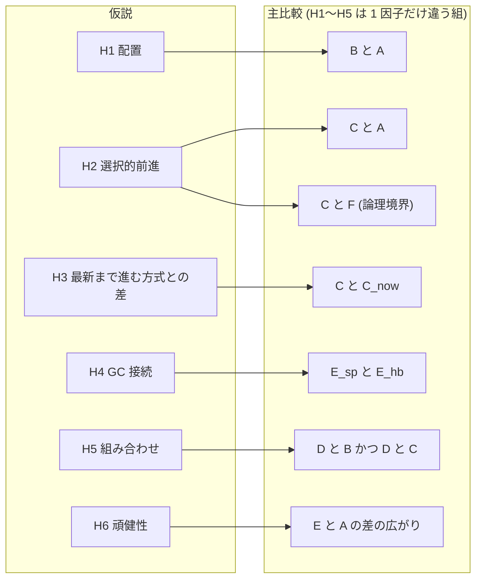
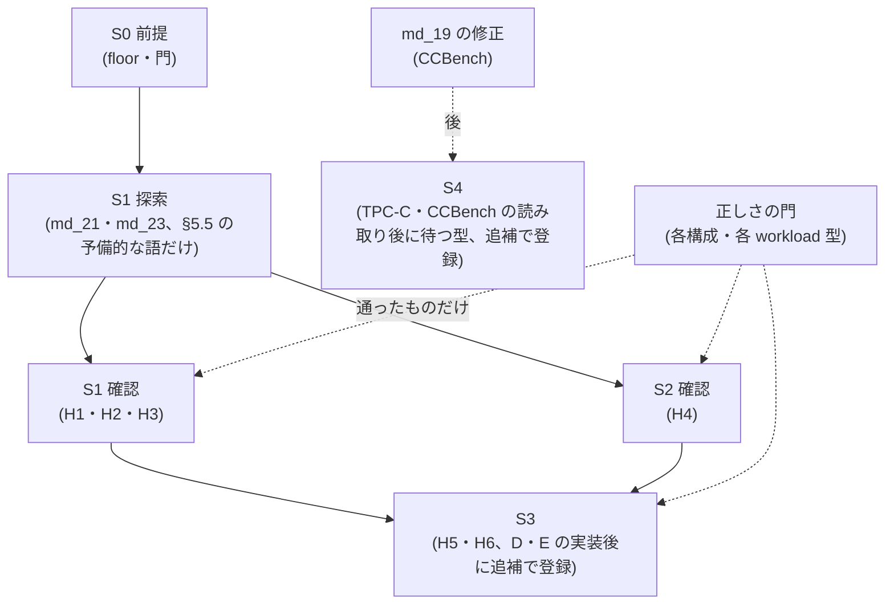
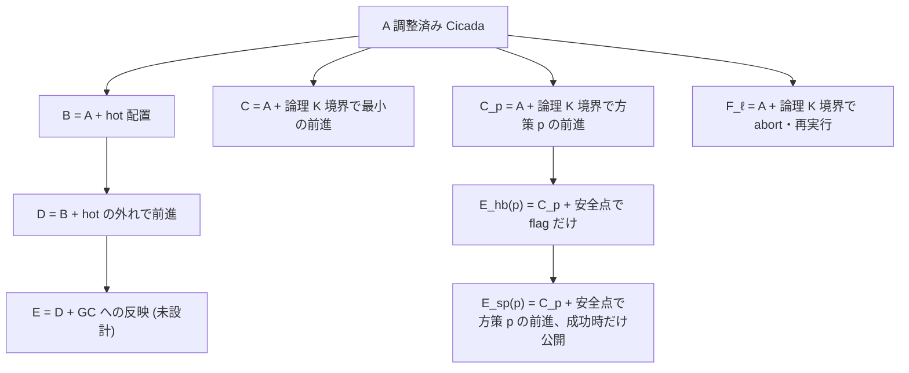
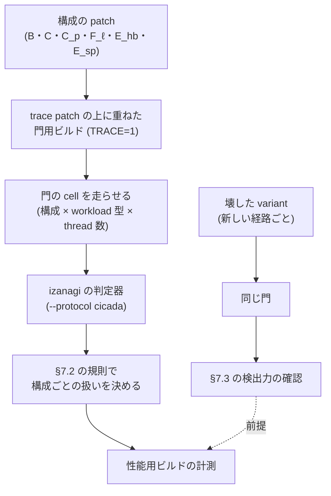
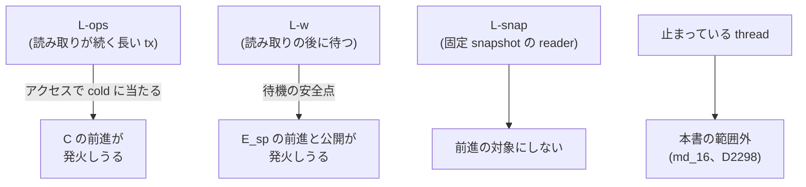

# VHash と選択的 timestamp forwarding の評価計画 — 仮説ごとの比較・判定・正しさの門・統計・予算を結果を見る前に固める事前登録 (草稿、未発効)

本書は、VHash 論文 (`docs/paper-story-vhash/`) の評価を、**計測を本格的に始める前に固定するための事前登録の草稿**である。
仮説 H1〜H6 それぞれについて、何と何を比べ、どの workload で、どの指標を、どの述語で判定し、
何が出たら何と書くかを先に決める。あわせて、並走中の探索 (md_21 の前進先の方策、md_23 の hot 配置) の結果を**着地する前に**
どう読むかを決め、正しさの門の置き方、統計の扱い、計算時間の見積り、「読み取りの後に待つ tx」の限界の示し方を決める。

**本書は草稿であり、発効していない。本書の存在は、実装・予備の観察・本走・計算投入のどれの認可でもない。**
発効は、§11 の前提が揃い、1 タスクごとの node 時間をユーザーへ示して確認を得た後に、別の wave が日付付きの決定 (D 番号) で行う。
本書は計測をしていない。本書の中の数値は、登録する設計値 (反復数・区間の順位・閾値・格子) と、出所を明示した試算・既存の一次資料の引用だけである。

## 0. 版と効力

- 本書は草稿 v1 である。登録版の文字列は `vhash-evaluation-v1-draft`。v0 (`vhash-evaluation-v0-draft`) からの変更は §13 に書く。
- **発効の前:** 規則は固定されない。§11 の前提の成否に合わせて、同じ path で改めてよい。改めたときは §13 に日付と理由を追記する。
  どの確認段の走行よりも前でなければならない。
- **§5.5 (md_21・md_23 の結果の読み方) についての手続き上の約束:** md_21・md_23 の一次資料が main に着地した後は、§5.5 の述語・閾値・主 cell・
  選び方の規則を改めない。着地した後に改めたくなったときは、向きを問わず「結果を見た後の変更」として §13 に理由を書き、変更前の規則による読みも併記する。
  これは結果を見てから基準を選ばないための約束であって、発効・凍結ではない。着地したという事実は §14 に記録するだけにする。
- **発効の後:** 発効の決定に本書の raw bytes の SHA-256 を写す。以後は既存本文の bytes を書き換えず、訂正は末尾の Erratum 節への
  追記だけとする。結果を見た後に規則を変えたときは、向きを問わず事後改訂として別に報告する。本書自身の hash や、本書を含む commit の
  hash を本文へ書かない。
- 本書には解析器の pin も機械の gate も無い。凍結は文書上の契約である。

### 0.1 材料と上位の決定

| 出所 | 本書が使う内容 |
|---|---|
| 出典メモ `docs/paper-story-vhash/source-memo-2026-09-29.md` §24〜§28 | 仮説 H1〜H6、構成、workload、指標、主要な図の候補。**構想の記録であって一次資料ではない** |
| 同 §15.4・§16・§17 | GC 改善を前進の成功回数で測らない理由、アクセス駆動と GC 圧力駆動の区別、固定 snapshot の扱い |
| 論文ストーリー 2 版目 `docs/paper-story-vhash/2026-09-29b.md` §8・§9 | 仮説の状態表と評価の組み立ての図 (本書 v0 の写し) |
| md_3 `output/insights/2026-09-29/vhash-cicada-verifier/README.md` と D2279、md_17 `vhash-cicada-verifier-ext` と D2294 | Cicada の trace を判定器に掛ける手段 (YCSB は v2、TPC-C は v3)。**判定の上限は indeterminate であって certified ではない**。stock の TPC-C は delete を含む全 mix × 4 thread で `gc_records()` の ERR により毎回異常終了する (md_17 §1 項 3) |
| md_4 `vhash-forwarding-model` と D2282、md_13 `vhash-forwarding-proof` と D2292 | forwarding の規則 R4〜R10 と、崩すと反例が出る順序 (固定 10 場面)。C の規則の一般の論証 (仮定 A1〜A11 のもと、point read / update) |
| md_6 `vhash-forwarding-prototype` と D2287・D2288 | 構成 C・F_ℓ の実装 (`patches/cicada-forwarding-variant.patch`)、長い tx の生成器 `CICADA_LONGTX`、計数行 `CICADA_FWD_V1` |
| md_8 `vhash-cicada-rts-check` | Cicada の書き込み側の rts 検査に、小モデル v0 の穴は無い (静的な照合と小モデル。実 Cicada の再現走行はしていない) |
| md_10 `vhash-gc-connection-model` と D2290、md_16 `vhash-helper-forwarding-model` と D2298 | GC 接続の手順 (SP、確定してから公開)。止まった thread の代行 (HP) は論文の対象外 |
| md_11 `vhash-cicada-baseline-tuning` と D2291 | 比較相手 A の観測最良設定、job 間 session-median CV (floor ではない)、計算ノードで perf が使えないこと、CCBench の build 不具合 2 件 |
| md_14 `vhash-gc-connection-prototype` と D2295 | 構成 E の実装 (`patches/cicada-forwarding-gc.patch`)、E と E-hb の比較、「今」への前進の失敗率、同じ実行コードの腕どうしの throughput の幅、保持版検査 |
| md_15 `vhash-readonly-share` と D2296 | 測った格子で、深い版探索の大半は read-only の read だった。長い read-only tx 1 本で公開が止まった。read-only の比率の制御は計器 patch の中にある |
| md_1・md_9 `vhash-related-work`・`vhash-novelty-repositioning` | 新規性の候補は「調べた範囲では見当たらなかった」までしか書けない |
| D19・D145・D1373 | floor の 2 種の区別と `BETWEEN_RUN_CV = 0.030` の下限 (D19)。1 回の投入束から得た量を floor と呼ばず閾値へ配線しない (D145)。trace hook の証拠が無い protocol の floor 生成を拒否する (D1373) |
| D2212 項 4 | 1 タスクの job 合計が 2 node 時間以上なら都度ユーザーに確認する。一括承認にしない |
| D2286 | 本書 v0 の置き場・1 因子の組・統計の骨格。v1 は項 2 の G の扱いを改める (§3.3) |
| ユーザー裁定 2026-09-26 | 実験設計に時間帯の block 分けを入れない。同時刻の対照は別物で残す |
| ユーザー裁定 2026-09-28 | 基盤の欠陥は比較から外さず、使い続けて直す |
| ユーザー判断 2026-09-29 (md_19 の依頼) | CCBench の Cicada の不具合 (build 不具合 2 件と TPC-C の異常終了) は直す |

**v1 の起草時点で main に無かったもの (2026-09-29 22 時台 JST、main `8fe87f852` で一次資料の dir が無いことを確認):** md_20 (A の正しさの検査、
`vhash-cicada-best-config-verify`)、md_21 (前進先の方策、`vhash-forwarding-target-policy`)、md_23 (hot 配置の Cicada への組み込み、`vhash-hot-block-cicada`)、
md_19 (CCBench の修正、`ccbench-cicada-bugfix`)。本書はこれらの結果を見ずに書いた。md_22 (read-only の commit での公開) の結果も見ていない。

## 1. 一目でわかる全体

**読み方。** H1〜H5 は、構成を 1 因子だけ変えた組で判定する (§3)。H6 は方式全体と A の比較である。H5・H6 は D・E の実装後に追補で主要な族へ入れる (§5.3)。
図は仮説と比較の対応だけを表し、結果・向き・大きさは表さない。

**読み方。** 探索段で選んだ自由度 (K、前進先の方策) は、確認段の新しい走行だけで判定する (§8.5)。各段は別のタスクとして、
1 タスクの job 合計ごとに node 時間の確認を取る (§10)。S3・S4 は、走行の前に本書への追補として事前登録する。

## 2. 用語

- **tx:** transaction。**版:** MVCC の version。**確定版:** COMMITTED の版。**ro:** read-only の tx。
- **hot:** 構成 B・D が持つ、key ごとに新しい順の先頭 K 版の記述子 (wts・状態・値への参照) の置き場。md_23 の実装に従う。
- **論理 K 境界:** 物理的な hot を持たない構成 (C・C_p・F_ℓ・E_hb・E_sp) の発火条件。「今の候補 timestamp で見える版が、Cicada の版の列を新しい方から
  数えて K 版より奥にある」(md_6 §2 の「物理位置 p > K」、pending・aborted・deleted も数える)。
- **前進 (forwarding):** tx の候補 timestamp を進めて、より新しい版を読むこと。
- **前進先の方策:** 前進する時刻 t′ の選び方。md_21 の依頼が挙げる (a) 今の時刻、(b) 最小の前進、(c) 既読の可視区間に収まる最大の時刻、
  (d) 1 tx 1 回に制限、(e) md_21 の段 2〜4 で出た案。本書は方策をこの記号で呼び、実行時 flag の名前は md_21 が `patches/README.md` に書く節を正本とする。
- **回収境界:** GC が「これより古い時刻を読む tx はもういない」とみなす下限 (Cicada の MinRts)。**回収境界の遅れ**は md_14 の定義
  (leader が 10 µs ごとに取る等間隔標本での、今の時刻と MinRts の差の平均)。**生存版数**は md_14 の論理生存版数 (物理メモリ量ではない)。
- **round:** 同じ job・同じ node で、比べる全構成を 1 回ずつ走らせた組 (§8.1)。差の差を取る比較では、2 つの cell の全構成が同じ round に入る。
- **d_i:** round i の処置と対照の対数比 (§5.5.0・§8.2)。値が大きいほど処置側が良い向きにそろえる。

## 3. 構成の定義

### 3.1 3 つの因子で書く

構成は、Cicada の上で次の 3 因子のどれを変えるかで定義する。H1〜H5 の主比較はどれも 1 因子だけが違う組にする。
H6 だけは例外で、提案の全体と A の比較であり、3 因子が同時に違う。H6 は「何が効いたか」の帰属ではなく、方式全体の頑健性を問う。

| 因子 | 水準 |
|---|---|
| 版の配置 | Cicada のまま (hot なし) / hot に先頭 K 版の記述子を置く |
| 発火したときの行動 | 何もしない / 前進 (方策 a〜e のどれか) / abort して新しい timestamp で再実行 |
| GC への反映 | しない (保護条件は開始時刻のまま) / 待機の安全点で GC flag だけ立てる / 安全点で前進を試し、成功したときだけ公開する |

**読み方。** 矢印は「左に 1 つの変更を足したものが右」を表す。p が (b) のとき C_p は C と同じ規則である。E_hb(p) と E_sp(p) は、同じ方策 p の C_p の上で
安全点の動作だけが違う。

### 3.2 各構成が Cicada の上で何を変えるか

| 構成 | 実装と knob | 変えないもの | 状態 (v1 起草時点) |
|---|---|---|---|
| **A** | md_11 の観測最良設定。rr5・rr50・rr95 型は `BACK_OFF=0, INLINE_VERSION_OPT=1, INLINE_VERSION_PROMOTION=0, REUSE_VERSION=1, WRITE_LATEST_ONLY=0`、`gc_inter_us` は rr5・rr50 が 100、rr95 が 10 (md_11 §6。同じ genome の GC 10 と 100 の差は 1% 未満で、どちらを最良と書くかは決めきれない)。100 操作型は `B0 O0 P0 R0 W0`・`gc_inter_us=1000`。R と L-w の cell (§4.1) は md_11 が較正していないので、rr50 の最良 (genome、GC 100 µs) を使う。**正しさは未確認** (md_20 が検査中、§7.2 規則 5) | — | 較正済み (md_11)。正しさ未確認 |
| **B** | md_23 の inert patch (`patches/cicada-vhash-hot-block-*`)。key ごとの hot に直近 K 版の記述子を置き、それより古い版は既存の列に残す。版選択の意味は Cicada と同じ。K は knob (md_23 の依頼は K = 1, 2, 4, 8) | timestamp の決め方、validation、GC の規則、index | md_23 が実装中 |
| **C** | `patches/cicada-forwarding-variant.patch` (md_6)、`CICADA_FWD_ENABLE=1`、`--cicada_fwd_policy=c`、`--cicada_fwd_k=K_C`。前進先は先頭 K 版のうち最古の確定版の直後の自 thread 形式の時刻 (方策 b)。発火は read-write tx の `read()` 経由の read だけで、insert・delete・scan を含む tx は前進しない。最終保証は stock の validation (D2287) | 配置、GC の保護条件 (開始時刻のまま) | 実在 (md_6) |
| **C_p** | C に md_21 の方策の knob を足したもの。**C_now** = 方策 (a) | C と同じ | md_21 が実装中 |
| **F_ℓ** | C と同じ patch で `--cicada_fwd_policy=f` (発火したら abort し、同じ procedure を新しい begin で再試行) | 配置、GC | 実在 (md_6) |
| **E_hb(p)** | C_p の上に `patches/cicada-forwarding-gc.patch` (md_14)、`CICADA_GC_SAFEPOINT=1`・`CICADA_GC_WAIT=1`、`--cicada_gc_mode=hb`、`--cicada_gc_slice_us=100`。読み取りの後に待つ tx が、待機を 100 µs ごとに分けた安全点で GC flag だけを立てる | 読み取り下限は tx 開始時の値のまま | 実在 (md_14 の E-hb)。p の knob は md_21 が実装中 |
| **E_sp(p)** | E_hb(p) と同じ build・同じ knob で `--cicada_gc_mode=e` だけが違う。安全点で方策 p の前進を試し、**成功したときだけ**確定の後の別 step で時刻と読み取り下限を公開する (D2295)。md_14 の E は、安全点の前進先を「今」にした形 | 回収 (gc_versions) の規則 | md_14 の E は実在。他の p は md_21 が実装中 |
| **G_ℓ** | 論理 K 境界で、先頭 K 版の wts 最大の確定版へ進む (v0 の定義)。**v1 では主比較に使わない** (§3.3) | 配置、GC | 未実装 |
| **D・E** | D = B の hot の外れで前進。E = D に GC への反映を足した方式全体 (反映の契機は D の実装後に決める) | — | 未実装・未設計 |

- **ビルドの 3 種:** 性能用 (trace も計数も無い)、計数用 (`CICADA_FWD_COUNT`・`CICADA_GC_COUNT`、md_6・md_14。`CICADA_GC_COUNT` は stock の build でも使える)、
  門用 (`patches/instr-cicada-trace.patch` の上に重ね、TRACE=1)。§7.6。
- **長い tx の生成器:** md_6 の `CICADA_LONGTX` (`--cicada_long_kind=many_ops|wait_after_reads`、`--cicada_long_threads`、`--cicada_long_wait_us`、
  `--cicada_wait_reads`)。長い thread 0 本の走行は YcsbWorkload と同じ。A を長い tx の cell で測るときは LONGTX=1 の stock build を使う (md_6・md_14 と同じ)。

### 3.3 v0 からの定義の変更

- **H3 の処置を G_ℓ から C_now へ替える。** v0 は「最新まで進む方式」を G_ℓ (先頭 K 版の wts 最大) と定義したが、G_ℓ は実装されておらず、
  md_21 が C の上に方策 (a) 今の時刻を実装する。C_now と C は発火条件が同じで前進先の選び方だけが違うので、1 因子の組になる。
  G_ℓ は実装されたときだけ副次の比較にする。v0 の「K = 1 で C と G_ℓ が同じ規則になる」A/A 対照は C_now には成り立たないので、
  同じ round の A/A 腕 (§8.1) に置き換える。これは D2286 項 2 の改訂である。
- **E を実装に合わせて定義し直す。** v0 の E (D の上でアクセス駆動の前進を GC の保護条件へ反映) は実装されていない。md_14 が実装したのは
  「C の上で、読み取りの後に待つ tx が待機の安全点で前進を試し、成功したときだけ公開する」形で、1 因子の対照 E-hb を持つ。
  H4 の主比較は E_sp(p*) 対 E_hb(p*) にする (§5.2)。v0 の E+P の名前は使わない。hot の上の D・E は S3 の追補で扱う。
- **F_h・G_h は構成から外す。** hot の上の abort 版・最新版は、D が実装された後の追補で必要なら定義し直す。

### 3.4 全構成でそろえるもの

- **同じ基盤:** CCBench の同じ pin、同じ allocator、同じ workload 生成器、同じ thread の割り付け (numactl なし、md_11 と同じ)、同じ build の設定
  (最適化フラグは A の較正値を全構成に継承する)。pin を C から進めるなら、A の較正を含め全構成を同じ pin で測り直す。
- **key の引き方を変えない (メモ §25.1):** 主比較はすべて A と同じ index で版管理だけを変える。hash の key lookup と融合した構成 (+L) は副次。
- **基盤の欠陥:** md_8 は Cicada の書き込み側の検査に小モデル v0 の穴を見つけなかった。md_11・md_17 が見つけた CCBench の不具合 3 件は md_19 が直す。
  修正は共通の基盤に入れ、A を含む全構成を修正後の基盤で測り直す。修正前の stock も比較から外さず、別名で記録する (ユーザー裁定 2026-09-28)。
- **レコード数と thread 数:** 1,000,000 件 (md_11、D15 の RSS 下限で決めた。cache miss 率の飽和は perf が使えず判定していない)。
  主要な判定は Pegasus gen_S の 48 core に 48 worker を割り付けた条件だけで行う。thread 数を変えた scaling は副次。

## 4. workload

### 4.1 一覧

| 名前 | 中身 | 役割 |
|---|---|---|
| Y5・Y50・Y95 | YCSB (10 操作、`ycsb_rratio` 5・50・95、zipf 0.9、rmw 0)。md_11 の W1〜W3 と同じ | H2・H3 の主 cell |
| R0・R50・R95 | YCSB (10 操作、update tx の操作は読み 50%、zipf 0.9) で、新しい procedure の初回 begin に確率 r% で全操作を read にする (md_15 の ro 指定率)。r = 0・50・95 | H1 の主 cell。R0 は効かないはずの条件 |
| R100 | ro 100% (更新なし)。版の列が伸びない | 効かないはずの条件 |
| L-w(τ, s) | `CICADA_LONGTX` の wait_after_reads: 長い thread 4 本が 10 read + 1 write の後に τ 待って commit。他の thread は rr50 の YCSB。τ ∈ {1 ms, 10 ms}、zipf s ∈ {0.9, 0} | H4 の主 cell (md_14 と同じ形) |
| L-ops | `CICADA_LONGTX` の many_ops: 長い thread 4 本が 1,000 操作 (読み 90%) の tx。zipf 0.9 | 効かないはずの条件 (E の安全点は発火しない、md_14 §4.1) |
| L-snap | 1 thread が長い ro tx で snapshot を保持する | 固定 snapshot の reader の条件。**性能用 build の生成器が無い** (md_15 の wait10msR は計器 patch の中) |

- GC 間隔は、各 cell で A の観測最良を使う (§3.2 の A の行)。R・L-w は rr50 の最良の 100 µs。H6 の格子は x0 = A の最良値に対して x0・4 x0・16 x0・64 x0 の 4 点、
  広い側 x_L = 64 x0 (v0 と同じ)。
- read-only の tx は前進の対象にしない (md_6 の発火条件、メモ §17.2)。L-snap の reader は Cicada の read-only の経路のまま読む。
- **snapshot の古さ**は、ro の snapshot 年齢 (md_15 の定義、計器入り build で測る) で記述する。古さの水準の作り方 (GC 間隔、長い ro tx) を併記し、
  A の最良から GC 間隔を外して作った水準は機序の確認にだけ使う (§5.5.2)。

### 4.2 生成器の実在

- Y・L-w・L-ops は実在する (md_11 の driver、md_6 の `CICADA_LONGTX`)。
- R の ro 指定率の制御 (`izanagi_ronly_pct`) は、md_15 の計器 patch `patches/instr-cicada-version-lifetime.patch` の中にだけある。
  **性能用 build で ro 指定率を制御する手段は v1 の起草時点で実在しない。** md_23 か別の実装が用意しない限り、R の throughput は
  「計器入り build の診断値」であり、H1 の判定には使えない (§5.5.2、§6)。
- L-snap の性能用の生成器は無い (§11 の P5)。

### 4.3 md_19 の後に入る段 (S4)

次は CCBench の修正 (md_19) と pin の前進の後にだけ測れる。S4 として分け、主要な族 (§5.3) に入れない。S4 の述語・族・予算は、S4 の走行の前に本書への追補として事前登録する。

- **TPC-C:** stock の Cicada は delete を含む全 mix × 4 thread で異常終了する (md_17)。また C の前進は insert・delete を含む tx では発火しない (md_6 §2)。
- **CCBench 自身の読み取り後に待つ型 (md_11 の W5、`WORKER1_INSERT_DELAY_RPHASE`):** stock では compile できない (md_11 §8.2)。本書の L-w (izanagi 側の
  `CICADA_LONGTX`) とは別の生成器で、合算しない。
- **`INLINE_VERSION_OPT=1` かつ `INLINE_VERSION_PROMOTION=1` の 8 genome:** 修正後に A の較正をやり直すかは S4 の追補で決める。A が変われば、既に取った確認段の値は
  古い A に対する記録として残し (絶対規律 7)、新しい A に対する判定は新しい走行で行う。

## 5. 仮説ごとの比較と判定

### 5.1 判定語と、書いてよい文

判定語は 2 層に分ける。**確認段** (§8、n = 14、族の補正あり) だけが「支持」「不支持」を出す。**探索段** (md_21・md_23 など、n が小さく族の補正も無い) は
「予備的に」を付けた語だけを出し (§5.5)、論文の主張の根拠にしない。

確認段の統計量は、対にした round の対数比 d の中央値と、その区間 [L, U] である (§8.2)。δ は §8.3 の閾値。
確認段の 1 つの判定は、上から順に最初に当てはまった語を取る。

| 順 | 判定語 | 述語 | 論文に書いてよい文の形 |
|---|---|---|---|
| 1 | 失格 | 処置側が正しさの門で失格 (§7.2) | 「失格」。性能値は主張に使わない |
| 2 | 判定不能 (比較相手) | 対照側が門で失格 | 「比較相手が門を通らなかったので判定しない」 |
| 3 | 判定不能 (門未完了) | 処置側か対照側の門 (§7.2) が未完了・未実施 | 「門を通していないので判定しない」 |
| 4 | 欠測 | 有効な round が §8.6 の下限未満、または述語の入力が無い (§6) | 「欠測」 |
| 5 | 判定不能 (A/A) | 同じ cell の A/A 腕の判定が「改善」か「悪化」(§8.1) | 「同じ構成どうしの差が閾値を超えたので、この cell は判定しない」 |
| 6 | 判定不能 (job 不一致) | §8.1 の job 間の停止条件に当たる | 「2 つの job で差が食い違ったので判定しない」 |
| 7 | 支持 (改善) | L > δ | 「この条件で X は Y より (中央値の比) 良かった (区間 [L, U]、正しさの門の結果は §7.4 の形で併記)」 |
| 8 | 不支持 (同等) | −δ < L かつ U < δ | 「この条件で X と Y の差は ±δ の中に収まった」 |
| 9 | 不支持 (悪化) | U < −δ | 「この条件で X は Y より悪かった」 |
| 10 | 判定不能 | 上のどれでもない | 「差を判定できなかった」。**「効果が無い」とは書かない** |

- 処置の新しい経路について壊した variant が未検出 (§7.3) なら、語は変えずに「(検出力未確認の経路)」を添え、headline に使わない。
- **複数の成分を要求する判定 (H1 用量・H4) の最終語:** まず 1〜6 を判定全体に当て (どれかの成分が当たればその語)、当たらなければ成分ごとに 7〜10 を付けて、
  全成分が「改善」なら支持、どれかが「悪化」なら不支持 (悪化)、全成分が「同等」なら不支持 (同等)、それ以外は判定不能とする。
- どの語になった判定も族の数 m から除かない (§8.4)。

### 5.2 仮説の表 (確認段)

| 仮説 | 比較 (処置 対 対照) | cell | 主指標 (取るビルド) | 判定の述語 (主要) | 効かないはずの条件と、そこで出たときの扱い |
|---|---|---|---|---|---|
| **H1 配置** | B_K* 対 A | R50・R95・Y50 | throughput (性能用) | 各 cell で「改善」 | R0・R100: md_15 の格子では update の read が最新版より奥へ行くのは 0.00003〜5.8%。ここで「改善」が出たら、R95 の改善を「深い版探索の削減」に帰属させず「最新版の置き方の違いを含む」と書く |
| **H1 用量** | B_K* 対 A の対数比の、R95 と R0 の差の差 | R95 − R0 (同じ round) | 同上 | 差の差が「改善」**かつ** R95 の H1 が「改善」 | 差の差だけでは書かない (§8.8 の反例) |
| **H2a 回避** | C 対 A | Y5・Y50・Y95 | commit 1 件あたりの深い探索 (位置 > K_C) の回数 (計数用、A と C に同じ計器)。0 回がありうるので、回数 N に 0.5 を足した (N + 0.5) / commit 数で対数比を取る | 各 cell で「改善」 | R100: 発火しない。**A と C に同じ計器を入れる手段が v1 時点で無い** (§6) |
| **H2b 仕事を保つ価値** | C 対 F_ℓ | Y5・Y50・Y95 | throughput (性能用) | 各 cell で「改善」 | R100: どちらも発火しない。「改善」が出たら実装差を疑い H2b を保留する |
| **H3 最新まで進む方式との差** | C 対 C_now | Y5・Y50・Y95 | throughput (性能用) | 各 cell で「改善」 | R100: どちらも発火しない。「改善」または「悪化」が出たら実装差を疑い H3 を保留する |
| **H4 GC 接続** | E_sp(p*) 対 E_hb(p*) | L-w(10 ms, 0.9)・L-w(1 ms, 0.9)・L-w(10 ms, 0)・L-w(1 ms, 0) | 回収境界の遅れの平均 **かつ** 生存版数の平均 (計数用、両側に同じ計器) | 各 cell で両指標とも「改善」 | L-ops・Y50: 安全点が発火しない。述語を置かず記述する。**前進の成功回数では判定しない** (メモ §15.4) |
| **H4 方策** | E_sp(p*) 対 E_sp(a) | L-w(10 ms, 0.9)・L-w(1 ms, 0.9) | 回収境界の遅れの平均 (計数用) | 各 cell で「改善」 | p* = a、または p* を選べなかった (§5.5.1) なら「該当なし」と書き、m から除かない |

- **長い tx を含む cell の共通の条件 (メモ §27.1):** throughput が「改善」でも、長い tx の単位時間あたり commit 数 (`CICADA_LONGTX_V1`) が「悪化」なら、その cell の改善を
  主張しない。H4 では、E_sp(p*) 対 E_hb(p*) の throughput と長い tx の commit 数を性能用 build で同じ round に測り、「悪化」ならその cell の H4 に費用として併記する。
- **「Cicada の最良設定に対して」の主張 (メモ §28.1):** headline に「Cicada の最良設定に対して」と書けるのは、確認段で A の GC 10 µs と 100 µs の両方
  (A と、別の GC の腕 A_alt。§10.2 の S1 確認の行列に入れる) を同じ round で測り、処置が**両方に対して**「改善」または「同等」だった場合だけである (どちらかを選ばない)。
  これは族に入れない副次の判定とする。
- **H5 (組み合わせ)・H6 (頑健性) は主要な族に入れない。** D・E が実装されたら、S3 の走行の前に追補で比較・cell・述語を登録し、m を数え直す。v0 の定義
  (H5 = D 対 B かつ D 対 C、「相乗効果」の語は交互作用 ln D − ln B − ln C + ln A の「改善」のときだけ、反例 A=100・B=110・C=110・D=115 で交互作用は負。
  H6 = 方式全体と A の差が GC 間隔 x0 → x_L と tx 長で広がるか) を出発点にする。
  md_11 §6 のとおり A の最良設定は GC 10,000 µs で自身の最高値から 8〜42% 落ちるので、GC 間隔を不適切に大きくした Cicada に勝つことは主張にならない。

### 5.3 主要な判定の族

Bonferroni で束ねる主要な判定は次の 19 個である (m = 19)。

| 比較 | cell | 個数 |
|---|---|---|
| H1 B_K* 対 A | R50・R95・Y50 | 3 |
| H1 用量 (差の差かつ R95 の改善) | R95 − R0 | 1 |
| H2a C 対 A | Y5・Y50・Y95 | 3 |
| H2b C 対 F_ℓ | 同上 | 3 |
| H3 C 対 C_now | 同上 | 3 |
| H4 E_sp(p*) 対 E_hb(p*) (2 指標の交差・合併) | L-w の 4 cell | 4 |
| H4 方策 E_sp(p*) 対 E_sp(a) | L-w(10 ms, 0.9)・L-w(1 ms, 0.9) | 2 |

- 1 つの判定の中で「両方とも」を要求する述語 (H1 用量・H4) は、各成分をそれぞれ同じ水準で判定し、全成分が通ったときだけ通す (交差・合併検定)。
  各成分の検定が水準 α で正しいなら、この形は成分の数だけ補正を足さなくても水準 α を保つ。
- 各判定の水準は 0.05 / 19 ≈ 0.00263。§8.2 の区間の被覆 0.99817 は 1 − 0.05 / 19 ≈ 0.99737 以上。この区間の順位は m ≤ 27 まで使える。

### 5.4 副次・記述だけの比較 (族に入れない)

- K の掃引 (B の K = 1・2・4・8、C の K_C) と、方策 p ごとの前進の試行・成功・失敗理由 (md_6 §3 の計数項目)。探索段の出力で、判定に使わない。
- C_p 対 C (p ≠ a)、G_ℓ 対 C (実装されたときだけ)、E_sp(p*) 対 A と E_hb(p*) 対 A (安全点の slice 化と flag の両方を含むので 1 因子に帰属できない、md_14 §4.4)。
- A0 (CCBench の CMake 既定、md_11 の control) に対する比 (md_6・md_15 との橋渡しだけ)、thread 数の scaling、L-snap の記述 (§9)、
  「省いた仕事と足した仕事」(メモ §28.4)、物理メモリの再利用 (「物理メモリを減らした」とは主張しない)、+L 構成。
- 副次の比較は族に入れず、多重比較の補正をしない。そのことを図と本文に書く。

### 5.5 探索段 (md_21・md_23) の結果の読み方 — 結果の着地前に書く

md_21 (前進先の方策) と md_23 (hot 配置 B) は、v1 の起草時点で走行中で、結果は main に無い。ここの規則は、それらの結果を見る前に書いた (§0 の約束)。
ここの判定は**予備的**であり、確認段の判定の代わりにならず、論文の headline の根拠にしない。役目は (1) 確認段へ持ち込む自由度 (方策 p*、K*) を
あらかじめ決めた規則で選ぶこと、(2) 予備的な結果を、結果を見てから基準を選ぶことなく記述することである。

#### 5.5.0 共通の規則

- **round と対:** 同じ job・同じ node で、同じ反復番号 (腕の順序を回した 1 巡) に入った処置と対照を対にし、d_i = ln(処置_i / 対照_i) を作る
  (遅れ・生存版数のように少ないほど良い指標は ln(対照_i / 処置_i))。対が作れない (処置と対照が別 job) ときは、下の「分離の規則」を使う。
- **閾値 δ_ex = ln(1.10) ≈ 0.0953。** throughput にも GC の指標 (遅れ・生存版数) にも同じ値を使い、結果に合わせて変えない。
  **根拠と限界:** δ_ex は設計値であり floor ではない。md_14 §4.5 では、E の安全点が発火しない 2 workload (normal・many_ops) の cell で、
  計器なし build の throughput の stock 比 (3 rep の中央値) が 0.911〜1.053 だった (|ln 0.911| ≈ 0.093)。δ_ex はこれを上回るように選んだが、
  他の指標・cell・node の揺れを保証しない。また、δ_ex は md_14 の結果を知った後に選んだ。md_14 の主比較 (skew 0・待機 10 ms・GC 10 µs の E 対 E-hb、
  同じ反復番号を対にした 3 対) は、下の述語では遅れ (d_i = 0.77〜0.78) も生存版数 (d_i = 0.117〜0.132) も全 round で δ_ex を超える。
  md_14 を下の述語で読み直すことは md_14 の検証ではない。
- **予備的な判定語** (処置 X、対照 Y、round i = 1..n)。上から順に最初に当てはまった語を取る。
  1. **失格:** 処置側が §5.5.1 P21-0 または §5.5.2 P23-0 の失格条件に当たる。
  2. **判定不能 (門未完了):** 処置側か、A 以外の対照側の門が未完了・未実施 (P21-0・P23-0)。
  3. **判定不能 (比較相手未検証):** 対照が A で、md_20 が A の設定に「巡回なし」を出した一次資料が、読む時点で main に無い。md_20 が A に巡回を出していれば
     「判定不能 (比較相手)」とし、§3.4 の基盤の欠陥の扱いにする。対照が A でない比較 (E_sp 対 E_hb、C_p 対 C) には語を変えずに
     「(土台の A の正しさ未確認)」を添える。
  4. **欠測:** 必要な cell・腕・指標の値が無い、n < 3、性能値が性能用 build から取られていない、または (E の比較で) 処置側の前進の試行が 0 回の round がある。
  5. **判定不能 (A/A):** 同じ round に A/A 腕 (同じ build の独立な 2 走行、または同じ cell で実行コードが同じ 2 腕) があり、その指標で |ln(A′_i / A_i)| > δ_ex の
     round が 1 つでもある。
  6. **予備的に不支持 (差なし):** すべての i で |d_i| < δ_ex (比で約 0.909〜1.10)。論文や版には「探索の n 対では、対数比はすべて ±ln(1.10) 以内だった」とだけ書き、
     「効果は 10% 未満」とは書かない。
  7. **予備的に不支持 (悪化):** すべての i で d_i < −δ_ex。
  8. **予備的に支持:** すべての i で d_i > δ_ex、**かつ** 同じ round に A/A 腕がある。A/A 腕が無いときは「判定不能 (A/A なし)」とする。
  9. **判定不能:** 上のどれでもない。
- **分離の規則 (対が作れないとき):** 各反復の値 x を、良い向きにそろえた対数 g に直す (大きいほど良い指標は g = ln x、遅れ・生存版数のように少ないほど良い指標は
  g = −ln x)。そのうえで上の 6〜8 の「すべての i で」を次に置き換える。6: 処置と対照の全反復の g が互いに ±δ_ex 以内。7: 処置の g の最大値が対照の g の最小値より
  δ_ex を超えて小さい。8: 処置の g の最小値が対照の g の最大値より δ_ex を超えて大きい (A/A 腕の要求は同じ)。
- **複数の成分を要求する比較 (P21-1 の遅れと生存版数、P23-2 の差の差と R95):** 1〜5 を比較全体に当て、当たらなければ成分ごとに 6〜9 を付け、全成分が予備的に支持なら
  予備的に支持、どれかが予備的に不支持 (悪化) なら予備的に不支持 (悪化)、全成分が予備的に不支持 (差なし) なら予備的に不支持 (差なし)、それ以外は判定不能とする。
- **同点の定義 (p*・K* の選択):** 選択の鍵 (反復中央値) が最良の候補の値 v_best に対して |ln(v / v_best)| ≤ δ_ex の候補を、最良と同点とする。
  同点の判定は最良との比較だけで行い、候補どうしの近さを連鎖させない。
- **多数の比較:** 方策・K・cell の組の数を必ず併記する。組ごとに独立に判定語を付け、「どれか 1 つで予備的に支持」を束ねた主張にしない。
- **これは検定ではない。** n = 3 で、d_i が 0 に対称な連続分布に独立に従う (効果が無い) とき、3 つとも正になる確率は 1/8 である。δ_ex > 0 はこれを下げるが、
  揺れが δ_ex より大きい cell では 1/8 に近づく (§8.8)。

#### 5.5.1 md_21 (前進先の方策) の読み方

**主 cell c21:** L-w(10 ms, 0.9)、長い thread 4 本・10 read + 1 write の後に待機、rr50・10 操作・48 thread・1M 件、A の rr50 最良の genome と GC 100 µs。
判定語は md_21 が測った各 cell に付け、主 cell を明記する。**p* の選択に使う cell** は、c21 が無ければ次の順で最初に測られているものとする:
L-w(10 ms, 0.9)・GC 10 µs → L-w(1 ms, 0.9)・GC 100 µs → L-w(1 ms, 0.9)・GC 10 µs。この順は cell の有無だけで決まり、値を見ない。

| # | 比較 | cell | 指標 | 述語と書き方 |
|---|---|---|---|---|
| P21-0 | 方策 p の門 | md_21 の門の cell | 判定器の巡回、E の保持版検査、integrity の数値項目、trace の commit 行数 | 巡回 1 つ以上、または保持版の変化 1 件以上で、方策 p を**失格**とし、p の全比較を失格にする。integrity の数値項目が 0 でない、または commit 行数が commit 数と食い違う走行は無効として原因を調べ、解けなければ p の門は**未完了**とする (失格ではない)。門が未完了・未実施の方策の値は「未検証の診断値」で、p* の候補にしない |
| P21-1 | E_sp(p) 対 E_hb(p) (方策 p ごと) | 各 L-w cell (主は c21) | 遅れ **かつ** 生存版数 (計数用)、throughput (性能用) | 遅れと生存版数を 2 成分として §5.5.0 の複数成分の規則で語を決める。ただし成分の規則が予備的に支持を出しても、E_sp(p) の前進の成功が 0 回の round がある、または throughput の d_i ≤ −δ_ex の round があれば、判定不能とする。予備的に支持なら「この方策で、この待機型の cell で回収境界が進んだ」と書く |
| P21-2 | E_sp(p) 対 E_sp(a) (p ≠ a) | 各 L-w cell (主は c21) | 遅れ (計数用) | §5.5.0 の語。予備的に支持なら「方策 p は『今』より回収境界を進めた」 |
| P21-3 | E_sp(a) 対 E_hb(a) (md_14 の再現) | L-w(10 ms, 0)・GC 10 µs | 遅れ・生存版数 | 測られていれば P21-1 の述語で判定語を付け、md_14 (遅れ −54%) との一致・不一致を記録する。**選択や他の判定は止めない** |
| P21-4 | 前進の成否 (方策 p ごと) | 各 L-w cell | 試行・成功・失敗理由 (計数用) | 述語を置かず整数のまま記述する。成功率 (成功 / 試行) を方策の優劣の根拠にしない (§8.8)。試行 0 回を成功率 0 と書かない |
| P21-5 | C_p 対 C、C_p 対 A (方策 p ごと) | Y50 と L-ops | throughput (性能用) | §5.5.0 の語。md_6 では C と stock (A0) の差を検出できなかった (stock 比 0.952〜1.032) |
| P21-6 | E_sp(p) 対 E_hb(p) の費用 | 各 L-w cell | throughput と長い tx の commit 数 (性能用) | 予備的に不支持 (悪化) なら、P21-1 の結果に費用として併記する |

**p* の選び方 (確認段へ持ち込む方策):** 候補は次をすべて満たす方策 p (a を含む)。(1) P21-0 で門と保持版検査が完了し、巡回 0・保持版の変化 0・無効な走行なし。
(2) 選択に使う cell で E_sp(p) と E_hb(p) の値がそろい、E_sp(p) の前進の成功が全反復で 1 回以上ある。(3) 同じ cell の throughput が E_hb(p) に対して
§5.5.0 の 7 (予備的に不支持 (悪化)) でない。候補の中で、選択に使う cell の E_sp(p) の遅れの反復中央値が最小のものを選ぶ。最小と同点 (§5.5.0 の同点の定義) の候補が
複数あれば、その中で生存版数の反復中央値が最小のもの、なお同点なら記号の順 (b, c, d, e, a) で先のものを選ぶ。候補が無ければ p* を選ばない。そのときは、a の門と保持版検査が
完了して失格でなければ、確認段の H4 の処置を md_14 の形 E_sp(a) とし (選択を経ない)、H4 方策は「該当なし」とする。a の門が完了していなければ H4 は欠測とする。
md_21 の実装で E_hb の build と knob が方策 p に依存しない (方策の knob が安全点の前進先だけを変える) なら、1 つの E_hb を全方策の E_hb(p) として使ってよい。
**P21-1・P21-2 の判定は方策ごとに付け、p* の値だけを取り出して「予備的に支持」を主張しない** (選んだものを同じデータで判定すると楽観側に偏る、§8.8)。
A の正しさ (md_20) が未確認でも p* の選択は行うが、確認段に持ち込むのは md_20 の結果の後である (§7.2 規則 5)。

#### 5.5.2 md_23 (hot 配置 B) の読み方

**主 cell c23:** R95 (ro 指定率 95%)、update tx の操作は読み 50%、zipf 0.9、10 操作、48 thread、1M 件、A の rr50 最良の genome と GC 100 µs。
**K* の選択に使う cell** は、c23 が無ければ R95・GC 10 µs とする (cell の有無だけで決まる)。それも無ければ K* を選ばない。

| # | 比較 | cell | 指標 | 述語と書き方 |
|---|---|---|---|---|
| P23-0 | B_K の門と観測者効果 | md_23 の門の cell | 巡回、integrity、commit 行数、壊した B の検出 | 巡回 1 つ以上で B_K は**失格**。integrity・commit 行数は P21-0 と同じ扱い (無効 → 原因調査 → 解けなければ門が未完了)。壊した B が検出されなければ「hot の経路は門の検出力を確かめていない」と書き、B の値を headline に使わない。**B 対 A の throughput が性能用 build (計数も trace も無い) から取られていなければ、P23-1・P23-2 は欠測** (ro 指定率の制御が計器 patch の中にしか無い場合を含む、§4.2) |
| P23-1 | B_K 対 A (K ごと) | 各 R・Y cell (主は c23) | throughput | §5.5.0 の語。予備的に支持なら「read-only の多い負荷で、hot 配置は Cicada の中で速かった (K = k、予備的)」 |
| P23-2 | 用量: d_i(R95) − d_i(R0) (K ごと) | R95 と R0 | throughput | R95 と R0 の 4 値 (A と B_K の両 cell) が同じ round にそろわなければ**欠測** (cell ごとの中央値を並べる記述は判定とは別に書いてよい)。そろっていれば、差の差と、同じ K・同じ GC の R95 の B_K 対 A を 2 成分として §5.5.0 の複数成分の規則で語を決める |
| P23-3 | 効かないはずの条件 | R0・Y5 | throughput | B_K が「予備的に支持」なら、R95 の利得を深い版探索の削減に帰属させず「最新版の置き方の違いを含む」と書く。「予備的に不支持 (悪化)」なら書き込み側の費用として記録する |
| P23-4 | snapshot の古さ | 古い snapshot の水準 | throughput と版探索の長さ | 述語を置かず記述する。GC 間隔を A の最良 (10〜100 µs) から外して作った水準 (例: 100 ms) は機序の確認に限り、「Cicada に対して速い」の根拠にしない |
| P23-5 | 書き込み側の費用・メモリ | R0・Y5 | md_23 の指標 | 述語を置かず記述する |

**K* の選び方:** 候補は P23-0 で門が完了して失格でなく、選択に使う cell の throughput が性能用 build から取られている K。その中で、選択に使う cell の
B_K の throughput の反復中央値が最大のもの。最大と同点 (§5.5.0 の同点の定義) の候補が複数あれば最も小さい K を選ぶ。K* は確認段の H1 に持ち込み、
確認段の新しい round で判定する。P23-1 の判定は K ごとに付ける。A の正しさが未確認でも K* の選択は行うが、確認段に持ち込むのは md_20 の結果の後である。

#### 5.5.3 確認段の設計への渡し方

- p*・K* は上の規則で機械的に決め、確認段 (S1・S2) の構成に書き込む。md_21・md_23 の結果を見て規則を変えたくなったときは、§0 の「結果を見た後の変更」として扱う。
- md_21・md_23 の結果は、確認段の走行数を変えない。確認段の δ は §8.3 に従い、探索段の揺れから決め直さない。
- 次は md_21・md_23 の依頼が保証していない。無ければ上の規則どおりの語になり、確認段で用意して新しく測る。探索段で多くの判定が欠測・判定不能になるのは、
  主にこの表の要素が無いためであり、予備的な語を出す条件を緩めて補わない。

| 依頼が保証しないもの | 無いときの語 | 確認段で用意するもの |
|---|---|---|
| 同じ round の A/A 腕 | 支持の側だけ判定不能 (A/A なし)。不支持の語は出る | 各 cell に A′ (§8.1) |
| 方策ごとの E_hb(p) | E_hb が方策に依存しない実装なら共通の E_hb で代える。依存するなら P21-1 は欠測 | E_hb(p*) |
| 主 cell (c21・c23) | 判定語は測られた cell に付く。p*・K* は選択に使う cell の順序で選ぶ | 主 cell を確認段の cell に含める |
| 性能用 build での ro 指定率の制御 | P23-1・P23-2 は欠測 | 性能用 build で ro 指定率を制御する手段 (§11 の P5) |
| R0 と R95 の同じ round | P23-2 は欠測 | R0 と R95 を同じ job・同じ round に入れる (§8.1) |
| A の正しさ (md_20) | A を対照にした比較は判定不能 (比較相手未検証) | md_20 の結果 (§7.2 規則 5) |

## 6. 述語の入力は実在するか

| 入力 | 出所 | v1 起草時点 | 発効までに要ること |
|---|---|---|---|
| throughput (commit 数 / 秒) | CCBench の出力 | 実在 | なし |
| 長い tx の commit 数 | `CICADA_LONGTX_V1` (md_6) | 実在 | なし |
| LLC load miss | perf stat | **計算ノードで perf が使えない** (md_11 §3 の preflight が非 0) | H1 の主指標から外した (§13)。使えるようになれば副次で足す |
| 前進の発火・試行・成功・失敗理由 | `CICADA_FWD_V1` (md_6、計数用 build) | 実在。値の例: md_6 の通常 YCSB (K = 3、1 s の計数 run) で発火 3,489〜6,167 回、試行の 73〜75% が成功 (md_6 §1)。md_14 の待機型の E の安全点の前進は skew 0.9 で試行の 0.05〜0.27%、skew 0 で 45〜89% が成功 (md_14 §4.3) | なし |
| 深い探索の回数 (A と C に同じ計器) | `CICADA_FWD_COUNT` は `CICADA_FWD_ENABLE=1` のときだけ意味を持つ (md_6 §3)。md_2・md_15 の計器 patch は stock の読みの位置を数えるが、C の patch と重ねた実績は無い | **A と C に同じ計器を入れる手段が無い** | H2a の述語は、同じ計器を両側に入れられるまで欠測 |
| 回収境界の遅れ・生存版数・保持時間 | `CICADA_GC_V1` (md_14、stock の build でも使える) | 実在。値の例: md_14 §4.2 の 12 条件の rep 中央値で、遅れの平均 1.44〜24.3 ms、生存版数 1,025〜1,370 千 | なし |
| 保持版検査 | md_14 (待機の前後で既読版の pointer・wts・status を照合) | 実在。md_14 の段 4 の仮裁定の誤りのとき、変化 159 / 3,938 (E-hb) を検出した (md_14 §3.3) | なし |
| ro 指定率の制御 | `izanagi_ronly_pct` (md_15 の計器 patch) | 計器入り build にだけある | 性能用 build で制御できる手段 |
| ro の snapshot 年齢 | md_15 の計器 | 計器入り build にだけある | 記述にだけ使う |
| 正しさの門の判定 | `orchestrator/verifier/` と `patches/instr-cicada-trace.patch`・`instr-cicada-trace-tpcc.patch` | YCSB の point read / update と TPC-C の insert (delete を含む並行走行は stock が異常終了) | 各構成の patch を trace patch の上に重ねて適用できること |
| between-run floor (throughput) | D145 の意味の floor は無い。md_11 の CV 0.43〜0.81% は 1 時間窓の job 間 session-median CV で floor ではなく、`between_run_floor.py` は D1373 の関門で Cicada を拒否する (D2291) | 未実在 | §8.3・§11 の P2 |
| 他の指標の揺れ (f_M,c) | S0 | 未実在 | S0 |

入力が実在しない、または要求する値に届かないと分かった述語は採用せず、測った値域を記録して本書を改める (発効の前に限る)。

## 7. 正しさの門

### 7.1 流れ

**読み方。** 図は検査の流れだけを表す。判定器の出力をどう扱うか (失格・未完了・性能を測ってよい) は §7.2 の文章が決める。

### 7.2 門の規則

1. **門の cell:** 確認段で使う構成 (A・B_K*・C・C_now・F_ℓ・E_hb(p*)・E_sp(p*)・E_sp(a)) × workload 型 4 つ (Y の point read / update、R の ro 指定率、L-w、L-ops)
   × thread 数 3 つ (1・4・48) の各組で 1 走行を門用 build で走らせ、判定器に掛ける。48 thread の trace は量が大きいので計測時間を短くしてよい。
   未実装の構成・生成器の組は、実装されるまで門も性能も測らない。
2. **巡回が 1 つでも出たら、その構成は即失格** (絶対規律 2)。E では保持版検査の変化 1 件以上も失格とする。失格は構成単位で、同じ構成の他の cell の性能値も
   主張に使わない。修正した構成は新しい構成名で門をやり直す。**門を甘くして通す変更はしない。**
3. **integrity の数値項目 0 と、trace の commit 行数 = ベンチマークの commit 数**を、門の成立の条件にする (md_3 と同じ)。崩れたら、その走行の判定を使わず、
   原因を調べる。解けなければ、その構成の門は未完了である。
4. **門を通していない値は主張に使わない。** 門が未完了の構成 × workload 型の性能値は「未検証の診断値」と明記し、判定の族にも headline にも入れない。
5. **比較相手 A も同じ門を通す。** A の最良設定 (`INLINE_VERSION_OPT=1` を含む) の検査は md_20 が行っている。v1 の起草時点で結果は無く、**A の正しさは前提として未確認**である。
   A の門が完了するまで確認段を始めない。A に巡回が出たら、基盤の欠陥として §3.4 の扱いにし、修正後の基盤で A と処置を門に掛け直して新しく測る。
   B・C・E は A の genome の上に作るので同じ欠陥を受け継ぎうる。A の欠陥が直るまで、それらの門の結果にも「A の欠陥の影響を切り分けていない」と併記する。

### 7.3 新しい経路ごとの検出力

md_3 の壊し patch 3 本は Cicada の既存の経路の検出力を示した。前進・hot・GC 公開の**新しい経路**については、各構成の実装 wave が新しい経路ごとに 1 本以上の
壊した variant を作り、検出を確かめることを、その構成の性能値を主張に使う前提にする。

- 前進の経路: 小モデルの結果から、前進の確認を崩しただけの variant は commit 時の validation に拾われて巡回に至らない場合がある。候補は「前進の確認を崩し、
  かつ確認済みの版の commit 時の検証を省く」形 (モデルの U1f+O1 に当たる)。
- hot の経路: md_23 の依頼は「古い記述子を読む」「PENDING を飛ばす」を狙った壊した B を求めている。
- GC 公開の経路: 判定器は GC の誤りを見ない (§7.5)。md_14 の壊し E (確定前に公開) は 2 走とも SIGSEGV で異常終了し、保持版検査の到達は記録されていない。
  異常終了は検出の信号だが、原因を core で確かめていないので「壊した経路に帰属できた」とは書かない。
- 壊した variant が検出されなかった経路は「門の検出力を確かめていない経路」と書き、その経路を使う構成の性能値を headline に使わない。

### 7.4 主張文の書き方

- 書いてよい: 「構成 X の実装について、(列挙した workload 型) の門の cell で Cicada 用 trace を izanagi の判定器に掛け、巡回は検出されなかった
  (判定の上限は indeterminate。certified ではない)。新しい経路 (列挙) の壊した variant は同じ門で検出された。」
- 書かない: 「X は serializable である」「X の正しさを検証した」「門を通ったので正しい」(D2279)。
- 小モデル (D2282・D2290・D2298) の「反例なし」は、固定した場面の初期状態からの全 interleaving に限って書く。md_13 の論証 (D2292) は、その仮定 A1〜A11 と
  point read / update の範囲に限って書き、実装の正しさの根拠として書かない。

### 7.5 GC 安全は判定器の対象外

判定器は依存グラフの巡回を見るだけで、回収してはいけない版を回収したか (use-after-free・必要な版の消失) は見ない。E_sp の GC 安全の根拠は、
(a) md_10 のモデルの探索結果 (範囲付き) と、(b) 実装側の検査 (md_14 の保持版検査。待機の前後の wts・status の照合で、待機の後から commit までの窓、
同じ wts での再利用、read set の外の pointer は見ない) の 2 つにし、判定器の結果で代用しない。(b) は物理参照の安全の証明ではない (md_14 §7)。

### 7.6 観測者効果の分離 (絶対規律 1)

- 3 種のビルドを分ける: (1) 門用、(2) 計数用 (計数 macro あり、trace なし)、(3) 性能用 (trace も計数も無い)。throughput は (3) だけから取る。
  (2) の値は、比べる両側に同じ計数を入れた場合だけ比べる。
- 各構成の patch は、trace patch を重ねない TRACE=0 のビルドと、重ねた TRACE=0 のビルドで命令列が一致することを (md_3 §5 と同じ方法で) 確かめる。
- (2) の計数は timing を変えうるので、GC の動きも変わりうる。H4 の値は計数用 build で両側を測った比較であり、計数の無いビルドでの保持量そのものではないと書く。

## 8. 統計 (確認段)

### 8.1 測り方

- **round:** 1 つの cell (差の差では 2 つの cell) について、比べる全構成を 1 回ずつ同じ job で走らせた組。各走行は新しい process で DB を作り直す。
  H1 用量のため、R0 と R95 は同じ job・同じ round に入れる。
- **A/A 腕:** 各 round に対照 (A、E_hb(p*)、H4 方策の cell では E_sp(a) も) をもう 1 回入れる (A′)。cell ごとに A 対 A′ を §8.2 の区間で判定し、「改善」または「悪化」になった cell は
  その cell の全判定を「判定不能 (A/A)」とする。A/A が通っても構成ごとに違うずれは検出できない (§8.7・§8.8)。
- **job 間の停止条件:** 14 round を 2 つの job (各 7 round) に分ける。同じ cell の同じ比較で、2 つの job の d_i の job 内中央値の差が 2δ を超えたら、その判定を
  「判定不能 (job 不一致)」とする。これは被覆を保証する条件ではなく、§8.7 の仮定が崩れた兆候の 1 つを止めるだけである。
- **順番:** round の中の構成の順番は巡回 (Latin 方格) で回す。
- **反復:** 確認段の各 cell は round を n = 14 取り、2 つの job を 2 つの node へ同時に投入する。各 job は比べる全構成を含む。
- **同時刻の対照:** 対照は必ず同じ round の中で測る。過去の走行、別の日の走行、md_21・md_23 の走行を対照にしない。
- **時間帯の block 分けはしない** (ユーザー裁定 2026-09-26)。

### 8.2 推定量と区間

- 各 round i で d_i = ln(X_i / Y_i) (少ないほど良い指標は ln(Y_i / X_i))。差の差は d_i = [ln X_i(条件 2) − ln Y_i(条件 2)] − [ln X_i(条件 1) − ln Y_i(条件 1)] とし、
  同じ round に 4 つの値がそろっていることを要する。
- 推定量は d_i の中央値。区間は順序統計量の区間 [d_(2), d_(13)]。d_i が独立に同じ連続分布に従うとき、この区間が中央値を含む確率は
  1 − 2 × (1 + 14) / 2^14 = 0.99817 である。
- 副次の比較は、主要な判定と同じ区間を示し、多重比較の補正をしていないことを明記する。

### 8.3 閾値 δ と floor

- throughput の閾値は δ_T = ln(1 + max(0.030, f_T))。**f_T は D145 の意味の between-run floor** (時間窓 cluster を複数持ち、動作点署名ごと) とする。
  Cicada の floor は v1 の起草時点で無く、既存の floor 生成は D1373 の関門で Cicada を拒否する (D2291)。1 回の投入束から得た session-median CV (md_11 の 0.43〜0.81% を含む)
  は D145 により floor と呼ばず、δ_T に代入しない。f_T が取れないまま発効を検討する場合は、発効の wave が「D19 の下限 0.030 だけで δ_T = ln 1.03 とする」か
  「f_T が取れるまで発効しない」かをユーザーに諮る (§11 の P2)。
- 他の指標 M (深い探索の回数・回収境界の遅れ・生存版数) の閾値は δ_M,c = ln(1 + max(0.030, f_M,c))。f_M,c は本書が定義する量で、S0 で A (遅れ・生存版数は E_hb(p*)) を
  別々の投入束の 8 job (各 5 rep) で測った cell c の job 間 session-median CV とする。D145 の floor ではないことを併記する。f_M,c が無い組の述語は判定しない (欠測)。
- within-run の floor は走行を採るか捨てるかの品質の判定だけに使い、差の判定には使わない (D19)。
- 探索段の δ_ex (§5.5.0) は確認段では使わない。

### 8.4 複数比較

- 主要な判定の族 m = 19 (§5.3) に Bonferroni を適用し、各判定を水準 0.05 / 19 ≈ 0.00263 で行う。§8.2 の被覆 0.99817 は 1 − 0.05 / 19 ≈ 0.99737 以上。
  この順位は m ≤ 27 まで使える (1 − 0.05 / 27 ≈ 0.998148 < 0.998169)。
- どの判定語になった判定も m から除かない。後から判定を足したとき (H5・H6 の追補など) は m を数え直し、区間の順位を決め直す (発効の前に限る)。
- 副次・探索の比較は族に入れず、多重比較の補正をしない。

### 8.5 選択と確認の分離

- データを見て選ぶ自由度 (B の K*、E の方策 p*、C の K_C) は探索段 (md_21・md_23、§5.5) で選び、確認段は選んだ値で新しい round を取る。探索段の走行を判定に使わない。
- K_C は md_6 の既定 3 とする。md_21 が K を掃引し、Y50 の性能用 build の throughput があるときだけ、その反復中央値が最大の値 (§5.5.0 の同点の定義で同点なら
  小さい K) とする。Y50 の有効な値が無ければ 3 のままにする。
- A は md_11 の最良を使う。主要な判定の対照は §3.2 の A の行の (genome, GC 間隔) の 1 点で、確認段のデータで A を選び直さない。

### 8.6 欠測・失敗・中断

- 走行が異常終了・timeout・出力の欠落のどれかになったら、その round を丸ごと除く (対を崩さない)。除いた round の数と理由を記録する。
- 値を見ずに rc と出力の有無だけで失敗と分かった round は、同じ job 形で 1 回だけ足してよい。足したことを記録する。
- 有効な round が 14 に満たないときは、そのときの n で被覆が 1 − 0.05 / m 以上になる最も内側の順位で区間を作る。m = 19 のとき、n = 10〜13 は順位 1 と n
  (被覆は n = 10 で 0.99805)、n が 10 未満 (n = 9 で 0.99609 < 0.99737) ならその判定は「欠測」とする。
- 門で失格になった構成を含む判定は「失格」とし、他の構成の判定は続ける。

### 8.7 仮定として登録すること

次は検定の前提であり、本書はこれらが成り立つことを保証しない。崩れた兆候があれば、§8.1 の停止条件に当たるものは判定を止め、それ以外は限定を添えて報告する。

- 同じ cell の round どうしが独立で、d_i が同じ連続分布に従う。round の番号に対する d_i の並びを図にして報告する (補正はしない)。
- 同じ round の中で、node の状態の変化が構成によらず同じ比率で効く。
- 2 つの job (node) の round をまとめて 1 つの標本として扱ってよい。node の間の性能差は未測定である。
- md_14 §4.5 では、安全点が発火しない cell の throughput の stock 比が 0.911〜1.053 だった (1 run 3 s、3 rep の中央値)。md_11 の job 間 CV (0.4〜0.8%) より大きい。
  この差の原因は未検証で、確認段の A/A 腕 (§8.1) はこの種の揺れを cell ごとに記録するために置く。

### 8.8 書かない文と、その反例

起草のときに書きかけて、反例を作れたので書かなかった文を残す。v0 の 6 行に v1 の 11 行を足した。

| 書かない文 | 反例 |
|---|---|
| 「2 つの node の両方で同じ向きなら、node に共通の偶然には強い」 | 全 round に共通する 1 つの確率変数 Z (±a を等確率) が差を作るとき、各 node の向きは Z で決まり、両方が正になる確率は 1/2 である |
| 「対にすれば job の間のずれは消える」 | ずれが構成によって違う大きさで効くとき、対数比にも残る |
| 「区間の外に δ があれば、効果は δ より大きい」 | 区間は中央値についての区間で、§8.7 の仮定が崩れていれば被覆も崩れる。判定語で書く |
| 「探索段で K を選んでも、確認段で新しく測れば偏りは無い」 | 避けられるのは「探索段の走行の使い回しによる偏り」だけで、どの K を検定するかは探索段の偶然で決まる。「選んだ K で確かめた」とだけ書き、「最良の K」とは書かない |
| 「A_best を最大の中央値で選ぶのは、処置に不利な向きにしか偏らない」 | 同じ round の中で処置のばらつきが選ばれた A の設定のばらつきと同じ向きに 2 倍の大きさで動くとき、偶然に高く出た A を選ぶと対数比は処置に有利な向きへ偏る。v1 は選ばずに両方の GC を要求する (§5.2) |
| 「両方とも通ることを要求する判定は、補正なしで水準を保つ」(無条件の形) | 各成分の検定そのものが水準を保っていなければ成り立たない。条件付きの形でだけ使う |
| (v1) 「探索段で全 round が δ_ex を超えれば効果がある」 | n = 3 で効果が無く d_i が 0 に対称なとき、3 つとも正になる確率は 1/8。揺れが δ_ex より大きければ、全 round が δ_ex を超える確率も 1/8 に近い。だから「予備的」とだけ書く |
| (v1) 「A/A 腕が無くても、δ_ex が大きいので探索段の支持は信用できる」 | 3 対の差がすべて 0.11 で、測っていない A/A の差がすべて 0.20 なら、A/A 無しの規則は支持を出すが、A/A を測れば判定不能になる。A/A 無しでは支持を出さない (§5.5.0) |
| (v1) 「δ_ex = 10% は md_14 の同じコードの腕の幅を上回るので、探索段で偽の支持は出ない」 | md_14 の幅は 2 workload・3 GC 値の cell の 3 rep 中央値の観測で、別の cell・node・時刻・指標では超えうる。観測した組の数を増やせば最大値は大きくなりうる |
| (v1) 「全 round で \|d_i\| < δ_ex なら効果は 10% 未満」 | 真の効果が 1.5 δ_ex でも、揺れがあれば 3 対とも δ_ex 以内に入る確率は 0 でない。「探索の n 対では対数比が ±ln(1.10) 以内だった」とだけ書く |
| (v1) 「対が作れないときは、処置と対照の生の値の最大・最小を比べればよい」 | 遅れが処置 1 ms・対照 2 ms なら改善だが、生の値で「処置の最大が対照の最小を下回る」を悪化と読むと逆になる。良い向きにそろえた対数で比べる (§5.5.0) |
| (v1) 「δ_ex 以内の差を同点として連鎖させれば、選択は一意に決まる」 | 中央値が 10・9.1・8.3 ms なら、隣どうしの比はどれも 10% 以内でも両端は約 19% 違い、連鎖させると一意に決まらない。最良との比較だけで同点を決める (§5.5.0) |
| (v1) 「差の差 (R95 − R0) が改善なら、read-only が多いほど B が良い」 | R0 で B が 8% 遅く、R95 で 2% 遅いとき、差の差は +6% だが B は両方で遅い。R95 自身の改善も要求する (§5.2 H1 用量) |
| (v1) 「前進の成功率が高い方策の方が回収境界を進める」 | 方策 a が試行 10,000・成功 20 (0.2%)、方策 d が試行 100・成功 1 (1%) なら、率は 5 倍でも成功の数は 1/20 で、公開の回数も少なくなりうる。E の方策は遅れで選ぶ |
| (v1) 「方策ごとに判定し、最もよい方策の結果を報告すれば偏りは無い」 | 4 つの方策が真にどれも同じでも、反復中央値が最小のものを選べば、その方策の判定は偶然に良い側へ寄る。選んだ方策の予備的な判定を単独で主張せず、確認段で新しく測る |
| (v1) 「A/A 腕が同等なら、構成ごとのずれも無い」 | A/A は同じ構成どうしのずれだけを見る。メモリ帯域の使い方が構成で違えば、他の利用者の影響は構成ごとに違いうる |
| (v1) 「計器入り build で B が A より速ければ、性能用 build でも速い」 | 計器が B の探索と A の探索に違う費用を足せば、比の向きは変わりうる。throughput は性能用 build からだけ取る |

## 9. 読み取りの後に待つ tx と、固定 snapshot の reader の限界の示し方

**読み方。** 長い tx を前進の契機が違う型に分けて測る。図は契機の有無という設計上の性質だけを表し、結果は表さない。

- **分けて測る:** L-ops では E_sp の安全点が発火しない (md_14 §4.1)。E_sp と E_hb の差を記述し、H4 の述語は置かない。L-w では H4 の述語で判定する (§5.2)。
  図は L-ops と L-w を別の panel にする。
- **待機型で効くのは、安全点で前進が成り立つ分だけである。** 前進が既読不一致で失敗すると E_sp は E_hb と同じになる (md_14 §4.3)。
  論文には、前進の成否の内訳 (P21-4) と一緒に書く。
- **止まっている thread:** 評価に使う CCBench の長い tx は busy-wait で待つので安全点の前提を満たす (md_16 §7)。完全に止まった thread の代行は本書の範囲外で、
  論文は限界として書く (D2298)。
- **L-snap:** md_15 の格子では、長い ro tx が 1 本あると観測した 3 秒間 MinRts の公開が止まった (md_15 §6.3)。本方式は ro tx を前進させないので、この条件では
  回収境界は reader の時刻で止まりうる。性能用 build の生成器が無い間は、計器入り build で記述するだけにする。read-only の commit での公開 (md_22) は
  本書の構成に入れておらず、着地したら改訂で扱いを決める (発効の前に限る)。

## 10. 計算時間の見積り

### 10.1 参考単価 (既存の job の Elapse ÷ 走行数)

| 出所 | job の中身 | Elapse | 1 走行あたり (build・待ちを含む) |
|---|---|---|---|
| md_11 J2 (4 job) | 3 genome × GC 4 値 × 3 反復 = 36 走行 (+ build) | 164・165・166・214 s | 4.56〜5.94 s |
| md_14 本計測・待機型 (4 job) | 3 GC × 4 腕 × (性能 3 + 計数 3) = 72 走行 (+ build) | 417〜423 s | 5.79〜5.88 s |
| md_14 本計測・normal と many_ops (2 job) | 3 GC × 4 腕 × (性能 3 + 計数 1) = 48 走行 (+ build) | 293・294 s | 6.10〜6.13 s |
| md_14 正しさ検査 (1 job) | 門用 build の 10 走行 + 判定器 | 237 s | 23.7 s (小さい cell) |

走行数は各一次資料の条件表から数えた。どれも 48 thread・1M 件・extime 3 s の job である。これは **参考単価** であり、build の本数・腕の数・待機の長さが違う job の上限ではない。
下の試算には u = 4.6 s と 6.2 s の 2 値を使う (上の範囲の下端と、上端を切り上げた値)。門は u_g = 24 s を使うが、**48 thread の判定器の所要は測っていない**。
投入の前に、各タスクの job の build 本数と門を含めて再積算する。

### 10.2 段ごとの試算

| 段 (タスク) | 走行の行列 | 走行数 | 試算 (u = 4.6 s) | 試算 (u = 6.2 s) |
|---|---|---|---|---|
| S0 floor | 性能用 A × (Y 3 + R 3 + L-w 4) × 8 job × 5 rep = 400、計数用 E_hb(p*) × L-w 4 × 40 = 160、計数用 A × Y 3 × 40 = 120 | 680 | 0.87 | 1.17 |
| S0 門 | 8 構成 × 4 workload 型 × 3 thread 数 = 96 (u_g = 24 s) | 96 | 0.64 | 0.64 |
| S1 探索 | md_21・md_23 (各 wave が自分の予算で走らせる) | — | — | — |
| S1 確認 | 性能用 {A・A′・A_alt・B_K*・C・F_ℓ・C_now} × Y 3 × 14 = 294、性能用 {A・A′・A_alt・B_K*} × R 3 × 14 = 168 (R0 と R95 は同じ job・同じ round)、計数用 {A・C} × Y 3 × 14 = 84 | 546 | 0.70 | 0.94 |
| S2 確認 | 計数用 {E_hb(p*)・E_hb(p*)′・E_sp(p*)・E_sp(a)} × L-w 4 × 14 = 224 と E_sp(a)′ × L-w(·, 0.9) 2 × 14 = 28、性能用 {A・A′・E_hb(p*)・E_sp(p*)} × L-w 4 × 14 = 224 | 476 | 0.61 | 0.82 |
| S3 (参考) | 追補の前の暫定: H5 {A・A′・B・C・D} × Y 3 × 14 = 210、H6 GC {A・A′・E} × GC 4 点 × {Y50・Y95} × 14 = 336、H6 tx 長 {A・A′・E} × {Y50・L-w(10 ms, 0.9)} × 14 = 84 | 630 | 0.81 | 1.08 |
| S4 | TPC-C・CCBench の W5。md_19 と pin の前進の後に追補で登録 | — | — | — |

表の値は「走行数 × u / 3600」である。10.1 の単価は build を含む Elapse から出したので、build 回数を別に足していない。各段の cell は互いに独立なので、
cell ごと・round の半分ごとに job を分けて空きノードへ同時に投入する (1 node で直列に何時間も流さない)。H2a の計数用 {A・C} は同じ計器が実在するまで走らせない (§6)。
S0 の floor の行列は、f_T を D145 の意味の floor として取る方法が決まれば (§8.3) 変わりうる。

### 10.3 2 node 時間以上のタスクの扱い

- **1 タスクの job 合計**が、実測単価で計算し直して 2 node 時間以上ならユーザーの確認を取ってから投入する (D2212 項 4)。段やタスクをまとめて一括で承認を求めない。
  v1 の試算では S0 (floor と門を 1 タスクにすると 1.5〜1.8 node 時間 + 48 thread の判定の未測定分) が 2 を超えうる。S1 確認・S2 確認・S3 はそれぞれ 1 前後の見込みである。
  **これらは参考単価による参考値であり、2 node 時間未満と判断する根拠にしない。** 投入の前に、そのタスクの build 本数・門・待機の長さを含めて再積算することを必須とする。
- 削る順 (ユーザーの択一に出す): (1) S0 の floor の job を 8 から 6 へ減らす (f の推定が粗くなる、その旨を書く)。(2) 効かないはずの cell を n = 7 にし、
  記述だけに使う。(3) H6 の GC の格子を 4 点から 3 点にする。どれも本書の改訂 (発効の前) で行う。
- 本計画の計測に LLM は使わない。

## 11. 発効までに要るもの

| # | 前提 | v1 起草時点の状態 | 担い手 (見込み) |
|---|---|---|---|
| P1 | A (最良設定)、レコード数、1 走行の単価 | 済み (md_11)。単価は参考値 (§10.1) | md_11 |
| P1′ | A の最良設定の正しさの門 | 未着地 | md_20 |
| P2 | throughput の D145 の意味の floor f_T (§8.3)。D1373 の関門を Cicada が通る形 (trace hook の証拠) が要る。取れなければ発効の wave が §8.3 の 2 案をユーザーに諮る | 未実在 | 未割り当て |
| P2′ | 他の指標の揺れ f_M,c (§8.3) | 未実在 | S0 |
| P3 | 構成 B・C・C_now・F_ℓ・E_hb(p*)・E_sp(p*)・E_sp(a) の inert patch、TRACE=0 の命令列の同一性、門の cell の通過 | C・F_ℓ と md_14 の E・E-hb は実在。B・C_p・p の knob は実装中 | md_21・md_23 |
| P4 | 新しい経路ごとの壊した variant と、その検出 (§7.3) | 前進・GC 公開は §7.3 のとおり未確立 | 各実装 wave |
| P5 | 生成器: L-w・L-ops は実在。R の ro 指定率の性能用 build、L-snap は未実在 | 一部 | md_23 か別の wave |
| P6 | E_sp の GC 安全の根拠 (§7.5) | モデル (md_10) と保持版検査 (md_14) | — |
| P7 | A と C に同じ計器 (H2a) | 未実在 | 未割り当て |
| P8 | 基盤の欠陥の修正 (§3.4) | md_8 は穴なし。CCBench の不具合 3 件は md_19 が修正中 | md_19 |
| P9 | pin (C のままか進めるか) を全構成で 1 つに決める | C のまま | pin 前進の wave |
| P10 | 探索段の結果に §5.5 の規則を当て、p*・K* を決める | md_21・md_23 の着地後 | 読む wave |

## 12. この草稿がしないこと・確かめていないこと

- **計測していない。** 本書の数値は設計値・試算と、既存の一次資料の引用だけである。
- **md_20・md_21・md_23 の結果を見ていない** (§0.1)。§5.5 はそれらの着地前に書いた。
- **A の正しさを確かめていない** (md_20)。
- **E_sp(p) の p ≠ a と B の実装・knob の名前を確かめていない。** md_21・md_23 の `patches/README.md` の節を正本とする。
- **48 thread の判定器の所要を測っていない** (§10.1)。単価は参考値である。
- **Pegasus の計算ノードで perf は使えない** (md_11)。LLC miss を主指標から外した。
- **新規性の書き方は本書の対象外。** 本書の比較が示せるのは性能と機序であり、「初めて」かどうかではない。
- **H5・H6、TPC-C、CCBench 自身の読み取り後に待つ型は、主要な族に入れていない** (§5.2、§4.3)。追補で登録する。

## 13. 改訂の記録

- 2026-09-29: 草稿 v0 を起草 (VHash 並行 wave md_12)。
- 2026-09-29: 同じ wave の段 6 レビュー (must-fix 7・nit 4) を受けて改めた。探索段の区間の主張を外す、H5 の主張を「両単独構成を上回る」に限り「相乗効果」を副次の交互作用へ分ける、W-wait と W-snap の保持の予測述語を外し待ちに入る前の前進を記録する、H6 を方式全体の比較と明記する、x_L = 64 x0 を登録する、門と S3 の走行の行列を明示して見積りを再積算する、§4.2 の観測の範囲を狭める。
- 2026-09-29: 草稿 v1 に改めた (VHash 並行 wave md_25)。理由: v0 の後に着地した md_11・md_14・md_15・md_17・md_8・md_13・md_16 が前提を変えた。変更点: (1) 比較相手 A を md_11 の観測最良設定に固定し、正しさは md_20 待ちで未確認と明記。(2) 構成 C・F_ℓ・E を実装済みの patch と knob に合わせ、E を E_sp(p) と E_hb(p) に分けて H4 の主比較を E_sp(p*) 対 E_hb(p*) にした。(3) H3 の処置を未実装の G_ℓ から C_now へ替え、K = 1 の A/A を同じ round の A/A 腕に替えた (D2286 項 2 の改訂)。(4) H1 の主指標を LLC miss から throughput へ替え (perf が使えない)、cell を read-only の比率の軸 (R0・R50・R95) にし、用量の述語を足した。(5) md_21・md_23 の結果の読み方 (§5.5: 予備的な語と順序、δ_ex、A/A 無しでは支持を出さない、主 cell、同点の定義、p* と K* の選び方) を着地前に書いた。(6) H5・H6 を主要な族から外して追補に回し、族を m = 19 に数え直した。(7) 確認段に A/A 腕と job 間の停止条件を足し、「Cicada の最良設定に対して」は A の GC 10 µs と 100 µs の両方を要求する形にした。(8) throughput の閾値の f_T を D145 の意味の floor に限り、session-median CV を代入しないことにした。(9) TPC-C と CCBench の W5 を md_19 の後の段 S4 に分けた。(10) 単価を md_11・md_14 の Elapse から出し直し、参考単価と明記した。(11) §8.8 に反例 10 行を足した。段 3 の相談 2 本 (must-fix 計 13 件) を反映した。
- 2026-09-29: 同じ wave の段 6 レビュー 2 本 (must-fix 計 10 件、うち 1 件は 2 本が独立に指摘) を受けて改めた。対が作れないときの規則を良い向きにそろえた対数で書き直す、
  「判定不能 (門未完了)」を足す、複数成分の判定の最終語の規則を登録する、深い探索の回数に 0.5 を足す、A の別 GC の腕 A_alt と E_sp(a) の A/A 腕を行列に入れる、
  H6 の GC 格子を 4 点のまま S3 を試算し直す、p* が選べず a の門も未完了なら H4 を欠測にする、K_C の既定を固定する、探索段で依頼が保証しないものの表を置く、
  門の図から判定語を外す、見積りを参考値と明記する、§8.8 に反例 1 行を足す。

## 14. 着地した事実の記録 (述語は変えない)

本節は、§5.5 を書いた後に main に着地したものの事実 (一次資料の path、着地の commit、確認した時刻) だけを記録する。結果の数値や判定はここに書かず、
§5.5 の規則で読む作業 (§11 の P10) で扱う。

- 2026-09-29 22:48 JST、local main `8fe87f852`: md_19 (`ccbench-cicada-bugfix`)・md_20 (`vhash-cicada-best-config-verify`)・md_21 (`vhash-forwarding-target-policy`)・
  md_23 (`vhash-hot-block-cicada`) の一次資料の dir は `output/insights/2026-09-29/` に無かった。
