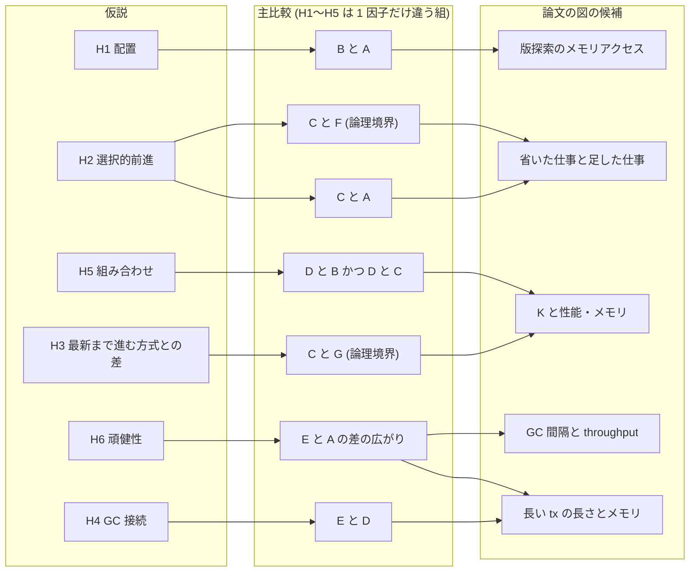
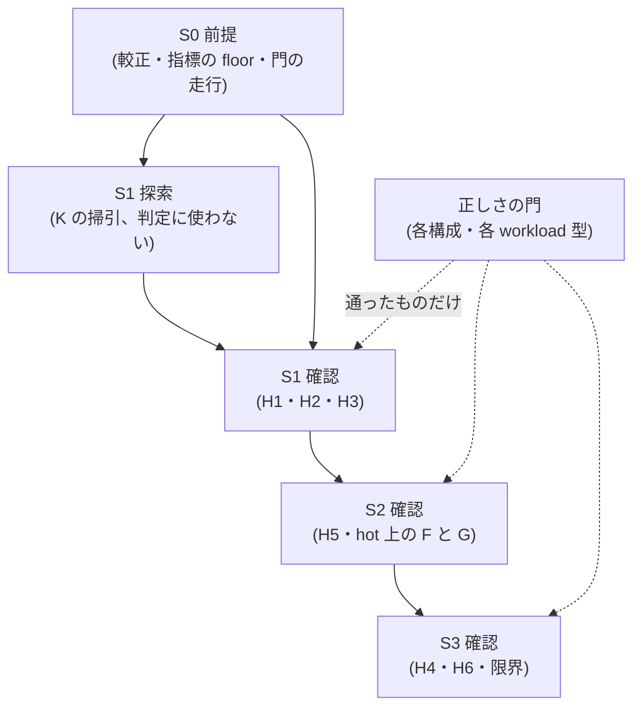
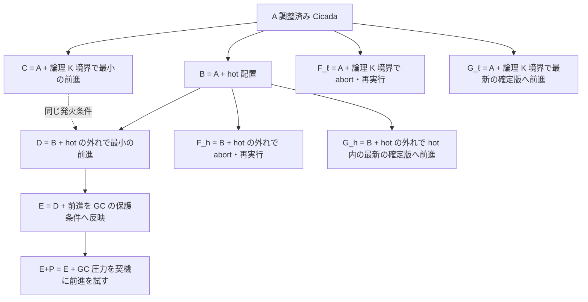
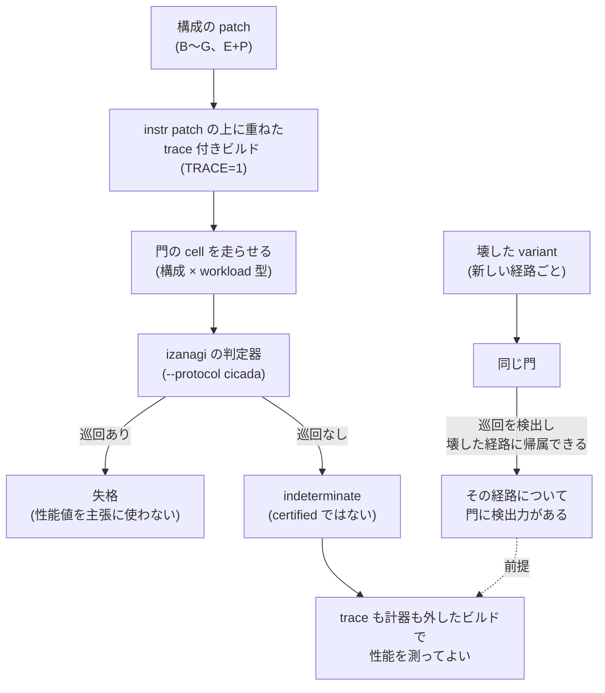
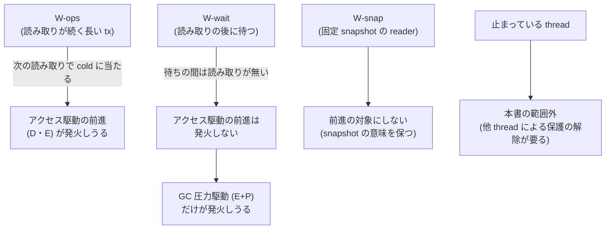

# VHash と選択的 timestamp forwarding の評価計画 — 仮説ごとの比較・判定・正しさの門・統計・予算を結果を見る前に固める事前登録 (草稿、未発効)

本書は、VHash 論文 (`docs/paper-story-vhash/`) の評価を、**計測を本格的に始める前に固定するための事前登録の草稿**である。
6 つの仮説 H1〜H6 それぞれについて、何と何を比べ、どの workload で、どの指標を、どの述語で判定し、
何が出たら何と書くかを先に決める。あわせて、正しさの門の置き方、統計の扱い、計算時間の見積り、
「読み取りの後に待っているだけの tx には効かない」という限界の示し方を決める。

**本書は草稿であり、発効していない。本書の存在は、実装・予備の観察・本走・計算投入のどれの認可でもない。**
発効は、§11 の前提が揃い、段ごとの node 時間をユーザーへ示して確認を得た後に、別の wave が日付付きの決定 (D 番号) で行う。
本書は計測をしていない。本書の中の数値は、登録する設計値 (反復数・区間の順位・格子) と、出所を明示した試算だけである。

## 0. 版と効力

- 本書は草稿 v0 である。登録版の文字列は `vhash-evaluation-v0-draft`。
- **発効の前:** 規則は固定されない。md_11 (比較相手の Cicada の較正) の記録と、§11 の前提の成否に合わせて、同じ path で改めてよい。
  改めたときは §13 に日付と理由を追記する。どの確認段の走行よりも前でなければならない。
- **発効の後:** 発効の決定に本書の raw bytes の SHA-256 を写す。以後は既存本文の bytes を書き換えず、訂正は末尾の Erratum 節への
  追記だけとする。結果を見た後に規則を変えたときは、向きを問わず事後改訂として別に報告する。本書自身の hash や、本書を含む commit の
  hash を本文へ書かない。
- 本書には解析器の pin も機械の gate も無い。凍結は文書上の契約である。

### 0.1 材料と上位の決定

| 出所 | 本書が使う内容 |
|---|---|
| 出典メモ `docs/paper-story-vhash/source-memo-2026-09-29.md` §24〜§28 | 仮説 H1〜H6、構成 A〜G、workload、指標、主要な図の候補。**構想の記録であって一次資料ではない** |
| 同 §15.4・§16・§17 | GC 改善を前進の成功回数で測らない理由、アクセス駆動と GC 圧力駆動の区別、固定 snapshot の扱い |
| 最初の版 `docs/paper-story-vhash/2026-09-29.md` §6・§8〜§10 | 限界の図、状態語、評価の組み立ての図、過大主張チェックリスト |
| 一次資料 `output/insights/2026-09-29/vhash-cicada-verifier/README.md` と D2279 | Cicada の trace を判定器に掛ける手段。**判定の上限は indeterminate であって certified ではない**。対応範囲は YCSB の point read / update |
| 一次資料 `output/insights/2026-09-29/vhash-forwarding-model/README.md` と D2282 | forwarding の規則 R4〜R10 と、崩すと反例が出る順序 (固定 10 場面の全探索の範囲) |
| 一次資料 `output/insights/2026-09-29/vhash-related-work/README.md` | 新規性の候補は U0〜U2 に絞られ、論文では「調べた範囲では見当たらなかった」までしか書けない。TicToc の timestamp history は原典で効果が測れなかった |
| D19 | noise floor の 2 種の区別。差の判定には between-run の floor を使い、`BETWEEN_RUN_CV = 0.030` を下限にする |
| D2212 項 4 | 1 タスクの job 合計が 2 node 時間以上なら都度ユーザーに確認する。一括承認にしない |
| ユーザー裁定 2026-09-26 | 実験設計に時間帯の block 分けを入れない。同時刻の対照は別物で残す |
| ユーザー裁定 2026-09-28 | 基盤の欠陥は比較から外さず、使い続けて直す |

md_11 (Cicada の較正) と md_2・md_5・md_6・md_8・md_10 は本書の起草時点で走行中または未着手で、その結果を本書は待たない。
本書でそれらに依存する箇所は、依存先と「何が決まれば埋まるか」を書くだけにする。

## 1. 一目でわかる全体

**読み方。** H1〜H5 は、構成を 1 因子だけ変えた組で判定する (§3)。H6 は方式全体 (E) と A の比較である。図は仮説・比較・図の対応だけを表し、結果・向き・大きさは表さない。
F と G の比較は、論理的な発火条件の上 (C と比べる) を主にし、hot 配置の上 (D と比べる) は確認段 S2 で行う (§3.4)。

**読み方。** 探索段で選んだ自由度 (K、E の GC 設定) は、確認段の新しい走行だけで判定する (§8.5)。各段は別のタスクとして、
段ごとに node 時間の確認を取る (§10)。

## 2. 用語

- **tx:** transaction。**版:** MVCC の version。**確定版:** COMMITTED の版。
- **hot:** 構成 B・D・E・F_h・G_h が持つ、key ごとに新しい順の先頭 K 版の記述子 (wts・状態・payload への参照) の置き場。
  数え方は小モデルの R3 と同じにする: ABORTED を除き、PENDING も数え、wts の降順で先頭 K 個。
- **論理 K 境界:** 物理的な hot を持たない構成 (C・F_ℓ・G_ℓ) の発火条件。「今の候補 timestamp で見える版が、Cicada の版の列を新しい方から
  数えて K 版より奥にある (R3 と同じ数え方)」。同じ列の状態では、論理 K 境界の発火と hot の外れ (hot miss) は同じ条件になる。
  違いは、hot の中身の更新が版の設置と同時でないこと (メモ §20.2) から生じる時間差だけである。
- **cold 探索:** 見える版を探すために、先頭 K 版より奥を辿ること。
- **前進 (forwarding):** tx の候補 timestamp を進めて、より新しい版を読むこと。手順は小モデル v1 の R4〜R8 に従う (§3.2)。
- **回収境界:** GC が「これより古い時刻を読む tx はもういない」とみなす下限 (Cicada の最小 wts に当たる量)。

## 3. 構成 A〜G の定義

### 3.1 3 つの因子で書く

構成は、Cicada の上で次の 3 因子のどれを変えるかで定義する。H1〜H5 の主比較はどれも 1 因子だけが違う組にする。
H6 だけは例外で、提案の全体 (E) と A の比較であり、3 因子が同時に違う。H6 は「何が効いたか」の帰属ではなく、方式全体の頑健性を問う (§5.2)。

| 因子 | 水準 |
|---|---|
| 版の配置 | Cicada のまま (hot なし) / hot に先頭 K 版の記述子を置く |
| 発火したときの行動 | 何もしない (そのまま cold 探索) / 最小の前進 / 最新の確定版への前進 / abort して新しい timestamp で再実行 |
| GC への反映 | しない (保護条件は開始時刻のまま) / 前進を保護条件へ反映する (アクセス駆動) / 加えて GC 圧力を契機に前進を試す |

**読み方。** 矢印は「左に 1 つの変更を足したものが右」を表す。点線は、C と D の発火条件が同じ規則 (R3 の数え方の先頭 K 版) であることを表す。

### 3.2 各構成が Cicada の上で何を変えるか

| 構成 | 変えるもの | 変えないもの | 本書での状態 |
|---|---|---|---|
| **A** | なし。**md_11 が決める「調整済み Cicada」** (最適化フラグと `gc_inter_us` を workload ごとに較正した最良設定と、最良から floor 以内の同等集合)。値は本書に書かない | — | md_11 走行中 |
| **B** | 版の読み取り経路で、先に hot を見る。hot に見える版があればそれを読み、無ければ Cicada の版の列を辿る (cold 探索)。hot の中身は版の設置・確定・回収に合わせて保守する | timestamp の決め方、validation、GC の規則、key の引き方 (index) | 未実装 (md_5 は微小計測だけ) |
| **C** | 論理 K 境界で発火したら、R4 で前進先を選ぶ: 先頭 K 版にある確定版のうち wts が候補 timestamp より大きく最小のもの h、前進先 t' = h の wts の次 (使用中なら次の空き)。t' で見える版が h でなければ候補なしとし、前進せずに cold 探索する。R5: 既読版の rts を t' へ上げてから、版の列を観測し直して既読版が t' でも見えるかを確認する。R6: 確定 (候補 timestamp := t')。失敗したら旧時刻のまま cold 探索 (R8)。PENDING 版を設置した後は前進しない (R8)。commit 時の validation は Cicada のまま全部行う (O1 は使わない。O1 を使う変種は別名「+O1」の副次比較にする) | 版の配置、GC の保護条件 (開始時刻のまま) | md_6 が試作中 |
| **D** | B の hot の外れで、C と同じ R4〜R8 の前進を行う | GC の保護条件 | 未実装 |
| **E** | D に加え、前進の確定の後の別の段で、GC に公開する保護下限を新しい候補 timestamp へ進める (R6 → R7)。版の回収は「wts が回収境界以下の確定した後続版がある」ことを条件にする (R10) | 前進の契機はアクセスだけ | 未実装。公開の手順は md_10 がモデルで設計中 |
| **E+P** | E に加え、回収境界の停滞や古い tx の経過時間を合図に、tx が安全な地点に来たときに前進を試す (メモ §16.2) | 止まっている thread の保護を他の thread が外すことはしない | 未設計。§9 の限界の示し方でだけ使う |
| **F_ℓ** | 論理 K 境界で発火したら、前進せずに abort し、新しい timestamp で最初から再実行する。再実行は同じ論理 tx として数え、latency と処理時間に含める | 配置、GC | md_6 が試作中 |
| **F_h** | B の hot の外れで F_ℓ と同じことをする | GC | 未実装 |
| **G_ℓ** | 論理 K 境界で発火したら、前進先の選び方だけを変える: 先頭 K 版にある確定版のうち **wts が最大のもの** h へ進む (wts が候補 timestamp 以下なら候補なし)。t' で見える版が h でなければ候補なしとする棄却条件、その後の R5〜R8、commit 時の validation は C と同じ | 配置、GC | 未実装 |
| **G_h** | B の hot の外れで G_ℓ と同じ選び方をする | GC | 未実装 |

- **G の定義の範囲。** 出典メモ §10・§12.1 の「必ず最新版」を、本書では「発火したときだけ、hot (または先頭 K 版) の中の最新の確定版へ進む」と定義する。
  すべての読み取りで最新を読み timestamp を commit 時に決める型 (TicToc に近い型) は、CC の規則そのものを変えるので、本書の構成に入れない。
  そのため G と C の差は**前進先の選び方だけ**になり、H3 はその差だけを測る。
- **K = 1 で C と G は同じ規則になる。** 先頭 1 版の中の確定版は高々 1 つなので、「wts が候補より大きく最小」と「wts が最大」は同じ版を選ぶ。
  K = 1 の C と G の比較を、H3 の A/A 対照に使う (§5.2)。
- **E と E+P の GC 安全は、Cicada の判定器では検査できない** (§7.5)。

### 3.3 全構成でそろえるもの

- **同じ基盤:** CCBench の同じ pin、同じ allocator、同じ workload 生成器、同じ thread の割り付け、同じ build の設定 (最適化フラグは A の
  較正値を全構成に継承する。構成が変える site に関わるフラグの扱いは、実装 wave が構成ごとに書く)。
  pin を C から C2' へ進めるなら、A の較正を含め全構成を同じ pin で測り直す。
- **key の引き方を変えない (メモ §25.1):** 主比較はすべて A と同じ index で版管理だけを変える。VHash を hash の key lookup と融合した最終構成は、
  別名 (構成名に「+L」を付ける) の副次比較とし、主要な判定の族 (§5.3) に入れない。
- **基盤の欠陥:** md_8 が CCBench の Cicada の書き込み側の検査に小モデルの v0 と同じ穴を見つけた場合、その修正を共通の基盤に入れ、
  A を含む全構成を修正後の基盤で測る。修正前の stock も比較から外さず、別名で記録する (ユーザー裁定 2026-09-28)。
- **レコード数と thread 数:** レコード数は calibrator の方針 (cache miss 率が飽和する最小、絶対規律 4) で md_11 が決めた値を使う。
  主要な判定は 1 node の全 core (Pegasus gen_S の 48 core) に worker を割り付けた条件だけで行う。thread 数を変えた scaling は副次の図にする。

### 3.4 最初の版 §9 の図からの変更点

最初の版 §9 は F と G を A から直接伸ばし、D と比べる図だった。本書では F と G を 2 通り (論理 K 境界の上と hot の上) に定義し、
主比較を「発火条件が同じで行動だけが違う組」(C と F_ℓ、C と G_ℓ、D と F_h、D と G_h) にした。理由は、A から伸ばした F と D を比べると
配置と行動の 2 因子が同時に違い、「前進が効いたのか hot が効いたのか」を分けられないからである。論理 K 境界の上の組 (C と F_ℓ・G_ℓ) を先に
測るのは、hot 配置の実装を待たずに行え、md_6 の試作 (C と F_ℓ) がそのまま使えるからである。

## 4. workload

### 4.1 一覧

| 名前 | 中身 | 役割 |
|---|---|---|
| W-rh / W-bal / W-wh | YCSB の point read / update。読み比率と偏り (zipf) は md_11 の較正記録と同じ 3 点を使う | 主要な判定の cell |
| W-ro | 読み取りだけ (更新なし)。版の列が伸びない | 効かないはずの条件: 深い版探索も前進も起きない |
| W-contend | 既読のキーが頻繁に更新される高競合 (RMW、偏り大)。前進の余地が小さい | 効かないはずの条件: 前進がほぼ失敗する (メモ §26.3) |
| W-ops(ℓ) | 1 thread が操作数 ℓ の長い tx を繰り返し、他の thread は W-bal の短い tx。長い tx は読み取りの合間に新しい読み取りがある | 長い tx のうち、アクセス駆動の前進が発火しうる型 |
| W-wait(τ) | 1 thread が短い tx の読み取りを終えた後、commit の前に τ だけ待つ。他の thread は W-bal | 長い tx のうち、読み取りの後に新しい読み取りが無い型 (§9) |
| W-snap(τ) | 1 thread が read-only の tx で snapshot を読み、τ だけ保持する。他の thread は W-bal | 固定 snapshot の reader が回収境界を支配する条件 (メモ §17.2・§26.3) |

- 長い tx の格子は、W-ops の ℓ = 通常の操作数の 10 倍 (ℓ1) と 100 倍 (ℓ2)、W-wait の τ = 1 ms・10 ms・100 ms、W-snap の τ = 100 ms の 1 点を登録する。
  計測時間 (extime) は τ の最大値の 10 倍以上にする。
- GC 間隔の格子は、x0 = A の最良の `gc_inter_us` (md_11 が workload ごとに決める) に対して x0・4 x0・16 x0・64 x0 の 4 点とし、
  H6 の差の差の広い側を x_L = 64 x0 と登録する。
- read-only の tx は前進の対象にしない (メモ §17.2、最初の版 §6.1)。W-snap の reader は Cicada の read-only の経路のまま読む。

### 4.2 長い tx の生成器は前提条件である

pin C (`68106660`) の checkout を grep した範囲の観測 (2026-09-29、本書の起草時):

- `batch_th_num`・`batch_ratio`・`batch_max_ope` などの `batch_*` 引数は `cc/cicada/include/common.hh` で定義される。見た範囲での出現は、
  `util.cc` の表示と thread 数の合計 (`batch_th_num`)、`ycsb_cicada.cc` が `batch_max_ope` を `RunnerOptions` に渡し、`common/runner.hh` がそれを
  結果表示の `displayAllResult` へ渡す箇所である。`cc/cicada/` の 4 file と `common/runner.hh` を見た範囲では、長い tx を生成する処理を確認できなかった
  (`transaction.hh` の `is_batch_` を真にする箇所も見つけていない)。
- 読み取りの後に待つ処理は、compile 時のマクロ `WORKER1_INSERT_DELAY_RPHASE` が真のときだけ、thread 1 の `commit()` の冒頭 (読み取りの後) に
  `WORKER1_INSERT_DELAY_RPHASE_US × clocks_per_us` の遅延を入れる形で存在する (`transaction.cc` の commit の冒頭)。遅延量のマクロ
  `WORKER1_INSERT_DELAY_RPHASE_US` の定義は木の中に見当たらず、既定 (`WORKER1_INSERT_DELAY_RPHASE` = 0) 以外で build できるかは確かめていない。
  `genome.py` の `CICADA_SPACE` はこのマクロを計測撹乱ノブとして探索軸から外している。

したがって W-ops・W-wait・W-snap は、既定で元と挙動が一致する生成器の patch (D16 / D18 / D20 の分類で置き場を決める) が実装されるまで測れない。
これは §11 の前提 P5 である。W-wait を既存のマクロで作る場合も、遅延量の渡し方を足す変更が要る。

## 5. 仮説ごとの比較と判定

### 5.1 判定語と、書いてよい文

各比較の統計量は、対にした走行の対数比 d の中央値と、その区間 [L, U] である (§8.2)。d は「値が大きいほど処置側が良い」向きにそろえる
(throughput は処置/対照、少ないほど良い指標は対照/処置の対数)。δ は §8.3 の閾値。

| 判定語 | 述語 | 論文に書いてよい文の形 |
|---|---|---|
| 改善 | L > δ | 「この条件で X は Y より (中央値の比) 良かった (区間 [L, U]、正しさの門の結果は §7.4 の形で併記)」 |
| 同等 | −δ < L かつ U < δ | 「この条件で X と Y の差は ±δ の中に収まった」 |
| 悪化 | U < −δ | 「この条件で X は Y より悪かった」 |
| 判定不能 | 上のどれでもない | 「差を判定できなかった」。**「効果が無い」とは書かない** |
| 失格 | 処置側が正しさの門で non-serializable | 「失格」。性能値は主張に使わない。判定の族の数 m は減らさない (§8.4) |
| 欠測 | 有効な対が §8.6 の下限未満 | 「欠測」 |

### 5.2 仮説の表

| 仮説 | 比較 (処置 対 対照) | workload | 主指標 (取るビルド) | 判定の述語 (主要) | 効かないはずの条件と、そこで出たときの扱い |
|---|---|---|---|---|---|
| **H1 配置** | B 対 A | W-rh・W-bal・W-wh | commit 1 件あたりの LLC load miss (trace も計器も外したビルドに perf stat を付けた別の走行) | 3 cell それぞれで「改善」 | W-ro (見える版は常に最新): 深い版探索が無い。ここで「改善」が出たら、主 cell の改善を「深い版探索の削減」に帰属させず、「最新版の置き方の違いを含む」と書く |
| **H2a 選択的前進 (回避)** | C 対 A | W-rh・W-bal・W-wh | commit 1 件あたりの cold 探索の回数 (計器入りビルド、A と C に同じ計器) | 3 cell それぞれで「改善」 | W-ro: 発火しない。発火回数 0 を計器で確かめ、throughput の C 対 A が「改善」なら差を前進に帰属させない |
| **H2b 仕事を保つ価値** | C 対 F_ℓ | W-rh・W-bal・W-wh | throughput (clean ビルド) | 3 cell それぞれで「改善」 | W-ro: どちらも発火しない。「改善」が出たら実装差を疑い、H2b の主張を保留する |
| **H3 最新まで進む方式との差** | C 対 G_ℓ | W-rh・W-bal・W-wh (K は §8.5 で選んだ値) | throughput (clean) | 3 cell それぞれで「改善」 | **K = 1 の C 対 G_ℓ** (同じ規則になる A/A 対照): 「改善」または「悪化」が出たら、測り方か実装の不一致として H3 の判定全体を保留する。W-contend: どちらも前進がほぼ失敗し、差は小さい見込み (述語は置かず記述) |
| **H4 GC 接続** | E 対 D | W-ops(ℓ1)・W-ops(ℓ2) | 回収境界の遅れの時間平均 **かつ** 生存する旧版の bytes の時間平均 (計器入りビルド、D と E に同じ計器) | 各 cell で両指標とも「改善」(2 つとも必要) | W-snap: reader が snapshot を保持している間は境界が reader の時刻で止まりうる。W-wait: 待ちの間はアクセス駆動の前進が発火しない (§9)。どちらも述語を置かず、記述と機序の記録 (待ちに入る前の前進と保護下限、reader の保持区間) にとどめる。**前進の成功回数では判定しない** (メモ §15.4) |
| **H5 組み合わせ** | D 対 B **かつ** D 対 C | W-rh・W-bal・W-wh | throughput (clean) | 各 cell で両方とも「改善」(交差・合併検定)。通ったときに書けるのは「組み合わせは両方の単独構成を上回った」まで | W-ro: 前進が発火せず D と B は同じ経路になる。D 対 C の「改善」は H1 の効果だけで説明できる。**「相乗効果」の語は、副次の判定 (対数の交互作用 ln D − ln B − ln C + ln A の「改善」、族の外) が通ったときだけ使う。** 両単独構成を上回っても交互作用が負になりうる (A=100・B=110・C=110・D=115 のとき交互作用は負) |
| **H6 頑健性 (GC 間隔)** | 方式全体の比較 (3 因子が同時に違う)。E 対 A の差が、GC 間隔を A の最良値 x0 から x_L = 64 x0 へ広げたときに広がるか (差の差) | W-bal・W-wh | throughput (clean) | 各 cell で差の差が「改善」 | W-ro: 版が溜まらず GC 間隔の影響が小さい。「改善」が出たら GC 以外の要因として主張しない |
| **H6 頑健性 (tx 長)** | 方式全体の比較。E 対 A の差が、W-bal から W-ops(ℓ2) へ移ったときに広がるか | W-bal と W-ops | throughput (clean) と、長い tx の commit 率 | 差の差が「改善」**かつ** 長い tx の commit 率の E 対 A が「悪化」でない | W-wait: アクセス駆動の E は待ちの間に発火しない。述語は置かず、§9 の記録と記述で扱う |

- **長い tx を含む cell の共通の条件 (メモ §27.1):** throughput が「改善」でも、長い tx の単位時間あたり commit 数が「悪化」なら、その cell の改善を
  主張しない。これは H6 以外の比較でも、W-ops・W-wait・W-snap の cell に適用する。
- **「Cicada の最良設定に対して」の主張 (メモ §28.1):** 図「GC 間隔と throughput」の headline に書ける文は、確認段で A の同等集合の全設定と、
  探索段で選んだ E の設定を同じ round で測り、A の中で中央値が最大の設定 A_best に対して E が「改善」または「同等」だった場合だけである。
  A_best は確認段のデータで選ぶので、その選び方を図と本文にそのまま書く (偏りの向きは主張しない、§8.8)。これは主要な判定の族に入れない副次の判定とする。
- **H6 の差の差だけでは「Cicada に勝った」と書かない。** 差の差は、A の GC 間隔を最良値から外したときの落ち方の比較であり、
  GC 間隔を不適切に大きくした Cicada に勝つことは主張にならない (メモ §28.1)。Cicada に対する主張は上の A_best との比較で書く。

### 5.3 主要な判定の族

Bonferroni で束ねる主要な判定は次の 20 個である (m = 20)。

| 比較 | cell | 個数 |
|---|---|---|
| H1 B 対 A | W-rh・W-bal・W-wh | 3 |
| H2a C 対 A | 同上 | 3 |
| H2b C 対 F_ℓ | 同上 | 3 |
| H3 C 対 G_ℓ | 同上 | 3 |
| H4 E 対 D (2 指標の交差・合併) | W-ops(ℓ1)・W-ops(ℓ2) | 2 |
| H5 D 対 B かつ D 対 C (両単独構成を上回るか) | W-rh・W-bal・W-wh | 3 |
| H6 差の差 | GC 間隔 × {W-bal・W-wh}、tx 長 × 1 | 3 |

1 つの判定の中で「両方とも」を要求する述語 (H4・H5・H6 tx 長) は、各成分をそれぞれ同じ水準で判定し、全成分が通ったときだけ通す
(交差・合併検定)。各成分の検定が水準 α で正しいなら、この形は成分の数だけ多重比較の補正を足さなくても水準 α を保つ。

### 5.4 副次・記述だけの比較 (族に入れない)

- K の掃引 (1・2・3・4・8) と、K → hot の当たり率 → 前進の回数 → throughput → 総メモリの関係 (メモ §28.3)。探索段 S1 の出力で、判定に使わない。
- D 対 F_h・D 対 G_h (hot の上での H2b・H3 の再確認)。
- H5 の交互作用 (ln D − ln B − ln C + ln A)。「相乗効果」と書くための判定で、区間の順位は主要な判定と同じ [d_(2), d_(13)] を使うが、族には数えない。
- thread 数の scaling。
- 「省いた仕事と足した仕事」(メモ §28.4): 避けた cold 探索と再実行の時間、足した検証・同期の時間 (計器入りビルド)。
- 前進の失敗理由の内訳 (既読値との不整合・write 制約・競合・固定 snapshot・見送り、メモ §27.3)。
- 物理メモリの再利用 (メモ §15.1 の段階 C): allocator の予約・使用量は記述だけにし、「物理メモリを減らした」とは主張しない。
- key の引き方まで融合した構成 (+L)。

## 6. 述語の入力は実在するか

判定の述語を採用する前に、その入力が実際の成果物に存在し、要求する値に届くかを確かめる。本書の起草時点の状態は次のとおりである。

| 入力 | 出所 | 起草時点 | 発効までに要ること |
|---|---|---|---|
| throughput (commit 数 / 秒) | CCBench の Cicada の出力 | 実在 (md_3 の走行で commit 数を trace と照合済み) | なし |
| 長い tx の commit 数 | 生成器 (未実装) | 未実在 | 生成器が長い tx と短い tx を分けて数えること |
| LLC load miss | perf stat (外から観測) | Pegasus で perf stat が使えるかを本書は確かめていない | S0 で A に対して取れることと値域を確かめる |
| cold 探索の回数・前進の試行 / 成功 / 失敗理由 | 計器 patch (未実装、D20 の第 5 類) | 未実在 | 計器を実装し、A と C で値域を測る。A で cold 探索が 0 に近い cell は H2a の述語を採用しない |
| 回収境界の遅れ・生存する旧版の bytes | 計器 patch (未実装) | 未実在 | 同上。W-ops で D の値が意味のある大きさになることを確かめてから H4 の述語を採用する |
| 正しさの門の判定 | `orchestrator/verifier/` と `patches/instr-cicada-trace.patch` | YCSB point read / update で実在 (D2279) | 各構成の patch を instr patch の上に重ねて適用できること。長い tx の型でも trace が出ること |
| between-run floor (throughput) | md_11 | 未着地 | md_11 の記録 |
| between-run floor (他の指標) | S0 で A を測る | 未実在 | S0 |

入力が実在しない、または要求する値に届かないと分かった述語は採用せず、測った値域を記録して本書を改める (発効の前に限る)。

## 7. 正しさの門

### 7.1 流れ

### 7.2 門の規則

1. **門の cell:** 構成 10 個 (A・B・C・D・E・E+P・F_ℓ・F_h・G_ℓ・G_h) × workload 型 4 つ (point read / update、W-ops、W-wait、W-snap) × thread 数 3 つ
   (md_3 と同じ小さな条件の 1 と 4、性能を測る 48) の 120 組それぞれで 1 走行を trace 付きで走らせ、判定器に掛ける。1 構成を 1 job にまとめ、
   job ごとに trace 付きビルドを 2 つ (W-wait 用に遅延のマクロを変えたものと、それ以外) 作る。未実装の構成・生成器の組は、実装されるまで門も性能も測らない。
   48 thread の trace は量が大きく判定器の処理時間を決めるので、計測時間を短くしてよい。
2. **巡回が 1 つでも出たら、その構成は即失格** (絶対規律 2)。失格は構成単位で、同じ構成の他の cell の性能値も主張に使わない。
   修正した構成は新しい構成名で門をやり直す。**門を甘くして通す変更はしない。**
3. **integrity の数値項目 0 と、trace の commit 数 = ベンチマークの commit 数**を、門の成立の条件にする (md_3 と同じ)。どちらかが崩れたら、
   その走行の判定を使わず、原因を調べる。
4. **門を通していない値は主張に使わない。** 門の cell が無い構成 × workload 型の性能値は「未検証の診断値」と明記し、判定の族にも図の headline にも入れない。
5. **比較相手 A も同じ門を通す。** A の門の cell で巡回が出た場合は、基盤の欠陥として §3.3 の扱いにする。

### 7.3 新しい経路ごとの検出力

md_3 の壊し patch 3 本は Cicada の既存の経路 (validation の再検査・rts の更新・read-only の版選択) の検出力を示したが、前進・hot・GC 公開の
**新しい経路**の検出力は示していない。各構成の実装 wave は、新しい経路ごとに 1 本以上の壊した variant を作り、門がそれを巡回として検出し、
壊した経路に帰属できる (md_3 の帰属規則と同じ形) ことを、その構成の性能値を主張に使う前提にする。

- 小モデルの結果から、commit 時の validation が近道の結果をやり直す限り、前進の確認を崩しただけの variant (U1f・U6) は巡回に至らない場合がある
  (モデルの固定場面の範囲)。したがって前進の経路の壊し variant は、「前進の確認を崩し、かつ確認済みの版の commit 時の検証を省く」
  (モデルの U1f+O1 に当たる) 形を候補にする。O1 を使わない構成では、この壊し variant は O1 を足した壊しの build でだけ作る。
- 壊した variant が検出されなかった経路は「門の検出力を確かめていない経路」と書き、その経路を使う構成の性能値を headline に使わない。

### 7.4 主張文の書き方

門を通ったことは、次の形でだけ書く。

- 書いてよい: 「構成 X の実装について、YCSB の point read / update と長い tx の型 (列挙) の門の cell で Cicada 用 trace を izanagi の判定器に掛け、
  巡回は検出されなかった (判定の上限は indeterminate。certified ではない)。新しい経路 (列挙) の壊した variant は同じ門で検出された。」
- 書かない: 「X は serializable である」「X の正しさを検証した」「門を通ったので正しい」。巡回が無い履歴は「巡回が無かった」であって、
  serializable の証明ではない (D2279)。
- 小モデル (D2282) の「反例なし」は、固定した場面の初期状態からの全 interleaving に限って書く。実装の正しさの根拠として書かない。

### 7.5 GC 安全は判定器の対象外

判定器は依存グラフの巡回を見るだけで、回収してはいけない版を回収したか (use-after-free・必要な版の消失) は見ない。E と E+P の GC 安全の
根拠は、(a) md_10 のモデルの探索結果 (範囲付き) と、(b) 実装側の別の検査 (回収した版の記述子を毒で埋めて、触れたら止まる診断 build など、
設計は実装 wave が決める) の 2 つにし、判定器の結果で代用しない。(b) が無い間は、E の性能値を「GC 安全を実装で確かめていない構成の値」と明記する。
md_3 の `CICADA_TRACE_READ_WTS_MISMATCH` (読んだ時点の wts と commit 時の wts の食い違い) は、版の再利用の兆候として E の門の cell でも記録する。

### 7.6 観測者効果の分離 (絶対規律 1)

- 3 種のビルドを分ける: (1) 門用 (TRACE=1 + instr patch)、(2) 機序の指標用 (計器 patch、trace なし)、(3) 性能用 (trace も計器も無い)。
  throughput と perf stat の値は (3) だけから取る。(2) の値は、比べる両側に同じ計器を入れた場合だけ比べる。
- 各構成の patch は、instr patch を重ねない TRACE=0 のビルドと、instr patch を重ねた TRACE=0 のビルドで命令列が一致することを
  (md_3 §5 と同じ方法で) 確かめる。
- (2) の計器は timing を変えうるので、GC の動き (回収の時期) も変わりうる。H4 の値は計器入りビルドで両側を測った比較であり、
  計器の無いビルドでの保持量そのものではないと書く。

## 8. 統計

### 8.1 測り方

- **round:** 1 つの cell (workload × thread 数 × 設定) について、比べる全構成を 1 回ずつ走らせた組。各走行は新しい process で DB を作り直す。
- **順番:** round の中の構成の順番は巡回 (Latin 方格) で回し、round 数が構成数の倍数のとき、各構成が各順番に同じ回数入るようにする。
- **反復:** 確認段の各 cell は round を n = 14 取る。14 round を 2 つの job (各 7 round) に分け、2 つの node へ同時に投入する。各 job は
  比べる全構成を含む (構成と node を一対一に割り付けない)。
- **同時刻の対照:** 対照 (A や比較相手の構成) は必ず同じ round の中で測る。過去の走行や別の日の走行を対照にしない。
- **時間帯の block 分けはしない** (ユーザー裁定 2026-09-26)。job はノードの空きに合わせてまとめて投入してよい。

### 8.2 推定量と区間

- 各 round i で、処置 X と対照 Y の対数比 d_i = ln(X_i / Y_i) (少ないほど良い指標は ln(Y_i / X_i)) を作る。差の差は
  d_i = [ln X_i(条件 2) − ln Y_i(条件 2)] − [ln X_i(条件 1) − ln Y_i(条件 1)] とし、同じ round に 4 つの値がそろっていることを要する。
- 推定量は d_i の中央値。区間は順序統計量の区間 [d_(2), d_(13)] (14 個を小さい順に並べた 2 番目と 13 番目)。
- この区間が中央値を含む確率は、d_i が独立に同じ連続分布に従うとき 1 − 2 × (1 + 14) / 2^14 = 0.99817 である
  (二項分布による計算、本書の起草時に計算した)。
- 副次の比較 (確認段で n = 14 を取るもの) は、主要な判定と同じ区間を示し、多重比較の補正をしていないことを明記する。
- 探索段 (各 cell n = 3) は区間を主張しない。3 個の中で最も広い区間 [d_(1), d_(3)] でも、中央値を含む確率は 1 − 2 / 2^3 = 0.75 にとどまる。
  探索段の値は中央値と最小・最大を記述として示すだけにし、判定語を付けない。

### 8.3 閾値 δ と noise floor

- throughput の閾値は δ_T = ln(1 + max(0.030, f_T))。f_T は md_11 が測る Cicada の between-run の floor (独立な走行の中央値どうしの変動係数)。
  0.030 は D19 の `BETWEEN_RUN_CV` で、Cicada の floor がそれより小さく出ても下限として残す。
- 他の指標 M (LLC miss・cold 探索の回数・回収境界の遅れ・生存 bytes) の閾値は、指標と cell の組ごとに δ_M,c = ln(1 + max(0.030, f_M,c)) とする。
  f_M,c は S0 で A を 8 つの独立なセッション (各 5 rep) で測った、cell c での指標 M のセッションの中央値どうしの変動係数である。
  測る cell は、その指標を主指標に使う主要な判定の cell (H1・H2a は W-rh・W-bal・W-wh、H4 は W-ops(ℓ1)・W-ops(ℓ2))。
  f_M,c が無い組の述語は判定しない (「欠測」)。
- within-run の floor (1 測定の品質) は、走行を採るか捨てるかの品質の判定だけに使い、差の判定には使わない (D19)。

### 8.4 複数比較

- 主要な判定の族 m = 20 (§5.3) に Bonferroni を適用し、各判定を水準 0.05 / 20 = 0.0025 で行う。§8.2 の区間の被覆 0.99817 は
  1 − 0.0025 = 0.9975 以上なので、区間の外に δ があることをもって各判定の述語とする。この区間の順位 (2 番目と 13 番目) は
  m ≤ 27 まで同じ条件を満たす (0.05 / 27 ≈ 0.00185)。
- 失格・欠測になった判定も m から除かない。後から判定を足したときは m を数え直し、区間の順位を §8.2 の計算で決め直す (発効の前に限る)。
- 副次・探索の比較は族に入れず、多重比較の補正をしない。そのことを図と本文に書く。

### 8.5 選択と確認の分離

- データを見て選ぶ自由度 (K、E の GC 公開の頻度などの設定、E+P の合図の閾値) は、探索段 S1 探索 (各 cell n = 3、判定に使わない) で選ぶ。
  選び方の規則は「W-bal の throughput の中央値が最大の値。同点なら小さい K」と登録する。
- 確認段は選んだ値で新しい round を取り、探索段の走行を判定に使わない。
- A は md_11 の最良と同等集合を使う。確認段では同等集合の全設定を同じ round で測り、主要な判定の対照には md_11 が決めた最良の 1 設定を使う。
  §5.2 の「A_best に対して」の副次の判定だけが、確認段のデータで A を選ぶ。

### 8.6 欠測・失敗・中断

- 走行が異常終了・timeout・出力の欠落のどれかになったら、その round を丸ごと除く (対を崩さない)。除いた round の数と理由を記録する。
- 値を見ずに rc と出力の有無だけで失敗と分かった round は、同じ job 形で 1 回だけ足してよい。足したことを記録する。
- 有効な round が 14 に満たないときは、そのときの n で被覆が 1 − 0.05 / m 以上になる最も内側の順位で区間を作る。m = 20 のとき、
  n が 10 未満なら (順位 1 と n でも被覆が 0.9975 に届かない) その判定は「欠測」とする。
- 門で失格になった構成を含む判定は「失格」とし、他の構成の判定は続ける。

### 8.7 仮定として登録すること

次は検定の前提であり、本書はこれらが成り立つことを保証しない。崩れた兆候があれば、限定を添えて報告する以上のことを約束しない。

- 同じ cell の round どうしが独立で、d_i が同じ連続分布に従う。同じ node の中で時間とともにずれる (温度・周波数・他の利用者) と崩れる。
  round の番号に対する d_i の並びを図にして報告する (補正はしない)。
- 同じ round の中で、node の状態の変化が構成によらず同じ比率で効く。構成によってメモリ帯域の使い方が違えば、他の利用者の影響も構成ごとに違いうる。
- 2 つの job (node) の round をまとめて 1 つの標本として扱ってよい。node の間の性能差は未測定である (`docs/pegasus-runbook.md`)。

### 8.8 書かない文と、その反例

起草のときに書きかけて、反例を作れたので書かなかった文を残す。

| 書かない文 | 反例 |
|---|---|
| 「2 つの node の両方で同じ向きなら、node に共通の偶然には強い」 | 全 round に共通する 1 つの確率変数 Z (±a を等確率) が差を作るとき、各 node の向きは Z で決まり、両方が正になる確率は 1/2 である。両方の再現は共通の偶然の防壁にならない |
| 「対にすれば job の間のずれは消える」 | ずれが構成によって違う大きさで効くとき (上の §8.7 の 2 つ目)、対数比にも残る |
| 「区間の外に δ があれば、効果は δ より大きい」 | 区間は中央値についての区間で、§8.7 の仮定が崩れていれば被覆も崩れる。「δ より大きい」とは書かず、判定語 (§5.1) で書く |
| 「探索段で K を選んでも、確認段で新しく測れば偏りは無い」 | 新しい走行を使えば避けられるのは「探索段の走行を選択と推定に使い回すことによる偏り」だけである。標本中央値そのものの有限標本の偏りは残りうるし、どの K を検定するかは探索段の偶然で決まる。「選んだ K で確かめた」とだけ書き、「最良の K」とは書かない |
| 「A_best を最大の中央値で選ぶのは、E に不利な向きにしか偏らない」 | 同じ round の中で、E の偶然のばらつきが選ばれた A の設定のばらつきと同じ向きに、2 倍の大きさで動くとする (完全な相関)。偶然に高く出た A の設定を選ぶと、同じ round の E はさらに高く出ているので、対数比は E に有利な向きへ偏る。偏りの向きを主張せず、選び方をそのまま書く |
| 「両方とも通ることを要求する判定は、補正なしで水準を保つ」(無条件の形) | 各成分の検定そのものが水準を保っていなければ成り立たない。本書は「各成分の検定が水準 α で正しいなら」という条件付きの形でだけ使う (§5.3) |

## 9. 読み取りの後に待つ tx には効かない、という限界の示し方

**読み方。** 長い tx を 1 種類にまとめず、前進の契機が違う 3 型 (W-ops・W-wait・W-snap) に分けて測る (メモ §26.2)。図は契機の有無という
設計上の性質だけを表し、結果は表さない。

- **分けて測る:** 長い tx の型ごと (W-ops の 2 点・W-wait の 3 点・W-snap) に、D (アクセス駆動・GC 反映なし)・E (アクセス駆動・GC 反映あり)・
  E+P (GC 圧力駆動を足す) を同じ round で測る。clean ビルド (throughput と長い tx の commit 率、A も同じ round に入れる) と計器入りビルド
  (試行回数・保護下限・回収境界の遅れ・生存 bytes) の両方で測る (§10.2 の S3)。
  図「長い tx の長さとメモリ」(メモ §28.2) は、W-ops と W-wait を別の panel にし、同じ軸に並べない。
- **発火しないことを計器で示す:** W-wait では、長い tx が待っている間の前進の試行回数を計器で数える。アクセス駆動の構成 (D・E) では、
  待ちの区間の試行回数が 0 であることを確かめる (設計上の性質の確認であり、統計の判定ではない)。0 でなければ実装か計器の誤りとして調べる。
- **待ちに入る前の前進を分けて記録する:** 待ちの間に試行が 0 でも、長い tx が最後の読み取りで前進に成功してから待ちに入れば、E はその時点で
  保護下限を公開しており、D より旧版の保持を減らしうる。したがって W-wait では、長い tx ごとに「待ちに入った時点の候補 timestamp と公開済みの
  保護下限」と「開始時刻」の差を計器で記録し、E 対 D の回収境界の遅れと生存 bytes は述語を置かずに記述する。保持の差が出た場合は、
  それが待ちに入る前の前進で説明できるかを上の記録で確かめて書く。説明できない差は、実装か計器の誤りとして調べる。
- **限界として書く範囲:** アクセス駆動の前進が効くのは、待ちに入る前に読み取りが続いた分までである。待ちの間は保護下限が
  待ちに入った時点の値に止まるので、その値より後の時刻で上書きされた版の保持を、アクセス駆動の前進は減らせない (R10 の回収条件は
  後続の確定版の wts が回収境界以下であることを要する)。論文にはこの範囲を上の記録とともに書く。
- **書き分け:** 「W-wait で E に効果が無かった」を「前進が無効だった」と書かない。「アクセス駆動の前進は、読み取りの後の待ちの間には発火しない
  (計器で試行 0 を確認した)。減らせる保持は待ちに入る前の前進の分に限られる」と書く (メモ §26.2、最初の版 §6)。
- **E+P を測れない場合:** E+P が実装されず門を通らないなら、論文は W-wait を「本方式の範囲外」と明記し、GC 圧力駆動を今後の課題として書く。
  **W-ops で得た結果を W-wait に及ぶように書かない。** 止まっている thread は、E+P があっても範囲外と書く (メモ §16.2・§16.3)。
- **W-snap:** 固定 snapshot の reader がいる間は、E でも回収境界が reader の時刻で止まりうる。共存時にどの効果が残り、どれが失われるかを
  記述する (メモ §17.2)。「提案の対象外だから測らない」とはしない。

## 10. 計算時間の見積り

### 10.1 式

1 段の node 時間 = (走行数 × u + build 回数 × b) / 3600。u は 1 走行の秒数 (計測時間 extime + 起動と DB の構築)、
b は 1 回の build の秒数。走行数と job 数は本書の設計 (契約) で決まる。**u と b は本書の起草時点で Cicada について実測が無く、下の表の値は
2 通りの仮定 (u = 5 秒・b = 60 秒、u = 30 秒・b = 180 秒) を式に入れた試算である。** 上下限ではない。発効の前に md_11 の記録
(job の Elapse) で u と b を置き換えて計算し直す。

### 10.2 段ごとの試算

| 段 | 走行の行列 (構成 × workload × 反復) と job ごとの build 対象 | 走行数 (契約) | build 回数 (契約) | 試算 (u=5・b=60) | 試算 (u=30・b=180) |
|---|---|---|---|---|---|
| S0 前提 | floor: A × 5 workload (W-rh・W-bal・W-wh・W-ops ℓ1・ℓ2) × 8 独立セッション × 5 rep × 2 ビルド (perf 用の clean と計器入り) = 400。8 job (1 セッション 1 job) × 2 build。門: §7.2 の 120 組 × 1 走行 = 120。10 job × 2 build | 520 | 36 | 1.32 | 6.13 |
| S1 探索 | {A・B・C・F_ℓ・G_ℓ} の A と 4 構成 × K 5 値 = 21 通り × 5 workload (W-rh・W-bal・W-wh・W-ro・W-contend) × n = 3 × 2 ビルド = 630。10 job (5 workload × 2) × 10 build (5 構成の clean と計器入り) | 630 | 100 | 2.54 | 10.25 |
| S1 確認 | clean {A・B・C・F_ℓ・G_ℓ} × 5 workload × 14 = 350、perf {A・B} × 5 × 14 = 140、計器 {A・C・F_ℓ・G_ℓ} × 5 × 14 = 280、K = 1 の {C・G_ℓ} × 3 × 14 = 84。10 job × 9 build (clean 5、計器 4) | 854 | 90 | 2.69 | 11.62 |
| S2 確認 | clean {A・B・C・D・F_h・G_h} × 5 workload × 14 = 420。10 job × 6 build | 420 | 60 | 1.58 | 6.50 |
| S3 確認 | GC: clean {A・D・E} × GC 間隔 4 点 × {W-bal・W-wh} × 14 = 336 (4 job × 3 build)。長い tx の clean: {A・D・E・E+P} × 7 workload (W-bal・W-ops 2 点・W-wait 3 点・W-snap) × 14 = 392 (14 job × 8 build、W-wait 用の遅延のマクロ違いを含む)。長い tx の計器入り: {D・E・E+P} × 6 workload (W-ops 2 点・W-wait 3 点・W-snap) × 14 = 252 (12 job × 6 build) | 980 | 196 | 4.63 | 17.97 |
| 合計 | | 3,404 | 482 | 12.76 | 52.47 |

表の値は「(走行数 × u + build 回数 × b) / 3600」を段ごとに計算したものである。並列の job はそれぞれの node で build し直す (node ローカルの
build) と仮定して build 回数を数えた。K は実行時の引数で渡せる実装を前提にした (compile 時の定数なら、S1 の build 回数は K の値の数だけ増える)。
E+P が実装されなければ S3 の E+P の走行 (長い tx の clean 98・計器入り 84) は行わない。W-wait の走行は τ の 10 倍以上の計測時間を要するので、S3 の u は他の段より大きくなる見込みである
(試算には入れていない)。

### 10.3 2 node 時間を超える段の扱い

- **確認:** 試算で 2 node 時間を超える段 (u = 5 秒の仮定でも S1 探索・S1 確認・S3) は、md_11 の実測単価で計算し直したうえで、段ごとに
  ユーザーの確認を取ってから投入する (D2212 項 4)。S0・S2 も、実測単価で 2 node 時間以上になれば同じ扱いにする。段をまとめて一括で承認を求めない。
- **分割 (待ち時間を縮めるため、node 時間は減らない):** 各段の cell は互いに独立なので、workload ごと・round の半分ごとに job を分け、空きノードへ同時に
  投入する (1 node で直列に何時間も流さない)。S1 確認なら 5 workload × 2 = 10 job。
- **削る順 (node 時間を減らす案、ユーザーの択一に出す):** (1) S1 探索の計器入りの半分を省き、K の選択を clean の throughput だけで行う。
  (2) 効かないはずの条件の cell (W-ro・W-contend) を n = 14 から n = 7 に減らし、「予測の確認」だけに使う (区間の被覆は下がり、その旨を書く)。
  (3) S3 の GC 間隔の格子を 4 点から 3 点にする。(4) 主要な判定の cell から W-rh を外し m を減らす。どれも本書の改訂 (発効の前) で行う。
- **LLM の時間:** 本計画の計測に LLM は使わない。構成の実装 wave が使う LLM の時間は各 wave の見積りに入れる。

## 11. 発効までに要るもの

| # | 前提 | 担い手 (見込み) |
|---|---|---|
| P1 | A (調整済み Cicada の最良と同等集合)、Cicada の between-run floor、レコード数、1 走行と build の実測単価 | md_11 |
| P2 | 他の指標の between-run floor と値域 (§6) | S0 (本計画の最初の段) |
| P3 | 構成 B・C・D・E・F_ℓ・F_h・G_ℓ・G_h (と E+P) の inert patch、TRACE=0 の命令列の同一性、門の cell の通過 | 構成ごとの実装 wave (C・F_ℓ は md_6) |
| P4 | 新しい経路ごとの壊した variant と、その検出 (§7.3) | 同上 |
| P5 | 長い tx の生成器 (W-ops・W-wait・W-snap) と、その門の cell (§4.2) | 未割り当て |
| P6 | E・E+P の GC 安全の根拠 (§7.5) | md_10 (モデル) と実装 wave |
| P7 | 計器 patch (cold 探索・前進・回収境界・生存 bytes、D20 の第 5 類) | 未割り当て |
| P8 | 基盤の欠陥の有無 (md_8) と、見つかった場合の修正 (§3.3) | md_8 |
| P9 | pin (C のままか C2' へ進めるか) を全構成で 1 つに決める | pin 前進の wave |

## 12. この草稿がしないこと・確かめていないこと

- **計測していない。** 本書の数値は設計値と試算だけで、Cicada の実測値を 1 つも含まない。
- **比較相手 A の値を書いていない。** md_11 が決める。
- **E・E+P の手順を決めていない。** 公開の順序は小モデルの R6 → R7・R10 に従うとだけ書き、GC 圧力駆動の合図は設計していない。
- **§4.2 の観測は grep の範囲に限る。** pin C の checkout で `batch_*` と遅延マクロの出現を探した結果であり、build して挙動を確かめてはいない。
- **Pegasus で perf stat が使えるかを確かめていない** (§6)。
- **新規性の書き方は本書の対象外。** 論文の新規性の置き直しは md_9 と次の版が扱う。本書の比較が示せるのは性能と機序であり、「初めて」かどうかではない。
- **TPC-C は本計画の主要な判定に入れていない。** 門 (md_3) が YCSB の point read / update だけを対象にしているため。TPC-C へ広げるには、
  門の対象の拡張 (scan・insert・delete) が先に要る。

## 13. 改訂の記録

- 2026-09-29: 草稿 v0 を起草 (VHash 並行 wave md_12)。
- 2026-09-29: 同じ wave の段 6 レビュー (must-fix 7・nit 4) を受けて改めた。探索段の区間の主張を外す、H5 の主張を「両単独構成を上回る」に限り「相乗効果」を副次の交互作用へ分ける、W-wait と W-snap の保持の予測述語を外し待ちに入る前の前進を記録する、H6 を方式全体の比較と明記する、x_L = 64 x0 を登録する、門と S3 の走行の行列を明示して見積りを再積算する、§4.2 の観測の範囲を狭める。
