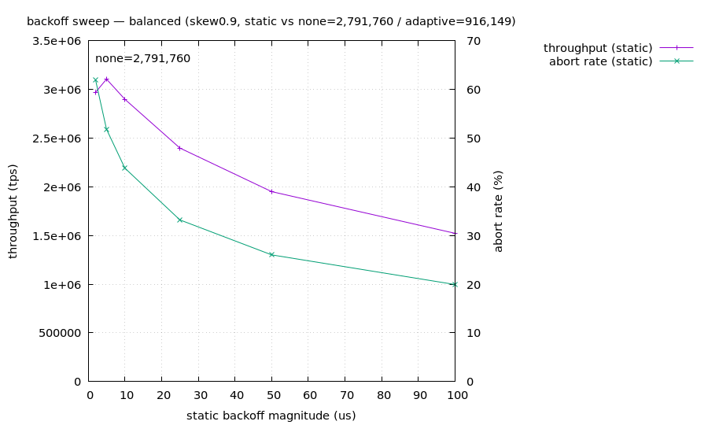

# backoff sweep 材料レポート — balanced

> 自動生成。silo の backoff *量* を単一軸として sweep (patches/silo-backoff-fixed.patch, D18)。trace-disabled build (規律1)・単一テナント直列 (規律4)・各 genome は verifier 通過。

## 参照

- **無 backoff** (BACK_OFF=0): 2,791,760 tps
- **stock 適応 backoff** (Cicada hill-climb): 916,149 tps
- **静的最良**: 5us = 3,106,342 tps
- **判定**: 静的 backoff が無 backoff を +11.3% 上回る (sweet spot あり)

## 静的 backoff 量に対する曲線

| backoff us | throughput tps | abort % | ipc | vs 無 backoff |
|---:|---:|---:|---:|---|
| 2 | 2,971,253 | 62.0% | 1.40 | +6.4% |
| 5 | 3,106,342 | 51.8% | 1.20 | +11.3% |
| 10 | 2,899,247 | 43.8% | 0.99 | +3.9% |
| 25 | 2,398,168 | 33.2% | 0.75 | -14.1% |
| 50 | 1,950,646 | 26.0% | 0.61 | -30.1% |
| 100 | 1,522,128 | 19.9% | 0.49 | -45.5% |

## 読み (critic 帰属の検証)

stock 適応 backoff が静的最良に対してどこに居るか = Cicada の hill-climbing が sweet spot を捉えているか/逃しているかの直接証拠。abort% と ipc の列で「backoff を増やすと abort は下がるが ipc が落ちる」trade-off が量の関数として見える。
