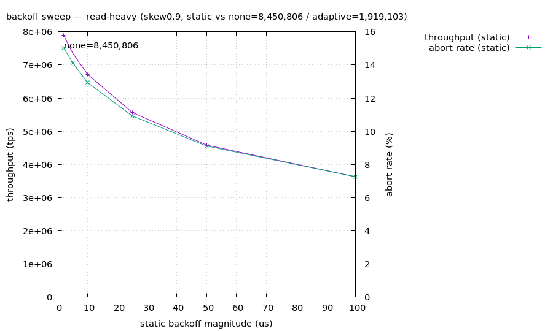

# backoff sweep 材料レポート — read-heavy

> 自動生成。silo の backoff *量* を単一軸として sweep (patches/silo-backoff-fixed.patch, D18)。trace-disabled build (規律1)・単一テナント直列 (規律4)・各 genome は verifier 通過。

## 参照

- **無 backoff** (BACK_OFF=0): 8,450,806 tps
- **stock 適応 backoff** (Cicada hill-climb): 1,919,103 tps
- **静的最良**: 2us = 7,889,420 tps
- **判定**: 静的最良でも無 backoff に届かず (-6.6%) = backoff は純損

## 静的 backoff 量に対する曲線

| backoff us | throughput tps | abort % | ipc | vs 無 backoff |
|---:|---:|---:|---:|---|
| 2 | 7,889,420 | 15.0% | 1.56 | -6.6% |
| 5 | 7,355,208 | 14.1% | 1.46 | -13.0% |
| 10 | 6,717,936 | 12.9% | 1.34 | -20.5% |
| 25 | 5,568,237 | 10.9% | 1.12 | -34.1% |
| 50 | 4,583,093 | 9.1% | 0.94 | -45.8% |
| 100 | 3,630,211 | 7.3% | 0.78 | -57.0% |

## 読み (critic 帰属の検証)

stock 適応 backoff が静的最良に対してどこに居るか = Cicada の hill-climbing が sweet spot を捉えているか/逃しているかの直接証拠。abort% と ipc の列で「backoff を増やすと abort は下がるが ipc が落ちる」trade-off が量の関数として見える。
