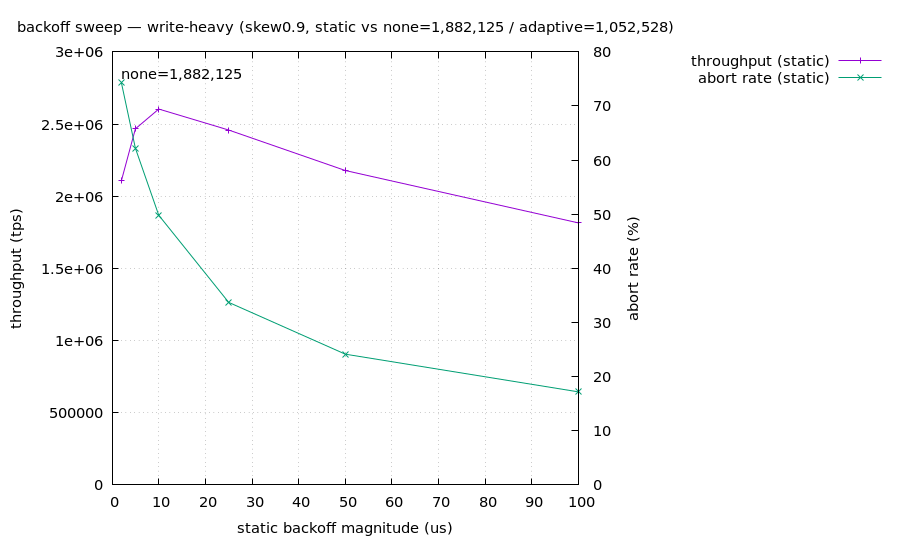

# backoff sweep 材料レポート — write-heavy

> 自動生成。silo の backoff *量* を単一軸として sweep (patches/silo-backoff-fixed.patch, D18)。trace-disabled build (規律1)・単一テナント直列 (規律4)・各 genome は verifier 通過。

## 参照

- **無 backoff** (BACK_OFF=0): 1,882,125 tps
- **stock 適応 backoff** (Cicada hill-climb): 1,052,528 tps
- **静的最良**: 10us = 2,603,521 tps
- **判定**: 静的 backoff が無 backoff を +38.3% 上回る (sweet spot あり)

## 静的 backoff 量に対する曲線

| backoff us | throughput tps | abort % | ipc | vs 無 backoff |
|---:|---:|---:|---:|---|
| 2 | 2,108,543 | 74.2% | 1.62 | +12.0% |
| 5 | 2,466,887 | 62.2% | 1.33 | +31.1% |
| 10 | 2,603,521 | 49.8% | 1.08 | +38.3% |
| 25 | 2,458,154 | 33.7% | 0.85 | +30.6% |
| 50 | 2,177,407 | 24.1% | 0.71 | +15.7% |
| 100 | 1,814,519 | 17.2% | 0.59 | -3.6% |

## 読み (critic 帰属の検証)

stock 適応 backoff が静的最良に対してどこに居るか = Cicada の hill-climbing が sweet spot を捉えているか/逃しているかの直接証拠。abort% と ipc の列で「backoff を増やすと abort は下がるが ipc が落ちる」trade-off が量の関数として見える。
