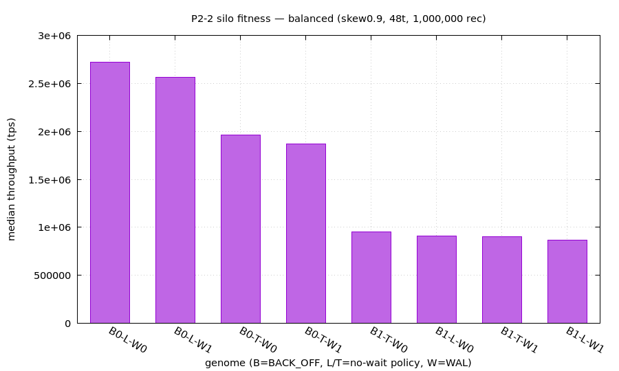

# P2-2 材料レポート — silo fitness (balanced)

> 自動生成 (orchestrator/campaign/p2_2_report)。計測は trace-disabled build (規律1)・単一テナント直列 (規律4)。グラフ/.dat/.plt は手で再生成できる。



## provenance
- **env**: linux-baremetal
- **campaign**: p2-2-silo-balanced-enumerate-f1588056
- **workload**: balanced (ycsb_rmw=0, ycsb_rratio=50, ycsb_zipf_skew=0.9)
- **calibration**: records=1,000,000 threads=48 clocks_per_us=1800 extime=3
- **noise_floor_cv**: 2.28% (skew0.9)
- **genome_label**: B<BACK_OFF>-<L=no-wait-locking/即abort | T=tictoc-no-wait/retry>-W<WAL>

## 最速構成: `silo|BACK_OFF=0,NO_WAIT_LOCKING_IN_VALIDATION=1,NO_WAIT_OF_TICTOC=0,WAL=0`  (B0-L-W0)

**2,722,529 tps** (CV 1.49%)。差の判定は noise floor 2.28% (skew0.9) 以下を「差なし」に丸め、超える差にだけ Mann-Whitney U (α=0.05) を当てる (§3.6(4))。

## fitness ランキング (median 降順)

| rank | genome | median tps | CV | 最速との差 |
|---:|---|---:|---:|---|
| 1 | `B0-L-W0` | 2,722,529 | 1.49% | **(最速)** |
| 2 | `B0-L-W1` | 2,565,048 | 0.76% | 最速が **+6.1%** 速い (有意, p=0.012) |
| 3 | `B0-T-W0` | 1,966,062 | 1.94% | 最速が **+38.5%** 速い (有意, p=0.012) |
| 4 | `B0-T-W1` | 1,869,991 | 1.35% | 最速が **+45.6%** 速い (有意, p=0.012) |
| 5 | `B1-T-W0` | 953,263 | 2.50% | 最速が **+185.6%** 速い (有意, p=0.012) |
| 6 | `B1-L-W0` | 908,260 | 3.42% | 最速が **+199.8%** 速い (有意, p=0.012) |
| 7 | `B1-T-W1` | 904,126 | 2.82% | 最速が **+201.1%** 速い (有意, p=0.012) |
| 8 | `B1-L-W1` | 865,702 | 1.91% | 最速が **+214.5%** 速い (有意, p=0.012) |

## 実験の再現 (最速構成)

**ビルド (perf = trace-disabled, 規律1):**

```bash
cmake -S /home/tanab/github/izanagi/external/ccbench -B /home/tanab/github/izanagi/external/ccbench/build-variants/silo_8b70f2152f_t0 -DCMAKE_BUILD_TYPE=Release -DENABLE_SANITIZER=OFF -DCMAKE_C_COMPILER=gcc-13 -DCMAKE_CXX_COMPILER=g++-13 -DCCBENCH_BACK_OFF=0 -DCCBENCH_NO_WAIT_LOCKING_IN_VALIDATION=1 -DCCBENCH_NO_WAIT_OF_TICTOC=0 -DCCBENCH_WAL=0 -DCCBENCH_TRACE=0
cmake --build /home/tanab/github/izanagi/external/ccbench/build-variants/silo_8b70f2152f_t0 --target ycsb_silo.exe -j 16
```

**計測 (1 rep 相当; 実計測は reps 回反復し median+CV を採る):**

```bash
numactl --interleave=all perf stat -e LLC-load-misses,LLC-loads,instructions,cycles -- /home/tanab/github/izanagi/external/ccbench/build-variants/silo_8b70f2152f_t0/cc/silo/ycsb_silo.exe -thread_num=48 -ycsb_tuple_num=1000000 -extime=3 -clocks_per_us=1800 -ycsb_zipf_skew=0.9 -ycsb_rratio=50 -ycsb_rmw=0
```

グラフは `gnuplot p2-2-fitness-balanced.plt` で再生成 (データ = `p2-2-fitness-balanced.dat`、同一 provenance)。
