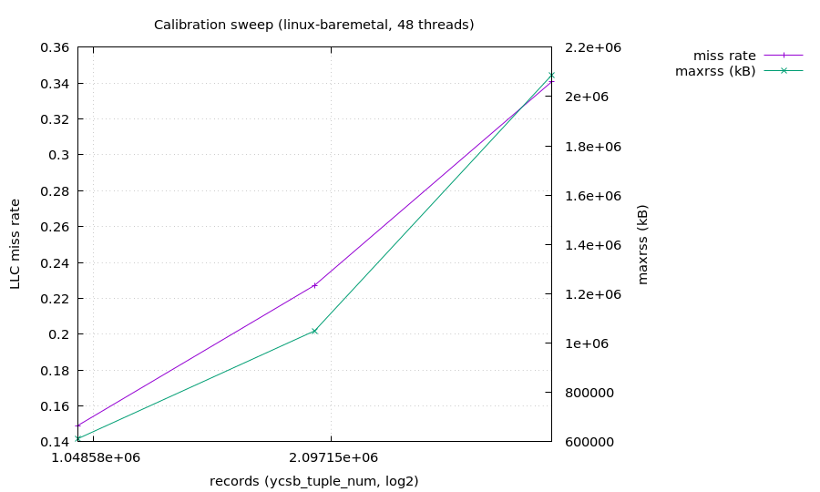

# Calibration 材料レポート — linux-baremetal / 48 threads

> 自動生成 (orchestrator/reports)。グラフ・`.dat`・`.plt` は全て手で再生成できる (.dat ヘッダに手打ち再現コマンドを埋めてある)。



## provenance
- **env**: linux-baremetal
- **host**: cygnus / x86_64 / 96cpu / L3=94371840B
- **ccbench-commit**: (calibration json に未記録)
- **clocks_per_us**: 1800
- **workload**: ycsb_rmw=0, ycsb_rratio=50, ycsb_zipf_skew=0
- **calibration**: lower-bound N=1000000 (working_set/L3=6.6x)

## 数値

| records | miss_rate | maxrss_kb |
|---:|---:|---:|
| 1,000,000 | 14.89% | 611,792 |
| 2,000,000 | 22.72% | 1,049,660 |
| 4,000,000 | 34.08% | 2,086,852 |

- **noise floor**: median 6,440,280 tps / CV 0.47% / N=10

## 手打ち再現 (近似)

各 records 点を手で再現するコマンド (`<records>` / `<build>` を置換):

```bash
numactl --interleave=all perf stat -e LLC-load-misses,LLC-loads,instructions,cycles -- \
  <build>/ycsb_silo.exe -thread_num=48 -ycsb_tuple_num=<records> \
  -ycsb_rmw=0 -ycsb_rratio=50 -ycsb_zipf_skew=0 -extime=3 -clocks_per_us=1800
```

グラフは `gnuplot calibration_t48_skew0_rr50_rmw0_sweep.plt` で再生成 (データ = `calibration_t48_skew0_rr50_rmw0_sweep.dat`、同一 provenance)。
