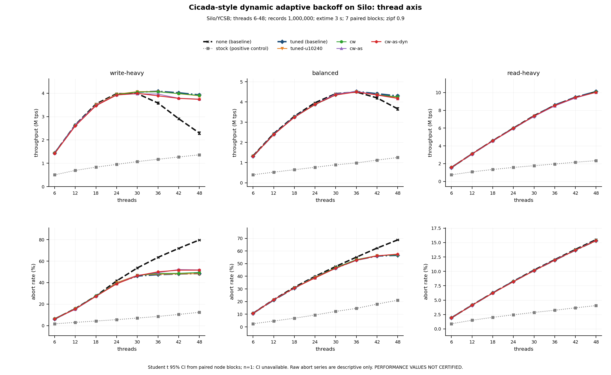
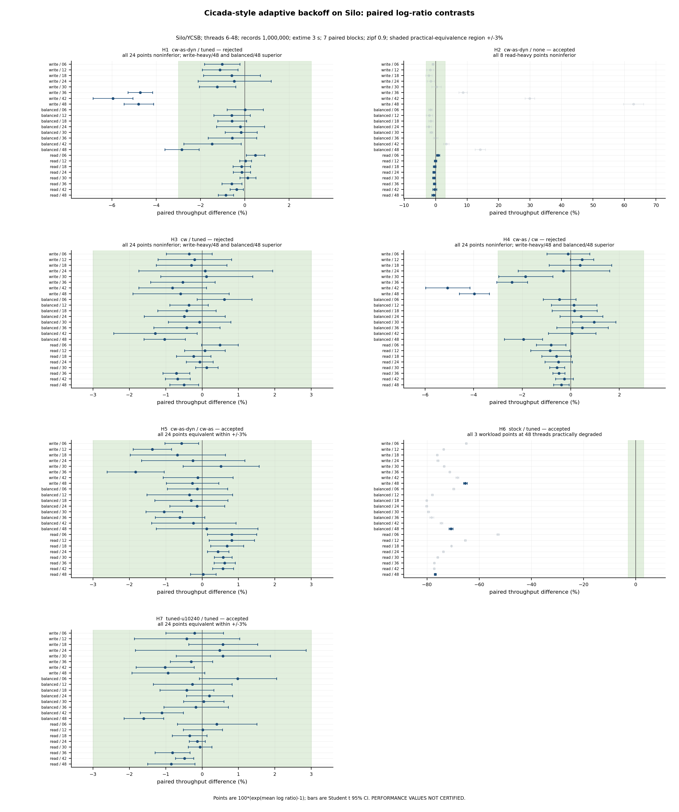
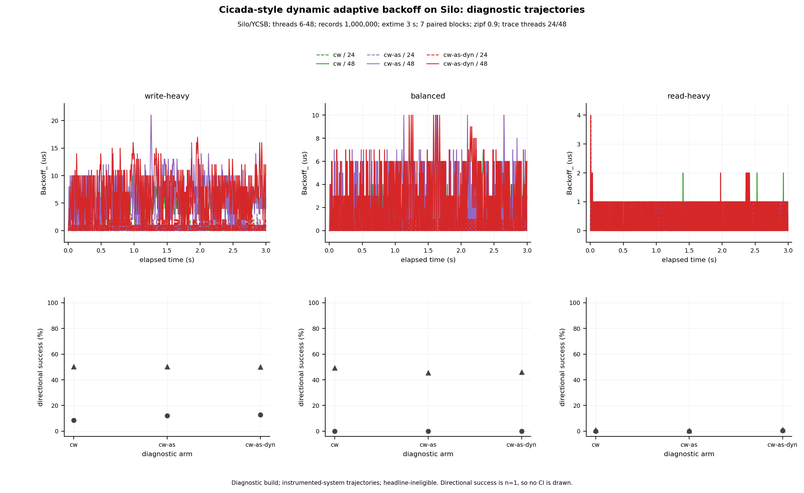

# Silo 上の Cicada 型 adaptive backoff の 3 定数を動的化しても、調整済み定数を超えない — 計数窓は等価、適応刻みは多コアで損、動的上限は一度も発火しない

**種別:** 機構の合成と実測 (事前登録あり)。dev-wave `dynamic-backoff-mechanism` (2026-09-05)。

**性能値はすべて未認証である。** trace-disabled build の throughput は直列性の検査を通していない (絶対規律 1・2)。
§6 の認証は `cw-as-dyn` 1 腕の**正しさだけ**を対象にし、性能値を認証しない。variant 採用の根拠には使えない。
基準線は D1506 の `none` と `tuned` の 2 本であり、**既定 adaptive (`stock`) 単独比の優位は書かない。**

一次資料: `output/insights/2026-09-02_cicada-adaptive-three-constants.md` (D1505 / D1506)、
`2026-09-02_t2216-adaptive-backoff-nonmonotonicity-mechanism.md` (D1576)、
`2026-09-04_t2189-adaptive-serializability-certification.md` (認証機構)。事前登録は
`docs/dynamic-backoff-preregistration.md` (v1 = commit 3b0d7a1cb、v1.1 = db5947887。**いずれも性能値を見る前に凍結**した。
v1.1 は段 6 の敵対レビューに従う改訂で、腕・値・判定式・受理条件は v1 から変えていない)。

## 発見

事前登録した仮説 7 本の判定 (`figures/dynbackoff.provenance.json` の `hypotheses`、対内 log 比、t 分布 95% CI、n=7、
等価域 ±3%):

| 仮説 | 対比 | 受理条件 | 判定 | 要点 |
| --- | --- | --- | --- | --- |
| H1 | `cw-as-dyn` / `tuned` | robust benefit (全 24 点非劣性 ∧ write/48・balanced/48 で実用優越) | **rejected** | write-heavy 36〜48 スレッドで −4.1〜−6.0% の実用劣化。他は等価 |
| H2 | `cw-as-dyn` / `none` | read-heavy 8 点で非劣性 | accepted | 全点 ±1% 以内 |
| H3 | `cw` / `tuned` | robust benefit | **rejected** | **全 24 点が ±3% 等価** — 計数窓は tuned に何も足さず、損なわない |
| H4 | `cw-as` / `cw` | robust benefit | **rejected** | write-heavy 36〜48 で −2.5〜−6.0% の劣化 |
| H5 | `cw-as-dyn` / `cw-as` | 全 24 点等価 | accepted | 等価。ただし**動的上限は一度も発火していない** (§4) |
| H6 | `stock` / `tuned` | 48 スレッド 3 workload で実用劣化 | accepted | −65〜−77% (陽性対照) |
| H7 | `tuned-u10240` / `tuned` | 全 24 点等価 | accepted | T-2187 段 3 の再現 |

**結論 (未認証):** 走行中の観測から更新の発火・刻み・上限を決めても、静的に調整した 3 定数 (刻み 1 µs / 更新間隔 2560 µs /
上限 1000 µs) を超えなかった。**計数窓は tuned と区別できず** (H3 と H7: 実効窓を 2560〜10240 µs の間で動かしても
何も変わらない)、**適応刻みは多コアで損をし** (H4)、**動的上限は今回の regime では発火する機会が無かった** (H5)。
read-heavy では 7 腕すべてが `none` と ±1% 以内で並ぶ (H2)。

### 1. 計数窓は「更新間隔を正した後」には何も足さない

`cw` (K = 10,000 commit、最小 2560 / 最大 10240 µs) と `tuned` の対内 log 比は 24 点すべてが等価域 ±3% の内側にあり、
48 スレッドで −0.6% [−1.9, +0.7] (write-heavy)、−1.0% [−1.6, −0.5] (balanced)、−0.5% [−0.9, −0.1] (read-heavy)。
診断 run (§4) では 18 run の 15,000 更新のうち **cap 発火が各 run の初回 1 件だけ**で残りはすべて K 発火、
窓の中央値は 2562〜2566 µs (最小間隔 2560 µs にほぼ張り付く)。24〜48 スレッドでは 10,000 commit が
2.56 ms 以内に必ず入るので、計数窓は tuned と同じ時刻に更新していた。6〜12 スレッド (窓が 7〜4 ms へ伸びる帯) でも
等価であり、H7 (時間のみ 10240 µs) が等価であることと整合する — **2560〜10240 µs の範囲で更新間隔を動かしても
throughput は変わらない**。D1505 の「律速は更新間隔」は 10 → 40 µs の一段で決まり、その先は平坦である。

### 2. 適応刻みは write-heavy の多コアで損をする

`cw-as` (刻み 1→2→4 µs、反転で半減) と `cw` の対内 log 比は write-heavy で 36 スレッド −2.5%、42 スレッド −5.2%
[−6.1, −4.3]、48 スレッド −4.0% [−4.6, −3.4]。balanced 48 で −1.9%、read-heavy は等価。
診断 run では `cw-as` の `Backoff_` 最大値が write-heavy 48 スレッドで 21 µs (`cw` は 10 µs)、balanced で 10 µs (`cw` は 7 µs) と
振れ幅が広がり、刻み 4 µs に達した更新がある。§4 のとおり勾配符号は偶然と同じ的中率しか持たないので、符号の
「連続一致」に刻みを倍増させることは**ノイズの連続を増幅している**にすぎない。abort 率も同一 block 内で +2.4 pp
[+1.4, +3.3] (write-heavy 48) 上がる。

### 3. 動的上限は発火する機会が無かった

`cw-as-dyn` の診断 18 run で `ceiling_` は一度も 1000 µs から動かず、`Backoff_` の最大値は 21 µs。上限に当たらない以上、
機構は走っていない。H5 の等価は「動的上限が無害である」ことしか言っておらず、**「効果なし」の事前登録は
この regime では検証されていない** (発火条件を満たす走行が無い)。D1505 の「上限は効かない」の背景も同じで、
調整済み定数の下で `Backoff_` は 2〜21 µs に留まり、上限 50〜1000 µs のどれにも届かない。

### 4. 勾配符号の的中率は 48 スレッドで偶然と同じ (0.50)、24 スレッドで 0.1 前後、read-heavy で 0

方向的中 = 更新 i の action 符号と、更新 i+1 の窓 throughput 差の符号の一致 (action 0 は unscored)。

| 腕 | write 24 | write 48 | balanced 24 | balanced 48 | read 24 | read 48 |
| --- | --- | --- | --- | --- | --- | --- |
| `cw` | 0.09 (46/538) | 0.50 (494/983) | 0.00 (0/436) | 0.49 (512/1038) | 0.00 (0/570) | 0.01 (6/586) |
| `cw-as` | 0.12 (71/592) | 0.50 (429/856) | 0.00 (0/394) | 0.45 (443/974) | 0.00 (0/582) | 0.00 (2/571) |
| `cw-as-dyn` | 0.13 (64/504) | 0.50 (422/844) | 0.00 (0/344) | 0.46 (436/947) | 0.00 (2/580) | 0.01 (6/578) |

48 スレッドでは `Backoff_` の中央値が 5〜6 µs (write) / 2 µs (balanced) の周りを ±1 µs で往復し、行動の向きは次窓の
throughput 変化を予測しない (0.50 = 硬貨投げ)。24 スレッド以下と read-heavy では `Backoff_` が 0〜1 µs に留まり、
「+1 して次窓で下がる」だけが scored される (0 に近い)。**これは診断 build (計装系) の軌跡であり、perf build へ
外挿しない。** それでも次は言える: 2560 µs の窓に約 10,000 commit を数えても、隣接窓の throughput 差は
1 µs の刻みが作る差より大きくノイズに支配される。調整済み adaptive の利得は「勾配を登る」ことではなく、
**乱歩が 2〜10 µs の平坦域に留まること**から来ている (T-2187 図 1 の平坦部)。この読みは D1505 の候補機序
(計数ノイズ) と整合するが、機序の確定ではない。

## 1. 腕と条件 (事前登録 §2〜§3)

| label | cell 文字列 | 役割 |
| --- | --- | --- |
| `none` | `none:0:100:1000:10` | 基準線 (D1506) |
| `stock` | `stock:1:100:1000:10` | 陽性対照 (H6 のみ) |
| `tuned` | `tuned:1:1:1000:2560` | 基準線 (D1506) |
| `tuned-u10240` | `tuned-u10240:1:1:1000:10240` | 時間のみ 10240 µs の対照 |
| `cw` | `cw:1:1:1000:2560:10000:10240:0:100:100:0` | 計数窓のみ |
| `cw-as` | `cw-as:1:1:1000:2560:10000:10240:1:1:4:0` | + 適応刻み |
| `cw-as-dyn` | `cw-as-dyn:1:1:1000:2560:10000:10240:1:1:4:1` | + 動的上限 |

Silo / YCSB、records 1,000,000、zipf 0.9、rmw 0、max_ope 10、workload = rr5 / rr50 / rr95、threads = 6〜48 の 8 点、
extime 3 秒、7 block (job = node、腕の実行順は巡回)、trace-disabled build、perf 計測なし。

## 2. 結果 — 生値の平均 (M tps / abort %、n=7)

| threads | none | stock | tuned | tuned-u10240 | cw | cw-as | cw-as-dyn |
| --- | --- | --- | --- | --- | --- | --- | --- |
| write-heavy 6 | 1.44 / 6.1 | 0.50 / 1.7 | 1.44 / 6.3 | 1.44 / 6.3 | 1.43 / 6.4 | 1.43 / 6.2 | 1.42 / 6.2 |
| write-heavy 24 | 3.98 / 41.6 | 0.95 / 5.6 | 3.94 / 39.6 | 3.96 / 40.0 | 3.94 / 39.3 | 3.93 / 39.1 | 3.92 / 38.9 |
| write-heavy 36 | 3.58 / 63.5 | 1.17 / 8.5 | 4.08 / 47.5 | 4.07 / 47.8 | 4.06 / 48.5 | 3.96 / 49.3 | 3.89 / 50.1 |
| write-heavy 48 | 2.30 / 79.7 | 1.36 / 12.4 | 3.93 / 48.4 | 3.89 / 48.3 | 3.90 / 49.5 | 3.75 / 51.8 | 3.74 / 51.6 |
| balanced 6 | 1.34 / 10.7 | 0.40 / 2.5 | 1.31 / 10.7 | 1.33 / 10.7 | 1.32 / 10.7 | 1.32 / 10.7 | 1.31 / 10.7 |
| balanced 24 | 3.96 / 39.9 | 0.77 / 9.4 | 3.89 / 39.3 | 3.89 / 39.2 | 3.87 / 38.9 | 3.88 / 38.7 | 3.88 / 38.7 |
| balanced 36 | 4.49 / 55.1 | 0.98 / 14.6 | 4.52 / 52.8 | 4.51 / 53.2 | 4.50 / 53.2 | 4.52 / 52.8 | 4.49 / 52.7 |
| balanced 48 | 3.66 / 68.8 | 1.25 / 21.1 | 4.30 / 56.6 | 4.23 / 57.0 | 4.25 / 57.0 | 4.17 / 57.5 | 4.18 / 57.5 |
| read-heavy 6 | 1.56 / 1.9 | 0.74 / 0.9 | 1.57 / 1.9 | 1.57 / 1.9 | 1.57 / 1.9 | 1.56 / 1.9 | 1.57 / 1.9 |
| read-heavy 24 | 6.00 / 8.3 | 1.57 / 2.5 | 5.98 / 8.3 | 5.97 / 8.2 | 5.98 / 8.2 | 5.95 / 8.2 | 5.97 / 8.2 |
| read-heavy 36 | 8.57 / 12.0 | 1.96 / 3.2 | 8.59 / 11.9 | 8.52 / 12.0 | 8.53 / 12.0 | 8.49 / 12.0 | 8.54 / 11.9 |
| read-heavy 48 | 10.10 / 15.5 | 2.33 / 4.1 | 10.11 / 15.3 | 10.03 / 15.3 | 10.06 / 15.4 | 10.02 / 15.4 | 10.03 / 15.4 |

全 8 スレッド点と CI は `figures/dynbackoff.provenance.json` の `performance_aggregates` にある。

**図 1 (スレッド軸).** `none` は write-heavy で 30 スレッドから崩れ、balanced で 42 から崩れる。tuned と動的 3 腕は
崩れない。動的 3 腕と `tuned` / `tuned-u10240` の差は線の太さの内側で、read-heavy では 7 腕のうち `stock` 以外が重なる。

**図 2 (対内 log 比).** 判定はこの図から読む。H3・H5・H7 は 24 点すべてが帯の内側。H1・H4 は write-heavy の
36〜48 スレッドだけが帯の左へ抜ける。H2 は判定対象 (read-heavy 8 点) が帯の内側で、判定対象外の write/balanced 48 の
+63% / +14% は `none` の崩壊を反映している。

対内 log 比の主要点 (mean % [95% CI]):

| 対比 | write 48 | balanced 48 | read 48 | write 24 | write 6 |
| --- | --- | --- | --- | --- | --- |
| H1 `cw-as-dyn`/`tuned` | −4.8 [−5.5, −4.1] 劣化 | −2.8 [−3.6, −2.1] inconclusive | −0.9 [−1.2, −0.5] 等価 | −0.5 [−2.1, +1.2] 等価 | −1.0 [−1.8, −0.2] 等価 |
| H3 `cw`/`tuned` | −0.6 [−1.9, +0.7] 等価 | −1.0 [−1.6, −0.5] 等価 | −0.5 [−0.9, −0.1] 等価 | +0.1 [−1.7, +1.9] 等価 | −0.4 [−1.0, +0.3] 等価 |
| H4 `cw-as`/`cw` | −4.0 [−4.6, −3.4] 劣化 | −1.9 [−2.7, −1.2] 等価 | −0.4 [−0.7, −0.1] 等価 | −0.3 [−2.2, +1.6] 等価 | −0.1 [−1.0, +0.8] 等価 |
| H5 `cw-as-dyn`/`cw-as` | −0.3 [−1.0, +0.5] 等価 | +0.1 [−1.3, +1.5] 等価 | 0.0 [−0.3, +0.4] 等価 | −0.3 [−1.7, +1.2] 等価 | −0.6 [−1.0, −0.1] 等価 |
| H7 `tuned-u10240`/`tuned` | −0.9 [−1.9, +0.1] 等価 | −1.6 [−2.2, −1.1] 等価 | −0.9 [−1.5, −0.2] 等価 | +0.5 [−1.8, +2.9] 等価 | −0.2 [−1.0, +0.6] 等価 |

abort 率の同一 block 内 pp 差 (副次指標、`abort_contrasts`): H1 は write 48 で +3.2 pp [+2.3, +4.1]、H4 は +2.4 pp
[+1.4, +3.3]、H3 は +1.0 pp [+0.2, +1.9]、H5 は −0.2 pp [−1.5, +1.0]。

## 3. 診断 run の記録 (headline 不適格)

**図 3 (診断).** 上段は動的 3 腕 × threads {24, 48} の `Backoff_` 軌跡 (3 秒)。write-heavy 48 で 5〜15 µs、
balanced 48 で 0〜10 µs、read-heavy で 0〜2 µs。下段は方向的中率 (n=1、CI なし)。診断 build 由来・計装系の軌跡であり、
perf build の値を代表しない。診断 job (`978021.nqsv`) は rep 0 の exact 1 job、18 run すべて `dropped = 0`、
1 run あたり 683〜1,165 更新。

## 4. 実行の記録

| 項目 | 値 |
| --- | --- |
| perf 7 block | `978014`〜`978020.nqsv` (rep 0〜6)、host bnode001/010/013/014/015/017/023 (重複なし)、job 総時間 724〜747 s、driver wall 714〜737 s、CPU/経過 19.6〜20.3 |
| 診断 1 job | `978021.nqsv`、job 136 s、CPU/経過 16.9 |
| 認証 24 request | §6 |
| canary (block に数えない) | `977999.nqsv` (perf、Elapse 732 s) / `978000.nqsv` (診断) — patch B の修正 (計数窓の時刻を走査後に取る) 前の実行体。Pegasus 経路の生死確認として使い、値は判定に使っていない。出力は `izanagi-job-evidence/dynamic-backoff/canary/` |
| 欠測 | なし (7 block とも 168 row 完走、点欠落なし) |
| 見積もりと実測 | 事前登録 §3 は 17.5 分/job (4.25 s/process)。実測は 12.1〜12.5 分/job (168 process で 4.3 s/process、build 7 本と prologue 込み)。walltime 40 分 |

## 5. 認証 (正しさのみ)

T-2189 が main に置いた `--mode certify` (連言 10 項、陽性対照、24 request の group receipt、verifier identity の事前固定) を、
全機構 on の `cw-as-dyn` (cell `cw-as-dyn:1:1:1000:2560:10000:10240:1:1:4:1`) に対して **3 workload × 8 slot = 24 request**
走らせた。連言・陽性対照・identity 束縛・24 request のいずれも緩めていない。

| 項目 | 値 |
| --- | --- |
| group receipt | `izanagi-job-evidence/dynamic-backoff/certify/attempt-1/group-receipt.json` (schema `…-certification-group/v2`、`complete = true`、attempt `dynbackoff-a1`、expected 24 / terminal 24 / **certified 24**) |
| 各 request | `certify-<workload>-slot<0..7>-dynbackoff-a1.json` (24 file、すべて `certified = true`、gate `all-10-conditions-passed`) |
| 検証した量 | commit 146,312,522 / abort 217,121,012 (trace-enabled build、24 走行の合計)、anomaly 0 |
| verify 相 | 79〜465 秒 (pilot = read-heavy slot 0 が 451 秒、最大 RSS 37.4 GiB) |
| job | pilot `978024.nqsv` (Elapse 520 s) → 残り 23 `978044`〜`978066.nqsv`、6 ノード (bnode023/040/102/106/116/145、複数 request が同じノードへ載った。直列化可能性は trace の性質なのでノード共有で変わらない) |
| 束縛 | `repo_head` 27bdca58b、`prereg_sha256` `cc897511…` (v1.1)、`patch_stack_sha256` `f5172f2f…`、verifier identity manifest `verifier-identity-a1.json` (sha `ff8b1002…`、module 10)、performance artifact = perf rep0 JSON (`978014`、sha `ffcf4718…`) |

**認証するのは「full-on build の観測 24 走行が serializable」までである。** 機構の各枝 (K 発火・刻み倍増・上限変更) の被覆は
認証しない (上限は今回一度も発火していない)。`cw` と `cw-as` は compile-time の部分集合だが**未認証**である。
性能値 (§2) は trace-disabled の別走行であり、この認証は性能値を認証しない。

## 6. 言えること・言えないこと

言える (未認証の性能値として):

- 調整済み定数 (刻み 1 µs / 間隔 2560 µs / 上限 1000 µs) の上に、計数窓・適応刻み・動的上限を重ねても、この環境・3 workload・
  6〜48 スレッドで tuned を上回る点は無い。計数窓は等価、適応刻みは write-heavy 多コアで損、動的上限は発火しない。
- 更新間隔は 2560〜10240 µs の範囲で結果を変えない (H7、H3)。
- 48 スレッドでは勾配符号の方向的中が偶然と同じで、adaptive controller の一歩は次窓の throughput 変化を予測しない (診断 build)。

言えない:

- 性能値の認証 (直列性の検査を通していない)。認証したのは `cw-as-dyn` の正しさだけ (§5)。
- 動的上限の「効果なし」— 上限に当たる走行が無いので未検証。
- 単一環境 (Pegasus 48 コア)、単一 protocol (Silo)、records 1,000,000 の外。
- 機序の確定 — 診断は計装系の軌跡で、方向的中 0.50 は「隣接窓の差がノイズ」と整合するが、それを確定する
  反実仮想 (同じ状態で逆の行動を取ったときの throughput) は測っていない。

## 7. 再現条件と束縛

| 項目 | 値 |
| --- | --- |
| repo commit | 27bdca58b (`repo_head`、全 JSON で `repo_status_clean = true`) |
| 事前登録 | v1.1 = db5947887 (`prereg_sha256` `cc897511…`)、v1 = 3b0d7a1cb |
| ccbench | pin `511c9538e4e8efa54b45cda62e72389ed3b706ec` + A `9b2153e0…` + B `f3fe6b7e…` (順序付き stack、`patch_stack_sha256` を各 JSON に記録) |
| driver | `tools/pegasus/probes/t2187_adaptive_const_probe.py` / `.pbs` (performance mode、11 field cell、schema v2。`driver_sha256` / `pbs_sha256` / `driver_argv` を各 JSON に記録) |
| 投入 | job dir `dev-wave-jobs/dev-wave-dynamic-backoff-mechanism/submit-perf.sh` (腕順巡回) / `submit-certify.sh`。job ID の台帳は同 dir `submitted-jobs.txt`。投入元は固定 SHA の detached worktree (`submit-tree`) |
| 図 | `tools/plotting/plot_dynamic_backoff.py` (計測機の外、login node)。provenance に 8 入力の sha256、対比 7 × 24 点、abort 対比、仮説の判定、生成器 sha256 |
| 結果 JSON | repo 外 `/work/1/SFC/tanab/izanagi-job-evidence/dynamic-backoff/{perf,trace,certify}/` |

## 8. 成果物

- patch: `patches/cicada-adaptive-dynamic.patch` (A の上に重ねる。`patches/README.md` 参照)
- 遷移 test: `orchestrator/tests/test_dynamic_backoff_transitions.py` (g++ で A+B を compile、18 件)
- probe: `tools/pegasus/probes/t2187_adaptive_const_probe.py` / `.pbs` (拡張 cell、診断 mode、certify の exact 2 cell)
- 図の生成器: `tools/plotting/plot_dynamic_backoff.py` + test
- 図 3 枚 (PNG / PDF) と provenance: `figures/`
- 変異台帳: `mutation-spec.json` / `mutation-report.json` (§9)
- 段 3 相談 2 本・段 6 レビュー 2 本・裁定の逐語: `verbatim/`

## 9. 変異検査

段 4 で登録し (M1〜M13)、段 6 の敵対レビュー A の指摘で M3/M6 を単一理由へ再定義、M12 (PBS の検査は文字列 pin のみで
意味変異を検出できない) を削除した。probe → 本走の 2 段 (`mutation-probe-spec.json` / `mutation-probe-report.json` と
`mutation-spec.json` / `mutation-report.json`、いずれも `tools/mutation_harness.py --runner-mode dispatch`、
repo HEAD dc0aa0bbd)。

| 変異 | 対象 | 赤にした test (完全集合) | 結果 |
| --- | --- | --- | --- |
| M1 `#if BACKOFF_TRACE` → `#ifdef` | patch B | 遷移 test の `-E` 検査 + probe test の patch 静的検査 (**2 層、冗長 gate**) | KILLED |
| M2 K 境界 `>=` → `>` | patch B | 遷移 test (K 境界) | KILLED |
| M3' cap 項の無効化 | patch B | 遷移 test (cap 単独) | KILLED |
| M4 刻み上限 clamp 削除 | patch B | 遷移 test (刻み上下限) | KILLED |
| M5' 上限 floor 50 → 25 | patch B | 遷移 test (floor) | KILLED |
| M6' 負勾配で上限が増える | patch B | 遷移 test (単調) | KILLED |
| M7 `K=0 ⇒ cap=0` 検査の削除 | probe | parse 拒否 test | KILLED |
| M8 certify に 3 つ目の cell | probe | certify exact test | KILLED |
| M9 A の sha 照合削除 | probe | patch identity test | KILLED |
| M10 `DefineSpec` から 1 define 削除 | 登録簿 | inventory / supply domain / screening key 集合 (**3 層、冗長 gate**) | KILLED |
| M11a 等価域 3% → 5% | 図生成器 | 判定語と endpoint の test | KILLED |
| M11b log 比の % 変換を線形化 | 図生成器 | 独立再計算の test | KILLED |
| M13 等価変異 (`list(stack)`) | probe | — (SURVIVED 期待の正例) | SURVIVED |

erratum: (1) probe 1 回目は harness の collection 段が queue-wait-timeout (914 秒。D612 の上書きは collection 段に届かない)
で orphan-hold になり、hold 解除後に再投入した。(2) probe で M5 (floor 50 → 0) は `-Werror` の符号無し比較警告で
compile が落ちる「別理由の kill」だったので floor 25 へ再照準した。(3) probe で M11a / M11b が SURVIVED し、
図生成器の判定式に歯が無かった。test を足して (commit dc0aa0bbd) 本走で KILLED にした。
M1 と M10 は複数層が同時に赤になる冗長 gate であり、単独変異の証拠には数えない (DW-M03)。

## 10. 未了と次の一手

- 動的上限は発火しなかった。上限に当たる regime (刻みを大きくする、または更新間隔 10 µs の既定に近い設定) で測らない限り
  「効果なし」は言えない。ただし D1505 の後では、そのような regime 自体が候補にならない。
- 方向的中 0.50 の反実仮想 (同じ状態で逆の一歩を取る対照) は未測定。機序の確定にはこれが要る。
- `cw` と `tuned` の等価は、更新間隔 2560〜10240 µs で throughput が平坦なことの帰結でもある。40 µs 付近 (D1505 の
  一段目の立ち上がり) で計数窓が効くかは測っていない。
- 既発行 group receipt の再検証と trace 削除の閉包 (段 6 レビュー A の指摘、T-2189 の既存機構) は本 wave の変更外として
  裁定パッケージへ送った。
