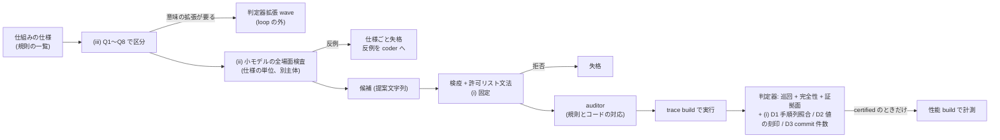

# LLM が新しい仕組みを書くときの正しさ関門の設計 — 迂回・取りこぼし・意味の拡張 (gen-opt md_3、2026-09-29)

- 依頼: `/work/1/SFC/tanab/tmp/gen-opt-2026-09-29/md_3.txt` (共通指示 `common.txt`、ユーザー発話 `user-verbatim.txt`、同意された提案 `proposal.md`。いずれも repo の外)。
- 種別: 設計だけ (docs-only)。実装・計算ノードの実行・roadmap の改訂はしていない。
- 読んだ時点の main: `1887f56e4`。submodule `external/ccbench` の HEAD: `68106660686232781bca3be792a750d3e19d7a8a`。
- 本文の「実測」はコードと既存の一次資料を読んで確かめた事実を指す。プログラムの実行による測定は本 wave では 1 つもしていない (§9)。

---

## 0. 一目でわかる結論

| 問い | 結論 |
|---|---|
| 今の関数方策の軸で (i) 迂回は起こりうるか | **起こらない (構造上)。** coder は提案文字列しか返せず、検疫が EVOLVE-BLOCK の外の変更を拒否し、受理言語 policy-C++ v1 が pointer・loop・固定 API 以外の名前を拒否する。方策 3 関数が受け取るのは abort 要因・試行回数・乱数だけで、tuple・読み書き集合・trace に届く名前を持たない (§2)。 |
| では何が (i) の入口になるか | (a) 段 A・B で編集範囲を読み書きの経路へ広げたとき。**trace の R/W は commit 時に read_set_ / write_set_ から書き出される = 検証が使う集合と同じ出所**なので、集合に載らない読み書きは検証にも trace にも映らない。C 行の件数も同じ集合から数える。(b) file を直接編集する旧 `coder` role の経路は、file 単位の hook と規律・人間レビューだけで、file 内の位置は機械検査されない (§2.4)。 |
| (i) への設計 | **固定:** gen-opt の候補は提案文字列 → 検疫 → 許可リスト文法の経路だけで受け付け、tuple への読み書きは骨格が持つ関数 (読み書きと同時に集合と trace へ記録する) を通してしか書けない形にする。**検出 (fail-closed):** 編集範囲の外にある 2 つの独立な出所 — workload 側の手順列 (`include/ycsb.hh`) と commit 件数の counter — を使い、(D1) 手順列と trace の key 集合の照合、(D2) 値の刻印と読んだ版の照合、(D3) 既存の commit 件数照合、を certified の条件にする。迂回する変異 7 本 + 検疫で止める変異 2 本を正例、stock と方策の対照 4 本を負例に置く (§3)。**ただし stock Silo は同じ取引で同じ key を読んでから書いて読む・2 度書く場合に、標準の意味 (自分の書きを読める・後の書きが残る) と食い違う値を返すコードになっており、D2 の取引内の照合をそのまま入れると stock が赤になる見込み (コードからの予想、未実測)。検査は緩めず、CCBench 側の修正を gen-opt の評価開始の前提条件に置く (§3.5)。** |
| (ii) への設計 | vhash-forwarding-model の型を一般化し、**仕組み (仕様) の単位**で、loop の coder とは別の主体が小さいモデルを書く。場面は 3 層 (定型の異常形・規則ごとの割り込みの窓・有界の全列挙) で結果を見る前に登録する。反例が出た仕様は、その仕様に属する候補をすべて即失格にし、反例を閉じた形の構造で coder へ返す。「固定した範囲で反例なし」は証明ではない (§4)。 |
| (iii) への設計 | 仕組みに 8 つの問い (Q1〜Q8) を当て、**そのまま足りる / 記録の追加で足りる / 意味の拡張が要る** の 3 区分に分ける。迷ったら重い区分へ。意味の拡張は loop の外の別 wave で、意味の版を上げ、再検証の発火条件を結果の前に決めてから行う (§5)。 |
| auditor | 既存の位置 (検疫の後・build の前) のまま、入力に「仕様の規則一覧・小モデルの結果の要約・Q1〜Q8 の申告」を足し、規則とコードの対応、骨格関数の迂回、申告と実コードの食い違いを見る。型 27〜30 を追加候補にする (§6)。 |
| 実装の分割 | 生死確認 1 本の後、CCBench の trace 拡張・Silo の取引内の値の扱いの修正・判定器・受理文法・小モデル基盤・driver 接続・変異・auditor の 8 単位。実装はすべて Codex author。計算は変異の本走が試算で約 2.3〜2.9 node 時間になり、投入前にユーザー確認が要る (§7)。 |
| 限界 | 関門と検査を同じ主体 (repo を編集できる AI) が変えられる限り、意図的な弱体化への完全な防壁ではない (D387)。守るのは事故と loop 内の最適化圧力までである (§8)。 |

図の読み方: 左から右へ関門を通る順。どの関門も、確かめられなければ通さない (fail-closed)。箱の中の語は関門の名前で、結果を表すものではない。

---

## 1. 依頼の範囲と、この資料が言うこと・言わないこと

依頼は、段 A (文献にはあるが CCBench に無い最適化の実装) と段 B (文献にも無い仕組み) で LLM が読み書きの経路や timestamp・版の扱いに触れるようになったときに開きうる 3 つの穴を、実装前の設計として固めることである。

- (i) 迂回: 生成コードが trace の差し込み点を通らずにデータを読み書きすると、検査器には何も見えず「巡回なし」で通る。
- (ii) 取りこぼし: 有限の実行記録を調べる G2 検査は、稀な割り込みでしか起きない反例を見逃しうる。
- (iii) 意味の拡張: timestamp や版の選び方を変える仕組みでは、検査器の前提 (何を依存とみなすか) を広げる必要が出うる。

この資料は、規律 2・3 を前提に、**検査を甘くする選択肢と検査を外した対照を含まない**。新しい関門はすべて「確かめられなければ certified にしない」向きで設計する。

---

## 2. 現状の実測 (手順 1)

### 2.1 関数方策の軸で coder が書ける範囲

軸 `silo-function-policy` (D2214、運用は `docs/phase3-silo-policy-runbook.md`) で、coder の出力がデータの経路に届かない理由を層ごとに並べる。

| 層 | 実物 (path と関数) | 何を閉じるか |
|---|---|---|
| 出力の形 | `coder-v4-autonomous-policy` / `-ir` は tool を持たず、`{"proposal": {"axis", "implementation" or "ir", "justification", "confidence"}}` だけを返す (runbook §1(b))。file は driver が書く | coder は repo の file を直接書けない |
| 差し込み先 | `orchestrator/campaign/axis_silo_function_policy.py` の `MARKER_ID = "silo-function-policy"`、`SOURCE_REL = "cc/silo/transaction.cc"`。骨格 `patches/silo-function-policy-variant.patch` の EVOLVE-BLOCK は `namespace izanagi_silo_policy` の本体だけ | 提案は 1 つの hole にだけ入る |
| 検疫 | `orchestrator/campaign/p3_s4_loop.py` の `quarantine` → `render_hole` → `DiffQuarantine(...).validate()`。ここで関係する構造的な拒否種別は `outside-region` (EVOLVE-BLOCK の外の変更)・`frame-altered` (marker・`#if` 骨格)・`hole-escape` (hole 内の指令・marker・コメント区切り・行継続) (他に `malformed`・`host-effect`・文法系の種別がある)。定義は `orchestrator/campaign/diff_quarantine.py` の `DiffRejectSubtype` | hole の外の行を 1 行でも変える候補は build 前に拒否 |
| 受理言語 | `orchestrator/campaign/p3_s4_loop_policy.py` の `policy_gate` が `check_policy_body` (`silo_policy_compile.py`) で policy-C++ v1 を検査。仕様 `orchestrator/campaign/silo_function_policy_coder_spec.md`: 識別子は自前の宣言・固定 API 名・許可した scalar 型・`std::min` / `std::max` だけに解決されること、pointer・配列・loop・可変の static / thread 記憶域・マクロ・前処理指令・`static_cast` 以外の cast を拒否。単独 TU を `-Wall -Wextra -Werror -fsyntax-only` で compile | tuple・`read_set_`・`write_set_`・`izanagi_trace`・`result_` などの名前は書けない (許可リストに無い) |
| 方策の入力 | `orchestrator/campaign/silo_function_policy_api.hh`: `AbortContext {reason, rand}`、`LockContext {attempt, rand}`、空の `CommitContext`。仕様は「時刻・集合の大きさ・key・pointer・txn ID・epoch・counter を受け取らない」と明記 | 方策はデータを観測できない |
| 方策の出力 | 待機量 (µs、骨格が 1000 / 50 で頭打ち) と retry / abort の 2 値。骨格 `izanagi_silo_skel` の `after_abort` / `on_lock_conflict` / `on_commit` (noipa wrapper) だけが呼ぶ | 方策の効果は「待つ・諦める」に限られる |
| 効果の字句検査 | `orchestrator/campaign/coder_effect_gate.py` の `DENY_TABLE` (process・file・network・sleep/thread・asm などの名前) | 外部への副作用 (この軸では文法が先に閉じる) |
| auditor | `apply_mandatory_deny_only_veto` (型 1〜26、`max_violation_type=26`) と diff digest の機械照合 | 人の目に相当する二重確認 (機械の証明ではない) |

### 2.2 trace の差し込み点の位置

`external/ccbench/cc/silo/transaction.cc` (submodule HEAD `68106660…`) の `#if TRACE` の内側を関数ごとに列挙する。行番号は版で動くので関数名で示す。

| 関数 | 何を記録・検査するか | 関数方策の hole との関係 |
|---|---|---|
| `TxExecutor::lockWriteSet` | 入口で `izanagi_trace::clear_shadow()`、CAS 成功時に `record_lock` (lock 被覆の影の集合) | hole の外 (骨格)。方策は CAS 失敗時の分岐から `on_lock_conflict` として呼ばれるだけ |
| `TxExecutor::unlockWriteSet` (2 つの多重定義) | `clear_shadow()` | hole の外 |
| `TxExecutor::validationPhase` | 並べ替え前後の write set の大きさと `rcdptr_` の多重集合を比べ、壊れていれば `P` 行 | hole の外 |
| `TxExecutor::writePhase` | `C <txid> <thid> <epoch> <tid> <read_count> <write_count>`、`read_set_` の各要素の `R`、`write_set_` の各要素の `W`、入口と書き込み直前の lock 被覆検査 (`X` 行)、最後に `E` | hole の外 |
| `include/trace.hh` | 出力先・書式・`emit_*`・影の集合 (すべて `#if TRACE` の内側) | EVOLVE_BLOCK_SOURCES の外 (`source_digest.EVOLVE_BLOCK_SOURCES` は `include/backoff.hh`・`cc/silo/transaction.cc`・`cc/mocc/transaction.cc` の 3 つ) |

### 2.3 判定: 今の関数方策の軸では (i) は起こらない

根拠は §2.1 の 3 層 — (1) coder は file を書けない、(2) 検疫が hole の外の変更を拒否する、(3) 受理言語の許可リストに tuple・集合・trace の名前が無く pointer も無い — が独立に効くことである。方策 3 関数の呼び出し点 (`TxExecutor::abort`、`TxExecutor::lockWriteSet` の lock 衝突分岐、`TxExecutor::commit` の `writePhase` の後) はいずれも、読み書きの実体と trace の書き出しを骨格が済ませた後か、それとは無関係な待機の位置にある。

同じ理由で、`silo-backoff-magnitude` (数値 literal 1 つ)、`silo-writeset-sort` (閉じた IR)、trigger-gating (正準述語の集合) の hole も、`p3_s4_loop.quarantine` の分岐で閉じた文法に限られる。`mocc-temperature-predicate` の hole は `quarantine` の特別な分岐に現れず、どの検査で閉じているかをこの wave では確かめていない。

**ただしこれは (i) についての判定であり、方策が正しさに影響しないことの証明ではない。** D2214 は「v1 は LLM が壊した CC 論理を verifier が捕らえることを実証しない」と書いている。

### 2.4 それでも残る入口 (段 A・B で開く)

1. **trace と検証が同じ出所。** `writePhase` は `read_set_` / `write_set_` をそのまま `R` / `W` にする。validation も同じ集合を見る。したがって、集合に載せずに tuple を読む・書くコードは、**validation を受けず、trace にも出ない**。判定器から見ると「その取引はその key に触れていない」ことになり、巡回は生まれない。C 行の `read_count` / `write_count` も `read_set_.size()` / `write_set_.size()` から数えるので、この迂回を検出しない (frame の検査は「書いた件数どおり R/W が並んでいるか」を見るだけ)。
2. **値は記録されない。** R は読んだ版 `(epoch, tid)` だけを持つ (`include/trace.hh` の schema 注記)。版は正しいまま別の値を返す変更は見えない。[T-2847] の設計 (`output/insights/2026-09-22/t2847-verifier-detection-design/README.md` §4.3) が V22 (再確認で payload を取り直さない)・V23 (書く値の破損)・V26 (自分の書いた key を読むときに旧 tuple の値を返す) を「trace に現れないため緑のまま通る見込み」として挙げている。
3. **writePhase を通らない commit。** trace は writePhase の中でだけ出る。writePhase を通らずに commit を返す経路 (例えば read-only の近道) を作ると、その取引は trace に現れない。これには既存の commit 件数照合が効く (§3.2 D3)。
4. **commit 件数の counter は TxExecutor から触れる。** 照合に使う counter `local_commit_counts_` は workload 側 (`include/ycsb.hh` の `run`) が加算するが、`TxExecutor` の `result_` からも到達できる。生成コードがこの名前を書けると照合を崩せる。関数方策の軸では許可リストが閉じているが、`coder_effect_gate.DENY_TABLE` 自体はこの名前を禁じていない。
5. **旧 `coder` role (Edit で file を直接書く経路)。** `.claude/agents/coder.md` の説明どおり「ファイル面限定は hook が機械拒否、合成枝内への限定は規律 + coder diff の人間レビュー」で、`hooks/README.md` の `guard_write.py` も file 単位で判定する (「方針 A では designated ソース内の内容は検査しない」)。`cc/silo/transaction.cc` は EVOLVE_BLOCK_SOURCES なので、この経路では `read_internal` や `writePhase` も書き換えられる。現行の自律ループ (`p3_s4_loop*.py`) はこの経路を使っていないが、role の定義は残っている。
6. **stock Silo の取引内の値の扱い。** `TxExecutor::update` は、同じ key が既に書き込み集合にあると新しい値を捨てて戻る (`if (searchWriteSet(s, key)) goto FINISH_WRITE;`)。`TxExecutor::read` は書き込み集合より先に読み集合を探す (`searchReadSet` → `searchWriteSet` の順)。したがって同じ取引で「読む → 書く → 読む」と 2 度目の読みは自分の書いた値でなく最初に読んだ値を返し、「書く → 書く」と後の書きが残らない。版の単位で見る今の判定器には現れない ([T-2847] 設計 §4.3 の V27 と同じ箇所)。§3.2 の D2 にはこの挙動が直接効く (§3.5)。

---

## 3. (i) 迂回への設計 (手順 2)

### 3.1 差し込み点を編集範囲の外に固定する

| # | 固定の方法 | 担保の種類 |
|---|---|---|
| F1 | **gen-opt の候補は提案文字列の経路だけで受け付ける。** coder は tool を持たず、driver が検疫と文法検査の後に書く (関数方策の軸と同じ)。Edit で file を直接書く `coder` role は gen-opt に使わない | 機械 (driver が唯一の書き手)。hook は file 単位なので、Edit 経路の不使用は runbook の手順と driver の入力形で担保する |
| F2 | **tuple への読み書きは骨格の関数を通してしか書けない。** 新しい軸の API で、生成コードには tuple の pointer でなく不透明な取っ手 (handle) と、骨格が用意した候補 (例: 版の候補の一覧) だけを渡す。値の複写・集合への登録・trace への記録は骨格の関数が 1 か所で同時に行う。生成コードが返すのは「どれを選ぶか」「待つか・諦めるか」などの決定に限る | 機械 (許可リスト文法に骨格関数の名前だけを足し、pointer・配列・生の tuple 型は引き続き禁止) |
| F3 | **trace の書き出しと独立な証人は、生成コードの到達範囲の外に置く。** `include/trace.hh` (EVOLVE_BLOCK_SOURCES の外)、workload 側の `include/ycsb.hh` (同じく外) に置く。`cc/silo/transaction.cc` の中の既存の `#if TRACE` は hole の外にあり、検疫の `outside-region` が守る | 機械 (hook の file 単位の拒否 + 検疫) |
| F4 | **許可リストに trace・counter・集合の名前を入れない。** `izanagi_trace`・`TRACE`・`result_`・`local_commit_counts_`・`read_set_`・`write_set_`・`node_map_`・`Masstrees`・workload の `pro_set_` を、新しい軸の文法でも名前解決の対象外にする (既定で拒否する許可リスト方式なので、足さない限り書けない) | 機械 (文法)。併せて文法の test に「これらの名前を含む候補は拒否」を正例として置く |

F2 は段 A の試しに必要な最小の API から始める。段 A の候補がどの API を要るかは md_2 の候補選定に依存するので、この資料は API の形 (handle と候補の一覧、決定だけを返す) を定め、具体の関数は実装 wave が候補に合わせて決める。

### 3.2 迂回を検出する検査 (fail-closed)

どの検査も、**入力が欠ける・読めない・食い違う場合は certified にしない** (判定は `indeterminate`。巡回が同時にあれば従来どおり `non-serializable` が優先)。

| # | 検査 | 独立な出所 | 何を捕まえるか | 判定 |
|---|---|---|---|---|
| D1 | **手順列と trace の key 集合の照合** | workload 側 (`include/ycsb.hh` の `run`) が、commit が成功した直後に、その取引の手順列 (`pro_set_` の各操作の種類と key) を `#if TRACE` の内側で `A` 行として書く。同じ thread の直前の `C … E` の枠と 1 対 1 で結ぶ | 集合に載らない読み書き (validation も trace も通らない迂回) | 取引ごとに、(a) 書き (`WRITE`・`READ_MODIFY_WRITE`) の key 集合 = `W` の key 集合、(b) 「その key への最初の操作が読み」の key 集合 ⊆ `R` の key 集合 ⊆ 手順列の読みの key 集合 (ここでの「読み」は `READ` と `READ_MODIFY_WRITE` の両方)、(c) 枠と `A` 行の対応が 1 対 1。1 つでも崩れれば完全性の違反 |
| D2a | **版と値の整合** | workload 側が、trace build でだけ、書く値の先頭に刻印 (書き手の thread と thread 内の通し番号から作る固定長の値) を入れ、読んだ値の刻印を `A` 行に載せる。初期 load の値にも決まった刻印を入れる (`include/ycsb.hh` の `partTableInit`)。`writePhase` の `W` 行 (hole の外の骨格) には、実際に据える値の刻印を足す | 版は正しいまま別の値を返す変更 (V22 型)、据える途中で値を壊す変更 (V23 型)、tuple を直に書き換えて未 commit の値を見せる変更 | 他の取引から来た値の読み (その key への最初の操作が読み) ごとに、`R` が指す版の `W` 行の刻印と、観測した刻印が一致すること。初期版 (判定器の genesis `(1, 0)`、書き手の `W` 行が無い) を読んだ場合は、初期 load の刻印を key から決まる値 (key の hash など) にしておき、判定器が key から期待の刻印を計算し直して照合する。刻印の欠落・書式の破損・不一致はいずれも完全性の違反 |
| D2b | **取引の意図と据えた値の整合** | 同じ `A` 行 (書いた刻印の並び) と `W` 行の刻印 | 書く値の取り違え、取引内の後の書きの消失、自分の書きを読めない変更 (V26・V27 型) | 取引ごとに、key の最後の書きの刻印 = その key の `W` 行の刻印。自分が先に書いた key の読みは、その時点の自分の最後の書きの刻印と一致すること。食い違えば完全性の違反。**stock Silo はこの照合に反する挙動を持つ (§2.4 の 6)。gen-opt の certified は D2b を全 key で通すことを要求するので、§3.5 の修正が gen-opt の評価開始の前提条件になる** |
| D3 | **commit 件数の照合 (既存)** | `local_commit_counts_` の合計 (`common/result.cc` が `commit_counts_:` として出す)。pipeline は必ず渡す (`orchestrator/campaign/pipeline.py` が `commit_count_witness` を `expected_commits` へ) | writePhase を通らない commit、trace 末尾の取引の欠落 | 既存どおり (`orchestrator/verifier/core.py`: 食い違えば indeterminate)。F4 で counter の名前を生成コードから外すことが前提 |
| D4 | **枠の完全性 (既存)** | trace の C 行の宣言件数と E 行 | R/W/E の部分的な欠落 | 既存どおり (`orchestrator/verifier/parse.py` の frame 検査) |
| D5 | **`A` 行の emitter が評価対象 build の source にあること** | 既存の証拠面 (`orchestrator/verifier/model.py` の `assess_protocol_proof_surfaces` → `certification_gate_satisfied`) の考え方を使う。**ただし既存の走査 (`compiled_protocol_source_texts`) は `cc/<protocol>/CMakeLists.txt` の `SOURCES` に並ぶ file だけを読み、`A` 行の置き場 `include/ycsb.hh` は対象外である。** D5 は、評価する YCSB の翻訳単位が include する header まで走査範囲を広げて作る (U2) | `A` 行を出さない build を「照合する相手が無いので通る」扱いにする fail-open | gen-opt の軸では、`A` 行の emitter が走査範囲に無ければ証拠面が不成立 → indeterminate。既存の証拠面と同じく、これは「emitter の呼び出しが `#if TRACE` の内側の文面にある」ことしか言わない (同関数の docstring が、前処理の評価・到達可能性・実際の発火を証明しないと明記)。実際の発火は D1 (c) (枠と `A` 行の 1 対 1) が実行ごとに見る |

設計上の注意:

- **件数でなく key 集合で照合する理由。** YCSB の手順列は zipf で key を選ぶので、同じ取引に同じ key が何度も現れうる (`include/ycsb.hh` の `makeProcedure` は重複を除かない)。Silo は 2 度目以降の読みを読み集合や書き込み buffer から返し (`TxExecutor::read` の `searchReadSet` / `searchWriteSet`)、同じ key への 2 度目の書きを 1 つに畳む。したがって手順列の操作数と R/W の件数は一致しないのが正常である。D1 の (b) を「⊆」の 2 段にしたのは、自分が先に書いた key の読みは他の取引への依存を作らないので R に出なくてよい一方、最初の操作が読みの key は必ず R に出るべきだからである。
- **D1・D2 の対象は YCSB の点読み・点書きに限る。** TPC-C の trace v3 ([T-2854]) の手順は別の構造なので、同じ照合は別に設計が要る (§8)。
- **刻印の長さ。** `CCBENCH_VAL_SIZE` の既定は 4 byte (`external/ccbench/cmake/Options.cmake`)。4 byte の刻印は、書き手の (thread, 通し番号) の hash の下位 32 bit になり、別の書き手と偶然一致すれば見逃す (誤って赤にはしない)。見逃しの確率の見積りは仮定付きの試算で、実装 wave で刻印の作り方とともに確かめる。
- **D2 を 2 つに分けた理由。** D2a は「読んだ版と、その版として据えられた値が一致するか」だけを見るので、取引内の値の扱い (§2.4 の 6) に依らず stock でも成り立つ見込みである。D2b は取引の意図 (workload が最後に書いた値) まで照合するので、stock の現在の挙動では反例が出る見込みである。D2b の照合を stock に合わせて「最初の書きが残る」に変えることはしない (標準の意味より弱い意味を正と固定することになり、V27 型の変更を見逃す)。
- **規律 1 (観測者効果) との関係。** `A` 行と刻印はどちらも `#if TRACE` の内側にだけ置き、性能 build には何も残さない (D14)。刻印は値の中身を変えるが、YCSB は値の中身で分岐しないので、trace build の取引の流れは変わらない見込みである (実装 wave で、刻印を入れた trace build と入れない trace build の abort 率・commit 数の差を 1 回測る)。性能 build の検査は既存の `buildcache._assert_no_trace_symbols` と命令列の比較がそのまま担う。

### 3.3 DW-O13: 照合の入力が実物にあるか

| 入力 | 実物での所在 | 値域の実測 |
|---|---|---|
| 手順列 (`pro_set_`) | `include/ycsb.hh` の `run` が commit の前後を通して保持している (`makeProcedure` が作る) | **未実測。** 現行 trace に `A` 行は無い。実装 wave の生死確認で、stock Silo の trace build で D1 が 0 件の違反になることを測る |
| 読んだ値 | `include/ycsb.hh` の `run` が `tx.read` の後に `body->get_value()` で触れている | 未実測 (同上) |
| commit 件数 | `common/result.cc` の `commit_counts_:`、`pipeline.py` の `_parse_witness_counter(stdout, "commit_counts_")` | 既存。Cicada の wave でも trace の commit 数 = ベンチマークの commit 数を 7 走行で確認済み (`output/insights/2026-09-29/vhash-cicada-verifier/README.md` §1) |
| C 行の宣言件数 | `writePhase` が `read_set_.size()` / `write_set_.size()` を書く | 既存 |
| D2b の述語 | — | **stock で満たされない見込み。** verify の既定構成 (`pipeline.py` の `CorrectnessWorkload`: 200 record・zipf 0.9・RMW あり・1 取引 5 操作) では同じ取引に同じ key が重なりやすく、RMW の後の読みや 2 度の RMW で §2.4 の 6 の挙動を通る。U0 で件数を測り、§3.5 の修正の後に 0 件になることを確かめる |

「照合の述語が stock で満たされる (到達可能である)」ことは、今は確かめていない。述語の採用は、実装 wave の生死確認 (§7 の U0) で stock と方策の対照が緑になり、迂回の変異が赤になることを測ってからにする。

### 3.4 変異テストの計画

正例は **必ず赤** (certified にならない)、負例は **必ず緑** (certified)。赤・緑に加えて、壊した経路が実際に走り、その取引が commit されたことを示す発火の計数を毎回出す (既存の壊し patch の `T2847_FIRED reached / changed / committed` と同じ作り)。発火が 0 の走行は「検出した」「検出しなかった」のどちらにも数えない。負例と正例の発生条件 (同じ取引の key の重複、読みだけの取引、書き → 読み、2 度書き) も、構成から予想するのでなく走行ごとに個別に数え、対応する条件の件数が 0 の走行はその正例・負例に採らない。

**正例 — 実行して判定器で落とすもの (trace build で走らせる):**

| # | 変異 | 壊す性質 | 期待 | 捕まえる検査 | 発生条件 |
|---|---|---|---|---|---|
| B1 | 読みで tuple から直接値を写し、`read_set_` に登録しない (key の一部に限る) | 読みの validation と記録 | indeterminate (巡回が併発すれば non-serializable) | D1 (最初の操作が読みの key が R に無い) | 1 thread で可。**発火の証拠は専用の計数にする:** 「その取引で最初の操作が `READ` / `READ_MODIFY_WRITE` の key について登録を省き、その取引が commit した」件数。読み集合や書き込み buffer から返る 2 度目以降の読みで登録を省いても D1 の対象にならないので、汎用の reached / changed / committed では足りない。この件数が 0 の走行は判定に使わない |
| B2 | 書きで tuple の値をその場で書き換え、`write_set_` に登録しない | 書きの lock・記録 | 同上 | D1 (W が無い) + D2a (他の読み手の刻印の食い違い) | D1 は 1 thread で可 |
| B3 | 書きの無い取引を writePhase を通さずに commit 扱いにする | commit の記録 | 同上 | D3 (commit 件数の食い違い) + D1 (`A` 行に対応する枠が無い) | 読みだけの取引が現れる手順 |
| B4 | 読みの再確認で 2 度目の TID を採るが値を取り直さない (V22) | 値と読んだ版の整合 | 同上 | D2a | 2 thread 以上、同じ key への並行更新 |
| B5 | tuple へ値を写す (`writePhase` の `memcpy`) ときに一部を誤った値にする (版・lock・集合は保つ、V23) | 書く値の正しさ | 同上 | D2a (後の読み手の刻印が `W` 行の刻印と食い違う) | 同じ key を後で読む取引 |
| B6 | 先に読まずに書いた key を後で読むとき、書き込み buffer でなく旧 tuple の値を返す (V26。stock はこの経路では自分の書きを返す) | 取引内の read-your-writes | 同上 | D2b (自分の刻印と食い違う) | 1 thread、同じ key の書き → 読み (`max_ope ≥ 2`)、RMW なしの書き |
| B7 | `A` 行の emitter を source から外す | 照合の相手の存在 | 同上 | D5 | 1 thread で可 |

**正例 — 検疫・文法で止めるもの (build 前、login の test で足りる):**

| # | 候補 | 期待 |
|---|---|---|
| B8 | hole に `izanagi_trace::stream(...)` などの trace 名、または `TRACE` を書く | 文法の拒否 (名前解決の失敗) |
| B9 | hole に `result_`・`local_commit_counts_`・`read_set_`・`pro_set_` などを書く | 同上 |

**負例 (緑であるべき):**

| # | 構成 | 確かめること |
|---|---|---|
| N1 | stock Silo (`SILO_POLICY_VARIANT=0`) の trace build、verify の既定構成 (`pipeline.py` の `CorrectnessWorkload`: 200 record・zipf 0.9・RMW あり・1 取引 5 操作・4 thread・1 秒) | D1・D2a・D5 が誤って赤にしない。D2b は §3.5 の修正の後の stock で全 key が緑になること (修正前の D2b は調査としての計数だけ)。200 record・zipf 0.9 なので同じ key の重複が見込まれ、「件数でなく key 集合」の規則を試せる見込みがある (見込みであり、実走で重複の件数が 0 でないことを確かめた走行だけを採る) |
| N2 | 関数方策の手書き方策 (`orchestrator/campaign/silo_function_policy_hand/` の例えば `static5`) | 待機の変化だけでは赤にならない |
| N3 | RMW なし (`ycsb_rmw=false`) の構成 | 書きだけの key、読みだけの key の両方で照合が成り立つ |
| N4 | 読みだけの取引が多い構成 (`ycsb_rratio` を高く) | 書きの無い枠と `A` 行の対応 |

**検査器自身への変異 (login の test で走らせる):**

| # | 変異 | 赤になるべき test |
|---|---|---|
| C1 | D1 の比較を外す | B1 の fixture を indeterminate と期待する test |
| C2 | D1 (b) の「⊆」を「読みの key 集合の部分集合なら何でもよい」に緩める | B1 の fixture の test |
| C3 | D2a の比較を外す | B4・B5 の fixture の test |
| C3b | D2b の比較を外す、または「key の最初の書き」と照合するよう変える | B6 と、2 度書きの fixture の test |
| C4 | `A` 行が無い trace を「照合なし = 合格」にする | B7 の fixture の test |
| C5 | D5 の emitter 検査を外す | 有効な `A` 行を持つ trace (D1〜D4 は通る) と、`A` 行の emitter を欠く source の組の fixture を indeterminate と期待する test。B7 の fixture は D1 (c) も同時に拒否するので、C5 の赤の理由を 1 つに絞れない (単一理由性、DW-M01) ため使わない |

fixture は実走の trace を元に小さく切り出したものと、手で作った小さい履歴の両方を置く。検査器への変異は実装 commit の写しに 1 つずつ入れて test を走らせる (vhash-forwarding-model §8 と同じ形)。

### 3.5 stock Silo の取引内の値の扱い — 所見と前提条件

CCBench への還元候補として、`output/README.md` の insight 形式で記す。

- **発見:** Silo の `TxExecutor::update` は同じ key への 2 度目の書きの値を捨て、`TxExecutor::read` は書き込み集合より先に読み集合を返す。このため同じ取引の中で、読んでから書いた key を読み直すと最初に読んだ値が返り、同じ key に 2 度書くと最初の値が据えられる。
- **再現条件:** 同じ取引に同じ key が 2 回以上現れる手順 (YCSB は zipf で key を選び重複を除かない)。verify の既定構成 (200 record・zipf 0.9・RMW あり・1 取引 5 操作) で起きやすい見込み。**実走で確かめていない。**
- **該当コード:** submodule の `cc/silo/transaction.cc` の `TxExecutor::update` (冒頭の `searchWriteSet` による早期 return)、`TxExecutor::read` (`searchReadSet` を `searchWriteSet` より先に呼ぶ)。submodule HEAD `68106660…`。
- **仮説:** 取引内の同じ key の扱いを単純化した実装で、YCSB の値の中身は分岐に使われないため性能評価では表に出ない。版の単位の直列化可能性の判定 (巡回) にも現れない。
- **CCBench 論文 / insight との関係:** 未確認。
- **還元判断: ユーザー確認待ち。**

設計上の扱い:

1. **D2b は検査を緩めない。** stock に合わせて照合の意味を弱めない (§3.2)。
2. **前提条件として CCBench 側を直す単位を置く (§7 の U1b)。** `read` を書き込み集合から先に探す、`update` の 2 度目の書きで値を置き換える、の 2 点。D16 の分類では本物のバグ修正で、行き先は submodule の master 側、上流への還元は人間の判断である。修正は stock の命令列を変えるので、修正後の stock は別の build として扱い、修正前に記録した測定は当時の事実として残す (規律 7)。
3. **修正が入るまで、D2b を一部の key に限って certified の関門に使うことはしない。** 一部の key だけを照合する段階を関門にすると、D2b が捕まえるべき発生条件 (2 度書き・読んでから書いて読み直す) を照合から外したまま certified を出せてしまい、依頼が禁じる「検査を甘くする選択肢」になる。修正前に D2b を走らせた結果は、stock の挙動を数える調査 (U0) にだけ使い、certified の根拠にしない。
4. **gen-opt の評価は修正の後に始める。** gen-opt の certified は D1・D2a・D2b (全 key)・D3〜D5 をすべて通すことを要求する。したがって U1b (修正) と、全 key の D2b の正例・負例 (B6・2 度書きの fixture が赤、N1〜N4 が緑) が通るまで、gen-opt の候補は certified になりえず、評価に進めない。
5. **修正が採られなかった場合** は、gen-opt の certified の定義を変えず、評価に進めないまま止めて、ユーザーへ判断を返す (D2b を外した certified を作らない)。

---

## 4. (ii) 取りこぼしへの設計 — 仕組みごとの小さいモデルでの全場面検査 (手順 3)

### 4.1 vhash-forwarding-model の型

`output/insights/2026-09-29/vhash-forwarding-model/README.md` (D2282) から、一般化に使う要素を取り出す。

| 要素 | vhash での実物 |
|---|---|
| 仕様 | 規則 R1〜R10 (v0 / v1 / 選択肢 O1)、状態 (版と txn の局所状態) |
| 原子 step | 「1 キーの版列全体の原子的な観測」「1 版の 1 field の書き込み」「局所状態の更新 + 高々 1 つの共有書き込み」(§6 の表)。メモリは逐次一貫 |
| 探索 | 幅優先で全到達状態、全遷移を判定、状態の同一視の緩和なし (§3.1) |
| 判定 | J1 依存グラフの閉路、J2 timestamp 順 (補助)、J3 GC 安全、モデル自身の不変条件 (時刻の一意性) は例外で停止 (§3.2・§3.3)。orchestrator/verifier を import しない独立の判定器 |
| 場面 | 固定初期状態の 10 場面。各場面に「割り込みの窓を通った」ことの witness (§4) |
| 検査器の強さ | 1 規則だけを崩した危ない版 8 種、判定器の手作り正例・負例、検査器自身への変異 11 種 (KILLED 10・等価 1) (§8) |
| 結果の書き方 | 「固定した場面の初期状態からの全 interleaving で反例なし」に限る。範囲外を表にする (§6) |
| 教訓 | 最初の版 (v0) は 3 txn・2 key の場面 S8 で閉路反例。途中で「偽の反例」(モデル自身の欠陥、時刻の重複) が出て、親が反例列の時刻と持ち主を読んで見つけた (§9、F1060) |

### 4.2 一般化した手順

1. **単位は仕組み (仕様)。** 候補 1 本ごとではなく、「規則の一覧」で表した仕様 1 つにつき 1 つのモデルを作る。値 (定数・閾値) だけが違う候補は、次の条件のときだけ同じ結果を共有する: 仕様の digest に「仕様が許す値域」と「モデルで実際に検査した値域」の両方を含め、候補の値が検査済みの値域に入ること。代表値だけを検査した結果を値域全体へ広げない。規則を 1 つでも足す・変える候補は新しい仕様の版になり、モデルも作り直す。
2. **書く主体は loop の coder と別にする。** 段 A (文献の仕組み) では、仕組みごとに 1 回、dev-wave の Codex author がモデルを書く。段 B (LLM が提案した仕組み) でも、提案の仕様 (自然言語と規則の一覧) を入力に、別の context の Codex author がモデルを書く。coder に自分の候補のモデルを書かせると、「反例の出ないモデル」を書く方向の最適化圧力がかかる (規律 2 の reward hacking と同型)。
3. **何をモデル化するか。** 共有状態 (key ごとの版の並びと仕組みの metadata、lock、timestamp、GC の下限など)、txn ごとの局所状態、仕組みが足す操作。**原子 step の粒度は、実装の共有メモリ操作 (1 回の load・store・CAS) より粗くしない**ことを既定にする。粗くする (vhash の「版列全体の原子的な観測」のように) 場合は、実装がその粗さを保証する根拠 (lock の保持など) を書き、根拠が無ければ範囲外 (§4.6) に数える。
4. **判定。** J1 (依存グラフの閉路) は必須。仕組みが GC や lock 被覆を持つなら、それぞれの安全性の判定 (vhash の J3 に当たるもの) を足す。モデル自身の不変条件 (時刻の一意性など) は全到達状態で検査し、破れたら探索を止めて「モデルの欠陥」として扱う (判定の違反と混ぜない)。判定器は orchestrator/verifier と独立に持つ (同じ誤りを共有しないため)。
5. **場面の範囲を結果の前に登録する (§4.3)。**
6. **検査器の強さを確かめる。** 規則ごとに、その規則だけを崩した危ない版を作り、どれかの場面で反例が出ることを確かめる。反例が出ない危ない版は、「別の規則が遮っている」ことを実行で示すか、等価として理由を書く (vhash §5.3)。判定器には手作りの正例・負例を置き、検査器自身への変異 (辺を落とす、探索を 1 手だけにする、など) が test で赤になることを確かめる。
7. **反例はまず列の中身を読む。** 反例列の時刻・持ち主・版を読み、モデルの欠陥でないことを確かめてから候補の失格に使う (F1060)。
8. **反例が出た仕様の扱い (§4.4)。**
9. **順番。** 小モデルの検査は計算ノードの build・実行より前に置き、反例の出た仕様の候補は計算ノードへ送らない。L1・L2 は vhash と同程度なら 1 場面数秒で login の CPU で足りる。L3 は §4.3 の試算で txn 2 個の層が最大約 2.9 CPU 時間、txn 3 個の層が最大約 58.7 CPU 時間になりうるので、後者は計算ノードで並列に流す前提で見積もる。

### 4.3 場面の範囲の決め方

3 層を重ねる。どの層も、結果を見る前に一次資料へ登録する。

| 層 | 中身 | 目的 |
|---|---|---|
| L1 定型の異常形 | 2 key での write skew、lost update、3 txn の read-only 異常、abort した取引の版を読む (G1a)、取引内の中間の値を読む (G1b) の形 | 仕組みに依らず、直列化可能性を壊す既知の形を必ず当てる |
| L2 規則ごとの割り込みの窓 | 規則 1 つにつき、その規則が守る「割り込みの窓」を通る場面を 1 つ以上。場面ごとに窓を通ったことの witness を定義し、到達しなければ場面の登録をやり直す | 規則が要る状況を確実に作る (vhash の S1〜S10 に当たる) |
| L3 有界の全列挙 | 2 key、txn 2 個、1 txn あたり操作 1〜2 個 (操作 = {読み, 書き} × {A, B})、key ごとの初期版 1〜2 個のすべての組合せ。加えて txn 3 個・操作 1〜2 個の層 | 人が場面を選ぶ偏りを除く。vhash の反例 (S8) は 3 txn を要したので、3 txn の層を省かない |

**L3 の規模の試算 (仮定付き):** 1 txn の操作列は 4 + 4² = 20 通り。txn 2 個で順序付き 400 組、key ごとの初期版 1〜2 個で ×4、計 1,600 構成。txn 3 個では 20³ × 4 = 32,000 構成 (対称性で減らす余地あり)。vhash の実測は 63 構成で 1 構成あたり訪問状態 180〜112,984、所要 0.1〜6.6 秒 (同 dir の `raw/summary.tsv` の `wall_s`。最大は訪問状態 112,984 の場面 S9 の 6.4〜6.6 秒)。仕組みの 1 構成あたりの所要が vhash の最大と同程度という仮定の下で、txn 2 個の層は最大 1,600 × 6.6 秒 ≈ 2.9 CPU 時間、txn 3 個の層は最大 32,000 × 6.6 秒 ≈ 58.7 CPU 時間になる。node 時間への換算は並列数 P の仮定に依り、1 node を専有して P 個を並列に流すと壁時計 58.7 / P 時間 = 58.7 / P node 時間になる (例えば P = 48 と仮定すると約 1.2 node 時間)。**これは上限でなく仮定付きの試算であり、実装 wave の最初の仕組みで実測してから層の既定の大きさを決める。** txn 3 個の層を計算ノードで流すなら、その仕組みのタスク合計が 2 node 時間を超えるかを見積もってからユーザー確認に回す。

### 4.4 反例が出たら

- **即失格。** 反例が出た仕様に属する候補は、性能の評価に進めず、試行台帳に「小モデルの反例で失格」として記録する (失格も試行として残す)。
- **反例を構造化して coder へ返す (規律 3)。** 返すのは閉じた形の field だけにする: 仕様の digest、場面 ID、判定 (J1 / 仕組み固有の安全性)、最短の反例列 (step の番号・thread・step 名・key・版 ID・観測した値)、閉路 (取引の並び、辺の種類・key・根拠の版)、列に現れた規則 ID。自由文は載せない (規律 6、coder に命令文を渡さない)。載せ方は、関数方策の軸で critic の診断を 6 つの文字列 field に変換して `self_history` に載せる既存の形 (runbook §1(a)) に倣う。
- **仕様を直した版は新しい仕様。** coder が規則を足して出し直した提案は、新しい仕様の版として §4.2 の 2 から通す。前の版の反例は新しい版の場面に加える (反例の場面は L2 に昇格させる)。
- **モデルの欠陥と分かった反例** は失格の根拠にせず、モデルを直して全場面を流し直す (vhash §9 と同じ)。直したことと、それで結果が変わった構成を一次資料に残す。

### 4.5 モデルと実装の対応

小モデルが検査するのは**仕様**であり、C++ の実装がその仕様どおりかは別の問題である。対応は次の 3 つで扱い、どれも単独では証明にならない。

1. **auditor が規則とコードの対応を読む** (§6)。規則ごとに、実装のどの行が担うかを対応づけ、対応の無い規則・規則に無い振る舞いを違反として返す。
2. **trace の判定器 (§3 の D1〜D5 を含む)** が、実装の実際の実行履歴を検査する。
3. **危ない版の実装側の対照:** モデルで反例が出た危ない版のうち、実装でも作れるもの 1〜2 本を壊し patch にして、trace の判定器でも赤になるかを見る (モデルと実装の両方で同じ規則の必要性が現れるかの照合)。

### 4.6 限界

- **「固定した範囲で反例なし」は証明ではない。** L1〜L3 の範囲、原子 step の定義、逐次一貫のメモリの下での結果に限る。key 数・txn 数・操作数の外、弱いメモリモデル、途中で入場する txn、範囲読み・insert・delete (モデルに入れた場合を除く) は範囲外として一次資料に列挙する。
- **進行保証 (deadlock・starvation・lock-free 性) は判定しない。** 安全性だけを見る。
- **モデルは実装の忠実な写しではない。** §4.5 の 3 つで対応を扱うが、完全には閉じない。
- **1 仕組みあたりの費用が大きい。** vhash の 1 仕組みは Codex の plan 1・相談 2・author 1・fix 9 巡・review 3 を要し、依頼文 file (`/work/1/SFC/tanab/tmp/vhash-2026-09-29/md_4.txt`) の更新時刻 03:17 から、段 5 統合 commit `90b85447e` (04:04) を経て、台帳の完了 commit `dd9ad1d77` (08:38) まで約 5.3 時間だった (時刻は file の mtime と commit 日時)。母集団型の探索で仕組みが次々に生まれる設計 (md_4) では、この費用が律速になりうる。小モデルの関門を「仕様の単位」に置くのはこのためで、値だけ違う候補にはモデルを作り直さない。

---

## 5. (iii) 意味の拡張 — 今の検査器で足りるかの判定基準 (手順 4)

### 5.1 今の判定器の前提

| # | 前提 | 根拠 (実物) |
|---|---|---|
| A1 | 読み書きは単一 key の点操作。範囲 (述語) への依存は見ない | `output/insights/2026-09-22/t2847-verifier-detection-design/README.md` §2.2 (範囲読みの phantom は判定の外)、`docs/isolation-phenomena.md` のスコープ外 |
| A2 | 書きは新しい版を 1 つ作り、版は `(epoch, tid)` の組で識別する。同じ key の同じ版を 2 取引が作れば完全性の違反 | `orchestrator/verifier/dsg.py` (version dup は integrity) |
| A3 | key ごとの版の順序は `(epoch, tid)` の辞書順 | `orchestrator/verifier/dsg.py` の `DSG` が key ごとに `sorted(set(vs))` で並べる |
| A4 | R は「その読みが値を返した版」を正しく記録している。値そのものは記録しない | `include/trace.hh` の schema 注記 |
| A5 | trace に現れるのは commit した取引だけ。書き手の C が無い版を読んだ R は orphan (完全性の違反) | `dsg.py` の orphan 判定、`writePhase` の中だけで出力 |
| A6 | 1 取引は 1 key に 1 版しか見せない (取引内の中間の版は区別しない) | T-2847 設計 §2.2 (G1b は判定なし) |
| A7 | 取引の枠は完全 (C〜E、宣言件数どおり) | `parse.py` の frame 検査 |
| A8 | certified には protocol ごとの証拠面 (Silo・mocc は X / P の emitter) が要る。対象は `silo` / `si` / `mocc` | `orchestrator/verifier/model.py` の `_PROOF_SURFACE_PROTOCOLS`、`certification_gate_satisfied` |

補足: 版の順序を commit の時刻でなく timestamp で決める方式でも、A3 の辞書順がその方式の版順と一致すれば、今の parser と依存グラフはそのまま読める。Cicada で実測済み (`output/insights/2026-09-29/vhash-cicada-verifier/README.md` §1・§2.1: 版 = wts の上下 32 bit、判定器の production code は無変更)。ただし Cicada には証拠面が無く、判定の上限は indeterminate である (A8)。

### 5.2 判定の問い

仕組みの仕様に次の 8 つの問いを当てる。**答えは coder の申告だけで決めず、auditor が実コードから独立に答え、食い違えば重い方を採る (§6)。**

| # | 問い | 関わる前提 |
|---|---|---|
| Q1 | 読みが返す版を「その時点で最新の commit 済みの版」以外に変えるか (古い版・snapshot・forwarding・推測の読み) | A3・A4 |
| Q2 | commit していない (まだ決まっていない) 取引の書いた値を、他の取引が読めるか | A5 |
| Q3 | 書いた版の識別子が「書き手の commit の刻印で、key ごとに一意で、版の順序と一致する」ものでなくなるか (区間から timestamp を計算する、版を並びの途中に差し込む、など) | A2・A3 |
| Q4 | 読み書きを tuple と自分の buffer 以外から返すか (共有の cache、取引をまたいだ書きの合流、など) | A4 (と §3 の D1・D2) |
| Q5 | 範囲読み・insert・delete の意味を変えるか | A1 |
| Q6 | Silo の lock・validation の仕組みを置き換え、X / P の証拠面が安全の根拠を表さなくなるか | A8 |
| Q7 | writePhase を通らない commit の経路を足すか (read-only の近道、まとめての commit、など) | A5・A7 (と D3) |
| Q8 | 1 取引の中間の値を他の取引に見せうるか | A6 |

### 5.3 3 つの区分

| 区分 | 条件 | 扱い |
|---|---|---|
| **そのまま足りる** | Q1〜Q8 がすべて「変えない」 | 今の判定器 + §3 の D1〜D5 で評価に進める。例: abort 後の待機・lock 衝突の応答 (関数方策の軸そのもの)、施錠順序、早めの abort の判断 |
| **記録の追加で足りる** | 「変える」が Q4・Q7 だけで、その経路の読み書き・commit が §3 の骨格関数と D1〜D3 で記録・照合できる | 判定の意味は同じ。新しい経路に骨格関数と記録を足し (§3.1 F2)、その経路を通る正例 (壊し patch) が赤になることを確かめてから評価に進める |
| **意味の拡張が要る** | Q1・Q2・Q3・Q5・Q6・Q8 のどれかが「変える」、または答えが決まらない | loop の外の判定器拡張 wave (§5.4) を先に通す。通るまで、その仕組みの候補は certified になりえないので評価に進めない |

Q1・Q3 は、Cicada のように「版の順序 = timestamp の順序」が成り立てば今の判定器で読めることがある (§5.1 の補足)。それでもこの区分に置くのは、成り立つかどうかが仕組みごとの論証であり、読める場合でも証拠面 (A8) の設計が別に要るからである。**迷ったら重い区分へ置く。**

当てはめ例 (判定の練習で、文献の確認は md_2 のカードに委ねる): VHash の選択的 forwarding は、読みが古い版を選び (Q1)、Cicada 型の timestamp で版を置く (Q3) ので「意味の拡張が要る」。関数方策の軸の方策は Q1〜Q8 のどれも変えないので「そのまま足りる」。

### 5.4 拡張するときの手続き

1. **loop の外で行う。** 判定器の拡張は dev-wave (Codex author) の仕事で、loop の coder や候補に合わせて行わない。拡張の対象は仕組みの種類 (前提 A1〜A8 のどれを広げるか) で、個々の候補ではない。
2. **意味の版を上げ、再検証の発火条件を結果の前に決める (規律 7)。** 版を上げた後に過去の判定を遡って certified へ変えない。過去の判定は追記でだけ訂正する。
3. **広げる前提ごとに正例・負例の小履歴を置く。** 例えば A5 を広げて「未 commit の値の読み」を扱うなら、abort した取引の記録と、その値を読んだ取引の連鎖 abort を表す記録を trace に足し、「abort した取引の値を読んで commit した」履歴 (G1a) が赤、正しく連鎖 abort した履歴が緑になる fixture を置く。
4. **拡張は判定を厳しくする向きだけ。** 拡張の結果、今まで indeterminate だった履歴を certified にできるようになる変更は、そのための証拠面 (A8) の設計と、その証拠面を壊す正例とを同じ wave に含める。証拠面なしに巡回の無さだけで certified にする変更は採らない。

---

## 6. auditor role の使い方 (手順 5)

`.claude/agents/auditor.md` の現行の位置 (検疫・文法の後、build の前。deny-only veto と diff digest の機械照合、runbook §1(d)) は変えない。gen-opt で足すもの:

| 追加 | 中身 |
|---|---|
| 入力 | 仕組みの規則の一覧、小モデルの結果の要約 (反例の有無と場面の範囲。性能の値は含めない)、coder の Q1〜Q8 の申告 |
| 見ること | (1) 規則とコードの対応 (§4.5 の 1)。(2) 骨格関数を通らない tuple への到達 (§3.1 F2 の迂回)。(3) Q1〜Q8 を実コードから独立に答え、申告と食い違えば違反。(4) 規則ごとの危ない版 (小モデルと壊し patch の両方) の提案 — 既存の「positive control の設計」の職務の延長 |
| ギャラリーの追加候補 | 型 27「骨格の読み書き関数の迂回」、型 28「読んだ版と返した値の食い違い」、型 29「照合用の counter・手順列への到達」、型 30「仕様の規則とコードの対応の欠落」 |

auditor の追加は実装 wave で行う。role の本文を変えるときは、変更前の本文の sha256 で repo 内の pin を検索し、変更前後を同じ入力で呼んで比べる (既存の運用)。auditor は LLM の目視であり、証明ではない。**D1〜D5 と文法は auditor が見落としても働く機械の関門として置き、auditor はその素通り (検疫の不具合・迂回) を想定した二重の確認として置く。**

---

## 7. 実装の分割と所要 (手順 6)

実装はすべて Codex `role=author` の実装子が書く (dev-wave の規約)。親 (manager) は brief・裁定・記録・受入を担う。所要は「wave」単位と計算ノードの node 時間で書く。wave の実所要の先例は vhash-forwarding-model の約 5.3 時間 (§4.6)。

| 単位 | 中身 | 主な file | 担当 | test | 所要 (試算) |
|---|---|---|---|---|---|
| U0 生死確認 | `A` 行と刻印の最小形を使い捨ての patch で入れ、stock (N1) が緑、B1 が赤になることを 1 回ずつ測る。述語の到達可能性 (DW-O13) を先に確かめる | repo 外の使い捨て patch (試作は repo へ入れない) + 既存の起動器 | Codex author (patch)、親 (投入・読み) | なし (実測だけ) | 計算: 2 評価 ≈ 0.4〜0.5 node 時間 (1 評価 0.21〜0.22 node 時間は proposal.md の単価) |
| U1 CCBench の trace 拡張 | `A` 行 (手順列・読んだ刻印) と値の刻印を `#if TRACE` の内側に入れる | `external/ccbench/include/ycsb.hh`、`include/trace.hh` (D16 の trace 計装 = `izanagi-trace` 枝。pin の前進は人間の判断) | Codex author | trace build と性能 build の両方の compile、性能 build の trace 記号検査 (`buildcache._assert_no_trace_symbols`)、命令列の比較、上流 CI (build と clang-format 14) | 1 wave |
| U1b CCBench Silo の取引内の値の扱いの修正 | `TxExecutor::read` を書き込み集合から先に探す、`TxExecutor::update` の 2 度目の書きで値を置き換える (§3.5) | submodule の `cc/silo/transaction.cc` (D16 の本物のバグ修正。上流への還元は人間の判断) | Codex author | 上流 CI、stock の trace build で D2b の違反 0 件 (U0 の測り方で)、既存の壊し patch が厳密適用で当たり続けること | 0.5〜1 wave。stock の命令列が変わるので、stock を対照に使う計測は修正後の build で取り直す |
| U2 判定器 | `A` 行の読み込み、D1・D2a・D2b の照合、D5 の emitter を証拠面に足す、意味の版を上げる | `orchestrator/verifier/parse.py`・`model.py`・`dsg.py` (または新 module) | Codex author | `orchestrator/tests/test_verifier.py` に B1〜B7 の fixture (赤) と N1〜N4 相当の fixture (緑)、fail-closed の test、C1〜C5 の変異 | 1 wave |
| U3 受理文法と骨格 API | gen-opt 軸の API header (handle と候補の一覧、決定だけを返す)、許可リスト文法、F4 の名前の拒否 | 新しい軸の `axis_*.py`・api header・文法 module、`p3_s4_loop.quarantine` の分岐 | Codex author | 文法 test に B8・B9 (拒否)、許可した形の受理、既存 3 軸の受理集合が変わらないこと | 1 wave (段 A の候補が決まってから API を確定) |
| U4 小モデル基盤 | vhash のモデルから、探索・依存グラフの閉路判定・場面の全列挙生成器・反例の schema を仕組みに依らない部分として切り出す | `tools/` 配下の新しい package (vhash の `tools/vhash_forwarding_model/` は残す) | Codex author | 探索器・判定器の正例負例、検査器への変異、自走 harness と inventory test の登録 (vhash で受入が赤になった 2 件の再発防止) | 1 wave |
| U5 driver 接続 | 仕様の digest ごとの小モデル結果を build 前に要求 (欠ければ拒否)、反例を閉じた field で `self_history` へ | `orchestrator/campaign/p3_s4_loop_policy.py` 相当の gen-opt driver | Codex author | 結果欠落で拒否、反例の field が閉じていること | 1 wave (U3・U4 の後) |
| U6 変異の本走 | B1〜B7 を壊し patch にし、N1〜N4 と合わせて trace build で走らせる | `patches/broken-silo-*.patch` (D16: 意図的なバグは patch) + 変異 spec | Codex author (patch)、親 (投入) | 事前登録した期待との一致 | 計算: 11 評価 (B1〜B7 と N1〜N4) × 0.21〜0.22 ≈ 2.3〜2.4 node 時間、再走 2 評価を見込むと 13 × 0.22 ≈ 2.9。**2 node 時間以上なのでユーザー確認が要る** |
| U7 auditor | §6 の入力・見ること・型 27〜30 | `.claude/agents/auditor.md` | 親 (docs) または Codex author (repo の分類に従う) | 変更前後を同じ入力で呼ぶ比較 | 0.5 wave |

**順序:** U0 を最初に置く (DW-G01)。U0 では D2b の違反件数も測り、§3.5 の予想 (stock で 0 件にならない) を確かめる (調査としての計数で、certified には使わない)。gen-opt の候補の評価 (段 A の試し) は U1b と U2 の後に始める。U0 で N1 が赤になった場合 (述語が stock で満たされない) は、述語を緩めず、何が食い違ったかを構造化して設計へ戻す。U1・U1b・U3・U4・U7 は並行できる (U1 と U1b は同じ submodule の別の枝なので、所有と統合の順を段 1 で決める)。U2 は `A` 行の書式が U1 で固まった後 (書式を先に文書で固定すれば fixture で並行可)。U5 は U3・U4 の後。U6 は U1・U1b・U2 の後。

**計算の合計の試算:** U0 ≈ 0.4〜0.5 + U6 ≈ 2.3〜2.9 + 小モデルの txn 3 個の層 (仕組み 1 つにつき、並列 48 の仮定で ≈ 1.2、§4.3) ≈ **3.9〜4.6 node 時間**。仮定付きの試算であり、投入はそれぞれの wave で見積りを取り直してからユーザーに確認する。

---

## 8. 限界

- **D387 の限界。** この資料の機械の関門 (文法・検疫・D1〜D5・小モデルの結果の要求) と、それを検査する test・変異は、どちらも repo を編集できる同じ主体 (AI の開発 wave) が変えられる。したがって**意図的な弱体化への完全な防壁ではない**。守る対象は、(a) 事故 (記録の欠落・経路の書き忘れ) と、(b) loop 内の coder の最適化圧力 (coder は tool を持たず提案文字列だけを返すので、関門そのものは書き換えられない) までである。関門の弱体化の検出は、変異テスト (挙動による検出、規律 7) と、Phase 境界・取り込み時の独立 context での敵対監査 (規律 6) に頼る。
- **有限の観測。** D1〜D5 を足しても、判定器が見るのは観測した履歴だけである。稀な割り込みは §4 の小モデルで補うが、それも固定範囲の探索である。
- **gen-opt の評価は §3.5 の修正に依存する。** 修正が入るまで gen-opt の候補は certified になりえない。修正が採られなければ、評価を始めずにユーザーへ判断を返す。
- **値の刻印は見逃しうる。** 4 byte の刻印は偶然の一致で見逃す (誤って赤にはしない)。
- **workload 側の証人を信じている。** D1・D2 は `include/ycsb.hh` の手順列と刻印を正しいものとして扱う。生成コードがメモリ破壊でこれらを壊す可能性は、pointer を持たない許可リスト文法 (F2・F4) で抑えるが、骨格関数の実装の誤りまでは除けない。
- **対象は YCSB の点読み・点書き。** TPC-C の trace v3 では手順の構造が違い、D1・D2 の照合は別に設計が要る。範囲読みの phantom は判定の外のまま (A1)。
- **auditor と小モデルの書き手は LLM。** 独立の context に置くことで最適化圧力から離すが、誤りうる。
- **公平性・進行保証は判定しない。** 既存の限界 (runbook §4) のまま。

---

## 9. 何を確かめ、何を確かめていないか

**確かめたこと (コードと一次資料を読んで):**

- 関数方策の軸の編集範囲と、trace の差し込み点の位置 (§2.1・§2.2 の表の path と関数名)。
- trace の R/W と C 行の件数が `read_set_` / `write_set_` から書き出されること (`writePhase`)。
- 検疫の構造的な拒否種別 (§2.1 に挙げた 3 種と、他の種別があること)、policy-C++ v1 の許可リスト方式、`coder_effect_gate.DENY_TABLE` が trace・counter の名前を含まないこと。
- `TxExecutor::update` が同じ key の 2 度目の書きを捨て、`TxExecutor::read` が読み集合を書き込み集合より先に探すこと (§2.4 の 6)。
- `include/ycsb.hh` の `makeProcedure` が key の重複を除かないこと、`run` が commit 後に counter を加算すること、`result_` が `TxExecutor` から到達できること。
- verify の既定構成 (`pipeline.py` の `CorrectnessWorkload`)。
- 判定器の前提 A1〜A8 の根拠の所在 (§5.1)。判定器は 2026-09-23 の [T-2854] 以降変更されていない (`git log -- orchestrator/verifier/`)。
- auditor の型が 1〜26 であること (`.claude/agents/auditor.md` と `policy_gate` の `max_violation_type=26`)。

**確かめていないこと:**

- **プログラムを 1 つも実行していない。** D1・D2a の述語が stock Silo の実走 trace で満たされること (到達可能性)、D2b が stock で満たされないという予想 (§3.5)、B1〜B7 が実際に赤になること、刻印が trace build の取引の流れを変えないこと、いずれも未実測 (U0・U6 で測る)。
- 骨格 API (F2) の具体形。段 A の候補 (md_2) が決まるまで確定できない。
- 小モデルの L3 の規模の試算は、1 構成あたりの所要が vhash の最大 (6.6 秒) と同程度で、並列数を 48 とする仮定に立つ。
- 見積りの node 時間は proposal.md の単価 (1 評価 0.21〜0.22 node 時間) と vhash の所要に基づく試算で、上限ではない。
- 旧 `coder` role の Edit 経路を今どの driver も使っていないことは、`p3_s4_loop*.py` が提案文字列を受け取る形であることから読んだ。repo 全体の呼び出しを網羅的に検索してはいない。

---

## 10. 次の一手

- 実装 wave の item を起票する (spool fragment)。最初は U0 の生死確認 (計算 ≈ 0.5 node 時間、2 node 時間未満なので確認不要の範囲) で、D1 の述語が stock で満たされることを確かめる。
- 段 A の試し候補 (md_2) が決まったら、その仕組みを §5.2 の Q1〜Q8 で区分し、「そのまま足りる」か「記録の追加で足りる」に入るものを試しに選ぶ (「意味の拡張が要る」ものは判定器拡張の wave が先に要る)。
- 母集団型の探索 (md_4) の設計では、小モデルの関門が仕様の単位でかかることと、1 仕組みあたり約 1 wave の費用を前提に入れる。
