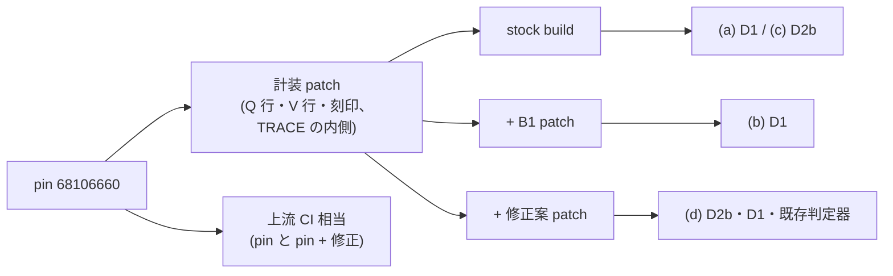

# 新しい正しさ関門の生死確認 (U0) と、Silo の取引内の値の扱いの修正案の効果確認 (gen-opt md_5、2026-09-29)

- 依頼: `/work/1/SFC/tanab/tmp/gen-opt-2026-09-29/md_5.txt` (共通指示 `common-2.txt`。いずれも repo の外)。対象 item: [T-2883] (U0 の生死確認)、[T-2885] (Silo の修正)。
- 設計の正本: `output/insights/2026-09-29/gen-opt-correctness-gate/README.md` §3 (§3.2 D1・D2b、§3.3、§3.4 B1、§3.5) と §7 (U0・U1b)。
- 種別: 使い捨て patch・照合器・起動器 (すべて repo の外、Codex author) による実測と、その記録。repo に入るのはこの資料と spool fragment だけで、判定器 (`orchestrator/verifier/`)・submodule・方策 driver は変えていない。
- 測った code: repo `035fc11fa` (計測木 3 本とも)、submodule `external/ccbench` の pin `68106660686232781bca3be792a750d3e19d7a8a`。計算ノードは Pegasus gen_S。

---

## 0. 結論

| 読み | 事前登録した期待 | 結果 | 判定 |
|---|---|---|---|
| 手順 1: 述語が実物の入力で評価できるか (DW-O13) | 手順列・刻印の行が全取引で揃い、trace の枠と 1 対 1 | stock の 2 workload で到達可能性 pass (欠け・重複・余分 0)。D2b (i)(ii) に要る発生条件 (自分の書きの後の読み・書きのある取引) は両 workload で 0 でない。並びの型ごとの計数には構成上 0 のものがある (RMW ありでは W→R・W→W、RMW なしでは M→M、§2.1) | **評価できる** |
| (a) stock Silo で D1 (手順列と trace の key 集合の照合) | 違反 0 件 | 2 workload とも条項 a・b1・b2 すべて 0 件 | **期待どおり** |
| (b) 読みを読み集合に載せない変異 B1 で D1 | 赤 (条項 b1)、B1 の発火 ≥ 1 | 条項 b1 が W-rmw 212,921 取引・W-blind 183,035 取引で違反。B1 の発火計数 (commit した取引) と**完全に一致**。**既存の判定器はこの build を 2 workload とも serializable・certified と判定した** | **期待どおり** (既存の判定器の盲点を D1 が捕まえた) |
| (c) stock Silo で D2b (取引内の値の照合) の違反件数 (調査の計数) | ≥ 1 と予想 (§3.5) | W-rmw: (i) 自分の書きの読み 28,217 取引、(ii) 最後の書きと据えた値 14,966 取引。W-blind: (i) 1,489、(ii) 16,845 | **予想どおり** (certified の根拠にはしない) |
| (d) 修正案を当てた Silo で D2b・D1・既存の巡回検査 | D2b 0 件 (発生条件 ≥ 1)、D1 0 件、serializable・certified | 2 workload とも D2b (i)(ii)・D1 すべて 0 件、発生条件あり、既存の判定器は serializable・certified (取引数 = commit 件数の証人) | **期待どおり** |
| 修正案の上流 CI 相当 | — | 全体 build: pin・pin + 修正とも rc=0。clang-format 14: pin 46 件 → pin + 修正 46 件、修正が変えた行の範囲の違反 0 件。format 段は pin に元からある違反で赤のまま | **修正は build を壊さず、新しい format 違反を足さない** |

gen-opt の評価開始の前提 (§3.5 の 4) のうち、「修正の後に D2b が全 key で 0 件になる」ことは、この 2 構成・各 1 回の範囲で確かめた。修正の submodule への取り込み (U1b) はまだで、gen-opt の評価はそれを待つ (§6)。

図の読み方: 左の pin に patch を順に当てて 3 つの trace build を作り、それぞれで 2 workload を走らせて右の読みを取った。箱の中の語は build と読みの名前で、結果は表に書いた。

---

## 1. 何をどう走らせたか

### 1.1 記録の形 (設計資料からの変更を含む)

- **手順列の行は `A` でなく `Q` にした。** 判定器は `A` tag を abort 要因の集計に既に使っている (`orchestrator/verifier/parse.py` の tag 分岐、D48 系の計装)。設計資料 §3.2 の「`A` 行」をそのまま実装すると同じ名前が 2 つの意味を持つ (DW-O13 / D75)。
- **据えた値の刻印の行は `V`。** 最初の実装は `S` だったが、`S` は MOCC の計装 (`cc/mocc/transaction.cc` の `witness_<thid>.log`) で使用中と分かり、`V` へ改名した。`Q`・`V` が判定器と CCBench の trace・witness 出力で未使用であることは、実装子が `rg` で確かめた (`verbatim/fix-1.md`)。
- **置き場は判定器が読まない別 file `gate_<thid>.log`。** 判定器は `trace_<数字>.log` だけを読み、未知の tag を parse error にする (`parse.py` の `_trace_paths`)。別 file にしたので、同じ走行を既存の判定器に無変更で掛けられた。
- 書式: `Q <txid> <thid> <n> <op>:<key_hex>:<観測した刻印|->:<書いた刻印|->...` (commit 成功の直後、1 取引 1 行、op は R・W・M = RMW)。`V <txid> <key_hex> <刻印>` (writePhase で UPDATE の値を据える直前、`memcpy` の入力の先頭 8 byte)。txid は writePhase が thread_local に残した値で、trace の C…E 枠と 1 対 1 で結ぶ。
- **刻印は 64 bit で `YCSB::id_` (値の先頭 8 byte) に置いた。** 書き手 = `((thid+1) << 48) | thread 内の通し番号`、初期 load = 既存の `id_` (key id)。`id_` は load 後に Silo の YCSB 経路で読まれない。設計資料は `val_` の先頭の 4 byte の刻印 (hash の下位 32 bit) を想定していたが、U0 では衝突の見逃しを避けるため 8 byte にした。RMW は `val_` を写した後、`update` に渡す前に新しい器の `id_` へ刻印を入れる。
- 計装はすべて `#if TRACE` の内側。計装を当てた 3 file (`include/trace.hh`・`include/ycsb.hh`・`cc/silo/transaction.cc`) から `#if TRACE` の枝を除くと pin と bytes 一致 (実装子の文字列処理による確認)。

### 1.2 patch (repo の外)

所在: `/work/1/SFC/tanab/tmp/gen-opt-2026-09-29/md_5-gate-liveness/patches/`。patch は実装面なので repo に写していない。

| patch | sha256 | 中身 |
|---|---|---|
| `instr-silo-gate-witness.patch` | `dcd7341e25cb27b0e893b4d525d1401aed94cd299966ff230fa874eb96e8d390` | §1.1 の計装 (trace.hh・ycsb.hh・transaction.cc) |
| `broken-silo-b1-unregistered-first-read.patch` | `afebe882d609dc819b9248357af865e17679c6d9ef1a0989e89975b62bdff628` | B1: `TxExecutor::read` で読み集合・書き込み集合の両方に無い key のうち、key の最後の byte が偶数のものを、lock の解けた TID を 2 度読む一貫読みで副 buffer に置き、`read_set_` に登録しない。発火計数 = 省いた読みの回数 (reached) と、commit 直前に省いた key を `searchReadSet` で実際に調べて読み集合に無いものがあった取引の数 (committed)。計装の上に当てる |
| `fix-silo-intra-txn-values.patch` | `2fca96512edab25ed5d097fb201b2d975782a7c8ef607e0adc50fba4f8618c3b` | 修正案: (1) `TxExecutor::read` は書き込み集合を先に探し、無ければ読み集合、無ければ tuple を読む。(2) `TxExecutor::update` は同じ key が書き込み集合にあれば、その要素の `body_` を新しい値で置き換えて戻る (`op_`・`rcdptr_`・key は変えない)。他は変えない。35 行、hunk は `cc/silo/transaction.cc` の 2 か所 (pin の 208 行付近と 526 行付近) |

pin の 3 file の写しへの `git apply --check` (fuzz なし) は、[計装]・[計装 → B1]・[計装 → 修正]・[修正 単独] のすべてで rc=0 (親の実走 `raw/applycheck-fix1.log`、B1 の最終版は再度 rc=0)。B1 の最初の版 (sha256 `1820fc37…`) は `Storage::YCSB` を使っており、`cc/silo/transaction.cc` の翻訳単位からは `Storage` が前方宣言でしか見えないため計算ノードで compile に失敗した (`raw/s2-b1-result.json`)。storage で絞らず key だけで選ぶ形に直して再投入した。

### 1.3 照合器 (repo の外)

`/work/1/SFC/tanab/tmp/gen-opt-2026-09-29/md_5-gate-liveness/gate_check.py` (sha256 `73a979d8553220a861c25790ccde3000869ae0361f6537c33384ecdb2f1741e1`)。trace は repo の `orchestrator.verifier.parse.parse_trace_dir` で読む (判定器と同じ解釈)。

1. **到達可能性 (先に検査し、欠ければ全述語を indeterminate):** trace file と gate file の thread の組が一致、parse の issue が空、Q の txid が C…E 枠と全件 1 対 1 (欠け・重複・余分なし、thread 内の順序も一致)、V の (txid, key) が trace の W 行と全件 1 対 1、書き込みがすべて UPDATE、刻印が「初期 (上位 16 bit = 0)」か「書き手の形 (上位 16 bit = 1..thread 数)」。
2. **D1:** 取引ごとに (a) Q の書き (W・M) の key 集合 = W 行の key 集合、(b1) その key への最初の操作が R か M の key 集合 ⊆ R 行の key 集合、(b2) R 行の key 集合 ⊆ Q の読み (R・M) の key 集合。
3. **D2b:** Q を順に辿り、(i) 自分が先に書いた key の読みの刻印が、その時点の自分の最後の書きの刻印と一致、(ii) key ごとの最後の書きの刻印 = その key の V の刻印。
4. **発生条件:** 取引数、読みだけの取引、同じ key が 2 回以上現れる取引、R→R・W→R・R→(W|M)→R (M→R を含む)・W→W・M→M・複数回の書き、自分の書きの後の読みを含む取引。D2b (i) は「自分の書きの後の読みを含む取引」、(ii) は「書きのある取引」が 0 なら not-exercised。
5. 照合器は patch の名前も B1 の発火行も判定に使わない。

自走 test (手製の小さい trace で正例 1・負例 12) は親の実走で 13 件すべて OK (`raw/gate-check-selftest-fix1.log`)。D1 (b1) と D2b (ii) の比較を一時的に外すと、対応する負例の test が赤になることを実装子が確かめた (`verbatim/author-1.md`・`verbatim/fix-1.md`)。

### 1.4 起動器と job

起動器 `/work/1/SFC/tanab/tmp/gen-opt-2026-09-29/md_5-gate-liveness/launch_gate_liveness.py` は、先例 (T-2847 の変異実走の起動器) と同じく repo の部品 (`s3_mocc_lock_coverage._load_policy`・`_resolve_toolchain`・`_prepare_dependencies`、`silo_policy_coverage._prepare_build_dependencies`、`patchharness.checkout`・`assert_pinned_clean`、`s2_verify_calibration` の単独性・空き容量の検査) を import し、job ごとに node-local の checkout へ patch を当てて TRACE=1 の `ycsb_silo.exe` を直 CMake で build する (configure は `s2_verify_calibration._broken_build_and_verify` と同じ。macro は付けないので条件 gate は通らない = 無条件 patch の別 build)。判定器は `--expected-commits` (commit 件数の証人) と `--ccbench-root` = patch を当てた checkout で呼ぶ。

workload (共通 `ycsb_tuple_num=200 ycsb_zipf_skew=0.9 ycsb_rratio=50 ycsb_max_ope=5 thread_num=4 extime=1 clocks_per_us=1800`、`KEY_SORT` は既定 0):

| 名前 | rmw | 使い道 |
|---|---|---|
| W-rmw | true | 判定器の既定の検証構成 (`pipeline.py` の `CorrectnessWorkload`) と同じ |
| W-blind | false | blind write で W→R・W→W を出す |

| job | request | 計算ノード | Elapse | 起動器 sha256 | 当てた patch | 結果 |
|---|---|---|---|---|---|---|
| s1-stock | 35409.nqsv | bnode009 | 117 s | `7210eeb4…` (fix 1 後) | 計装 | rc=0 |
| s2-b1 | 35459.nqsv | bnode033 | 48 s | `9ecf2ca1…` (fix 2 後) | 計装 + B1 (最初の版) | rc=1 (compile error、§1.2) |
| s3-fix | 35458.nqsv | bnode031 | 143 s | `9ecf2ca1…` | 計装 + 修正案 | rc=0 |
| s2b-b1 | 35479.nqsv | bnode001 | 112 s | `9ecf2ca1…` | 計装 + B1 (直した版) | rc=0 |

計算ノードの所要の合計は 420 s (約 0.12 node 時間)。段 1 の試算 (約 0.5 node 時間) の内側で、2 node 時間の上限に届いていない。s1-stock の起動器は fix 2 (判定器の rc 1・3 を判定結果として扱う変更) の前の版だが、s1-stock では判定器の rc が 2 workload とも 0 だったので読みは変わらない (焦点再レビュー 2 巡目 `verbatim/s6-focus2.md` も同じ結論)。

---

## 2. 結果の詳細

### 2.1 stock ((a) と (c))

| workload | commit | abort | 到達可能性 | D1 a / b1 / b2 | D2b (i) | D2b (ii) | 既存の判定器 |
|---|---:|---:|---|---|---:|---:|---|
| W-rmw | 194,610 | 9,025 | pass | 0 / 0 / 0 | 28,217 取引 | 14,966 取引 | serializable・certified、取引 194,610 |
| W-blind | 219,922 | 9,038 | pass | 0 / 0 / 0 | 1,489 取引 | 16,845 取引 | serializable・certified、取引 219,922 |

発生条件 (取引数): W-rmw は、自分の書きの後の読みを含む取引 28,217、書きのある取引 188,586、複数回の書きの取引 14,966、R→(W|M)→R 14,890、M→M 14,322、W→R 0。W-blind は、自分の書きの後の読みを含む取引 16,630、書きのある取引 213,058、複数回の書きの取引 16,845、R→(W|M)→R 772、W→W 16,136、W→R 16,630。

読み方:

- W-rmw では、自分の書きの後の読みを含む取引 28,217 がすべて (i) に反し、複数回の書きの取引 14,966 がすべて (ii) に反した (件数が一致)。W-rmw の書きはすべて RMW なので、書いた key は先に読み集合に載っており、stock の `read` が読み集合を先に返すので、書いた後の読みは必ず最初の読みの値になる。2 度目の書きは `update` で捨てられる。
- W-blind では、(ii) は複数回の書きの取引 16,845 とすべて一致した。(i) は自分の書きの後の読みを含む取引 16,630 のうち 1,489 だけが反した。W→R だけの並びなら stock の `read` は読み集合に無い key を書き込み集合から返すので正しい (自分の書きを返す)。反した 1,489 取引の内訳 (R→W→R 型か、W→W→R 型か) は照合器で分けて数えていない。
- 既存の判定器は 2 workload とも certified だった。D2b が数えた食い違いは版の単位の巡回には現れない (§3.5 の予想どおり)。

### 2.2 B1 ((b))

| workload | commit | 到達可能性 | D1 a / b1 / b2 | B1 reached | B1 committed | 既存の判定器 |
|---|---:|---|---|---:|---:|---|
| W-rmw | 217,062 | pass | 0 / **212,921** / 0 | 588,237 | 212,921 | serializable・certified、巡回 0、integrity clean |
| W-blind | 236,120 | pass | 0 / **183,035** / 0 | 320,315 | 183,035 | serializable・certified、巡回 0、integrity clean |

- D1 (b1) の違反取引数と B1 の committed が 2 workload とも完全に一致した。照合器は B1 の発火行を読まないので、この一致は独立な 2 つの数え方の一致である。
- **既存の判定器は B1 の build を certified と判定した。** 読み集合に載らない読みは validation も trace の R 行も通らないので、判定器から見ると「その取引はその key を読んでいない」ことになる (設計資料 §2.4 の 1 の予想)。この形の迂回は、今の判定器では見えず、D1 で初めて赤になる。
- B1 の build の D2b は W-rmw (i) 10,884・(ii) 16,732、W-blind (i) 916・(ii) 18,134 (stock の挙動に B1 が重なったもの。(b) の判定には使わない)。

### 2.3 修正案 ((d))

| workload | commit | abort | 到達可能性 | D1 a / b1 / b2 | D2b (i) | D2b (ii) | 既存の判定器 |
|---|---:|---:|---|---|---:|---:|---|
| W-rmw | 190,731 | 8,216 | pass | 0 / 0 / 0 | 0 (発生 27,570 取引) | 0 (書き 184,837 取引、複数回 14,483) | serializable・certified、取引 190,731、integrity clean |
| W-blind | 221,180 | 12,729 | pass | 0 / 0 / 0 | 0 (発生 16,915 取引) | 0 (書き 214,447 取引、複数回 16,928) | serializable・certified、取引 221,180、integrity clean |

stock で反していた発生条件 (自分の書きの後の読み、複数回の書き) が修正後の走行にも同じ程度の件数で現れ、そのすべてで照合が一致した。

### 2.4 上流 CI 相当

- **build:** 上流 `external/ccbench/.github/workflows/build.yml` と同じ意味の configure (`-DCMAKE_BUILD_TYPE=Release -DENABLE_SANITIZER=OFF`、genome の define・TRACE 指定なし) と全 target の `cmake --build -j 48` を、pin 単独と pin + 修正で別の checkout に行った。どちらも rc=0 (configure 1.7 s、build 10.5 s / 10.4 s、log は oze まで全 target を 100% まで build)。計算ノードで build するため、compiler は policy の gcc-11、依存物は `FETCHCONTENT_SOURCE_DIR_*` と `CMAKE_PREFIX_PATH` で供給した点が上流 CI (runner の既定 compiler、ccache) と違う (`raw/s3-fix-result.json` の `ci_equivalence_notes`)。
- **format:** 上流と同じ対象 (`git ls-files -- cc include common` の `.cc/.hh/.cpp`、213 file) に clang-format 14.0.0 の `--dry-run --Werror` を file ごとに掛けた (親の login 実走、`raw/fmt-check-result.json`)。pin 46 件 (MOCC `transaction.cc` 26、Silo `transaction.cc` 17、`include/trace.hh` 3) → pin + 修正 46 件 (同じ内訳)。修正が変えた行の範囲 (Silo `transaction.cc` の 208〜221 行・526〜535 行) に掛かる違反は 0 件。**上流 CI の format 段は pin の既存違反で赤のままで、修正を当てても変わらない。** 修正そのものは新しい違反を足さない。

---

## 3. 設計資料 (gen-opt-correctness-gate) への所見

1. **§3.2・§7 の「`A` 行」は名前を変える必要がある。** `A` は判定器で abort 要因の集計に使用中。U1 (CCBench の trace 拡張) と U2 (判定器) は、実装の前に設計資料の名前を訂正する (本 wave は `Q`・`V` を使った)。
2. **刻印の置き場。** U0 は `YCSB::id_` の 8 byte を使った。設計資料の「`val_` の先頭 4 byte・hash の下位 32 bit」を採るか、`id_` の 8 byte を採るかは U1 で決める (`id_` は load 後に Silo の YCSB 経路で読まれないことを確かめたが、他の protocol の YCSB 経路は調べていない)。
3. **D1 は既存の判定器の盲点を実際に埋める。** B1 は判定器を certified のまま通り、D1 (b1) だけが赤にした (§2.2)。設計資料 §2.4 の 1 の予想の実測である。
4. **D2b の前提 (§3.5 の修正) は、この構成で成り立つ。** 修正前は 2 workload とも D2b が赤、修正後は 0 件。§3.5 の 5 (修正が採られなければ評価を始めない) の分岐は、還元判断 (ユーザー) の後に決まる。

---

## 4. 限界

- **各構成 1 回・小規模。** 200 record・4 thread・1 秒・2 workload (RMW あり / なし)、`KEY_SORT=0`。稀な割り込みでだけ起きる食い違いはこの観測では捕まらない (設計資料 §4 の小モデルの役割)。
- **D2a (読んだ版と、その版として据えられた値の照合) は測っていない。** 刻印は記録したので同じ trace から照合できるが、照合器に入れていない。B2〜B7 の変異も走らせていない (U6)。
- **性能 build は調べていない。** 計装が TRACE=0 に何も残さないことは、枝を除いた file の bytes 一致 (文字列処理) で確かめただけで、性能 build の compile・記号検査 (`buildcache._assert_no_trace_symbols`)・命令列の比較はしていない。刻印と手順列の記録が trace build の取引の流れを変えないかも測っていない (設計資料 §3.2 の注記の測定は U1 で行う)。
- **修正案は `read` と `update` だけを変える。** `scan` の読み集合優先、`insert`・`delete_record` の同じ key の扱いは変えていないので、「全 API で取引内の意味が揃った」とは言えない。
- **修正後の Silo は別 build である。** 修正は stock の命令列を変えるので、修正前に記録した測定は当時の事実として残し、修正後の stock を対照にする計測は取り直す (規律 7)。
- **修正案は pin `68106660` に対して作った。** pin 前進の wave (稼働中) が submodule を進めた後は、その tip に対して厳密適用・build・format を取り直す必要がある。
- **上流 CI 相当は、計算ノードの環境で同じ意味の手順を踏んだもの**で、GitHub の CI そのものではない (§2.4)。
- **照合器は判定器の parse を再利用している。** trace の解釈を揃える利点の代わりに、parse の誤りを共有する。
- **関門を変えられる主体の限界 (D387)。** 照合器・patch・起動器はこの wave の AI が作った使い捨てであり、意図的な弱体化への防壁ではない。

---

## 5. 何を確かめ、何を確かめていないか

**確かめたこと (実走・実物):**

- 手順列 (Q) と刻印 (V) の記録が、stock・B1・修正の 3 build × 2 workload のすべてで、trace の全取引・全 W 行と 1 対 1 で揃った (到達可能性 pass)。
- (a)〜(d) の表の数値 (§2、`raw/*-result.json`)。D1 (b1) の違反取引数と B1 の committed の一致。既存の判定器が B1 を certified と判定したこと。
- 修正案の厳密適用 (pin 単独・計装の上)、上流 CI 相当の全体 build (pin・pin + 修正とも rc=0)、clang-format 14 の違反件数 (pin 46 → 46、修正行の範囲 0)。
- 照合器の自走 test 13 件 (親の実走)。

**確かめていないこと:**

- 構成を変えたとき (record 数・thread 数・`KEY_SORT=1`・TPC-C) の D1・D2b の成り立ち。
- W-blind の stock の D2b (i) 1,489 取引の内訳。
- D2a、B2〜B7、性能 build、刻印が取引の流れを変えないこと (§4)。
- 修正案の submodule への取り込みと、新しい pin での再確認。

---

## 6. 次の一手

- **U1b の取り込み wave を起票する。** pin 前進の wave の着地後に、`fix-silo-intra-txn-values.patch` (sha256 `2fca9651…`、所在 §1.2) を submodule の Silo へ入れる。上流 CI (build・clang-format 14) を新しい tip で取り直し、stock の trace build で D2b 0 件を本 wave の照合器で再確認する。上流への還元は人間の判断 (還元判断: ユーザー確認待ち、[T-2885])。
- **U1・U2 の起票時に、設計資料 §3.2 の「`A` 行」の名前の訂正を必須条件にする** (§3 の 1)。刻印の置き場 (§3 の 2) も U1 で決める。
- CCBench への還元候補 (設計資料 §3.5 と同じ内容、本 wave で実測):
  - 発見: stock Silo の `TxExecutor::update` は同じ key への 2 度目の書きの値を捨て、`TxExecutor::read` は書き込み集合より先に読み集合を返す。
  - 再現条件: 同じ取引に同じ key が 2 回以上現れる YCSB の手順。200 record・zipf 0.9・4 thread・1 取引 5 操作の 1 秒で、RMW ありでは 28,217 取引が自分の書きと違う値を読み、14,966 取引で最後の書きが据えられなかった (§2.1)。
  - 該当コード: submodule の `cc/silo/transaction.cc` の `TxExecutor::read` と `TxExecutor::update` (pin `68106660`)。
  - 仮説: 取引内の同じ key の扱いを単純化した実装で、YCSB は値で分岐しないので性能評価にも版の単位の直列化可能性の判定にも現れない。
  - CCBench 論文 / insight との関係: 未確認。
  - **還元判断: ユーザー確認待ち。**

---

## 7. 記録の置き場と束縛

- `raw/<job>-result.json`: 起動器の結果 (job・host・時刻・pin・patch と当てた後の source と binary の sha256・run ごとの commit と abort・判定器の JSON・照合器の JSON・発生条件・事前登録の評価・B1 の発火行・CI 相当の build)。`raw/<job>-dispatch.log`: dispatch の記録 (request ID・Elapse・起動器と照合器の sha256)。**可逆の最小正規化:** 原本 (`/work/1/SFC/tanab/tmp/gen-opt-2026-09-29/md_5-gate-liveness/runs/<job>.log`) は各 1 行 (`| ` の行) に行末空白を持つので、写しでは行末空白だけを除いた (可視文字は不変)。原本の sha256 と byte 数: s1-stock `f4dbc9fda3755114ce0e5402415ad3d09245eba21b0ea04c5760548bafc5797f` 4,212、s2-b1 `6322ee37c1a73af73eb60788d2548f09ab768e216feca0a0dac2ed641dc9a1b0` 4,227、s2b-b1 `82edf5be3072630fba96f1e602901b92ecf032ae19c6e782f1c2a06b67f0ff16` 4,208、s3-fix `26afdd64fdd1b7b90f7539a0825f5059be9a3ba204e0ea381b28cbfa10e8b734` 4,209。復元は、写しの `|` だけの行の末尾に空白 1 文字を足す。
- `raw/fmt-check-result.json`: format 検査 (file ごとの違反件数、修正行の範囲)。`raw/applycheck-fix1.log`・`raw/gate-check-selftest-fix1.log`: 親の login 実走。
- `verbatim/`: 段 1 brief、段 3 相談、段 4 裁定、実装子と fix 子の報告、計算前レビューと焦点再レビュー 2 巡、段 6 裁定 2 つ、親の確認記録、記録の事実照合レビュー (`s7-review.md`、NO-GO の所見 1 件 = §0 の発生条件の量化の言い過ぎを直した。他の数値は生出力と一致)。
- trace と gate file の原本 (run ごとの tar.gz、各 16〜18 MB) は repo の外: `/work/1/SFC/tanab/tmp/gen-opt-2026-09-29/md_5-gate-liveness/runs/<job>/<workload>.trace.tar.gz`。sha256: s1-stock W-rmw `69b12623f9ad58303298d352b90167f832c0e297f1524e3a91935fc140ee1981`、W-blind `9a5fae63b0583d8c186842638f09d8dfa037ba305c42578eb77ddd67bb709a2d`。s2b-b1 と s3-fix の値は `raw/s2b-b1-result.json`・`raw/s3-fix-result.json` の `trace_archive_sha256`。
- patch・照合器・起動器・format 検査の原本は repo の外 (§1.2〜§1.4 の path と sha256)。作った過程の版は同 dir の `author1-out/`・`fix1-out/`・`fix2-out/`・`fix3-out/`。
