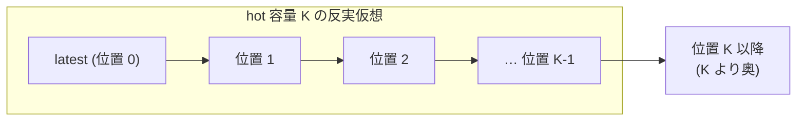

# VHash md_2: stock Cicada の版探索と版の保持の実測 (2026-09-29)

VHash 論文 (`docs/paper-story-vhash/` 2026-09-29 版 §8・§9、出典メモ §29 段階 1) の H1・H2・H4 の上限見積りのための
診断計測。stock Cicada に既定 inert の計器 patch を当て、Pegasus 計算ノードで 24 条件 × 3 反復を測った。
**計器入り build の値であり、throughput は性能値ではない。正しさ (serializability) の主張はしない。**

## 0. 結論 (図から)

1. **update tx の読み取りは、ほぼ先頭の版で終わる (H1 の上限は小さい)。** 位置 ≥ 1 (最新版より奥) へ行った update read は、
   workload A (読み 50%・skew 0) で全 update read の約 1e-5、workload B (読み 95%・skew 0.9) でも約 0.9〜1.4%。
   位置 ≥ 4 は B で約 1e-5〜5e-5、位置 ≥ 8 は約 2e-6〜5e-6 だった (図上段、表 §6.1)。
   hot 容量 K=1 でも update read の約 98.6% 以上 (B)、K=2 で 99.8% 以上が hot 内に収まる (A は K=1 で 99.98% 以上)。
2. **深い探索の大半は read-only tx (固定 snapshot) から来る。** read-only tx は `MinWts − 1` の snapshot を読むので、
   B (read-only 試行が約 59%) では read-only read の 24〜48% が位置 ≥ 1、10〜28% が位置 ≥ 8 だった (図中段)。
   A でも gc_inter_us = 100000 では read-only read の約 50% が位置 ≥ 1。**これは forwarding の対象外** (出典メモの「固定 snapshot」) で、
   VHash の hot 配置 (H1) が効きうるのはこちらである。
3. **forwarding の「観測時点の楽観的候補率」は K が小さいと低い (H2 の上限)。** B では、位置 ≥ 1 の update read のうち、
   先頭 1 版で既読を保ったまま進める候補があったのは 2〜5%。位置 ≥ 4 の深い read では 32〜49%、
   位置 ≥ 8 では 67〜86% (ただし分母は 3 反復合計で 129〜515 件と少ない)。A は深い update read 自体がほぼ無い。
   これは明示した制約を外した楽観側の値で、実装した forwarding の成功率ではない (§2)。
4. **長い tx は GC の公開そのものを止め、回収境界を tx の長さだけ遅らせる (H4 の余地)。** gc_inter_us = 10 で、
   待機なしの A の境界年齢 p50 は 32 µs の bucket (≤ 32 µs) だが、worker 1 が 1 ms 待つと 2048 µs、10 ms 待つと 32768 µs の bucket になり、
   MinRts の公開回数は 3 秒あたり 14,176 回 (平均) から 2,035 回・290 回へ減った。10 ms 待機の公開回数 290 は、長い tx の試行回数 292 とほぼ一致する
   (待機中の worker は GC flag を上げないので、全 worker の flag を待つ leader は公開できない)。論理生存版数は 1.03e6 から 1.41e6 (+37%) へ増えた。
   CCBench 論文 §7.2 の「GC 間隔が遅延と同程度で頭打ち」という記述と整合する向きの観測である (原典の数値の再現ではない)。
5. **1000 操作の長い update tx はほぼ commit できない。** A の gc_inter_us = 10・1000 では約 3,000 試行すべてが abort (commit 0)、
   gc_inter_us = 100000 でも 2,325 試行中 134 commit。B では全 gc_inter_us で commit 0 だった (表 §6.2)。
6. **read-only tx は公開を遅らせる。** read-only tx の commit は `mainte()` を通らず GC flag を上げない。read-only 試行が 59% の B は、
   長い tx が無くても gc_inter_us = 10 の境界年齢 p50 が 2048 µs の bucket (A は 32 µs) だった。

**この図から読み取ってはならないこと。** 値はすべて計器入り build・48 worker・1M 件・3 秒の条件の観測で、Cicada の性能や
「VHash が速くなる」ことは言っていない。時間は timestamp 空間の値 (clock boost を含む) で、bucket の上界 (2 倍刻み) である。

## 1. 何を確かめ、何を確かめていないか

**確かめたこと (実測):**
- 計器 patch の既定 build (両 macro 未定義) は stock と `.text`・`.rodata` が一致し、`nm` に izanagi 記号が無く、`strings` の izanagi 文字列集合も stock と同一 (§5)。
- 有効 build の 2 macro は condition gate (supply・meaning) で受理された。
- 24 条件 × 3 反復 = 72 走がすべて rc=0 で、計器の 1 行 JSON が 48 worker 分 parse できた。
- stock の `WORKER1_INSERT_DELAY_RPHASE=1` は compile error になる (§3)。
- レコード数 N は calibrator 方針 (D15 第二基準) の実測で 1M に決めた (§4)。

**確かめていないこと:**
- **正しさ:** Cicada は izanagi の正しさ検査器を通せない (2026-09-29 時点、md_3 の担当)。
- **forwarding の実現可能性:** 楽観的候補率は、後から入る writer、pending 版の後日確定、write-set・node-set の検査、timestamp の一意性、
  先頭 K 版へ後から入る版を無視した値。各深い read を stock の実行の上で独立に評価し、前進を連続して模擬していない。
- **性能:** 計器入り build の throughput は性能値に使わない (絶対規律 1)。raw の stdout に残るだけ。
- **物理メモリ量:** 論理生存版数は「鎖に接続された版の数」で、bytes や allocator の使用量ではない (REUSE_VERSION=1)。
- **他の workload・thread 数・レコード数・長時間走:** YCSB だけ、48 worker・1 ソケット・1M 件・3 秒。
- DELETE を含む workload: YCSB は DELETE を出さないため、deleted 版で失敗した read を候補計数に含める既知の欠点 (段 6 の nit) は今回の値に影響しない。
  TPC-C 等で使う前に直す (verbatim/s6-close-ruling.md)。

## 2. 測ったものの定義

| 名前 | 定義 | 注意 |
|---|---|---|
| hop 数 | stock の走査が `next` を辿った回数 (site 別: read_update / read_ronly / blind_write / rmw_latest / precheck / install / readcheck / writecheck) | 計器は追加の鎖走査をしない |
| 位置 | その走査が観測した鎖で、選んだ版が起点から何番目か (pending・aborted を含む) | read は latest 起点、validation は走査の開始点起点 (raw の `position_origin`)。並行 install があるので絶対順位ではない |
| K より奥の割合 | 位置 ≥ K の read の割合 (K = 1, 2, 3, 4, 8) | hot 容量 K の反実仮想。図 2 は read site だけ |
| 観測時点の楽観的 forwarding 候補率 | update tx の位置 ≥ K の read のうち、先頭 K 版内の committed 版 v について max(wts(v), L, ts+1) < min(e(v), U) となるものがある割合。L = 既読版 wts の最大、U = 既読版それぞれの「読んだ時点の直上 committed 版の wts」の最小、e(v) = v の直上 committed 版の wts | 成功した read だけを既読に入れる。pending と観測した選択版は確定後の status で記録。read-only tx は固定 snapshot として分母から外し別計数 |
| 境界年齢 | MinRts の公開ごとの (rdtscp − MinRts>>8) / clocks_per_us | timestamp 空間 (clock boost を含む)。負値は別計数 (今回 0 件)。公開の判定は leaderWork() の前後で GCFlag[0] が 1→0 になったこと (同値の再公開も数える)。採時は cicadaLeaderWork() 復帰後 |
| 公開間隔 | MinRts 公開の rdtscp 間隔 | 実時間 |
| 回収時年齢 | GC が切り離した版の (now − wts>>8) / clk (生成基準) と、直上版の wts 基準 (上書き基準) | timestamp 空間 |
| 論理生存版数 | 初期 N + install 成功 − GC 切離し | 鎖に接続された版の数。物理メモリ量ではない |

時間系のヒストグラムは 2^0〜2^40 µs と overflow の 42 bucket、hop・位置は 0〜8 を正確に、以降 16, 32, …, 2048 と overflow。
分位点は bucket の上界で表すので解像度は 2 倍刻みである (例: 「p50 = 32768 µs」は「p50 が (16384, 32768] µs の bucket」)。

## 3. 長い tx の作り方 (原典とソースから特定)

- **原典** CCBench 論文 (Tanabe ら, PVLDB 13(13), §7.2): 長い tx は read phase 末の人工遅延で作り、1 worker だけが長い tx を担当、
  長短で操作数・読み書き比は同じ、skew 0。Fig.14 は YCSB-A・224 threads・1M records・payload 4 B・10 ops、遅延 0〜10 ms、GC 間隔 10^0〜10^6 µs。
  「操作数が多い」型は §7 に無い。原典 PDF は md_1 が取得した `/work/1/SFC/tanab/tmp/vhash-related-work-2026-09-29/src/ccbench-pvldb13-13-tanabe.pdf`。
- **stock (gitlink 68106660) の現状:**
  - `batch_*` flag (`cc/cicada/include/common.hh`) は宣言と表示 (`util.cc`) だけで、YCSB workload (`include/ycsb.hh`) は batch worker の操作数を変えない。
    旧 `cicada.cc` の batch 分岐は 2023-07 公開時点 (submodule commit 23da0ed4f) で既にコメントアウトされていた。
  - `WORKER1_INSERT_DELAY_RPHASE=1` の分岐 (`transaction.cc` の `commit()` 冒頭) は compile error 3 件で build できない (smoke 実測):
    `thid` 未宣言 (924 行、`thid_` の誤り)、`WORKER1_INSERT_DELAY_RPHASE_US` 未宣言、`clock_delay` 未宣言 (delay.hh を include していない)。
    実行時 flag `-worker1_insert_delay_rphase_us` は使われていない。上流への修正は人間の判断 (CLAUDE.md の作業手順 4)。
- **本 wave の配線** (`IZANAGI_CICADA_LONGTX`、patch 内だけ):
  - 待機型 (wait1ms・wait10ms): worker 1 が `commit()` 冒頭 (read phase 末) で `-worker1_insert_delay_rphase_us` だけ rdtscp spin で待つ。worker 1 の毎 tx が長い tx になる。
  - 操作数型 (ops1000): batch worker (thid ≥ `-thread_num`、`-batch_th_num=1`) が、短い tx と同じ zipf・読み比で 1000 操作の手続きを実行する。
    `begin()` で手続きを伸ばし、retry では伸ばし直さない。総 worker は 47 + 1 = 48 にそろえた。

## 4. 条件表と N の決め方

| 軸 | 値 |
|---|---|
| workload | A = 読み 50%・skew 0 (論文 §7.2 に対応)、B = 読み 95%・skew 0.9 (read-only 多・競合) |
| 長い tx | none、wait1ms (1000 µs)、wait10ms (10000 µs)、ops1000 |
| gc_inter_us | 10、1000、100000 |
| 共通 | YCSB 10 ops、payload 4 B (VAL_SIZE)、48 worker、N = 1,000,000、extime 3 s、clocks_per_us 2100、各条件 3 反復 |
| build | gitlink 68106660、CICADA_SPACE 既定 (INLINE_VERSION_OPT=0、REUSE_VERSION=1、WRITE_LATEST_ONLY=0、BACK_OFF=1)、2 macro 有効 |

**N の決め方 (絶対規律 4、calibrator 方針):** Masstree を使う Cicada は D15 の第二基準 (maxrss が L3 の 4 倍を超える最小 N) に従った。
smoke4 で stock build・読み 100%・extime 1 の maxrss を測り、1M = 1,087,268 KB、2M = 2,042,492 KB、4M = 3,856,792 KB、
計算ノードの L3 = 105 MiB (lscpu) → 4 × L3 = 420 MiB を 1M で超えるので N = 1M。論文 §7.2 の 1M と同じ値になった。
measure は smoke JSON から選定を再計算して一致しない N を拒否する。

## 5. smoke (inert witness・較正) の記録

| smoke | request | patch | 結果 |
|---|---|---|---|
| smoke1 | 33792.nqsv | 44c37d6d8 | 停止: delay compile の行選択 (compile_commands に transaction.cc が workload ごと 4 行) |
| smoke2 | 33926.nqsv | 09fdf57f1 | `.text`・`.rodata` 一致を初めて確認。有効 build は condition gate の meaning 検査で拒否 (owner TU の前処理で別 TU の分岐が観測できない) |
| smoke3 | 33966.nqsv | bf7e134ea | 合格 (rc=0) |
| smoke4 | 33984.nqsv | 2e56d5fed (patch sha256 fbe86f3a9e70…) | **合格 (rc=0)。本計測はこの patch** |

smoke4 の witness: stock と既定 patch の正規化 `objdump -d` の sha256 一致 (`normalized_objdump_equal=true`)、`.rodata` 一致、`nm -C` の izanagi 0 件 (両方)、
`strings -a` の izanagi 文字列は build path 由来で stock と集合一致。2 macro の gate admitted。短い走 (A-none-gc10、1 秒) で 48 worker 分の JSON と
MinRts 公開 3,893 件を記録。raw は `raw/smoke4.json.gz`。

## 6. 結果

数値は `analysis/summary.md` (3 反復の平均) と `analysis/summary.json` (反復ごとの値と平均・最小・最大) にある。生成は
`verbatim/summarize-source.md` の script (sha256 6d8086f0…、repo 外で実行、定義は driver と作図と同じ)。

### 6.1 読み取りの深さと候補率 (抜粋、3 反復の平均)

| 条件 | update read の位置 ≥1 / ≥4 / ≥8 | read-only read の位置 ≥1 / ≥8 | 候補率 K=1 / 4 / 8 (分母) |
|---|---|---|---|
| A-none-gc10 | 1.0e-5 / 0 / 0 | 0.028 / 0 | 0.45 (1715) / — / — |
| A-wait10ms-gc10 | 1.2e-5 / 8.0e-8 / 0 | 0.17 / 0 | 0.35 (1743) / 0.00 (12) / — |
| A-ops1000-gc100000 | 1.7e-4 / 2.9e-6 / 8.3e-8 | 0.51 / 6.7e-5 | 0.22 (22947) / 0.00 (381) / 0.00 (11) |
| B-none-gc10 | 0.014 / 3.1e-5 / 4.3e-6 | 0.24 / 0.10 | 0.03 (1422243) / 0.34 (3118) / 0.76 (430) |
| B-wait10ms-gc10 | 0.012 / 1.7e-5 / 3.8e-6 | 0.41 / 0.23 | 0.02 (980402) / 0.40 (1451) / 0.67 (324) |
| B-none-gc100000 | 0.009 / 1.1e-5 / 2.1e-6 | 0.47 / 0.27 | 0.02 (554386) / 0.48 (667) / 0.81 (129) |

分母は 3 反復合計の深い update read 数。全 24 条件は `analysis/summary.md`。

### 6.2 長い tx と GC (抜粋)

| 条件 | 長い tx の試行 / commit / abort | 長い tx 1 試行の平均 µs | 公開回数 | 境界年齢 p50 bucket µs | 論理生存版数 |
|---|---|---|---|---|---|
| A-none-gc10 | — | — | 14176 | 32 | 1.03e6 |
| A-wait1ms-gc10 | 2845 / 2596 / 249 | 1012 | 2035 | 2048 | 1.03e6 |
| A-wait10ms-gc10 | 292 / 137 / 155 | 10034 | 290 | 32768 | 1.41e6 |
| A-ops1000-gc10 | 3016 / 0 / 3016 | 546 | 2101 | 2048 | 1.05e6 |
| A-ops1000-gc100000 | 2325 / 134 / 2191 | 862 | 28 | 131072 | 3.75e6 |
| B-none-gc10 | — | — | 3960 | 2048 | 1.00e6 |
| B-wait10ms-gc10 | 289 / 61 / 228 | 9968 | 248 | 32768 | 1.03e6 |
| B-ops1000-gc10 | 5380 / 0 / 5380 | 90 | 3892 | 2048 | 1.00e6 |

公開回数と試行回数は 1 走 (3 秒) あたりの 3 反復平均。

## 7. 生出力の所在

- raw (gzip、本 dir): `raw/final-j0.json.gz` (A-none・A-wait1ms)、`raw/final-j1.json.gz` (A-wait10ms・A-ops1000)、`raw/final-j2.json.gz` (B-none・B-wait1ms)、
  `raw/final-j3.json.gz` (B-wait10ms・B-ops1000)、`raw/smoke4.json.gz`。展開前の sha256: final-j0 `d28bdd3e…`、final-j1 `58092251…`、final-j2 `09f41d74…`、
  final-j3 `d9ee45a9…`、smoke4 `901a6910…` (全桁は `figures/*.provenance.json` の `inputs` と `analysis/summary.json`)。
- 計算ノード job: 34016.nqsv (j0)、34017〜34019.nqsv (j3・j2・j1 の順に受理)、各 Elapse 125〜128 s、2026-09-29 07:49〜07:52 JST に 4 ノード並列。checkout は detached worktree `vhash-cvl-q{0..3}` @ 2e56d5fed。
- 予備走 measure-j0 (33967.nqsv、patch 修正前) と smoke1〜3 は結果に使っていない。repo 外 `/work/1/SFC/tanab/tmp/vhash-cicada-version-measure-2026-09-29/raw/` に置いた (永続を保証しない)。
- 計算ノードの使用は smoke 4 本・予備走 1 本・本計測 4 本で Elapse 合計約 900 秒 (約 0.25 node 時間) と、変異本走 1 本 (§9)。2 node 時間未満。

## 8. 限界

- **観測者効果:** 計器は read・write・validation ごとに counter を増やし、tx ごとに rdtscp を 2 回読む。値の絶対水準 (試行数・公開回数) は stock と違いうる。
- 分位点は 2 倍刻みの bucket 上界。反復間のばらつきは小さかった (例: A-wait10ms-gc10 の公開回数 289〜291、境界年齢 p50 は 3 反復とも同じ bucket)。
- 境界年齢・回収時年齢は timestamp 空間で、clock boost (abort 後に 1 µs 相当を加算) を含む。
- 位置は観測した鎖での位置。validation site の位置は走査開始点起点なので、K の図は read site だけで描いた。
- 楽観的候補率は §1 の制約を外した値。分母が 30 未満の点は図で白抜き。
- 計器の統計配列は総 worker ≤ 256 を前提とする (超えると計器有効時に起動で停止)。`SINGLE_EXEC=1` は計器の対象外 (D1419 で探索外)。
- 探索長ヒストグラムは 9 以上で bucket 幅が広がる (「16」は 9〜16 の 8 値、以降 2 倍ずつ) ので、図 1 の「16」の段差は bucket 幅によるもので、分布の山ではない。
- 待機型では worker 1 の全 tx が長い tx になる (論文 §7.2 と同じ設計)。長い tx が 1 本だけの状況とは頻度が違う。

## 9. 実装と検証の記録

- patch `patches/instr-cicada-version-lifetime.patch` (transaction.hh と transaction.cc だけ)、driver `orchestrator/campaign/vhash_cicada_vlife.py`、
  test `orchestrator/tests/test_vhash_cicada_vlife.py`、作図 `tools/plotting/plot_vhash_cicada_vlife.py`、登録 (materializer NON_ADMISSIBLE、condition gate の 2 macro)。
  Codex `role=author` の実装子 1 本と fix 子 6 本。
- 段 3 相談 1 本 (条件付き GO)、段 6 レビュー 1 本 (NO-GO → fix1)、焦点再レビュー 3 本 (fix2・fix3/4 後)、計算ノード smoke で見つかった実機 blocker 2 件 (fix3・fix4)。
  裁定と所見は `verbatim/`。
- 変異 MUT-1〜MUT-10 と等価変異 EQ-1 は login の自走 probe で登録どおり (各 1 node が赤、等価は赤なし) を確認し、本走は計算ノードで `--task mutation` に束ねた (結果は worklog)。
- md_2 の指示との食い違い: 「`patches/ledger.json` の entry」は作らなかった。同台帳は D18 第 4 類 ability probe 専用で、
  `orchestrator/campaign/silo_ladder_rung1_contract.py` が entry 数 1 を要求し、既存の診断計器 (instr-*) も README だけに登録されている。`patches/README.md` に登録した。

## 10. 次の版 (paper-story-vhash 2 版目) へ

- H1: update tx の版探索は YCSB のこの範囲ではほぼ先頭で終わる。hot 配置の効果の上限は、read-only (固定 snapshot) の深い探索の側にある。
  次の実験は read-only 比率と snapshot の古さ (gc_inter_us・長い tx) を軸にするのが筋。
- H2: 楽観的候補率は K=1 で数%、深い read ほど高い。forwarding の効果が出うるのは「深い update read が多い」条件 (高 skew・長い update tx) で、
  1000 操作の長い update tx はそもそも commit できていない — forwarding が abort 理由をどれだけ救うかは abort 理由の内訳 (未計測) が要る。
- H4: 長い tx は公開を止め、境界年齢は待機長に比例する向きだった。forwarding で GC 保護を前進させる余地の上限は「長い tx の待機長 × 版の生成速度」の規模。
- 図 3 枚 (`figures/`) は値のある図として生成器・provenance 付き。
