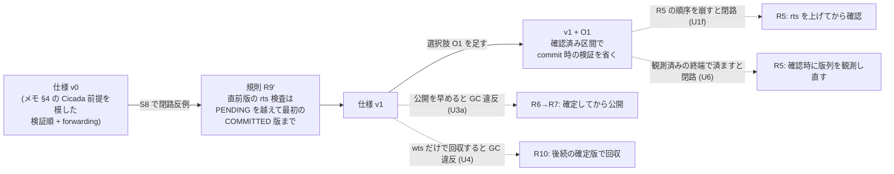
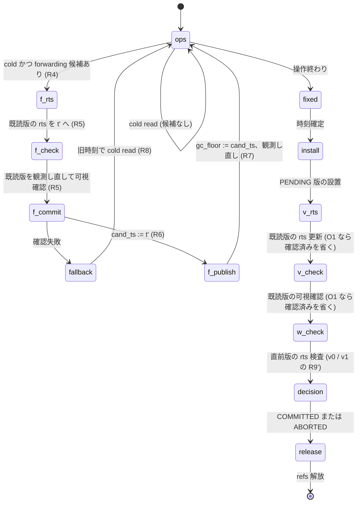

# 選択的 forwarding プロトコルの小さいモデルと割り込みの全探索 (VHash 論文 出典メモ §29 段階 2)

- 着手: 2026-09-29 (dev-wave `dev-wave-vhash-forwarding-model`、背景 job、ユーザー就寝中)
- 依頼: `/work/1/SFC/tanab/tmp/vhash-2026-09-29/md_4.txt` (並行 VHash wave の md_4)
- 実装: `tools/vhash_forwarding_model/` (model・judge・scenarios・cli) と `orchestrator/tests/test_vhash_forwarding_model.py`。実装 commit は本 README と同じ branch の「VHash forwarding 小モデル」3 commit (最後が fix5〜7 統合、その後に CLI の fix8)
- 出典メモ: `docs/paper-story-vhash/source-memo-2026-09-29.md` (構想の記録であり一次資料ではない)。本資料の「メモ §N」はこの file の節番号。本 wave の着手時点と記録時点では同 directory が local main に未着地で、同じ中身の複製 `/work/1/SFC/tanab/tmp/vhash-2026-09-29/docs-snapshot/` を読んだ

## 0. 一目でわかる結論



図の読み方: 実線は「反例が出て規則を足した」流れ、点線は「その規則を 1 つだけ崩した危ない版で反例が出た」= その規則が必要だった、を表す。図は範囲付きの探索結果の要約であり、一般の証明ではない (範囲は §6)。

| 問い (出典メモの「未解決」) | この wave で得たもの (範囲は §6) |
|---|---|
| §13.1 確認してから rts を書くと割り込まれるか | **割り込まれる。** 検証 (U1v) でも forwarding + O1 (U1f+O1) でも閉路反例。rts を先に上げてから確認する順序 (R5・R9) が必要 |
| §13.3 「rts ≥ 候補なら確認を省く」は使えるか | **使えない。** 他 txn が上げた rts を根拠に確認を省く U2 で閉路反例 (3 txn・S9) |
| §14.1 見えている終わりが後から縮むか | **縮む。** 候補選択時に観測した次版時刻で確認を済ませる U6 は、O1 の下で閉路反例。確認時に観測し直す必要 |
| §14 確認済み区間で commit 時の検証を省けるか (O(1) 検証の最小形 O1) | **v1 + O1 は 10 場面すべてで反例なし** (固定場面の範囲内)。ただし R5 の順序と観測し直しが前提 |
| §15.2 GC 保護の公開順序 | 確定 (R6) の前に公開すると GC 違反 (U3a)。確定 → 公開の順 (R7) が必要 |
| §15.3 wts が古い版を一律に回収してよいか | **よくない。** `wts < 下限` で回収すると GC 違反 (U4、2 step)。後続の確定版で回収する R10 が必要 |
| §18.1・§18.2 (forwarding は PENDING 設置前だけ・fallback の可否) | 規則として組み込み (R8)。崩す危ない版は今回作っていない (未検査) |
| 出典メモ §4 の Cicada の前提を模した v0 (原論文は未確認) | **v0 は S8 で閉路反例。** 書き込み側の「直前版だけの rts 検査」が、後で abort しうる PENDING 版に遮られて下の確定版の rts を見落とす |
| §13.4 lock-free 性 | **未主張。** 本モデルは安全性 (serializability と GC 安全) だけを見る。進行保証は扱わない |

## 1. 目的と、何を確かめたか

出典メモ §29 段階 2 は「実装の前に、reader・writer・forwarding・GC の割り込みを小さいモデルで確かめる」とする。この wave は次を行った。

1. プロトコル仕様 v0 を書いた (§2)。
2. 状態空間を全探索する検査器を Python で作った (§3)。判定は 3 つ: J1 依存グラフの閉路 (serializability)、J2 timestamp 順との不一致 (補助)、J3 GC 安全。
3. 必須場面 (md_4 の 7 場面) に 3 場面を足した 10 場面を、v0・v1・v1+O1 と危ない版 8 種で探索した (§4・§5)。
4. v0 の反例から v1 の規則 R9' を足し、規則と反例の対応を表にした (§7)。
5. 検査器が弱くないことを、危ない版の反例 (§5) と、検査器自身への変異検査 (§8) で確かめた。

**確かめていないこと**は §6 にまとめる。とくに「反例なし」は、固定した 10 場面の初期状態から、定義した原子 step の全 interleaving を探索し尽くした、という意味に限る。

## 2. プロトコル仕様 v0 / v1 / O1 (出典メモ §4 の Cicada の前提を模したもの)

Cicada の原論文は本 wave では読んでいない。以下は出典メモ §4 の表 (「validation: pending 版の設置 → read 版の rts 更新 → version consistency check の順」など) を模したモデルであり、Cicada の実装と一致するとは主張しない。

### 2.1 状態

| 持ち主 | 量 | 意味 (メモ §18 の 5 状態との対応) |
|---|---|---|
| transaction | `cand_ts` | 現在の候補時刻 (§18「現在の候補 timestamp」)。forwarding の確定 (R6) でだけ動く |
| transaction | `confirmed` | forwarding で rts を上げてから可視を確認した (版, 時刻) の組 (§18「確認済みの整合性情報」) |
| transaction | `gc_floor` | GC に公開した保護下限 (§18「GC に公開する保護下限」)。初期値は開始時刻 |
| transaction | `refs` | 物理参照を保護中の版 (§18「物理参照の保護状態」) |
| transaction | `fixed` | 時刻確定の印 (§18「timestamp 確定状態」)。PENDING 版の設置前に立てる |
| 版 | `status` | PENDING / COMMITTED / ABORTED |
| 版 | `wts`, `rts` | `rts` は「その時刻で読んだ txn がいる」という reader から writer への制約。**見える区間の終わりとは別の量** (§13.3)。終わりは版列から導くだけで field に持たない |

### 2.2 規則

- **R1 可視規則:** 時刻 ts で key の可視版 = ABORTED を除き wts ≤ ts の最大版。PENDING なら確定を待つ。版 ID は再利用しない。時刻は整数で、初期版・各 txn の候補時刻・forwarding の候補・設置版のあいだで一意 (全到達状態で検査する、§3.3)。
- **R2 通常 read:** 自分の書き込みを先に読む。なければ可視版を 1 step で観測し、hot なら記録。**通常 read は rts を書かない** (メモ §4 の validation 順に合わせた設計選択)。cold で forwarding の対象なら R4 へ。
- **R3 hot:** key ごとに ABORTED を除く版を wts 降順に並べた先頭 K 個。PENDING も数える。
- **R4 forwarding 候補:** hot にある COMMITTED 版のうち wts > cand_ts で最小の h を選び、t' = h.wts + 1 (使用中なら次の空き)。t' で可視な版が h でなければ候補なし (cold read)。
- **R5 forwarding 検証:** 既読版の rts を t' へ上げる (1 版 1 step) → その後に既読版が t' で可視かを、版列を観測し直して確認する (1 版 1 step)。失敗なら旧時刻で cold read (fallback)。
- **R6 forwarding 確定:** `cand_ts := t'`、confirmed へ記録。
- **R7 GC 保護の公開:** R6 の後の別 step で `gc_floor := cand_ts`。その後 key を t' で観測し直して読む (選んだ h を無条件に使わない、§19)。
- **R8 fallback と時期:** R6 前なら旧時刻へ戻れる。R6 後は戻らない。PENDING 設置後は forwarding しない (§18.1)。
- **R9 commit:** 時刻確定 → PENDING 版の設置 (1 key 1 step) → 既読版の rts を確定時刻へ (1 版 1 step) → 既読版の可視確認 (1 版 1 step) → 書き込み key ごとに「直前版」の rts 検査 → 全版の status を 1 step で確定 → refs 解放。**v0 の直前版 = ABORTED を除く wts 未満の最大版 1 つ (PENDING でもよい)。**
- **R10 GC:** 活動中 txn の gc_floor の最小値 B を 1 step で読む。COMMITTED 版 v は、COMMITTED 後続版で wts ≤ B のものがあり、どの refs にも無いときだけ回収する (1 版 1 step)。
- **v1 = v0 + R9':** 直前版の rts 検査を、wts 未満の版を降順にたどって PENDING をすべて越え、最初の COMMITTED 版に至るまでの全版に広げる (§7)。
- **O1 (選択肢):** forwarding の確定で confirmed に入った (版, t') について、確定時刻 = t' なら commit 時の rts 更新と可視確認を省く (メモ §14 の O(1) 検証の最小形)。最後の forwarding の後に読んだ版は省かない。

### 2.3 状態遷移 (1 transaction、値なしの模式)



GC は別 thread として、R10 の「下限を読む」「1 版を回収する」を任意の時点に挟む。

## 3. 検査器

### 3.1 探索

- 状態 (全版と全 txn の局所状態) を不変値で持ち、幅優先で全到達状態を訪れる。状態の正規化 (同一視の緩和) はしない。
- **全遷移を判定する** (既に訪れた状態へ戻る遷移も判定してから捨てる)。J1・J2 は入力 (確定 txn の read log と確定版の集合) が変わる `decide_*` の遷移で、J3 は `reclaim` と回収済み版への接触 `touch_reclaimed` の遷移で判定する。この限定が全遷移での判定と verdict が一致することを test で確かめた (`test_restricted_judgment_matches_every_transition`)。
- 反例は幅優先で最初に見つかった違反までの列 (その場面・その step 定義での最短列)。
- 停止した thread は、以後その thread を選ばない schedule として全探索に含まれる。安全性は途中で閉じた性質なので、明示的な「停止」遷移は足していない。

### 3.2 判定

| 判定 | 内容 | 違反として返すもの |
|---|---|---|
| J1 serializability | 確定 txn と初期版の最終履歴で、key ごとの確定版の wts 順から ww・wr・rw 辺を作り閉路を探す | 閉路の txn 列、辺の種類・key・根拠の版 ID |
| J2 timestamp 順 (補助) | 確定 txn を確定時刻順に並べたとき、読んだ版がその時刻で見えるはずの版と一致するか | txn・key・実際の版・期待の版。**J2 単独の違反は serializability の反例ではない** |
| J3 GC 安全 | 回収の時点で、活動 txn がその版を物理参照中・read log に持つ・今後の外部 read で取りうる時刻 [cand_ts, ∞) のどこかで見える、のいずれかなら違反。回収済み版の metadata に触れる step (read・forwarding・検証・直前版検査) も違反 (use-after-free) | 版 ID・必要とした txn・理由 |

J3 は protocol が公開した `gc_floor` ではなく txn の `cand_ts` を使う (公開値を使うと、公開を早める危ない版 U3a を判定器自身が見逃す)。

### 3.3 モデル自身の不変条件

全到達状態で時刻の一意性 (初期版・各 txn の cand_ts・forwarding 候補・設置版の間で、異なる持ち主が同じ時刻を持たない) を検査し、破れたら探索を例外で止める (判定器の違反とは別扱い)。§9 の偽の反例を受けて足した。

## 4. 場面

| 場面 | 狙い (md_4・出典メモ) | 初期版 | transaction と操作 | K | 場面 witness (割り込みの窓を通ったこと) |
|---|---|---|---|---|---|
| S1 | §29 検証直後に古い時刻の writer が設置 (write skew 形) | A10, B11 | T@70: R A, W B / W@50: R B, W A | 1 | T が A10 を読み検証に入った後に W が A へ設置 |
| S2 | §29 forwarding 中に hot が変わる | A20, B40, B60 | T@45: R A, R B / W@70: W B | 1 | T が選んだ hot 版が、T の確認の時点で hot から外れている |
| S3 | §29 GC 保護の公開途中で止まる | A10, A20, A55, B40, B60 | T@45: R B, R A | 1 | T が確定 (R6) 後・公開 (R7) 前にいる間に GC が下限を読むか回収し、T の旧時刻でだけ見える版が実在する |
| S4 | §29 PENDING 版の commit / abort との競合 | A10, B40, B60 | T@45: R B / W@43: W B | 2 | T の read が W の PENDING 版のために待つ状態を経て W が決定 |
| S5 | §13.1 確認と rts 更新の間の割り込み | A100, B101 | T@130: R A, W B / W@120: R B, W A | 1 | T が検証で rts を更新する途中に W が A へ設置 |
| S6 | §14.1 見えている終わりが縮む | A10, B11, B25 | T@15: R A, R B / W@20: W A | 1 | T の forwarding 候補の後に W が A へ設置 |
| S7 | §15.3 前進後もまだ見える古い版 | A20, B40, B60 | T@45: R A, R B / W@65: W A | 1 | T が前進して公開した後、A20 が T の時刻でまだ見える状態で GC が下限を読む |
| S8 | v0 の書き込み検査 (段 3 相談の予想) | A10, B11 | T@70: R A, W B / W@50: R B, W A / P@40: W A | 1 | W の直前版検査が、直前版が PENDING の状態で実行される |
| S9 | §13.3 rts ≥ 候補で確認を省く (U2 用) | A10, B11 | T@60: R A, W B / W@50: R B, W A / U@80: R A, W A | 1 | 他 txn U が abort した後、T の検証が U2 の省略 step を通る (U2 のときだけ到達しうる) |
| S10 | §13.1・§14.1 を forwarding + O1 で (write skew 形) | A10, B11, B25 | T@15: R A, R B, W B / W@20: R B, W A | 1 | T の forwarding 候補の後、A10 と T の候補時刻の間に W が A へ設置 |

危険結果 witness (危ない版・v0 でだけ到達するはずの結果) を S3・S8 に別に定義した。S3 は「T の旧時刻でだけ見える版 A20 の回収」、S8 は「W の直前版検査が PENDING の P:A だけを見て通り、その後 P が abort し、W が commit」。test で「v1 では未到達、危ない版 (S3 は U3a)・v0 (S8) では到達」を固定した (`test_all_scenario_witnesses_and_v1_bounds`、`test_single_rule_faults_detected_and_replay`、`test_v0_s8_cycle_and_replay`)。CLI の raw でも S3・S8 だけ `danger.reached` を評価し、到達は S3 の U3a と S8 の v0 だけだった (他の場面は `danger: null` = 評価対象外)。

## 5. 結果

親が最終 commit で CLI を全 63 構成について実行した生出力: `raw/` (1 構成 1 JSON、要約は `raw/summary.tsv`)。表の値はその要約から写した。すべての構成で探索は完了した (打ち切りなし)。

### 5.1 場面 × 構成 (J1 / J2 / J3 の違反の有無、訪問状態数)

`0` = 違反なし、`1` = 違反あり。訪問状態数は探索した異なる状態の数。

| 場面 | v0 | v1 | v1 + O1 | U1f + O1 | U6 + O1 |
|---|---|---|---|---|---|
| S1 | 0/0/0, 1,472 | 0/0/0, 1,472 | 0/0/0, 1,472 | 0/0/0, 1,472 | 0/0/0, 1,472 |
| S2 | 0/0/0, 1,704 | 0/0/0, 1,704 | 0/0/0, 1,536 | 0/0/0, 1,536 | 0/0/0, 1,536 |
| S3 | 0/0/0, 180 | 0/0/0, 180 | 0/0/0, 180 | 0/0/0, 180 | 0/0/0, 180 |
| S4 | 0/0/0, 593 | 0/0/0, 593 | 0/0/0, 593 | 0/0/0, 593 | 0/0/0, 593 |
| S5 | 0/0/0, 1,472 | 0/0/0, 1,472 | 0/0/0, 1,472 | 0/0/0, 1,472 | 0/0/0, 1,472 |
| S6 | 0/0/0, 2,468 | 0/0/0, 2,468 | 0/0/0, 2,144 | 0/**1**/0, 2,146 | 0/**1**/0, 1,714 |
| S7 | 0/0/0, 1,720 | 0/0/0, 1,720 | 0/0/0, 1,560 | 0/0/0, 1,560 | 0/0/0, 1,560 |
| S8 | **1/1**/0, 47,448 | 0/0/0, 51,952 | 0/0/0, 51,952 | 0/0/0, 51,952 | 0/0/0, 51,952 |
| S9 | 0/0/0, 112,984 | 0/0/0, 112,984 | 0/0/0, 112,984 | 0/0/0, 112,984 | 0/0/0, 112,984 |
| S10 | 0/0/0, 12,905 | 0/0/0, 12,905 | 0/0/0, 10,607 | **1/1**/0, 10,617 | **1/1**/0, 9,959 |

- 場面 witness は、S9 の U2 以外の全構成 (v0・v1・v1+O1・U1f+O1・U6+O1 の 5 構成) を除き、全構成で到達した。S9 の witness は U2 の省略 step を要求するので、U2 以外では定義上到達しない。
- S6 の U1f+O1・U6+O1 は J2 (timestamp 順の不一致) だけで、J1 閉路にはならない。S6 は T が読むだけ・W が書くだけで相互依存が無く、閉路が原理的に作れない。同じ割り込みを write skew 形にした S10 で J1 閉路が出る。

### 5.2 危ない版 (v1 を土台に 1 規則だけを崩す)

| 危ない版 | 崩した規則 | 場面 | J1/J2/J3, 訪問状態数 | 最短反例列 |
|---|---|---|---|---|
| U1v | 検証で可視確認を先・rts 更新を後 (R9 の順序) | S1 | 1/1/0, 1,472 | 26 step (J1) |
| U1v | 同上 | S5 | 1/1/0, 1,472 | 26 step (J1) |
| U1f | forwarding で可視確認を先・rts 更新を後 (R5 の順序) | S2 / S6 / S10 | 0/0/0 (1,704 / 2,470 / 12,939) | 未検出 (§5.3) |
| U2 | 検証で「自分の更新前に観測した rts ≥ 確定時刻」なら確認を省く | S9 | 1/1/0, 102,256 | 33 step (J1) |
| U3a | 検証前 (候補選択時) に gc_floor を公開 | S3 | 0/0/1, 212 | 3 step (J3) |
| U3b | 読んだ直後に物理参照を外す | S1 | 0/0/1, 1,629 | 18 step (J3) |
| U4 | `wts < 下限` の一律回収 (R10 を崩す) | S7 | 0/0/1, 2,510 | 2 step (J3) |
| U5 | 通常 read の可視選択で PENDING を飛ばす | S4 / S1 | 0/0/0 (961 / 1,472) | 未検出 (§5.3) |
| U6 | forwarding の確認を候補選択時の「次版の時刻」で済ませ観測し直さない | S6 / S10 | 0/0/0 (2,038 / 12,281) | 未検出 (§5.3) |
| U1f + O1 | U1f に加え O1 | S10 | 1/1/0, 10,617 | 39 step (J1) |
| U6 + O1 | U6 に加え O1 | S10 | 1/1/0, 9,959 | 39 step (J1) |

各危ない版の反例について、最短列に崩した step が含まれ、同じ列を最初から再生すると同じ違反になることを test で固定した (`test_single_rule_faults_detected_and_replay`、`test_s9_u2_after_other_reader_aborts`、`test_s10_write_skew_search_results`)。

### 5.3 未検出の危ない版と、その理由

U1f・U5・U6 は O1 なしでは固定場面の範囲内で反例が出なかった。理由は、**commit 時の検証 (R9: rts 更新 → 可視確認) が forwarding 側や通常 read 側の近道の結果を必ずやり直す**ため。各版について「崩した step が実行された後、同じ txn が commit 時の検証で失敗して abort する」実行が到達可能であることを test で固定した (`test_fault_then_failed_commit_validation`)。U5 は可視選択を変える別種の故障で、commit 時の検証が間の版を見て失敗する。

したがって forwarding 側の確認規則 (R5 の順序・観測し直し) は、commit 時の検証を省かない限り serializability には効かない。それが効くのは commit 時の検証を省く O1 を入れたときで、そのとき U1f・U6 は S10 で閉路反例になる (§5.2)。

## 6. 範囲と、確かめていないこと

**探索の母集団:** 下の 10 場面それぞれの固定初期状態 (初期版・txn・操作列・K、各 raw JSON の `population` と `bounds`) から、定義した原子 step の全 interleaving。操作列や初期配置の全組合せ、他の K、途中で入場する txn は含まない。

| 項目 | この wave の範囲 |
|---|---|
| キー数 | 2 (全場面) |
| transaction 数 | 2〜3 (+ GC 1 thread) |
| 操作数 / txn | 1〜3 |
| 初期版数 / キー | 1〜3 |
| hot の幅 K | 1 (S4 だけ 2) |
| 時刻 | 整数、場面ごとの固定値 (raw の `bounds.timestamps`)。全到達状態で一意 |
| 原子性 | 1 step = 1 キーの版列全体の原子的な観測、1 版の 1 field の書き込み、または txn 自身の局所状態の更新 + 高々 1 つの共有書き込み。status の確定だけは 1 txn の全版を 1 step で変える |
| メモリ | 逐次一貫 |

確かめていないこと:

- **弱いメモリモデル**、record 内の観測が原子的でない場合 (メモ §20.4 の一貫した観測)、実ポインタ・slot の再利用 (§20.5 の ABA)。版 ID は再利用しない。
- **固定 snapshot・read-only 専用経路** (§17)。read-only txn はモデル化しておらず、read-only txn が共存して GC 下限を保持するときの回収の進み方は未評価。
- **途中で入場する txn。** 全 txn を初期登録するので GC の下限は単調に増える。GC は下限を読み直すまで回収しない (古い下限で回収しない単純化)。一般の入場時の GC 安全は主張しない。
- **不在キー・insert / delete・range scan** (§20.6)。
- **停止した thread の失効・保護の解除** (§16)。停止は「以後動かない schedule」として安全性の探索に含まれるが、停止 thread が GC 境界を止め続けること (liveness) は測っていない。
- **lock-free 性・進行保証** (§13.4)。未主張。PENDING 版は確定を待つ設計で、deadlock の有無は訪問状態の統計 (`statistics.deadlock`) として raw に出るが、進行性の主張には使わない。
- **Cicada の原論文との一致。** メモ §4 の表を模しただけ。
- **§18.1・§18.2 を崩す危ない版** (PENDING 設置後の forwarding、確定後の fallback) は作っていない。規則として組み込んだだけで、必要性は検査していない。
- **反例列のどの step の確認差が閉路を生んだか**の機械的な帰属。S10 の U1f+O1・U6+O1 について、故障 step の確認結果が故障なしの規則と異なることを比べる補助関数 (`model.py` の `fault_changes_forward_check`) を足したが、焦点再レビューが「既に失敗した txn の差を拾う偽陽性経路がある」と指摘した (should-fix、未修正)。帰属は下の §7.2 のとおり親が反例列を読んで書き、この補助関数の真偽を根拠にしない。
- **性能・C++ 実装。** scope 外 (md_4)。

## 7. 反例と規則の対応

### 7.1 v0 の反例 (S8) と R9'

v0 は S8 で閉路反例 (最短 30 step、`raw/S8-v0-none-base.json`)。親が列を再生して確かめた要点 (`replay_ts.log`):

1. T@70 が A10 を読み、書き込み B を PENDING で設置し、検証で A10 の rts を 70 に上げ、A10 が 70 で見えることを確かめる (step 1〜10)。
2. W@50 が B11 を読む (T の B70 は 50 より後なので見えない) (step 13)。T が commit (step 14)。
3. W が A に版 A50 を PENDING で設置し、検証で B11 が 50 で見えることを確かめる (step 15〜23)。
4. P@40 が A に版 A40 を PENDING で設置する (step 24〜27)。P はこの列では最後まで PENDING のまま。
5. **W の直前版 rts 検査が、直前版 = PENDING の A40 (rts 40 ≤ 50) だけを見て通る** (step 28)。その下の確定版 A10 の rts 70 (T が 70 で読んだ印) は見ない。W が commit (step 30)。
6. 結果: T は A10 を 70 で読んだが A50 (50 < 70) が確定しているので T→W (A の rw)。W は B11 を 50 で読んだが T の B70 が後にあるので W→T (B の rw)。閉路。

v1 の R9' は PENDING の A40 を越えて A10 まで rts を見る (70 > 50) ので W が abort し、S8 は 51,952 状態の全探索で反例なし。**この反例は段 3 の敵対相談 (codex、レンズ A) が静的に予想し、探索で確かめた。**

### 7.2 O1 が要求する規則 (S10)

**U1f + O1** (最短 39 step、`raw/S10-v1-U1f-o1.json`): T@15 が A10 を読む → W@20・T@15 がともに B で forwarding 候補を選ぶ (W は 26、T は 27。時刻は一意) → **T が A10 の可視を先に確認** (step 4、U1f) → W が 26 へ確定し B25 を読み、A に A26 を PENDING で設置 (step 14)、W の直前版検査は A10 の rts がまだ 15 なので通る (step 20) → **T が遅れて A10 の rts を 27 へ上げる** (step 21) → T が 27 へ確定、B に B27 を設置、O1 により A10 の commit 時の確認を省く → 両者 commit。T→W (A)、W→T (B) の閉路。メモ §13.1 の「確認してから rts を書くと、その間に古い時刻の writer が設置できる」そのもの。

**U6 + O1** (最短 39 step、`raw/S10-v1-U6-o1.json`): W が A26 を設置し直前版検査を済ませた後 (step 12・18) に T が A10 の rts を 27 へ上げ (step 19)、**T の確認が候補選択時 (step 3、W の設置前) に観測した「A10 の次版の時刻 = なし」で済み、観測し直さない** (step 21、U6) → O1 で commit 時の確認も省かれ閉路。メモ §14.1 の「見えている終わりは後から縮む」そのもの。

故障なしの v1 + O1 は S10 で 10,607 状態の全探索で反例なし。

### 7.3 規則と反例の対応表

| 規則 | 無いとき (危ない版) | 反例 | 場面 |
|---|---|---|---|
| R9' 直前版検査は PENDING を越える | v0 | J1 閉路、30 step | S8 |
| R9 の順序: rts 更新 → 可視確認 (検証) | U1v | J1 閉路、26 step | S1・S5 |
| R9 の可視確認を rts だけで省かない | U2 | J1 閉路、33 step | S9 |
| R5 の順序: rts 更新 → 可視確認 (forwarding) | U1f | O1 なしでは未検出、O1 ありで J1 閉路 39 step | S10 |
| R5 の観測し直し (観測済みの終端を使わない) | U6 | O1 なしでは未検出、O1 ありで J1 閉路 39 step | S10 |
| R6 → R7 の順: 確定してから公開 | U3a | J3、3 step | S3 |
| refs は参照の終わりまで保持 | U3b | J3、18 step | S1 |
| R10 後続の確定版で回収 | U4 | J3、2 step | S7 |
| R1 PENDING を飛ばさず待つ | U5 | 未検出 (commit 時の検証が遮る) | S4・S1 |

## 8. 検査器が弱くないことの確認

- **危ない版:** 8 種のうち 5 種 (U1v・U2・U3a・U3b・U4) が単独で反例、2 種 (U1f・U6) が O1 と組んで反例。残る U5 は commit 時の検証が遮ることを abort の実行で示した (§5.3)。
- **判定器の手作り正例・負例:** J1 (閉路あり / なし)、J3 (前進後も見える A20 の回収 / 後続確定後の回収、前進後に初めて見える版の回収)。
- **検査器自身への変異 (login 自走、最終 commit の写しに 1 つずつ注入して test 関数を直接呼ぶ):** 11 種中 10 種が KILLED、1 種が SURVIVED (予想どおり)。生出力 `mutation/selfrun-results.json`。

| 変異 | 内容 | 結果 | 赤になった test (抜粋) |
|---|---|---|---|
| MU1 | J1 の rw 辺を落とす | KILLED | J1 手作り正例を含む計 5 本 |
| MU2 | J3 の将来必要判定を常に偽 | KILLED | J3 手作り正例を含む計 3 本 |
| MU3 | 通常 read で PENDING を飛ばす | KILLED | `test_s4_pending_blocks_read` の 1 本だけ |
| MU4 | gc_floor の公開を候補選択時へ | KILLED | 4 本 |
| MU5 | 回収条件を `wts < 下限` へ | KILLED | 5 本 |
| MU6 | 探索が各状態で最初の step だけを展開 | KILLED | 8 本 |
| MU7 | 新状態への遷移でしか判定しない | KILLED | `test_reclaimed_touch_is_j3_even_on_same_state` の 1 本だけ |
| MU8 | J3 の将来必要判定に `wts ≤ cand_ts` を戻す | KILLED | `test_j3_future_forward_version` の 1 本だけ |
| MU9 | O1 の「確定時刻 = t'」条件を外す | SURVIVED | なし。forwarding のたびに既読版をすべて新しい時刻で確認し直すので、到達状態では confirmed の版は常に最終時刻で確認済みになり、条件を外しても挙動が変わらない (焦点再レビューが静的に同じ結論)。等価変異として扱う |
| MU10a | 空き時刻の計算から他 txn の候補時刻を外す | KILLED | `test_s10_write_skew_search_results` (時刻衝突で停止) |
| MU10b | 時刻一意性の検査を外す | KILLED | `test_s10_old_target_allocation_violates_timestamp_uniqueness` の 1 本だけ |

計算ノードでの変異本走 (`tools/mutation_worktree.py`、`--runner-mode dispatch`、spec sha256 `ec943592…`、実装 commit 7cf165a41 の独立 clone) でも **11 変異すべてが事前登録どおり** (KILLED 10、SURVIVED 1 = MU9、MISMATCH 0)。KILLED の赤 node は自走の期待 node の完全集合と一致した。生出力 `mutation/mutation-final-results.json` と `mutation/mutation-final-attempts.json`。

## 9. 途中で見つかったモデル自身の欠陥 (偽の反例)

fix3 の時点で、v1 + O1 が S10 で閉路反例 (39 step) を出した。親が列を読むと、**T と W が forwarding 後にともに時刻 26 を使っていた。** 空き時刻の計算が、他 txn が forwarding 候補として選んでまだ確定していない時刻を「使用中」に数えず、2 txn が同じ時刻を選べた (仕様 R1 の一意性に反するモデルの欠陥)。修正 (候補時刻を使用中に数える + 全到達状態の一意性検査) の後、v1 + O1 の反例は消え、変わったのは S10 の 7 構成だけだった (いずれも旧列の step 7 で時刻が重複していたことを確認)。U1f+O1・U6+O1 の反例は修正後も残った。

この件から、**反例は列の中身 (時刻と持ち主) を読んでから結論にする**。初期状態だけで一意性を assert する設計は、並行して時刻を選ぶ操作を持つモデルでは足りない。

## 10. 再現

```bash
# wave の最終 commit で (tools/ は package ではないので script として起動する)
python3 tools/vhash_forwarding_model/cli.py --out /tmp/s8-v0.json --scenario S8 --protocol v0
python3 tools/vhash_forwarding_model/cli.py --out /tmp/s10-u1f-o1.json --scenario S10 --protocol v1 --fault U1f --o1
# test (Pegasus login では tools/run_tests.py 経由)
python3 tools/run_tests.py -q orchestrator/tests/test_vhash_forwarding_model.py
```

全 63 構成の一括実行に使った親の runner は job dir の `run_all.py` (repo 外)。本資料の `raw/` はその出力の複製。

## 11. 実走の記録

- test: 新 test file の 17 件を login の bounded local 経路で pytest 実走し全件成功 (6.63 秒、最大 3.49 秒の S10 探索)。収集設定メタテストと合わせた焦点走 92 件も成功 (fix1〜4 統合時点)。
- CLI 全 63 構成: 親が 3 回 (fix1〜4 統合後、fix5〜7 統合後、fix8 後) 実行した。1 回目と 2 回目の差は S10 の訪問状態数 7 行の +18 だけ (fix6 で txn に「選んだ hot 版 ID」を足したため。裁定済み)。2 回目と 3 回目は J1/J2/J3・訪問状態数・完了・witness が全行一致し、3 回目で危険結果 witness が評価されるようになった。`raw/` は 3 回目の出力。
- 変異の login 自走: 実装の最終 commit で 1 回 (その前の commit でも 1 回、結果は全件同じ)。`mutation/selfrun-results.json`。
- 変異の dispatch 本走: 2026-09-29 05:46〜07:16 JST (attempts file の開始・終了時刻)。collection・baseline・変異 11 の計 13 request (33843, 33886, 33888, 33890〜33892, 33931, 33936, 33948, 33949, 33953, 33961, 33962)。所要の大半は計算ノードの queue 待ち。wrapper rc=0、summary は KILLED 10・SURVIVED 1・MISMATCH 0・matching 11。
- 受入全走: この記録の時点で未実施 (記録 commit の後に land 対象 tip で走らせる)。

## 12. 次の一手 (次の版の論文ストーリーと C++ 試作への含意)

- C++ 試作 (md_6) へ持ち込む候補規則: **R9' (直前版検査は PENDING を越えて最初の確定版まで)**・**R5 (rts を上げてから、版列を観測し直して確認)**・**R6 → R7 (確定してから GC 公開)**・**R10 (後続の確定版で回収)**。本モデル (固定 10 場面、逐次一貫、定義した原子 step、途中入場なし) では、どれを 1 つ崩しても反例が出た (R5 の 2 条件は O1 を入れたとき)。実装での必要十分性は、試作の正しさ検査 (md_3 の検査器など) で別途確かめる。
- v0 の反例 (S8) が Cicada 本体にも当てはまるかは、Cicada の原論文と実装の書き込み検査を確かめるまで分からない。Cicada の正しさ検査の整備 (md_3) と合わせて確かめる価値がある。
- 範囲を広げる候補: K=2 の場面を増やす、途中入場する txn と read-only txn の共存、§18.1・§18.2 を崩す危ない版、操作列の自動生成 (場面の手作りをやめる)。
