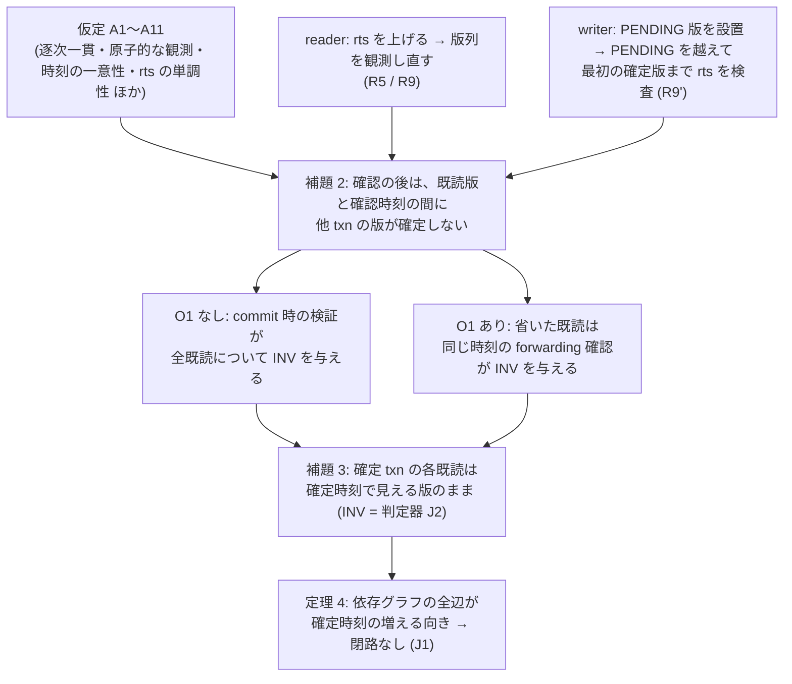
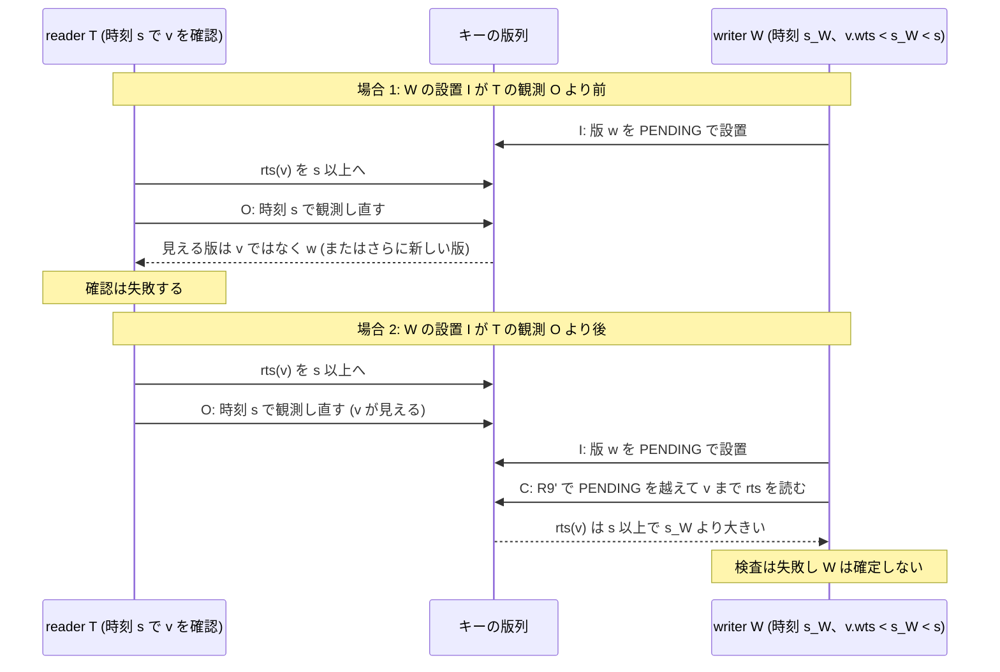

# 選択的 forwarding の中核規則が直列化可能性を守ることの一般の論証 (VHash 論文、md_13)

- 着手: 2026-09-29 (dev-wave `dev-wave-vhash-forwarding-proof`、背景 job)
- 依頼: `/work/1/SFC/tanab/tmp/vhash-2026-09-29/md_13.txt` (並行 VHash wave の md_13、投げ直し分)
- 土台: md_4 の小モデルと一次資料 `output/insights/2026-09-29/vhash-forwarding-model/README.md` (以下「md_4 資料」、設計判断 D2282)。本資料の R1〜R10・R9'・O1・S1〜S10・U1v〜U6 はそちらの定義
- 参照: md_8 `output/insights/2026-09-29/vhash-cicada-rts-check/README.md` (以下「md_8 資料」)、md_10 `output/insights/2026-09-29/vhash-gc-connection-model/README.md` (以下「md_10 資料」、D2290)、md_6 `output/insights/2026-09-29/vhash-forwarding-prototype/README.md` §2 (以下「md_6 資料」、D2287)
- 出典メモ: `docs/paper-story-vhash/source-memo-2026-09-29.md` (構想の記録であり一次資料ではない)。「メモ §N」はこの file の節番号
- 新規の計測・探索・実装はしていない。本資料は紙の上の論証と、既存の一次資料との照合だけである

## 0. 結論

**定理 (論文用の一文):** 固定したキー集合への point read / update だけを行い、逐次一貫なメモリと md_4 の原子性 (1 step = 1 キーの版列全体の原子的な観測、または 1 field の書き込み) の下で、md_4 仕様 v1 (R9' を含む) に従う txn について、commit 時の検証 (R9) を通って確定した txn — O1 を使う場合は、省いた既読を確定時刻と同じ時刻の forwarding 確認 (R5) で確かめた txn — の依存グラフ (ww = 同じキーへの書き込みの前後、wr = 書いた版を後の txn が読む、rw = 読んだ版を後の txn が上書きする) は閉路を持たず、確定時刻の順がそのまま直列化の順になる。ただし §2 の仮定 A1〜A11 (時刻の一意性、rts の単調性、検査が触れる版が論理的に回収されていないこと など) を前提とする。

md_4 は「固定 10 場面で反例なし」だった。本資料はそれを場面に依らない形に上げる。論証の芯は 2 つの順序の組み合わせである。

- **reader 側:** 既読版の rts を時刻 s まで上げて**から**、版列を観測し直して、その版が s で見えることを確かめる (R5・R9)。
- **writer 側:** 自分の PENDING 版を設置して**から**、その下の版を降順にたどり、PENDING を越えて最初の COMMITTED 版まで、通った版の rts が自分の時刻以下かを調べる (R9')。

並行する writer がどちらの順で割り込んでも、reader の観測か writer の検査のどちらかが相手を見る (§4 補題 2)。これで「確定した txn が読んだ版は、確定時刻でも見える版のまま」という不変条件 INV が成り立ち (補題 3)、INV から依存グラフの全辺が確定時刻の増える向きになる (定理 4)。

| md_13 の問い | 本資料の答え (範囲は §1、仮定は §2) |
|---|---|
| (a) 前進後も既読の版がその時刻で見え続ける条件 | 「rts を前進先の時刻以上にした**後**に、版列を観測し直して見えることを確かめた」こと。これが成り立てば、以後その区間に他 txn の版は確定しない (補題 2)。観測し直しを省く (U2、U6) か、観測を rts 更新の前に置く (U1v、U1f) と成り立たない |
| (b) rts の更新と再確認の順序が過去への割り込みを防ぐこと | 補題 2。writer が先に設置すれば reader の観測が見つける。reader が先に観測すれば、その前に上げた rts を writer の R9' が見つける。境界の「rts = writer の時刻」は時刻の一意性が除く |
| (c) 書き込み側の R9' と合わせて閉路ができないこと | 定理 4。ww・wr・rw の全辺で確定時刻が真に増える |
| md_8 と md_10 のどちらを前提に入れるか | **どちらも定理の前提に入れない。** 定理は md_4 の R9' に固定する。Cicada の「PENDING を待つ」検査は別の条件 W* を置いた補題 2′ (§5) で扱い、Cicada 実装が W* を満たすかは後で確かめる項目とする。md_10 の SP は手順の対応 (G2 = R5、G3 = R6) だけを述べ、GC 接続は未主張 |
| Cicada の実装は正しいか | **主張しない。** md_6・md_8 の結果で後から確かめる項目を §7 に挙げる |

## 1. 範囲

**主張する範囲 (出典メモ §25 の構成 C に当たる):**

- forwarding だけを足した構成。物理的な hot 領域の有無は問わない (証明は forwarding の発火条件と前進先の選び方を使わない、§4 系 5)。GC の保護は変えない (floor は開始時刻のまま)。
- point read / update だけ。既存キーだけを対象にする。
- 書き込み 0 の txn も、共通の commit 経路 (R9) を通るなら含む (md_4 の S2・S6・S7 の T はこの形)。
- 逐次一貫なメモリ。md_4 と同じ原子性。
- 仕様 v1 (R1〜R10、R9')。O1 はあり・なしの両方。

**主張しない範囲:** §8 の一覧。とくに範囲読み取り・挿入・削除、弱いメモリ、lock-free 性・進行保証、GC 接続 (md_10 の G4〜G7)、Cicada と md_6 試作の実装の正しさ。

## 2. 前提

### 2.1 仕様 v1 の要約 (md_4 資料 §2.2 から、論証に使う部分だけ)

- **R1 可視:** 時刻 s でキー x の可視版 = ABORTED を除き wts ≤ s の最大版。
- **R2 読み:** 可視版が COMMITTED のときだけ読む (他 txn の PENDING なら待つ)。通常の読みは rts を書かない。自分が先に書いたキーは自分の buffer から読む。
- **R5 forwarding の確認:** 既読版すべての rts を前進先 t' へ上げ (max)、その後に版列を観測し直して、各既読版が t' で見えるか確かめる。他 txn の PENDING が可視の位置にあれば失敗。失敗なら旧時刻に戻る。
- **R6 確定:** 全部成功したら `cand_ts := t'`、(版, t') を確認済みに記録。
- **R8:** PENDING 版の設置後・時刻確定後は forwarding しない。
- **R9 commit:** 時刻確定 → PENDING 版を wts = 確定時刻で設置 → 既読版の rts を確定時刻へ → 既読版の可視確認 (自分の PENDING 版は除いて判定) → 書き込みキーごとの R9' → 全版の status を 1 step で COMMITTED か ABORTED へ。
- **R9':** 自分の版より wts が小さい版を降順にたどり、ABORTED は除き、PENDING をすべて越えて最初の COMMITTED 版まで、通った全版の rts ≤ 自分の時刻 を要求する。
- **O1:** 確認済みに (v, 確定時刻) がある既読 v について、commit 時の rts 更新と可視確認を省く。最後の forwarding の後に読んだ版は省かない。

### 2.2 仮定

「モデル」は md_4 の `tools/vhash_forwarding_model/model.py` (行番号は本 wave の着手時 main 035fc11fa の版)。「Cicada / 試作」欄は、実装で同じことが成り立つかを本資料では確かめていないことを示す。

| 番号 | 仮定 | 証明のどこで使うか | モデルでの成立 | Cicada / md_6 試作 (未確認) |
|---|---|---|---|---|
| A1 | 逐次一貫。共有操作は 1 つの全順序に並ぶ。1 step で 1 キーの版列全体を原子的に観測できる。R9' の走査は 1 キー 1 step。status の確定は 1 txn の全版を 1 step で変える | 補題 2 の場合分け (観測と設置の前後) | 状態遷移系そのもの (1 遷移 = 1 step)。版列の観測 `visible` (144 行)・`_validation_visible` (151 行)、R9' の走査 (364〜375 行)、確定 (376 行) | 版列の走査は非原子的、記憶順序は acquire / release。md_8 資料 §5 は読み手と書き手の相互見落とし (store-buffer 形) を未検証とする |
| A2 | 時刻の一意性: 異なる txn は同じ時刻を持たない (確定時刻・前進先・初期版の wts の間で) | 補題 2 の `rts ≤ s_W` の等号の除外、定理 4 の真の増加 | `_next_free` (169 行) が使用中の時刻を避け、`check_timestamp_uniqueness` (98 行) が全到達状態で検査 | Cicada は下位 8 bit の thread id で区別。md_6 資料 §2 は、stock の時刻生成が abort 後に同じ値を返しうるとコード読みで記す (未実測) |
| A3 | 版 ID は再利用しない。版の key・wts・作成者は設置後に変わらない。確定時刻は PENDING 版の設置より前に固まり、以後 forwarding しない (R8) | 設置版の wts = 作成者の確定時刻 (定理 4) | 設置は `Version(vid, key, t.cand_ts, …)` (331 行)、forwarding は `not t.pending and not t.fixed` のときだけ (233 行) | 試作は前進時に未設置版の wts を書き換え、前進は read 相だけ (D2287)。版の再利用・ABA は未確認 |
| A4 | 読みは COMMITTED 版だけを返し、その版を既読記録に残す | INV の「既読版は確定版」、補題 2 で v が COMMITTED | `_read` は `status != "COMMITTED"` なら進まない (194 行) | Cicada は PENDING を待つ (md_8 資料 §2)。試作の全読み経路は未確認 |
| A5 | reader の確認は「既読版の rts を s 以上にする → その後に版列を観測し直し、他 txn の非 ABORTED 版を含めて可視版を選ぶ」の順。失敗した確認は確認済みにしない | 補題 2 | forwarding: rts 更新 (274 行) の全版の後に観測 (267 行)。commit: rts 更新 (355 行) の全版の後に観測 (350 行)。確認済みの記録は確定時だけ (282 行) | Cicada の validation は同じ順 (md_8 資料 §2 の表)。実機の記憶順序は未確認 |
| A6 | writer の検査は R9' (§2.1) | 補題 2 | 364〜375 行 (`protocol == "v0"` 以外は最初の COMMITTED まで進む、370 行) | **Cicada は R9' ではない** (PENDING を待つ)。§5 の W* で別に扱う |
| A7 | rts は max で更新され減らない。失敗・abort した txn が上げた rts も残る | 補題 2 (印が消えない) | `max(v.rts, …)` (274・355 行) | 実装の CAS と、回収・再利用をまたぐ印の保存は未確認 |
| A8 | O1 で省くのは、確定時刻と同じ時刻で A5 の確認を終えた既読だけ | 補題 3 (O1 あり) | `(vid, t.cand_ts) not in t.confirmed` の既読だけを検証から外す (338〜339 行)。確認済みへの記録は forwarding の確定時 (282 行) | 試作は O1 を採らない (D2287) |
| A9 | **論理的な保持:** 補題 2 が扱う版は版列に残り (回収も除去もされていない)、観測・走査の対象になる。具体的には、T が読んだ版 v は観測 O と R9' の検査 C の時点で残る。後に確定する他 txn の版 w は、その設置 I が O より前の場合に限り、O の時点で残る | 補題 2 場合 1 (O が w を見る)・場合 2 (W の走査が v に届く) | 版は `State.versions` から外れず (回収は印を付けるだけ)、走査は版列全体から選ぶ (139〜141・364 行)。回収済み版に触れる step はモデル上の違反 (J3) として数え、v1 の全構成で J3 違反 0 (md_4 資料 §5.1)。**これは観察であって A9 の証明ではない** | 物理的な走査保護 (epoch 等) と、回収で版を版列から外す実装は別の仕組みで、本資料の範囲外 |
| A10 | txn は有限の固定操作列を持ち、途中で入場しない | 補題・定理の順序の議論には使わない。A9 が破れうる状況の説明 (§8 の注) にだけ関わる | 全 txn を初期状態に登録 (md_4 資料 §6) | 実システムは txn が随時入場する |
| A11 | txn が設置する版の status は PENDING → COMMITTED または PENDING → ABORTED の一方向にだけ変わり、COMMITTED と ABORTED は二度と変わらない (吸収状態)。初期版は最初から COMMITTED で変わらない | 補題 2 の (★) と場合 1 | 設置は PENDING (331 行)、確定は自分の PENDING 版だけを 1 回変える (376〜380 行)。他に status を書く遷移は無い。初期版は status の既定値 COMMITTED で作られる (`model.py` 26 行、`scenarios.py` 12 行) | Cicada の status 遷移 (DELETED を含む) との対応は未確認 |

### 2.3 仮定が効く状況がモデルの場面に現れる例

仮定はモデルの規則として組み込まれているので、全 10 場面で成り立つ (各仮定の根拠行は §2.2)。下の表は、仮定が効く状況のうち、場面の中に実際に現れるものの例を md_4 資料 §4 の場面表から挙げたもので、全仮定を場面で試したという意味ではない。

| 仮定・状況 | 現れる場面 (md_4 資料 §4) |
|---|---|
| A2: 2 txn が並行に前進先を選ぶ | S10 (W と T がともに B で forwarding 候補を選ぶ。md_4 資料 §7.2) |
| A6: R9' が PENDING を越える | S8 (P の PENDING 版 A40 の下に A10) |
| 自分の版の除外 (read-modify-write) | S10 (T が B を読み B を書く) |
| 書き込み 0 の txn | S2・S6・S7 の T |
| O1 で commit 時の検証を省く経路 | S2・S6・S7・S10 の v1+O1 (訪問状態数が v1 と異なる行。md_4 資料 §5.1) |
| A10 の外 (途中入場) | どの場面にも無い |

## 3. 定義

- **確定時刻** s_T: txn T が時刻確定 (R9 の最初) で固めた `cand_ts`。T の設置版の wts はすべて s_T (A3)。
- **確定版:** status が COMMITTED の版。status の遷移は PENDING → COMMITTED または PENDING → ABORTED だけで、**COMMITTED と ABORTED は二度と変わらない** (吸収状態)。
- **既読:** T が R2 で読んだ (キー x, 版 v) の組。自分の buffer からの読みは含めない。
- **不変条件 INV (T について):** T の各既読 (x, v) について、T 以外の txn の確定版 u で v.wts < u.wts ≤ s_T を満たすものが無い。md_4 の判定器 J2 (`judge.py` の `j2`、自分の版を除いた「確定時刻で見えるはずの版」と既読版の一致) と同じ内容である。
- **依存グラフ:** 頂点は確定した txn。初期版はそれぞれ「読みを持たず、時刻 = その版の wts で確定した擬似 txn」とみなす。辺の作り方は md_4 の J1 (`judge.py` の `j1`) と同じだが、J1 は両端が確定 txn の辺だけを作り初期版の作成者を頂点にしない。本資料はそれに初期版の擬似 txn に出入りする辺を加えたグラフで定理を述べる (辺が多い方で閉路が無ければ、J1 のグラフにも閉路は無い):
  - ww: 同じキーの確定版を wts 順に並べ、前の版の作成者 → 後の版の作成者
  - wr: T が読んだ版 v の作成者 → T
  - rw: T が読んだ版 v より wts が大きい、同じキーのすべての確定版 u について T → u の作成者

## 4. 補題と証明

### 補題 1 (確認の意味)

T が時刻 s で版 v の確認 (A5 の観測) に成功したなら、その観測の時点で、v.wts < u.wts ≤ s を満たす他 txn の版 u で ABORTED でないもの (PENDING も COMMITTED も) は版列に無い。

**証明:** 観測は ABORTED を除いた wts ≤ s の最大版を選び (R1)、それが v であることを確かめる。自分の PENDING 版は除く (commit 時の検証、151 行)。forwarding の確認の時点では自分の版はまだ無い (R8)。したがって v より上で s 以下に、他 txn の非 ABORTED 版は無い。□

これは観測規則の言い換えであり、観測の**後**に何が起きるかは言わない。実質は補題 2 にある。

### 補題 2 (確認の後の、過去への割り込みの排除)

T が版 v について「rts(v) ≥ s にする → その後に時刻 s で観測し直して v を確認」に成功したとする (A5)。このとき、この確認 (観測 O) の成功より後のどの到達状態でも、v.wts < u.wts ≤ s を満たす他 txn の確定版 u は存在しない。

**証明:** O より後のある到達状態 Σ に、そのような確定版があったとする。Σ で確定している版のうち wts ∈ (v.wts, s] のものの中で **wts が最小のもの** を w、その作成者を W とする。s_W = w.wts (A3) で、W ≠ T。A2 から s_W ≠ s なので v.wts < s_W < s。

まず次の事実を使う。**(★) v.wts < x.wts < s_W を満たす版 x は、Σ 以前のどの時点でも COMMITTED ではない。** Σ で COMMITTED なら w の最小性に反し、Σ より前に COMMITTED なら吸収状態 (A11) なので Σ でも COMMITTED だからである。

T の観測を O、W の設置 (w を版列に置く step) を I とする。A1 により O と I は全順序のどちらかに並ぶ。

- **場合 1: I が O より前。** O の時点で w は版列にあり (A9)、ABORTED ではない (w は O より後の Σ で COMMITTED なので、A11 により O の時点で ABORTED ではありえない)。v.wts < w.wts ≤ s なので、補題 1 に反し、O は失敗する。矛盾。
- **場合 2: I が O より後。** W の R9' 検査を C とする。R9 の順序で C は I より後、したがって O より後、したがって T の rts 更新より後である。C は w より wts の小さい版を降順にたどる。(★) により、v より上の版は C の時点で COMMITTED ではないので、C はそれらを越える (ABORTED は除かれ、PENDING は rts を見て越える。越える前にその PENDING 版の rts で失敗するなら、W はそこで ABORTED になり、結論は同じ)。v は C の時点で COMMITTED であり (A4: T が読んだ時点で COMMITTED、A11)、版列に残って走査の対象になる (A9)。したがって C は v に届き、v の rts を見る。A7 により rts(v) ≥ s > s_W なので、`rts ≤ s_W` を満たさず W の検査は失敗し、W は ABORTED になる。w が Σ で COMMITTED であることに矛盾。□

2 つの場合の順序 (値なしの模式。縦は全順序の時間)。場合 1 の条件は「I が O より前」だけで、I と T の rts 更新の前後は任意 (図はその一例)。場合 2 では rts 更新 → O → I → C の順が証明から決まる:

**証明が使ったもの:** 場合 1 は「観測が rts 更新の後にある」ことを使わない。場合 2 は「rts 更新 → 観測」の順 (観測より後の設置は rts 更新より後) と、「設置 → R9' 検査」の順と、R9' が PENDING を越えることと、rts の単調性を使う。w を最小に取ることで、W の検査と W の確定の間に別の writer が確定する場合も含めて、帰納法なしに閉じる。

**境界の等号:** s_W = s を許すと、場合 2 で rts(v) = s = s_W となり R9' の `rts ≤ s_W` を通ってしまう。A2 はここで効く。md_4 資料 §9 の旧モデルの列は、T と W がともに時刻 26 を使い閉路になった列である (モデルの時刻割り当ての欠陥として除いた列であり、危ない版として登録・再生したものではない。failures F1060)。

### 補題 3 (確定 txn の不変条件)

T が確定 (status = COMMITTED) したなら、T について INV が成り立つ。

**証明:** T の既読 (x, v) を 1 つ取る。v.wts ≤ s_T は、T が読んだ時の時刻 ≤ s_T (forwarding は時刻を増やすだけ、R6) と、読んだ時に v が見えていたこと (R1) から従う。次の 2 つの場合がある。

- **O1 を使わない既読 (O1 なしでは全既読):** T の commit は R9 で rts(v) を s_T へ上げ、その後に s_T で観測し直して v を確認し、成功しないと確定しない。補題 2 を s = s_T で適用すると INV が従う。
- **O1 で省いた既読:** A8 により、確認済みに (v, s_T) がある。これは確定時刻と同じ時刻 s_T で R5 の「rts 更新 → 観測し直し」に成功したことを意味する (確認済みには成功した確認だけが記録される、282 行)。補題 2 を s = s_T で適用すると INV が従う。確認を終えた時点と T の確定の間に何が起きても、補題 2 は「確認の成功より後のどの到達状態でも」を言い、T が確定した状態はその確認より後にあるので足りる (O1 なしの場合も同じ)。□

### 定理 4 (閉路なし)

どの到達状態でも、確定した txn (と初期版の擬似 txn) の依存グラフは閉路を持たない。確定時刻の昇順は直列化の順を与える。

**証明:** 全辺で始点の確定時刻 < 終点の確定時刻 を示す。

- **ww:** 同じキーの確定版 a, b で a.wts < b.wts。作成者の確定時刻は wts に等しい (A3) ので増える。
- **wr:** U の版 v を T が読んだ (U ≠ T)。v.wts ≤ s_T (補題 3 の証明の最初) で、A2 から s_U = v.wts ≠ s_T なので s_U < s_T。
- **rw:** T が版 v を読み、同じキーの確定版 u が u.wts > v.wts を満たし、その作成者を U ≠ T とする。INV (補題 3) により u.wts ≤ s_T はありえないので、s_T < u.wts = s_U。

どの辺でも確定時刻が真に増えるので、有限の閉路は作れない。確定時刻の順に並べた直列実行では、各 txn は自分の時刻より前の最新の確定版を読む (INV) ので、読んだ値も同じになる。□

### 系と備考

**系 5 (発火の契機・前進先の選び方からの独立):** 補題 1〜定理 4 は、forwarding をいつ発火させるか (R4 の hot / cold の判定、出典メモ §25 の論理的な K 境界、md_10 の GC 圧力) も、前進先 t' の選び方 (R4 の「hot の最小 wts + 1」) も使わない。使うのは t' が A2 を満たすことと、確定が R5 の確認の成功後であること (R6) だけである。したがって、定理は物理的な hot 領域を持たない構成 C の論理的な発火条件にも当てはまる。md_10 の SP については、その確認 G2 と確定 G3 が R5・R6 と同じ手順 (md_10 資料 §2) なので、**確認と確定の部分に限って**同じ議論が通る。SP 全体 (公開 G4・回収 G5・fallback G6・発火 G7) と GC 接続の安全性は本定理から出ず、md_10 の結果も固定 6 場面の探索である。

**系 6 (O1 なしでは forwarding 側の確認は定理に不要):** O1 を使わないとき、補題 3 は commit 時の検証 (R9) だけから INV を得ており、forwarding の確認 (R5) の順序も観測し直しも使っていない。ここから、md_4 の U1f・U6 (forwarding 側の確認規則を崩す) が O1 なしで未検出だったこと (md_4 資料 §5.3) の説明がつく: 崩しても、全既読を正しい順序で検証し直して失敗したら abort する commit 経路が残る限り、確定した txn の INV は変わらない。U5 (通常の読みで PENDING を飛ばす) も、O1 なしでは読みの選び方が補題 3 に入らない。U5 は A4 (COMMITTED だけを読む) は満たし、読む版の選び方だけを変える故障で、INV を与えるのは commit 時の検証だからである。**これは「全既読を最終時刻で検証する」という条件のもとでの定理であって、md_4 の未検出という観察を一般化したものではない。** O1 を入れると補題 3 の第 2 の場合が forwarding 側の確認に依存し、U1f・U6 が S10 で閉路反例になる (md_4 資料 §7.2) こととも整合する。md_6 の試作 (D2287) は O1 を採らず、stock の validation を最終時刻で走らせることを最終保証にする設計で、系 6 はこの設計の狙いを説明する。ただし試作の stock validation が A1・A2・A5・A6 を実装上満たすことまでは、本資料は示さない (§7)。

**備考 7 (rts を誰が上げたかは問わない — 未検査の含意):** 補題 2 の場合 2 が使うのは「観測 O の時点で rts(v) ≥ s が既に成り立っている」ことだけで、その rts を T 自身が上げたかは使わない。したがって「rts(v) ≥ s を読んだ後に、観測し直して v を確かめる」なら、自分で rts を書かなくても補題 2 は成り立つ。一方、md_4 の U2 は「rts ≥ 確定時刻なら観測し直しを**省く**」故障で、観測 O そのものが無いので場合 1 (観測より前の設置) を捕まえられず、S9 で閉路反例になった (md_4 資料 §5.2)。区別は「観測し直しを省くか」にある。**この含意 (自分の rts 書き込みの省略) は、モデルで検査していない。** 出典メモ §14.2 の「reader の仕事と writer の仕事の差」を議論するときの候補として記すにとどめる。

## 5. Cicada 型の「PENDING を待つ」書き込み検査 (補題 2′、条件付き)

md_8 資料 §2 によると、Cicada (原論文 §3.2・§3.4、CCBench `transaction.cc:576-593`) の書き込み検査は R9' と違い、**PENDING に当たるとその確定を待ち**、ABORTED を飛ばして、最初の COMMITTED 版の rts だけを見る (最初に着いた版が DELETED なら検査は失敗する。本資料の範囲は削除を含まないので、この分岐は使わない)。これは A6 を満たさないので、定理 4 は Cicada 型の検査にそのままは当てはまらない。そこで、待つ型の検査について次の条件を置く。

**条件 W*:** writer W の書き込み検査 C は、W の設置の後に始まり、w より wts の小さい版を降順にたどる。走査中に、すでに通り過ぎた位置へ置かれた版は見落としてよいが、W の設置より前から版列にある版は必ず順に訪れる。訪れた各版について、その時点の status を観測し、COMMITTED でなければ (PENDING なら確定するまで待ったうえで**改めて status を観測し**、ABORTED なら) 次の版へ進む。最初に COMMITTED と観測した版 u で止まり、**その時点で** rts(u) を読み、rts(u) ≤ s_W を要求する。

**補題 2′:** A6 を W* に置き換えても (A1 の「R9' の走査は 1 step」を外し、走査の各観測を別 step としてよい)、補題 2 は成り立つ。

**証明:** 場合 1 は writer の検査を使わないので同じ。場合 2: (★) により、v より上の版は C のどの時点でも COMMITTED ではない。W* はそれらのどれでも止まらない (PENDING なら待ち、決着は ABORTED しかありえない。PENDING のまま決着しなければ C は終わらず、W は確定しない)。C の走査中に v と w の間へ新しい版が置かれても、(★) によりそれも COMMITTED にならないので、訪れても止まる理由にならず、見落としても結論に関わらない。v は W の設置より前から版列にある (T が読んだ版) ので、W* により必ず訪れる。v は COMMITTED で版列にある (A4・A9) ので、C は v で止まり、その時点 (I の後、したがって T の rts 更新の後) に rts(v) ≥ s > s_W を読んで失敗する。□

**W* が要る理由 (段 3 相談 A が作った列):** 待機の後に status を観測し直さない解釈では、次の列で閉路に至る。T@70 が A10 を読む → W@50 が A50 を設置 → P@40 が A40 を設置 → T が rts(A10) を 70 に上げる → P が abort → W が待機前に観測した「A40 (PENDING)」だけで検査を終えて通る → W が確定。W* は「待機解除後に改めて観測し、ABORTED なら下へ進む」ことでこれを除く。md_8 資料 §2 の読み (待った後に探索を続け、ABORTED を飛ばす) は W* の形に見えるが、**Cicada 実装が W* を満たすことは本資料では主張しない** (§7)。

## 6. 反例との対応表

各行は「証明のどの段が、その規則を要求するか」と「md_4 / md_10 の探索でその規則を 1 つ崩したとき何が出たか」を並べる。探索の反例は固定場面のものであり、規則の一般的な必要性を証明するものではない (その列が実際に破れることを示すだけ)。

| 規則・仮定 | 証明での役割 | 崩した版 | モデルでの検出 (J1 / J2 / J3) | 一般の必要性を示すか |
|---|---|---|---|---|
| R9' (PENDING を越えて最初の確定版まで) | 補題 2 場合 2: W の検査が v に届く | v0 (直前版 1 つで止まる) | S8 で J1 閉路 (30 step) | 固定場面の反例 1 例。証明上は「PENDING で止まると v の rts を見ない」ことが場合 2 の穴になる |
| R9 の順序 (rts 更新 → 可視確認) | 補題 2 場合 2: 観測より後の設置は rts 更新より後 | U1v | S1・S5 で J1 閉路 (26 step) | 同上 |
| 観測し直しを rts で代用しない | 補題 2 場合 1: 観測 O が要る | U2 | S9 で J1 閉路 (33 step) | 同上。備考 7 の区別 |
| R5 の順序 (forwarding でも rts 更新 → 可視確認) | 補題 3 の O1 の場合 | U1f | O1 なしでは未検出、O1 ありで S10 に J1 閉路 (39 step) | O1 なしで不要なことは系 6 が示す。O1 ありでの必要性は固定場面の反例 1 例 |
| R5 の観測し直し (候補選択時の終端を使わない) | 補題 3 の O1 の場合。U6 は観測 O を rts 更新前の古い終端で代用する故障で、O が無いので補題 2 の場合 1 を使えない | U6 | O1 なしでは未検出、O1 ありで S10 に J1 閉路 (39 step) | 同上 |
| A4 と R1 (PENDING を飛ばさない読み) | 補題 3 の最初 (既読版は確定版)。読む版の選び方自体は定理に入らない | U5 | S4・S1 で未検出 (md_4 資料 §5.3) | 系 6 が O1 なしでの未検出を説明する。O1 ありの U5 は探索していない |
| A2 時刻の一意性 | 補題 2 の等号、定理 4 の真の増加 | 危ない版としては無い | md_4 資料 §9 の旧モデルで時刻重複の列が閉路 (モデル欠陥として除いた列) | 証明上は等号の場合で R9' を通ってしまうことを §4 に示した |
| A3 / R8 (設置後は forwarding しない) | 定理 4: 設置版の wts = 確定時刻 | 作っていない (md_4 資料 §6) | — | 反例は未作成。論証の前提 |
| A7 rts の単調性 | 補題 2 場合 2: 印が消えない | 作っていない | — | 反例は未作成。論証の前提 |
| A9 論理的な保持 | 補題 2 場合 1: w が O の時点で版列にある。場合 2: v が C の時点で版列にある | GC の危ない版 (下の注) | J1 ではなく J3 | GC 側の別の論点 |

**GC の反例についての注:** md_4 の U3a・U3b・U4 と md_10 の UG1・UG2・UF1 はすべて J3 (GC 安全) の反例で、J1 の定理の証明段を試すものではない。本資料は GC 側を A9 という仮定として置くだけで、GC 規則 (R7・R10・G4〜G7) の正しさは主張しない。

### 6.1 検算 (整合の確認であって証明ではない)

定理 4 の対偶は「J1 違反 (閉路) があるなら J2 違反 (INV の破れ) もある」である。親が一次資料の表を照らした:

- md_4 資料 §5.1・§5.2: J1 = 1 の行は v0/S8、U1v/S1・S5、U2/S9、U1f+O1/S10、U6+O1/S10 で、いずれも J2 = 1。J2 だけ 1 の行 (S6 の U1f+O1・U6+O1) はあるが、逆 (J1 = 1 で J2 = 0) は無い。
- md_10 資料 §5.2: J1 = 1 は UG3+O1/G5 だけで、J2 = 1。
- md_8 資料 §4.2: 閉路ありは v0 と v0nf で、どちらも J2 あり。

これは定理と矛盾しないことの確認であり、定理の根拠ではない。

## 7. 後で確かめる項目 (実装との対応、本資料では未主張)

| 項目 | 何を確かめるか | 手がかり |
|---|---|---|
| Cicada の書き込み検査が W* を満たすか | 待機解除後の status の再観測、ABORTED を飛ばした後の継続、止まった版の rts を設置後に読むこと | md_8 資料 §2 (`transaction.cc:576-593`、静的な読み)。走査の非原子性と記憶順序 (A1) は別途 |
| Cicada の読み検査が A5 を満たすか | rts 更新がすべて観測し直しより前にあること、他 txn の PENDING を可視位置に見たら待つか失敗すること | md_8 資料 §2 の表 (`transaction.cc:536`、`543-570`) |
| 時刻の一意性 A2 | stock の時刻生成が abort 後に同じ値を返しうるか (md_6 資料 §2 のコード読み、未実測)。前進先 ts' の一意性 (thread id の下位 8 bit) | md_6 資料 §2 |
| 試作の前進が A3 を満たすか | 前進は read 相だけで、未設置版の wts を ts' に書き換え、探索開始位置を捨てること | md_6 資料 §2、D2287 |
| 記憶順序 | 読み手の「rts の CAS → 版列の読み」と書き手の「版列の CAS → rts の読み」の相互見落とし (A1 の外) | md_8 資料 §5 |
| GC の論理的保持 A9 | 構成 C (floor 据え置き) で、検査が触れる版が回収されないこと。途中入場の txn を含めて | 下の §8 の注、md_10 資料 §7 |

md_6 の試作は O1 を採らないので、定理のうち O1 なしの経路 (補題 3 の第 1 の場合) だけが関係する。

## 8. 未主張の一覧

- 範囲読み取り (range scan)、不在キーへの読み、挿入、削除 (メモ §20.6)。
- 弱いメモリ模型、版列の非原子的な観測 (メモ §20.4。§5 の補題 2′ は R9' の走査を分割してよいことだけを示し、観測 O と rts の読み書きの原子性は外していない)、実ポインタ・slot の再利用と ABA (メモ §20.5)、版 ID の再利用。
- lock-free 性・進行保証・飢餓 (メモ §13.4)。PENDING を待つ型では、待ちが終わらない実行は「確定しない」として安全性に含めただけである。
- GC の正しさと GC 接続 (md_10 の G4〜G7、物理参照の保護)。A9 は仮定。
- read-only 専用経路・固定 snapshot (メモ §17)。共通の commit 経路を通る書き込み 0 の txn だけを含む。
- 途中で入場する txn。**注:** 途中入場を許すと、GC が floor を読んで v を回収した後に、小さい時刻の writer W が入場しうる。W の検査が v に届かず (A9 の破れ)、補題 2 の場合 2 が成り立たなくなる。入場する txn の時刻を回収の境界より大きく取るなどの規則が要るが、本資料では扱わない。
- 実時間の順序・session の順序 (メモ §17.3)。定理は確定時刻の順での直列化可能性だけを言い、外部から見た実時間順との一致 (strict serializability) は言わない。
- Cicada の原論文・CCBench の実装・md_6 の試作の正しさ (§7)。
- 性能。

## 9. 工程とレビュー

- 段 2: read-only の codex (gpt-6-sol) が論証の骨格を起草。親の仮置き (書き込み側を 1 つの性質 WP で R9' と Cicada 型の両方に通す) を「R9' は PENDING の rts も見て越える、Cicada は待つ、別規則」と指摘した。
- 段 3: 相談 2 本 (read-only codex)。
  - レンズ A (反例を作る側): 指定範囲の中では定理を破る列を作れなかった。must-fix は「複数 writer のとき、W の検査時点の最上位確定版が v だと言う一段」と「待つ型の検査の再観測条件」。前者は補題 2 の「最小の w + 吸収状態」で閉じ、後者は §5 の W* と相談 A の列で扱った。
  - レンズ B (前提・範囲・過剰): 定理を R9' に固定すること、read-only txn の扱い、GC の仮定を論理的保持に限ること、試作との関係を「設計の狙いの説明」に留めること、対応表の列、論文用の定理文を指摘し、すべて採用した。
- 段 4 の裁定は job dir の `stage4-ruling.md` (repo 外)。
- 段 6 の記録前レビュー 2 本 (read-only codex)。
  - レンズ A (論理・反例): 範囲の中で定理 4 と補題 2′ を破る列は作れなかった。must-fix なし。補題 2 の時間範囲の明記、A9 を「v が版列に残り走査の対象になる」に強めること、W* の走査中に置かれた版の扱い、吸収状態を仮定表に独立に置くこと、対応表の U6 行の言い方を指摘した。
  - レンズ B (過剰・削除と事実照合): 数値・場面・反例の step 数・J1⇒J2 の列挙に食い違いなし。must-fix は A9 の強化と、補題 2 の 2 つの場合の順序図 (段 4 で採用済みなのに未反映) の 2 件。系 5 を SP の確認・確定の部分に限ること、§3 の辺が J1 と「同じ」ではなく初期版の辺を加えたものであること、Cicada の DELETED の分岐を指摘した。
  - 全所見を real として親が本文を直した (A11 の追加、A9 の強化、§4 の順序図、§2.3 の題、系 5、§3、§5、§6 の U6 行)。
- 焦点再レビュー 1 巡目 (read-only codex): 12 所見のうち 9 件 closed、3 件 partial。修正が持ち込んだ誤りとして、補題 2 を確認の前の状態まで広げた書き換えは、場合 1 で w が観測時に版列にあることを保証する仮定が無く未証明、と指摘した。補題 2 の範囲を「確認の成功より後」に戻し (補題 3 にはそれで足りる)、A9 に w の保持を含めた。A11 を設置版に限り初期版を別に書いた。場合 1 の順序図に「I と rts 更新の前後は任意」と注記した。工程記録の削減 (nit) は、論証の成否に関わらないので残した。数値の再照合では新たな不一致なし。
- 焦点再レビュー 2 巡目 (read-only codex): A11・順序図の修正を closed とし、補題 3・定理 4・補題 2′ が要する「確認の成功より後」の範囲で足りることを確かめた。新しい誤りとして、A9 の「w は O の時点で版列に残る」が場合 2 (w の設置が O より後) と両立しないと指摘した。A9 を「w は設置が O より前の場合に限り O で残る」と条件付きに直し、対応表の A9 行も場合ごとに書き分けた (指摘が示した文面どおりの局所修正なので、3 巡目は起動せず親が照合して閉じた)。
