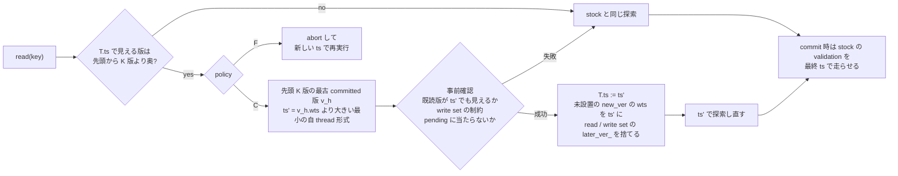

# Cicada に「cold 境界で発火する選択的 forwarding」を試作した (VHash 論文 md_6、2026-09-29)

authority: none / default_effect: no-state-change (可変状態の正本は worklog 末尾と現行 phase doc)。
wave `dev-wave-vhash-forwarding`、起点 local main `51f896352` (開始 gate fresh rc 0、2026-09-29 03:23 JST)、CCBench submodule = pin C `68106660` (動かしていない)。
job dir `/work/1/SFC/tanab/tmp/vhash-forwarding-prototype-2026-09-29/` (段 1 brief・段 2 plan・段 3 相談・段 4 / 6 裁定・Codex の prompt と報告・計測と検査の原本 JSON・変異 harness の記録)。
依頼は `/work/1/SFC/tanab/tmp/vhash-2026-09-29/md_6.txt` と `common.txt` (同 job dir の `inputs/` に逐語)。

**この文書の性能値・計数はすべて「未検証の診断値」である。** forwarding を入れた Cicada が serializable だとは書かない (§6)。

## 1. 依頼と結論

依頼 (VHash 論文の並行 wave md_6): 出典メモ §29 段階 3 と §25 構成 C・F。物理的な hot 配置は作らず、「先頭から K 版より奥を辿る必要がある」read で
transaction の timestamp を前進させる選択的 forwarding (C) と、同じ条件で abort して新しい timestamp で再実行する対照 (F) を inert patch で試作し、
forwarding の成功率・失敗理由・費用対効果を stock と同時刻に比べる。GC の保護は変えない。

結論:

1. **試作は動き、forwarding は発火する。** 通常の YCSB (100 万件・zipf 0.9・48 thread) でも、1 秒の計数 run で C は発火 3,489〜6,167 回・試行 1,131〜2,069 回、
   試行の 73〜75% が成功した (§5.1)。
2. **長い transaction の型で成否が分かれる。** 操作数の多い型 (1,000 操作) の長い thread では試行の約 18% しか成功せず、失敗の大半は「既読の版が前進先で見えない」
   (既読不一致) だった。読み取り後に待つ型では、待機中に read が無いので forwarding は構造上発火しない (待機前の read で数回だけ試行)。
3. **throughput の差は検出できなかった。** stock 比は C・F とも 0.95〜1.03 で、3 rep の 95% CI は全条件で 1 をまたぐ (D19 の between-run floor 3% の内側)。
   例外は K=1 の F で 0.66 (abort が約 52 万回)。長い transaction の完了は、操作数型で stock・C・F とも 0、待機型で 3 rep 合計 407〜928 と一貫した差が無い。
   **この試作 (GC 不変・論理 K 版の cold 境界) では、forwarding の費用対効果の利得はまだ見えていない。**
4. **md_3 の検査器で巡回は出なかった (上限は indeterminate)。** trace 計器 (md_3) の上に重ねた forwarding build を 5 cell × 2 thread 数で走らせ、
   forwarding が 10 走行すべてで発火・成功 (成功計 285 回) した状態で、判定器の巡回は 0、trace の commit 行数 = ベンチの commit 数だった。
   判定の上限は indeterminate なので、「serializable と認定された」とは書かない (§6)。

## 2. 仕様 (段 4 裁定の「仕様 v2」)

裁定の全文は job dir `stage4-ruling.md`。要点:

| 項 | 内容 |
|---|---|
| 発火 | `read()` 経由の `read_internal` だけ。read-write tx、未 abort、scan 中でない、特殊操作 (insert / delete / scan) をしていない。T.ts で見える版の物理位置 p (先頭 = 1、pending / aborted / deleted も数える) が p > K |
| 前進先 | 先頭 K 版のうち最古の committed 版 v_h。無ければ試行しない (`no_target`)。ts' = (clock(v_h) + [thid ≤ low8(v_h)]) << 8 \| thid。overflow も `no_target` |
| 事前確認 (最終保証ではない) | read set 全件: ts' で先頭から探索した見える版 (committed / deleted) が読んだ版と同一か (違えば `read_mismatch`)。途中で wts < ts' の pending に当たれば待たずに `conflict`。write set: RMW は latest が pending なら `conflict`、latest.wts ≥ ts' なら `write_constraint`。UPDATE は ts' で見える版の rts > ts' または deleted なら `write_constraint`。INSERT / DELETE を含めば `ineligible`。rts は書かない |
| 成功時 (1 箇所で) | T.ts := ts'、localClock_ := max(localClock_, clock(ts') + 1)、write set の未設置版の wts を ts' に書換え、read set と write set の `later_ver_` をすべて捨て、ts' で探索し直す |
| 失敗時 | 何も変えず元の ts で stock の探索を続ける (まだ何も公開していないので戻れる) |
| F | 発火条件が立ったら status_ = aborted にして read から戻る (YCSB の呼び出し側が abort() → 同じ procedure を新しい begin() で再試行) |
| 前進後の特殊操作 | 前進済み tx が insert / delete_record / scan を呼んだら abort (`special_after_forward`) |
| validation 以降 | 変えない。最終保証は stock の validation (pending 設置 → rts 更新 → 既読の一致確認 → write set の rts 確認) を最終 ts で走らせること |
| GC | ThreadWtsArray / ThreadRtsArray は旧 ts のまま (保守的に据え置き) |

依頼が求めた観点との対応:

- **前進先で既読の版がそのまま見えることを確かめる**: 事前確認の read set 全件照合と、commit 時の stock validation (最終 ts での既読一致確認) の 2 段。
- **reader と writer の両方が参加する順序付け (メモ §13.2)**: stock の validation のまま (reader は rts を先に上げてから確認、writer は pending を先に置いてから rts を確認)。前進は validation の前だけ。
- **rts を「見える区間の終わり」として使わない (メモ §13.3)**: 事前確認は必ず版リストを辿り、rts で確認を省かない。rts は書かない。
- **PENDING の書き込み版を置いた後は timestamp を動かさない (メモ §18.1)**: 前進は read 相 (validation 前) だけ。
- **失敗したら元の timestamp で奥を辿る**: 表の「失敗時」。
- **書き込み側の制約 (メモ §10)**: 表の write set の事前確認と、未設置版の wts の書換え。最終的な書き込み制約は stock validation の write set 検査 (b)。
- **timestamp の一意性 (メモ §10)**: 他 thread とは下位 8 bit (thid) で区別。同一 thread 内は ts' > 旧 ts、localClock_ を clock(ts') + 1 以上にするので次の tx の ts も ts' より大きい。
  注: stock の `generateTimeStamp` は abort 後の clockBoost で localClock_ が rdtscp より進み、直後の commit で boost = 0 に戻ると次の ts が前の ts と同じ値になりうる、とコード読みでは見える (未実測)。本 variant はこれを直していない (stock と同条件)。

**md_4 の小さいモデル検査との照合 (main `1887f56e4`、`output/insights/2026-09-29/vhash-forwarding-model/README.md` §7・§12、本試作の設計後に着地):**
md_4 が C++ 試作へ持ち込む候補とした規則のうち、R9' (書き込み側の直前版の rts 検査は PENDING を越えて最初の確定版まで) は Cicada stock の validation (b) が
pending を待ち aborted を飛ばして最初の committed 版の rts を見るので満たす。R5 (rts を上げてから版列を観測し直して確認) は、commit 時の検証を省く選択肢 O1 を入れたときにだけ
反例が出た規則で、本試作は O1 を採らない (事前確認は早期判定、最終保証は stock の validation = rts 更新 → 可視確認の R9 の順序) ので該当しない。
R6 → R7・R10 (GC の公開順と回収) は GC を変えていないので該当しない。これはモデルの範囲 (固定 10 場面) と本試作の静的照合であり、実装の正しさの証明ではない。

**正しさの論証は静的なものに留まる。** 「最終 ts で stock validation を走らせるので、既読版がすべて最終 ts で見える版と一致しない限り commit しない」は、
stock validation 自身の正しさと、前進時の later_ver_ 破棄・未設置版の wts 書換えが漏れなく行われることに依存する。後者は段 3・段 6 のレビューで確かめたが、実行時の証明ではない。

## 3. 実装と knob

- **patch:** `patches/cicada-forwarding-variant.patch` (pin C の `cc/cicada/transaction.cc` と `cc/cicada/ycsb_cicada.cc` だけ。header・`include/ycsb.hh`・`common/runner.hh` は不変)。
  追加 423 行。各挿入ブロックの後に `#line` を置き、pin の行番号を保つ。追加コードは clang-format 14 (CCBench の `.clang-format`) で整形。
- **macro (未定義 = 0):**

| macro | owner TU | 意味 | 実行時 flag |
|---|---|---|---|
| `CICADA_FWD_ENABLE` | transaction.cc | forwarding 本体 | `--cicada_fwd_policy=c\|f` (既定 c)、`--cicada_fwd_k` (既定 3、1〜256) |
| `CICADA_FWD_COUNT` | transaction.cc | 計数 (ENABLE=1 のときだけ意味を持つ)。終了時に `CICADA_FWD_V1 {json}` を 1 行 | — |
| `CICADA_LONGTX` | ycsb_cicada.cc | 長い tx の 2 型の Cicada 専用 workload。終了時に `CICADA_LONGTX_V1 {json}` を 1 行 | `--cicada_long_threads` (0 = YcsbWorkload と同じ)、`--cicada_long_kind=many_ops\|wait_after_reads`、`--cicada_long_ops` (1000)、`--cicada_long_rratio` (90)、`--cicada_long_wait_us` (1000)、`--cicada_wait_reads` (10) |

- **計数の項目 (thread 別):** triggers (発火)、attempts (事前確認に入った)、success、read_mismatch、write_constraint、conflict、ineligible (試行後の不適格)、
  no_target (試行前の不適格: 先頭 K 版に committed 版が無い / overflow)、special_after_forward、f_aborts、advance_clock_sum (前進幅の clock 合計)、
  pos_before_sum / pos_after_sum (成功時の見える版の位置)。attempts = success + read_mismatch + write_constraint + conflict + ineligible が成り立つ。
  **計数入り build の throughput は性能値に使わない** (driver が `perf_eligible=false` を付け、集計から外す)。
- **長い tx の 2 型:** 末尾 L 本の thread (thid 0 = leader は除く) が長い tx を回す。many_ops = 1,000 操作・read 90%・少なくとも 1 write。
  wait_after_reads = 10 read + 1 write の後に 1,000 µs 待って commit (待機後に read しない)。
- **driver:** `orchestrator/campaign/vhash_forwarding_prototype.py` (`smoke` / `run --workload … [--k-sweep]` / `aggregate --raw …`)。
  build は macro なしの dependency build (masstree の config.h を作る。計測には使わない) → stock (LONGTX=1) → fwd (ENABLE+LONGTX) → count (ENABLE+COUNT+LONGTX) の順。
  gate を要する build は、供給する各 macro について条件 gate の supply / meaning を通してから build する (gate receipt は「compile 条件の証拠」であって C / F の動作保証ではない)。
- **作図:** `make_figures.py` (この dir)。`PYTHONPATH=<repo> python3 make_figures.py <aggregate.json> <raw…> --output <stem>` で PNG / PDF / provenance を出す。raw から再集計して aggregate と一致しなければ止まる。
- **登録:** 3 macro を `orchestrator/campaign/condition_meaning_gate.py` の許可ドメインへ登録 (DEFINE_SPECS・witness・site 数 11 / 4 / 4)、登録簿テストの集合と件数 (61→64、43→46、44→47) と
  driver の起動箇所 (`_run_binary`、`checked`) を追随。判定・受理述語と既存 entry は変えていない (先例 3867e6ec5 と同じ足跡)。
- **依頼との食い違い 2 点 (段 4 裁定):** (1) `patches/ledger.json` に entry を足さない — 同 ledger は `silo_ladder_rung1` 専用で entry 1 件を契約が要求する
  (`orchestrator/campaign/silo_ladder_rung1_contract.py` の ledger 検査)。登録は `patches/README.md` の節で行った。(2) macro 名に `IZANAGI_` 接頭辞を使わない —
  合成 variant の命名慣行 (`BACKOFF_FIXED`、`MOCC_TEMP_PREDICATE`) に合わせた。接頭辞の有無に関係なく条件 gate への登録は必須で、検査を逃れる効果は無い。

## 4. 計測条件

| 項目 | 値 |
|---|---|
| 機材 | Pegasus 計算ノード (gen_S、48 core) 1 job = 1 workload。node は記録 (`input_jobs`) |
| 共通 | 48 thread、`ycsb_tuple_num` 1,000,000 (Pegasus の既存較正値。Silo で較正した値の流用で、Cicada の cache 飽和は確かめていない)、zipf 0.9、rratio 50、max_ope 10、rmw 0、clocks_per_us 2100、`numactl --interleave=all` |
| workload | normal (長い thread 0)、many_ops (長い thread 4)、wait_after_reads (長い thread 4) |
| GC 間隔 | `gc_inter_us` ∈ {10, 100, 1000} |
| 腕 | stock (LONGTX=1 build、forwarding のコードは前処理で消える)・C・F。K=3 |
| 性能 | 各セル 3 rep × 3 腕、extime 3 s、rep ごとに順序を回す (stock,C,F → C,F,stock → F,stock,C)。同じ job・同じ node で交互に測る |
| 計数 | 各セル C・F を 1 rep ずつ、count build、extime 1 s (throughput は使わない) |
| K sweep | many_ops・GC 100 だけ K ∈ {1, 8} を追加 |
| 単独性 | job 冒頭と各 run 直前に `pgrep -af 'ycsb_.*\.exe'` (検出・失敗で停止)。3 job とも競合 0 |

raw (各 18〜28 MB、job dir `raw/` に原本。repo には入れない):

| job | request | host | 所要 | 記録数 | sha256 |
|---|---|---|---|---|---|
| normal | 34049.nqsv | bnode071 | 173 s | 33 (全 valid) | `b4d6c5144645e889d79506268efe23db748534d236448d61737e632bc571ec79` |
| many_ops (+K sweep) | 34050.nqsv | bnode089 | 258 s | 55 (全 valid) | `9f5436b5d1f428f203e041d02b75f84d5c4ce57cc17d3dddf19e00f6ad6ad090` |
| wait_after_reads | 34051.nqsv | bnode043 | 174 s | 33 (全 valid) | `5792204556cc65cb815c5c0a521f7b26c39b51bb087966723afa653dfa5b2b43` |
| smoke (参考) | 34031.nqsv | bnode071 | 101 s | 15 | `e6c44856f7c3e4a6f999fe990b3fd41c7da563464d4f3c04d072577b1d14d0d3` |

集計 = `data/aggregate.json` (driver の `aggregate` に上の 3 本を明示して渡した出力)。図 = `figures/forwarding-overview.{png,pdf}`、provenance = 同 `.provenance.json`。

## 5. 結果 (すべて未検証の診断値)

図の読み方: 行 = workload、列 = (1) C の成功率 (点) と試行数 (灰の棒)、(2) 試行を 100% とした内訳 (成功と 4 つの失敗理由) と試行前の除外 `no_target` (点線、右軸)、
(3) stock 比の throughput (3 rep の点と小標本 95% CI、C = 緑・F = 橙)、(4) 長い thread の commit (左軸) と F の abort (右軸、長い thread と通常 thread を別系列)。
**図の長い thread の commit に stock 系列は無い。stock を含む値は §5.3 の表で読む。** 計数は各セル 1 rep (単回)。

### 5.1 forwarding の発火と成否 (C、K=3、計数 build 1 rep・1 s)

| workload / GC µs | 発火 | 試行 | 成功 | 成功率 | 既読不一致 | 書込み制約 | 競合 | 試行後不適格 | 試行前除外 | F の abort |
|---|---|---|---|---|---|---|---|---|---|---|
| normal / 10 | 3,489 | 1,131 | 831 | 0.73 | 206 | 84 | 7 | 3 | 2,358 | 15,638 |
| normal / 100 | 5,295 | 1,686 | 1,262 | 0.75 | 269 | 121 | 15 | 19 | 3,609 | 20,241 |
| normal / 1000 | 6,167 | 2,069 | 1,547 | 0.75 | 307 | 181 | 14 | 20 | 4,098 | 36,561 |
| many_ops / 10 | 7,901 | 4,990 | 933 | 0.19 | 3,904 | 133 | 15 | 5 | 2,911 | 17,019 |
| many_ops / 100 | 8,967 | 6,232 | 1,094 | 0.18 | 4,949 | 161 | 20 | 8 | 2,735 | 18,354 |
| many_ops / 1000 | 9,330 | 6,240 | 1,148 | 0.18 | 4,876 | 191 | 19 | 6 | 3,090 | 20,340 |
| wait_after_reads / 10 | 3,990 | 1,239 | 921 | 0.74 | 198 | 98 | 6 | 16 | 2,751 | 34,887 |
| wait_after_reads / 100 | 4,819 | 1,550 | 1,158 | 0.75 | 265 | 109 | 9 | 9 | 3,269 | 16,631 |
| wait_after_reads / 1000 | 4,288 | 1,482 | 1,127 | 0.76 | 233 | 103 | 12 | 7 | 2,806 | 22,697 |

(全 thread の合計。長い thread と通常 thread の内訳は `data/aggregate.json` の `counter_by_thread`。)
成功 1 回あたりの前進幅は normal / 10 で 52,598,933 / 831 ≈ 63,300 clock (2100 clock/µs で約 30 µs)、見える版の位置は成功時に平均 5,541 / 831 ≈ 6.7 から 2,070 / 831 ≈ 2.5 へ縮んだ。
発火のうち試行に入らないもの (試行前除外) が多いのは、先頭 K=3 版がすべて pending / aborted で committed 版が無い場合である。

**smoke の長い thread の内訳 (bnode071、1 rep・1 s、GC 100):** many_ops の長い thread 4 本は試行 3,924・成功 40 (約 1%)・既読不一致 3,839。
wait_after_reads の長い thread は試行 3・成功 0 (待機前の read だけが発火しうる。待機中は read が無いので試行は構造上 0)。

### 5.2 throughput (stock 比、3 rep の中央値)

| workload / GC µs / K | stock (kTPS) | C (kTPS) | F (kTPS) | C / stock | F / stock |
|---|---|---|---|---|---|
| normal / 10 / 3 | 756 | 775 | 771 | 1.025 | 1.021 |
| normal / 100 / 3 | 770 | 757 | 757 | 0.983 | 0.983 |
| normal / 1000 / 3 | 786 | 812 | 778 | 1.032 | 0.989 |
| many_ops / 10 / 3 | 748 | 737 | 712 | 0.985 | 0.952 |
| many_ops / 100 / 3 | 720 | 728 | 717 | 1.010 | 0.996 |
| many_ops / 1000 / 3 | 765 | 773 | 762 | 1.010 | 0.996 |
| many_ops / 100 / 1 | 752 | 715 | 497 | 0.952 | 0.661 |
| many_ops / 100 / 8 | 727 | 714 | 741 | 0.981 | 1.019 |
| wait_after_reads / 10 / 3 | 772 | 756 | 745 | 0.980 | 0.966 |
| wait_after_reads / 100 / 3 | 763 | 764 | 753 | 1.002 | 0.986 |
| wait_after_reads / 1000 / 3 | 762 | 745 | 761 | 0.977 | 0.998 |

3 rep の 95% CI (図の列 3) は K=1 の F を除き全条件で 1 をまたぐ。差は between-run floor 3% (D19) の内側で、**C / F と stock の throughput の差は検出できなかった**。
比較は各 workload の job 内の同時刻・同 node の対照に限る (workload 間の絶対値には node の差が入りうる)。

### 5.3 長い transaction の完了 (3 rep 合計、長い thread 4 本)

| workload / GC µs / K | stock commit / abort | C commit / abort | F commit / abort |
|---|---|---|---|
| many_ops / 10 / 3 | 0 / 82,620 | 0 / 88,501 | 0 / 107,358 |
| many_ops / 100 / 3 | 0 / 77,182 | 0 / 82,889 | 0 / 104,632 |
| many_ops / 1000 / 3 | 0 / 91,842 | 0 / 98,451 | 0 / 120,674 |
| many_ops / 100 / 1 | 0 / 89,144 | 0 / 80,049 | 0 / 298,779 |
| many_ops / 100 / 8 | 0 / 80,804 | 0 / 80,128 | 0 / 90,896 |
| wait_after_reads / 10 / 3 | 777 / 22,127 | 928 / 22,017 | 498 / 23,836 |
| wait_after_reads / 100 / 3 | 407 / 22,320 | 540 / 22,239 | 680 / 24,200 |
| wait_after_reads / 1000 / 3 | 749 / 22,115 | 758 / 22,102 | 651 / 23,743 |

操作数型の長い tx は 3 腕とも 3 秒の間に 1 度も commit しなかった。F は再試行で abort がさらに増える (F は「再実行の費用と進捗喪失を示す対照」として読む)。
待機型は完了率 2〜4% で、腕の間の差は GC 間隔ごとに向きが入れ替わり、一貫しない。

### 5.4 K の感度 (many_ops、GC 100)

K=1 では発火 162,948・試行 42,682・成功 6,317 (成功率 0.15) と発火が桁違いに増え、F の throughput は stock の 0.66 に落ちた。
K=8 では発火 456・成功 86 と少ない。C の throughput は K によらず stock の 0.95〜1.01。

## 6. 正しさ検査 (md_3 の検査器、判定の上限は indeterminate)

md_3 が main に着地させた Cicada の trace 計器 (`patches/instr-cicada-trace.patch`、main `159999d44`) の上に forwarding patch を重ね、md_3 の repo 外起動器
(`/work/1/SFC/tanab/dev-wave-jobs/dev-wave-vhash-cicada-verifier/launch_cicada_run.py`、sha256 `7e849bef…`) で TRACE=1 build を走らせて判定器に掛けた。
起動器は macro を 1 個しか渡せないので、ENABLE と COUNT を同時に渡す最小の派生 (macro の list と `CICADA_FWD_V1` の取り込みだけ。Codex author、job dir
`verify/launch_cicada_run_multi.py`、sha256 `9d615a4d…`) を使い、**発火を数えながら**検査した。cell は md_3 と同じ (K / W / R: 200 件、FK / FR: 50 件、zipf 0.9、extime 1、group_commit 0)。

| build | 走行 | 巡回 | 判定 | trace の C 行 = commit 数 | 読んだ版の食い違い | forwarding 成功 |
|---|---|---|---|---|---|---|
| STOCK_INSTR (対照、同 job) | 10 (5 cell × thread 4 / 8) | 0 | indeterminate | 全一致 | 0 | — |
| FWD_C_COUNT (trace + forwarding C、K=3、計数) | 10 (同) | 0 | indeterminate | 全一致 | 0 | 6〜92 / 走行、計 285 |

job 34093.nqsv (bnode071、249 s)、結果 = `data/verify-run3-result.json`。先に計数なしの FWD_C を 5 cell × thread 4 で走らせた run2 (34030.nqsv、bnode068) も巡回 0 (`data/verify-run2-result.json`)。
起動器の終了コードは 1 だが、これは起動器の合否集計が壊し patch 用の帰属 (`attribution`) を STOCK 以外の build に要求するためで、判定器の判定とは無関係。

**言えること:** 実測した YCSB point read / update の履歴で、forwarding が成功した状態でも判定器は巡回を検出しなかった。
**言えないこと:** 判定の上限は indeterminate (Cicada には Silo / mocc の X / P / I に当たる証拠面が無い) なので、「serializable」「certified」とは書かない。
成功した forwarding は 1 走行あたり 6〜92 回で、commit 数 (約 18 万〜128 万) に比べて少ない。長い tx の型 (LONGTX) は検査していない。

## 7. 確かめたこと / 確かめていないこと

確かめたこと (実測):

- 3 macro 未定義の transaction.cc・ycsb_cicada.cc の前処理結果 (行 marker と空白行を除く) が pin と一致した (smoke、bnode071)。
- 3 macro とも Cicada の実 build で条件 gate の supply / meaning が admitted になった (smoke 以降の全 job)。登録関連テスト 401 passed / 2 skipped。
- C は 3 workload・3 GC 間隔のすべてで発火し成功した。F は発火のたびに abort した。
- 検査器で巡回 0 (§6)。

確かめていないこと:

- serializability (上限 indeterminate)。長い tx の型での検査。
- GC の保持・回収への効果 (本 wave は GC を変えていない。GC 間隔を振ったのは「GC 遅延下で forwarding の成否と throughput がどう動くか」を見るためで、GC 改善の証拠ではない)。
- 100 万件が Cicada の cache 飽和点か (Silo の較正値の流用)。
- throughput の差の有無 (3 rep では floor 3% の内側の差を検出できない)。
- stock の timestamp 重複の疑い (§2 の注) が実際に起きるか。
- 物理的な hot 配置 (VHash) との組合せ、GC 保護の前進 (段階 5)、固定 snapshot・範囲読み取り・挿入・削除。

## 8. 次に要るもの

1. **長い tx の読み集合での成否:** 操作数型で成功率が約 18% (長い thread は約 1%) に落ちる主因は既読不一致。前進先を「最小」でなく「既読の可視区間の共通部分に収まる最大」に選ぶ、
   または前進を 1 tx あたり 1 回に制限するなどの方針 (メモ §12.3・§21.1) を比べる。
2. **利得が出る条件の探索:** 版リストの物理探索の費用が効く条件 (hot 配置、深い版リスト、長い GC 間隔と組合せ) で C の効果を測る。現条件では throughput の差は floor の内側。
3. **正しさ:** 長い tx の型を含む検査、成功回数の多い条件での検査、Cicada 用の証拠面 (indeterminate の上限を上げる) — 最後の点は md_3 の一次資料 §7 の裁定候補と同じ。
4. **次の版 (`docs/paper-story-vhash/` 2 版目) に使える材料:** 図 `figures/forwarding-overview.png` (発火・成否・内訳・throughput 比・長い tx)、§5 の表、§6 の検査結果、§7 の限界。

## 9. 計算資源

| 用途 | job (request / host / 所要) |
|---|---|
| smoke (生死確認。1〜6 回目は実機固有の不具合で途中停止) | 33844 / bnode068 / 17 s、33851 / bnode078 / 17 s、33946 / bnode076 / 22 s、33959 / bnode070 / 18 s、33971 / bnode069 / 17 s、34014 / bnode040 / 55 s、34031 / bnode071 / 101 s (完走) |
| 本計測 | 34049 / bnode071 / 173 s、34050 / bnode089 / 258 s、34051 / bnode043 / 174 s |
| 正しさ検査 | 33988 / bnode071 / 83 s (FWD_C は gate 未登録の木で build 前に拒否)、34030 / bnode068 / 141 s、34093 / bnode071 / 249 s |
| 登録関連テスト・変異・受入 | worklog fragment に記録 |

1 job は 1 node を占有する (gen_S は CPU 48/48)。smoke・本計測・検査の job の Elapse 合計は 1,325 s (約 0.37 node 時間)。

## 10. 経緯 (実機でだけ出た不具合)

計算ノードの smoke は次の順で止まり、それぞれ Codex の fix で直した (job dir の `codex/stage6fb4`〜`stage6fa9`)。login の静的検査・pytest では出なかった。

| 回 | 停止箇所 | 原因 | 直し方 |
|---|---|---|---|
| 1・2 | inert 比較 | Cicada は ycsb / tpcc / bomb / sbomb の 4 target で transaction.cc を compile し、compile entry が 4 件 | 条件 gate と同じ `CMakeFiles/<target>.dir/` の目印で ycsb_cicada.exe の entry を選ぶ |
| 3 | inert 比較 | masstree の config.h は build 時にしか作られず、configure しただけの木では前処理できない | 3 build の後に stock build の entry で比較 |
| 4 | 条件 gate | gate へ渡す configure 引数に検査対象 macro の CXX_FLAGS が入り重複 define | gate には CXX_FLAGS を除いた引数を渡す (先例 silo_policy_coverage) |
| 5 | 条件 gate | gate の前処理でも config.h が無い | macro なしの dependency build を先に 1 回 (先例 silo_policy_coverage の `_prepare_build_dependencies`) |
| 6 | inert 比較 | patch の行挿入で後ろの `__LINE__` の展開値がずれる | 各挿入ブロックの後に `#line` (先例 instr-mocc-lock-coverage) |

加えて、条件 gate の登録が必須であることは段 2 のやり直し (DW-O13 の期限後成立) で判明した。段 1〜6 の詳細は job dir と worklog fragment。
