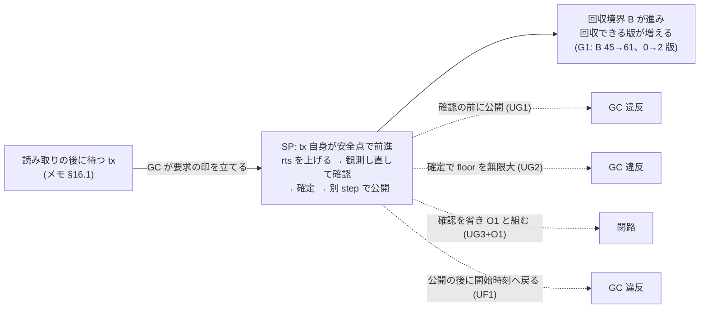
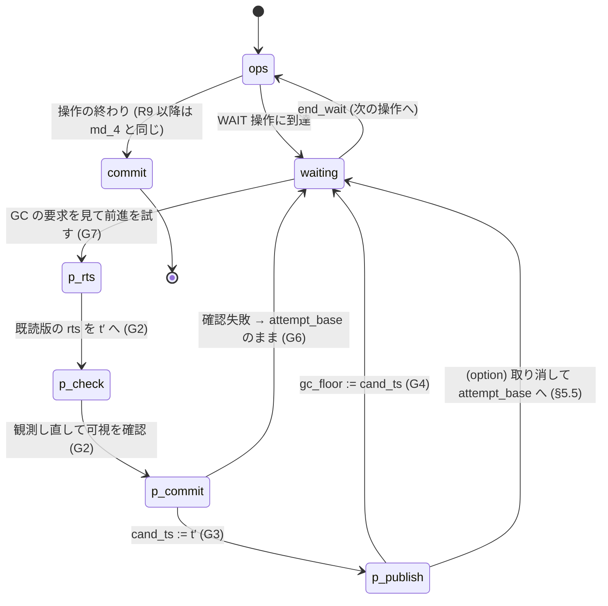

# 前進を GC の回収境界へつなぐ手順の小さいモデルと全探索 (VHash 論文 出典メモ §15〜§18、段階 5 の設計)

- 着手: 2026-09-29 (dev-wave `dev-wave-vhash-gc-connection`、背景 job、ユーザー就寝中)
- 依頼: `/work/1/SFC/tanab/tmp/vhash-2026-09-29/md_10.txt` (並行 VHash wave の md_10)
- 実装: `tools/vhash_forwarding_model/` (既存 package に `gc_connection.py` を足し、`model.py`・`judge.py`・`scenarios.py`・`cli.py` を拡張) と `orchestrator/tests/test_vhash_forwarding_model_gc.py`。実装 commit は本 README と同じ branch の「VHash forwarding 小モデル: GC 接続」4 commit (統合 1f4467566、fix1 64e87c989、fix2 8af05c31a、fix3 28873adbd。fix3 は test の追加だけ)
- 土台: md_4 の小モデルと一次資料 `output/insights/2026-09-29/vhash-forwarding-model/README.md` (設計判断 D2282)。本資料の R1〜R10・O1・S1〜S10・U1v〜U6 はそちらの定義
- 出典メモ: `docs/paper-story-vhash/source-memo-2026-09-29.md` (構想の記録であり一次資料ではない)。「メモ §N」はこの file の節番号

## 0. 一目でわかる結論



図の読み方: 実線は採用した手順とその効果、点線は「その規則を 1 つだけ崩した危ない版で違反が出た」= その規則が必要だった、を表す。範囲付きの探索結果の要約であり、一般の証明ではない (範囲は §7)。

| 問い (md_10・出典メモ) | この wave で得たもの (範囲は §7) |
|---|---|
| §16.1 読み取りの後に待つ tx にも前進を届けられるか | **届けられる。** GC が要求の印を立て、tx 自身が待機の安全点で前進する形 (SP) を採った。G1〜G6 の健全版 24 構成すべてで反例なし |
| md_10 (c) 他 thread が代わりに確かめるか、tx 自身が確かめるか | **tx 自身 (SP) を採った。** 代行 (HP) はモデル化していない。理由と、HP を採るときの必要条件は §3 |
| §15.2 前進の確定 → 保護下限の公開 → 回収の順序 | 確認の前に公開すると GC 違反 (UG1、G3・G4・G5・G6)。確定 → 公開の順 (G3 → G4) が必要 |
| md_10 「前進しただけで保護を外す」 | 確定時に floor を外す (無限大) と GC 違反 (UG2、G4・G6)。**確定時に既読版の物理参照を外すだけ (UG2r) では、この範囲で反例は出なかった** (§5.4) |
| md_10 「待っている tx の既読を確かめずに前進させる」 | 単独では反例なし (commit 時の検証が遮る)。O1 と組むと閉路 (UG3+O1、G5) |
| §18.2 戻れる段階と戻れない段階 | 公開の後に開始時刻へ戻ると GC 違反 (UF1、G5・G6)。**確定の後・公開の前に取り消して試行前の時刻へ戻る構成は、G1〜G6 で反例なし** (§5.5) |
| §15.3 前進後もまだ見える古い版 | 既存 R10 (後続の確定版で回収) をそのまま使い、G4 の健全版で反例なし (md_4 の U4 が必要性を既に示している) |
| §15.4 効果は回収境界の前進と回収できる版の数で | 公開直後の状態と「その tx の floor だけを戻した対照状態」の差で数えた。G1 で B +16・回収できる版 +2 など (§6)。**モデル内の数であって性能値ではない** |

## 1. 目的と、何を確かめたか

文献調査 (`output/insights/2026-09-29/vhash-related-work/README.md` §8.3) は、新規性が残る中心を U0 =「abort せず既読値を保ったまま前進し、その前進を版データの回収境界へ反映して保持期間を縮める」とした。また、読み取りの後に待つ長い tx には、cold アクセスを契機にした前進が発火しない (メモ §16.1、論文ストーリー最初の版 §6)。この wave は次を行った。

1. GC 接続の手順を規則 G1〜G7 として仕様にした (§2)。
2. GC 圧力を契機にした前進の 2 つの形 (tx 自身が安全点で確かめる SP、他 thread が代わりに確かめる HP) を比べ、SP を採った (§3)。
3. md_4 のモデルに待機操作・圧力による前進・fallback の段階・J3 の rollback 判定・効果の数え方を足し、場面 G1〜G6 を全探索した (§4・§5)。
4. わざと危ない版 5 種で検査器が反例を出すかを確かめた (§5)。
5. 回収境界の前進量と回収できるようになった版の数をモデルの中で数えた (§6)。
6. 既存の 63 構成 (md_4) の結果が 1 行も変わらないことを確かめた (§10)。

**確かめていないこと**は §7 にまとめる。とくに「反例なし」は、固定した 6 場面の初期状態から、定義した原子 step の全 interleaving を探索し尽くした、という意味に限る。

## 2. 仕様 (既存 R1〜R10・R9′・O1 は変えない)

| 規則 | 内容 | 既存規則との関係 |
|---|---|---|
| G1 状態 | tx は cand_ts・確認済み集合・gc_floor・refs・確定の印に加え、GC からの要求の印、この試行の前の cand_ts (`attempt_base`)、この試行の前の gc_floor を持つ。**公開した floor = gc_floor** (このモデルには gc_floor を下げる遷移が無く、危ない版を含む全 60 構成の全遷移で下がらないことを数えて確かめた) | メモ §18 の 5 状態の分離 |
| G2 確認 | 圧力による前進は、既読版ごとに rts を t′ へ上げ (1 版 1 step)、その後に版列を観測し直して t′ で見えるかを確かめる (1 版 1 step)。失敗なら確定しない | R5 と同じ step と順序 |
| G3 確定 | 確認が全部成功したら 1 step で cand_ts := t′、確認済み集合へ記録 | R6 相当 |
| G4 公開 | G3 の後の別 step で gc_floor := cand_ts。**G3 より前に公開しない** | R7 相当 (メモ §15.2) |
| G5 回収 | 境界 B 以下の確定した後続版があり、どの refs にも無い版だけを回収する (ABORTED 版は無条件)。`wts < B` だけでは回収しない | R10 のまま (メモ §15.3) |
| G6 fallback | 確定前の失敗は attempt_base (この試行の前の cand_ts) へ戻る。戻り先は gc_floor を下回らない | メモ §18.2。R8 との関係は §5.5 |
| G7 待機と発火 | 待機操作 `WAIT` を操作列の任意の位置に置く。pc が WAIT を指す間だけ圧力による前進を始められる。GC は待機中の tx に要求の印を立てられる (1 共有書き込み)。t′ は cand_ts より新しい確定版ごとの next_free(wts+1) から非決定的に選ぶ。同じ待機で同じ t′ を 2 度試さない。PENDING 設置後・確定後は始めない | R4 の next_free、R8 |

発火は**過大近似**である: 待機中ならいつでも要求の印を立てられ、候補集合のどの t′ も選べる。したがって安全性の結論は、「待機中にだけ発火し、t′ を上の候補集合から選ぶ」どの方策 (停滞の検出条件を含む) にも及ぶ。**任意の整数時刻を選ぶ方策、待機以外で発火する方策、途中入場する tx には及ばない。**

### 2.1 状態遷移 (1 transaction の待機と圧力による前進、値なしの模式)



GC は別 thread として、要求の印を立てる・下限を読む・1 版を回収する、を任意の時点に挟む。

## 3. SP と HP (md_10 (c) の決定)

| 観点 | SP (tx 自身が安全点で確かめる) | HP (他 thread が代わりに確かめる) |
|---|---|---|
| 正しさの手順 | GC が印を立て、tx が待機の安全点で G2→G3→G4 | 代行 thread が tx の既読集合に G2 を行い、tx の descriptor を CAS で書き換えて G3、続いて G4 |
| 共有状態 | 要求の印と gc_floor だけ。既読集合は tx の中でよい | 既読集合を他 thread から読める形で共有し続け、descriptor に世代を持たせる |
| 通常の読み取りへの追加の仕事 | なし (待機の安全点で印を見るだけ) | 読み取りのたびに共有の既読集合を更新する |
| 止まった thread | 効かない (再開しないと前進しない) | 論理境界 (段階 B) は進めうる。物理参照の解除 (段階 C) は別の仕組みが要る |

**SP を採った。** 対象の長い tx (CCBench 図 14 の作り方として出典メモが述べる、読み取りの後の待機) は実行中の thread が待っているので、待機の安全点で印を確かめられる。HP は通常の読み取りのたびに共有書き込みを増やし、メモ §16.2 の「通常アクセスに余計な仕事を載せない」と逆向きになる。HP が SP に勝るのは完全に止まった thread の場合だけで、そのときも物理参照の解除は別に要る (メモ §16.2、md_10 の scope 外)。

**HP を採るときの必要条件** (段 3 の敵対相談で判明、モデルでは未検査): descriptor の世代つき CAS が G3 の確定だけでなく G4 の公開までを覆う (確定の後・公開の前に tx 自身が進むと、古い snapshot で floor を書きうる)、snapshot の後に tx が読み取りを足せない、HP の成功から物理解放を推論しない。

## 4. 場面

いずれもキー 2、初期版はキーごとに 1〜3、hot の幅 K = 1。効果の対象 tx は T。

| 場面 | 狙い | 初期版 | transaction と操作 | 窓 witness (割り込みの窓を通ったこと) | 危険結果 witness |
|---|---|---|---|---|---|
| G1 | §16.1 読み取りの後に待つ tx が境界を止め、前進で動く | A20, B40, B60 | T@45: R A, WAIT / W@50: W B | T が待機中に前進・公開し、その後 GC が floor を読む | 定義しない (効果と回収の確認用) |
| G2 | §15.4 待つ tx 2 本 | A20, B40, B60 | T@45: R A, WAIT / U@35: R A, WAIT | T が公開し U は旧 floor のまま GC が floor を読む | 定義しない (効果用) |
| G3 | UG1 公開順序の入替 | A20, B40, B60 | T@45: R A, WAIT, R B / W@50: W A | 同じ列に W:A の設置と T の確認失敗があり、その確認中に GC が floor を読む | 確認中 (時刻 45 のまま) の T が後で読む B40 の回収 |
| G4 | UG2 前進しただけで保護を外す | A20, B40, B60, B80 | T@45: R A, WAIT, R B | T が前進した後に GC が floor を読む | T が前進後の時刻で読む B60 の回収 |
| G5 | UG3 既読を確かめず前進 (write skew 形) | A10, B11, B25 | T@15: R A, WAIT, W B / W@20: R B, W A | T の前進の確認と確定の間に W が A へ設置 | 両者 commit して閉路 |
| G6 | UF1 公開の後の fallback (§18.2) | A20, B40, B60, B80 | T@45: R A, WAIT, R B / W@70: W A | 1 回目の公開の後に GC が回収し、2 回目の確認が失敗して fallback | 1 回目の公開の後に、GC の回収と 2 回目の確認失敗がともに起き、その後に開始時刻への fallback (回収と確認失敗の前後は問わない。最短の危険列 22 step は 公開 (step 9) → 確認失敗 (step 18) → 回収 (step 21) → fallback (step 22)) |

## 5. 結果

親が fix2 の commit (8af05c31a) で CLI を 60 構成について実行した生出力 (最終の fix3 は test の追加だけで、tools/ の差分は無い): `raw/` (1 構成 1 JSON、要約は `raw/summary.tsv`)。表の値はその要約から写した。すべての構成で探索は完了した (打ち切りなし)。

### 5.1 健全版 (J1 / J2 / J3 の違反の有無、訪問状態数)

`0` = 違反なし。「+取消し」は option `revert_after_confirm` (§5.5)。

| 場面 | 前進なし | SP | SP + 取消し | SP + O1 |
|---|---|---|---|---|
| G1 | 0/0/0, 330 | 0/0/0, 1,444 | 0/0/0, 2,190 | 0/0/0, 1,312 |
| G2 | 0/0/0, 460 | 0/0/0, 15,586 | 0/0/0, 68,794 | 0/0/0, 10,502 |
| G3 | 0/0/0, 2,502 | 0/0/0, 5,060 | 0/0/0, 6,392 | 0/0/0, 4,384 |
| G4 | 0/0/0, 102 | 0/0/0, 524 | 0/0/0, 842 | 0/0/0, 468 |
| G5 | 0/0/0, 1,360 | 0/0/0, 10,116 | 0/0/0, 13,604 | 0/0/0, 8,494 |
| G6 | 0/0/0, 3,192 | 0/0/0, 16,266 | 0/0/0, 21,180 | 0/0/0, 13,706 |

- 窓 witness は、この表の SP を使う健全版の全構成で到達した (前進なしでは定義上到達しない)。危ない版では、G3 の窓 (確認失敗を要求する) が UG3 構成で未到達 (UG3 は確認が失敗しない)。
- 危険結果 witness (G3〜G6) は、健全版の全構成で未到達。G1・G2 は危険結果を定義していないので、健全版の安全性の証拠には数えない (CLI の `danger` は null)。
- 健全版では全到達状態で cand_ts ≥ gc_floor が成り立つことを test で確かめた。

### 5.2 危ない版 (SP を土台に 1 規則だけを崩す)

各危ない版を 6 場面すべてで走らせた。違反が出た構成だけを載せる (出なかった構成は `raw/summary.tsv`)。

| 危ない版 | 崩した規則 | 場面 | J1/J2/J3 (最初の理由), 訪問状態数 | 最短反例列 |
|---|---|---|---|---|
| UG1 | 確認の前 (前進開始時) に gc_floor := t′ を公開 (G4 を G2 の前へ) | G3 | 0/0/1 (future_read), 6,078 | 16 step |
| UG1 | 同上 | G4 | 0/0/1 (future_read), 584 | 5 step |
| UG1 | 同上 | G5 | 0/0/1 (use_after_free), 11,724 | 31 step |
| UG1 | 同上 | G6 | 0/0/1 (future_read), 22,614 | 5 step |
| UG2 | 確定時に gc_floor を無限大 (登録を外す) | G4 | 0/0/1 (future_read), 514 | 10 step |
| UG2 | 同上 | G6 | 0/0/1 (future_read), 15,944 | 21 step |
| UG3 + O1 | 圧力前進の可視確認を省く (rts 更新は残す) + O1 | G5 | 1/1/0, 8,204 | 38 step (J1) |
| UG3 + O1 | 同上 | G3 / G6 | 0/1/0 (J2 だけ) | — |
| UF1 | 公開の後の fallback を開始時刻へ | G5 | 0/0/1 (use_after_free), 10,116 | 47 step |
| UF1 | 同上 | G6 | 0/0/1 (future_read), 16,234 | 22 step |

- UG2r (確定時に既読版の refs を外す) と UG3 単独 (O1 なし) は、6 場面すべてで違反なし (§5.4)。
- **test で固定したのは 4 構成** (G3+UG1、G4+UG2、G5+UG3+O1、G6+UF1): 最短列に崩した step が含まれ、崩した step の前後の状態が崩した内容どおりであり (UG1: 開始直後に gc_floor = t′ かつ cand_ts = 開始時刻、UG2: 確定直後に gc_floor = 10^9、UF1: fallback で cand_ts が開始時刻へ下がり gc_floor > 開始時刻、UG3: 省いた確認の時点で t′ の可視版が既読版と異なる)、同じ列を最初から再生すると同じ違反になる。**残りの行 (G4・G5・G6 の UG1、G6 の UG2、G5 の UF1) は CLI の生出力 (`raw/`) と、親が列を読んだ確認 (§5.3 の G5+UG1) だけ**で、test では固定していない。
- UG3+O1 の G3・G6 は J2 (timestamp 順の不一致) だけで閉路ではない。md_4 と同じく **J2 単独の違反は serializability の反例ではない**。

### 5.3 反例列の読み (親が列の時刻と持ち主を読んで確かめた)

- **G3 + UG1 (16 step):** T@45 が A20 を読み、GC の要求で t′ = 61 の前進を始める。UG1 はこの時点で floor 61 を公開する。W@50 が A に A50 を設置して commit する (T はまだ A20 の rts を上げていない)。GC が floor 61 を読み、B40 を回収する (後続 B60 ≤ 61)。T の cand_ts はまだ 45 で、この後の確認は A50 のために失敗して 45 に戻り、45 で B を読む = B40 が要る → J3。
- **G4 + UG2 (10 step):** T が 61 へ前進して確定するとき floor を無限大にする。GC が B60 を回収する (後続 B80 ≤ ∞)。T は 61 で B を読む = B60 が要る → J3。
- **G6 + UF1 (22 step の最短反例列):** T が 61 へ前進して公開する (step 9)。2 回目の前進 (t′ = 81) で A20 の rts を 81 に上げた後、W@70 が A70 を PENDING で設置し (step 17)、T の確認は A70 を見て失敗する (step 18)。UF1 は開始時刻 45 へ戻るが gc_floor は 61 のまま (step 20)。その後 GC が floor 61 を読み B40 を回収する (step 21・22)。T は 45 で B を読む = B40 が要る → 回収の時点で J3 (future_read)。健全な fallback なら 61 へ戻り B60 を読むので違反しない。§4 の危険結果の列 (同じ 22 step) は回収 (step 21) の後に fallback (step 22) が来る別の列で、そこでは fallback の時点で J3 の rollback 判定が発火する。
- **G5 + UG3 + O1 (38 step):** W@20 が B で forwarding して 26 へ確定し、A に A26 を設置し、書き込み検査で A10 の rts (15) を見て通る。その後に T が A10 の rts を 27 へ上げ、UG3 で確認を省き、27 へ確定する。O1 で commit 時の検証も省かれ、両者 commit。T は A10 を 27 で読んだが A26 が確定 (T→W、A の rw)、W は B25 を 26 で読んだが T の B27 が後にある (W→T、B の rw)。閉路。健全版なら T の確認が W の PENDING 版 A26 を見て失敗する。
- **G5 + UG1 (31 step):** 早く公開した floor 27 が、確認失敗 (A26 のため) の後も残る。T は 15 のまま commit へ進み、GC が floor (W の 26) を読んで B11 を回収した後、T の書き込み検査が B11 に触れる → J3 (use_after_free)。**UG1 は読み取りだけでなく書き込み側の検査も壊す。**

時刻の重複などモデル自身の欠陥による偽の反例は見つからなかった (全到達状態で時刻の一意性を検査している、md_4 §3.3)。

### 5.4 反例が出なかった危ない版と、その理由

- **UG2r (確定時に既読版の refs を外す):** 健全な確認 (G2) に成功した既読版は新しい時刻 t′ でも見えており、(a) t′ 以下へ後から設置しようとする writer は、既読版の rts (t′) のために書き込み検査で abort する (R9′)、(b) t′ より新しい後続版は、境界 B ≤ t′ の間は R10 の回収根拠にならない。したがってこのモデルでは既読版は回収されず、refs を外しても違反にならない。**ただしこれはモデルの抽象 (1 step でキーの版列全体を原子的に観測し、版ごとの refs で物理参照を表す) の中の結論であり、物理参照を早く外してよいという証明ではない** (実システムでは版列の途中を辿っている reader が unlink と競合する。§7)。md_10 がいう「前進しただけで保護を外す」の危険は、論理境界を外す UG2 として検出した。
- **UG3 単独 (O1 なし):** commit 時の検証 (R9: rts 更新 → 可視確認) が確認を省いた前進の結果をやり直し、同じ tx が abort する。故障の後に同じ tx が commit 時検証で失敗して abort する実行が到達可能であることを test で固定した (md_4 の `aborted_after_fault` と同型)。md_4 §5.3 の U1f・U6 と同じ構造で、確認規則が serializability に効くのは commit 時の検証を省く O1 と組んだときである。

### 5.5 戻れる段階と戻れない段階 (md_10 (d)、メモ §18.2)

| 段階 | この wave の結果 (範囲は §7) |
|---|---|
| 確定 (G3) の前 | 確認に失敗したら試行前の時刻へ戻る (G6)。健全版で反例なし |
| 確定の後・公開 (G4) の前 | option `revert_after_confirm` で「取り消して試行前の時刻へ戻り、確認済み集合からこの試行の記録を除く」を非決定的に許した。**G1〜G6 で反例なし** (健全版の「SP + 取消し」列)。GC はまだ新しい floor を読んでいないが、根拠は「戻り先 (試行前の cand_ts) が gc_floor 以上」であって「GC がまだ読んでいない」ことではない (段 3 の反論を採用) |
| 公開の後 | 公開した floor より古い時刻 (開始時刻) へ戻ると GC 違反 (UF1、G5・G6)。**公開の後は、公開した floor 以上の時刻へしか戻れない** |

md_4 の R8 は「確定の後は戻らない」を検査なしの設計選択として置いた。この範囲では、戻れない境界は確定ではなく公開にあった。ただし確定の後に戻る理由 (確定の後に失敗しうる step) はこのモデルの手順には無く、取り消しは非決定的に足した遷移である。

## 6. 効果の数 (メモ §15.4、モデル内の数であって性能値ではない)

数え方: 効果の対象 tx T が待機中 (pc が WAIT) の到達状態で、B = 活動 tx の gc_floor の最小値、`freed` = 回収済み版数 + R10 のもとで今回収できる未回収版数。

- **最大値:** 構成ごとの待機区間での B と freed の最大値 (「そうなる schedule が存在する」ことしか言えない。発火を常に許す過大近似の最大値であり、実際の停滞検出方策の効果ではない)。
- **帰属できる差 (attributable):** T の公開 (G4) の遷移ごとに、公開直後の状態と、そこから T の gc_floor だけを試行前の値へ戻した対照状態の B・freed の差を取り、その最大値。他 tx の進行・回収済み版・refs は同じなので、差は T の公開だけによる。これが「前進なしとの同条件の差」である。

| 場面 | 前進なし: max B / max freed | SP: max B / max freed | SP: 帰属できる差 ΔB / Δfreed (対照 → 公開直後の B, freed) |
|---|---|---|---|
| G1 | 45 / 0 | 61 / 2 | 16 / 2 (45, 0 → 61, 2) |
| G2 | 45 / 0 | 62 / 1 | 17 / 1 (45, 0 → 62, 1) |
| G3 | 51 / 1 | 61 / 2 | 16 / 1 (45, 1 → 61, 2) |
| G4 | 45 / 0 | 81 / 2 | 36 / 2 (45, 0 → 81, 2) |
| G5 | 27 / 2 | 27 / 2 | 12 / 1 (15, 1 → 27, 2) |
| G6 | 71 / 2 | 81 / 3 | 36 / 2 (45, 1 → 81, 3) |

- G1 の読み: T の floor が 45 のままでは、境界以下に確定した後続版を持つ版が無く 0 版。T が 61 へ前進して公開すると、B40 (後続 B50・B60 ≤ 61) と B50 (後続 B60 ≤ 61) の 2 版が回収できる。**T が読んだ A20 は後続が無いので回収されない** (前進後もまだ見える古い版は回収しない、メモ §15.3)。
- G2 の読み (メモ §15.4): T と U がともに待機中の状態で、**T だけが公開すると B は U の floor 35 のまま** (`T_only` の B = 35)。両方が公開した状態での B の最大値は 61。上の表の 62 と 17 は、U が先に 61 へ進んで終わった後に T が 62 へ進む schedule の値である。「forwarding の成功回数」は境界の前進を表さない。
- G3・G5・G6 の対照側の 1 版は、abort した writer の版 (R10 は ABORTED 版を無条件に回収対象にする)。
- G5 は前進なしでも max B が 27 になる。T の最初の読み取りがアクセス駆動の forwarding (md_4 の R4〜R7) で前進しうるためで、圧力による前進に固有の差は帰属できる差 (ΔB 12・Δfreed 1) で見る。
- 以上はモデルの時刻と版の数であり、実システムの保持時間・メモリ量・throughput を表さない。メモ §15.5 の「保持中の旧版 bytes ≈ 発生速度 × 平均保持時間」を測るには実装と計測が要る。

親の手検算 (G1・G2・G5) と焦点再レビュー 1 巡目の独立検算 (G1〜G6) は、上の値と一致した。

## 7. 範囲と、確かめていないこと

**探索の母集団:** 下の 6 場面それぞれの固定初期状態 (各 raw JSON の `population` と `bounds`) から、定義した原子 step の全 interleaving。操作列や初期配置の全組合せ、他の K、途中で入場する tx は含まない。

| 項目 | この wave の範囲 |
|---|---|
| キー数 | 2 (全場面) |
| transaction 数 | 1〜2 (+ GC 1 thread) |
| 操作数 / txn | WAIT を除き 1〜2、WAIT を含め 2〜3 |
| 初期版数 / キー | 1〜3 |
| hot の幅 K | 1 |
| 前進先 t′ | cand_ts より新しい確定版ごとの next_free(wts+1) の中から非決定的 |
| 発火 | 待機中ならいつでも (過大近似) |
| 原子性 | md_4 と同じ (1 step = 1 キーの版列全体の原子的な観測、1 版の 1 field の書き込み、または txn 自身の局所状態の更新 + 高々 1 つの共有書き込み) |
| メモリ | 逐次一貫 |

確かめていないこと:

- **HP (代行による前進)。** モデル化していない。§3 の必要条件は段 3 の静的な検討であり、探索で確かめていない。
- **止まった thread の保護の解除 (メモ §16.2)。** 設計上の論点として記録するだけ。止まった thread は「以後動かない schedule」として安全性の探索に含まれるが、止まった thread が境界を止め続けること (liveness) は測っていない。
- **物理参照の実際の保護 (段階 C)。** モデルの refs は版ごとの明示的な参照集合で、quiescence / epoch 型の保護と同じではない。UG2r の反例なしを「物理参照を早く外してよい」と読んではならない。
- **任意の整数時刻への前進、待機以外での発火、途中入場する tx、read-only / 固定 snapshot 経路、不在キー・insert / delete・range scan、弱いメモリ、lock-free 性・進行保証、性能・C++ 実装。**
- **Cicada の原論文との一致。** 土台の md_4 のモデルがメモ §4 の表を模しただけ。
- **rollback 判定の単独の検出力。** J3 に足した rollback 判定 (tx の cand_ts を下げる遷移で、回収済み版が戻った時刻と残り操作で要るか) は、G6 + UF1 の違反種類に現れるが、最初の検出はどの構成でも既存の future_read / use_after_free が先に拾う。場面の中では他の層に重なる冗長な層で、単独の検出力は到達状態から取った正例・負例の test が担う (§9)。

## 8. 規則と反例の対応表

| 規則 | 無いとき (危ない版) | 反例 | 場面 |
|---|---|---|---|
| G4 は G3 の後 (確定してから公開) | UG1 | J3、5〜31 step | G3・G4・G5・G6 |
| 確定で floor を外さない (論理保護は cand_ts まで) | UG2 | J3、10・21 step | G4・G6 |
| 確定で既読版の refs を外さない | UG2r | 反例なし (§5.4、モデルの抽象の中) | G1〜G6 |
| G2 の可視確認 | UG3 | O1 なしでは反例なし (commit 時の検証が遮る)、O1 ありで J1 閉路 38 step | G5 |
| G6 公開の後は公開した floor より古い時刻へ戻らない | UF1 | J3、22・47 step | G5・G6 |
| (参考) md_4 の R6 → R7 (アクセス駆動の確定してから公開) | U3a | J3、3 step | S3 (md_4) |
| (参考) md_4 の R10 (後続の確定版で回収) | U4 | J3、2 step | S7 (md_4) |

md_4 の U3a・U4 はアクセス駆動の経路での同じ原則の反例で、本 wave の新成果には数えない。UG1 は故障 step が「待機中の圧力要求から公開まで」にあることを反例列で確かめた (§5.3)。

## 9. 検査器が弱くないことの確認

- **危ない版:** 5 種のうち 3 種 (UG1・UG2・UF1) が単独で反例、1 種 (UG3) が O1 と組んで反例。残る UG2r は反例が出ない理由を §5.4 に書いた。
- **判定器の正例・負例:** J3 rollback は、G6 の到達列から取った UF1 の fallback (発火) と健全な fallback (不発) で固定した (時刻の一意性を満たす到達状態)。floor 低下の数え上げは、探索器に下げる辺を 1 本だけ加えると統計がちょうど 1 になる正例 (探索器の統計経路を通す) と、代表構成での 0 で固定した。
- **検査器自身への変異 (MG1〜MG8、段 4 と段 6 で事前登録):** 最終 commit 28873adbd の写しへ 1 つずつ注入して test 関数を直接呼ぶ login 自走で、8 種すべて KILLED (変異なしの基準は新旧 28 関数すべて PASS)。計算ノードの本走 (独立 clone、1 job) でも 8 種すべて事前登録どおり KILLED (MISMATCH 0)。生出力 `mutation/selfrun-results.json` と `mutation/mutation-final-results.json`。

| 変異 | 内容 | 自走 | 赤になった test |
|---|---|---|---|
| MG1 | SP の公開 (G4) を行わない | KILLED | 効果 (G1)、G2 の境界、危ない版の反例列、G6 の rollback 正例・負例、健全版の不変条件 (計 5 本) |
| MG2 | J3 の rollback 判定を外す | KILLED | 危ない版の反例列 (G6 の危険列の再生)、G6 の rollback 正例・負例 (計 2 本) |
| MG3 | 圧力前進の rts 更新を省く (可視確認は残す) | KILLED | 危ない版の反例列 (G5 + UG3 + O1 の因果の assert) の 1 本 |
| MG4 | 健全な fallback の戻り先を開始時刻にする | KILLED | G6 の rollback 正例・負例、健全版の不変条件 (計 2 本) |
| MG5 | 効果の reclaimable が refs を無視する | KILLED | refs の数え方の test の 1 本 |
| MG6 | 圧力前進を待機区間の外でも許す | KILLED | 効果 (G1)、待機区間の限定の test (計 2 本)。状態が増えて自走に 721 秒 |
| MG7 | 新 option off でも圧力の分岐が開く (pressure の条件だけを外す) | KILLED | 効果 (G1) の 1 本 |
| MG8 | G2 の効果の行で「T と U がともに WAIT」の条件を外す | KILLED | G2 の境界の test の 1 本 |

MG7 は事前登録の初案 (pressure と WAIT の両方の条件を外す) が既存場面の全操作で前進を開き、状態が爆発して自走が終わらなかったため、pressure の条件だけを外す形に再照準した (DW-M01)。初案の途中結果は採っていない。

## 10. 回帰不変 (md_4 の 63 構成)

新しい option を使わないとき、既存の状態空間・遷移・判定は変わらない。親が md_4 と同じ 63 構成の CLI を統合後・fix1 後・fix2 後の 3 回実行し、md_4 の `raw/summary.tsv` の J1/J2/J3・訪問状態数・完了・witness・反例の judge と長さ、および各 JSON の danger を行ごとに比べて、3 回とも差分 0 だった。照合器が正しく差分 0 を出すことは、変更前の木 (1887f56e4) でも差分 0 になることで確かめた。照合の生出力は `regression/` (要約と比較結果)。既存 test file は変更していない。

## 11. 途中で見つかったこと

- **効果の増分に他 tx の進行が混ざっていた (段 6 レビュー A)。** 最初の実装は「要求直前 → 公開直後」の同じ trace 上の差を取っていたが、その間に writer の commit や GC の回収が入れるため、前進に帰属できなかった。対照状態との差 (§6) に改めた。
- **「公開した floor の最大値」を別の量として持つと、アクセス駆動の公開を記録し損ねていた (段 6 レビュー A)。** このモデルには gc_floor を下げる遷移が無いので、gc_floor そのものを公開した floor とし、全遷移で下がらないことを数えて確かめる形にした。
- **fix の子が依頼外に探索順を並べ替え、同じ長さの反例のうちどれが選ばれるかが変わった (焦点再レビュー 1 巡目)。** 到達状態・判定の有無は変わらないが、代表として載せる反例が裁定に無い優先順に依存するので、並べ替えを戻した (G6 + UF1 の最初の理由が rollback → future_read に戻った)。
- **数え上げの正例が探索器の統計経路を通っていなかった (焦点再レビュー 2 巡目)。** floor 低下の数え上げ関数を直接呼ぶだけだったので、探索器に低下辺を 1 本加えて統計が 1 になる正例に足した (fix3)。
- **新 test file の所要。** 最初は計算ノードで関数所要の合計 15.85 秒あった。既存 test file と同じ探索の重複を削り 9.81 秒 (fix2)、最終 commit で 9.77 秒にした。

## 12. 再現

```bash
# wave の最終 commit で (tools/ は package ではないので script として起動する)
python3 tools/vhash_forwarding_model/cli.py --out /tmp/g1.json --scenario G1 --pressure self
python3 tools/vhash_forwarding_model/cli.py --out /tmp/g6-uf1.json --scenario G6 --pressure self --fault UF1
python3 tools/vhash_forwarding_model/cli.py --out /tmp/g5-ug3-o1.json --scenario G5 --pressure self --fault UG3 --o1
python3 tools/vhash_forwarding_model/cli.py --out /tmp/g2-revert.json --scenario G2 --pressure self --revert-after-confirm
# test (Pegasus login では tools/run_tests.py 経由)
python3 tools/run_tests.py -q orchestrator/tests/test_vhash_forwarding_model.py orchestrator/tests/test_vhash_forwarding_model_gc.py
```

全 60 構成の一括実行に使った親の runner は job dir の `run_gc.py`、63 構成の回帰照合は `run_old.py` (いずれも `/work/1/SFC/tanab/tmp/vhash-gc-connection-2026-09-29/`、repo 外)。本資料の `raw/` と `regression/` はその出力の複製。

## 13. 実走の記録

- 回帰照合 (md_4 の 63 構成): 統合後 1f4467566・fix1 後 64e87c989・fix2 後 8af05c31a の 3 回とも差分 0。変更前の木 1887f56e4 でも差分 0 (照合器の確認)。
- 新構成 60 本: 統合後・fix1 後・fix2 後の 3 回実行した。`raw/` は fix2 後の出力 (最終の fix3 は test の追加だけで tools/ の差分が無い)。fix1 で G1・G2 の danger が null になり、G3 の窓 witness が厳しくなり、UG1・UG2 の一部構成の訪問状態数が変わった (いずれも段 6 の裁定で許した変化)。fix1 の依頼外の並べ替えで G6 + UF1 の最初の理由が rollback に変わり、fix2 で future_read に戻った。
- 焦点走 (計算ノード、新旧 test file・性能計測 file の在庫検査・自走 harness の検査・収集設定・test_campaign・p3 の在庫 2 本): 統合後 680 passed・3 skipped (123.5 秒)、fix1 後 681 passed・3 skipped (127.4 秒)。
- vhash の 2 test file の所要 (計算ノード、`--durations=0`): fix1 後 新 test 関数合計 15.85 秒、fix2 後 9.81 秒、最終 (fix3 後) 9.77 秒・28 passed in 8.68 秒。
- 全史 provenance 監査: 4 回の実装 commit の後ごとに rc=0。
- 変異の login 自走 (28873adbd): 8 / 8 KILLED。
- 変異の計算ノード本走: 束ね経路 (`dispatch_compute.py --task mutation`、D842) で collection + baseline + 8 変異を 1 job (request 34779.nqsv、Elapse 775 秒) にした。独立 clone (main = 28873adbd)、spec sha256 `f9d9d683…`。**8 変異すべて事前登録どおり KILLED** (MISMATCH 0、matching 8、baseline PASSED)。KILLED の赤 node は自走の期待 node の完全集合と一致した。生出力 `mutation/mutation-final-results.json`、spec `mutation/mutation-spec-final.json`。
- 受入全走 1 回目 (2026-09-29 12:35〜12:52 JST、記録 commit fd2294a4b に local main d4db28a94 を post-claim merge した木 b2fe29e39): child-green、28004 passed・74 skipped。この結果を本 README と worklog fragment へ書き足した docs だけの commit の後に、land の前提として受入をもう一度通す (本 README の値は変えない)。
