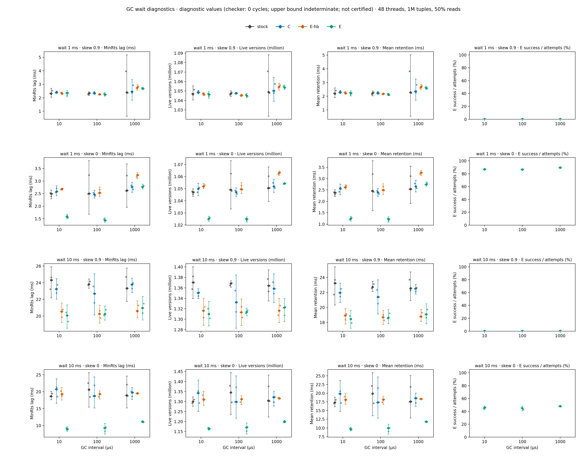
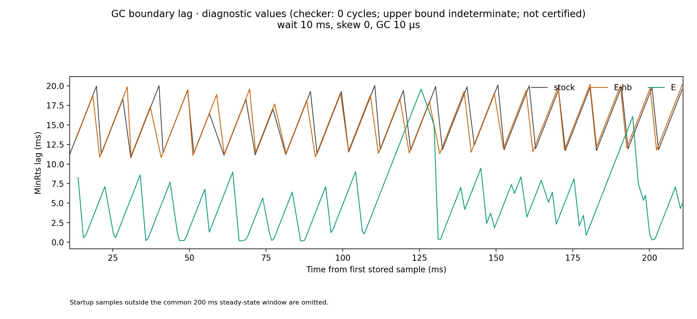

# forwarding の試作を Cicada の GC 回収境界へつなぎ、回収が実際に早まるかを測った (VHash 論文 md_14、構成 E、2026-09-29)

authority: none / default_effect: no-state-change (可変状態の正本は worklog 末尾と現行 phase doc)。
wave `dev-wave-vhash-gc-connection-prototype`、起点 local main `035fc11fa` (開始 gate fresh rc 0、2026-09-29 15:0x JST)、CCBench submodule = pin C `68106660` (動かしていない)。
job dir `/work/1/SFC/tanab/tmp/vhash-gc-connection-prototype-2026-09-29/` (段 1 brief・段 2 plan・段 3 相談 2 本・段 4 裁定・段 6 裁定 1〜7・Codex の prompt と報告・計算ノードの raw・変異の記録)。
依頼は `/work/1/SFC/tanab/tmp/vhash-2026-09-29/md_14.txt` と `common.txt` (job dir `inputs/` に逐語)。対象 item は worklog の [T-2900]。

**この文書の値は、正しさ検査 (§5) で巡回 0 を確かめた腕の計器入り build の診断値である。判定の上限は indeterminate で、certified・serializable とは書かない。throughput は計器なし build の値だけを使う。**

## 1. 依頼と結論

依頼 (md_14): 新規性の芯 U0 = 「abort せず既読を保った前進を、版データの回収境界へ反映して保持期間を縮める」を C++ の実物で確かめる。md_10 のモデルで安全と分かった形 (SP: 待機中の tx 自身が安全点で前進し、確定してから公開する、D2290) で md_6 の試作 (構成 C) を GC につなぎ (構成 E)、検査器で正しさを確かめたうえで、stock・C・E を同時刻に比べる。

結論:

1. **前進が成り立つ条件では、回収は実際に早まった。** skew 0・待機 10 ms・GC 間隔 10 µs で、前進と公開だけが違う主比較 E 対 E-hb は、回収境界の遅れの平均 8.9 ms 対 19.3 ms (−54%)、論理生存版数の平均 116.4 万 対 131.1 万 (−14.7 万)、版の保持時間の平均 9.6 ms 対 18.2 ms (−47%)。3 rep の値は重ならない (§4.2)。待機 1 ms でも遅れ −41%・保持時間 −53%。
2. **前進は「今」の時刻へ行くと、skew 0.9 ではほぼ失敗する。** E の前進の成功は試行の 0.05〜0.27% (失敗の 88〜96% が既読不一致)。10 key の既読のどれかが待機中にまず上書きされるためで、このとき E と E-hb は同じになる (§4.3)。md_6 の zipf 0.9 の条件だけで試していたら、U0 の効果は見えなかった。
3. **待機中の worker が GC flag を上げるだけ (E-hb) でも公開は再開するが、境界は長い tx に止められたまま。** skew 0.9・待機 10 ms で、公開は 3 秒あたり約 290 回から約 5,700 回へ戻り、遅れ −3.5 ms・生存版数 −4.7 万と小さく効く。MinRts を決めた thread が長い tx だった標本の割合は E-hb で 0.85〜0.99 に上がり、E で前進が成り立つと 0.13〜0.31 へ下がる (§4.4)。
4. **モデルで安全な手順を C++ へ写すとき、モデルに無い物理的な保護の前提を崩していた (途中で発見・修正)。** 段 4 の仮裁定 P5 (安全点で読み取り下限を最新の MinWts−1 へ上げる) は、待機中に既読版を回収・再利用させた (保持版検査で 3,938 件中 159 件)。修正後は全計測・全検査で 0 件 (§3.3)。
5. **正しさ: 巡回 0。** stock・C・E-hb・E の 10 run (前進の成功 294 回を含む) で判定器の巡回 0、trace の commit 行 = commit 数、読んだ版の食い違い 0、保持版の変化 0。壊し E (確定前に公開) の 2 run はどちらも SIGSEGV で異常終了した (§5)。判定の上限は indeterminate。
6. **throughput の差は検出できなかった。** 計器なし build の stock 比は wait 型で 0.96〜1.06。E が発火しない normal・many_ops でも 0.91〜1.05 ばらつくので、この幅の内側と読む (§4.5)。

図の読み方: 行 = wait_after_reads の 4 条件 (待機 1 ms / 10 ms × skew 0.9 / 0)、列 = (a) 回収境界の遅れの平均 (leader が 10 µs ごとに取る等間隔標本、ms)、(b) 論理生存版数の平均 (百万)、(c) 版の保持時間の平均 (ms)、(d) E の前進の成功率 (%)。横軸 = GC 間隔 (µs)、色 = 腕 (stock・C・E-hb・E)。小さい点が各 rep、菱形が rep 中央値、縦線は平均の 95% CI。

図の読み方: 同じ条件の rep 0 の等間隔標本を時系列で重ねた。起動直後の大きな遅れ (約 600 ms、ロード時の初期版の時刻に由来) を避け、3 腕とも遅れが初めて 100 ms を下回った時刻の最大値から 200 ms の窓を描いた (規則と各腕の開始時刻は provenance)。stock と E-hb は長い tx の待機ごとに遅れが 11〜20 ms まで伸びるのこぎり形で、flag だけでは形が変わらない。E は前進が成り立つ待機で遅れが 0〜9 ms に留まり、前進に失敗した待機 (図の 110〜130 ms・180〜195 ms 付近) だけ stock と同じく 20 ms 近くまで伸びる。表題の "diagnostic values" は計器入り build の値で、検査は巡回 0・判定の上限は indeterminate (certified でない) の意味。

## 2. 何を作ったか (仕様)

md_6 の patch (`patches/cicada-forwarding-variant.patch`) の上に重ねる `patches/cicada-forwarding-gc.patch` と、検査専用の壊し `patches/cicada-forwarding-gc-broken-early-publish.patch`。macro・knob・登録は `patches/README.md` の節が正本。要点:

| 腕 | 待機中の安全点 (待機 slice 100 µs の各末尾、要求 = GC 間隔経過 ∧ 自分の GC flag が 0) |
|---|---|
| stock | 安全点なし (md_6 と同じ単一 sleep)。待機中は flag を上げないので leader は公開できない |
| C | 同上。md_6 のアクセス駆動の前進だけ |
| E-hb | GC flag を立てるだけ。ThreadWtsArray・ThreadRtsArray は tx 開始時の値のまま。回収 (gc_versions) は呼ばない |
| E | E-hb に加えて前進を試す: t′ = 自 thread の clock から作る厳密に新しい時刻 → md_6 と同じ事前確認 → 既読版の rts を t′ へ CAS-max → seq_cst fence → 版列を観測し直して既読版が t′ で見えるか確認 → 確定 (wts_・localClock_・未設置版の wts・later_ver_) → **成功したときだけ** ThreadWtsArray := t′、ThreadRtsArray := max(旧, t′−1) を公開 → flag。失敗したら E-hb と同じ |

回収そのものは Cicada の gc_versions (後続の確定版より古い版を切り離す = md_10 の R10) を変えていない。

md_10 のモデルとの対応: G2 (rts を上げてから観測し直す)・G3 (確定)・G4 (確定の後の別 step で公開)・G6 (公開した値より古い時刻へ戻らない: 公開値は CAS-max、abort 後の再試行の ts は localClock_ ≥ (t′>>8)+1 で t′ より大きい) を満たす。**モデルの結論が直接及ばない点が 2 つある**: (1) t′ を「今」にしたこと (モデルの候補集合は「より新しい確定版の next_free」)、(2) 既読版の物理的な保護 (モデルは版ごとの refs、Cicada は §3.3 の暗黙の不変条件)。

## 3. 経緯 — 実機でだけ出た不具合と設計の訂正

### 3.1 段 2〜4 (設計)
段 2 plan の「待機位置を write の前へ移す」は、md_6 の前進が write set の未設置版を書き換えるので不要と裁定。段 3 の相談 A の弱メモリの指摘 (rts の CAS と版列の再観測、writer の版設置と rts の確認が互いを見落とす store-buffering 型) は、stock の validation 自身が同じ順序付けに依存し、計算ノード (Xeon Platinum 8468) では lock 付き CAS が全順序の fence を兼ねるので、E 固有の弱化ではないと裁定した (§7 の限界)。

### 3.2 計算ノードの smoke (5 回)
| 回 | request | 停止箇所 | 原因と直し方 |
|---|---|---|---|
| 1 | 35494 | 条件 gate が CICADA_LONGTX を拒否 | gate の前処理に要る masstree の config.h を作る macro なしの dependency build より前に gate を走らせていた → dependency build を先に (md_6 の smoke 5 回目と同型) |
| 2 | 35597 | inert 比較で transaction.cc 不一致 | 各挿入ブロックの `#line N` の直後の空行で論理行番号が 1 ずれ、`__LINE__` を展開する macro の値が変わった → `#line` を 8 箇所直す (md_6 の smoke 6 回目と同型) |
| 3 | 35653 | E の build が `-Werror=unused-parameter` | 計器 macro が空に展開されると引数が未使用 → `[[maybe_unused]]` 3 箇所。全 macro の組で `-fsyntax-only` を実 header で通した |
| 4 | 35673 | 合格。ただし §3.3・§4.3 の事実が出た | — |
| 5 | 35689 | 合格 (保持版の変化 0) | — |

### 3.3 仮裁定 P5 の誤り — 待機中に既読版が回収されていた
smoke 4 の保持版検査 (待機の開始で既読版の (pointer, wts, status) を控え、待機の終わりに照合) で、E-hb 159 / 3,938、E 174 / 3,882 の既読版が待機中に変わっていた。原因は段 4 の仮裁定 P5 で、安全点で ThreadRtsArray を最新の MinWts−1 へ上げていた。

stock Cicada で tx の既読版を物理的に守っているのは、**ThreadRtsArray = tx 開始時の MinWts−1 を tx の間変えない**ことである。これで回収境界 MinRts は、tx 開始後に確定しうる後続版の wts より小さく保たれる。待機中にこれを最新の MinWts−1 へ上げると、待機中に t0 より前の時刻で既読 key を上書きして確定した版 v があるとき、MinRts > v.wts になりえて、v より古い既読版が切り離され再利用される。md_10 のモデルでは版ごとの refs がこれを守っていたが、Cicada には refs が無い。

修正後 (§2 の表): E-hb と前進に失敗した E は下限を変えない。前進に成功した E だけ t′−1 を公開する (確認で「既読版が t′ で見える = 既読版と t′ の間に確定版も pending も無い」を確かめ、rts = t′ で t′ 未満の writer を止めているので、t′ より新しい確定版が現れて MinRts がそれを超えるまで既読版は回収されない)。以後、smoke 5・検査 2・本計測の全 run で保持版の変化は 0。

**この保持版検査は実際に発火する (到達可能な) 観測であることが、この誤りで示された。** 逆に、検査で 0 を確かめたことは「待機中に既読版の wts・status が変わらなかった」までで、物理参照の安全の証明ではない (§7)。

### 3.4 条件の追加 (skew 0)
smoke 4 で E の前進は 9,961 回中 4 回しか成功しなかった (既読不一致 9,740)。CCBench 論文の長い tx の実験 (§7.2、md_2 の workload A) は skew 0 なので、待機型に skew {0.9, 0} の軸を足した。

## 4. 本計測

### 4.1 条件

| 項目 | 値 |
|---|---|
| 機材 | Pegasus 計算ノード (gen_S、Xeon Platinum 8468、48 core)。1 job = 1 条件群、6 job を 6 台で同時刻に (request 35808〜35813、各 Elapse 293〜423 s) |
| commit | `e50b666bf` (6 本の detached 木) |
| Cicada 設定 | md_11 の rr50 の観測最良 `BACK_OFF=0, INLINE_VERSION_OPT=1, INLINE_VERSION_PROMOTION=0, REUSE_VERSION=1, WRITE_LATEST_ONLY=0` (md_11 §6)。numactl なし (md_11 と同じ) |
| 共通 | 48 thread、1M 件、rratio 50、max_ope 10、extime 3 s、clocks_per_us 2100 |
| wait_after_reads | 長い thread 4 本 (thid 44〜47)、10 read + 1 write の後に待機、待機 {1000, 10000} µs × skew {0.9, 0} × GC 間隔 {10, 100, 1000} µs |
| 対照 | normal (長い thread なし)・many_ops (1,000 操作、待機なし)、skew 0.9 × GC 間隔 3 値。E の安全点は発火しない |
| 腕と反復 | stock・C・E-hb・E。性能 = 計器なし build 3 rep、GC 指標 = 計器 build 3 rep (normal・many_ops は 1 rep)。rep ごとに腕の順序を回転。各 run の前に単独性確認 (競合 0) |
| 標本 | 等間隔標本 = leader が 10 µs ごと (呼び出しの遅れは経過間隔数で重み付け)。最初の公開の前 (MinRts = 0) は取らない |

raw (repo 外、job dir `jobs/meas-*/`) と集計: `data/gc-aggregate-compact.json` (集計から時系列だけを除いたもの。元の sha256 は同 JSON の `compaction`)。

### 4.2 主比較 E 対 E-hb (rep 中央値)

| 待機 / skew / GC µs | 遅れの平均 ms (stock / E-hb / E) | 生存版数の平均 千 (stock / E-hb / E) | 保持時間の平均 ms (stock / E-hb / E) | E の成功 / 試行 |
|---|---|---|---|---|
| 10 ms / 0 / 10 | 18.6 / 19.3 / **8.9** | 1,299 / 1,311 / **1,164** | 17.3 / 18.2 / **9.6** | 15,653 / 34,092 |
| 10 ms / 0 / 100 | 20.6 / 19.3 / **9.2** | 1,345 / 1,312 / **1,171** | 19.9 / 18.2 / **9.9** | 15,520 / 33,896 |
| 10 ms / 0 / 1000 | 18.9 / 19.5 / **11.2** | 1,304 / 1,316 / **1,199** | 17.6 / 18.3 / **11.8** | 3,589 / 7,500 |
| 1 ms / 0 / 10 | 2.50 / 2.68 / **1.58** | 1,047 / 1,052 / **1,025** | 2.38 / 2.62 / **1.24** | 43,767 / 50,222 |
| 1 ms / 0 / 100 | 2.50 / 2.53 / **1.44** | 1,049 / 1,050 / **1,025** | 2.46 / 2.49 / **1.22** | 43,887 / 50,650 |
| 1 ms / 0 / 1000 | 2.63 / 3.24 / 2.77 | 1,051 / 1,063 / 1,054 | 2.54 / 3.26 / 2.74 | 9,079 / 10,124 |
| 10 ms / 0.9 / 10 | 24.3 / 20.5 / 20.1 | 1,370 / 1,316 / 1,310 | 23.2 / 18.9 / 18.5 | 38 / 23,366 |
| 10 ms / 0.9 / 100 | 23.8 / 20.3 / 20.3 | 1,368 / 1,313 / 1,314 | 22.7 / 18.7 / 18.6 | 38 / 22,036 |
| 10 ms / 0.9 / 1000 | 23.3 / 20.6 / 21.0 | 1,364 / 1,316 / 1,322 | 22.5 / 18.8 / 19.1 | 22 / 8,617 |
| 1 ms / 0.9 / 10 | 2.33 / 2.34 / 2.36 | 1,047 / 1,047 / 1,046 | 2.21 / 2.22 / 2.24 | 19 / 38,698 |
| 1 ms / 0.9 / 100 | 2.33 / 2.25 / 2.23 | 1,047 / 1,045 / 1,045 | 2.22 / 2.17 / 2.12 | 23 / 44,023 |
| 1 ms / 0.9 / 1000 | 2.40 / 2.76 / 2.68 | 1,049 / 1,054 / 1,054 | 2.28 / 2.68 / 2.59 | 23 / 10,878 |

rep ごとの値 (見出しの条件、10 ms / 0 / 10): 遅れ E 9.26・8.71・8.93 ms、E-hb 20.24・18.76・19.32 ms、stock 18.64・18.58・19.47 ms。生存版数 E 1,167・1,161・1,164 千、E-hb 1,332・1,305・1,311 千。保持時間 E 9.89・9.48・9.63 ms、E-hb 19.04・17.86・18.17 ms。
C は stock とほぼ同じ (値は `data/gc-aggregate-compact.json`)。論理生存版数は「初期 N + validation での版設置 − gc_versions での切離し」で、物理メモリ量ではない (bytes 換算 = 版数 × (sizeof(Version) + 値 4 B) は集計の `estimated_live_bytes_*`)。

### 4.3 前進が失敗する理由
skew 0.9 の E は試行の 0.05〜0.27% しか成功せず、失敗の 88〜96% が既読不一致 (既読 key の版が t′ より前に上書きされている)、残り 4〜12% が t′ 未満の pending に当たった競合。「今」への前進は、既読のどれかが待機中に上書きされると成り立たない。skew 0 では成功率 45〜89% で、失敗はほぼすべて既読不一致。**前進先を「既読の可視区間に収まる最大の時刻」にする方策 (前進先の選び方の比較) は scope 外で、本 wave は測っていない。**

### 4.4 flag だけ (E-hb) と stock の差 — 補助比較
- 公開回数 (3 秒あたり): 待機 10 ms で stock 約 290 回 → E-hb 1,574〜5,807 回。待機 1 ms で約 2,600 → 約 10,000 回 (GC 間隔 1000 µs では差なし)。
- skew 0.9・待機 10 ms では E-hb が stock より遅れ −2.7〜−3.5 ms、生存版数 −3.8〜−5.1 万。skew 0 ではほぼ差がない (±2 ms 以内)。
- MinRts を決めた thread (等間隔標本での ThreadRtsArray の argmin) が長い tx だった割合: 待機 10 ms で stock 0.65〜0.82、E-hb 0.84〜0.99、E (skew 0) 0.21〜0.31。flag で公開を再開させると、境界は長い tx の開始時刻に張り付く。前進でそれが外れる。
- この比較は slice 化した待機と flag の両方を含む (stock・C は単一 sleep) ので、主比較 (E 対 E-hb) のようには 1 因子に帰属できない。

### 4.5 throughput (計器なし build、3 rep 中央値、stock 比)
wait 型 12 条件: C 0.975〜1.009、E-hb 0.968〜1.055、E 0.964〜1.053。E の安全点が発火しない normal・many_ops (腕の間で実行コードは同じ) でも 0.911〜1.053 の幅がある。**腕の間の throughput の差は、この揺れの幅の内側で検出できない。** md_11 の走行間 CV (0.4〜0.8%) より幅が大きいのは、1 run 3 秒・腕の交互実行の条件差と推定する (未検証)。

## 5. 正しさ検査 (md_3 の trace と判定器、D2279)

repo 外起動器 (md_6 の起動器の派生、job dir `launch_cicada_run_gc.py`、検査 2 回目で使った bytes は `jobs/verify2/launch_cicada_run_gc.used.py`、sha256 `a012586c…`) で、trace patch → md_6 → gc (→ 壊し) の TRACE=1 build を最良 genome で走らせた。job 35727.nqsv (Elapse 237 s、commit `e50b666bf`)。結果 = `data/verify-result-compact.json`。

| build | cell | run | 巡回 | 判定 | C 行 = commit | 読んだ版の食い違い | 保持版の変化 | 前進の成功 (E の安全点) |
|---|---|---|---|---|---|---|---|---|
| STOCK | tuple 50・zipf 0.9・長い thread 2・待機 10 ms・GC 10 / 100 | 2 | 0 | indeterminate | 一致 | 0 | 0 | — |
| C | 同 | 2 | 0 | indeterminate | 一致 | 0 | 0 | — (アクセス駆動の前進 2,641・2,963) |
| E (hb / e) | 同 | 4 | 0 | indeterminate | 一致 | 0 | 0 | e: 2・0 |
| E (hb / e) | tuple 10,000・skew 0・同 | 2 | 0 | indeterminate | 一致 | 0 | 0 | e: 294 |
| 壊し E | tuple 50・zipf 0.9・GC 10 / 100 | 2 | — | — | — | — | — | 2 run とも SIGSEGV (rc −11) で異常終了、計数行なし |

- integrity の数値項目 (orphan_reads・version_dups ほか 11 項目) は全 run 0。`integrity.clean` は Cicada に証拠面が無いので構造上 false (md_3 §3)。
- **言えること:** 実測した YCSB point read / update と待機型の長い tx の履歴で、前進の成功を含む状態でも判定器は巡回を検出せず、待機中の既読版は変わらなかった。
- **言えないこと:** serializable・certified (上限 indeterminate)。壊し E の異常終了は、正常の 10 run が 1 つも落ちていないことに対する強い差の信号だが、回収済みの版への参照が原因だとは core を解析していないので断定しない。壊し E は計数行を出す前に落ちたので「到達」は記録されていない。
- 検査 1 回目 (35674、fix 前の commit 528b5a982) は、起動器が dependency build をせず gate が全 build を拒否して run 0 で終わった (起動器を直して 2 回目)。

## 6. 変異 (login では殺せない C++ の論理は §3.3・§5 の実機観測で扱う)

独立 clone (D1009) を対象 commit に固定し、束ね経路 (D842、`dispatch_compute.py --task mutation`) の 1 job で走らせた。対象テスト = `orchestrator/tests/test_vhash_forwarding_prototype.py`・`orchestrator/tests/test_condition_meaning_gate.py`。

| 段 | request | commit | 結果 |
|---|---|---|---|
| probe (全件 SURVIVED 期待で赤 node を集める) | 35659 (238 s) | 610f182be | 10 変異すべてで赤 node を観測、baseline PASSED |
| final | 35801 (392 s) | e50b666bf | KILLED 9・MISMATCH 1 (MF6)・baseline PASSED |
| erratum 再走 (MF6) | 35814 (129 s) | e50b666bf | KILLED 1・baseline PASSED |

変異: MG1 (待機 macro の companion から LONGTX を外す)、MG2 (計器 macro の site 数を 1 減らす)、MD1 (計数 build を性能集計に入れる)、MD2 (計数行の重複を受け入れる)、MD3 (未知 key を受け入れる)、MD4 (腕順の回転を止める)、MD5 (欠けた cell を受け入れる)、MF3 (smoke が前進成功 0 を受け入れる)、MF6 (欠けた job を受け入れる)、MS1 (dependency build を落とす)。**MF6 の erratum:** probe は skew 軸を足す前の commit で取ったので、期待 node が古いテスト 1 件だった。final では skew 軸と同時に新設されたテスト `test_gc_aggregate_rejects_each_missing_job[0..5]` の 6 件が殺した。初回結果は消さずに残し、期待 node を観測の 6 件に改めて再走した (DW-M02)。記録: job dir `mutation/`。
**段 6 の real 所見 (MF3・MF6・MS1) の変異は fix の後に登録した** (DW-M01 は fix の前を求める)。事前登録が遅れたことを記録する。

## 7. 確かめたこと / 確かめていないこと

確かめたこと (実測):
- 3 新 macro 未定義で transaction.cc・ycsb_cicada.cc の前処理が md_6 適用後と一致 (smoke 3〜5 の inert 比較)。3 macro とも条件 gate の supply / meaning が admitted (smoke・本計測の全 build)。
- 正しさ検査 (§5)、保持版検査 0 (§3.3)、本計測 (§4)、変異 (§6)。焦点テスト (29 file、最終 commit で 3,693 passed・8 skipped)。

確かめていないこと・限界:
- **serializability** (上限 indeterminate)。弱メモリの store-buffering 型の順序付けは stock と同じく x86 の lock 付き CAS の順序保証に依存する (C++ の抽象機械では保証されない)。Cicada 実装と試作に対する記憶順序・時刻の一意性の照合は [T-2906] の対象。
- **t′ を「今」にした前進は md_10 のモデルの結論の外**。前進先の選び方の比較は別 item。
- **物理参照の安全の証明ではない。** 保持版検査は待機の前後の wts・status の照合で、待機の後から commit までの窓、同じ wts での再利用、read set 外の探索中の pointer は見ない。
- 論理生存版数は物理メモリ量ではない (REUSE_VERSION=1 の pool は縮まない)。保持時間は切り離した版だけの分布で、計測終了時に残る版は含まない。時間は timestamp 空間 (clock boost を含む)。
- 1 run 3 秒・3 rep。長時間の定常・他の thread 数・レコード数・workload は測っていない。md_11 の最良 genome は skew 0.9 で較正したもので、skew 0 の最良は確かめていない。
- throughput の差 (§4.5 の幅の内側)。
- 止まった thread の代行 (HP、別 item)、物理的な hot 配置 (VHash 本体)。

## 8. 次の版 (docs/paper-story-vhash/ 2 版目) へ

- U0 の実物の証拠: skew 0・待機 10 ms で回収境界の遅れ −54%、保持時間 −47%、生存版数 −11% (主比較、§4.2、図 1・図 2)。
- 条件の限界: skew 0.9 では「今」への前進がほぼ成り立たない。前進先の選び方が次の研究課題 (既読の可視区間に収まる最大の時刻など)。
- 設計上の教訓: モデルの版ごとの refs に当たるものが Cicada では「tx 開始時の下限を変えない」という暗黙の不変条件で、公開の手順を写すときに崩しやすい (§3.3)。
- 図: `figures/gc-connection.png`、`figures/gc-connection-mechanism.png` (生成器 `make_figures.py`、provenance 同名 `.provenance.json`)。

## 9. 計算資源

| 用途 | job (request / Elapse) |
|---|---|
| smoke | 35494 / 18 s、35597 / 37 s、35653 / 61 s、35673 / 109 s、35689 / 110 s |
| 正しさ検査 | 35674 / 21 s (起動器の不具合で run 0)、35727 / 237 s |
| 本計測 | 35808 / 417 s、35809 / 419 s、35810 / 421 s、35811 / 423 s、35812 / 294 s、35813 / 293 s |
| 焦点テスト | 35490 / 291 s、35519 / 164 s、35590 / 161 s、35652 / 165 s、35802 / 164 s (ほか 1 回は待ち行列の上限で子が起動せず 0 s) |
| 変異 | 35659 / 238 s、35801 / 392 s、35814 / 129 s |

合計 4,564 s (約 1.27 node 時間、受入の全走を除く)。2 node 時間未満。
