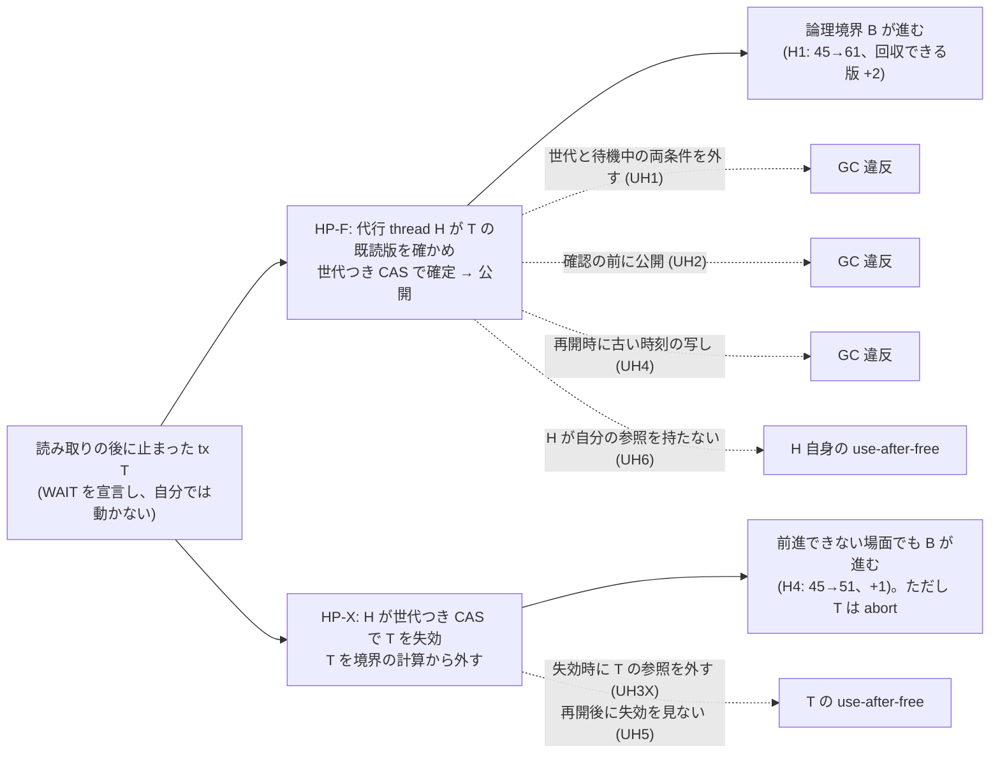
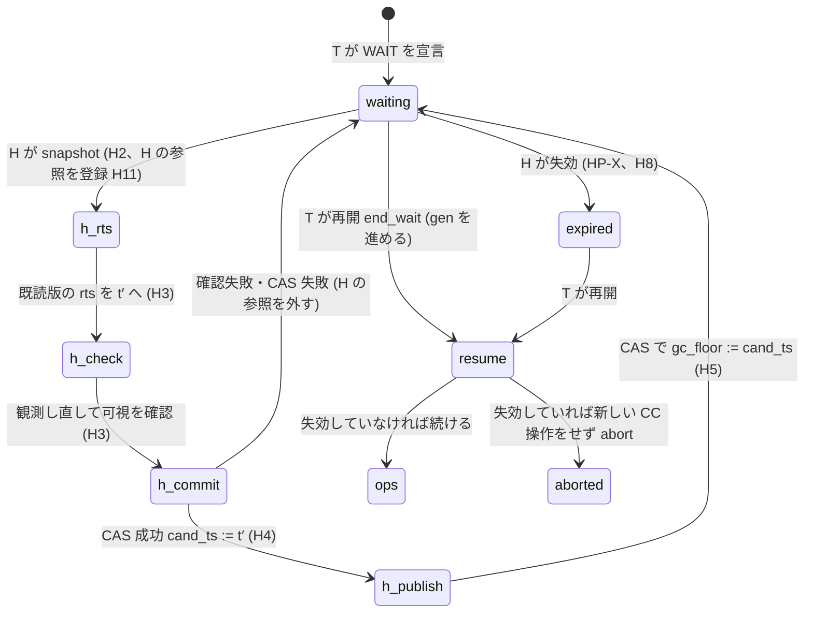

# 止まった tx を別の thread が前進・失効させる形 (HP) と物理参照の保護の小さいモデルと全探索 (VHash 論文 出典メモ §15.1・§16.2、[T-2901])

- 着手: 2026-09-29 (dev-wave `dev-wave-vhash-helper-forwarding`、背景 job、ユーザー就寝中)
- 依頼: `/work/1/SFC/tanab/tmp/vhash-2026-09-29/md_16.txt` (並行 VHash wave の md_16)
- 実装: `tools/vhash_forwarding_model/` (新規 `helper.py`、`model.py`・`judge.py`・`scenarios.py`・`cli.py`・`gc_connection.py` を拡張) と新 test `orchestrator/tests/test_vhash_forwarding_model_helper.py`。実装 commit は本 README と同じ branch の 3 本: 統合 e5a825d57、fix 統合 51937a301 (fix1〜fix3)、25a8d957d (fix4)
- 土台: md_10 の一次資料 `output/insights/2026-09-29/vhash-gc-connection-model/README.md` (規則 G1〜G7、SP、設計判断 D2290) と md_4 の一次資料 `output/insights/2026-09-29/vhash-forwarding-model/README.md` (R1〜R10・O1)。G・R の番号はそちらの定義
- 出典メモ: `docs/paper-story-vhash/source-memo-2026-09-29.md` (構想の記録であり一次資料ではない)。「メモ §N」はこの file の節番号

## 0. 一目でわかる結論



図の読み方: 実線は採用した手順とその効果 (モデル内の数)、点線は「その規則を 1 つだけ崩した危ない版で違反が出た」= その規則が必要だった、を表す。範囲付きの探索結果の要約であり、一般の証明ではない (範囲は §9)。

| 問い (md_16) | この wave で得たもの (範囲は §9) |
|---|---|
| HP の候補を仕様にする | 規則 H1〜H11 (§2)。再開時の扱いは 2 つ: 前進を受け入れる HP-F、失効させて abort する HP-X (§3) |
| 全探索で serializability と GC 安全を確かめる | 場面 H1〜H6 × 健全版 5 方針 = 30 構成すべてで違反なし、90 構成すべて探索完了 (§5.1) |
| 危ない版 (世代を見ない CAS・確定前の公開・参照が残る版の回収) で検査器が反例を出すか | 世代と待機中の両条件を外す CAS (UH1)、確定前の公開 (UH2)、失効時に参照を外す (UH3X) はいずれも反例。**世代だけを外す (UH1g) は反例なし** (単一 WAIT では待機中の条件が世代の代わりになり、故障が結果を変える step が 1 度も無い)。公開時に参照を外す (UH3F) は反例なし (md_10 の UG2r と同じ理由) (§5.2・§5.4) |
| 途中で見つかった HP 固有の規則 | **代行 thread H 自身も、snapshot した既読版を自分の参照として保護しなければならない (H11)。** 保護しないと、H が作業中に T が終わって参照を外し、GC が回収した版に H が触れる (UH6、H3・H4・H5 で use-after-free) (§5.3・§11) |
| 論文の対象に入れるか | **入れない (限界として書く)。** CCBench の長い tx は busy-wait で thread は走り続けるので SP で扱える。Cicada の GC は全 thread の静止の印がそろわないと境界を更新せず、止まった thread の印を代わりに立ててよい条件は未検査。実装の費用も大きい (§7) |

## 1. 目的と、何を確かめたか

md_10 は、読み取りの後に待つ tx が**自分で**待機の安全点に来て前進する形 (SP) を固定場面で反例なしとした。止まった thread (安全点に来ない) を**他の thread が代わりに**前進させる形 (HP) と、そのときの物理参照の解除 (メモ §15.1 の段階 C) は未検査だった (md_10 §3・§7、D2290 の却下理由)。読み取りの後に待ち続ける tx は GC を止める典型であり (メモ §16.1)、HP を扱えるかは論文の対象範囲を決める。この wave は次を行った。

1. HP の手順を規則 H1〜H11 として仕様にした (§2)。止まった tx が再開したときの扱いを 2 つ置いた (§3)。
2. md_10 のモデルに代行 thread H・世代つき CAS・失効・再開後の順序・H 自身の参照を足し、場面 H1〜H6 を全探索した (§4・§5)。
3. わざと危ない版 9 種 (うち診断 1 種) で検査器が反例を出すかを確かめた (§5)。
4. 回収境界の前進と回収できる版の数を、公開と失効に分けてモデルの中で数えた (§6)。
5. CCBench の Cicada 実装の GC の門と長い tx の作り方を逐語で確かめ、論文の対象に入れるかを codex の賛否 2 立場の相談を経て決めた (§7・§8)。
6. 既存の 63 + 60 構成 (md_4・md_10) の結果が 1 行も変わらないことを確かめた (§12)。

**確かめていないこと**は §9 にまとめる。とくに「反例なし」は、固定した 6 場面の初期状態から、定義した原子 step の全 interleaving を探索し尽くした、という意味に限る。

## 2. 仕様 (既存 R1〜R10・O1・G1〜G7 は変えない)

新しい振る舞いは `pressure="helper"` と `resume` の option でだけ開く。既定 (`pressure="off"`/`"self"`) の状態空間・遷移・判定・効果は変えない (§12)。

| 規則 | 内容 | 既存規則との関係 |
|---|---|---|
| H1 待機の宣言 | 場面の tx は WAIT を 1 つだけ持つ。pc が WAIT、phase が ops、時刻を確定しておらず、PENDING を持たず、失効していない tx を「待機を宣言した tx」とする。`pressure="helper"` では SP の要求・前進は開かない | G7 の待機区間 |
| H2 snapshot | 代行 thread H (1 本) が idle で、待機を宣言した tx T があるとき、G7 の候補 (cand_ts より新しい確定版ごとの next_free(wts+1)) のうちこの待機で未試行の t′ を非決定的に選び、T の世代 gen・cand_ts・既読版を 1 step で H の局所状態へ写す | G7 の候補と過大近似 |
| H3 保護と確認 | H は既読版ごとに rts := max(rts, t′) (1 版 1 step)、続いて版ごとに観測し直して t′ で同じ版が可視か確かめる (1 版 1 step)。対象の版や観測で選ばれた版が回収済みなら、H の接触として use-after-free の判定に出す | G2・R5 と同じ順序 |
| H4 確定 | 全確認に成功したら CAS: 条件「T の gen が snapshot と同じ、かつ T がまだ待機を宣言している」。成功で cand_ts := t′、gen を 1 進め、確定前の時刻を記録する。失敗なら T を変えない | G3・R6 |
| H5 公開 | 別 step の CAS: 条件「T の gen が H4 の後の値と同じ、かつ T がまだ待機を宣言している」。成功で gc_floor := max(gc_floor, cand_ts)。失敗なら何も書かない | G4・R7。確定と公開の両方を世代で覆う (md_10 §3 の必要条件) |
| H6 世代を進める step | T の end_wait (取り消しを含む)、H の H4 成功、H の失効 (h_expire)。T が待機中に行える自分の step は end_wait だけ | — |
| H7 HP-F の再開 | end_wait は gen を進め、共有 descriptor の cand_ts をそのまま使って続ける。option `revert_after_confirm` のときだけ、H4 済み・H5 前に「確定前の時刻へ戻る」取り消しを非決定的に許す | md_10 §5.5 の取り消しの HP 版 |
| H8 HP-X | H の 1 step `h_expire`: 待機を宣言している T を失効させ gen を 1 進める。失効した T は回収境界 B の計算から外す。**失効した T の参照は GC が引き続き尊重する** | G5・R10 のまま |
| H9 再開後の順序 | end_wait の後、T は「既読値を使う (参照している版に触れる)」を失効の確認の前に行う順序と行わない順序の両方を取りうる (過大近似)。失効していれば新しい CC 操作をせず abort する | — |
| H10 失効した tx と J3 | J3 の回収判定は、失効した T について参照の理由を残し、既読記録・将来の読み取り・時刻の低下の理由を除く (abort が確定しているので論理的な必要は消える)。実際の接触は従来どおり use-after-free | D2282 決定 4 (論理状態で判定) |
| H11 代行 thread の参照 | H は snapshot の step で既読版を H 自身の参照として登録し、idle へ戻る step で外す。GC・回収可能数・J3 は H の参照を含める | 段 6 で判明 (§5.3) |

**原子性:** H2 は descriptor 1 個の観測、H3 は 1 版の rts 書き込みか 1 キー版列の観測、H4・H5・h_expire は descriptor 1 個への CAS と H の局所状態の更新。CAS を 1 step とするのは descriptor を単一の原子オブジェクトとみなす抽象であり、複数 word の C++ 更新をこの抽象へ置き換えられるかは未証明。

### 2.1 状態遷移 (止まった tx と代行 thread、値なしの模式)



## 3. 再開時の 2 方針と物理参照

| | HP-F (前進を受け入れる) | HP-X (失効させて abort) |
|---|---|---|
| 止まった T の論理境界 (段階 B) | H が前進を公開すれば進む。前進の確認が通らない場面 (H4) では進まない | 失効で T を境界から外すので、前進できない場面でも進む |
| 再開した T | descriptor の時刻を読み直して続ける。H の確定の後・公開の前に再開すると H の公開は失敗し floor は古いまま (安全側) | 新しい CC 操作の前に失効を見て abort。実行済みの仕事は失う (U0 の「仕事を保つ」答えにならない) |
| T の物理参照 (段階 C) | T の既読版は t′ でも可視なので論理境界が守る。公開時に T の参照を外しても違反は出ない (UH3F)。ただしこれは版ごとの参照の抽象の中の結論 | T の参照を GC が尊重し続ける必要がある。失効時に外すと、再開した T が回収済みの版に触れる (UH3X) |
| 代行 thread の物理参照 | H は snapshot から idle へ戻るまで既読版を自分で保護する (H11)。保護しないと H が回収済みの版に触れる (UH6) | 同左 |

**Cicada の粗い静止の門との関係 (逐語は §7):** Cicada は全 thread の `GCFlag` がそろったときだけ回収境界 `MinRts` を更新し、`GCFlag` は tx の後の保守処理 (`mainte`) でしか立たない。止まった thread の印が立たない限り、その thread への HP による前進は次の `MinRts` 更新に反映されない (それ以前の `MinRts` による回収は続く)。モデルの「版ごとの参照を GC が尊重する」は、この粗い門と同じ仕組みではない。止まった thread の `GCFlag` を代わりに立ててよい条件は、このモデルで検査していない。前進の公開に成功しただけでは代わりの宣言を正当化できない (段 3・段 6 の相談で両立場が一致)。

## 4. 場面

いずれもキー 2、K = 1、効果の対象 tx は T、T の WAIT は 1 つ、代行 thread H は 1 本 (+ GC 1 thread)。

| 場面 | 初期版 | tx と操作 | 窓 witness (割り込みの窓を通ったこと) | 危険結果 witness (判定器を呼ばない状態・step の述語) |
|---|---|---|---|---|
| H1 | A20, B40, B60 | T@45: R A, WAIT / W@50: W B | T が再開前 (pc 1) のまま H の公開が済み、その後 GC が floor を読む | 定義しない (効果用) |
| H2 | A20, B40, B60, B80 | T@45: R A, WAIT, R B | H の snapshot の後に T が end_wait し、その後に H の確定 (成否を問わない)、または H の確定の後・公開の前に T が再開 (取り消しを含む) | T が活動中・失効なしで、gc_floor が cand_ts より上のまま、T の時刻で T が必要な B の版が回収される、または T・H が回収済みの B の版に触れる |
| H3 | A20, B40, B60 | T@45: R A, WAIT, R B / W@50: W A | GC の read_floor の時点で、H が T の確認の途中か後にいて失敗の印があり、H の target で見える A の版が W:A、T は時刻 45 のまま待機中 | T が活動中・失効なし・時刻 45・まだ B を読んでいない状態で B40 が回収される |
| H4 | A20, B40 | T@45: R A, WAIT, R B / W@50: W A, W B | H の失効 → GC の回収 → T の end_wait | 失効した T が回収済みの版に触れる |
| H5 | A10, B11, B25 | T@15: R A, WAIT, W B / W@20: R B, W A | H の確認の途中で W が A へ設置 (H の確定の前) | T と W がともに commit し、互いに相手が読んだ版より新しい版を書いた (write skew の閉路) |
| H6 | A20, B40, B60 | T@45: R A, WAIT / U@35: R A, WAIT | T だけ公開され U は旧 floor のまま GC が floor を読む | 定義しない (効果用、md_10 G2 と同形) |

H4 は段 4 の初案 (A20, A50, B40, B60、書き手なし) から実装子が変えた。初案では T が WAIT の前に前進できて、物理参照の窓を作れなかった。H4 では W の A50 のために HP-F の確認が必ず失敗し、HP-F では前進できない (HP-X だけが境界を動かす場面)。

## 5. 結果

親が最終の実装 commit 25a8d957d で CLI を 90 構成について実行した生出力: `raw/` (1 構成 1 JSON、要約は `raw/summary.tsv`)。**90 構成すべて探索完了 (打ち切りなし)**。H6 の helper 構成は 42 万〜343 万状態・37〜284 秒。

### 5.1 健全版 (J1 / J2 / J3 の違反の有無、訪問状態数)

`0` = 違反なし。「+取消し」は option `revert_after_confirm` (H7)。off = 前進なし、self = md_10 の SP (T が自分で前進する。T が止まった schedule では働かない)。

| 場面 | off | self (SP) | HP-F | HP-F + 取消し | HP-X |
|---|---|---|---|---|---|
| H1 | 0/0/0, 330 | 0/0/0, 1,444 | 0/0/0, 13,282 | 0/0/0, 15,226 | 0/0/0, 19,186 |
| H2 | 0/0/0, 102 | 0/0/0, 524 | 0/0/0, 6,290 | 0/0/0, 8,162 | 0/0/0, 7,982 |
| H3 | 0/0/0, 2,502 | 0/0/0, 5,060 | 0/0/0, 54,666 | 0/0/0, 67,498 | 0/0/0, 62,320 |
| H4 | 0/0/0, 865 | 0/0/0, 1,031 | 0/0/0, 3,006 | 0/0/0, 3,006 | 0/0/0, 4,155 |
| H5 | 0/0/0, 1,360 | 0/0/0, 10,116 | 0/0/0, 85,189 | 0/0/0, 95,489 | 0/0/0, 105,487 |
| H6 | 0/0/0, 460 | 0/0/0, 15,586 | 0/0/0, 630,917 | 0/0/0, 834,327 | 0/0/0, 1,109,519 |

- 危険結果 witness (H2〜H5) は健全版の全構成で未到達。窓 witness は HP の全健全構成で到達した。ただし H4 の HP-F は窓 (失効の窓) を定義上通らない (失効しない方針なので)。
- helper の健全構成では、全到達状態で「失効していない tx の gc_floor ≤ cand_ts」が成り立った (`floor_above_cand_states` = 0)。test でも state_invariant で確かめている。

### 5.2 危ない版 (健全版から 1 規則だけを崩す)

`fault_step_seen` = 故障がその step の結果を変えた (健全版なら別の結果になる) step を通った列があったか。違反が出た構成は J3 の最初の理由と最短反例列の長さ。

| 危ない版 | 崩した規則 | 違反が出た場面 (理由・列長) | 違反なしの場面 |
|---|---|---|---|
| UH1 | H4・H5 の CAS から世代と待機中の両条件を外す (盲目の書き込み) | H2 future_read (18 step、J2 も 1) | H1・H4・H5・H6 (H3 は J2 だけ、J3 0) |
| UH1g (診断) | H4・H5 の CAS から世代比較だけ外す (待機中条件は残す) | なし | 6 場面すべて。**`fault_step_seen` も 6 場面すべて False** |
| UH1p | H5 (公開) の CAS 条件だけ外す | 取消しありで H2 future_read (11)、H3 future_read (22)、H5 use_after_free (27) | 取消しなしでは 6 場面すべて違反なし (H1・H2・H3・H5・H6 で故障が結果を変える step は通った) |
| UH2 | H の snapshot の step で gc_floor := t′ を公開する (確認より前) | H2 future_read (4)、H3 future_read (15)、H4 future_read (17)、H5 use_after_free (21) | H1・H6 |
| UH3F | H5 (公開) の成功時に T の参照を外す | なし | 6 場面すべて (H1・H2・H3・H5・H6 で故障 step を通った) |
| UH3X | 失効 (h_expire) のときに T の参照を外す | H3 use_after_free (16)、H4 (19)、H5 (24) | H1・H2・H6 |
| UH4 | 再開した T が descriptor を読み直さず、確定前の自分の時刻で続ける | H2 future_read (11)、H3 future_read (22)、H5 use_after_free (27) | H1・H4・H6 |
| UH5 | 再開後の失効の確認を省き、失効した T が ops を続ける | H2 use_after_free (7)、H3 (18)、H4 (20)、H5 (21) | H1・H6 |
| UH6 | H が snapshot した既読版を自分の参照として登録しない (H11 を外す) | H3 use_after_free (36)、H4 (39)、H5 (38) | H1・H2・H6 |

- J1 (閉路) はどの構成でも 0。H5 の write skew 形でも、健全版・危ない版とも閉路は出なかった (H の確認と commit 時の検証が遮る。md_10 の UG3 単独と同じ構造)。
- J2 単独の違反 (UH1 の H3) は md_4 と同じく serializability の反例ではない。
- test で固定したもの (新 test file): UH1・UH1p (+取消し)・UH4 の H2 の反例列の再生、UH2 の H3 の反例列の再生 (5,000 状態で打ち切った探索から。完全探索の主張には使わない)、UH3X・UH5・UH6 の H4 の反例列の再生、UH1g・UH1p (取消しなし)・UH3F の H2 での窓到達と違反なし。**残りの行は CLI の生出力 (`raw/`) だけ**で、test では固定していない。

### 5.3 反例列の読み (親が列の時刻と持ち主を読んで確かめた)

- **H2 + UH1 (18 step):** T@45 が A20 を読んで待機。H が t′ = 61 で snapshot する。T が再開し、R B の cold 読みでアクセス駆動の forwarding により 81 へ前進して floor 81 を公開する。その後 H が A20 の rts を上げて 61 での可視を確かめ、**世代も待機中も見ずに** cand_ts := 61 と書く (T の時刻が 81 → 61 に下がる)。GC は floor 81 で B60 を回収する (後続 B80 ≤ 81)。T はまだ B を読んでおらず、61 で読むと B60 が要る → J3 (future_read)。健全版では T の end_wait で世代が進み、H の確定は失敗する。
- **H2 + UH1p + 取消し (11 step):** H が 61 で確定する。T が再開して未公開の前進を取り消し 45 へ戻る (H7、健全版で許される)。その後 H が**世代を見ずに**公開し floor 61 が残る。GC が B40 を回収し、T は 45 で B40 が要る → J3。取り消しが無いと H の遅れた公開は cand_ts 以下なので違反にならない。**公開の CAS を世代で覆う規則は、再開した tx が未公開の前進を取り消せる実装でだけ必要**だった。
- **H2 + UH4 (11 step):** H が 61 で確定・公開する。T が再開するとき descriptor を読み直さず 45 で続ける。GC が floor 61 で B40 を回収し、T は 45 で B40 が要る → J3。md_10 の UF1 (公開の後に古い時刻へ戻る) と同じ形。
- **H3 + UH2 (15 step):** W@50 が A に A50 を設置して commit した後、H が 61 で snapshot し、UH2 はその時点で floor 61 を公開する。GC が B40 を回収する。H の確認は A50 のために失敗し T は 45 のまま、45 で B40 が要る → J3。md_10 の UG1 と同じ形。
- **H4 + UH6 (39 step):** H が T (A20 を読んで待機) を snapshot するが、UH6 は A20 を H の参照に登録しない。T が再開し、前進の確認が A50 のために失敗して 45 で B40 を読み、commit して参照を外す。GC が境界 51 で A20 を回収する (後続 A50 ≤ 51)。**H がまだ snapshot を持っていて、A20 の rts を書く → H 自身の use-after-free。** 健全版では H の参照が回収を止める (H11)。
- **H4 + UH3X (19 step):** H が T を失効させ、UH3X は T の参照を外す。T が end_wait した後、GC が A20 を回収し、T が失効の確認の前に既読値を使って A20 に触れる → use-after-free。失効の確認を先にする順序では違反にならない (H9 の両順序を探索した)。
- **H4 + UH5 (20 step):** H が T を失効させる。T は再開後に失効を見ずに続け、GC は T を境界から外して B40 を回収しており、T の R B が回収済みの B40 に触れる → use-after-free。

時刻の重複などモデル自身の欠陥による偽の反例は見つからなかった (全到達状態で時刻の一意性を検査している、md_4 §3.3)。

### 5.4 反例が出なかった危ない版と、その理由

- **UH1g (世代だけ外す):** 単一 WAIT の場面では、待機を宣言している T の世代を変えるのは H 自身の確定と失効だけで、T の end_wait は待機中の条件を同時に外す。したがって「待機中」の条件が世代の比較と同じ判定をし、故障が結果を変える step が 1 度も無い (`fault_step_seen` = False)。**これは世代が不要という結論ではない。** 再待機 (同じ tx が 2 度 WAIT する)・代行 thread の複数化・descriptor の再利用では待機中の条件が世代の代わりにならない可能性があり、この範囲 (§9) の外である。
- **UH1p (取消しなし):** HP-F で再開した T は H の確定した時刻を受け入れ、それより下へ戻る遷移が無い。H の遅れた公開は cand_ts 以下で、安全側にしか働かない (§5.3)。
- **UH3F (公開時に T の参照を外す):** md_10 §5.4 の UG2r と同じ理由。H の確認に成功した既読版は t′ でも見えており、t′ 以下の書き手は rts で遮られ、t′ より新しい後続版は境界 ≤ t′ の間は回収の根拠にならない。**版ごとの参照の抽象の中の結論であり、物理参照を早く外してよいという証明ではない。**
- **UH3X・UH6・UH5 が H1・H2・H6 で違反なし:** これらの場面には、失効後・H の作業中に回収される既読版 (後続版を持つ既読版) が無いか、再開後に読む版の回収が起きない。
- **UH2・UH4 が H1・H6 で違反なし:** WAIT の後に読み取りが無いので、T が必要とする版が無い。

### 5.5 戻れる段階と戻れない段階 (md_10 §5.5 の HP 版)

| 段階 | 結果 (範囲は §9) |
|---|---|
| H の確定 (H4) の前に T が再開 | H の確定は世代 (または待機中の条件) で失敗し、T は元の時刻のまま。健全版で反例なし |
| H の確定の後・公開 (H5) の前に T が再開 | HP-F は「受け入れる」と「取り消して確定前の時刻へ戻る」の両方で反例なし。ただし取り消しを許すなら H の公開は世代で覆う必要がある (UH1p + 取消し) |
| H の公開の後に T が再開 | 公開された floor より古い時刻へ戻ると GC 違反 (UH4)。descriptor を読み直す必要がある |

## 6. 効果の数 (メモ §15.4、モデル内の数であって性能値ではない)

数え方は md_10 §6 と同じ: T が WAIT にある到達状態 (= 再開前。T の WAIT は 1 つで、WAIT から出る T の step は end_wait だけなので、「pc が WAIT」と「WAIT 以後 T が 1 step も進んでいない」は同値。test で確かめた) で、帰属できる差 = H の公開 (または失効) の直後の状態と、そこから T の gc_floor だけを戻した (失効なら失効を戻した) 対照状態の、回収境界 B と回収できる版の数 freed の差。前進と失効は別に数えた (`attributable_by_op`)。

| 場面 | SP (T が自分で前進する schedule) ΔB / Δfreed | HP-F (H の公開) ΔB / Δfreed (対照 → 直後の B) | HP-X の失効 ΔB / Δfreed (対照 → 直後の B) |
|---|---|---|---|
| H1 | 16 / 2 | 16 / 2 (45 → 61) | 16 / 2 (45 → 61) |
| H2 | 36 / 2 | 36 / 2 (45 → 81) | 36 / 2 (45 → 81) |
| H3 | 16 / 1 | 16 / 1 (45 → 61) | 16 / 1 (45 → 61) |
| H4 | なし | なし (前進の確認が A50 のために通らない) | **6 / 1 (45 → 51)** |
| H5 | 12 / 1 | 12 / 1 (15 → 27) | 13 / 1 (15 → 28) |
| H6 | 17 / 1 | 17 / 1 (45 → 62) | 16 / 1 (45 → 61) |

- **SP の値は、T が待機中に自分で前進する schedule でだけ生じる。** T が止まった schedule では、SP の公開は T 自身の step なので起きず、帰属差は生じない。HP-F と HP-X の値は T が WAIT から 1 step も進まない状態で生じる。HP-F の値は SP と同じで、差は「T が止まっていても効く」ことだけである。
- HP-X は H4 のように前進できない場面でも境界を進めるが、T は abort して実行済みの仕事を失う (U0 の「仕事を保つ」答えではない)。
- Δfreed の内訳はすべて「今回収できる」版 (回収済みの差は 0)。
- **H11 の影響:** H が作業中 (snapshot から idle まで) は H の参照が T の既読版の回収を止める。上の帰属差はこの停止を含むモデル内の値で、H の静止の宣言や Cicada の `MinRts` の更新を表さない。
- 以上はモデルの時刻と版の数であり、実システムの保持時間・メモリ量・throughput を表さない。

## 7. 論文の対象に入れるか (md_16 の判断)

**決定: HP は VHash 論文の対象 (C++ 試作・評価・本文の主張) に入れず、限界として書く。** 本文の U0 は、待機中に要求を確かめられる tx (SP) に限る。HP のモデル結果と必要条件はこの一次資料に残し、再審するときに持ち込む規則として §8 に記録する。付録に置くかは論文ストーリーの次の版の wave が決める。設計判断は本 wave の decisions fragment (`docs/spool/decisions/2026-09-29-dev-wave-vhash-helper-forwarding-2.md`。fold 後は `docs/decisions.md` の「止まった tx を別の thread が前進・失効させる形 (HP) は VHash 論文の対象に入れず限界として書く」の見出し)。

判断は codex の 2 立場の相談 (判断役: 本文は SP、HP は設計候補として議論・付録に置く案を推奨 / 攻撃役: 限界として書くのが堅い) を経て親が決めた。

### 7.1 判断の根拠 (逐語抜粋で確かめた事実)

1. **対象の workload に HP 固有の場面が無い。** CCBench の Cicada の長い tx は、`commit()` の冒頭で worker 1 だけが待つ busy-wait で作られている (thread は走り続ける)。

   ```cpp
   // external/ccbench/cc/cicada/transaction.cc:919-927 (CCBench submodule 68106660686232781bca3be792a750d3e19d7a8a)
   bool TxExecutor::commit() {
     /**
      * Tanabe Optimization for analysis
      */
   #if WORKER1_INSERT_DELAY_RPHASE
     if (unlikely(thid == 1) && WORKER1_INSERT_DELAY_RPHASE_US != 0) {
       clock_delay(WORKER1_INSERT_DELAY_RPHASE_US * FLAGS_clocks_per_us);
     }
   #endif
   ```
   ```cpp
   // external/ccbench/include/delay.hh:11-22
   [[maybe_unused]] static void clock_delay(size_t clocks) {
     std::size_t start(rdtscp()), stop;

     for (;;) {
       stop = rdtscp();
       if (stop - start > clocks) {
         break;
       } else {
         _mm_pause();
       }
     }
   }
   ```
   待機ループに要求の確認を足せば SP で扱える (現行ループは確認しないので、SP の評価には確認を入れた安全点の実装が要る)。HP が要るのは、sleep・preempt・I/O 待ちで thread が本当に走らない場合だけで、その workload の証拠は今の評価計画に無い。
2. **モデルの効果から Cicada の回収までの橋が無い。** Cicada の leader は、全 thread の `GCFlag` がそろったときだけ `MinRts` を更新し、`GCFlag` は tx の後の保守処理でしか立たない。

   ```cpp
   // external/ccbench/cc/cicada/util.cc:281-289
   void cicadaLeaderWork() {
     bool gc_update = true;
     for (unsigned int i = 0; i < TotalThreadNum; ++i) {
       // check all thread's flag raising
       if (__atomic_load_n(&(GCFlag[i].obj_), __ATOMIC_ACQUIRE) == 0) {
         gc_update = false;
         break;
       }
     }
   ```
   ```cpp
   // external/ccbench/cc/cicada/transaction.cc:882-886 (mainte の中)
     this->gcstop_ = rdtscp();
     if (chkClkSpan(this->gcstart_, this->gcstop_,
                    FLAGS_gc_inter_us * FLAGS_clocks_per_us) &&
         (loadAcquire(GCFlag[thid_].obj_) == 0)) {
       storeRelease(GCFlag[thid_].obj_, 1);
   ```
   止まった thread の印が立たない限り、HP による前進は次の `MinRts` 更新に反映されない (それ以前の `MinRts` による回収は続く)。止まった thread の `GCFlag` を代わりに立ててよい条件は、このモデルで検査していない。モデルは「GC が版ごとの参照を尊重する」抽象で、この粗い門と同じではない。
3. **モデル内の効果もすべて「今回収できる」版の数** (§6) で、実際の回収・保持 bytes・throughput は測っていない。
4. **HP-X の効果は仕事を捨てる代償つき** (§6)。HP-F の効果は SP と同じ値で、差は止まった tx に効くことだけ。
5. **実装の費用が大きい:** 世代つき descriptor、待機時の既読集合の公開、再開時の descriptor の読み直し、失効と abort の経路、代行 thread 自身の参照保護 (H11)、代理の静止宣言の安全性の証明、複数 word 更新と弱いメモリの扱い。

### 7.2 やらない理由の最も強い形 (判断役の論拠) と、その扱い

HP のモデルは「止まった thread はどうするのか」という査読の問いに、古い CAS・早すぎる公開・失効時の参照解除・代行 thread 自身の参照という具体的な反例付きで答えられる。限界の一文だけに縮めると、この wave で見つけた設計条件 (とくに H11) が論文から見えなくなる。→ 限界の節の文案 (§7.3) で必要条件を名指しし、この一次資料を参照先にする。

### 7.3 論文の限界の節に書く文案

> 本研究の前進は、待機中の transaction が安全点で GC からの要求を確かめられることを前提とする (評価に用いる CCBench の長い transaction は busy-wait で待つため、この前提を満たす)。sleep や preempt で完全に止まった thread の代わりに別の thread が前進させる設計 (代行による前進) は、小さなモデルの全探索で、descriptor の世代つき CAS が確定と公開を覆うこと、再開時に時刻を読み直すこと、代行する thread 自身が読み取り版を保護すること、失効させる場合は再開時に失効を確かめる前に読み取り値へ触れないことが必要だと分かった。ただし、止まった thread の静止を他の thread が代わりに宣言してよい条件は未検証であり、Cicada のように全 thread の静止を待って回収境界を更新する GC では、代行による前進は回収を進めない。代行による前進の実装と評価は今後の課題とする。

### 7.4 判断を変える条件

- 評価の workload に、thread が本当に走らない停止 (sleep・preempt・I/O 待ち) を含む長い tx を入れる必要が出たとき。
- 止まった thread の `GCFlag` を代わりに立ててよい条件 (または版ごとの保護で Cicada の GC を置き換える方法) を、Cicada の実際の順序で検査できたとき。
- SP の C++ 試作 (md_14 系) で、要求確認を入れた待機でも回収境界が止まる場面が残ると実測したとき。

## 8. 再審するときに C++ 試作へ持ち込む規則 (実装は別 item、今回は実装しない)

以下は**再審して試作する場合の条件**であり、C++ で成立したという主張ではない。「反例なし」は §9 の探索範囲に限る。

| 規則 | 外した危ない版とモデルの結果 | C++ で残る前提 (未設計・未検査) |
|---|---|---|
| 待機を宣言し、既読集合を 1 回だけ共有する。snapshot の後に本人が読み取りを足さない | 宣言外の停止・途中入場は未探索 | 既読集合の公開順序と寿命 |
| 代行は既読版の rts を上げ、候補時刻での可視性を確かめてから確定・公開する | UH2 (確認前の公開) は H2〜H5 で J3 | 版列の並行観測と複数 word 更新の原子性 |
| descriptor の世代と待機状態を、確定と公開の両方で照合する。本人の再開 (取消しを含む)、代行の確定・失効で世代を進める | UH1 (両条件を外す) は H2 で J3。UH1p は取消しありで J3。UH1g (世代だけ外す) は単一 WAIT で結果が変わらない | ABA、再待機、descriptor の複数 field を 1 つの CAS とみなせるか |
| HP-F の再開では共有 descriptor の時刻を読み直す | UH4 は H2・H3・H5 で J3 | 弱いメモリでの読み取り順序 |
| HP-X は失効後も本人の物理参照を保護し、再開時は新しい CC 操作の前に失効を確かめて abort する | UH3X は H3・H4・H5 で use-after-free、UH5 は H2〜H5 で use-after-free | 失効確認の前に触りうる pointer の全列挙。HP-X は U0 の仕事保持に数えない |
| 代行 thread 自身も snapshot した版を保護し、作業を終えてから外す (H11) | UH6 は H3・H4・H5 で use-after-free | Cicada では代行する thread が作業中に静止を宣言しない (自分の `GCFlag` を立てない) か、版ごとの保護を入れる。保護の取得と writer・rts 更新との同期 |
| GC は残る参照を尊重する。止まった thread の `GCFlag` の代理宣言は、別途安全性を示してから使う | UH3F は 6 場面で反例なし (版ごとの参照の抽象の中の結論) | Cicada の粗い静止の門と版ごとの参照の対応は未証明。前進の公開成功だけでは代理宣言を正当化できない。`ThreadRtsArray`・`GCFlag` の更新順序 |

## 9. 範囲と、確かめていないこと

**探索の母集団:** 下の 6 場面それぞれの固定初期状態 (各 raw JSON の `population` と `bounds`) から、定義した原子 step の全 interleaving。操作列や初期配置の全組合せ、他の K、途中で入場する tx は含まない。

| 項目 | この wave の範囲 |
|---|---|
| キー数 | 2 |
| transaction 数 | 1〜2 (+ 代行 thread H 1 本 + GC 1 thread) |
| 操作数 / txn | WAIT を除き 1〜2、WAIT を含め 2〜3。WAIT は 1 tx に 1 つ |
| 初期版数 / キー | 1〜3 |
| hot の幅 K | 1 |
| 前進先 t′ | cand_ts より新しい確定版ごとの next_free(wts+1) の中から非決定的 (md_10 G7) |
| 代行の発火 | 待機を宣言した tx があれば、いつでも snapshot・失効できる (過大近似) |
| 原子性 | md_4・md_10 と同じ + descriptor 1 個への CAS を 1 step |
| 物理参照 | 版ごとの明示的な参照集合 (tx と H) |
| メモリ | 逐次一貫 |

確かめていないこと:

- **止まった thread の静止を他の thread が代わりに宣言してよい条件 (Cicada の `GCFlag`)。** 版ごとの参照の抽象と、全 thread の静止を待つ粗い門の対応。
- **代行 thread の複数化、再待機 (同じ tx の 2 度目の WAIT)、descriptor の再利用・世代の wrap (ABA)。** UH1g の反例なしはこの範囲の外へ一般化できない。
- **宣言せずに任意の点で止まる thread (preempt・page fault)。** モデルの T は WAIT を宣言した位置でだけ止まる。
- **版列の途中を辿っている reader と unlink の競合、slot の再利用。** モデルは 1 step でキーの版列全体を原子的に観測する。
- **複数 word の descriptor 更新、弱いメモリ、lock-free 性・進行保証、性能、C++ 実装、Cicada の原論文との一致。**
- **H5 の write skew で閉路が出る危ない版。** この wave の危ない版はどれも H5 で閉路を作らなかった (危険結果 witness は手作り状態の正例・負例で真偽を確かめたが、探索で到達した例は無い)。
- **UH2 の H3 の test は 5,000 状態で打ち切った探索から反例を再生する。** 完全探索の結果は CLI の生出力 (`raw/`) にある。

## 10. 規則と反例の対応表

| 規則 | 無いとき (危ない版) | 反例 | 場面 |
|---|---|---|---|
| H4・H5 の CAS を世代と待機中の条件で覆う | UH1 | J3、18 step | H2 |
| (同上、世代だけ) | UH1g | 反例なし、故障が結果を変える step も無し (§5.4) | H1〜H6 |
| H5 (公開) も世代で覆う (取消しがある実装で) | UH1p | 取消しありで J3、11〜27 step | H2・H3・H5 |
| 確認してから公開 (H3 → H4 → H5) | UH2 | J3、4〜21 step | H2〜H5 |
| 公開時に T の参照を外さない | UH3F | 反例なし (§5.4、版ごとの参照の抽象の中) | H1〜H6 |
| 失効しても T の参照を保護し続ける (H8) | UH3X | J3 use-after-free、16〜24 step | H3・H4・H5 |
| 再開時に descriptor を読み直す (H7) | UH4 | J3、11〜27 step | H2・H3・H5 |
| 再開後、新しい CC 操作の前に失効を確かめる (H9) | UH5 | J3 use-after-free、7〜21 step | H2〜H5 |
| 代行 thread 自身の参照 (H11) | UH6 | J3 use-after-free (H 自身の接触)、36〜39 step | H3・H4・H5 |
| (参考) md_10 の G4 は G3 の後 | UG1 | J3 | md_10 G3〜G6 |
| (参考) md_10 の公開の後は古い時刻へ戻らない | UF1 | J3 | md_10 G5・G6 |

UH2 は md_10 の UG1、UH3F は UG2r、UH4 は UF1 と同じ形であり、新成果として数えるのは「H の step で故障が発火し、再開との新しい窓に到達した」差分だけである。HP 固有の新成果は UH1・UH1p (再開と古い CAS・取消し)、UH3X・UH5 (失効と物理参照)、UH6 (代行 thread 自身の参照)。

## 11. 検査器が弱くないことの確認

- **危ない版:** 9 種のうち 7 種 (UH1・UH1p (+取消し)・UH2・UH3X・UH4・UH5・UH6) が単独で反例。残る UH1g と UH3F は反例が出ない理由を §5.4 に書いた (UH1g は故障が結果を変える step が 1 度も無いことを `fault_step_seen` で確かめた)。
- **判定器・述語の正例・負例:** 失効した tx の J3 (参照の理由は残り、既読記録・将来の読み取りは理由にならない)、失効して commit まで進んだ tx が commit 済みに数えられないこと、H5 の write skew の危険結果 witness (両 commit・両 rw 辺で真、片方の辺を欠くと偽) を手作り状態で固定した。H3 の危険結果は健全版 (off・self・helper) で未到達・UH2 で到達を固定した。
- **検査器自身への変異 (MH1〜MH8、段 4 と段 6 で事前登録):** 最終 commit 25a8d957d の写しへ 1 つずつ注入して test 関数を直接呼ぶ login 自走で、**8 種すべて KILLED** (変異なしの基準は新旧 3 file の全関数 PASS)。計算ノードの本走 (独立 clone、束ね経路 1 job) も **8 種すべて事前登録どおり KILLED** (MISMATCH 0、matching 8、変異なしの基準は 44 passed。request 35725.nqsv、Elapse 240 秒)。生出力 `mutation/selfrun-results.json` と `mutation/mutation-final-results.json`、spec `mutation/mutation-spec-final.json` (sha256 `015b657fc3c17d9e8273cacb7960ce1954d5b0614f77b97282346be6d13c453b`)。

| 変異 | 内容 | 自走 | 赤になった test (新 test file の関数) |
|---|---|---|---|
| MH1 | H4 (確定) の CAS 条件を常に真にする | KILLED | H2 の危ない版の反例列、H2 の UH3F の窓、健全 H2・H3 の完全探索、H の参照と UH6 の再生 (古い CAS が失敗する pin)、履歴と floor の不変条件 (計 5 本) |
| MH2 | H5 (公開) を snapshot の時点で行う | KILLED | 8 本 (健全版の floor 不変条件・H1 の効果・H2 の反例列・H3 の完全探索など)。**複数の独立した層が捕まえる冗長な検出で、単一の層の検出力の証拠には数えない** (DW-M03) |
| MH3 | 回収境界 B の計算 (回収と効果) で失効した tx を除かない | KILLED | HP-X の効果と健全性、H4 の失効の反例列、回収済み接触と参照理由 (計 3 本) |
| MH4 | GC が失効した tx の参照を無視する | KILLED | 4 本 (HP-X の健全性、H4 の失効の反例列、H の参照と UH6、履歴と floor) |
| MH5 | J3 の失効した tx の除外を外す | KILLED | 5 本 (失効した tx の J3 の正例・負例を含む) |
| MH6 | 再開後の失効の確認を省く | KILLED | 4 本 (HP-X の健全性、H4 の失効の反例列ほか) |
| MH7 | end_wait が世代を進めない | KILLED | 待機中の自分の step と世代の pin の 1 本だけ (規則 H6 の pin。単一 WAIT では待機中の条件が代わるので意味論上の違反は出ない。UH1g の結果と整合) |
| MH8 | GC が代行 thread の参照 (H11) を無視する | KILLED | 5 本 (健全 H2・H3 の完全探索、HP-X の健全性、H の参照と UH6 ほか) |

MH1 は事前登録 (段 4) では「健全 H2 の違反なしの test」が捕まえると予想したが、観測した赤 node は 5 本で、古い CAS が失敗することを直接確かめる test (`test_helper_refs_and_uh6_replay`、期待した `h_commit_fail` が現れず `StopIteration`) を含む。本走の期待 node は自走で観測した完全集合とした (DW-M08)。

## 12. 回帰不変 (md_4 の 63 構成と md_10 の 60 構成)

新しい option を使わないとき、既存の状態空間・遷移・判定・効果は変わらない。親が md_4 の 63 構成 (`run_old.py`) と md_10 の 60 構成 (`run_gc_reg.py`) を、統合後 e5a825d57・fix2 の木・fix 統合後 51937a301・最終 25a8d957d の 4 回実行し、md_4・md_10 の `raw/summary.tsv` と時間列を除く全列を行ごとに比べて、4 回とも差分 0 だった。照合器が正しく差分 0 を出すことは、変更前の木 035fc11fa でも差分 0 になることで確かめた。照合の生出力は `regression/` (file 名の `old-` は md_4 の 63 構成、`gc-` は md_10 の 60 構成。`base` = 035fc11fa、`integ` = e5a825d57、`fix2` = fix2 の子 worktree の木 ade14b4d1、`final` = 51937a301、`final2` = 25a8d957d。`*-summary.tsv` が実行結果、`*-compare.txt` が記録との差分で、全 10 file が空)。既存 test file 2 本は変更していない。

## 13. 途中で見つかったこと

- **代行 thread 自身の参照 (H11) が要る (段 6 fix1)。** レビューが「代行 thread H が回収済みの版に触れても判定に出ない」(tx 側は必ず出る) と指摘し、fix1 で H の接触も use-after-free として判定に出したところ、健全版の H4 に反例が出た。H が T の既読版を snapshot して作業している間に T が再開して終わり参照を外し、GC が回収した版に H が触れる。モデルの誤りではなく HP の設計の欠陥として、H11 と危ない版 UH6 を足した。**検査器の見落とし (代行 thread の接触が判定に出ない) が、健全と見ていた設計を健全に見せていた。**
- **失効した tx の abort が commit と数えられていた (段 6)。** 失効して UH5 で commit まで進んだ tx の版は ABORTED になるが、tx の失敗の印が立たず、serializability の判定が commit 済みとして扱っていた。失効を commit の判定でも失敗として扱うよう直した。
- **H3 の窓の順序の指定は過剰だった (段 6 fix2・fix3)。** 親が「snapshot → W の設置」の順序を窓に要求したため、fix2 の子が場面固有の版名を持つ履歴 field を代行 thread の状態に足し、状態数と test の所要 (login 自走で約 42 秒) が膨らんだ。UH2 の危険は設置が snapshot の前でも後でも同じなので、状態の述語に戻した。
- **H5 の危険結果 witness が恒偽だった (焦点再レビュー 1 巡目)。** 相手の候補時刻との比較を同時に要求し、時刻の一意性のもとで成り立たなかった。rw 辺の向きだけで判定する形に直した (fix4)。
- **H3 の危険結果 witness が健全版でも成立していた (段 6、親の実走で判明)。** T が終わった後の回収も拾っていた。T が活動中でまだ B を読んでいないことを条件にした。
- **新 test file の所要。** 計算ノードで関数所要の合計 13.29 秒 (目安 10 秒を超過)。H3 の健全版の完全探索 (約 4.9 秒) を段 6 の要求で残したため。値と一致しない表現・結論は無いので追加の fix はしていない (DW-G05)。

## 14. 再現

```bash
# wave の最終 commit で (tools/ は package ではないので script として起動する)
python3 tools/vhash_forwarding_model/cli.py --out /tmp/h1.json --scenario H1 --pressure helper
python3 tools/vhash_forwarding_model/cli.py --out /tmp/h4x.json --scenario H4 --pressure helper --resume expire
python3 tools/vhash_forwarding_model/cli.py --out /tmp/h2-uh1.json --scenario H2 --pressure helper --fault UH1
python3 tools/vhash_forwarding_model/cli.py --out /tmp/h2-uh1p.json --scenario H2 --pressure helper --fault UH1p --revert-after-confirm
python3 tools/vhash_forwarding_model/cli.py --out /tmp/h4-uh6.json --scenario H4 --pressure helper --fault UH6
# test (Pegasus login では tools/run_tests.py 経由)
python3 tools/run_tests.py -q orchestrator/tests/test_vhash_forwarding_model.py orchestrator/tests/test_vhash_forwarding_model_gc.py orchestrator/tests/test_vhash_forwarding_model_helper.py
```

90 構成の一括実行に使った親の runner は job dir の `run_hp.py`、回帰照合は `run_old.py`・`run_gc_reg.py` (いずれも `/work/1/SFC/tanab/tmp/vhash-helper-forwarding-2026-09-29/`、repo 外)。本資料の `raw/` と `regression/` はその出力の複製。

## 15. 実走の記録

- 回帰照合 (md_4 63 構成・md_10 60 構成): 変更前 035fc11fa・統合後 e5a825d57・fix2 の木 (子 worktree の ade14b4d1)・fix 統合後 51937a301・最終 25a8d957d の 5 回とも差分 0。
- 新構成: 統合後 e5a825d57 で 84 構成 (UH6 導入前)、fix 統合後 51937a301 と最終 25a8d957d で 90 構成。`raw/` は最終 25a8d957d の出力で、51937a301 の出力と時間列を除く全列が一致した。90 構成すべて探索完了。
- 焦点走 (計算ノード、新旧 vhash test 3 file・性能計測 file の在庫検査・自走 harness の検査・収集設定・test_campaign・p3 の在庫 2 本): 統合後 692 passed・3 skipped (124.9 秒)、fix 統合後 697 passed・3 skipped (126.5 秒)、最終 698 passed・3 skipped (123.5 秒)。
- vhash 3 test file の所要 (計算ノード、`--durations=0`): 統合後 新 test 関数合計 6.21 秒、fix 統合後 13.25 秒、最終 13.29 秒・44 passed in 9.59 秒。
- 全史 provenance 監査: 統合後・fix 統合後・最終の後ごとに rc=0。
- 変異の login 自走 (51937a301 と 25a8d957d): ともに 8 / 8 KILLED、赤 node の集合は同じ。
- 変異の計算ノード本走: 束ね経路 (`dispatch_compute.py --task mutation`、D842) で baseline + 8 変異を 1 job にした。独立 clone (main = 25a8d957d)、spec sha256 `015b657f…`。1 回目 (request 35682) は計算ノードの混雑で待ち行列 900 秒の上限に当たり子を起動せずに終わった (`queue-wait-timeout`、試験は 1 件も走っていない)。`--queue-wait-timeout 10800` を足して再投入した 2 回目 (request 35725、待ち 11 分、Elapse 240 秒) で **8 変異すべて事前登録どおり KILLED** (MISMATCH 0、matching 8、baseline 44 passed)。KILLED の赤 node は自走の期待 node の完全集合と一致した。生出力 `mutation/mutation-final-results.json`、spec `mutation/mutation-spec-final.json`。
