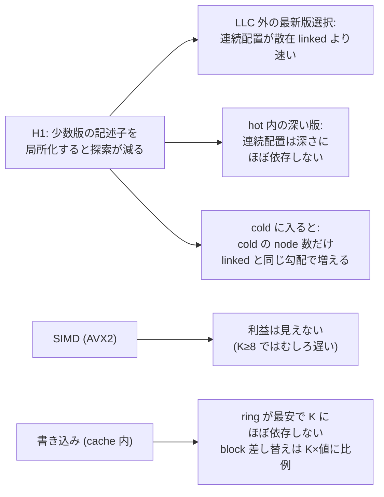
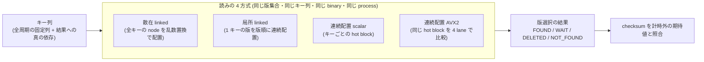
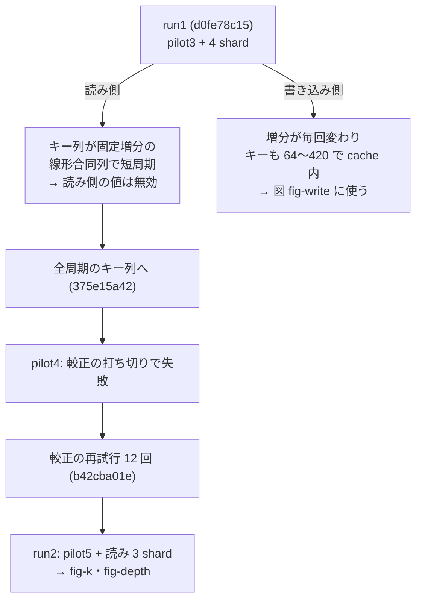

# VHash: hot block の版配置を微小計測で比べる (2026-09-29)

- wave: `dev-wave-vhash-hot-block-microbench` (VHash 論文の並行 wave md_5、依頼は `/work/1/SFC/tanab/tmp/vhash-2026-09-29/md_5.txt` と `common.txt`)。
- 論文系列: `docs/paper-story-vhash/` (本 wave の着手時点で local main に未着地。同じ中身の複製 `/work/1/SFC/tanab/tmp/vhash-2026-09-29/docs-snapshot/` を読んだ)。
- 道具 (commit): bench `tools/vhash_microbench/hot_block_bench.cc`、driver `tools/vhash_microbench/run_hot_block.py`、作図 `tools/plotting/plot_vhash_hot_block.py`、テスト `orchestrator/tests/test_vhash_hot_block_bench.py`・`orchestrator/tests/test_plot_vhash_hot_block.py`。図と表の値を出した版は b42cba01e (読み側) と d0fe78c15 (書き込み側)。
- 計測機: Pegasus 計算ノード (gen_S)、Intel Xeon Platinum 8468、L2 2 MiB/core、LLC 105 MiB (sysfs 110,100,480 B)、1 thread・固定 core (core 0)。

## 0. 結論 (次の版に渡せること)



数値の出所は §5 の表 (作図器が生の反復値から再計算した `figures/fig-k.summary.json`・`figures/fig-write.summary.json`)。いずれも **1 thread・固定 core・依存連鎖下の 1 回の latency の中央値** で、区間は 8 反復の percentile bootstrap 95% (反復変動の記述)。

1. **H1 はこの射程で支持された。** LLC の外 (1 キーの構造が合計 LLC の 8 倍以上) で最新版を選ぶとき、連続配置 scalar は散在 linked の 0.55〜0.84 倍の時間だった (K=1: 113 ns 対 204 ns、K=16: 149 ns 対 176 ns)。差は K が大きいほど縮む。L2 内でも 0.73〜0.87 倍 (8〜10 ns 対 10〜12 ns)。
2. **hot 内の深い版で差が大きく開く。** K=8・LLC 外で目的の版の深さを 0→7 と増やすと、散在 linked は 187→1,269 ns、局所 linked は 201→679 ns と深さに比例して増えたが、連続配置 scalar は 144〜152 ns でほぼ一定だった (深さ 7 で散在 linked の 0.12 倍)。hot を越えると (深さ 8 以降) 連続配置も cold の node を辿るので 296→576→827 ns と増える。
3. **cold の深さ K+2 では、hot に置いた K 版を辿らずに済む分だけ速い。** 連続配置は K によらず 535〜579 ns でほぼ一定、散在 linked は K=1 の 654 ns から K=16 の 2,944 ns まで増えた (K=16 で 0.20 倍)。
4. **SIMD の利益は見えなかった。** 連続配置の利益と SIMD の利益を分けると、AVX2 は L2 内の最新版で scalar より遅く (15〜19 ns 対 8〜10 ns、命令数 156〜160 対 128〜132 / 選択)、LLC 外では K=1 だけ速く (94 対 113 ns)、K=2〜4 は scalar と ±3% 以内、K≥8 では 244〜253 ns 対 143〜149 ns と遅かった。K≥8 で遅くなる機序は特定していない (§6)。**利益は配置 (連続であること) から来ており、この AVX2 実装の SIMD 比較からは来ていない。**
5. **書き込み (hot block が cache 内にある条件)。** ring buffer は 37〜76 ns/挿入で K にほぼ依存しない。shift は値を inline に置くと K×値の大きさとともに増え (inline 256 B で 37→98 ns)、block 差し替えは K×値に比例して最も高い (inline 256 B で 113→1,624 ns、K=16 で linked 先頭挿入の 44 倍)。linked 先頭挿入 (Cicada 型の参照線、cold 移送なし) は external 64 B で約 99 ns、inline 16 B で約 70 ns、inline 256 B で約 36 ns。

## 1. 何を確かめたか (目的と射程)

- **仮説 H1** (出典メモ §24、docs/paper-story-vhash/ の版 2026-09-29): 少数版の記述子を局所化すると、版探索のメモリアクセスが減る。
- **本 wave の射程**: トランザクション処理から切り離した **1 キー分の版選択** と **1 キーへの新版挿入** の微小計測。1 thread・固定 core・依存連鎖下の latency (1 回の選択の結果が次に読むキーの計算に流れる)。「連続配置の利益」と「SIMD の利益」を分けて測る (出典メモ §7.4)。
- **射程外 (確かめていない)**: Cicada への組み込み、並行更新 (記述子を複数 word で一貫して読む方法は出典メモ §20.4 の未解決のまま)、many-core の競合、独立な複数キーを並べた throughput、huge page、cache の外にある hot block への書き込み。ここで測った値から「Cicada が速くなる」「serializable」は言えない。



## 2. 版選択の意味 (Cicada に合わせた点)

一次資料は CCBench の Cicada の read 経路 (`external/ccbench/cc/cicada/transaction.cc` の read 版探索)。新しい順に、wts が対象 timestamp より新しい版は状態に関係なく通過し、wts ≤ ts の最初の版を候補にする。候補が PENDING なら **WAIT** (Cicada は確定を待つ。微小計測では待たずに WAIT を返す)、ABORTED なら次の版へ進んで繰り返し、COMMITTED なら FOUND、DELETED なら削除、尽きたら NOT_FOUND。依頼文の「それより新しい PENDING 版があれば待つ」は出典メモ §7.3 の「対象 timestamp **以下に**、より新しい PENDING 版がある場合」を指し、上と同じ意味である (ts より新しい PENDING は通過する)。COMMITTED との AND だけでは選ばない。

4 方式の結果は、計時の前に名前つき固定ベクトル 22 本 (hot 末尾・cold 先頭・全版が新しすぎる・候補 PENDING・ts より新しい PENDING の通過・ABORTED の連続・cold の PENDING / DELETED・ts 等号・K ごとの境界・書き込み後の版 ID と値 bytes・state 条件の生成器など) と乱数 256 例で参照実装 (素直な走査) と全件照合し、1 件でも違えば計時しない (`--selfcheck`、全 raw の `selfcheck.passed: true`)。計時後も checksum を計時外に独立計算した期待値と照合する。

## 3. 配置と方式

| 方式 | 配置 | 読むもの |
|---|---|---|
| 散在 linked | キーごとの head pointer 配列 (8 B/キー) + 全キーの全版の node を 1 つの pool に置き、slot を全キーをまたいだ乱数置換で割り当てる。node は 64 B 整列 (Cicada の Version が alignas(64))、値を inline にするときは node 内 | head → node → next … |
| 局所 linked | 同じ node 形式で、1 キーの版を版順に連続した slot に置く | 同上 (隣の cache line を辿る) |
| 連続配置 scalar | キーごとに固定 stride の hot block を 64 B 整列 arena に並べる。block = `wts[Kp]` (Kp は K を 4 の倍数へ切上げ、余りは UINT64_MAX) + `state[Kp]` + `id[K]` + 値参照 `[K]` + cold pointer (+ inline 値)。hot を越えた版は cold 用の散在 pool | block の wts と state を先頭から scalar 比較、hot を使い切ったときだけ cold pointer を読む |
| 連続配置 AVX2 | scalar と同じ arena を読む | wts を 4 個ずつ `vpcmpgtq` で比較し mask の最下位 bit から候補を取る。候補後の状態分岐は scalar と同じ関数 |

- build: g++-12 12.3.0、`-O3 -DNDEBUG -std=c++20 -Wall -Wextra -Werror -fno-tree-vectorize -mavx2 -mbmi -mbmi2 -mpopcnt` (CCBench の microbench の慣行に倣い `-march=native` を使わず ISA を明示)。scalar 関数に xmm/ymm 命令が 0 件、AVX2 関数に `vpcmpgtq` と mask 抽出があることを objdump で確かめてから計測する (raw の `build.objdump_check`)。計時 binary に trace・計器は無い (perf は外から区間を制御)。
- 外部値 (external) は全方式で共有する 1 つの値 pool (全キーをまたいだ乱数置換)。値の置き方の比較は同じ大きさ同士 (external と inline) で行う。
- 書き込み 4 方式: shift (slot を 1 つずらして末尾を cold 先頭へ)、ring (head を戻して上書き、溢れた版を cold 先頭へ)、block 差し替え (新 block に K−1 版 + 新版を複写、溢れた版を cold へ)、linked 先頭挿入 (Cicada 型の参照線、cold 移送は無い)。確保は反復ごとに作り直す bump arena から取り、旧 block の解放は no-op。

## 4. 計時・perf・反復・規模

- 1 cell = 1 process。全方式の構造を 1 回作り、8 反復 × 巡回 Latin square の順序 (各方式が各位置に 2 回) で各方式の batch を測る (同じ process・同じ時刻帯の対照)。ops は cell 内の全方式で同じ値で、最速の方式の batch が 0.1 秒以上になるよう較正する (再試行 12 回まで)。`ns_per_op = elapsed_ns / ops` (`CLOCK_MONOTONIC_RAW`)。
- 読み側のキー列は、2 のべき乗を法とする全周期の線形合同列から n 以上の値を飛ばす固定列で、n 歩で全キーを 1 回ずつ訪れる。選んだ版の ID は計時外に得た不透明な 0 を介して次の添字へ流し、依存連鎖を保つ (列は結果に依存しない)。
- 集計は 8 反復の中央値と percentile bootstrap の 95% 区間 (4000 回、seed 20260929、**反復変動の記述であって母集団の保証ではない**)。方式間は同じ反復内の対の比 (読みは散在 linked 比、書きは linked 先頭挿入比) の中央値も出す。
- perf は時間と別の process で方式ごとに 1 回、`perf stat --control` で計時 batch の間だけ数える (2 組に分けて多重化を避け、running 100% を要求)。event は `cycles:u`・`instructions:u`・`cache-references:u`・`cache-misses:u`・`branch-misses:u`。計算ノードの perf (`/usr/lib/linux-tools/5.15.0-135-generic/perf`) はこの CPU で汎用 event の `L1-dcache-load-misses`・`dTLB-load-misses` を数えられなかったので除いた (run2 の失敗 raw ではなく run1 の pilot2 raw `20260928T213308Z-22e7ac8b.json` の `perf_candidates_tried`)。
- **規模 (規律 4)**: keyset「in」はその cell の最大方式の footprint が L2 の半分以下になる最大キー数、「out」は最小方式の footprint が S×LLC 以上になる最小キー数。S は pilot で決める (LLC の 0.5・1・2・4・8 倍で 2 方式とも隣の倍率との差が 5% 以下になる最初の倍率、無ければ 8)。取り直し走の pilot (`raw/run2-b42cba01e/20260928T231907Z-3497401a.json`) では散在 linked 72→85→132→167→185 ns、連続配置 scalar 48→50→74→123→130 ns で、4→8 倍の変化が +11%・+6% と 5% に届かず **S=8** を使った (飽和点は見つからなかった。§6)。

## 5. 結果の表と図

図: `figures/fig-k.png` (K と版選択 1 回の時間、newest / cold 深さ K+2 × L2 内 / LLC 外)、`figures/fig-depth.png` (K=8 の深さ 0〜12、深さ 8 に hot/cold 境界)、`figures/fig-write.png` (書き込み費用、値の置き方 × キー数)。各図に `.pdf`・`.provenance.json` (入力 raw の path と SHA-256、生成器と binary の SHA-256、図の全点の値)・`.summary.json` (全 group の cell × 方式の中央値・区間・perf の 1 op 当たり値) がある。作図は login node (計測機の外) で行った。

表の書式: `中央値 ns [95% 区間]`、`r` = 同じ反復内の散在 linked 比の中央値。

### 5.1 最新版 (深さ 0) と cold 深さ K+2、LLC 外 (fig-k 右列)

| K | キー数 | 散在 linked | 局所 linked | 連続 scalar | 連続 AVX2 |
|---|---:|---|---|---|---|
| 1 (深さ 0) | 2,752,512 | 204.1 [202.7-204.8] | 213.3 r1.04 | 113.1 r0.55 | 94.2 r0.46 |
| 2 (深さ 0) | 2,293,760 | 194.6 | 205.4 r1.06 | 133.7 r0.69 | 131.8 r0.69 |
| 3 (深さ 0) | 2,293,760 | 197.0 | 206.2 r1.05 | 135.1 r0.69 | 138.5 r0.71 |
| 4 (深さ 0) | 2,293,760 | 191.2 | 205.1 r1.07 | 134.5 r0.70 | 137.7 r0.72 |
| 8 (深さ 0) | 1,720,320 | 186.4 | 200.6 r1.08 | 143.3 r0.76 | 244.1 r1.31 |
| 16 (深さ 0) | 1,251,142 | 176.4 | 196.4 r1.11 | 148.6 r0.84 | 252.9 r1.44 |
| 1 (深さ 3) | 2,752,512 | 654.4 | 408.1 r0.63 | 562.7 r0.86 | 555.8 r0.85 |
| 2 (深さ 4) | 2,293,760 | 788.3 | 504.4 r0.64 | 565.3 r0.72 | 560.2 r0.71 |
| 3 (深さ 5) | 2,293,760 | 971.7 | 552.2 r0.58 | 558.6 r0.58 | 534.9 r0.55 |
| 4 (深さ 6) | 2,293,760 | 1,132.0 | 649.9 r0.58 | 562.1 r0.50 | 538.6 r0.48 |
| 8 (深さ 10) | 1,720,320 | 1,725.5 | 811.1 r0.47 | 578.9 r0.34 | 552.6 r0.32 |
| 16 (深さ 18) | 1,251,142 | 2,943.8 | 1,027.1 r0.35 | 576.9 r0.20 | 553.0 r0.19 |

L2 内 (fig-k 左列、キー 814〜3,196) の最新版は散在 linked 9.9〜12.1 ns、連続 scalar 8.0〜10.2 ns (r0.73〜0.87)、AVX2 15.1〜19.1 ns (r1.27〜1.91)。cold 深さ K+2 は散在 linked 37.7→164.3 ns (K=1→16) に対し連続 scalar 29.2〜33.0 ns。

### 5.2 深さ別 (K=8、LLC 外、キー 1,720,320。深さ 12 だけ 1,376,256) (fig-depth 右)

| 深さ | 散在 linked | 局所 linked | 連続 scalar | 連続 AVX2 |
|---:|---|---|---|---|
| 0 | 187.3 | 200.6 r1.07 | 143.6 r0.77 | 246.9 r1.34 |
| 1 | 335.7 | 313.5 r0.92 | 143.9 r0.43 | 246.0 r0.74 |
| 3 | 654.9 | 387.1 r0.60 | 149.2 r0.23 | 241.7 r0.37 |
| 5 | 947.3 | 532.1 r0.56 | 151.7 r0.16 | 257.8 r0.27 |
| 7 | 1,269.2 | 679.3 r0.54 | 148.6 r0.12 | 244.3 r0.19 |
| 8 (cold 先頭) | 1,423.8 | 771.3 r0.55 | 296.2 r0.21 | 273.1 r0.19 |
| 10 | 1,729.8 | 811.1 r0.47 | 575.8 r0.33 | 550.3 r0.32 |
| 12 | 2,001.6 | 842.2 r0.42 | 826.8 r0.41 | 801.8 r0.40 |

L2 内 (キー 1,351、深さ 12 は 1,159) では散在 linked 10.4→70.8 ns (深さ 0→7)、連続 scalar 9.1→15.5 ns、AVX2 17.0〜19.9 ns。

### 5.3 値の置き方 (選択 + 値の全 byte 読み、LLC 外)

| 条件 | 散在 linked | 連続 scalar | 連続 AVX2 |
|---|---|---|---|
| K=3 深さ 0 external 16 B | 216.2 | 147.2 r0.68 | 157.5 r0.73 |
| K=3 深さ 0 inline 16 B | 203.9 | 131.6 r0.64 | 122.1 r0.60 |
| K=3 深さ 0 external 64 B | 263.3 | 227.8 r0.87 | 294.8 r1.12 |
| K=3 深さ 0 inline 64 B | 216.3 | 183.7 r0.85 | 283.4 r1.32 |
| K=3 深さ 0 external 256 B | 428.3 | 360.8 r0.84 | 453.6 r1.05 |
| K=3 深さ 0 inline 256 B | 348.7 | 332.2 r0.94 | 420.8 r1.20 |
| K=8 深さ 0 inline 64 B | 193.7 | 226.4 r1.18 | 310.3 r1.62 |
| K=8 深さ 0 inline 256 B | 363.0 | 371.7 r1.05 | 395.8 r1.14 |
| K=8 深さ 7 external 16 B | 1,265.7 | 155.8 r0.12 | 262.1 r0.21 |
| K=8 深さ 7 inline 256 B | 1,400.8 | 347.4 r0.25 | 362.6 r0.26 |

値を読む分だけ差は縮み、K=8 で値を inline に置くと block が大きくなって (inline 64 B で 1,280 B/キー) 最新版では散在 linked より遅くなる (r1.05〜1.18)。同じ大きさの external と inline では、連続 scalar は K=3 で inline の方が速い (16 B: 132 対 147 ns、64 B: 184 対 228 ns、256 B: 332 対 361 ns)。全 48 cell は `figures/fig-k.summary.json` の group `value`。

### 5.4 状態の混在 (深さ 1、LLC 外)

ts より新しい PENDING の通過・候補 DELETED は、同じ深さ 1 の FOUND と同程度だった (K=8: 散在 linked 338.7 / 335.4 ns、連続 scalar 143.6 / 143.7 ns に対し、深さ group の K=8 深さ 1 の FOUND は 335.7 / 143.9 ns)。ABORTED を 1 つ飛ばすと散在 linked は 511 ns、連続 scalar は 130〜148 ns。**候補 PENDING (WAIT) の cell は比較に使わない** (§6)。

### 5.5 書き込み 1 回の費用 (hot block は cache 内、fig-write)

| 値の置き方 (キー数) | linked 先頭挿入 | shift | ring | block 差し替え |
|---|---|---|---|---|
| external 64 B (210) | 98.5〜100.7 | 72.7〜76.1 | 73.1〜76.7 | 115.2〜140.9 |
| inline 16 B (420) | 68.5〜72.2 | 37.2〜49.5 | 37.4〜37.8 | 68.4〜178.9 |
| inline 256 B (84) | 35.9〜36.4 | 37.1〜98.0 | 37.0〜38.5 | 113.3〜1,623.9 |

範囲は K=1〜16 の中央値の最小〜最大。キー 64 の列 (fig-write 左) も同じ傾向。

## 6. 限界と、確かめていないこと

- **射程**: 1 thread・固定 core・依存連鎖下の latency。独立な複数キーの throughput (memory-level parallelism)、many-core の競合、huge page は測っていない。「Cicada が速くなる」とは言えない。
- **WAIT の cell**: WAIT は版 ID として定数 0 を返すので、次のキーの計算が読み込んだ値に依存せず (分岐予測で先へ進める)、複数の miss を重ねられる。LLC 外でも 45〜77 ns と他の cell (135〜511 ns) より大幅に速く、依存連鎖の latency ではない。比較に使わない。
- **cache-misses の数え方**: 汎用 `cache-misses:u` は条件間で不規則だった (例: 局所 linked は散在 linked より miss が多いのに速い、K=8 深さ 10 で 17.9 対 12.6 / 選択)。hardware prefetch の分を含む可能性があり、需要 miss の代理としては使わない。L1・dTLB の event はこの perf で数えられなかった。
- **飽和点**: pilot は LLC の 8 倍まで 5% 以内に飽和しなかった。4 KB page での TLB 負担の増加が候補だが、dTLB event が取れず確かめていない。
- **AVX2 が K≥8 で遅い理由**: 未特定。命令数は AVX2 157〜159 対 scalar 129〜132 / 選択で、cache-misses は同程度 (約 2.9)。block 内の配置 (wts と id・値参照が別の cache line) は scalar と同じ。
- **書き込み**: 書き込み側は履歴を回収せず追記するので 1 キーの確保量が数 MB になり、key 数の決定式が 64 と 84〜420 という小さい値を返した。hot block は両列とも cache 内で、「L2 内 / LLC 外」の区分は書き込みでは成立していない。cache の外にある hot block への書き込み、並行 reader への公開、旧 block の回収 (no-op) の費用は測っていない。ring の読み側 (回転した順序) の費用も測っていない。
- **ノードと commit**: shard ごとに別の計算ノード (run2: pilot bnode071、read-k bnode089、read-depth-state bnode045、read-value bnode072。run1 の write は bnode069) で走った。方式間の比較は shard 内 (同じノード・同じ process・交互順) で行い、shard 間の値を引き算しない。書き込みの値は d0fe78c15 (binary 9c946abc…) の走で、読み側 (b42cba01e、binary 605dd5be…) との差分は読み側のキー列と較正規則だけで、書き込みの計時 loop は同じ。
- **並行更新の正しさ**: 記述子を複数 word で一貫して読む方法 (出典メモ §20.4) は未解決のまま。本計測は単一 thread で、並行更新を含まない。

## 7. 経緯 (無効にした走と、その事実)

規律 7 に従い、無効にした走の raw も消さずに `raw/run1-d0fe78c15/` に残す。



- **run1 の読み側が無効な理由**: 計時 loop が次のキーを `(idx × 1664525 + 選んだ版 ID + 1013904223) mod n` で決めていた。同じ深さの cell では版 ID が全キー共通の定数なので固定増分の線形合同列になり、周期が n より大幅に短い。同じ式で 300 万歩辿って数えると、n=1,775,815 で 45 キー、他の「LLC 外」の cell でも 6,145〜393,216 キーしか訪れない。run1 で pilot が飽和せず、cache-misses が条件間で不規則で、external 16 B が LLC 外なのに 15 ns だったのはこのためである。bench のテスト `test_read_key_sequence_full_period` は旧い式に戻すと赤になる (45 キー訪問を再現)。
- **その他の失敗 raw**: pilot1 (request 33801.nqsv) は 35 分待ち行列に留まり dispatcher の全体時間上限で取り消されて一度も走らなかった (raw なし)。pilot2 (`raw/run1-d0fe78c15/20260928T213308Z-22e7ac8b.json`、49ec152d1) は perf の smoke で失敗 (L1・dTLB event を数えられない)。pilot4 (`raw/run2-b42cba01e/20260928T230406Z-31b4c316.json`、375e15a42) は ops 較正の打ち切り (`read batch below 0.1 s`) で失敗。
- **実装の検査**: 段 6 の敵対レビュー 2 本 (どちらも NO-GO) と焦点再レビュー 2 巡の所見、および実機・実データで見つかった blocker を fix 巡 1〜8 で直した (node が値の置き方に関係なく 320 B だった、hot で当たっても cold pointer を先に読んでいた、書き込みの値の保存費用が測られていなかった、ns_per_op の出力精度で作図器が正常な raw を拒否しうた、など)。変異は `§8`。

## 8. 変異検査

`tools/mutation_harness.py` を計算ノードの dispatch で当てた。probe (全件 SURVIVED 期待、d0fe78c15) で 9 変異すべての赤を観測し、その node 集合を KILLED 期待として本走 (b42cba01e) に登録した。本走の結果は §8.1。

| id | 変異 | 赤になる test (probe で観測) |
|---|---|---|
| M1 | AVX2 の mask で最上位 bit を取る | test_cpp_selfcheck、test_node_stride_and_hot_cold_slot、test_cell_contract_and_footprint |
| M2 | scalar が候補 PENDING を飛ばす | test_cpp_selfcheck、test_node_stride_and_hot_cold_slot |
| M3 | linked が ABORTED を返す | test_cpp_selfcheck、test_node_stride_and_hot_cold_slot |
| M4 | scalar が ts より新しい PENDING で WAIT を返す | test_cpp_selfcheck、test_node_stride_and_hot_cold_slot、test_cell_contract_and_footprint |
| M5 | AVX2 が hot を使い切ると cold を辿らない | test_cpp_selfcheck、test_node_stride_and_hot_cold_slot |
| M6 | ring が溢れた版を捨てる | test_cpp_selfcheck、test_node_stride_and_hot_cold_slot、test_cell_contract_and_footprint |
| M7 | 作図器の保存前 layout 検査を外す | test_long_label_layout_rejected_without_outputs |
| M8 | provenance の入力 SHA-256 を定数にする | test_provenance_input_sha256_matches_file ほか 2 |
| M9 | bench の出力精度を 6 桁に戻す | test_bench_round_trip_ns_per_op_accepted |
| M10 | 読み側のキー列を旧い固定増分式に戻す | (本走で観測) |
| M11 | 較正を旧い 3 回・1.05 倍に戻す | (本走で観測) |

M1〜M6 で `test_node_stride_and_hot_cold_slot` も赤になるのは、同じ selfcheck を内部で走らせるためで、冗長な検査として扱う (赤の理由は selfcheck の失敗名で帰属できる)。

### 8.1 本走の結果

(本走の完了後に追記する)

## 9. 計算資源

計測 job の実行時間 (qstat の Elapse) の合計は 6,545 秒 (約 1.82 node 時間): run1 = pilot2 13 s、pilot3 45 s、read-k 493 s、read-depth-state 806 s、read-value 720 s、write 1,135 s。run2 = pilot4 23 s、pilot5 43 s、read-k 686 s、read-depth-state 1,431 s、read-value 1,150 s。変異検査・受入の job はこれに含まない。

## 10. 再現

```bash
# 計算ノード (1 shard = 1 job。並行に投げるときは同 SHA の別 worktree から)
python3 tools/pegasus/dispatch_compute.py --task generic --walltime 00:30:00 --queue-wait-timeout 3600 --overall-grace 3900 \
  -- python3 tools/vhash_microbench/run_hot_block.py --shard pilot --raw-root <abs> --max-wall-s 1500
python3 tools/pegasus/dispatch_compute.py --task generic --walltime 00:30:00 --queue-wait-timeout 3600 --overall-grace 3900 \
  -- python3 tools/vhash_microbench/run_hot_block.py --shard read-k --raw-root <abs> --max-wall-s 1500 --pilot-raw <pilot raw>
# 作図 (計測機の外)
python3 tools/plotting/plot_vhash_hot_block.py k figures/fig-k raw/run2-b42cba01e/20260928T231907Z-3497401a.json \
  raw/run2-b42cba01e/20260928T232040Z-e2c27359.json raw/run2-b42cba01e/20260928T232237Z-4a650961.json raw/run2-b42cba01e/20260928T232340Z-00bc28d9.json
python3 tools/plotting/plot_vhash_hot_block.py write figures/fig-write raw/run1-d0fe78c15/20260928T214815Z-52971bae.json raw/run1-d0fe78c15/20260928T220236Z-f0dd4c0d.json
```

`--overall-grace` を待ち上限以上にしないと、待ち行列が長いときに dispatcher の全体時間上限 (投入時刻 + walltime + 猶予、RUN 観測までは待ち時間を含む) で先に取り消される (pilot1)。perf の生 stderr は `raw/*/perf-stderr.tar.gz`。
