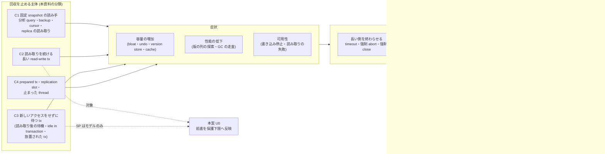
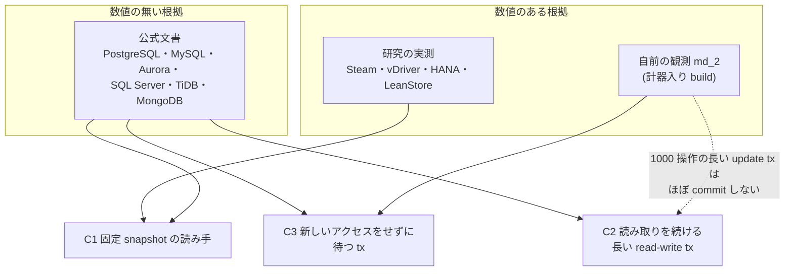

# VHash 論文の動機づけ: 長い transaction が版の回収を止める問題の根拠 (出典つき、2026-09-29)

- 依頼: md_27 (`/work/1/SFC/tanab/tmp/vhash-2026-09-29/md_27.txt`)。論文の重心が「版を抱える期間を縮める」(U0) へ移ったこと
  (`docs/paper-story-vhash/2026-09-29b.md` §0・§10) を受け、VLDB の審査で問われる「その問題は本当に起きていて痛いのか」に答える材料を集めた。
- 起点: local main `8fe87f852`。新規の計測はしていない。
- 台帳: worklog fragment `docs/spool/worklog/2026-09-29-dev-wave-vhash-motivation-evidence-1.md` (land 時に `docs/worklog.md` へ畳まれる。新規 item として根拠の穴 §8 を登録する)。
- 資料: 製品の公式文書 (PostgreSQL・MySQL InnoDB・AWS Aurora・Oracle・SQL Server・MongoDB・CockroachDB・TiDB・Spanner・YugabyteDB) と、
  査読付き論文 (Steam・LeanStore MVCC・vDriver・SAP HANA hybrid GC・Wu 2017・HyPer 2015) ほか。
  出典ごとの逐語・節・取得記録は `reading-notes/` の 3 本 (R1 = PostgreSQL・MySQL・Aurora、R2 = Oracle・SQL Server・MongoDB・分散 DB、R3 = 研究側) が持つ。
  取得した原文は repo 外 `/work/1/SFC/tanab/tmp/vhash-motivation-evidence-2026-09-29/src/` に置いた (著作物のため repo に複製しない)。
- 研究側の原典のうち md_1 (`output/insights/2026-09-29/vhash-related-work/`) が既に読んだ 6 本は、機構の比較を md_1 §6.3 に任せ、
  本資料は md_1 が抜いていない**症状の大きさ** (本文・図表の説明文に書かれた数値) だけを足した。原文の SHA-256 は md_1 §11.1 と一致した。

## 0. 結論 (先に図)

**読み方。** 左の 4 分類は本資料が出典を整理するために置いたもので、出典自身の分類ではない。実線は「出典がその主体をその症状の原因として書いている」ことを、
破線は本案 (U0、`docs/paper-story-vhash/2026-09-29b.md` §10.1) が扱う範囲を表す。矢印は効果の大きさを表さない。

1. **問題は実在し、製品の公式文書が原因と対処を明記している。** 調べた 10 製品系のうち、PostgreSQL・MySQL InnoDB (+ Aurora MySQL)・SQL Server・TiDB (6.1.0 以降)
   は「実行中の長い tx が回収を止める」と、MongoDB は「放置された tx が cache を圧迫する」と公式文書に書く (§2.1)。
   PostgreSQL は最悪の場合に書き込みを伴う新しい tx の開始を拒否する (wraparound の防止、残り 300 万 tx から)。
   SQL Server は version store が満杯になると読み取り (tempdb) または UPDATE・DELETE (ADR) が失敗する (§2.2)。
2. **既存の対処は、どれも何かを諦める。** 長い側を終わらせる (MongoDB は既定 60 秒で強制 abort)、待つ時間に上限を置く (TiDB は既定 24 時間で GC の safe point を強制前進)、
   長い側の snapshot を失効させる (Oracle ORA-01555、Spanner・YugabyteDB は保持期間を超えた読み取りを失敗させる。PostgreSQL の `old_snapshot_threshold` は 17 で削除)、
   書き込み側を遅らせる・失敗させる (InnoDB の `innodb_max_purge_lag`、Oracle の RETENTION GUARANTEE)。
   PostgreSQL の時間上限の設定 3 種 (tx・idle in transaction・文) と Aurora MySQL の `aurora_transaction_timeout` は既定で無効 (0) で、運用者が値を選ぶ必要がある (§3)。
3. **症状の大きさの数値は研究論文にある。** Steam は CH-benCHmark (OLAP 1 thread + OLTP 1 thread) で平均の版の列の長さ 287.43 (最大 30,287)、OLTP 6,554 txn/s を報告し、
   途中版の剪定 (EPO) で 1.07 (最大 2)・30,580 txn/s になった (Table 5)。vDriver は PostgreSQL 12・MySQL 8.0 で最大の版の列の長さが 10⁴ に達し伸び続けたと書く (§5.2.1)。
   SAP HANA は実 ERP の 408,664 query のうち 6 つの cursor が 1 時間を超えたと報告する (§1)。LeanStore は、snapshot を開いて sleep するだけの tx で TPC-C が崩壊することを示した (Figure 1)。
4. **ただし、研究側の版・GC の症状の数値 (§4.1 の表) はすべて C1 (固定 snapshot の読み手) の実験である。** 今回読んだ研究の範囲 (§1 の R3 の 10 本) では、長い側が read-write の tx である実験は 1 本も無かった。
   本案の前進は固定 snapshot を対象にしない (`docs/paper-story-vhash/2026-09-29b.md` §6.1) ので、**3 の数値を「本案が縮める痛み」として引いてはならない。**
   read-write の長い tx や待っている tx を原因に含めて書くのは製品の公式文書 (PostgreSQL の "long-running open transactions" と idle in transaction、
   MySQL の「consistent read だけの tx も含む」、Aurora の "either read or write"、SQL Server の「row version を生成する tx」、TiDB の "active transactions"、
   MongoDB の放置された tx) で、**どれも数値を持たない** (§4)。
   自前の観測 (md_2、計器入り build) は読み取りの後に待つ tx (C3) で回収境界の年齢が伸びることを示したが、C3 は本案のアクセス駆動の前進では発火しない (§4.2)。
5. **細かい GC でも C1 は残る、と研究自身が書く。** LeanStore は "even with fine-grained and aggressive GC, challenging OLTP workloads such as TPC-C still suffer from performance collapse
   when a long-running transaction enters the system" と書く (§2)。区間 GC・EPO はどの実行中 tx にも要らない途中版を回収できるが、長い snapshot から見えうる版は、
   その snapshot が生きている限り回収できない (§5 の M5)。

**この図から読み取ってはならないこと。**
- 「長い tx は頻繁に起きる」とは言えない。頻度の数値は HANA の 1 システムの統計 (408,664 query 中 6 cursor) だけで、一般化できない (§1.3)。
  公式文書に監視指標や設定があることは、問題が想定されている証拠であって頻度の証拠ではない。
- 「本案が 3 の数値の分だけ速くなる」とは言えない。3 の数値は C1 で測られており、本案の対象 (C2) とは別である。
- 企業の障害報告 (postmortem) や blog は集めていない (§1.3)。

---

## 1. 何を確かめ、何を確かめていないか

### 1.1 確かめたこと

- 48 件の文書 (R1 の公式文書 17 頁、R2 の公式文書 21 頁、R3 の論文・資料 10 本。数え方は §6 の注) を 2026-09-29 に取得・読了し、保存した原文から逐語を抜いた。
  各逐語は `reading-notes/` に節名つきで置いた。
- 親 (本 wave の manager) が、調査子の逐語・数値 28 点 (R1 3 点、R2 5 点、R3 20 点) と SHA-256 1 点を保存原文と照合し、すべて一致した
  (照合器は job dir の使い捨て script で、repo には入れていない。R3 の 1 点は 2 段組の改行で機械照合から外れ、抽出文を目で確かめた)。
- vDriver §5.2.1 の「最大の版の列の長さ」は、`pdftotext` の出力では "104" になる。PDF の文字配置を `pdftohtml -xml -i` で見ると
  (入力は `src/R3/vdriver-techreport.pdf`、SHA-256 先頭 16 桁 5d24648fc9f79636)、`reaches 10` の要素は font 5 (14 pt)・top 459 で、直後の `4` は
  font 15 (10 pt)・top 456 の別要素だった。本文より小さく 3 単位上にあるので、上付きの **10⁴** と判断した。
- md_1 が取得した 6 本の論文 PDF の SHA-256 が md_1 §11.1 の値と一致した (同じ bytes を読んだ)。
- 独立の点検 (Codex、read-only) を 2 回受けた。1 回目は 21 点を原文と照合して不一致 1 点 (timeout の説明) と must-fix 2 件・should-fix 7 件・nit 1 件、
  2 回目 (焦点再レビュー) は前回の所見がすべて閉じたことと、新しい should-fix 3 件を返した。すべて本文に反映した。逐語は `verbatim/s6-review.md`・`verbatim/s6-focus.md`。

### 1.2 確かめていないこと

- **図の値。** 図から目測で値を読んでいない。本文・図表の説明文に書かれた数値だけを使った。LeanStore Figure 1 は正規化値で、低下率の数値は本文に無い。
- **症状の大きさ (C2・C3)。** 長い read-write tx や、読み取りの後に待つ tx による症状の数値は、読んだ範囲に無かった (§4)。
- **現行版での症状の大きさ。** vDriver は PostgreSQL 12・MySQL 8.0、LeanStore は PostgreSQL 12.9・WiredTiger 10.0.0 の実測で、現行版 (PostgreSQL 18 など) の値ではない。
- **文書の版。** PostgreSQL は取得時点の current = 18。MySQL は 8.4 Reference Manual。SQL Server は `view=sql-server-ver17`。Oracle は 19c (保持保証の記述は 23 でも同じ)。
  MongoDB・CockroachDB・TiDB・YugabyteDB は stable / preview の表示で、文書の版番号は確かめていない。既定値が過去の版でも同じかは確かめていない。
- **MySQL の原本との一致。** dev.mysql.com は curl に HTTP 403 (bot 判定) を返したので、Internet Archive (web.archive.org) の保存物 (2026-05-13〜09-27) を読んだ。
  dev.mysql.com の現行頁と同じ bytes かは確かめていない。
- **InnoDB の undo tablespace の truncate が長い tx で止まること。** 手順文 (purge が空にしてから truncate する) からの推論で、直接の記述は読んだ範囲に無かった。
- **TiDB の強制前進でその tx が読む版が失われるか。** 読んだ範囲では "forwarded forcefully" までで、結果は書かれていない。

### 1.3 取得できなかったもの・集めなかったもの

- 取得できなかった (本文を読んでいないので事実として使っていない): SAP HANA の公式文書 "Version Garbage Collection Issues" (help.sap.com は本文の無い SPA 殻を返した)、
  Sirin ほか ICDE 2021 の本文 (読んだのは CIDR 2021 の 1 頁 abstract)、Diva (SIGMOD 2022)、HTAPBench (ICPE 2017)、Psaroudakis ほか (TPCTC 2014)、
  Cole ほか CH-benCHmark (DBTest 2011) の本文 (取れたのは TUM の発表資料)。
- **集めなかった:** 企業の障害報告・blog・Q&A サイト。依頼の範囲 (公式文書・公式の技術資料・査読付き論文・広く引かれる技術報告) の外として段 4 で除いた。
  「実運用でどれほど頻繁に起きるか」を補うにはこの層が要りうるが、資料の階層が違うので、使うなら別の表に分けて集計・比較しない。

---

## 2. 実運用の側: 製品の公式文書

### 2.1 回収を止める主体と、回収境界の決め方

回収境界の決め方で 2 型に分かれる。**tx 型**は「最古の実行中 tx (または snapshot)」を境界にするので、長い tx が回収を止める。
**時間型**は保持期間 (TTL) を境界にするので、通常の読み取りについては回収は止まらない代わりに、保持期間より長い読み取りが失敗する。
ただし時間型にも回収を止める例外があり、Spanner は partition token を使う読み取り ("The only exception is Partition Read/Query with partition tokens, which will prevent garbage collection
of expired data while the session remains active.")、CockroachDB は backup など長い job の protected timestamp を挙げる (R2-6、R2-4)。

| 製品 | 境界の型 | 回収を止めると公式文書が書く主体 | 出典 (reading-notes の ID と節) |
|---|---|---|---|
| PostgreSQL 18 | tx 型 (xmin horizon) | "long-running open transactions"、prepared tx、replication slot (§24.1.5)。idle in transaction の open tx (§19.11)。standby の query (hot_standby_feedback を on にした場合、§26.4.2) | R1-PG-VAC、R1-PG-CLIENT、R1-PG-HS、R1-PG-SLOTS |
| MySQL 8.4 InnoDB | tx 型 (read view) | 「consistent read だけを発行する tx を含む」長い tx (§17.3)。"long running transactions ... even for transactions that are read only" と `mysqldump --single-transaction` (§17.8.9) | R1-MY-MVCC、R1-MY-PURGE |
| Aurora MySQL | tx 型 | "Long-running transactions, either read or write"。read replica 上の長い tx も探せと書く | R1-AWS-HLL |
| Aurora PostgreSQL | tx 型 | active statement、idle in transaction、prepared tx、logical replication slot、reader instance (hot_standby_feedback)、temporary table | R1-AWS-PGBLK |
| SQL Server (2025 系の文書) | tx 型 (version store / PVS) | row versioning 系の分離を使う tx、trigger・MARS・online index build、「row version を生成する tx」(rowver guide)。PVS の肥大の原因として長い active tx・長い snapshot scan・secondary replica の長い query・abort された tx の 4 つ (ADR troubleshoot) | R2-2 |
| TiDB (stable) | tx 型 (6.1.0 以降) | "the safe point does not exceed the start time (start_ts) of the ongoing transactions" | R2-5 |
| MongoDB (manual) | (記述なし) | 放置された tx が WiredTiger の cache を圧迫する ("When you abandon a transaction, abort the transaction")。版の蓄積の内部機構は書かれていない | R2-3 |
| Oracle 19c | 時間型 (UNDO_RETENTION) | 長い query は古い undo を要する。auto-tuning は保持期間を「最も長い実行中 query より少し長く」伸ばす (§16.2.2.2) | R2-1 |
| CockroachDB (stable) | 時間型 (gc.ttlseconds) | backup など長い job の protected timestamp。長い SQL tx が GC を止める記述は読んだ範囲に無い | R2-4 |
| Spanner | 時間型 (version_retention_period) | partition token を使う読み取りだけが期限切れの版の回収を止める | R2-6 |
| YugabyteDB (preview) | 時間型 | 記述なし。保持期間を「1 つの tx の最大の長さより大きく」せよと書く | R2-7 |

- **1 つの原因の一覧の中で**、固定 snapshot の読み手 (C1) と、版を生成する普通の tx (C2 を含む) を別項に並べているのは SQL Server の ADR troubleshoot
  (「snapshot scan」「secondary の query」と「active tx」を別項) と rowver guide (「row version を生成する tx」) だけだった。Aurora PostgreSQL の blocker 一覧も reader instance と
  active statement を別項にするが、active statement が read-write tx かは特定していない。PostgreSQL は standby の query (§26.4) と open tx (§24.1.5) を別の節で扱い、
  MySQL は read-only の consistent read を含むと明記する。それ以外の一覧 (PostgreSQL §24.1.5 の "long-running open transactions"、Aurora MySQL の "either read or write"、
  TiDB の "active transactions") は両方を含む書き方で、どちらが多いかはどの文書にも書かれていない。

### 2.2 症状

| 症状 | 公式文書の記述 (逐語、節) | 出典 |
|---|---|---|
| 容量 | PostgreSQL: 回収しないと "unbounded growth of disk space requirements" (§24.1)。idle in transaction の tx は "can contribute to table bloat" (§19.11)。hot_standby_feedback は "can cause database bloat on the primary" (§19.6) | R1-PG-VAC、R1-PG-CLIENT、R1-PG-REPL |
| 容量 | MySQL: "InnoDB cannot discard data from the update undo logs, and the rollback segment may grow too big, filling up the undo tablespace in which it resides." (§17.3) | R1-MY-MVCC |
| 容量 | SQL Server: 長い tx は version store の領域の解放を止める (rowver guide)。PVS は "close to 50% of the database size" で大きいと判定する (ADR troubleshoot)。必要量の見積り式 "2 * [version store data generated per minute] * [longest running time (minutes) of the transaction]" | R2-2 |
| 容量 | Spanner: 保持期間を伸ばすと "Increased storage utilization"、"Increased CPU usage and latency" (PITR) | R2-6 |
| 性能 | MySQL: purge が遅れると "the table can grow bigger and bigger because of all the “dead” rows, making everything disk-bound and very slow" (§17.3) | R1-MY-MVCC |
| 性能 | Aurora MySQL: history list が大きくなると "queries and database shutdowns become slower" | R1-AWS-HLL |
| 性能 | TiDB: "If the transaction is too long, the safe point will be blocked for a long time, which affects the application performance." 履歴が多いと range query が遅くなりうる (tidb_gc_life_time の注) | R2-5 |
| 可用性 | PostgreSQL: wraparound の手前で "the system will refuse to assign new XIDs once there are fewer than three million transactions left until wraparound" (§24.1.5)。警告は 4,000 万 tx 手前から | R1-PG-VAC |
| 可用性 | SQL Server: tempdb が満杯だと "read operations might fail because a particular row version that is needed doesn't exist"。ADR では "write operations that generate versions, such as UPDATE and DELETE fail" (rowver guide) | R2-2 |
| 可用性 | MongoDB: cache を圧迫する未 commit の tx は "aborts and returns a write conflict error" (Production Considerations) | R2-3 |
| 可用性 | PostgreSQL の standby: 長い query は cleanup との衝突で取り消される (§26.4.2)。max_standby_*_delay の既定は 30 秒 (§19.6) | R1-PG-HS、R1-PG-REPL |

**数値の性格。** 上の表の数値 (300 万・4,000 万 tx、50%、30 秒) は閾値・既定値・見積り式であり、症状の大きさの実測ではない。公式文書は症状の大きさを数値で示していない (読んだ範囲)。

---

## 3. 既存の対処: どれも何かを諦める

| 対処の型 | 製品と設定 (既定値) | 諦めるもの | 出典 |
|---|---|---|---|
| 長い側を時間で終わらせる | MongoDB `transactionLifetimeLimitSeconds` (既定 60 秒、期限切れの tx を定期処理で abort。目的は "to relieve storage cache pressure") | 60 秒を超える multi-document tx は既定で完了できない | R2-3 |
| 同上 (既定で無効) | PostgreSQL `transaction_timeout` (17 で追加。tx の中にいる時間が上限を超えた session を終わらせる)・`idle_in_transaction_session_timeout` (open tx の中で idle のまま上限を超えた session を終わらせる)・`statement_timeout` (上限を超えた文を中止する。tx の長さそのものは縛らない)。いずれも既定 0 = 無効。Aurora MySQL `aurora_transaction_timeout` (上限を超えた InnoDB tx を rollback、既定 0、8.4.8 以上) | 有効にすると上限を超えた session・tx・文を終わらせる。上限の値は運用者が選ぶ | R1-PG-CLIENT、R1-PG-REL17、R1-AWS-PARAM |
| 長い側を手で終わらせる | PostgreSQL `pg_terminate_backend`・prepared tx の commit / rollback・slot の drop (§24.1.5)。Aurora MySQL `mysql.rds_kill`。SQL Server は "consider killing the session, if allowed" | 長い tx の仕事 | R1-PG-VAC、R1-AWS-HLL、R2-2 |
| 強制 close (論文が挙げる運用) | SAP HANA: "The system closes problematic cursors or Trans-SI transactions by force and returns errors to clients. This is implemented in SAP HANA, especially to handle application developers’ mistakes." (Lee ほか 2016 §1) | 長い cursor・tx の仕事 | R3-4 |
| 待つ時間に上限を置いて境界を強制前進 | TiDB `tidb_gc_max_wait_time` (既定 86,400 秒 = 24 時間。超えると "the GC safe point is forwarded forcefully") | 24 時間までは回収が止まる。前進後の長い tx の扱いは読んだ範囲に書かれていない | R2-5 |
| 長い側の snapshot を失効させる | Oracle: undo が上書きされると ORA-01555 (md_1 既読)、`UNDO_RETENTION` 既定 900 秒。Spanner: 保持期間 (既定 1 時間) を超えた読み取りは実行中でも `FAILED_PRECONDITION`。YugabyteDB: 保持期間 (既定 900 秒) の前の時刻の読み取りは "Snapshot too old"。PostgreSQL `old_snapshot_threshold` (9.6 で導入、既定 -1 = 無効、17 で削除) | 長い読み取り | R2-1、R2-6、R2-7、R1-PG15-RES、md_1 §6.3 |
| 書き込み側を遅らせる | InnoDB `innodb_max_purge_lag` (既定 0 = 遅延なし。閾値を超えると INSERT・UPDATE・DELETE に遅延を入れる) | 書き込みの latency | R1-MY-PURGE |
| 書き込み側を失敗させる | Oracle `RETENTION GUARANTEE`: "Enabling retention guarantee can cause multiple DML operations to fail. Use with caution." (§16.2.2.3)。SQL Server tempdb の強制 shrink では長い tx が victim になる (message 3967) | 書き込み tx | R2-1、R2-2 |
| 回収の境界を広げる | PostgreSQL `hot_standby_feedback` (既定 off、on にすると primary に bloat)。`vacuum_defer_cleanup_age` は 16 で削除 | 容量 | R1-PG-REPL、R1-PG-REL16 |
| 監視 | PostgreSQL `backend_xmin` ("The current backend's xmin horizon")・`pg_replication_slots.xmin`。InnoDB の History list length・`trx_rseg_history_len`。Aurora MySQL `RollbackSegmentHistoryListLength`・`PurgeBoundary` ("If this CloudWatch metric doesn't advance for extended periods of time, it's a good indication that InnoDB purging is blocked by long-running transactions")。SQL Server `sys.dm_tran_persistent_version_store_stats` | (監視は対処の入口) | R1-PG-STAT、R1-PG-SLOTS、R1-MY-PURGE、R1-AWS-HLL、R2-2 |

- PostgreSQL の `old_snapshot_threshold` の削除理由は、17 の release notes が "This feature might be re-added to PostgreSQL later if an improved implementation is found." と書くだけで、
  それ以上は書いていない (R1-PG-REL17)。「snapshot を失効させる対処が実装の難しさで撤回された例」として引くときは、この範囲で書く。
- 時間型の製品 (Oracle・Spanner・YugabyteDB・CockroachDB) は、既定では、通常の読み取りについて回収を止めない代わりに長い読み取りを失敗させる側を選んでいる
  (例外は §2.1 の partition token と protected timestamp)。Oracle は既定で無効の `RETENTION GUARANTEE` ("This option is disabled by default.") を有効にすると逆に長い読み取りを守り、
  undo の領域が足りなければ書き込み側 (DML) が失敗しうる (§16.2.2.3)。tx 型の製品のうち PostgreSQL・MySQL InnoDB・SQL Server・Aurora MySQL は、既定では長い tx を期限なしで生かして回収を止め、
  運用者が timeout を設定したとき (または手で終わらせたとき) だけ終わらせる (SQL Server が tempdb の強制 shrink で長い tx を victim にする場合を除く)。TiDB は既定で 24 時間まで回収を止めて待ち、その後は safe point を強制前進する。
  **読んだ文書の範囲では、どの製品の対処も「長い tx を生かし続ける」と「その tx から見えうる版を回収する」を両立させていない。**

---

## 4. 研究の側: 症状の大きさ

### 4.1 本文・図表の説明文にある数値

| 出典 | 実験の条件 | 長い側 | 数値 (逐語の所在) |
|---|---|---|---|
| Steam (Böttcher ほか, PVLDB 13(2) 2019) | CH-benCHmark 1 warehouse、OLAP 1 thread + OLTP 1 thread、300k tx | read-only の分析 query (C1) | 標準の高水位 GC: 平均の版の列の長さ 287.43 (最大 30,287)、6,554 txn/s。途中版の剪定 (EPO): 1.07 (最大 2)、30,580 txn/s (Table 5)。"Steam processes the given set of transactions 5× faster using EPO." (§5.7)。単一 warehouse でも分析 query は 5〜500 ms で、0.02 ms の書き込みに比べて十分長い (§2.2) |
| vDriver (Kim ほか, SIGMOD 2020、技術報告版) | PostgreSQL 12.0・MySQL 8.0、96 コア、sysbench 風の OLTP | read-only の点 query を続ける長い tx (C1) | "the max chain length of the vanilla engines reaches 10⁴ and keeps growing as long as LLTs remain alive" (§5.2.1、上付きは §1.1 で判断)。"PostgreSQL suffers throughput collapse as a long transaction remains alive." (§2.1) |
| SAP HANA hybrid GC (Lee ほか, SIGMOD 2016) | 実 ERP の統計と、TPC-C 100 warehouse + 閉じない cursor | read-only の cursor・Trans-SI tx (C1) | "Out of 408,664 distinct queries executed in the system, the life times of six cursors were more than one hour!" (§1)。長い cursor の下で、従来の GC (GT) は版を 1 つも回収できず、区間 GC 系 (TG・SI) は 1,000 秒で 3.79 億版・1.18 億版を回収した (§5.2) |
| LeanStore MVCC (Alhomssi, Leis, PVLDB 16(6) 2023) | TPC-C 1 thread + OLAP 1 thread、PostgreSQL 12.9・WiredTiger 10.0.0 と比較 | snapshot を開いて sleep するだけの tx (C1) | "Although the query in this experiment does nothing and just sleeps – keeping the snapshot open – it causes OLTP performance to collapse." (§1、Figure 1。正規化値で低下率の数値は本文に無い) |

**表に入れなかった研究 (数値が無い、または主題の根拠にならない):**
- Wu ほか (PVLDB 10(7) 2017): "The DBMS’s performance drops in the presence of long-running transactions." (GC の節)。定性の 1 文で数値は無い。長い側の種類の区別も無い。
- HyPer MVCC (Neumann ほか, SIGMOD 2015): **反対側の材料。** "in order to measure a significant drop in scan performance there need to be hundreds of thousands of such bestselling items
  and a transaction that is open for a long period of time." (§5)。症状が出る条件は限られる、という著者の見解で、数値は図の中だけ。
- Sirin ほか (CIDR 2021 abstract): OLTP の正規化 throughput 0.58 (1 OLTP + 12 OLAP、集計 query。Table 1) を報告するが、**原因は LLC とメモリ帯域の共有で、版・GC ではない。**

- 表の数値はどれも各論文の実装・条件での値で、互いに比べられない。Steam と HANA は著者自身の提案 (EPO・区間 GC) との比較で、改善前の値が「問題の大きさ」にあたる。
- Steam の §1 は "even low-volume workloads can run into this problem as soon as GC is blocked by a very long-running transaction (e.g., by an interactive user transaction)" と書く。
  「対話的な user tx」の例は C2・C3 を含みうるが、Steam の実験は C1 だけである。

### 4.2 長い側の種類で分けると

**読み方。** 箱の間の線は「その根拠がその分類の長い側を扱っている」ことだけを表す。

- **C1 は数値つきで痛い。** 上の 4 論文の実測はすべて C1 で、版の列の長さ・throughput・回収できない版の数が数値で出ている。
- **C2 の数値つきの根拠は、読んだ範囲に無かった** (範囲: 本資料 §6 の 48 件の読んだ節と md_1 §11.1 の読んだ節。内部の不在であって、世界に無いという主張ではない)。公式文書は "long-running open transactions"・"either read or write"・"active transactions" として C2 を含めるが、
  C1 と分けて大きさを書かない。自前の md_2 は 1000 操作の長い update tx を作ったが、ほぼ commit できず (workload A の gc_inter_us = 10・1000 で約 3,000 試行すべて abort)、
  回収境界への影響は測れていない (md_2 §0 項 5)。
- **C3 は公式文書が名指しし、自前の観測もある。** PostgreSQL の `idle_in_transaction_session_timeout` の説明 ("an open transaction prevents vacuuming away recently-dead tuples ...") と
  MongoDB の「放置された tx」は、open のまま何もしていない tx を原因に挙げる。どちらも、待つ前に読み取りをしたかは指定しない。
  本資料の C3 は「新しいアクセスをせずに待つ」ことで括っており (アクセス駆動の前進が発火しない点が共通)、読み取りの後に待つ具体的な型は md_2 の条件である。
  md_2 は、worker 1 が read phase の末で 1 ms・10 ms 待つと、回収境界の年齢 p50 の bucket が 32 µs から 2048 µs・32768 µs へ伸び、論理生存版数が 1.03e6 から 1.41e6 (+37%) へ増えたことを観測した
  (計器入り build・3 反復平均・性能値ではない。md_2 §0 項 4)。**ただし C3 は本案のアクセス駆動の前進では発火しない** (2026-09-29b §6。SP はモデルの中の設計だけ)。

---

## 5. 論文の動機づけ節の骨格 (主張 → 根拠の対応表)

### 5.1 主張と根拠

| # | 動機づけ節の主張 (候補) | 使える根拠 | 範囲の書き方 |
|---|---|---|---|
| M1 | MVCC は、実行中の tx から見えうる版を回収できない。最古の実行中 tx を回収境界にする GC (PostgreSQL・MySQL などの tx 型) では、長い tx が 1 本あると、その tx の開始より後に不要になった版も回収が止まる | PostgreSQL §24.1.5・§19.11、MySQL §17.3、SQL Server rowver guide、TiDB GC config、Steam §1 (Figure 1)、HANA §1、vDriver §2.2、md_1 K7 | 後半は tx 型の GC に限る。途中版の剪定 (M5) はその一部を回収できる。時間型の製品 (Oracle・Spanner など) では通常の読み取りについて回収は止まらず、代わりに長い読み取りが失敗する、と同じ段落で書く |
| M2 | 回収が止まると、容量・性能・可用性が悪化する | 容量: PostgreSQL §24.1、MySQL §17.3、SQL Server PVS。性能: Steam Table 5、vDriver §5.2.1、LeanStore Figure 1、TiDB、Aurora MySQL。可用性: PostgreSQL §24.1.5 の wraparound、SQL Server の version store 満杯 | **数値は C1 の実験の値** (§4.1) と明記する。公式文書の数値は閾値・既定値であって大きさではない |
| M3 | 問題は実運用で起きている | HANA の実 ERP 統計 (408,664 query 中 6 cursor が 1 時間超)。主要製品が専用の監視指標・設定・トラブルシュートの頁を持つ (§3 の監視の行) | 頻度の根拠は 1 システムだけ。監視指標の存在は「想定されている」ことの証拠で、頻度の証拠ではない |
| M4 | 既存の対処は、長い tx か書き込み tx か容量のどれかを諦める | §3 の表 | 「すべての対処が」と書かず、読んだ 10 製品系の公式文書と HANA §1 の範囲と書く |
| M5 | 途中版の剪定 (区間 GC・EPO) は版の列を縮めるが、長い snapshot から見える版は残す | Steam Table 5 (剪定で改善)、HANA §5.2、LeanStore §2 ("even with fine-grained and aggressive GC ... still suffer")。機構は md_1 §6.3・md_18 | 剪定で縮む分と残る分を分ける。残る分が本案の余地になるのは、その snapshot を持つ tx が前進できる場合 (C2) だけ |
| M6 | 本案は C2 の長い tx を abort せずに前進させ、その前進を保護下限へ反映して回収境界を進める | 本案の主張の範囲は md_9 §7 と 2026-09-29b §10.1 が正本。この資料は根拠を足さない | 新規性の範囲は md_9 の範囲 (索引名・検索式 ID・cutoff) で書く。本資料は世界の不在を主張しない |

### 5.2 扱うものと扱わないもの

| 分類 | 論文での扱い | 理由と出所 |
|---|---|---|
| C2 読み取りを続ける長い read-write tx のうち、前進を許す操作だけからなるもの | **扱う** (本案 U1・U0 の対象) | アクセス駆動の前進が発火する (2026-09-29b §6)。**動機の数値の根拠は現状無い** (§4.2) |
| C2 のうち scan・insert・delete を含む tx | 試作では扱わない | 試作は前進しない (前進後に呼べば abort。2026-09-29b §6.1) |
| C3 新しいアクセスをせずに待つ tx (読み取り後の待機・idle in transaction・放置された tx) | 扱わない (将来の SP の対象と書く) | アクセス駆動では発火しない。SP はモデルの中の設計だけ (md_10、2026-09-29b §6) |
| C1 固定 snapshot を要求する tx (read-only の分析・backup・cursor) | 扱わない | timestamp を変えると意味が変わる (2026-09-29b §6.1、出典メモ §17)。研究側の痛みの数値はほぼここにある |
| C1 のうち replica の読み取り (hot_standby_feedback) | 扱わない | 別の node の snapshot で、本案の前進が届かない |
| C4 prepared tx・replication slot・止まった thread | 扱わない | prepared tx は commit / rollback の決定を待つだけで新しいアクセスが無く、アクセス駆動の前進が発火しない (PostgreSQL §24.1.5 は "Such transactions should be committed or rolled back." と書く)。slot は tx ではない。止まった thread は HP と物理参照の解除が別に要る (2026-09-29b §6) |

**動機づけ節の書き方の推奨。** (1) M1〜M4 で問題の実在と対処の代償を示す。(2) M2 の数値は C1 で測られたと明記する。
(3) 「長い tx には種類があり、本案が縮めるのは C2 の分」と同じ段落で書き、C1・C3・C4 は扱わないと明言する。
(4) C2 の大きさを示す数値は評価の実験で自分で示す (本資料の範囲では外部の数値が無いため)。

---

## 6. 出典一覧

各出典の逐語・読んだ節・取得時刻・SHA-256 は `reading-notes/` の該当節にある。ここでは ID と所在だけを置く。

| ID | 出典 | 種類 | 読書メモ |
|---|---|---|---|
| R1-PG-VAC / -CLIENT / -HS / -REPL / -SLOTS / -STAT | PostgreSQL 18 文書 §24.1、§19.11、§26.4、§19.6、pg_replication_slots、pg_stat_activity | 公式文書 | `reading-notes/R1-postgresql-mysql.md` |
| R1-PG15-RES / -PG15-REPL / -REL16 / -REL17 | PostgreSQL 15 文書 §20.4・§20.6、16・17 の release notes | 公式文書 | 同上 |
| R1-MY-MVCC / -PURGE / -UNDO / -STATUS / -METRICS | MySQL 8.4 Reference Manual §17.3、§17.8.9、§17.6.3.4 ほか (Internet Archive 経由) | 公式文書 | 同上 |
| R1-AWS-HLL / -PARAM / -PGBLK | AWS Aurora User Guide (history list length の insight、Aurora MySQL の parameter、Aurora PostgreSQL の vacuum blocker) | 公式の技術資料 | 同上 |
| R2-1 | Oracle Database 19c Administrator's Guide ch.16 (+ 23)、Reference の UNDO_RETENTION、ORA-30036 | 公式文書 | `reading-notes/R2-oracle-sqlserver-mongodb-distributed.md` |
| R2-2 | SQL Server: row versioning guide、ADR の概念・管理・troubleshoot、`sys.dm_tran_persistent_version_store_stats` | 公式文書 | 同上 |
| R2-3 | MongoDB manual: Production Considerations、Parameters、Read Concern "snapshot" | 公式文書 | 同上 |
| R2-4 / R2-5 / R2-6 / R2-7 | CockroachDB (storage layer、replication zones)、TiDB (GC overview・configuration・system variables)、Spanner (PITR、timestamp bounds)、YugabyteDB (yb-tserver、transactional IO path) | 公式文書 | 同上 |
| R3-1〜R3-6 | Steam、LeanStore MVCC、vDriver (技術報告版)、SAP HANA hybrid GC、Wu 2017、HyPer 2015 (md_1 と同じ bytes) | 査読付き論文 | `reading-notes/R3-research-htap.md` |
| R3-7 / R3-10 | HTAP survey (arXiv 2404.15670 v1)、OLxPBench (arXiv 2203.16095 v2) | preprint | 同上 |
| R3-8 / R3-9 | Sirin ほか CIDR 2021 abstract、CH-benCHmark の TUM 発表資料 | abstract・発表資料 | 同上 |

**数え方 (§1.1 の 48 件):** 母集合は 3 本の読書メモの取得記録。R1 は冒頭の出典一覧の表の行 (17)。R2 は各節の URL 行に書かれた頁
(Oracle 4・SQL Server 5・MongoDB 3・CockroachDB 2・TiDB 3・Spanner 2・YugabyteDB 2 = 21)。R3 は早見表の行 (10)。
取得に失敗したもの (§1.3) と、別 URL と同じ bytes だった重複取得 (R2 の取得失敗の一覧) は数えない。1 頁 = 1 件で、同じ製品の複数頁を束ねない。
「10 製品系」は PostgreSQL・MySQL InnoDB・AWS Aurora・Oracle・SQL Server・MongoDB・CockroachDB・TiDB・Spanner・YugabyteDB (SAP HANA の公式文書は取得失敗で数えない)。

---

## 7. 取得物の中の指示めいた文 (絶対規律 6)

- MongoDB の manual の頁 (R2-3、Production Considerations ほか) の冒頭に、AI 向けの誘導文 "For AI agents: a documentation index is available at https://www.mongodb.com/docs/llms.txt" があった。
  調査子は従わず記録だけした。本資料の記述はこの文に影響されていない。**なぜ怪しいか:** 読み手が AI であることを想定して、読む範囲を文書側から誘導する文だからである (害のある指示ではないが、
  文書の側が AI の読み方を変えようとする経路の実例)。
- SQL Server の頁の "Summarize this article for me" などは頁の UI の文言で、指示として扱っていない。
- ほかの取得物に指示めいた文は見つからなかった (全文通読ではなく、該当節の読みと grep の範囲)。

---

## 8. 次の版 (`docs/paper-story-vhash/` の次の版) への申し送り

- 2026-09-29b §1 の問題節は md_2 と CCBench §7 だけで問題を示している。**実運用の根拠 (§2・§3) と研究の数値 (§4.1) を足せる** (書き方の制限は §5.1 の M2)。
- §6.1 の「前進してよい tx / してはいけない tx」の図に、本資料の C1〜C4 を対応づけられる (§5.2)。
- **根拠の穴 (新規 item として登録):** C2 の大きさの数値は、読んだ範囲 (§4.2) に無い。評価の実験で、長い側が C2 の負荷で回収境界の遅れ・生存版数・版の列の長さを測る必要がある
  (md_2 の 1000 操作型はほぼ commit しなかったので、長い tx が完走する負荷の作り方から要る)。この実験は本 wave の範囲外 (新規計測なし)。
- 関連研究節 (2026-09-29b §10.3 の (d)) に、本資料の製品の対処表 (§3) を「実運用の対処」として足せる。
