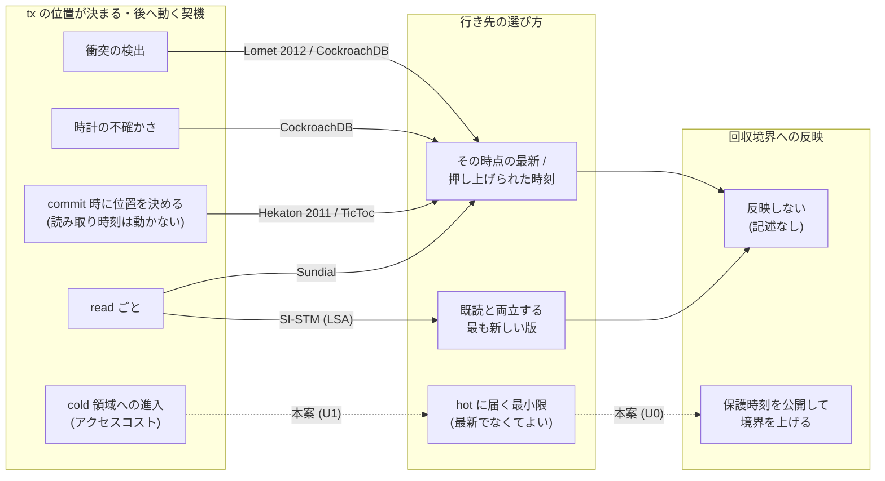

# VHash 論文の新規性の置き直し — 近い先行との書き分けと、対応を先に固定した索引検索 (2026-09-29)

- 目的: md_1 の文献調査 (`output/insights/2026-09-29/vhash-related-work/README.md`、以下「md_1」) が未確定に残した
  U0〜U2 を詰め、論文の新規性の主張文を「調べた範囲」つきで書ける形にする。
- 着手: 2026-09-29 (JST)。入力 commit: `1887f56e46c9e43b94f02572fe13d9b16ba39e41` (local main)。
  依頼は並行 VHash wave の md_9 (`/work/1/SFC/tanab/tmp/vhash-2026-09-29/md_9.txt`、同 dir の `common.txt`)。対象 item は worklog の [T-2873]。
- 主張 ID は md_1 §8.3 のもの:
  **U0** = abort せず既読を保った前進を、版データの回収境界 (GC に公開する保護下限) へ反映して保持期間を縮める、
  **U1** = cold 領域へ入ることを、tx の timestamp を動かす契機にする、
  **U2** = 既読を保てる範囲で、前向きに進んで最新でない版を選ぶ、
  **U3** = 複数版メタデータを 1 つの構造にまとめ、版選択・前進判断・validation を同時に安くする (U1・U2 に従属)。
- 本文は日本語、原典の逐語引用だけ英語。逐語は原典の PDF から抜いたテキストに実在することを機械照合した (§9.3)。

---

## 0. 結論 (先に図)

**図の読み方。** 実線は原典の読んだ節で確かめた既存方式の「契機 → 行き先 → 回収境界への反映」、破線は本案が足そうとしている経路である。
「既読を保ったまま tx の読み取り位置を実行中に後へ動かすこと」そのものは実線側 (CockroachDB・SI-STM・Lomet 2012) で既に成り立っている。
Hekaton 2011 と TicToc は読み取り時刻を実行中に動かさず、commit 時に直列化位置を決めて既読を検証する方式として同じ段に置いた (前進ではない)。
図は機構の向きだけを表し、性能・成否・件数は表さない。破線の経路を持つ既存方式が世界に無いことも表さない (§4・§5)。

要約:

- **md_1 の U2 は既知へ移る。** 登録した U2 の検出条件「後の時刻へ動いて最新でない版を選んで読む」を、
  SI-STM (Riegel・Fetzer・Felber、TRANSACT 2006) が満たす: tx の有効区間と重なる**最も新しい**版を選び、区間は読んだ版との交差で縮む
  (下端が後へ進む)。加えて CockroachDB (SIGMOD 2020) は実行中に読み取り timestamp を後へ進め、読んだキーに間の更新が無いことを
  確かめて続行する (read refresh)。本案 (2) に残る差は「**何を基準に版を選ぶか**」(hot = アクセスコスト、最小の前進) だけで、これは U1 に属する。
- **U0 と U1 は、OpenAlex (題名 + 要旨、2026-09-29 09:51〜10:20 JST 取得)・arXiv (all、同 09:49〜09:50 JST 取得)・DBLP (題名、Last-Modified 2026-09-28 20:23:37 GMT の全件書き出し) を事前登録した式 (U0 ← N01〜N05、U1 ← N06〜N08) で調べた範囲では見当たらなかった。**
  対応は結果の前に固定し、全 hit を判定して U0・U1 についての検出 0・要裁定 0 だった (§4.3。論文へ転記する完全な文は §7)。
  **ただし成熟度は索引別の RW2 であり RW3 ではない** (§4.5)。また md_1 が「U1 にも関わりうる」とした OCC-TI 1997 は、登録上は U2 の式 (N10) にだけ出て
  要裁定のまま (本文未取得) なので、**U1 の不在文は OCC-TI を除く範囲に限る** (§5.2・§7)。無限定の「初めて」は書けない。
- **U0 の新しさは GC 規則にも目的にも無い。** Cicada・Hekaton 2013 の回収境界は「実行中の tx の時刻の最小」であり、前進した時刻を公開すれば
  既存の規則のまま境界は上がる。また「位置を新しい側へ寄せれば古い版を早く捨てられる」という**目的**は SI-STM (§3.1) が既に述べる。
  残る新しさは、**実行中の前進を GC に公開する保護下限へ反映する機構と、その確定・公開の順序** (forwarding 小モデルの R6→R7) である
  (SI-STM の測定実装は旧版を個数で制限し、tx の位置を保護下限として公開する規則は読んだ節に無い)。前進しても、前進先で見える既読版・他の tx の古い時刻・物理参照が
  残る限り回収は進まないので、効果は「一部の旧版の保護義務を下げうる」までである (版 2026-09-29 §5.2)。
- **依頼の例「読み取り後に待つ tx の保持期間」は本案では縮まない** (§3.3)。
- **新規性の主張文の候補は §7 の 3 案。** 本命 (案 A) は U1 と U0 の組合せで、U2 の部分は既知の構成要素として明示する。
- **本文を取得できなかった 5 本は §6 の取り寄せ一覧** (人間の手番)。

---

## 1. 何を確かめ、何を確かめていないか

| 確かめたこと | 確かめていないこと |
|---|---|
| 近い 9 方式 (本案を含む) の 7 項目 (§3)。原典の読んだ節は §9.1 | 読んだ節の外 (証明本体・評価の細部など) に本案と同じ機構が書かれていないこと |
| 登録検索 30 本 (10 式 × 3 索引) の全 hit の判定 (§4、`judgements.tsv`) | 索引に載っていない文献 (§4.6 の母集合の外)。登録した語を使わずに同じ機構を書いた文献 (§4.6) |
| 検索式と主張の対応を、結果を見る前に固定したこと (§4.1、登録の SHA-256) | 判定は要旨 (無ければ Semantic Scholar の要約・出版社頁) の範囲。hit の本文は、既に読んでいたもの以外読んでいない |
| 本文未取得の候補について、試した経路と失敗理由 (§6) | 取り寄せ一覧 5 本の中身 |
| README の英語の逐語が原典テキストに実在すること (§9.3) | 本案そのものの正しさ・性能 (本 wave は文献のみ) |

読み手への注意: 本 README の「見当たらない」「記述なし」は、**その論文の読んだ節**、または **登録した検索の hit の要旨**についての記述であり、
世界についての不在の主張ではない。世界についての不在は §5 の規則で扱う。

---

## 2. 共通記法

tx T について次の語を使う。どの方式もこの語で書き、原典に無い項目は「記述なし」とする。

- **位置 π(T)**: その方式が動かす「T の直列化位置」。点 timestamp・区間 [L, U)・epoch・commit 時に導出する commit_ts のどれか。
- **可視区間 I(v) = [b(v), e(v))**: 版 v が見える時刻の区間。b(v) は v の書き込み時刻、e(v) は同じキーの次の版の書き込み時刻 (最新版なら上限なし)。
  Hekaton の Begin / End (md_1 §8.1 K3) と同じ形である。
- **既読を保つ移動**: π(T) を π′ へ動かすとき、T が既に読んだ全版 v について π′ ∈ I(v) が成り立つこと。
- **回収境界 g**: GC が「これより古い時刻では誰も読まない」と見なす下限。多くの方式では g = min{ prot(T) : T は実行中 } で、prot(T) は T が GC に公開している保護時刻。
- 7 項目: 位置・契機・向き・読む版・既読維持の判定・GC への反映・長い tx への効き方。読書メモ (`reading-notes/`) も同じ 7 項目で書いた。

---

## 3. 書き分け

### 3.1 7 項目の表

| 方式 (原典の節) | 位置 π(T) | 契機 | 向き | 読む版 | 既読維持の判定 | GC への反映 |
|---|---|---|---|---|---|---|
| **本案** (版 2026-09-29 §3・§5、`output/insights/2026-09-29/vhash-forwarding-model/README.md` §2) | 点 timestamp (開始時に割り当て、実行中に前進しうる) | read で、今の timestamp で見える版が cold 領域にあり、hot に届く前進先があるとき (アクセスコスト) | 後へ (hot の版に届く最小限) | 前進先で見える hot の版。**最新でなくてよい** | 前進の時点で、既読の各版の可視区間に前進先が入ることを、rts を先に上げてから確かめる (小モデルの R5)。確かめられなければ前進せず今の timestamp で cold を辿る (abort しない) | 前進を確定してから (R6)、GC に公開する保護時刻を前進先へ上げる (R7)。回収は後続の確定版で判定 (R10) |
| Lomet ほか 2012 TCM (§I.B, §II.E, §V.A–C, §VI.A・D) | 区間 [early, late)。開始時 early = 現在時刻、late は未定。commit で early の 1 点に潰す | lock manager が衝突を検出したとき (衝突の無い経路は通常の lock manager と同じ) | 両端が内側へ縮むだけ (原理 5)。書き手の後に置かれる読み手は early が後へ、前に置かれる読み手は late が前へ | 「early 未満で最大の timestamp の版」(原理 2)。書き手と並行する読み手は書き手より前の版を読む | 区間に、読んだ資源の他者の版を含めない (原理 4) + 後の書き手を先に読んだ読み手の前へ出さない (原理 3)。区間が空なら abort | **版データの回収には触れない。** commit で区間の最も早い点を選ぶのは TCM の lock 項目を早く消すため (§V.C) |
| Shirakami S-LTX (arXiv 2303.18142 v3 §3.1.3, §3.2.2, §3.4.3, §3.5) | serialization epoch。開始時に現 epoch + 1 | commit 時の read validation で、優先度の高い S-LTX が自分の読んだキーに新しい版を書いた / WP を置いたと分かったとき (order forwarding) | **前へ** (開始 epoch より前に置かれうる) | 開始 epoch の epoch 単位 snapshot (旧版を読める) | 前へ動いた先が既読 epoch を割るなら abort。動いたときだけ write validation | 版データの回収境界は記述なし。epoch を長くすると GC コストが下がるという一般論のみ (§3.4.1) |
| TicToc (SIGMOD 2016 §3.1–3.2, §5.3, §6.4) | 実行中の位置変数なし。commit 時に read / write set の wts・rts から commit_ts を 1 回導出 | commit の validation | read の wts 以上・write の前版 rts + 1 以上 (後へ) | **最新版だけ** (single-version) | commit_ts が既読の rts を超えたら rts を延長 (wts が変わっている・他者が lock 中なら abort)。timestamp history で一部の abort を救う (効果は §6.4 で測れず) | 該当なし (single-version。history は固定個の wts で GC 不要と明記) |
| Sundial (PVLDB 2018 §2.1, §3.1–3.3, §5.1, §5.3) | commit_ts。開始時 0、実行中に read の wts・write の rts + 1 を取り込み単調増加 | 実行中の read・write と、prepare の lease 延長 | 後へだけ | **最新版だけ** (single-version) | prepare で lease (rts) を延長。wts が変わっている・他者が lock 中なら abort | 該当なし (single-version。cache は LRU、cold な tuple の lease は 1 組にまとめる) |
| Hekaton 2011 楽観方式 (PVLDB 5(4) §2.2, §2.5, §3.1–3.2) + GC は Hekaton 2013 (SIGMOD §8.1) | read time と end timestamp の 2 点。serializable では read time = begin | commit 要求時の precommit で end timestamp を取る (read time は begin で固定) | **読み取り時刻は実行中に動かない** (§3.1 "All reads specify T’s begin time as the logical read time.")。直列化位置は commit 時に取る end timestamp で、前進ではない | read time で見える版 (旧版を読める) | commit 時に ReadSet の各版が end 時刻でも見えるかを確かめ、ScanSet を再実行 (phantom)。失敗なら abort | 2013 論文 §8.1: 最古の active tx の begin timestamp (watermark) より end timestamp が古い版は誰にも見えないので回収できる |
| CockroachDB (SIGMOD 2020 §3.1, §3.3–3.4, §4.2) | tx の timestamp。開始時は現在時刻、**実行中に前へ進みうる** | 衝突 (書き手が後の read に当たる・後の committed 値に当たる) と、時計の不確かさの区間にある値の読み取り | 後へ | その timestamp で見える版。不確かな値に当たって前進に成功すると、その値を読む | read refresh: 読んだキーに (ta, tb] の更新が無いことを確かめて読み取り timestamp を ta から tb へ進める。変わっていれば restart | 本文に GC の記述なし (読んだ範囲) |
| SI-STM / LSA (TRANSACT 2006 §3.1–3.3, §4.4; DISC 2006 §3.2) | 区間 [min, max]。読んだ版の有効区間との交差 | read のたび (交差)。区間が空になるときと commit 前に延長を試みる | 下端は後へ、上端は延長で後へ | 区間と重なる**最も新しい**版 (多版。最新でないことがある)。DISC 版の read-only tx は延長できないとき旧版を読み延長不可になる | 区間の不変条件 (交差が空でない)。延長しても空なら abort | 測定実装では旧版を最大 k 個に制限する (§3.2 "In our measurements"、§4.4 の実装で 1〜8 版。将来は weak reference で JVM の GC に任せる予定)。tx の位置を GC の保護下限として公開する規則は読んだ節に無い。鮮度を求める動機の 1 つに「古い版を早く捨てられる」を挙げる (TRANSACT §3.1) |
| Cicada (SIGMOD 2017 §3.1, §3.8) | 点 timestamp (thread.wts)。開始時に割り当て、実行中は動かない | abort 後の再試行 (clock boost) だけ | — | その timestamp で見える版 (旧版を読める) | commit 時の validation | 全 thread の wts の最小 (min_wts) と、そこから導く min_rts を leader が更新。`v.wts < min_rts` なら v より古い版を回収 |

表の根拠の逐語は §3.4、各方式の全 7 項目 (長い tx への効き方を含む) は `reading-notes/` にある。
Lomet 2012・Cicada・CockroachDB は親が原典を直接読み、他は読み取り役の子の読書メモを親が逐語照合した。

### 3.2 本案との差と、その差で新しくできること

「新しくできること」は、原典の読んだ節で相手が述べていない能力であり、世界の不在ではない。**言葉の違いだけ**の行はそう書いた。

| 相手 | 差 (機構) | その差で新しくできること | 差の性質 |
|---|---|---|---|
| Lomet 2012 | 契機が衝突でなくアクセスコスト。衝突が無ければ Lomet の区間は動かず、読み手は early (開始時刻) 未満の版を読み続ける | **衝突の無い長い tx** でも、cold を読む時点で位置を後へ進め、保護時刻を公開して、一部の旧版の保護義務を実行中に下げうる (前進先で見える既読版・他の tx の古い時刻・物理参照が残る限り回収されない、版 2026-09-29 §5.2) | 機構の差 (契機・GC の対象) |
| Lomet 2012 | 既読維持の判定: Lomet は「区間に他者の版を含めない」を lock で守る。本案は前進先が既読版の可視区間に入ることを確かめる | なし。どちらも「位置が既読版の可視区間の中に留まる」という同じ不変条件で、守り方 (lock か、rts を先に上げる確認か) が違うだけ | **言葉 (実装手段) の違い** |
| Lomet 2012 | 後へ動く読み手は、書き手を待ってその新しい版を読む (§V.A)。本案は hot の非最新版で止まる | 最新版まで進むと既読が壊れる場合でも、壊れない範囲の hot 版まで進める | 機構の差 (行き先の選び方)。ただしこの能力は SI-STM が既に持つ (下の行) |
| Shirakami | 向きが逆 (Shirakami は abort を避けるため前へ、本案は cold を避けるため後へ)。Shirakami の契機は高優先 tx の書き込み | 衝突の無い tx の読み位置を後へ進め、一部の旧版の保護義務を下げうる (実回収の条件は §3.3。Shirakami の前方移動は保持の縮小を目的にしておらず、版データの GC 境界との関係は原典に記述なし) | 機構の差 (向き・契機) |
| TicToc | TicToc は最新版しか読めず、commit_ts は読んだ版の wts 以上へ導出されるだけ | 最新でない hot 版を選んで、最新まで進まずに止まる。前進を保護下限へ反映して一部の旧版の保護義務を下げうる (実回収の条件は §3.3。TicToc は single-version で版の GC が無い) | 機構の差 (多版での選択・GC) |
| Sundial | Sundial の commit_ts は read のたびに読んだ最新版の wts へ押し上げられる (版 2026-09-29 §3.2 の「必ず最新」方針の single-version 版) | 進むか否か・どこまで進むかを選べる。cold を避けても abort しない | 機構の差 (選択の有無) |
| Hekaton | Hekaton は読み取り時刻を begin に固定したまま動かさず、commit 時に end timestamp を取って既読を検証する (前進ではない)。本案は実行中に読み取り時刻を後へ動かし、行き先を hot 版に合わせる | 実行途中で読み位置を進め、保護時刻を公開して一部の旧版の保護義務を下げうる (Hekaton 2013 §8.1 の watermark は最古の active tx の begin timestamp なので、実行中の tx は自分の begin 時点で見えていた版を終わりまで回収させない — 原典の規則からの親の読み取りで、原典は長い tx について述べていない) | 機構の差 (時点・行き先) |
| Hekaton | 既読維持の判定: 「読んだ版が end 時刻でも見えるか」を確かめる | なし。本案の「前進先でも既読版が見えるか」と同じ判定で、行う時点 (commit 時か前進時か) が違うだけ | **言葉の違い** (判定そのものは同じ) |
| CockroachDB | 実行中の前進 + 既読の再確認 + 特定の値を読むための前進、という骨格は同じ。契機が衝突・時計の不確かさで、行き先はその時点で押し上げられた commit timestamp か不確かな値の上 | 衝突も時計の不確かさも無いときに、アクセスコストを理由に前進する。行き先を hot の非最新版に選ぶ。前進を GC 境界へ公開する (CockroachDB 論文に GC の記述は無い) | 骨格は既知。差は契機・行き先・GC 接続 |
| SI-STM / LSA | 既読を保てる範囲で後へ進み、最新でない版を選んで読む点は同じ。SI-STM は「区間と重なる最も新しい版」を選び、本案は「hot に届く最小の前進」を選ぶ | 選択の基準に版の物理位置 (アクセスコスト) を使い、最新側へ寄せすぎない (必要以上に進まない)。前進を保護下限として GC へ公開する (SI-STM の測定実装は旧版を個数で制限し、tx の位置を公開する規則は読んだ節に無い) | **U2 の骨格は既知。**「新しい側へ寄せれば古い版を早く捨てられる」という目的も既知 (TRANSACT §3.1)。差は選択の基準と、前進を保護下限へ反映する機構だけ |
| Cicada | Cicada の tx は実行中に位置を動かさない | 長い tx が抱える min_wts を、abort 以外の手段で上げうる (前進に成功し、他の thread がより古い時刻を持たない場合) | 機構の差。ただし **GC 側の規則 (`v.wts < min_rts` で古い版を回収) は Cicada のまま使える**ので、U0 の新しさは「前進してよいことの確定と公開の順序」(小モデル R6→R7) に宿り、GC 規則そのものには無い |

### 3.3 依頼の例「読み取り後に待つ tx の保持期間」について

**本案 (アクセス駆動) では新しくできない。** 読み取り後に待っている tx は新しい read をしないので、前進の契機が来ない
(版 2026-09-29 §6、出典メモ §16.1。CCBench 図 14 の長い tx はこの作り方)。§3.1 の 9 方式にも、この tx の位置を
abort せずに後へ動かして保持を縮めるものは読んだ節に無い。既存の対処は abort・失効・snapshot の打ち切り (md_1 §8.1 K8・K9) であり、
Silo は「長い tx を走らせる worker は回収用の epoch を定期的に更新すべき」と書くが、これは直列化位置を動かす話ではない (§3.4)。
読み取り後に待つ tx を扱うには「GC 圧力駆動の前進」(出典メモ §16.2) を別に設計する必要があり、本案の現状の主張には含めない。
新しくできるのは、**読み取りを続ける長い tx** が抱える旧版の保護義務を、cold を読んで前進に成功するたびに下げうることである。
実際に回収が進むかは、前進先でも見える既読版・他の tx の古い時刻・物理参照の条件に依る (版 2026-09-29 §5.2)。

### 3.4 根拠の逐語 (抜粋)

- Lomet 2012 §I.B: "Whenever a transaction accesses a resource and conflicts with another transaction, we adjust the range within which its timestamp must lie."
- Lomet 2012 §II.E 原理 2: "the version of R accessed is the one with the largest timestamp less than X.early (after access is granted)."
- Lomet 2012 §II.E 原理 5: "New conflicts never grow the range [X.early, X.late) of a transaction."
- Lomet 2012 §V.A: "it proceeds either concurrently with the writer by reading an earlier version, or by waiting for the writer to commit and then reading this new version."
- Lomet 2012 §V.C: "By choosing the earliest timestamp in the acceptable range, we hasten the time we can remove A."
- Shirakami §3.2.2: "an S-LTX transaction may be placed earlier than its opening epoch by order forwarding."
- Shirakami §3.4.1: "Setting a longer epoch reduces epoch carryover and the cost of garbage collection in multi-version environments."
- TicToc §5.3: "The value of the old version does not need to be stored since transactions in TicToc always read the latest data version."
- Sundial Algorithm 1: "T.commit_ts is initialized to 0 when T begins." / §2.1: "Sundial works in a single-version database."
- Hekaton 2011 §3.2: "To check visibility transaction T scans its ReadSet and for each version read, checks whether the version is still visible as of the end of the transaction."
- Hekaton 2011 §3.1: "All reads specify T’s begin time as the logical read time."
- Hekaton 2013 §8.1: "Any version whose end timestamp is less than the current oldest active transaction in the system is not visible to any transaction and can be safely discarded."
- CockroachDB §3.1: "is initialized to the current time but may move forward over the course of the transaction"
- CockroachDB §3.4: "Advancing a transaction’s read timestamp from ta to tb > ta is possible if we can prove that none of the data that the transaction read at ta has been updated in the interval (ta , tb ]." / "Assuming it is successful, the value will now be returned by the read."
- CockroachDB §3.3: "the transaction typically tries to prove that its prior reads remain valid at the new timestamp"
- SI-STM §3.2: "we look for the most recent version ovi with a validity interval V that overlaps VT" / §3.1: "we can actually take a snapshot of the future"
- SI-STM §3.2: "In our measurements we keep a small number k of old variants for each object."
- SI-STM §3.1: "to reduce the number of write/write conflicts and the memory footprint of the system (by facilitating that old versions be discarded earlier)"
- Cicada §3.8: "It checks the front queue item to see if (v.wts) < min_rts."
- Silo §4: "Workers running very long transactions should periodically refresh their ew values to ensure the system makes progress."

---

## 4. 対応を先に固定した索引検索

### 4.1 登録 (結果より前)

登録は job dir の handoff に書き、取得前に凍結した写しを `search-registration.md` に置いた
(凍結 2026-09-29 09:21 JST、写しの SHA-256 `f493f0091e044d89992bab07d6af726534e5aecdce806652f3be465f56fd2458`)。
その後の追記は 1 回だけで、再走規則である (10:08 JST、同 file の末尾、凍結写しの SHA-256
`1199003acf968635ee82f67d8dbddf9e4b7c4c8e253fcbd9bc0df29e90057cfb`)。**追記は本走の開始後である**: その時点で OpenAlex の N01〜N07 と arXiv の全式は取得済みで、
N08〜N10 だけが 15 試行すべて 429 の混雑エラー本文で結果未取得だった。追記は式・対応・判定規則・打ち切りを変えず、未完走の式を同じ式のまま取り直す手順だけを足した。
**再走規則そのものは事前登録ではない** (事前登録にあったのは「5 試行で取れなければ未完走」まで)。登録前に出した request は、主題と無関係な語による構文確認と生死確認だけである (同 file 冒頭)。

- **索引**: OpenAlex (`title_and_abstract.search`、題名 + 要旨)、arXiv (`all:`)、DBLP (全件書き出し `dblp.xml.gz` の title 要素を手元で照合。
  DBLP の検索 API は bot 判定の HTML を HTTP 200 で返すので使わない — md_1 §10.1、failures F1057)。
- **検索式と主張の対応** (概念ブロックの中身は `search-registration.md`):

| ID | 式 | 支える主張 |
|---|---|---|
| N01 | (TS) AND (GC) AND (CX) | U0 |
| N02 | timestamp AND "garbage collection" AND (CX) | U0 |
| N03 | (LT) AND (MV) | U0 |
| N04 | (LT) AND (GC) | U0 |
| N05 | ("garbage collection" OR reclamation) AND (MV) | U0 |
| N06 | (TS) AND (PL) AND (MV) | U1, U2 |
| N07 | "version chain" AND timestamp | U1 |
| N08 | (MV) AND ("cache miss" OR "cache misses" OR "memory access" OR "version search" OR "version traversal") | U1 |
| N09 | (TS) AND ("old version" OR … OR "non-latest") AND (CX) | U2 |
| N10 | ("timestamp range" OR "timestamp interval" OR "dynamic timestamp" OR "order forwarding" OR "serialization order") AND (CX) | U2 |

- **使い方 (登録どおり):** 主張 Ux を「見当たらなかった (範囲: …)」と書けるのは、対応する式が 3 索引すべてで完走し、検出 0 かつ要裁定 0 のときだけ。
- **判定規則 (登録どおり):** 検出 = tx の直列化位置を abort せず既読を保って動かし、かつ U0: 移動を版データの回収境界・保持に反映 /
  U1: 移動の契機が版の物理位置・アクセスコスト / U2: 前へ (後の時刻へ) 動いて最新でない版を選んで読む、のどれか。
  近傍 = 構成要素の一部だけ。除外は理由コード X1 分野外・X2 DB だが無関係・X3 位置を動かさず本案の要素にも触れない・X4 同じ研究の別版。
  要裁定 = 要旨が無く題名と掲載先で決められない、または要旨で決められない。

### 4.2 取得の記録

- OpenAlex: 1 走目 (09:49〜10:07 JST、request 35) で N01〜N07 が完走、N08〜N10 は 5 試行とも 429 で未完走。
  登録した再走規則どおり N08〜N10 を 1 式ずつ再走 (10:18〜10:20 JST、request 6) し 3 式とも完走した。request 総数 41 (予算 80)。
  採用した page の取得時刻 (cutoff) は 2026-09-29 09:51〜10:20 JST。
- arXiv: 09:49〜09:50 JST、10 式とも完走。
- DBLP: 書き出し `dblp.xml.gz` (1,106,838,299 bytes、SHA-256 `4ed8c4614244b755e9c1ef45f97b1d9166703aa32acf19442f532d69539caf01`、
  Last-Modified 2026-09-28 20:23:37 GMT、取得 2026-09-29 09:16〜09:18 JST)。照合は題名だけ (DBLP は要旨を持たない)。
- 各 page の生応答 bytes・全 response header・SHA-256 は repo 外 (`/work/1/SFC/tanab/tmp/vhash-novelty-2026-09-29/search*/`) にある。
  **生応答本文は repo に置かない** (`output/README.md`)。repo には索引固有 ID・DOI・題名・年・掲載先と判定だけを `search-ledger.json` に置いた。
- 取得・照合・台帳の script は Codex (role=author) が書いた repo 外の使い捨て (`/work/1/SFC/tanab/tmp/vhash-novelty-2026-09-29/tools/`、
  `SHA256SUMS` つき)。親は本走前に全 script を読み、登録どおりであることを確かめた。

### 4.3 結果

3 索引 × 10 式の 30 本すべてが完走した (宣言総数 = 取得した索引固有 ID の数。DBLP は書き出しの全 record 8,686,819 件
(article 4,462,395・inproceedings 3,973,668・phdthesis 157,869・incollection 71,215・book 21,645・mastersthesis 27) を走査し、題名が空の record 0、
解決できない XML entity 0)。セルは「hit 件数: 検出 / 要裁定 / 近傍 / 除外」。

| 式 | 支える主張 | OpenAlex | arXiv | DBLP |
|---|---|---|---|---|
| N01 | U0 | 5: 0 / 0 / 0 / 5 | 0 | 0 |
| N02 | U0 | 17: 0 / 0 / 6 / 11 | 2: 0 / 0 / 1 / 1 | 0 |
| N03 | U0 | 20: **1** / 0 / 9 / 10 (検出は U2 について。下の注) | 4: 0 / 0 / 3 / 1 | 0 |
| N04 | U0 | 5: 0 / 0 / 3 / 2 | 1: 0 / 0 / 1 / 0 | 0 |
| N05 | U0 | 77: 0 / 0 / 33 / 44 | 11: 0 / 0 / 6 / 5 | 10: 0 / 0 / 7 / 3 |
| N06 | U1, U2 | 0 | 0 | 0 |
| N07 | U1 | 23: 0 / 0 / 1 / 22 | 1: 0 / 0 / 0 / 1 | 0 |
| N08 | U1 | 19: 0 / 0 / 9 / 10 | 2: 0 / 0 / 1 / 1 | 1: 0 / 0 / 0 / 1 |
| N09 | U2 | 10: 0 / 0 / 3 / 7 | 0 | 0 |
| N10 | U2 | 172: 0 / **17** / 43 / 112 | 9: 0 / 0 / 2 / 7 | 13: 0 / **3** / 9 / 1 |

- 判定したレコードは索引固有 ID で 368 件 (OpenAlex 319・arXiv 25・DBLP 24。式をまたいだ重複は 1 件に数えた、`judgements.tsv` の行数)。
  内訳は検出 1・要裁定 20・近傍 112・除外 235。1 つの work が複数の索引に出るときは、索引固有 ID ごとに 1 行で判定した (7.7.5)。DBLP の 24 件のうち 21 件は `ee` の DOI (または arXiv ID) で
  要旨を読んだ OpenAlex・arXiv の同じ work と結び、その判定を写した。
- **N03 の検出 1 件は SI-STM (OpenAlex W1571391756) で、触れる主張は U2 である。** 登録の使い方は「主張 Ux の検出」を数えるので、U0 の検出は 0 件である。
- 要裁定 20 件 (OpenAlex 17・DBLP 3) はすべて N10 (U2 だけを支える式) に出た。ただし**触れる主張**で分けると、18 件は U2 だけ、OCC-TI 1997 の 2 件 (OpenAlex W2069413900・DBLP journals/ipl/KonanaLR97) は U1 と U2 に触れる (md_1 の指摘)。登録上の U1 の要裁定は 0 だが、この 2 件は本文未取得のまま残るので、U1 の不在文から OCC-TI を名指しで除く (§5.2・§7)。内訳は、本文未取得の Bayer 1982・OCC-TI 1997 (§6)、
  要旨の取れない 1988 年の書籍の章 2 本・1993 年の報告書・1988 年の電子書籍版など、要旨の範囲では読む版の選び方が分からない 1990 年代の多版の実時間 CC である。

判定の内訳 (近傍・除外の件数、理由コード、各レコードの 1 行の根拠) は `judgements.tsv` にある。要旨が無いレコードは
Semantic Scholar (要旨または自動要約)・出版社頁・Crossref で補い、補えなかったものを要裁定にした。同じ研究の別版 (X4) は、
題名の一致だけでなく著者の一致・要旨の同文などの独立証拠があるときだけにした (7.7.5)。

### 4.4 陽性対照

| 対照 | 期待した式 | OpenAlex | DBLP | arXiv |
|---|---|---|---|---|
| Lomet ほか 2012 | N10 | 出現 (W1987844293) | 出現 (conf/icde/LometFWW12) | (期待せず) |
| Böttcher ほか 2019 Steam | N05 | 出現 (W2982402713) | 出現 (journals/pvldb/BottcherL0K19) | (期待せず) |
| Lee ほか 2016 SAP HANA | N05 | 出現 (W2441046553) | 出現 (conf/sigmod/LeeSPKNCSH16) | (期待せず) |
| Bayer ほか 1982 | N10 | 出現 (W65972224) | 出現 (conf/ddb/BayerEHR82) | (期待せず) |
| Konana ほか 1997 OCC-TI | N10 | 出現 (W2069413900) | 出現 (journals/ipl/KonanaLR97) | (期待せず) |
| Kim ほか 2020 vDriver | N03 | 出現 (W3032843849、要旨経由) | (題名に MV の語が無く出ないのが期待。実際に出ない) | (期待せず) |
| Tanabe ほか Shirakami | N03 または N10 | (期待せず) | (期待せず) | **出現せず** |

判定は `search-ledger.json` の `positive_controls` (題名の正規化文字列の包含で機械判定) を親が目で確かめたもの。

arXiv の Shirakami (2303.18142) が出なかった理由を、主張の根拠に使わない診断 request 2 本で確かめた: 要旨は
"long read-write transactions" と書いており、登録した句 "long transaction(s)" に一致しない。**変換の不具合ではなく、登録語の取りこぼし
(偽陰性)** である。同じ型の取りこぼしは他の文献にもありうる (§4.6)。

### 4.5 成熟度 — 索引別の RW2 であって RW3 ではない

`docs/related-work/README.md` 7.7.3 の RW3 は「全索引・全検索枝・全候補を処理し、偽陰性対策も通過」を要する。本検索は 3 索引・10 式を
完走し全 hit を判定したが、次の理由で **RW3 を名乗らない**:

1. 陽性対照 1 件 (arXiv の Shirakami) が出なかった (§4.4)。偽陰性対策を「通過」したとは言えない。
2. DBLP 枝は検索 API ではなく書き出しの手元照合で、語の一致規則 (前方一致・句) は親が定めたものであり DBLP 検索 API と同じではない。
3. 7.7.4 の registration preflight (parser・fixture・実行器の bytes を登録に束縛する段) を行っていない。script の SHA-256 は取得後に記録した。
4. 判定は要旨の範囲で、要旨の無いものは第三者の自動要約で補った行がある。

したがって、使える表現は RW2 の形 — **「索引 X を検索式 Y で cutoff Z まで確認した範囲では未検出」** — を索引ごとに並べたものである。

### 4.6 偽陰性と母集合の外

- 登録した語の外で同じ機構を書いた文献は出ない。実例: CockroachDB (read refresh) と SI-STM は登録検索でなく、親の知識による補助探索
  (7.7.6 の「補助探索の併用」) で見つけた。SI-STM は OpenAlex N03 に出たが、CockroachDB 2020 は 10 式のどれにも出ていない。
  **本 README の既知 (K15〜K20、§5.1) のうち K15・K16・K20 の決め手の原典は、索引検索でなく補助探索で先に読んだもの**であることに注意する。
- 題名だけの DBLP は、要旨に語があっても題名に無い文献を拾わない (vDriver の型、md_1 §10.2)。
- 母集合の外 (網羅を保証しない): SIGMOD / PVLDB / OSDI / SOSP などの venue 本体の年次一覧、ACM Digital Library、書籍、技術報告、学位論文、
  非英語文献、索引化されていない実装・製品文書 (CockroachDB・YugabyteDB などの設計文書を含む)。

---

## 5. 主張ごとの判定 (md_1 §8 の更新)

### 5.1 既に言われている — 本 wave で足したもの

md_1 §8.1 の K1〜K14 に次を足す。

| ID | 主張 | 原典 |
|---|---|---|
| K15 | 実行中に tx の読み取り timestamp を後へ進め、読んだキーに間の更新が無いことを確かめて続行する (read refresh)。時計の不確かさに当たった値を、前進に成功すれば読む | CockroachDB SIGMOD 2020 §3.3–3.4 |
| K16 | tx の有効区間と重なる最も新しい版を選び、区間を読んだ版との交差で縮める (下端が後へ進む)。延長して最新版を読む / 延長できなければ区間内の旧版を読む | SI-STM TRANSACT 2006 §3.1–3.2、LSA DISC 2006 §3.2 |
| K17 | 回収境界を実行中の tx の時刻の最小で決める (最古の active tx の begin timestamp、全 thread の wts の最小) | Hekaton SIGMOD 2013 §8.1、Cicada §3.1・§3.8 |
| K18 | 長い tx を走らせる worker は、回収用の epoch を実行中に定期的に更新すべき (直列化位置は動かさない) | Silo SOSP 2013 §4 |
| K19 | 実時間 DB などで、衝突を契機に直列化順・timestamp 区間を動的に調整して再実行を減らす大きな系譜 (single-version の OCC が中心) | 登録検索 N10 の近傍 (`judgements.tsv`)、Boksenbaum VLDB 1984 |
| K20 | tx の位置を新しい側へ寄せる (鮮度) 動機の 1 つに、古い版を早く捨てられてメモリ使用量が減ることを挙げる (測定実装は旧版を個数で制限し、tx の位置を保護下限として公開する規則は読んだ節に無い) | SI-STM TRANSACT 2006 §3.1・§3.2・§4.4 |

### 5.2 主張ごとの状態

| ID | 状態 | 根拠 |
|---|---|---|
| U2 (前向きに進んで非最新版を選ぶ) | **既知** | 登録した検出条件を SI-STM が満たす (OpenAlex N03、W1571391756)。CockroachDB も前向きの前進と既読の再確認を持つ (K15)。N10 には要裁定 20 件 (OpenAlex 17・DBLP 3) が残るが、既知の判定は変わらない |
| U1 (cold 領域への進入を前進の契機にする) | **OpenAlex (題名 + 要旨、2026-09-29 09:51〜10:20 JST 取得)・arXiv (all、同 09:49〜09:50 JST 取得)・DBLP (題名、Last-Modified 2026-09-28 20:23:37 GMT の全件書き出し) を N06〜N08 で調べた範囲では見当たらなかった (OCC-TI 1997 を除く)** | N06〜N08 が 3 索引で完走し検出 0・要裁定 0 (DBLP は N08 に 1 件、除外)。登録上の U1 の要裁定は 0 だが、md_1 が「U1 にも関わりうる」とした OCC-TI 1997 は N10 にだけ出て要裁定のまま (要旨非公開・本文未取得、§6 の 5) なので、**U1 の不在文は必ず「OCC-TI 1997 を除く」と同じ文で書く**。近傍は逆向き (時刻 → 配置: vDriver、OneShotGC 2023、版を意識した配置 2024) と、版探索コストを隠す・減らす工夫 (vWeaver、prefetch 索引 2024、LiveBin 2026、Epic 2024) |
| U0 (既読を保った前進を回収境界へ反映して保持を縮める) | **機構は OpenAlex (題名 + 要旨、2026-09-29 09:51〜10:20 JST 取得)・arXiv (all、同 09:49〜09:50 JST 取得)・DBLP (題名、Last-Modified 2026-09-28 20:23:37 GMT の全件書き出し) を N01〜N05 で調べた範囲では見当たらなかった。目的は既知** | N01〜N05 が 3 索引で完走し U0 の検出 0・要裁定 0 (DBLP は N05 に 10 件、近傍 7・除外 3)。近傍は長い tx 向けの GC (EPO-R 2022/2024、Zen+ 2022、TuskFlow 2025 など) と SI-STM (N03。前進の動機に古い版の早期破棄を挙げるが、測定実装は旧版を個数で制限し、tx の位置を保護下限として公開する規則は読んだ節に無い、K20)。GC 規則そのもの (K17) と保持短縮という目的 (K20) は既知なので、新しさは**実行中の前進を保護下限へ反映する機構と、その確定・公開の順序** (小モデル R6→R7) に限る |
| U3 (1 つの構造で版選択・前進判断・validation を安くする) | 未確定 (U1 に従属) | U2 が既知になったので、残るのは「前進判断 (U1) も同じ構造で安くする」部分だけ |
| U4 (本文未取得の近い候補) | 一部解消、5 本残る | 本 wave で Boksenbaum VLDB 1984・Mühe CIDR 2013・Hekaton SIGMOD 2013 を取得して読んだ (いずれも本案の機構なし、`reading-notes/C-*.md`)。vWeaver・Diva は要旨を読んで近傍。残り 5 本は §6 |

**登録の不備 (U2 の検出条件):** 登録した U2 の検出条件「前へ (後の時刻へ) 動いて最新でない版を選んで読む」は、md_1 §8.3 の U2 の文
「既読を保てる範囲で、前向きに進んで **hot な**非最新版を選ぶ」から「hot」を落として写していた。md_1 の文どおりに判定すると SI-STM は
「近傍」(前進 + 非最新版の選択はするが、選ぶ基準は区間と重なる最も新しい版で、置き場所ではない) になり、U2 には「hot を基準に選ぶ」部分だけが残る。
その部分はアクセスコストを判断の入力にすること = U1 の中身であり、U1 は下のとおり「見当たらなかった」側にある。したがって**どちらの読みでも
結論 (新規性は U1・U0 の側に置く) は変わらない**。登録を結果の後に書き換えることはしていない。

**書き方の規則 (論文へ持ち込むとき):** U0・U1 は「我々が調べた範囲 (§4 の索引・式・cutoff と §9.1 の原典) では見当たらなかった」とだけ書け、索引名・式 ID・cutoff を同じ文に置く (7.7.3 の RW2)。U1 には「OCC-TI 1997 を除く」を必ず添える。
無限定の「初めて」「先行なし」は使えない (7.7.3)。U2 を新規性として書いてはならない。

---

## 6. 図書館経由の取り寄せ一覧

本 wave で合法な公開経路 (Crossref・OpenAlex 単体取得・Semantic Scholar・出版社頁・著者頁・arXiv・会議の公開頁) を試し、
本文を取得できなかったもの。試した経路・時刻・HTTP status の全記録は `retrieval-attempts.md`。
**これは人間の手番である** (大学図書館の契約・ILL は AI が操作できない)。

| # | 書誌 | DOI | 確定に要る主張 | 取得できなかった理由 |
|---|---|---|---|---|
| 1 | Jongbin Kim, Kihwang Kim, Hyunsook Cho, Jaeseon Yu, Sooyong Kang, Hyungsoo Jung, "Rethink the Scan in MVCC Databases" (vWeaver), SIGMOD 2021, pp. 938–950 | 10.1145/3448016.3452783 | U1 (版探索のコストを何の入力に使うか。要旨では tx の位置を動かさない) | ACM DL が 403、OpenAlex・Semantic Scholar とも公開版なし、著者頁・arXiv に無し |
| 2 | Jongbin Kim, Jaeseon Yu, Jaechan Ahn, Sooyong Kang, Hyungsoo Jung, "Diva: Making MVCC Systems HTAP-Friendly", SIGMOD 2022, pp. 49–64 | 10.1145/3514221.3526135 | U0・U1 (版索引と版データを分けた回収と探索。要旨では tx の位置を動かさない) | 同上 |
| 3 | Rudolf Bayer, Klaus Elhardt, Johannes Heigert, Angelika Reiser, "Dynamic Timestamp Allocation for Transactions in Database Systems", in H.-J. Schneider (ed.), Distributed Data Bases, North-Holland, 1982, pp. 9–20 | なし | U2 の系譜 (timestamp を後から決める系の原点。登録検索 N10 の要裁定) | 公開本文なし (会議録は図書) |
| 4 | C. Boksenbaum, M. Cart, J. Ferrié, J.-F. Pons, "Concurrent Certifications by Intervals of Timestamps in Distributed Database Systems", IEEE TSE SE-13(4):409–419, 1987 | 10.1109/TSE.1987.233178 | U2 の系譜 (VLDB 1984 版は取得・読了。journal 版での拡張の有無) | IEEE Xplore が bot 判定・有料 |
| 5 | Prabhudev Konana, Juhnyoung Lee, Sudha Ram, "Updating timestamp interval for dynamic adjustment of serialization order in Optimistic Concurrency Control-Time Interval (OCCTI) protocol", Information Processing Letters 63(4):189–193, 1997 | 10.1016/S0020-0190(97)00121-X | U2 の系譜 (md_1 O09 と本 wave N10 の要裁定)。**U1 にも関わりうる** (md_1 の指摘) ので、読むまで U1 の不在文から名指しで除く | ScienceDirect が 403、要旨も出版社が伏せている |

書誌の確認: 1・2・4・5 は Crossref の応答、3 は DBLP 全件書き出し (key `conf/ddb/BayerEHR82`)。
**3 の著者は、出典メモ系の依頼文にある "Heller" ではなく Johannes Heigert である** (DBLP の書き出しで確認)。
3・4 は登録上 N10 にだけ出た U2 の候補である。本文を読んでいないので、U0・U1 への影響は未確認である (§7 の主張文は未取得の 5 本を範囲から除いている)。**U0・U1 の確定を強めるのは 1・2 と 5** である。
5 (OCC-TI) は登録上は U2 の式にだけ出るが、md_1 が U1 にも関わりうるとした候補であり、読むまで U1 の不在文から名指しで除く (§5.2・§7)。

登録検索 N10 の要裁定 20 件 (OpenAlex 17・DBLP 3) (1988 年の書籍の章、1990 年代の多版の実時間 CC など、`judgements.tsv` の `要裁定` 行) も
本文を読めば解けるが、U2 は既知なので優先度は低い。

---

## 7. 新規性の主張文の候補

どの案も、RW2 の表現規則 (7.7.3: 索引名・検索式 ID・cutoff を落とさない) に従い、**支える式・索引・cutoff を同じ文に置く**。
共通の略記: 「OpenAlex」= 題名 + 要旨の検索、2026-09-29 09:51〜10:20 JST 取得。「arXiv」= all 検索、同 09:49〜09:50 JST。
「DBLP」= 2026-09-28 20:23 GMT の全件書き出しの題名照合。「読んだ原典」= 29 本 (md_1 の 23 本と本 wave の 6 本) と公式文書 3 件の読んだ節。
本文未取得の 5 本 (§6) は範囲の外であり、とくに OCC-TI 1997 は U1 に関わりうる未読候補なので U1 を含む文では名指しで除く。無限定の「初めて」は使わない。

**案 A (本命: U1 と U0 の組合せ)**

> MVCC において、実行中の transaction の読み取り timestamp を、次に読む版が cold 領域にあることを契機に、既読の版がすべて見え続ける範囲で
> hot に置かれた版に届く最小限だけ後の時刻へ進め、その前進を確定した後に GC に公開する保護下限へ反映する — この 3 つを 1 つの機構として
> 組み合わせた方式は、OpenAlex・arXiv・DBLP を事前登録した検索式 N01〜N08 で調べた範囲 (OpenAlex は 2026-09-29 09:51〜10:20 JST 取得、arXiv は同 09:49〜09:50 JST 取得、DBLP は Last-Modified 2026-09-28 20:23:37 GMT の全件書き出し) と読んだ原典の範囲では見当たらなかった
> (本文を確認できていない OCC-TI 1997 などの 5 本を除く)。実行中の前進と前進時の既読の再確認 (CockroachDB 2020)、既読と両立する旧版の選択と、
> 新しい側へ寄せて古い版を早く捨てるという動機 (Riegel ほか 2006)、区間による位置の調整 (Lomet ほか 2012)、実行中の tx の時刻による回収境界
> (Hekaton 2013、Cicada 2017) は、いずれも既知である。

- 書ける条件: §5.2 の U0・U1 が「見当たらなかった」のまま。関連研究節で既知の要素を必ず先に述べる。
- 効果の書き方: 前進で下がるのは「一部の旧版の保護義務」までで、前進先で見える既読版・他の tx の古い時刻・物理参照が残る限り回収は進まない (§3.3)。
- 弱点: 「組合せ」が新規性の中心なので、各要素の効果を切り分ける評価 (版 2026-09-29 §9) が無いと「足し合わせ」と読まれる。

**案 B (従: U0 の単独形 — 機構に絞る)**

> 実行中に既読を保ったまま後へ進めた transaction の位置を、GC に公開する保護下限へ反映する機構 (前進の確定 → 保護下限の公開の順序を含む) は、
> OpenAlex・arXiv・DBLP を事前登録した検索式 N01〜N05 で調べた範囲 (OpenAlex は 2026-09-29 09:51〜10:20 JST 取得、arXiv は同 09:49〜09:50 JST 取得、DBLP は Last-Modified 2026-09-28 20:23:37 GMT の全件書き出し) と読んだ原典の範囲では見当たらなかった (本文未取得の 5 本を除く)。
> 位置を新しい側へ寄せれば古い版を早く捨てられるという動機 (Riegel ほか 2006) と、実行中の tx の時刻の最小を回収境界にする規則
> (Hekaton 2013、Cicada 2017) は既知である。

- 書ける条件: U0 が「見当たらなかった」のまま。
- 弱点: 規則も動機も既知なので、「前進を公開すれば境界が上がる」は自明と読まれうる。確定と公開の順序 (小モデル R6→R7、公開を早めると GC 違反の反例)
  を貢献として具体的に示す必要がある。**読み取り後に待つ tx には効かない** (§3.3) ことを同じ段落に書く。

**案 C (従: U1 の単独形)**

> 版の物理的な置き場所 (hot / cold) を、transaction の timestamp を動かす判断の入力に使う方式は、OpenAlex・arXiv・DBLP を事前登録した検索式 N06〜N08 で
> 調べた範囲 (OpenAlex は 2026-09-29 09:51〜10:20 JST 取得、arXiv は同 09:49〜09:50 JST 取得、DBLP は Last-Modified 2026-09-28 20:23:37 GMT の全件書き出し) と読んだ原典の範囲では見当たらなかった (本文を確認できていない OCC-TI 1997・vWeaver 2021・Diva 2022 などの 5 本を除く)。
> 既存方式はこの向きが逆で、timestamp・可視区間・更新頻度から版の置き場所を決める (vDriver 2020、LeanStore 2023、OneShotGC 2023)。

- 書ける条件: U1 が「見当たらなかった」のまま。取り寄せ 1 (vWeaver)・5 (OCC-TI) の本文で確定を強められる。
- 弱点: 向きを逆にしただけと読まれうる。hot / cold の判定を安くする構造 (VHash、U3) と一緒に示さないと動機が弱い。

**使ってはならない言い方:** 「旧版を選べる」「前向きに進んで最新でない版を読む」「新しい側へ寄せて古い版を早く捨てる」を新規性として書く (U2・K20 は既知、§5)。
「初めて」「先行研究が無い」(7.7.3)。索引名・式 ID・cutoff を落とした「見当たらなかった」(7.7.3 の RW2)。「読み取り後に待つ tx の保持を縮める」「古い版の保持を打ち切る」(§3.3)。

---

## 8. 次の版 (`docs/paper-story-vhash/` 2 版目) への申し送り

- **新規性の置き場所:** md_1 §12 の「cold 契機・前向き・hot 非最新 (U1・U2)」と「GC 接続 (U0)」のうち、U2 は既知になった。
  主張は **U1 (アクセスコストを契機にする) と U0 (実行中の前進を保護下限へ反映する機構と、確定・公開の順序)** に置き直す。
  保持短縮という目的そのもの (SI-STM、K20) と GC 規則 (K17) は既知なので主張に含めない。§7 の案 A を本命、B・C を従とする。
- **関連研究節に足す文献:** CockroachDB SIGMOD 2020 (read refresh)、SI-STM / LSA 2006 (前進 + 非最新版選択)、Hekaton SIGMOD 2013 (watermark)、
  Silo の ew 更新、実時間 DB の直列化順の動的調整の系譜 (K19)。md_1 §12 の 4 系に「(e) 実行中に前進して既読を保つ系 (CockroachDB・SI-STM)」を足す。
  Hekaton 2011 は (e) に入れない (読み取り時刻は begin 固定で、commit 時に end で検証する系、§3.1)。
- **比較対照の候補:** 「衝突時に read refresh で前進する方式」(CockroachDB 型) は、本案の「アクセス駆動の前進」の自然な対照になる
  (出典メモ §22.3 の「cold miss 時に abort して再実行」と並べる)。
- **この README の限界:** 成熟度は索引別の RW2 (§4.5)。本文未取得 5 本 (§6、うち OCC-TI は U1 の除外範囲)、N10 の要裁定 20 件 (うち OCC-TI の 2 件は U1 にも触れる)。判定は要旨の範囲。
  再走規則は本走開始後の追記 (§4.1)。

---

## 9. 書誌と取得記録

### 9.1 本文を読んだもの

md_1 §11.1 の 23 本 + 公式文書 3 件 (本 wave では md_1 の取得物を再利用: Lomet 2012・Shirakami・TicToc・Sundial・Hekaton 2011・Cicada・Silo) に、
本 wave で次の 6 本を足した。取得物は repo 外 (`/work/1/SFC/tanab/tmp/vhash-novelty-2026-09-29/src/`・`retrieval/pdf/`) に置き、repo に複製しない。

| 文献 | venue | 取得元 | 版 | SHA-256 (先頭 16 桁) | 読んだ節 |
|---|---|---|---|---|---|
| Taft ほか, CockroachDB: The Resilient Geo-Distributed SQL Database | SIGMOD 2020 | cockroachlabs.com の公開 PDF | 著者版 (Industry 3 の組版) | 142dbe2ecc31e948 | 要旨, §3.1–3.5, §4.2 (親が直接読んだ) |
| Riegel, Fetzer, Felber, Snapshot Isolation for Software Transactional Memory | TRANSACT 2006 | 著者 (Felber) の公開頁 | 著者版 | eb6818fc1b92a7cc | §1, §2.2, §3.1–3.3, §4.1–4.4, §6, §7 |
| Riegel, Felber, Fetzer, A Lazy Snapshot Algorithm with Eager Validation | DISC 2006 (DOI 10.1007/11864219_20) | 著者 (Felber) の公開頁 | 著者版 | 84d0b26d98994f41 | §1, §2, §3.1–3.5, Algorithm 1, §4 冒頭 |
| Boksenbaum, Cart, Ferrié, Pons, Certification by Intervals of Timestamps in Distributed Database Systems | VLDB 1984, pp. 377–387 | vldb.org の会議録 PDF (P377.PDF) | 公式 (OCR) | 5c86bfb668218a2d | 全体 (OCR の崩れで擬似コードの一部は未確認) |
| Mühe, Kemper, Neumann, Executing Long-Running Transactions in Synchronization-Free Main Memory Database Systems | CIDR 2013 | cidrdb.org | 公式 | bf328e1a9852beb0 | 全体の要点 (snapshot 上の長い tx、apply transaction) |
| Diaconu ほか, Hekaton: SQL Server's Memory-Optimized OLTP Engine | SIGMOD 2013 (DOI 10.1145/2463676.2463710) | Microsoft Research の公開 PDF | 著者最終稿 (ACM 版と頁付けが違う可能性) | a4c3088e2a2053d3 | §4, §6, §8 |

### 9.2 本文を取得できなかったもの

§6 の 5 本。試行の全記録は `retrieval-attempts.md`。

### 9.3 逐語の照合

README の英語の二重引用句 (15 字以上、日本語を含まないもの) を抜き出し、原典の PDF 30 本 (md_1 の取得物 24 本と本 wave の 6 本) を段組なしで
テキスト化 (`pdftotext`) して NFKC・改行・行末ハイフン・引用符の字形・大文字小文字を正規化した平文の中で、各句の出現を数えた。
md_1 の照合器 (`readme_qcheck.py`) は原典 dir が md_1 のものに固定されているので使わず、同じ正規化を shell のコマンド列 (`pdftotext`・`uconv`・`sed`・`tr`・`grep -F`)
で行った (新しい script は作っていない)。結果は `quote-check.log` (1 行 1 句、`OK`/`NG` と一致した原典)。
40 句のうち原典の逐語は 36 句で、36 句すべてが原典に実在した。`NG` の 4 句は原典の逐語ではない (Mermaid 図の文字列 2、本文未取得の OCC-TI の書誌の題名 1、
登録した検索語 1)。
読書メモ (`reading-notes/`) の逐語は子が照合済みと報告し、親も md_1 の照合器 (md_1 の原典 dir にある論文だけが対象) で数えた (A 44 か所中 41、B 55 か所中 54。
一致しなかった 4 か所は数式用斜体文字 3 か所と、子が "or not" を落として写した 1 か所で、README では原文どおりに書いた)。
メモ C・D の逐語は子が照合したと報告したもので、親は README に引いた句だけを照合した。

---

## 付属ファイル

- `search-registration.md`: 検索の事前登録 (09:21 凍結) と再走規則の追記 (10:08) の逐語。
- `search-ledger.json`: 索引 × 式ごとの状態・宣言総数・取得数・page の SHA-256 と取得時刻、hit レコード (索引固有 ID・DOI・題名・年・掲載先)。要旨と生応答は含めない。
- `judgements.tsv`: 全 hit レコードの判定 (検出 / 近傍 / 除外 / 要裁定、触れる主張、理由コード、1 行の根拠)。
- `reading-notes/`: 同じ 7 項目の記法 (`notation.md`) と、読み取り役の子 4 本の読書メモ (二次資料)。README に引いていない逐語は親が照合していないものがある。
- `retrieval-attempts.md`: 本文取得の試行記録 (経路・時刻・HTTP status・結果)。
- `quote-check.log`: §9.3 の照合の生出力。
