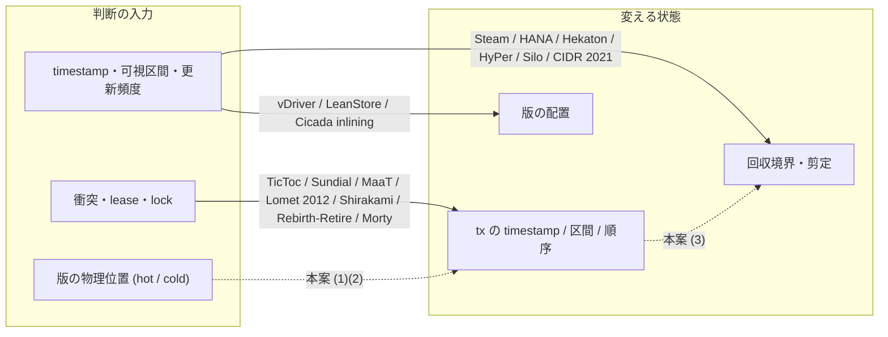

# VHash 論文の関連研究と新規性の位置づけ (原典照合、2026-09-29)

- 目的: 出典メモ (`docs/paper-story-vhash/source-memo-2026-09-29.md`) が文献について書いている主張と比較相手を
  原典で確かめ、「本案のどこが新しく、どこが既知か」を機構単位で表にする。VHash 論文の関連研究節と新規性の主張の土台。
- 着手: 2026-09-29 (JST)。入力 commit: `51f896352ccfb8105859f3cc7440886820662232` (local main)。
  `docs/paper-story-vhash/` は着手時点で main に未着地だったため、同じ中身の複製
  (親セッションが `/work/1/SFC/tanab/tmp/vhash-2026-09-29/docs-snapshot/` に置いたもの) を読んだ。
- 本案 = 出典メモ §23 の 4 点 (以下「本案 (1)〜(4)」):
  (1) cold 領域へ入ることを timestamp 制御の入力にする、
  (2) 既読値を保てる範囲で、最新でない hot な版を選び、それが読める timestamp へ進む (版選択と timestamp 選択を同時に扱う)、
  (3) 前進を GC の保護条件 (回収境界) へ反映し、旧版の保持義務を縮める、
  (4) 複数版のメタデータを 1 つの物理構造にまとめ、版選択・前進の可否判断・validation を安くする。
- 本文は日本語、原典の逐語引用だけ英語。逐語は親が原典の PDF から抜いたテキストに実在することを機械照合した
  (§10.3)。数値は原典の表・図番号を添えられるものしか書かない。

---

## 0. 結論 (先に図)

**図の読み方。** 実線は原典で確かめた既存方式の「入力 → 変える状態」、破線は本案が足そうとしている矢印である。
図は機構の向きだけを表し、性能・成否・件数は表さない。「破線の矢印を持つ既存方式が世界に無い」ことも表さない (§8)。

要約 (詳細は §6〜§8):

- **既知 (原典で確認):** timestamp を後から・データに基づいて決めること (TicToc・Sundial・MaaT・Lomet 2012)、
  上書きされた既読値の救済 (TicToc §5.3)、版に可視区間を持たせること (Hekaton §2.5)、
  **旧版を読ませつつ tx の timestamp 区間をその版に合わせて調整すること** (Lomet 2012 §I.B・§VI.D)、
  最新版と旧版の物理的な分離 (HyPer・Cicada・vDriver・LeanStore・Freitag 2022)、
  timestamp や更新頻度を見て版の置き場所を決めること (vDriver・LeanStore — 本案 (1) の**逆向き**)、
  衝突を契機に timestamp・順序を動かして abort を避けること (Shirakami・Rebirth-Retire・Morty・MV3C)、
  長い tx が GC を止める問題と、その既存対処 (途中版の剪定・隔離・abort / 失効)。
- **言われていないと主張できるもの: 該当なし。** 索引検索の根拠 (RW2 以上) を添えられる主張が無かった (§8.2)。
- **未確定:** 本案 (1)、本案 (2) の「前向き・hot 版を選ぶ」部分、本案 (3) の「abort せず既読を保った前進を版データの
  回収境界へ反映する」部分、本案 (4)。いずれも読んだ 23 本の読んだ節には見当たらなかったが、索引検索に要裁定 1 件が残り、
  本文を取得できなかった近い候補 (vWeaver・Diva・Bayer 1982 ほか) がある (§8.3)。このうち本案 (3) の部分 (U0) が、
  最も近い先行 (Lomet 2012 §V.C・Shirakami §3.5) との差が機構として最もはっきりしている。
- **出典メモの文献要約の照合:** CCBench §7 (メモ §2・§16.1) の 5 主張は全て原典と一致 (§2)。
  Cicada (メモ §4) の 8 項目 (表 7 行と表の下の段落) は一致 (§3)。TicToc (メモ §11.2・§22.1) は一致、ただし
  timestamp history は著者自身が「測れるほどの効果なし」と報告している (§4)。CIDR 2021 (メモ §23.4) は一致 (§5)。

---

## 1. 何を確かめ、何を確かめていないか

| 確かめたこと | 確かめていないこと |
|---|---|
| 23 本の論文と 3 件の公式文書の本文 (取得物の SHA-256 は §11) | 本文を取得できなかった候補の内容 (§11.2 の 7 行、文献としては 8 本。うち Boksenbaum の 2 本が同じ研究の別版かは未確定) |
| 各論文の「読んだ節」(§11 の表と各節) に書かれていること | 読んでいない節 (評価の細部、証明本体など) に本案と同じ機構が書かれていないこと |
| README に置いた英語の逐語 54 か所が原典テキストに実在すること (§10.3。52 か所は機械照合、2 か所は同じ 1 句で目視) | 子の読書メモ (`reading-notes/`) の逐語のうち README に引かなかったもの |
| OpenAlex の題名検索 12 本の全 hit (101 件) の判定 (§10.1) | 索引の登録母集合検索 (`docs/related-work/README.md` 7.7.4 の RW3)。本 README の検索記録は RW2 相当まで |
| 出典メモの文献要約 (§2・§4・§11.2・§16.1・§22・§23.4) と原典の一致 | 本案そのものの正しさ・性能 (本 wave は文献のみ。実装・計測は scope 外) |

読み手への注意: 本 README の「言っていない」「見当たらない」は、**その論文の読んだ節**についての記述であり、
論文全体や世界についての不在の主張ではない。世界についての不在は §8 の規則で扱う。

---

## 2. CCBench §7 の照合 (メモ §2・§16.1)

書誌: Takayuki Tanabe, Takashi Hoshino, Hideyuki Kawashima, Osamu Tatebe. "An Analysis of Concurrency Control
Protocols for In-Memory Databases with CCBench." PVLDB 13(13): 3531–3544, 2020. DOI 10.14778/3424573.3424575。
§7 の構成: 7 ANALYSIS OF VERSION LIFETIME / 7.1 Determining Version Overhead (図 11〜13) /
7.2 Limit of Current Approach (図 14) / 7.3 Aggressive Garbage Collection。**節・図番号はメモと一致しずれは無い。**

| メモの主張 | 判定 | 原典の根拠 |
|---|---|---|
| (a) §7 が version lifetime と性能の関係を分析 | 一致 | §7 見出し "ANALYSIS OF VERSION LIFETIME"。§1.3 "§7 investigates the effect of version lifetime management." |
| (b) 図 12〜13 で Cicada の追加コストが read/write に現れ、version chain traversal に帰属される | 一致 | §7.1 "the major overhead of Cicada lies in the read and write operations rather than validation or GC." / "We attribute the overhead shown by Cicada in Figs. 12a and 12b to the cost of version chain traversals." (図 13 は Cicada-SV と Silo の対照) |
| (c) 図 14 = RapidGC の限界 (長い tx があると GC 間隔を縮めても頭打ち) | 一致 | §7.2 "Even state-of-the-art GC does not sufficiently reduce the number of visible versions if there is only a single long transaction." / "Saturation occurred when the GC interval was the same as the added delay." |
| (d) §7.3 が AggressiveGC (必要とされ得る版も回収し、必要になった tx を新しい timestamp で再実行) を提起 | 一致 | §7.3 "we suggest a novel GC scheme, AggressiveGC, that aggressively collects versions beyond the current ones to deal with long transactions." / "…which could be handled by aborting the transaction and retrying it with a new timestamp." |
| (e) 図 14 の長い tx は read phase 末尾の人工遅延で作る | 一致 | §7.2 "To generate a long transaction, we added an artificial delay at the end of the read phase." |

用語の定義 (原典): RapidGC = "(7) RapidGC: frequent updating of timestamp watermark for GC in MVCC protocols." (§3.2)。
AggressiveGC は §1.2 で "It requires an unprecedented protocol that weaves GC into MVCC" と先出しされる。
**AggressiveGC は提起 (suggest) であって実装・評価はない。** 子 A の grep では `external/ccbench` の
ソースに `AggressiveGC` の実装は見つからなかった (任意確認、完全性は監査していない)。

補足 (メモに無い事実): CCBench §3.3 は Cicada 原論文の validation について
"we fixed a logical bug, i.e., the incomplete version consistency check in the validation phase." と書いている。
Cicada を比較相手にする本系列では、「原論文の Cicada」と「CCBench の Cicada」が同じでないことを明記する必要がある。

---

## 3. Cicada の照合 (メモ §4・§7.3・§13)

書誌: Hyeontaek Lim, Michael Kaminsky, David G. Andersen. "Cicada: Dependably Fast Multi-Core In-Memory
Transactions." SIGMOD 2017, pp.21–35. DOI 10.1145/3035918.3064015 (DOI は検索結果から。ACM の頁は未取得)。

| メモ §4 の項目 | 判定 | 原典の根拠 |
|---|---|---|
| 版選択: wts 降順の list から tx の timestamp に対応する版 | 一致 | §3.2 (版の列と可視版の探索) |
| 状態: PENDING / COMMITTED / ABORTED など | 一致 | §3.2。状態は PENDING・COMMITTED・ABORTED に加え UNUSED・DELETED (子 B の読み) |
| rts の意味 | 一致 | §3.2 "a read timestamp (rts) that indicates the maximum timestamp of (possibly) committed transactions that read this version" |
| validation の順序 (pending 設置 → rts 更新 → version consistency check) | 一致 | §3.4 "(1) Pending version installation … (2) Read timestamp update … (3) Version consistency check" |
| 既存最適化 (best-effort inlining、incremental version search) | 一致 | §3.3 (inlining の昇格条件: "(v.wts) < min_rts; and (3) the inlined version is currently UNUSED")、§3.5 (incremental version search) |
| read-only 経路 | 一致 | §3.1 "A read-only transaction uses (thread.rts) instead, and does not track or validate the read set" |
| GC = timestamp の下限と quiescence | 一致 | §3.1 (min_wts・min_rts)、§3.8 (quiescent state の宣言と leader による min_wts・min_rts の更新) |
| 対象 timestamp 以下の PENDING 版は飛ばさず待つ | 一致 | §3.2 "For PENDING, it spin-waits until the status is changed." |
| (照合で追加) timestamp の割当て | — | §3.1 "the current local clock, a clock boost, and the thread ID. The clock boost is a per-thread quantity that is temporarily granted to a thread upon an abort" |

本案との関係 (原典の読んだ範囲): tx の timestamp は開始時に割り当てられ、実行中に動かす仕組みは無い。
timestamp が変わるのは abort 後の再試行 (clock boost) だけで、既読値を保った前進ではない。
best-effort inlining は「1 版だけ」をレコードの先頭に埋め込むもので、inline にする版は読んだ版の昇格条件で決まり、
tx 側の版選択や timestamp 決定には使われない。長い tx が GC を止めるという記述は読んだ範囲に無い
(Cicada の §3.8 は GC 頻度の効果だけを述べる)。

---

## 4. TicToc の照合 (メモ §11.2・§22.1)

書誌: Xiangyao Yu, Andrew Pavlo, Daniel Sanchez, Srinivas Devadas. "TicToc: Time Traveling Optimistic
Concurrency Control." SIGMOD 2016, pp.1629–1642. DOI 10.1145/2882903.2882935。

| メモの主張 | 判定 | 原典の根拠 |
|---|---|---|
| データ駆動の timestamp 決定 | 一致 | §3.1 式 (1) と Algorithm 2 (commit_ts を read set の wts と write set の rts+1 の最大から計算) |
| timestamp history による既読値の救済 | 一致 (但し書きあり) | §5.3 "Timestamp History" (旧版の wts を history buffer に置く)。§6.4 で既定設定に含まれる ("this last configuration is the default setting for TicToc")。**§6.4 で著者自身が "the timestamp history optimization does not provide any measurable performance gain in either workload." と報告** |
| single-version で旧 payload を保持しない | 一致 | §5.3 "The value of the old version does not need to be stored since transactions in TicToc always read the latest data version." |
| rts の延長 | 一致 | Algorithm 2 (wts が一致しロックされていなければ rts を commit_ts まで延ばす) |

メモ §11.2 の結論 (「上書きされた read を救えるのは MVCC だけ」という対比は誤り) は原典どおり正しい。
加えて、論文で TicToc を比較相手に挙げるときは、timestamp history の効果が原典で測れなかったことを併記すべきである。
TicToc は旧版を新たに読めない (single-version) ので、本案 (2) の「まだ読んでいない旧版を読む」自由度は無い。

---

## 5. CIDR 2021 "Everything is a Transaction" の照合 (メモ §23.4)

書誌: Ling Zhang, Matthew Butrovich, Tianyu Li, Yash Nannapanei (原典の表記どおり)、Andrew Pavlo ほか (CMU、著者 26 名、全員の名は
`reading-notes/A-ccbench-cidr.md`). "Everything is a Transaction: Unifying Logical Concurrency Control and
Physical Data Structure Maintenance in Database Management Systems." CIDR 2021。

- **一致。** 要旨 "there is a disconnect between the logical semantics of transactions and the DBMS's underlying
  implementation." メモの「協調設計という標語だけでは新規性にならない」という位置づけは原典どおり。
- 機構 (DAF): 物理構造の保守 (旧版の unlink など) を timestamp 付きで遅延させ、最古の実行中 tx の開始 timestamp が
  その timestamp を越えたら実行する。tx の timestamp は動かさない。
- **長い tx には効かないと著者が明記:** §7 "The most onerous shortcoming of our current implementation of DAF is that it
  assumes user transactions are short-lived. Action processing will halt if the oldest running transaction in the system
  does not finish." — CCBench §7.2 と同型の未解決問題として引用できる。

---

## 6. 機構単位の比較表

列の意味は md_1 の指定どおり。各セルの根拠節は原典の節番号。「—」は該当しないこと。
**セルの「無し」「見当たらない」は、その論文の読んだ節についての記述である。**

### 6.1 本案と、timestamp を動かす方式

| 方式 | 何を入力に判断するか | どの状態を変えるか | どの不変条件を保つか | どのコストを減らすか | 旧版を新たに読めるか | 長い tx への効き方 |
|---|---|---|---|---|---|---|
| **本案 (メモ §23)** | 次の read が hot 領域の外 (cold) へ入ること、既読版の可視区間 | tx の候補 timestamp (前進のみ)、読む版、GC に公開する保護下限 | serializability (前進先で既読値が保たれること、メモ §8・§13) | cold な旧版の探索、旧版の保持、abort せずに済む仕事 | 可 (hot 内の非最新版を選ぶのが要点) | アクセス駆動なら実行中の tx に効く。read 後に止まっている tx には発火しない (メモ §16.1、自認の限界) |
| CCBench AggressiveGC (§7.3、構想) | 長い tx による版の保持 | 可視な版も回収、読めない tx は abort → 新 timestamp で再試行 | (提起のみ) | 保持される版 | 回収された版は不可 | 長い tx を失敗させて再実行 |
| TicToc (§3, §5.3) | read set の wts・write set の rts | commit_ts、tuple の rts (延長) | serializability (式 1) | 中央 timestamp 割当て、abort | 不可 (single-version) | 記述なし |
| Sundial (§3.1, §2.1) | tuple の logical lease (wts, rts) との衝突 | commit_ts、lease の延長 | serializability | read-write 衝突による abort (分散) | 不可 ("Sundial works in a single-version database") | 記述なし |
| MaaT (§3.1–3.3) | tsr / tsw と自 tx の区間 [lower, upper] の矛盾 | 自 tx の timestamp 区間、commit 時に 1 点を選ぶ | serializability | 分散 OCC の validation・2PC のロック待ち | 不可 ("We avoid multi-version concurrency control") | 記述なし |
| Lomet ほか 2012 (§I.B, §V.C, §VI.D) | lock 管理で検出した衝突 | 自 tx と相手の timestamp 区間。**読み手は更新中の版より前の版を読み、区間を書き手より前へ寄せる** | serializability (区間が空なら abort) | read/write の待ち・abort | 可 ("T1 continues to read the old version") | 記述なし。読み取り専用 tx は早い時刻の as-of 読みにできる (§VIII.D) |
| Shirakami S-LTX (v3 §3.1–3.4) | 先行する長い tx が commit 済みで、自分の read set と書き込み key が重なること | 自 tx の serialization epoch ("order forwarding")。**epoch は早まる向きにも動く** (§3.3 "placed earlier than its opening epoch") | serializability (§3.7)、既読 epoch 以下になるなら abort (Algorithm 1) | 長い tx の false-positive abort | 可 (epoch ごとの snapshot) | 本論文の主題。長い tx を優先し順序を調整 |
| Rebirth-Retire (§3.1.2, §4.4) | lock 衝突 (古い tx が若い tx の保持する lock を要求) | 古い tx (と子孫) の timestamp を大きくする | serializability (依存グラフと commit point の順序、§3.3) | Wound による abort | 可 ("a tuple may have multiple versions") | 記述なし |
| MV3C (arXiv 1603.00542 §3.5) | 述語の validation 失敗 | 新しい開始 timestamp S'、無効になった部分だけ再実行 | serializability | 全体の abort と再実行 | 可 (MVCC) | 部分再実行で救う (既読値は**読み直す**) |
| Morty (EuroSys 2023 §3.2, §4.1, §4.3) | serialization window の重なり | 既読値を相手の書いた値へ置き換え ("shifting T's window forward")、部分再実行 (実行ごとに新しい eid。版順序 ver は Begin で固定、§4.1) | serializability | 衝突時の abort (分散・複製) | 可 | 長い tx 固有の記述なし (読んだ節)。truncation は単調に増える truncation_ver で、前進とは別の機構 (§4.3)。**既読値は捨てる向き** |
| Cicada (§3.1) | local clock・clock boost・thread ID | abort 後の再試行時だけ新しい timestamp | serializability | timestamp 割当ての集中 | 可 ("freely read and write non-latest versions") | 記述なし |

### 6.2 版の配置・版探索を変える方式

| 方式 | 何を入力に判断するか | どの状態を変えるか | どの不変条件を保つか | どのコストを減らすか | 旧版を新たに読めるか | 長い tx への効き方 |
|---|---|---|---|---|---|---|
| Cicada best-effort inlining (§3.3) | 読まれた非 inline 版が十分古い ((v.wts) < min_rts) かつ inline slot が UNUSED | 1 版をレコード先頭に inline 化 | serializability | 間接参照 | 可 | 記述なし |
| HyPer (Neumann ほか 2015 §2.1–2.6, §4.2) | 読み手の startTime | 最新版を in-place、旧版は undo buffer の差分 (newest-to-oldest)、VersionedPositions (レコード範囲ごとの要約) | serializability (precision locking) | 旧版の再構成、scan の版検査、更新 ("independent of the total number of versions") | 可 (GC まで) | 長い tx は "aborted and restarted on a snapshot" (§4.2) |
| Hekaton (Larson ほか 2011 §2.5, §3.1) | 版の Begin / End と読み手の read time | 版の Begin / End (tx ID または timestamp) | serializability (commit 時に既読版がまだ可視かを確認) | 読みのブロック | 可 (可視区間に入る版) | 長い read-only tx への耐性を評価 (§5.2.2)。GC の詳細は scope 外と明記 |
| BOHM (Faleiro, Abadi 2015 §3.2, §4.2.3) | 事前に分かる read / write set | 版の placeholder を先に作り、読む版への参照を CC 層が付与 | serializability | 版探索 ("without accessing any preceding or succeeding versions") | 可 | 記述なし (読んだ範囲) |
| vDriver (Kim ほか SIGMOD 2020 §3.3、技術報告版) | 版の可視区間の長さ、長い tx の snapshot に属するか | 版を hot / cold / 長い tx 用の 3 クラスに分けて置く | 生きている tx が要る版は辿れる (Theorem 3.5) | 版空間、GC の停滞 | 可 | 長い tx 用の版を隔離し、他クラスの回収を止めない |
| LeanStore MVCC (Alhomssi, Leis 2023 §3.1–3.3) | tx 種別 (OLTP / OLAP)、更新頻度 | OLTP 用と全体用の 2 本の watermark、tombstone を Graveyard Index へ、版の格納形式を tuple ごとに切替 | snapshot isolation | OLTP の tombstone 読み飛ばし、scan、GC | 可 | 長い OLAP がいても OLTP 用 watermark は進む |
| Freitag ほか 2022 (§3.1) | (静的な設計) | 最新版だけを disk のページに、旧版は常に in-memory | (MVCC) | disk 上の版管理 | 可 | GC は Steam を採用 |
| Silo snapshot (Tu ほか 2013 §4.1, §4.9) | snapshot epoch との比較 | 必要なときだけ旧版を 1 つ残す | serializability (通常 tx)、snapshot tx は固定 epoch | 通常時の版保持 | 通常 tx は不可、snapshot tx は固定 epoch の版のみ | 長い tx は epoch を更新しないと GC を遅らせる ("should periodically refresh") |
| vWeaver (Kim ほか SIGMOD 2021) | **本文を取得できず** | — | — | — | — | — (cMVBT arXiv 2606.09133 §1 が "frugal skiplists and vWeaver" と引用するのみ) |

### 6.3 GC・長い tx を扱う方式

| 方式 | 何を入力に判断するか | どの状態を変えるか | どの不変条件を保つか | どのコストを減らすか | 旧版を新たに読めるか | 長い tx への効き方 |
|---|---|---|---|---|---|---|
| Steam (Böttcher ほか 2019 §4.3) | 実行中 tx の開始 timestamp の集合 | 版の列の途中の不要版を更新時に剪定 (EPO) | 実行中 tx が要る版は残す | 版の列の長さ、GC 処理 | 剪定された版は不可 | 回収境界は動かないが、列の長さを実行中 tx 数で抑える |
| SAP HANA hybrid GC (Lee ほか 2016 §4) | snapshot timestamp の集合、snapshot が触る table | 途中版の回収 (interval GC)、table ごとの境界 (table GC) | snapshot isolation | 版空間、長い OLAP の遅延 | 回収された版は不可 | 境界の範囲を table に限る。運用では強制 close・disk 退避も挙げる (§1) |
| CIDR 2021 DAF (§3, §7) | 最古の実行中 tx の開始 timestamp | 遅延した保守処理の実行 | 見える版は消さない | 実装の複雑さ | (DAF は関与しない) | **効かないと著者が明記** |
| Wu ほか 2017 (実測の比較) | (設計空間の分類) | (版の格納・GC・索引の方式) | — | — | 可 | "The DBMS's performance drops in the presence of long-running transactions." |
| PostgreSQL old_snapshot_threshold (9.6 で導入、17 で削除) | snapshot の経過時間 | 閾値より古い不要行を回収し、その後に古い snapshot で変更済みページを読んだ tx をエラーにする | (エラーで失敗させる) | 版空間 | 回収後は不可 | 古い読み手を失敗させる。17 の release notes は "might be re-added … if an improved implementation is found" |
| Oracle ORA-01555 | (undo の上書き) | — | — | — | 上書き後は不可 | "rollback records needed by a reader for consistent read are overwritten by other writers" でエラー |

---

## 7. 本案 4 点と、最も近い先行研究

判定語: 同じ = その論文が同じ機構を述べている / 一部 = 構成要素の一部を述べている / 逆向き = 入力と出力が本案と逆 /
見当たらない = 読んだ節には無い (世界の不在ではない)。

| 本案 | 最も近い先行 | 判定 | 差分 (原典の根拠) |
|---|---|---|---|
| (1) cold へ入ることを timestamp 制御の入力にする | vDriver §3.3、LeanStore §3.1–3.3 | 逆向き | 両者は timestamp・可視区間・更新頻度を**入力**にして版の**配置**を決める。本案は配置を入力に timestamp を動かす |
| (1) | Rebirth-Retire §4.4 | 一部 | 版の列を辿る cache miss を認識するが、prefetch で**隠す**側に使い、timestamp 決定の入力にしない |
| (1) | Sundial §5.3 | 逆向き | lease の値に応じて cold な tuple の lease をまとめる (値 → 保存の仕方) |
| (2) 既読を保てる範囲で hot な非最新版を選び、その版が読める timestamp へ進む | Lomet 2012 §I.B・§VI.D | 一部 | **旧版を読ませて timestamp 区間を合わせる**点は既知。契機は lock 衝突で、向きは読み手を書き手より**前**へ寄せる。アクセスコスト (hot / cold) を理由に前向きへ動かす記述は見当たらない |
| (2) | BOHM §3.2.3 | 一部 | 読む版と timestamp を CC 層が同時に決めるが、事前に分かる read / write set による決定で、既読値の維持判断ではない |
| (2) | Shirakami §3.1.3 | 一部 | 衝突を契機に serialization epoch を調整し、既読 epoch を割るなら abort。版の物理位置は入力にしない。epoch は早まる向きにも動く |
| (2) | TicToc §3.1、Sundial §3.1、MaaT §3.1 | 一部 | データ駆動の timestamp 決定は既知。いずれも single-version で「旧版を選ぶ」自由度が無い |
| (3) 前進を回収境界へ反映して保持義務を縮める | Lomet 2012 §V.C | 一部 | "By choosing the earliest timestamp in the acceptable range, we hasten the time we can remove A" — timestamp の選び方を**衝突管理表の項目の削除**に結ぶ。版データの回収ではない |
| (3) | Shirakami §3.5 | 一部 | 同じ epoch 内の版順序をその場で決め ("On-demand version order determination")、順序を前へ送ることで先行 tx の書込みとログを省く ("the corresponding writes and logging of earlier transactions can be omitted")。**作られる版を減らす**向きで、既にある旧版の回収境界を進める話ではない |
| (3) | Morty §4.1・§4.3 | 見当たらない | 前進 (再実行) は既読値を捨てて読み替える向き。版順序 ver は開始時に固定され、truncation_ver は commit 済み状態をまとめる別の境界で、前進の結果ではない |
| (3) | HyPer §4.2、AggressiveGC (CCBench §7.3)、PostgreSQL old_snapshot_threshold | 一部 | 古い tx を **abort / 失敗**させて境界を進める。既読を保った前進ではない |
| (3) | Steam §4.3、HANA §4.2–4.3、vDriver §3.3、LeanStore §3.1 | 見当たらない | 長い tx の timestamp は動かさず、剪定・隔離・境界の分割で保持を減らす |
| (4) 複数版メタデータを 1 つの構造にまとめ、版選択・前進判断・validation を安くする | Cicada §3.3 (inline 1 版)、HyPer §2.6 (VersionedPositions)、vDriver §3.3 (VS descriptor)、TicToc §5.3 (wts の history buffer) | 一部 | 各々は 1 版の inline・レコード範囲の要約・回収判断・validation 救済の**どれか 1 つ**。前進の判断は元々無い |
| (4) の標語「tx と物理構造の協調」 | CIDR 2021 §1 | 同じ (標語として) | メモ §23.4 のとおり、標語だけでは新規性にならない |

---

## 8. 3 分類 (既知 / 言われていないと主張できる / 未確定)

### 8.1 既に言われている (原典で確認)

| ID | 主張 | 原典 |
|---|---|---|
| K1 | tx の timestamp を後から、データ (wts / rts・lease・区間) に基づいて決める | TicToc §3.1、Sundial §3.1、MaaT §3.1、Lomet 2012 §I.B |
| K2 | 上書きされた既読値を、旧版の payload なしに timestamp の履歴で救う | TicToc §5.3 (効果は §6.4 で測れず) |
| K3 | 版に可視区間 (Begin / End) を持たせ、区間で可視性と validation を行う (メモ §9 の説明用モデルと同形) | Hekaton §2.5・§3.1 |
| K4 | 旧版を読ませ、その版に合わせて tx の timestamp 区間を調整する | Lomet 2012 §I.B・§VI.D |
| K5 | 最新版と旧版を物理的に分けて置く (最新を in-place / inline、旧版を別領域) | HyPer §2.1、Cicada §3.3 (1 版)、vDriver §3.3、LeanStore §3.3、Freitag 2022 §3.1 |
| K6 | timestamp・可視区間・更新頻度を入力に、版の置き場所を決める | vDriver §3.3、LeanStore §3.1・§3.3 |
| K7 | 長い tx があると GC が止まり、版が溜まる | CCBench §7.2、Wu 2017、Steam §1、HANA §1、CIDR 2021 §7、Silo §4.1 |
| K8 | 長い tx への既存対処: 途中版の剪定、版の隔離・境界の分割、abort / 強制 close / snapshot の失効 | Steam §4.3、HANA §1・§4、vDriver §3.3、LeanStore §3.1、HyPer §4.2、PostgreSQL 9.6 / 17、Oracle ORA-01555 |
| K9 | 必要とされ得る版を回収し、読めなくなった tx を新しい timestamp で再実行させる構想 | CCBench §7.3 (AggressiveGC、提起のみ) |
| K10 | 衝突を契機に tx の timestamp・順序を動かして abort を避ける | Shirakami §3.1.3、Rebirth-Retire §3.1.2、Lomet 2012 §II.B、MV3C §3.5、Morty §3.2 |
| K11 | timestamp の選び方を、保持の境界に結ぶ (版データ以外) | Lomet 2012 §V.C (区間の最も早い timestamp を選んで衝突管理表の項目を早く消す)、Shirakami §3.4.1 (epoch 長と GC コストの一般論) |
| K12 | 版の列を辿るコストの問題視と、配置・事前決定・prefetch による削減 | CCBench §7.1、BOHM §4.2.3、Cicada §3.3、Rebirth-Retire §4.4 |
| K13 | 「tx の意味論と物理構造の保守の分断」を問題にする協調設計 | CIDR 2021 要旨・§1 |
| K14 | 順序を前へ送ることで、先行 tx の版の書込み自体を省く | Shirakami §3.5 (同じ epoch 内の版順序のその場決定と non-visible write rule) |

### 8.2 言われていないと主張できるもの — 該当なし

索引検索の根拠 (`docs/related-work/README.md` 7.7.3 の RW2 以上) を添えて「言われていない」と書ける主張は無かった。
理由は次の 2 つである。

- **検索式と主張の対応を、結果を見る前に決めていなかった。** 事前登録 (親 brief) は検索式・判定規則・打ち切りを固定したが、
  どの検索式がどの主張を支えるかは固定しなかった。起草時に本案 (3) の部分 (下の U0) を O02〜O06・O11 に対応させて
  「見つからなかった」と書いたが、これは判定後に選んだ対応であり、段 6 のレビューで指摘を受けて取り下げた。
- **O09 の要裁定 1 件 (OCC-TI、IPL 1997) を、題名だけで範囲外にできない。** 7.7.6 は「要旨が取れない・本文確認が要るものは
  要裁定にし、題名だけで除外しない」と定める。O09 は timestamp の調整を扱い、本案の前進 (1)〜(3) のどれにも関わりうる。

したがって以下の U0〜U3 は、md_1 の指定どおり「見つからなかった (範囲: …)」の形でだけ書く。

### 8.3 未確定

| ID | 主張 | 未確定の理由 | 確定させる次の一手 |
|---|---|---|---|
| U0 | **abort せず既読値を保ったまま** tx の timestamp を前進させ、その前進を**版データ**の回収境界 (GC に公開する保護下限) へ反映して保持期間を縮める (本案 (3) のうち K8・K9・K11・K14 を除いた残り) | 見つからなかった (範囲: §11.1 の 23 本と公式文書 3 件の「読んだ節」)。最も近いのは Lomet 2012 §V.C (timestamp の選び方で**衝突管理表**の項目を早く消す) と Shirakami §3.5 (順序を送って**版の書込み自体**を省く)。索引検索は上記 §8.2 の理由で根拠にならない | OCC-TI 論文の本文を読んで O09 の要裁定を解く。検索式と主張の対応を先に固定した登録母集合検索 (RW3) を行う |
| U1 | cold 領域へ入ることを、tx の timestamp を動かす契機にする (本案 (1)) | 見つからなかった (範囲: §11.1 の「読んだ節」。逆向きは K6)。索引検索 O09 に要裁定 1 件 (OCC-TI の時間区間の更新、IPL 1997、要旨も本文も取得できず) が残り、題名検索には既知の取りこぼしがある (§10.2) | OCC-TI 論文の本文を図書館経由で読む。登録母集合検索 (RW3) を行う |
| U2 | 既読を保てる範囲で、**前向きに**進んで hot な**非最新**版を選ぶ (本案 (2) のうち K4 を除いた残り) | K4 (Lomet 2012) が「旧版を読ませて区間を合わせる」を既に持つため、残りは「向きと契機」だけになる。この差が論文の新規性として十分かは文献でなく論証の問題。加えて U1 と同じ要裁定が残る | Lomet 2012 と本案の差 (契機・向き・既読維持の判定) を形式的に書き分ける。U1 と同じ検索 |
| U3 | 複数版メタデータを 1 つの構造にまとめ、版選択・前進判断・validation を同時に安くする (本案 (4)) | 部分要素はそれぞれ既知 (§7 の (4) 行)。前進判断が既知でない限り (U1・U2)、「前進判断も安くする」部分の新しさは U1・U2 に従属する | U1・U2 の確定後に再判定 |
| U4 | 本文を取得できなかった近い候補の内容: vWeaver (SIGMOD 2021)、Diva (SIGMOD 2022)、Bayer ほか 1982、Boksenbaum ほか (VLDB 1984 / TSE 1987)、OCC-TI (IPL 1997)、Mühe ほか (CIDR 2013)、Hekaton (SIGMOD 2013) | ACM の有料 wall・403・bot 判定で本文が取れなかった (§11.2) | 図書館経由で取得して §6 の列で追記する |

**書き方の規則 (論文へ持ち込むとき):** U0〜U3 は「我々が調べた範囲 (上記) では見当たらなかった」とだけ書ける。
`docs/related-work/README.md` 7.7.3 により、無限定の「先行研究が無い」「初めて」は使えない。

---

## 9. 出典メモの記述で、原典を読んで補うべき点

- **メモ §4 (Cicada):** 表の 7 行と下の段落はすべて原典と一致した。加えて、比較相手の Cicada には「原論文」と
  「CCBench の実装 (validation の不備を修正済み、CCBench §3.3)」の 2 つがある。
- **メモ §9 (可視区間のモデル):** 同形のモデルは Hekaton §2.5 が実装に使っている (K3)。本案はこれを新規性として
  主張していないので矛盾は無いが、関連研究節では Hekaton を出典として示すべきである。
- **メモ §11.2 (TicToc の timestamp history):** 事実は正しい。論文では「原典で効果が測れなかった」ことも書く (§4)。
- **メモ §22・§23.2 (TicToc との差):** 「旧版を選べる」ことを差とする議論は、**TicToc に対しては成立するが、
  Lomet 2012 (K4) に対しては成立しない。** 本案 (2) の新しさは「旧版を選べる」ではなく「前向き・アクセスコスト契機」
  の側に置き直す必要がある (U2)。
- **メモ §22.3 (有用な対照):** 「cold miss 時に abort して新しい timestamp で再実行する方式」は AggressiveGC (K9)・
  HyPer の abort と snapshot 再開・PostgreSQL old_snapshot_threshold と同じ系統として関連研究で引ける。
- **メモ §23.4 (CIDR 2021):** 原典と一致。さらに同論文 §7 が「長い tx に効かない」と自認していることは、
  問題設定の裏づけとして使える (§5)。

---

## 10. 検索の記録

### 10.1 OpenAlex 題名検索 (RW2 相当)

- 手順: 検索式・判定規則・打ち切り条件は**取得前に**専用 handoff に登録した。最初に登録した DBLP は、
  12 本全てが HTTP 200 で bot 判定の HTML (JSON でない) を返したため走行無効とし、結果を 1 件も判定せずに
  同じ 12 語で OpenAlex に切り替えた (後継 ID O01〜O12)。
- 要求: `https://api.openalex.org/works?filter=title.search:<語>&per-page=200&cursor=*`
  (題名だけを対象にした検索)。取得 2026-09-29 03:35 JST。要求間 3 秒。
- 事前登録で固定したのは検索式・判定規則・打ち切りまでで、**どの検索式がどの主張を支えるかは固定していない**。
  そのため本検索は §8 の「言われていない」の根拠に使っていない (§8.2)。
- 全 12 本で `meta.count` = 取得件数 = 重複除去後の件数。全 hit の work ID・題名・判定・理由コードと、
  各 page の生応答の SHA-256 は `search-ledger.json` にある。**生応答本文は repo に置かない** (`output/README.md`)。

| ID | 語 (題名) | 件数 | 判定 |
|---|---|---|---|
| O01 | timestamp forwarding | 0 | — |
| O02 | timestamp garbage collection | 3 | 除外 3 (プログラムのメモリ GC) |
| O03 | long running transactions garbage collection | 0 | — |
| O04 | multiversion garbage collection | 3 | 近傍 2、除外 1 |
| O05 | multi-version garbage collection | 4 | 近傍 1 (陽性対照 HANA)、除外 3 |
| O06 | MVCC garbage collection | 3 | 近傍 3 (陽性対照 Steam を含む) |
| O07 | version chain concurrency | 1 | 除外 1 (blockchain) |
| O08 | dynamic timestamp allocation | 2 | 近傍 2 (陽性対照 Bayer 1982 を含む) |
| O09 | timestamp adjustment concurrency control | 1 | **要裁定 1** (OCC-TI、IPL 1997。要旨は OpenAlex・Semantic Scholar・Crossref のどれでも取得できず、本文は非公開) |
| O10 | version storage concurrency control | 0 | — |
| O11 | MVCC long transactions | 0 | — |
| O12 | hot versions | 84 | 除外 84 (DB 以外の分野) |

判定語は `docs/related-work/README.md` 7.7.5 に従う。検出 = 本案 (1)〜(4) のどれかと同じ機構を示すもの。
近傍として要旨を読んだもの: Ben-David ほか (SPAA 2019、版を最後の利用者が手放した時点で回収)、
Ben-David ほか (DISC 2021、版の列の不要版を精密に回収)、Arora ほか (IEEE CLOUD 2018、衝突に基づく動的 timestamp 割当て)、
Moya Vaca (Zenodo 2026、査読なし、branch つき MVCC の GC 境界)。いずれも tx の timestamp を配置や GC のために動かさない。

### 10.2 検索の限界 (偽陰性)

- **題名検索は取りこぼす。** 長い tx と GC を主題とする vDriver ("Long-lived Transactions Made Less Harmful") は
  題名に garbage collection を含まないため O03 に出ない。LeanStore・Cicada・Hekaton も同じ理由で出ない。
  したがって §10.1 は「その語を題名に全て含む論文」の範囲の記録であり、それ以上を意味しない。
- 陽性対照 3 本 (HANA hybrid GC、Steam、Bayer 1982) は該当する検索に現れた。
- 母集合の外 (網羅を保証しない): SIGMOD / PVLDB / OSDI / SOSP などの venue 本体の年次一覧、ACM Digital Library、
  書籍、技術報告、学位論文、非英語文献、索引化されていない実装。DBLP・arXiv は本走では使っていない
  (DBLP は bot 判定、arXiv は未実施)。
- 主な発見経路は索引検索ではなく、原典の関連研究節と参考文献の追跡 (Sundial・MaaT → Lomet 2012、
  Rebirth-Retire → Morty、LeanStore → Diva、cMVBT → vWeaver) だった。

### 10.3 逐語の照合

README に置いた英語の逐語は、親が原典の PDF を段組を解かずにテキスト化 (`pdftotext`) し、合字・改行・
行末ハイフンを正規化したうえで文字列の出現を数えて確かめた (子の報告を写しただけの逐語は置いていない)。
2 段組を `pdftotext -layout` で抜くと左右の段が混ざって 0 件になる句があったため、照合は段組なしの抽出で行った。
字形 (’ と ')・大文字小文字・改行位置のハイフンの違いは正規化で吸収した。照合の対象は README の英語の二重引用符の中身 (15 字以上) 54 か所で、Mermaid 図の構文の断片 6 件は除いた。
52 か所は照合器が実在を数えた。一致を出せなかった 2 か所は同じ Morty の句 "shifting T's window forward" で、
原文は数式用の斜体文字 (𝑇) と空白が入る ("thereby shifting 𝑇 ’s window forward") ためであり、原文を目で確かめた。
照合器の生出力は `quote-check.log` (README 確定後に再走したもの) にある。照合器本体は repo 外の
`/work/1/SFC/tanab/tmp/vhash-related-work-2026-09-29/readme_qcheck.py` にある。

---

## 11. 書誌と取得記録

### 11.1 本文を読んだもの

取得物は repo 外 (`/work/1/SFC/tanab/tmp/vhash-related-work-2026-09-29/src/`) に置いた。論文の PDF は著作物なので
repo に複製しない。

| 文献 | venue | 取得元 | 版 | SHA-256 (先頭 16 桁) | 読んだ節 |
|---|---|---|---|---|---|
| Tanabe ほか, CCBench | PVLDB 13(13) 2020 | vldb.org/pvldb/vol13/p3531-tanabe.pdf | 公式 | fee3789bbe81ae30 | §1, §2.1, §3.2–3.3, §4.3, §7 全体, §9 |
| Zhang ほか, Everything is a Transaction | CIDR 2021 | db.cs.cmu.edu/papers/2021/cidr2021_paper06.pdf | 著者版 | 5ec8f8fa57707f49 | 要旨, §1–§3, §7 |
| Lim ほか, Cicada | SIGMOD 2017 | faculty.cc.gatech.edu の講義用ミラー | camera-ready 相当 | 4f6c5118a51ffbae | §1, §2.1, §3 全体, §4.1, Table 2 |
| Yu ほか, TicToc | SIGMOD 2016 | people.csail.mit.edu/sanchez/papers/2016.tictoc.sigmod.pdf | 著者版 | d19fc1e7140a6b4f | §2–§3, §5, §6.1, §6.4, 付録 |
| Böttcher ほか, Steam | PVLDB 13(2) 2019 | vldb.org/pvldb/vol13/p128-bottcher.pdf | 公式 | ceae3ff7928379a7 | §1–§2, §4.3–4.4, §5.6–5.7, §6 |
| Lee ほか, SAP HANA hybrid GC | SIGMOD 2016 | 15721.courses.cs.cmu.edu の講義用ミラー | camera-ready 相当 | e81d952698e8ad1c | §1–§4, §5 の記述, §6 |
| Kim ほか, vDriver | SIGMOD 2020 | github.com/hyu-scslab/vDriver の技術報告 | 技術報告版 (camera-ready と同一の保証なし) | 5d24648fc9f79636 | 要旨, §1, §2.1 の一部, §3.1–3.4 冒頭 |
| Wu ほか, Empirical Evaluation of In-Memory MVCC | PVLDB 10(7) 2017 | vldb.org/pvldb/vol10/p781-Wu.pdf | 公式 | e0f3d3be03734d2a | §4–§6 |
| Alhomssi, Leis, LeanStore MVCC | PVLDB 16(6) 2023 | vldb.org/pvldb/vol16/p1426-alhomssi.pdf | 公式 | c334ca5dcfdbe713 | §1–§3, §5, §6 |
| Larson ほか, Hekaton CC | PVLDB 5(4) 2011 | microsoft.com Research の revised 版 | 著者版 | 0abcc1ff2eb15d21 | §1–§3, §4.1 冒頭, §5–§7 |
| Neumann ほか, HyPer MVCC | SIGMOD 2015 | db.in.tum.de の著者版 | 著者版 | af94b3c882ac6218 | §2.1–2.7, §4.2, §5.1, §6 |
| Kim ほか, ERMIA | SIGMOD 2016 | cs.sfu.ca の共著者版 | 著者版 | 0c9f8151e25da642 | §1 冒頭, §3.2, §3.4–3.6, §5–§6 |
| Faleiro, Abadi, BOHM | PVLDB 8(11) 2015 | cs.umd.edu の共著者版 | 著者版 | ea7dff6561ff555f | §3.2, §3.3.2, §4.2.2–4.2.3 |
| Tu ほか, Silo | SOSP 2013 | sigops.org の公式 PDF | 公式 | 870c895f654a6c11 | §1, §2, §4.1–4.2, §4.4–4.9 前半 |
| Freitag ほか, MVCC for Disk-Based Systems | PVLDB 15(11) 2022 | vldb.org/pvldb/vol15/p2797-freitag.pdf | 公式 | dc933deb8243e29c | 要旨, §3.1 |
| Tonta ほか, cMVBT | arXiv 2606.09133 v1 | arxiv.org | preprint (本文の PVLDB 表記は雛形の埋め忘れで、掲載先は未確定) | 78d16075ee964d89 | 要旨, §1 |
| Yu ほか, Sundial | PVLDB 11(10) 2018 | vldb.org/pvldb/vol11/p1289-yu.pdf | 公式 | 4f384ac51d4dbf77 | §1–§3, §5.2–5.3, §6.5–6.8, §7 |
| Mahmoud ほか, MaaT | PVLDB 7(5) 2014 | vldb.org/pvldb/vol7/p329-mahmoud.pdf | 公式 | e2caafb363d0c90e | §1, §2.3, §3 |
| Lomet, Fekete, Wang, Ward, Timestamp Range Conflict Management | ICDE 2012 | microsoft.com Research の著者版 | 著者版 | 3f3207d3fafc0e57 | §I–§II, §V.C, §VI.D, §VIII.C–D (親が直接読んだ) |
| Tanabe ほか, Shirakami | arXiv 2303.18142 v3 (2026-07-02) | arxiv.org | preprint | e9cf8b914e00130e | §1 概要, §3 全体, §6.1–6.2 冒頭 |
| Zhang ほか, Rebirth-Retire | PVLDB 18(9) 2025 | vldb.org/pvldb/vol18/p3162-zhang.pdf | 公式 | 005e2d84fdfaac45 | §1, §2.2–2.3, §3.1.2–3.3, §4.2–4.4, §6–§7 |
| Dashti ほか, MV3C | SIGMOD 2017 (読んだのは arXiv 1603.00542 v1、題名が SIGMOD 版と異なる) | arxiv.org | preprint (SIGMOD 版と同一の保証なし) | 0f7b7a2eeb3b9872 | 要旨, §1, §3, §5.2, §6 |
| Burke ほか, Morty | EuroSys 2023 | cs.cornell.edu の著者版 | 著者版 | 33599e6980bc1654 | 要旨, §1, §3, §4.1 (Begin の段、親が照合), §4.3–4.5 |
| PostgreSQL 9.6 release notes | 公式文書 | postgresql.org/docs/9.6/release-9-6.html | — | 717f1736b0f0da0a | old_snapshot_threshold の項 |
| PostgreSQL 17 release notes | 公式文書 | postgresql.org/docs/17/release-17.html | — | 880a1a62633895db | old_snapshot_threshold 削除の項 |
| Oracle ORA-01555 | 公式文書 | docs.oracle.com/en/error-help/db/ora-01555/ | — | b29c264ab7426c0f | 全文 |

Steam は 2 つの子が別のミラー (vldb.org と utah.edu の講義資料) から取得したが、SHA-256 が一致した (同一 bytes)。

### 11.2 本文を取得できなかったもの

| 文献 | 書誌を確かめた出典 | 取得できなかった理由 |
|---|---|---|
| Kim ほか, "Rethink the Scan in MVCC Databases" (vWeaver), SIGMOD 2021 | cMVBT arXiv 2606.09133 の参考文献 | ACM の有料 wall、公開 PDF 見つからず |
| Kim ほか, "Diva: Making MVCC Systems HTAP-Friendly", SIGMOD 2022 | LeanStore MVCC の参考文献 [30] | ACM 403、ミラーも 403 |
| Bayer ほか, "Dynamic Timestamp Allocation for Transactions in Database Systems", DDB 1982 | Sundial [8] と MaaT [11] の参考文献 (一致)、OpenAlex O08 | 本文の公開版なし (DBLP は bot 判定) |
| Boksenbaum ほか (VLDB 1984 / IEEE TSE 1987) | MaaT [14]、Sundial [12] | vldb.org が 403。2 つが同じ研究の別版かは未確定 |
| Konana, Lee, Ram, OCC-TI の時間区間の更新, IPL 1997 | OpenAlex O09、Crossref | 要旨が出版社により伏せられ、本文は非公開 |
| Mühe ほか, 長い tx の virtual memory snapshot, CIDR 2013 | Steam §6、HyPer §4.2 の引用 | 取得を試みていない |
| Diaconu ほか, Hekaton, SIGMOD 2013 | CIDR 2021 §7 の引用 | 取得を試みていない |

---

## 12. 次の版 (`docs/paper-story-vhash/` 2 版目) への申し送り

- **関連研究節の骨格:** (a) timestamp を後から決める系 (TicToc・Sundial・MaaT・Lomet 2012)、(b) 衝突で順序を動かす系
  (Shirakami・Rebirth-Retire・MV3C・Morty)、(c) 版の配置 (Cicada・HyPer・vDriver・LeanStore・Freitag 2022)、
  (d) GC と長い tx (Steam・HANA・CIDR 2021・AggressiveGC・PostgreSQL / Oracle)。§0 の図がこの 4 系の向きを示す。
- **新規性の言い方を直す:** 「旧版を選べる」(メモ §22・§23.2) は Lomet 2012 に対して新しくない。
  新しさの候補は「cold アクセスを契機に、前向きに、hot な非最新版へ移る」(U1・U2) と
  「既読を保った前進を版データの回収境界へ反映する」(U0) の 2 つに絞られる。どちらも未確定で、論文では
  「調べた範囲では見当たらなかった」までしか書けない。U0 は Lomet 2012 §V.C・Shirakami §3.5 との差を明示して書く。
- **比較対照に足す候補:** Lomet 2012 (版選択 + 区間調整の直接の先行)、vDriver / LeanStore (配置の逆向き)、
  PostgreSQL old_snapshot_threshold (AggressiveGC 系の実システム)。
- **この README の限界:** 索引の登録母集合検索 (RW3) はしていない。「言われていない」と主張できるものは無く、
  「見つからなかった」は読んだ節の範囲に限る。論文で「初めて」「先行なし」とは書けない。本文未取得の候補 (§11.2 の 7 行、文献としては 8 本) が残る。

## 付属ファイル

- `search-ledger.json`: OpenAlex 検索 O01〜O12 の全 hit と判定、各 page の生応答の SHA-256 と取得時刻。
- `reading-notes/`: 原典を読んだ 5 本の子エージェントの読書メモ (二次資料)。README に引いていない逐語は親が照合していない。
- `quote-check.log`: §10.3 の逐語照合の生出力 (1 行 1 か所、`OK` / `NG`、末尾に集計)。
