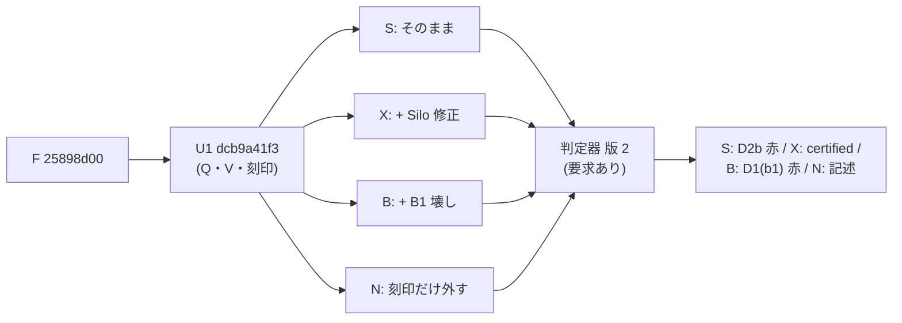

# 正しさ関門の記録 (CCBench の trace 拡張) と判定器 — 手順列・値の刻印の照合を正式化した ([T-2884]、gen-opt md_14、2026-09-30)

authority: none
default_effect: no-state-change

- 依頼: `/work/1/SFC/tanab/tmp/gen-opt-2026-09-29/md_14.txt` (共通指示 `common-4.txt`。いずれも repo の外、逐語の写しは job dir)。対象 item: [T-2884]。
- wave: `dev-wave-t2884-gate-verifier` (branch `worktree-dev-wave-t2884-gate-verifier`)。着手時 local main `4f412c67b` (開始 gate rc=0、`verbatim/startup-gate.log`)。
- 設計の正本: `output/insights/2026-09-29/gen-opt-correctness-gate/README.md` (§3.2〜§3.5・§5.4・§7、本 wave で末尾に訂正節を追記)。U0 (使い捨ての照合): `output/insights/2026-09-29/gen-opt-gate-liveness/README.md`。
- 事前登録 (計算の前に commit): `prereg.md` (commit `963a1770d`、2026-09-30 12:37 JST)。
- job dir (使い捨ての script・生 log・Codex の receipt・bundle・trace archive): `/work/1/SFC/tanab/tmp/gen-opt-2026-09-29/md_14-gate-verifier/` (repo の外)。

---

## 0. 結論

| 項目 | 結果 |
|---|---|
| CCBench の記録 (U1) | 新 local branch `izanagi-gate-witness-trace` = **`dcb9a41f3e538744298b0e5c42dc37349bac114e`** (親 F `25898d00`、3 file・追加 103 行、すべて `#if TRACE` の内側と、TRACE=0 の行番号を戻す `#line` 7 本)。push なし・gitlink は不変 |
| 判定器 (U2) | `orchestrator/verifier/` に gate file (`gate_<thid>.log`) の読み込みと D1・D2a・D2b・D5 の照合を追加し、**意味の版を 2 に上げた** (`MEANING_VERSION = 2`)。gate file が無く要求もしない判定は従前と同一 (既存 test 189 件は無変更で緑) |
| 生死確認 (計算ノード、修正後の判定器、live-2) | **4 条件すべて事前登録どおり。** 修正なしの Silo は D2b で赤 (indeterminate)、Silo 修正を当てると D1・D2 とも 0 件で **serializable・certified**、壊し B1 は D1(b1) で赤 (違反取引数 = B1 の commit した発火数、2 workload とも完全一致) |
| 生死確認 1 回目 (live-1) | 修正ありの条件 X だけ不一致: D1・D2 は 0 件なのに、判定器の D5 (emitter の証拠面) の include 検査が実物の `#include "../../include/ycsb.hh"` を落として certified にならなかった。判定器を直して取り直した (§4.3)。1 回目の記録も当時の事実として残す |
| 判定器への変異 | 17 変異 (M1〜M15、M4 は 3 分割) がすべて KILLED、等価変異 1 本は SURVIVED。事前登録 (probe で観測した赤 node の完全集合) と一致 |
| 上流 CI 相当 | clang-format 14 で 213 file rc=0 (login)。image :ci (GCC 13.3.0) の Release 全体 build rc=0 (configure 2 秒・build 21 秒)。TRACE=0 の `ycsb_*.exe` 7 本すべて trace 記号なし |
| D297 (TRACE=0 の前処理同一性) | **GCC 11 で pass** (選定 configure 65・consumer 1,820 entry・比較 278 件すべて一致)。GCC 12 は job の walltime で打ち切られ未取得で、計算の上限 (2 node 時間) に届いたため取り直さず、gitlink 前進 wave へ回した (§6.3・§7) |

図の読み方: 左の F に本 wave の記録 (U1) を 1 commit で足し、それに patch を当てた 4 つの trace build を計算ノードで走らせ、本 wave の判定器 (意味の版 2、gate の要求あり) で判定した。右端が live-2 の結果。

---

## 1. 記録の形 (U1、設計資料からの変更を含む)

設計資料 §3.2 の「`A` 行」は使わない (判定器が abort 要因の集計に使用中)。U0 と同じく判定器の trace parser が読まない別 file に書く。設計資料の末尾に訂正節を追記した (本文は当時のまま)。

- file: trace dir 直下の `gate_<thid>.log` (thid は十進)。Silo の YCSB 経路で commit した thread だけが開く。
- `Q <txid|-> <thid> <n> <op>:<key>:<観測刻印|->:<書いた刻印|->` × n。op は `R`・`W`・`M` (RMW)、key は 16 桁小文字 hex。commit に成功した試行の手順だけを、commit の直後に 1 行。txid は Silo の writePhase (YCSB/v2 の枝) が C 行に使った txid を pending で受け取ったもの。受け取っていなければ `-` (判定器は D1(c) の違反にする)。
- `V <txid> <key> <刻印>`: Silo の writePhase で UPDATE を据える `memcpy` の直前に、据える値の先頭 8 byte を出す。
- **刻印は `YCSB::id_` の 64 bit** (値の先頭 8 byte、`val_` は変えない)。書き手 = `((thid+1) << 48) | thread 内の通し番号`、初期 load は既存の `id_ = key id` なので、読んだ版が genesis なら期待刻印は key の整数値。`thid+1 <= 0xFFFF` と通し番号 `< 2^48` を TRACE build の中で検査し、破れたら止める。全 protocol の YCSB 経路で load 後に `id_` を読む箇所は無い (実装子の rg、`verbatim/author-u1.md`)。
- **手順列を Silo に限る仕組み:** `include/ycsb.hh` の `run` は 7 protocol が共有するので、Silo の writePhase が txid を渡した thread だけで Q を出す (thread_local の有効化)。pending は Q の出力で消費し、retry の直後に捨てる。他 protocol の trace build には gate file ができない。
- **TRACE=0 の同一性:** `include/ycsb.hh` の各追加区間の直後に元の次行を指す `#line` を置いた (16・108・109・127・132・142・166)。`cc/silo/transaction.cc` の V は既存の `#line 658` より前 (既存の `#if TRACE` 区間の中) に置き、txid の受け渡しは既存の区間の中の 1 行なので、新しい `#line` は要らない。段 5 の最初の版は冒頭を `#line 17` と誤り (F の 17 行目は gflags の include で、空行は 16 行目)、段 6 のレビューが指摘して直した。
- commit は親 (`evidence/mk-u1.log`: 置いた 3 file の blob = 実装子の最終 file の blob、staged 3 file・mode 不変、親 = F)。message は上流の流儀の英語、trailer は Codex author・Codex reviewer・Claude manager。

## 2. 判定器 (U2)

- **gate の有効化:** trace dir に `gate_` で始まる file が 1 つでも在るか、呼び出しが `require_gate_witness=True` のとき。有効でなければ従前と 1 bit も変わらない (結果の投影にも gate 節を足さない)。
- **到達可能性 (崩れたら D1/D2 を合格に数えず indeterminate):** file 名 (`gate_<十進>.log` 以外があれば失敗)、gate と trace の thread 集合の一致、書式、刻印の形、V と UPDATE の W 行の (txid, key) 1 対 1、compact 経路で parse できたこと (legacy 経路に落ちたら失敗)、要求時に gate file が 1 つも無いこと。
- **D1** (取引ごと): (a) Q の書きの key 集合 = W 行の key 集合、(b1) key への最初の操作が読みの key 集合 ⊆ R 行の key 集合、(b2) R 行の key 集合 ⊆ Q の読みの key 集合、(c) Q と C…E 枠の thread 内 1 対 1・順序・txid・thid (枠だけ・Q だけ・txid `-`・食い違いはどれも違反)。
- **D2a:** 自分の書きより前の読みは、何度目でも、R 行が指す版の V 刻印 (genesis なら key の整数値) と一致すること。
- **D2b:** (i) 自分が先に書いた key の読みの観測刻印 = その時点の自分の最後の書き、(ii) key ごとの最後の書き = その key の V。**全 key で照合し、stock に合わせて緩めない。**
- **D5 (要求時だけ):** `include/ycsb.hh` の Q の emitter (`izanagi_trace::emit_steps(`)、`cc/silo/transaction.cc` の V の emitter (`emit_stored(`) と txid の受け渡し (`set_gate_txid(`) が literal な `#if TRACE` の中に在り、`cc/silo/ycsb_silo.cc` の引用形 include が解決して `include/ycsb.hh` と同じ file になること。既存の証拠面 (X/P) と同じく、source の文面に在ることしか言わない (発火は D1(c) が実行ごとに見る)。
- **結果:** `Integrity` に計数 (到達不能・D1a・D1b1・D1b2・D1c・D2a・D2b_i・D2b_ii) と D5 の状態、発生条件 4 つ (自分の書きの後の読みを含む取引・書きのある取引・同じ key を 2 回以上書いた取引・D2a で照合した外部読み) を足し、違反・到達不能・要求時の D5 不成立で `clean()` が偽になる。notes に位置付きの sample (check・thid・txid・key・期待・観測、上限 12 件)。`result_to_dict` は gate 有効時だけ `gate_witness` 節 (意味の版・要求の有無・計数・発生条件・D5) を足す。巡回があれば non-serializable が優先するのは不変。
- **API:** `verify_trace_dir(..., require_gate_witness=False)` (keyword-only)、CLI `--require-gate-witness`。要求時に gate の全欠落・一部欠落・読取不能なら certified でなく CLI の rc は 3。
- **変えていないもの:** `verify_trace_dir_with_capability`・`pipeline.py`・`source_digest.py`・`campaign_lock.py`・`__init__.py`・`dsg.py`・`commit_receipt.py`。新 module は作らず、D442 の閉包 (判定器 4 file) の path 集合は不変。production 追加は 5 file で 357 行、test は新 file `orchestrator/tests/test_verifier_gate_witness.py` (pytest 専用として `orchestrator/tests/README.md` の allowlist に登録)。
- **意味の版:** 本 wave の前の判定器を 1、本 wave の判定器を 2 とする。再検証の発火条件は `prereg.md` §2 (結果を見る前に commit)。要旨: 版 1 の判定は再判定も昇格もしない。版 2 で読み直すのは gate file を持つ trace だけで、repo 内の campaign (pin C) の trace は gate file を持たないので対象外。gen-opt の候補の certified は版 2 以上・要求あり・D5 成立・D1/D2a/D2b 全 key 違反 0 を要する。

## 3. 段の経過と棄却・限定した所見

- 段 2 plan・段 3 相談 2 本 (A: 正しさ境界・実効性、B: 過剰・削除)・段 4 裁定 (`verbatim/s4-ruling.md`)。採った主な所見: D5 を `clean()` に接続、不正な gate file 名と legacy 経路の fail-closed、thid 16 bit の上限、B2 fixture の単一理由化、刻印だけを外す対照 (素の F との比較を置き換え)、capability 経路と source snapshot の拡張は後送 (U5)、詳細投影の重複を作らない、発生条件は 4 つに絞る。棄却: 要求 keyword を公開 API で既定値なしにする案 (test の呼び出し約 118 箇所を変える割に、gen-opt の呼び出し元が未実在で効果を確かめられない。U5 の義務として §8 に記す)。
- 段 5: U2 の実装子は pytest を回せない (guard が直呼びを拒否、sandbox から scheduler に届かない) と気づいた時点で途中終了を申告したが、親の焦点走で 189 件緑だった。以後の測定はすべて親が行った。
- 段 6 review 2 本 (`verbatim/review-a.md`・`review-b.md`、裁定 `verbatim/s6-ruling-1.md`): real = D5 の関数名の食い違い、D2a が 2 度目以降の外部読みを見ない、ycsb.hh 冒頭の `#line 17`、起動器が判定器 JSON の key 名と合わない、発生条件の採否を全条件に掛けていた、M9・M10 の kill が KeyError 頼み、Q の thid の食い違いの分類。**refuted** = review B の「D1(b2) の包含の向きが逆」(コードは `reads ⊆ q_read` を検査している。焦点再レビューも refuted を支持)。
- 焦点再レビュー (`verbatim/focus-1.md`): 対応表で主要所見 closed、NO-GO の理由は実測の未了と M4 の単一理由性 (D1(c) の計数点が 3 か所)。M4 は M4a (食い違い)・M4b (Q 欠落)・M4c (余分な Q) に割り、test に明示 id と余分な Q の case を足した (事前登録の erratum、§5)。新規所見 F1〜F3 は production の受理集合を変えないので nit として閉じた (F2 = B 条件の評価が他の違反の併発を見ない点は、本資料 §4 で B の全計数を並べて補う)。
- 親の焦点走で `test_plain_runner_coverage.py` が赤 (新 test file が自走 harness も allowlist も持たない偽緑ガード) → allowlist に登録して解消。
- 生死確認 live-1 で D5 の欠陥 (§4.3) → 判定器を直して live-2。

## 4. 生死確認 (計算ノード)

共通: `ycsb_tuple_num=200 ycsb_zipf_skew=0.9 ycsb_rratio=50 ycsb_max_ope=5 thread_num=4 extime=1 clocks_per_us=1800`、`KEY_SORT` 既定 0。W-rmw は `ycsb_rmw=true`、W-blind は false。1 条件 1 build、TRACE=1 の `ycsb_silo.exe` (GCC 11)。判定器は wave 木の production CLI (`--require-gate-witness --protocol silo --ccbench-root <patch を当てた checkout> --expected-commits <commit 件数>`)。U0 の照合器 (Q の `-` に対応した版) を同じ trace に掛けたのは診断で、同じ trace parser を共有するので独立の証拠とは呼ばない。

### 4.1 live-2 (判定器 90ba89e5b、request 37943.nqsv、bnode141、2026-09-30 14:00〜14:08 JST、Elapse 508 s)

| 条件 | workload | commit | abort | 到達不能 | D1 a/b1/b2/c | D2a | D2b (i) / (ii) | D5 | 判定 | 事前登録 |
|---|---|---:|---:|---:|---|---:|---|---|---|---|
| S (U1 のまま) | W-rmw | 191,315 | 8,433 | 0 | 0/0/0/0 | 0 | 30,842 / 14,819 | pass | indeterminate | match |
| S | W-blind | 218,547 | 10,269 | 0 | 0/0/0/0 | 0 | 1,491 / 16,611 | pass | indeterminate | match |
| X (+ Silo 修正) | W-rmw | 190,302 | 7,991 | 0 | 0/0/0/0 | 0 | 0 / 0 | pass | **serializable・certified** | match |
| X | W-blind | 220,066 | 11,493 | 0 | 0/0/0/0 | 0 | 0 / 0 | pass | **serializable・certified** | match |
| B (+ B1) | W-rmw | 209,869 | 7,166 | 0 | 0/**205,887**/0/0 | 0 | 11,214 / 16,284 | pass | indeterminate | match |
| B | W-blind | 236,501 | 10,691 | 0 | 0/**183,155**/0/0 | 0 | 983 / 18,439 | pass | indeterminate | match |
| N (刻印を外す) | W-rmw | 193,882 | 8,173 | 1 | (数えない) | — | — | pass | indeterminate | descriptive |
| N | W-blind | 217,548 | 10,340 | 1 | (数えない) | — | — | pass | indeterminate | descriptive |

- 発生条件 (X): 自分の書きの後の読みを含む取引 W-rmw 27,539・W-blind 16,847、書きのある取引 184,481・213,261 (いずれも ≥1)。巡回はすべての条件で 0。X の取引数は commit 件数の証人と一致。
- B1 の発火 (commit した取引) は W-rmw 205,887・W-blind 183,155 で、D1(b1) の違反取引数と完全に一致した (判定器は B1 の発火行を読まない)。B の D2b の違反は修正前の Silo の挙動が重なったもので、B の判定には使わない。
- N は刻印を外したので書き手の刻印が初期値の形のまま残り、刻印の形の検査で到達不能になった (判定器が刻印の欠落を合格にしないことの実例でもある)。commit・abort を S と並べると W-rmw 193,882 / 8,173 対 191,315 / 8,433、W-blind 217,548 / 10,340 対 218,547 / 10,269 で、各 1 回の記述値である (差の有意性は言わない)。
- **件数の単位:** 判定器の D2b は違反した読み・key の数、U0 照合器は違反した取引の数を数える。S の W-rmw で判定器 (i) 30,842 / (ii) 14,819 に対し照合器 27,590 / 14,691 (live-1) のように判定器の方が大きいのはこのためで、X ではどちらも 0。
- 要約の全文は `evidence/live-2-summary.txt`、条件ごとの結果 JSON は `evidence/live-2-<条件>-result.json` (sha256 は `evidence/live-2-result-sha256.txt`)。trace と gate file の archive は job dir の `runs/live-2/<条件>/` (repo の外、sha256 は結果 JSON の `trace_archive_sha256`)。

### 4.2 live-1 (判定器 68bdbe41b、request 37910.nqsv、bnode010、13:41〜13:50 JST、Elapse 547 s)

S・B・N は live-2 と同じ読み (S: D1・D2a 0、D2b 赤。B: D1(b1) = B1 committed が W-rmw 208,043・W-blind 179,967 で一致)。**X は事前登録と不一致:** 両 workload で到達不能 0・D1・D2 全項 0・発生条件あり・巡回 0 だったが、`D5 = fail` で certified にならなかった (全条件で D5 が fail)。要約 `evidence/live-1-summary.txt`。

### 4.3 live-1 の不一致の原因と処置

判定器の D5 の include 検査の正規表現 `^\s*#\s*include\s*[<"]ycsb\.hh[>"]` は `#include "ycsb.hh"` しか受けず、実物の `cc/silo/ycsb_silo.cc` 18 行目の `#include "../../include/ycsb.hh"` を不成立とした。test の fixture が実物と違う簡略形 (`#include "ycsb.hh"`) を書いていたため、段 5・6 の test とレビューは見逃した。引用形 include の path を `cc/silo/` から解決し `<root>/include/ycsb.hh` と同じ file のときだけ成立にする形に直し (照合は緩めない)、fixture を実物の形にして、別 file に解決する include の負例を足した (commit `90ba89e5b`、裁定 `verbatim/s6-ruling-2.md`)。live-1 の X の不一致は、当時の判定器での事実として記録し、一致へ書き換えない。

## 5. 判定器への変異

`tools/mutation_harness.py` を独立 clone (commit `90ba89e5b`) で計算ノード 1 job に束ね、`orchestrator/tests/test_verifier_gate_witness.py` を走らせた。probe (全件 SURVIVED 期待、request 37945.nqsv、Elapse 479 s) で各変異の赤 node を観測し、その完全集合を KILLED 期待に登録した本走 (request 37969.nqsv、Elapse 278 s) で 18 件すべてが期待どおり (`evidence/mutation-final-results.json`、spec sha256 `e9701f86…`)。

| # | 外したもの (1 か所) | 本走 | 赤になった主な test |
|---|---|---|---|
| M0 | コメントだけの等価変異 | SURVIVED (期待どおり) | — |
| M1 | D1(a) の比較 | KILLED | `test_gate_b2_unregistered_write_m1` |
| M2 | D1(b1) の比較 | KILLED | `test_gate_b1_missing_initial_read_m2_m15` |
| M3 | D1(b2) の比較 | KILLED | `test_gate_trace_read_without_q_key_m3` |
| M4a | D1(c) の txid・thid の食い違い | KILLED | `test_gate_q_frame_m4[dash-txid]`・`[wrong-txid]`・`test_gate_q_thread_mismatch_is_d1c` |
| M4b | D1(c) の Q 欠落 | KILLED | `test_gate_q_frame_m4[missing-q]` |
| M4c | D1(c) の余分な Q | KILLED | `test_gate_q_frame_m4[extra-q]` |
| M5 | D2a (genesis 以外) | KILLED | B4 型・B5 型の 2 件 |
| M6 | D2a (genesis) | KILLED | genesis の刻印違い・2 度目の読みの刻印違い |
| M7 | D2b(i) | KILLED | `test_gate_b6_stale_own_read_m7` |
| M8 | D2b(ii) | KILLED | `test_gate_last_write_wins_m8` |
| M9 | V と UPDATE の W の 1 対 1 | KILLED | `test_gate_v_missing_m9` |
| M10 | thread 集合の一致 | KILLED | 一部 thread の欠落 (要求時の CLI rc を含む 3 件) |
| M11 | 要求時の gate 全欠落を有効化しない | KILLED | `test_gate_required_absent_m11_cli_rc` |
| M12 | 要求時の D5 を `clean()` から外す | KILLED | B7 型・include の解決先違い |
| M13 | 不正な gate file 名を無視 | KILLED | `test_gate_invalid_filename_m13` |
| M14 | gate 有効時の legacy 経路を素通し | KILLED | `test_gate_legacy_parse_m14` |
| M15 | 要求なしで gate を読まない | KILLED | presence 起動に頼る 22 件 |

- **事前登録からの変更 (erratum):** prereg.md §4 の M4 (D1(c)) は、実装で計数点が 3 か所 (食い違い・Q 欠落・余分な Q) に分かれたので、1 か所ずつ外す M4a・M4b・M4c に割った。期待はいずれも KILLED のまま。M0 (等価) を足した。
- 各変異は 1 か所の式を `False` などへ置き換える形で、他の検査が同じ入力を先に拒否しない配置にした (焦点再レビューの表と probe の観測で確かめた)。M10 は要求時の CLI の test 2 件も赤にするが、どれも thread 集合の検査を通る入力である。

## 6. CCBench 側の検査

### 6.1 format (login、親の実走)

U1 tip を bundle から clone して、上流 CI と同じ対象 (`git ls-files -- cc include common` の `.cc/.hh/.cpp`、213 file) に clang-format 14.0.0 の `--dry-run --Werror` を掛けて rc=0 (`evidence/fmt-u1.log`、2026-09-30 13:41 JST)。

### 6.2 CI 相当の build と性能 build の trace 記号検査 (request 37901.nqsv、bnode053)

上流 CI の image :ci (sif sha256 `cb8cd1c3…`、GCC 13.3.0・cmake 3.28.3) で CI と同じ configure (`-DCMAKE_BUILD_TYPE=Release -DENABLE_SANITIZER=OFF`) と全 target の build: configure rc=0 (2 秒)・build rc=0 (21 秒)。警告 13 件は第三者 masstree (`json.cc`・`kvthread.cc`・`log.cc`) と configure 由来で、CCBench 本体の警告は無い。build した TRACE=0 の `ycsb_*.exe` 7 本 (cicada・ermia・mocc・oze・si・silo・tictoc) に `buildcache._assert_no_trace_symbols` を掛けて 7 本とも PASS (`evidence/ci-report.json`・`evidence/ci-ycsb_*.exe.symbols.txt`)。

### 6.3 D297 (TRACE=0 の前処理出力の同一性、F → U1 tip)

検査器は wave 木の `tools/check_trace0_preprocess_identity.py` (local main `4f412c67b` の版)、`--expect-paths cc/silo/transaction.cc include/trace.hh include/ycsb.hh` と header の 4 引数。CI build と同じ job (request 37901.nqsv、bnode053) で GCC 11 → GCC 12 の順に直列に回した。

| compiler | 結果 | 中身 |
|---|---|---|
| GCC 11.4.0 | **rc=0、`result = pass`** (13:37 ごろ〜14:32 JST、約 55 分) | 選定 configure 65 (stock 1・mocc 8・silo 8・tictoc 24・cicada 24)、変更 header の consumer 1,820 entry を予定 = 実行で全数、集約後の比較 278 件 (19 file) がすべて完全展開・include 活性とも一致。`.cc` の `cc/silo/transaction.cc` も match。gitlink `third_party/shirakami` (fb14e659) は旧新一致 (`evidence/d297-gcc11.report.json`) |
| GCC 12 | **結果なし** | 14:32 に始まり、job の walltime (1 時間 30 分、Elapse 5,409 秒) で 15:06 に打ち切られた (`evidence/cijudge-1.dispatch.log`、dispatch rc=16 は walltime 超過の infra 分類)。取り直していない (§7) |

- 保証の名前は D297 のとおり「選定した macro context における TRACE=0 正規化 preprocess 出力の同一性、および include 活性の同一性」で、翻訳単位の同一性は名乗らない。対象の実行 file は silo・mocc・tictoc・cicada の YCSB と TPC-C 系 (ycsb.hh を include する consumer)。si・ermia・oze の YCSB は検査器の選定外で、性能 build の記号検査 (§6.2) だけが見ている。
- **先例より重い:** [T-2854] の F (trace.hh だけが変わる header) は GCC ごとに約 980 秒で、GCC 11・12 を並行 job にしていた。本件は全 protocol が include する ycsb.hh が変わるので consumer が多く、GCC 11 だけで約 3,300 秒かかった。job script (段 5 の実装子作) が 2 compiler を直列にしていたので GCC 12 が walltime に収まらなかった。

## 7. 計算ノードの所要

| job | request | Elapse |
|---|---|---:|
| 生死確認 live-1 (4 条件) | 37910.nqsv | 547 s |
| 生死確認 live-2 (4 条件) | 37943.nqsv | 508 s |
| 変異 probe | 37945.nqsv | 479 s |
| 変異 本走 | 37969.nqsv | 278 s |
| CI build + 記号検査 + D297 (GCC 11 完了、GCC 12 は walltime で打ち切り) | 37901.nqsv | 5,409 s |
| 合計 | | **7,221 s ≈ 2.01 node 時間** |

- 投入時の見積り (段 4 裁定 §5: 1.05〜1.65 node 時間) を、D297 の重さ (上記) で超えた。依頼の上限 (1 タスクの job 合計が 2 node 時間以上になる見込みなら投入せず見積りを示す) の線にちょうど届いたので、**GCC 12 の D297 (見積り 約 3,300 秒 ≈ 0.9 node 時間、合計 約 2.9 node 時間) は投入していない。** gitlink 前進の wave が U1 と Silo 修正を統合した tip で D297 を GCC 11・12 とも取り直す必要が元々あるので、そこへ回す (§11)。
- 受入の全走 (land の前) は land 用で、この合計に数えない。

## 8. scope 外で要る仕事 (裁定パッケージ候補)

- **U5 (gen-opt driver の接続):** gen-opt の軸は `require_gate_witness=True` を必ず渡し、capability 経路 (`verify_trace_dir_with_capability`・`pipeline.py`) と D5 を build の source snapshot に束縛する。今の判定器は、要求しない呼び出しでは gate file が在るときだけ照合する (presence 起動) ので、**gate file を出さない build を要求なしで判定すると従前どおり B1 型の迂回を見逃す**。関数方策の軸は生成コードが `include/ycsb.hh`・`include/trace.hh` に届かない (設計 §3.1 F3) ので影響しないが、gen-opt の軸は U5 の接続まで certified を名乗れない。
- **gitlink の前進:** U1 と Silo 修正 (md_12 の branch `izanagi-silo-intra-txn-fix`) を評価対象の pin に入れ、その tip で D297・生死確認を取り直す。**U1 だけを先に pin へ入れると、修正前の Silo の trace は gate file を持つので presence 起動の D2b で全部 indeterminate になる** (規律 2 どおりの帰結で、照合は緩めない)。統合の順は gitlink 前進の wave が決める。U1 は `cc/silo/transaction.cc` の writePhase、Silo 修正は同 file の read・update を変える (hunk は重ならない見込みだが、統合時に確かめる)。
- **D442 の帰結:** 判定器 4 file (`core.py`・`model.py`・`parse.py` を本 wave で変更) の bytes が変わったので、変更前に記録された E1 の lock は、本 wave の land 後の main から読むと E1-stale になる。repo 内の lock は 32 本すべて v1 で v2 は 0 本 (段 1 の実測、`evidence/s1-pin-closure.log` の前段)。生成器対照 (md_11) の本走は submit checkout で走るので影響しないが、land 後の main から再開すると CERTIFIED_ACCEPTANCE で拒否されうる (land 時に md_11 へ通知する)。
- **push:** CCBench の branch `izanagi-gate-witness-trace` の push と上流への還元は人間の手番 (D16)。

## 9. 限界

- **生死確認は各条件 1 回・小規模** (200 record・4 thread・1 秒・2 workload・`KEY_SORT=0`・Silo だけ)。稀な割り込みでだけ起きる食い違いは捕まらない。TPC-C の trace v3 は対象外 (設計 §3.2)。
- **B2〜B7 の壊しは実走していない** ([T-2889] の範囲)。判定器の側は手製の小さい履歴 (fixture) で B1〜B7・2 度書き・genesis・N1・N3・N4 相当を確かめ、変異で各比較が効くことを確かめた。N2 (手書き方策) は判定器の fixture の水準では N1 と同じ履歴になるので fixture を作らず、実走も [T-2889] に回した。
- **D5 は source の文面の検査**で、前処理の評価・到達可能性・発火を証明しない (既存の証拠面と同じ限界)。発火は D1(c) が実行ごとに見る。D5 の include 検査は引用形だけを扱う。
- **判定器単独の所要と peak RSS は測っていない。** 1 条件 (build・2 workload の走行・U0 照合器・判定器) が 117〜130 秒 (live-2 の結果 JSON の開始・終了時刻) で、判定器は 20 万取引規模を job の中で終えた、という上限だけ言える。
- **legacy 経路 (整数が compact の列に収まらない trace) では照合しない** (gate が有効なら到達不能 = indeterminate)。
- **刻印を外した対照 (N) は刻印の形が崩れて判定器が到達不能にする**ので、刻印の有無の効果は commit・abort の 1 回ずつの記述しか取れない。
- **関門を変えられる主体の限界 (D387)。** 判定器・fixture・変異はこの wave の AI が作った。意図的な弱体化への完全な防壁ではない。
- 判定器の gate 照合は、同じ trace parser (`_parse_trace_dir_compact`) の出力を使う。parser の誤りは既存の検査と共有する。

## 10. 何を確かめ、何を確かめていないか

**確かめたこと (実走・実物):**

- §4 の表の全数値 (live-1・live-2 の結果 JSON)。B1 の発火数と D1(b1) の一致 (2 回の job × 2 workload)。修正ありの Silo が版 2 の判定器で certified になったこと (live-2)。修正なしの Silo が D2b で赤、D1・D2a は 0 であること。
- 変異 18 件の本走が事前登録どおり (§5)。
- 親の焦点走: 判定器の新旧 test 4 file で 200 passed (最終の子木 `9aba9badc`、wave 木 `90ba89e5b` と同内容、`evidence/focus-u2-4.log`)。consumer・閉包・inventory 系 20 file で 2,691 passed・1 failed (新 test file の allowlist 漏れ。登録後に `test_plain_runner_coverage.py` を含む焦点走で緑、`evidence/focus-u2-3.log`)。
- format 213 file rc=0、CI 相当の build rc=0、性能 build 7 本の trace 記号なし。GCC 11 の D297 pass。
- U1 commit の中身 (`evidence/mk-u1.log`: 3 file・103 行・親 F)。

**確かめていないこと:**

- GCC 12 での D297 (§6.3)。
- 受入の全走 (land の直前に行う)。
- U1 と Silo 修正を重ねた tip での D297・build (gitlink 前進の wave の仕事)。
- 構成を変えたとき (record 数・thread 数・`KEY_SORT=1`・TPC-C・Silo 以外) の照合。
- gen-opt driver からの呼び出し (U5)。

## 11. 次の一手

- **[T-2889] (変異 7 本 + 負例 4 本の本走) の前提:** 本 wave で記録 (U1) と判定器 (版 2) が揃い、Silo 修正後の stock で D1・D2 が 0 件になることを確かめた。残る前提は B2〜B7 の壊し patch (U1 tip 用、Codex author) と、N2 の手書き方策の build 経路。**計算の見積り:** 本 wave の起動器 (1 条件 1 build・2 workload) の実測単価は 1 条件 117〜130 秒 (live-2) で、11 条件 ≈ 0.36〜0.40 node 時間、再走 2 条件を見込んで ≈ 0.42〜0.47 node 時間。設計資料 §7 の試算 (1 評価 0.21〜0.22 node 時間、方策の pipeline 経由) で数えると 2.3〜2.9 node 時間になる。どちらの経路で走らせるかは [T-2889] の wave が決め、**pipeline 経由なら 2 node 時間以上なのでユーザー確認が要る**。
- gitlink の前進 wave で U1 と Silo 修正を統合し、統合した tip で D297 (**GCC 11・12 を別 job で並行に**、1 本 約 1 時間を見込む) と生死確認 (本 wave の起動器と判定器) を取り直す。本 wave の GCC 12 の D297 は未取得。
- U5 (gen-opt driver の接続) は段 A の軸 (md_13) の後。
