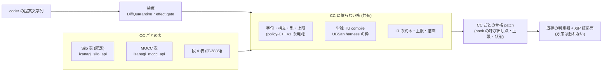

# MOCC で LLM が関数単位の方策を書く口 (MOCC 版の関数方策の軸) の設計 — Silo 軸の分解・MOCC の hook 候補・受理文法と共通化・正しさ関門・実装分割・見積り (gen-opt md_10、2026-09-30、計算なし)

- 依頼: `/work/1/SFC/tanab/tmp/gen-opt-2026-09-29/md_10.txt` と同じ directory の `common-3.txt` (repo の外。第 3 陣 md_9・md_10 の 2 本目)。
- 種別: 設計だけ (docs-only)。実装・計算ノードの実行・プログラムの実行による測定は 1 つもしていない (§9)。
- 読んだ時点の main: `4f412c67bcd7ff9cca1e78ce9bd1dd7a15d46037`。submodule `external/ccbench` の HEAD (gitlink): `68106660686232781bca3be792a750d3e19d7a8a` (以下「pin C」)。本文の MOCC の行番号は pin C の `cc/mocc/transaction.cc` のもの。
- 入力にした一次資料 (いずれも main に着地済み): 正しさ関門の設計 `output/insights/2026-09-29/gen-opt-correctness-gate/README.md` (以下「関門」)、段 A の候補 `output/insights/2026-09-29/gen-opt-stage-a-candidate/README.md` (以下「段 A 設計」)、母集団型の探索の設計 `output/insights/2026-09-29/gen-opt-evolution-design/README.md` (以下「探索設計」)、MOCC の validation の修理 `output/insights/2026-09-29/mocc-validation-fix/README.md` (以下「G2 修理」)。
- 本文の「確かめた」は、コードと一次資料を読んで確かめた事実を指す。「試算」は仮定を置いた計算である。

---

## 0. 結論

| 問い | 結論 |
|---|---|
| Silo 軸のどこが CC に依らないか (§2) | policy-C++ v1 の**規則** (字句・構文・型・上限・診断の形)、単独 TU compile の枠組み、IR の式木と上限、driver の検査の順序、検疫 (`DiffQuarantine`・effect gate)、coder 入力の遮断は CC に依らない。Silo 固有なのは、文法の**表** (型・列挙・field・hook 署名) と名前空間 `izanagi_silo_api` の直書き 5 か所、compile の UBSan harness の定数、骨格 patch、coverage・偵察・probe・負例 patch の一式 |
| MOCC で方策が決めてよいこと (§3・§4.1) | v1 は **待ち方だけ**で、方策は abort を 1 つも新しく生まない。hook は 3 つ: abort 後の待ち (`TxExecutor::abort` 1109 行の共有 backoff の置き換え)、cold read で他者の writer lock を待つ所 (321〜336 行の spin) の**待ち時間だけ** (諦める選択肢は持たせない)、commit の通知。Silo の施錠衝突の hook (retry / abort を返す) と違い、MOCC の v1 の待ちの hook は待ち µs だけを返す。abort を方策に選ばせると、どの時点の読み集合から次試行の RLL (悲観施錠の対象) が作られるかを方策が決めることになるため (§4.1、段 6 レビューの must-fix 1) |
| 渡す観測 (§4.1) | Silo と同じ 3 つ: abort 要因 (骨格が 11 行で記録する列挙値)、同じ tuple での待ちの試行番号、骨格の乱数。温度・set の大きさ・共有の backoff 値・時刻・key・pointer・trace・counter は渡さない。Silo と観測を揃えるのは「同じ探索を 2 つの CC で回す」比較の条件を揃えるため |
| 施錠方式 (温度述語・RLL・`lock()`・待ちの途中の abort) (§4.5) | v1 に入れない。温度述語で悲観 / 楽観を切り替えると、読み側の施錠は証拠面 X / P に現れず、既知の未修理の窓 (cold read の torn read、hot read の `absent` 非検査) への曝され方を方策が変える。関門の区分は「迷ったら重い区分」で**意味 (証拠面) の拡張が要る**側に置き、広げる条件を 6 つ書いた |
| 受理文法 (§4.2) | 規則は流用できる。差し替える表は名前空間・`AbortReason` の列挙 (10 値)・待ちの hook の署名 (`LockResponse` でなく `uint32_t` を返す) で、`PolicyAction`・`LockResponse` は MOCC の表に無い。ただし文法は名前空間を**コードに直書き**し、`LockResponse` を特別扱いしているので「表の差し替え」だけでは済まず、表を引数に取る形へ直す必要がある (§4.2) |
| 共通化 (§4.3) | **推奨: 検査器を「CC に依らない核 + CC ごとの表」に分け、Silo の表を既定にする。** 同じ部品を段 A の軸 ([T-2886]) も要るので、使い手が 2 つある (DW-G03)。Silo の受理集合を変えないことは、分ける前の文法の凍結写しと分けた後の文法を同じ入力列 (契約 fixture 85 件・手書き方策・IR 16 点・字句の変異で作る入力) に掛け、文法の判定の全 field と、一時 path を置き換えた後の compile の判定が全件一致することで見る (比較の定義は §4.3)。複製案は Silo 側の危険が無い代わりに 1,248 行の二重管理と、2 つの CC で「同じ言語」を保つ保証を失う |
| 正しさ関門 (§4.4) | v1 は Q1〜Q8 のどれも変えないので「**そのまま足りる**」。X / P の証拠面が方策の変更の後も成り立つ条件を 6 つ (C1〜C6) にした。さらに、**既存の MOCC の変異面 gate は温度述語の軸 1 本に固定されている**ので、新しい軸を足すと固定の test が赤になり、そのまま一般化すると新しい軸は自分の証拠なしに gate を通る (恒真)。軸ごとに自分の証拠へ束縛する形への一般化を実装分割に入れた |
| 実装の分割 (§5) | 5 単位 (核と表・MOCC の API と契約・骨格 patch と gate の一般化・骨格の実証 (計算あり)・driver と role)。いずれも Codex author。新しい軸なので**段階 A の人間承認と段階 B の 3 レンズ敵対レビューが先** (`docs/axis-onboarding.md` §1、D2134 項 9・D2159 項 9) |
| 計算 (§6) | 生死確認 1 本 (手書き方策 3 本 × write-heavy の pair) は試算 0.70〜0.75 node 時間 (1 評価 0.206〜0.220 を当てた)。段階 C の骨格の実証に Silo の実績の合計 (約 1.12) をそのまま当てると合計 約 1.8〜1.9 で、負例の増分を見積もっていないので **2 node 時間を超えうる。投入前にユーザー確認**。MOCC の pair の単価は未実測 |
| MOCC の read-heavy の G2 (§7) | write-heavy の生死確認の前提にはしない (pin C で write-heavy・balanced の候補 50 slot は G2 0、D2261)。read-heavy の評価には、修理 X を含む pin への前進 ([T-2919]) を前提にする (pin C の read-heavy は候補 25 slot 中 6 件が G2 で reject、D2261)。X の後も MOCC の G2 全般が消えたとは言えず、方策の候補が G2 を出せば規律 2 のまま reject する |



---

## 1. 範囲と、この資料が言うこと・言わないこと

- 言うこと: Silo の関数方策の軸の部品の分類 (§2)、MOCC の実物から取った hook 候補と観測・決定の候補 (§3)、v1 の API・受理文法・共通化・正しさ関門の設計 (§4)、実装の分割と計算の見積り (§5・§6)、MOCC の G2 の件との関係 (§7)。
- 言わないこと: 方策が MOCC で性能を上げるかどうか (測っていない)。MOCC の G2 の原因 (G2 修理の wave の結論を、その資料が書いた範囲で使うだけ)。施錠方式を開いた版の具体の API (§4.5 は広げる条件だけ)。
- 実装 (API header・文法 module・axis・patch)・submodule の変更・計算は scope 外。`orchestrator/campaign/silo_policy_*.py`・`silo_function_policy_api.hh`・`axis_silo_function_policy.py`・方策 driver は読んだだけで、変えていない。

---

## 2. Silo の関数方策の軸の分解 (手順 1)

### 2.1 流れ

| 段 | 実物 (main `4f412c67b`) | 何をするか |
|---|---|---|
| 提案 | coder role `coder-v4-autonomous-policy` (C++ 本文) / `-policy-ir` (IR の JSON)。driver の `load_proposal_file` (`p3_s4_loop_policy.py` 128〜161 行) が読み、`axis` が `MARKER_ID` と一致するかを見る | coder は tool を持たず、提案文字列だけを返す |
| IR の描画 | `silo_policy_ir.py` の `parse_policy_ir` (136 行〜) → `render_policy` (296〜373 行) | IR を policy-C++ v1 の部分集合の本文にする |
| 検査 | `p3_s4_loop_policy.py` の `policy_gate` (233〜262 行): `p3_s4_loop.quarantine` (738 行〜、`render_hole` → `DiffQuarantine(...).validate()` → effect gate) → `check_policy_body` の文法 (`silo_policy_grammar.validate_policy`、579 行〜) → 単独 TU compile (`silo_policy_compile.compile_policy`、101〜111 行) → auditor の deny-only veto (`max_violation_type=26`) → 書き込み → digest の再照合 | 共有の `quarantine()` は変えず、driver 側で文法と compile を足す (D2256 項 2) |
| build と評価 | `run_one_iteration` (同 460〜505 行) が `patches/silo-function-policy-variant.patch` を当て、genome に `SILO_POLICY_VARIANT=1` を足して `run_campaign` へ | 判定器・X/P・commit 件数の証人は既存のまま |
| 診断 (loop の外) | `silo_policy_coverage.py` (焦点試験・既存 3 負例の軸 ON での積み直し・機構変異 9 種)、`silo_policy_recon.py` (固定 16 点の偵察) | 段階 C・D の証拠 |

### 2.2 API と骨格

- API header `orchestrator/campaign/silo_function_policy_api.hh` (14 行): `PolicyAction {retry, abort}`、`AbortReason` の 8 値 (`unset, lock_conflict, update_absent, read_tid, read_locked, node_validation, insert_node, scan_node`)、`AbortContext {reason, rand}`、`LockContext {attempt, rand}`、`LockResponse {action, wait_us}`、空の `CommitContext`、hook 3 つ (`policy_after_abort` → 待ち µs、`policy_on_lock_conflict` → `LockResponse`、`policy_on_commit`)。
- 骨格 patch `patches/silo-function-policy-variant.patch` (258 行): hole は `namespace izanagi_silo_policy` の本体だけ。hole の後の `izanagi_silo_skel` が `thread_local` の状態・要因・xorshift 乱数・`wait_us`・`noipa` wrapper を持つ。呼び出し点は `TxExecutor::abort` (`min(ret, 1000u)` 待つ。stock の `Backoff::backoff` は `#else` 側)、`lockWriteSet` の CAS 失敗 (`min(wait_us, 50u)` 待って再読込、32 回で abort、abort 時は取った分の lock を解く)、`commit` の `writePhase` の後。要因の記録は 7 か所。軸 macro `SILO_POLICY_VARIANT` が 0 なら領域も呼び出し点も消える。ON で `BACK_OFF` が 1 でない、または no-wait 系 flag が固定値でなければ `#error`。
- 決定 (D2214): LLM が書くのは 3 関数と補助関数・状態型だけ。validation と lock の仕組みは v1 で開かない。観測は要因・試行番号・乱数だけで、時刻・set の大きさ・競合位置・共有状態は渡さない。安全の主張は「契約に合う方策が正常に返る限り、固定骨格の直列化可能性の条件を弱めない」までに限る。構文検査が hole の閉じた領域制約に代わるのはこの軸だけで、既存 3 軸の受理集合は変えない (項 4)。

### 2.3 受理文法 policy-C++ v1 — 規則と表

規則 (CC に依らない、`silo_policy_grammar.py` 589 行):

- 字句: source 256 KiB・token 4,096 個の上限、代替綴り・digraph・`__` を含む識別子・先頭 `::`・`[ ] -> " '` の拒否、整数 literal は `u` / `ul` 接尾辞で `uint64_t` に収まる。
- 構文: 深さ 64、型は `uint32_t` / `uint64_t` / `bool` / `void` と表の型、記憶域指定子の禁止、文は block・`return`・`if`・`switch`・初期化子つきの局所宣言・代入文・void 呼び出し文だけ (loop・`goto`・例外・`asm`・`new` などは禁止)、`/ % << >>` の右辺は literal、代入は独立した文、自己参照・再帰の禁止、非 void 関数の最後は `return`、状態 struct は 1 つ・field 16 個まで・literal の初期化子、全関数 `noexcept`。
- 判定は `PolicyDecision(accepted, rule_id, offset, line, column, reason)` で返る (579〜589 行)。

Silo 固有の表とその置き場 (確かめた行):

| 表 | 置き場 |
|---|---|
| 型 `_TYPES` (名前空間つきの 6 型を loop で登録) | 57〜59 行 |
| 列挙 `_ENUMS` (`PolicyAction`・`AbortReason`) | 61 行 |
| field `_FIELDS` (3 context と `LockResponse`) | 62 行 |
| hook 署名 `signatures` (parser の method の中の辞書) | 240〜244 行 |
| 名前空間 literal `izanagi_silo_api` の直書き | 59・347・406・429・502・548 行 |
| context 型の集合・`LockResponse` の特別扱い・`PolicyState` の特別扱い | 254・267・350・458・502〜512・555・558 行 (調査子の報告。254・267・458 行は親が本文を見ていない) |

### 2.4 部品の 3 区分

| 区分 | 部品 | 理由 |
|---|---|---|
| **CC に依らない (そのまま共有)** | 文法の規則部、`silo_policy_compile.py` の `_run` (rlimit・環境の掃除)・`find_compiler`・`CompileDecision`、IR の式木・型検査・上限・飽和演算・描画の枠、`policy_gate` の順序、`p3_s4_loop.quarantine`・`render_hole`・`DiffQuarantine`・`coder_effect_gate` (marker と source を引数に取る)、coder 入力の遮断 (justification を落とす、失敗理由を閉じた集合へ、projection は二値だけ)、骨格の作法 (hole の外に状態・上限・wrapper、macro OFF で inert、`#error` で前提を固定、API を patch に埋めて header と byte 一致を test) | 規則は CC の型も関数も見ない |
| **表の差し替えで済む** | 文法の表 (上の表の 4 行)、compile の API header path・名前空間名 (98 行)・UBSan harness の要因数 8・試行数 34・呼び出し数 1,904 (127〜149・188 行)、IR の `_CPP`・`REASON_NAMES`・hook 名 (301〜305 行)、軸定数 module (34 行)、coder の接続仕様 (`silo_function_policy_coder_spec.md`) | 値の入れ替え。ただし文法の名前空間は直書きなので、表を引数にする小さなコード変更が要る (§4.2) |
| **Silo 固有で書き直し** | 骨格 patch、要因の記録点の設計、coverage の機構変異・焦点方策・probe patch (`instr-silo-function-policy-probe.patch`)・負例 patch (`broken-silo-policy-*` 11 本)、既存 3 負例の軸 ON での積み直し、偵察の 16 点の因子と定数・基準 (abort0・`B0-L-W0`)、`condition_meaning_gate.py` の Silo の define の登録 | hook の位置・CC の構造・負例の集合が CC ごとに違う |

受理集合を固定しているもの: 契約 fixture `orchestrator/tests/fixtures/silo_function_policy/contracts/` (manifest 85 件 = 受理 21・拒否 64、拒否の段は文法 63・検疫 1、rule_id 25 種。親が manifest を集計して確かめた)、手書き方策の受理、API header と patch 埋め込みの byte 一致、IR の 16 点が文法・compile を通ること。**「旧版と新版で受理集合が同じ」を差分で見る test は見つからなかった** (調査子の範囲。網羅は未確認)。

---

## 3. MOCC の実物 (手順 2)

### 3.1 前提

- build されるのは RWLOCK 版だけ (`cc/mocc/CMakeLists.txt` の OPTIONS に `RWLOCK` と `TEMPERATURE_RESET_OPT`、SOURCES は `transaction.cc util.cc lock.cc`)。`MQLOCK` の枝は現行の member 名と合わない記述を含む (調査子の grep による推測、build は未確認)。v1 の対象は RWLOCK 版だけとする。
- pin C の `cc/mocc/transaction.cc` に EVOLVE-BLOCK は無い。MOCC の既存の変異の口は 2 つ: (1) `include/backoff.hh` の backoff の literal (Silo と共有の hole、D2248 項 2)、(2) 温度述語の template `patches/mocc-temperature-predicate-variant.patch` (proof 用、`PROOF_PIN = e9e477ca`、探索・軸採用は認可されていない。D2134 項 9、D2159 項 9)。
- `cc/mocc/transaction.cc` は D579 で `EVOLVE_BLOCK_SOURCES`・`ALLOWLIST` に入っている (trace-hook のため)。`lock.cc` は入っていない。

### 3.2 取引の流れと、判断が起きる所

| 所 | 行 (pin C) | 何が起きるか |
|---|---|---|
| 駆動 | `include/ycsb.hh` の `run` の `RETRY:` | 操作が `status_ == aborted` を立てると `tx.abort()` して `goto RETRY`、`commit()` が偽でも同じ |
| 読み | `read` 205〜250 | 読み集合 → 書き込み集合の順に探し、無ければ `read_internal` |
| 読みの施錠判断 | `read_internal` 277〜313 (調査子の行) | RLL に載っていれば施錠、温度が閾値以上なら悲観の read lock、どちらでもなければ OCC の cold read |
| cold read の待ち | 321〜336 | 他者の writer lock (`W_LOCKED`) の間 spin する。自分の施錠済み集合 (CLL) の最後より小さい tuple (canonical 順の違反) なら、読み集合に失敗要素を積んで abort (333 行) |
| 書き | `update` 420〜485 | 同じ key が書き込み集合にあれば新しい値を捨てて戻る (431 行)。温度が閾値以上なら早めに writer lock、RLL に載っていても施錠、最後に書き込み集合へ |
| 施錠 | `lock()` 721〜901 | canonical 順の違反を数え、違反分の lock を解いてから RLL の要素を順に取り直し、最後に対象を取る。**通常の経路の取得は上限のない blocking spin** (`w_lock()` / `r_lock()`)。abort になるのは `vioctr > 100` の trylock 枝 (コメント「mustn't enter」、`max_ope = 10` では到達しない) と upgrade の失敗だけ |
| validation | `validation` 987〜 | 書き込み集合を sort (前後で P の検査) → 各要素を `lock(…, true)` → 版の比較 (1036〜1046) → 他者の writer lock の検査 (1049〜1060) → node の検査 |
| 書き込み | `writePhase` 1140〜 | C・R・W・X (4 検査点)・E の trace、body の複写、版の公開、CLL の解放 |
| abort | `abort` 1084〜1117 | INSERT の除去 → `unlockCLL` → `construct_RLL` → gc → 集合の clear → `#if BACK_OFF` の `Backoff::backoff` (1109 行) |
| commit | `commit` 1279〜1286 | `validation()` が真なら `writePhase()` |

### 3.3 温度

- 温度は `Tuple::epotemp_` の下位 32 bit、上限 20 (`tuple.hh`)。上がるのは `construct_RLL` の中だけ (abort 時に validation で失敗した読みの要素について、確率 1/2^温度 で 1 上げる)。`TEMPERATURE_RESET_OPT=1` (既定) では epoch が変わった tuple を 0 に戻す。
- 閾値 `FLAGS_temp_threshold` (gflag、既定 10)。述語 `temp >= threshold` は 4 か所 (`read_internal`・`update`・`delete_record`・`construct_RLL`)。温度述語の template はこの 4 か所を 1 つの helper に括る。

### 3.4 abort 後の待ち

`Backoff::backoff(FLAGS_clocks_per_us)` (`include/backoff.hh`) は全 thread 共有の値 `Backoff_` だけ待つ。値は leader thread が throughput の勾配で 0〜1,000 µs の範囲で上げ下げする。**待ちは abort 要因にも再試行の回数にも依らない。** 要因の区別は stock に無い。

### 3.5 abort に落ちる所 (要因の候補)

`status_ = TransactionStatus::aborted` を grep した 12 行のうち、コメントの 1 行 (675) を除く 11 行 (v1 の骨格は abort に落ちる所を足さない):

| 行 | 所 | v1 の要因名 (案) | Silo の同名 |
|---|---|---|---|
| 333 | cold read の canonical 順の違反 | `read_order` | — (MOCC 固有) |
| 343 | cold read の読んだ版が `absent` | `read_absent` | — (MOCC 固有) |
| 515 | insert の node 版の不一致 | `insert_node` | 同名 |
| 779・787・796 | `lock()` の trylock / upgrade の失敗 (`vioctr > 100`、通常は到達しない) | `lock_conflict` | 同名 |
| 1021 | validation の施錠後の失敗 (`lock()` が abort を立てた、または UPDATE の対象が `absent`) | 骨格で 2 つに分ける: `lock_conflict` / `update_absent` | 同名 |
| 1040 | validation の版の不一致 | `read_tid` | 同名 |
| 1054 | validation で他者の writer lock | `read_locked` | 同名 |
| 1070 | validation の node 版の不一致 | `node_validation` | 同名 |
| 1356 | scan の node 版の不一致 | `scan_node` | 同名 |


`AbortReason` は Silo の 8 値に MOCC 固有の 2 値を足した 10 値になる。§4.5 の H2b (待ちの途中の abort) を開くときは `read_wait` を足す。

### 3.6 trace の出力点

- C・R・W・E は `writePhase` の中 (1159〜1268 行の `#if TRACE`)、R は `read_set_`、W は `write_set_` から出る (関門 §2.4 の 1 と同じく、trace と validation は同じ集合を見る)。
- X (lock 被覆の違反) は `writePhase` の 4 検査点 (1195・1213・1238・1254 行)。判断の元は RWLOCK の counter と CLL。判定器は X を indeterminate に写す。
- P は `validation` の sort の前後 (991〜1015 行)。
- abort した取引には `writePhase` の C・R・W・X・E は出ない。P は `validation` の sort の前後で出るので、その後の validation で abort した取引でも P は出うる。**v1 の 3 つの呼び出し点 (abort の最後・cold read の spin・commit の `writePhase` の後) は、いずれも `#if TRACE` の区間・`validation`・`writePhase`・`lock()` の外にある。**

### 3.7 hook 候補の一覧

| # | 位置 | 観測の候補 (値の写し) | 決定 | 読み書きの経路・施錠方式への作用 | v1 |
|---|---|---|---|---|---|
| H1 | `abort` 1109 行 (`#if BACK_OFF` の中) | 要因、乱数 | 待ち µs | 触れない。待ちで他 thread との競合量が変わり abort 率は変わる (性能の要因) | **入れる** (`policy_after_abort`) |
| H2 | cold read の spin 321〜336 行の「待つ」側の枝 | 同じ tuple での試行番号、乱数 | 待ち µs だけ | 触れない。版の読み直しと spin の継続は stock と同じ | **入れる** (`policy_on_lock_wait`) |
| H2b | 同じ枝で「諦める」を選ばせる | 同上 | 待つ / 諦める | 諦めた時点の読み集合から `construct_RLL` が次試行の read lock の対象を作る (916〜979 行)。stock はこの枝で abort しないので、方策が次試行の RLL の組成を決めることになる | 入れない (§4.5) |
| H3 | `commit` の `writePhase` の後 | なし | 状態の更新 | 触れない | **入れる** (`policy_on_commit`) |
| H4 | 温度述語 (4 か所) | 温度と閾値 | hot / cold | 読みの施錠方式を変える。RLL の組成も変える | 入れない (§4.5) |
| H5 | `construct_RLL` の読みの要素を載せる判断 | 温度、失敗の有無 | 載せる / 載せない | 次の試行の施錠する集合を変える | 入れない (§4.5) |
| H6 | `lock()` の blocking spin (`lock.cc` の `w_lock` / `r_lock`) | 試行番号 | 待つ / 諦める | lock の仕組みの書き換え (trylock の loop 化)。`lock.cc` は編集面の外 | 入れない (§4.5) |
| H7 | 温度の上がり方 (`construct_RLL` の CAS loop) | 温度 | 上げる / 上げない | 共有の tuple 状態の更新。H4 と同じ作用を間接に持つ | 入れない (D2134 が同じ理由で hole の候補から外した) |

観測の候補の扱い:

| 候補 | v1 | 理由 |
|---|---|---|
| abort 要因・試行番号・乱数 | 渡す | Silo と同じ。方策が状態に数えれば連続 abort の回数も表せる |
| 温度 (tuple の値の写し) | 渡さない | 読みの施錠方式と相関する値で、H4 を開かずに温度で待ち方を変える方策は許してよいが、Silo 側に対応する観測が無く、2 つの CC の探索の条件が揃わなくなる。§4.5 の拡張と一緒に検討する |
| 読み・書き込み集合の大きさ、CLL の大きさ | 渡さない | D2214 項 5 と同じ (set の大きさを渡さない)。Silo と揃える |
| 共有の `Backoff_` の値 | 渡さない | 共有状態 (D2214 却下の「共有状態・時刻」) |
| 時刻・key・pointer・txn ID・epoch・FLAGS・counter | 渡さない | D2214 項 5。受理文法の許可リストに無いので書けない |

---

## 4. 設計 (手順 3)

### 4.1 v1 の hook・署名・観測・決定

API (名前は案。単一の正本 header から単独 TU 用と patch 埋め込みの両方を作るのは Silo と同じ):

```cpp
namespace izanagi_mocc_api {
enum class AbortReason : uint32_t { unset, lock_conflict, update_absent, read_tid, read_locked,
  node_validation, insert_node, scan_node, read_order, read_absent };
struct AbortContext { AbortReason reason; uint64_t rand; };
struct LockContext { uint32_t attempt; uint64_t rand; };
struct CommitContext { };
}
namespace izanagi_mocc_policy {
struct PolicyState;
uint32_t policy_after_abort(PolicyState&, const izanagi_mocc_api::AbortContext&) noexcept;
uint32_t policy_on_lock_wait(PolicyState&, const izanagi_mocc_api::LockContext&) noexcept;
void policy_on_commit(PolicyState&, const izanagi_mocc_api::CommitContext&) noexcept;
}
```

骨格 (marker 外、`izanagi_mocc_skel`) の振る舞い:

| 所 | 振る舞い |
|---|---|
| 置き場 | `cc/mocc/transaction.cc` の include 列の後の単一 EVOLVE-BLOCK。hole は `izanagi_mocc_policy` の本体だけ (D2214 項 3 と同形)。軸 macro (案) `MOCC_POLICY_VARIANT` (既定 0) で OFF なら領域・骨格・呼び出し点がすべて消える |
| 前提の固定 | ON で `BACK_OFF` が 1 でなければ `#error`。温度述語の template (`MOCC_TEMP_PREDICATE`) との同時 ON も `#error` にする (v1 は施錠方式を固定する) |
| H1 | `abort()` の `Backoff::backoff` を `#if MOCC_POLICY_VARIANT` で置き換え、`min(ret, 1000u)` µs 待つ。stock の `#else` 側は残す |
| H2 | cold read の spin の「canonical 順の違反でない」枝で、同じ tuple での試行番号が上限 (案 32) 未満なら方策を呼び、`min(ret, 50u)` µs 待ってから stock と同じく版を読み直して spin を続ける。上限に達したら方策を呼ばずに stock の spin に戻る。**方策は abort を選べない** |
| H3 | `commit()` の `writePhase()` の後に通知 |
| 要因 | 11 行で `thread_local` の要因を記録する (§3.5)。`begin()` で `unset` に戻し、乱数の seed を thread ごとに入れる (D2274 と同じく thread 別) |
| 状態 | 骨格が所有する `thread_local` の 1 個を参照で渡す。reset しない |

Silo との違いと、その理由:

- **H2 は待ち時間だけを返し、abort を選べない。** Silo の施錠衝突の hook は retry / abort を返すが、MOCC で待ちの途中の abort を方策に選ばせると次の問題がある。abort の時点で `abort()` → `construct_RLL()` (916〜979 行) が、書き込み集合の全要素と、読み集合のうち validation で失敗した要素・温度が閾値以上の要素から次試行の RLL (施錠の対象) を作る。stock はこの枝で abort しないので、方策が abort の時点を選ぶと、どの時点の読み集合から RLL が作られるか (= 次試行でどの tuple を悲観に施錠するか) を方策が決めることになる。失敗要素を読み集合に積んで抜けても (333 行の stock の canonical 順の違反と同じ形)、積まずに抜けても、この作用は消えない。したがって待ちの途中の abort は §4.5 の施錠方式の側 (H2b) に置く (段 6 レビューの must-fix 1)。
- **H2 の上限到達で stock の spin に戻す。** MOCC の stock は cold read で writer の解放を上限なしに待つ。方策を呼ぶ回数に上限 (案 32) を置き、上限の後は方策を呼ばずに stock の spin を続けるので、方策の作用は「最初の最大 32 回の読み直しの間隔」に限られ、「0 µs を返し続ける方策」は stock と同じ振る舞いになる。spin の中で待っても deadlock しない根拠は stock と同じで、spin に入るのは canonical 順の違反でないとき (自分の CLL の最後より大きい tuple を待つとき) だけである。待っている間も自分の CLL の lock は保持したままなので、長い待ちは他の取引を長く止めうる (性能の作用)。1 回あたり 50 µs・32 回で、1 回の読みで方策が足す待ちは最大 1.6 ms。
- **H1 の stock は方策では表せない。** stock の待ちは leader が決める共有の `Backoff_` で、方策はそれを観測できない。Silo でも同じで、偵察の基準は骨格の中の退化点 (abort0) にした (D2234)。

方策が施錠方式に**間接**に作用する経路は残る: 待ちが abort 率を変え、abort 率が温度と RLL を変える。これは既存の backoff の literal の軸 (D2248) と同じ作用で、方策が施錠を**選ぶ**わけではない。

### 4.2 受理文法 — 流用と、表の差し替えで済まない所

- 規則はそのまま流用できる。表の違いは名前空間 (`izanagi_mocc_api`)、`AbortReason` の列挙 (10 値)、待ちの hook の署名 (`policy_on_lock_wait` が `uint32_t` を返す)、`PolicyAction`・`LockResponse` が無いこと。`AbortContext`・`LockContext`・`CommitContext` の field は Silo と同じ。
- 差し替えで済まない所 (コードの変更が要る所):
  1. 名前空間 `izanagi_silo_api` の直書き 6 か所 (`silo_policy_grammar.py` 59・347・406・429・502・548 行)。表が名前空間を持ち、文法がそれを読む形にする。
  2. hook 署名の辞書が parser の method の中にある (240〜244 行)。表へ出す。
  3. context 型の集合・`LockResponse` の構築・返り値の特別扱い (§2.3 の最後の行)。MOCC の表には `LockResponse` が無いので、「返り値の struct」を表の任意の項目にし、無い表では構築の構文ごと拒否する形にする。§4.5 の拡張で bool を返す hook や別の context を足すときも、表の項目として持たせる。
  4. `silo_policy_compile.py` の UBSan harness の要因数 8・試行数 34・呼び出し数 1,904 (127〜149・188 行)・hook の呼び出し列と名前空間 (98 行)。表から導く。MOCC では要因 10 値、待ちの hook は `LockResponse` でなく待ち µs を返す。
  5. `silo_policy_ir.py` の `REASON_NAMES` の import・`('retry','abort')`・hook 名と `LockHook(action, wait, next_state)` の形・`Reason` / `Attempt` の hook 制約 (98〜121・208・248・251・301〜305 行)。表から導き、MOCC の表では待ちの hook の IR から action を外す。偵察の 16 点 (`enumerate_recon`) の因子の意味 (L = lock の待ち) は MOCC では cold read の待ちになり、定数 (上限 50 µs など) の妥当性は MOCC で別に確かめる。
  6. coder の接続仕様 (`silo_function_policy_coder_spec.md`) と coder role 2 本の文面。MOCC 用の仕様文を別に書く。role 本文の変更はユーザーの明示承認が要る (D2214 項 8、D2256)。
- 許可リストに**入れない**名前 (既定で拒否されるが、契約 fixture の拒否例として明示する): `izanagi_trace`・`TRACE`・`result_`・`local_commit_counts_`・`read_set_`・`write_set_`・`node_map_`・`Masstrees` (関門 §3.1 F4 と同じ) に、MOCC の `CLL_`・`RLL_`・`epotemp_`・`rwlock_`・`tidword_`・`Backoff_`・`FLAGS_temp_threshold`・`failed_verification_`・`construct_RLL`・`lock` を足す。

### 4.3 共通化の案

| 案 | 中身 | 費用 | Silo の受理集合を変えないことの保証 |
|---|---|---|---|
| **A (推奨): 核 + CC ごとの表** | 文法・compile・IR を「規則の核」と「表 (名前空間・型・列挙・field・hook 署名・返り値の struct)」に分け、`validate_policy(src)` は既定で Silo 表を使う (呼び出し側の変更なし)。MOCC と段 A の軸は自分の表を渡す | 文法の 6 か所・`LockResponse` の扱い・compile の harness・IR の数か所の変更 (Codex author 1 単位)。差分 test の用意 | **判定の一致を差分で見る**: 変更前の 3 module の凍結写し (blob の sha256 で束縛) と変更後の核 + Silo 表に、同じ入力列を掛けて比べる (比較の定義は下) |
| B: 複製 | `mocc_policy_grammar.py` などを写して MOCC 用に書き換える | 写しは 1,248 行 (文法 589・IR 435・compile 224)。規則の修正を 2 か所へ入れ続ける | Silo の module を触らないので、変わらないことは構成で保たれる |

案 A の差分 test の比較の定義 (段 6 レビューの must-fix 2):

- 入力列 = 契約 fixture 85 件・手書き方策 7 本・IR 16 点の描画・fixture の字句を 1 か所ずつ変えて作る入力 (件数と作り方は実装 wave で事前登録)。
- 文法: `PolicyDecision` の全 field (`accepted`・`stage`・`rule_id`・`offset`・`line`・`column`・`reason`) を直接比べる。
- compile: `CompileDecision` の `accepted`・`returncode`・`timed_out`・`unavailable`・`diagnostic_truncated`・`compiler_version` を直接比べ、`command` と `diagnostic` は実行ごとの一時ディレクトリの path を固定の文字列に置き換えてから比べる (`compile_policy` は一時ディレクトリの中の `policy.cpp` の path を `command` に入れ、診断文にも同じ path が出る)。同じ compiler・同じ scratch の親ディレクトリで 2 版を続けて走らせる。
- IR: `validate_ir` の判定と `render_policy` の出力文字列を直接比べる。
- 既存 test はそのまま緑。


推奨の理由:

- 同じ部品を段 A の軸 ([T-2886]、段 A 設計 §4 の「規則のまま表だけ差し替える」) も要る。使い手が 2 つ (MOCC の方策と Silo の施錠順の方策) あるので、一般化の条件 (DW-G03) を満たす。
- 「同じ探索を 2 つの CC で回す」比較では、2 つの CC で受理する言語が同じであることが条件になる。複製では、規則を片方だけ直したときに言語がずれ、比較の差が言語の差か CC の差か区別できなくなる。
- 保証の限界: 差分の一致は入力列に含めた入力についてだけ言える (有限の入力の挙動検査で、全入力の同値の証明ではない)。また repo の中の検査は、gate と検査を同じ主体が変えられる限り、意図した弱体化への完全な防壁ではない (D387)。
- [T-2886] と本軸のどちらが先に着地しても、後の方は表を足すだけにする。核への分割は 1 度だけ行う。

### 4.4 正しさ関門 — Q1〜Q8 の区分と X/P の条件

v1 (H1・H2・H3) の区分 (関門 §5.2 の問い):

| # | 答え | 根拠 |
|---|---|---|
| Q1 読みが返す版 | 変えない | 方策は読み・版の選択に触れない。H2 の待ちの後は stock と同じく版を読み直すだけ |
| Q2 未 commit の値の読み | 変えない | 同上 |
| Q3 版の識別子 | 変えない | tid の生成は `writePhase` の中 (骨格の外、hole の外) |
| Q4 tuple と自分の buffer 以外からの読み書き | 変えない | 方策は集合・tuple の名前を書けない |
| Q5 範囲読み・insert・delete の意味 | 変えない | 呼び出し点は scan・insert・delete の中に無い (要因の記録だけ) |
| Q6 lock・validation の置き換え | 変えない | `lock()`・`validation`・`writePhase`・`unlockCLL` は触らない。v1 の方策は abort を生まないので、abort の時点の読み集合から作る RLL (次試行の施錠の対象) を方策が選ぶ経路も無い (H2b を §4.5 へ移した理由)。待ちの長さが競合の起き方を通じて abort・温度・RLL に間接に作用するのは、既存の backoff の literal の軸と同じ |
| Q7 `writePhase` を通らない commit | 変えない | H3 は `writePhase` の後で、commit の成否を返さない |
| Q8 中間の値を見せる | 変えない | 同上 |

→ 区分は「**そのまま足りる**」。今の判定器 (巡回・X/P・commit 件数の証人・枠の検査) で評価に進める。

X / P の証拠面が方策の変更の後も成り立つ条件:

| # | 条件 | 担保 |
|---|---|---|
| C1 | 呼び出し点が `validation`・`writePhase`・`lock()`・`unlockCLL`・`#if TRACE` の区間の外にある | 骨格 patch の固定 + 検疫の `outside-region` / `frame-altered` |
| C2 | 方策が CLL・RLL・集合・tuple・trace・counter を名指しできない | 許可リスト文法 + §4.2 の拒否例の fixture |
| C3 | 方策は abort に落ちる所を足さず、abort の後始末 (`unlockCLL` → `construct_RLL` → clear) の順序も変えない。H1 は後始末の後の待ちだけ | 骨格の固定。焦点試験で、H2 の後に版を読み直して spin を続けること、上限の後に方策を呼ばず stock の spin に戻ること、要因 10 値の各記録点への到達を数える |
| C4 | 軸 OFF で inert (正規化した前処理 source が stock と一致) | D2159 項 2 と同じ保証名に限る。挿入で `ERR` の `__LINE__` が動くことは記録する |
| C5 | X / P の emitter が評価対象の build の source にある | 既存の `assess_protocol_proof_surfaces` (文面の存在まで。発火は証明しない) |
| C6 | 既存の負例が軸 ON の経路でも捕まる | `broken-mocc-*` 5 本 (early-unlock・hot-update-unlock・lockskip-validation・permutation-erase・skip-canonical-restore) を軸 ON に積み、2 方策 (待たない・最大に待つ) で走らせ、各負例について **壊した箇所への到達の計数と、期待する X・P・G2 の発火の計数**を取り、到達 0 や発火 0 を不合格にする (元の判定の一致だけでは、壊した経路に達しなくても一致しうるため。段 6 レビューの should-fix 2)。加えて機構の変異 (3 hook の配線を外す・上限を外す・clamp を外す・要因を取り違える・H2 の後の版の読み直しを外す) が赤になり、各変異が壊す経路に到達したことを probe の計数で示す (D2226 と同じ作り) |

新事実 — **MOCC の変異面 gate の一般化が要る**:

- `orchestrator/tests/test_mocc_template_proof.py` の `test_mocc_mutation_surface_requires_auditor_live` は、`cc/mocc/transaction.cc` に EVOLVE-BLOCK を足す patch か、MOCC の `SOURCE_REL`・`MARKER_ID`・`TEMPLATE_PATCH` を持つ `axis_*.py` があれば発火し、温度述語の証拠 JSON (`s3_mocc_template_proof.json`、温度述語の template と `PROOF_PIN` に束縛) を要求する。
- 同 file の `test_mocc_template_gate_activation_controls` は `mocc_axis_modules(...) == (A,)` (温度述語の軸 1 本) を固定している。
- したがって新しい軸の module を足すと、(1) この固定が赤になる。(2) 固定だけを外すと、新しい軸は温度述語の証拠で gate を通る (自分の証拠を要求されない、恒真の gate)。
- 実装分割 U3 (§5) で、gate を「MOCC の軸 module ごとに、その軸の証拠 JSON (その軸の template と pin に束縛) を要求する」形に直し、温度述語の軸の要求は変えない。対照として「新しい軸の証拠が無い」「別の軸の証拠を指す」の 2 つが赤になることを test に置く。

関門の D1〜D5 との関係:

- D1〜D5 (手順列と key 集合の照合・値の刻印・commit 件数・枠・emitter の証拠面) は gen-opt の新しい仕組みの候補向けの設計である。今の Silo の関数方策の軸は今の判定器だけで評価している (D2214)。MOCC の v1 も同じ扱いを既定にする。
- MOCC の方策の候補を gen-opt の関門の下で扱う場合は、MOCC 側にも D2a の刻印 (MOCC の `writePhase` の W 行) と D2b の前提が要る。**MOCC も Silo と同じ取引内の値の扱いを持つ**: `read` は読み集合を書き込み集合より先に探し (223・228 行)、`update` は同じ key が書き込み集合にあると新しい値を捨てる (431 行)。Silo の修正 ([T-2885]) と同形の修正が MOCC にも要る見込みである (実測はしていない)。

### 4.5 読み書きの経路に触れない範囲から始める — 施錠方式へ広げる場合の追加条件

既定は v1 (待ち方だけ)。H2b (待ちの途中の abort) と H4〜H7 (温度述語・RLL・`lock()` の待ち・温度の上がり方) は施錠方式を方策に選ばせる (H2b は abort の時点を通じて次試行の RLL を選ぶ)。区分:

- X は書く時点の writer lock の被覆、P は書き込み集合の並べ替えを見る。**読み側の施錠 (hot の read lock) は証拠面に現れない。** 読みの安全は validation の版の比較 (と G2 修理 X の再読) に頼るが、その経路には既知の窓が残る: cold read の torn read の経路 (G2 修理 §1「直していないもの」)、hot read の `absent` 非検査 (D2134 項 2)。温度述語と RLL (H2b を含む) は、読みがどちらの経路を通るかを方策が決めることになる。
- Q6 の答えが「置き換えない、ただし証拠面が読み側を表さない所の使い方を方策が変える」となり、答えが決まらない。関門 §5.3 の「迷ったら重い区分へ」により、**意味 (証拠面) の拡張が要る**側に置く。

広げる場合の追加条件 (すべて満たすまで評価に進めない):

| # | 条件 |
|---|---|
| E1 | G2 修理 X を含む pin への前進 ([T-2919]) が着地し、cold read の torn read の経路と hot read の `absent` 非検査について、修理するか、方策の選べる範囲の外に置くかを決める |
| E2 | 読み側の証拠面を足す: validation の時点で、読み集合の各要素が「自分の read lock を保持していた」か「版の比較を通った」かを記録する emitter と、それを壊す patch が赤になる実走 (壊し方が発火する経路に置き、到達を数える) |
| E3 | MOCC の hot / cold の 2 つの読みの経路を持つ小さいモデル (関門 §4) で、方策が選べる全分類を覆って反例が無い |
| E4 | 温度述語の証拠 (D2134・D2159) は `PROOF_PIN = e9e477ca` の上の proof 用で、探索用 pin の上での再実証が要る。方策の軸の証拠と別の軸として束縛する (§4.4 の gate の一般化の上に) |
| E5 | 観測は値の写し (温度・閾値) に限り、tuple・集合・共有状態は渡さない。H2b を開くときは要因 `read_wait` を足し、abort の繰り返しで進まなくならないこと (進行性) を焦点試験に足す |
| E6 | 新しい軸として段階 A の人間承認と段階 B の 3 レンズ敵対レビューを通す (D2134 項 9、D2159 項 9)。`lock()` の待ち (H6) は編集面外の `lock.cc` の変更を伴うので、D579 と同じ信頼境界の変更としてユーザー裁定が要る |

---

## 5. 実装の分割 (手順 4)

前提: 新しい軸なので、`docs/axis-onboarding.md` §1 の段階 A (軸候補の人間承認) と段階 B (軸定義シートと 3 レンズの敵対レビュー、必須条件を D 番号で凍結) を先に通す。本資料は段階 B の設計草稿に当たり、段階 B のレビューは本 wave の段 6 の 1 本では代えない。以下 U1〜U5 は段階 C 以降で、いずれも Codex author (親は書かない)。所要は Silo の同じ段の実績からの目安。

| 単位 | file | 内容 | test | 所要の目安 | 前提 |
|---|---|---|---|---|---|
| U1 核と表 | `orchestrator/campaign/silo_policy_grammar.py`・`silo_policy_compile.py`・`silo_policy_ir.py` (表を引数に取る形へ。Silo 表を既定) | §4.2 の 1〜5 | 既存 test 全緑 + §4.3 の差分 test (凍結写しとの判定一致) | 1 wave (login のみ) | [T-2886] と調整 (先着が核を作る) |
| U2 MOCC の API と契約 | 新規 `orchestrator/campaign/mocc_function_policy_api.hh`・`mocc_function_policy_coder_spec.md`・`axis_mocc_function_policy.py` (定数だけ)・MOCC 表・契約 fixture (受理・拒否。§4.2 の MOCC の名前の拒否例を含む) | §4.1 の API、上限 (1000・50・32)、要因の写像 | 契約 fixture の全件、UBSan harness 1 回 | 1 wave (login のみ) | U1、段階 B の凍結 |
| U3 骨格と gate | 新規 `patches/mocc-function-policy-variant.patch` (`cc/mocc/transaction.cc` と `cmake/Options.cmake`)、`test_mocc_template_proof.py` の gate の軸ごとの束縛への一般化、`condition_meaning_gate.py` への `MOCC_POLICY_VARIANT` の登録 | §4.1 の骨格、§4.4 の gate の一般化 | template の test (touch set・marker・inert・API の byte 一致・`#error`)、gate の対照 2 つ、D297 系の TRACE=0 同一性 (正規化前処理) | 1 wave | U2。pin の上で `broken-mocc-*` の厳密適用を確かめる (G2 修理 §5 では pin C の上の適用可否を表にしている) |
| U4 骨格の実証 (段階 C の出口) | 新規 coverage driver (Silo の `silo_policy_coverage.py` の MOCC 版)・probe patch・機構変異 patch・手書き方策 | §4.4 の C3・C6 (負例ごとの到達と発火の計数、機構変異)、焦点試験 (H2 の後の版の読み直し、上限到達で stock の spin に戻ること、要因 10 値の 11 行の記録点への到達) | 証拠 JSON の all_pass、変異 matrix | 1 wave + **計算 (§6)** | U3 |
| U5 driver と role | `p3_s4_loop_policy.py` に protocol の口 (今は Silo 専用で protocol の引数が無い)、job body の方策 mode の MOCC、coder role 2 本の MOCC 版 | 段階 E | driver の test | 1 wave | 段階 D (偵察) の生死判断の後。方策 driver は他の wave (生成器対照・段 A の軸) も触るので、着手時に所有を確かめる。role の変更はユーザー承認 |

補足:

- 偵察 (段階 D) は Silo の固定 16 点 (D2234) を MOCC 表で描画し直して使える見込みである。定数の妥当性 (§4.2 の 5) は U4 の手書き方策の実測で見る。
- 骨格 patch は validation の要因の記録点 (1021・1040・1054・1070 行付近) に hunk を持つ。G2 修理 X は validation の同じ区間に hunk を持つので、[T-2919] の前後で骨格 patch を作り直す必要がある (作る時点の pin に合わせる)。

---

## 6. 計算の見積り (試算)

単価は探索設計 §6.1 の Silo の write-heavy の実測 (pair job 1 本 = 候補 + 同じ job の stock = 0.206〜0.220 node 時間、bootstrap の stock job 309 秒 = 0.086 node 時間) を当てる。**MOCC の方策の pair の単価は未実測**で、trace の検査の所要は commit 数に比例する傾向がある (同 §6.1) ので、MOCC の throughput によって上下する。

| 用途 | 構成 | node 時間 (試算) |
|---|---|---|
| 生死確認 1 本 (最小) | bootstrap stock 1 + 手書き方策 1 本 (最大に待つ) × write-heavy の pair 1 | 0.29〜0.31 |
| 生死確認 1 本 (標準) | bootstrap stock 1 + 手書き方策 3 本 (待たない・静的 10 µs・最大に待つ) × write-heavy の pair | **0.70〜0.75** |
| 段階 C の骨格の実証 (U4) | Silo の実績 (coverage 最終 1,016 秒・smoke 793 秒・変異走の runner 時間の合計 2,207 秒以下、`output/insights/2026-09-22/t2857-silo-policy-stage-c/README.md` §3) の合計 4,016 秒をそのまま当てる。**負例が 3 本から 5 本に増える分と、負例ごとの到達計数の走の増分は見積もっていない (仮定)** | 約 1.12 + 増分 |
| 上の 2 つの合計 | | **約 1.8〜1.9 + 増分** |
| 偵察 (段階 D) | Silo の固定 16 点の実績 (約 1.6、D2234 の wave) | 約 1.6 |
| LLM の 1 iteration (段階 F) | pair 1 本 | 0.21〜0.22 / 回 |

- 段階 C と生死確認を 1 タスクにまとめると増分しだいで 2 node 時間を超えうるので、**投入前にユーザー確認が要る**。別タスクに分ければ各々は 2 未満の見込みだが、分けるかどうかと増分の見積りは段階 C の設計で決める。
- 上の値は job の Elapse の換算で、待ち行列・再測定・機械故障の retry・開発の検査 (受入・焦点走・変異) を含まない。
- 生死確認は write-heavy で行う (§7)。

---

## 7. MOCC の read-heavy の G2 との関係 (手順 5)

事実 (いずれも一次資料の記載):

- pin C の MOCC では、read-heavy (48 thread・1,000,000 record・rr95・zipf 0.9) の比較 harness の疎通で、候補 slot 25 件中 6 件が G2 で reject され、stock slot 7 件と write-heavy・balanced の候補 slot 50 件は 0 件だった (D2261 項 6)。
- 切り分けの結果、validation が版の比較と lock 状態の読みを別の load で行う隙間を MOCC 本体の欠陥と判定し、修理 X (`f4a5169e`) で同じ cell の trace build 112 走の G2 が 0 件になった (修正前は同時刻 8/56 走)。**X は CCBench の別 branch にあり、push は人間の手番、gitlink は pin C のまま** (G2 修理 §0・§6)。gitlink の前進は [T-2919] (前提待ち)。D2305 項 6 は、pin 前進用に束ねた tip を AI が pin 前進 wave で作り、改めて push を依頼するとしている。
- G2 修理の資料自身が「MOCC の G2 全般の排除」「read phase の torn read、hot record の read lock、INSERT / DELETE」は言えない、と書いている (§7)。別の cell (10,000 record・rr50) の stock でも G2 の観測がある (`docs/paper-story/results/2026-09-20-mocc-g2-observation-conditions.md`、`BACK_OFF=1` で 2/120 走、非 certifying の観測記録)。

この軸への含意:

| 対象 | 前提になるか | 理由 |
|---|---|---|
| write-heavy の生死確認 | ならない (既定) | pin C で write-heavy・balanced の候補 slot 50 件の G2 は 0 件 (stock slot 7 件も 0 件だが、その workload の内訳は D2261 に書かれていない)。ただし方策は待ち方を変え、取引の重なり方を変えるので、生死確認で G2 が出れば規律 2 のまま reject し、原因は既存の切り分けの手順 (t2872) で見る。「stock の欠陥のせいだから通す」扱いはしない |
| read-heavy の評価 | なる | pin C では read-heavy の候補が stock の欠陥で reject されうる (25 件中 6 件)。方策が待ち方を変えると隙間への当たり方も変わるので、reject が方策のせいか stock の欠陥のせいかを区別できない。X を含む pin への前進 ([T-2919]) の後に始める。MOCC の比較 harness の campaign pin は literal の C (D2248 項 4) なので、[T-2919] で harness の MOCC の pin も進めるかは、その wave の範囲を確かめる |
| 施錠方式への拡張 (§4.5) | なる | E1 のとおり |

G2 の原因調査はこの wave の scope 外で、上は G2 修理の資料が書いた範囲の結論を使っただけである。

---

## 8. 限界

- 本資料は設計で、hook の位置・要因の到達・上限の定数の妥当性はどれも実走で確かめていない。要因の記録点 11 行の到達 (特に `lock()` の trylock 枝の 3 行は `max_ope = 10` で到達しない) は U4 の probe で数える。
- 「方策が正しさに影響しない」ことの証明ではない。D2214 項 2 と同じく、主張は「契約に合う方策が正常に返る限り、固定骨格の直列化可能性の条件を弱めない」までに限る。MOCC の固定骨格そのものに既知の窓が残る (§4.5) ので、骨格の安全は stock MOCC の安全を超えない。
- §4.3 の差分 test は、入力列に含めた入力についての判定の一致しか言わない。D387 の限界 (gate と検査を同じ主体が変えられる) もそのまま残る。
- MOCC の方策の pair の単価、H2 の呼ばれる頻度 (cold read で writer を待つ頻度) は未実測。H2 がほとんど呼ばれない workload では、方策の差は H1 だけから出る。v1 の H2 は待ち時間しか選べないので、効果は H1 より小さい見込みである (未測定)。
- 温度を観測に渡さない判断 (§3.7) は、2 つの CC の条件を揃えることを優先した選択で、MOCC だけで見たときに最良とは限らない。
- `MQLOCK` の枝の扱い、`TEMPERATURE_RESET_OPT=0` の経路は調べていない (v1 の対象外)。
- D2159 項 1 は MOCC の template の helper 名に `izanagi` を含めない (TRACE=0 の nm 計数と混ぜない) としている。§4.1 の名前 (`izanagi_mocc_*`) は Silo の骨格にならった案で、この計数が MOCC の骨格の名前を拾うかは確かめていない (`buildcache._assert_no_trace_symbols` が拾うのは `izanagi_trace` だけであることは確かめた)。U3 で確かめ、拾うなら名前を変える。

---

## 9. 何を確かめ、何を確かめていないか

確かめた (コードと一次資料を読んで):

- Silo の API header の全 14 行、`axis_silo_function_policy.py` の全 34 行、coder の接続仕様の全文、骨格 patch の 76〜200 行 (骨格の実体・abort・begin・insert・lockWriteSet) と hook・要因の記録点の行 (`grep -n` で 60 行分)、文法の表 (55〜64 行・238〜250 行) と名前空間の直書きの 6 行 (`grep -n "izanagi_silo_api" orchestrator/campaign/silo_policy_grammar.py`)。
- 契約 fixture の manifest: 85 件、受理 21・拒否 64、拒否の段は文法 63・検疫 1、rule_id 25 種 (`python3` で manifest の `grammar.accepted`・`first_rejection.stage`・`grammar.rule_id` を集計)。
- MOCC (pin C): `read` 205〜250・`update` 420〜485・cold read の spin 315〜340・`lock()` の 721〜730・760〜800・855〜901・`validation` 987〜1062・`abort` 1084〜1117・`commit` 1279〜1286 の本文、abort に落ちる行 (`grep -n "status_ = TransactionStatus::aborted"` で 12 行、うち 675 はコメント)、trace の出力点 (`grep -n "emit_lock_violation\|izanagi_trace::\|^#if TRACE\|^#line"`)、`CMakeLists.txt` の OPTIONS。
- MOCC の変異面 gate: `test_mocc_template_proof.py` の 1〜140 行と `axis_mocc_temperature.py` の `introduces_mocc_marker`・`mocc_axis_modules`。
- 決定 D579・D2134・D2159・D2214・D2248・D2261 の本文、関門 §2・§5、G2 修理 §0・§6〜§8、探索設計 §6.1〜§6.2、段 A 設計 §0。
- 方策 driver `p3_s4_loop_policy.py` に protocol の語が 0 件 (`grep -n "protocol\|mocc"` の出力が空)。

調査子 (read-only、2 本) の報告に頼り、親が本文を見ていないもの:

- `read_internal` の施錠判断の行 (277〜313)、`construct_RLL` の温度の上げ方の行、`include/backoff.hh` の `update_backoff` の中身、Silo の文法の 254・267・458 行、IR・compile の行番号の一部 (§4.2 の 4・5)、Silo の test の件数 (IR 15・compile 9・coverage 33・recon 27・driver 45)。

確かめていない:

- 実走によるものはすべて (§8)。`broken-mocc-*` の pin C・X の上での厳密適用。MOCC の方策の pair の単価。
- 「旧版と新版の受理集合の差分 test」が repo に無いこと (調査子の grep の範囲で見つからなかっただけで、網羅はしていない)。

---

## 10. 次の一手

- 段階 A: この設計を軸候補としてユーザーに示し、承認を得る (本 wave の spool fragment に起票)。
- 段階 B: 軸定義シート (`docs/axis-onboarding.md` §2) と 3 レンズの敵対レビュー。特に §4.1 の「H2 は待ち時間だけ (abort は H2b として §4.5 へ)」「H2 の上限到達で stock の spin に戻す」、§4.3 の差分 test の入力列と比較の定義、§4.4 の gate の一般化、温度を観測に渡さない判断 (§3.7) を攻撃対象にする。
- U1 は [T-2886] と同じ部品なので、どちらかの着手時に核への分割を 1 度だけ行う。
- read-heavy の評価と §4.5 の拡張は [T-2919] の後。

---

## 11. 段の経過

- 軽量版で段 2・3 を省き、段 6 の read-only レビュー 1 本 (Codex、レンズ A = 実物との事実照合、レンズ B = 規律 2・3 と `docs/failures.md` の型タグでの攻撃) を残した (common-3 §6)。
- レビュー 1 回目: NO-GO、must-fix 2・should-fix 3。親が実物で検算し全件 real と裁定して直した。
  - must-fix 1: 初版は H2 に「待つ / 諦める」を持たせ、諦めたときは読み集合に積まずに抜けることで RLL の組成を方策が変えないと書いた。実物では `abort()` → `construct_RLL()` が abort の時点の読み集合と書き込み集合から次試行の RLL を作るので、abort の時点を方策が選ぶこと自体が RLL を選ぶことになる → v1 の H2 を待ち時間だけにし、abort 付きを H2b として §4.5 へ移した (API から `PolicyAction`・`LockResponse` を外し、要因は 10 値)。
  - must-fix 2: 差分 test で `CompileDecision` の全 field を比べると、一時ディレクトリの path が `command` に入るので受理が同じでも一致しない → 比較の定義を §4.3 に書いた。
  - should-fix: trace の断定を出力種別に分けた (§3.6)、既存負例にも到達と発火の計数を課した (§4.4 C6)、骨格の実証の見積りを Silo の実績の合計をそのまま当てた仮定と明記した (§6)。
- 焦点再レビュー 1 巡目: 前回の 5 件はすべて closed (見積りの検算 0.292〜0.306・0.704〜0.746・1.116・1.820〜1.862 + 増分も一致)。新しい must-fix 1 件 (差分 test の比較する field の列挙から `PolicyDecision.stage` が抜けていた) を親が実物 (`silo_policy_grammar.py` の `PolicyDecision`) で確かめて real と裁定し、列挙に足して閉じた。
- 調査子 (read-only、sonnet) 2 本: Silo 軸の分解、MOCC の hook 候補。報告の行番号のうち設計が依存するものは親が実物で確かめた (§9)。
