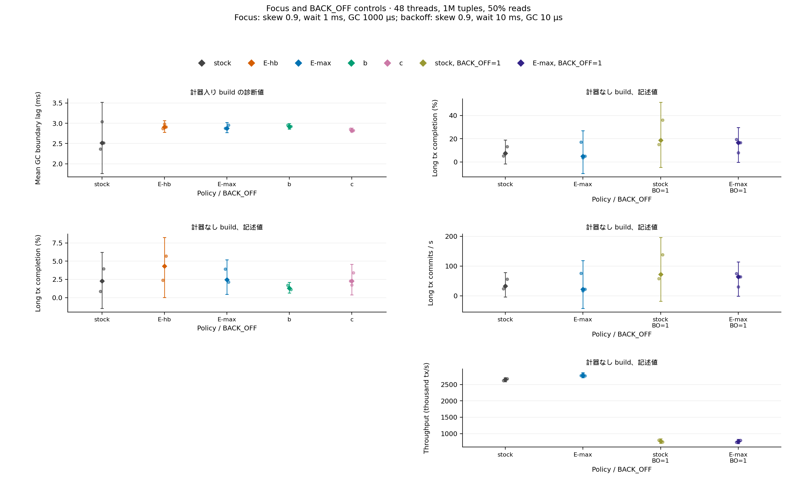

# abort が決まった長い tx を待機の安全点で早く abort させる方策を E-max と比べ、長い tx が完了しない問題を切り分けた (VHash 論文 md_31、2026-09-30)

authority: none / default_effect: no-state-change (可変状態の正本は worklog 末尾と現行 phase doc)。
wave `worktree-vhash-early-abort-policy`、起点 local main `4f412c67b` (開始 gate fresh rc 0、2026-09-30 11:5x JST)、CCBench submodule = pin C `68106660` (動かしていない)。
job dir `/work/1/SFC/tanab/tmp/vhash-early-abort-policy-2026-09-30/` (段 1 brief・段 2 plan・段 3 相談 2 本・段 4 裁定・段 6 裁定 1〜3・Codex の prompt と報告・計算ノードの raw・変異の記録)。
依頼は `/work/1/SFC/tanab/tmp/vhash-2026-09-29/md_31.txt` と `common.txt` (job dir `inputs/` に逐語)。対象 item は worklog の [T-2930]。

**この文書の GC・計数の値は計器入り build の診断値、throughput は計器なし build の記述値である。方策の正しさ検査 (§7) は判定器の上限が indeterminate で、certified・serializable とは書かない。長い tx の完了率は rep の揺れが大きく、腕の間の差を判定しない (§5.3)。**

## 1. 依頼と結論

依頼 (md_31): md_21 は構成 E の前進先を「既読の可視区間に収まる最大」(E-max) にすると skew 0.6 で回収境界の遅れが半分になる一方、skew 0.9 では要求の約 75% が `no_room` で効果が小さいことを示した。既読版が上書きされて commit できないことが確定した長い tx を安全点で早く abort させれば、回収境界をすぐ解放できるかもしれない。方策を定義し、判定の正しさを小モデルで確かめてから実装し、stock・E-max・早期 abort・組み合わせを同時刻に比べ、長い tx が完了しない原因を切り分け、AggressiveGC などとの違いを書く。

結論:

1. **早期 abort だけ (方策 b) では回収境界はほとんど縮まない。** skew 0.9 で回収境界の遅れの平均は E-hb 20.4 ms → b 19.6 ms (同じ rep 内の差の中央値 −0.7 ms)、skew 0.95 で −1.8 ms。長い thread 4 本のうち、上書きされていない試行 (skew 0.9 で約半分) は 10 ms 待ち続けて下限を押さえるので、上書きされた試行だけを早く終えても最小値 (回収境界) は動かない (§5.1)。
2. **前進と組み合わせる (方策 c: E-max を試して `no_room` なら判定し、確定していれば abort) と、E-max が効かない高い偏りで回収境界が縮む。** 同じ rep 内の差の中央値 (c − E-max) は skew 0.6 で −0.07 ms、0.8 で −1.8 ms、0.9 で −2.9 ms、0.95 で −4.1 ms。skew 0.9 で 19.6 → 15.2 ms、0.95 で 20.3 → 16.0 ms (rep の範囲は重ならない)。前進できる試行は前進し、前進できず確定している試行は終える、という分担が効く (§5.1)。
3. **「abort が決まっている」の判定 D は、小モデルの有限範囲で健全 (commit できる tx を abort しない)。** D = 既読版より新しく自分の時刻より古い committed / deleted の版が版列にある。pending は含めない。2 tx の全列挙 (115 状態) と 3 tx の予算内列挙 (1,446 状態) で違反なし、壊した判定 2 種 (pending を含める・既読版自身を含める) は validation 成功までの反例を出す。前提は現行 genome (INLINE_VERSION_PROMOTION=0)・read-only でない tx・前進成功後は W* (§3)。
4. **md_21 の「skew 0.9 の `no_room` 約 75% = abort が決まった tx」という読みは訂正が要る。** T-2930 の要求どおり `no_room` を成功前 / 成功後に分けると、skew 0.9 の c の計数 rep で成功後が 2,465〜6,829 回、成功前が 944〜1,353 回で、`no_room` の大半は前進に一度成功した後の再要求だった。c の全計数 rep 15 本で、D が真になった総回数は成功前の `no_room` の回数以下 (13 本で等しく、2 本で 1 回少ない) で、評価回数 (成功後を含む) よりずっと少ない。前進済みの試行で `no_room` になっても、ほとんど D は真にならない。また `no_room` の上端 U は pending も含むので、定義上は abort の確定ではない。早期 abort の根拠は D だけにした (§3.3)。
5. **長い tx が完了しない原因の切り分け:** 待機型の長い tx (10 read + 1 write の後に 10 ms 待つ) は stock でも完了する (完了率の中央値 skew 0.6 で 0.72、0.9 で 0.12、0.95 で 0.06)。md_21 の完了率 0.0003 以下は操作数型 (1,000 操作) の C/F の値で、待機型の値ではない。skew 0.9 では長い tx の試行の約 43〜46% で、待機中に既読が committed の版に上書きされて commit できないことが確定した (E-hb・E-max の shadow)。その検出の大半は待機開始から 128〜255 µs の bin に入り、待機のごく初めに確定していると推定する (安全点の何回目かは数えていない、§5.2)。前進 (E-hb・E-max) と stock の完了率の差は rep の揺れの内側で判定できない。BACK_OFF=1 (他は最良設定) では stock の完了率の中央値が同じ job の BACK_OFF=0 より高い (0.188 対 0.075) が、throughput は約 0.29 倍に落ち、回収境界の遅れは長くなる (29.9 ms) (§6)。
6. **正しさ: 巡回 0。** 最良 genome の trace build で b・c・E-max(shadow)・壊し shadow の 8 run すべてで判定器の巡回 0、integrity の数値項目 0、C 行 = commit 数、保持版の変化 0、通常 build で「D が真だったのに commit した」試行 0。壊し shadow (pending を含める) は実機では pending による判定に一度も到達せず、実機での検出力は示せなかった (§7)。
7. **throughput (計器なし、記述値):** 早期 abort の腕の stock 比は 0.97〜1.04 で、E 系の腕の揺れ (0.97〜1.06) と同じ範囲 (§5.4)。

図の読み方: 横軸 = skew (job s06・s08・s09・s095、待機 10 ms・GC 10 µs)。上段 = 回収境界の遅れの平均 (ms、leader が 10 µs ごとに取る等間隔標本)、下段 = 論理生存版数の平均 (千)。色 = 腕。小さい点が各 rep、菱形が rep 中央値、縦線は小標本 95% CI (n=3)。計器入り build の診断値。

## 2. 何を作ったか (仕様)

md_6 → md_14 → md_21 の patch (`cicada-forwarding-variant.patch` → `-gc.patch` → `-target.patch`) の上に重ねる `patches/cicada-forwarding-early-abort.patch` と、検査専用の壊し `patches/cicada-forwarding-early-abort-broken-pending.patch`。既存 patch は記録がその hash に束縛されているので変えていない。変更は `cc/cicada/transaction.cc` と `cc/cicada/ycsb_cicada.cc` だけで、**新しい `#if` を足していない** (既存の `CICADA_GC_SAFEPOINT`・`CICADA_GC_COUNT`・`CICADA_GC_WAIT` の内側)。

| flag (既定 = 現行) | 値 | 動き |
|---|---|---|
| `--cicada_gc_early_abort` | `off` (既定) | 現行と同じ |
| | `doomed` (方策 b) | `--cicada_gc_mode=hb` と組む。待機 slice の安全点ごと (100 µs、GC 間隔や GC flag の状態とは独立) に D を評価し、真なら中止。前進はしない |
| | `fallback` (方策 c) | `--cicada_gc_mode=e --cicada_gc_target=max` と組む。E-max の要求が `no_room` を返したときだけ D を評価し、真なら中止 |
| | `shadow` | 安全点ごとに D を評価して計数するが中止しない (計器 build の E-hb・E-max の腕で使う診断) |

- **判定 D:** tx が read-only でないとき、read set の各要素について `ldAcqLatest()` から既読版まで辿り、既読版に着くまでに見た版のうち status が committed か deleted で、既読版の wts < wts < 自分の現在の ts の版があれば真。既読版に着けなければ偽 (abort しない側)。D は共有状態 (ThreadRtsArray・ThreadWtsArray・版の rts・later_ver_) を書かない。Cicada の validation の既読検査 (transaction.cc の validation、wts < ts の最初の committed / deleted が既読版と一致しなければ失敗) に対し、その witness は validation までに消えないので失敗が確定する、という論理。
- **中止の経路:** `cicada_gc_safepoint` が中止を返し、ycsb_cicada.cc の待機ループが抜けて `cicada_gc_hold_end` を 1 度呼び、既存の `tx.abort()` と abort 計数を通って RETRY する。安全点側の GCFlag の設定は通らないが、直後の `tx.abort()` の `mainte()` が stock と同じ条件 (GC 間隔経過かつ自 thread の GCFlag が 0) で GCFlag を立て gcstart_ を更新するので、回収境界への効果は同じ。違いは診断計数 `flag_raises` に数えないことだけ (段 6 裁定 1 で refuted と判定した所見)。
- **計数:** flag が off 以外の計器 build でだけ `CICADA_GC_ABORT_V1` 行を 1 行出す (既存の GC V1 / V2 行は既定 flag で byte 同形)。thread ごとに D の評価回数・真の回数 (committed / deleted / pending 別)・D が初めて真になった試行数 (`txs_d_true`)・早期 abort 数・shadow で「D が真だったのに commit した」試行数・E-max の `no_room` の成功前 / 成功後 (T-2930 の要求、和は既存の `no_room` と一致)・待機開始から初回検出までの clock 合計と µs の log2 ヒストグラム・早期 abort 時に残っていた待機 clock 合計。
- **Cicada 既存の EarlyAborts との違い:** CCBench の Cicada は書き込み・削除の時点で「可視版が committed で rts > 自分の ts」なら abort する (transaction.cc の write / delete)。本方策は待機中に既読の上書きを見る点が違い、両者は独立に働く。
- **driver:** `orchestrator/campaign/vhash_forwarding_prototype.py` の `abort-run --job {s06,s08,s09,s095,focus,backoff} [--smoke]` / `abort-aggregate --raw …`。patch stack は variant → gc → target → early-abort、依存物 build → 全 build → run の順 (target-run と同じ)。既存の subcommand の受理・拒否は変えていない。通常 build で `shadow_predicted_commit` > 0 の record と、mode=e の腕で `no_room` の分割が合わない record を拒否する。
- **小モデル:** `tools/vhash_forwarding_model/early_abort.py` とテスト (§3)。
- **作図:** `make_figures.py` (この dir)。`PYTHONPATH=<repo> python3 make_figures.py data/abort-aggregate.json <raw…> --output figures/md31` で PNG / PDF / provenance を出す。raw を driver の集計で再集計し、与えた集計と一致しなければ止まる。

## 3. 判定 D の正しさ

### 3.1 小モデル (`tools/vhash_forwarding_model/early_abort.py`)
- 状態: key ごとの物理的な版列 (新しい順)、版の wts・status・回収 / 再利用、tx の ts・開始時の下限 (MinWts−1)・既読 pointer・later_ver_・write set。遷移は read (Cicada の read_internal と同じ: ts より新しい版を飛ばして later_ver_ を記録、pending は待つ、aborted は飛ばす、最初の committed を読む)、writer の pending の挿入 → commit / deleted / abort、GC の切り離し (下限未満の確定版より古い鎖を切る) と切り離した版の再利用、前進 (確認が成り立ったときだけ ts := t′ と下限 t′−1 を公開)、validation。
- **validation は D と別の関数で、保存した later_ver_ があればそこから鎖を辿る** (transaction.cc の validation の写し)。D の helper は使わない。
- 性質 SOUND: D が真になった到達状態から到達する全状態で、その tx の validation の既読検査が成功しない。
- 結果 (親の実走、2026-09-30): 2 tx の全列挙 115 状態・146 遷移 (D が真の状態 6、GC の切り離し 62・再利用 26)、3 tx の予算内列挙 1,446 状態・2,428 遷移 (D が真の状態 106、切り離し 1,154・再利用 495) で違反なし。壊した判定の反例: pending を含めると `R.read_A=a0 → R.install_B=pending → W1.install_A=pending → W1.aborted → R.validation_read=pass`、既読版自身を含めると `R.read_A=a0 → R.install_B=pending → R.validation_read=pass`。
- **範囲の限定:** 読む key は 1 個、writer は 1〜2 tx、時刻は固定した一意の値、GC の規則は実装より保守的 (下限未満の確定版があれば切れる)。前進成功の遷移は W* (確認の後に既読版と t′ の間へ置かれた pending を writer 側が確認すること、D2292 で未認定) を仮定したもので、それを含む遷移 (2 tx で 3、3 tx で 16) は別に数えている。**有限の範囲での確認であって証明ではない。**
- **read-only tx を除く理由 (段 3 相談 A の所見 1):** read-only tx は rts で読み、promotion (INLINE_VERSION_PROMOTION=1) で書き込み型に変わると、保存した later_ver_ に pending が入りうる。その pending が abort し別の writer の版が commit すると、D は真なのに validation が later_ver_ から辿って既読版に着き commit できる列がある (小モデルのテスト `test_saved_later_explains_promotion_exclusion` で手で作った状態)。現行の genome は promotion 無効で、長い tx は variant patch で read-only を外しているので、この列は計測の外。D は `!is_ronly_` の tx だけで評価する。

### 3.2 実機での照合
- 通常 build の shadow (E-hb・E-max の計数腕) と、検査の E-max(shadow) で、「D が真だったのに commit した」試行は全 run で 0 (本計測の shadow の 36 run と検査の E-max(shadow) 2 run)。**ただしこれは D の健全性の証拠に数えない。** 壊した判定 (pending を含める) の shadow は、検査 2 の 2 run とも pending による判定に一度も到達せず (`d_true_pending` 0)、この照合に検出力があることを実機では示せなかった (段 4 で「0 を合格と数えない」と事前に決めたとおり)。D の健全性の主張は小モデルだけに置く。

### 3.3 `no_room` と D の関係 (md_21 §4.3 の訂正)
- md_21 は「成功前の `no_room` = 既読のどれかが自分の時刻より下で上書きされた tx = validation での abort が決まっている」と書いた。`no_room` の上端 U は pending の版も含むので、成功前の `no_room` でも pending が abort すれば validation は通りうる (段 3 相談 A の所見 4)。abort の確定を言えるのは D (committed / deleted の witness) だけである。
- 実測 (検査 1、tuple 50・zipf 0.9): 方策 c では D の評価は `no_room` のときだけで、GC 10 µs の run で成功前の `no_room` 262 回・成功後 217 回・D の評価 479 回に対し、D の真は 262 回 (成功前の回数と同じ)。本計測 (1M 件) の c の計数 rep 15 本では、D が真になった回数は成功前の `no_room` の回数と 13 本で一致し、2 本で 1 回少なかった (rep 番号は 1 始まりで、skew 0.8 の rep 2: 613 / 614、focus の rep 1: 6,636 / 6,637。D の評価回数は成功後を含むのでこれより多い)。計数は D の真を成功前 / 成功後に分けていないので、「成功後の `no_room` で D が真になった例は無い」とまでは言えない (言えるのは総回数の上限だけ)。成功前の `no_room` はほぼ確定に当たるが、pending を含む上端の定義上は保証されない。

## 4. 経緯 — 段 2〜6 の訂正と実機でだけ出た不具合

| 回 | 何で見つけたか | 内容 | 直し方 |
|---|---|---|---|
| 1 | 段 2 plan・段 3 相談 A | D の健全性は validation の走査起点 (later_ver_) と W* に依存し、read-only + promotion で反例がある | D を read-only でない tx に限り、主張を genome・W* で限定 (段 4) |
| 2 | 段 3 相談 A | 小モデルは 3 tx の列が要り、validation を D と独立に書かないと恒真になる | 単位 C の必須条件に (段 4) |
| 3 | 段 3 相談 B | 既存の安全点は GC 間隔未経過・flag 立ち済みで早く戻るので、そこでだけ D を見ると見逃す。BACK_OFF の切り分けは 2×2 で、GC 1000 µs の焦点条件を残すべき。`no_room` 75% を abort の余地と読む筋書きは弱い | b は slice ごとに D を評価、backoff job と focus job を追加、計数を試行単位に (段 4) |
| 4 | 焦点走 1 (1,892 passed・4 failed) | 新 patch の文脈行の `#if CICADA_GC_WAIT` が spawn site テストで「CCBench に元からある define」側へ落ちた | 重ね patch 表の gc patch の項に登録 (md_14・md_21 の先例と同じ足跡、期待件数は不変) |
| 5 | 段 6 レビュー B・A | 検査起動器が構造上 false の `integrity.clean` を合格条件にし、壊し build では巡回・保持版の条件まで外していた | clean を外し数値項目で判定、壊し build も共通条件を判定し到達と予測後 commit だけ観測値に |
| 6 | smoke 1 (2 本とも) | abort-run が依存物 build をせず、条件 gate の前処理が `config.h` 無しで止まった (レビュー B の「起動枠の再記述」の指摘が当たった) | target-run と同じ順序 (依存物 → 全 build → run) にしてテストを追加 |
| 7 | smoke 2 (2 本とも) | 計器なし build で計数専用の変数 `elapsed` が未使用になり `-Werror` で止まった (実 header での構文検査は子の環境で走らなかった) | `[[maybe_unused]]` |
| 8 | 検査 1 | 起動器が hb の腕 (GC V1 行に `no_room` が無い) にも `no_room` 分割の照合を当てて落ちた | mode=e の腕だけに |
| 9 | 段 6 レビュー A | `detect_hist` だけ clock 単位で bin に入れていた | µs に |

6・7・8 は md_21 §3.2 の 4・5 と同じ型 (新しく読む・新しく build する経路を実機に出して 1 巡に 1 件ずつ出た)。

## 5. 本計測

### 5.1 条件と回収境界

| 項目 | 値 |
|---|---|
| 機材 | Pegasus 計算ノード (gen_S)。6 job を 6 台で同時刻に (request 37952〜37957、各 Elapse 194〜207 s、bnode028・043・049・050・057・142)。計測中の qstat (`jobs/measure.qstat-during.txt`) で各ノードに自分の request 1 本だけ (md_18・md_29 を含む他の request と同居なし)、各 job の単独性 probe の競合 0 |
| commit | `7347598e2` (fix2) |
| Cicada 設定 | md_11 の観測最良 `BACK_OFF=0, INLINE_VERSION_OPT=1, INLINE_VERSION_PROMOTION=0, REUSE_VERSION=1, WRITE_LATEST_ONLY=0` (backoff job の BACK_OFF=1 の腕だけ BACK_OFF を 1 に) |
| 共通 | 48 thread、1M 件、rratio 50、max_ope 10、extime 3 s、clocks_per_us 2100、長い thread 4 本、wait_after_reads (10 read + 1 write の後に待機)、slice 100 µs |
| job | s06 / s08 / s09 / s095 = skew 0.6 / 0.8 / 0.9 / 0.95・待機 10 ms・GC 10 µs。focus = skew 0.9・待機 1 ms・GC 1000 µs。backoff = skew 0.9・待機 10 ms・GC 10 µs で stock・E-max × BACK_OFF 0/1 |
| 腕 | 性能 (計器なし): stock・E-hb・E-max・b・c。計数 (計器あり): stock・E-hb(shadow)・E-max(shadow)・b・c。E 系の腕は md_21 と同じく構成 C の forwarding (`--cicada_fwd_policy=c --cicada_fwd_k=3`) も有効な build で、stock はそれを持たない |
| 反復 | 性能・計数とも 3 rep。rep ごとに腕順を 1 つ回転 |

集計: `data/abort-aggregate.json` (raw は job dir `jobs/meas-*/`)。

**回収境界の遅れの平均 ms (計数 build、rep 中央値) と、同じ rep 内の差の中央値:**

| skew | stock | E-hb | E-max | b | c | b − E-hb | c − E-max |
|---|---|---|---|---|---|---|---|
| 0.6 | 19.04 | 19.83 | 9.31 | 18.73 | 9.23 | −0.95 | −0.07 |
| 0.8 | 22.95 | 20.25 | 16.21 | 20.06 | 15.13 | −0.24 | −1.80 |
| 0.9 | 23.70 | 20.38 | 19.64 | 19.61 | 15.19 | −0.70 | −2.92 |
| 0.95 | 23.35 | 20.61 | 20.28 | 18.86 | 16.04 | −1.75 | −4.11 |

rep の値: skew 0.9 の c = 15.1 / 15.2 / 17.3、E-max = 19.7 / 18.1 / 19.6。skew 0.95 の c = 15.3 / 17.3 / 16.0、E-max = 20.5 / 20.3 / 20.1。論理生存版数の差の中央値 (c − E-max) は skew 0.8 / 0.9 / 0.95 で −3.6 万 / −4.6 万 / −5.2 万版。MinRts を長い tx が決めた割合は skew 0.9 で E-max 0.96 → c 0.79。

- md_21 の E-max の効果 (skew 0.6 で約半分) はこの wave でも再現した (E-hb 19.8 → E-max 9.3 ms)。
- skew 0.6 では D の到達率が 1.5% しかなく (§5.2)、c と E-max は同じ。
- **効果ゼロ・小さい結果も記録する:** b は全 skew で E-hb との差が 2 ms 未満。D の到達は十分ある (skew 0.9 で試行の 51%) ので、「D が真にならない」ではなく「D が真になって早く abort しても回収境界が縮まない」型の結果である。理由の推定 (未検証): 回収境界は長い thread 4 本の下限の最小で決まり、上書きされていない試行 (約半分) は待機 10 ms の間ずっと下限を押さえる。b はそれを前進させない。c は前進できる試行を前進させ、前進できず確定した試行を終えるので、両方の型の試行が境界から外れる。

図の読み方: 横軸 = skew。上段 = 長い tx の commit/秒、中段 = 試行/秒、下段 = 完了率 (commit / 試行)。計器なし build の記述値。早期 abort の腕 (b・c) は試行/秒が増えるので、完了率は分母で下がる。点・菱形・縦線は上の図と同じ。

### 5.2 D の到達率と検出時刻

| skew | D の到達率 (D が真になった試行 / 長い tx の試行、rep 中央値) E-hb(shadow) / E-max(shadow) / b / c | 初回検出までの平均 µs b / c | 早期 abort 数 (3 rep 中央値、1 rep = 3 秒) b / c |
|---|---|---|---|
| 0.6 | 0.015 / 0.016 / 0.020 / 0.012 | 155 / 1,114 | 25 / 15 |
| 0.8 | 0.31 / 0.28 / 0.28 / 0.24 | 157 / 924 | 469 / 371 |
| 0.9 | 0.46 / 0.43 / 0.51 / 0.44 | 158 / 714 | 1,395 / 951 |
| 0.95 | 0.50 / 0.43 / 0.53 / 0.48 | 161 / 580 | 2,190 / 1,687 |
| 0.9 (待機 1 ms・GC 1000 µs) | 0.65 / 0.61 / 0.70 / 0.50 | 155 / 851 | 22,233 / 6,636 |

- b の初回検出の平均は待機開始から約 155 µs で、ヒストグラムでも大半が 128〜255 µs の bin に入る。安全点は 100 µs ごとなので、**最初か 2 回目の安全点で既に確定している試行が大半**と推定する (安全点の回数は数えていない)。skew 0.9 で上書きされる試行は、待機に入る前 (10 read の間) か直後に上書きされていると見られる。
- c の検出が遅い (0.6〜1.1 ms) のは、D を見るのが E-max の要求が `no_room` を返したときだけで、要求は GC 間隔と GC flag の状態に縛られるため (段 3 相談 B の所見 2 の型)。

図の読み方: 左 = D の到達率 (D が真になった試行 / 長い tx の試行、%) を skew ごとに。右 = skew 0.9 の待機開始から初回検出までの時間 (µs の log2 bin)。棒は 3 rep の合計、点は各 rep。b の検出は 2^7 µs の bin (最初の安全点) に集まり、c は E-max の要求に縛られて遅い bin へ広がる。計器入り build の診断値。

### 5.3 長い tx (計器なし build、rep 中央値、記述値)

| skew | 完了率 stock / E-hb / E-max / b / c | commit/秒 stock / E-hb / E-max / b / c | 試行/秒 stock / b / c |
|---|---|---|---|
| 0.6 | 0.719 / 0.720 / 0.755 / 0.718 / 0.741 | 286 / 287 / 301 / 289 / 302 | 397 / 404 / 407 |
| 0.8 | 0.250 / 0.347 / 0.375 / 0.360 / 0.419 | 100 / 137 / 150 / 217 / 211 | 401 / 604 / 531 |
| 0.9 | 0.125 / 0.126 / 0.172 / 0.057 / 0.067 | 53 / 51 / 73 / 68 / 63 | 423 / 1,180 / 816 |
| 0.95 | 0.057 / 0.056 / 0.099 / 0.019 / 0.033 | 26 / 26 / 46 / 22 / 34 | 453 / 1,248 / 1,035 |

- **rep の揺れが大きい:** skew 0.9 の完了率の rep の値は stock 0.125 / 0.216 / 0.070、E-max 0.134 / 0.176 / 0.172、b 0.057 / 0.006 / 0.101。同じ条件 (skew 0.9・BACK_OFF=0) の stock と E-max は backoff job で 0.075 と 0.051 (s09 job では 0.125 と 0.172)。3 秒 × 3 rep では腕の間の差を判定できない。
- 早期 abort の腕は試行/秒が 2〜3 倍になるので、完了率 (commit / 試行) は分母が増えて下がる。commit/秒で見ると b は skew 0.8・0.9 で stock より多いが、これも rep の揺れの内側。

### 5.4 throughput (計器なし build、3 rep 中央値、stock 比、記述値)

| job | stock (kTPS) | E-hb | E-max | b | c |
|---|---|---|---|---|---|
| s06 | 3,989 | 0.989 | 0.995 | 0.983 | 0.998 |
| s08 | 3,466 | 0.995 | 0.971 | 0.996 | 0.974 |
| s09 | 2,598 | 1.060 | 1.033 | 1.039 | 1.009 |
| s095 | 2,071 | 1.057 | 1.033 | 1.036 | 1.010 |
| focus | 3,339 | 0.974 | 0.973 | 0.968 | 0.980 |

差は判定しない。短い tx の throughput は全体とほぼ同じ (長い tx の commit は 1 秒に数十〜数百件)。

図の読み方: 横軸 = job、縦軸 = throughput / 同じ job の stock の中央値。計器なし build の記述値で、差は判定しない。

### 5.5 待機 1 ms・GC 1000 µs (focus job)

5 腕とも回収境界の遅れ 2.5〜2.9 ms・生存版数 105.0 万〜105.7 万で差は見えない (md_21 §4.2 の待機 1 ms と同じ)。D の到達率は 0.50〜0.70 と最も高く、b は 1 rep で 22,233 回早期 abort するが、待機が GC 間隔と同程度なので、長い tx はもともと境界を長く止めない。

図の読み方: 左列 = focus job (skew 0.9・待機 1 ms・GC 1000 µs) の 5 腕の回収境界の遅れ (計器入り) と完了率 (計器なし)。右列 = backoff job の 4 腕 (stock・E-max × BACK_OFF 0/1) の完了率・長い tx の commit/秒・throughput (計器なし)。

## 6. 長い tx が完了しない原因の切り分け (md_31 の 5)

| 腕 (backoff job、skew 0.9・待機 10 ms・GC 10 µs) | 完了率 (rep) | 長い tx の commit/秒 | throughput (kTPS) | 回収境界の遅れ ms |
|---|---|---|---|---|
| stock (BACK_OFF=0) | 0.052 / 0.075 / 0.132 | 33 | 2,651 | 23.3 |
| E-max (BACK_OFF=0) | 0.171 / 0.036 / 0.051 | 22 | 2,778 | 18.6 |
| stock (BACK_OFF=1) | 0.151 / 0.188 / 0.362 | 72 | 769 | 29.9 |
| E-max (BACK_OFF=1) | 0.195 / 0.080 / 0.167 | 64 | 758 | 20.9 |

(完了率・commit/秒・throughput は計器なし build、遅れは計器 build。中央値以外は rep の値。)

- **「完了しない」は操作数型の話:** md_21 の完了率 0.0003 以下は操作数型 (1,000 操作・read 90%) の C / F / stock の値だった。待機型では stock でも skew 0.6 で約 7 割、0.9 で約 1 割が完了する (§5.3)。操作数型は E 系の安全点が無いので本 wave では測っていない。
- **何が待機型の長い tx を落とすか:** skew 0.9 では長い tx の試行の約 43〜46% で、待機中に既読が committed の版に上書きされ commit できないことが確定した (E-hb・E-max の shadow)。検出の大半は待機開始から 128〜255 µs の bin に入る (§5.2)。残りの失敗の内訳 (待機後半の上書き、書き込み制約、書き込み時の EarlyAborts) は計数していない (段 6 レビュー B の所見 4、限界)。
- **前進の副作用か:** E-hb と stock の完了率の中央値は skew 0.9 で 0.126 対 0.125、0.95 で 0.056 対 0.057。前進の失敗や flag の追加で完了率が下がった形跡はないが、rep の揺れの内側で判定はできない。
- **最良設定 (BACK_OFF=0) の性質か:** BACK_OFF=1 では stock の完了率の中央値が同じ job の BACK_OFF=0 より高い (0.188 対 0.075、rep の範囲は重ならない) 一方、throughput は 0.29 倍、回収境界の遅れは 23.3 → 29.9 ms に悪化する。短い tx がすぐ再実行しない分、長い tx の既読が上書きされにくくなると推定する (未検証)。BACK_OFF=1 でも E-max は遅れを縮める (29.9 → 20.9 ms)。
- まとめ: 観測できた大きな要因は「高い偏りで既読が待機の早い段階で上書きされること」(試行の約半分) で、残りの失敗の内訳は数えていない。BACK_OFF=0 は完了率を下げる方向に見える (記述値)。前進 (E) による完了率の変化は判定できない。

## 7. 正しさ検査 (md_3 の trace と判定器、md_17 の拡張、D2279)

repo 外起動器 (md_21 の起動器の派生、Codex author が作り job dir へ退避。使った bytes は `jobs/verify2/launch_cicada_run_early_abort.used.py`、sha256 `9ea14954…`) で、trace patch → variant → gc → target → early-abort (→ 壊し) の TRACE=1 + 計数 build を最良 genome で走らせた。job 37936.nqsv (Elapse 163 s、bnode057、木 `7347598e2`)。8 thread・長い thread 2 本・extime 1 s・tuple 50・zipf 0.9・待機 10 ms。結果 = `data/verify-result-compact.json`。

| build | 腕 | GC µs | 巡回 | integrity 数値項目 | C 行 = commit | 保持版の変化 | 早期 abort | D が真の試行 | 予測後 commit |
|---|---|---|---|---|---|---|---|---|---|
| 通常 | b | 10 / 100 | 0 / 0 | すべて 0 | 一致 | 0 / 0 | 366 / 323 | 366 / 323 | 0 / 0 |
| 通常 | c | 10 / 100 | 0 / 0 | すべて 0 | 一致 | 0 / 0 | 221 / 244 | 221 / 244 | 0 / 0 |
| 通常 | E-max(shadow) | 10 / 100 | 0 / 0 | すべて 0 | 一致 | 0 / 0 | 0 / 0 | 128 / 136 | 0 / 0 |
| 壊し (pending を含める) | E-hb(shadow) | 10 / 100 | 0 / 0 | すべて 0 | 一致 | 0 / 0 | 0 / 0 | 119 / 130 | 0 / 0 (pending による真 0 = 到達せず) |

- integrity の数値項目 = md_3 の 11 項目。`integrity.clean` は Cicada に証拠面が無いので構造上 false で、合否に使っていない (記録には残す)。判定の上限は indeterminate。
- **言えること:** 実測した YCSB 高競合の待機型の履歴で、早期 abort (b・c) と shadow を含む状態でも判定器は巡回を検出せず、待機中の既読版は変わらなかった。abort は常に安全側の操作なので、この検査が主に確かめるのは「中止の経路 (hold_end → abort → RETRY) が履歴・保持版を壊さないこと」である。
- **言えないこと:** serializable・certified。D の健全性の実機での証拠 (§3.2)。
- 検査 1 回目 (37904、木 `357f817a1`) は、起動器が hb の腕で落ち (§4 の 8)、c と E-max(shadow) の 4 run だけ合格した。

## 8. 変異

独立 clone (D1009) を commit `7347598e2` に固定し、束ね経路 (D842、`dispatch_compute.py --task mutation`) で走らせた。事前登録は段 4 (MT1〜MT9)。対象テスト = `orchestrator/tests/test_vhash_forwarding_prototype.py`・`orchestrator/tests/test_vhash_forwarding_model_early_abort.py`。

| 段 | request | 結果 |
|---|---|---|
| probe (全件 SURVIVED 期待で観測 node を集める) | 37941 (218 s) | baseline PASSED。9 件すべてで登録したテストが赤 (MISMATCH = 殺された) |
| final (観測 node の完全集合を期待) | (209 s) | baseline PASSED、KILLED 9 / 9 (完全一致、DW-M08) |

変異: MT1 (小モデルの D に pending を含める)、MT2 (小モデルの D に既読版自身を含める)、MT3 (patch stack から early-abort を外す)、MT4 (計数行の重複を受ける。共有 helper なので target 系の行数テストも赤)、MT5 (`no_room` 分割の照合を外す)、MT6 (通常 build の予測後 commit を受ける)、MT7 (計器 build の throughput を性能集計に入れる)、MT8 (b の腕を gc_mode=e にする)、MT9 (BACK_OFF 対照で他の軸も変える)。C++ の論理変異は login の pytest では殺せないので、D の意味は小モデル (MT1・MT2 と同じ意味) と実機の検査 (§7) で扱った。記録: job dir `mutation/`。

## 9. AggressiveGC・Steam・HANA との違い (何を諦めるか)

原典照合済みの引用 (output/insights/2026-09-29/vhash-related-work/reading-notes/) の範囲で書く。

| 方式 | 何を諦めるか | 長い tx への効き方 |
|---|---|---|
| AggressiveGC (CCBench 論文 §7.3、提案のみで実装なし) | 「active or future transactions need to read」版の保持と read の成功。"read operation failures ... could be handled by aborting the transaction and retrying it with a new timestamp" | commit できたかもしれない tx も、必要な版を回収されれば abort させる |
| Steam (Böttcher ら PVLDB 2019) | 何も諦めない (active tx に必要な版は残す) | 回収境界は最古の active tx に縛られたまま、境界内の不要な中間版を走査時に剪定する。長い tx の timestamp・snapshot は変えず、abort もしない |
| HANA (Lee ら) の運用対処 | 問題の cursor・Trans-SI tx そのもの ("closes problematic cursors or Trans-SI transactions by force and returns errors to clients") | 強制終了か版のディスク退避 |
| Cicada 既存の EarlyAborts | 書き込み・削除の時点で commit できないと分かった tx の残りの仕事 | 待機中の既読の上書きは見ない |
| **本案 b (doomed)** | **D で commit できないと確定した試行の残りの仕事 (残りの待機)** | commit できる tx は殺さない (小モデルの範囲)。確定していない tx の下限は押さえたまま |
| **本案 c (fallback)** | b と同じものを、前進できなかった試行に限って | 前進できる試行は前進させ (md_21 の E-max)、前進できず確定した試行だけ終える |

- AggressiveGC との違いは、**回収を先に決めて tx を殺すか、tx が既に死んでいることを確かめてから境界を放すか**。本案は「commit できる tx を失わない」ことと引き換えに、上書きされていない長い tx が境界を押さえる分は残す (b の効果が小さい理由、§5.1)。c でそれを前進で補う。
- 本案は AggressiveGC を置き換えない。組み合わせるなら、D で確定した tx を先に外し、それでも残る境界の遅れを AggressiveGC の回収で縮める順になる (未検討)。
- 本案の新規性一般 (他の MVCC 系で同じ判定を安全点で使う例の有無) は調べていない。

## 10. 確かめたこと / 確かめていないこと

確かめたこと (実測):
- 既定 flag (`off`) で現行と同じ: 新しい `#if` なし (directive 数不変)、既定腕の GC V1/V2 行が既存の解析を通る (本計測の全 run)、焦点走 3 (17 file、1,902 passed・5 skipped、失敗 0)。
- 小モデルの SOUND (有限範囲) と壊しの反例 (§3.1)。正しさ検査 (§7)。本計測 (§5・§6)。変異 (§8)。
- 本計測のノードで他の request と同居していない (計測中の qstat) と単独性 probe の競合 0。

確かめていないこと・限界:
- **serializability** (上限 indeterminate)。D の健全性の証明 (小モデルは有限範囲、W* 仮定の遷移を含む)。実機での D の照合の検出力 (§3.2)。
- promotion 有効の genome、read-only tx (D の対象外)。操作数型の長い tx (安全点が無い)。
- 長い tx の失敗理由の内訳 (§6)。完了率の腕間の差 (rep の揺れ)。
- 1 run 3 秒・3 rep。thread 数・レコード数・長い thread 数・待機長 (1 ms / 10 ms 以外)・GC 間隔 (10 / 1000 µs 以外) は測っていない。md_11 の最良 genome は skew 0.9 で較正したもの。
- 論理生存版数は物理メモリ量ではない (REUSE_VERSION=1 の pool は縮まない)。
- 方策 c の D の評価頻度は E-max の要求に縛られる (§5.2)。b と E-max の組 (前進を試しつつ slice ごとに D を見る) は測っていない。

## 11. 次の版 (docs/paper-story-vhash/ 2 版目) へ

- **U0 の証拠の追加:** E-max に「前進できず commit できないと確定した試行を安全点で終える」を足すと (方策 c)、E-max が効かない skew 0.9 / 0.95 で回収境界の遅れがさらに 2.9 / 4.1 ms 縮む (19.6 → 15.2 ms、20.3 → 16.0 ms)。図 `figures/md31-early-abort-gc.png`。
- **早期 abort だけでは効かない:** 回収境界は上書きされていない長い tx が押さえるので、確定した tx を終えるだけでは縮まない。前進と組み合わせて初めて効く。AggressiveGC との違い (commit できる tx を失わない) を本文の比較に使える。
- **md_21 §4.3 の訂正:** `no_room` は abort の確定ではない。確定は committed / deleted の witness (D) で言う。
- **長い tx の完了:** 待機型は stock でも完了する。完了しないのは操作数型。skew 0.9 では試行の約 43〜46% が待機のごく初めに既読を上書きされて確定している (検出の大半が 128〜255 µs)。BACK_OFF=0 は完了率を下げる方向 (記述値)。前進による完了率の変化は判定できない。
- 図: `figures/md31-early-abort-{gc,long,doomed,throughput,focus-backoff}.png` (生成器 `make_figures.py`、provenance 同名 `.provenance.json`)。

## 12. 計算資源

| 用途 | job (request / Elapse) |
|---|---|
| 焦点走 | 37789 / 100 s、37897 / 160 s、37929 / 161 s |
| smoke | 37800 / 17 s、37801 / 18 s、37902 / 47 s、37903 / 47 s、37934 / 91 s、37935 / 125 s |
| 正しさ検査 | 37904 / 124 s、37936 / 163 s |
| 本計測 | 37952〜37957 / 194〜207 s (計 1,183 s) |
| provenance 監査 | 37907 / 40 s (他の 3 回は login の予約枠で実行) |
| 変異 | 37941 / 218 s、final / 209 s |

合計 2,703 s (約 0.75 node 時間、受入の全走を除く)。2 node 時間未満。
