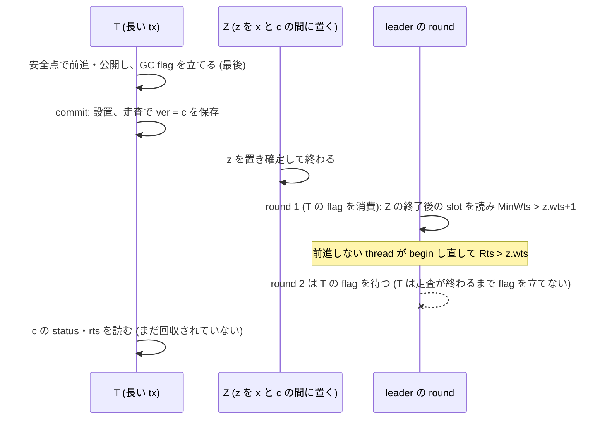

# 構成 E の書き込み検査の走査中の回収: 試作では GC flag の静止条件が列を塞ぐ。一般の E 向けの修理は skew 0 で U0 の利得の約 7 割を失う (VHash 論文、md_39)

- 着手: 2026-09-30 (dev-wave `worktree-vhash-econn-wscan-fix`、背景 job)。起点 local main `d79fd3524`。
- 依頼: `/work/1/SFC/tanab/tmp/vhash-2026-09-29/md_39.txt` と同 dir の `common.txt` (job dir `/home/SFC/tanab/.claude/jobs/7c35b6f9/wave/verbatim/` に逐語)。計算 job の分割 (1 本 5 分目安・処置とノードを 1 対 1 にしない) は依頼元と land 調整役が中継したユーザー指示 (2026-09-30 19:5x JST) に従った。
- 対象 item: worklog [T-2952] (md_36 の N1)。
- 対象の穴: md_36 (`output/insights/2026-09-30/vhash-proof-assumptions-vs-impl/README.md`) §3.2 の列。構成 E で、長い tx T の commit の書き込み検査が走査中に保存した版 c が、T の設置の後に置かれた確定版 z を根に回収される。
- コード: CCBench pin `68106660`、`patches/cicada-forwarding-variant.patch` → `-gc.patch` → `-target.patch` (以下 V・G・T) の上に本 wave の patch 3 枚を重ねる。
- **全ての値は計器入り build の診断値で、性能値ではない。正しさの判定の上限は indeterminate であって serializable・certified ではない。**

## 0. 結論

1. **試作の構成では md_36 §3.2 の列に届かない。コードの読みと実機の計数が一致した。** Cicada の leader は全 thread が GC flag を立てたときだけ回収境界を 1 round 進める。T は commit の設置から書き込み検査の走査の終わりまで flag を立てない (§2)。§3.2 の列には、z を置いた Z が終わった後に 2 round 要る。1 round 目で MinWts が上がり、前進しない thread がその値で begin し直す。2 round 目でそれを読む。よって走査中には届かない。実機では、主 workload の遅延を掛けた走査 2.3 万回で、遅延中に完了した round は最大 1 だった。K1 (長い tx の update key を揃えて Z を作る) の 1.8 万回でも最大 1 で、挿入は 311 回届いたが回収は 0 だった (§5.1)。**この塞ぎは構成 E の規則ではない。** 前進しない thread が 1 本も無い一般の E、または commit 中に静止を宣言しうる設計では 1 round で足り、列は成立する (md_36 §4.3 の thread 0 の抑えと同じ型)。md_36 §3.2 の「T の thread の中断」で round が 2 つ進むという読みは、静止の条件を見落としている (中断は flag を立てない)。
2. **修理 (候補 b) を patch にした。** 前進の成功時に公開する Rts を、`min(t′−1, 各書き込み key の「t′ で見える確定版」の wts の最小)` に抑える (§3)。一般の E でも、T の書き込み検査の走査で止まる版とその上の版は回収の根を持てない (論証は §3.2、前提は §3.3)。
3. **修理の費用は大きい。** 主 workload の skew 0 (E-max が効く条件) で、E-hb から E-max への改善のうち、境界の遅れで 28%、生存版数で 27% しか残らなかった (境界の遅れの平均 19.73 → 6.03 → 15.95 ms、生存版数の平均 132.2 → 111.2 → 126.5 万)。修理は全 38,792 回の公開で上限を掛け、うち 98% (38,088 回) では公開値がその時点の floor を越えなかった。長い tx の update key は一様乱数で選ばれて確定版が古いので、上限が開始時の floor より下に来る (§5.3)。skew 0.9 はもともと E-max の改善がごく小さい (同 20.36 → 19.84 → 20.05 ms)。
4. **修理の効果は実機で確かめられなかった。** 壊し正例 (修理を外す) は、事前登録した K1+K2 (遅延中に T 自身の flag を立て直して静止の障壁を外す模擬) でも発火しなかった (「到達したが未発火」)。したがって修理の判定は事前登録どおり「判定不能」。遅延 10 ms の事後の探索走 (事前登録外) でも、遅延中の round は最大 2 だった。T の PENDING 版を待つ別の書き手も flag を立てないので round が止まると推定する (未検証、§5.2)。
5. **巡回の検査:** 修理前・修理後とも、md_21 の E-max の 2 cell (tuple 50・zipf 0.9、tuple 10,000・skew 0) で判定器の巡回 0、integrity の数値項目 0、trace の C 行 = commit 数、保持版の変化 0 だった (上限 indeterminate、§5.4)。

### 0.1 論文 2 版目に書ける文・書けない文

| 書ける文 (範囲を明記して) | 根拠 |
|---|---|
| 「Cicada の GC は全 thread の静止の宣言 (GC flag) を待って境界を進める。構成 E の試作では、書き込み検査の走査中に境界は高々 1 回しか進まず、md_36 の列 (走査で止まる版の回収) には 2 回が要るので、この試作の構成では起きない」 | §2、§5.1 |
| 「前進しない thread が無い一般の E では、この塞ぎは成り立たない。公開する読み取り下限を書き込み key の見えている確定版の時刻以下に抑える規則で、その列は閉じる (論理の上で)」 | §3 |
| 「その規則は、計測した待機型の長い tx (update key が一様乱数) で、U0 の回収境界の改善の約 7 割を失う (計器入り build の診断値)」 | §5.3 |
| 「修理前・修理後とも判定器は巡回を検出しなかった (上限 indeterminate)」 | §5.4 |

**書けない文:** 「修理は実機で md_36 の穴を閉じた」(壊し正例が発火していない)。「構成 E の試作は定理 G の実装」(静止の塞ぎは規則でなく、境界の読み (md_36 §4、[T-2953])・時刻の重複 ([T-2954]) は直していない)。「修理後も U0 の利得は保たれる」。

## 1. 範囲と入力

- 負荷: md_14・md_21 と同じ主 workload。48 thread、YCSB tuple 1,000,000、rratio 50、10 op、長い thread 4 本 (thid 44〜47) が 10 read + 1 update (update の key は read と別の `zipf_()` 呼び出し) の後に 10 ms 待機し、待機を 100 µs の slice に分けて安全点を呼ぶ。E-max = `--cicada_gc_mode=e --cicada_gc_target=max`、GC 間隔 10 µs、extime 3 s。genome は md_11 の観測最良 (`BACK_OFF=0, INLINE_VERSION_OPT=1, INLINE_VERSION_PROMOTION=0, REUSE_VERSION=1, WRITE_LATEST_ONLY=0`)。
- build: 既存 `orchestrator.campaign.vhash_forwarding_prototype._build_variant` の kind `gc-e-count` (`CICADA_FWD_ENABLE`・`CICADA_LONGTX`・`CICADA_FWD_COUNT`・`CICADA_GC_SAFEPOINT`・`CICADA_GC_WAIT`・`CICADA_GC_COUNT`)。条件 gate の 6 macro の admission はすべて admitted。
- 読んでいない経路: TPC-C・scan・insert・delete・group commit・`SINGLE_EXEC`・`WRITE_LATEST_ONLY=1`。

## 2. (P1) 静的な導出: GC flag の静止条件

コードの対応 (applied = pin に V・G・T を当てた木の物理行):
- GC flag を 1 にするのは `mainte()` (applied `transaction.cc:1810`) と構成 E の安全点 (`:660`) だけ。`mainte()` は commit の write phase の後 (`:1884`) と abort の後始末 (`:1684`) で呼ばれる。設置 (`:1388–1438`) から書き込み検査の走査 (`:1487–1504`) までは呼ばれない。
- leader (stock `util.cc:281–322`) は全 thread の flag が 1 のときだけ MinWts・MinRts を公開し、全 flag を 0 に戻す。
- `begin()` は Rts := MinWts − 1 を書く (`:698–703`)。`gc_versions` は根 z について z.wts < MinRts のときだけ下を切る (`:1723–1762`)。

導出 (§3.2 の特定の列に限る。group commit なし、時刻と thread Wts の単調性、前進しない thread が活動していることを置く):
1. 走査が見落としうる根 z は、T が走査でその位置を通った後、すなわち T の設置の後に置かれる。
2. MinRts > z.wts には全 thread の Rts > z.wts が要る。前進しない thread k の Rts は、k が begin した時点で公開済みの MinWts から作られる。その MinWts > z.wts + 1 には、Z の thread の slot を Z の終了後に読んだ round が要る (Z の活動中の Wts は z.wts 以下で、それ以前はより小さい)。
3. よって、Z の終了後に slot を読んだ round (1 回目) と、k がその値で begin し直した後の round (2 回目) の 2 つが要る。2 回目の flag の確認には、1 回目が flag を 0 に戻した後に立てた T の flag が要る。しかし T が次に flag を立てるのは commit の後の `mainte()` であり、走査の後になる。
4. 試作では thread 0 (leader) と 44 本の短い thread が前進しないので、3. が成り立つ。全 thread が前進しうる一般の E では、前進した thread は round を待たずに Rts を公開するので、1 回目の round だけで MinRts > z.wts になりうる。

## 3. 修理 (候補 b) と論証

### 3.1 patch

- `patches/cicada-forwarding-wscan-cap.patch` (V・G・T の上): `gc_advance` の書き込み事前確認で、各書き込み key の「t′ で見える版」`forward_visible(key, t′)` の wts の最小 cap を取り (RMW も同じ関数で取り直し、conflict・deleted は前進を失敗にする)、成功時の公開を `gc_publish_rts(thid, min(t′−1, cap))` にする。`gc_publish_rts` の CAS-max は変えない。既存 `#if CICADA_GC_SAFEPOINT` の内側だけで、実行時 flag は無い (patch を当てれば常に有効)。計数 (公開回数・上限が効いた回数・下げ幅・公開値がその時点の Rts を越えなかった回数) は `#if CICADA_GC_COUNT && CICADA_GC_SAFEPOINT` の内側だけで数え、既存の GC V1/V2 行を変えず別行 `CICADA_WSCAN_CAP_V1` で出す。
- `patches/cicada-forwarding-wscan-cap-broken.patch` (壊し正例、V・G・T・計器・修理の上): 公開の引数だけを t′−1 に戻す。
- 全 macro 未定義の前処理は V・G・T の木と一致した (count の fix build で `matched=true`、repro の fix・broken build でも同じ)。

### 3.2 論証 (論理の上で)

前進 k の事前確認で得た各書き込み key の見える確定版を c_k、公開値を p_k = min(t′_k − 1, min_w c_k,w.wts) とする。T の Rts は max(開始時の値 f0, max_k p_k) である。
- 事前確認の時点で、c_k と t′_k の間に非 ABORTED の版は無い (確定版なら見える版が c_k にならない。PENDING なら conflict で前進を拒む)。
- 事前確認の後に c_k より上へ置かれる確定版 z は、(i) z.wts ≥ c_k.wts (鎖は wts の降順。同じ thread の時刻重複 A2 では等号がありうる) かつ (ii) T の登録の後の設置なので z.wts ≥ (T の開始時の MinWts) = f0 + 1 (FS-c と同じ導出)。
- よって z.wts ≥ max(f0 + 1, c_k*.wts) > T の Rts ≥ MinRts (k* は max を与える前進) となり、`gc_versions` の条件 z.wts < MinRts を満たさない。c_k* とその上の版は回収されない。
- T の走査は T の版 x (wts = 最後の t′ > c_k*.wts) の next から降り、最初の確定版で止まるので、c_k* かそれより上で止まる。訪れる版はすべて回収されない。
- 同じ tx の複数回の前進でも、見える版の wts は下がらない (c_k は残る) ので、p_k は非減少で、上の議論は k* で足りる。CAS-max で古い値が残っても、Rts ≤ max(f0, c_k*.wts) は崩れない。

### 3.3 前提と閉じないもの

- **前提 MinRts ≤ 活動中の T の現在の Rts。** leader が T の thread の slot を T の前の tx の値 (前進して高い) で読むと崩れる。これは md_36 §4 の境界の読み ([T-2953]、N2) の件で、本 wave は直さない。試作では前進しない thread がこの読みを抑える (md_36 §4.3)。
- **閉じないもの (直していない):** floor が tx の境目で下がる件と leader の非原子な集計 ([T-2953])、stock の時刻重複 A2 ([T-2954])、記憶順序 (acquire / release の相互見落とし)、RA の API 一般 (安全点の後の read)、write set が安全点の後に増える API (試作の workload は全 update の後に安全点へ入り、その後は commit だけ)。
- 修理は公開 floor を下げる向きだけで、検証・検査を緩めない (規律 2)。

## 4. 計器と再現の設計 (事前登録)

- `patches/cicada-forwarding-wscan-probe.patch` (V・G・T の上、新 macro なし、`#if CICADA_GC_COUNT && CICADA_GC_SAFEPOINT && CICADA_LONGTX && CICADA_FWD_ENABLE` の内側だけ): 遅延 (`--cicada_wscan_delay_us`、既定 0) が掛かるのは、read-only でなく、その tx の E の前進が成功した、非 INSERT の書き込み key の走査である。そこでは、保存した版を thread ごとの watch に登録してから遅延する。GC の切り離し (`gc_versions`、解放・pool へ返す前) を mutex 下で watch と照合し、一致すれば hit を立てる。遅延の後の走査は計器側で行い、版の status・next・rts の読みは mutex 下で hit が偽の区間だけにする。PENDING 待ちは 1 回ごとに mutex を放す。watch は走査に合わせて移す。hit なら abort する。K1 (`--cicada_wscan_k1`) は長い thread の update key を最後の tuple に揃える。K2 (`--cicada_wscan_k2`) は遅延の 100 µs ごとに自分の GC flag を立て直す (静止の障壁を外す模擬で、頻度の主張ではない)。終了時に `CICADA_WSCAN_V1` 行を出す。
- 条件 gate の exact な `#if` 行数 (transaction.cc の FWD_ENABLE 11・FWD_COUNT 4・GC_SAFEPOINT 3・GC_COUNT 7、ycsb_cicada.cc の GC_WAIT 2・LONGTX 4) は、全ての適用順で変わらない。
- 起動器 `orchestrator/campaign/vhash_econn_wscan.py`: `build` (1 job = 1 変種、依存 build + gate + inert の前処理比較 + 本 build)、`run` (行列を shard へ round-robin に割り、各 shard に処置を混ぜる。起動前に全変種の build receipt の pin・kind・genome・HEAD・共通 patch の hash・gate の admission を照合)、`aggregate` (事前登録の判定)。
- 行列: repro = N (修理前・修理後 × 遅延 0・1 ms × 2 反復、knob なし) 8 走、K1 (修理前 × 遅延 1 ms × 3 反復) 3 走、K12 (修理前・修理後・壊し × 遅延 1 ms × 3 反復) 9 走。count = {E-hb (修理前)、E-max (修理前)、E-max (修理後)} × skew {0.9, 0} × 3 反復 18 走。trace = cell {A, B} × {修理前, 修理後} の 4 job。
- 事前登録 (段 4 裁定と段 6 裁定 1、結果を見る前): (P1) の反証 = N・K1 のどれかの run で遅延中の round ≥ 2。正例の発火 = K12 の修理前か壊しで、同じ遅延走査で挿入と round ≥ 2 がそろい (`reach_both`)、かつ回収を検出した (`detached_reach_both`) run があること。修理の成功 = 同じ shard の中に、K12 の修理後で `reach_both > 0` かつ検出 0 の run と、修理前か壊しの発火 run があること。追加の行列 (遅延 10 ms の K12) は、修理前・壊しがともに到達なしのときだけ走らせる。

## 5. 結果

計算 job 15 本 (build 5・run 6・trace 4)、Elapse 20〜68 秒、合計約 0.2 node 時間 (§9)。

### 5.1 再現走 (事前登録の行列)

| 腕 | run | 遅延を掛けた走査 | 挿入の到達 | 遅延中の round 最大 | round ≥ 2 | reach_both | 回収の検出 | 判定 |
|---|---|---|---|---|---|---|---|---|
| N・修理前 | 4 | 11,525 | 28 | 1 | 0 | 0 | 0 | (P1) と整合 |
| N・修理後 | 4 | 11,487 | 22 | 1 | 0 | 0 | 0 | (P1) と整合 |
| K1・修理前 | 3 | 18,349 | 311 | 1 | 0 | 0 | 0 | Z は届いたが障壁で回収に至らない |
| K12・修理前 | 3 | 18,516 | 330 | 2 | 24 | 1 | 0 | 到達したが未発火 |
| K12・修理後 | 3 | 17,603 | 312 | 2 | 20 | 3 | 0 | 判定不能 |
| K12・壊し | 3 | 18,416 | 297 | 2 | 25 | 2 | 0 | 到達したが未発火 |

- N の対象の走査 (eligible、遅延 0 の 4 走を含む) は修理前・修理後の合計 2,800,940 回で、回収の検出は 0。
- 全 20 走で欠損・計器行の欠落・crash は無かった (`data/agg-repro.json` の `complete: true`)。K1 は長い tx の書き込み 2,630 回を揃えた key へ差し替えた。

### 5.2 事後の探索走 (事前登録外、遅延 10 ms の K12)

事前登録の追加の条件 (修理前・壊しがともに到達なし) には当たらなかったが、発火の有無を見るため同じ行列を遅延 10 ms で 1 回だけ走らせた。**事前登録の判定には使わない。**

| 腕 | 遅延を掛けた走査 | 挿入の到達 | round 最大 | round ≥ 2 | reach_both | K2 の flag 立て直し | 回収の検出 |
|---|---|---|---|---|---|---|---|
| 修理前 | 2,181 | 73 | 2 | 5 | 0 | 249 | 0 |
| 修理後 | 2,006 | 80 | 2 | 6 | 1 | 297 | 0 |
| 壊し | 2,276 | 64 | 2 | 9 | 0 | 337 | 0 |

10 ms の遅延の間に T が自分の flag を 腕の平均で 1 走あたり 83〜112 回 (3 走計 249〜337 回) 立て直しても、round は最大 2 だった。K1 で長い tx どうしが同じ key に書くので、T より大きい時刻の書き手は、自分の書き込み検査で T の PENDING 版を待ち、`mainte()` を通らない。そのため round が止まると推定する (未検証。どの thread の flag が欠けていたかは計っていない)。

### 5.3 境界の遅れと生存版数 (計器入り build の診断値)

各腕 3 走。平均は走の間で GC 計数の和と件数を合算して出した (`data/agg-count.json`)。

| skew | 腕 | 境界の遅れの平均 | 境界の遅れの最大 | 生存版数の平均 | 前進の成功 (3 走計) |
|---|---|---|---|---|---|
| 0 | E-hb (修理前) | 19.73 ms | 624.7 ms | 1,322,320 | 0 |
| 0 | E-max 修理前 | 6.03 ms | 605.6 ms | 1,112,496 | 52,836 |
| 0 | E-max 修理後 | 15.95 ms | 607.2 ms | 1,265,001 | 38,792 |
| 0.9 | E-hb (修理前) | 20.36 ms | 653.9 ms | 1,312,812 | 0 |
| 0.9 | E-max 修理前 | 19.84 ms | 653.3 ms | 1,299,781 | 718 |
| 0.9 | E-max 修理後 | 20.05 ms | 643.4 ms | 1,308,556 | 884 |

- skew 0 で E-hb からの改善のうち残った割合 (修理後 / 修理前): 境界の遅れの平均 0.28、生存版数の平均 0.27。修理前の値は md_21 の E-max (遅れ 19.51 → 5.96 ms、生存版数 132.3 → 111.3 万) と同じ水準。
- 修理の計数 (`CICADA_WSCAN_CAP_V1`): skew 0 は公開 38,792 回のすべてで上限が効き (t′−1 より下げた)、うち 38,088 回 (98.2%) は公開値がその時点の Rts 以下だった (floor を上げなかった)。上げた公開は 704 回。skew 0.9 は公開 884 回のすべてで上限が効き、379 回が上げなかった (上げたのは 505 回)。
- skew 0 で修理後の前進の成功が 0.73 倍 (52,836 → 38,792) に減った理由は確かめていない。
- skew 0.9 の境界の遅れの最大の「残った割合」は、E-hb と E-max の差がほぼ 0 なので意味を持たない。

### 5.4 巡回の検査 (trace build、上限 indeterminate)

md_21 の repo 外起動器の派生 (job dir `wave/trace-launcher/launch_cicada_run_wscan.py`、sha256 `694478a4…31713`) で、trace patch → V・G・T (→ 修理) の TRACE=1 build を 8 thread・長い thread 2 本・extime 1 s で走らせた (`data/trace-summary.json`)。

| cell | 腕 | 巡回 | integrity の数値項目 | C 行 = commit | 保持版の変化 | 前進の成功 / 試行 |
|---|---|---|---|---|---|---|
| A (tuple 50・zipf 0.9) | 修理前 | 0 | すべて 0 | 一致 (404,094) | 0 | 9 / 1,851 |
| A | 修理後 | 0 | すべて 0 | 一致 (395,057) | 0 | 12 / 1,424 |
| B (tuple 10,000・skew 0) | 修理前 | 0 | すべて 0 | 一致 (587,100) | 0 | 448 / 811 |
| B | 修理後 | 0 | すべて 0 | 一致 (588,335) | 0 | 519 / 1,094 |

起動器の rc は 1 だった。Cicada には証拠面が無く `integrity.clean` が構造上偽になるためで、判定の結果ではない (md_21 §5 と同じ)。trace は正しさの検査で性能比較ではないので、cell × 処置を 1 job ずつに割った (処置とノードの割付けは判定に影響しない)。

## 6. md_26・md_36 の対応表への影響

| md_26 / md_36 の行 | 本 wave の後 |
|---|---|
| md_36 §3.2 (W*×E の成立列) | 試作の構成では静止の条件で塞がれる (§2、実機の round の計数と一致)。§3.2 の「T の中断で round が 2 つ進む」は誤り (中断は flag を立てない)。一般の E では成立する |
| md_26 補題 P の 3 (R9′ の走査を 1 step とした除外) | 修理を入れた E では、走査の原子性 (A1) を使わずに「T が止まる版とその上の版は回収されない」を示せる (§3.2)。前提 MinRts ≤ T の現在の Rts が要る |
| md_26 PUB (公開は p ≤ t′) | 修理は p をさらに書き込み key の見える確定版の wts 以下に抑える。md_26 の定理の形 (p ≤ t′) には収まる |
| md_36 §4 (境界の読み・FS-b・G1、[T-2953]) | 閉じない。修理の論証の前提として残る |
| md_36 §5 (時刻の重複 A2、[T-2954]) | 閉じない。修理の論証では等号 (z.wts = c.wts) を許す形で扱った |
| md_26 RC (PENDING を回収しない) | 変わらない |

## 7. S2 (D2332) への申し送り

- D2332 項 3 は「修理版 E_sp(c) の計数用 build で、長い tx が読み取り下限を開始時の値より上げて公開した回数が 0 なら S2 をこの形で発効しない」と、md_39 の結果の前に登録した。本 wave の修理は「公開させない型」ではない。上げた公開は skew 0 で 704 回、skew 0.9 で 505 回ある (§5.3)。ただし本 wave の計数は「その時点の Rts を越えた公開」の回数であり、「開始時の値を越えた」とは同じでない (1 tx の 2 回目以降の前進は前者に数えない)。S2 の 4 cell (ro-gcflag を重ねた土台) では測っていない。
- 修理は skew 0 で U0 の改善の約 7 割を失う。S2 の E_sp に修理版を使うかどうかは、修理の効果が実機で確かめられていない (§5.1) ことと合わせて、発効の wave が決める。選択肢は 2 つある。(a) 試作の構成 (前進しない thread がある) では静止の条件が列を塞ぐことを根拠に、修理なしの E を使い、塞ぎの条件を論文の規則として明記する。(b) 修理版を使い、利得の減りを結果として書く。本資料はどちらも推奨しない (判断は論文の主張の置き方による)。
- 書き込み key の見える版の rts を t′ まで上げる「予約」型 (既読版と同じ扱い) は、上限を掛けずに同じ列を閉じうる。md_39 の候補の外なので実装していない (§8)。

## 8. 新しい item の案

- 書き込み key の予約型の規則 (見える確定版の rts を t′ へ CAS-max し、観測し直して確かめる) を論証と試作にし、U0 の利得を保ったまま §3.2 を閉じられるか測る。
- 一般の E の模擬で壊し正例を発火させる schedule (T の版を待つ書き手の静止も外す) を作るか、小モデルで §3.2 の witness を取る。

## 9. 確かめたこと / 確かめていないこと

**確かめた:**
- patch 3 枚が全ての適用順で fuzz なしに当たり、exact な `#if` 行数が変わらないこと。全 macro 未定義の前処理が V・G・T と一致すること (build job の inert 確認)。条件 gate の admission。
- §5 の計数と判定 (raw の sha256 は `data/raw-sha256.txt`、raw 本体は repo 外 `/work/SFC/tanab/tmp/vhash-econn-wscan-2026-09-30/`)。
- 計算 job (request ID、Elapse): build 39737・39738・39945・39946・39947 (45〜47 s)、run 39944・39953 (count、38〜39 s)・39991・39993 (repro、42〜43 s)・40002・40003 (探索走、20〜23 s)、trace 39954・39990・39955・39958 (59〜68 s)、変異 40058 (340 s)。計算 job の合計は約 0.3 node 時間。
- 起動器の判定の変異 9 件が期待どおり (§12)。

**確かめていない:**
- 修理が実機で §3.2 の回収を防ぐこと (壊し正例が発火していない)。
- §5.2 の round が止まる理由 (推定)。
- 一般の E (全 thread が前進しうる) での列の成立 (紙の上)。
- 性能値 (throughput)。本 wave は計器入り build しか走らせていない。
- 記憶順序、TPC-C 等の読んでいない経路。

## 10. 台帳と依頼の食い違い

依頼は「patches/README.md と ledger の自分の entry」を成果物に挙げたが、`patches/ledger.json` には追加しなかった。同 ledger は `silo_ladder_rung1` 専用で entry 1 件を契約が要求し (D2288)、md_14・md_21・md_31 の cicada-forwarding-* も登録していない。patch の記録は `patches/README.md` の節に置いた。README の節は ledger の entry の代わりではない。

## 11. 工程とレビュー

工程の詳細 (brief・plan・相談・裁定・子の報告) は job dir `/home/SFC/tanab/.claude/jobs/7c35b6f9/wave/` (repo 外) にある。
- 段 2 (read-only codex 1 本) が (P1) を支持した。段 3 (2 本) は、(P1) を §3.2 の特定の列に限った条件付き導出として書くこと、修理の論証を公開の実値に結び付けること、計器を GC の切り離しの event で数えることを求め、親が全件 real と裁定した。gate の登録を増やさない複合条件の配置は段 3 の相談 B の案。
- 段 5 は Codex の実装子 2 本 (patch / 起動器)。統合時に親が、計器の mutex を PENDING 待ちの間も握る deadlock、計数用の load が性能 build に残る件、spawn site の在庫の登録漏れを見つけ、Codex の fix で直した。
- 段 6 のレビュー 2 本は、hit の確認後に解放されうる版を読む件、watch が最初の版しか追わない件、rounds_max の合算、到達と発火を別の走から合成する件、build の由来の照合を挙げ、全件 real として Codex の fix で直した。焦点再レビューは shard 番号の検証の不足を挙げ、Codex の fix で直した。
- 計算は 1 job 5 分目安で分けた (build は 1 変種 1 job、run は shard ごとに処置を混ぜる)。

## 12. 変異 (起動器の判定の検出力)

`tools/mutation_harness.py` を独立 clone の固定 commit `6999aace7` で、束ね経路 (計算ノード 1 job、request 40058.nqsv、Elapse 340 秒) で走らせた。対象 test は `orchestrator/tests/test_vhash_econn_wscan.py`。期待 node は login の自走 probe (注入 → 自走 harness → 復元、全件で sha256 の復元と clean を確認) で集めた。spec は `data/mutation-spec.json` (sha256 `35043941…fdeec8`)、probe は `data/mutation-login-probe.json`、結果の要約は `data/mutation-final-summary.json` (元の results の sha256 `a8c1c98a…d6d435`)。

| 変異 | 内容 | 期待 | 結果 |
|---|---|---|---|
| MB1b (両層) | 正例の発火を `detached` で数え、かつ判定から到達の要求を外す | KILLED (1 node) | KILLED |
| MB2 | 壊しの patch 列から修理を落とす | KILLED (1) | KILLED |
| MB3 | K12 の argv から `--cicada_wscan_k2` を落とす | KILLED (1) | KILLED |
| MB4 | 修理の成功判定から対照の発火の要求を外す | KILLED (2) | KILLED |
| MB5 | rounds_max の集約を最大から和に戻す | KILLED (1) | KILLED |
| MB6 | 計器行の `k1`・`k2` に整数を受理する | KILLED (1) | KILLED |
| MB7 | 修理の成功判定で対照の shard の一致を外す | KILLED (1) | KILLED |
| MB8 | run の receipt 照合から HEAD の一致を外す | KILLED (1) | KILLED |
| EQ1 (等価) | `sum(...)` を `sum([...])` にする | SURVIVED | SURVIVED |

baseline PASSED、MISMATCH 0、9 / 9 一致。

**erratum (段 4 の事前登録 MB1):** 単独の MB1 (判定から到達の要求 `reached and` を外す) は login の probe で生存した。段 6 の fix で、発火を同じ走査で到達とそろった回収 (`detached_reach_both`) で数えるようになり、到達の要求が 2 層 (発火の数え方と判定の条件) になったため、片方だけを外しても他方が同じ入力を拒む。DW-M02 に従い、両層を同時に外す MB1b (category both-layers) に照準し直した。C++ の論理 (修理の上限、計器の照合) は login の test で殺せないので、計算ノードの壊し正例で扱う予定だったが、壊し正例は発火しなかった (§5.1)。
