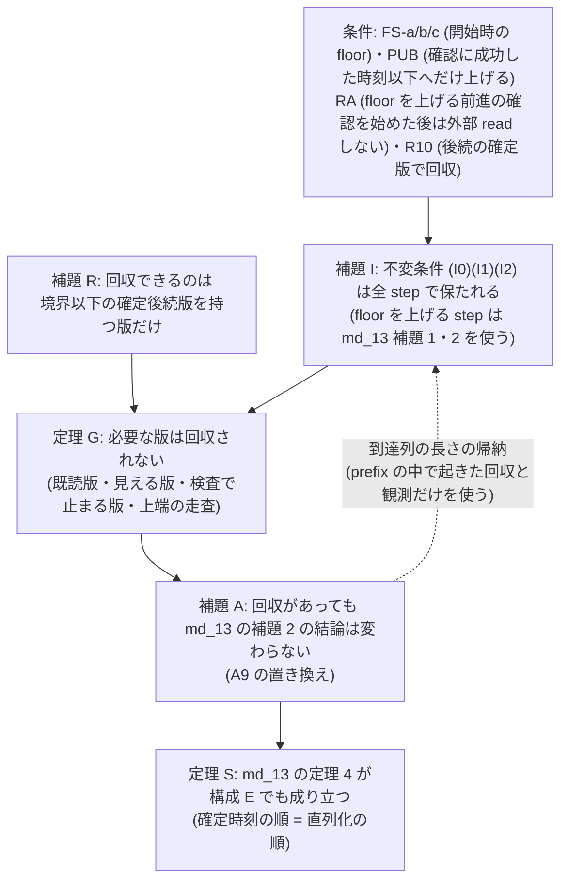
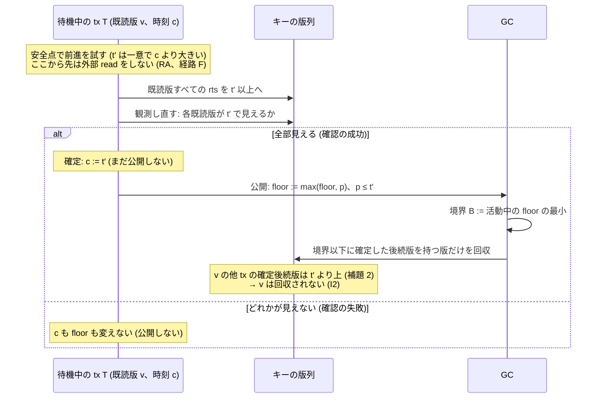

# 前進を GC の回収境界へつなぐ手順 (構成 E) が、まだ要る版を回収せず直列化も壊さないことの一般の論証 (VHash 論文、md_26)

- 着手: 2026-09-30 (dev-wave `dev-wave-md26-vhash-gc-connection-proof`、背景 job)。起点 local main `4f412c67b`
- 依頼: `/work/1/SFC/tanab/tmp/vhash-2026-09-29/md_26.txt` と同 dir の `common.txt` (job dir `/work/1/SFC/tanab/tmp/vhash-gc-connection-proof-2026-09-30/inputs/` に逐語)
- 土台 (以下の略称で引く):
  - md_13 = `output/insights/2026-09-29/vhash-forwarding-proof/README.md` (構成 C の直列化の論証、D2292)。本資料の A1〜A11・補題 1・補題 2・補題 2′・条件 W*・定理 4 はそちらの定義
  - md_10 = `output/insights/2026-09-29/vhash-gc-connection-model/README.md` (GC 接続の小モデル、D2290)。G1〜G7・UG1・UG2・UG2r・UG3・UF1 はそちらの定義
  - md_4 = `output/insights/2026-09-29/vhash-forwarding-model/README.md` (仕様 v1、D2282)。R1〜R10・R9′・O1・J3・U3a・U3b・U4 はそちらの定義
  - md_14 = `output/insights/2026-09-29/vhash-gc-connection-prototype/README.md` (構成 E の Cicada 試作、D2295)
  - md_21 = `output/insights/2026-09-29/vhash-forwarding-target-policy/README.md` (前進先 E-max、D2315)
  - md_24 = `output/insights/2026-09-29/cicada-certified-evidence-design/README.md` (検査器の盲点、D2300)
- 新規の計測・探索・実装はしていない。本資料は紙の上の論証と、既存の一次資料・Cicada のコードとの照合だけである

## 0. 結論

**定理 (論文用):** §2 の抽象仕様 E (待機の安全点で tx 自身が「既読版の rts を t′ へ上げる → 版列を観測し直して確認 → 確定 → 別 step で公開」を行い、公開した floor を下げず、回収は後続の確定版を根拠にする) に従う実行では、(a) **論理的な GC 安全** — 回収された版は、その時点で活動中の tx にも、その後に始まる tx にも、読み・確認・commit の検証・書き込み検査・前進先の計算のどれでも「必要な版」として現れない — と、(b) **直列化** — 確定時刻の順がそのまま直列化の順になる (md_13 の定理 4) — が成り立つ。

前提は §3 の表の条件 (開始時の floor、公開の規則、floor を上げる前進の確認を始めた後は外部 read をしない、など) と md_13 の仮定で、範囲は固定キーの point read / update・逐次一貫なメモリ (§1)。前進先 t′ については一意で現在の時刻より大きいことしか使わないので、E-max にも E-now にも同じく当てはまる。**主語は抽象仕様であり、Cicada 実装と物理的な非接触は主張しない** (§10・§11)。

md_10 は「固定 6 場面で反例なし」、md_13 は GC を仮定 A9 (論理的な保持) として置くだけだった。本資料はその A9 を、構成 E について仮定から定理 G に落とす。論証の芯は 3 つの不変条件である。

- **(I0) 境界は floor 以下:** GC が読んだ境界 B は、活動中のどの tx の floor 以下。
- **(I1) floor は候補時刻以下:** 各活動 tx で floor ≤ 候補時刻 c_T。以後の読みの時刻で見える版を守る。
- **(I2) 既読版の後続版は floor より上:** 各活動 tx の各既読版について、他 tx の確定した後続版の wts はすべて floor より大きい。既読版そのものを守る。

回収できる版は「境界 B 以下に確定した後続版を持つ版」だけなので (補題 R)、3 つが成り立つ間は必要な版が回収されない (定理 G)。**Cicada で既読版を守っている暗黙の不変条件 (「tx 開始時の下限を tx の間変えない」、md_14 §3.3) は、(I2) を開始時に成り立たせる条件 FS-c と、floor を上げるのは確認に成功した時刻以下へだけという規則 PUB の 2 つに当たる。** 仮裁定 P5 (安全点で下限を最新の MinWts−1 へ上げる) は PUB を破って (I2) を崩す反例である (§8)。

| md_26 の問い | 本資料の答え |
|---|---|
| (a) GC 安全 | 定理 G。「回収した版は、回収の時点で活動中の tx・その後に始まる tx のどれからも必要な版として現れない」を、既読版・見える版・書き込み検査で止まる版・E-max の上端の走査に分けて示す (§5) |
| (b) 直列化 | 定理 S。md_13 の定理 4 の仮定のうち A9 だけを補題 A (定理 G の範囲で md_13 の補題 1・2 の結論が保たれる) で置き換え、残りは同じ (§6)。E が足す step (安全点・公開・GC flag) は版のデータを書かない |
| (c) 公開の順序の各段がなぜ要るか | §7 の表。各段は証明の特定の場所 (補題 I のどの場合) で使われる |
| 反例との対応 | §8 の表。md_10 の危ない版・md_4 の U3a / U3b / U4・md_14 の P5・md_21 の壊しを、どの条件・不変条件を崩したものかで並べる。**P5 は PUB を崩して (I2) を破る** |
| md_14 の「前進の多くが失敗」 | 効き目の問題で、安全性とは別 (§9)。失敗した前進は公開しないので、失敗が多くても安全性は変わらない |

**本 wave で新たに見つかった条件:** floor を上げる前進の**確認を始めた後に**新しく読んだ版は、その確認に覆われないので floor だけでは守れない (§8 の列 X1・X2。X1 = 公開の後の読み、X2 = 確認の成功と公開の間の読み)。md_10 のモデルは版ごとの参照 (refs) でこの版を守っており、Cicada の構成 E はすべての読みの後に待機して確認し、待機の直後に commit するのでこの状況が起きない。そこで floor だけで守る経路には条件 RA を置いた。

## 1. 範囲

**主張する範囲:**

- md_10 の SP 形: 待機の安全点で tx 自身が前進を確かめ、確定してから公開する。公開した floor を下げない。回収は後続の確定版を根拠にする (md_4 の R10)。GC は境界を読み、後でその境界で回収してよい (古い境界の使用を許す)。
- tx の途中入場を含む (依頼の (a) は「その時点以降に始まる tx」を含む)。md_13 の A10 (途中入場なし) は外す。
- 前進先 t′ は、一意 (A2) で現在の候補時刻より大きい任意の値。E-max (md_21) も E-now (md_14) もここに入る。md_10 のモデルの候補集合 (より新しい確定版の next_free) は E-max の t′ を含まないが、本論証はその候補集合を使わない。
- アクセス駆動の前進 (md_4 の R4〜R7) と圧力による前進 (md_10 の G2〜G4) の両方。どちらも同じ確認・確定・公開の手順として扱う。
- point read / update、既存キーだけ。逐次一貫なメモリ、md_4 の原子性 (1 step = 1 キーの版列全体の原子的な観測、1 field の書き込み、または R9′ の走査全体)。
- O1 あり・なしの両方 (直列化の側、md_13 と同じ)。

**主張しない範囲:** §11 の一覧。とくに代行の前進 HP (md_16、D2298)、read-only commit の公開 (md_22、D2317)、物理参照の解除と走査中の pointer の寿命、lock-free 性、弱いメモリ、範囲読み・挿入・削除。

## 2. 抽象仕様 E

### 2.1 状態と step

tx T は候補時刻 c_T、floor f_T、既読集合、書き込み buffer を持つ。版は key・wts・rts・status (PENDING / COMMITTED / ABORTED) を持つ。GC はこれまでに読んだ境界の集合 𝓑 を持つ。各 step は逐次一貫な全順序に並ぶ。

| step | 内容 | 出典の規則 |
|---|---|---|
| 登録 | T が開始時刻 s0 を得て c_T := s0、f_T := f0 (§3 の FS-a/b/c) | Cicada `begin()`、md_10 の初期状態 |
| 外部 read | 時刻 c_T で版列を 1 step で観測する。可視の位置 (ABORTED を除き wts ≤ c_T の最大版) が他 tx の PENDING なら待つ。COMMITTED 版 v を読み、既読集合へ加える。rts は書かない | md_4 R1・R2、md_13 A4 |
| 前進の確認 | t′ (一意、t′ > c_T) を選ぶ。既読版すべての rts を max で t′ 以上へ上げ、**その後に**版列を観測し直して各既読版が t′ で見えるか確かめる。他 tx の PENDING が可視の位置にあれば失敗 | md_4 R5、md_10 G2、md_13 A5 |
| 確定 | 確認が全部成功したら c_T := t′。未設置の書き込み版の wts も t′。失敗なら c_T は変えない | md_4 R6、md_10 G3、md_6 の試作 (D2287) |
| 公開 | 確定の後の別 step で f_T := max(f_T, p)、p ≤ t′。成功した確定の後にだけ行う | md_10 G4、D2295 |
| 取り消し (任意) | 確定の後・公開の前に、試行前の c_T へ戻る | md_10 §5.5 |
| commit | md_4 の R9: 時刻確定 → PENDING 版の設置 → 既読版の rts を確定時刻へ → 観測し直し → キーごとの R9′ → 全版の status を 1 step で確定。status 確定の step で T の活動は終わる | md_4 R9・R9′ |
| GC: 境界を読む | B := 活動中の登録済み tx の f の最小値を 1 step で読み、𝓑 に加える。活動中の tx が無いときの B は、それ以後に登録する tx が FS-a と FS-b を両立できる値に限る (モデルは全版の最大の wts + 1、`model.py` 419 行) | md_10 G5、Cicada leader |
| GC: 回収 | 版 y を回収できるのは、y が ABORTED のとき、または y が COMMITTED で、同じキーの確定版 z と、ある B ∈ 𝓑 について y.wts < z.wts ≤ B が成り立つときだけ。PENDING 版は回収しない | md_4 R10、Cicada `gc_versions` |

「回収」はその版を版列から外すことを表す (Cicada の切り離しに当たる)。論理の議論では、外した版を含めた「全版の列」と、外した版を除いた「残った版の列」を区別する。md_13 の A9 は「補題 2 が扱う観測・走査の結果が、全版の列と残った版の列で変わらない」ことを求めていた。

### 2.2 保護の 2 つの経路

既読版をどう守るかで 2 経路ある。

- **経路 F (floor だけ、Cicada 型):** 既読版の保護を floor だけで行う。条件 FS-c と RA が要る。
- **経路 R (refs、md_10 のモデル):** 活動中の tx の既読版を版ごとの参照集合 refs に入れ、GC は refs にある版を回収しない (`tools/vhash_forwarding_model/model.py` 423〜425 行)。FS-c と RA は要らない。

md_10 のモデルの floor の初期値は開始時刻 (`model.py` 67〜68 行) で、開始時刻より古い時刻の writer が後で版を設置しうるので FS-c を満たさない。**元のモデルは refs で守っているので GC 安全の前提を欠くわけではない。refs を外して floor だけで守る派生仕様には FS-c と RA が追加で要る。**

### 2.3 Cicada との対応 (境界の不等号)

Cicada は「自分が確定させた版 z の wts < MinRts なら、z より古い版を切り離す」(`external/ccbench/cc/cicada/transaction.cc` 806〜839 行)。MinRts は各 thread の ThreadRtsArray の最小 (`util.cc` 290〜316 行)。z.wts < MinRts は z.wts ≤ MinRts − 1 と同じなので、**f := ThreadRtsArray − 1、B := MinRts − 1 と読み替えると R10 (z.wts ≤ B) の形になる。** この読み替えで、開始時の ThreadRtsArray = MinWts − 1 は f0 = MinWts − 2、前進後の ThreadRtsArray = t′ − 1 は p = t′ − 2 ≤ t′ となり、§3 の条件の形は変わらない。モデルの公開値 p = t′ とは値が違うが、どちらも p ≤ t′ を満たす。この読み替えは時刻を整数として扱っており、C++ の `uint64_t` で 0 から引く場合 (起動直後の MinRts = 0 など) は別に扱う必要がある。

## 3. 前提

### 3.1 構成 E のための条件 (本資料で置く)

「モデル」欄は md_10 のモデル (`tools/vhash_forwarding_model/`、行番号は起点 main `4f412c67b` の版)。「Cicada」欄は、指定した経路のコード読解であり、**実装全体での成立は未確認**である (§10)。

| 番号 | 条件 | 使う場所 | モデル | Cicada (コード読解、未確認) |
|---|---|---|---|---|
| FS-a | 登録時の floor f0 ≤ 開始時刻 s0 | (I1) の基底 | floor = 開始時刻 (`model.py` 67〜68 行) で成立 | f0 = MinWts − 2 (§2.3 の読み替え)。MinWts ≤ 自 thread の前回の ThreadWtsArray ≤ 新しい時刻、と読める (時刻の単調性は未確認) |
| FS-b | 登録時の f0 ≥ それまでに GC が読んだどの境界 B | (I0) の基底 (途中入場) | 途中入場が無いので空に成立 | 未確認。leader は ThreadWtsArray と ThreadRtsArray を別々に読む (`util.cc` 290〜316 行) ので、ある thread が読みの間に前進して両方を公開すると、同じ round で MinRts − 1 > MinWts − 1 になる列をコード上で構成できる (段 3 相談 A。実走で観測した値ではない)。このとき新しい tx の f0 は既に読まれた境界より小さい。害 (回収済みの版を新しい tx が必要とする列) の完成列は作れていない |
| FS-c | 登録の後に他 tx が設置する版の wts はすべて > f0 | 経路 F の (I2) の基底 | **成立しない** (開始時刻より古い writer が後で設置しうる)。refs が代わりに守る | 各 thread の ThreadWtsArray は活動中の tx の現在の時刻に等しく (開始時 `transaction.cc` 40 行、前進成功時は t′)、thread ごとに下がらず、後から始まる tx の時刻もその thread の値以上なら、MinWts 以上の時刻しか設置されない、と読める。abort と再試行の時刻、全経路の単調性は未確認 (md_13 の A2 の注と同じ) |
| PUB | f_T が変わるのは公開 step だけで、成功した確認・確定 (時刻 t′) の後に max(f_T, p)、p ≤ t′ にする。活動中に floor を外さない (∞ にしない)・下げない・確認なしに上げない | (I1)(I2) の保存 | 公開は確定の後の別 step で `max(gc_floor, cand_ts)` (`model.py` 314〜315 行、349〜352 行) | 成功時だけ ThreadWtsArray := t′ の後に ThreadRtsArray を t′ − 1 へ CAS-max (`patches/cicada-forwarding-gc.patch` の `gc_advance` の末尾、412〜415 行付近)。失敗時・E-hb は変えない (D2295) |
| CAND | c_T が変わるのは確定 (t′ > c_T へ上げる) と、確定の後・公開の前の取り消し (試行前の値へ戻る) だけ | (I1) の保存 | fallback は試行前の値 (`model.py` 338 行付近)。UF1 はここを崩す | 前進成功時だけ `wts_` を t′ に (gc patch の `gc_advance`)。E-max は t′ > max(旧時刻, 公開済み) でなければ `no_room` として試さない (`patches/cicada-forwarding-target.patch` 168〜190 行付近) |
| RA | 経路 F: f_T を開始値より上げる公開について、その公開の根拠になる確認 (最初の rts 更新) を始めた後、T は外部 read をしない (確認から公開までの間も、公開の後も) | 経路 F の (I2) の保存 | **成立しない** (待機の後に read がある場面 G3・G4・G6、md_10 §4)。refs が代わりに守る | 待機型の長い tx は全 read の後に待機ループへ入り、安全点 `cicada_gc_safepoint(tx)` で確認・確定・公開し、ループの後は `cicada_gc_hold_end(tx)` → `tx.commit()` で read が無い (gc patch の ycsb 側の hunk、527〜565 行付近)。構成 C のアクセス駆動の前進 (md_6) は floor を公開しない |
| REFS | 経路 R: 活動中の tx の既読版は GC が回収しない | 経路 R の定理 G (1) | `model.py` 423〜425 行 | 該当なし (Cicada に refs は無い) |
| RC | 回収は §2.1 の規則 (R10) だけ | 補題 R | `model.py` 417〜435 行。U4 はここを崩す | `gc_versions` (`transaction.cc` 806〜839 行)。group commit の経路 (ThreadRtsArrayForGroup)、leader の GCFlag 条件、gcq の条件 (b) (record.min_wts) は読解の範囲外 |

### 3.2 md_13 から引き継ぐ仮定

md_13 の A1 (逐次一貫・原子的な観測・R9′ の走査は 1 step)、A2 (時刻の一意性)、A3 (版の wts・作成者は不変、確定時刻は設置の前に固まる = R8)、A4 (読みは COMMITTED 版だけ)、A5 (確認は rts を上げてから観測し直す)、A6 (書き込み検査は R9′)、A7 (rts は max で減らない)、A8 (O1 で省くのは同じ時刻で確認済みの既読だけ)、A11 (status は一方向で COMMITTED・ABORTED は吸収状態) をそのまま使う。モデル・Cicada での成立の状況も md_13 §2.2 のとおり (とくに Cicada の書き込み検査は R9′ ではなく、条件 W* も未認定)。

**A9 (論理的な保持) は仮定から外し、定理 G で置き換える。A10 (途中入場なし) は外す。**

## 4. 定義と不変条件

- **活動中:** 登録の後、自分の status 確定 step (commit または abort) の前。
- **他 tx の後続版:** 既読版 v と同じキーで wts > v.wts の版のうち、作成者が T 以外のもの。T 自身の書き込み版は、T の status 確定 step でしか COMMITTED にならず (A11)、その step で T の活動は終わるので除く (read-modify-write の場合、段 3 相談 A の指摘)。
- **必要な版 (T、時刻 τ):** (N1) T の既読版、(N2) T が τ 以後に行う観測 (外部 read・確認・commit の検証) で、全版の列から選ばれる版 (ABORTED と、commit の検証では T 自身の PENDING 版を除き、観測時刻以下の最大版。観測と同じ除外規則で選ぶ)、(N3) T の R9′ の走査が全版の列で止まる版 (最初の COMMITTED 版)、(N4) 経路 F の E-max の上端の計算で、既読版より上にある非 ABORTED 版。

活動中の tx T について、どの到達状態でも次を保つことを示す。

- **(I0)** 𝓑 のどの B についても B ≤ f_T。
- **(I1)** f_T ≤ c_T。
- **(I2)** (経路 F) T の各既読版 v について、他 tx の後続版で COMMITTED のものの wts はすべて > f_T。

## 5. 補題と証明

### 補題 R (回収できる版の形)

回収された非 ABORTED 版 y について、回収の時点で、同じキーの COMMITTED 版 z と B ∈ 𝓑 があって y.wts < z.wts ≤ B。とくに y.wts < B。

**証明:** §2.1 の回収規則 (RC) の言い換え。□

### 補題 P (不変条件から、その時点の回収が必要な版に当たらない)

時刻 τ に B ∈ 𝓑 で版 y (非 ABORTED) が回収され、補題 R の z があるとする。

1. τ に活動中の tx T が τ 以後に行う観測 (外部 read と commit の検証は観測の時点の c_T で、確認はそれより大きい t′ で行うので、観測時刻 s は観測の時点の c_T 以上) について、全版の列から (観測と同じ除外規則で) 選ばれる版は y ではない。τ より後に登録する tx についても同じ。取り消しの後の観測も含む。
2. (経路 F) τ に活動中の T の既読版は y ではない。経路 R では REFS により同じ。
3. τ 以後の T の R9′ の走査が全版の列で止まる版は y ではない。
4. (経路 F) τ 以後の T の上端の計算が通る、既読版より上の非 ABORTED 版は y ではない。

**証明:**

1. τ に活動中なら (I0) より B ≤ f_T(τ)。τ より後に登録するなら FS-b より B ≤ f0。観測の時点を σ (σ ≥ τ) とすると、PUB で f は下がらないので f_T(τ) ≤ f_T(σ)、(I1) で f_T(σ) ≤ c_T(σ) ≤ s。取り消しで c が下がっても (I1) は σ で成り立つので、この連鎖は崩れない。したがって z.wts ≤ B ≤ s。z は COMMITTED のまま (A11) で y より上にあり、T が活動中なら T 自身の版ではない (T の版は T の status 確定まで PENDING) ので除外規則でも除かれない。したがって s で選ばれる版の wts は z.wts 以上で、y ではない。
2. y が T の既読版なら、z は y の後続版で COMMITTED、z.wts ≤ B ≤ f_T(τ)。(I2) より z は他 tx の後続版ではありえない。z が T 自身の版なら T は status 確定を終えていて活動中でない。矛盾。τ 以後に読む版は 1. により y ではない。
3. 走査は commit 中の T が確定時刻 s_T = c_T で行う。全版の列で止まる版を c とすると、c は COMMITTED で、c と s_T の間の非 ABORTED 版は走査の時点ですべて PENDING (A1: 走査は 1 step)。c = y なら、1. と同じく z.wts ≤ c_T = s_T、z ≠ T の版 (T の版は PENDING)、A2 より z.wts < s_T。z は走査の時点でも COMMITTED で y と s_T の間にあるので、走査は z で止まる。矛盾。
4. 上端の計算は既読版 v の上を通る。通る非 ABORTED 版 u が y なら、u は COMMITTED の後続版で wts < B ≤ f_T(τ)。v が τ に既読なら (I2) に反する。v を τ 以後に読んだなら、読みの後の状態で v は T の既読版で、u は他 tx の COMMITTED 後続版 (T は活動中なので u は T の版ではない) であり、u.wts < B ≤ f_T(τ) ≤ f_T (PUB で f は下がらない) となって、補題 I で全到達状態に成り立つ (I2) に反する。補題 P の 4 は補題 I の証明で使わない (補題 I が使うのは補題 P の 1・3 と補題 A だけ) ので循環しない。PENDING 版は回収されない (RC)。□

### 補題 A (md_13 の A9 の置き換え)

補題 P が成り立つ範囲 (ある回収と、その後の観測・走査。補題 P の証明は回収の時点と観測・走査の直前の状態の不変条件だけを使う) で、md_13 の補題 1・2 の結論は、回収された版を除いた「残った版の列」で実行しても成り立つ。

md_13 の A9 は、補題 2 の場合 1 で「確認より前に設置された他 tx の版 w 自身が観測 O の時点で残る」こと、場合 2 で「既読版 v が writer W の検査 C の時点で残る」ことを求めていた。本資料は w 自身が残ることを示さず、次の形で結論だけを引き継ぐ (段 6 レビュー B の指摘)。

**証明:**

- **補題 1 (確認の意味) と補題 2 の場合 1:** T が時刻 s で v を確認する観測 O の時点で、全版の列に v.wts < w.wts ≤ s の他 tx の非 ABORTED 版 w があるとする。全版の列で O と同じ除外規則 (commit の検証では T 自身の PENDING 版を除く) で s に選ばれる版 m は、w が他 tx の版で除かれないので wts ≥ w.wts > v.wts、したがって m ≠ v。補題 P の 1 より m は回収されていないので、残った版の列でも O は m を選ぶ (m が他 tx の PENDING なら確認は失敗、COMMITTED なら v と一致しないので失敗)。w 自身が回収済みかどうかは使わない。
- **補題 2 の場合 2:** W の R9′ の検査 C は、md_13 の (★) により、全版の列で v に止まる。補題 P の 3 (W について) より v は回収されていないので、残った版の列でも C は v に止まって rts(v) を読む。□

### 補題 I (不変条件の保存)

(I0)(I1)(I2) は全到達状態で成り立つ。証明は到達列の長さ n の帰納法で、「長さ n の prefix の全状態で (I0)(I1)(I2) が成り立つ」を仮定して、n+1 番目の step の後でも成り立つことを示す。補題 P と補題 A の証明は、回収の時点と観測・走査の直前の状態の不変条件だけを使うので、この仮定の下で、prefix の中で起きた各回収と、その後 n+1 番目の step までに起きる観測・走査の組に使える。それより後 (将来) の観測については何も仮定しない。

**step ごとの場合分け:**

- **登録:** (I0) は FS-b、(I1) は FS-a、(I2) は既読が空なので成り立つ。
- **GC が境界を読む:** 新しい B は活動中の f の最小値なので、活動中の各 T で B ≤ f_T。(I0)。
- **GC の回収・rts の更新・PENDING の設置:** f・c・既読集合・COMMITTED の集合を変えない。
- **外部 read (T が v を時刻 r = c_T で読む):** 経路 F では RA により、f_T を上げる前進の確認を始めた後には読まないので、読みの時点で f_T = f0。(I2) を v について示す。他 tx の後続版 z が後で COMMITTED になるとき、(i) z が読みより前に設置されていたなら、読みの時点で z は全版の列にあって非 ABORTED である。z.wts ≤ r なら、全版の列で r に選ばれる版 m は wts ≥ z.wts > v.wts で、補題 P の 1 (帰納法の仮定で使える) より m は回収されていないので、読みは m を選ぶ (m が他 tx の PENDING なら待つ)。T が v を読んだことに反するので z.wts > r ≥ f0。z 自身が既に回収されていても、この議論は変わらない。(ii) z が読みより後に設置されたなら、読みは登録の後なので FS-c より z.wts > f0。
- **他 tx W の status 確定 (W の版 w が COMMITTED になる):** 活動中の T の既読版 v で w がその後続版になるものについて w.wts > f_T を示す。f_T = f0 の間は上の (i)(ii)。f_T > f0 なら、f_T の現在の値を設定した公開 (f_T を実際に上げた最後の公開) を取る。その公開で f_T = p ≤ t′ で、その公開は時刻 t′ の確認の成功の後にある。この公開は floor を上げたので、RA によりその確認を始めた後に既読は増えておらず、その確認は T の現在の全既読版を対象にした。補題 A (下) により、確認の観測 O の時点で全版の列の (v.wts, t′] に他 tx の非 ABORTED 版は無く、O の後に (v.wts, t′] に他 tx の COMMITTED 版は現れない (md_13 の補題 1・2)。したがって w.wts > t′ ≥ f_T。O・W の検査・w の確定はどれも n+1 番目の step 以前にあるので、使うのは帰納法の仮定 (prefix の中の補題 P・補題 A) だけで、循環しない。
- **公開 (T が f_T := max(f_T, p)、p ≤ t′):** (I1): p ≤ t′ = c_T。(I0): f は増えるだけ。(I2): f_T が変わらない (p ≤ 旧 f_T) なら自明。f_T を p へ上げるなら、この公開は floor を上げるので RA によりこの試行の確認が全既読版を覆い、直前の場合と同じく、公開の時点で他 tx の COMMITTED 後続版はすべて wts > t′ ≥ p。
- **確定 (c_T := t′ > c_T):** (I1) は c が増えるので保たれる。
- **取り消し (確定の後・公開の前):** 戻り先は試行前の c_T で、この試行ではまだ f_T を上げていないので、(I1) は試行前と同じく成り立つ。
- **T 自身の status 確定:** T は活動中でなくなる。他 tx の (I2) は「他 tx W の status 確定」と同じ。□

経路 R では (I2) を使わず、補題 P の 2 を REFS で得る。補題 P の 1・3 は (I0)(I1) だけから出る。

### 定理 G (論理的な GC 安全)

§3 の条件の下で (経路 F は FS-a/b/c・PUB・CAND・RA・RC、経路 R は FS-a/b・PUB・CAND・REFS・RC)、どの到達状態で回収された非 ABORTED 版 y についても、回収の時点で活動中の tx と、その後に登録する tx のどれについても、y は必要な版 (N1)〜(N3) にならない。経路 F では (N4) にもならない。

**証明:** 補題 I と補題 P。□

したがって、観測・走査・既読版の rts の更新の結果は、全版の列でも残った版の列でも変わらない。md_13 の A9 が担っていた役目 (補題 2 の結論) は補題 A が引き継ぐ。

**言っていないこと:** 定理 G は「必要な版として選ばれない」を言う。**走査がたどる途中で回収済みの node の pointer を読まない (物理的な非接触)** は言わない。md_10 のモデルは回収を印で表し、版列の走査から除かない (`model.py` 146〜165 行)。Cicada は鎖を切り離すが、並行する走査が既に持っている pointer の寿命は別の問題である (§11)。ABORTED 版は無条件に回収されうるので、走査が ABORTED 版を越える扱いも物理の側に置く。

### 公開の順序 (値なしの模式)

## 6. 直列化 (定理 S)

**定理 S:** §3 の条件と md_13 の A1〜A8・A11 の下で、構成 E の確定した txn の依存グラフは閉路を持たず、確定時刻の昇順が直列化の順を与える。

**証明:** md_13 の補題 1〜定理 4 をそのまま使う。md_13 がそこで仮定した A9 の役目は補題 A が引き継ぐ: md_13 の補題 3 が使う補題 1・2 (確認の時刻 t′ でも、commit の検証の時刻 s_T = c_T でも) の結論は、回収された版を除いた列で実行しても変わらない。E が md_13 の仕様 v1 に足す step は、GC flag・安全点・公開・GC の境界の読みで、どれも版の wts・rts・status を書かない。確認と確定は R5・R6 と同じ手順 (md_13 の系 5 は、発火の契機と前進先の選び方を証明が使わないことを示している)。前進先について使うのは t′ が一意 (A2) で c_T より大きいことだけである。O1 あり・なしの経路の違いは md_13 §4 補題 3 のとおり。□

**Cicada 型の「PENDING を待つ」書き込み検査:** md_13 の補題 2′ (条件 W*) で直列化の側は同じ結論になる。ただし GC 安全の側では、W* の走査は非原子的でよいので、**走査が通り過ぎた位置へ後から置かれ確定した版 z を根拠に、走査が次に止まる予定の版 c が回収されうる** (紙の上の列、探索していない: キー x に確定版 c10 (rts 10) がある。T は時刻 30・開始 floor 20 で登録し、x を書き込み buffer に置き、全 read の後に前進して c_T = 100 を確定し floor 99 を公開してから commit に入る (x は T の既読キーではない)。Z@50 は T の登録の前から活動しており、T にとって FS-c (50 > 20) を満たす。T が x100 を PENDING で設置し、W* の走査を降順に始めて時刻 50 の位置を通り過ぎる → Z@50 が c10 と x100 の間に z50 を置き、自分の検査を c10 で通して (rts 10 ≤ 50) 確定し、活動を終える → GC が境界 B ≥ 50 を読む (T の floor は 99。他の活動中の tx の floor も 50 以上なら起こる) → z50 を根拠に c10 を回収 → T の走査が c10 に着いて rts を読む)。補題 P の 3 は A1 (R9′ の走査は 1 step) を使っていて、この列を除かない。W* の走査での GC 安全は §10 の後で確かめる項目に置く。

## 7. 公開の順序の各段が要る理由

| 段・規則 | 証明のどこで使うか | 崩すと何が起きるか (§8) |
|---|---|---|
| rts を上げてから観測し直す | 補題 I の「status 確定」の場合で使う補題 2。観測 O は場合 1 (O より前に設置された版を O が見つける) に、「rts の更新が O より前」は場合 2 (O より後に設置した writer が上がった rts を見る) に要る | UG3 (+O1) は観測を省くので場合 1・2 の両方を失う |
| 確認が全部成功してから確定する | 公開する時刻 t′ に、全既読版が見えているという事実 (補題 1) が伴う | UG3、E-now の壊し |
| 確定の後に公開する・成功したときだけ公開する (PUB) | 公開の場合: p ≤ t′ = c_T で (I1)、確認の成功で (I2) | UG1、U3a、E-now の壊し |
| floor を確認なしに上げない (PUB) | 公開以外で f が変わらないので、(I2) の「f_T > f0 の場合」が必ず直前の確認に結び付く | **P5** (md_14 の仮裁定) |
| 活動中に floor を外さない (PUB) | (I1)。境界が活動中の tx の候補時刻を越えない | UG2 |
| 公開した floor より古い時刻へ戻らない (CAND) | (I1) の取り消しの場合。戻れる境界は確定ではなく公開にある (md_10 §5.5 と一致) | UF1 |
| floor を上げる前進の確認を始めた後は外部 read をしない (RA、経路 F) | 補題 I の「status 確定」「公開」の場合で、最後の確認が全既読版を覆う。外部 read の場合で f_T = f0 | 列 X1 (公開の後の読み)・X2 (確認の成功と公開の間の読み) (§8、紙の上) |
| 開始時の floor が後の writer の時刻より小さい (FS-c、経路 F) | 補題 I の外部 read の場合の (ii) | U3b の floor 版の対応 (経路 R では refs) |
| 後続の確定版を根拠に回収する (RC) | 補題 R | U4 |

## 8. 反例との対応表

各行は「どの条件を崩したか」と「それが証明のどの段を破るか」と「一次資料で何が観測されたか」を並べる。右列は**規則を 1 つ崩した固定場面の witness または実走の観測**であり、その規則が一般に必要であることの証明ではない。

| 崩したもの | 破れる段 | 出典と観測 |
|---|---|---|
| UG1 (確認の前に公開) | PUB。公開の直後に f_T = t′ > c_T で (I1) が破れ、確認が失敗しても f は戻らない | md_10 §5.2: G3 16 step・G4 5 step・G6 5 step で J3 (future_read)、G5 31 step で J3 (use_after_free)。G5 では後の**書き込み検査**が回収済みの版に触れた (md_10 §5.3) |
| UG2 (確定時に floor を ∞) | PUB。(I1) が破れ、境界が活動中の tx の候補時刻を越える | md_10 §5.2: G4 10 step・G6 21 step で J3 (future_read) |
| UF1 (公開の後に開始時刻へ戻る) | CAND。floor は下がらないが c_T が floor より下がり (I1) が破れる | md_10 §5.2: G5 47 step (use_after_free)・G6 22 step (future_read) |
| U3a (アクセス駆動で、確認の前に公開) | PUB (UG1 と同じ型) | md_4 §5.2: S3 で J3、3 step |
| U4 (wts < B だけで回収) | RC、補題 R | md_4 §5.2: S7 で J3、2 step |
| U3b (読んだ直後に refs を外す) | 経路 R の REFS。経路 F では FS-c と RA が同じ役目を担うので、floor 方式への直接の反例ではない | md_4 §5.2: S1 で J3、18 step |
| UG2r (確定時に既読版の refs を外す) | 反例なしと整合: 確定の前の既読版は、確認の成功の後は (I2) を t′ で満たす (補題 I) ので、floor だけで守られる。確定の後の読みは refs を取るので RA の穴を試していない | md_10 §5.4: G1〜G6 で反例なし (モデルの抽象の中) |
| UG3 (確認の観測を省いて公開、rts の更新は残す) | 直列化の側: O1 と組むと補題 3 の O1 の場合が破れる。GC の側: 経路 F では確認なしの公開で (I2) が破れうるが、**md_10 のモデルでは refs が既読版を守るので GC 違反として現れない** | md_10 §5.2: G5 で UG3+O1 が J1 閉路 38 step (組合せの反例)、UG3 単独は 6 場面で違反なし (§5.4)。GC 側の floor 版の対応は下の E-now の壊し |
| **P5** (安全点で floor を最新の MinWts−1 へ上げる、md_14 の仮裁定) | PUB (確認なしに上げる)。(I2) が破れる: 読みの後に、開始 floor より大きく現在の MinWts より小さい時刻の writer が既読キーを上書きして確定すると、上げた floor がその版を越え、既読版が回収できる (段 3 相談 A が列を作った) | md_14 §3.3: smoke 4 の保持版検査で、待機中の既読版の変化 E-hb 159 / 3,938、E 174 / 3,882。修正後 (成功時だけ t′−1) は smoke 5・検査 2・本計測の全 run で 0 |
| E-now の壊し (既読不一致を無視して前進、md_21) | PUB と確認の段 (確認が失敗したのに公開)。(I2) が破れる | md_21 §5: 強制成功 5,449・5,993 回、保持版の変化 1,484・1,649 件。判定器の巡回は 0、上限は indeterminate |
| 列 X1 (RA を崩す: floor を上げた後に新しく読む) | RA。補題 I の「status 確定」の場合で、最後の確認が新しい既読版を覆わない | **紙の上の列 (探索していない)。** T@30 が A10 を読み、t′ = 100 へ前進して floor を上げる → T が B20 を新しく読む (rts は書かない) → 以前から活動する W@50 が B50 を設置し、B20 の rts を見て検査を通り確定・終了 → GC が境界 ≥ 50 を読み、B50 を根拠に B20 を回収 → 活動中の T が commit の検証で B20 に触れる。段 2 の起草・親・段 3 の相談 A が独立に得た。md_10 のモデルでは refs が B20 を守り、Cicada の E では待機の後に read が無い |
| 列 X2 (RA を崩す: 確認に成功してから公開するまでの間に新しく読む) | RA。公開の根拠の確認が新しい既読版を覆わない | **紙の上の列 (探索していない)、段 6 レビュー A が作った。** 初期版 A10・B20。T@30 (開始 floor 20) が A10 を読む → A10 の rts を 100 へ上げ、時刻 100 で確認に成功し c_T := 100 と確定 → **公開の前に** T が B20 を読む → T が floor 100 を公開 → W@50 が B50 を設置し、B20 の rts (20) を見て検査を通り確定・終了 → GC が境界 100 を読み、B50 を根拠に B20 を回収 → 活動中の T が既読の B20 を持つ。初稿の RA (「公開の後に読まない」) はこの列を除かなかった |
| W* の走査の非原子性 | 補題 P の 3 (A1) | 紙の上の列 (§6)。探索していない |

**検査器の盲点 (md_24、D2300) との関係:** P5 と E-now の壊しでは、判定器の巡回は 0 のまま保持版の変化だけが出た。早すぎる回収は、それが巡回を作らない限り今の判定器には見えない。本資料の定理 G はこの型の失敗を「(I2) の破れ」として名指しし、PUB と RA がそれを除くことを示す。UG3 が md_10 のモデルで GC 違反を出さなかったのも、refs という別の保護が故障を覆ったためで、同じ型の見えにくさである。

## 9. 安全性と効き目の区別

- md_14 §4.3: skew 0.9 の E (前進先 = 今) は、前進の成功が試行の 0.05〜0.27% で、失敗の 88〜96% が既読不一致だった。skew 0 では成功率 45〜89%。
- md_21 §4.3: E-max では確認での既読不一致は 0 で、要求の 40〜78% が `no_room` (前進の余地が無く試さない) だった。
- これらは**効き目**の数である。定理 G・S は失敗の頻度を使わない。失敗した確認は c も floor も変えない (§2.1) ので、失敗が多くても、それは「境界が進まない」ことにしかならない。逆に、成功率が高いことは安全性の根拠にならない (E-now の壊しは強制的に「成功」させて (I2) を破った)。
- md_14 §4.2・md_21 §4.2 の回収境界の遅れ・生存版数の差は、効き目の側の実測で、本資料の論証は値を与えない。

## 10. Cicada への対応と、後で確かめる項目 (本資料では未主張)

本資料の定理は §2 の抽象仕様についてである。Cicada 実装・md_14 / md_21 の試作が §3 の条件を満たすかは、次を確かめるまで主張しない。「コード読解」は起点 main の CCBench (pin C `68106660`) と patch の指定した行を親が読んだもので、全経路の検査ではない。

| 項目 | 何を確かめるか | 現状 |
|---|---|---|
| FS-a・FS-c | 全 begin・abort・再試行の経路で、各 thread の時刻が前回の ThreadWtsArray 以上か。MinWts の読みと開始の時刻の関係 | コード読解では成り立つように読める (`transaction.cc` 34〜43 行)。時刻の単調性は md_13 の A2 の注 (abort 後に同じ値を返しうる) と同じく未確認 |
| FS-b | leader の非原子的な集計 (`util.cc` 290〜316 行) で、新しい tx の開始 floor がそれまでに公開された MinRts − 1 以上になるか | **導出が崩れる列をコード上で構成できる** (§3.1)。害の完成列は無い。確かめるなら、新しい tx の開始時刻と MinRts の関係まで含めて |
| PUB | 公開は成功した確認の後だけか、失敗の経路で ThreadRtsArray を変えないか | gc patch の `gc_advance` のコード読解で成り立つ (D2295)。実走では保持版の変化 0 (md_14・md_21)。**保持版検査は待機の前後の照合で、物理参照の安全の証明ではない** (md_14 §7) |
| RA | 構成 E で、floor を上げる前進の確認を始めた後に read が無いか | ycsb の待機型 workload では成り立つ (§3.1)。他の workload で安全点を置くなら、そこで改めて確かめる |
| 書き込み検査 | Cicada の検査が W* を満たすか (直列化の側、md_13 §7)、W* の非原子的な走査で止まる予定の版が回収されないか (GC の側、§6) | 未確認 |
| 時刻 | t′ の一意性 (下位 8 bit の thread 番号)、t′ > max(旧時刻, 公開済み) | patch のコード読解では `no_room` の判定がある (target patch 168〜190 行付近)。全経路の一意性は未確認 |
| 物理 | 切り離しと並行する走査の pointer の寿命、REUSE_VERSION=1 での再利用、ABORTED 版の扱い | 未確認 (md_24 の B = 読み束縛の記録が、この盲点を直接照合する案) |
| 記憶順序 | acquire / release と seq_cst fence の下での A1 | 未確認 (md_14 §3.1、x86 の lock 付き CAS に依存) |

## 11. 未主張の一覧

- **物理的な非接触:** 回収済みの node の pointer を走査が読まないこと、再利用・ABA (§5 定理 G の注)。
- **代行の前進 HP (md_16、D2298):** 「tx 自身が安全点で確かめる」を外す。md_10 §3 の必要条件 (snapshot の後に tx が読み取りを足せない) は RA と同じ形だが、本資料では扱わない。
- **read-only commit の公開 (md_22、D2317):** 共通の commit 経路を外す別経路。
- **止まった thread の保護の解除・lock-free 性・進行保証:** 安全性だけを扱う。待ちが終わらない実行は「確定しない」として含むだけ。
- **弱いメモリ模型、版列の非原子的な観測・走査** (§6 の W* の注を含む)。
- **範囲読み・不在キー・挿入・削除。** Cicada の DELETED の分岐も扱わない。
- **RA を満たさない経路 F** (floor を上げる前進の確認を始めた後にも外部 read を続ける構成)。守るには refs・epoch など floor 以外の仕組みが要り、その物理的な寿命まで示す必要がある。
- **Cicada 実装・試作の正しさ** (§10)。「Cicada (forwarding + GC 接続) は一般に serializable / GC 安全」とは書けない (md_24 §7 と同じ)。
- **効き目・性能** (§9)。

## 12. 工程とレビュー

証拠の区別: 本資料の証明は紙の上のもので、§8 の「紙の上の列」(X1・X2・W* の走査) はモデルで探索していない。モデルの反例と実走の観測は、各一次資料の値を写したものである。

- 段 2 (read-only codex 1 本) が論証の骨格を起草し、段 3 (read-only codex 2 本: 反例を作る側・前提と範囲) が攻撃した。段 4 の裁定 (15 所見すべて採用) で、公開の後の読み (X1) の条件 RA、FS の 3 分割、read-modify-write での (I2) の定義、論理的な保持と物理的な非接触の分離、途中入場を仕様に入れることを決めた。
- 段 6 の記録前レビュー 2 本 (read-only codex) の所見はすべて real として親が直した。レビュー A (論理・反例) は、初稿の RA (「公開の後に読まない」) が確認の成功と公開の間の読みを除かない列 X2 を作った (RA を「確認を始めた後に読まない」に強めた)。レビュー B (過剰・事実照合) は、定理 G が md_13 の A9 をそのまま置き換えるとした記述の隙間 (補題 2 の場合 1 は w 自身の保持を使う) を指摘した (補題 A を足した)。数値・節番号・行番号の照合では食い違いが無かった。
- 工程の詳細 (brief・裁定・子の出力) は job dir `/work/1/SFC/tanab/tmp/vhash-gc-connection-proof-2026-09-30/` (repo 外) と worklog にある。
