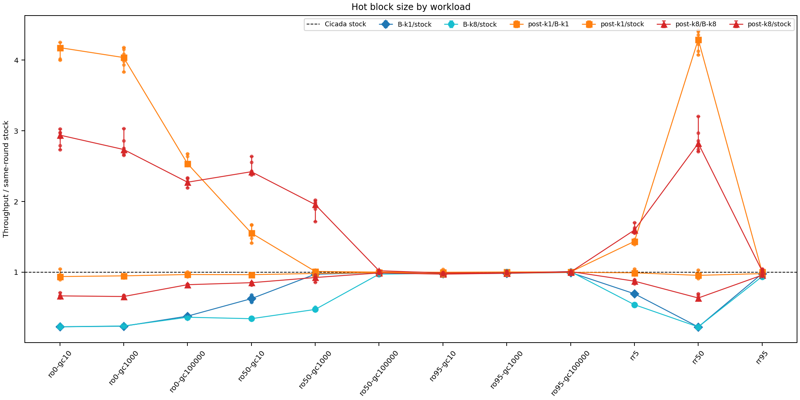
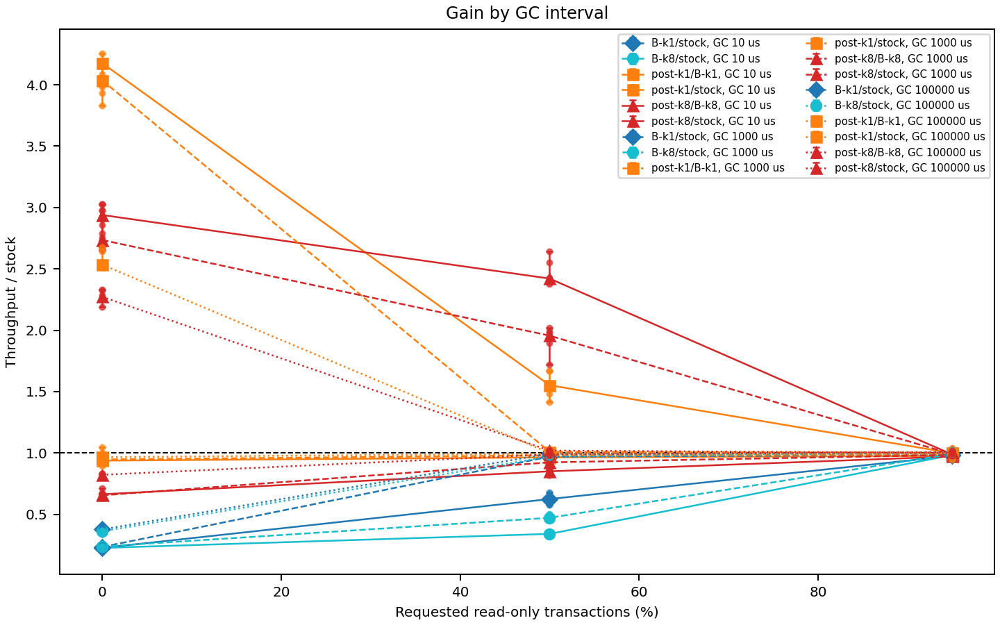
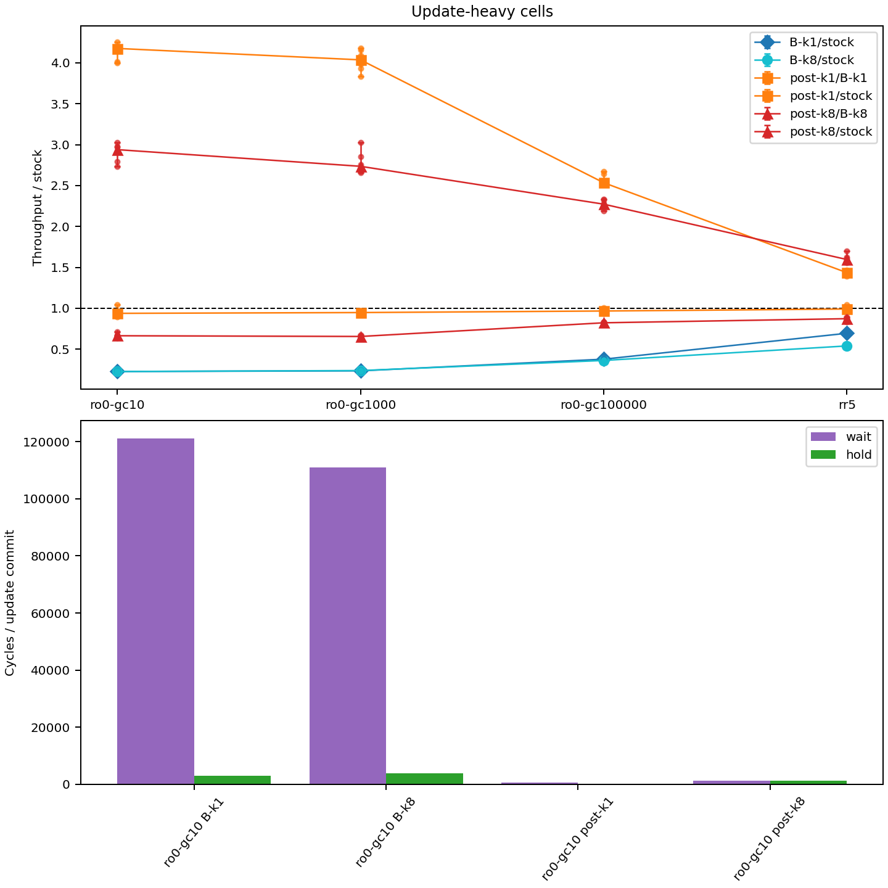
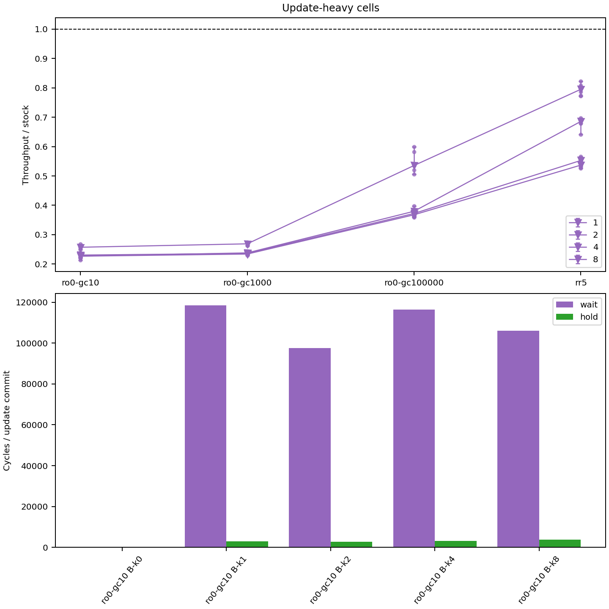

# VHash の hot block の書き込み側の排他を CAS の外へ出した設計 B-post — 更新中心の cell で同時刻の stock 比が md_23 の 0.22〜0.69 倍から K=1 で 0.94〜0.99 倍へ戻った。ro 95% は 0.97〜1.01 倍で変わらない。判定器は 5 腕 × 3 cell で巡回なし (上限 indeterminate)、壊し 4 本 × 2 cell はすべて検出・帰属 (2026-09-30)

authority: none / default_effect: no-state-change (可変状態の正本は worklog 末尾と現行 phase doc)。
wave `dev-wave-vhash-hot-block-v2` (branch `worktree-dev-wave-vhash-hot-block-v2`)、起点 local main `213d411c6` (開始 gate fresh rc 0、2026-09-30 14:5x JST)。CCBench submodule = pin C `68106660` (動かしていない)。
依頼は `/work/1/SFC/tanab/tmp/vhash-2026-09-29/md_37.txt` と同 dir の `common.txt`。job dir は `/work/1/SFC/tanab/dev-wave-jobs/dev-wave-vhash-hot-block-v2/` (Codex の prompt と報告、起動 script、変異 spec と結果の原本、集計の抜粋と表の生成 script)。
段 1〜6 の逐語は `verbatim/`、計測の raw (xz) は `raw/`、変異の spec と結果は `mutation/`、図と provenance は `figures/`。前段の一次資料は `output/insights/2026-09-29/vhash-hot-block-cicada/README.md` (md_23、以下「md_23」)。

**この資料の性能値は、正しさの判定器を通した構成 (5 腕すべて巡回なし、上限 indeterminate) の探索的な同時刻比較である。** 判定の上限が indeterminate なので「serializable」とは書かない。評価計画草稿の確認段 (主指標 = commit 当たり LLC miss) の判定ではない。

## 1. 依頼と結論

依頼 (md_37、台帳 [T-2926]・[T-2927]): md_23 の構成 B は key ごとの seqlock の中で挿入の CAS を行い hot を物理列の先頭の写しに保つ実装で、更新中心の cell で書き区間の待ちが 1 commit あたり約 10 万サイクルになり stock 比 0.23〜0.80 倍だった。H1 (hot 配置) を Cicada の中で見限る前に、書き込み側の排他を CAS の外へ出した設計を 1 度だけ測り直す。あわせて md_23 の残り 4 点 (B2 の機序、snapshot の遅れの計器、driver の estimate、fig-write) を片付ける。

結論:

1. **書き込み側の排他の待ちは外れた。** 診断計器 (別 build、1 走) で、更新中心の cell (ro 0%・GC 10 µs、rr50) の 1 update commit あたりの書き区間の待ちは、md_23 の B が 110,938〜121,209 サイクル、B-post が K=1 で 543〜565、K=8 で 1,156〜1,248 サイクル (§6)。保持も B の 2,982〜3,765 に対し B-post K=1 は 274〜276 サイクル。
2. **更新中心の cell の同時刻の stock 比は、K=1 でほぼ stock まで戻った。** B-post K=1 の中央値は ro0 の 3 cell で 0.938〜0.967、rr50 で 0.955、rr5 で 0.991、ro50-gc10 で 0.965 (§5)。同じ job・round の md_23 の B (同じ patch の再 build) は同じ cell で 0.224〜0.694 で、B-post K=1 / B-k1 の中央値は 1.4〜4.3 倍。草稿 v1 §5.5 の語では、B-post K=1 対 stock は更新中心の 6 cell のうち 5 cell で「予備的に不支持 (差なし)」、ro0-gc10 だけ「判定不能」(d_i の最小 −0.111 が −δ_ex をわずかに下回る)。
3. **K=8 は戻り切らない。** B-post K=8 の中央値は更新中心の 6 cell で 0.634〜0.873 (6 cell すべて「予備的に不支持 (悪化)」。更新中心に数えていない ro50-gc1000 は 0.924 で「判定不能」)。K=8 は Tuple が 384 byte (K=1 は 256) で、書き足しの保持が K=1 の約 4.7 倍 (1,282 対 274 サイクル)。どちらが主因かは分けていない。
4. **読み取り専用 95% の条件では、B も B-post も throughput を変えなかった。** ro 95% の 3 cell と rr95 で全 6 比の中央値は 0.939〜1.016 (24 組すべて「予備的に不支持 (差なし)」)。書き込み側の費用を外しても、読みの側の利得は現れなかった (md_23 の結論 4 と同じ向き)。
5. **正しさ:** stock・B-k1・B-k8・B-post-k1・B-post-k8 の 5 腕は T1・T2・T3 の 3 cell で巡回なし・integrity clean・判定 indeterminate。独立した 2 つの build (統合 3 と統合 4) で 2 回ずつ走らせて 2 回とも同じ (§4)。
6. **壊し 4 本はすべて判定器が巡回として検出し、壊した読みに帰属した** (post 用の B1・B2、遅れた hot を読む stale-gap、B2 の計器版、それぞれ T1・T2)。stale-gap (書き足しを 4 回に 1 回省き、読み手の隣接確認を外す) は T1 で巡回 5・帰属 4、T2 で巡回 221・帰属 13 と orphan read 193 (§4.2)。**隣接確認が遅れた hot の誤読を止めている** ことの正例である。
7. **md_23 の B2 (PENDING を飛ばす) が validation に止められなかった機序 (T-2927 (1)) は、結果前の識別規則では確定できなかった。** commit まで進んだ事象は T1 176 件・T2 5,330 件がすべて「P が validation 時に ABORTED、validation が同じ古い版に達した」(規則の A 類) で、巡回に帰属した事象も A 類 (T1 7 件・T2 20 件)。親の結果前の予測 (帰属事象は A 以外) は外れた。コードからの候補 (未検証) は §7.1。
8. **snapshot の遅れの計器 (T-2927 (2)) は µs で読めるようになった。** ro 95% の begin 時の (wts − rts) を 2^8 で割ったサイクルの中央値の bucket は、GC 10 µs で [262,144, 524,287] サイクル (約 125〜250 µs)、GC 100 ms で [33,554,432, 67,108,863] サイクル (約 16〜32 ms)。平均は各 0.36〜0.55 ms と約 51〜54 ms (§6)。
9. **論文への含意 (次の版に使える結論):** 構成 B の書き込み側の費用は hot の保守そのものではなく「挿入の CAS を排他の中で行うこと」から来ていた。CAS を外へ出し読み手の隣接確認で安全を保つ設計 B-post は、K=1 で更新中心の費用をほぼ消した。一方で読みの側の利得は ro 95% でも出ていないので、H1 (局所化で版探索が速くなる) を Cicada の中で支持する証拠はこの wave でも得られていない。hot 配置は「書き込みを遅くしない形で置ける」ことまでは示せたが、「速くする」ことは示せていない。

## 2. 設計 B-post (patch と決めたこと)

`patches/cicada-vhash-hot-block-post.patch` (md_23 の `cicada-vhash-hot-block-variant.patch` の上に重ねる overlay、新 macro なし、248 行)。md_23 の B は variant だけ、B-post は variant + post で build する。設計の択一の記録は段 4 裁定 `verbatim/s4-ruling.md`。

| 面 | md_23 の B (variant) | B-post (variant + post) |
|---|---|---|
| 挿入の位置探索と CAS | key ごとの書き区間 (seqlock の奇数区間) の中。K>0 では探索を列の先頭から | **書き区間の外**。stock と同じ (探索は `later_ver_` から、先頭 / 途中の CAS) |
| hot の更新 | CAS 成功後、同じ区間の中で物理位置 p へ shift 挿入 | CAS 成功後に**短い書き区間**を取り、(wts, ptr) を wts 降順の位置へ挿入 (列を辿らない)。満杯で最小より古ければ落とす。同じ ptr の重複は入れない。validation の中で終える |
| hot の意味 | 物理列の先頭 min(K, 長さ) 件の正確な写し | 列の中の版を wts 降順に並べた K 件以下の**手がかり** (挿入の CAS と hot への書き足しの間は、列にあって hot に無い版がありうる) |
| 読み (第 1 段) | seqlock の copy から wts ≤ trts の最初の記述子 X = ptr[i] | 同じ copy のあと、**隣接確認**: i = 0 なら `latest_ == ptr[0]`、i ≥ 1 なら `ptr[i-1]->next_ == ptr[i]` (acquire load)。成り立てば X と later_ver = ptr[i-1] を採る。外れたら stock の走査 (latest から) へ |
| cold (hot の全件が新しすぎる) | 最後の記述子から stock のループ | 同じ |
| GC | gc_lock_ → 書き区間 → trim → 切り離し → 閉じる → 再利用 | 同じ |
| 計器 (COUNT build だけ) | variant の VHashReport | 加えて `CICADA_VHASH_POST_COUNT_JSON` (隣接確認の成否、cold、fallback、CAS の再試行、書き足しの待ち・保持・件数・落とした数) |

- 条件 gate: build の条件 gate は patch 適用後のソースで exact な `#if CICADA_VHASH_*` 行の数を宣言と照合する (`orchestrator/campaign/condition_meaning_gate.py` の site 数)。overlay はこの数 (transaction.cc の K 9・COUNT 19・WL 4、tuple.hh の K 3、transaction.hh の COUNT 1・WL 1) を変えない。新しい条件付きコードは既存 block の中か複合条件に置いた。gate の登録は変えていない。
- inert: macro なしで pin と「variant + post」「variant + count-v2」「variant + post + count-v2」の `transaction.cc`・`util.cc`・`ycsb_cicada.cc` の前処理が一致 (U1 が login で確認、driver の inert receipt が build ごとに確認)。
- 別の小 overlay `patches/cicada-vhash-hot-block-count-v2.patch` は snapshot の遅れの計器だけを直す (§7.2)。全腕の COUNT build に最後に重ね、性能 build には入れない。

## 3. 遅れて更新してよい条件の論証 (依頼 1、証明ではなく stock への帰着)

B-post では、挿入の CAS が終わってから hot に書き足すまでの間、列にあって hot に無い版がありうる。読み手がそのような古い hot を見ても版選択の意味が変わらないための条件を、次の 3 点で担保した。

1. **hit では隣接確認が stock と同じ版を選ばせる。** 列は wts 降順である (挿入位置の探索は wts が大きい間だけ進み、ts は thread ID を下位 8 bit に持つので書き手間で一意)。hot の copy から選んだ X = ptr[i] (wts ≤ trts) について、確認の瞬間に ptr[i-1] の直後が X (i = 0 なら列の先頭が X) なら、ptr[i-1] より前の版はすべて wts > ptr[i-1].wts > trts なので、その瞬間の列で stock の第 1 段は X で止まり、later_ver も ptr[i-1] (i = 0 なら nullptr) になる。隙間の版 M (列にあって hot に無い、wts ≤ trts) があれば、M は ptr[i-1] と X の間に物理的に並ぶので確認が外れ、stock の走査へ落ちる。**より新しい PENDING があれば待つ** は、その版を stock の走査が見つけて第 2 段で待つことで保たれる。一致は「確認の瞬間」に限り、その後の並行挿入は stock 自身の読みと同じ並行実行の前提へ帰着する (段 3 相談 A・段 6 レビュー A で反例不成立)。
2. **cold は hot の末尾から続けてよい。** hot の全件が wts > trts のとき、末尾 ptr[n-1] より物理的に前の版は列の降順性から wts > ptr[n-1].wts > trts なので、末尾から stock のループを続けても最初の wts ≤ trts を飛ばさない (段 2 plan の「cold の反例」は hit の場合で、段 3 相談 A と段 4 裁定で refuted)。
3. **pointer の生存と再利用 (ABA)。** 最良設定は REUSE_VERSION=1 で、GC が切り離した版は同じ address のまま新しい版に使われうる (pin の `include/transaction.hh:185-189`・`:358-364`、解放はされない)。隣接確認は pointer の等値なので、X が読み手の生存中に再利用されて同じ位置へ戻ると確認が誤って通る。これが起きないことを次で論じた (`verbatim/s5-parent-notes.md`、段 6 レビュー A で反例不成立): X が再利用されるには X より新しい切り離し点 D (確定版、D.wts < MinRts ≤ 読み手の rts) が要る。rts は begin 時の MinWts − 1 で、MinWts は走行中の書き手の wts の最小なので、D の書き手は読み手の begin より前に tx を終えている。B-post の書き手は hot への書き足しを validation の中で終えるので、D は読み手の copy より前に hot に入っている (trim で消えるのはより新しい切り離し点があるときだけ、満杯で落ちるなら X も hot に居ない)。よって copy には X より前に D が居て、D.wts ≤ trts なので読み手は X を選ばない。隣接確認で読む ptr[i-1] も wts > trts なので切り離し点より新しく再利用されない。
   - **前提 (stock と共通、独立には証明していない):** MinWts / MinRts の単調性と、ThreadWtsArray / ThreadRtsArray の公開と leader の読みの memory order。INLINE_VERSION_OPT の inline_ver_ も同じ切り離し処理を通る。
4. **隣接確認なしで遅れを許す案は採らなかった。** 疎な hot で hit が隙間を越えると、ro tx は validation を持たないので古い確定版をそのまま commit できる。この案に当たる壊し stale-gap (§4.2) は実際に判定器に巡回として検出された。

この論証は判定器の結果で代用しない。判定器の結果 (§4) は別の証拠である。

## 4. 正しさ

### 4.1 設定と 5 腕の結果

trace build = pin C → `patches/instr-cicada-trace.patch` (bytes 不変、D2279) → variant (→ post) (→ 壊し)、TRACE=1、INLINE_VERSION_OPT=1・INLINE_VERSION_PROMOTION=0・REUSE_VERSION=1・WRITE_LATEST_ONLY=0・BACK_OFF=0 (md_11 の観測最良)。48 thread、`ycsb_tuple_num=200`、zipf 0.9、extime 1、group_commit 0。cell は md_23 と同じ T1 (ro 95%・GC 100 ms・rr50)、T2 (ro 50%・GC 10 µs・rr50)、T3 (md_3 の cell W: rratio 0・rmw・max_ope 5)。判定器 = `python -m verifier <dir> --json --quiet --protocol cicada ...` (判定器の production は変えていない)。

| 腕 | T1 commit (C 行) | T2 | T3 | 判定 |
|---|---:|---:|---:|---|
| stock (K=0) | 1,167,917 | 659,481 | 5,735 | 3 cell とも巡回 0・clean・indeterminate (rc 3) |
| B-k1 | 1,156,629 | 435,884 | 235,583 | 同上 |
| B-k8 | 1,142,178 | 432,856 | 215,276 | 同上 |
| B-post-k1 | 1,158,101 | 588,305 | 4,512 | 同上 |
| B-post-k8 | 1,137,066 | 516,939 | 5,887 | 同上 |

(値は統合 4 の build の trace job 0・1 の raw (job 0 は 23 MB あるので repo に置かず job dir の `rawxz/run2-raw-trace-0.json.xz`、job 1 は `raw/run2-raw-trace-1.json.xz`)。統合 3 の build でも同じ 15 走を走らせ、全走で巡回 0・clean・indeterminate だった (job dir の `rawxz/run1-raw-trace-0.json.xz`、job 1 は run1 の原本 `/work/SFC/tanab/tmp/vhash-hot-block-v2-2026-09-30/out/run1/raw-trace-1.json`)。両 build で variant と post の patch bytes は同じ。**失格の腕は無い。**)
T3 の commit 数は B (21.5 万〜23.6 万) が stock・B-post (4,512〜5,887) より約 40 倍多い。trace build の 1 走の値で性能値ではない。md_23 §3.2 も同じ向き (stock 6,676 対 K>0 22.7 万〜26.9 万) を記録している。B の書き区間が rmw の集中する 200 tuple で CAS の衝突を減らした可能性があるが、確かめていない。

### 4.2 壊し 4 本 (post の上 K=8、B2 計器版は md_23 の B の上 K=4、無条件 patch、trace build)

| 壊し | cell | 判定 | 巡回数 | reached / changed / committed | 帰属 witness | integrity | 分類 |
|---|---|---|---:|---|---:|---|---|
| post-B1 `broken-cicada-vhash-post-stale-hot.patch` (ro の hot 採用で物理の直後の確定版を返す) | T1 | non-serializable | 5 | 173,097 / 173,097 / 173,097 | ≥1 | clean | 検出・帰属 (clean) |
| post-B1 | T2 | non-serializable | 9,893 | 65,080 / 65,080 / 65,080 | ≥1 | orphan read 844 | 検出・帰属 (integrity 違反あり) |
| post-B2 `broken-cicada-vhash-post-skip-pending.patch` (選んだ PENDING 版を待たずに次の確定版へ) | T1 | non-serializable | 6 | 1,823 / 1,819 / 76 | 6 | clean | 検出・帰属 (clean) |
| post-B2 | T2 | non-serializable | 684 | 255,914 / 255,544 / 4,369 | 20 | clean | 検出・帰属 (clean) |
| stale-gap `broken-cicada-vhash-post-stale-gap.patch` (書き足しを 4 回に 1 回省き、読み手の隣接確認を外す) | T1 | non-serializable | 5 | 280,404 / 248,545 / 19,641 | 4 | clean | 検出・帰属 (clean) |
| stale-gap | T2 | non-serializable | 221 | 283,648 / 241,578 / 32,289 | 13 | orphan read 193 | 検出・帰属 (integrity 違反あり) |
| B2 計器版 `broken-cicada-vhash-skip-pending-probe.patch` (md_23 の B2 + 記録) | T1 | non-serializable | 6 | 4,418 / 3,154 / 176 | 6 | clean | 検出・帰属 (clean) |
| B2 計器版 | T2 | non-serializable | 199 | 168,141 / 114,317 / 5,330 | 20 | clean | 検出・帰属 (clean) |

- 帰属規則は md_3・md_23 と同じ (判定器が出す代表 witness (最大 20 件) の rw 辺が、事象の txn・key・読んだ版に一致)。post-B1 の帰属 witness 数は driver の B1 用の要約が数を出さないので「≥1」と書いた (分類の条件は witness ≥ 1)。
- stale-gap の書き足しの省略は T1 61,155 回・T2 84,541 回。changed は「比較直後に latest から stock 第 1 段を辿った版と違う」読みで、比較の前後で列の先頭が変わったものは確定させず undetermined に数える (両 cell とも 0)。ro の読みでは比較中に wts ≤ rts の版が列に入らないので changed は正確で、update の読みでは下限 (段 6 裁定 2 の F1)。
- 再利用中の版 (status unused) を掴んだ読みは dead と数えて stock の走査へやり直す (段 6 裁定 3)。dead は post-B1 T1 0・T2 1、stale-gap 0・0。post-B1 の「物理の直後の確定版」は、選んだ版が GC の切り離し点のとき、切り離されて再利用された版を指しうる (段 6 裁定 2 の F2、md_23 の B1 も同じ性質)。T2 の orphan read はこの経路と矛盾しないが、確かめていない。
- **統合 3 の build では stale-gap の T1・T2 と post-B1 の T2 が driver の 1 走 180 s の打ち切り (rc 124) になった** (§9)。統合 4 で上の dead の扱いを足して取り直した値が上の表。

## 5. 結果: throughput の同時刻比 (6 round の中央値 [最小, 最大])

### 5.1 計測の設定

- 計算ノード: Pegasus gen_S (48 core)、node 専有。各 job の冒頭と各 run の前に他の ycsb/bench process が無いことを記録 (全 job で 0 件)。perf 3 job は bnode064・bnode068・bnode072 の 3 node に同時投入 (job ごとに別の detached 計測木から投入)。count は bnode072、統合 4 の trace job 0 は bnode068。
- build: 1 job (統合 3 = 69f7033dc、19 binary、291 s) で作り、他の job は manifest の sha256 と ldd の解決先・依存 file の sha256 を照合して同じ binary を使った (全 job で `shared-verified`)。性能 build は TRACE=0・ADD_ANALYSIS=0・COUNT なしを compile command で検査。
- 共通 argv: md_23 と同じ (`-thread_num=48 -ycsb_tuple_num=1000000 -ycsb_zipf_skew=0.9 -ycsb_max_ope=10 -ycsb_rmw=0 -extime=3 -clocks_per_us=2100`、cell ごとに `-ycsb_rratio`・`-gc_inter_us`・`--vhash_ronly_pct`)。build 定数は §4.1 と同じ (md_11 の観測最良)。
- 格子: md_23 と同じ 12 cell (ro 指定率 {0, 50, 95}% × gc_inter_us {10, 1000, 100000}、通常 YCSB の rr5 (gc 100)・rr50 (gc 100)・rr95 (gc 10))。**「snapshot の古さ」の軸は GC 間隔で代用した** (md_23 §4 と同じ限定)。
- 同時刻対照: 1 job の中で 12 cell × 5 腕を round ごとに回し、腕の順は round と cell で回転。3 job × 2 round = 6 round。比は同じ job・同じ round・同じ cell・同じ node の B/stock・post/stock・post/B。**有意とは書かない (探索段)。** node の差と腕の効果は分けていない (比は同じ node 内の対)。
- 観測者効果の分離 (規律 1): 性能値は trace も計器も無い build。§4 の trace build・§6 の COUNT build は別 build・別 run。

### 5.2 表

| cell | B-k1/stock | B-k8/stock | post-k1/stock | post-k8/stock | post-k1/B-k1 | post-k8/B-k8 |
|---|---|---|---|---|---|---|
| ro0-gc10 | 0.227 [0.220, 0.251] | 0.227 [0.214, 0.261] | 0.938 [0.895, 1.046] | 0.664 [0.636, 0.713] | 4.177 [4.003, 4.254] | 2.939 [2.735, 3.028] |
| ro0-gc1000 | 0.235 [0.224, 0.247] | 0.238 [0.221, 0.241] | 0.948 [0.922, 0.964] | 0.655 [0.633, 0.676] | 4.037 [3.834, 4.182] | 2.736 [2.655, 3.030] |
| ro0-gc100000 | 0.378 [0.367, 0.387] | 0.362 [0.351, 0.367] | 0.967 [0.936, 1.004] | 0.823 [0.803, 0.831] | 2.535 [2.512, 2.674] | 2.273 [2.192, 2.334] |
| ro50-gc10 | 0.625 [0.575, 0.679] | 0.341 [0.324, 0.356] | 0.965 [0.961, 0.977] | 0.851 [0.819, 0.859] | 1.553 [1.414, 1.672] | 2.421 [2.378, 2.640] |
| ro50-gc1000 | 0.971 [0.940, 1.012] | 0.472 [0.456, 0.507] | 0.981 [0.956, 1.021] | 0.924 [0.855, 0.962] | 1.010 [1.002, 1.030] | 1.956 [1.718, 2.021] |
| ro50-gc100000 | 0.994 [0.991, 0.998] | 0.972 [0.966, 0.976] | 0.995 [0.992, 1.003] | 0.989 [0.981, 0.995] | 1.000 [0.998, 1.008] | 1.020 [1.009, 1.023] |
| ro95-gc10 | 0.977 [0.948, 0.984] | 0.984 [0.979, 0.987] | 0.977 [0.946, 0.986] | 0.972 [0.966, 0.978] | 0.999 [0.961, 1.040] | 0.988 [0.979, 0.999] |
| ro95-gc1000 | 0.984 [0.981, 1.007] | 0.993 [0.974, 1.025] | 0.987 [0.961, 1.015] | 0.985 [0.979, 1.017] | 1.003 [0.979, 1.008] | 0.991 [0.982, 1.015] |
| ro95-gc100000 | 0.995 [0.992, 1.000] | 1.007 [1.001, 1.008] | 0.997 [0.997, 1.000] | 1.008 [1.001, 1.011] | 1.003 [0.998, 1.005] | 1.001 [0.994, 1.007] |
| rr5 | 0.694 [0.670, 0.715] | 0.540 [0.525, 0.555] | 0.991 [0.960, 1.046] | 0.873 [0.837, 0.893] | 1.435 [1.394, 1.463] | 1.596 [1.556, 1.701] |
| rr50 | 0.224 [0.220, 0.233] | 0.225 [0.215, 0.234] | 0.955 [0.912, 1.030] | 0.634 [0.612, 0.693] | 4.293 [4.073, 4.424] | 2.823 [2.708, 3.208] |
| rr95 | 0.979 [0.974, 0.990] | 0.939 [0.917, 0.959] | 0.979 [0.978, 1.000] | 0.958 [0.941, 0.967] | 1.004 [0.998, 1.010] | 1.016 [0.998, 1.044] |

(値は集計 `raw/agg2-aggregate-head.json.xz` の `cells` (各 6 点)、表は job dir の `extract/perf-table.tsv`。B の列は md_23 と同じ patch の再 build で、md_23 §5 の同じ cell の値 (例: ro0-gc10 の K=1 0.227、rr50 の K=1 0.229) とほぼ同じだった。)

### 5.3 草稿 v1 §5.5 による予備的な判定語

草稿 `docs/vhash-evaluation-preregistration-draft.md` v1 §5.5.0 の規則 6〜9 (δ_ex = ln(1.10) = 0.0953、d_i = ln 比を同じ job・round で対に、n = 6) を全点へ機械的に当てた (出力は `judge-55.txt`、script は repo 外の job dir `judge_55.py`)。本 wave は A/A 腕を持たないので「予備的に支持」は出せず、全 round で改善側でも「判定不能 (A/A なし)」になる。主 cell c23 (ro 95%・GC 100 µs) は測っておらず欠測 (近い cell へ切り替えない)。

| 比較 | 語 | 組 |
|---|---|---|
| post-k1 対 stock | 予備的に不支持 (差なし) | ro0-gc1000・ro0-gc100000・ro50 の 3 cell・ro95 の 3 cell・rr5・rr50・rr95 の 11 組 |
| post-k1 対 stock | 判定不能 | ro0-gc10 (d_i の最小 −0.111 が −δ_ex を下回り、最大 +0.045) |
| post-k8 対 stock | 予備的に不支持 (悪化) | ro0 の 3 cell・ro50-gc10・rr5・rr50 の 6 組 |
| post-k8 対 stock | 判定不能 | ro50-gc1000 |
| post-k8 対 stock | 予備的に不支持 (差なし) | ro50-gc100000・ro95 の 3 cell・rr95 の 5 組 |
| post-K 対 B-K (同じ K) | 判定不能 (A/A なし)、全 round で改善側 | K=1: ro0 の 3 cell・ro50-gc10・rr5・rr50 の 6 組、K=8: 同じ 6 組と ro50-gc1000 の 7 組 |
| post-K 対 B-K | 予備的に不支持 (差なし) | K=1: ro50-gc1000・ro50-gc100000・ro95 の 3 cell・rr95 の 6 組、K=8: ro50-gc100000・ro95 の 3 cell・rr95 の 5 組 |
| B-K 対 stock | md_23 と同じ向き | 更新中心は「悪化」、ro95・rr95・ro50-gc100000 は「差なし」 (表は `judge-55.txt`) |

組の数: 12 cell × 6 比 = 72 組。組ごとに独立に語を付けており、束ねた主張はしない。これは検定ではない (n = 6)。

**読み方 (fig-k)。** 横軸が cell、縦軸が同じ round の比。菱形・丸 (青系) が md_23 の B、四角 (橙) が B-post K=1、三角 (赤) が B-post K=8。**同じ色の 2 本の線は「対 stock」(1.0 付近以下) と「対 B」(1 より大きい) の 2 つの比で、凡例では区別しにくい。** 数は §5.2 の表で読む。

**読み方 (fig-ro)。** 横軸が ro 指定率、線種が GC 間隔。ro 比率を上げると全腕の比が 1.0 に近づく。**言えないこと:** ro 比率を変えると update の数・版の生成・abort も同時に変わるので、この図は ro 比率の因果効果ではない (md_23 と同じ限定)。

**読み方 (fig-write)。** 上段は更新中心の 4 cell の比。下段は ro0-gc10 の COUNT 走での、1 update commit あたりの書き区間の**待ち** (紫) と**保持** (緑)。B-post の棒は B に比べて小さく線形軸ではほぼ見えない (数は §6 の表)。

**読み方 (md23-fig-write、T-2927 (4))。** md_23 の集計 (`output/insights/2026-09-29/vhash-hot-block-cicada/raw/aggregate.json.xz`、展開後 sha256 `d4bc6b89e722dd595ec864bfec23a1ef1de81fdcf6977355027c14d9e33114af`) から現行の作図 (fig-write だけ v1 の集計も読む) で生成し直した。下段に md_23 が描いていなかった**待ち**を足した。上段の凡例は K の数字だけ (v1 の集計には腕の名が無い)。md_23 の dir の図は書き換えていない。

## 6. 診断計器 (COUNT、別 build、各 1 走、性能値ではない)

| cell | 腕 | tps (COUNT build) | 待ち / upd commit | 保持 / upd commit | 隣接確認 成功 | 失敗 (先頭 / 途中) | cold | seq 奇数・変化で stock へ | CAS 再試行 / upd commit | 書き足しを落とした数 | sizeof(Tuple) |
|---|---|---:|---:|---:|---:|---|---:|---|---:|---:|---:|
| ro0-gc10 | B-k1 | 678,088 | 121,209 | 3,026 | − | − | − | − | − | − | 256 |
| ro0-gc10 | B-k8 | 722,344 | 110,938 | 3,765 | − | − | − | − | − | − | 384 |
| ro0-gc10 | post-k1 | 3,018,301 | 565 | 276 | 74,213,899 | 382,409 / 0 | 907,101 | 1,070,704 / 4,432 | 0.043 | 2,689,392 | 256 |
| ro0-gc10 | post-k8 | 2,552,489 | 1,248 | 1,287 | 62,809,665 | 176,170 / 11,816 | 7,109 | 2,881,027 / 403,153 | 0.046 | 51,627 | 384 |
| ro0-gc10 | stock | 3,487,554 | 0 | 0 | − | − | − | − | − | − | 256 |
| rr50 | B-k1 | 692,702 | 118,250 | 2,982 | − | − | − | − | − | − | 256 |
| rr50 | B-k8 | 735,176 | 109,405 | 3,731 | − | − | − | − | − | − | 384 |
| rr50 | post-k1 | 3,095,165 | 543 | 274 | 75,961,963 | 368,809 / 0 | 977,536 | 1,022,395 / 4,431 | 0.041 | 2,759,377 | 256 |
| rr50 | post-k8 | 2,598,806 | 1,156 | 1,282 | 63,671,689 | 180,895 / 12,474 | 17,771 | 2,759,333 / 378,593 | 0.045 | 49,378 | 384 |
| rr50 | stock | 3,653,368 | 0 | 0 | − | − | − | − | − | − | 256 |
| ro95-gc10 | post-k1 | 12,520,999 | 226 | 171 | 297,814,002 | 12,180 / 0 | 65,648,249 | 273,499 / 732 | 0.002 | 48,698 | 256 |
| ro95-gc10 | post-k8 | 12,465,919 | 243 | 778 | 339,570,189 | 10,732 / 479 | 21,612,155 | 926,777 / 62,443 | 0.002 | 492 | 384 |
| ro95-gc100000 | post-k1 | 3,165,404 | 199 | 151 | 51,509,653 | 408 / 0 | 40,291,495 | 8,730 / 59 | 0.001 | 3,331 | 256 |
| ro95-gc100000 | post-k8 | 3,178,518 | 203 | 712 | 68,923,526 | 424 / 0 | 23,220,394 | 42,655 / 1,433 | 0.000 | 12 | 384 |

(値は集計の `count` (各腕の COUNT JSON と POST JSON を thread で合算)、表は job dir の `extract/count-table.tsv`。サイクルは rdtscp の和を update commit 数で割った値。B の待ち・保持は variant の install 区間 (探索と CAS を含む)、B-post は CAS 後の書き足しの区間。ro95 の B と stock の行と飛ばした版数の分布は `count-table.tsv` にある (md_23 §6 と同じ向き: GC 100 ms の ro95 で 0 版 56%、16 版以上 21%)。)

- **待ちの消失:** 更新中心の 2 cell で、B の待ち 109,405〜121,209 サイクルに対し B-post は 543〜1,248 サイクル。md_23 が主因とした待ちは CAS を排他の外へ出すと約 90〜220 分の 1 になった (K=8 で 89〜95 倍、K=1 で 215〜218 倍の差)。
- **隣接確認の失敗は少ない:** 更新中心の cell で hit の約 0.3〜0.5% が先頭で外れた。途中で外れたのは K=8 だけ (約 0.02%)。
- **K=1 で書き足しを落とした数が多い** (更新中心で約 270 万回): K=1 は新しい版が常に先頭なので、古い版の書き足しが遅れて届くと落ちる。落ちても列と hot の一致は隣接確認が見るので正しさには関係しない。
- **snapshot の遅れ (T-2927 (2)):** ro tx の begin 時の (wts − rts) >> 8 サイクルの 42 bucket の中央値は、ro95-gc10 で [262,144, 524,287] サイクル (clocks_per_us 2100 で約 125〜250 µs)、ro95-gc100000 で [33,554,432, 67,108,863] サイクル (約 16〜32 ms)。平均 (合計 / 件数 / 2100) は ro95-gc10 で 362〜552 µs、ro95-gc100000 で 51,201〜54,475 µs。**µs は timestamp の clock (rdtscp、thread ごとの clock boost と clock のずれを含む) からの換算で、壁時計の時間そのものではない。**

## 7. md_23 の残り (T-2927)

### 7.1 (1) B2 が validation に止められなかった機序

B2 計器版 (md_23 の B + B2 の変更 + 記録、K=4) を T1・T2 で 1 走ずつ走らせ、changed の事象ごとに read 時・validation 時・終了時の記録を事象 ID で結んだ。結果前の識別規則 (段 4 裁定 §3.1: R = ro、A = update で P が validation 時に ABORTED かつ validation が同じ古い版に達した、G = P の wts が read 時と validation 時で違う、M = P が COMMITTED なのに validation が同じ古い版に達した、V = 達した版が違う、U = それ以外) で分類した。

| cell | commit まで進んだ事象 | 巡回に帰属した事象 |
|---|---|---|
| T1 | A 176 (他の類 0) | A 7 |
| T2 | A 5,330 (他の類 0) | A 20 |

- **結果前の予測 (段 4 裁定 §3.1): 「committed の過半は A、巡回に帰属した事象は A 以外 (R か G)」。前半は当たり、後半は外れた。** R (ro の rts 以下に PENDING が来る) は 0 件で、md_23 §3.3 の候補「ro tx の rts と進行中の書き手の wts の関係」は、この 2 走では現れなかった。
- **規則の A は「結果として正しい読み」を意味しなかった。** A 類の事象が巡回に帰属しているので、「P が abort し、validation が同じ版に達した」だけでは誤読でないとは言えない。
- **コードからの候補 (未検証):** B2 は読みの `later_ver` を飛ばした P に置き換える。validation (a) は `later_ver` から辿り始めるので、読みの後に P より新しく元の直前の版より古い位置へ挿入された確定版 W (wts が P と読み手の wts の間) は、validation の走査範囲 (P から下) に入らない。stock なら元の `later_ver` (W より上) から辿って W を見つけ abort する。md_23 の結果前の予測は「validation (a) が later_ver = 飛ばした版から辿り直す」ことを止める根拠にしていたが、開始点を下げたこと自体が検査の穴になる、という説明と観測 (commit したのは A 類だけ、R 0) は矛盾しない。W の実在は記録していないので確かめていない。確かめるには validation (a) の時点で元の `later_ver` と P の間にある版を数える計器が要る。

### 7.2 (2) snapshot の遅れの計器の単位

md_23 の計器は ts の差 (wts − rts) を 2^16 ts まで 18 bucket で数え、全件が最上位に入った。ts は `localClock << 8 | tid` (`include/time_stamp.hh`) なので 2^16 ts は 256 サイクルにすぎなかった。`patches/cicada-vhash-hot-block-count-v2.patch` で (wts − rts) >> 8 をサイクルとし、0 と [2^j, 2^(j+1)−1] (j = 0..39) と 2^40 以上の 42 bucket、合計と件数を出す (COUNT JSON の schema_version 2)。µs への換算は bucket 境界 / clocks_per_us。結果は §6。driver の集計は v1 の COUNT を受理しない (md_23 の raw を読み直す必要があるときは md_23 の commit の driver を使う)。

### 7.3 (3) driver の estimate

trace job の所要を「多い方の走数 × 2」から「2 job の走数の和」に直し、全計算 job (smoke・build・perf・count・trace、変異・焦点走の見込み) の和を 7,200 s と比べる形にした。smoke (統合 2、351 s) の実測から、6 round・12 cell・5 腕で合計 3,659 node 秒と見積もり、縮小なしで投入した (`estimate-smoke1.json`)。実績は §8。trace job 0 は見積り 309 s に対し統合 3 で 859 s (打ち切り 3 走 × 180 s を含む)、統合 4 で 385 s だった。

### 7.4 (4) 図

fig-write の下段に待ちと保持を横並びで描くようにした (§5 の fig-write と md23-fig-write)。

## 8. 計算量 (この wave が計算ノードへ投げた全 job、NQSV の Elapse)

| job | node 秒 | 結果 |
|---|---:|---|
| 焦点走 (統合 1・3・4) | 166 + 133 + 135 | 統合 1: 2,430 passed / 1 failed (test の比の完全一致、統合 2 で直した)、統合 3: 509 passed、統合 4: 511 passed (各 2 skipped)。統合 2 の焦点走 (172 passed) は login で走り job の記録なし |
| smoke (統合 2) | 351 | 成功 |
| build (統合 3 / 統合 4) | 291 / 279 | 19 binary |
| perf 0 / 1 / 2 | 521 / 518 / 519 | 成功、別々の 3 node |
| count | 86 | 成功 |
| trace 0 / 1 (統合 3) | 859 / 23 | trace 0 の壊し 3 走が打ち切り (§9) |
| trace 0 / 1 (統合 4) | 385 / 23 | 成功 |
| 集計 (1 回目 / 2 回目) | 9 / 32 | 1 回目は壊しの打ち切りで停止 |
| 変異 probe / final (統合 3)、probe2 / final2 (統合 4) | 448 / 455 / 499 / 497 | §10 |

計測・集計 3,896 node 秒 (smoke 351 + build 291 + 279 + perf 1,558 + count 86 + trace 859 + 23 + 385 + 23 + 集計 9 + 32) + 変異と焦点走 2,333 node 秒 (焦点走 434 + 変異 448 + 455 + 499 + 497) = 6,229 node 秒 (約 1.73 node 時間)。受入全走の所要は worklog 側の記録。依頼の上限 2 node 時間未満。

## 9. 途中で起きたことと直したこと

- **統合 3 の計測で、壊し 3 走 (stale-gap の T1・T2、post-B1 の T2) が driver の 1 走 180 s の打ち切り (rc 124) になり、集計が `invalid broken trace run` で止まった。** 正例の 15 走は完走していた。コードから、再利用中 (status unused) の版を掴んだ読みが第 2 段の待ちから出られない経路と、post-B1 が確定版に当たるまで next_ を辿る走査を推定し (実測での確認はしていない)、壊しの側で「条件を先に確かめて 1 段だけ見る」「unused / invalid を dead と数えて stock へやり直す」「stale-gap は X の wts を確かめる」を足した (段 6 裁定 3)。driver は壊しの打ち切りを分類 hung (判定なし) として記録するようにした (正例の打ち切りは従来どおり集計を止める)。統合 4 で build と trace を取り直し、8 走とも完走した。perf と count の raw は perf / count の binary の patch が変わらないので統合 3 の build のものを使い続けた。
- **実装子 U2 が driver の旧 test 24 本のうち 23 本を消して 20 本を新設した** (報告に「旧テストの一部を移植していない」と自己申告)。親が変更前後の test 名の集合を比べて見つけ、旧名のまま性質を移植させた。
- **焦点走 1 回目の赤 1 件**: 移植で `pytest.approx(11)` が完全一致に変わっていた (test 側の誤り)。
- **U1 の fix 子 1 本が model の容量不足 (`Selected model is at capacity`) で報告を書かずに終わった。** 起動器が残差を commit していたので、継続子に監査させて回収した。
- **段 6 レビュー 2 本 (NO-GO)・焦点再レビュー 1 本 (NO-GO)**: 採用した所見は B2 の旧予測の除去、probe と event の多重集合での照合、stale-gap の比較の確定、post-B1 の物理の直後、作図の保存の誤り、図の腕の区別。焦点再レビューの F1・F2 は反例を否定する論証を書いて限界として記録した (`verbatim/s6-ruling-2.md`)。

## 10. 検査と変異

- 変異 (driver と作図の fail-closed、`mutation/`): 独立 clone を対象 commit に固定し、`--task mutation` で計算ノードの 1 job に束ねて走らせた。期待 node は probe (全件 SURVIVED 期待で観測 node を集める走) で集めた完全集合。統合 3 (69f7033dc) の本走: baseline PASSED、M0 (docstring だけの等価変異) SURVIVED、M1〜M13 の 13 本すべて期待した node の完全集合で KILLED (455 s)。統合 4 (88913785b) の probe2: M14 (正例の rc 124 を受理)・M15 (DEAD 行が無くても受理) を加えた 15 本がすべて赤、M0 は生存。統合 4 の本走 final2 (spec sha256 `a809301988e0903711f1305e2ea068b33fe158b586a5a0355b1c90422d254c17`): baseline PASSED、M0 SURVIVED、M1〜M15 の 15 本すべて期待した node の完全集合で KILLED、16 / 16 一致 (497 s)。spec・結果・期待 node は `mutation/`。
- C++ の hot の保守そのものの検出力は壊し 4 本 (§4.2) で示した (変異 harness の対象ではない)。

## 11. 確かめたこと・確かめていないこと

確かめたこと:
- B-post (K = 1, 8) と B (K = 1, 8) と stock が、3 つの trace cell で判定器を通った (巡回なし、上限 indeterminate)。2 つの build で 2 回ずつ。壊し 4 本は 2 cell ずつ巡回として検出・帰属した。
- 同時刻の stock 対照つきで、12 cell × 4 腕の throughput 比 (各 6 round) と、代表 4 cell の診断計器の値。
- 書き区間の待ちが CAS を外へ出すと約 90〜220 分の 1 になること (COUNT 計器、1 走)。

確かめていないこと:
- 「serializable」の主張 (判定の上限は indeterminate)。§3 の論証は stock と共通の寿命前提 (MinWts / MinRts の単調性、公開の memory order) に依存し、それを独立に証明していない。
- K=8 が戻り切らない理由 (Tuple 384 byte、書き足しの保持、seq の奇数での fallback のどれが効くか)。K = 2, 4 は測っていない。
- B-post K=1 が更新中心で stock にわずかに届かない (中央値 0.938〜0.991) 理由。書き足しの CAS が `latest_` と同じ cache line を奪い合う可能性は段 3 相談 B が指摘したが測っていない。
- 草稿 H1 の主指標 (commit 当たり LLC miss)。perf 計測はしていない。主 cell c23 と A/A 腕も無い。
- B2 の機序 (§7.1 の候補は未検証)、post-B1 T2 と stale-gap T2 の orphan read の機序、壊しの打ち切りの原因 (推定のみ)。
- snapshot の古さそのものの効果 (軸は GC 間隔で代用、長い ro tx は入れていない)。TPC-C・scan・insert / delete を含む負荷。

## 12. 次の一手 (論文と実装)

1. B-post K=1 を構成 B の代表として、H1 の確認段 (主指標 = commit 当たり LLC miss、主 cell c23、A/A 腕) を設計する。読みの利得が ro 95% でも出ていないので、確認段の前に「hot が省く pointer 追跡が全体に占める割合」を見積もる (md_23 §6 の飛ばした版数の分布と本 wave の hit・cold の件数から)。
2. B2 の機序 (§7.1) を、validation (a) の時点で元の `later_ver` と P の間にある版を数える計器で確かめる。
3. 図の改善: fig-k で「対 stock」と「対 B」を線種で分け、fig-write の下段を対数軸にする (現行は表で読む必要がある)。

## 13. 再現

- 計測木: detached worktree を tip `69f7033dc` (build・perf・count、trace の 1 回目) と `88913785b` (build と trace の 2 回目) に置き、`python3 tools/pegasus/dispatch_compute.py --task generic --walltime HH:MM:SS --queue-wait-timeout 3600 --overall-grace 3900 -- python3 -m orchestrator.campaign.vhash_cicada_hot_block <smoke|build|perf --job-index i|count|trace --job-index i> --third-party-cache /work/1/SFC/tanab/izanagi-thirdparty-cache --scratch-root <dir> --output <out dir>`。同じ木から dispatch を並列にしない (perf 3 job は 3 本の木から)。
- 集計: `python3 -m orchestrator.campaign.vhash_cicada_hot_block aggregate --raw <run1 の raw-perf-0..2 と raw-count-0> <run2 の raw-trace-0・1> --out <dir>` (計算ノードで 32 s、出力 643 MB)。表と作図用の抜粋は job dir の `extract_cells.py` (aggregate.json から cells・count・broken などの最上位 key だけを行範囲で切り出す)。作図: `python3 tools/plotting/plot_vhash_cicada_hot_block.py <aggregate-head.json> --out figures`。判定語: job dir の `judge_55.py`。raw は `xz -dk raw/*.xz` で戻す。
- raw の原本の sha256 (xz 展開後、原本は `/work/SFC/tanab/tmp/vhash-hot-block-v2-2026-09-30/out/`): run1 の `manifest.json` `dfd39a4428c9db970395a4247250b5518fd0e8be93b9d4d003468bbeffd914de`、`raw-perf-0.json` `b0ccfb56063ada4e1afee3e6bcd2cbf6571234513c85bb510b6bcfa8a8c062b1`、`raw-perf-1.json` `9cf46c7ee037f109a1d1a78775d83280a00aa0a30fa3c5aa34f1b6dfe926d96f`、`raw-perf-2.json` `46b3feb06d4df4662e51e046b36e0c8f4a11f6a4e6435d573cb22bb8267f5424`、`raw-count-0.json` `cddf3c99cad092317dfdd2f3786e33efe53da02ce9b69a17f70c79f2a6d83e23`、`raw-trace-0.json` (打ち切りを含む 1 回目、repo 外) `31f16ee4c5c5c5eb1e2dc477d8c59e1cae62fefec85d4dbd508f6b2da9832f2a`。run2 の `manifest.json` `34329cdd06081f5d2c09484b9616f92704aba91bd2758fc8dfb4f52f04ae37e1`、`raw-trace-0.json` (repo 外) `6c250cac4f57708bde6c061cb75c0fb2f980955a97d550cf22d4553d2e92fc35`、`raw-trace-1.json` `1d65e25d435c60e37cf4b7916355d1726ba6434f12f49c3702980fc68f3ba03f`。smoke `smoke.json` `d1ff90c23857ed91446ce84fba58bc1b2158efbe93fd7efd2b7ebd99aa5a56eb`。集計の全体 `aggregate.json` (643 MB、repo 外、job dir に xz 23 MB) `73fd34eda4ff71a34ec9a16f022c7797eb3e09efc0a80aafc9b64b0ee3d03ee6`、その抜粋 `aggregate-head.json` (`raw/agg2-aggregate-head.json.xz`) `e35b7d5d15ca0d5591a637bb8abc344622b6f1f574447be8bc42486dfa45d782`。
- 逐語の正規化 (DW-S07、可視文字は不変): `verbatim/s6-review-b.md` は Markdown の強制改行の行末 2 空白 (12 行・24 byte) を除いた。原文は job dir の `review-b.md` (2,749 byte、sha256 `0a6212e08b9c975adaf3a41983dc9e32cbf169505f1cecde01eb24c432f0afdd`)、正規化後は 2,725 byte (`bb7d886baa7762a28ca46e0ce6e166863acddb81f1255808066a6ffbc13d0a10`)。復元は原文を写し直すか、該当 12 行の行末へ空白 2 つを戻す。
- repo 外の生成 script (job dir、sha256): `extract_cells.py` `3da145e3…`、`count_table.py` `6606b692…`、`judge_55.py` `bfb49572…`、`make_mutation_spec.py` (M14・M15 を足した最終版、job dir)。
