# 既読を保つ前進を回収境界へ反映する — 長い transaction が止める MVCC の版回収を縮める (本文第 2 稿)

> **この第 2 稿の地位 (最初に読む)。**
>
> - **題名と主張の重心は案 2 で確定している** (D2322 項 1、2026-09-30 のユーザー裁定「推奨通りで」)。前進を回収境界へ反映する保持の側 (U0) を芯にし、
>   cold への進入を前進の契機にする U1 は同じ論文に残す。題名の文言は本稿の案で、題名が U0 の既知の目的 (長い tx が止める回収を縮めること) と既知の境界規則まで新規と読ませないようにした。
>   VHash 論文の効果は、izanagi の CC 自動合成の主経路の成果としては数えない (D2322 項 1)。
> - **初稿 (`output/insights/2026-09-30/vhash-manuscript-draft/README.md`、md_38) の後に着地した一次資料 6 本 (md_18・md_29・md_31・md_32・md_34・md_36) と D2322 で、
>   初稿の空欄のうち着地済みの分を埋め、現況と食い違う記述を直した稿である。** 初稿は書き換えていない。直した箇所は下の「初稿からの主な変更」と付録 E に一覧した。
> - **新しい計測・探索・実装・論証は 1 つも足していない (0 node 時間)。** 数値・件数・「無い」という主張は、すべて下の略称表の一次資料に遡れるものだけを写した。
>   論文ストーリー 3 版目 (`docs/paper-story-vhash/2026-09-30.md`) は章立てと過大主張チェック (§15) の手がかりに使い、数値の出所にはしていない。
> - **性能値と計器の値はすべて「未検証の診断値」である。** Cicada に対する判定はすべて「巡回 0、判定の上限は indeterminate」で、certified ではない。
>   記録の水準を上げる中間案 M (D2305 項 4) は起点で未実装である。確認段 (評価計画の「支持 / 不支持」を出す段) は 1 つも走っていない。
>   **値はすべて、それを取った時点のコードと設定での観測として残す** (絶対規律 7)。md_36 が構成 E の試作は論証の仮定を満たさない箇所があると示した後も、md_14・md_21・md_31 の値は消さない。弱まるのは「実装が定理の前提を満たした」という解釈だけである (D2326 項 5)。
> - **印の意味。** 【確認段で差し替え】= 評価計画 (草稿 v1、未発効) の確認段の走行で置き換える値・文。【空欄: md_N】= 並走中の wave の結果が入る箇所 (本稿は結果を待たず、中身を書いていない)。
>   第 2 稿で残る空欄は md_33・md_35・md_37・md_39 の 4 つである (付録 C)。
> - 起点: local main `d79fd3524` (2026-09-30 18:45 JST の fold)。本稿が引く一次資料は下の略称表の 30 本 (初稿の 24 本に、md_18・md_29・md_31・md_32・md_36 の 5 本と、
>   評価計画の草稿 §15 に置かれた md_34 の当てはめを足したもの) である。
> - 英語化・LaTeX 組版・投稿作業・評価計画の変更は本稿の範囲外である。

**出典の略称** (本文では `md_N §x` の形で引く。path はすべて `output/insights/` からの相対。md_34 だけは docs の評価計画の草稿の節)

| 略称 | 一次資料 | 主題 |
|---|---|---|
| md_1 | `2026-09-29/vhash-related-work/` | 関連研究と新規性の位置づけ (原典照合) |
| md_2 | `2026-09-29/vhash-cicada-version-measure/` | Cicada の版探索と保持の実測 |
| md_3 | `2026-09-29/vhash-cicada-verifier/` | Cicada を直列化の判定器に掛ける |
| md_4 | `2026-09-29/vhash-forwarding-model/` | 選択的前進の小さいモデルと全探索 (仕様 v1) |
| md_5 | `2026-09-29/vhash-hot-block-microbench/` | hot 配置の微小計測 (Cicada の外) |
| md_6 | `2026-09-29/vhash-forwarding-prototype/` | アクセス駆動の前進の試作 (構成 C) |
| md_8 | `2026-09-29/vhash-cicada-rts-check/` | Cicada の書き込み検査の静的照合 |
| md_9 | `2026-09-29/vhash-novelty-repositioning/` | 新規性の索引検索と主張文の候補 |
| md_10 | `2026-09-29/vhash-gc-connection-model/` | GC 接続の小さいモデル (SP) |
| md_11 | `2026-09-29/vhash-cicada-baseline-tuning/` | 比較相手 Cicada の較正 |
| md_13 | `2026-09-29/vhash-forwarding-proof/` | 前進の直列化の一般の論証 (小モデル仕様 v1) |
| md_14 | `2026-09-29/vhash-gc-connection-prototype/` | GC 接続の試作 (構成 E) |
| md_15 | `2026-09-29/vhash-readonly-share/` | read-only の深い探索と境界の遅れへの寄与 |
| md_16 | `2026-09-29/vhash-helper-forwarding-model/` | 代行による前進 (HP) の小さいモデル |
| md_17 | `2026-09-29/vhash-cicada-verifier-ext/` | 判定器の TPC-C・insert への拡張 |
| md_18 | `2026-09-29/vhash-interval-gc/` | **(第 2 稿で追加)** 区間 GC (最小形・一般形) を Cicada で試作 |
| md_19 | `2026-09-29/ccbench-cicada-bugfix/` | CCBench の Cicada の修理 |
| md_20 | `2026-09-29/vhash-cicada-best-config-verify/` | 比較相手の最良設定を判定器に掛ける |
| md_21 | `2026-09-29/vhash-forwarding-target-policy/` | 前進先の選び方 (E-max ほか) |
| md_22 | `2026-09-29/vhash-readonly-gc-publish/` | read-only の commit が GC の公開を止める欠陥 |
| md_23 | `2026-09-29/vhash-hot-block-cicada/` | hot 配置 (構成 B) を Cicada に入れた計測 |
| md_24 | `2026-09-29/cicada-certified-evidence-design/` | Cicada の記録の水準の設計 |
| md_26 | `2026-09-30/vhash-gc-connection-proof/` | GC 接続 (構成 E) の一般の論証 |
| md_27 | `2026-09-29/vhash-motivation-evidence/` | 動機づけの根拠 (製品文書・研究) |
| md_29 | `2026-09-30/vhash-workload-space/` | **(第 2 稿で追加)** 提案が Cicada に勝てる負荷の範囲のふるい分け (md_28 を統合) |
| md_31 | `2026-09-30/vhash-early-abort-policy/` | **(第 2 稿で追加)** abort が確定した長い tx を安全点で早く abort させる方策 |
| md_32 | `2026-09-30/ccbench-cicada-promotion-uaf-fix/` | **(第 2 稿で追加)** 比較相手 Cicada の既存欠陥 4 件の修理 |
| md_34 | `docs/vhash-evaluation-preregistration-draft.md` §15 | **(第 2 稿で追加)** 評価計画の草稿 §5.5 を md_21・md_23 に当てた結果 (p\*・K\*) |
| md_36 | `2026-09-30/vhash-proof-assumptions-vs-impl/` | **(第 2 稿で追加)** 論証の仮定を Cicada 実装と試作のコードで照らす |
| gc-fix | `2026-09-29/vhash-cicada-gc-records-fix/` | Cicada の削除経路の修理 |

**初稿からの主な変更** (節ごとの詳細は付録 E)

| 何を | 初稿 | 第 2 稿 | 出典 |
|---|---|---|---|
| 題名と重心 | 案 2 前提 (ユーザー未決) | 案 2 で確定。付録 A は短くした | D2322 項 1 |
| 比較相手の書き方 | T-2933 の 3 択を並べた | 主比較の相手は ro-gcflag 修正入り、stock は同じ round の対照。(a) 修正の効果と (b) 本案の効果を別の行で書く (§5.1・§6.8) | D2322 項 2 |
| 構成 E の安全性 | Cicada 実装が定理の条件を満たすかは「未確認」 | 満たさない箇所 3 つを具体的に書いた: 書き込み検査の走査中の回収、境界の読み (FS-b)、時刻の重複 (§4.2・§4.3.1)。修理は並走中 | md_36、D2326 |
| `no_room` の読み | 「(b) の tx は validation での abort が決まっている」 | `no_room` の大半は前進に一度成功した後の再要求で、abort の確定ではない。確定は判定 D で言う (§6.4) | md_31 §3.3、D2320 項 3 |
| 前進先と早い abort | E-max だけ | E-max と、追加の方策 c (E-max を試し、前進できず確定したときだけ abort) を別の行で書く (§3.3.1・§6.4) | md_31、D2320 |
| 長い tx の完了率 | 「どの腕でも 0.03% 以下」 | 操作数型の値と待機型の値を分けた。待機型は stock でも完了する (§6.6) | md_31 §6 |
| p\*・K\* | 未了 | p\* = c (E-max)、K\* = 1。§5.5 の語は、E-max 対 E-hb が「判定不能 (門未完了)」(§6.3) | md_34、D2325 |
| 区間 GC | 並走中 | 既知の方式の試作として比較対照の節に置いた。試作の遅さを方式一般の欠点にしない (§6.10) | md_18、D2323 |
| 負荷の空間 | 並走中 | 伸びしろの上限の地図を置いた。batchR の伸びしろは stock の欠陥込みで、修正で縮む分への帰属を保留し、U0 の勝ち筋にしない (§6.4・§6.7・§6.8・§6.10) | md_29、D2329 |
| 比較相手の欠陥 | promotion 有効の除外は原因未特定、abort の use-after-free は未修正 | 原因を特定し CCBench の local branch で修理 (pin C には未反映、push は人間の手番) (§6.9・§8) | md_32、D2327 |

---

## 概要

多版同時実行制御 (MVCC) は、実行中の transaction (以下 tx) から見えうる旧版を回収できない。最古の実行中 tx の時刻で回収境界を決める設計では、
長い tx が 1 本あるだけで、その開始より後に不要になった版まで回収が止まる。本稿は、実行中の tx の時刻を、既に読んだ版がすべて見え続ける範囲で
後の時刻へ進め (前進)、その前進を**確かめてから確定し、確定した後にだけ** GC に公開する保護下限 (floor) へ反映する機構を示す。
前進の確認 → 確定 → 公開の順序を 1 段でも崩すと GC 安全か直列化が破れることを小さいモデルの反例で示し、読み取りを終えて待つ型の長い tx について、
「floor を上げる前進の確認を始めた後は新しく読まない」条件の下で、**抽象仕様の上で**論理的な GC 安全と直列化が成り立つことを紙の上で論証する。
Cicada の試作のコードをその仮定で照らすと、書き込み検査の走査中に版が回収されうる箇所など 3 つの不成立が見つかったので、定理は試作の安全へは移さない。
CCBench の Cicada に既定で挙動を変えない patch として実装した予備評価では、読み取りの後に 10 ms 待つ長い tx がいる YCSB で、
前進先を「既読の可視区間に収まる最大の時刻」(E-max) にすると、偏りの無い負荷と中程度の偏り (zipf 0.6) の負荷で回収境界の遅れが縮んだ
(zipf 0.6 で 19.5 → 10.0 ms)。強い偏り (zipf 0.9) では E-max の効果は小さいが、前進できず commit できないと確定した tx を安全点で早く終える方策を E-max に足すと、
遅れがさらに縮んだ (zipf 0.9 で 19.6 → 15.2 ms)。どちらも計器入り build の未検証の診断値で、throughput の差は検出できなかった。
版を読むコストを下げるために直近の版を手元に置く配置 (仮称 VHash の hot block) は、Cicada の外の微小計測では速かったが、Cicada の中では throughput を上げなかった。
【確認段で差し替え】

---

## 1. 導入


```mermaid
flowchart LR
  long["長い tx が<br/>古い時刻のまま実行中"] --> bound["回収境界が<br/>その tx の時刻で止まる"]
  bound --> pile["後から不要になった版も<br/>回収できずに溜まる"]
  pile --> cost["容量・版探索・GC の走査が悪化"]
  fwd["前進: 既読が見え続ける範囲で<br/>tx の時刻を後へ進める"] --> order["確認 → 確定 → 公開の順で<br/>保護下限へ反映する"]
  order -.境界を進める.-> bound
```

**図の読み方。** 上段が本稿の扱う問題の連鎖、下段が本稿の機構である。点線は「前進を保護下限へ反映すると、回収境界がその tx の旧時刻から離れうる」ことを表す。
**図から読み取ってはならないこと:** 矢印は論証のつながりで、効果の大きさを表さない。前進が常に成り立つわけではない (§6.4)。

MVCC の GC は、実行中の tx が見るかもしれない版を残し、誰からも見えなくなった版だけを回収する。多くの実装は「実行中の tx の時刻の最小」を回収境界にする
(Hekaton 2013、Cicada 2017 の境界規則。md_9 §5.1 の K17)。この規則の下では、長い tx が 1 本走り続けると境界がその tx の時刻に止まり、
後から上書きされて不要になった版まで回収できない。製品の公式文書もこの構造を書いている (§2.1)。

既存の対処は、読んだ製品文書の範囲では、長い側を終わらせる・待つ時間に上限を置く・長い側の snapshot を失効させる・書き込み側を遅らせる、のどれかで、
何かを諦める (md_27 §3)。境界の内側にある不要な途中版を掃除する区間 GC (Steam・HANA・vDriver) は版の列を短くするが、回収境界そのものは最古の実行中 tx に縛られたまま残る (§6.10、§7 の (d))。
本稿が狙うのは別の道である。長い tx が**時刻を動かしてよい tx** (固定 snapshot を約束していない read-write tx) であれば、
その tx の時刻を後へ進めても、既に読んだ版がすべて新しい時刻でも見えるなら、tx の結果は変わらない。前進した tx は古い時刻の版を必要としなくなるので、
その前進を GC に伝えれば境界が進みうる。

ただし「前進を GC に伝える」だけでは安全にならない。前進の確認が済む前に保護下限を上げると、まだ要る版を GC が回収する (§4.4 の反例)。
確認が済んでも、公開の後に新しく版を読むと、その版は確認に覆われない (§4.3 の条件 RA)。さらに実装では、commit の書き込み検査が版の列を 1 つずつ辿る間に、
公開した floor のせいで辿り先の版が回収されうる (§4.3.1)。本稿の中心は、この**確認 → 確定 → 公開の順序と、それが成り立つ条件**である。

**本稿の貢献 (範囲つき):**

1. 実行中の tx の前進を、確認 → 確定 → 公開の順で GC の保護下限へ反映する機構 (§3)。この機構は、OpenAlex・arXiv・DBLP を事前登録した検索式 N01〜N05 で調べた範囲
   (OpenAlex と arXiv は 2026-09-29 取得、DBLP は 2026-09-28 の全件書き出し。取得時刻の全文は §7) と読んだ原典の範囲では見当たらなかった (本文未取得の 5 本を除く)。目的と境界規則は既知である (§7)。
2. 順序の各段が要ることを示す小さいモデルの反例 (§4.4) と、読み取りを終えて待つ型の tx について、抽象仕様の上での論理的な GC 安全と直列化の論証 (§4.3、条件つき)。
   長い tx を「読み続ける型・読み終えて待つ型・固定 snapshot の型」に分け、それぞれで何が言えるかを表にした (§2.3)。
   あわせて、論証の仮定を Cicada の試作のコードで照らし、**どこで仮定が崩れるか**を具体的な実行列で示した (§4.2・§4.3.1)。
3. CCBench の Cicada への inert patch 実装 (§5) と、回収境界の遅れを縮めた予備的な観測、強い偏りで効かない理由と、早い abort を足した方策の観測 (§6、すべて未検証の診断値)。
4. 負の結果: 直近の版を手元に置く配置 (hot block) は Cicada の中では throughput を上げなかった (§6.7)。比較相手 Cicada に見つかった実装上の欠陥 (read-only の commit が GC の公開を止める、ほか 4 件) は本案の成果と分けて書く (§6.8・§6.9)。

---

## 2. 問題: 長い transaction が回収境界を止める

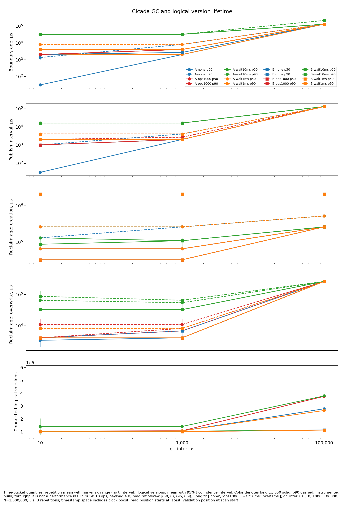

**図の読み方 (md_2 の図 3)。** 上から回収境界の年齢・公開の間隔・回収時の年齢・論理的な生存版数を、GC 間隔ごとに並べた。色が長い tx の型である。
**言えること:** 読み取りの後に待つ長い tx があると、境界の年齢と公開間隔が伸びる向きである (md_2 §0 項 4: 10 ms 待機で境界年齢 p50 が 32 µs → 32768 µs の bucket、
論理生存版数 1.03e6 → 1.41e6)。**言えないこと:** 計器入り build の観測で性能値ではない。境界年齢は timestamp 空間の値 (clock boost を含む) の 2 倍刻みの bucket 上界である。

### 2.1 実運用で起きていること

md_27 は製品の公式文書・技術資料 38 頁と論文・資料 10 本を読んだ (md_27 §1.1・§6)。論文の動機づけに使えるのは次の範囲である。

- 最古の実行中 tx が回収境界を決める tx 型の GC (PostgreSQL・MySQL InnoDB・SQL Server・TiDB 6.1.0 以降・Aurora MySQL) では、長い tx が回収を止めると公式文書に書かれている。
  時間型の GC (Oracle・Spanner・YugabyteDB・CockroachDB) では通常の読み取りについて回収は止まらず、代わりに長い読み取りが失敗する (md_27 §5.1 の M1)。
- 回収が止まると容量・性能・可用性が悪化する (M2)。**ただし研究側の症状の数値は、読んだ 10 本の範囲ではすべて固定 snapshot の読み手 (下の C1) の実験の値である** (md_27 §0 項 4・§4)。
- 問題が実運用で起きている頻度の根拠は、HANA の 1 システムの統計 (408,664 query 中 6 cursor が 1 時間超) だけである (M3)。
- 読んだ 10 製品系と HANA の範囲では、既存の対処は「長い側を終わらせる」「待ち上限で強制前進」「snapshot の失効」「書き込み側を遅らせる」のどれかである (M4)。

**本稿の動機の穴。** 本案が縮める「読み取りを続ける長い read-write tx」(下の C2) と「読み終えて待つ tx」(C3) が回収境界をどれだけ止めるかの数値は、読んだ外部資料に無い (md_27 §8)。
評価で自分で示す必要がある (T-2916。D2322 項 1 は、評価で構成 D より T-2930 系と T-2916 を先にするとした)。本稿は「長い tx は頻繁に起きる」とも「本案は C1 の症状の数値の分だけ縮める」とも書かない。

### 2.2 長い tx の型

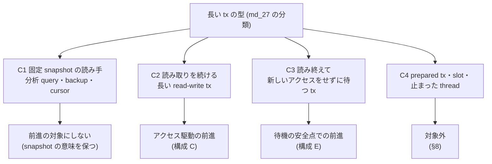
```mermaid
flowchart TB
  long["長い tx の型 (md_27 の分類)"]
  long --> c1["C1 固定 snapshot の読み手<br/>分析 query・backup・cursor"]
  long --> c2["C2 読み取りを続ける<br/>長い read-write tx"]
  long --> c3["C3 読み終えて<br/>新しいアクセスをせずに待つ tx"]
  long --> c4["C4 prepared tx・slot・<br/>止まった thread"]
  c1 --> n1["前進の対象にしない<br/>(snapshot の意味を保つ)"]
  c2 --> p1["アクセス駆動の前進<br/>(構成 C)"]
  c3 --> p2["待機の安全点での前進<br/>(構成 E)"]
  c4 --> n2["対象外<br/>(§8)"]
```

**図の読み方。** 4 型は md_27 が出典を整理するために置いた分類で、出典自身の分類ではない (md_27 §0)。下段は、本稿の機構がどの型に何で届こうとしているかを表す。
**図から読み取ってはならないこと:** どの型でも効果が出たという意味ではない。各型で言えることは次の表に書く。

### 2.3 型ごとに、何が言えて何が言えないか

**この表が本稿の主張の範囲の正本である。** 構成 E の成果 (§4.3 の定理と §6 の観測) を「読み続ける長い tx 全般」へ広げない。また、抽象仕様についての定理を試作の安全へ広げない。

| 型 | 本稿の前進の契機 | 直列化について言えること | GC 安全について言えること | 実物で観測したこと (すべて未検証の診断値) | 言えないこと |
|---|---|---|---|---|---|
| **読み終えて待つ型** (C3。全 read の後に待機し、待機の直後に commit する read-write tx) | 待機の安全点で、GC の要求があれば前進を試す (構成 E、§3.3)。前進できず commit できないと確定した試行は、その安全点で abort してよい (方策 c、§3.3.1) | 抽象仕様 E について、確定した tx の依存グラフに閉路が無い (md_26 定理 S、md_13 定理 4 の仮定 A9 を補題 A で置き換えたもの) | 抽象仕様 E について、floor だけで既読版を守る経路 F で、回収された版はどの tx の「必要な版」にもならない (md_26 定理 G)。前提の条件 RA (floor を上げる前進の確認を始めた後は外部 read をしない) は、計測した待機型の tx では満たされる (md_36 §2 の RA 行) | zipf 0 と 0.6 で回収境界の遅れ・論理生存版数が縮んだ。zipf 0.9 では E-max 単独の効果は小さく、方策 c を足すと縮んだ (§6.2〜§6.4)。この型の長い tx は stock でも完了する (zipf 0.6 で約 7 割、0.9 で約 1 割、§6.6)。throughput の差は検出できない (§6.5) | **構成 E の試作は定理の仮定を満たさない箇所がある**: commit の書き込み検査が版の列を辿る間に、止まる予定の版が回収されうる (md_36 §3.2)。thread の floor が tx の境目で下がり、leader の集計は非原子的なので、開始 floor の条件 FS-b が崩れうる (試作では前進しない thread 0 が境界を抑えるので害の列は作れない、md_36 §4.3)。同じ thread の続く tx が同じ時刻を持ちうる (md_36 §5)。したがって「試作は GC 安全」「試作は serializable」とは書かない (D2326)。修理は並走中 (§4.3.1)。物理メモリの減少も言えない |
| **読み続ける型** (C2。読み取りを続ける長い read-write tx。評価では 1,000 操作の many_ops) | 次に読む版が cold 領域にあるとき、その read で前進を試す (構成 C、§3.4) | 小モデル仕様 v1 について、確定した tx の依存グラフに閉路が無い (md_13 定理 4。仮定 A1〜A11、A9 = 検査が触れる版が論理的に回収されていない、を含む)。試作の構成 C の前進の確認は既読版の rts を上げないので md_13 の確認 (R5) ではなく、最終の条件は commit での全既読の検証である (md_36 §2 の A5 行) | **この型の前進を回収境界へ反映する論証は無い。** 現行の構成 C は floor を公開しない (GC の保護は旧時刻のまま、md_6 §2)。前進の後も読み続けて floor を上げると RA を破り、md_26 の経路 F の定理の外になる。守るには refs・epoch など floor 以外の仕組みとその物理的な寿命の論証が要る (md_26 §11) | 前進は起きる (長い thread の成功 / 発火 C-min 0.050、C-partial 0.320、zipf 0.6)。しかし長い tx の完了率はどの腕でも 0.03% 以下で、完了に結び付いていない (md_21 §4.4)。この「完了しない」は操作数型の性質で、待機型には当てはまらない (md_31 §6)。回収境界への効果は測っていない | 「読み続ける長い tx の GC 問題を解いた」「部分前進が長い tx を救う」 |
| **固定 snapshot の型** (C1。read-only の分析 query・cursor など) | 前進の対象にしない (snapshot の意味を保つ) | 対象外 | 対象外 | 比較相手 Cicada の欠陥 (read-only の commit が GC の公開を止める) を直すと公開は戻るが、長い read-only の rts が境界を押さえる分 (境界年齢 12.5〜14.3 ms) は残る (md_22 §0 項 6)。負荷の空間を広く探すと、長い read-only tx を 1 worker が続ける条件 (batchR) の 84 行すべてで stock の公開が 0 回だった (md_29 §0 項 1)。**どちらも本案の効果ではない** (§6.8) | 「本案は長い read-only が止める回収を縮める」「batchR で本案が勝つ」 |
| (参考) **C4** (prepared tx・replication slot・止まった thread) | 対象外。prepared tx と slot は tx の時刻を動かす対象にしていない。止まった thread は安全点で要求を確かめられない (§8) | 対象外 | 対象外 | 無し | 「prepared tx・slot・止まった thread が止める回収も縮める」 |

---

## 3. 方式: 確認 → 確定 → 公開の順序


```mermaid
flowchart LR
  subgraph T["tx T の側 (安全点または cold に入る read)"]
    t0["前進先 t′ を選ぶ<br/>(既読の可視区間に収まる最大 ほか)"] --> t1["既読版すべての rts を<br/>t′ 以上へ上げる"]
    t1 --> t2["版の列を観測し直し<br/>既読版が t′ で見えるか確かめる"]
    t2 -->|全部見える| t3["確定: T の時刻 := t′"]
    t2 -->|どれかが見えない| tf["時刻も floor も変えない"]
    t3 --> t4["公開 (別の step):<br/>floor := max(floor, t′ 以下の値)"]
  end
  subgraph G["GC の側"]
    g1["境界 B := 実行中の tx の<br/>floor の最小"] --> g2["後続の確定版が B 以下にある版だけを回収"]
  end
  t4 -.-> g1
```

**図の読み方。** 左が前進する tx の手順、右が GC の手順である。点線は「公開した floor を GC が境界の計算に使う」ことを表す。
**図から読み取ってはならないこと:** この図は構成 E の安全点での前進 (§3.3) の形で、構成 C のアクセス駆動の前進 (§3.4) は現行では右へ公開しない。
右の「境界 B := floor の最小」は抽象仕様の 1 step で、Cicada の leader はこれを thread ごとに非原子的に読む (§4.3.1)。

### 3.1 用語

- **時刻 (候補時刻) c_T:** tx T が読むときに使う timestamp。前進すると後の値になる。
- **floor f_T:** T が GC に「この時刻より古い版は要らない」と公開している値。GC は実行中の全 tx の floor の最小を回収境界 B にする。
  Cicada では各 thread の `ThreadRtsArray` と leader の `MinRts` に当たる (md_26 §2.3 の読み替え: f := ThreadRtsArray − 1、B := MinRts − 1)。
- **既読版:** T が既に読んだ版。前進しても、新しい時刻でその版が「見える版」(その時刻以下で最大の、aborted でない版) のままでなければならない。
- **前進の確認:** 既読版の rts を t′ 以上へ上げ、**その後に**版の列を観測し直して、各既読版が t′ で見えるか確かめること。
- **回収:** 版 y を版の列から外すこと。確定版 y を回収してよいのは、同じ key に確定版 z があって y.wts < z.wts ≤ B のときだけ (md_4 の R10、Cicada の `gc_versions`)。
  ABORTED の版はいつでも回収してよく、PENDING の版は回収しない (md_26 §2.1。Cicada の実装には PENDING を除く検査が無く、stock と試作では floor の条件から導けるだけである、md_36 §2 の RC 行)。
- **判定 D (確定した abort):** read-only でない tx の read set のどれかについて、既読版より新しく自分の現在の時刻より古い committed / deleted の版が版の列にあること。
  pending は含めない (md_31 §2、D2320 項 1)。D が真なら、その tx の commit の既読検査は成功しない (小モデルの有限範囲、§4.4)。

### 3.2 前進先の選び方: 可視区間

版 v が見える時刻の区間を I(v) = [b(v), e(v)) と書くと、既読版の集合 R_T が同時に見える時刻の区間は、下限 L_T = max b(v)、上限 U_T = min e(v) (v ∈ R_T) で、
L_T < U_T のときだけ共通の時刻がある (出典メモ §9 の記法。同じ形のモデルは Hekaton 2011 が Begin / End として実装に使っている、md_1 §8.1)。
**これは read 集合の整合の必要条件であって、更新 tx 全体の commit 条件ではない** (書き込み側の制約・一意性・並行する writer は別に要る)。

```text
時刻  →   t1    t2    t3    t4    t5    t6    t7    t8
既読 A    [===========================)                  A の見える区間 [t1, t6)
B の版          B@t2        B@t4  B@t5        B@t7  B@t8
                └── cold ──┘      └──────── hot ─────────┘
T の現在              ^t3

固定          : t3 のまま → B@t2 を読む          → cold を辿る
今へ前進      : t8 へ進む → B@t8 を読む          → A が見えない (t8 は [t1, t6) の外)
最小の前進    : t5 へ進む → B@t5 を読む          → A も見える、cold を避けられる
区間内の最大  : t6 の手前へ進む → B@t5 を読む    → A も見え、時刻はより新しい
```

**図の読み方。** 既読の版 A が t1 から t6 の手前まで見えているとき、4 つの前進先の帰結を並べた記号の例である (例の上の帰結で、一般の性質ではない)。

| 前進先の方策 | 定義 (md_21 §2、md_31 §2) | 本稿での扱い |
|---|---|---|
| 今 (E-now) | 自 thread の時計から作る厳密に新しい時刻 (cap) | 構成 E の初版 (md_14)。強い偏りではほぼ失敗する |
| 区間内の最大 (E-max) | 上端 U があれば min(cap, below(U))、無ければ cap。旧時刻・公開済みの時刻以下なら前進先なし (`no_room`) | **構成 E の主な腕** (D2315)。評価計画の §5.5 の当てはめでも p\* = c (= E-max) になった (md_34、D2325) |
| (追加の方策 c) E-max + 早い abort | E-max の要求が `no_room` を返したときだけ判定 D を評価し、真なら abort | **E-max とは別の腕として書く** (md_31、D2320 項 2)。前進先の選び方ではなく、前進できない試行の扱いを足したもの |
| (参考の方策 b) 早い abort だけ | 前進せず、待機の各 slice で D を評価し、真なら abort | 単独では採らない (D2320 項 2)。回収境界がほとんど縮まない (§6.4) |
| 最小の前進 (C-min) | 先頭 K 版の最古の確定版の直後の時刻 | **構成 C の既定** (D2287・D2315) |
| 部分前進 (C-partial) | 目標に届かなくても現在より新しければ進む | 構成 C の別腕 (完了率が上がらない限り既定にしない、D2315) |

上端 U は、各既読版について版の列の先頭から既読版まで辿ったときの「既読版の直上の aborted でない版」の wts の最小である。below(U) は U − 1 以下で下位 8 bit が自 thread 番号の最大の時刻である (md_21 §2)。
**U は pending の版も含む**ので、`no_room` は「commit できないことが確定した」ことを意味しない (md_31 §3.3)。

**新規性についての注意。** 「最新でない版を選べる」「前へ進んで既読と両立する旧版を読む」こと自体は既知である (SI-STM 2006、CockroachDB 2020。md_9 §5)。本稿はこれを貢献に数えない。

### 3.3 待機の安全点での前進 (構成 E) — 擬似コード

読み終えて待つ型の tx は、待機中に新しい read が無いので、アクセス駆動の前進 (§3.4) は発火しない (md_6 §5.1)。構成 E は、GC が公開を待っているときに、
待機中の tx 自身が待機の安全点で前進を試す形 (md_10 の SP、D2290) を Cicada に入れたものである。

```text
// 待機中の tx T が、待機を 100 µs に刻んだ各安全点で呼ぶ (md_14 §2)
procedure SAFEPOINT(T):
  if not (GC 間隔が経過 and T の GC flag が 0): return        // GC の要求がない
  t' := CHOOSE_TARGET(T)                                       // §3.2。E-max なら既読の可視区間に収まる最大
  if t' が無い or t' <= max(T.ts, 公開済みの時刻):              // no_room: 前進先がない
      SET_GC_FLAG(T); return                                   // flag だけ立てる (E-hb と同じ)
  if not PRECHECK(T, t'):                                      // 既読と write set の事前確認 (早期判定、rts は書かない)
      SET_GC_FLAG(T); return                                   // 失敗: T.ts も floor も変えない
  // (1) 確認: rts を上げてから観測し直す (順序が逆だと割り込みを見逃す、§4.4)
  for v in T.read_set: v.rts := max(v.rts, t')                 // CAS-max。rts は減らない
  fence (seq_cst)
  for v in T.read_set:
      if VISIBLE(v.key, t') != v or 可視の位置に他 tx の PENDING がある:
          SET_GC_FLAG(T); return                               // 失敗: T.ts も floor も変えない
  // (2) 確定
  T.ts := t';  T の未設置の書き込み版の wts := t'
  // (3) 公開: 確定の後の別の step で、成功したときだけ
  T.floor := max(T.floor, p)   (p <= t')                        // 抽象仕様 E の公開 (md_26 §2.1)
      // Cicada の実装: ThreadWtsArray := t'、ThreadRtsArray := max(旧, t' - 1) (CAS-max)。
      // md_26 §2.3 の読み替え f = ThreadRtsArray - 1 では p = t' - 2 に当たる
  SET_GC_FLAG(T)

// GC の leader (Cicada の既存の手順のまま)
procedure GC_LEADER():
  if 全 worker の GC flag が立った:
      B := 実行中の各 tx の floor の最小                         // Cicada: MinRts (と MinWts) を公開。B = MinRts - 1 と読み替える
                                                               // 実装は thread ごとに Wts と Rts を 1 つずつ読む (非原子的、md_36 §2)
      境界 B を公開し、flag を下ろす

// 各 worker が自分の確定した版について (Cicada の gc_versions のまま)
procedure RECLAIM(key):
  確定版 z で z.wts < MinRts のものがあれば、z より古い版を切り離す   // md_4 の R10 と同じ形。status は問わない
  // 抽象仕様 E の規則 (§3.1): 確定版 y は同じ key の確定版 z と境界 B で y.wts < z.wts <= B のときだけ、
  // ABORTED の版はいつでも回収してよく、PENDING の版は回収しない (md_26 §2.1)
```

**擬似コードの読み方。** 確認・確定・公開の行は md_14 が作り (D2295)、md_21 は `CHOOSE_TARGET` (目標時刻の計算) だけを変えた (md_21 §2)。
回収そのもの (`gc_versions`) は変えていない (md_14 §2)。どの経路で戻っても GC flag は立てる (前進を試さない E-hb と同じ)。
確認の段で失敗した前進は rts を上げた跡を残すが (rts は減らない、md_13 の仮定 A7)、時刻と floor は変えない。
floor の行は抽象仕様 E (§4.3) の形で書き、Cicada の実装の値はコメントに分けた。md_26 §2.3 の読み替えでは、実装の slot (ThreadRtsArray = t′ − 1) と
読み替えた floor (t′ − 2) の差は 1 である。md_10 のモデルの公開値 p = t′ と実装に当たる p = t′ − 2 は 2 違うが、どちらも p ≤ t′ を満たすので定理の条件 (PUB) の形は変わらない。
**この擬似コードは commit の手順を書いていない。** commit の書き込み検査は stock のままで、公開した floor はその走査を守らない (§4.3.1 の (a))。

### 3.3.1 追加の方策 c: 前進できず、commit できないと確定した試行を安全点で終える

```text
// md_31 の方策 c (fallback)。上の SAFEPOINT の no_room の分岐だけを置き換える (D2320 項 2)
  if t' が無い or t' <= max(T.ts, 公開済みの時刻):              // no_room
      if not T.is_readonly and DOOMED(T):                      // 判定 D (§3.1)。共有状態を書かない
          return ABORT                                         // 待機ループを抜け、既存の tx.abort() を通って再実行する
      SET_GC_FLAG(T); return

procedure DOOMED(T):
  for v in T.read_set:
      最新の版から v まで辿り、途中に status が committed か deleted で v.wts < wts < T.ts の版があれば true
      v に辿り着けなければ false (abort しない側)
  return false
```

**読み方。** 方策 c は前進先の選び方 (E-max) を変えず、前進できない試行のうち commit できないと確定したものだけを終える (md_31 §2)。
中止した tx は既存の `tx.abort()` を通り、その `mainte()` が stock と同じ条件で GC flag を立てるので、回収境界への効果は flag を立てる経路と同じである (md_31 §2)。
**判定 D の健全性は小モデルの有限範囲でだけ確かめた** (§4.4)。対象は現行 genome (`INLINE_VERSION_PROMOTION=0`) と read-only でない tx で、前進成功後の遷移は W* を仮定する (D2320 項 4)。
AggressiveGC との違いは §7 の (d) に書く。

### 3.4 cold に入る read での前進 (構成 C) — 擬似コード

```text
// 読み続ける型にも届く、アクセス駆動の前進 (md_6 §2 の仕様 v2)
procedure READ(T, key):
  p := T.ts で見える版の、版の列の先頭からの位置 (先頭 = 1)
  if p > K and T が read-write で未 abort、scan 中でなく、insert・delete・scan をしていない:  // 論理 K 境界 = cold に入る (U1)
      t' := CHOOSE_ACCESS_TARGET(T, key)        // C-min: 先頭 K 版の最古の確定版の直後の時刻
      if t' があり PRECHECK(T, t') が通る:       // 既読の一致と write set の制約。rts は書かない
          T.ts := t'; 未設置の書き込み版の wts := t'; 探索の開始位置を捨てる
          // floor は公開しない (GC の保護は旧時刻のまま)
  stock と同じ探索で版を選ぶ
// commit は stock の validation を最終の T.ts で走らせる (最終保証)
```

**読み方。** 構成 C の前進は read 相だけで行い、最終保証は stock の validation (PENDING 版の設置 → 既読版の rts を上げる → 既読の一致を確かめる → 書き込み側の検査) を最終の時刻で走らせることに置く (md_6 §2)。
前進の後に insert・delete・scan を呼ぶと abort する。**現行の構成 C は floor を公開しない** ので、単独では回収境界を動かさない (md_6 §2 の表の GC 行)。
前進の事前確認は既読版の rts を上げずに見え方だけを照らすので、md_13 の確認 (R5) には当たらない。md_13 の系 6 の範囲では、commit での全既読の検証が最終の条件になる (md_36 §2 の A5 行)。
F は同じ発火条件で abort して再実行する対照である。

### 3.5 戻れる段階と戻れない段階

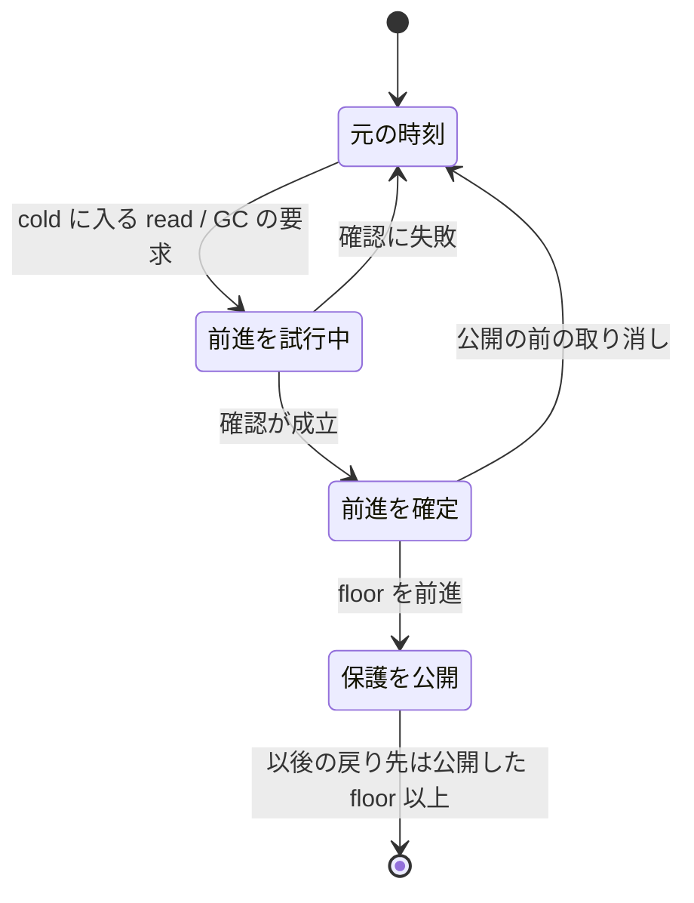
```mermaid
stateDiagram-v2
  state "元の時刻" as s0
  state "前進を試行中" as s1
  state "前進を確定" as s2
  state "保護を公開" as s3
  [*] --> s0
  s0 --> s1: cold に入る read / GC の要求
  s1 --> s0: 確認に失敗
  s1 --> s2: 確認が成立
  s2 --> s0: 公開の前の取り消し
  s2 --> s3: floor を前進
  s3 --> [*]: 以後の戻り先は公開した floor 以上
```

**図の読み方。** md_10 の全探索では、**戻れない境界は確定ではなく公開にあった** (md_10 §5.5、D2290 項 2)。公開の後に公開した floor より古い時刻へ戻ると GC 違反の反例が出る (§4.4 の UF1)。
Cicada の試作では、tx が終わった後の次の tx の begin が thread の floor を無条件に書き直すので、thread の単位では floor が下がる (md_36 §4.2)。これは tx の単位の図とは別の話で、§4.3.1 の (b) で扱う。

### 3.6 cold の判定を安くする構造 (VHash の hot block、副)

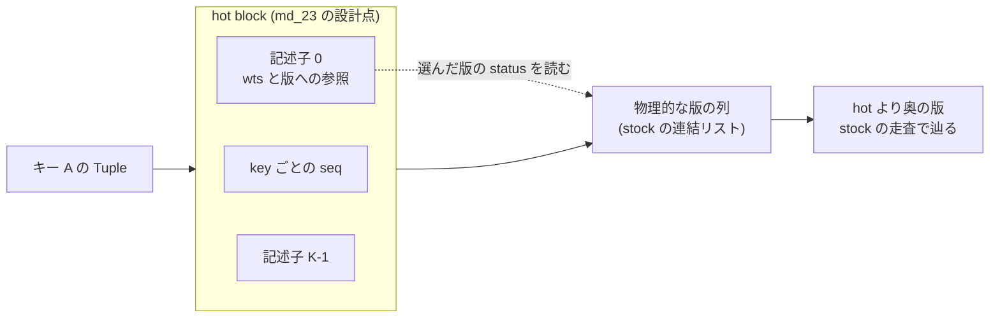
```mermaid
flowchart LR
  key["キー A の Tuple"] --> hot
  subgraph hot["hot block (md_23 の設計点)"]
    seq["key ごとの seq"]
    d0["記述子 0<br/>wts と版への参照"]
    dk["記述子 K-1"]
  end
  hot --> list["物理的な版の列<br/>(stock の連結リスト)"]
  d0 -.選んだ版の status を読む.-> list
  list --> cold["hot より奥の版<br/>stock の走査で辿る"]
```

**図の読み方。** 前進の契機 (§3.4 の「cold に入る」) を安く判定し、浅い版の読みも速くするために、key ごとに版の列の先頭 min(K, 長さ) 件の写し
`{wts, Version*}` を連続に置く構造 (仮称 VHash の hot block) を考えた。md_23 はこれを key ごとの seqlock で一貫した読みを保つ 1 つの設計点として Cicada に入れた (D2311)。
**本稿では、hot block は貢献の芯ではない。** Cicada の中では単独で throughput を上げなかった (§6.7)。前進の契機を hot の外れで判定する構成 (構成 D) は未実装で、U1 を述べるときは構成 D と区別する (D2322 項 1)。

---

## 4. 安全性: 何が言えて、何が言えないか

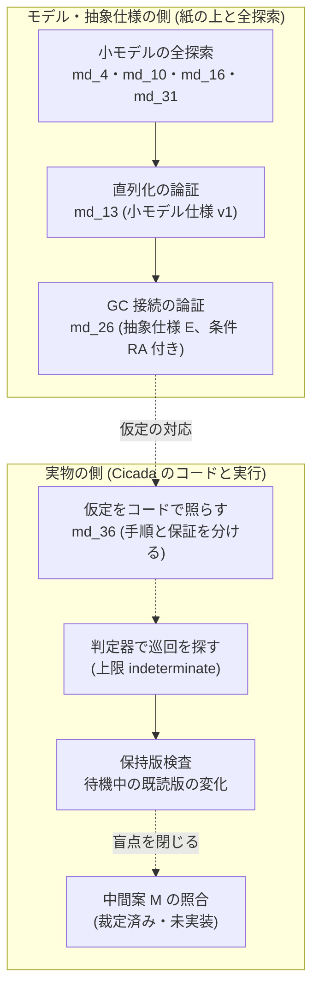
```mermaid
flowchart TB
  subgraph M["モデル・抽象仕様の側 (紙の上と全探索)"]
    m4["小モデルの全探索<br/>md_4・md_10・md_16・md_31"]
    m13["直列化の論証<br/>md_13 (小モデル仕様 v1)"]
    m26["GC 接続の論証<br/>md_26 (抽象仕様 E、条件 RA 付き)"]
  end
  subgraph I["実物の側 (Cicada のコードと実行)"]
    code["仮定をコードで照らす<br/>md_36 (手順と保証を分ける)"]
    v3["判定器で巡回を探す<br/>(上限 indeterminate)"]
    ret["保持版検査<br/>待機中の既読版の変化"]
    evm["中間案 M の照合<br/>(裁定済み・未実装)"]
  end
  m4 --> m13 --> m26
  m26 -.仮定の対応.-> code
  code -.-> v3
  v3 --> ret
  ret -.盲点を閉じる.-> evm
```

**図の読み方。** 左はモデル・抽象仕様についての主張、右は実物のコードと実行についての主張である。**左の結論は右へ自動では移らない。**
md_36 は左の仮定を右のコードで照らし、「手順」(コードの手順が仮定の step の順序・形に対応するか) と「保証」(定理が使う性質まで成り立つか) を分けて判定した (D2326 項 1)。
点線は「左の条件を実物がどこまで満たすか」の対応を表す。

### 4.1 小さいモデルで分かったこと (md_4・md_10)

md_4 は、キー 2・tx 2〜3 (+ GC 1 thread)・操作 1〜3・逐次一貫なメモリの固定 10 場面で、選択的前進の規則を 1 つずつ崩した版の全 interleaving を探索した (md_4 §6・§7.3)。
md_10 は、待機中の tx が安全点で前進して公開する形 (SP) を足した固定 6 場面を探索した (md_10 §5・§8)。

| 規則 | 崩した版 | 結果 (固定場面の範囲) | 出所 |
|---|---|---|---|
| 書き込み側の直前版の rts 検査は PENDING を越えて最初の確定版まで (R9′) | v0 (直前版 1 つだけを検査) | 閉路の反例、30 step | md_4 §7.3 |
| 既読版の rts を上げてから可視を確かめる (R9 の順序) | U1v | 閉路の反例、26 step | md_4 §7.3 |
| 確定してから GC へ公開する (R6 → R7) | U3a | GC 違反、3 step | md_4 §7.3 |
| 後続の確定版を根拠に回収する (R10) | U4 | GC 違反、2 step | md_4 §7.3 |
| 確定してから公開する (SP) | UG1 (確認の前に公開) | GC 違反、4 場面で 5〜31 step | md_10 §8 |
| 確定で保護下限を外さない | UG2 (確定時に floor を無限大) | GC 違反、2 場面で 10・21 step | md_10 §8 |
| 公開の後は公開した floor より古い時刻へ戻らない | UF1 | GC 違反、2 場面で 22・47 step | md_10 §8 |

仕様 v1 は 10 場面すべてで反例なし (md_4 §8)、SP の健全版 24 構成はすべて反例なし (md_10 §5.1)。**反例なしは固定場面の初期状態からの全 interleaving に限る。**
これらの模型には、境界の非原子的な読みと thread の floor の下降は入っていない (md_36 §7)。

### 4.2 直列化の論証 (md_13) と、その仮定の実装での状態

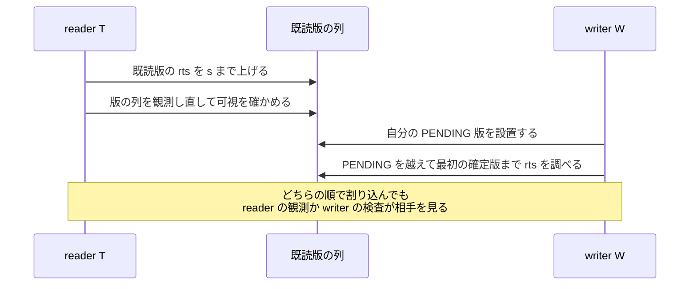
```mermaid
sequenceDiagram
  participant R as reader T
  participant V as 既読版の列
  participant W as writer W
  R->>V: 既読版の rts を s まで上げる
  R->>V: 版の列を観測し直して可視を確かめる
  W->>V: 自分の PENDING 版を設置する
  W->>V: PENDING を越えて最初の確定版まで rts を調べる
  Note over R,W: どちらの順で割り込んでも<br/>reader の観測か writer の検査が相手を見る
```

**図の読み方。** md_13 の論証の芯である 2 つの順序 (reader は rts を上げてから観測し直す、writer は設置してから PENDING を越えて最初の確定版まで検査する)。

**定理 (md_13 §0 の要旨):** 固定したキー集合への point read / update だけを行い、逐次一貫なメモリと md_4 の原子性の下で、md_4 仕様 v1 (R9′ を含む) に従う tx について、
commit 時の検証を通って確定した tx の依存グラフ (ww・wr・rw) は閉路を持たず、確定時刻の順がそのまま直列化の順になる。
**ただし仮定 A1〜A11 を前提とする** (時刻の一意性 A2、rts の単調性 A7、検査が触れる版が論理的に回収されていないこと A9、途中入場が無いこと A10 など)。
発火の契機と前進先の選び方には依らない (md_13 の系 5)。

**この定理の地位。** 対象は小モデル仕様 v1 で、Cicada の実装にも試作にも届かない (D2292)。Cicada の「PENDING を待つ」書き込み検査は条件 W* を置いた補題 2′ で同じ結論になる (md_13 §5・§7)。

**仮定を Cicada 実装で照らした結果 (md_36 §2、計測で使った設定の YCSB の read-write tx が既存キーへ point read / update する経路について)。** 「手順」と「保証」を分けて書く。

| 仮定 | 手順 (コードの順序・形) | 保証 (定理が使う性質) | 補足 |
|---|---|---|---|
| A1 逐次一貫、版の列の原子的な観測、R9′ の走査は 1 step | 満たさない | 満たさない | 版の列は next pointer を 1 つずつ読み、status は版ごとに順に書く。観測の線形化点を置く実装向けの置換補題が要る (md_36 §8 の N4) |
| A2 異なる tx は同じ時刻を持たない | — | **満たさない** | abort の後の時計の上乗せが実時刻より先に出たまま次の tx が commit すると、その次の begin で時刻が進まず、同じ thread の続く 2 つの tx が同じ時刻を持ちうる (md_36 §5)。確かめた経路では空振りの abort になる。閉路の完成列は作れていない |
| A5 確認は rts を上げてから観測し直す | stock の commit と構成 E は満たす。**構成 C の前進は満たさない** (rts を上げない) | 記憶順序と寿命は別 | 構成 C は commit で全既読を最終時刻で検証し直す (O1 を採らない) ので、md_13 の系 6 の範囲では結論に効かない。構成 C の実装の直列化の認定ではない |
| W* (設置の後に降順に走査、待機の後に status を読み直す、止まった版の rts をその時点で読む) | **満たす** | **到達と寿命は満たさない** | 並行する GC が版の列を切り離して delete / 再利用するので、「設置前からある版を必ず訪れる」の物理的な保証が無い。構成 E では論理的にも崩れる (§4.3.1 の (a)) |
| A7 rts は max で更新され減らない | 満たす | 版の再利用をまたいでは満たさない | 再利用 (`REUSE_VERSION=1`) で同じアドレスの rts が 0 に戻る |
| A9 補題 2 が扱う版は版の列に残る | — | md_26 が定理 G に置き換え | 構成 E では W* の走査中に反例がある (§4.3.1 の (a)) |
| A10 途中入場なし | 満たさない | — | tx は随時 begin する。md_26 が開始 floor の条件 FS-a/b/c に置き換えた (§4.3) |
| 記憶順序 (読み手と書き手の相互見落とし) | — | **判定できない** | C++ の模型では除けない実行がある。x86 では除かれる見込みだが、対象バイナリの命令列は確かめていない |

**論文に書ける文** (md_36 §0.1): 「stock Cicada の書き込み検査は、条件 W* の局所手順に対応する。並行する回収の下での到達と参照の寿命は示していない。」
**書けない文:** 「stock・C・E は論証の全仮定を満たす」(md_36 §0.1)。

### 4.3 GC 接続の論証 (md_26): 読み終えて待つ型について

md_26 は、§3.3 の手順を抽象化した仕様 E (待機の安全点で tx 自身が確認 → 確定 → 別 step で公開し、公開した floor を下げず、回収は後続の確定版を根拠にする) について、
途中入場する tx と古い境界での回収も含めて次を示した。**主語は抽象仕様であり、Cicada 実装と物理的な非接触は主張しない** (md_26 §0、D2319)。

- **定理 G (論理的な GC 安全):** 回収された版は、回収の時点で実行中の tx にも、その後に始まる tx にも、読み・確認・commit の検証・書き込み検査・前進先の計算のどれでも「必要な版」として現れない。
- **定理 S (直列化):** 構成 E の確定した tx の依存グラフは閉路を持たず、確定時刻の昇順が直列化の順を与える (md_13 定理 4 の仮定 A9 を、定理 G から導いた補題 A で置き換えたもの)。
- 前進先 t′ については一意で現在の時刻より大きいことしか使わないので、E-max にも E-now にも同じく当てはまる。

論証の芯は 3 つの不変条件である (md_26 §4)。

| 不変条件 | 中身 | 何を守るか |
|---|---|---|
| (I0) | GC が読んだどの境界 B も、実行中のどの tx の floor 以下 | 境界が実行中の tx を越えない |
| (I1) | 各実行中の tx で floor ≤ 候補時刻 | 以後の読みの時刻で見える版 |
| (I2) | 各実行中の tx の各既読版について、他 tx の確定した後続版の wts はすべて floor より大きい | 既読版そのもの |

**前提の条件 (md_26 §3.1) と、Cicada のコードでの状態 (md_36 §2・§4)。** 初稿では「未確認」と書いた欄を、md_36 の照合で置き換えた。判定の範囲は md_36 §1 の経路 (計測の設定の YCSB) に限る。

| 条件 | 中身 | stock | 構成 E の試作 |
|---|---|---|---|
| FS-a | 登録時の floor ≤ 開始時刻 | 満たす (非 0・非 wrap の範囲) | 同じ |
| FS-b | 登録時の floor ≥ それまでに GC が読んだどの境界 (途中入場) | **導出上満たす** (thread の Wts・Rts がともに非減少なので、非原子的な集計でも古い値は新しい値以下、md_36 §4.1) | **満たさない場合がある** (thread の floor が前進で上がり次の begin で下がるので、非減少が崩れる、md_36 §4.2)。ただし前進しない thread 0 (leader) の floor が境界を上から抑えるので、既読版の回収に至る列は作れない (md_36 §4.3) |
| FS-c | 登録の後に他 tx が設置する版の wts はすべて開始 floor より大きい | 満たす (thread の時刻が非減少・非 wrap の範囲) | 同じ |
| PUB | floor が変わるのは公開だけで、成功した確認・確定の後に確定時刻以下へ上げる | 前進なし | 満たす (`gc_advance` の成功時だけ Wts := t′ の後に Rts := max(旧, t′ − 1)。失敗時は何も公開しない) |
| CAND | 時刻が変わるのは確定 (上げる) と公開前の取り消し (試行前へ戻る) だけ | — | 満たす (成功経路) |
| **RA** | **floor を上げる前進について、その確認を始めた後は外部 read をしない** (公開の後も、確認の成功と公開の間も) | — | **計測した待機型の長い tx では満たす** (全 read と update の後に待機ループへ入り、ループの後は commit だけ)。安全点の API 自体は以後の read を禁じないので、API 一般では判定できない |
| RC | 回収は後続の確定版を根拠にするだけで、PENDING 版は回収しない | **一部だけ満たす** (確定版を根拠に下を切る形は対応するが、PENDING を除く検査はコードに無い。stock では floor の条件から導ける) | 同じく一部。試作でも floor の条件から導けるが、thread の floor が下がりうる一般の E では古い読みで崩れうる |
| 境界の読み | GC は実行中の tx の floor の最小を 1 step で読む (md_26 §2.1) | 満たさない (thread ごとに Wts と Rts を交互に読む非原子的な読み)。FS-b の導出で代わりにする | 満たさない。thread の floor の下降と合わせて §4.3.1 の (b) |

**条件 RA がこの論証の射程を決める。** md_26 は、RA を崩すと floor だけでは既読版を守れない列を 2 つ紙の上で作った (探索はしていない)。
列 X1 は「floor を上げた後に新しく読む」、列 X2 は「確認に成功してから公開するまでの間に新しく読む」で、どちらも新しく読んだ版が確認に覆われず、
並行する writer の確定版を根拠に回収されうる (md_26 §8)。したがって定理 G は、**読み終えてから前進して公開する型 (§2.3 の 1 行目) の抽象仕様には届き、読み続けながら floor を上げる型には届かない。**
読み続ける型の前進 (構成 C) は現行で floor を公開しないので、この定理を必要としないが、回収境界も動かさない (§2.3 の 2 行目)。

**Cicada で既読版を守っている暗黙の不変条件との対応。** stock Cicada は「tx 開始時の下限を tx の間変えない」ことで既読版を物理的に守っている (md_14 §3.3)。
md_26 はこれを FS-c (開始時に (I2) を成り立たせる) と PUB (floor を上げるのは確認に成功した時刻以下へだけ) の 2 つに分けて明示した。§4.4 の P5 は PUB を破った実例である。

### 4.3.1 構成 E の試作が定理の外にある 3 箇所 (md_36、D2326 項 3)

md_36 は、試作のコードの手順を抽象仕様の step に対応させたうえで、対応が崩れる箇所を 3 つ挙げた。**どれも紙の上の実行列で、実走・探索・判定器では観測していない。頻度も分からない** (md_36 §9)。

**(a) 書き込み検査の走査中に、止まる予定の版が回収されうる (W* × GC)。** 計測した長い tx (10 read + 1 update の後に待機し、待機中に前進して floor を t′ − 1 へ上げ、その後に commit する) の手順に、
update の key が既読キーと異なる場合にそのまま乗る (md_36 §0 項 1・§3.2)。

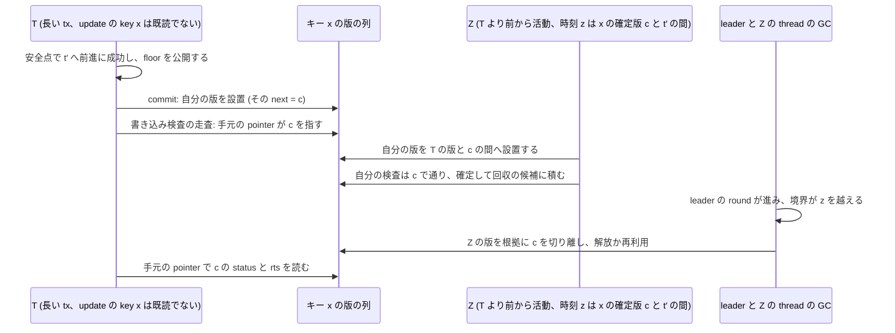
```mermaid
sequenceDiagram
  participant T as T (長い tx、update の key x は既読でない)
  participant L as キー x の版の列
  participant Z as Z (T より前から活動、時刻 z は x の確定版 c と t′ の間)
  participant G as leader と Z の thread の GC
  T->>T: 安全点で t′ へ前進に成功し、floor を公開する
  T->>L: commit: 自分の版を設置 (その next = c)
  T->>L: 書き込み検査の走査: 手元の pointer が c を指す
  Z->>L: 自分の版を T の版と c の間へ設置する
  Z->>L: 自分の検査は c で通り、確定して回収の候補に積む
  G->>G: leader の round が進み、境界が z を越える
  G->>L: Z の版を根拠に c を切り離し、解放か再利用
  T->>L: 手元の pointer で c の status と rts を読む
```

**図の読み方。** md_36 §3.2 の列を、時刻の値を記号にして描いた。stock と構成 C では T の floor が開始時の値のままなので、境界は T の floor を越えず、Z の版は回収の根拠にならない。
構成 E では T が floor を t′ − 1 へ上げているので、境界が z を越えうる。成り立つには、T が c を指してから c の rts を読むまでの間に leader の round が少なくとも 2 つ進む必要がある (T の thread の中断など)。
計測の設定 (`REUSE_VERSION=1`) では、切り離された版は別の書き込みに作り直され、T はその版を見て、他人の PENDING を待つ・rts 0 で通る・next の空 pointer を辿る、のどれにもなりうる (md_36 §3.2)。
**直列化について:** 有効な版の参照と逐次一貫の下では、この列から閉路は作れない。しかし T は解放・再利用後の値を読むので、その議論は当てはまらず、閉路が無いとも言えない (md_36 §3.2)。
md_26 の条件 RA は外部 read だけを縛り、commit の書き込み検査の走査は縛らないので、RA を満たす計測の workload でもこの列は残る (md_36 §3.3)。

**(b) 境界の読みと開始 floor の条件 FS-b。** 構成 E では、前進の成功で thread の floor が上がり、同じ thread の次の tx の begin が無条件に floor を書き直すので、thread の単位で floor が下がる。
leader の集計は非原子的なので、leader が前の tx の高い floor を読んだまま、新しい tx の低い floor を読まずに境界を公開しうる (md_36 §4.2)。
試作では thread 0 (leader) が長い thread にならず前進しないので、thread 0 の floor が境界を上から抑え、既読版の回収に至る列は作れなかった (md_36 §4.3)。
どの thread も前進しうる一般の構成 E では、既読版が回収される列 G1 が完成する (md_36 §4.4)。**thread 0 の抑えは試作の構成に偶然ある性質で、構成 E の規則ではない。**

**(c) 時刻の重複 (A2)。** stock の時刻生成は同じ thread の続く 2 つの tx に同じ時刻を返しうる (§4.2 の A2 行)。前進しない begin は stock の生成器を使うので、C・E も同じである (md_36 §2)。

**直し方の候補と、並走中の修理。** md_36 §6 は (a) に 3 つの候補 (書き込み key を持つ tx は floor を公開しない、公開値を抑える、走査中の版を epoch などで保護する) を、(b) に 2 つの候補 (leader の集計を一貫した snapshot にする、thread 0 の抑えを規則にする) を挙げた。
(a) の穴を再現して最小の修理を入れる wave が並走中である。【空欄: md_39 (構成 E の書き込み検査の走査中の回収の再現と最小の修理)】
md_36 §6 のとおり、(a) の候補のうち「書き込み key を持つ tx は floor を公開しない」を採ると md_14・md_21 の長い tx (1 update を持つ) は前進の対象から外れるので、その腕の GC 改善は修正版で測り直さないと主張できない。
**過去の計測値は当時の観測として残す** (規律 7、D2326 項 5)。md_14 の保持版検査は、待機中の tx の既読版を待機の前後で照らすもので、書き込み検査の走査中の版も次の tx の既読版も見ない (md_36 §6)。

### 4.4 順序の各段が要る理由と、実物で起きた破れ

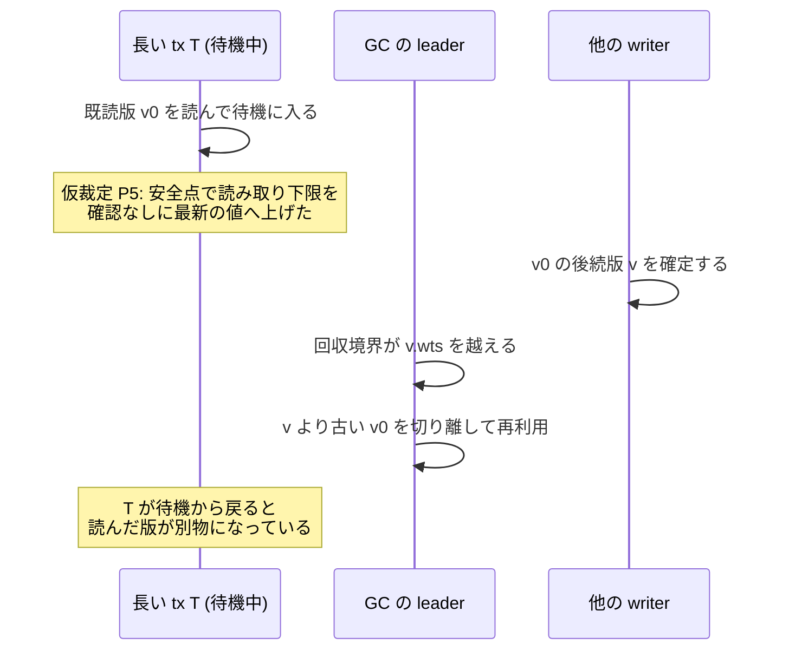
```mermaid
sequenceDiagram
  participant T as 長い tx T (待機中)
  participant G as GC の leader
  participant W as 他の writer
  T->>T: 既読版 v0 を読んで待機に入る
  Note over T: 仮裁定 P5: 安全点で読み取り下限を<br/>確認なしに最新の値へ上げた
  W->>W: v0 の後続版 v を確定する
  G->>G: 回収境界が v.wts を越える
  G->>G: v より古い v0 を切り離して再利用
  Note over T: T が待機から戻ると<br/>読んだ版が別物になっている
```

**図の読み方。** md_14 の試作の途中で、安全点で読み取り下限を最新の MinWts − 1 へ上げる仮裁定 P5 を入れたときに実際に起きたこと (md_14 §3.3)。
待機の開始で既読版の pointer・wts・status を控え、終わりに照合する保持版検査で、E-hb 3,938 件中 159 件、E 3,882 件中 174 件が変わっていた。
修正 (前進に成功したときだけ、確定の後に t′ − 1 を公開) の後は全計測・全検査で 0 件になった (md_14 §1 項 4・§3.3)。

| 段・規則 | 証明のどこで使うか (md_26 §7) | 崩すと何が起きたか (md_26 §8) |
|---|---|---|
| rts を上げてから観測し直す | 補題 2 (確認の後に既読版と確認時刻の間へ他 tx の版が確定しない) | UG3 + O1 で閉路の反例 38 step (md_10) |
| 確認が全部成功してから確定する | 公開する時刻に全既読版が見えている (補題 1) | E-now の壊し: 既読不一致を無視して前進させると、保持版の変化 1,484・1,649 件 (md_21 §5) |
| 確定の後に、成功したときだけ公開する (PUB) | (I1)(I2) の保存 | UG1・U3a で GC 違反 (md_10・md_4) |
| floor を確認なしに上げない (PUB) | (I2) の「floor が上がった場合」が必ず直前の確認に結び付く | **P5** (上の図、md_14) |
| 公開した floor より古い時刻へ戻らない (CAND) | (I1) の取り消しの場合 | UF1 で GC 違反 (md_10) |
| floor を上げる確認を始めた後は読まない (RA) | 最後の確認が全既読版を覆う | 列 X1・X2 (紙の上、探索していない) |
| 後続の確定版を根拠に回収する (RC) | 補題 R | U4 で GC 違反 (md_4) |

**早い abort の判定 D の健全性 (md_31 §3.1)。** md_31 は、key ごとの物理的な版の列・GC の切り離しと再利用・前進・validation を持つ小モデルで、
「D が真になった状態から到達する全状態で、その tx の validation の既読検査が成功しない」(SOUND) を調べた。validation は D と別の関数で、保存した later_ver_ から鎖を辿る (Cicada の validation の写し)。
2 tx の全列挙 115 状態と 3 tx の予算内列挙 1,446 状態で違反なし、壊した判定 2 種 (pending を含める・既読版自身を含める) は validation 成功までの反例を出した。
**有限の範囲での確認であって証明ではない** (読む key は 1 個、writer は 1〜2 tx、前進成功の遷移は W* を仮定、md_31 §3.1)。

**判定器には、この型の誤りが見えない。** P5 と E-now の壊しでは、直列化の判定器の巡回は 0 のまま、保持版検査だけが変化を検出した (md_14 §3.3、md_21 §5)。
今の計装は読んだ時点の wts を控えるだけで、早すぎる回収はそれが巡回を作らない限り判定器の対象外である (md_24 §1 項 3)。§4.3.1 の (a) の列も、判定器と保持版検査のどちらの照合範囲にも入らない (md_36 §6)。

### 4.5 実物の検査で確かめたこと

| 何を | 結果 | 出所 |
|---|---|---|
| stock Cicada の YCSB point read / update | 7 走行すべて巡回 0。壊した Cicada 3 本は巡回として検出 | md_3 §1・§4 |
| stock の TPC-C 小走行と insert | 5 走行すべて巡回 0。insert を壊した版を orphan read として検出 | md_17 §1 |
| 比較相手の最良設定の stock | 32 run で巡回 0。inline slot の版を 3 点で比べ 35 run すべて食い違い 0 | md_20 §1・§3 |
| 構成 C・E・E-max・構成 B・read-only 修正の各 variant | すべて巡回 0 (md_6 10 走行、md_14 10 run、md_21 6 cell、md_23 15 走、md_22 24 走) | 各資料の正しさの節 |
| 構成 E・E-max の保持版検査 | 修正後の全計測で待機中の既読版の変化 0 (md_14)、E-max 等 6 cell で 0 (md_21) | md_14 §1 項 5、md_21 §1 項 6 |
| 方策 b・c と shadow (最良 genome、trace build) | 8 run すべて巡回 0、integrity の数値項目 0、保持版の変化 0。壊した判定 (pending を含める) は実機で pending による判定に一度も到達せず、実機での検出力は示せなかった | md_31 §7 |
| 区間 GC の試作 (比較用、§6.10) | stock・最小形・一般形の 30 走行すべて巡回 0。事前登録の壊し正例 (長い read-only tx の cell) は発火 0 で不成立。事前登録外の cell での検出 6 件は補助として別に数える | md_18 §5、D2324 |
| 修理後の CCBench の Cicada (local branch、promotion 有効の 8 genome) | YCSB 32 走行と TPC-C 16 走行 (と OPT=1・PROMO=0 の代表の 2 走行) がすべて巡回 0。修理 1 だけを外した壊し patch は巡回 308 を検出 | md_32 §6・§7 |

**判定の上限は indeterminate である。** Cicada には Silo・MOCC の証拠面に当たるものが無く、判定器は「巡回があれば non-serializable、無ければ indeterminate」しか返さない (md_3 §1)。
記録の水準を上げる中間案 M (読み束縛・公開の双方向照合・read 側の API 照合を repo 外の起動器の合否に入れる) はユーザー裁定で採られたが (D2305 項 4)、起点で未実装である。
M を満たした variant の性能値は「照合の中身を明記した測定値」として論文で扱ってよいとされている (D2305 項 4 の (2))。
【空欄: md_33 (中間案 M の実装)】。なお M の設計の対象 (`INLINE_VERSION_OPT=0`) と、比較相手の最良設定と本稿の計測の土台 (`INLINE_VERSION_OPT=1`) は食い違っている (md_24 §3.5、md_11 §6)。

**本稿が書かない文:** 「Cicada + 前進 + GC 接続は serializable」「Cicada 実装は GC 安全」「巡回が無いので正しい」「試作は論証の仮定を満たす」「判定器の巡回 0 と保持版の変化 0 は全走査の物理安全を示す」(md_24 §7、md_26 §11、md_36 §0.1)。

---

## 5. 実装: Cicada への inert patch

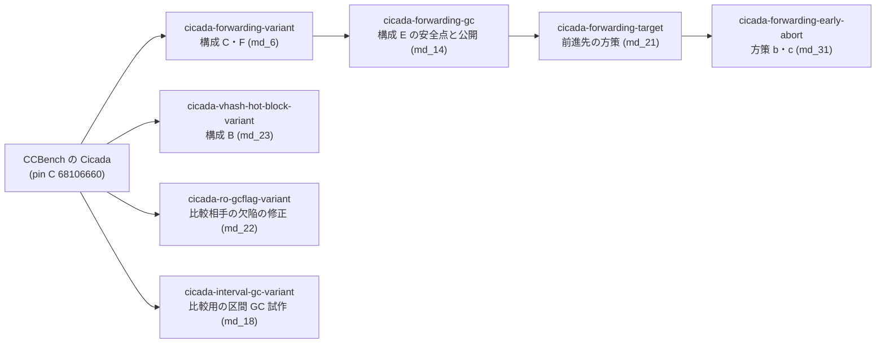
```mermaid
flowchart LR
  pin["CCBench の Cicada<br/>(pin C 68106660)"] --> v["cicada-forwarding-variant<br/>構成 C・F (md_6)"]
  v --> g["cicada-forwarding-gc<br/>構成 E の安全点と公開 (md_14)"]
  g --> t["cicada-forwarding-target<br/>前進先の方策 (md_21)"]
  t --> ea["cicada-forwarding-early-abort<br/>方策 b・c (md_31)"]
  pin --> h["cicada-vhash-hot-block-variant<br/>構成 B (md_23)"]
  pin --> ro["cicada-ro-gcflag-variant<br/>比較相手の欠陥の修正 (md_22)"]
  pin --> igc["cicada-interval-gc-variant<br/>比較用の区間 GC 試作 (md_18)"]
```

**図の読み方。** patch の重ね方。左から右へ重ねる。下 3 本は独立の patch である。すべて `patches/` にあり、macro を定義しなければ元の CCBench と同じ挙動になる (inert、D16 / D18 / D20)。
**図から読み取ってはならないこと:** read-only 修正 (ro-gcflag) は本案の構成ではなく、比較相手の欠陥の修正である (§6.8)。区間 GC の試作も本案の構成ではなく、既知の方式を比較のために Cicada へ入れたものである (§6.10)。
比較相手の既存欠陥 4 件の修理 (md_32) は patch ではなく CCBench の local branch にあり、この図の土台 (pin C) には入っていない (§6.9)。

### 5.1 土台と比較相手

- **CCBench の Cicada、pin C (`68106660`)。** VHash の測定と検査はすべて pin C の上に patch を重ねて行った。CCBench 側の修理 (build 不能の修理 G、削除経路の修理 2 本、promotion・insert・abort の修理 4 本) は local branch にあり、push は人間の手番である (D2308・D2310・D2327)。pin は C のままである。
- **比較相手は「CCBench の Cicada (pin C) を md_11 の観測最良設定で」と書く。** 観測最良は `BACK_OFF=0, INLINE_VERSION_OPT=1, INLINE_VERSION_PROMOTION=0, REUSE_VERSION=1, WRITE_LATEST_ONLY=0` で、
  既定の設定より rr5・rr50・rr95 で 2.15〜4.54 倍速い (md_11 §6、正しさ未検証の診断値)。md_14・md_18・md_21・md_22・md_23・md_31 はこの設定を土台にした。md_6 の土台は CMake 既定の Cicada である (md_11 §10)。
- **主比較の相手は、この最良設定に ro-gcflag 修正 (`patches/cicada-ro-gcflag-variant.patch`) を入れたものとし、修正なしの stock は修正の効果を分ける対照として同じ round に置く** (D2322 項 2)。
  修正の効果 (a) と本案の効果 (b) は別の行で書く (§6.8)。**起点までの計測 (§6) は修正なしの stock を土台にしており、修正入りを土台にした本案の計測はまだ無い。**
  30 秒走行の追加計測は見積りを示し、1 タスクの合計が 2 node 時間以上なら投入前にユーザー確認を取る。最良設定の正しさの確認 (md_20、D2302) を修正入りの長時間走行へ無条件に転用しない (D2322 項 2)。

### 5.2 構成 C・E の patch

| patch | 中身 | macro |
|---|---|---|
| `cicada-forwarding-variant.patch` (md_6) | §3.4 の前進。論理 K 境界 (先頭から K 版より奥を辿る read) を発火条件にし、事前確認を通れば時刻を進める。F は同じ条件で abort | `CICADA_FWD_ENABLE`・`CICADA_FWD_COUNT` ほか |
| `cicada-forwarding-gc.patch` (md_14) | §3.3 の安全点・確認・確定・公開。待機を 100 µs の slice に刻み、各末尾を安全点にする | `CICADA_GC_SAFEPOINT`・`CICADA_GC_COUNT` |
| `cicada-forwarding-target.patch` (md_21) | 目標時刻の計算だけを変える (E-max・C-max・C-partial・1 tx 1 回)。確認・確定・公開の行は変えていない。新しい `#if` を足していない | 実行時 flag `--cicada_gc_target` ほか |
| `cicada-forwarding-early-abort.patch` (md_31) | §3.3.1 の判定 D と中止の経路。既定 `off` は現行と同じ、`doomed` = 方策 b、`fallback` = 方策 c、`shadow` = 評価して数えるだけ。新しい `#if` を足していない (既存の `CICADA_GC_*` の内側) | 実行時 flag `--cicada_gc_early_abort` |

長い tx は md_6 の試作が足した型 (`CICADA_LONGTX` の、10 read + 1 write の後に待機する型) で、CCBench 自身の「読み取りの後に待つ型」(W5) ではない。W5 は修理 G を含む pin への前進の後に測る予定である (T-2923)。

### 5.3 hot block (構成 B) の patch

`cicada-vhash-hot-block-variant.patch` (md_23、pin C の 3 file、421 行) は §3.6 の hot block を入れる。`read_internal` の第 1 段 (対象時刻より新しい版を飛ばすループ) だけを置き換え、
第 2 段 (PENDING 待ち・ABORTED 飛ばし) と read set の記録は stock のままである。書き込みは版の挿入を key ごとの書き区間の中で行い、挿入位置が K 未満なら hot を shift する。
K はコンパイル時の値 (1, 2, 4, 8) で、未定義なら stock と同じ (md_23 §2、D2311)。

### 5.4 検査の計装

- **直列化の判定器:** Cicada の trace (`instr-cicada-trace*.patch`) を izanagi の判定器に掛ける (D2279・D2294)。性能用 build には入れない (観測者効果の分離)。
- **保持版検査:** 待機の開始で既読版の pointer・wts・status を控え、終わりに照合する (md_14 §3.3)。判定器に見えない早すぎる回収を見るための検査である。書き込み検査の走査中の版と次の tx の既読版は見ない (md_36 §6)。
- **GC の計器:** 回収境界の遅れ (leader が 10 µs ごとに取る等間隔標本)・論理生存版数・版の保持時間。計器入りの別 build で取り、性能値には使わない (md_14 §4.1)。

---

## 6. 予備評価

> **この章の値の地位。** すべて探索段の予備的な値で、**未検証の診断値**である。GC の指標 (回収境界の遅れ・生存版数・保持時間) は計器入り build の値で性能値ではない。
> throughput は計器も trace も外した build の値だが、比較相手と処置の正しさは「巡回 0、上限 indeterminate」までで、中間案 M の照合も確認段の走行も無い。
> 構成 E の試作は論証の仮定を満たさない箇所があるが (§4.3.1)、値はその試作で取った当時の観測として残す。
> 確認段 (評価計画の草稿 v1 §5、未発効) の走行で置き換える箇所に【確認段で差し替え】を付けた。

### 6.1 設定

| 項目 | 値 |
|---|---|
| 機材 | Pegasus の計算ノード (Xeon Platinum 8468、48 core)。1 job = 1 条件群で、条件群を複数ノードへ同時刻に投げた (md_14 §4.1: 6 job を 6 台、md_21 §4.1: 7 job を 7 台、md_31 §5.1: 6 job を 6 台) |
| Cicada | pin C + patch、md_11 の観測最良設定 (§5.1)。ro-gcflag 修正は入れていない |
| 負荷 | YCSB、48 thread、100 万件、rratio 50、max_ope 10、3 秒 |
| 長い tx | 長い thread 4 本。読み終えて待つ型 = 10 read + 1 write の後に待機 (1 ms / 10 ms)。読み続ける型 (many_ops) = 1,000 操作・read 90% |
| 反復 | 性能は計器なし build の 3 rep、GC 指標は計器 build の 3 rep。rep ごとに腕の順を回した。各 run の前に単独性を確認した |
| 腕 | stock、C (アクセス駆動)、E-hb (安全点で GC flag だけ立てる)、E-now、E-max、E-max-once (1 tx で目標計算を 1 回)、b (早い abort だけ)、c (E-max + 早い abort) |

**主比較は E 対 E-hb である。** 両者は前進と公開だけが違う組で、1 因子の比較になる。E 対 stock は待機の刻み方と flag の両方を含むので、E の効果として書かない (md_14 §4.4)。
方策 c は E-max との差で読み、b は E-hb との差で読む (md_31 §5.1)。

### 6.2 回収境界の遅れ: 前進が成り立つ条件では縮んだ (md_14)


**図の読み方 (md_14 の gc-connection)。** 行 = 長い tx の 4 条件 (待機 1 ms / 10 ms × zipf 0.9 / 0)、列 = (a) 回収境界の遅れの平均 (ms)、(b) 論理生存版数の平均 (百万)、
(c) 版の保持時間の平均 (ms)、(d) E の前進の成功率 (%)。横軸 = GC 間隔 (µs)、色 = 腕。**言えること:** zipf 0 では E が遅れ・生存版数・保持時間を縮め、zipf 0.9 では「今」への前進がほぼ失敗して E と E-hb が重なる。
**言えないこと:** 計器入り build の値で、E の前進先は「今」(§6.3 の E-now に当たる)。

| 待機 10 ms (md_14 §4.2、rep 中央値) | 遅れ ms (stock / E-hb / E) | 論理生存版数 千 (stock / E-hb / E) | 版の保持時間 ms (stock / E-hb / E) | E の前進 成功 / 試行 |
|---|---|---|---|---|
| zipf 0・GC 10 µs | 18.6 / 19.3 / **8.9** | 1,299 / 1,311 / 1,164 | 17.3 / 18.2 / 9.6 | 15,653 / 34,092 |
| zipf 0・GC 1 ms | 18.9 / 19.5 / 11.2 | 1,304 / 1,316 / 1,199 | 17.6 / 18.3 / 11.8 | 3,589 / 7,500 |
| zipf 0.9・GC 10 µs | 24.3 / 20.5 / 20.1 | 1,370 / 1,316 / 1,310 | 23.2 / 18.9 / 18.5 | 38 / 23,366 |

zipf 0・待機 10 ms・GC 10 µs で、E 対 E-hb は遅れの平均 8.9 ms 対 19.3 ms (−54%)、論理生存版数の平均 116.4 万 対 131.1 万 (−14.7 万)、版の保持時間の平均 9.6 ms 対 18.2 ms (−47%) で、
3 rep の値は重ならなかった。待機 1 ms でも遅れ −41%・保持時間 −53% だった (md_14 §1 項 1)。【確認段で差し替え】


**図の読み方 (md_14 の gc-connection-mechanism)。** 同じ条件の rep 0 の等間隔標本を時系列で重ねた (起動直後を避けた 200 ms の窓)。stock と E-hb は待機ごとに遅れが 11〜20 ms まで伸びるのこぎり形で、
flag だけでは形が変わらない。E は前進が成り立つ待機で 0〜9 ms に留まり、前進に失敗した待機だけ 20 ms 近くまで伸びる。**rep 0 の 1 例の描写で、統計ではない。**

**flag だけでも公開は戻るが、境界は止まったまま。** zipf 0.9・待機 10 ms で、E-hb は公開を 3 秒あたり約 290 回から約 5,700 回へ戻し、遅れ −3.5 ms・生存版数 −4.7 万と小さく効いた。
MinRts を決めた thread が長い tx だった標本の割合は E-hb で 0.85〜0.99 に上がり、E で前進が成り立つと 0.13〜0.31 へ下がった (md_14 §1 項 3)。

### 6.3 前進先: 既読の可視区間に収まる最大 (E-max) は、中程度の偏りでも縮めた (md_21)

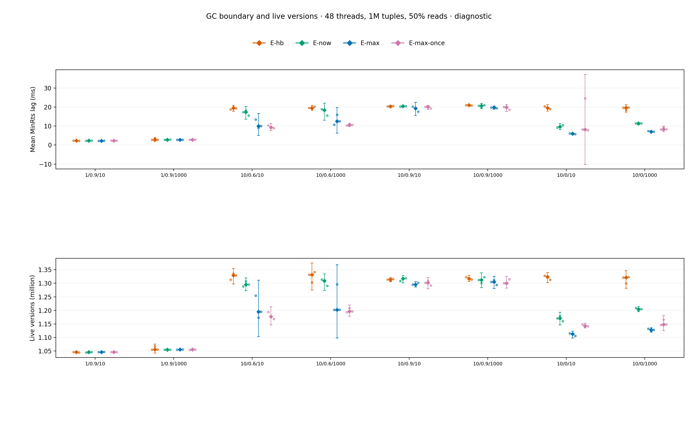

**図の読み方 (md_21 の target-policy-gc)。** 上段 = 回収境界の遅れの平均 (ms)、下段 = 論理生存版数の平均 (百万)。横軸の目盛は「待機 ms / zipf / GC 間隔 µs」、色 = 腕。
小さい点が各 rep、菱形が rep 中央値、縦線は n = 3 の小標本 95% CI。**言えること:** 待機 10 ms の長い tx があるとき、zipf 0 と 0.6 では E-max が遅れと生存版数を縮め、zipf 0.9 ではどの腕もほぼ同じ。
**言えないこと:** 計器入り build・3 秒・3 rep の値で、性能値でも「有意」でもない。遅れは timestamp 空間の ms (clock boost を含み、実時間ではない)。

| 待機 10 ms・GC 10 µs (md_21 §4.2、rep 中央値) | 遅れ ms (E-hb / E-now / E-max) | 論理生存版数 千 (E-hb / E-now / E-max) | 保持時間の中央値の bin 上限 ms (E-hb / E-now / E-max) | MinRts を決めた thread が長い tx だった割合 (E-hb / E-now / E-max) |
|---|---|---|---|---|
| zipf 0 | 19.51 / 9.64 / **5.96** | 1,323 / 1,171 / 1,113 | 16.4 / 8.2 / 4.1 | 0.95 / 0.24 / 0.01 |
| zipf 0.6 | 19.47 / 17.40 / **10.02** | 1,330 / 1,295 / 1,195 | 16.4 / 16.4 / 8.2 | 0.88 / 0.62 / 0.13 |
| zipf 0.9 | 20.38 / 20.44 / 19.35 | 1,314 / 1,317 / 1,295 | 16.4 / 16.4 / 16.4 | 0.99 / 1.00 / 0.94 |

- zipf 0.6 で E-max の遅れは E-hb 比 −9.5 ms (19.5 → 10.0 ms)、論理生存版数 −13.4 万版、保持時間の中央値 16.4 → 8.2 ms。E-now は同じ条件で 17.4 ms とほぼ効かない (md_21 §1 項 1)。
  −9.5 ms は md_21 §4.2 の「rep ごとの差の中央値」で、表の中央値どうしの差とは別の集計である。保持時間は 2 のべきの bin の上限なので、16.4 → 8.2 ms は「中央値が 1 bin 下がった」と読む。
- zipf 0 では遅れが 19.5 (E-hb) → 9.6 (E-now) → 6.0 ms (E-max) (md_21 §1 項 2)。
- 待機 1 ms・zipf 0.9 では 5 腕とも遅れ 2.3〜2.9 ms で差が見えない。待機が GC 間隔の数倍しかなく、長い tx が境界を長く止めない (md_21 §4.2)。
- md_31 の同時刻の計測でも、skew 0.6 で E-hb 19.8 → E-max 9.3 ms と同じ向きが再現した (md_31 §5.1)。

**評価計画の §5.5 を当てた語 (md_34、D2325)。** 評価計画の草稿 v1 の §5.5 (探索段の結果の読み方、結果の着地前に書いた規則) を、規則を変えずに md_21・md_23 に当てた結果は次のとおりである。
語は探索段の語 (「予備的に…」「判定不能」「欠測」) だけで、確認段の判定ではない。

- **p\* = c (既読の可視区間に収まる最大の時刻 = E-max)。** 主 cell (待機 10 ms・zipf 0.9・GC 100 µs) が測られていないので、規則の順序で待機 10 ms・zipf 0.9・GC 10 µs を使い、
  md_21 の門 (target patch を重ねた門用 build) を通った E の方策が c だけだったので候補は c だけになった。md_14 の門で E-now を候補に入れる参考の読みでも c になる (md_34 §15.3)。
- **E-max 対 E-hb (遅れと生存版数、P21-1) の判定語は、全 cell で「判定不能 (門未完了)」である。** 対照の E-hb が md_21 の門を通っていないためで、規則の順序では値より先にこの語が当たる (md_34 §15.2・§15.3)。
  門が完了していたと仮定した参考の語でも、A/A 腕が無いので、zipf 0・0.6 の組のように全 round の差が閾値を大きく超えた組は「判定不能 (A/A なし)」になり、「予備的に支持」はどの組にも出ない。
- **したがって、上の表の縮み (zipf 0.6 で 19.5 → 10.0 ms) は md_21 が観測した値として残すが、評価計画の語では支持を得ていない。** 本稿はこれを「探索段の予備的な観測」とだけ書く。
- 確認段では H4 を E_sp(c) 対 E_hb(c) (待機型の 4 cell、遅れと生存版数) と E_sp(c) 対 E_sp(a) で比べる (md_34 §15.7)。確認段の門 (S0) が E-hb と E-now を門用 build で門に掛け、A/A 腕を置いて判定する。【確認段で差し替え】

### 6.4 強い偏りでは E-max だけでは縮まず、早い abort を足すと縮んだ (md_21・md_31)

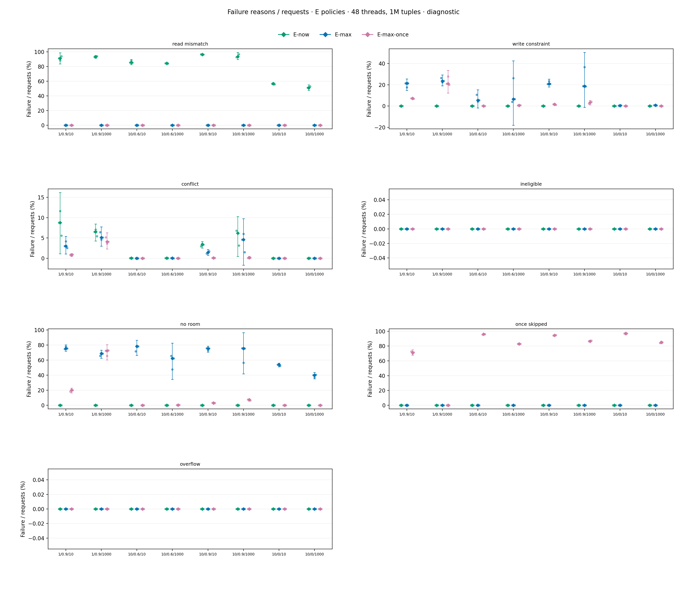

**図の読み方 (md_21 の target-policy-reasons)。** 失敗理由ごとの panel で、縦軸は理由の回数 / 要求 (%)。E-now の失敗はほぼすべて既読不一致、E-max は既読不一致 0 で `no_room` と書き込み制約、
E-max-once は 2 回目以降の要求が `once skipped`。

- zipf 0.9 では E-max でも遅れ −1.0 ms (20.4 → 19.4 ms) に留まり、E-max の要求の約 75% が `no_room` だった (条件別には 40〜78%) (md_21 §1 項 3・§4.3)。
- 「今」への前進 (E-now・md_14 の E) は zipf 0.9 で試行の 0.05〜0.27% しか成功せず、失敗の 88〜96% が既読不一致だった (md_14 §1 項 2)。
  md_14 の逐語: 「md_6 の zipf 0.9 の条件だけで試していたら、U0 の効果は見えなかった。」

**`no_room` の読みの訂正 (md_31 §3.3、D2320 項 3)。** 初稿は md_21 §4.3 に従い、`no_room` を「(a) 一度成功した後で上端が動かない」と「(b) 既読のどれかが上書き済みで validation での abort が決まっている」の混合と書いた。
md_31 が `no_room` を前進の成功前 / 成功後に分けて数えると、zipf 0.9 の方策 c の計数 rep で成功後が 2,465〜6,829 回、成功前が 944〜1,353 回で、**`no_room` の大半は前進に一度成功した後の再要求だった。**
また上端 U は pending の版も含むので、成功前の `no_room` でも pending が abort すれば validation は通りうる。**`no_room` は abort の確定ではなく、確定は判定 D (committed / deleted の witness) で言う。**
方策 c の計数 rep 15 本で、D が真になった総回数は成功前の `no_room` の回数以下 (13 本で等しく、2 本で 1 回少ない) だった。計数は D の真を成功前 / 成功後に分けていないので、言えるのは総回数の上限だけである (md_31 §3.3)。

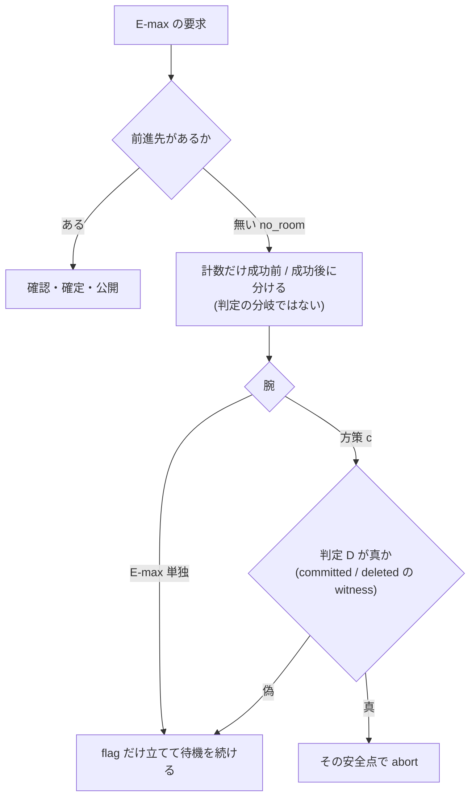
```mermaid
flowchart TB
  req["E-max の要求"] --> nr{"前進先があるか"}
  nr -->|ある| ok["確認・確定・公開"]
  nr -->|無い no_room| cnt["計数だけ成功前 / 成功後に分ける<br/>(判定の分岐ではない)"]
  cnt --> arm{"腕"}
  arm -->|E-max 単独| keep["flag だけ立てて待機を続ける"]
  arm -->|方策 c| d{"判定 D が真か<br/>(committed / deleted の witness)"}
  d -->|真| ab["その安全点で abort"]
  d -->|偽| keep
```

**図の読み方。** md_31 §2・§3.3 の手順である。方策 c は `no_room` を返した要求のたびに、前進の成功前か成功後かを問わず D を評価する (§3.3.1 の擬似コードと同じ)。
成功前 / 成功後の分けは、T-2930 の要求で足した計数の分け方で、判定の分岐ではない。観測としては、D が真になった総回数は成功前の `no_room` の回数以下で、評価回数 (成功後を含む) よりずっと少ない。計数は D の真を成功前 / 成功後に分けていないので、成功後の `no_room` で D が真になった割合はこの計数からは分からない (md_31 §3.3)。
**図から読み取ってはならないこと:** 各分岐の割合は図に書いていない。上の計数を見る。

**方策 c は、E-max が効かない高い偏りで回収境界を縮めた (md_31 §5.1、予備的な結果)。**

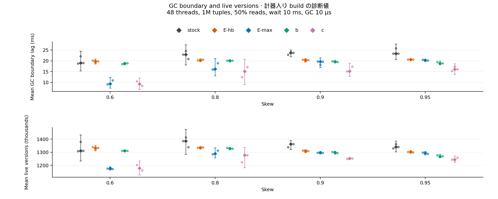

**図の読み方 (md_31 の md31-early-abort-gc)。** 横軸 = skew (待機 10 ms・GC 10 µs の 4 job)、上段 = 回収境界の遅れの平均 (ms、leader が 10 µs ごとに取る等間隔標本)、下段 = 論理生存版数の平均 (千)。
色 = 腕。小さい点が各 rep、菱形が rep 中央値、縦線は小標本 95% CI (n = 3)。**言えないこと:** 計器入り build・3 秒・3 rep の予備的な値で、性能値でも「有意」でもない。評価計画の §5.5 の語はまだ当てていない。

| 待機 10 ms・GC 10 µs (md_31 §5.1、rep 中央値) | 遅れ ms: E-hb | E-max | b (早い abort だけ) | c (E-max + 早い abort) | 同じ rep 内の差の中央値: b − E-hb | c − E-max |
|---|---|---|---|---|---|---|
| skew 0.6 | 19.83 | 9.31 | 18.73 | 9.23 | −0.95 | −0.07 |
| skew 0.8 | 20.25 | 16.21 | 20.06 | 15.13 | −0.24 | −1.80 |
| skew 0.9 | 20.38 | 19.64 | 19.61 | 15.19 | −0.70 | −2.92 |
| skew 0.95 | 20.61 | 20.28 | 18.86 | 16.04 | −1.75 | −4.11 |

- **E-max と方策 c を別の行で読む。** E-max の効果 (E-hb との差) は skew 0.6 で大きく、0.9 以上でほぼ消える。方策 c の上乗せ (E-max との差) は逆に skew 0.6 でほぼ 0、0.9 で −2.9 ms、0.95 で −4.1 ms である。
  skew 0.9 で E-max 19.6 → c 15.2 ms、0.95 で 20.3 → 16.0 ms で、rep の範囲は重ならなかった (md_31 §1 項 2)。論理生存版数の差の中央値 (c − E-max) は skew 0.8 / 0.9 / 0.95 で −3.6 万 / −4.6 万 / −5.2 万版 (md_31 §5.1)。
- **早い abort だけ (方策 b) では縮まない。** b − E-hb は全 skew で 2 ms 未満だった。D の到達は十分ある (skew 0.9 で試行の 51%) ので、「D が真にならない」のではなく「D が真になって早く終えても境界が縮まない」型の結果である。
  md_31 の推定 (未検証): 回収境界は長い thread 4 本の下限の最小で決まり、上書きされていない試行 (約半分) は待機 10 ms の間ずっと下限を押さえる。b はそれを前進させない。
  c は前進できる試行を前進させ、前進できず確定した試行を終えるので、両方の型の試行が境界から外れる (md_31 §5.1)。
- 待機 1 ms・GC 1000 µs では 5 腕とも遅れ 2.5〜2.9 ms で差は見えない (md_31 §5.5)。
- 本稿は方策 c を「E-max の改良」とは書かず、前進先の選び方とは別の方策として書く (md_41 の依頼、D2320 項 2)。【確認段で差し替え】

**偏りを 0.99 まで上げたときの前進の余地 (md_29 §0 項 4、md_28 の問いを統合)。** 計器入り build で負荷の空間を広く測ると、偏りを上げると深い update read は増えるが、深い read のうち前進の候補がある割合は下がった
(長い tx なし・rr 50・最良設定で、skew 0.5 の 0.79 から skew 0.99 の 0.017 へ)。積 h2 (候補数 / update read 全件) は 0.01 前後で頭打ちになり、層 S の最大は 0.016 だった。
**md_29 の値は観測時点の機会量で、機構を実装したときの効果ではない** (md_29 §0)。

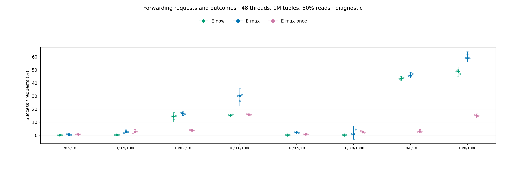

**図の読み方 (md_21 の target-policy-success)。** 縦軸 = 成功 / 要求 (%)。要求 = 待機の安全点で GC 間隔が経過し自分の GC flag が 0 だった回数。E-hb は前進を試さないので系列が無い。
**言えないこと:** E-max の要求には一度成功した後の要求も入る (上の訂正のとおり、`no_room` の大半はそれである) ので、この比は「tx の何割が前進できたか」ではない (md_21 §4.3、md_31 §3.3)。

**成功回数・成功率は GC 改善の指標にしない。** 成功率は前進先の選び方の比較の指標で、「tx の何割が前進できたか」でもない。
GC の側は §6.2〜§6.4 の遅れと生存版数で読む。前進で下がるのは「一部の旧版の保護義務」までで、前進先で見える既読版・他の tx の古い時刻・物理参照が残る限り回収は進まない (md_9 §7)。

### 6.5 throughput: 差は検出できなかった

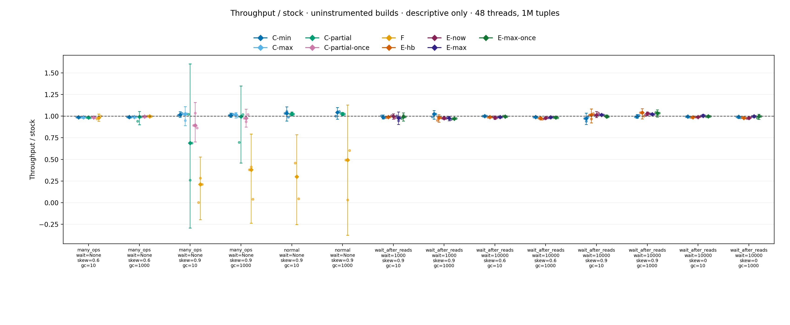

**図の読み方 (md_21 の target-policy-throughput)。** 計器なし build の 3 rep 中央値の stock 比。資料自身が「差は判定しない (記述値)」と書く。

- 構成 E: 計器なし build の stock 比は待機型で 0.96〜1.06、E が発火しない型 (normal・many_ops) でも 0.91〜1.05 ばらつくので、この幅の内側と読む (md_14 §1 項 6)。
- 構成 C (C-min): stock 比 0.97〜1.04。実行コードが同じ腕の間でも 0.97〜1.04 揺れるので、この幅の内側と読む (md_21 §4.5)。
- 方策 b・c: stock 比 0.97〜1.04 で、E 系の腕の揺れ (0.97〜1.06) と同じ範囲 (md_31 §1 項 7・§5.4)。
- F (abort と再実行): zipf 0.9 で 0.21〜0.49、zipf 0.6 で 0.98〜1.00 (md_21 §1 項 5)。資料は原因を BACK_OFF=0 での即時再実行と推定している (未検証)。

**本稿は throughput の改善を主張しない。** 確認段でも、長い tx を含む cell では throughput が「改善」でも長い tx の単位時間あたり commit 数が「悪化」なら改善を主張しない
(評価計画の草稿 v1 §5.2 の「長い tx を含む cell の共通の条件」)。
throughput の between-run floor (同じ構成を別の時刻に走らせたときの揺れの幅) はまだ無い。【空欄: md_35 (between-run floor)】【確認段で差し替え】

### 6.6 長い tx の完了: 操作数型と待機型を分ける (md_6・md_21・md_31)

**初稿の「長い tx の完了率はどの腕でも 0.03% 以下」は操作数型 (1,000 操作の many_ops) の値である。** 待機型の長い tx (10 read + 1 write の後に 10 ms 待つ) は stock でも完了する (md_31 §6)。2 つを混ぜて書かない。

**(1) 操作数型 (読み続ける型): 前進は起きるが、完了に結び付かない (md_6・md_21)**

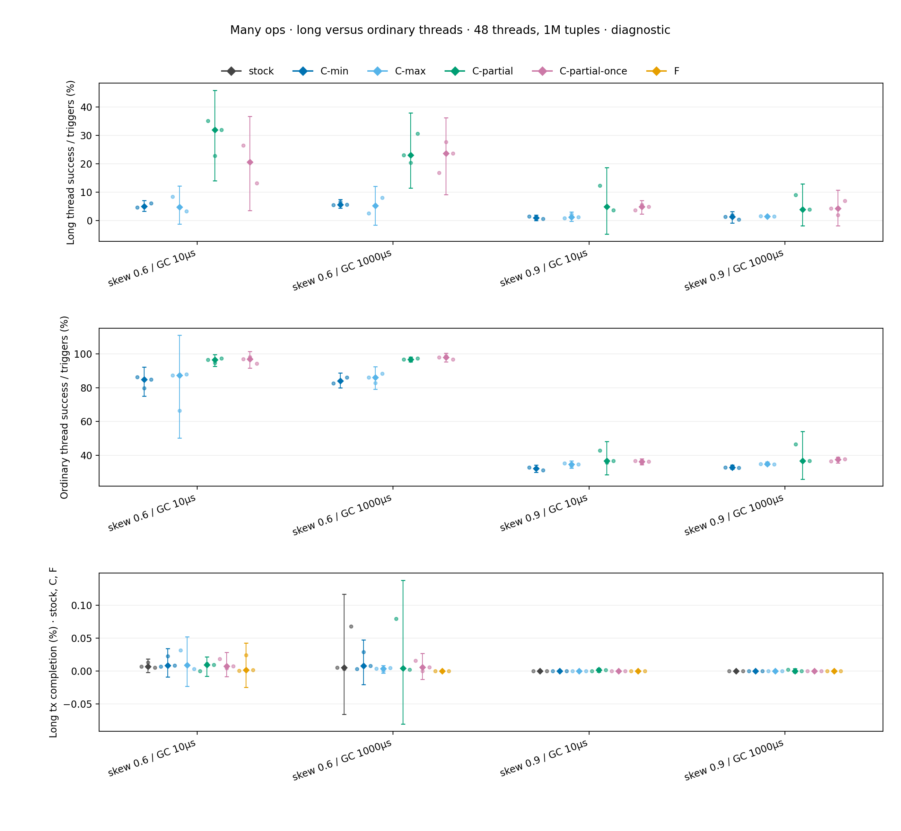

**図の読み方 (md_21 の target-policy-many-ops)。** 上 = 長い thread の成功 / 発火、中 = 通常 thread の成功 / 発火、下 = 長い tx の完了率。横軸 = zipf / GC 間隔。

| many_ops・GC 10 µs (md_21 §4.4、rep 中央値) | 長い thread の成功 / 発火 (C-min / C-max / C-partial) | 長い tx の完了率 (stock / C-min / C-partial / F) |
|---|---|---|
| zipf 0.6 | 0.050 / 0.048 / **0.320** | 0.00008 / 0.00022 / 0.00018 / 0.00002 |
| zipf 0.9 | 0.009 / 0.012 / **0.048** | 0 / 0 / 0.00002 / 0 |

- 「区間内の最大」(C-max) は C-min と同じ成功集合を持ち、部分前進 (C-partial) だけが長い thread の成功率を上げた (md_21 §1 項 4)。
- **操作数型の長い tx の完了率はどの腕でも 0.03% 以下で、成功率の向上は完了に結び付いていない** (md_21 §4.4)。本稿は「部分前進が長い tx を救う」とは書かない。
  区間 GC の試作の計測でも、many_ops の長い tx は 3 秒あたり試行 1.7 万〜29 万回に対し commit 0〜1 回で、区間 GC の有無でほぼ変わらなかった (md_18 §7)。
- CMake 既定の Cicada の上の試作 (md_6) では、通常の YCSB で試行の 73〜75% が成功し、1,000 操作の長い thread を含む型では 18〜19% だった。失敗の大半は既読版が前進先で見えない (既読不一致) ことだった (md_6 §1・§5)。
- 操作数型には構成 E の安全点が無いので、方策 b・c は測っていない (md_31 §6)。構成 C は floor を公開しないので、この型の回収境界への効果は測っていない (§2.3)。

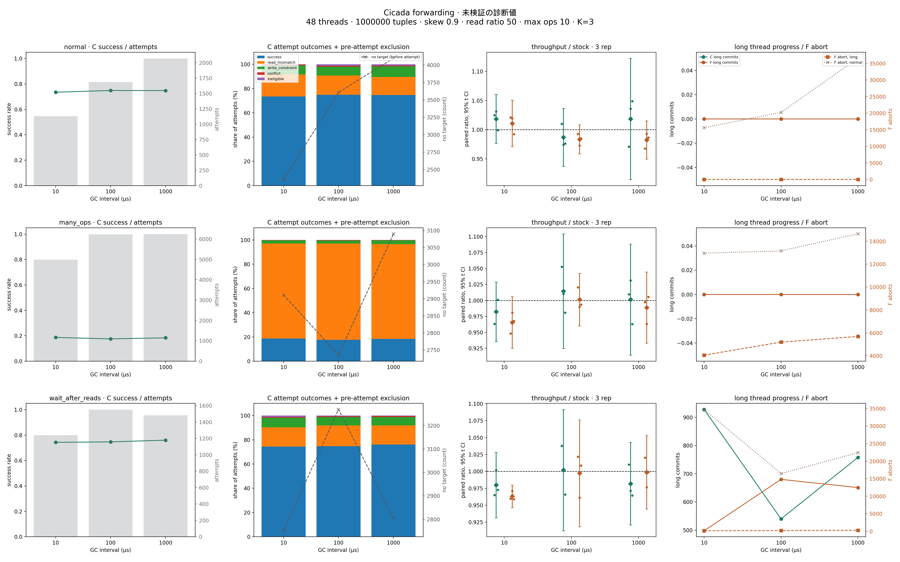

**図の読み方 (md_6 の図)。** 行 = workload、列 = (1) C の成功率と試行数、(2) 試行の内訳と試行前の除外、(3) stock 比の throughput、(4) 長い thread の commit と F の abort。
**言えないこと:** この図の土台は CMake 既定の Cicada で、md_11 の最良設定ではない (最良設定の上の値は §6.5)。計数は各セル 1 rep。

**(2) 待機型 (読み終えて待つ型): stock でも完了し、高い偏りでは待機のごく初めに既読が上書きされて落ちる (md_31)**

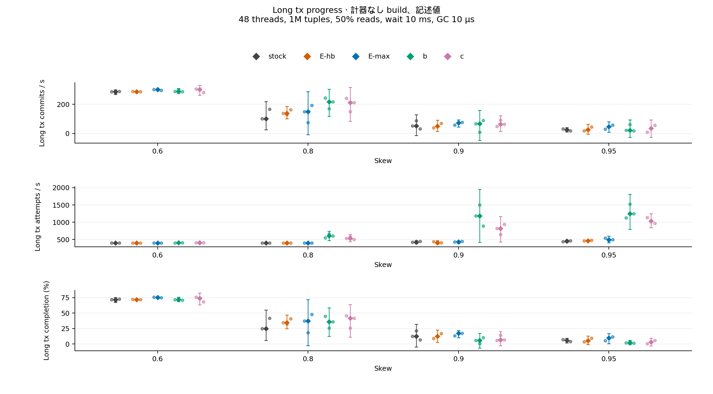

**図の読み方 (md_31 の md31-early-abort-long)。** 横軸 = skew。上段 = 長い tx の commit/秒、中段 = 試行/秒、下段 = 完了率 (commit / 試行)。計器なし build の記述値。
早い abort の腕 (b・c) は試行/秒が増えるので、完了率は分母で下がる。**言えないこと:** rep の揺れが大きく、腕の間の差は判定できない。

| 待機 10 ms・GC 10 µs (md_31 §5.3、計器なし build、rep 中央値) | 完了率 stock / E-hb / E-max / b / c |
|---|---|
| skew 0.6 | 0.719 / 0.720 / 0.755 / 0.718 / 0.741 |
| skew 0.8 | 0.250 / 0.347 / 0.375 / 0.360 / 0.419 |
| skew 0.9 | 0.125 / 0.126 / 0.172 / 0.057 / 0.067 |
| skew 0.95 | 0.057 / 0.056 / 0.099 / 0.019 / 0.033 |

- **rep の揺れが大きい。** skew 0.9 の完了率の rep の値は stock 0.125 / 0.216 / 0.070、E-max 0.134 / 0.176 / 0.172 で、同じ条件の別 job (backoff job) では stock 0.075・E-max 0.051 だった。
  3 秒 × 3 rep では腕の間の差を判定できない (md_31 §5.3)。本稿は「前進で完了率が上がった」とも「下がった」とも書かない。
- **何が待機型を落とすか。** skew 0.9 では長い tx の試行の約 43〜46% で、待機中に既読が committed の版に上書きされ、commit できないことが確定した (E-hb・E-max の shadow)。
  その検出の大半は待機開始から 128〜255 µs の bin に入り、待機のごく初めに確定していると推定する (安全点の回数は数えていない)。残りの失敗の内訳は数えていない (md_31 §6)。
- **BACK_OFF の影響 (記述値)。** BACK_OFF=1 (他は最良設定) では stock の完了率の中央値が同じ job の BACK_OFF=0 より高い (0.188 対 0.075) が、throughput は約 0.29 倍に落ち、回収境界の遅れは 23.3 → 29.9 ms に伸びる。
  BACK_OFF=1 でも E-max は遅れを縮める (29.9 → 20.9 ms) (md_31 §6)。

### 6.7 hot 配置 (構成 B): Cicada の中では throughput を上げなかった (負の結果)

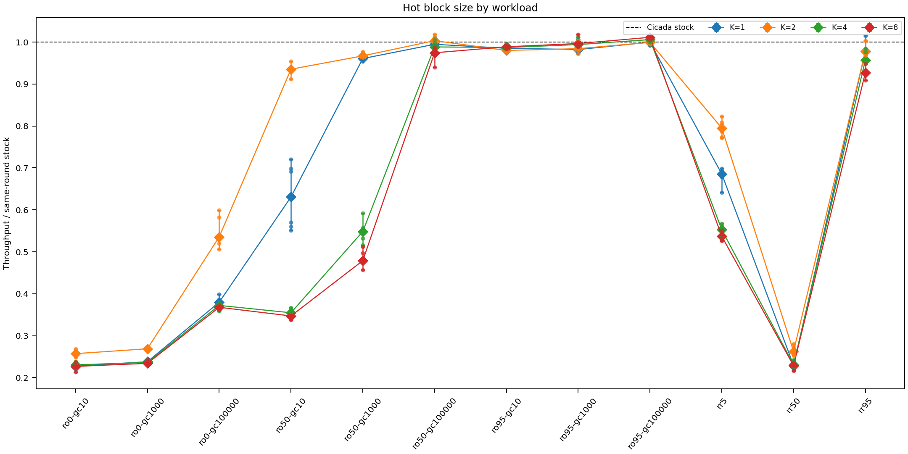

**図の読み方 (md_23 の fig-k)。** 横軸 = cell (read-only 指定率 × GC 間隔、と通常 YCSB の rr5・rr50・rr95)、縦軸 = 同じ round の stock に対する比、菱形 = 6 round の中央値、点 = 全 round、
縦線 = 最小〜最大、破線 1.0 = stock。**言えること:** read-only 95% の 3 cell は 1.0 付近、更新中心の cell は大きく下回る。**言えないこと:** 判定の上限は indeterminate で、perf job が 2 node に分かれ node 差と K の効果を分けていない (md_23 §4)。

**Cicada の外では速かった。** 1 キー分の版選択を 1 thread の latency で測った微小計測 (md_5) では、LLC 外の最新版選択で連続配置 scalar が散在 linked の 0.55〜0.84 倍、
K=8 の深さ 7 で 0.12 倍だった (md_5 §0)。利益は配置 (連続であること) から来ており、この AVX2 実装の SIMD からは来ていない (md_5 §0 項 4)。

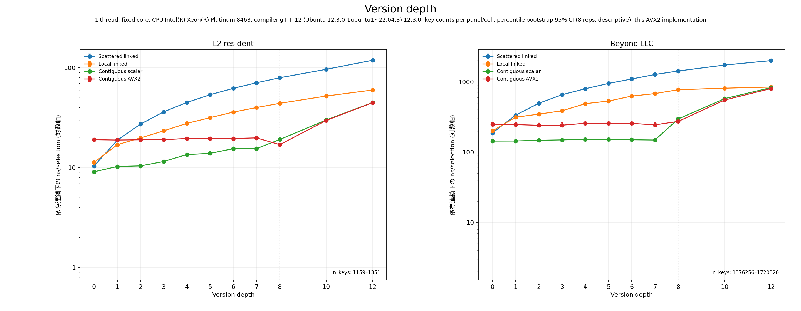

**図の読み方 (md_5 の fig-depth)。** 1 キー分の版選択を 1 thread・固定 core・依存連鎖の latency で測り、K=8 で目的の版の深さを 0 から 12 まで動かした (深さ 8 が hot と cold の境界)。
LLC 外で深さ 0→7 のとき、散在 linked は 187→1,269 ns、連続配置 scalar は 144〜152 ns でほぼ一定だった (md_5 §0)。
**言えないこと:** Cicada への組み込み・並行更新・many-core の throughput は測っていない (md_5 §1)。単位は 1 thread の latency で、下の 48 thread の throughput とは直接比べられない。

**Cicada の中では上がらなかった。** md_23 は 48 thread・100 万 tuple・zipf 0.9・3 秒で、12 cell × 5 腕 (stock、K = 1, 2, 4, 8) を同じ job・同じ round で回し、6 round の比を取った (md_23 §4)。

| cell (md_23 §5、K/stock の 6 round 中央値) | K=1 | K=2 | K=4 | K=8 |
|---|---|---|---|---|
| read-only 95%・GC 10 µs | 0.985 | 0.980 | 0.987 | 0.989 |
| read-only 95%・GC 100 ms | 1.000 | 0.999 | 1.006 | 1.011 |
| rr95 | 0.978 | 0.978 | 0.957 | 0.927 |
| rr50 | 0.229 | 0.262 | 0.231 | 0.229 |

- 評価計画の草稿 v1 §5.5 の探索段の語では、read-only 95% の 12 組すべてが「予備的に不支持 (差なし)」、read-only 0%・rr5・rr50 の全組と read-only 50% の一部が「予備的に不支持 (悪化)」、
  rr95 の K=8 が「判定不能」、主 cell (read-only 95%・GC 100 µs) が「欠測」である。md_34 の独立の再計算も md_23 §5.1 の語と全 48 組で一致した (md_34 §15.4)。
  **この設計には A/A 腕が無いので、仮に効いていても「予備的に支持」の語は出なかった。** 「差なし」は「探索の 6 対で対数比がすべて ±ln(1.10) 以内」の意味で、「効果は 10% 未満」とは書かない。
- **K\* = 1** (md_34 §15.4、D2325 項 2)。選択に使う cell (read-only 95%・GC 10 µs) で K = 1, 2, 4, 8 の throughput の反復中央値がすべて最大の K = 4 と同点だったので、規則により最小の K になった。確認段の H1 は B_1 対 A で比べる。【確認段で差し替え】
- 上がらなかった理由として md_23 が計器の数から挙げたのは 3 点である (因果の内訳ではない): (a) 深い読みが hot より奥に多い (GC 100 ms・read-only 95% で、第 1 段が飛ばした版数は 16 版以上が 21%)、
  (b) 浅い読みは元々速い (GC 10 µs では 0 版が 82%)、(c) hot を保守する key ごとの排他の待ち (更新中心の cell で 1 update commit あたり約 9.8 万〜11.8 万サイクル) (md_23 §1 項 3・4・§6)。
- 正しさ: 3 つの trace cell × 5 腕の 15 走すべてで巡回 0。hot を壊した版 2 本はどちらも巡回として検出された (md_23 §1 項 5・6)。

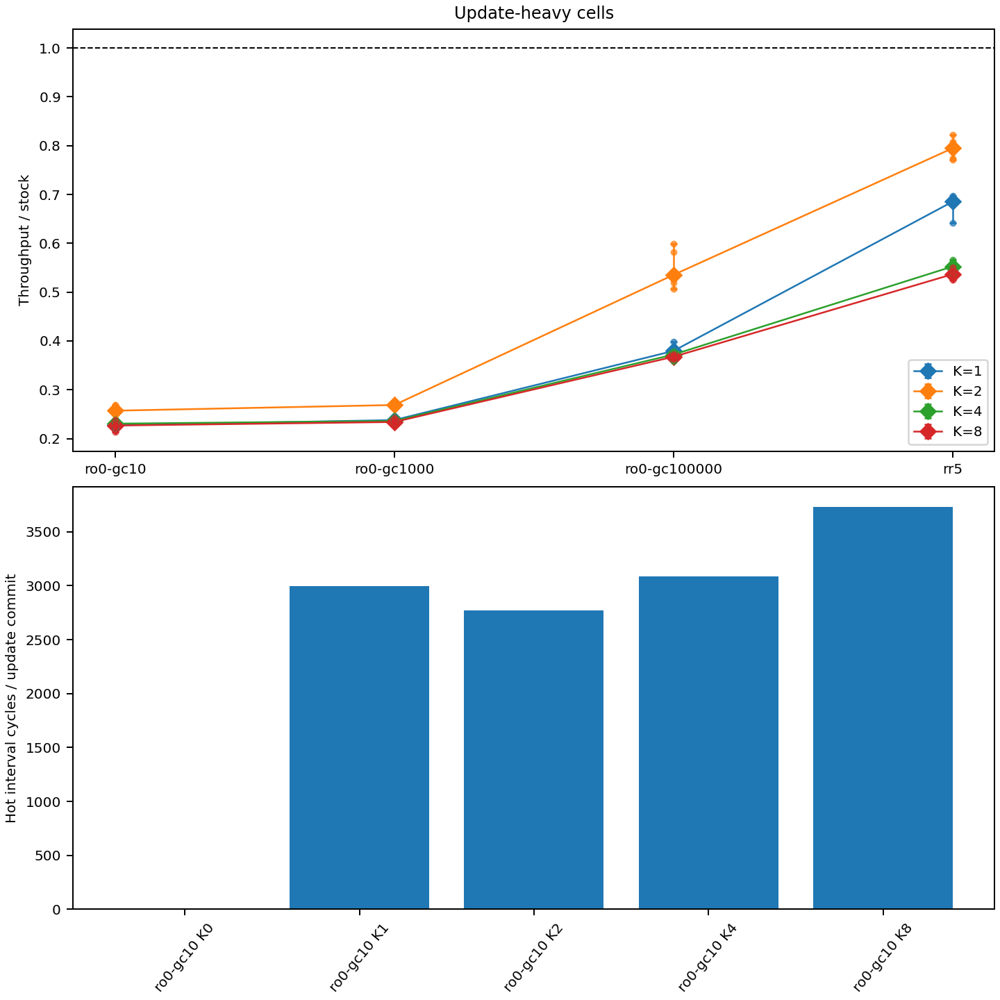

**図の読み方 (md_23 の fig-write)。** 上段 = 更新中心 4 cell の stock 比、下段 = read-only 0%・GC 10 µs の計器 build での hot の書き区間の**保持**サイクル / update commit。
**図の限界:** 下段は保持だけで、主因の「待ち」を描いていない (待ちは md_23 §6 の表で読む。図の修正は T-2927)。

**hot 配置の伸びしろの上限 (md_29 §0 項 3、計器入り build の機会量)。** 負荷の空間を広く測ると、版の列の先頭より奥を読む割合は、read-only 側 (古い snapshot) と、最良設定での高偏り・多操作の update read で大きかった
(層 O の水準別中央値で、全 read の位置 ≥ 1 の割合 h1 は、長い read-only tx を 1 worker が続ける条件 batchR で 0.51〜0.53、read-only 指定率 50・95% で 0.49〜0.52。update read の位置 ≥ 1 の割合 u1 は、層 S の最良設定・長い tx なしで skew 0.99 のとき 0.10〜0.22)。
一方で位置 ≥ 8 はまれで、層 S の batchR 以外では最大 0.027 だった。md_29 は第 2 段 (機構を比較相手と直接比べる別 wave) の候補に「read-only 指定率 95%・thread 12」を選んだ (md_23 の read-only 95% は thread 48 で差なしだったので、thread 数を下げた条件で上限と実測の差を確かめる、md_29 §4 の (b))。
**これは機会の大きさであって、hot 配置を実装したときの効果ではない。** md_23 の実測は read-only 95% でも差なし、更新を含むと悪化である (md_29 §0)。

**この負の結果の範囲。** YCSB の point read / update だけ、K = 1, 2, 4, 8、1 つの設計点 (key ごとの seqlock、挿入の CAS を書き区間の中で行う)、探索段の予備的な語 (n = 6、A/A 腕なし、主 cell 欠測)、
指標は throughput だけ (commit あたりの LLC miss は測っていない) (md_23 §11)。**本稿は「hot 配置は効かない」「H1 は棄却された」とは書かない。**
書き込み側の排他を CAS の外へ出す設計は並走中である。【空欄: md_37 (構成 B の書き込み側の排他を CAS の外へ)】

### 6.8 比較相手の書き方: 修正の効果と本案の効果を別の行で書く (D2322 項 2)

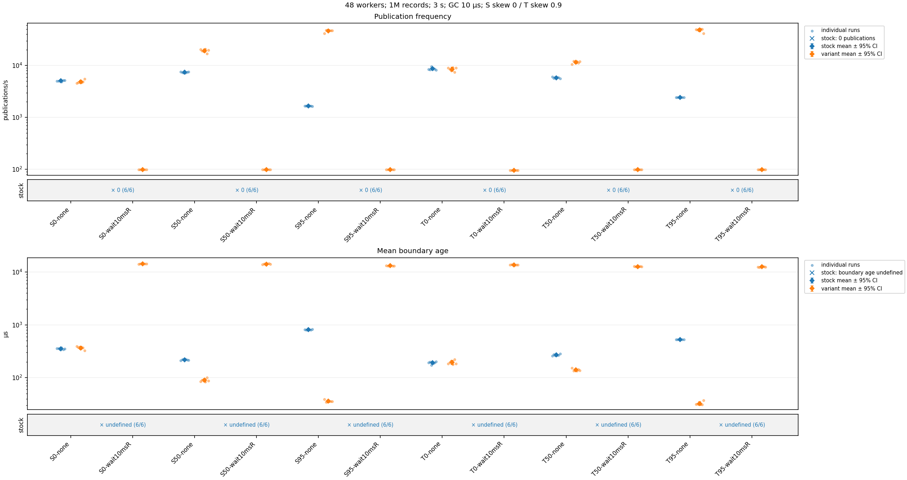

**図の読み方 (md_22 の publication_boundary)。** 12 条件で stock と修正版の公開回数と境界年齢を対数軸に並べた。stock が公開 0 回の条件は軸の下の帯に「0 (6/6)」と書いてある。

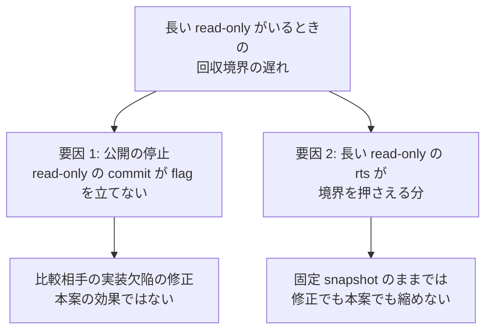
```mermaid
flowchart TB
  total["長い read-only がいるときの<br/>回収境界の遅れ"]
  total --> a["要因 1: 公開の停止<br/>read-only の commit が flag を立てない"]
  total --> b["要因 2: 長い read-only の rts が<br/>境界を押さえる分"]
  a --> fa["比較相手の実装欠陥の修正<br/>本案の効果ではない"]
  b --> fb["固定 snapshot のままでは<br/>修正でも本案でも縮めない"]
```

**図の読み方。** md_22 §6〜§8 の構図 (md_22 はこれを (a)・(b) と呼ぶが、下の D2322 の (a)・(b) と記号が重なるので、ここでは要因 1・2 と書く)。要因 1 と要因 2 を分けて書く。

stock Cicada は、全 worker の GC flag がそろったときだけ leader が境界を公開する。read-only の commit は後始末 (`mainte()`) を通らないので flag を立てず、
read-only だけを続ける worker が 1 本いると公開が止まる。長い read-only (10 ms) を 1 本続けた 6 条件で、stock は 3 秒間の公開が 36 走すべてで 0 回だった。
read-only の commit でも `mainte()` を通す修正 (`patches/cicada-ro-gcflag-variant.patch`、D2317) を入れると公開は 3 秒あたり 289〜299 回に戻った (md_22 §0 項 1)。
計器なし build の throughput 比 (修正 / stock) は長い read-only ありで 1.56〜16.83、なしで 0.964〜1.073 だった (md_22 §0 項 3、3 秒の値)。

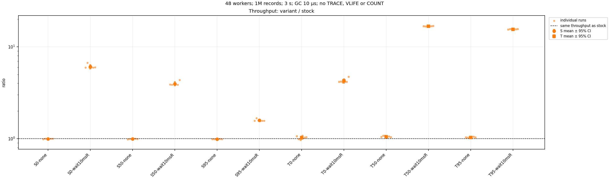

**図の読み方 (md_22 の throughput)。** 同じ job・同じノードで stock と修正版を交互に走らせた対ごとの比 (対数軸、破線が 1)。
**言えないこと:** 3 秒の値である。stock で公開が止まると版が溜まり続けるので、長い read-only 条件の stock の throughput は走行時間に依存しうるが、測っていない (md_22 §0 項 3・§11)。
長い read-only は worker 1 の全 tx を 10 ms の read-only にした合成負荷である。

**これは snapshot の意味と無関係な比較相手の実装欠陥で、本案 (前進・GC 接続・hot 配置) の効果ではない** (md_22 §13)。md_22 の逐語: 「VHash の GC 側の主張を測る比較相手は、この修正を入れた Cicada にすべき」。
D2322 項 2 はこれを受けて、主比較の相手を修正入りとし、stock を同じ round の対照として並べると決めた。本稿の比較の行は次の形で書く。

| 行 | 比べる組 | 起点で手元にある値 | 確認段で置く値 |
|---|---|---|---|
| (a) 修正の効果 | 修正入り 対 stock (どちらも本案なし) | md_22: 長い read-only ありで公開 0 回 → 289〜299 回 / 3 秒、throughput 比 1.56〜16.83 (3 秒) (md_22 §0 項 1・3) | 同じ round で測った (a)【確認段で差し替え】 |
| (b) 本案の効果 | 本案入り 対 本案なし (同じ比較相手の土台の上で) | md_14・md_21・md_31 の E 対 E-hb、c 対 E-max。**土台は修正なしの stock** で、長い tx は read-write (10 read + 1 write の後に待機) である (§6.2〜§6.4) | 修正入りの土台の上の (b)【確認段で差し替え】 |

- **(a) にも (b) にも入らない残余。** 修正入りでも、長い read-only がいる条件の公開時の境界年齢は 12.5〜14.3 ms 残る。md_22 はこれを「固定 snapshot のままでは残る分」と分類する (md_22 §0 項 6)。
  長い read-only の rts が境界を押さえる分で、固定 snapshot の型 (C1) なので本案の対象外でもある (§2.3)。表の (a) の効果には数えない。
- 起点の (b) の値は修正なしの土台で取った。§6.2〜§6.4 の長い tx は read-write で、この欠陥の発火条件 (read-only だけを続ける worker) とは別である。ただし修正入りの土台の上での (b) は測っていない。
- **負荷の空間の広い範囲でも同じ欠陥が現れる (md_29 §0 項 1・§3.4、D2329 項 3)。** 1000 操作の read-only tx を 1 worker が続ける batchR の 84 行すべてで、stock の MinRts の公開が 3 秒間 0 回で、
  論理生存版数は record 数の 5.4〜14.5 倍 (層 S) に溜まった。md_29 の候補 4 領域のうち 3 つが batchR を含む。**この伸びしろは stock の欠陥込みの観測で、(a) の比較 (修正入り 対 stock) を取って初めて、修正で縮む分と固定 snapshot の残余の分へ分けられる。その帰属は保留する。本稿はこれを U0 の勝ち筋として書かない。**
  修正入りの比較相手で batchR の境界年齢がどうなるかは md_29 の計器では見積もれない (md_29 §3.4)。長い read-only の snapshot が境界を押さえる分は、上の残余と同じく固定 snapshot の型 (C1) で本案の対象外である (§2.3)。

### 6.9 比較相手の較正と正しさ

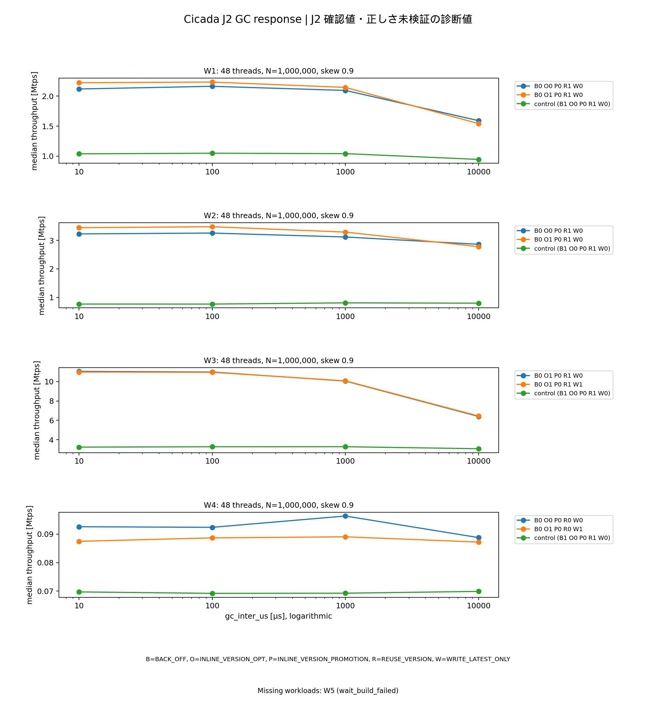

**図の読み方 (md_11 の図 (b))。** 4 段 = workload (rr5・rr50・rr95・100 操作型)、横軸 = GC 間隔 (対数)、縦軸 = throughput の rep 中央値 (Mtps)、系列 = 選抜した 2 点と既定。
**言えないこと:** 正しさ未検証の診断値で、誤差棒は無い (rep 中央値だけ)。

- 既定の Cicada は観測最良から大きく離れていた (既定比 rr5 2.154、rr50 4.536、rr95 3.413、100 操作型 1.383。md_11 §6)。最大の要因は BACK_OFF=0 である。
- 測れたのは正準 24 点のうち 16 点で (promotion 有効の 8 点は pin C で compile できない)、選んだのは「観測最良」である (md_11 §6・§9)。
- 最良設定の stock は 32 run で巡回 0 (異なる条件は 30、走行 1 秒)。md_11 の主比較条件そのもの (3 秒・trace なし) は検査していない (md_20 §1・§7)。
- job 間の session 中央値の CV は 0.43〜0.81% だが、これは between-run floor ではない (時間窓が約 1 時間の 1 つ、D2291)。
- **長い tx が無ければ、最良設定の境界の遅れは小さい (md_29 §0 項 2、計器入り build)。** 層 S (GC 間隔 100 µs) の境界年齢 p50 は、最良設定で 128〜512 µs、既定で 512〜4,096 µs だった。
  既定を相手にすると GC 側の伸びしろが既定の公開の遅さの分だけ大きく見えるので、比較相手は最良設定とし、既定設定の値を伸びしろの根拠にしない (D2329 項 2)。

**比較相手に残っていた既存欠陥 4 件の原因と修理 (md_32、D2327)。** 初稿が「原因未特定」「未修正」と書いた欠陥は、md_32 が原因を実測で確かめて CCBench の local branch `izanagi-cicada-promotion-uaf-fix` (tip `16ad3eb8`) で直した。

| 欠陥 | 原因 (md_32 の帰属) | 本稿の計測への関わり |
|---|---|---|
| promotion 有効時の巡回 | 読み取り専用 tx の promotion。rts 基準で記録した later_ver_ から validation の再検査が下るので、aborted の later_ver_ の手前に入った確定版を飛ばして古い読みが通る。修理前の代表 witness 52 件の全部がこの経路 (md_32 §2) | 最良設定は promotion 無効なので、本稿の計測の genome はこの経路を通らない。promotion 有効の 8 genome は pin C では使えない (build できない) ままである |
| promotion 後の書き込みの欠落 | promotion が積んだ書き込み要素に同じ tx の後続 update が素通りし、要求の body を捨てていた (TPC-C の注文 insert 失敗が約 16〜22 倍) (md_32 §3) | 同上 (promotion 有効のときだけ) |
| TPC-C の異常終了 (`std::bad_alloc`) | **promotion ではなく `INLINE_VERSION_OPT=1` の insert の欠陥** (新しい Tuple の初期化が渡された版を無視する)。promotion 無効の OPT=1 genome でも落ちる (md_32 §4) | 最良設定は OPT=1 で、md_32 §12 は pin が修理の branch を含むまで OPT=1 の TPC-C は pin C では使えないとする。本稿の計測の負荷は YCSB の既存キーへの point read / update である (§8 の範囲) |
| abort 時の use-after-free | abort が INSERT の tuple を解放した後に後始末が同じ tuple に書く (ASan で検出) (md_32 §5) | insert を含む tx の abort の経路の欠陥で、本稿の計測の負荷 (YCSB の既存キーへの point read / update) はこの経路を対象にしていない。この経路を通らないことを実行で確かめてはいない |

- 修理後の branch では、promotion 有効の 8 genome が YCSB 32 走行と TPC-C 16 走行で巡回 0 (上限 indeterminate)、TPC-C が完走、ASan の報告 0 だった (md_32 §0 項 6)。
- **pin は C のままで、修理は local branch にある。push と pin の前進は人間の手番で、pin が branch を含むまで promotion 有効の 8 genome と OPT=1 の TPC-C は pin C では使えない** (md_32 §12)。
  promotion 有効の 8 genome を較正の空間へ戻す再計測は別 item である (md_32 §11)。初稿 §8 の「promotion 有効の 8 点は…原因未特定」は当時の記録として初稿に残し、原因の帰属はここで追記する (付録 E)。

### 6.10 評価の残りと、比較対照としての区間 GC

- **確認段の走行:** 評価計画の草稿 v1 (`docs/vhash-evaluation-preregistration-draft.md`、未発効) は主要な族 m = 19 の比較を、1 cell = 同じ job・同じ node で全構成を 1 回ずつ回す round を 14 取る設計で置いている。
  p\* = c・K\* = 1 は決まった (md_34、D2325)。発効は残りの前提 (floor・比較相手の門など) がそろい、段ごとの node 時間をユーザーへ示して確認を得た後である (T-2893)。本稿の §6 の値はすべて、その走行で置き換える。【確認段で差し替え】
- **動機の数値:** 読み取りを続ける長い read-write tx と読み終えて待つ tx が回収境界をどれだけ止めるか (T-2916)。D2322 項 1 は、評価で構成 D より T-2930 系 (早い abort) と T-2916 を先にするとした。
- **第 2 段の候補領域 (md_29 §4、D2329):** 負荷の空間のふるい分けで、事前登録した規則が (a) 読み比率 5%・batchR、(b) read-only 指定率 95%・thread 12、(c) 読み比率 5%・batchR・skew 0.9〜0.97、(d) batchR・read-only 指定率 0% の 4 領域を選んだ。
  4 つのうち 3 つが batchR を含み、その伸びしろは stock の欠陥込みである (§6.8)。D2329 項 3 は、比較相手に ro-gcflag 修正を入れるかがユーザー確認待ちだとして「第 2 段は両方の比較相手を並べるか、確認の結果を待ってから (d) を測る」とした。その確認は D2322 項 2 が「修正入りを主、stock を同じ round の対照」と確定したので、第 2 段もこの形で両方を並べて測る (§5.1・§6.8)。

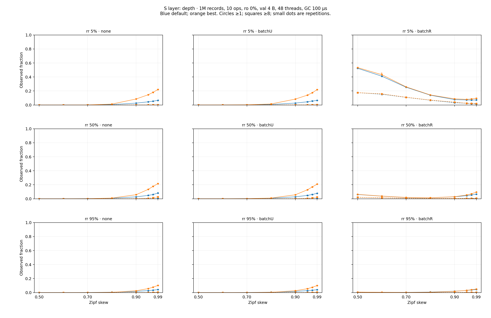

**図の読み方 (md_29 の skew_depth)。** 偏りの格子 (層 S: skew 0.5〜0.99 × 読み比率 × 長い tx の有無と型) で、版探索の位置の分布を並べた。**言えないこと:** 計器入り build の観測量で、性能や「VHash が速くなる」ことは言っていない。
「上限」は機構が完全に働いた場合でも取れる機会の大きさで、実装したときの効果ではない (md_29 §0)。

**比較対照としての区間 GC (md_18、D2323・D2324)。** 回収境界の内側にある不要な途中版を掃除する区間 GC は既知の方式である。最古と 2 番目の境界の間を掃除する最小形は vDriver の Fig 6(c)・定義 3.4・定理 3.5 に、
実行中の全 timestamp でどこからも見えない途中版を掃除する一般形は Steam §4.3・HANA の定義 1・vDriver の定理 3.5 に書かれている (md_18 §2)。
「区間 GC を入れた Cicada」は比較相手として審査で問われるので、md_18 は Cicada に最小形と一般形を試作した。

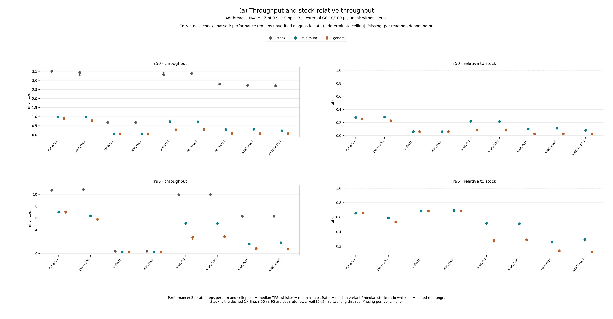

**図の読み方 (md_18 の interval-gc-a-throughput)。** cell ごとの throughput と stock 比。長い read-only tx の cell に `*` 印がある。**言えないこと:** 3 rep の小差は優劣未確定。
この試作は書き込みを tuple lock の下で挿入するので、比は install の費用と剪定の効果の和である (md_18 §8)。

- **試作は安全な物理再利用までは作れなかった。** 外した版を再利用する変種は 4 回の修正の後も異常終了したので、計測したのは「版を鎖から外すが、走行中は再利用しない」変種である (md_18 §3.4、D2323 項 4)。
- **この試作の遅さは試作の install の経路の費用で、区間 GC 一般の費用ではない。** throughput は stock 比で最小形 0.062〜0.692・一般形 0.025〜0.684 だったが、剪定が 0 回の長い read-only の cell でも最小形は 0.062 (rr50) まで落ち、
  install の lock 待ちが thread 時間の 8〜72% を占めた (md_18 §1 項 4・§6.3)。md_18 自身が「この試作 (tuple lock の install、再利用なし) は Steam・HANA の実装費用を代表しない」と書く (md_18 §7 の 4)。
  **本稿は区間 GC を「遅い」とは書かない。** 比較には、同じ install の経路で剪定しない対照 (mode 3) を先に取る (md_18 §9 の 1)。
- **鎖・hop の腕間差は書き込み量の差と交絡している。** 区間 GC の腕は install 数が stock の 1/1.3〜1/34 なので、hop 総数・鎖上の版数の減少を剪定の効果とは読めない (md_18 §1 項 5)。
- **長い read-only tx の cell では、試作は何もしなかった。** 同じ欠陥 (read-only の commit が GC flag を立てない、§6.8) で境界が公開されず、剪定の足場が無かった (md_18 §6.4)。stock はこの型で鎖上 2.17〜2.22 GB・RSS 6.0 GB (rr50) に達した。
- **更新型の長い tx (1〜10 ms) では、stock の鎖はそもそも長くなかった** (鎖上 192〜234 MB、キーあたり 1 版の基準は約 192 MB。md_18 §6.3)。
- **正しさ:** 正常 3 腕の 30 走行はすべて巡回 0。事前登録した壊し正例 (長い read-only tx の cell) は試作が剪定しないので発火 0 で不成立だった。事前登録外の cell での検出は補助として別に数える (md_18 §5、D2324)。
- **本案との分担 (md_18 §7 の見積り、測っていない)。** 安全な解放の条件 (外した時点で走っていた全 tx の終了) は長い tx 自身が塞ぐので、区間 GC が正しく実装できても、外した版の bytes は長い tx の終了まで返らない (Steam も解放を所有 tx の解放まで遅らせる)。
  鎖を短くして探索を減らすのが区間 GC、境界を動かして stock の GC の回収を早めるのが U0、という分担になる、と md_18 は見積もる。
  長い read-only tx の場面では、区間 GC と ro-gcflag 修正を重ねるのが先である (md_18 §7 の 2)。本稿は区間 GC と本案を重ねた計測を持たない。

---

## 7. 関連研究

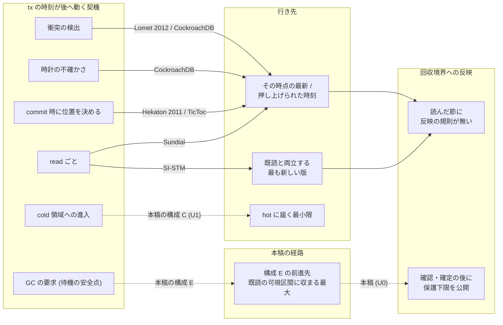
```mermaid
flowchart LR
  subgraph TRIG["tx の時刻が後へ動く契機"]
    c1["衝突の検出"]
    c3["時計の不確かさ"]
    c2["commit 時に位置を決める"]
    c4["read ごと"]
    c5["cold 領域への進入"]
    c6["GC の要求 (待機の安全点)"]
  end
  subgraph DEST["行き先"]
    d1["その時点の最新 /<br/>押し上げられた時刻"]
    d2["既読と両立する<br/>最も新しい版"]
    d3["hot に届く最小限"]
  end
  subgraph GCL["回収境界への反映"]
    g0["読んだ節に<br/>反映の規則が無い"]
    g1["確認・確定の後に<br/>保護下限を公開"]
  end
  subgraph OURS["本稿の経路"]
    e0["構成 E の前進先<br/>既読の可視区間に収まる最大"]
  end
  c1 -->|"Lomet 2012 / CockroachDB"| d1
  c3 -->|"CockroachDB"| d1
  c2 -->|"Hekaton 2011 / TicToc"| d1
  c4 -->|"Sundial"| d1
  c4 -->|"SI-STM"| d2
  d1 --> g0
  d2 --> g0
  c5 -.->|"本稿の構成 C (U1)"| d3
  c6 -.->|"本稿の構成 E"| e0
  e0 -.->|"本稿 (U0)"| g1
```

**図の読み方。** md_9 §0 の図の構造に、本稿の構成 E の契機 (GC の要求) を足した。実線は原典の読んだ節で確かめた既存方式、破線は本稿の経路である。
構成 E の前進先 E-max は、既存の行き先「既読と両立する最も新しい版」(SI-STM) に近いが、本稿の経路は既存の行き先の箱を通さずに別の箱で描いた
(既読と両立する時刻を選ぶこと自体は既知で、本稿が足すのはその先の保護下限への公開である)。hot に届く最小限 (構成 C) とも別の行き先である。
**図から読み取ってはならないこと:** 破線の経路を持つ既存方式が世界に無いことは表さない。範囲は下の文のとおりである。SI-STM が保護下限への公開を持つとも読まない (md_9 の K20)。**本稿の実物の U0 は構成 E で得たもので、cold 契機 (U1) とは切り離されている。**

関連研究は 5 系に分けて書く (md_1 §12 の 4 系に md_9 §8 が (e) を足したもの)。

- **(a) timestamp を後から決める系:** TicToc、Sundial、MaaT、Lomet ほか 2012。commit 時や read ごとに位置を決めるが、実行中の前進を回収境界へ反映しない。
  TicToc は旧版の wts を history buffer に置いて既読値を救う timestamp history を持つ (TicToc §5.3)。既定の設定に含まれるが、著者自身が §6.4 で
  "the timestamp history optimization does not provide any measurable performance gain in either workload." と報告している (md_1 §4)。TicToc を比較相手に挙げるときは、この効果が原典で測れなかったことを併記する。
- **(b) 衝突で直列化の順序を動かす系:** Shirakami、Rebirth-Retire、MV3C、Morty、実時間 DB の区間調整の系譜 (md_9 の K19)。
- **(c) 版の配置の系:** Cicada、HyPer、vDriver、LeanStore、Freitag 2022。時刻・可視区間・更新頻度から版の置き場所を決める。本稿の cold 契機はこの向きを逆にした形である。
- **(d) GC と長い tx の系:** Steam、HANA、CIDR 2021、AggressiveGC と、PostgreSQL・Oracle ほかの製品文書 (md_27)。
  - 途中版の剪定 (区間 GC・EPO) は版の列を縮めるが、長い snapshot から見える版は残す (md_27 の M5)。区間 GC の最小形は vDriver、一般形は Steam §4.3・HANA の定義 1・vDriver の定理 3.5 にあり、
    3 本とも「reader が辿っている途中版を物理的に解放しないための安全条件」は、読んだ範囲では独立に述べていない (md_18 §2)。本稿の比較対照としての試作は §6.10 に書いた。
  - AggressiveGC (CCBench 論文 §7.3、提案のみで実装なし) は、active または将来の tx が読む必要のある版の保持と read の成功を諦め、read が失敗した tx を新しい timestamp で再実行させる (md_31 §9)。
    本稿の方策 c との違いは、**回収を先に決めて tx を殺すか、tx が既に commit できないことを確かめてから境界を放すか**である。方策 c は commit できる tx を失わない (小モデルの範囲) 代わりに、
    上書きされていない長い tx が押さえる分は残し、それを前進で補う。方策 c は AggressiveGC を置き換えない (md_31 §9、D2320 の却下理由)。
  - Steam は active tx に必要な版を残し、回収境界は最古の active tx に縛られたまま境界内の不要な途中版を剪定する。長い tx の timestamp・snapshot は変えず、abort もしない。
    HANA の運用上の対処は、問題の cursor・tx の強制終了か版のディスク退避である (md_31 §9)。
  - 長い tx を走らせる worker は回収用の epoch を実行中に定期的に更新すべきという指摘は Silo にある (直列化位置は動かさない、md_9 の K18)。
  - Cicada 既存の EarlyAborts は書き込み・削除の時点で commit できないと分かった tx を止めるもので、待機中の既読の上書きは見ない (md_31 §2・§9)。
- **(e) 実行中に前進して既読を保つ系:** CockroachDB の read refresh (実行中に読み取り時刻を後へ進め、読んだキーに間の更新が無いことを確かめて続行する)、
  SI-STM / LSA (有効区間と重なる最も新しい版を選び、区間を縮める)。SI-STM は、位置を新しい側へ寄せる動機の 1 つに古い版を早く捨てられることを挙げるが、
  測定実装は旧版を個数で制限し、tx の位置を保護下限として公開する規則は読んだ節に無い (md_9 の K20)。

**本稿が既知として扱うもの (md_9 §5):** 実行中の前進と前進時の既読の再確認 (CockroachDB 2020)、既読と両立する旧版の選択と、新しい側へ寄せて古い版を早く捨てるという動機 (Riegel ほか 2006)、
区間による位置の調整 (Lomet ほか 2012)、実行中の tx の時刻の最小を回収境界にする規則 (Hekaton 2013、Cicada 2017)、区間 GC (Steam・HANA・vDriver、md_18 §2)。

**新規性の範囲 (md_9 §7 の案 B の範囲文を写した):** 実行中に既読を保ったまま後へ進めた transaction の位置を、GC に公開する保護下限へ反映する機構 (前進の確定 → 保護下限の公開の順序を含む) は、
OpenAlex・arXiv・DBLP を事前登録した検索式 N01〜N05 で調べた範囲 (OpenAlex は 2026-09-29 09:51〜10:20 JST 取得、arXiv は同 09:49〜09:50 JST 取得、DBLP は Last-Modified 2026-09-28 20:23:37 GMT の全件書き出し) と
読んだ原典の範囲では見当たらなかった (本文未取得の 5 本を除く)。位置を新しい側へ寄せれば古い版を早く捨てられるという動機 (Riegel ほか 2006) と、
実行中の tx の時刻の最小を回収境界にする規則 (Hekaton 2013、Cicada 2017) は既知である。

- 本文未取得の 5 本は vWeaver 2021・Diva 2022・Bayer ほか 1982・Boksenbaum ほか 1987・OCC-TI 1997 で、図書館経由の取り寄せは人間の手番である (T-2895)。
- cold 契機 (U1) を述べる文には「OCC-TI 1997 を除く」を必ず同じ文に置く (md_9 §5.2)。本稿の構成 C の範囲文は md_9 §7 の案 C を正本とし、ここへは写さない。U1 を述べるときは、未実装の構成 D と区別する (D2322 項 1)。
- 成熟度は索引別の RW2 であって RW3 ではない (md_9 §4.5)。
- md_9 の主張文は「アクセス駆動の前進」を念頭に書かれている。**構成 E の安全点での前進を「読み取り後に待つ tx の保持を縮める」と書くときは、E の測定の範囲 (§6.1) を同じ文に置く** (md_9 §7 の使ってはならない言い方と、ストーリー §11.1)。
- 方策 c (待機の安全点で、commit できないと確定した tx を早く終える) の新規性一般 (他の MVCC 系で同じ判定を安全点で使う例の有無) は調べていない (md_31 §9)。本稿はこれを新規性に数えない。
- 本稿は「初めて」「先行研究が無い」と書かない。

---

## 8. 限界

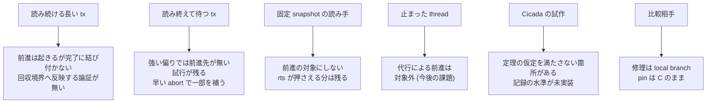
```mermaid
flowchart TB
  t2["読み続ける長い tx"] --> l2["前進は起きるが完了に結び付かない<br/>回収境界へ反映する論証が無い"]
  t3["読み終えて待つ tx"] --> l3["強い偏りでは前進先が無い試行が残る<br/>早い abort で一部を補う"]
  t1["固定 snapshot の読み手"] --> l1["前進の対象にしない<br/>rts が押さえる分は残る"]
  t4["止まった thread"] --> l4["代行による前進は<br/>対象外 (今後の課題)"]
  impl["Cicada の試作"] --> li["定理の仮定を満たさない箇所がある<br/>記録の水準が未実装"]
  base["比較相手"] --> lb["修理は local branch<br/>pin は C のまま"]
```

**図の読み方。** §2.3 の型ごとの限界と、実装・比較相手の限界を 1 枚にした。1 行目の問題を解いたことを、他の行まで解いたように書かない。

- **読み続ける長い tx (C2)。** 構成 C の前進は起きるが、操作数型の長い tx の完了率はどの前進先でも 0.03% 以下で、完了に結び付いていない (§6.6)。前進を回収境界へ反映する論証は条件 RA の外にあり、
  floor 以外の保護 (refs・epoch など) とその物理的な寿命の論証が要る (md_26 §11)。
- **強い偏り。** 読み終えて待つ型でも、zipf 0.9 では E-max の要求の多くが `no_room` になり、E-max 単独の効果は小さい。`no_room` の大半は前進に一度成功した後の再要求で、abort の確定ではない (§6.4)。
  方策 c は前進できず確定した試行を終えて遅れを縮めたが、上書きされていない試行が押さえる分は残る。判定 D の健全性は小モデルの有限範囲でだけ確かめ、実機の照合の検出力は示せていない (§4.4、md_31 §3.2)。
- **固定 snapshot の読み手 (C1)。** 前進の対象にしない。長い read-only の rts が境界を押さえる分は本案でも縮まない (§6.8)。
- **止まった thread (C4)。** 論文の対象に入れない (D2298・D2318)。md_16 §7.3 の文案を逐語で置く。

  > 本研究の前進は、待機中の transaction が安全点で GC からの要求を確かめられることを前提とする (評価に用いる CCBench の長い transaction は busy-wait で待つため、この前提を満たす)。sleep や preempt で完全に止まった thread の代わりに別の thread が前進させる設計 (代行による前進) は、小さなモデルの全探索で、descriptor の世代つき CAS が確定と公開を覆うこと、再開時に時刻を読み直すこと、代行する thread 自身が読み取り版を保護すること、失効させる場合は再開時に失効を確かめる前に読み取り値へ触れないことが必要だと分かった。ただし、止まった thread の静止を他の thread が代わりに宣言してよい条件は未検証であり、Cicada のように全 thread の静止を待って回収境界を更新する GC では、代行による前進は回収を進めない。代行による前進の実装と評価は今後の課題とする。

  併記: 安全点での前進を CCBench 自身の長い tx で評価するには、CCBench の待機ループ (`clock_delay`) に要求の確認を入れた安全点が要る。現行のループは要求を確かめない (md_16 §7.1、D2318 項 1)。
  本稿の構成 E は md_6 の試作が足した長い tx の待機を 100 µs に刻んで安全点を置いたもので、CCBench 自身の待つ型 (W5) ではない (§5.2)。
- **正しさの地位。** 論証はモデル仕様 v1 と抽象仕様 E についてである。**Cicada の試作は論証の仮定を満たさない箇所がある** (§4.2・§4.3.1): 書き込み検査の走査中に止まる予定の版が回収されうる (W* × GC)、
  境界の読みと thread の floor の下降で FS-b が崩れうる (試作では thread 0 の抑えで害の列は作れない)、同じ thread の続く tx が同じ時刻を持ちうる (A2)。
  加えて、版の列の原子的な観測 (A1)・記憶順序・版の ID と物理アドレスの分離は、実装向けの置換補題が無い (md_36 §8 の N4)。
  どの列も確定した tx の閉路までは完成しなかったが、解放・再利用後の版を読んだ実行には論証の前提が当てはまらないので、「直列化は壊れない」とも言えない (md_36 §0)。
  (a) の修理は並走中である (§4.3.1)。物理的な非接触 (回収済みの node の pointer を並行する走査が読まないこと、`REUSE_VERSION=1` での再利用) は主張しない。判定の上限は indeterminate で、中間案 M は未実装である (§4.5)。
- **進行保証。** 本稿は安全性だけを扱う。CAS は rts の CAS-max と版の設置に使うが、lock-free 性・進行保証・止まった thread の保護の解除は示していない。待ちが終わらない実行は「確定しない」として含むだけである (md_26 §11)。
  長い tx の完了率 (§6.6) は観測値で、進行保証の代わりにならない。
- **GC の効果の地位。** 回収境界の遅れと論理生存版数は計器入り build の値で、物理メモリの bytes ではない。`REUSE_VERSION=1` の pool は縮まない (md_14 §7)。本稿は「GC を改善した」とは書かない。
- **動機の数値。** 本案が縮める型 (C2・C3) の大きさの数値は外部資料に無い (§2.1、T-2916)。
- **比較相手。** 較正で探索できた空間は pin C で build できる 16 点である (§6.9)。promotion 有効の 8 点の巡回と TPC-C の異常終了は原因が特定され (前者は読み取り専用 tx の promotion、後者は promotion と無関係な `INLINE_VERSION_OPT=1` の insert の欠陥)、
  abort 時の use-after-free とともに CCBench の local branch で修理されたが、push と pin の前進は人間の手番で、pin C には入っていない (md_32 §12)。
  したがって pin C の上では OPT=1 の TPC-C を使えず (md_32 §12)、promotion 有効の 8 点は較正にも比較にも使っていない。本稿は「Cicada の最適化空間を全探索した」とは書かない。
  主比較の相手に入れる ro-gcflag 修正は variant patch で pin に入らない (D2322 項 2)。修正入りの土台での本案の計測はまだ無い (§6.8)。
- **区間 GC との比較。** 比較用の試作は安全な物理再利用が無く、install を tuple lock の下で行うので、方式の費用を代表しない (§6.10)。区間 GC と本案を重ねた計測も無い。
- **範囲。** 固定キーへの point read / update。範囲読み・insert・delete を含む tx は、試作では前進しない (前進の後に呼べば abort)。論証も範囲外に置く (md_13 §8、md_26 §11)。md_36 の照合も YCSB の経路に限り、TPC-C・scan・group commit などは読んでいない (md_36 §1)。負荷は YCSB だけである。

---

## 9. 結論

本稿は、実行中の tx を既読が見え続ける範囲で前進させ、その前進を確認 → 確定 → 公開の順で GC の保護下限へ反映する機構を示した。
順序の各段が要ることは小さいモデルの反例と Cicada の試作で実際に起きた破れで示し、読み終えて待つ型の tx について、抽象仕様の上での論理的な GC 安全と直列化を条件つきで論証した。
論証の仮定を Cicada の試作のコードで照らすと、書き込み検査の走査中の回収をはじめ 3 箇所で対応が崩れたので、定理は試作の安全へは移さない。
Cicada への予備的な実装では、偏りの無い〜中程度の偏りの負荷で E-max が回収境界の遅れを縮め、強い偏りでは前進できず commit できないと確定した試行を安全点で終える方策を足すと遅れがさらに縮んだ。
どちらも計器入り build の探索段の観測で、評価計画の語では支持を得ておらず、throughput の差は検出できなかった。直近の版を手元に置く配置は Cicada の中では throughput を上げなかった。

残る課題は、確認段の走行 (修正入りの比較相手の上での本案の効果、between-run floor を含む)、構成 E の試作の書き込み検査の走査中の回収の修理と、修理した試作での測り直し、境界の読みの一貫性、
記録の水準 (中間案 M) の実装、読み続ける型の前進を回収境界へ反映する保護の設計、そして本案が縮める型の大きさを示す測定である。【確認段で差し替え】

---

## 付録 A. 案 1・案 3 の差し替え表について

題名と重心は案 2 で確定した (D2322 項 1) ので、初稿の付録 A の差し替え表は第 2 稿では使わない。却下した案の理由だけを残す。

| 案 | D2322 項 1 の却下理由 | 将来この案を書くのに要るもの |
|---|---|---|
| 案 1 (VHash の名前を残す: U1 + U0 の組合せを芯) | 芯を支える実測が無い | 構成 D (hot の外れで前進し GC へ反映) の実装と測定、読み続けながら反映するなら RA の外の新しい論証 |
| 案 3 (両方を名前にしない: U1 を論理 K 境界で示す) | 「向きを逆にしただけ」と読まれる弱点を補う構造が結局 VHash になる | 判定を安くする構造の効果の実測 |

## 付録 B. 過大主張チェックリスト (ストーリー 3 版目 §15) の第 2 稿への再適用

第 2 稿の全体に §15 の表と箇条を当て直した。初稿の付録 B から変わった行には「(第 2 稿)」と書いた。

| 論点 | 書いてはならない言い方 | 第 2 稿での扱い |
|---|---|---|
| hot 配置の効果 | 「hot 配置で Cicada が速くなった」「H1 は棄却された」 | §6.7 で負の結果として範囲つきで書いた。「棄却」とは書かない。(第 2 稿) md_29 の h1・u1 は機会量で、実装の効果ではないと同じ段落に書いた |
| hot 配置の効果 | 「部分前進が長い tx を救う」 | §6.6 (1) で操作数型の完了率 0.03% 以下を併記し、書かない |
| GC への効果 | 「GC を改善した」 | 書かない。計器入り build の論理生存版数で物理メモリではないと §6・§8 に書いた |
| GC への効果 | 「前進の成功が多いほど回収が進む」 | §6.4 で成功率を GC 改善の指標にしないと書いた。(第 2 稿) E-max の要求には成功後の再要求が多く入ると md_31 の計数で補った |
| GC への効果 | 「U0 は強い偏りでも効く」 | §6.4 と §8 で zipf 0.9 の E-max 単独の小ささを書いた。(第 2 稿) 方策 c の縮みは E-max とは別の行・別の方策として書き、「E-max が強い偏りでも効く」と読ませない。方策 c の値も探索段の予備的な観測で、§5.5 の語は当てていないと書いた |
| GC への効果 | (第 2 稿) 「`no_room` の tx は abort が決まっている」 | §6.4 で md_31 の訂正を書き、確定は判定 D で言うとした |
| GC への効果 | (第 2 稿) 「区間 GC は遅い」「区間 GC では長い tx の問題が解けないことを示した」 | §6.10 で試作の install の費用と書き、方式一般の欠点にしない。区間 GC との分担は md_18 の見積りと書いた |
| 正しさの地位 | 「判定器で巡回が無いので serializable」 | §4.5 で上限 indeterminate と書き、書かない文を挙げた |
| 正しさの地位 | 「一般の証明で Cicada が正しい」 | §4.2・§4.3 で主語をモデル仕様 v1 と抽象仕様 E に固定した。(第 2 稿) §4.3.1 で試作が仮定を満たさない 3 箇所を具体的に書き、「試作は仮定を満たす」を書かない文に足した |
| 正しさの地位 | 「certified な性能値」 | 冒頭と §4.5・§6 冒頭で、中間案 M は未実装、値は未検証の診断値と書いた |
| 正しさの地位 | (第 2 稿) 「md_36 で試作が定理の外と分かったので md_14・md_21 の値は無効」 | 冒頭・§4.3.1・§6 冒頭で、値は当時の観測として残し、弱まるのは解釈だけと書いた (規律 7、D2326 項 5) |
| 比較相手 | 「stock の Cicada に勝った」 | (第 2 稿) §5.1 と §6.8 で主比較の相手を修正入り、stock を対照と書き、(a) 修正の効果と (b) 本案の効果を別の行にした。起点の (b) が修正なしの土台で取った値であることも書いた。md_29 の batchR の伸びしろは stock の欠陥込みの観測で、修正で縮む分への帰属を保留し、U0 の勝ち筋にしないと書いた |
| 動機の根拠 | 「長い tx は頻繁に起きる」「製品の症状の数値の分だけ縮む」 | §2.1 で頻度の根拠は 1 システム、研究の数値は C1 と書き、書かない |
| 新規性と限界 | 「代行で止まった thread も救える」 | §8 の限界の節にだけ md_16 §7.3 の文案を逐語で置いた (D2318) |
| 新規性と限界 | 「最新でない版を選べることが新しい」 | §3.2 と §7 で既知と書いた。(第 2 稿) 区間 GC と方策 c の新規性一般も既知または未調査として数えないと §7 に書いた |
| (§15 の箇条) serializable | certified な検査か一般の証明を指す | 該当なし。書いていない |
| (§15 の箇条) 性能値の build | trace も計器も外した build で測り、比較相手も同じ条件 | §6.5 の throughput は計器なし build、GC 指標は計器入りで性能値にしていない |
| (§15 の箇条) 比較相手の書き方 | 「CCBench の Cicada (pin C) を md_11 の観測最良設定で」と書き、read-only の公開停止の修正の有無を書く | (第 2 稿) §5.1 に両方を書いた (D2322 項 2 で「両方並べる」に確定) |
| (§15 の箇条) 新規性の文 | 索引名・検索式 ID・cutoff を同じ文に置き、U1 には OCC-TI 1997 の除外 | §7 で範囲文を写し、U1 の除外の規則を書いた |
| (§15 の箇条) 同時刻の対照 | 1 回の走りの前後比較にしない | §6.1 で同時刻の複数ノード投入と rep の腕順の巡回を書いた。md_31 の比較も同じ job・同じ rep の差である |
| (§15 の箇条) 探索段の語 | 「予備的に…」を確認段の語と混ぜない。「差なし」を「効果は 10% 未満」と書かない | §6.7 に書いた。(第 2 稿) §6.3 で md_34 の語 (E-max 対 E-hb は「判定不能 (門未完了)」) を書き、md_21 の観測値と語を分けた |
| (§15 の箇条) 前版から引き継ぐ項目 | 旧版を取り出す能力・PENDING 版の扱い・「timestamp を進めれば GC が進む」と書かない ほか | 「確定・公開・物理参照が要る」を §1・§3・§6.4 に、PENDING の扱いを §3.1・§3.3・§3.4 に書いた。SIMD の利益が配置から来たことを §6.7 に書いた。(第 2 稿) 下の 2 項も扱った |

**初稿で扱いきれていなかった 2 項の扱い (第 2 稿):**

- **「CAS と進行保証を別に示す」:** §8 に「進行保証」の項を足し、安全性だけを扱うこと、CAS の進行・lock-free 性・止まった thread の保護の解除を示していないこと、長い tx の完了率は進行保証の代わりにならないことを書いた (md_26 §11)。
  進行保証そのものの論証は無い。
- **「TicToc の timestamp history を併記する」:** §7 の (a) に、timestamp history が TicToc §5.3 の機構で既定の設定に含まれ、著者自身が §6.4 で測れる効果が無いと報告したことを、md_1 §4 の原典照合から書いた。

## 付録 C. 差し替え印と空欄の一覧

| 印 | 節 | 中身 |
|---|---|---|
| 【確認段で差し替え】 | 概要、§6.2、§6.3、§6.4、§6.5、§6.7、§6.8 (表の 2 行)、§6.10、§9 | 評価計画の確認段 (未発効) の走行で置き換える値・文 |
| 【空欄: md_33】 | §4.5 | 中間案 M の実装 (T-2874) |
| 【空欄: md_35】 | §6.5 | throughput の between-run floor (T-2915) |
| 【空欄: md_37】 | §6.7 | 構成 B の書き込み側の排他を CAS の外へ出す設計 (T-2926・T-2927)。第 2 稿の着手後に着地した (`2026-09-30/vhash-hot-block-cicada-v2/`、D2331) が、依頼 (md_41) が空欄のまま残すと名指ししたので本稿では読んでおらず、次の改版で入れる |
| 【空欄: md_39】 | §4.3.1 | 構成 E の書き込み検査の走査中の回収 (md_36 §3.2) の再現と最小の修理 |

初稿の空欄のうち、第 2 稿で埋めたもの:

| 初稿の空欄 | 第 2 稿で埋めた節 | 出典 |
|---|---|---|
| 【空欄: md_18】(§6.10) | §6.10 の「比較対照としての区間 GC」、§7 の (d) | md_18、D2323・D2324 |
| 【空欄: md_28】(§6.4) | §6.4 の「偏りを 0.99 まで上げたときの前進の余地」(md_29 が md_28 を統合) | md_29 §0 項 4 |
| 【空欄: md_29】(§6.7) | §6.7 の「hot 配置の伸びしろの上限」、§6.8 の batchR、§6.9 の最良設定の境界年齢、§6.10 の候補領域 | md_29、D2329 |
| 【空欄: md_31】(§6.4) | §3.3.1、§6.4、§6.6 (2)、§7 の (d) | md_31、D2320 |
| 【空欄: md_32】(§8) | §6.9 の表、§8 の「比較相手」 | md_32、D2327 |
| 【空欄: md_34】(§6.3) | §6.3 の「評価計画の §5.5 を当てた語」、§6.7 の K\* | md_34、D2325 |
| 【空欄: md_36】(§4.2、§4.3) | §4.2 の仮定の表、§4.3 の条件の表、§4.3.1 | md_36、D2326 |

## 付録 D. この第 2 稿の作り方 (確かめたこと・確かめていないこと)

- **入力:** 上の略称表の一次資料 30 本 (初稿の 24 本と、md_18・md_29・md_31・md_32・md_36 の 5 本、md_34 の評価計画の草稿 §15)、初稿、
  決定 D16・D18・D20・D2279・D2287・D2290・D2291・D2292・D2294・D2295・D2298・D2302・D2305・D2308・D2310・D2311・D2315・D2317・D2318・D2319 (初稿と同じ) と、D2320・D2322・D2323・D2324・D2325・D2326・D2327・D2329 (第 2 稿で追加)、
  評価計画の草稿 v1 (`docs/vhash-evaluation-preregistration-draft.md`、未発効)。過大主張チェックは論文ストーリー 3 版目 (`docs/paper-story-vhash/2026-09-30.md`) §15 を使った。
- **新しい計測・探索・実装・論証は無い (0 node 時間)。** 新しい値の図も作っていない。値を持つ図は一次資料の側の生成器が作った図を相対 path で参照し、複製していない。
  値を含まない模式図は Mermaid で描き、数値・判定語・件数を箱に書いていない (§4.3.1 の列は、md_36 §3.2 の時刻の値を記号に置き換えて描いた)。
- **図の数:** Mermaid 図 14 枚 (初稿の 13 枚に §4.3.1 の列を足し、§6.4 の `no_room` の図を md_31 の分け方で置き換え、§4 冒頭・§5・§8 の図を更新した)、文字の図 1 枚 (前進先の記号の例)、
  擬似コード 3 つ (§3.3.1 を追加)、画像の埋め込み 19 か所 (初稿の 15 か所に md_31 の 2 枚、md_29 の 1 枚、md_18 の 1 枚を足した。11 本の一次資料の生成器が作ったもの)。
- **初稿から変えなかった部分:** §2.1・§3.2 の可視区間の図・§4.1・§4.4 の表・§6.2 の表・§6.3 の md_21 の表・§6.5 の md_14・md_21 の値・§6.7 の md_5・md_23 の値・§7 の新規性の範囲文は、初稿の文面を写した (初稿の段 6 レビューで照合済みの範囲)。
- **確かめたこと:** 親が書き写した数値・件数・範囲文を、引いた一次資料の節と突き合わせた。埋め込み画像 19 か所の path の実在、差し替え印と空欄の位置を機械的に数えた。
  独立の read-only レビュー 1 本 (Codex、事実照合と過大主張の 2 レンズ) は、md_18・md_29・md_31・md_32・md_34・md_36 と D2320・D2322〜D2327・D2329 から新しく写した値と判定を照合し、
  must-fix 1 件 (§6.4 の `no_room` の図が、方策 c は成功前の `no_room` だけで判定 D を評価すると描いていた) と should-fix 1 件 (§6.8 で修正後も残る境界年齢を (a) 修正の効果の行に置いた) を出した。
  親が直した後の焦点再レビュー 3 巡 (上限 3 巡) で、成功後の `no_room` の D についての言い過ぎ、batchR の帰属の断定、§6.10 の第 2 段の比較相手の書き方、冒頭の表の参照を順に直し、3 巡目で GO になった。
  所見はすべて real として直した。§6.8 の模式図の記号が md_22 の (a)(b) と D2322 の (a)(b) で重なっていたのは、親が直すときに気づいて図の側を要因 1・2 に改めた。
- **レビューが照合しなかった範囲:** 初稿から引き継いだ 24 本の一次資料の数値の全件 (初稿の段 6 で照合した範囲だけ)、画像の値の再計算、raw 出力、C++ と擬似コードの行単位の一致、参考文献の原典の全文。
- **確かめていないこと:** 未着地の wave の結果 (付録 C の空欄)。英語での言い回し・分量の調整。参考文献の書誌 (本稿は文献名を略記で置いただけで、書誌の照合は md_1・md_9 の §9 が正本)。
  画像の値の再計算。擬似コードと C++ の行単位の一致 (§3.3.1 は md_31 §2 の文の要約で、patch の行と照合していない)。

## 付録 E. 初稿からの訂正と追記の一覧

初稿は当時の一次資料から書いた記録として残し、書き換えない。第 2 稿で直した箇所と、その根拠を置く。

| 初稿の箇所 | 初稿の記述 | 第 2 稿 | 根拠 |
|---|---|---|---|
| 冒頭・付録 A | 案 2 前提、題名と重心はユーザー未決 | 案 2 で確定。付録 A は却下理由だけに短くした | D2322 項 1 |
| §2.3 1 行目「言えないこと」 | Cicada 実装が定理の条件を満たすこと (未確認) | 試作が満たさない 3 箇所を具体的に書いた | md_36 §0・§3.2・§4・§5、D2326 項 3 |
| §2.3 1 行目「GC 安全」 | RA は「この型では構造上満たされる」 | 計測した待機型の tx で満たす (API 一般では判定できない) | md_36 §2 の RA 行 |
| §2.3 2 行目「実物で観測」 | 完了率はどの腕でも 0.03% 以下 | 操作数型の値と明記し、待機型は stock でも完了すると足した | md_31 §6 |
| §3.1 回収 | PENDING の版は回収しない (抽象仕様) | 実装に PENDING を除く検査が無いことを足した | md_36 §2 の RC 行 |
| §4.2・§4.3 | 【空欄: md_36】、条件の表の Cicada 欄は「未確認」「成り立つように読める」 | md_36 の手順 / 保証の判定で置き換えた | md_36 §2・§4 |
| §5.1 | 比較相手は T-2933 の判断待ち | 主比較は修正入り、stock を対照 | D2322 項 2 |
| §6.3 | 【空欄: md_34】 | p\* = c、E-max 対 E-hb の語は「判定不能 (門未完了)」 | md_34 §15、D2325 |
| §6.4 | `no_room` は (a) と (b) の混合で、(b) は validation での abort が決まっている | `no_room` の大半は成功後の再要求で、abort の確定ではない。確定は判定 D | md_31 §3.3、D2320 項 3 |
| §6.4 | 「(b) の tx を早く abort させる方策は並走中」【空欄: md_31】【空欄: md_28】 | 方策 b・c の結果を E-max と別の行で書いた。md_28 は md_29 の偏りの軸で埋めた | md_31 §5.1、md_29 §0 項 4 |
| §6.6 | 読み続ける型の節だけ | 操作数型と待機型を分けた | md_31 §5.3・§6 |
| §6.7 | 【空欄: md_29】 | 伸びしろの上限と候補 (b) を書いた (機会量と明記) | md_29 §0 項 3・§4 |
| §6.8 | T-2933 の 3 択の表 | (a)・(b) の 2 行の表と batchR の扱い | D2322 項 2、md_29 §3.4、D2329 項 3 |
| §6.10 | 【空欄: md_18】 | 比較対照としての区間 GC | md_18、D2323・D2324 |
| §8 比較相手 | promotion 有効の 8 点の除外は原因未特定、abort 時の use-after-free は未修正【空欄: md_32】 | 原因を特定し local branch で修理 (pin C には未反映) | md_32、D2327 |
| 付録 B 末尾 | CAS と進行保証、TicToc の timestamp history は扱いきれていない | §8 と §7 の (a) で扱った | md_26 §11、md_1 §4 |
