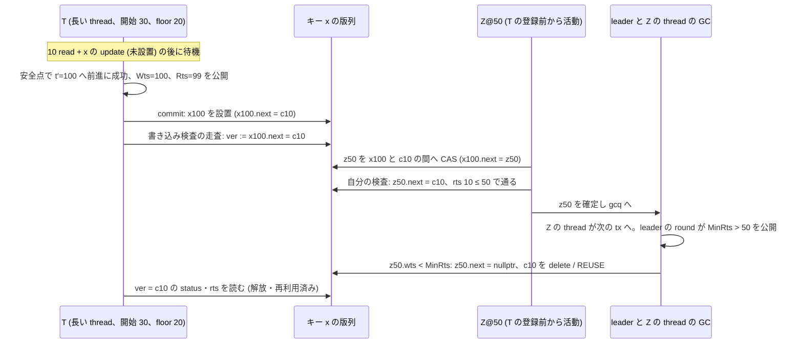

# VHash の論証が置いた仮定を、Cicada 実装と試作のコードで照らした (VHash 論文、md_36)

- 着手: 2026-09-30 (dev-wave `worktree-vhash-proof-assumptions-vs-impl`、背景 job)。起点 local main `213d411c6`
- 依頼: `/work/1/SFC/tanab/tmp/vhash-2026-09-29/md_36.txt` と同 dir の `common.txt` (job dir `/work/1/SFC/tanab/tmp/vhash-proof-assumptions-vs-impl-2026-09-30/inputs/` に逐語)
- 対象の論証 (以下の略称で引く):
  - md_13 = `output/insights/2026-09-29/vhash-forwarding-proof/README.md` (構成 C の直列化。仮定 A1〜A11、条件 W*、補題 2′、D2292)
  - md_26 = `output/insights/2026-09-30/vhash-gc-connection-proof/README.md` (構成 E の GC 安全と直列化。条件 FS-a/b/c・PUB・CAND・RA・RC、定理 G・S、D2319)
- 対象のコード: stock Cicada (CCBench pin `68106660`、`external/ccbench/cc/cicada/`) と、試作 3 枚を md_6 → md_14 → md_21 の順に GNU patch `--fuzz=0` で当てた写し (3 枚とも offset・fuzz なしで当たった)
  - `patches/cicada-forwarding-variant.patch` (md_6、構成 C) sha256 `90ac9128…40ae5`
  - `patches/cicada-forwarding-gc.patch` (md_14、構成 E) sha256 `366c623a…93017`
  - `patches/cicada-forwarding-target.patch` (md_21、E-max) sha256 `27547451…8cd3b0`
  - 写しと全 hash は job dir の `src/stock/`・`src/applied/`・`src/PATCH-SHA256` (repo 外)。本文の行番号は「stock `file:行`」「applied `file:行`」で写しの物理行を指す。applied の `transaction.cc` は 3 枚分の行が挿入されているので stock と番号がずれる
- 新規の計測・実装・モデル編集はしていない。本資料はコードの静的な読みと、既存の一次資料との照合だけである。実行列はすべて紙の上で、実走・探索で確かめていない

## 0. 結論

**論文 2 版目に「Cicada 実装と試作は md_13・md_26 の論証の仮定を満たす」とは書けない。** 書けるのは、抽象仕様についての定理と、コードの手順がその仕様のどの step に対応するかであり、その対応は次の 3 点で崩れる。

1. **構成 E で、書き込み検査の走査中に「止まる予定の版」が回収されうる (W*×GC)。** 計測した長い tx (10 read + 1 update の後に待機し、待機中に前進して floor を t′−1 へ上げ、その後 commit する) の手順に、update の key が既読キーと異なる場合にそのまま乗る。害は、論理的には必要な版の回収 (md_26 の N3)、物理的には解放済み・再利用済みの版の読みである。stock と構成 C では、T の floor が開始時の値のままなので、同じ列の回収は起きない。
2. **stock の時刻生成は、同じ thread の続く 2 つの tx に同じ時刻を返しうる (A2)。** abort 後の時計の上乗せ (+1 µs 分) が実時刻より先に出たまま次の tx が commit し、その次の begin で実時刻がまだ追いついていないと、時計が進まない。
3. **構成 E では thread の floor が tx の境目で下がり、leader の境界の集計は非原子的なので、md_26 の「境界を読む」step と開始 floor の条件 FS-b の実装対応が崩れる。** ただし試作の構成では、前進しない thread 0 (leader) の floor が境界を上から抑えるので、既読版の回収に至る列は作れなかった。どの thread も前進しうる一般の構成 E では、既読版が回収される列 (G1) が完成する。

どの列も、確定した tx の依存グラフの閉路 (直列化の破れ) までは完成しなかった。一方で、解放・再利用後の版を読んだ実行には論証の前提 (有効な版の参照) が当てはまらないので、「直列化は壊れない」とも言えない。

途中入場の規則 (md_36 の手順 3、T-2907) は、md_26 が開始 floor の条件 FS-a/b/c として決め済み (D2319) である。本資料はそれを実装で照らし、**stock は FS-b を導出上満たす** (§4.1)、**構成 E の試作は FS-b を tx の開始が遅れた場合に破りうるが、thread 0 の抑えで害には至らない** (§4.3) とした。小モデルに途中入場だけを足しても G1 は出ない (境界の非原子な読みと、thread の floor の下降を模型に入れる必要がある)。足すかは新 item に回す (§8)。

### 0.1 論文に書ける文・書けない文

| 書ける文 (範囲を明記して) | 根拠 |
|---|---|
| 「固定キーの point read / update と明記した仮定の下で、md_13 の定理 4 と md_26 の定理 G・S は、それぞれの抽象仕様について成り立つ」 | md_13・md_26 |
| 「stock Cicada の書き込み検査は、条件 W* の局所手順 (待機後の status の読み直し、ABORTED の通過、止まった版の rts を設置後に読む) に対応する。並行する回収の下での到達と参照の寿命は示していない」 | §2 W* 行、§3.1 |
| 「構成 C の前進は既読版の rts を上げずに見え方だけを照らすので、md_13 の確認 (R5) ではない。O1 を採らない設計なので、commit 時の全既読の検証が最終の条件になる」 | §2 A5 行 |
| 「計測した待機型の長い tx では、構成 E は既読版の rts の更新と観測し直しに成功した後にだけ時刻と floor を公開し、公開の後に外部 read をしない」 | §2 PUB・RA 行 |
| 「構成 E の試作では、書き込み検査の走査中に止まる予定の版を回収できる。このため抽象定理 G を試作の GC 安全へは移せない」 | §3.2 |
| 「md_14・md_21 の記録された条件で回収境界の遅れと生存版数の改善を観測した。検査の上限は indeterminate である」 | md_14・md_21 (値は変えない) |

**書けない文:** 「stock・C・E は論証の全仮定を満たす」「forwarding と GC 接続を入れた Cicada は一般に serializable / GC 安全」「判定器の巡回 0 と保持版の変化 0 は全走査の物理安全を示す」「x86 でも C++ でも読み手と書き手の相互見落としは起きない」。md_24 §7 の制限と同じ向きである。

## 1. 範囲

- 照らした仮定: md_13 の A1〜A11 と W*、md_26 の FS-a・FS-b・FS-c・PUB・CAND・RA・RC (REFS は Cicada に refs が無いので該当なし)、worklog の T-2906 が列挙した項目 (読み検査の順序、時刻の一意性、leader の非原子な集計、RA、0 付近の減算、前進が PENDING 設置の前だけか、記憶順序)。照らす途中で、md_26 の「GC: 境界を読む」step の実装対応を 1 行足した (§2 の「境界の読み」行)。
- 構成: stock、構成 C (md_6、`read_internal` の中の forwarding、floor は公開しない)、構成 E (md_14 の `gc_advance` と安全点、md_21 の E-max)。
- 計測で使われた設定 (md_14 §4.1・md_21 §4.1): `BACK_OFF=0, INLINE_VERSION_OPT=1, INLINE_VERSION_PROMOTION=0, REUSE_VERSION=1, WRITE_LATEST_ONLY=0`、48 thread、YCSB、長い thread 4 本 (thid 44〜47、`wait_after_reads`)。判定は、断らない限り「この設定の YCSB 経路の read-write tx が既存キーへ point read / update する場合」についてである。TPC-C・scan・insert・delete・group commit・`SINGLE_EXEC`・`WRITE_LATEST_ONLY=1` の経路は読んでいない。
- group commit: 両資料の条件表は指定しておらず、gflags の既定は 0 (stock `include/common.hh:43`) なので、既定のまま (group commit なし) で走ったと読める。run の argv は照合していない。
- build の既定値そのもの (CMake / Makefile) は照合していない。上の値は計測記録の値である。

## 2. 照合表

判定は 2 つに分けた。**手順** = コードの手順が仮定の step の順序・形に対応するか。**保証** = 定理が使う性質 (論理的な保持、参照の寿命、記憶順序、一括性) まで成り立つか。「満たす」は表の範囲に限る。

| 仮定 | stock | 構成 C | 構成 E | 手順 | 保証 | 根拠 |
|---|---|---|---|---|---|---|
| **A1** 逐次一貫、1 キーの版列の原子的な観測、R9′ の走査は 1 step、1 tx の全版の status を 1 step で確定 | `transaction.cc:102–118,481–531,543–593,687–720` | applied `transaction.cc:767–935` | applied `transaction.cc:1388–1504,579–618` | 満たさない | 満たさない | 版列は next pointer を 1 つずつ読み (acquire)、status は版ごとに順に書く (`cpv`)。補題 2′ が外すのは書き込み走査の原子性だけで、観測・確定の原子性の置き換えは示されていない。観測の線形化点を「最後に読んだ next pointer」に置く置換補題が要る (§8 N4) |
| **A2** 異なる tx は同じ時刻を持たない | `include/time_stamp.hh:30–40`、`transaction.cc:760`(abort で上乗せ)・`910`(commit で 0) | 前進成功時 localClock ≥ (t′≫8)+1 (applied `transaction.cc:920`) | 同 (applied `transaction.cc:606`) | — | **満たさない** | §5。前進しない begin は stock の生成器を使うので C・E も同じ。thread 番号の下位 8 bit で thread 間の一意性はある |
| **A3** 版の ID・key・wts は設置後に不変、確定時刻は設置の前に固まり以後は前進しない (R8) | `include/transaction.hh:173–197,229–239` | 前進は `read_internal` の中だけ | 前進は安全点 (commit の前) だけ | R8 は満たす | 物理アドレスを ID とすれば満たさない | GC が切り離した版は delete か REUSE の pool へ移り、`set()` (`include/version.hh:85–91`) で別の版に作り直される。生存中の論理版としては不変 |
| **A4** 外部 read は COMMITTED 版だけを返し既読に記録 | `transaction.cc:102–126` | 同 | 同 | 満たす | 範囲付き | PENDING を待ち、ABORTED を越える。read-only tx は別の commit 経路 (`transaction.cc:934–937`) で検証しないので範囲外 |
| **A5** 確認は rts を上げてから観測し直す | commit: `include/transaction.hh:295–307` → `transaction.cc:543–570` | **前進の確認は rts を上げない** (applied `transaction.cc:879–890` の `forward_visible` の照合だけ) | `gc_advance`: rts CAS (applied `583`) → seq_cst fence (`587`) → 観測し直し → 成功時だけ確定 | stock commit・E は満たす。C の前進は満たさない | 記憶順序と寿命は別 (下の行) | C は O1 を採らず、commit の検証 (applied `transaction.cc:1445–1478`) で全既読を最終時刻で検証し直すので、md_13 の系 6 の範囲では直列化の結論に効かない。C 実装の直列化の認定ではない |
| **A6** 書き込み検査は R9′ | `transaction.cc:576–593` | 同 | applied `transaction.cc:1487–1504` | 満たさない | — | PENDING を越えずに待ち、最初の COMMITTED 版の rts だけを見る。W* で扱う |
| **W\*** 設置の後に降順に走査、待機後に status を読み直し ABORTED は下へ、止まった版の rts をその時点で読む、設置前からある版は必ず訪れる | 同上 | 同 | 同 | **満たす** | **到達と寿命は満たさない** | `while (pending);` の後に外側の while 条件が status を読み直す (`transaction.cc:579–586`)。rts は止まった後に読む (`588`)。設置 (`481–531`) の後に始まる。並行する GC が鎖を切り離して delete / REUSE するので「設置前からある版を必ず訪れる」の物理的な保証が無く、E では論理的にも崩れる (§3) |
| **A7** rts は max で更新され減らない | `include/transaction.hh:295–307` | 同 | applied `transaction.cc:579–585` | 満たす | 版の再利用をまたいでは満たさない | CAS は小さい値へ戻さない。REUSE の `set(0, …)` は同じアドレスの rts を 0 に戻す |
| **A8** O1 で省くのは同時刻で確認済みの既読だけ | — | — | — | 該当なし | — | どの構成も commit で全既読を検証する (O1 を採らない) |
| **A9** 補題 2 が扱う版は版列に残る | — | — | — | — | md_26 が定理 G に置き換え | E では W* の走査中に反例 (§3.2)。stock・C は §3.3 |
| **A10** 途中入場なし | `transaction.cc:34–43` | 同 | applied `transaction.cc:672–703` | 満たさない | — | tx は随時 begin する。md_26 が FS-a/b/c に置き換えた (§4) |
| **A11** status は PENDING → COMMITTED / ABORTED の一方向で終状態は吸収 | `transaction.cc:687–720`、`include/transaction.hh:343–368` | 同 | 同 | 生存中の版ごとに満たす | 再利用と一括性は満たさない | 再利用で同じアドレスが PENDING に戻る。1 tx の版の status は順に変わる (A1) |
| **FS-a** 開始 floor f0 ≤ 開始時刻 | `transaction.cc:39–43` | 同 | applied `transaction.cc:698–703` | 満たす (非 0・非 wrap の範囲) | 同 | コード値 Rts = MinWts−1、抽象値 f0 = Rts−1 = MinWts−2 (md_26 §2.3)。MinWts はどの thread の Wts 以下で、thread の Wts は非減少なので、MinWts ≤ 自 thread の新しい時刻 |
| **FS-b** f0 ≥ それまでに GC が読んだどの境界 B | `util.cc:281–322` | 同 (C は floor を公開しない) | applied `transaction.cc:616–618`、`702–703` | stock・C は導出上満たす | E は満たさない場合がある | §4。抽象値 B = MinRts−1 |
| **FS-c** 登録の後に他 tx が設置する版の wts > f0 | `transaction.cc:39–43,481–531` | 同 | 同 | 満たす (thread の時刻が非減少・非 wrap の範囲) | 同 | 後から設置される版の wts はその作成者の時刻 ≥ その thread の公開済み Wts ≥ MinWts > f0。A2 の重複は非減少を崩さないのでここには効かない |
| **PUB** floor は成功した確認・確定の後にだけ、確定時刻以下へ上げる | 前進なし | floor を公開しない | `gc_advance` 成功時だけ Wts := t′ の後に Rts := max(旧, t′−1) (applied `transaction.cc:605–618`)。失敗時は何も公開しない | 満たす | 同 | 抽象値 p = t′−2 ≤ t′ |
| **CAND** 候補時刻は確定と取り消しでだけ変わる | — | 同 | applied `transaction.cc:489–537,605–606` | 満たす (成功経路) | 同 | E-max は t′ > max(旧時刻, 公開済み Wts) でなければ試さない (`no_room`) |
| **RA** floor を上げる前進の確認を始めた後は外部 read をしない | — | — | applied `ycsb_cicada.cc:112–165` | 計測した `wait_after_reads` で満たす | API 一般では判定できない | 全 read と update の後に待機ループへ入り、ループの後は `commit()` だけ。安全点は長い thread の待機ループにしか無い。安全点の API 自体は以後の read を禁じない |
| **RC** 回収は後続の確定版を根拠にだけ行い、PENDING 版は回収しない | `transaction.cc:806–839` | 同 | applied `transaction.cc:1723–1762` | **一部だけ満たす** (確定版を根拠に下を切る形は対応、PENDING を除く検査はコードに無い) | stock と試作は floor の条件から導ける。一般の E は判定できない | 確定版 z を gcq に入れ、z.wts < MinRts で z の下を **status を問わず** 切り離す。z の下に PENDING 版 q (作成者 P、q.wts = P の確定時刻 < z.wts) があるとき z が根拠にならないことを、親は次のように読む。**stock:** P の thread の Rts は非減少で、各値は MinWts−1、MinWts はある round が読んだ P の thread の Wts 以下、その Wts は P の時刻以下 (thread の Wts は非減少) なので、round が P の slot を古い値で読んでも MinRts ≤ (読んだ値) < q.wts < z.wts。**試作:** round r の MinRts ≤ Rts_0 ≤ MinWts_p − 1 (p ≤ r−1、§4.3)。round p が P の thread を読んだのは P の開始前 (Wts ≤ P の開始時刻。前の tx が前進しなかった場合は §5 の重複で等号がありうる) か活動中 (Wts = P の開始時刻か前進後の t′_P で、どちらも q.wts 以下。前進は設置の前だけなので q.wts = 最後の t′_P) で、P の終了後なら GC の時点で q は PENDING でない。よって MinWts_p ≤ q.wts、MinRts_r < q.wts < z.wts。thread の floor が下がりうる一般の E では §4.4 と同型の古い読みで崩れうる。group commit・削除・record の GC は読んでいない |
| **境界の読み** (md_26 §2.1「GC: 境界を読む」= 活動中の tx の floor の最小を 1 step で読む) | `util.cc:290–316` (thread ごとに Wts と Rts を交互に 1 つずつ読む) | 同 | 同 + thread の Rts が前進で上がり次の begin で下がる | 満たさない | stock は FS-b の導出で代替 (§4.1)。E は §4.2〜4.3 | 読みは非原子的で、終わった tx の値を読みうる |
| **記憶順序** (読み手と書き手の相互見落とし) | 読み手: rts CAS (acq_rel) → 観測 (acquire)。書き手: 設置 CAS (acq_rel) → rts の load (acquire)。fence 無し | 同 | 前進の読み手側だけ seq_cst fence (applied `587`) | — | **判定できない** | C++ の模型では別アドレスの acquire load が両方とも古い値を見る実行を除けない。x86 では lock 付き RMW の全順序で典型的な store-buffer 形は除かれる見込みだが、対象バイナリの命令列と全経路は確かめていない |
| **0 付近の減算** | worker は MinWts が非 0 になるまで待ち (`include/transaction.hh:68–72`)、ycsb が MinWts = initial_wts+2 を置く (applied `ycsb_cicada.cc:195`) | 同 | `target − 1` は target > 0 | 起動経路で満たす | 全 workload・時刻 wrap は判定できない | MinRts は 0 から始まり、`gc_versions` は wts ≥ MinRts で止まるので、最初の集計までは回収しない |
| **前進は PENDING 設置の前だけ** (R8) | — | `read_internal` (read 相) | 安全点 (commit 前、ycsb) | 満たす | 同 | どちらも未設置の書き込み版の wts を t′ へ書き換え、`later_ver_` を捨てる (applied `transaction.cc:605–611`、`919–925`) |

## 3. W* の非原子的な走査と GC (md_36 の手順 2)

### 3.1 stock の手順

書き手 T の commit は、書き込み版 x を設置 (`transaction.cc:481–531`、CAS) → 既読の rts を上げる (`536`) → 既読を観測し直す (`543–570`) → 書き込み key ごとに `x.next` から降順に走査し、PENDING なら待ち、status を読み直し、COMMITTED で止まって rts を読む (`576–593`)。走査はローカル変数 `ver` に pointer を持って進むので、T が通り過ぎた位置 (x と `ver` の間) に後から置かれた版は見えない。md_13 の補題 2′ は、そうして見落とした版が (★) により確定しないことで直列化の側を閉じた。GC の側は md_26 §6 が紙の上の列を示し、未確認に置いていた。

### 3.2 構成 E の成立列

時刻は clock の上位だけで書く (下位 8 bit は thread 番号で、比較の等号を除くだけ)。キー x に確定版 c10 (rts 10)。**x は T の既読キーではない** (T の update は非 RMW)。T が x の c10 を読んでいた場合 (RMW) は、T の前進の確認が既読版 c10 の rts を 100 へ上げるので (applied `transaction.cc:579–585`)、Z@50 の検査が c10 で落ちてこの列にはならない。計測の長い tx は 10 read と 1 update の key を別々の `zipf_()` 呼び出しで選ぶ (applied `ycsb_cicada.cc:96–99`) ので、update の key は既読キーと同じにも異なるにもなりうる (頻度は確かめていない)。

コード上の対応: T の前進と公開は applied `transaction.cc:579–618`、設置は `1388–1438`、走査は `1487–1504`。Z の設置は同じ `1388–1438` の非 RMW 経路 (`later_ver_` または latest から wts > 50 の版を越え、x100 の next を CAS)。回収は `1723–1762` と stock `include/transaction.hh:173–197`。

- **成り立つ条件:** MinRts > 50 には、全 thread の Rts が 50 を越える round が要る。T の thread は 99、Z の thread は Z の次の tx の begin で MinWts−1、thread 0 を含む他の thread も次の begin で MinWts−1 になるので、Z の終了後に leader が Z の thread を読んだ round で MinWts > 51 が公開され、全 thread がその後に begin し直した次の round で MinRts > 50 になる。**T が `ver = c10` を読んでから c10 の rts を読むまでの間に、leader の round が少なくとも 2 つ進む必要がある** (T の thread の中断など)。頻度・実測での観測は主張しない。
- **stock と構成 C でこの列が止まる理由:** T の floor が開始時の MinWts−1 (抽象 20) のままなので、MinRts ≤ T の Rts < z.wts となり z50 は回収の根拠にならない。これは FS-c (z.wts > T の f0) と「活動中は floor を上げない」の帰結で、stock・C の全走査が物理的に安全という証明ではない。
- **PENDING を待つ長い窓 (条件付き):** c10 の上に他 tx の PENDING 版 q30 があり、T が q30 を待っている間に Z が z50 を x100 と q30 の間へ置くと、Z も q30 を待つ。q30 が ABORTED に決着した場合に限り、Z は q30 の下の c10 で検査を通して確定でき、GC は z50 を根拠に q30 と c10 をまとめて切り離せる。T は待機を抜けて q30 の status・next を読み直すので、解放後の q30 に触れうる。q30 が COMMITTED に決着すれば、T も Z も q30 で止まり、この列にはならない。
- **計測の設定での結末 (`REUSE_VERSION=1`、`INLINE_VERSION_OPT=1`):** 切り離された heap の版は Z の thread の pool へ入り、次の `newVersionGeneration` で `set(0, wts, body)` (rts 0・PENDING・next nullptr) として別の書き込みに使われる (`include/transaction.hh:229–239`、`include/version.hh:85–91`)。T はその版を見て、他人の PENDING を待つ、rts 0 で通る、ABORTED なら next の nullptr をたどる、のどれにもなりうる。c10 が tuple の inline 版なら、切り離しは inline 版の使用権を返すだけで、同じ tuple の次の書き込みがその版を作り直す (`include/transaction.hh:178–181,219–226`)。`REUSE_VERSION=0` なら delete で、解放後のメモリの読みになる。
- **直列化について:** c10 が有効なまま rts 10 なら T の検査は通り、これは正しい結果である。c10 の rts を 100 超へ上げた reader がいれば、その rts 更新が Z の検査より前なら Z が落ち、後なら reader の観測し直しが z50 か PENDING の x100 に当たって reader が落ちる。したがって**有効な版の参照と逐次一貫の下では、この列から閉路は作れない**。しかし実際には T が解放・再利用後の値を読むので、この議論は当てはまらず、閉路が無いとも言えない (段 3 相談 A・B の指摘で、段 1 の親の「直列化は壊れない」を撤回した)。

### 3.3 論証への影響

md_26 の補題 P の 3 は「R9′ の走査は 1 step」(A1) を使って、止まる版 c の上に確定後続版 z がある場合を除いていた。W* の非原子な走査ではこの除外が使えず、E の floor の公開 (PUB) は T 自身の書き込み key の走査を守らない。md_26 の RA (前進の確認を始めた後は外部 read をしない) は外部 read だけを縛り、commit の書き込み検査の走査は縛らないので、RA を満たす計測 workload でもこの列は残る。

## 4. A9 と途中入場 (md_36 の手順 3)

T-2907 が求めた「途中入場する tx が、回収の後に小さい時刻で入場して既読版に届かなくなる破れを防ぐ規則」は、md_26 §3 が開始 floor の条件として決めた: FS-a (f0 ≤ 開始時刻)、FS-b (f0 ≥ それまでに GC が読んだどの境界)、FS-c (登録後に他 tx が設置する版の wts > f0)。D2319 が採用済みで、本資料はこの規則を変えない。以下は実装がそれを満たすかの照合である。単位は md_26 §2.3 に従い、抽象の floor f = ThreadRtsArray − 1、境界 B = MinRts − 1 とする。

### 4.1 stock は FS-b を導出上満たす

- thread の Wts は非減少 (`generateTimeStamp` は localClock を下げない)。MinWts は各 round で全 thread の Wts の最小で、同じ thread の後の読みは同じか新しい値を返すので、公開される MinWts は round ごとに非減少。
- thread の Rts は各 begin の MinWts−1 だけで書かれる (`transaction.cc:42–43`) ので、thread ごとに非減少 (同じ thread の後の load は同じか新しい MinWts を返す)。
- 新しい tx T (thread i) の f0 = Rts_i(T) − 1。T の登録の前に公開されたどの round r の境界も、B_r = MinRts_r − 1 ≤ (round r が読んだ thread i の Rts) − 1 ≤ Rts_i(T) − 1 = f0。round r が i を T の登録の前に読んだなら古い値で、それは T の値以下である。
- 除外: group commit (`ThreadRtsArrayForGroup`、`transaction.cc:671`)、時刻の wrap、`MinWts = 0` の減算 (起動経路では起きない、§2)。

### 4.2 構成 E では thread の floor が下がる

`gc_advance` の成功時に Rts_i := max(旧, t′−1) を公開し (applied `transaction.cc:618`)、同じ thread の次の tx の `begin()` が無条件に Rts_i := MinWts−1 を書く (applied `transaction.cc:702–703`)。t′ は今の時刻より先 (E-max では既読版の可視区間の上端まで) なので、次の begin の値は多くの場合それより小さい。§4.1 の導出の「thread ごとに非減少」が崩れ、round が T の登録の前に i を読んだときの古い値 (前の tx の t′−1) は T の f0 より大きくなりうる。T の begin が MinWts を読んでから Rts を書くまでの間に round が進めば、B > f0 となって FS-b が破れる。

### 4.3 試作では thread 0 の抑えで害に至らない

thread 0 (leader) は通常の worker として tx を走らせ、長い thread にならない (applied `ycsb_cicada.cc:76–77`、`is_long` は thid ≠ 0 に限る) ので前進しない。thread 0 の Rts は自分の begin で読んだ MinWts−1 だけで、round r の計算中のその値は round r−1 以前の MinWts から作られている。したがって MinRts_r ≤ MinWts_{r−1} − 1 ≤ MinWts_r − 1。

- **同じ round で MinRts > MinWts になる列 (段 2 の起草・段 3 相談 A) は試作では起きない。** その列は「他の thread の Rts も高い」を置いたが、thread 0 の Rts は MinWts_{r−1}−1 を越えない。
- **既読版の回収 (害) に至るには**、T の既読キーを上書きした版 w (作成者 W) を根拠にする round r で MinRts_r > w.wts が要る。round r の計算中の Rts_0 は、thread 0 が round r の前に begin したときに読んだ MinWts、すなわち round r より前に公開された round p (p ≤ r−1) の MinWts_p から作られるので、MinWts_p > w.wts + 1 が要る。W の thread を W の開始前か活動中に読んだ round の MinWts は W の時刻以下なので、round p は W の thread を **W の終了後に** 読んでいる。W は T が v を読んだ後に書くので、round p の W の thread の読みは T の Rts の書き込みの後にある (round p 自身は i を T の書き込みの前に読んでいてもよい)。round r は round p の終了の後に始まるので、i を T の値で読み、B_r ≤ f0 となって回収は起きない、と親は読む (段 6 レンズ A は初稿の「その round は T の書き込みの後に始まる」を誤りとし、この形に直した)。

### 4.4 一般の構成 E の列 G1

thread 0 も含めて全 thread が前進しうる構成 (または前進しない thread が 1 つも無い構成) では、次の列で T2 の既読版が回収される。

1. thread i の T1 が前進に成功し Rts_i = 99 を公開して終わる。
2. leader の round r が thread i を読む (Rts_i = 99)。
3. thread i の T2 が begin し (MinWts は W@40 が活動中の round の値で ≤ 40、例 30)、Rts_i := 29 (f0 = 28)。T2 は x の v (wts 10) を時刻 101 で読む。
4. thread j の W@40 が v の上に w40 を置き、検査 (rts(v) ≤ 40) を通して確定。thread j の次の tx が前進して Rts_j = t′_j − 1 (> 40) を公開する。他の thread k も同様に前進済み。
5. round r が j・k を読み、MinRts_r = min(99, Rts_j, Rts_k) > 40 を公開。T2 の Rts 29 は読まれていない。
6. thread j の GC が w40 を根拠に v を切り離す。活動中の T2 は v を既読に持つ (N1 の回収)。

T2 が read-write なら、正しく実行されれば commit の観測し直しで w40 を見て abort するので閉路にはならないが、その間に解放・再利用後の v の rts を CAS し鎖を読む。値の破損は、T2 が読みで得た body の pointer を回収の後に参照する場合 (API の使い方による) に限って起こりうる。計測の YCSB は読みの直後に body を使う (applied `ycsb_cicada.cc:116–121`) ので、この列からは値の破損は出ない。**thread 0 の抑えは試作の構成に偶然ある性質で、構成 E の規則ではない。** 論文で E の GC 安全を実装に移すには、境界の読みを一貫した snapshot にするか、この抑えを規則にするかを決める必要がある (§8 N2)。

## 5. 時刻の一意性 (A2)

`generateTimeStamp` (`include/time_stamp.hh:30–40`) は、rdtscp が localClock より小さいと経過時間を 0 とし、`localClock += 経過 + clockBoost` とする。abort (`transaction.cc:760`) は clockBoost を 1 µs 分にし、commit (`910`) は 0 に戻す。

1. tx A が abort → 再試行の begin で localClock = 実時刻 + 1 µs 分、時刻 X。
2. 再試行が 1 µs 分より短く commit → clockBoost = 0。
3. 同じ thread の次の begin で rdtscp < localClock なら経過 0・上乗せ 0 で localClock は変わらず、時刻は再び X。

重複は同じ thread の実時間で前後する 2 つの tx の間にしか起きない (thread 番号の下位 8 bit で thread 間は区別される)。段 1 の親は「(時刻, thread 内の順) の辞書順で順序を直せば害は無い」と読んだが、段 3 相談 A・B の指摘で撤回した: 実装の版の比較・鎖の位置・commit 検証の `wts >= 自時刻` (`transaction.cc:550`) はその順序を使わないので、紙の上の順序を変えても実装の手順とは対応しない。親の追加の読みでは、後の tx が前の tx の版 (同じ wts) を読むと、commit 検証がその版を飛ばして不一致で abort する (安全側の空振り、段 6 レンズ A も崩せなかった)。書き込み検査が等号 (rts = 自時刻) で通る経路と read-only の経路は判定していない。閉路の完成列は作れていない。前進成功の後は localClock ≥ (t′≫8)+1 とするので、同じ thread の次の時刻は t′ より大きい (applied `transaction.cc:606,920`)。

## 6. 満たさない仮定の直し方と効き先

「効き先」の 3 つ: **論証** = 仮定・補題を書き直す、**試作** = patch を直す、**計測** = 過去の計測値からの解釈が弱まる。規律 7 により、md_6・md_14・md_21 の数値 (throughput・回収境界の遅れ・生存版数・保持版の照合) は当時の hash と設定の観測として残る。弱まるのは「実装が定理 G・S の前提を満たした」「早すぎる回収は無かった」という解釈である (本資料が照らした YCSB の経路について。読んでいない経路 (§1) の GC の解釈は、ここからは何も言えない)。md_14 の保持版検査は待機中の tx の既読版を待機の前後で照らすもので、書き込み検査の走査中の版も次の tx の既読版も見ない。判定器は巡回を作らない回収を見ない (md_24、D2300)。

| 未充足 | 直し方の候補 | 効き先 |
|---|---|---|
| W*×E (§3.2) | (a) 書き込み key を持つ tx は floor を公開しない。(b) 公開値を、書き込み key ごとの「t′ 未満の最初の確定版」の wts 以下に抑える (走査と同時に変わりうるので、取り方と保持の定義が要る)。(c) 走査中の版を epoch などで物理的に保護し、切り離しを検知したら安全な根から検査をやり直す (論理的な到達も別に示す) | 試作と論証。(a) は md_14・md_21 の長い tx (1 update を持つ) を前進の対象から外すので、その腕の GC 改善は修正版で測り直さないと主張できない |
| 境界の読み・FS-b・G1 (§4) | (a) leader の集計を一貫した snapshot にする (thread ごとの登録カウンタを前後で読み、変わった thread があれば round を捨てる等)。(b) 試作にある thread 0 の抑えを規則にし、一般の E で FS-b の代わりになることを論証する。(c) 前進した tx の終わりで Rts を下げておく案は、leader の古い読みの窓を狭めるだけで除かないので採らない | 試作 (a) または論証 (b)。試作の計測は thread 0 の抑えの下にあるので、この項で計測の解釈は弱まらない |
| A2 (§5) | `generateTimeStamp` を thread 内で厳密に増やす (前回の時刻 + 1 以上)。CCBench の挙動を変えるので D16 / D18 / D20 の分類が要る。まず trace で重複の頻度を数える | stock と論証 (A2 の実装対応)。確かめた経路 (後の read-write tx が同じ時刻の前の版を読む) では空振りの abort になる。他の経路 (等号での書き込み検査の通過、read-only) の影響は判定していないので、計測値への影響は未判定 |
| A1・記憶順序・版 ID (A3・A7・A11) | 実装向けの置換補題: 観測の線形化点を最後に読んだ next pointer に置く、status の順次確定の扱い、論理版 ID と物理アドレスの分離。記憶順序は書き手側にも fence を置くか、対象バイナリの命令列と litmus で確かめる | 論証 (と必要なら試作) |
| RA の API 一般 | 安全点の後の read を状態で拒否する、または read を許す経路に別の保護を足す | 試作の適用範囲。計測した workload の観測は変わらない |

直し方はどれも正しさの検査を緩めない (規律 2)。本 wave は候補を挙げるだけで、実装していない。

## 7. 小モデルに途中入場を足すか (判断だけ)

md_26 は、floor だけの経路と途中入場を小モデル (`tools/vhash_forwarding_model/`) に足すかを T-2939 に回した。本資料の判断: **途中入場だけを足しても G1 と §4.2 の FS-b の破れは出ない。** GC の「境界を読む」を thread ごとの非原子な読みに分け、thread の floor が tx の境目で下がる (前進で上がり、次の begin で下がる) ことまで模型に入れて初めて現れる。さらに試作の thread 0 の抑えを模型で表すかどうかで結果が分かれる。模型は md_31 が編集中なので本 wave では触らず、新 item (§8 N5) にした。

## 8. 新しい item

worklog の新規 item として登録した (T 番号は land 時の fold が付ける。下の N1〜N5 は本資料の中だけの呼び名)。

| # | 内容 | 優先 | 放置したときに変わるもの |
|---|---|---|---|
| N1 | 構成 E の W* 走査中の回収 (§3.2) を除く規則を §6 の候補から決め、試作に入れる | P2 | 論文 2 版目の「試作は定理 G の実装」の欄が未充足のまま。E の GC 安全を主張できない |
| N2 | 構成 E の境界の読み (floor の下降 + 非原子な集計) を一貫した snapshot にするか、thread 0 の抑えを規則にして論証するかを決め、md_26 の FS-b・境界読みの実装対応を書き直す | P3 | 一般の E (全 thread が前進しうる) の GC 安全を主張できない。試作の計測の解釈は変わらない |
| N3 | stock の時刻重複 (A2) の頻度を trace で数え、厳密増加にするかを決める | P3 | 直列化の定理の A2 を実装に対応させられない |
| N4 | 実装の原子性・記憶順序・版 ID の置換補題 (A1・A3・A7・A11・相互見落とし) | P3 | 定理 4・S を実装の実行に当てはめる根拠が無いまま |
| N5 | 小モデルに非原子な境界読みと thread 内の floor の下降を足して、G1 と FS-b の列の witness を取るかを判断する (T-2939 の途中入場とは別の軸) | P3 | G1 が紙の上の列のまま |

TPC-C・scan・group commit などの経路を一括で調べる item は、変わる成果物を 1 行で示せないので作らない。

## 9. 確かめたこと / 確かめていないこと

**確かめた (静的な読み、紙の上):**
- 試作 3 枚が pin `68106660` に fuzz 0・offset なしで当たること (GNU patch の出力で確認)。
- 表 §2 の各行の file:line の手順。
- §3.2・§4.4 の列がコードの手順に沿って組めること、§4.1・§4.3 の導出 (段 6 のレビューで攻撃させた、§10)。
- 計測の設定値 (md_14 §4.1・md_21 §4.1 の表)。

**確かめていない:**
- どの列も実走・探索・判定器で観測していない。頻度も分からない。
- build の既定値 (CMake / Makefile)、対象バイナリの命令列 (記憶順序)。
- YCSB 以外の workload、read-only 経路の全体、group commit、insert / delete、`SINGLE_EXEC`、`WRITE_LATEST_ONLY=1`。
- 直列化の破れ: 閉路の完成列は無い。解放・再利用後の実行では閉路が無いとも言えない。

## 10. 工程とレビュー

工程の詳細 (brief・裁定・子の出力) は job dir `/work/1/SFC/tanab/tmp/vhash-proof-assumptions-vs-impl-2026-09-30/` (repo 外) にある。

- 段 2 (read-only codex 1 本) が照合表を起草し、段 3 (read-only codex 2 本: 反例を作る側・根拠の強さ) が攻撃した。段 4 の裁定 (14 所見すべて real) で、判定を手順と保証に分けること、境界の単位、A2 の辞書順による修復の撤回、段 1 の親の「直列化は壊れない」の撤回を決めた。親は段 4 で G1 を書いた後に初稿の列の矛盾に気づき、thread 0 の抑えを見つけて、G1 を一般の E の列に、段 2・段 3 の同じ round の FS-b の列を「試作では起きない」に改めた。
- 段 6 の記録前レビュー 2 本 (read-only codex)。レンズ A (論理・反例) は §4.1・§4.3・§4.4・§3.2・§5 の判定を崩せず、§4.3 の時間順序の一文の誤りと、read-only の値破損が G1 の列から出ないことを指摘した。レンズ B (過剰・事実照合) は RC の「満たす」の誤り (実装は PENDING を除く検査を持たない)、§3.2 の非 RMW の条件、group commit の出典、A2 の一般化を指摘した。hash・行番号・設定値・節番号・D 番号の照合では、ほかに食い違いが無かった。全所見を real として親が本文を直した。
- 焦点再レビュー 1 巡目 (NO-GO) は、RC 行の新しい導出が古い slot の読みと q の設置時刻を書き切っていないこと、§3.2 の「x を読めば c10」が過剰なこと (T が読んだのが c10 の場合に限る) を指摘し、親が直した。2 巡目は GO で、RC 行の「開始前なら Wts < 開始時刻」を stock の時刻重複に合わせて ≤ に直すよう指摘し (結論は不変)、親が文面どおりに直して閉じた。
