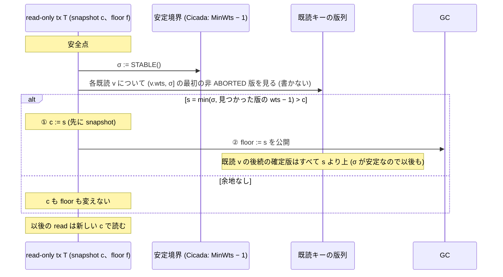

# 読み続ける read-only tx を前進させる成立条件 — RA に代わる最小の条件 (VHash 論文、md_44)

- 着手: 2026-09-30 (dev-wave `dev-wave-vhash-ro-continuing`、背景 job)。起点 local main `908741c6f`、CCBench は pin C `68106660`
- 依頼: `/work/1/SFC/tanab/tmp/vhash-2026-09-29/md_44.txt` と同 dir の `common.txt` (wave dir `/work/1/SFC/tanab/tmp/vhash-ro-continuing-2026-09-30/inputs/` に逐語)
- 土台 (以下の略称で引く):
  - md_26 = `output/insights/2026-09-30/vhash-gc-connection-proof/README.md` (構成 E の論理的な GC 安全と直列化、D2319)。不変条件 (I0)(I1)(I2)、条件 FS-a/b/c・PUB・RA・RC、列 X1・X2、経路 F はそちらの定義
  - md_13 = `output/insights/2026-09-29/vhash-forwarding-proof/README.md` (構成 C の直列化、D2292)。仮定 A1〜A11 と定理 4 はそちらの定義
  - md_22 = `output/insights/2026-09-29/vhash-readonly-gc-publish/README.md` (read-only commit で `mainte()` を通す ro-gcflag、D2317)
  - md_15 = `output/insights/2026-09-29/vhash-readonly-share/README.md` (read-only の 2 分類と見積り (a))
  - md_29 = `output/insights/2026-09-30/vhash-workload-space/README.md` (勝てる負荷のふるい分け、D2329)
  - md_36 = `output/insights/2026-09-30/vhash-proof-assumptions-vs-impl/README.md` (論証の前提と実装の対応、FS-b の列 G1)
  - md_18 = `output/insights/2026-09-29/vhash-interval-gc/README.md` (区間 GC 試作、D2323)
- **計算 0。** 新規の計測・探索・実装はしていない。本資料は紙の上の論証と、既存の一次資料・Cicada のコード (pin C) との照合だけである

## 0. 結論

**推奨 (3 行):**
1. 安全の側は成り立つ見込みが立った。前進先を「安定境界」(それ以下の時刻に新しい版がもう置かれない値) に限り、全既読がそこでも見えることを確かめてから snapshot を移し、その後で floor を上げれば、RA なしで既読の一貫性と論理的な GC 安全が保たれる (紙の上、§4)。
2. ただし効き目は細い。前進できる幅は「既読のどれかに次の確定版が来るまで」で頭打ちになり、熱いキーを 1 つ読むと数 µs 規模に潰れうる (§8)。さらに Cicada では、長い read-only tx 自身が境界の集計を 3 通りに止めている (§6.2)。
3. **今は試作へ進めず、md_42 の後に実装なしの診断 (§9 の D2: 既存の走から前進できた幅を後から数える) を先に行い、幅が tx の後半まで残る負荷がある場合だけ試作へ進む**のを推す。

**主張 (論文用の形):** §3 の抽象仕様 RO-A (read-only tx は安定境界の snapshot で読み、安全点で新しい安定境界 σ を得て、全既読が σ 以下のどこまで見え続けるかを 1 回の観測で確かめ、その最大値 s へ snapshot を移し、その後に floor を s 以下で公開する) に従う実行では、§4.1 の前提の下で次が成り立つ。

- **(S) 直列化:** 各 read-only tx は最後の snapshot の位置に置けば、書き手の確定時刻の順と合わせて直列化の順になる。読んだ版はすべて 1 つの snapshot の版である (定理 S-RO)。
- **(G) 論理的な GC 安全:** 活動中の read-only tx の既読版と、その後の読み・前進の観測で要る版は回収されない (定理 G-RO)。md_26 の RA は要らない。
- **(F) 失敗しても snapshot と floor は変えない:** 抽象仕様の確認は共有の値を書かないので、前進できないときは古い snapshot と floor のまま続けられる。Cicada での実装案 (§6.3) は確認の前に ThreadWtsArray・localClock_・GCFlag を別の操作として変えるが、どれも snapshot と floor には触れない。
- **他の tx への影響:** 前進した floor は常に `MinWts − 1` 以下で、新しく始まる tx の開始 floor を超えないので、md_26 の FS-b を新たに崩さない (§4.5)。

| md_44 の問い | 答え |
|---|---|
| X1・X2 の書き手を何が除くか | 安定境界の条件 (ST)。X1・X2 の書き手は「前進先より小さい時刻で、前進の時点でまだ活動中」の書き手で、ST はまさにそれを禁じる (§5) |
| 前進の後の新しい read で一貫性と寿命が保たれるか | 保たれる。新しい read も安定な snapshot で読むので、既読と同じ性質 (後続の確定版は snapshot より上) を最初から持つ (論理的な保持、§4.2・§4.4)。物理的な pointer の寿命は主張しない。走査域が stock の read-only の read の範囲に収まることだけを §6.4 に書く |
| 失敗したとき古い snapshot と保護を保てるか | 保てる。確認は rts も snapshot も floor も書かない。部分的に前進できる場合は既読の可視区間の交わりの上端まで進む (§3・§4.4) |
| Cicada の境界の集計が自分の開始時刻で前進先を抑えないか | 抑える。(1) 自分の ThreadWtsArray (開始時刻) が MinWts の上限になる、(2) 長い read-only tx の間は自分の GCFlag が立たないので leader の集計そのものが止まる、(3) thread 0 なら leader の仕事自体が止まる。`rts_ = MinWts − 1` の再実行だけでは前進しない (§6.2) |
| 「将来書かない」と「読んだ版を守る下限」をどう分けるか | 前者は ThreadWtsArray (この thread が今後置く版の wts の下限) を自 thread の時計へ持ち上げること、後者は ThreadRtsArray (= snapshot) として分ける。持ち上げの後は昇格しない (§6.3) |
| 性能の見込みの必要条件 | §8。幅は既読が増えるほど・熱いキーを読むほど狭くなる。区間 GC に対する上積みは、区間 GC の剪定条件 (D2323 の (a)〜(e)) と stock の切り離しを実際に当てた差分でしか言えず、本資料は上限を出さない (§8.2) |
| 抽象と C++ の分離 | 定理は §3 の抽象仕様について。Cicada の `MinWts − 1` が安定境界になる条件 (K1〜K5) はコード読解で、未確認を含む (§6.1) |

## 1. 範囲

**主張する範囲:** 固定キーの point read だけで、途中で write に昇格しない read-only tx。書き手は md_13・md_26 の範囲 (point read / update、既存キー、構成 C・E の前進を含む)。逐次一貫なメモリ、md_13 の A1 (1 step = 1 キーの版列の原子的な観測) と A2 (時刻の一意)・A3・A11。

**主張しない範囲:** 途中の昇格 (§6.3 で条件として禁じる)、scan・範囲の述語・挿入・削除、group commit (§6.1 K3)、弱いメモリ、物理的な非接触 (走査中の pointer の寿命・再利用、§6.4)、Cicada 実装全体の正しさ、性能の値 (§8 は必要条件だけ)。

**「固定 snapshot」との関係:** md_15 §2.1 は read-only を「固定 snapshot が要る型」と「serializable でよい型」に分けた。本資料の read-only tx は、前進の後も**全読みが 1 つの snapshot の版**であることを保つ (一貫 snapshot は壊さない)。変わるのは snapshot の時刻が開始時ではなくなることだけである。したがって「開始時点の状態」を要る用途 (時点指定の読み) には使えず、「ある一貫 snapshot」でよい用途 (一貫 dump・分析 query) には使える。D2317 が却下した「ro の途中で slot を上げる」案 (小モデルの `bad-raise-slot` 腕) は、既読を確かめず snapshot も動かさずに floor だけを上げる形で、本資料の案とは別物である (§7 の C3)。

## 2. 問題の所在

- **今の前進は read-only を前進させない。** 構成 C は `read_internal` の前進の分岐を `!this->is_ronly_` に限り (`patches/cicada-forwarding-variant.patch` の read_internal の hunk)、構成 E の安全点は `tx.is_ronly_` なら `ineligible` として何もしない (`patches/cicada-forwarding-gc.patch` の `cicada_gc_safepoint`)。
- **md_26 の論証は RA 付き。** 書き手型の前進 (候補時刻 c_T で読み、前進先 t′ で確認して floor を上げる) では、確認を始めた後の読み (X1: 公開の後、X2: 確認の成功と公開の間) がその確認に覆われず、floor だけでは守れない (md_26 §8)。読み続ける tx には RA を課せない。
- **長い read-only 読み手は、md_29 で伸びしろが最大の負荷。** batchR (batch worker 1 本が 1000 操作の read-only tx を続ける) では 84 行すべてで 3 秒間の MinRts の公開が 0 回、論理生存版数は record 数の 5.4〜14.5 倍 (層 S) (md_29 §0 項 1)。公開 0 回は stock の read-only commit が GCFlag を立てない欠陥 (md_22) を含み、ro-gcflag 修正の後も長い ro 1 本のとき公開時の境界年齢は 12.5〜14.3 ms 残る (md_22 §8)。残る分を縮めるには ro の snapshot を前へ動かす必要がある (md_22 §13)。

## 3. 抽象仕様 RO-A と疑似コード

### 3.1 安定境界

**定義 (ST):** 値 σ が時刻 τ で**安定**であるとは、次の 2 つが成り立つこと。

- **(ST-1)** τ より後に、wts ≤ σ の版は新たに設置されない。
- **(ST-2)** τ の時点で、wts ≤ σ の版に PENDING は無い (すべて COMMITTED か ABORTED で、A11 によりその後も変わらない)。

**補題 D (下方閉包):** σ が τ で安定なら、s ≤ σ の任意の s も τ 以後の任意の時刻で安定である。**証明:** (ST-1)(ST-2) は「wts ≤ σ の版」についての性質で、σ を小さくしても対象が減るだけ。τ 以後は設置も状態の逆行も無いので時刻を進めても保たれる。□

抽象仕様では、安定境界を返す操作 `STABLE()` が与えられていると置く。Cicada での実体 (`MinWts − 1`) と、その成立条件は §6.1。

### 3.2 疑似コード

read-only tx T の状態は snapshot c、floor f、既読集合 R (キーと読んだ版の組) である。VISIBLE(k, t) は「キー k の版のうち ABORTED を除き wts ≤ t の最大の版」。FIRST_ABOVE(k, v, σ) は「k の版のうち v より上で wts ≤ σ の、ABORTED を除く最初の版 (無ければ ⊥)」。

```text
RO_BEGIN(T):
  σ0 := STABLE()
  T.c := σ0
  publish T.f := σ0                  # floor ≤ snapshot (Cicada では ThreadRtsArray = rts_)
  T.R := ∅

RO_READ(T, k):                       # 待機の前でも後でも、何度でもよい
  v := VISIBLE(k, T.c)               # 安定なので PENDING に当たらない (ST-2)
  T.R := T.R ∪ {(k, v)}              # rts は書かない (stock の read-only と同じ)
  return v

RO_ADVANCE(T):                       # 安全点。read と read の間でも、全 read の後でもよい
  σ := STABLE()
  if σ ≤ T.c: return                 # 余地なし (何も変えない)
  s := σ
  for (k, v) in T.R:                 # 観測だけ。共有の値を書かない
    u := FIRST_ABOVE(k, v, σ)
    if u ≠ ⊥: s := min(s, u.wts − 1) # 既読の可視区間の交わりの上端
  if s ≤ T.c: return                 # 失敗: 何も変えない
  T.c := s                           # ① 先に snapshot を移す
  publish T.f := max(T.f, s)         # ② その後で floor を公開 (s ≤ 新しい c)

RO_COMMIT(T):                        # stock の read-only commit と同じ (検証なし)
  T の活動を終える
```

- 確認は「σ より下の区間 (v.wts, σ] に ABORTED 以外の版があるか」だけを見る。σ が安定なのでこの区間はもう変わらず、観測はキーごとに別の時刻でよい (キーをまたぐ原子性は要らない)。
- 書き手型の前進 (md_26 §2.1) との違いは 3 つ: rts を上げない、観測し直さない、前進先を自分で選ばず `STABLE()` とその下方閉包から取る。
- 増分の形: 前回の確認で σ_prev まで後続版が無かった既読は、次の確認で (σ_prev, σ] だけを見ればよい。見つかった後続版 u は以後変わらない (ST) ので、上端 U = min u.wts は下がる一方で、`U − 1 ≤ c` になった時点で以後の前進はすべて不可能と分かる (試行を止めてよい)。



## 4. 定理と証明

### 4.1 前提

| 番号 | 前提 | 使う場所 |
|---|---|---|
| ST | `STABLE()` の返す値は、返した時点で §3.1 の意味で安定 | 補題 C |
| H | 書き手 (read-only でない tx) の確定した履歴は、確定時刻 (最終の wts) の昇順が直列化の順になる。構成 C・E では md_13 定理 4 (その仮定 A1〜A11 の下)、stock Cicada では Cicada の正しさそのもの | 定理 S-RO |
| RC | 回収は md_26 §2.1 の規則だけ (y が COMMITTED で、同じキーの確定版 z と GC が読んだ境界 B について y.wts < z.wts ≤ B のときだけ回収。ABORTED は無条件に回収しうる) | 定理 G-RO |
| FS-b | T の登録時の floor は、それまでに GC が読んだどの境界 B 以上 (md_26 FS-b)。§4.5 で RO-A はこれを新たに崩さないことを示すが、書き手側 (構成 E) の破れ (md_36 の列 G1) は引き継ぐ | (I0) の基底 |
| NP | T は途中で書き手に昇格せず、版を設置しない | §6.3、ST の保存 |

md_26 の RA・FS-c は**使わない**。

### 4.2 補題 C (既読の一貫性)

T の活動中のどの時刻でも、(a) T.c はそれが設定された時点で安定であり、(b) R の各 (k, v) について v = VISIBLE(k, T.c) が全版の列で成り立ち、(c) 以後もそれは変わらない。

**証明:** 到達列の長さの帰納法。
- 登録: c = σ0 は ST により安定、R は空。
- RO_READ: 読みは c が安定になった後に行うので、ST-2 により区間 wts ≤ c に PENDING は無く、VISIBLE(k, c) は COMMITTED 版 v。ST-1 により以後 wts ≤ c に新しい版は置かれず、A11 により状態も変わらないので、v = VISIBLE(k, c) は以後ずっと成り立つ。
- RO_ADVANCE の成功: 新しい c = s ≤ σ は補題 D により安定。各既読 v について、FIRST_ABOVE(k, v, σ) の版 u (あれば) は s < u.wts なので、区間 (v.wts, s] に ABORTED 以外の版は無い。観測はキーごとに σ が安定になった後に行うので、この区間の中身は観測の時点で確定しており以後も変わらない (ST-1・ST-2・A11)。したがって v = VISIBLE(k, s) が以後成り立つ。GC による回収は区間 (v.wts, s] の中身を増やさないので、全版の列について言えば足りる。
- RO_ADVANCE の失敗・GC・他 tx の step: c と R を変えない。(c) により (b) は保たれる。□

**系 C′:** 既読版 v の、他 tx の後続の確定版 z はすべて z.wts > T.c である (z.wts ≤ c なら v は c で見えない)。これは md_26 の (I2) を floor ではなく snapshot について言ったもので、f ≤ c なら (I2) を含む。

### 4.3 定理 S-RO (直列化)

§1 の共通前提 (A1 の原子的な観測、A2 の時刻の一意、A11 の status の吸収性) に加え前提 ST・H・NP の下で、確定した書き手と read-only tx を「書き手は確定時刻の順、各 read-only tx T は最後の snapshot c_T の直後 (wts ≤ c_T の書き手の後、wts > c_T の書き手の前)」に並べた順は、直列化の順である。

**証明:** read-only tx は書かないので、書き手の読みの結果は read-only tx の位置によらず前提 H のまま。T の各読み (k, v) は補題 C により v = VISIBLE(k, c_T)。ST により wts ≤ c_T の版はすべて確定しており、その COMMITTED 版は wts ≤ c_T の確定した書き手の版そのものである。H の順で c_T の直後の状態は、各キーについて wts ≤ c_T の COMMITTED 版の最大であり、それが v である。したがって T は直列の実行で T の位置に置いたときと同じ版を読む。read-only tx 同士は書かないので互いの順は任意でよい。時刻の一意 (A2) により wts = c_T の書き手の扱いも一意に決まる。□

**注:** 前進の途中 (① と ② の間、確認の途中) の read-only tx は、それまでの c の直後に置いても、新しい s の直後に置いても同じ版を読んでいる (補題 C)。read-only tx の位置は実時間の順とは限らない (stock の read-only も開始より古い `MinWts − 1` で読むので、strict serializability はもともと主張していない)。

### 4.4 定理 G-RO (論理的な GC 安全)

前提 ST・RC・FS-b・NP の下で、活動中の read-only tx T について、次のどれも回収されない: (N1) T の既読版、(N2) T がその後に行う RO_READ で選ばれる版、(N3) T がその後に行う RO_ADVANCE の観測で選ばれる版 (FIRST_ABOVE の結果)。

**不変条件:** (I0) GC が読んだどの境界 B についても B ≤ T.f (T の活動中)。(I1) T.f ≤ T.c。

- (I0): 登録時は FS-b。floor は下がらない (公開は max)。GC が新しく読む境界は活動中の floor の最小なので T.f 以下。
- (I1): 登録時は f = c。前進では ① で c を s へ上げてから ② で f を s 以下へ上げるので、どの時刻でも f ≤ c。

**証明:** 回収された非 ABORTED 版 y には、同じキーの確定版 z と境界 B があって y.wts < z.wts ≤ B (RC)。T の活動中なら (I0)(I1) より z.wts ≤ B ≤ f ≤ c。
- (N1): y = v が既読版なら、z は v の後続の確定版で z.wts ≤ c。系 C′ に反する (z が T 自身の版であることは NP により無い)。
- (N2): 読みの時点を σ としても c は下がらない (c は前進でだけ変わり、上がるだけ) ので、z.wts ≤ c(σ)。VISIBLE(k, c(σ)) は wts ≥ z.wts > y.wts なので y ではない。
- (N3): FIRST_ABOVE(k, v, σ) の版 u は v より上にあり、v は c で見えているので u.wts > c ≥ z.wts > y.wts、したがって u ≠ y。□

md_26 の証明との違い: md_26 は (I2) を「前進の確認が全既読を覆う」ことから導いたので、確認の後の読み (X1・X2) を RA で除く必要があった。本資料は (I2) の代わりに系 C′ を ST から直接得るので、読みがいつ加わっても成り立つ。

### 4.5 他の tx への影響と FS-b

- T の floor を上げることは、他の活動中の tx X の (I0) を崩さない。GC の境界は活動中の floor の最小なので、T の floor が上がっても X の floor 以下に留まる。
- **新しく始まる tx の FS-b を崩さない。** RO-A で公開される floor は常に `STABLE()` の返した値以下で、Cicada では `MinWts − 1` 以下である。stock の書き手と read-only の floor も各 begin の `MinWts − 1` で、MinWts は下がらない (§6.1 K4) ので、どの floor も「今の `MinWts − 1`」以下にある。GC の境界 B はそれらの最小なので、新しい tx の開始 floor (`MinWts − 1`) 以上にはならない。構成 E の前進は floor を `target − 1` (> `MinWts − 1` になりうる) へ上げるので FS-b を崩しうる (md_36 §4 の列 G1)。**RO-A はこの穴を足さないが、E と併用するなら E 側の穴は残る。**

## 5. X1・X2 との対応

md_26 の X1・X2 は、書き手型の前進 (候補時刻で読み、前進先 t′ を自分で選ぶ) の列である。read-only tx に同じ形を当てると次のようになる。

| 列 | md_26 の列の芯 | RO-A で何が除くか |
|---|---|---|
| X1 (公開の後の読み) | T が A10 を読み、t′ = 100 へ前進して floor を上げた後に B20 を読む。**以前から活動する W@50** が B50 を設置して確定し、GC が B50 を根拠に B20 を回収する | ST。W@50 は前進の時点で活動中なので、その thread の ThreadWtsArray は 50 以下で、`STABLE()` は 49 以下しか返さない。前進先は ≤ 49 に限られ、T は B を ≤ 49 で読む。B50 (wts 50) は snapshot より上で、GC の境界は T の floor ≤ 49 以下なので、B50 を根拠に B20 は回収されない。系 C′ がこれを一般に言う |
| X2 (確認の成功と公開の間の読み) | 確認の成功の後・公開の前に B20 を読み、同じ W@50 が B50 を確定する | 同じく ST。前進先が W の時刻より下に限られるので、読みの時期 (確認の前後・公開の前後) によらない |

**まとめ:** X1・X2 の書き手は「前進先より小さい時刻で、前進の時点でまだ活動中 (後で版を置く)」書き手である。ST の (ST-1) はまさに「前進先以下に後から版を置く書き手はいない」という条件なので、書き手の側から除く。前進の後に始まる書き手は `MinWts` 以上の時刻を持つ (§6.1 K1) ので前進先より上にしか置けない。構成 C・E で前進した書き手も時刻を上げるだけなので同じ。

## 6. Cicada C++ への対応 (コード読解、未確認を含む)

「コード読解」は起点 main の CCBench (pin C `68106660`) と patch の指定した箇所を親が読んだもので、全経路の検査ではない。

### 6.1 `MinWts − 1` が安定境界になる条件

Cicada の leader は各 thread の ThreadWtsArray を 1 つずつ読んで最小を MinWts に置く (`cc/cicada/util.cc` の `cicadaLeaderWork`)。read-only tx は begin で `rts_ = MinWts − 1` を snapshot にする (`cc/cicada/transaction.cc` の `begin`、`read_internal` は `is_ronly_` なら `trts = rts_`)。次の条件の下で、T が MinWts を読んだ時点で `MinWts − 1` は安定になる。

| 番号 | 条件 | コード読解 |
|---|---|---|
| K1 | 各 thread i の ThreadWtsArray の値 ω_i は下がらず、時刻 t 以後に thread i が設置する版の wts は ω_i(t) 以上 | begin は `generateTimeStamp` (localClock_ は下がらない、`include/time_stamp.hh`) の後に slot へ store する。store 前の slot は前の値 (≤ 新しい wts)。活動中の tx の slot はその wts。構成 E の前進は wts と localClock_ を上げてから slot を target にする (`gc_advance`)。構成 C の前進は wts だけ上げ slot は開始値のまま (slot ≤ wts)。**abort 後の再試行・全経路の単調性は未確認** (md_13 A2 の注と同じ) |
| K2 | leader の非原子的な集計でも下限になる (初期値は K4 で別に扱う) | leader が集計して置いた MinWts について、版 y を thread i が時刻 t_y に wts < MinWts で設置したとする。MinWts ≤ ω_i(t_i) (t_i は leader が slot i を読んだ時刻) なので、K1 より t_y < t_i。leader は全 slot を読んだ後に MinWts を store (release) し、T は load (acquire) するので、y の設置は T の観測より前 (ST-1) |
| K3 | 前の tx の版の状態は、slot がその wts を越える前に確定している (ST-2) | 対象の経路は `group_commit = 0` の書き手の commit (writePhase の `cpv()` で状態を確定)、abort (版を片付けてから再試行)、その後の次の begin (slot の store) で、この順なら状態の確定が slot の更新より前にある。全経路での成立は未確認。**group commit では版が PENDING のまま次の tx へ進むので ST-2 が崩れる** (範囲外。その場合は確認を「PENDING を待つ」形にすれば ST-1 だけで足りるが、本資料は論じない) |
| K4 | MinWts は下がらず、**初期値も安定境界である** | 集計後は、各 round が前の round より後に各 slot を読み、slot は下がらない (K1)。leader は thread 0 だけ。**初期値 `initial_wts + 2` (`ycsb_cicada.cc` の main) は slot の集計結果ではないので K2 が当たらない。** 全 thread の最初の時刻がそれより大きいこと (TSC の core 間の単調性) が崩れると、最初の書き手が `MinWts − 1` 以下の時刻で版を置けて ST-1 が破れる (段 6 レビュー A が起動直後の列を作った: 初期版 wts 256000、MinWts 256002、別 core の時計で thread 1 の最初の wts が 256001)。**この穴は stock の read-only の begin にも同じく当たる。** 試作では、最初の全 thread の時刻が初期の MinWts より大きいことを確かめる必須条件とする |
| K5 | 0 からの減算をしない | leader の集計は全 thread の GCFlag が立ったときだけ行う (`cicadaLeaderWork`) ので、slot が 0 の thread がある間は MinWts は初期値のまま、と読める。前進は `MinWts ≥ 1` を確かめる (md_26 §2.3・md_36 の 0 付近の減算と同じ注意) |

K1〜K3 の記憶順序は x86 の TSO と acquire / release に依る (md_26 §10 の「記憶順序」と同じく未確認)。

**実装での確かめ方の案:** K1〜K3 が崩れると、確認の走査が σ 以下の PENDING 版に出会う。stock の read はこれを待つが、RO-A の確認はこれを「ST の破れ」として失敗扱いにし数える (0 のはず) と、確認の時点で見えた ST の破れ (σ 以下の PENDING) だけは実走で数えられる (`forward_visible` は wts < ts の PENDING を `conflict` として返すので、同じ形で数えられる)。確認が通った**後**に σ 以下へ遅れて版が置かれる ST-1 の破れはこの計数では見えないので、ST の監視の全体にはならない。これは試作 wave の計器の案であって、本資料は実装しない。

### 6.2 前進先を抑えるもの — `rts_ = MinWts − 1` の再実行だけでは前進しない

長い read-only tx T (thread k、開始時刻 w_T) について、次の 3 つが前進先を抑える。

1. **自分の ThreadWtsArray が MinWts の上限になる。** begin で `ThreadWtsArray[k] := w_T` を置き、read-only tx はそれを tx の間変えない。MinWts ≤ w_T なので、`MinWts − 1` をいくら読み直しても前進先は `w_T − 1` 以下。開始時の snapshot (`MinWts − 1`) と w_T の差 (他の thread の tx の古さと leader の周期の分) しか取り戻せず、**開始の後に溜まる版には効かない。**
2. **自分の GCFlag が立たないので、leader の集計そのものが止まる。** GCFlag は `mainte()` で立ち、`mainte()` は書き手の commit と、すべての abort (read-only の abort も含む) から呼ばれ、read-only の正常な commit からは呼ばれない (read-only commit は `mainte()` の前に return する、`transaction.cc` の commit)。leader は全 thread の GCFlag が立ったときだけ MinWts・MinRts を更新し、更新のたびに全員の flag を下ろす (`util.cc`)。したがって T の実行中は、T の thread の flag が下りた後、**MinWts も MinRts も 1 回も更新されない。** 構成 E の安全点も read-only を `ineligible` として flag を立てない。md_22 の ro-gcflag 修正 (D2317) は read-only の **commit** で `mainte()` を通すだけで、tx の途中では立てない。
3. **thread 0 なら leader の仕事自体が止まる。** `leaderWork()` は thread 0 が各 tx の先頭 (RETRY) でだけ呼ぶ (`include/ycsb.hh` の run)。長い tx が thread 0 で走ると、その間は集計が 1 回も起きない。既存の長い tx の harness (区間 GC・forwarding・ro-gcflag の workload patch) はどれも thread 0 を長い tx から外している。

加えて、他の長い read-only tx も (1) の形で自分の開始時刻で MinWts を抑える。前進先は最終的に「最も古い活動中の**書き手**の時刻」と leader の周期で決まる。

### 6.3 「将来書かない」と「読んだ版を守る下限」の分離

ThreadWtsArray と ThreadRtsArray は、書き手ではどちらも tx の開始で決まるが、意味は別である。

- **ThreadWtsArray[k] = この thread が今後置きうる版の wts の下限 (K1)。** 書かない tx は版を置かないので、この値を tx の開始時刻に留める理由が無い。自 thread の時計 (localClock_) を進めた値 L へ持ち上げてよい。条件は「以後この thread が置く版の wts ≥ L」で、次の tx の begin が L 以上の時刻を作るよう localClock_ も L の時計まで進める (構成 E の `gc_advance` が `localClock_ = max(localClock_, clock + 1)` とするのと同じ)。
- **ThreadRtsArray[k] = この thread の tx が読んだ・読む版を守る下限 (floor)。** RO-A の ② でだけ上げる。

Cicada での安全点の手順 (試作の設計メモ、実装しない):

```text
ro_safepoint(T):                           # is_ronly_ で、昇格していない tx だけ
  # (a) 書かない情報の公開 (前進の成否と無関係に安全)
  L := 自 thread の時計を進めた新しい時刻 ((clock << 8) | thid)、localClock_ も進める
  T.wts_ := L;  ThreadWtsArray[k] := L                  (release)
  # (b) 集計を動かす
  gc_inter_us ごとに GCFlag[k] := 1                     (release、D2317 の小モデルで ro 途中の flag は違反 0)
  thid = 0 なら leaderWork()
  # (c) 前進
  m := MinWts.load(acquire);  m ≥ 1 を確かめる
  σ := m − 1
  RO_ADVANCE の確認 (σ 以下の PENDING は ST の破れとして失敗・計数)
  成功なら ① rts_ := s  ② ThreadRtsArray[k] := s       (release)
  既読要素の later_ver_ は使わない (read-only commit は検証しない)。残すなら ⊥ にする
```

**昇格 (INLINE_VERSION_PROMOTION) は禁止する。** pin C の既定 build は `CCBENCH_INLINE_VERSION_PROMOTION = 1` (`cmake/Options.cmake`) で、`inlineVersionPromotion` は read-only tx を `is_ronly_ = false` にして自分の wts_ で書かせる (`include/transaction.hh`)。(a) の後に昇格すると、(1) L より小さい開始時刻で書けば K1 が崩れ、他の read-only tx の安定境界の下に版が置かれる。(2) 前進で c が開始時刻を越えた後に書き手へ転じると、snapshot が自分の書き込み時刻より新しい読みを持つ書き手になり、直列化の順が立たない。D2327 の修理 1 (read-only tx では promotion しない) は CCBench の local branch `izanagi-cicada-promotion-uaf-fix` にあり pin C には無いので、試作はその修理の上に置くか、read-only tx の昇格を別に止める必要がある。

### 6.4 物理的な寿命 (未主張、stock と同じ前提への帰着)

- **保持している pointer:** read set の `ver_` と、アプリへ返した `body_` の pointer は既読版を指す。Cicada の回収 (`gc_versions`) は確定版 z (z.wts < MinRts) の下を鎖から切り離して解放する。T の活動中は MinRts ≤ T.f ≤ T.c なので z.wts < c、既読版 v は c で見えているので z.wts ≤ v.wts、切り離されるのは z より下で v は残る。前進の後も v は新しい c で見えている (補題 C) ので同じ。
- **確認の走査:** 最新版から σ 以下の最初の版まで下る走査で、通る版はすべて v 以上。stock の read が c まで下る走査の途中まで (前半) に当たる。したがって並行する切り離しとの関係は stock の read-only の read と同じ前提に帰着する (その前提自体は md_26 §11 と同じく未主張)。
- **`later_ver_`:** 読んだ時点の v の直上の版で、wts > c。前進の後に wts ≤ s の確定版なら確認が失敗するので、成功した前進の後に残る `later_ver_` は ABORTED か wts > s の版。ABORTED 版の扱い (再利用・解放) は物理の側の未確認項目。read-only commit は `later_ver_` を使わないので、使わない形にすればこの項目は消える。
- REUSE_VERSION・inline 版の再利用、区間 GC の「外すが走行中は再利用しない」変種 (D2323) との重ね合わせは未確認。区間 GC の保護点には各 thread の wts も入るので、(a) で T の wts slot を持ち上げると区間 GC が T の開始時刻の保護点を外す。T は開始時刻では読まない (rts で読む) ので論理的には不要な保護だが、区間 GC 側の条件 (d′)(e) との関係は確かめていない。

## 7. 各条件を外すと何が起きるか (反例と意味)

下の列はどれも紙の上の列で、モデルでも実走でも探索していない。右列の「意味」は、その条件が本資料の設計の類 (floor だけで守る・read-only は rts を書かない) の中で要ることを示す。類の外 (refs・rts を書く読み) では別の条件で代えられる。

| # | 外す条件 | 紙の上の列 | 意味 |
|---|---|---|---|
| C1 | 全既読の確認 (前進を `rts_ := MinWts − 1` の再実行だけにする) | 初期版 A10・B10。T が c = 30 で A10 を読む。W@40 が A40・B40 を書いて確定・終了。σ = 59 へ確認なしに前進し B を読むと B40。T は A10 (W の前) と B40 (W の後) を読み、T →rw W →wr T の巡回。GC 側でも、floor 59 を公開すると A40 < MinRts を根拠に A10 が回収されうる | 可視区間の交わりの確認は必要。md_15 §2.1 が「read set の検証が要る」とした費用はこれ |
| C2 | 前進先の安定 (前進先を自分の時計 100 にする、または活動中の書き手を無視する) | T が c = 30 で A10 を読む。W@50 は活動中。T が 100 で A10 の可視を確かめて前進 (rts は書かない)。W が A50 を設置して確定 (T は rts を書かないので、A10 の rts が 50 未満のままなら W の検査は通る)。Y@60 が A50 を読み B60 を書いて確定。T が 100 で B を読むと B60。T →rw W →wr Y →wr T の巡回。GC 側は md_26 の X1 と同じ形 | 安定でない前進先には、既読の rts を上げる (書き手型の確認) 必要があり、そうすると確認の後の読みに RA が要る (md_26)。読み続ける read-only tx には安定境界しか残らない |
| C3 | 順序 (snapshot を移す前、または移さずに floor を上げる) | D2317 が却下した形 (小モデル `bad-raise-slot`): 読んだ後に slot だけ `MinWts − 1` へ上げ、読みは古い rts のまま。(I1) f ≤ c が崩れ、古い c で見える版の後続確定版が境界以下になって既読・未読の版が回収されうる (小モデルでは最短 49 step で違反、ただし stock の ro の遷移にない早い flag の前置きが要る、md_22 §3) | ① → ② の順が要る。floor は常に snapshot 以下 |
| C4 | 書かない情報の持ち上げで localClock_ を進めない | T が slot を L へ上げ、他の read-only tx R′ が σ′ ≥ L − 1 を得て読む。T の thread の次の書き手が L より小さい時刻で版を置くと、R′ の snapshot の下に版が現れる (ST-1 の破れ)。R′ が読んだキーなら R′ は古い版を読んだまま、C2 と同じ型の巡回と回収が起こりうる | K1 を保つ持ち上げだけが許される |
| C5 | 昇格の禁止 | (列ではなく、昇格したときに破れる前提の参照) §6.3 の (1)(2) | NP が要る。pin C の既定 build はこれを満たさない |

## 8. 性能の見込みの必要条件

### 8.1 前進できる幅

時刻 t での幅は ρ(t) = min(σ(t), U(t) − 1) − c(t)。U(t) は「既読のどれかに次の確定版が来る最小の時刻」(= min FIRST_ABOVE の wts)。

- **U は既読が増えるほど下がり、上がることはない。** 既読 v ごとに「v の次の確定版」は決まれば変わらない (ST) ので、既読集合が増えるたびに U は同じか下がる。
- **熱いキーを 1 つ読むと幅がそのキーの更新間隔に潰れる。** 既読キーの更新が独立に率 λ_k で起こるとみなすと、c から Δ 先まで前進できる確率はおよそ exp(−Δ Σ_{k∈R} λ_k)。md_29 の batchR (rr 95・skew 0.99・最良設定) では熱いキー 0〜7 の鎖が 3 秒の走で最長 1,093,228 版に達した。この値は最長の鎖の長さ (2 反復平均) であって更新回数の測定値ではない。公開が 0 回で回収がほぼ無いと仮定すれば鎖の版数は作られた版数に近く、3 s ÷ 1,093,228 ≈ 2.7 µs が平均の更新間隔の粗い目安になる (仮定からの算術で、実測した間隔ではない)。batch の read-only tx の読みが通常の worker と同じ偏り (skew 0.99) でキーを選ぶなら、1000 操作のうち早い段でこの層のキーを読む見込みが高く、その後の前進の幅は µs 規模に留まる (batch の読みのキーの分布は確かめていない。値の見込みで、計測ではない)。
- **前進先は最も古い活動中の書き手で止まる (§6.2)。** 長い書き手 (batchU など) と同居すると、σ はその書き手の時刻で止まる。
- したがって、幅が tx の後半まで残る必要条件は「既読の更新率の和が小さい」(既読が冷たいキーに寄る、record が多く偏りが弱い、書き手の熱いキーと read-only tx の読みが重ならない) ことと「長い書き手がいない」ことである。

### 8.2 何が返ってくるか (区間 GC との差分)

- **stock の GC (MinRts より下の確定版の下を切る) に対して:** floor を c から s へ上げると、全キーで「s 以下の最新版より下」が回収できるようになる。読んでいないキーの (c, s] の版がそのまま返る。
- **区間 GC (どの保護点からも見えない中間版を外す、md_18) に対して:** 区間 GC は保護点から見えない中間版を外せるので、前進で上積みされるのは、T の snapshot c が保護点でなくなって外せるようになる版に限られる。ただし区間 GC は可視版のほかに条件 (d′) (保護点ごとの最初の鎖上の節点の直上を残す) で隣接版を残し、条件 (e) (MinRts の可視版より新しい) と stock の切り離し、他の thread の保護点、保護点の採取の時点にも左右される (D2323 決定 2)。したがって上積みの版数に簡単な上限は置けず、本資料は出さない (段 6 レビュー B が、初稿の「未読の更新キーごとに高々 1 版」を撤回させた)。T が読んだキーでは確認により c と s で見える版が同じなので、可視版そのものは変わらない。md_18 では長い read-only の間は MinRts の公開が無く剪定も 0 回だった (ro-gcflag との重ね合わせは未実施) ので、区間 GC の側の効き目自体がまだ測られていない。
- **T 自身の探索:** T の読みは最新版から c まで下る。c が s へ上がると、その後の読みの走査が短くなる。md_29 では batchR の位置 ≥ 1 の read の割合 h1 が 0.51〜0.53 だった。区間 GC が中間版を外せていればこの差は小さい。

### 8.3 費用

- 1 回の試行の確認は、既読ごとに最新版から σ 以下まで下る走査。増分の形 (§3.2) なら (σ_prev, σ] の区間だけ。
- U − 1 ≤ c になった後は試行を止められるので、幅が潰れた tx の費用はそこで止まる。
- 共有の書き込みは (a) の slot の store・GCFlag の store と、成功時の ThreadRtsArray の store だけで、既読版の rts は書かない (書き手の検査を増やさない)。

## 9. md_42 の後に測る最小の診断項目

md_42 (修正済みの最良設定 Cicada と区間 GC を相手に、長い読み手で版が溜まる負荷の天井を直接測る) の結果を見た後に、次を順に測る。**D1〜D3 は RO-A を実装せずに測れる。** 判定の閾値は結果を見る前に、その診断を行う wave で登録する。性能値は trace と計器を外した build で、比較相手も同じ条件で測る (絶対規律 1)。

| # | 何を決めるか | 測る量 | 実装の要否 |
|---|---|---|---|
| D1 | 修正済みの比較相手 (ro-gcflag・最良設定、区間 GC あり / なし) で、長い read-only tx が探索・保持・回収をどれだけ遅くしているか | 長い read-only tx の有無の同時刻の対で、書き手の throughput 比、read の位置の分布 (h1・深さ)、論理生存版数、GC の回収時間。md_42 の出力で足りればそれを使う | 不要 (md_42 の範囲) |
| D2 | 全既読を保てる前進幅が tx の後半まで残るか | 各長い read-only tx について時刻ごとの U(t) と σ(t) を後から計算し、ρ(t) を tx の前半・後半で集計する。U(t) は「既読の版」と「各キーの次の確定版の wts」から出る。σ(t) は §6.2 の抑えを外した仮定の値として「その時刻に活動中の書き手の最小の時刻 − 1」を使う。判定器用の trace (`patches/instr-cicada-trace*.patch`) は読みの版と書き手の版を持つので U(t) は出せる見込みだが、σ(t) に要る tx の開始・終了の時刻が記録にあるかは確かめていない (無ければ計器を足す) | 実装は不要 (後から数える反実仮想)。計器か trace の build の記録を使い、性能値にはしない |
| D3 | 区間 GC が既に捨てられる版を除いて、前進で追加に要らなくなる版があるか | D2 の ρ から、各時刻に T の snapshot を c から c + ρ へ移したと仮定して、区間 GC の剪定条件 (D2323 の (a)〜(e)) と stock の切り離しを実際に当てたとき追加で外せる版の数と、それが論理生存版数に占める割合 (§8.2) | 不要 (条件を当てる後処理が要る) |
| D4 | 再検証の費用を引いても利得が残るか | 試作で、試行回数・成功回数・確認の走査の歩数・失敗の内訳 (幅なし・U で打ち切り・ST の破れ) と、同時刻の対の throughput 比 | 要 (試作)。D2・D3 が閾値を越えたときだけ |

**試作へ進むときに先に登録する正しさの確認 (案):** 判定器 (巡回なし、上限 indeterminate) に加え、md_14 型の保持版検査 (commit 時に全既読版が変わっていない)、ST の照合 (確認の時点の σ 以下の PENDING の計数は ST-2 の兆候を拾う補助にすぎず、ST-1 は「各前進の σ と観測の時刻」と「各版の設置の時刻・wts」を記録して、観測の後に σ 以下へ設置された版が 0 件かを後から照合する)、壊し正例 4 本 (C1 確認を外す・C2 前進先を自分の時計にする・C3 floor を先に上げる・C4 localClock_ を進めない)。巡回を作らない早すぎる回収は判定器に見えない (D2300 の盲点) ので、保持版検査と ST の照合を主にする。

## 10. 確かめたこと・確かめていないこと

**確かめたこと (紙とコード照合):**
- §4 の補題 C・定理 S-RO・定理 G-RO の証明 (§4.1 の前提の下、抽象仕様 RO-A について)。
- Cicada の read-only の読み・commit・GCFlag・leader の集計・時刻の生成・昇格の経路 (pin C のコード読解、§6)。
- 構成 C・E の patch が read-only を前進させない箇所と、E の `gc_advance` の時刻・slot の順序。
- 既存資料の被覆: read-only tx の途中前進を論じた・実装した資料は無い (vhash の insight README 28 本・`docs/decisions.md`・`patches/` を「途中前進」「snapshot を新」「snapshot を前」「read-only.*前進」「ro.*前進」で検索。近いものは D2317 の却下案、md_15 の見積り (a)、md_22 §13 の将来課題、論文草稿の「固定 snapshot の型は前進の対象外」)。`docs/paper-story-vhash/` の全体は走査していない。

**確かめていないこと:**
- §7 の列は紙の上の列で、モデル (`tools/vhash_forwarding_model/`) でも実走でも探索していない。とくに C1〜C4 が Cicada の実際の遷移で到達するか。
- K1〜K5 の全経路での成立 (abort・再試行の時刻、group commit、記憶順序、TSC の core 間の単調性)。とくに K4 の初期値は、起動直後に ST が破れる列がコード上で作れる (段 6 レビュー A)。実機で起きるかは確かめていない。
- 構成 E と併用したときの FS-b の破れ (md_36 の列 G1) との重なり。
- 物理的な寿命 (§6.4)、区間 GC との重ね合わせ。
- §8 の幅の見込みは md_29 の鎖の長さからの目安で、read-only tx の既読と熱いキーの重なりは測っていない。

## 11. 工程

- 段 1 (親) が一次資料とコードを読み、関連資料の抽出を read-only の子 1 本に任せた。段 2・3 は既定の軽量版で省いた (正しさの防壁・受理集合を変えない docs だけの wave)。
- 段 6 の記録前レビュー (read-only codex 2 本) の所見と裁定は §12 にある。
- 工程の詳細 (brief・裁定・子の出力) は wave dir `/work/1/SFC/tanab/tmp/vhash-ro-continuing-2026-09-30/` (repo 外) と worklog にある。

## 12. 段 6 レビューの所見と裁定

read-only codex 2 本を並列で回した (A: 論証の反例探し、B: 事実照合と過剰)。所見 11 件をすべて real と裁定し、本文を直した。

- **レビュー A の結論:** ST・H・RC・FS-b・NP が成り立つ抽象仕様 RO-A について、定理 S-RO・G-RO の反例は作れなかった (キーごとに別時刻の確認、ABORTED の読み飛ばし、複数回の前進、① と ② の間の読み、再読、wts = σ の境界を試した)。RO-A 単独で FS-b や X1・X2 型の回収を新たに破る列も作れなかった。§7 の C1・C2 は紙の上の列として成立すると確かめた。
- **A の所見 (6 件):** (1) 初期 MinWts が安定境界にならない起動直後の列 → K4 を必須条件に直し、stock の read-only にも当たると明記。(2) PENDING の計数では確認の後の ST-1 の破れが見えない → §6.1・§9 を「補助の計数」と「設置時刻と σ の後からの照合」に分けた。(3) 定理 S-RO の前提に A1・A2・A11 を明示。(4) 「失敗しても何も変えない」を「snapshot と floor は変えない」に狭めた。(5) K2・K3 を初期値の場合と対象経路に分けて条件付きにした。(6) C5 を列ではなく前提の参照と表示した。
- **B の所見 (5 件):** (1) 区間 GC に対する上積みの「未読の更新キーごとに高々 1 版」を撤回し (must-fix、D2323 の (d′)(e) と stock の切り離しに左右される)、D3 を条件を実際に当てる診断に直した。(2) `mainte()` を呼ぶ経路の書き方 (read-only の abort も呼ぶ)。(3) 2.7 µs は最長の鎖の長さからの粗い目安で、実測の更新間隔ではないと明記。(4) PENDING の計数の範囲を狭めた (A の (2) と同じ)。(5) 物理的な寿命を主張しないことを §0 の表でも明記。
- 数値・引用・関数名の照合では、上の (2)(3) 以外の食い違いは報告されなかった。
- 子の出力の全文は wave dir (`review-A-out.md`・`review-B-out.md`) にある。
