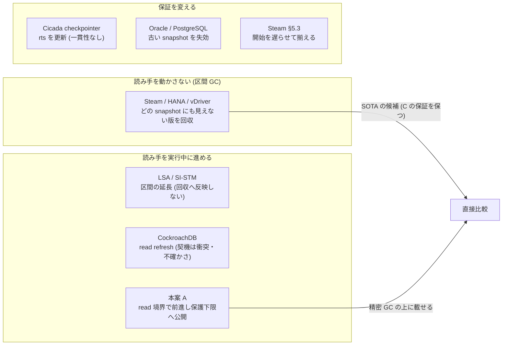

# VHash の read-only 前進 — 新規性と、条件 × 手法 × SOTA を結果の前に決める (2026-09-30)

- 依頼: 並行 VHash wave の md_43 (`/work/1/SFC/tanab/tmp/vhash-2026-09-29/md_43.txt`、同 dir の `common.txt`)。台帳は新規 item (T 番号は fold が振る)。
- 着手: 2026-09-30 21:58 JST。入力 commit: `908741c6fe1db954c824857ccc2086fe16856d45` (local main)。計算 0 (文献と論証だけ)。
- **事前記述:** `search-registration.md`。追加検索の前に commit `b9c429cc8e2c5f62f7dc72211f03f5e377cd0ca4` (2026-09-30 22:38:57 JST) で凍結した
  (凍結時の SHA-256 `5e800a66b8e67776079f549275e86dd9565ddb8cd35e4e564ea57ede33441737`)。凍結後の変更は同 file 末尾の「追記」にだけある。
- **本 wave は性能結果 (並行 wave md_42) を開いていない。** 主張・比較相手・判定基準は性能値を見ずに決めた。
- 本文は日本語、原典の逐語だけ英語。逐語は原典テキストとの機械照合の対象 (§9)。

---

## 0. 結論 (先に)

**推奨 (条件 C × 手法 M × C での SOTA):**

- **C** (事前記述 §5.2 のまま) = 主記憶の多版 CC (CCBench の Cicada) で、更新と並行して読み取りを続け、前進の候補となる read を発行する長い read-only tx がいる負荷。
  直列化可能。読み取り後に待つ tx は境界条件として別に示す。
  **評価上の部分条件 (事前記述より狭い。性能結果ではなく §5.3 の構造上の導出から選んだ):** 開始時刻のずれた複数の読み手がいて、更新が読み手の未読の範囲に集中する負荷
  (冷たい範囲を走査する分析 + 熱い範囲の OLTP 更新)。M の余地が最も大きいと導出される部分であり、主条件の代わりにしない。
- **M** = 主張 A の機構 (読み続ける read-only tx が read 境界の安全点で、既読の可視区間に収まる最大の時刻へ snapshot を進め、確定の後に保護下限へ公開する) を、
  **精密 GC の上に載せたもの**。**ただし「既読の版が前進先でも見える」だけでは read-only tx の一貫性に足りない** — 不在を読んだキーへの後の挿入と範囲読み取り (phantom) の条件が要る
  (§5.3、ストーリー §3.5)。この条件を含む論証と実装が揃うまで、M が C で直列化可能性を保つとは書かない。
- **SOTA** = **「必要な版だけを残す」精密 GC の系** を載せた、ro-gcflag 修正入りの最良設定 Cicada (我々の移植)。候補は 2 つ残す:
  DB の tx での Steam の EPO (Böttcher ほか PVLDB 2019) と、空間の上界つきの range-tracking 型 (Wei ほか PPoPP 2023、公開実装あり)。
  Wei ほか自身が「決定的に最良の方式は無い」と結論し、更新中心では Steam 側が概して速いので、C での単独の最強は決めない (§5.2)。
  移植は、少なくとも「更新されない版の列も掃除する」(Wei ほかが Steam の弱点として挙げる dusty corners を残さない) ところまで行い、弱い GC を相手にしない。
  区間 GC なしの修正入り Cicada と stock は基準腕として並べる。

この推奨には強い但し書きがつく。

1. **精密 GC の上で M がさらに減らせる対象は特定できたが、その量は分からない。** 精密 GC は読み手を動かさずに「どの snapshot からも見えない途中の版」を消す。
   M が追加で消せるのは「読み手ごとに、前進した区間で更新された未読キーの、旧 snapshot でだけ必要な版」だけである (§5.3)。
   量は負荷に依り、小さい場合 (読み手が少ない・既読がすぐ上書きされて前進の余地が無い) と大きい場合 (開始のずれた読み手が多く、更新が未読の範囲に集中する) の両方がありうる。
   Steam は同じ対象を開始時刻を揃える別の手段で消し、性能の向上を「数 %」と書くが、方式・負荷・測定量が違うので M の量の上界にはならない。
   **したがって「SOTA より大きく速い」は、今の材料では主張できない仮説である。**
2. **M を min 型 GC の Cicada と比べた差は SOTA への勝ちではない。** min 型の回収境界は長い読み手 1 本で止まるが、それを止めない既知の解 (精密 GC) がある。
3. **M 単独 (精密 GC なし) には、任意の途中の版を回収する保証が無い。** 前進した時刻より新しい途中の版は min 型 GC では残る (§5.3)。
   ただし前進が現在時刻近くまで届く場面では、M 単独が固定 snapshot の精密 GC より古い版を多く外しうる (段 6 レビューの反例) ので、「常に負ける」とは言えない。
4. **新しさ (K1): 本文を読んだ論文 15 本と製品文書 3 件 (§9) の読んだ節では、A1〜A5 を同時に満たす方式は無かった。** 最も近いのは、
   前進はするが回収へ反映しない LSA・SI-STM・CockroachDB、読み手を動かさずに回収する Steam・HANA・vDriver、
   長い背景読み手に rts の頻繁な更新を求めるが一貫した snapshot を保たない Cicada の checkpointer、safe snapshot と確定した read-only tx が commit 前に SIREAD lock を捨てる PostgreSQL の SSI である (§3)。
   **索引検索の完走状況と、それが許す不在の文は §4。**
5. 他論文の throughput の数値を引くだけでは SOTA に勝ったとは言えない (§6 K5)。勝ちの主張は同一負荷・同一機体・同一測定窓の同時刻の直接比較でだけ書く。

**図の読み方。** 左は読み手を固定したまま回収を細かくする系、中央は読み手の時刻を実行中に動かす系、右は読み手の保証 (一貫性・生存・開始時刻) を変える系である。
本案を精密 GC の「代わり」でなく「上」に載せる理由は §5.3。図は機構の向きだけを表し、性能・件数・不在を表さない。

---

## 1. 何を確かめ、何を確かめていないか

| 確かめたこと | 確かめていないこと |
|---|---|
| 論文 15 本と製品文書 3 件の本文を 6 観点で読み、A1〜A5 を判定した (§3。抽出は読み取り役 4 本、逐語は親が機械照合、§9) | DIVA・OneShotGC の本文 (ACM が機械取得に 403、EPFL は人間確認)。要旨の範囲だけで「未確認」の行に置いた |
| 事前登録した検索式 R01〜R09 の索引検索 (§4) | 判定は要旨の範囲 (本文を読んだのは §3 の対象だけ) |
| 比較相手の実装の公開状況 (§7) | 本案 A (読み続ける tx の前進) の実物・性能。既存の実測 (構成 E) は読み取り後に待つ tx だけ |
| 精密 GC と本案の保持の差を、定義から導出した (§5.3。段 6 の独立レビューの反例 2 件を反映) | その差の大きさの実測 (本 wave は計算 0) |

読み手への注意: 「記述なし」は**その原典の読んだ節**についての記述であり、世界についての不在の主張ではない。世界についての不在は §4 の規則でだけ書く。

---

## 2. 主張と、既知の部分 (事前記述の要約)

正本は `search-registration.md` §1〜§2。ここでは要点だけ。

> **主張 A:** 読み続ける read-only tx が、既読を保ったまま snapshot を進め、commit 前に版データの保護義務を縮める。

限定語 A1 読み続ける / A2 read-only / A3 既読を保ったまま (abort・再実行・読み直しをしない) / A4 実行中に snapshot を後へ進める / A5 進めた時刻を tx の終了前に回収側へ反映する。

- **既知:** 実行中に読み取り時刻・有効区間を後へ動かし既読の整合を確かめる骨格 (CockroachDB・LSA・SI-STM)、位置を新しい側へ寄せれば古い版を早く捨てられるという目的 (SI-STM)、
  回収境界を実行中 tx の時刻の最小にする規則 (Hekaton 2013・Cicada)、読み手を動かさずに途中の版を回収する区間 GC (Steam・HANA・vDriver)、
  読み手の開始時刻を揃えて保持版を減らす案 (Steam §5.3、開始時)。
- **新しいと考えた部分 (仮説):** A1〜A5 を同時に満たす機構と、その確定と公開の順序 (md_9 の小モデル R6→R7、D2290 の SP)。

---

## 3. 比較表

### 3.1 6 観点の表

各セルは要約で、原典の節と逐語は抽出 (repo 外 `extract-R1.md`〜`extract-R4.md`) と §9 の照合記録にある。本文を読めていないものは「未確認」。

| 方式 (原典) | 読み続けてよいか | 既読を保つか | 将来の書き込みへの対処 | 論理的な回収 | 物理的な回収 | 費用 (原典の報告、条件つき) |
|---|---|---|---|---|---|---|
| **本案 M** (ストーリー 2026-09-30 §3〜§5、D2290・D2295・D2315・D2319) | 許す | 進める。既読の可視区間に収まる最大の時刻へ (E-max)。確かめられなければ前進しない (abort しない)。**不在を読んだキーと範囲読み取りの条件は未定** (ストーリー §3.5) | 前進先より後の書き込みは見ない。最終保証は stock の validation (D2287) だが、**Cicada の read-only tx は read set を検証しない**ので、read-only の前進の一貫性は前進時の確認だけに依る | 確定の後に保護下限 (Cicada の rts) を公開し、旧 snapshot でだけ見える版の保護義務を下げる | **主張しない** (D2319。`REUSE_VERSION=1` の pool は縮まない、ストーリー §5) | 前進の確認 (既読の rts を上げる) と公開。throughput 差は構成 E で検出できず (ストーリー §5.3)。**読み続ける tx での実物は無い** |
| stock Cicada (SIGMOD 2017 §3.1・§3.8) | 許す (read-only は検証なし) | 固定 (thread.rts) | read-write の時刻は min_wts 以上で read-only から見えない | `v.wts < min_rts` の版より前を回収。長い読み手が min_rts を止める | 10 µs ごとの quiescent 宣言がそろうと leader が min を更新、thread-local pool へ | GC を 100 ms 間隔にすると TPC-C 28 warehouse で throughput −36.0% |
| ro-gcflag 修正入り Cicada (D2317、md_22) | 同上 | 同上 | 同上 | read-only commit でも `mainte()` を通し GC の公開を止めない (stock の欠陥の修正) | 同上 | md_22 の一次資料 (本 wave は数値を引かない) |
| Cicada の checkpointer (同 §3.7 付近) | 許す (背景の長い読み手) | **一貫した snapshot を保たない** (各 record の最新の commit 済み版を読む) | — | min_rts を止めないよう rts を頻繁に更新する | 同上 | 記述なし |
| **Steam** (PVLDB 13(2) 2019 §2.1・§3・§4.1–4.3・§5.3・§5.7) | 許す (打ち切り・abort は高負荷に不適と退ける) | 固定 (開始時に有効な版) | snapshot より後は不可視。直列化は precision locking と組む前提 | **区間 (EPO)**: 活動 tx の開始時刻の集合で、各時刻に見える版だけ残す。鎖長は活動 tx 数以下 | unlink と解放を分け、解放は所有 tx の解放 (commitId ≤ min(startTs)) まで遅らせる | CH (OLAP 1・OLTP 1): 最大鎖長 30,287 → 2、txn/s 6,554 → 30,580 (Table 5)。更新周期 5 ms でも overhead 測定不能 |
| Steam §5.3 の開始時刻を揃える案 | 許す | 固定 (**開始時**に揃える。実行中ではない) | 同上 | 開始時刻の種類が減るので鎖に残す版が減る | 同上 | 「数 %」の向上、query 待ち時間の増加と引き換え (図表なし) |
| **SAP HANA HybridGC** (SIGMOD 2016 §1・§3.1・§4.1・§5) | 許す。ただし強制 close も実装 | 固定 (Stmt-SI は文ごと、Trans-SI は tx ごとに新しい snapshot) | SI の可視性 | **区間**: 可視区間に活動 snapshot の時刻が 1 つも入らない版 (定義 1)。10 秒周期 | background で物理削除 (読み手への安全策は記述なし) | 長い cursor 下で版数ほぼ一定、1,000 秒で SI 1.18 億版回収、overhead 約 0.8% (周期 1 秒) |
| **vDriver** (Long-lived Transactions Made Less Harmful、SIGMOD 2020 の技術報告版 §3・§5) | 許す | 固定 (開始時の read-view) | REPEATABLE READ / SI | **dead zone** (定理 3.5): 活動 tx の開始時刻が可視区間に入る版だけ残す。ZT は周期更新 | version segment 単位で丸ごと削除 (完全性を捨てる)、行内に最新 2 版 (SIRO) | 最大鎖長 100 未満 (vanilla は 10^4 超)、Zipf 1.1 まで 92% 超を移動時に剪定。throughput は「維持」とだけ |
| DIVA (SIGMOD 2022) | **未確認** (本文未取得。要旨: HTAP で版索引と版データを分離、provisional version indexing と時間区間ベースの版 GC) | 未確認 | 未確認 | 未確認 (要旨は time interval-based version garbage collection) | 未確認 | 未確認 |
| OneShotGC (PACMMOD 1(1) 2023) | **未確認** (本文未取得。要旨: 版の時間的な相関で連続領域へまとめ一括解放) | 未確認 | 未確認 | 未確認 | 未確認 (要旨は "released in one shot") | 要旨: YCSB・TPC-C で最大 2 倍 (Proteus) |
| **LSA** (DISC 2006 §3.2・§4) | 許す (長い read-only の集計を評価) | 進める: 有効区間の上端を必要時に延長 (Extend)。重なる版が無ければ abort | 重なる旧版を読み区間を閉じる。read-only は linearizable | **記述なし** (延長を回収へ結ぶ規則なし) | 旧版は固定個数 (0/1/8) | 延長は committed read-only で 0〜1 回。旧版数と throughput は一様でない |
| **SI-STM** (TRANSACT 2006 §3.1–3.3・§4.4) | 許す (長い read-only を動機に挙げる) | 進める: 区間が空になったとき上端を延長。空のままなら abort。proactive な延長は将来課題 | SI (直列化は保証しない)、任意で linearizability | **記述なし** (動機として「旧版を早く捨てられる」だけ) | 旧版は k 個 (1〜8)。weak reference 化は将来課題 | 1〜2 版で 8 版と同程度 |
| **CockroachDB** (SIGMOD 2020 §3.1・§3.3–3.5) | 規則の記述なし | 進める: read refresh (既読の keys に (ta, tb] の更新が無ければ read timestamp を進め、あれば restart)。**契機は衝突と時計の不確かさ** | 高い timestamp の intent は無視、不確かさ区間の値で uncertainty restart。serializable | **記述なし** (GC・保持の記述が論文に無い) | 記述なし | refresh は read set の再走査、偽陽性の abort あり。数値なし |
| Hekaton 2011 / 2013 (PVLDB 5(4) §2.3・§3.4、SIGMOD 2013 §5・§8) | 許す (read-only は SI で検証なし) | 固定 (全 isolation level で読み取り時刻 = 開始時刻) | 可視性。serializable は commit 時の validation | 最古の活動 tx の begin timestamp (watermark) より end が古い版 | 協調 (worker) と背景の 2 経路。index から unlink 後 | 旧版の追跡が CPU を使う。長い tx が watermark を止める話は記述なし |
| TicToc (SIGMOD 2016 §3・§5) | 規則なし (OCC) | 実行中の時刻なし。commit 時に rts を延長 | wts が変われば abort | 該当なし (single-version) | 該当なし (履歴 buffer は固定長の wts) | — |
| **SSI の safe snapshot** (Ports・Grittner PVLDB 5(12) 2012 §4・§6) | 許す。DEFERRABLE は最初の query の前に待つ | 固定。unsafe なら最初の query の前だけ取り直す | 危険構造で abort。safe snapshot 上の read-only は abort されない | 旧版の GC は記述なし。**safe と確定した時点 (commit 前) で SIREAD lock を捨てる** | SIREAD lock を最古の活動 tx の commit 時に掃除 | DEFERRABLE の待ち: 中央値 1.98 秒・90% が 6 秒以内 (disk-bound の重い負荷)。追跡の CPU overhead 10〜20% |
| Silo (SOSP 2013 §4.1・§4.8・§4.9・§5.5) | snapshot tx は abort しない | 固定 (開始時の snapshot epoch sew) | 旧版を前版ポインタで保持 | `min sew − 1` 以下の epoch の版 | epoch で解放。長い tx は ew を定期更新せよ (直列化位置は動かさない) | snapshot ありが 1.19 倍 (stock-level 50%)、空間 +3.4% |
| ERMIA (SIGMOD 2016) | read-mostly の長い tx を生かす | 固定 (begin timestamp) | first-updater-wins、SSN で commit 時 abort | 「どの tx にも要らない版」(基準は記述なし) | epoch (RCU 型) | 記述なし (図のみ) |
| Mühe ほか (CIDR 2013) | 長い tx を snapshot 上で実行 | 固定 (refresh は新しい snapshot を作る) | apply transaction で検証 | 記述なし (fork の copy-on-write) | 古い snapshot は queue が終わるまで並存 | 暫定実行 0.1〜1% で HyPer の約 80% |
| Oracle ORA-01555 / PostgreSQL old_snapshot_threshold (製品文書) | **失効させる** (snapshot too old) | 固定 (期限後は error) | — | 保持期間・時間上限で回収を進める | undo の上書き / vacuum | PostgreSQL 17 で old_snapshot_threshold は削除 |
| **多版の精密 GC** (Wei・Blelloch ほか PPoPP 2023、arXiv 2212.13557 v2 §1–3・§6) | 許す (長い rtx を打ち切らない) | 固定 (rtx は開始時に timestamp を 1 つ取り announce する) | 並行データ構造の多版 (versioned CAS)。rtx は t 以前の最新版を読む | **range-tracking**: announce されたどの timestamp も区間に入らない版を列から外す (途中の版も)。最新版は常に needed。**到達可能な版の総数 O(H + P² log P)** (H = needed 版数の最大、P = process 数。論理の上界) | 列から外した後の解放は Java の GC に任せる (解放の遅れの上界は示されない) | Java・128 hyperthread で EBR は最大 10 倍の空間、Steam は tree で最大 8 倍。更新 throughput は Steam・EBR が概して良く、「決定的に最良の方式は無い」と結論 |

### 3.2 費用の別表 (原典が数値を書く場合だけ、方式間で並べて比べない)

| 方式 | read / write / GC の CPU・同期 | abort・再実行 | 開始の待ち・尾部遅延 | 論理版数・鎖長 | 退役待ちの bytes・RSS |
|---|---|---|---|---|---|
| 本案 M | 前進の確認 (既読の rts を上げる・版の列を見直す) と公開 | 前進の失敗は abort にしない (最終は validation) | なし | 待機型の構成 E で論理生存版数 −14.7 万 (skew 0、E 対 E-hb) | 主張しない |
| Steam | 活動 tx の開始時刻の収集は O(#threads)、剪定は更新時に便乗 | なし | なし | 鎖長 ≤ 活動 tx 数 | 所有 tx の解放まで遅れる |
| Steam §5.3 | 同上 | なし | **query を人工的に遅らせる** | 開始時刻の種類が減る | 同上 |
| HANA | global STS tracker (global mutex)、10 秒周期 | 強制 close あり | なし | 長い cursor 下で版数ほぼ一定 | background で削除 |
| vDriver | ZT の周期更新、分類器、segment 単位 | なし | なし | 鎖長 100 未満 | segment 単位 (完全性を捨てる) |
| LSA / SI-STM | 延長時に既読の上限を再計算 | 重なる版が無い・区間が空なら abort | なし | 旧版は固定個数 | JVM の GC |
| CockroachDB | read set の再走査 | refresh 失敗で restart | intent を待つ | 記述なし | 記述なし |
| SSI safe snapshot | 依存追跡 | safe でない read-only は abort されうる | **DEFERRABLE は待つ** | 記述なし (SIREAD lock を減らす) | 記述なし |
| Oracle / PostgreSQL | — | **読み手が error** | — | 保持期間で打ち切る | 上書き・vacuum |

### 3.3 A1〜A5 の判定 (原典 × 限定語)

| 方式 | A1 読み続ける | A2 read-only | A3 既読を保ち abort せず | A4 実行中に前進 | A5 commit 前に回収側へ反映 |
|---|---|---|---|---|---|
| Steam | 満たす | 限定なし | 自明 (固定) | 満たさない (§5.3 は開始時) | 記述なし |
| HANA | 満たす (強制 close も) | 限定なし | 自明 (固定) | 満たさない | 記述なし |
| vDriver | 満たす | 限定なし | 自明 (固定) | 満たさない | 記述なし |
| LSA | 満たす | 満たす | 部分 (重なる版が無ければ abort) | 満たす (上端の延長、全 tx 共通) | 記述なし |
| SI-STM | 満たす | 部分 | 部分 (空なら abort) | 満たす (区間が空のとき) | 記述なし |
| CockroachDB | 記述なし | 記述なし | 部分 (失敗で restart) | 満たす (衝突・不確かさ) | 記述なし |
| Hekaton 2011 / 2013 | 満たす / 記述なし | 満たす / 記述なし | 満たさない | 満たさない | 記述なし |
| TicToc | 記述なし | 部分 | 満たさない | 部分 (commit 時だけ) | 該当なし |
| SSI safe snapshot | 満たす (待機あり) | 満たす | safe 上で満たす | 満たさない | 旧版は記述なし (SIREAD lock は類例) |
| Silo | 満たす | 満たす | 自明 (固定) | 満たさない | 満たさない |
| Cicada (read-only tx) | 記述なし | 満たす | 部分 | 満たさない | 満たさない |
| Cicada (checkpointer) | 満たす | — | **満たさない** (一貫 snapshot でない) | 近い (rts を頻繁に更新) | 近い (min_rts を止めない) |
| ERMIA | 満たす | 満たさない (read-mostly) | 部分 | 満たさない | 記述なし |
| Mühe ほか | 満たす | 部分 | 部分 | 満たさない | 記述なし |
| Oracle / PostgreSQL | 満たさない (失効) | 記述なし | 満たさない | 記述なし | 記述なし |
| 多版の精密 GC (Wei ほか) | 満たす | 満たす (rtx) | 自明 (固定) | 満たさない | 満たさない (保護は rtx の終了で外れる) |
| DIVA・OneShotGC | 未確認 | 未確認 | 未確認 | 未確認 | 未確認 |

**どの行も A1〜A5 を同時には満たさない** (本文を読んだ範囲)。A4 を満たすのは LSA・SI-STM・CockroachDB だけで、その 3 つは A5 の記述が無い。
A5 に近いのは、一貫性を保たない Cicada の checkpointer と、版ではなく SIREAD lock を捨てる SSI の safe snapshot である。

### 3.4 多版の精密 GC (Wei ほか PPoPP 2023) — SOTA の強さの基準

md_9 の登録検索では「近傍 (U0)」として要旨だけで判定されていた (OpenAlex W4321446056)。本 wave で公開版 (arXiv 2212.13557 v2) の本文を読んだ。

- 対象は DB の tx ではなく、versioned CAS による並行データ構造の多版で、読み手は read-only transaction (rtx、range query など)。原典は DB の多版 GC とも共通と述べる。
- 分類: EBR (列の末尾の古い版だけ回収)、compaction 型 (Steam・HANA・GVM: announce された timestamp を集めて列を走査し、どれの区間にも入らない版を除去)、
  range-tracking 型 (区間で直接 obsolete 版を特定する)。本論文の DL-RT / SL-RT は range-tracking 型。
- **Steam との比較 (原典):** Steam は更新時に該当の列を走査・compact するので、1 列あたり O(P) 版・全体 O(PM) (M は列の数) で、更新されない列が掃除されない
  (dusty corners)。実験では tree のように版が別の多版の object を指す構造で空間が最大 8 倍になった。
- **本案との関係:** rtx の timestamp は固定で、保護が外れるのは rtx の終了 (unannounce) だけ。**A4・A5 を満たさない。** 残す版の集合 (announce された時刻に見える版 + 最新版) は区間 GC と同じで、
  §5.3 の「M が減らせる対象」は精密 GC に対しても同じになる。
- 実装の公開: `https://github.com/cmuparlay/ppopp23-mvgc` (Java、原典 §6 の脚注)。

---

## 4. 追加検索 (R01〜R09) の結果

(索引の再開後に本走し、ここに書く。凍結時は OpenAlex・arXiv とも停止中だった)

---

## 5. 判定 (事前記述 §5.2 の K1〜K5 を当てる)

### 5.1 条件 C の書き方

事前記述どおり、主条件 C は「更新と並行して読み取りを続け、前進の候補となる read を発行する長い read-only tx」とする。
読み取り後に待つ tx (閉じない cursor・対話的な待機) は read 契機の M が効かない**境界条件**として別に示す。待機中に GC の要求で前進する構成 E (SP) は別の機構・別の主張であり、
既存の実測 (ストーリー §5.3・§5.4) はこの別の主張についてのものである。C の用途・read の間隔・待機時間・既読量の値は評価計画 (md_40) が決める。

**§0 の「評価上の部分条件」は事前記述より狭い。** 開始時刻のずれた複数の読み手と、未読の範囲に集中する更新は、§5.3 の構造上の導出 (M の余地が最も大きくなる条件) から
選んだもので、性能結果は見ていない。主条件の代わりにせず、主条件と並べて測る部分条件として書く (段 6 レビューの must-fix 2)。

### 5.2 K1 (新しさの残存) と K2 (SOTA)

- **K1:** 読んだ原典 (§3) では A1〜A5 を同時に満たすものは無い。索引検索の結果と不在の文は §4。
- **K2:** 候補は、読み手を固定したまま「必要な版だけ残す」精密 GC の系である (Steam の EPO・HANA の区間 GC・vDriver の dead zone・Wei ほかの range-tracking)。
  理想的に必要な情報 (活動中の読み手の時刻に見える版 + 最新版) は共通だが、**実装が実際に残す版はそれより多い** — HANA は周期実行、vDriver は segment 内の不要版を残し、
  Steam は差分の before-image を必要な版へ merge し、更新されない列は掃除しない (dusty corners)、Wei ほかの上界は必要版数との等号ではなく到達可能な版数の上界である。
  **保証の分け方:** 公表された方式の保証は、Steam が SI (precision locking と組めば直列化可能)、HANA・vDriver が SI / REPEATABLE READ、Wei ほかが並行データ構造の rtx の原子性で、
  どれも「C の直列化可能」をそのまま満たすとは言えない。C の保証を満たすのは、**GC の部品を Cicada (直列化可能) に移した構成**である。
  原典の範囲での強さの記録:
  - **Steam (EPO):** DB (HyPer) の tx。剪定を更新時に便乗させ周期を持たない。鎖長 ≤ 活動 tx 数。更新されない列は掃除されない。Wei ほかの実験でも更新 throughput は概して良い。
  - **Wei ほか (range-tracking):** 到達可能な版数の上界を証明し、Steam の dusty corners による空間の悪化 (tree で最大 8 倍) を示した。ただし原典は「決定的に最良の方式は無い」と結論し、
    更新中心では Steam 側が概して速い。対象は並行データ構造 (Java)。
  - HANA (10 秒周期・global mutex の tracker)、vDriver (disk-based、ZT の周期更新と segment 単位で完全性を捨てる) は、C (主記憶) では上の 2 つより弱いと読む。
  - DIVA・OneShotGC は本文未確認で順位に入れていない。
  **SOTA = 精密 GC の系。C での単独の最強は決めず、Steam 型と range-tracking 型の 2 つを候補として残す。** 直接実装の相手は強さと移植の忠実度を別に記録して選ぶ (§7)。
  Steam 型を相手にするなら dusty corners を掃除する処理を足し、「更新されない列の旧版」で本案が勝つ不公平を作らない。
- **保証を変える対抗候補 (別扱い):** 読み手を失効させる (Oracle・PostgreSQL)、文ごとに snapshot を取り直す (HANA の Stmt-SI、read committed)、
  一貫性を捨てて rts を進める (Cicada の checkpointer)、読み手の開始を遅らせて揃える (Steam §5.3)、safe snapshot まで待たせる (SSI の DEFERRABLE)。
  これらは C の保証を満たさないので SOTA とは呼ばず、論文では「保証と費用を変える代わりに保持を縮める方式」として並べる。

### 5.3 K3 (勝ち筋) — M が精密 GC より減らせる対象

記号: 活動中の読み手 i の snapshot を s_i、キー x の時刻 t で見える版を vis(x, t)、最新版を last(x) とする。

- **理想的な論理保持の下限:** 各キー x について {last(x)} ∪ {vis(x, s_i) : i は活動中}。同じ時刻の読み手は版を共有する (Steam §4.3、HANA §4.1)。
  これは実装が残す版の集合ではなく下限である。実装ごとの残留 (周期の遅れ・segment・差分の merge・dusty corners) は §5.2 のとおり別に扱う。
- **前進の正しさの前提 (未解決):** 「既読の版が前進先でも見える」だけでは read-only tx の一貫性に足りない。
  反例 (段 6 レビュー): 時刻 1 でキー y の不在を読み、時刻 2 に別の tx が y を挿入し、時刻 3 へ前進して y を読むと、同じ tx が「無い」と「有る」を観測する。既読の版は 1 つも変わらない。
  Cicada の read-only tx は read set を検証しないので、この穴は commit でも塞がれない。不在の読みと範囲読み取りを前進時の確認に含める条件が要る (ストーリー §3.5 の「加えて必要」の項)。
  以下の導出は、この条件が満たされた前進だけを数える。
- **M が読み手 i を s_i から s_i′ へ進めると:** 前進の条件から、i が既に読んだキー (と、不在を読んだキー・範囲) は (s_i, s_i′] に変化していない。
  したがって**理想の下限から減るのは、i がまだ読んでいないキーのうち (s_i, s_i′] に更新されたもの x について、vis(x, s_i) (他の読み手と共有されていなければ)** だけである。
- **どの版を・どの時点で・どの操作で:** 上の vis(x, s_i) を、読み手 i の前進が確定し公開された時点の後に、GC の側の操作で。
  操作は実装に依る (Steam 型なら x の次の書き込み時の剪定、HANA 型なら次の周期、range-tracking 型なら次の flush)。
- **上界:** 読み手 1 本・1 回の前進あたり、(s_i, s_i′] に更新された未読キーの数 (共有されていない分)。
- **量は不明:** 開始時刻のずれた読み手が多く (異なる s_i が多い)、更新が未読の範囲に集中し、既読がほとんど上書きされない (前進の余地が残る) ときに大きくなり、
  読み手が少ないか、読み手が更新の集中する範囲を読むとき (ストーリー §5.5 の `no_room`、強い偏り) に小さくなる。どちらも負荷条件つきの仮説である。
- **Steam 自身の報告との関係:** Steam §5.3 は、同じ対象 (読み手の開始時刻の種類ごとに残る版) を「開始時刻を揃える」ことで消す案を評価し、性能の向上を「数 %」と書いた。
  方式 (開始時に遅らせる)・負荷 (TPC-C / CH 系の OLAP)・測定量 (性能) が違うので、M の量の上界にも閾値にも使わない。
- **M 単独 (精密 GC なし) の位置:** min 型 GC の下では、前進した時刻 s′ より新しい途中の版は、回収境界より新しいので残る。M 単独には任意の途中の版を回収する保証が無い。
  一方、前進が現在時刻近くまで届く場面では、M 単独が固定 snapshot の精密 GC より古い版を多く外しうる (段 6 レビューの反例: 読み手が時刻 0 に始まり、未読キー x が時刻 1〜100 に更新され、
  読み手が時刻 100 へ前進すると、min 型でも x の古い版の保持が外れるが、時刻 0 に固定した精密 GC は vis(x, 0) を残す)。
  **したがって SOTA に対する M の差は「精密 GC + M」対「精密 GC」の組で測る**のが公正で、M 単独対精密 GC はどちらが勝つかが負荷に依る補助の比較である (定義からの親の導出。実測ではない)。
- **物理の側 (仮説):** Steam は解放を所有 tx の解放 (commitId ≤ min(startTs)) まで遅らせるので、止まった長い読み手は、剪定済みの版の**メモリ**の解放も止める。
  M が読み手の公開時刻を s′ へ上げれば、commitId ≤ s′ の所有 tx は解放できる (前進の条件から、読み手の既読版は s′ でも見えるので、その before-image を持つ tx の commitId は s′ より大きい — 親の導出)。
  ただし同じ物理の改善は、読み手が read の境界で quiescent を宣言する epoch 方式や、vDriver の segment 単位の削除でも得られうるので、**M に固有の利点とは言えない**。
  事前記述の K3 どおり、物理の改善は参照の退役条件を直接確かめるまで主張しない。

**K3 の判定:** 減らせる対象は「どの版を・どの時点で・どの操作で」の形で特定できた (上)。事前記述の規則により推奨はするが、**量は不明で、精密 GC に対して「大きく速い」ことは仮説にとどまる。**
さらに、前進の正しさの前提 (不在の読みと範囲読み取り) が未解決なので、M が C の保証を保つことも、それが示されるまで主張しない。

### 5.4 K4 (直接比較の可否) と K5 (数値の引用)

§7 と §6。

### 5.5 推奨 (§0 の再掲) と、推奨しないもの

- 推奨: §0 の C × M × SOTA。
- 推奨しない: (a) M を min 型 GC の Cicada (修正入りでも) とだけ比べて「SOTA に勝った」と書くこと、(b) M 単独を精密 GC と比べた結果を SOTA に対する差として書くこと (勝ち負けが負荷に依る補助の比較、§5.3)、
  (c) 他論文の throughput を並べること (K5)、(d) 読み取り後に待つ tx の効果 (構成 E) を主張 A の効果として書くこと (§5.1)、
  (e) 不在の読みと範囲読み取りの条件を含めずに、M が C の直列化可能性を保つと書くこと (§5.3)。
- **評価計画 (md_40) への申し送り:** 主比較は「精密 GC + M」対「精密 GC」(どちらも同じ Cicada の上) とし、量が負荷に依る (§5.3) ので、効果が小さいときに A を主張の芯から外す判定規則を、
  結果の前に評価計画に置くこと。数値の閾値は本 wave では決めない (事前記述 K3)。主条件 C と評価上の部分条件 (§0) の両方を置く。
- **正しさの論証 (並行 wave md_44 の主題) への申し送り:** 読み続ける read-only tx の前進の確認に、不在を読んだキーへの挿入と範囲読み取りの条件を含めること (§5.3 の反例)。

---

## 6. K5 — 他論文の数値を引くだけでは勝ちと言えない

Steam の txn/s (6,554 → 30,580)、HANA の overhead 0.8%、vDriver の鎖長 100 未満、OneShotGC の「最大 2 倍」は、それぞれ別の実装 (HyPer・SAP HANA・PostgreSQL / MySQL・Proteus)、
別の負荷 (CH・TPC-C・YCSB・独自)、別の機体で測られている。本案の CCBench の値と並べても、同一負荷・同一機体・同一測定窓の対照にならない。
**SOTA に勝ったという主張は、同じ CCBench の Cicada に移した SOTA と本案を、同時刻に同じ条件で測った比較だけで書く。**

---

## 7. K4 — SOTA の実装の有無と、CCBench へ移すときの差

| 候補 | 実装の公開 | CCBench (Cicada) へ移すときの差・未実装の機能 |
|---|---|---|
| Steam (EPO) | 公開実装は見つからなかった (HyPer の上に実装。2026-09-30 夜 (JST) の Web 検索で repo は見つからず) | izanagi に Cicada 用の区間 GC 試作がある (`patches/cicada-interval-gc-variant.patch`、md_18・D2323): 書き込み時に剪定 (Steam §4.3 と同じ契機)、保護点は leader が採取。**未実装・差:** (1) 安全な物理再利用 (試作は「外すが走行中は再利用しない」mode 1 で計測、D2323)、(2) Steam は undo log の before-image (差分) と tx 単位の解放、Cicada は record ごとの版の列 (全体の写し) と thread-local pool、(3) Steam は各 thread が活動 tx の開始時刻を整列して持つ、試作は leader が `gc_inter_us` ごとに採取、(4) 試作は read-only の長い tx で無作動だった (Cicada の read-only commit が GC を公開しない欠陥、md_18 §6.4)。ro-gcflag 修正と組む必要がある |
| SAP HANA HybridGC | 非公開 (製品) | 区間の判定は Steam と同じ。10 秒周期の背景 thread と global tracker。移植の意味は Steam 型に含まれる |
| vDriver | 公開 (`github.com/SNU-DBXLab-papers/vDriver`、旧 `hyu-scslab/vDriver` から転送、C++、最終 push 2020-10-11、license 表記なし) | PostgreSQL / MySQL 用の disk-based 設計 (行内・行外の SIRO、vBuffer、segment 単位の vCutter)。Cicada の record ごとの版の列へは設計ごとの作り直しで、忠実な移植にならない |
| DIVA | 未確認 (本文未取得) | 未確認 |
| OneShotGC | 公開実装は見つからなかった (Proteus 上) | 未確認 (本文未取得) |
| 多版の精密 GC (Wei ほか) | 公開 (`github.com/cmuparlay/ppopp23-mvgc`、Java) | 並行データ構造 (versioned CAS) の上の設計で、Cicada の tx・record ごとの版の列・thread-local pool へは設計の移し替えになる。range-tracker (announce された時刻の集合と、区間での obsolete 判定・一括 flush) は Cicada の leader の採取と置き換えられるが、DB の tx の validation との組は原典に無い |

**直接比較の主張の範囲:** 忠実な移植が無いので、比較の主張は「我々が Cicada に移した精密 GC (Steam 型、または Wei ほかの range-tracking 型)」に限る。移植で落とした機能 (上の差) を論文に列挙する。
**強さと忠実度を分けた記録:** 空間の上界と dusty corners では Wei ほかが強く、更新中心の throughput では Steam 側が概して良い (Wei ほかの実験、§3.4)。DB の tx への忠実度と既存の試作は Steam 型が上。
どちらを直接の相手にしても、M が理想の下限から減らせる対象 (§5.3) は同じで、実装が残す版の多さ (周期・dusty corners) の差は GC の側の差として別に書く。

---

## 8. 限界

- DIVA・OneShotGC は本文を読めていない (§3 の「未確認」)。OneShotGC は主記憶 OLTP の GC で、長い読み手の下での振る舞いによっては K2 の順位が変わりうる。
- 精密 GC と M の差の導出 (§5.3) は定義からの導出で、実測ではない。Cicada の版の列・inline slot・pool の実装の事情は含めていない。
- 読み続ける read-only tx の前進の正しさ (不在の読み・範囲読み取り) は未解決で、本 wave の推奨はその解決を前提にしている。
- 本案 A (読み続ける tx の前進と公開の組) の実物はまだ無い。既存の実測は待機型の構成 E と、公開を伴わない構成 C (アクセス駆動の前進) である。
- 判定は要旨の範囲 (§4) と、読んだ節の範囲 (§3)。
- 成熟度は索引別の RW2 (事前記述 §3)。

---

## 9. 逐語の照合と出所

### 9.1 判定を支える逐語

- Q1 Steam §5.3: "Ideally, all transactions started at the same time and Steam only needs to keep one version per chain."
- Q2 Steam §5.3: "An evaluation of this idea showed gains of a few percents"
- Q3 Steam §4.3: "Thereby, a chain will never grow to more versions than the current number of active transactions and will never contain obsolete versions."
- Q4 Steam §3: "Only the reclamation of their memory is delayed until the owning transaction object is released."
- Q5 HANA §1: "The system closes problematic cursors or Trans-SI transactions by force and returns errors to clients."
- Q6 vDriver §3.3: "updating ZT is not performed every time a transaction begins or commits; instead, we update it periodically."
- Q7 LSA §3.2: "Note that this is not required for correctness"
- Q8 SI-STM §3.2: "The goal of this extension is to decrease the abort frequency."
- Q9 CockroachDB §3.4: "Advancing the transaction’s read timestamp is also required when a scan encounters an uncertain value"
- Q10 Hekaton 2013 §5: "For all supported isolation levels, the logical read time of a transaction is set to the start time of the transaction."
- Q11 Cicada (checkpoint): "they frequently update (thread.rts) to avoid hindering min_rts increments."
- Q12 Ports・Grittner §4: "the read-only transaction can drop its SIREAD locks"
- Q13 Silo §4.1: "Workers running very long transactions should periodically refresh their ew values to ensure the system makes progress."
- Q14 Wei ほか §3: "A version in the range tracking object can be reclaimed if its interval does not intersect any of the timestamps announced by rtxs."
- Q15 Wei ほか §1: "while achieving throughput comparable to Steam"
- Q16 TicToc §5: "The value of the old version does not need to be stored since transactions in TicToc always read the latest data version."

照合の方法と結果は §9.3。

### 9.2 書誌と取得物

取得物は repo 外 (md_1・md_9 の `/work/1/SFC/tanab/tmp/vhash-related-work-2026-09-29/src/`・`/work/1/SFC/tanab/tmp/vhash-novelty-2026-09-29/`、本 wave の
`/work/1/SFC/tanab/tmp/vhash-ro-novelty-sota-2026-09-30/src/`) にあり、repo に複製しない。本文を読んだ論文 15 本:

| 文献 | venue | 本 wave の取得 |
|---|---|---|
| Böttcher・Leis・Neumann・Kemper, Scalable Garbage Collection for In-Memory MVCC Systems (Steam) | PVLDB 13(2) 2019 | md_1 の取得物 |
| Lee ほか, Hybrid Garbage Collection for Multi-Version Concurrency Control in SAP HANA | SIGMOD 2016 | md_1 |
| Kim・Cho・Kim・Yu・Kang・Jung, Long-lived Transactions Made Less Harmful (vDriver) | SIGMOD 2020 (技術報告版) | md_1 |
| Riegel・Felber・Fetzer, A Lazy Snapshot Algorithm with Eager Validation (LSA) | DISC 2006 | md_9 |
| Riegel・Fetzer・Felber, Snapshot Isolation for Software Transactional Memory (SI-STM) | TRANSACT 2006 | md_9 |
| Taft ほか, CockroachDB: The Resilient Geo-Distributed SQL Database | SIGMOD 2020 | md_9 |
| Larson ほか, High-Performance Concurrency Control Mechanisms for Main-Memory Databases (Hekaton) | PVLDB 5(4) 2011 | md_1 |
| Diaconu ほか, Hekaton: SQL Server's Memory-Optimized OLTP Engine | SIGMOD 2013 | md_9 |
| Yu ほか, TicToc: Time Traveling Optimistic Concurrency Control | SIGMOD 2016 | md_1 |
| Ports・Grittner, Serializable Snapshot Isolation in PostgreSQL | PVLDB 5(12) 2012 | **本 wave** (vldb.org、SHA-256 は §9.3 の記録) |
| Tu ほか, Speedy Transactions in Multicore In-Memory Databases (Silo) | SOSP 2013 | md_1 |
| Lim ほか, Cicada: Dependably Fast Multi-Core In-Memory Transactions | SIGMOD 2017 | md_1 |
| Kim ほか, ERMIA: Fast Memory-Optimized Database System for Heterogeneous Workloads | SIGMOD 2016 | md_1 |
| Mühe・Kemper・Neumann, Executing Long-Running Transactions in Synchronization-Free Main Memory Database Systems | CIDR 2013 | md_9 |
| Wei・Blelloch・Fatourou・Ruppert, Practically and Theoretically Efficient Garbage Collection for Multiversioning | PPoPP 2023 (arXiv 2212.13557 v2) | **本 wave** (arxiv.org) |

製品文書 3 件: Oracle ORA-01555、PostgreSQL 9.6 と 17 の release notes (md_27 系の取得物)。
本文未取得: DIVA (10.1145/3514221.3526135)、OneShotGC (10.1145/3588699)。試行の記録は repo 外 `retrieval-attempts.md`。
本 wave で取得した PDF の SHA-256: Ports・Grittner 2012 `29ea89b404b68db56c801abf0550cef46ec7e1ca94f07005811702f1c685850a`、
Wei ほか arXiv 2212.13557 v2 `ab82f511c57fa524fbe3558973957cc24765219a4c8401aa0fe7b014ab03c854`。

### 9.3 照合

§9.1 の 16 句を、原典 PDF を `pdftotext` (段組なし) でテキスト化した平文の中で数えた。正規化は NFKC、結合文字の除去、行末ハイフンの連結、引用符とダッシュの字形、空白、大小文字。
md_1 の取得物のうち 2 段組の `-layout` 版 (Steam・HANA・vDriver・Cicada・Silo・TicToc) は文が段をまたいで切れて一致しないので、同じ PDF を段組なしで書き出し直して照合した。
**結果: 16 句すべて OK (各 1 回)。** 記録は repo 外 `/work/1/SFC/tanab/tmp/vhash-ro-novelty-sota-2026-09-30/quote-check.log`。
§3.1 の表中の要旨由来の句 ("released in one shot"、time interval-based version garbage collection) は OpenAlex の要旨の復元テキストに実在する。
§3 の表のセルの要約と、抽出 (`extract-R1.md`〜`extract-R4.md`) にある他の逐語は、読み取り役が照合したと報告したもので、親は §9.1 の句だけを照合した。

## 10. 独立レビューの採否

草稿を別系統モデル (read-only、段 6) 1 本に攻撃させた (出力は repo 外 `codex/review-1/out.md`)。7 件すべて real と裁定して反映した。

| # | 重大度 | 所見 | 反映 |
|---|---|---|---|
| 1 | must-fix | 既読の版が前進先で見えるだけでは、不在を読んだキーへの挿入 (phantom) で一貫性が破れる。Cicada の read-only tx は read set を検証しない | §0・§3.1・§5.3 に前提として明記し、M が C の保証を保つとは書かない |
| 2 | must-fix | §0 の C が凍結した C より狭い | 主条件を凍結どおりに戻し、狭い負荷は「評価上の部分条件」として選んだ理由とともに分けた (§0・§5.1) |
| 3 | must-fix | 理想的な必要版の集合と、実装が残す版の集合を混同 | 「理想的な論理保持の下限」と呼び、実装ごとの残留を §5.2 に分けた |
| 4 | should-fix | 「対象は小さい」は導出されていない | 「対象は特定、量は不明」に改め、小さい場合と大きい場合を条件つきで書いた |
| 5 | should-fix | Wei ほかを C の単独の最強とする根拠が不足 (原典は決定的な最良なしと結論)。公表方式の保証は SI / RR | Steam 型と range-tracking 型の 2 候補を残し、公表方式と Cicada 上の移植の保証を分けた (§5.2・§7) |
| 6 | should-fix | 「M 単独は区間 GC に構造上勝てない」は全称として誤り (反例あり) | 「任意の途中の版を回収する保証が無い」に限定し、反例を書いた (§0・§5.3) |
| 7 | should-fix | Wei ほかの上界を物理の欄に置いた | 論理の欄へ移し、物理の欄は Java の GC 任せ・遅れの上界なしとした (§3.1) |

## 付属ファイル

- `search-registration.md`: 事前記述 (凍結 `b9c429cc8`)。
