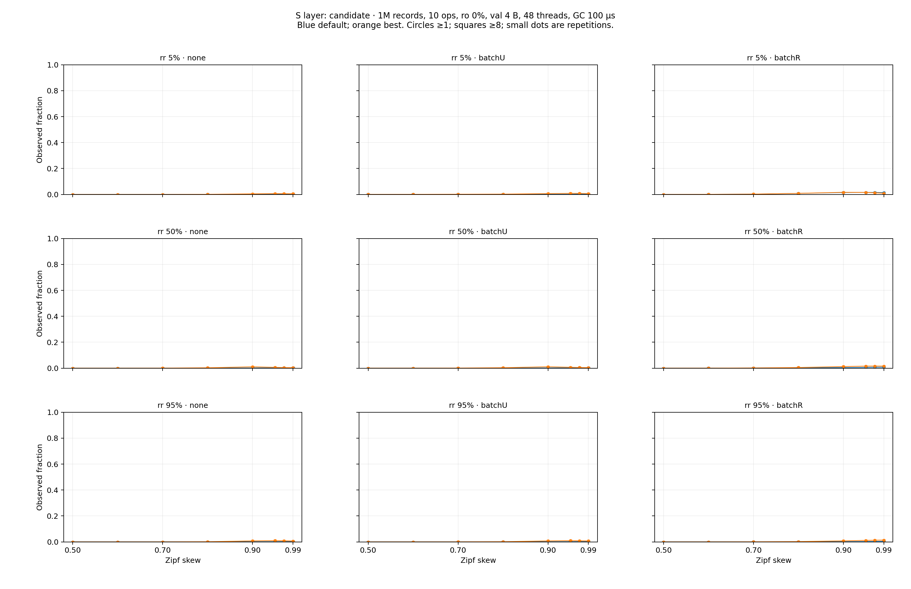
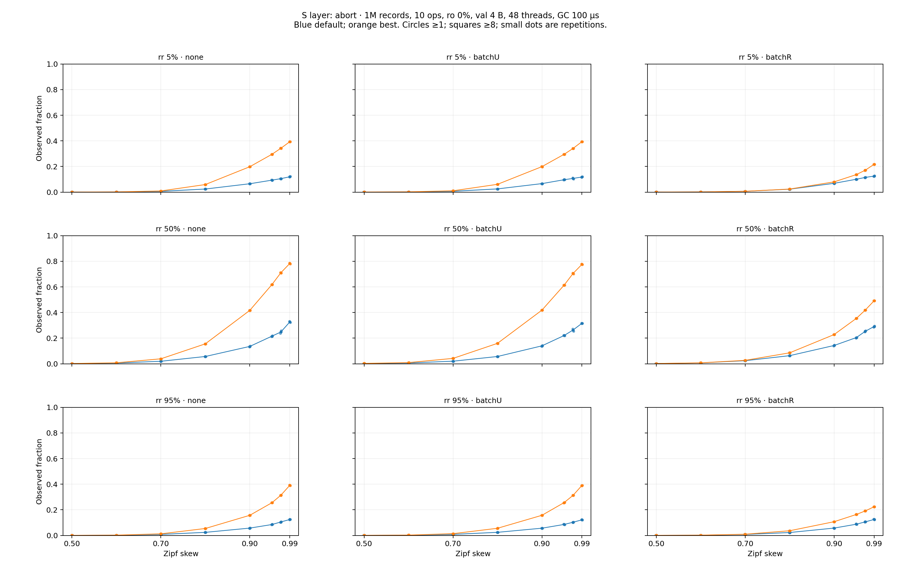
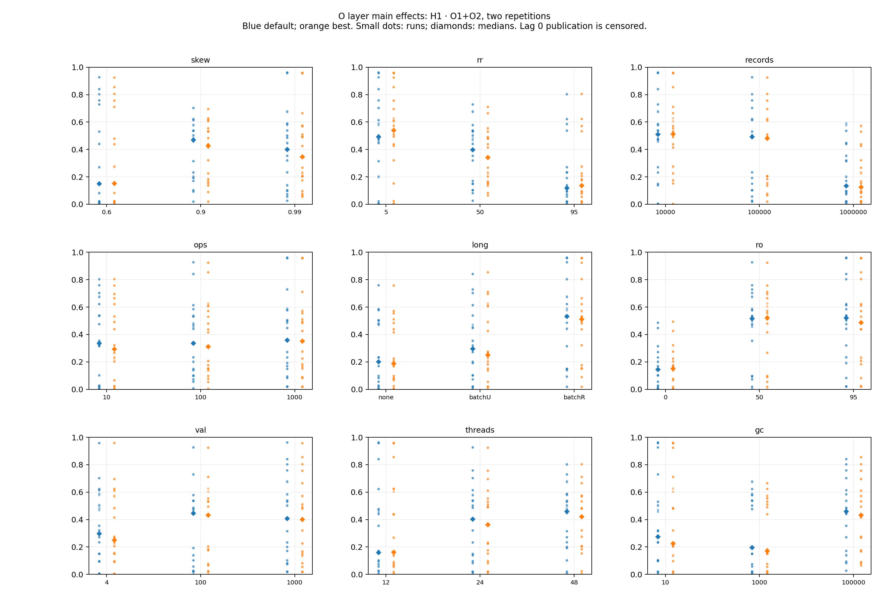
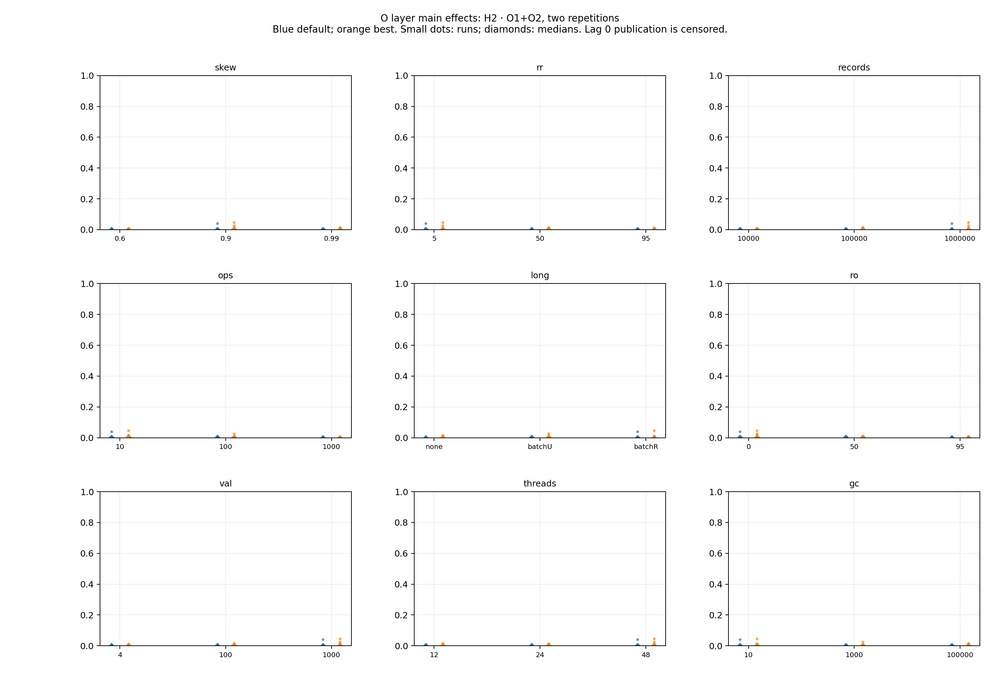
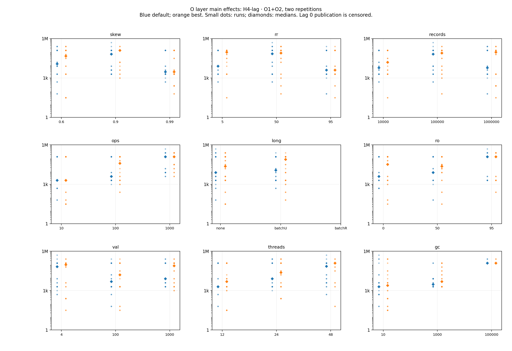
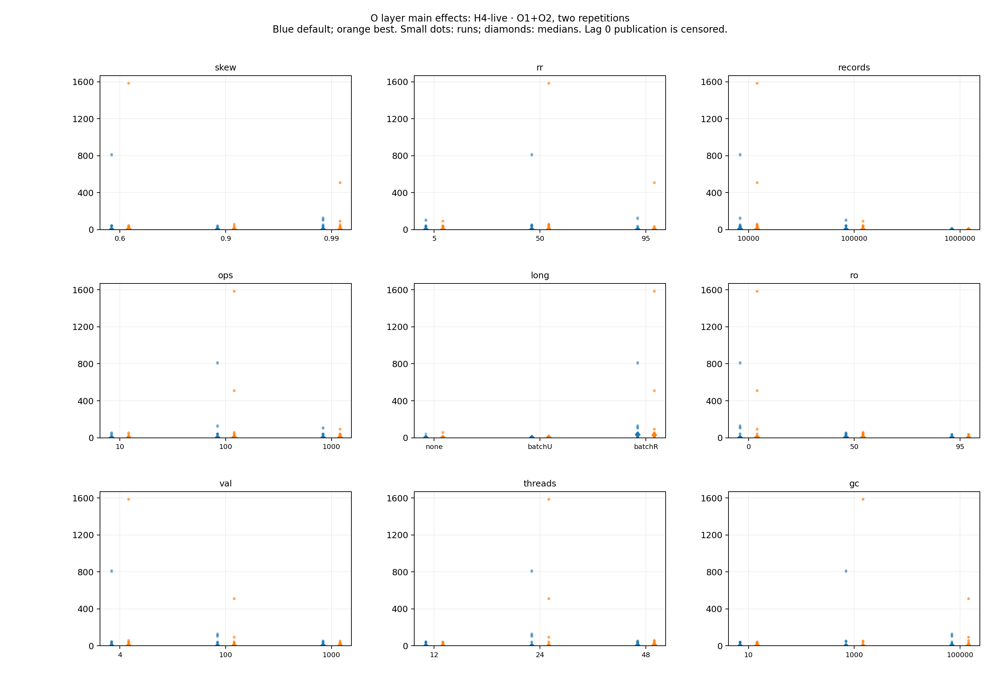

# VHash md_29: 提案が Cicada に勝てる負荷の範囲を広く探す — 第 1 段 (伸びしろの上限のふるい分け)

VHash 論文 (`docs/paper-story-vhash/`) の第 2 段 (機構を比較相手と直接比べる別 wave) の候補領域を決めるための診断計測。
md_28 (偏りを 0.99 付近まで上げる) を本 wave に含める。stock Cicada (CCBench gitlink 68106660) に既定 inert の計器 patch
`patches/instr-cicada-version-lifetime.patch` を当て、H1 (hot 配置 B)・H2 (前進 C)・H4 (GC 接続 E) の**伸びしろの上限**を多次元で測る。
**計器入り build の値であり、throughput は性能値ではない。正しさ (serializability) の主張はしない。**
ここでいう「上限」は観測時点の頻度・機会量であり、機構を実装したときの性能向上率ではない。

## 0. 結論 (図から)

126 点 × 2 genome × 2 反復 = 504 走 (2026-09-30、Pegasus 計算ノード 6 台に同時刻で分割) をすべて取り、登録した述語と候補選択 (§1) を機械的に当てた。
負ける領域も含む全点表は `analysis/all_points.csv` (252 行)、集計は `analysis/summary.md`。

1. **伸びしろが最も大きく、しかも一貫しているのは H4 (GC 接続) で、原因は「長い read-only tx を 1 worker が続けること」である。**
   1000 操作の read-only tx を batch worker 1 本が続ける条件 (batchR) では、84 行 (点 × genome) のすべてで 3 秒間の MinRts の公開が 0 回だった
   (長い tx なし・batchU の 168 行では 0 回は 1 行も無い)。そのとき論理生存版数は record 数の 5.4〜14.5 倍 (層 S)、層 O では 1.3〜1,587 倍になり、
   熱いキー (zipf の頻度順位 0〜7) の版の列は最長 1,093,228 版 (層 S、rr 95・skew 0.99・最良設定、2 反復平均) に伸びた。これは md_22 が示した stock Cicada の欠陥
   (read-only commit は GC flag を上げない) の、負荷の空間の広い範囲での現れである。
2. **長い tx が無ければ、最良設定の Cicada では境界の遅れは小さい。** 層 S (gc_inter_us 100 µs) の境界年齢 p50 は、最良設定で 128〜512 µs
   (長い tx なし)、既定で 512〜4,096 µs だった。H4-lag の通過は層 S の既定 46 行に対し最良 3 行で、**既定で H4 が「大きく」見える点の多くは
   既定の公開が遅いことによる**。第 2 段の比較相手 (最良設定) に対する H4 の伸びしろは、長い tx (batchR・batchU) か長い GC 間隔の領域に限られる。
3. **H1 (hot 配置) の伸びしろは、read-only 側 (古い snapshot) と、最良設定での高偏り・多操作の update read にある。** 層 O の水準別中央値で、
   全 read の位置 ≥ 1 の割合 h1 は batchR で 0.51〜0.53、read-only 指定率 50・95% で 0.49〜0.52、record 1 万で 0.51 (いずれも長い tx なし・ro 0%・
   record 100 万では 0.12〜0.20)。update read の位置 ≥ 1 の割合 u1 は、層 S の最良設定・長い tx なしで skew 0.99 のとき 0.10〜0.22 (既定は 0.04〜0.08)、
   層 O の操作 1000 で中央値 0.20 だった。一方で位置 ≥ 8 はまれで、層 S の batchR 以外では最大 0.027。
4. **H2 (前進) の伸びしろは全域で小さい。** h2 (候補数 / update read) の最大は 0.046 (層 O の O2-12、最良設定)、通過は層 S で既定 4 / 最良 12 行 (各 72 行中)、
   層 O で既定 1 / 最良 6 行 (各 54 行中)。**偏りを上げると深い update read は増えるが、深い read のうち前進候補がある割合は下がる**
   (層 S・rr 50・長い tx なし・最良設定で 0.79 (skew 0.5) → 0.017 (skew 0.99))。md_28 の問い「0.99 付近で前進の余地が増えるか」への答えは
   「深さは増え、候補の割合は減り、積 (h2) は 0.01 前後で頭打ち」である。
5. **最良設定は高偏りで abort が多い。** 層 S の abort 率は最良設定で最大 0.78 (rr 50・skew 0.99)、既定で最大 0.33。abort の理由の最多は既読一致の
   失敗 (read_match、層 S の既定 59%・最良 36%) で、次いで precheck と書き込み rts。
6. **第 2 段の候補領域 (§4) は規則どおり 5 個選ばれ、実質 4 領域**: (a) H1: 読み比率 5%・batchR、(b) H1: read-only 指定率 95%・thread 12、
   (c) H2: 読み比率 5%・batchR・skew 0.9〜0.97 (選ばれた 2 区間は包含関係)、(d) H4: batchR・read-only 指定率 0%。
   4 つのうち 3 つが batchR を含み、**「長い read-only tx が 1 本ある」ことが、提案が Cicada に勝ちうる最大の条件**である。

**この結果から読み取ってはならないこと。** 値はすべて計器入り build の観測で、Cicada の性能や「VHash が速くなる」ことは言っていない。
「上限」は、機構が完全に働いた場合でも取れる機会の大きさであり、実装したときの効果ではない (md_23 は hot 配置 B が ro 95% でも差なし、更新を含むと悪化と実測した)。
batchR の H4 は stock の欠陥込みの値で、比較相手に ro-gcflag 修正を入れた場合 (T-2933) の値は本計器では見積もれない (§3.4)。

## 1. 登録した手順 (結果を見る前に固定し、以後変えない)

本節は計測の投入前に commit した。点の選び方・述語・候補の選び方は、結果を見てから変えない。
都合のよい点だけを選ぶ誤りを避けるため、**負ける領域 (伸びしろが小さい点) も含めて全点を報告する。**
段 4 裁定の逐語は `verbatim/s4-ruling.md`。

### 1.1 比較相手 (genome)

| 名前 | BACK_OFF | INLINE_VERSION_OPT | INLINE_VERSION_PROMOTION | REUSE_VERSION | WRITE_LATEST_ONLY | 使う点 |
|---|---|---|---|---|---|---|
| default (CMake 既定) | 1 | 0 | 1 (OPT=0 では無効) | 1 | 0 | 全点 |
| tuned (md_11 の観測最良 BEST) | 0 | 1 | 0 | 1 | 0 | 1 tx の操作数 10 の点 |
| best100 (md_11 の 100 操作型の観測最良) | 0 | 0 | 0 | 0 | 0 | 操作数 100・1000 の点 |

全点を default と「負荷の最良」の 2 通りで測る。md_11 が最良を観測したのは操作数 10 と 100 だけなので、
**操作数 1000 への best100 の適用は外挿**である。gc_inter_us は軸なので最良の GC 間隔には固定しない。

### 1.2 点の選び方

計 126 点 × 2 genome × 2 反復 = 504 走。各走は extime 3 秒、clocks_per_us 2100。

- **層 S (偏りの格子、72 点):** skew {0.5, 0.6, 0.7, 0.8, 0.9, 0.95, 0.97, 0.99} × 読み比率 rr {5, 50, 95} × 長い tx {なし, batchU, batchR}。
  他の軸は中心値 (record 1,000,000・1 tx の操作数 10・read-only 指定率 0%・値 4 B・thread 48・gc_inter_us 100)。
  skew 0.995・0.999 は足さない (0.99 は YCSB 本体の既定の zipf 定数で、それを超える値は予算と現実性で外した)。
- **層 O (多次元の直交表、54 点):** 9 因子 × 3 水準の L27 (強さ 2) を列の割付を変えて 2 本 (O1・O2)。
  行 (a, b, c) ∈ GF(3)^3 に対し列 a, b, c, a+b, a+2b, a+c, a+2c, b+c, b+2c を作り、O1 は因子 f を列 f に、O2 は因子 f を列 (f+4) mod 9 に割り付け、
  水準を因子ごとに (1, 2, 1, 2, 1, 2, 1, 2, 1) だけずらした。任意の 2 列で 9 通りの組が各 3 回出ること、各因子の各水準が各表で 9 回出ること、
  O1 と O2 に同じ点が無いことを生成時に検査した。2 因子交互作用は分離できない (強さ 2 の限界)。生成器の逐語は `verbatim/make-design-source.md`。

| 因子 | 水準 |
|---|---|
| skew | 0.6, 0.9, 0.99 |
| 読み比率 rr (update tx の操作のうち読み) | 5, 50, 95 |
| record 数 | 10,000, 100,000, 1,000,000 |
| 1 tx の操作数 (全 worker) | 10, 100, 1000 |
| 長い tx (batch worker 1 本) | なし, batchU (1000 操作の update tx を続ける), batchR (1000 操作の read-only tx を続ける) |
| read-only 指定率 (izanagi_ronly_pct) | 0, 50, 95 % |
| 値の大きさ (CCBENCH_VAL_SIZE) | 4, 100, 1000 B |
| thread 数 (総 worker) | 12, 24, 48 |
| gc_inter_us | 10, 1,000, 100,000 |

長い tx ありの点は通常 worker を thread − 1 本、batch worker を 1 本にし、batch_max_ope = 1000 とする。
長い tx は計器 patch の配線 (batch worker は `begin()` で操作を 1000 まで伸ばし、izanagi_long_kind = 1/2 で update / read-only にする) で作る。
読み取り後に待つ型 (W5) と TPC-C は依頼どおり後段に回し、待つ型の配線は使わない。
record 数は負荷の「熱さ」の軸として扱う (1 万・10 万は md_2 の calibrator が決めた 100 万とは目的が別)。cache に収まるかは主張しない。

層 O の条件表 (54 点):

| 表-行 | skew | rr | record | 操作 | 長い tx | ro % | 値 B | thread | gc µs |
|---|---|---|---|---|---|---|---|---|---|
| O1-00 | 0.6 | 5 | 10,000 | 10 | なし | 0 | 4 | 12 | 10 |
| O1-01 | 0.6 | 5 | 100,000 | 10 | なし | 50 | 1000 | 24 | 100,000 |
| O1-02 | 0.6 | 5 | 1,000,000 | 10 | なし | 95 | 100 | 48 | 1,000 |
| O1-03 | 0.6 | 50 | 10,000 | 100 | batchR | 0 | 4 | 24 | 1,000 |
| O1-04 | 0.6 | 50 | 100,000 | 100 | batchR | 50 | 1000 | 48 | 10 |
| O1-05 | 0.6 | 50 | 1,000,000 | 100 | batchR | 95 | 100 | 12 | 100,000 |
| O1-06 | 0.6 | 95 | 10,000 | 1000 | batchU | 0 | 4 | 48 | 100,000 |
| O1-07 | 0.6 | 95 | 100,000 | 1000 | batchU | 50 | 1000 | 12 | 1,000 |
| O1-08 | 0.6 | 95 | 1,000,000 | 1000 | batchU | 95 | 100 | 24 | 10 |
| O1-09 | 0.9 | 5 | 10,000 | 100 | batchU | 50 | 100 | 12 | 10 |
| O1-10 | 0.9 | 5 | 100,000 | 100 | batchU | 95 | 4 | 24 | 100,000 |
| O1-11 | 0.9 | 5 | 1,000,000 | 100 | batchU | 0 | 1000 | 48 | 1,000 |
| O1-12 | 0.9 | 50 | 10,000 | 1000 | なし | 50 | 100 | 24 | 1,000 |
| O1-13 | 0.9 | 50 | 100,000 | 1000 | なし | 95 | 4 | 48 | 10 |
| O1-14 | 0.9 | 50 | 1,000,000 | 1000 | なし | 0 | 1000 | 12 | 100,000 |
| O1-15 | 0.9 | 95 | 10,000 | 10 | batchR | 50 | 100 | 48 | 100,000 |
| O1-16 | 0.9 | 95 | 100,000 | 10 | batchR | 95 | 4 | 12 | 1,000 |
| O1-17 | 0.9 | 95 | 1,000,000 | 10 | batchR | 0 | 1000 | 24 | 10 |
| O1-18 | 0.99 | 5 | 10,000 | 1000 | batchR | 95 | 1000 | 12 | 10 |
| O1-19 | 0.99 | 5 | 100,000 | 1000 | batchR | 0 | 100 | 24 | 100,000 |
| O1-20 | 0.99 | 5 | 1,000,000 | 1000 | batchR | 50 | 4 | 48 | 1,000 |
| O1-21 | 0.99 | 50 | 10,000 | 10 | batchU | 95 | 1000 | 24 | 1,000 |
| O1-22 | 0.99 | 50 | 100,000 | 10 | batchU | 0 | 100 | 48 | 10 |
| O1-23 | 0.99 | 50 | 1,000,000 | 10 | batchU | 50 | 4 | 12 | 100,000 |
| O1-24 | 0.99 | 95 | 10,000 | 100 | なし | 95 | 1000 | 48 | 100,000 |
| O1-25 | 0.99 | 95 | 100,000 | 100 | なし | 0 | 100 | 12 | 1,000 |
| O1-26 | 0.99 | 95 | 1,000,000 | 100 | なし | 50 | 4 | 24 | 10 |
| O2-00 | 0.9 | 95 | 100,000 | 1000 | batchU | 95 | 100 | 48 | 1,000 |
| O2-01 | 0.9 | 5 | 10,000 | 10 | なし | 95 | 100 | 12 | 1,000 |
| O2-02 | 0.9 | 50 | 1,000,000 | 100 | batchR | 95 | 100 | 24 | 1,000 |
| O2-03 | 0.6 | 95 | 100,000 | 10 | batchR | 95 | 1000 | 48 | 100,000 |
| O2-04 | 0.6 | 5 | 10,000 | 100 | batchU | 95 | 1000 | 12 | 100,000 |
| O2-05 | 0.6 | 50 | 1,000,000 | 1000 | なし | 95 | 1000 | 24 | 100,000 |
| O2-06 | 0.99 | 95 | 100,000 | 100 | なし | 95 | 4 | 48 | 10 |
| O2-07 | 0.99 | 5 | 10,000 | 1000 | batchR | 95 | 4 | 12 | 10 |
| O2-08 | 0.99 | 50 | 1,000,000 | 10 | batchU | 95 | 4 | 24 | 10 |
| O2-09 | 0.99 | 5 | 1,000,000 | 1000 | batchU | 0 | 100 | 48 | 100,000 |
| O2-10 | 0.99 | 50 | 100,000 | 10 | なし | 0 | 100 | 12 | 100,000 |
| O2-11 | 0.99 | 95 | 10,000 | 100 | batchR | 0 | 100 | 24 | 100,000 |
| O2-12 | 0.9 | 5 | 1,000,000 | 10 | batchR | 0 | 1000 | 48 | 10 |
| O2-13 | 0.9 | 50 | 100,000 | 100 | batchU | 0 | 1000 | 12 | 10 |
| O2-14 | 0.9 | 95 | 10,000 | 1000 | なし | 0 | 1000 | 24 | 10 |
| O2-15 | 0.6 | 5 | 1,000,000 | 100 | なし | 0 | 4 | 48 | 1,000 |
| O2-16 | 0.6 | 50 | 100,000 | 1000 | batchR | 0 | 4 | 12 | 1,000 |
| O2-17 | 0.6 | 95 | 10,000 | 10 | batchU | 0 | 4 | 24 | 1,000 |
| O2-18 | 0.6 | 50 | 10,000 | 1000 | batchU | 50 | 100 | 48 | 10 |
| O2-19 | 0.6 | 95 | 1,000,000 | 10 | なし | 50 | 100 | 12 | 10 |
| O2-20 | 0.6 | 5 | 100,000 | 100 | batchR | 50 | 100 | 24 | 10 |
| O2-21 | 0.99 | 50 | 10,000 | 10 | batchR | 50 | 1000 | 48 | 1,000 |
| O2-22 | 0.99 | 95 | 1,000,000 | 100 | batchU | 50 | 1000 | 12 | 1,000 |
| O2-23 | 0.99 | 5 | 100,000 | 1000 | なし | 50 | 1000 | 24 | 1,000 |
| O2-24 | 0.9 | 50 | 10,000 | 100 | なし | 50 | 4 | 48 | 100,000 |
| O2-25 | 0.9 | 95 | 1,000,000 | 1000 | batchR | 50 | 4 | 12 | 100,000 |
| O2-26 | 0.9 | 5 | 100,000 | 10 | batchU | 50 | 4 | 24 | 100,000 |

### 1.3 測る値

md_2 と同じ定義 (md_2 一次資料 §2) の、site 別の版探索の位置 (read_update・read_ronly・write・validation)、K = 1, 2, 4, 8 の「奥へ行く割合」、
観測時点の楽観的な前進候補率、MinRts の公開回数と境界年齢、論理生存版数。本 wave で計器に足すもの: abort 理由 (1 試行 1 件、最初に失敗を確定した箇所、
書き込み時の早期 abort 2 種・precheck・RMW/DELETE の最新確認・既読一致・書き込み rts・node set・その他)、走行末の key 0〜7 (zipf の頻度順位の上位) の版の列の長さ、
版 1 個と値の確保単位の大きさ (論理生存版の bytes の見積りに使う)、各走の子 process の maxrss。
T-2933 (比較相手に ro-gcflag 修正を入れるか、ユーザー確認待ち) の 2 場合として、H4 の表に stock の観測値と、md_15 と同じ定義の
時刻分割による ro flag 機会 (local_flag_opportunity) を並べる。後者は介入した場合の境界年齢ではない。

### 1.4 伸びしろの述語 (点 × genome ごと)

状態は 通過 / 境界 (2 反復の片方だけ通過) / 不通過 / 判定不能 (rc ≠ 0・timeout・parse 失敗・分母の下限未満) の 4 つ。

| H | 指標 | 通過の条件 | 分母の下限 |
|---|---|---|---|
| H1 (hot 配置) | h1 = read_update と read_ronly のうち位置 ≥ 1 の件数 / 両 site の read 全件、u1 = read_update の位置 ≥ 1 の割合 | h1 ≥ 0.10 または u1 ≥ 0.05 | read 全件 ≥ 10,000 (u1 は read_update ≥ 10,000 のときだけ使う) |
| H2 (前進) | h2 = 楽観的候補数 (K = 1) / read_update 全件 | h2 ≥ 0.01 かつ 候補件数 ≥ 100 かつ update commit ≥ 1,000 / 走 | read_update ≥ 10,000 |
| H4-lag (GC 接続: 境界の遅れ) | 境界年齢 p50 の bucket 上界 | ≥ 1,024 µs、または MinRts 公開 0 回 (「停止」= 右打ち切り、通過として別表示) | — |
| H4-live (GC 接続: 版の蓄積) | 論理生存版数 / record 数 | ≥ 1.1 | — |

H4 は H4-lag と H4-live を別々に判定し、どちらかで通過とする。abort 率と理由は併記するが述語には使わない。

### 1.5 第 2 段へ送る候補領域の選び方

全点 × 2 genome の状態表を全件公開したうえで、次の規則で選ぶ。

- 領域 = 層 O では 1 因子の 1 水準、または 2 因子の水準の組。層 S では (rr, 長い tx) を固定した skew の連続区間。
- 採用条件: (a) 層 O の 2 因子の組は O1・O2 の両方で支持 3 点中 2 点以上が通過 (1 水準の領域は両方で 9 点中 6 点以上)、
  層 S の区間は区間内の全 skew 水準で通過し長さ 2 水準以上。(b) default と最良の両 genome で (a) が成り立つ。
- H ごとに (a)(b) を満たす領域を通過率・指標の中央値の順に並べ、H1・H2・H4 から最大 2 個ずつ、計 3〜5 個を採る。
  指標は H1 = h1、H2 = h2。H4 は通過率の次に「境界年齢 p50 の bucket 上界の中央値 (公開 0 回 = 停止は無限大として扱う)」、
  その次に論理生存版数 / record 数の中央値で並べる (2026-09-30 13:3x、段 6 レビューの指摘を受けて計測の投入前に明記。結果は未取得)。
  満たす領域が 3 個未満なら不足と書き、最も近い領域を「未達」と明記して並べる。
- 各領域に、確かめるべき機構 (前進 C・GC 接続 E = md_21、hot 配置 B = md_23、区間 GC = md_18、read-only commit の公開 = md_22) と、
  現実の用途との対応 (原典で確かめた範囲だけ) を書く。

### 1.6 予算と縮小順

先に smoke 1 job で、既定 build の inert witness (正規化 objdump・rodata・nm・strings)、全 build キー (genome × 値の大きさ) の build 所要、
極端条件の 1 走所要と maxrss を測る。**smoke の所要時間と maxrss だけ**から本計測の見積りを出し (伸びしろの値は見ない)、
焦点走・変異・受入の見込みと合わせて 2 node 時間以上になるなら、(1) O2 を落とす、(2) 層 S の skew 0.5・0.7 を落とす、の順に縮める。
それでも超えるなら投入せず、見積りを書いて止める。

## 2. 実行の記録 (登録した手順に対して実際に行ったこと)

- **smoke** (commit 5b5238671、計測木 `vws-meas-s0`): 3 回目 (37961.nqsv、Elapse 111 s) で全段成立。既定 build の正規化 `objdump -d` と `.rodata` が stock と一致
  (sha256 `be7575a2…` / `98d55b26…`、`raw/smoke3.json.gz`)、stock・既定・計器入り・調整済み計器入りの 4 build、較正 (record 1,000,000、D15 第二基準)、schema 2 の短い走。
  - 1 回目 (37898.nqsv、Elapse 61 s、commit 4449cd02a): condition gate が計器入り build を拒否した (VLIFE の owner TU の分岐宣言 49 に対し実数 44。段 5 の fix で分岐を header へ移したとき件数 pin を戻し忘れた)。
  - 2 回目 (37937.nqsv、Elapse 99 s、commit 6ee05af4e): gate は通ったが、計器入り build が `transaction.cc` の `YCSB` 型・`Storage::YCSB` 未宣言で compile error (熱いキー走査が ycsb.hh にだけある識別子を使っていた)。
  - どちらも計器 patch と condition gate の件数を直して取り直した。smoke 1・2 の値は結果に使っていない (raw は repo 外、sha256 は `raw/SHA256SUMS`)。
- **所要 probe** (37972.nqsv、Elapse 336 s、commit e8b59c51f、計測木 `vws-meas-p0`): 登録 §1.6 の「極端条件の所要と maxrss」。操作 1000・record 100 万の 12 条件 (default・best100、値 4 / 100 / 1000 B) と、
  tuned の値 100・1000 B の build を通す 2 条件、計 14 条件 × 2 反復 = 28 走。driver の smoke 内の旧式見積りではなく、この job の所要と maxrss だけを見た (伸びしろの値は見ていない)。
  - 28 走すべて rc = 0、schema 3 の parse 成功。1 走の wall は 3.6〜5.0 s、maxrss は 1.18〜9.03 GB (最大は tuned・値 1000 B・record 100 万・操作 10・batchR・gc 10 µs の O1-17)、build 1 本 22.6 s。
  - 見積り: 本計測 6 job で約 2,840 s (0.79 node 時間)。使用済み 607 s (smoke 3 回 + probe) と変異・焦点走の見込みを足して約 1.4 node 時間 < 2。**縮小 (§1.6) は適用していない。**
  - probe の raw は本計測の値に使わない (repo 外、sha256 は `raw/SHA256SUMS`)。
  - 登録 §1.6 は「smoke 1 job で」と書いたが、実際は smoke 1 job (inert witness と既存 4 build) と所要 probe 1 job (W 条件の build キーと極端条件) の 2 job に分けた (段 6 裁定 S6-2、`verbatim/s6-ruling.md`)。
- **本計測** (commit e8b59c51f、計測木 `vws-meas-m0`〜`m5`、2026-09-30 14:17:42 JST に 6 job を同時投入、walltime 各 15 分):
  m0・m1・m2 = 層 S の rr 5・50・95 (各 48 条件 × 2 反復)、m3・m4・m5 = 層 O の値 4・100・1000 B (各 36 条件 × 2 反復)。
  job 37988・37989・37991・37992・37990・37993.nqsv、host bnode026・028・050・057・036・059 (dispatch 受領証)、Elapse 458・452・457・353・351・382 s (計 2,453 s)。
  504 走すべて rc = 0・計器行 (schema 3) の parse 成功・判定不能 0 行。6 job は互いに別ノードで、gen_S の request はノード専有。
- **作図・集計** (login、計測機の外): `tools/plotting/plot_vhash_workload_space.py` (commit e8b59c51f) に 6 本の raw を与えて図 7 枚と表を生成し、
  repo 外の集計 script (`verbatim/summarize-source.md`) で `analysis/summary.md` を作った。作図器は raw の stdout を driver の parser で再 parse して保存済みの値と照合する。

## 3. 結果

### 3.1 述語の状態の件数

| H | 層 | genome | 通過 | 停止 | 境界 | 不通過 |
|---|---|---|---|---|---|---|
| H1 | S | default | 15 | — | 0 | 57 |
| H1 | S | best | 32 | — | 1 | 39 |
| H1 | O | default | 42 | — | 0 | 12 |
| H1 | O | best | 43 | — | 0 | 11 |
| H2 | S | default | 4 | — | 0 | 68 |
| H2 | S | best | 12 | — | 0 | 60 |
| H2 | O | default | 1 | — | 0 | 53 |
| H2 | O | best | 6 | — | 0 | 48 |
| H4-lag | S | default | 46 | 24 | 0 | 2 |
| H4-lag | S | best | 3 | 24 | 2 | 43 |
| H4-lag | O | default | 33 | 18 | 0 | 3 |
| H4-lag | O | best | 31 | 18 | 0 | 5 |
| H4-live | S | default | 29 | — | 5 | 38 |
| H4-live | S | best | 24 | — | 1 | 47 |
| H4-live | O | default | 40 | — | 1 | 13 |
| H4-live | O | best | 42 | — | 1 | 11 |

判定不能は全 H で 0 行。層 O の H1 通過が多いのは、層 O の 2/3 の点が read-only 指定率 50・95% か batchR を含むためである (直交表の性質)。

### 3.2 偏りの軸 (層 S、md_28)

層 S の代表値 (2 反復平均、全 skew・全組は `analysis/summary.md` §2):

| rr | 長い tx | skew | genome | u1 | h1 | 位置 ≥ 8 | h2 | 候補 / 深い update read | abort 率 | 境界年齢 p50 µs | 生存版 / record |
|---|---|---|---|---|---|---|---|---|---|---|---|
| 50 | なし | 0.5 | default | 7.6e-05 | 7.6e-05 | 1.8e-07 | 1.1e-05 | 0.15 | 0.0018 | 2,048 | 1.12 |
| 50 | なし | 0.5 | best | 1.9e-05 | 1.9e-05 | 8.0e-08 | 1.5e-05 | 0.79 | 0.0021 | 128 | 1.01 |
| 50 | なし | 0.9 | default | 0.027 | 0.027 | 5.4e-05 | 0.0014 | 0.050 | 0.14 | 2,048 | 1.01 |
| 50 | なし | 0.9 | best | 0.058 | 0.058 | 5.3e-04 | 0.010 | 0.18 | 0.42 | 256 | 1.01 |
| 50 | なし | 0.99 | default | 0.082 | 0.082 | 8.0e-04 | 0.0033 | 0.041 | 0.33 | 1,024 | 1.00 |
| 50 | なし | 0.99 | best | 0.22 | 0.22 | 0.027 | 0.0037 | 0.017 | 0.78 | 128 | 1.00 |
| 5 | batchR | 0.9 | default | 0.027 | 0.077 | 0.033 | 0.015 | 0.54 | 0.069 | 停止 | 12.2 |
| 5 | batchR | 0.9 | best | 0.029 | 0.087 | 0.040 | 0.016 | 0.56 | 0.080 | 停止 | 11.4 |
| 95 | batchR | 0.99 | best | 0.050 | 0.050 | 0.0041 | 0.014 | 0.27 | 0.22 | 停止 | 12.6 |

- skew を 0.9 → 0.99 に上げると、update read の位置 ≥ 1 は既定で約 3.0 倍 (0.027 → 0.082)、最良で約 3.7 倍 (0.058 → 0.22) になる (rr 50・長い tx なし)。位置 ≥ 8 は最良・skew 0.99 でも 0.027。
- 深い update read のうち前進候補がある割合は skew と共に下がる。h2 (積) は層 S で最大 0.016 (rr 5・batchR・skew 0.9・最良)。
- 熱いキー 0 の版の列の長さ (長い tx なし、gc 100 µs) は skew 0.9〜0.99 で 73〜1,538 版。batchR では key 0〜7 の最大が 1,093,228 版に達した。
  質量の半分を占める key 数 (zipf の式による解析値、実現した頻度ではない) は skew 0.5 で 250,365、0.9 で 8,184、0.99 で 970。

### 3.3 軸ごとの伸びしろの地図 (層 O、主効果)

水準別の中央値 (各水準 18 点、全因子・全水準は `analysis/summary.md` §3)。強さ 2 の直交表なので、主効果は他因子について釣り合っているが、2 因子交互作用とは分離できない。

| 因子 | 伸びしろが大きい側 | 小さい側 | 主な値 (h1 / u1 / 生存版比 の中央値、default) |
|---|---|---|---|
| 長い tx | batchR | なし | h1 0.53 vs 0.20、生存版比 36 vs 1.4、境界年齢は batchR で停止 |
| read-only 指定率 | 50・95% | 0% | h1 0.52・0.52 vs 0.15。u1 は逆に 0% が最大 (0.11) |
| record 数 | 1 万・10 万 | 100 万 | h1 0.51・0.50 vs 0.13、生存版比 10.0 vs 1.2 |
| 1 tx の操作数 | 1000 | 10 | u1 0.20 vs 0.012 (abort 率 0.86 vs 0.009) |
| thread 数 | 48 | 12 | h1 0.46 vs 0.16、u1 0.11 vs 0.032 |
| gc_inter_us | 100,000 | 1,000 | h1 0.46 vs 0.20、生存版比 4.2 vs 1.5 |
| skew | 0.9・0.99 | 0.6 | h1 0.47・0.40 vs 0.15、u1 0.075 vs 0.0066 |
| 読み比率 | 5・50% | 95% | h1 0.50・0.40 vs 0.12 |
| 値の大きさ | (差は小さい) | — | h1 0.30〜0.45 |

H2 は全水準で中央値 0.004 以下 (最良設定・操作 10 で 0.0040)。

### 3.4 H4 と T-2933 (比較相手に ro-gcflag 修正を入れるか) の 2 場合

- **stock の観測:** batchR の 84 行すべてで公開 0 回 (境界年齢は定義されない = 停止)。batchR 以外の 168 行で公開 0 回は無い。
- **時刻分割による ro flag 機会 (md_15 と同じ定義、介入した場合の値ではない):** 公開がある行でだけ定義され、batchR の 84 行では定義できない (空)。
  層 O の batchR 以外では、read-only 指定率 95% の中央値が既定 0.09・最良 0.27 (最大 0.97)、50% で 0.02、0% で 0。
- したがって **batchR の点で比較相手に ro-gcflag 修正を入れた場合の境界年齢は、本 wave の計器では見積もれない。** md_22 が variant で実測した値
  (長い ro 10 ms 下で公開が 289〜299 回 / 3 秒に戻り、境界年齢は 12.5〜14.3 ms 残る) を参照する。表は `analysis/h4_stock_local_flag.md`。

### 3.5 abort 理由

| 層 | genome | abort 合計 | 早期 wts | 早期 rts | precheck | 最新確認 | 既読一致 | 書き込み rts | node set |
|---|---|---|---|---|---|---|---|---|---|
| S | default | 32,013,635 | 0.017 | 0.062 | 0.158 | 0.007 | 0.586 | 0.169 | 0.000 |
| S | best | 407,275,365 | 0.085 | 0.055 | 0.249 | 0.042 | 0.362 | 0.207 | 0.000 |
| O | default | 6,932,258 | 0.049 | 0.060 | 0.286 | 0.021 | 0.497 | 0.087 | 0.000 |
| O | best | 47,277,204 | 0.089 | 0.095 | 0.388 | 0.019 | 0.312 | 0.097 | 0.000 |

分類外 (other) は全行 0 件。理由の合計 = abort 数は driver が走ごとに検査した。

## 4. 第 2 段の候補領域

規則 (§1.5) で選ばれた領域 (`analysis/candidates.md`)。H2 の 2 個は包含関係にあり、実質 4 領域である (規則は重なりを禁じていない。領域の数は結果を見て変えない)。

| # | H | 層 | 領域 | 通過率 | 指標の中央値 | 確かめるべき機構 | 現実の用途との対応 (原典で確かめた範囲) |
|---|---|---|---|---|---|---|---|
| (a) | H1 | O | 読み比率 5%・batchR | 12/12 | h1 0.76 | 深い read の大半は長い read-only tx の古い snapshot からで、hot 配置 B (md_23) の対象外になりやすい。版の列を縮める区間 GC (md_18) と read-only commit の公開 (md_22) の効果、update 側の B | 書き込みの多い OLTP に分析 query が 1 本重なる HTAP。Steam は CH-benCHmark (OLAP 1 + OLTP 1) で平均の版の列の長さ 287.43 を報告 (`output/insights/2026-09-29/vhash-motivation-evidence/README.md` §1 の読んだ原典) |
| (b) | H1 | O | read-only 指定率 95%・thread 12 | 12/12 | h1 0.73 | read-only read の古い版探索に対する hot 配置 B。md_23 の ro 95% (thread 48) では差なしだったので、thread 数を下げた条件で B の上限と実測の差を確かめる | 読み中心の負荷。YCSB の workloadb は `readproportion=0.95`・`updateproportion=0.05` (操作単位の比率で、本 wave の tx 単位の read-only 指定率とは近似の対応) |
| (c) | H2 | S | 読み比率 5%・batchR・skew 0.9〜0.95 (と 0.9〜0.97) | 4/4 (6/6) | h2 0.015 | 前進 C と GC 接続 E (md_21 の E-max は skew 0.9 で no_room が約 75%)。h2 は 0.015 で、通過の閾値 0.01 を僅かに超えるだけ | 書き込みの多い高偏り負荷 + 長い read-only |
| (d) | H4 | O | batchR・read-only 指定率 0% | 12/12 | 境界年齢 停止、生存版比 69 | read-only commit の公開 (md_22) で公開の停止を解いた上で、残る「長い ro の snapshot が境界を押さえる分」に対する GC 接続 E (md_21) と区間 GC (md_18) | 長い read-only が GC を止める問題は PostgreSQL・MySQL・Aurora の公式文書と HANA・LeanStore が記述 (motivation-evidence §1) |

**選ばれなかったが近い領域 (未達):** 層 S の長い tx なし・batchU で、最良設定の u1 は skew 0.95 以上で 0.05 を超える (rr 5・50) が、既定は skew 0.99 でしか超えず、
S 層の区間 (2 水準以上・両 genome) の条件を満たさなかった。最良設定だけの領域として、高偏りの update read に対する hot 配置 B が候補になる。

## 5. 現実性 (評価に使う負荷がどこまで現実の用途に対応するか)

- **偏り:** YCSB 本体の zipf 生成器の既定定数は 0.99 (`site.ycsb.generator.ZipfianGenerator` の `ZIPFIAN_CONSTANT = 0.99`、2026-09-30 に GitHub の master で確認)、
  workloada は `requestdistribution=zipfian`・読み 0.5 / 更新 0.5。CCBench 論文は skew 0.6〜0.99 を解析範囲とし (Table 2)、Cicada 論文は
  「contended YCSB using 16 requests per transaction, 50% read/50% RMW, and Zipf skew of 0.99」を主な比較に使った。本 wave の層 S の上端 0.99 はこれらと一致し、
  0.99 を超える値は先行研究の範囲外なので測っていない。逐語は `verbatim/realism-notes.md`。
- **長い read-only tx:** 分析 query・閉じない cursor・`mysqldump --single-transaction` のような長い read-only が GC を止める問題は、製品の公式文書と研究
  (Steam、SAP HANA、LeanStore) が記述している (出典は `output/insights/2026-09-29/vhash-motivation-evidence/README.md` §1・§3)。
  本 wave の batchR は「1000 操作の read-only tx を 1 worker が連続して回す」形で、時間の長さ (数百 µs〜数 ms 規模) は分析 query より短い。
- **record 数 1 万・10 万、操作 1000:** CCBench 論文の解析範囲 (cardinality 10^3〜10^9、transaction size 10〜100) に対し、操作 1000 は範囲外 (md_2 と同じ長い tx の作り方)。

## 6. 何を確かめ、何を確かめていないか

**確かめたこと (実測):** 504 走すべて rc = 0・parse 成功。既定 build の inert (正規化 objdump・rodata、smoke3)。condition gate (supply・meaning) の受理 (smoke3)。
abort 理由の合計 = abort 数 (全走、driver の parser)。作図器が driver の parser で raw を再 parse して保存値と一致すること (全走)。

**確かめていないこと:**
- **正しさ:** 計器入り build に対して判定器を回していない。値は観測量で、正しさの主張はしない。
- **性能:** 計器入り build の throughput・wall は性能値に使わない (図にも出していない)。
- **機構の効果:** 「上限」は機会量。hot 配置・前進・GC 接続を実装したときの効果ではない (md_23 は B が ro 95% で差なし・更新で悪化と実測)。
- **物理メモリ:** 生存 bytes は論理生存版数 × (sizeof(Version) + sizeof(YCSB)) の見積り (`live_bytes_estimate`) で、allocator や再利用待ちの pool を含まない。maxrss は別に記録した。
- **熱いキーの頻度:** key 0〜7 は zipf の頻度順位の上位で、実現したアクセス頻度は数えていない。
- **交互作用:** 層 O は強さ 2 の直交表で、2 因子交互作用を分離できない。候補領域 (a)(b)(d) は 2 因子の組の通過率で選んだ。
- **反復:** 2 反復。閾値付近の点は「境界」状態に分けたが、2 反復で安定性を断定しない。
- **比較相手の最良設定:** 操作 1000 への best100 は md_11 の範囲外の外挿。gc_inter_us は軸で、最良の GC 間隔には固定していない。
- **T-2933:** batchR の点で ro-gcflag を入れた場合の値 (§3.4)。
- 読み取り後に待つ型 (W5) と TPC-C は測っていない (依頼で後段)。

## 7. 限界

- 計器は tx ごとに計数と rdtscp を足すので、試行数・公開回数の絶対水準は stock と違いうる (観測者効果)。
- 境界年齢は 2 倍刻みの bucket の上界 (md_2 と同じ)。
- 作図器は 3 反復以上の入力を受理するが、全点表の反復別の列は先頭 2 反復しか出さない (段 6 焦点再レビュー 2 の should、本 wave は 2 反復なので影響なし)。
- 領域選択の test は「default だけ通過」を拒否する向きしか突いていない (変異 MB4 が生存、§9)。「最良だけ通過」の向きは実装の対称なループに依る。
- batchR の長い tx は操作数で作った長さで、実時間の長さは点ごとに違う。

## 8. 生出力の所在

- raw (gzip -9、本 dir `raw/`): `measure-m0〜m5.json.gz` (本計測)、`smoke3.json.gz` (採用した smoke)。展開前の sha256 は `raw/SHA256SUMS`
  (smoke 1・2 と所要 probe の raw も sha256 だけ記録。実体は repo 外 `/work/SFC/tanab/tmp/vhash-workload-space-2026-09-30/raw/`、永続を保証しない)。
- 図 (`figures/`、PNG と provenance): skew_depth・skew_candidate・skew_abort・axes_h1・axes_h2・axes_h4_lag・axes_h4_live。生成器 `tools/plotting/plot_vhash_workload_space.py`。
- 表 (`analysis/`): all_points.csv / .md (全点)、candidates.md と candidate_status.json (候補)、h4_stock_local_flag.md (T-2933)、abort_reasons.csv、hot_chains.csv、summary.md (集計)。
  **CSV 3 本は改行を CRLF → LF に可逆正規化した** (作図器は Python csv の既定で CRLF を書き、`git diff --check` に抵触したため。可視文字は不変、LF を CRLF に戻すと原文と byte 一致)。
  原文 (作図器の出力、`provenance.json` が記録する形) の sha256 と byte 数: abort_reasons.csv `32b490f5ff0bd36bafed702837d0950dccbaebd5bcddf66308cd1763b09fc9d5` 380,983 B、
  all_points.csv `51a4b3bff23896b639af09fc59648de48a50e71bcdad9287021c2ddb1807a910` 1,991,053 B、hot_chains.csv `65682f081f8f792a4dcd60f3e3a6b0facac927bb56e3f2282efe4eb8bd4ea3aa` 589,155 B。
- 計算ノードの使用 (各 job の Elapse): smoke 61 + 99 + 111 s、所要 probe 336 s、本計測 2,453 s、変異の本走 445 s。合計 3,505 s (約 0.97 node 時間、2 node 時間未満)。
  受入全走は段 7 の後に別に取る。

## 9. 実装と検証の記録

- **変更 file:** 計器 patch `patches/instr-cicada-version-lifetime.patch` (schema 3: abort 理由 9 分類 × 通常 / 長い tx、走行末の key 0〜7 の鎖長を最後に破棄された
  TxExecutor が走査、val_size・sizeof の echo。分岐は owner TU と header だけ)、driver `orchestrator/campaign/vhash_cicada_vlife.py` (W 条件 252、build キー
  (genome, `CCBENCH_VAL_SIZE`)、genome best100、子 process の maxrss)、test `orchestrator/tests/test_vhash_cicada_vlife.py`、condition gate の VLIFE 件数
  (owner TU 37 → 44・header 9 → 12。owner TU の 44 は smoke 1 回目の拒否で確定した実数)、作図器 `tools/plotting/plot_vhash_workload_space.py` と test
  `orchestrator/tests/test_plot_vhash_workload_space.py`、`patches/README.md` (schema 3 の節)。`patches/ledger.json` は md_2・md_15 と同じ理由 (D18 第 4 類専用) で触っていない。
- **子の工数:** Codex plan 1・相談 1・author 3 (単位 A 2 = 初回が model call 上限 100 で打ち切り → 続き、単位 B 1)・fix 8 (A 3 = companion 位置 / 件数 / compile、
  B 5 = schema 合わせ / 段 6 所見 (1 回は sandbox の git checkout で無変更停止) / 焦点所見 (1 回は既存期待値で正しく停止))・review 2・焦点再レビュー 2。
  実装面の変更はすべて Codex `role=author`。
- **段 3 相談** (条件付き GO、must-fix 3 = md_28 の長い read が格子に無い / H4 が公開停止を見落とす / 候補の安定性) は全部採用 (`verbatim/s3-consult.md`、裁定 `verbatim/s4-ruling.md`)。
- **段 6 レビュー** A・B とも NO-GO (raw schema の不一致・abort 理由名・H4 の順位・機構の定型文・MB2 の配線・列不足)。S6-2 (driver の smoke に W の所要測定が無い) だけ
  refuted (親の運用で満たす)。焦点再レビュー 1 は NO-GO (候補率の分母・反復平均・固定列・結合 test)、2 は条件付き GO (3 反復以上の列 = nit、§7)。
  焦点所見の fix で、この wave が前回の fix で足した期待値 1 か所 (K=4 の候補率の分母 10000・率 .005) を登録定義 (位置 ≥ K の update read、500・.1) へ親の裁定で訂正した。
  逐語は `verbatim/s6-*.md`。
- **親の実測 (login の自走 harness、commit e8b59c51f の内容):** driver test 37 passed、作図器 test 15 passed、condition gate test 324 passed、test file 集合の meta-test 3 passed。
- **変異** (事前登録は段 4 の MA1〜MA5・MB1〜MB4 と段 6 の MB5・MB6): 期待 node は login の自走 probe (repo 外 `mutation/probe.py`、sha256 `61e8cf09…`) で集めた。
  各変異を wave 木へ注入して対象 test file を自走し、赤 node を記録して `git checkout --` で復元、HEAD blob と照合した (`mutation/probe-result-run2.json`、基準 2 file 緑)。
  1 回目の probe は親の script が子の環境変数を絞ったため基準走が赤になり中止した (`mutation/probe-result-attempt1-envbug.json`、変異は未注入)。
  **MB4 (領域選択が default genome を無視) は生存した**: test は「default だけ通過・最良は不通過」の向きしか作っておらず、default を無視しても最良の不通過で領域が落ちる (照準ずれ)。
  初回結果を残したまま、実効 gate へ再照準した MB4b (最良を無視) を登録し KILLED を確認した (`mutation/probe-result-mb4b.json`)。
  本走 (38121.nqsv、Elapse 445 s、固定 commit e8b59c51f の使い捨て worktree、source は計測木 `vws-meas-m0`、spec sha256 `c4e7398a…`): baseline PASSED、
  登録 12 = 記録 12、KILLED 11 (期待 node 完全一致)、SURVIVED 1 (MB4、登録どおり)。台帳 `mutation/ledger-final.json`。
  wrapper は最後の「共有木の観測 bytes が走行前後で不変」だけで rc=125 を返した (`mutation/ledger-final.json.wrapper-receipt.json`、child_rc=0)。走行中 (14:55〜15:03) に
  main checkout が変わったためで、並走 session の land と、親が 15:00 に行った消えた container の登録の prune (`git worktree prune`、候補は自分の 1 件だけと確認) の
  どちらが効いたかは特定していない。変異の結果は固定 commit の使い捨て worktree で取れている (md_2 §9 と同じ型)。
  その前の `--plan-only` 事前検査は spec を受理したが、使い捨て container の削除が Lustre の EINTR で止まり、`--resume` も rc=125 だったため、親が container を削除して
  自分の登録 1 件だけを prune した。
- **inert:** 既定 build の前処理一致 (test) と、smoke3 の正規化 objdump・rodata 一致 (`raw/smoke3.json.gz`)。
- **land 前の main 取り込み (2026-09-30):** 受入 1 回目 (tested main 5b7134c5c、tested tip c04b29b8e、child-green) の後、land 調整役の PREP で local main e5b9c1f77 を前方 merge したところ、
  文字の競合は 0 件だったが、main 側 (vhash-interval-gc) が足した `orchestrator/tests/test_condition_meaning_gate.py` の site 数の総和 pin が本 wave の VLIFE 37 → 44 を含まず赤になった
  (Codex 合成監査と合成後の login 自走で確認)。手で直さず abort し、同じ file を変えた lock-order-axis の着地 (main e863ea6c3、総和 pin 291) を待ってから main を 1 回取り込み、
  Codex が辞書 42 項目を数え直して総和 pin を 298 に書いた merge を作って全体受入を取り直した。同じ merge で patches/README.md の「owner TU 49」(段 5 途中の値の書き残し) を 44 に直した。
  合成後の login 自走: condition gate test 339 passed、driver test 37 passed、作図器 test 15 passed、test file 集合の meta-test 3 passed。

## 10. 次の版 (paper-story-vhash) へ

- **主条件は「長い read-only tx が 1 本ある」。** 候補 4 領域のうち 3 つが batchR を含み、stock Cicada では公開が止まり版が record の 5〜15 倍に溜まる。
  ただしこれは stock の欠陥 (md_22) を含むので、比較相手に ro-gcflag を入れるか (T-2933) で第 2 段の H4 の相手が変わる。論文では「欠陥込みの stock」と
  「欠陥を直した比較相手」を分けて書く必要がある。
- **H4 は既定と最良で見え方が違う。** 長い tx が無ければ最良設定の境界年齢は 128〜512 µs と小さく、既定を相手にした H4 の伸びしろは過大になる。
- **H2 (前進) を単独の売りにする根拠は、この空間には無い。** 偏りを上げると深い read は増えるが候補の割合が下がり、h2 は 0.01 前後で頭打ち。
- **H1 は read-only の古い snapshot と、最良設定の高偏り・多操作の update read。** md_23 の B は ro 95% (thread 48) で差なしだったので、
  候補 (b) (thread 12) と、最良設定だけで u1 が大きい高偏りの update 側を第 2 段で確かめる。
- 図: `figures/skew_depth.png` (偏りと深さ)、`figures/axes_h1.png`・`axes_h4_live.png` (軸ごとの地図)、候補表 §4。
